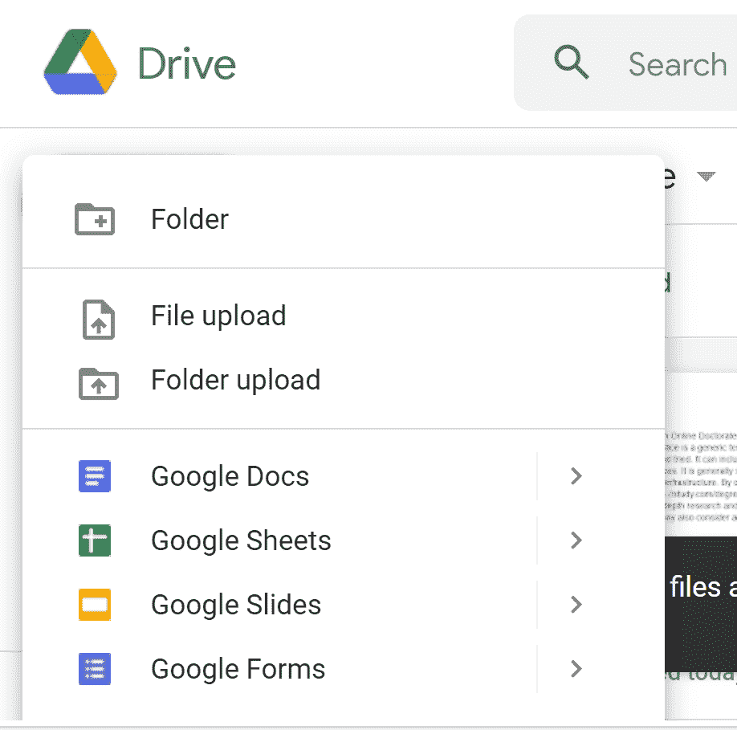
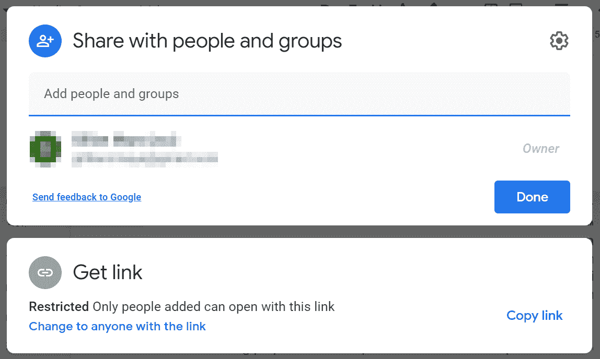
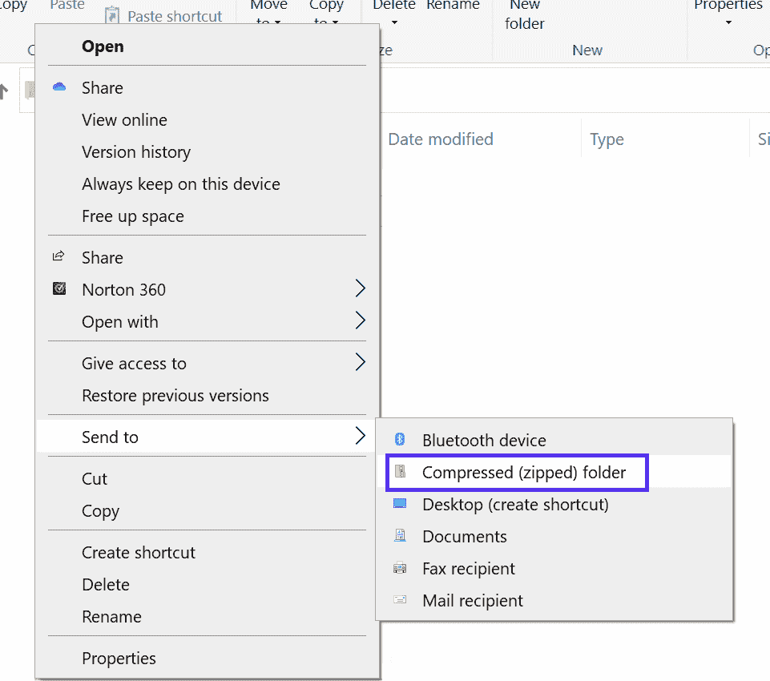
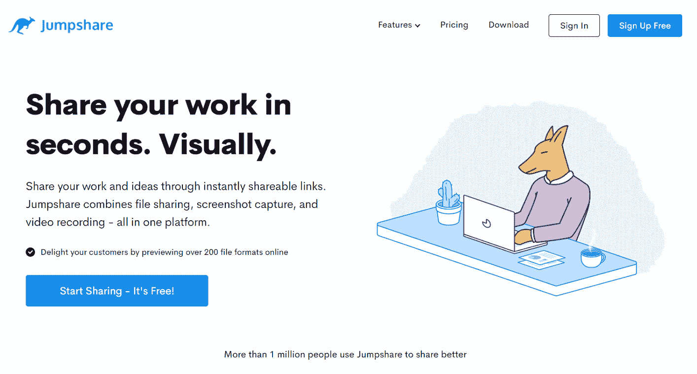
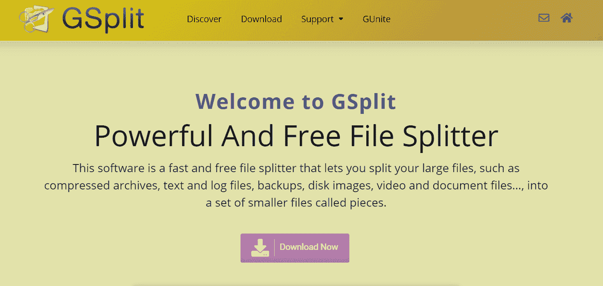

# Gmail 附件大小限制:如何通过电子邮件发送大文件(4 种简单方法)

> 原文：<https://kinsta.com/blog/gmail-attachment-size-limit/>

无论您是要发送重要的文档，还是只是分享家庭度假时的照片，发送附件都应该轻而易举。然而，Gmail 附件大小的限制会使这个过程有点困难。

幸运的是，有一种方法可以绕过这个障碍。通过了解您的电子邮件限制和附件选项，您应该可以轻松发送大文件。

在这篇文章中，我们将仔细看看电子邮件文件的大小限制。我们还将讨论顶级电子邮件提供商和客户的附件限制。然后，我们将向您展示通过电子邮件发送大文件的四种简单方法。

让我们开始吧！

### 查看我们的[视频指南](https://www.youtube.com/watch?v=9ONkkzUnlT0)通过电子邮件发送大文件

## 为什么电子邮件有文件大小限制

附件大小限制会限制您的交流。无论你是想发送视频还是 PDF，这些大小的限制都会妨碍你。

如果你使用[电子邮件处理业务](https://kinsta.com/blog/professional-email-address/)，这个问题会特别令人沮丧。最近的研究强调了[电子邮件营销](https://kinsta.com/blog/email-marketing-statistics/)给企业带来的显著好处。然而，如果限制阻止你按下“发送”，你就不能获得这些奖励

然而，电子邮件公司有这些规模限制是有原因的。一台服务器只能处理这么多请求。因此，它将无法处理同时发送的数千封巨大的电子邮件。这可能会导致整个系统崩溃。

[Whether you're delivering important documents or just sharing photos from a family vacation, sending attachments should be a breeze. ➡️ 📧 Let this guide help you navigate the attachment size limit 😌Click to Tweet](https://twitter.com/intent/tweet?url=https%3A%2F%2Fkinsta.com%2Fblog%2Fgmail-attachment-size-limit%2F&via=kinsta&text=Whether+you%27re+delivering+important+documents+or+just+sharing+photos+from+a+family+vacation%2C+sending+attachments+should+be+a+breeze.+%E2%9E%A1%EF%B8%8F+%F0%9F%93%A7+Let+this+guide+help+you+navigate+the+attachment+size+limit+%F0%9F%98%8C&hashtags=Gmail%2CEmailTips)

### 顶级电子邮件提供商的大小限制

每个电子邮件服务提供商都有自己的附件限制。让我们来看看一些最流行的提供商当前的文件大小限制:

*   **Gmail:** 25 MB。然而，Gmail 附件大小限制可能具有欺骗性，因为谷歌在发送电子邮件之前会将其编码为特定格式。这个过程会使附件的大小加倍；因此，实际的 Gmail 附件大小限制更接近 12.5 MB。
*   **Outlook:** 20 MB(所有版本上)。
*   **Hotmail:** 10 毫克。
*   **Mail.com:** 50 MB。但是，每个文件只能有 10 MB。
*   雅虎: 25 MB。
*   **Zoho:** 12 MB。每个文件只能是 10 MB。
*   **AOL:** 25 MB。
*   质子邮件: 25 MB。您最多可以发送 100 个单独的文件。

可以看到，范围比较广。然而，除了电子邮件附件限制，不同的公司提供不同的好处。因此，我们鼓励您在选择电子邮件提供商时考虑所有方面。

### 顶级电子邮件客户端的大小限制

重要的是要记住，电子邮件提供商不同于电子邮件客户端。提供商处理你的电子邮件数据，而客户更像是一个信使。用户可以访问他们的电子邮件客户端来查看他们的邮件。

电子邮件客户端通常采用应用程序的形式。但是，您可能有一个既是客户端又是提供商的应用程序，例如 Microsoft Outlook。

以下是流行的电子邮件应用程序的大小限制:

*   **Mozilla 雷鸟:**无限制。
*   **Windows Live Mail:** 每封邮件 10 GB。另外，每个文件不可能是> 50 MB。
*   **蝙蝠！:** 25 MB。

请记住，如果您使用不同的客户端和提供者，您必须了解这两个限制。因此，我们建议您仔细权衡每种服务的利弊，选择最适合您需求的服务。

## 如何通过电子邮件发送大文件(4 种简单方法)

现在您已经知道了附件大小的限制，是时候学习如何超过它们了！幸运的是，您有几个强大的选项可以选择。让我们仔细看看每一个。

### 1.使用云存储

[云存储](https://kinsta.com/blog/benefits-of-cloud-computing/)是一种将文件异地保存在服务器上的方式，只要你有互联网连接，你就可以从任何地方访问。这也意味着你可以使用云存储让人们访问你的文件。你所要做的就是把文档上传到云端，然后给你的收件人发送一个链接。

有很多项目提供这项服务。在 Kinsta，我们是 Google Drive 的忠实粉丝。让我们快速看一下如何使用这个工具来[共享视频](https://kinsta.com/blog/video-hosting/)之类的大文件。

首先，导航到 Google Drive。在左上角，点击**新建**按钮。您现在会看到几个选项:

向 Google Drive 上传新文档的可用选项。

您可以在这里创建文档，也可以上传您自己的文档。

## 注册订阅时事通讯

### 想知道我们是怎么让流量增长超过 1000%的吗？

加入 20，000 多名获得我们每周时事通讯和内部消息的人的行列吧！

[Subscribe Now](#newsletter)

之后，转到您想要共享的文档。在右上角，点击**分享**按钮:

直接或通过网址与其他人分享谷歌文档。

在这里，您可以将人员添加到文档中。他们将收到邀请，并能够访问您的文件。

或者，您可以复制 URL，并通过电子邮件将链接发送给他们。

### 2.压缩您的文件

另一种绕过附件大小限制的方法是通过压缩。大多数计算机能让你把一份文件变成一个**。zip** 文件。

压缩文件是文档的压缩版本。通常，这些文件比常规文件小。当您的收件人收到文件时，他们可以轻松地[解压缩该文件，以获得原始文件。](https://kinsta.com/knowledgebase/unzip-zip-file/)

创建压缩文件是一个简单的过程。首先找到您想要压缩的文件。然后点击右键，选择**发送到** > **压缩文件夹**:

压缩文件可以规避 Gmail 的附件大小限制。

一旦你完成了，你将得到一个压缩文件夹中的压缩文件。

所有的 Kinsta 托管计划都包括来自我们资深 WordPress 开发者和工程师的 24/7 支持。与支持我们财富 500 强客户的同一个团队聊天。查看我们的计划！

但是，记住[压缩只能做这么多](https://kinsta.com/blog/enable-gzip-compression/#what-is-gzip-compression)。它通常会减少 30-40%的大小，但根据原始文件的大小，这可能还不够。如果您仍然无法满足电子邮件附件大小的限制，您可能需要尝试以下方法。

### 3.使用在线文件共享工具

幸运的是，许多免费工具可以帮助你在发送邮件时避开文件大小的限制。其中一些甚至可以进一步压缩你的文件，或者允许你使用他们的服务器发送单独的电子邮件。

然而，这些免费服务可能会有一些缺点。例如，你可能需要浏览一些广告才能使用工具。此外，一些工具可能有自己的大小限制。

此外，有些服务不如其他服务安全。因此，如果您要发送敏感信息，我们建议不要使用这种方法。然而，加密有助于降低数据被盗的风险。

说到可靠的在线文件共享工具，我们推荐 [Jumpshare](https://jumpshare.com/) :

Jumpshare 文件共享服务的主页。

Jumpshare 使您能够上传大文件并将其直接发送给其他人。它还生成指向这些文件的链接。

免费版 Jumpshare 的文件上传限制为 250 MB，远比 Gmail 附件大小限制慷慨。此外，该程序使用[安全套接字层(SSL)](https://kinsta.com/knowledgebase/ssh-vs-ssl/) 在传输过程中保护您的数据。

### 4.将大文件分割成小块

分割你的文件可能是乏味的。因此，我们只建议在需要发送一个文档时使用这种方法。

简单地说，您需要将一个多页文档分成几个单独的文档，并发送几封电子邮件，可能每个附件一封。

这种方法有一些明显的缺点。最明显的一个就是你的信息会被分段，收件人要在另一端重新组装。

幸运的是，您可以使用类似于 [GSplit](https://www.gdgsoft.com/gsplit) 的工具来简化这个过程:

GSplit 是一款免费的文件拆分服务。

GSplit 是一个免费的程序，可以自动将你的工作分成易于管理的小块。更好的是，它帮助你把它重新组合起来。您的收件人可以使用其配套工具 GUnite 来重新组装您的文件。

尽管如此，这种方法会让你看起来不专业。因此，我们建议您仅将其用于个人目的。

[Don't let Gmail's attachment size limit hold you back from sending large files 📧 See 4 simple ways you can get around it in this guide 💪Click to Tweet](https://twitter.com/intent/tweet?url=https%3A%2F%2Fkinsta.com%2Fblog%2Fgmail-attachment-size-limit%2F&via=kinsta&text=Don%27t+let+Gmail%27s+attachment+size+limit+hold+you+back+from+sending+large+files+%F0%9F%93%A7+See+4+simple+ways+you+can+get+around+it+in+this+guide+%F0%9F%92%AA&hashtags=Gmail%2CEmailTips)

## 摘要

电子邮件附件的大小限制会让你很头疼。好在有办法超越。通过选择满足您需求的最佳方法，您可以轻松地向其他人发送大文件。使用正确的 Gmail 插件，您还可以[跟踪和保护电子邮件附件](https://kinsta.com/blog/gmail-add-ons/#19-digify-for-gmail)。

我们建议使用云存储服务。然而，如果你因为任何原因不能使用它，你现在已经学会了另外三种绕过电子邮件附件大小限制的方法。

关于绕过 Gmail 附件大小限制，您还有其他问题吗？请在下面的评论中告诉我们！

* * *

让你所有的[应用程序](https://kinsta.com/application-hosting/)、[数据库](https://kinsta.com/database-hosting/)和 [WordPress 网站](https://kinsta.com/wordpress-hosting/)在线并在一个屋檐下。我们功能丰富的高性能云平台包括:

*   在 MyKinsta 仪表盘中轻松设置和管理
*   24/7 专家支持
*   最好的谷歌云平台硬件和网络，由 Kubernetes 提供最大的可扩展性
*   面向速度和安全性的企业级 Cloudflare 集成
*   全球受众覆盖全球多达 35 个数据中心和 275 多个 pop

在第一个月使用托管的[应用程序或托管](https://kinsta.com/application-hosting/)的[数据库，您可以享受 20 美元的优惠，亲自测试一下。探索我们的](https://kinsta.com/database-hosting/)[计划](https://kinsta.com/plans/)或[与销售人员交谈](https://kinsta.com/contact-us/)以找到最适合您的方式。