# Rackspace 电子邮件设置:它们是什么以及如何使用它们

> 原文：<https://kinsta.com/blog/rackspace-email-settings/>

Rackspace 的电子邮件托管功能可以帮助您创建一个定制的电子邮件地址(例如`[[email protected]](/cdn-cgi/l/email-protection)`)。使用正确的 Rackspace 电子邮件设置，您可以通过您的电子邮件客户端或网站进行配置。

虽然 Rackspace 的网站托管产品使用了高度技术化的 IaaS 方法，但它的 T2 电子邮件托管价格实惠，易于安装。如果你想在 Kinsta 托管的 WordPress 站点上设置一个自定义的电子邮件地址，那么与 Kinsta 配对是一个很好的选择。

在本帖中，我们将分享 IMAP、POP 和 SMTP 的所有关键 Rackspace 设置。然后，我们将逐步向您展示如何配置四个流行的电子邮件客户端来使用 Rackspace 电子邮件:Outlook、Thunderbird、Windows Mail 和 iOS Mail。我们还将向您展示如何配置您的 WordPress 站点，以使用 Rackspace SMTP 服务器发送交易电子邮件。

让我们开始吧！

## Rackspace 的电子邮件设置是什么？

以下是您配置电子邮件客户端或网站所需的三个最重要的 Rackspace 电子邮件设置:

*   因特网邮件访问协议
*   购买凭证（proof of purchase）
*   简单邮件传输协议

这里是你需要的每一个细节。

[Rackspace 的电子邮件托管服务可以帮助您创建自己的定制电子邮件地址📧本指南将帮助您正确配置它们👇 点击推文](https://twitter.com/intent/tweet?url=https%3A%2F%2Fkinsta.com%2Fblog%2Frackspace-email-settings%2F&via=kinsta&text=Rackspace%27s+email+hosting+helps+you+create+your+custom+email+address+%F0%9F%93%A7+and+this+guide+will+help+you+properly+configure+them+%F0%9F%91%87&hashtags=SMTP%2CEmailTips)

### Rackspace IMAP 设置

IMAP 允许您配置您的电子邮件客户端，以接收来自 Rackspace 电子邮件帐户的邮件。它允许双向同步，如果你要从多个设备上查看电子邮件，这是非常好的。

以下是 Rackspace 的 IMAP 设置:

*   **服务器**:secure.emailsrvr.com
*   **端口** : 993
*   **需要** SSL:是
*   **用户名**:您的完整电子邮件地址
*   **密码**:您登录 Rackspace webmail 时使用的相同密码

### Rackspace POP 设置

POP 是另一种让你接收新邮件的协议。

如果您只打算从一台设备访问您的电子邮件，您可以使用 POP，但它不适合在多台设备上使用，因为它不支持像 IMAP 那样的双向同步。因此，Rackspace 建议您尽可能使用 IMAP。

以下是 Rackspace 的 POP 设置:

*   **服务器**:secure.emailsrvr.com
*   **端口** : 995
*   **需要 SSL** :是
*   **用户名**:您的完整电子邮件地址
*   **密码**:您登录 Rackspace webmail 时使用的相同密码

### Rackspace SMTP 设置

IMAP 和 POP 帮助您接收传入的邮件，而 SMTP 是一种通过 Rackspace 处理发送电子邮件的协议。您可以使用它来配置您的电子邮件客户端，以便您能够通过该客户端发送电子邮件。如果你有一个 [WordPress 网站，](https://kinsta.com/blog/wordpress-site-examples/)你也可以配置网站使用 Rackspace SMTP 发送电子邮件，以提高投递率。

以下是 Rackspace 的 SMTP 设置:

*   **服务器**:secure.emailsrvr.com
*   **端口** : 465
*   **需要 SSL** :是
*   **用户名**:您的完整电子邮件地址
*   **密码**:您登录 Rackspace webmail 时使用的相同密码

## 如何使用 Rackspace 电子邮件配置您的电子邮件客户端

现在，让我们看看如何使用上面的 Rackspace 设置来配置不同的[电子邮件客户端](https://kinsta.com/email-market-share/)。如前所述，我们将介绍这四种流行的电子邮件客户端:

*   [展望](https://kinsta.com/blog/outlook-smtp-settings/)
*   雷鸟
*   Windows(默认客户端)
*   iOS(默认客户端)

这些客户端的好处在于，您不需要输入 IMAP 和 SMTP 的详细信息就可以手动使用它们。一个例外是 iOS 邮件应用程序，它要求你自己提供这些细节。

### 观点

要配置 Outlook 使用 Rackspace，请从打开 Outlook 电子邮件客户端开始。

如果这是您第一次打开 Outlook，系统会首先提示您输入 Rackspace 的电子邮件地址:

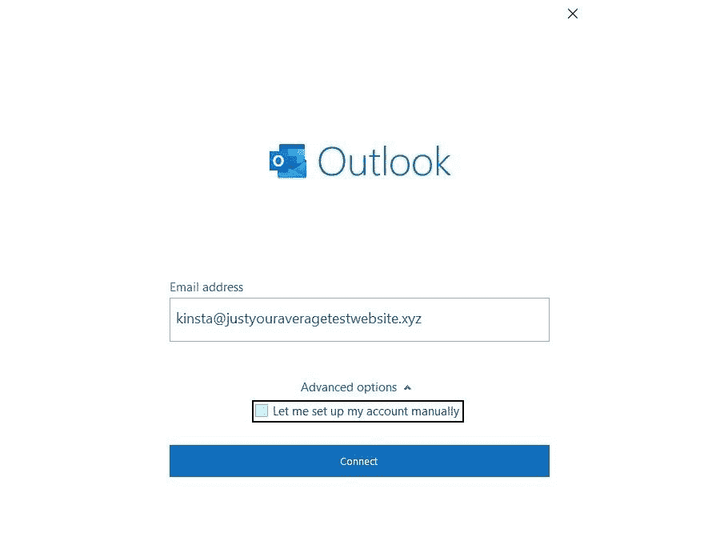

Enter your email address in Outlook.

在下一个屏幕上，选择 **IMAP** :

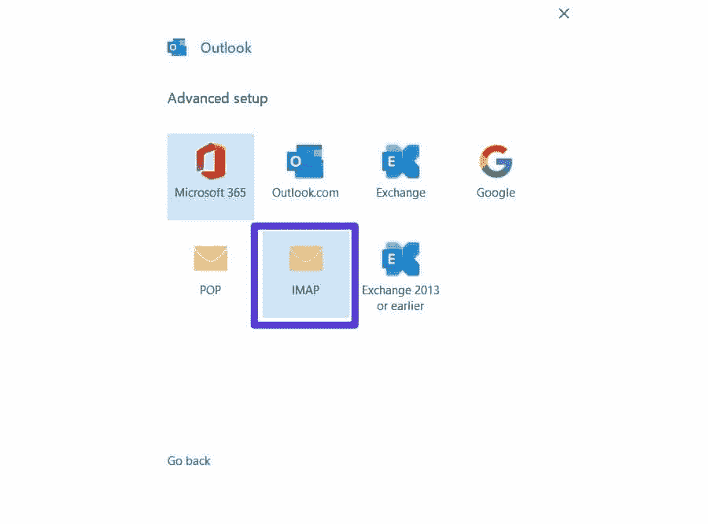

Choose the option for IMAP.

然后，输入您用于登录 Rackspace 网络邮件的密码:

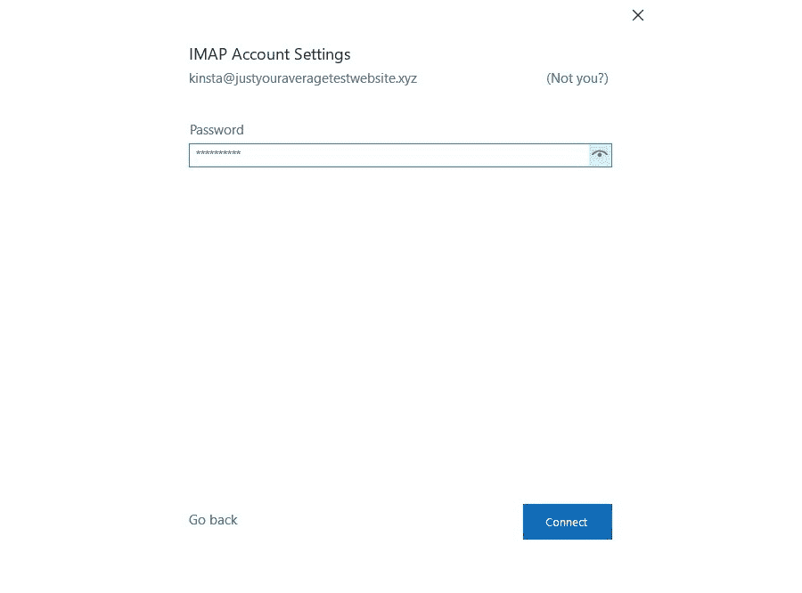

Enter the password for your Rackspace email account.

您应该会看到一条成功消息。点击 **Done** 继续到 Outlook 界面:

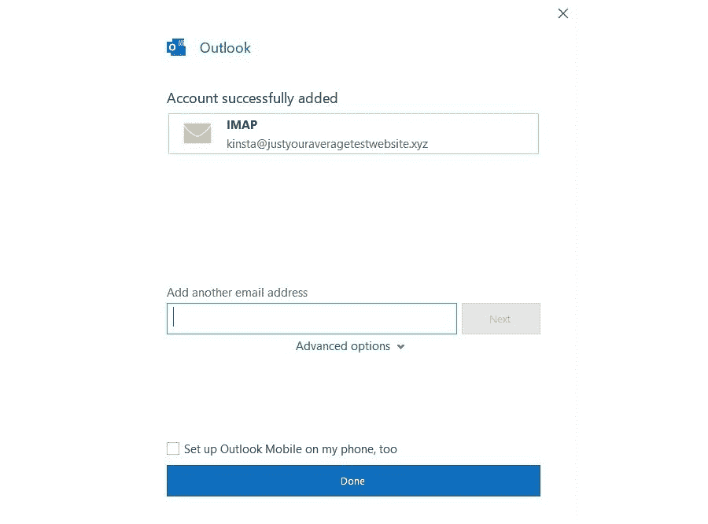

The success message in Outlook.

现在，您应该能够使用 Outlook 发送和接收电子邮件。

### 雷鸟

当你打开雷鸟，你应该会被提示“设置你现有的电子邮件地址。”输入您的 Rackspace [电子邮件地址](https://kinsta.com/blog/professional-email-address/)和用于登录 Rackspace 网络邮件的密码:

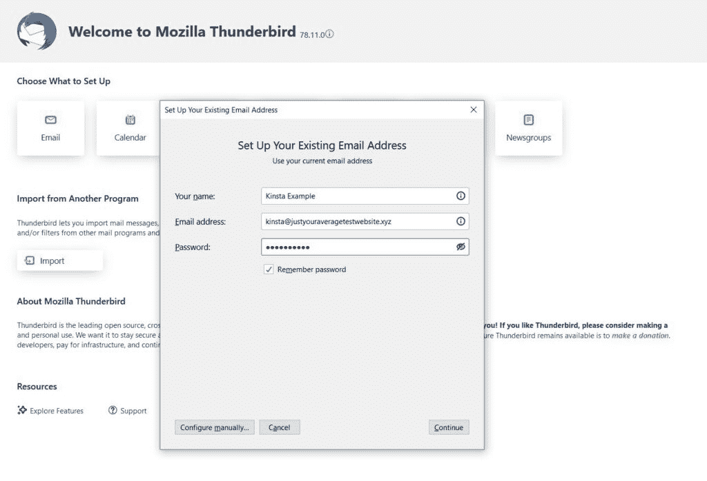

Enter your Rackspace email address and password.

雷鸟应该会自动检测正确的协议——点击**完成**以结束该过程并开始发送和接收电子邮件:

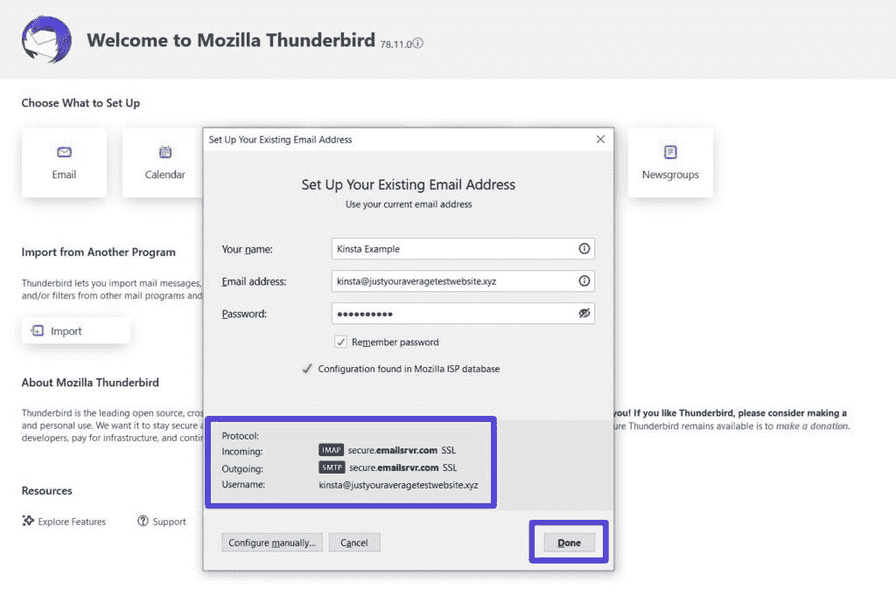

Thunderbird automatically configures the protocols — click “Done.”

### Windows Mail 应用程序

如果您不想使用 Outlook，也可以使用默认的 Windows Mail 应用程序来设置您的 Rackspace 电子邮件。

若要开始，请打开邮件应用程序。如果这是您第一次启动该应用程序，则在您打开该应用程序时，系统会立即提示您添加帐户。如果不是，您可以通过进入**设置>管理账户>添加账户**来添加新账户。

在帐户选项列表中，选择**其他帐户(POP，IMAP** ):

Choose the option for “Other account.”

在下一个屏幕上，输入您的 Rackspace 电子邮件地址和密码:

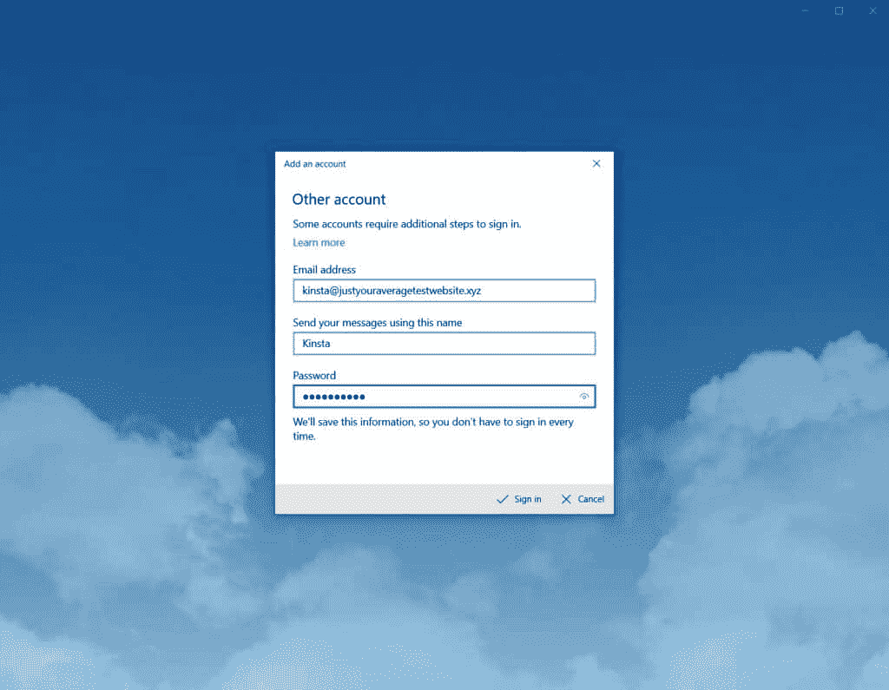

Enter your Rackspace email address and password.

就是这样！你应该可以马上收发电子邮件。

### iOS 邮件应用程序

要将 iOS 设备配置为使用 Rackspace 电子邮件，您可以使用默认的邮件应用程序。

## 注册订阅时事通讯

### 想知道我们是怎么让流量增长超过 1000%的吗？

加入 20，000 多名获得我们每周时事通讯和内部消息的人的行列吧！

[Subscribe Now](#newsletter)

如果这是您第一次打开邮件应用程序，系统会提示您添加电子邮件帐户。否则，您可以进入**设置>密码&账户>添加账户**手动添加新的邮件账户。

添加账户时，选择**其他**:

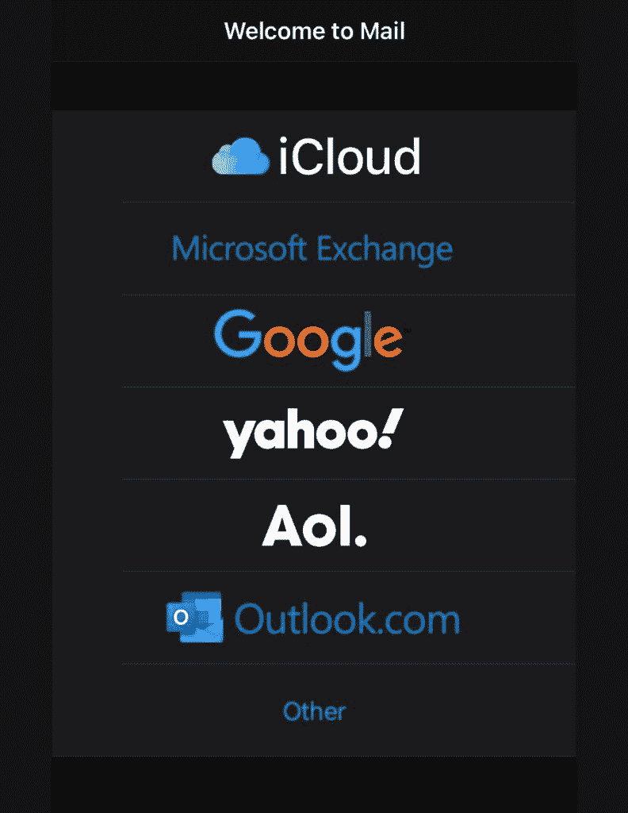

Choose the “Other” option when you add an account.

接下来，输入您的 Rackspace 电子邮件地址和用于登录网络邮件的[密码](https://kinsta.com/blog/password-managers/):

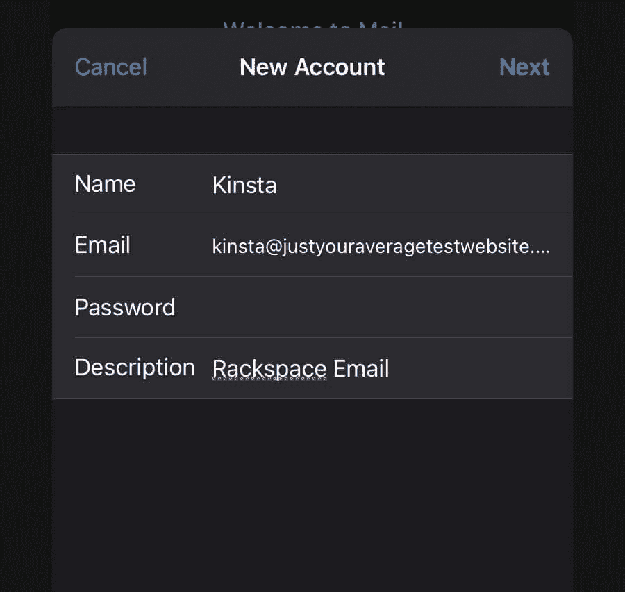

Enter your Rackspace email address and password.

此时，系统会提示您输入 Rackspace IMAP 和 SMTP 详细信息(本文前面已列出)。接收邮件服务器和发送邮件服务器的详细信息是相同的，因为您不需要手动输入端口号:

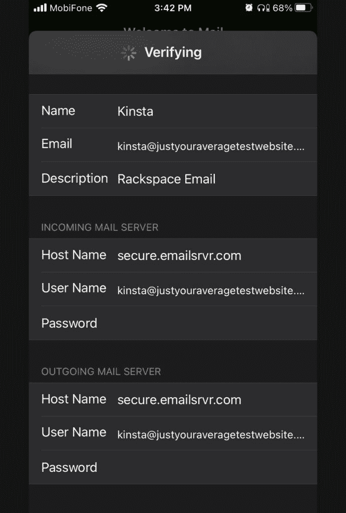

Enter the Rackspace IMAP and SMTP details.

一旦你输入了所有的细节，邮件应用程序将会验证它们。如果一切正常，你可以立即开始使用邮件应用程序发送和接收电子邮件。

## Rackspace 电子邮件连接问题故障排除

如果您在接收或发送电子邮件时遇到问题，这里有一些故障排除提示，可以帮助您解决所有问题。

### 接收电子邮件时出现问题

如果您在接收电子邮件时遇到问题，您应该首先尝试直接登录 Rackspace 网络邮件。

如果您在 webmail 中看到了该电子邮件，但它没有显示在您的电子邮件客户端中，请仔细检查您的连接设置。

确保您输入了正确的信息——很容易出现小的[错误](https://kinsta.com/knowledgebase/there-has-been-a-critical-error-on-your-website/):

*   **错别字**:您的用户名或密码中的任何错别字都会导致无法连接。
*   **端口号:**确保您拥有所选协议的正确端口号。 [SMTP 是 465](https://kinsta.com/blog/smtp-port/) ，IMAP 是 993，POP 是 995。

### 发送电子邮件时出现问题

如果你在用电子邮件客户端发送邮件时遇到问题，这里有一些建议。

首先，尝试登录您的 Rackspace 网络邮件帐户，并从那里直接发送电子邮件。如果电子邮件在您通过网络邮件发送时可以工作，但在您使用电子邮件客户端时不能工作，则您输入的 SMTP 设置可能不正确。

如果你不能从你的网络邮件或邮件客户端发送邮件，你的邮件可能会被标记为垃圾邮件。为了避免这种情况，在撰写外发邮件时，确保你遵循了所有的[电子邮件最佳实践](https://kinsta.com/blog/email-marketing-best-practices/)。

需要一流的，快速的，安全的主机为您的新电子商务网站？Kinsta 提供超快的服务器和来自 WooCommerce 专家的 24/7 世界级支持。[查看我们的计划](https://kinsta.com/plans/?in-article-cta)

## 如何配置 WordPress 通过 Rackspace SMTP 发送电子邮件

如果你有一个 WordPress 网站，你也可以使用 Rackspace 的 SMTP 服务器来发送你的 WordPress 网站的交易邮件，提高它们的可靠性，并解决 WordPress 邮件不发送的[问题。](https://kinsta.com/blog/wordpress-not-sending-email/)

[交易电子邮件](https://kinsta.com/help/transactional-email/)是基本的日常电子邮件，如密码重置、表单提交通知等。

Rackspace 的 SMTP 服务器每天有 10，000 封电子邮件的限制，这意味着除非你每天发送大量的邮件，否则你不太可能在使用 Rackspace 的电子邮件客户端和 WordPress 网站的电子邮件时遇到问题。

要在 WordPress 中设置这个，你需要的唯一信息是:

*   您现有的 Rackspace 电子邮件帐户(您不需要创建新帐户或在 Rackspace 中配置任何新内容)。
*   免费的 Post SMTP 插件允许你配置你的 WordPress 站点通过 Rackspace SMTP 发送电子邮件。

让我们仔细看看如何设置它。

### 1.配置 SMTP 后设置

首先，[安装并激活](https://kinsta.com/knowledgebase/how-to-install-wordpress-plugins/)Yehuda has sine 的免费 Post SMTP 插件。之后，在你的 WordPress 仪表盘中进入 **Post SMTP** 区域，点击**显示所有设置**进入完整的 Post SMTP 设置区域:

Accessing all settings in the Post SMTP plugin in WordPress.

首先，转到**消息**选项卡，在**电子邮件地址**区域输入您的 Rackspace 电子邮件。您还可以输入您希望用于站点电子邮件的名称:

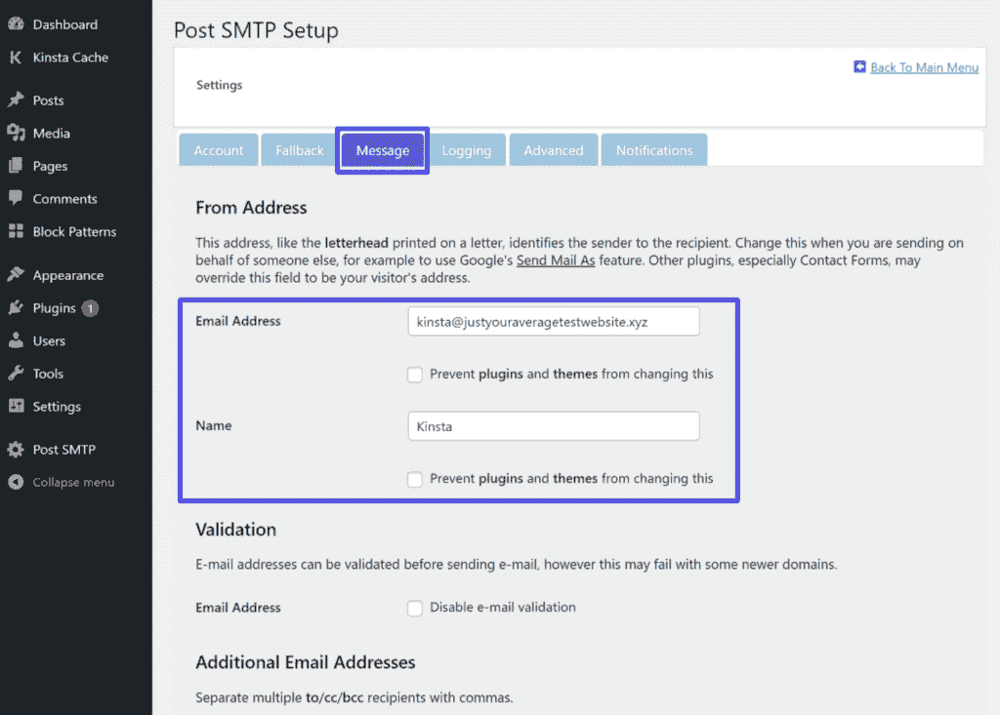

Configure your “From” name and email address.

保存您的更改，然后再次打开完整设置区域。

这一次，您将在**账户**选项卡中工作。首先，配置**运输**部分的下拉菜单，如下所示:

*   **类型** : SMTP
*   **邮件程序类型** : Post SMTP

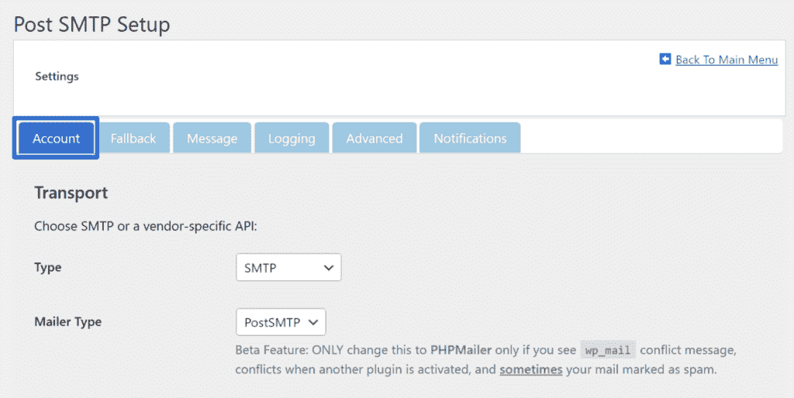

Choose PostSMTP as the mailer type.

选择此选项将展开下面的一组新选项，这是您需要输入 Rackspace SMTP 信息的地方。按如下方式配置这些设置:

*   **发送邮件服务器主机名**:secure.emailsrvr.com
*   **发送邮件服务器端口** : 465
*   **信封-发件人电子邮件地址**:您完整的 Rackspace 电子邮件地址
*   **安全** : SMTPS
*   **认证**:登录
*   **用户名**:您完整的 Rackspace 电子邮件地址
*   **密码**:您用于登录 Rackspace 网络邮件的 Rackspace 电子邮件密码

最后，确保点击**保存更改**:

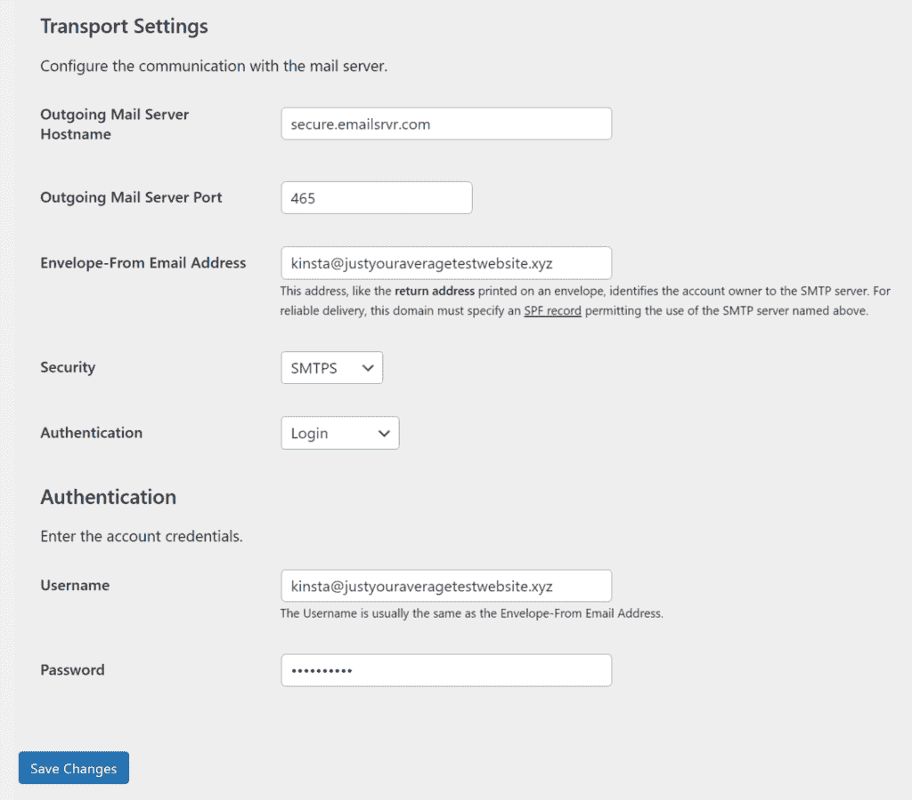

Enter the Rackspace SMTP settings.

### 2.发送测试电子邮件

现在是时候发送一封测试邮件来确保一切正常。

回到 WordPress 的主 **Post SMTP** 区域，选择**发送测试邮件**:

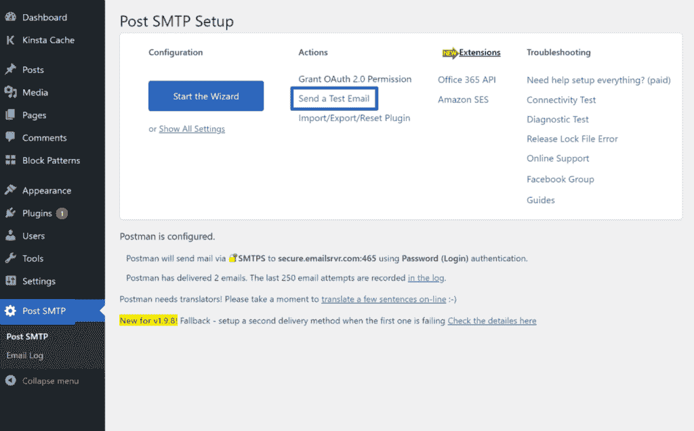

Sending a test email through WordPress.

输入您的电子邮件地址，然后点击**下一个**:

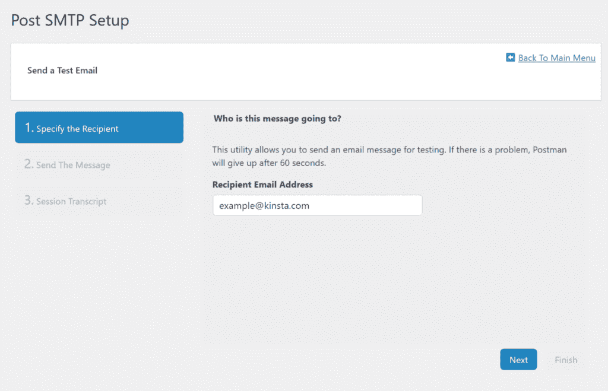

Enter your email as the recipient’s email address.

如果配置有效，您应该会看到一条成功消息:

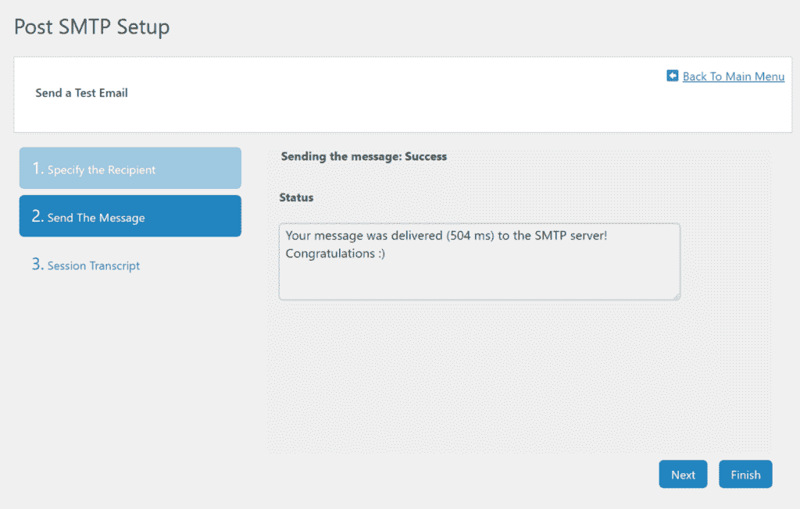

The success message after properly configuring and testing Post SMTP.

您还应该在收件箱中看到该电子邮件，它应该显示为来自您的 Rackspace 电子邮件地址:

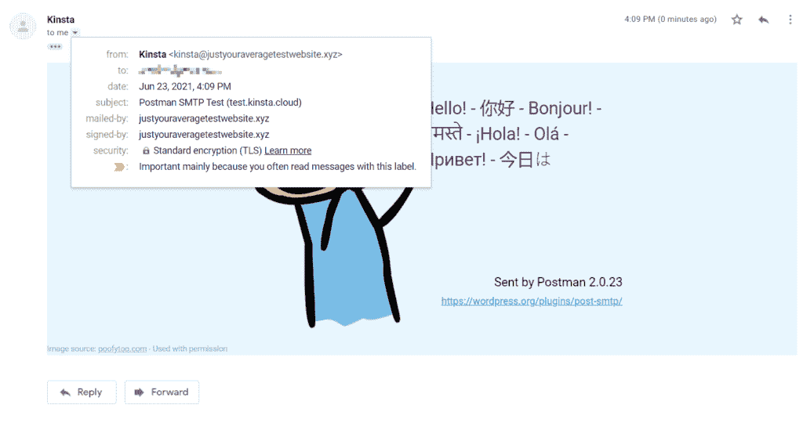

What the email header should look like in your inbox.

就是这样！你的 WordPress 站点现在将通过你的 Rackspace 账户发送所有的电子邮件。

如果你在设置 Rackspace SMTP 服务器时遇到问题，你可以尝试使用另一个免费的 SMTP 服务器，比如 T2 Gmail SMTP T3、T4 send grid API T5、T6、Outlook SMTP T7 或雅虎 SMTP T9。

[Searching for the Rackspace email settings so that you can configure it for use with your email client or website? 📧 Look no further 👀Click to Tweet](https://twitter.com/intent/tweet?url=https%3A%2F%2Fkinsta.com%2Fblog%2Frackspace-email-settings%2F&via=kinsta&text=Searching+for+the+Rackspace+email+settings+so+that+you+can+configure+it+for+use+with+your+email+client+or+website%3F+%F0%9F%93%A7+Look+no+further+%F0%9F%91%80&hashtags=SMTP%2CEmailTips)

## 摘要

虽然 Rackspace 的云解决方案在网站创建方面不如 Kinsta 的云解决方案那么容易获得，但它们确实提供了价格合理的电子邮件托管服务，这使得它成为 Kinsta 用户或任何其他寻求 T2 电子邮件托管解决方案的人的可靠选择。

现在您已经知道了 Rackspace 的 IMAP、POP 和 SMTP 电子邮件设置，您可以配置任何电子邮件客户端来使用您的 Rackspace 帐户发送和接收电子邮件。

如果你有一个 WordPress 网站，你也可以使用 Rackspace SMTP 服务器来发送你网站的事务性电子邮件并提高它们的可靠性。

对于这些 Rackspace 电子邮件设置或如何使用它们，您还有任何问题吗？请在评论区告诉我们！

* * *

让你所有的[应用程序](https://kinsta.com/application-hosting/)、[数据库](https://kinsta.com/database-hosting/)和 [WordPress 网站](https://kinsta.com/wordpress-hosting/)在线并在一个屋檐下。我们功能丰富的高性能云平台包括:

*   在 MyKinsta 仪表盘中轻松设置和管理
*   24/7 专家支持
*   最好的谷歌云平台硬件和网络，由 Kubernetes 提供最大的可扩展性
*   面向速度和安全性的企业级 Cloudflare 集成
*   全球受众覆盖全球多达 35 个数据中心和 275 多个 pop

在第一个月使用托管的[应用程序或托管](https://kinsta.com/application-hosting/)的[数据库，您可以享受 20 美元的优惠，亲自测试一下。探索我们的](https://kinsta.com/database-hosting/)[计划](https://kinsta.com/plans/)或[与销售人员交谈](https://kinsta.com/contact-us/)以找到最适合您的方式。