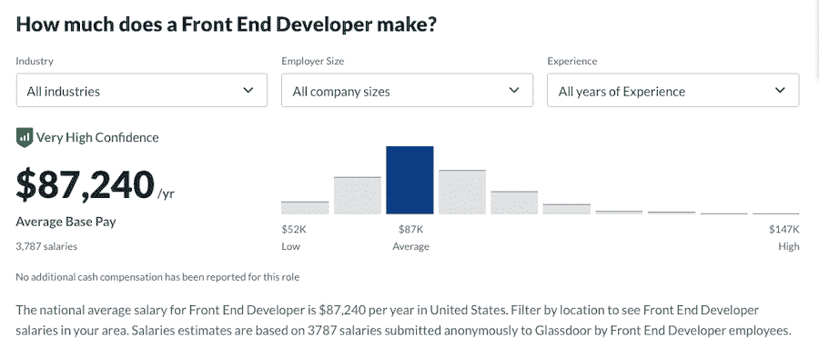
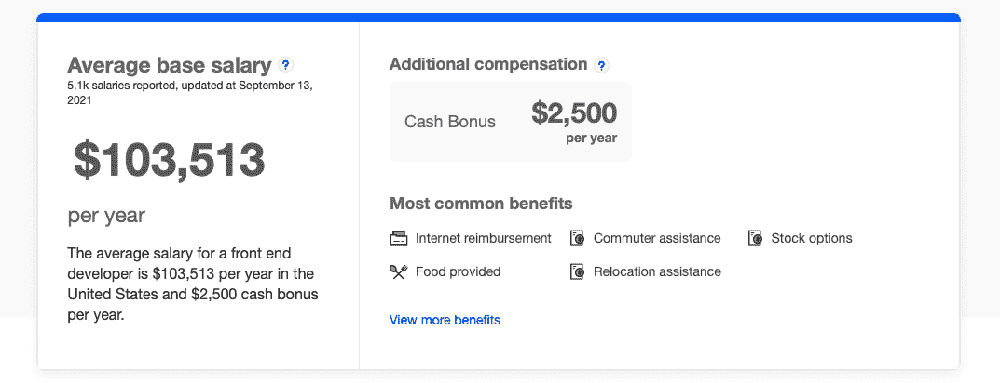
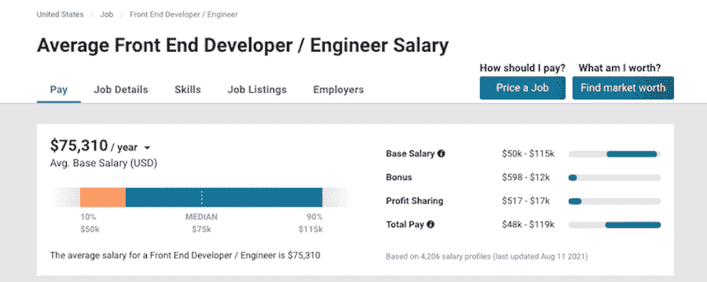
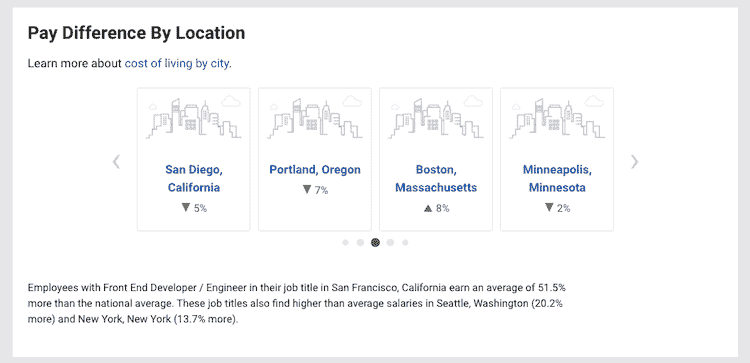
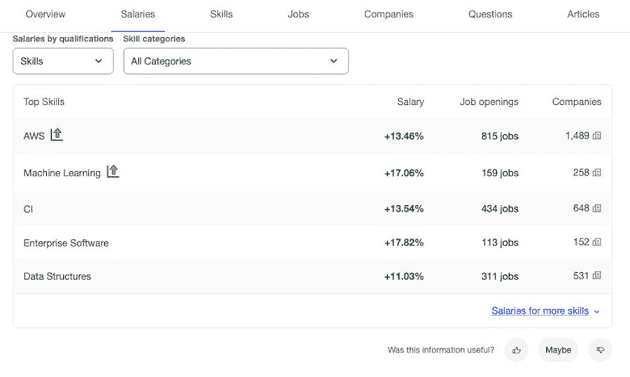

# 2022 年前端开发者平均工资多少？

> 原文：<https://kinsta.com/blog/front-end-developer-salary/>

你喜欢玩 HTML 和 CSS。你很有创造力，对设计很有眼光，你整天都在你最喜欢的[文本编辑器](https://kinsta.com/blog/best-text-editors/)中从头开始创建网站或应用程序。如果你能在这些陈述中认识到自己，前端开发职业可能是你的最佳选择。让我们来看看前端开发人员的薪资期望。

但是一个[前端开发人员](https://kinsta.com/blog/frontend-developer/)的职责到底是什么，成为一名前端开发人员需要哪些技能？作为一名前端开发人员，你期望的薪水是多少？

这些是我们将在本帖中回答的问题。我们还将比较一个前端开发人员的工资与一个普通的[网络开发人员的工资](https://kinsta.com/blog/web-developer-salary/)和其他类似的职位。

到本文结束时，你会知道前端开发人员职业是否适合你。

## 什么是前端开发？

前端开发关注网站或应用程序的前端——用户看到并与之交互的部分。作为一名前端开发人员，你将与 UI 和 UX 设计师密切合作，将他们的设计转化为功能网站。

这也是一条高度协作的职业道路，因为你将有大量的机会与其他人和团队一起工作。作为一名前端开发人员，你的工作流程将涉及到其他几个人，包括设计师、艺术家和营销专业人员。

同样值得一提的是，作为一名前端开发人员，您可以在家高效地工作。你所需要的只是一个互联网连接和一台电脑。因此，一些公司可能会向你提供远程职位，甚至报销你的电脑或网络费用。

> Kinsta 把我宠坏了，所以我现在要求每个供应商都提供这样的服务。我们还试图通过我们的 SaaS 工具支持达到这一水平。
> 
> <footer class="wp-block-kinsta-client-quote__footer">
> 
> 
> 
> <cite class="wp-block-kinsta-client-quote__cite">Suganthan Mohanadasan from @Suganthanmn</cite></footer>

[View plans](https://kinsta.com/plans/)

### 信息

Kinsta 是一家完全偏远的公司，团队成员遍布全球。查看[我们的职业页面](https://kinsta.com/careers/)了解更多信息。

### 前端开发人员要求

作为一名前端开发人员，你需要具备基本设计原则的工作知识和一些主要用于网站和应用程序前端的 T2 编程语言。

最重要的是，你可能还会花时间做客户或用户研究，并[进行 A/B 测试](https://kinsta.com/blog/wordpress-ab-testing-tools/)以确保所讨论的网站或应用程序能够带来最佳的投资回报。不仅如此，测试还能让你发现并排除错误，这样你就能制作出易于使用的网站和应用程序。

就技术技能而言，你需要熟悉以下语言:

*   [HTML](https://kinsta.com/blog/html-vs-html5/) 和 [CSS](https://kinsta.com/blog/wordpress-css/#what-is-css-editing)
*   [JavaScript](https://kinsta.com/knowledgebase/what-is-javascript/) 和 jQuery
*   像 AngularJS、 [ReactJS、](https://kinsta.com/knowledgebase/what-is-react-js/)、Backbone 和 Ember 这样的 JavaScript 框架
*   [RESTful 服务和 API](https://kinsta.com/blog/wordpress-rest-api/)

### 前端开发人员技能

除了上面列出的技术要求，如果你想增加被聘用为前端开发人员的机会，还有几个软技能是你应该掌握的。

其中包括:

*   良好的沟通技巧:当你在其他团队、客户和顾客的网站和应用程序上工作时，你必须与他们一起工作和沟通。
*   协作技能:在团队中很好地工作是另一项重要的软技能，因为你将和其他人一起。
*   解决问题的技巧:很多 web 开发都涉及到寻找特定问题的正确解决方案——就像寻找拼图中缺失的那块。
*   **创意:**这包括将顾客或客户的愿景转化为一个有效的网站或应用程序。对视觉和设计层次的良好理解也会很好地为你服务。

如果你具备以上所有技能，你就可以开始寻找前端开发人员的工作了。

### 前端开发人员会被雇佣吗？

如果你想知道前端开发人员是否很难找到工作，你不需要担心。2021 年， [Glassdoor](https://www.glassdoor.com/) 仅在北美和英国就发布了 45，000 个前端开发人员职位的广告。

根据劳工统计局的数据，从 2019 年到 2029 年，美国网络开发人员的就业率预计将增长 8%。

换句话说，如果你想从事前端开发，你会有很多机会被雇佣并获得稳定的收入。

## 前端开发人员的平均工资

所以现在你知道作为一名前端开发人员你的责任是什么，你也知道如果你想要这份工作，你需要掌握哪些技能。是时候看看前端开发者工资能赚多少了。

Average frontend developer salary, according to Glassdoor.

[根据 Glassdoor](https://www.glassdoor.com/Salaries/front-end-developer-salary-SRCH_KO0,19.htm) 的数据，前端开发人员的平均工资为 86013 美元。这个数字是基于前端开发人员向 Glassdoor 提交的 3715 份薪水。前端开发人员的最低工资约为 51，000 美元，而最高工资为 145，000 美元。

The average salary for frontend developers, according to Indeed.

[的确列出了](https://www.indeed.com/career/front-end-developer/salaries)略高的薪水，但他们的样本量也比 Glassdoor 的大。他们说，前端开发人员的平均工资是 103，832 美元，平均每年有 2，500 美元的现金奖金。

Average frontend developer salary, according to PayScale.

[PayScale 报道](https://www.payscale.com/research/US/Job=Front_End_Developer_%2F_Engineer/Salary)平均年薪为 75，310 美元，最低 5 万美元，最高 9 万美元。PayScale 的数据基于前端开发人员提交的 4206 份薪资档案。

ZipRecruiter 表示，前端开发人员的平均年薪为 94639 美元，最低为 37000 美元，最高为 147000 美元。

根据上面的数字，我们可以推断出前端开发人员的平均年薪是 89，948 美元——这是不容轻视的。

但是和其他类似的工作不相上下吗？

在下一节中，我们将比较类似工作的前端开发人员的平均工资，以及位置和经验等其他因素如何影响收入。

### 前端与后端开发人员的工资

后端开发人员在网站或应用程序的后端工作。他们确保一切顺利运行，并负责服务器端的事情，如数据库、客户机-服务器数据流、服务器逻辑等。

因此，他们的工作要求和职责比前端开发人员更复杂。合乎逻辑的假设是他们的工资会更高，下面的数字证明了这一点。

首先， [Glassdoor 列出了](https://www.glassdoor.com/Salaries/backend-developer-salary-SRCH_KO0,17.htm)后端开发人员的平均基本工资为 79518 美元，最低工资约为 48000 美元，最高工资约为 132000 美元。

[Indeed 报告](https://www.indeed.com/career/back-end-developer/salaries)后端开发人员的平均年薪为 118，856 美元，外加 4，000 美元的年度奖金。

[PayScale 列出](https://www.payscale.com/research/US/Job=Back_End_Developer%2F_Engineer/Salary)后端开发人员的平均工资为 81，161 美元，最低为 51，000 美元，最高为 131，000 美元。

最后， [ZipRecruiter 计算出](https://www.ziprecruiter.com/Salaries/Back-End-Web-Developer-Salary)后端开发人员的平均年薪为 83，770 美元，最低为 33，500 美元，最高为 149，000 美元。

这使得后端开发人员的平均年薪达到 90，826 美元左右，略高于前端开发人员的平均年薪。

### 前端与全栈开发人员工资

[全栈开发人员](https://kinsta.com/blog/full-stack-developers-salary/)拥有前端和后端开发人员的综合技能和知识。他们的工作比后端开发人员更复杂，因为他们的职责和技能范围更广。

让我们看看他们的收入与前端开发人员的工资相比如何。

## 注册订阅时事通讯

### 想知道我们是怎么让流量增长超过 1000%的吗？

加入 20，000 多名获得我们每周时事通讯和内部消息的人的行列吧！

[Subscribe Now](#newsletter)

Glassdoor 表示，全栈开发人员的平均年薪是 97，849 美元。最低工资 61K 美元，最高 156K 美元。

根据 [Indeed 的数字](https://www.indeed.com/career/full-stack-developer/salaries)，全栈开发者的平均年薪为 106242 美元。事实上还列出了额外的 4100 美元现金年度奖金。

ZipRecruiter 报告称，平均年薪为 102，744 美元。最低 38K 美元，最高全栈开发者年薪 15 万美元。

[PayScale 列出了](https://www.payscale.com/research/US/Job=Full_Stack_Software_Developer/Salary)全栈开发人员的平均年薪为 78，951 美元，最低为 54，000 美元，最高为 11.5 万美元。

当你计算这些数字时，你会得到一个全栈开发人员的平均工资为 96，446 美元。虽然这个数字更高，但与前端开发人员的收入并没有太大差别。但是，这种差异表明，全栈开发人员肩负着更多的责任，有更多的工作要求需要满足。

### 按经验列出的前端开发人员薪金

到目前为止，看看上面的数字，我们可以看到前端开发人员比后端和全栈开发人员赚的钱略少。

但是当你考虑工作经验时会发生什么呢？作为一名初级前端开发人员，你能挣多少钱？更重要的是，当你晋升到高级职位时，你的薪水会如何增加？

根据 Glassdoor 的说法，作为一名入门级前端开发人员，你可以期望每年赚 97，377 美元。据报道，最低的年薪为 5.4 万美元，最高的年薪为 17.6 万美元。

另一方面，PayScale 报告的数字较低。他们入门级前端开发人员的平均年薪为 61，000 美元。

ZipRecruiter 列出了入门级前端开发人员的平均年薪为 57，017 美元，最低为 25，000 美元，最高为 113，000 美元。

随着你获得更多的经验，你的薪水应该会反映出来。你不仅会学到更多的知识，还会过渡到高级和首席开发人员的角色。你甚至可以指导入门级的前端开发人员。数字是这样说的。

[Glassdoor 报道](https://www.glassdoor.com/Salaries/front-end-developer-salary-SRCH_KO0,19.htm)如果你有 10 年以上的经验，前端开发人员的平均工资是 96985 美元，低的 65000 美元，高的 144000 美元。

[根据 PayScale](https://www.payscale.com/research/US/Job=Front_End_Developer_%2F_Engineer/Salary) ，一名高级前端开发人员的平均年薪为 9.3 万美元。与此同时， [ZipRecruiter 列出的](https://www.ziprecruiter.com/Salaries/Senior-Front-End-Developer-Salary) it 年薪为 118，440 美元，最低为 32，000 美元，最高为 169，000 美元。

根据这些数字，前端开发人员的平均入门级年薪为 71，798 美元，而高级别年薪为 102，808 美元。

换句话说，在你职业生涯的末期，你可以期望每年多挣 4 万美元。

### 按地点列出的前端开发人员薪金

不管你的工作是什么，你住在哪里会直接影响你的收入。这同样适用于前端开发人员的工作。考虑到这是一个技术职位，一些对技术工作需求高的地区会比其他地区支付更高的工资是理所当然的。

你厌倦了没有答案的低于 1 级的 WordPress 托管支持吗？试试我们世界一流的支持团队！[查看我们的计划](https://kinsta.com/plans/?in-article-cta)

How the average frontend developer salary varies by location.

根据 PayScale 的数据，加州旧金山的前端开发人员的平均收入比全国平均水平高出 51.5%。前端开发人员还可以在华盛顿州的西雅图(多 20.2%)和纽约州的纽约(多 13.7%)找到高薪工作。

类似地，[的确报道了](https://www.indeed.com/career/front-end-developer/salaries)前端开发者薪资最高的城市是旧金山，平均年薪为 157，674 美元。

同样值得一提的是，如果你正在美国以外找工作， [Daxx 报道](https://www.daxx.com/blog/development-trends/front-end-developer-salary)瑞士是欧洲前端开发人员薪资最高的国家，而墨尔本和珀斯是澳大利亚薪资最高的地方。温哥华和渥太华在加拿大名列前茅。

### 按语言列出的前端开发人员薪金

如前所述，前端开发人员精通 HTML、CSS 和 JavaScript。通常，他们也熟悉 JavaScript 框架，如 [Angular](https://kinsta.com/blog/php-vs-angular/#what-is-angular) 和 React。

How skills can affect average frontend developer salary. (Source: Indeed)

[事实上](https://www.indeed.com/career/front-end-developer/salaries)表明，作为一名前端开发人员，能够影响你薪水的技能和经验领域包括 [AWS](https://kinsta.com/aws-market-share/) ，机器学习和持续集成。

How skills affect average frontend developer salary. (Source: [PayScale](https://www.payscale.com/research/US/Job=Front_End_Developer_%2F_Engineer/Salary))

另一方面，PayScale 提到 Less.js、 [React](https://kinsta.com/blog/javascript-libraries/#reactjs) Native、Django、 [Golang](https://kinsta.com/blog/node-js-vs-golang/#what-is-golang) 、Redux.js 等语言对你的工资有直接影响。

### 自由职业前端开发人员工资

如果你不想在整个前端开发生涯中只为一家公司工作，自由职业路线当然是一个选择。这种方法的好处是，你可以自由选择你接下的项目，你一次和多少客户一起工作，以及你的工作收费多少。

[据 Glassdoor](https://www.glassdoor.com/Salary/Freelancer-Front-End-Developer-Salaries-E392261_D_KO11,30.htm) 报道，自由职业前端开发的平均年薪为 7 万美元，低的 4 万 2 千美元，高的 12 万美元。

据 ZipRecruiter 报道，自由职业前端开发人员的平均年薪为 84380 美元，最低为 25000 美元，最高为 146000 美元。

最后， [Codementor 报告说](https://www.codementor.io/freelance-rates/front-end-developers)自由前端开发者的平均时薪在 61-80 美元之间。
T3】

## 作为前端开发人员如何赚更多的钱

正如我们所见，前端开发人员的平均收入比后端和全栈开发人员低。

然而，这并不意味着这些数字是最终的。作为前端开发人员，您可以做一些事情来赚更多的钱。

例如，您可以:

*   获得在日常工作中有用的额外技能，包括学习另一种编程语言。
*   扩展到后端开发，或者更加熟悉 [UI 和 UX 设计](https://kinsta.com/blog/web-design-courses/)。
*   创建并销售一门关于你所知的课程，以帮助他人进入你的领域。
*   在 CreativeMarket 或 ThemeForest 等市场上出售你的设计主题。
*   搬到前端开发人员工资更高的地方。
*   开创自己的事业，做一名自由网站或 [WordPress 开发者](https://kinsta.com/blog/wordpress-developer-salary/)。

## 成为前端开发者值得吗？

鉴于前端开发人员比后端和全栈开发人员挣钱少，您可能会想成为前端开发人员是否值得。

平均年薪 89，948 美元，前端开发职业是一个可行的选择。工资并不比类似的职业低多少，所以钱不应该是一个障碍。

你住在哪里，你掌握的技能会影响你的薪水，所以扩展你的知识和搬到不同的地方可以增加你的年收入。

随着收入问题的解决，现在是考虑其他问题的时候了。

如果你是一个非常有创造力的人，喜欢与他人合作，喜欢迭代设计，喜欢测试和分析结果，前端开发人员的工作是一个完美的匹配。

再加上前端开发人员的需求量很大，你就会明白这是一个多么值得考虑的职业。

[喜欢在自己喜欢的文本编辑器中从头开始创建网站或应用程序吗？👀在本指南中，了解作为一名前端 web 开发人员，你可以赚多少钱💰](https://twitter.com/intent/tweet?url=https%3A%2F%2Fkinsta.com%2Fblog%2Ffront-end-developer-salary%2F&via=kinsta&text=Love+spending+your+days+in+your+favorite+text+editor+creating+websites+or+applications+from+scratch%3F+%F0%9F%91%80+Learn+how+much+you+could+be+making+as+a+frontend+web+developer+in+this+guide+%F0%9F%92%B0&hashtags=HTML%2CTechJobs)

## 摘要

如果你选择从事前端开发，你需要考虑一些事情。首先，这是一个富有创造性和挑战性的职位，因为你要将想法带入生活，并帮助确保网站和应用程序易于导航和使用。

其次，为了确保一切正常，你需要经常与其他团队合作，比如 UI/UX 团队和后端开发团队。很少有开发人员在真空中工作，所以保持良好的沟通和协作技能是非常重要的。

第三，虽然工资没有开发和工程领域的其他职业高，但也不会低到让你只能勉强维持生活。基本工资平均每年 89，948 美元，很明显你可以过上体面的生活。更不用说，你甚至可以[探索额外的选择](https://kinsta.com/blog/website-ideas/)来增加你的收入，比如销售前端开发课程或者其他设计师可以使用的主题和模板。

最后，前端开发人员需求量很大，所以如果工作保障是你的首要任务，这条职业道路无疑是一个很好的职业选择。

你对后端开发人员的工资水平有什么看法？你的经历有所不同吗？请在评论区告诉我们！

* * *

让你所有的[应用程序](https://kinsta.com/application-hosting/)、[数据库](https://kinsta.com/database-hosting/)和 [WordPress 网站](https://kinsta.com/wordpress-hosting/)在线并在一个屋檐下。我们功能丰富的高性能云平台包括:

*   在 MyKinsta 仪表盘中轻松设置和管理
*   24/7 专家支持
*   最好的谷歌云平台硬件和网络，由 Kubernetes 提供最大的可扩展性
*   面向速度和安全性的企业级 Cloudflare 集成
*   全球受众覆盖全球多达 35 个数据中心和 275 多个 pop

在第一个月使用托管的[应用程序或托管](https://kinsta.com/application-hosting/)的[数据库，您可以享受 20 美元的优惠，亲自测试一下。探索我们的](https://kinsta.com/database-hosting/)[计划](https://kinsta.com/plans/)或[与销售人员交谈](https://kinsta.com/contact-us/)以找到最适合您的方式。