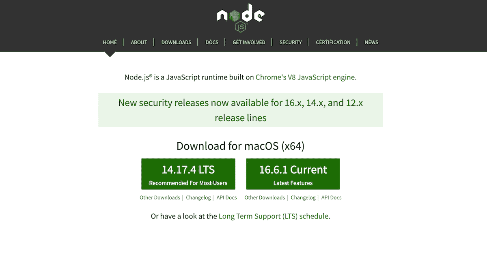
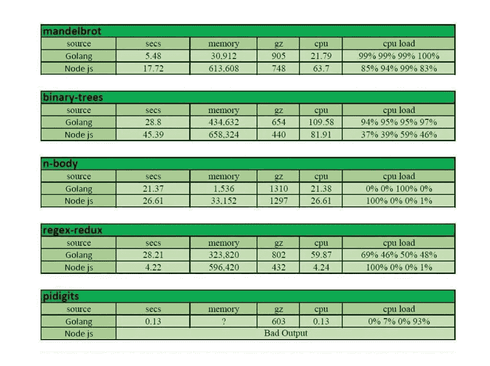
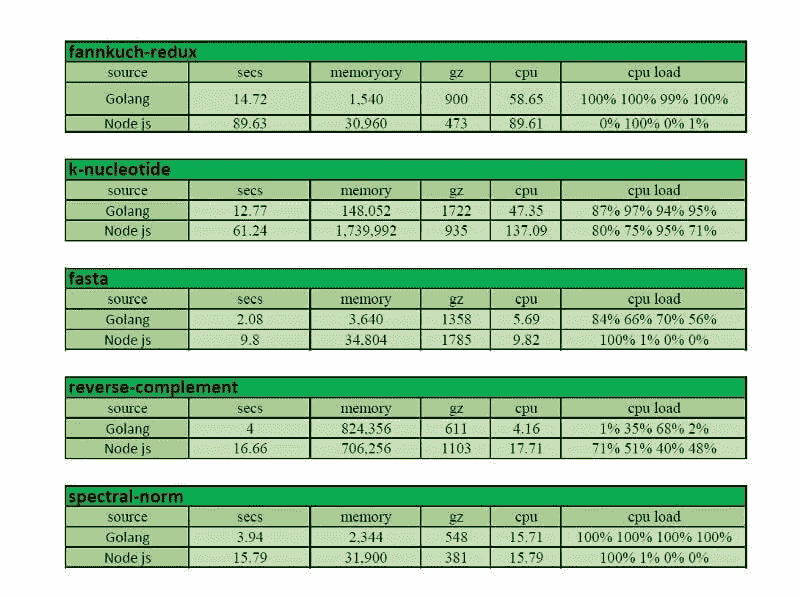

# Node.js vs Golang:哪个最适合你的项目？

> 原文:# t0]https://kinta . com/blog/node-js-vs-golang/

对于公司和工程师来说，为他们的下一个项目选择完美的技术组合是一项挑战。尤其是对于后端开发——这都是关于构建和扩展 API、库、数据管理和面向用户较少的代码。

两种主要的编程语言脱颖而出，争夺后端开发的头把交椅。您可能已经熟悉 Node.js，它在后端使用了 [JavaScript](https://kinsta.com/knowledgebase/what-is-javascript/) 。但是自从像优步这样的顶级公司迁移到 Google Go 之后，Google Go 或 Golang 也在后端开发行业获得了一席之地。

本文将比较 Node.js 和 Golang，并通过概述两者的优缺点来帮助您做出更好的决定。我们还将提到使用它们的顶级公司和应用程序。最后，我们将根据性能、可伸缩性、错误处理、开发人员的可用性以及每种编程语言的平均工资来比较每种语言。

我们开始吧！

T3】

## 什么是节点。Js？

[Node.js](https://kinsta.com/knowledgebase/what-is-node-js/) 是一个开源的 JavaScript 引擎，旨在使用 JavaScript 在服务器端构建复杂而简单的可扩展网络应用。Node.js 运行在不同的平台上，比如 Windows、Linux 和 macOS。

Chrome 的 V8 JavaScript 引擎是 Node.js 的基石，因为它在后台解析和运行 Chrome 引擎中的 JavaScript 代码。Node.js 还为构建和部署可伸缩的服务器端应用程序提供了丰富的库。

The Node.js website homepage.

最初，Node.js 是作为执行 JavaScript 代码的引擎开发的。它已经发展了多年，支持应用程序前端和后端的全栈开发。仅这个特性就使 Node.js 成为一种革命性的 web 应用程序编程语言。

JavaScript 是一种流行的编程语言，根据 Tiobe 指数(撰写本文时)排名第七。这种受欢迎程度直接影响 Node.js 的受欢迎程度，包括前者在后者的好处和特点。

## Golang 是什么？

Golang 的第一个版本是在 2009 年，与 Node.js 相同。Golang 也称为 Go，是一种开源、统计类型、多用途、跨平台、编译和快速的[编程语言](https://kinsta.com/blog/best-programming-language-to-learn/)，由谷歌的工程师开发，通过结合其他编程语言的优势并消除其弱点来解决特定问题。

The Golang website homepage.

Go 是一种高效的编程语言，在速度和语法方面与 C 编程语言有相似之处。Go 是一种简单明了的编程语法，用于编写可读和可维护的代码。

Golang 也是一种结构化语言，能够充分处理并发编程，具有出色的垃圾收集处理、动态接口和内置的内存安全。

Golang 在最受欢迎的编程语言中平均排名第 13 位，是 2009 年和 2016 年的年度编程语言。2019 年堆栈溢出开发者调查显示，Go 是第 13 大最受欢迎的技术。

## 什么是节点。Js 用于？

Node.js 是构建简单和复杂网络应用程序的引擎。它可以有效地扩展到任何与网络相关的应用程序。这个基于 JavaScript 的运行时环境有助于创建服务器端环境和网络应用程序。

Node.js 是创建具有双向连接的实时应用程序的绝佳选择，在这种情况下，服务器不会等待 [API](https://kinsta.com/blog/wordpress-rest-api/) 返回数据。
T3】

## Golang 是用来做什么的？

Golang 是一种多用途编程语言，可以用来创建各种应用程序，包括注重安全性和速度的高度模块化的应用程序系统。

最重要的是，您可以使用 Golang 进行系统编程、大型分布式系统以及高度可扩展的网络应用程序和服务器。它还可以用于基于云的开发、web 应用程序开发以及大数据或机器学习应用。

## 节点的利与弊。射流研究…

接下来，我们将探讨 Node.js 的优缺点，让您更好地理解这种语言。

### 赞成者

*   用于构建可伸缩的 web 应用程序
*   与 NoSQL 数据库 MongoDB 配合得非常好
*   简单易学，因为它使用 JavaScript，这也很容易上手
*   因为内置了事件循环功能，所以用于创建高性能的应用程序
*   拥有发展最快的社区，每天都有新的功能和软件包问世
*   JavaScript 运行时环境是构建流应用程序的绝佳选择。
*   它使得[缓存](https://kinsta.com/blog/what-is-cache/)单个模块变得轻而易举，并鼓励快速应用。

### 坏处

*   调试 Node.js 可能会变得很困难，因为它使用 JavaScript，一种动态类型的语言。使[代码错误](https://kinsta.com/blog/code-review-tools/)与变量相关是不可避免的，需要一个有经验的程序员来驾驭 Node.js 的真正本质
*   它使用异步编程，这看起来很有优势，但是要创建可伸缩的应用程序，需要很高的专业知识。
*   在 Node.js 中，许多 API 和程序包经历了频繁的更改和更新，这导致了兼容性问题并使开发人员感到困惑。

## 戈朗的利与弊

接下来，我们将探讨 Golang 的利弊，让您更好地了解 Golang。

### 赞成者

*   由于代码易于阅读，应用程序易于维护
*   受到开发人员的欢迎，因为它具有简洁明了的语法
*   谷歌积极支持 Golang 的发展。它是谷歌用于构建所有大型项目的官方语言，因此，它得到了所需的所有支持。
*   由于 Golang 是静态类型的，语言开发人员不容易犯变量错误。
*   当你在没有适当文档的情况下编写程序时，Go 会提醒你
*   由于是一种编译语言(解释型语言速度稍慢)，性能显著提高
*   可用于测试和扩展代码的 API
*   使用 GoMetaLinter 这个便捷的工具进行静态代码分析
*   支持并发性，这有助于程序员构建高度并行处理的系统

### 坏处

*   开发人员需要编写更多的代码来实现 Golang 中的一个简单特性(不提供复杂的抽象；虽然这使得 Go 成为一种简单的语言，但它限制了它的通用性)
*   由于 Go 不支持泛型，代码重用在 Go 中比在其他语言中更困难。
*   它没有提供一个内置的 GUI 库来构建 GUI 应用程序(这个缺陷意味着您需要花费大量的精力来连接一个库和您的项目)
*   与其他一些领先的编程语言相比，[社区](https://kinsta.com/learn/wordpress-communities/)不够成熟。
*   Go 为复杂的程序消耗更多的计算资源——因为 Go 没有虚拟机(VM ),所以这类程序具有相当大的文件大小

## 使用 Node 的公司和应用。射流研究…

下面是在其服务器上积极使用 Node.js 的公司和应用程序列表。

*   网飞
*   [LinkedIn](https://kinsta.com/blog/linkedin-statistics/)
*   沃尔玛
*   特雷罗
*   超级的
*   贝宝
*   中等
*   通过易趣网购买
*   国家航空与航天局

## 使用 Golang 的公司和应用

以下是在其服务器上积极使用 Golang 的公司和应用程序列表:

*   谷歌
*   超级的
*   推趣
*   dailymotion
*   SendGrid
*   Dropbox
*   声音云

## 节点的比较。Js 对 Golang

### 表演

性能是每个可扩展系统不可或缺的一部分，这就是开发人员喜欢 Node.js 的原因。为了说明这一点，这里有一些使用 Node.js 开发的[最佳应用程序。除了通过缓存获得性能之外，让我们比较一下 Node.js 和 Golang，就绝对速度而言，前者的处理速度更快。](https://kinsta.com/blog/node-js-apps/)

Golang 开发人员强调，Go 的性能与 C 和 C++相同，这很棒，因为 Go 将其代码直接编译为机器码，没有任何虚拟机来减慢编译过程。

Golang 中还有一个内置的垃圾收集器，可以自动释放未使用的内存空间，增加可用内存以加快处理速度。该特性还降低了由于内存泄漏而导致的安全漏洞的风险。

另一方面，Node.js 使用最快的 JavaScript 引擎，称为 [V8](https://v8.dev/) 。Node.js 中的代码是可重用的，这使得它成为实时更新数据的基于事件的应用程序的首选。这种语言也广泛用于即时消息、视频聊天和在线游戏。

2013 年， [Paypal](https://kinsta.com/blog/paypal-alternative/) 将其代码库从 Java 迁移到 Node.js，并报告称其[页面的服务速度比](https://medium.com/paypal-engineering/node-js-at-paypal-4e2d1d08ce4f)快了 200 毫秒，平均响应时间减少了 35%。

带 [TypeScript](https://kinsta.com/blog/web-development-tools/#35-typescript) 的静态类型 Node.js 一般比其他编程语言慢。与 Go 不同，Node.js 不能提供 CPU 和内存受限的任务性能，这意味着 Node.js 的版本不能那么具体——它可以表现得很好或很差，这取决于应用程序的性质。

## 注册订阅时事通讯

### 想知道我们是怎么让流量增长超过 1000%的吗？

加入 20，000 多名获得我们每周时事通讯和内部消息的人的行列吧！

[Subscribe Now](#newsletter)

在这个性能比较中，Go 在编程语言的执行速度以及编译和执行指令的速度方面超过了 Node.js。

### 可扩展性和并发性

Google 打算开发一种编程语言，从可伸缩性的角度来看，这种语言可以构建沉重而复杂的企业级、生产就绪的应用程序。他们将可伸缩性定义为他们的首要任务，并且他们做到了。

Go 使用 goroutines，它允许可靠和容易地执行线程，并且可以以平滑的方式并发执行。这些 goroutines 使 Go 成为一种完美的可伸缩编程语言。

使用并发，Go 每秒可以处理超过 1000 个请求。仅这个特性就使得 Go 在[可伸缩性](https://kinsta.com/clients/gadget-flow/)和并发性方面优于 Node.js。同样值得注意的是 Node.js 是一个单线程异步 JavaScript 引擎。

在 Node.js 单线程架构中，CPU 绑定的任务有时会阻塞事件循环，降低程序速度。结果你得到的是一个很慢的 app，惹恼了用户。

在这个比较中，很明显 Go 优于 Node.js，因为它允许通过 goroutines 实现并发，这导致了比 Node.js 单线程架构更快的进程。

### 基准

有时候，你可以通过运行不同的任务或算法，计算时间、[速度](https://kinsta.com/cheatsheets/site-speed-cheat-sheet/)等，来确定最佳的工具或语言。，它需要每种语言来执行。

下面，我们将看一个例子，它显示了 Node.js 与 Go 在不同计算机语言方法和算法下的基准任务性能。

Node.js vs Golang benchmarks. (Image source: [Intellectsoft](https://www.intellectsoft.net/blog/nodejs-vs-golang/))

Node.js vs Golang more benchmarks. (Image source: [Intellectsoft](https://www.intellectsoft.net/blog/nodejs-vs-golang/))

从上面的统计数据中，我们可以观察到 Golang 执行操作所需的时间、内存和 CPU 负载都比 Node.js 少。

### 错误处理

Node.js 传统上使用处理异常的 try-catch 技术来处理错误，在这种情况下，错误仅在发生时被捕获，开发人员可以更快地调试错误。

Golang 对编译时和运行时错误进行了不同的分离。这种不一致导致了开发人员之间的混乱，并导致了处理异常的标准过程。

然而，Go 开发者认为，在即将到来的 [Go 2 版本](https://github.com/golang/go/wiki/Go2)中，该语言将会有更多的改进，包括更好的错误处理、错误值和泛型。

不过，目前来看，Node.js 在正确处理错误和异常方面明显优于 Golang。

所有的 Kinsta 托管计划都包括来自我们资深 WordPress 开发者和工程师的 24/7 支持。与支持我们财富 500 强客户的同一个团队聊天。查看我们的计划！

### 难度水平

Node.js 比 Golang 更容易学习，因为它使用 JavaScript，JavaScript 在所有类型的开发人员中很流行，是全球使用最广泛的编程语言。

此外，如果开发人员不熟悉 JavaScript，学习 Node.js 会比 Golang 更容易一些，因为互联网上有大量的 Node.js 课程和内容。

Golang 要求开发人员学习它的具体流程、概念、规则、指针、严格类型、接口、协程等等。Golang 开发人员通常面临更陡峭的学习曲线。

最重要的是，Golang 只是一种后端编程语言。所以，你需要[单独雇佣一个前端开发者](https://kinsta.com/blog/web-developer-salary/)。

通过比较，很明显 Node.js 的学习曲线比 Golang 低。

### 社区

众所周知，开源项目有大量的开发人员每天都在做贡献，还有大量的社区支持这些项目。Node.js 和 Golang 都是开源的，拥有广泛的开发者支持和社区。

一方面，Node.js 是更成熟的工具，有更强大的社区支持。Node.js 基金会支持 Node.js 的广泛应用；一个专业团队负责监督旨在提高 Node.js 稳定性的安全和长期支持(LTS)计划

[GoDaddy](https://kinsta.com/godaddy-alternative/) 、英特尔、IBM、微软、PayPal、NodeSource 都是 Node.js 基金会和 Node+JS Interactive 的活跃成员，开发者在这里宣布新的改进，改变 Node.js。

截至本文撰写之时，Node.js 拥有 80，300 颗 Github 星，Node.js 下载量超过 10 亿次。

而 Golang 的社区更小，每天都在不断增长。谷歌对 Go 的支持和主办 GopherCon，每年都聚集全球 Go 开发者讨论新的机会和变化，这为迁移到 Golang 提供了一个理由。

在撰写本文时，Golang 拥有 87，600 名 Github 明星(T1 ),甚至比 Node.js 还多，还有大量遍布世界各地的[贡献者(T3)。](https://golang.org/CONTRIBUTORS)

通过这个对比，很明显 Node.js 比 Golang 更有社区力量，因为它是一个 JavaScript 引擎，JavaScript 更受欢迎。

### 开发工具

每个人都会同意，每个任务和项目的库和工具的可用性减少了开发时间和成本。

就开发工具的可用性而言，Node.js 是王者。在 [JavaScript 生态系统](https://kinsta.com/blog/javascript-libraries/)中，有几乎任何你能想到的工具，从执行简单的任务到完成复杂的任务。

仅 NPM 一个国家就有大约 800，000 个针对任何特定情况的现成工具，还有许多尚未发布的工具也接近实用。

Golang 对于后端开发生态系统来说并不陌生，尽管它们是解决特定任务的优秀工具，但没有 Node.js 那么多。

通过我们的比较，很明显 Node.js 比 Golang 拥有更多的可用开发工具[,因为它同时支持前端和后端。](https://kinsta.com/blog/web-development-tools/)

### 开发人员的工资和可用性

寻找 Go 开发者可能很困难，因为这是一种全新的语言，但它是最有前途的语言之一，有着光明的未来。

Node.js 已经非常受欢迎，这要归功于它的 JavaScript 生态系统。对于不同的开发任务，找到 Node.js 开发人员和专家要容易得多。

就每项技术的薪酬而言，我们来看看 [Stackoverflow Survey 2020](https://insights.stackoverflow.com/survey/2020#top-paying-technologies) 。

Golang 的报酬非常高，因为作为一种新的有前途的编程语言，它的稀缺性:

Top paying technologies worldwide. (Image Source: [Stackoverflow Survey 2020](https://insights.stackoverflow.com/survey/2020#top-paying-technologies))

Golang 支付 74，000 美元，比 Node.js 的 53，000 美元多。此外，Node.js 的工作机会比 Golang 更多，需求量也更大。Node.js 是一个 JavaScript 引擎，基于此，JavaScript 的工作可用性已经很高，这使得 Node.js 非常有利可图。

也可以看看美国的对比。

Top paying technologies in the USA. (Image Source [Stackoverflow Survey 2020](https://insights.stackoverflow.com/survey/2020#top-paying-technologies))

从对比中可以明显看出，Node.js 比 Golang 拥有更多的可用开发人员和工作岗位，但 Golang 的薪酬却比 Node.js 高。

[你是 team Node.js 还是 Team Golang？👀在这篇文章中探索这两种流行的选择👇](https://twitter.com/intent/tweet?url=https%3A%2F%2Fkinsta.com%2Fblog%2Fnode-js-vs-golang%2F&via=kinsta&text=Are+you+team+Node.js+or+Team+Golang%3F+%F0%9F%91%80+Explore+both+popular+options+in+this+post+%F0%9F%91%87&hashtags=WebDev%2CProgramming)

## 摘要

从上面的分析来看，选择哪种技术更好很有挑战性。我们试图让您了解哪种技术最适合您的项目，或者最适合您公司的文化和流程。

希望这篇文章已经帮助你在 Golang 和 Node.js 之间做出了决定，并且你现在有了一些方向！

你更喜欢用哪种编程语言工作？请在下面的评论中告诉我们。

* * *

让你所有的[应用程序](https://kinsta.com/application-hosting/)、[数据库](https://kinsta.com/database-hosting/)和 [WordPress 网站](https://kinsta.com/wordpress-hosting/)在线并在一个屋檐下。我们功能丰富的高性能云平台包括:

*   在 MyKinsta 仪表盘中轻松设置和管理
*   24/7 专家支持
*   最好的谷歌云平台硬件和网络，由 Kubernetes 提供最大的可扩展性
*   面向速度和安全性的企业级 Cloudflare 集成
*   全球受众覆盖全球多达 35 个数据中心和 275 多个 pop

在第一个月使用托管的[应用程序或托管](https://kinsta.com/application-hosting/)的[数据库，您可以享受 20 美元的优惠，亲自测试一下。探索我们的](https://kinsta.com/database-hosting/)[计划](https://kinsta.com/plans/)或[与销售人员交谈](https://kinsta.com/contact-us/)以找到最适合您的方式。