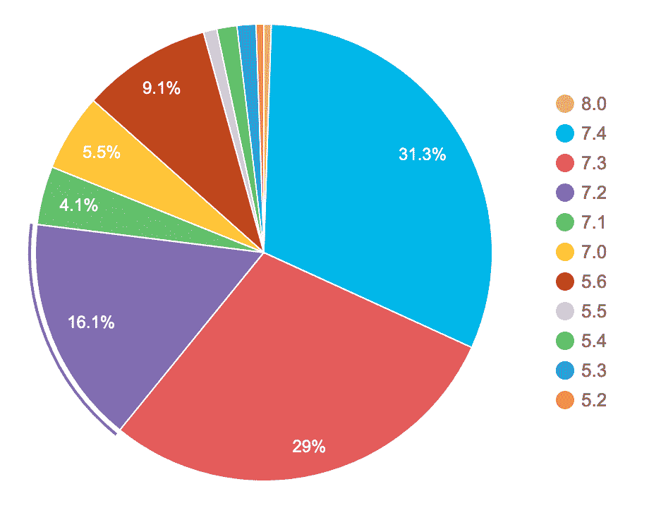
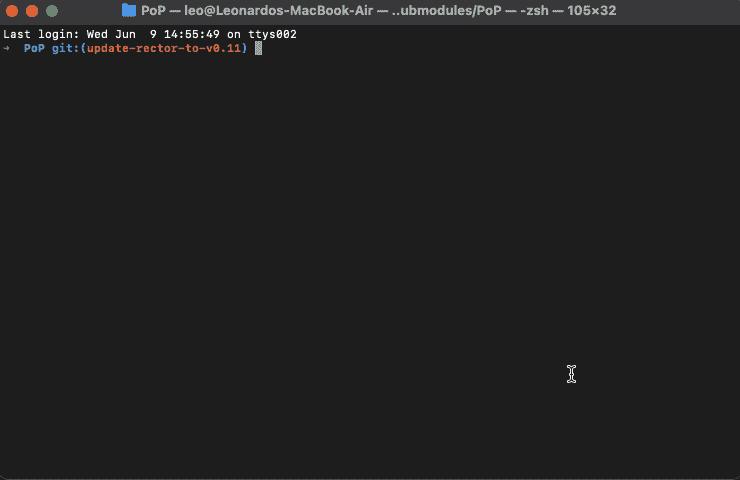
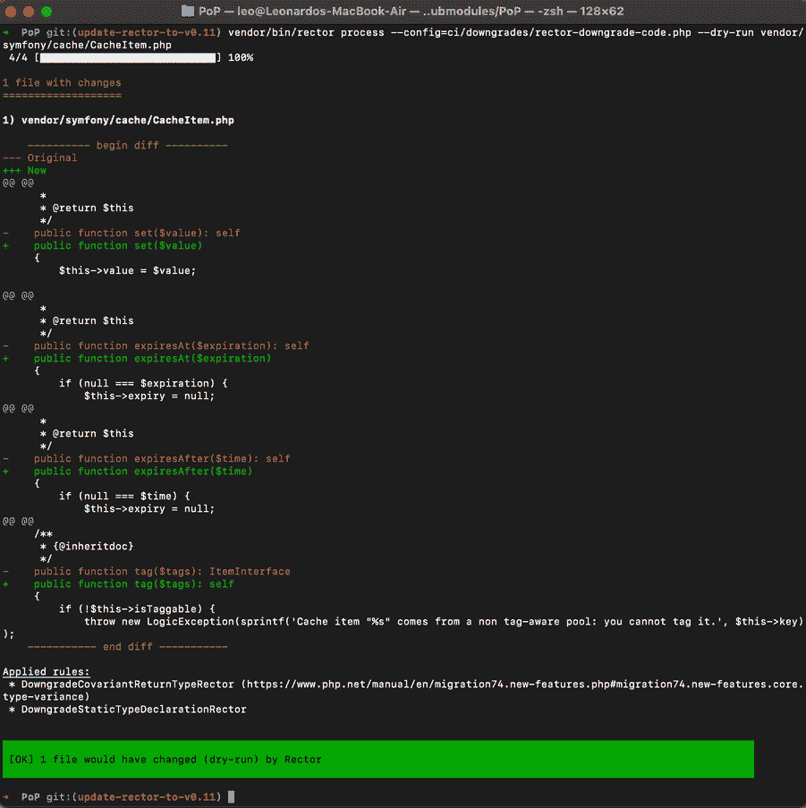

# PHP 代码编译终极指南

> 原文:# t0]https://kinta . com/blog/transiling-PHP/

在理想的情况下，我们应该为我们所有的网站使用 [PHP 8.0](https://kinsta.com/feature-updates/php-8/) (撰写本文时的最新版本)，并且在新版本发布后立即更新。然而，开发者经常需要使用以前的 PHP 版本，比如为 [WordPress](https://kinsta.com/knowledgebase/what-is-wordpress/) 创建一个公共插件，或者使用阻碍升级网络服务器环境的遗留代码。

在这些情况下，我们可以放弃使用最新 PHP 代码的希望。但是有一个更好的选择:我们仍然可以用 PHP 8.0 编写我们的源代码，并将其转换到以前的 PHP 版本——甚至是 PHP 7.1。

在本指南中，我们将教你所有你需要知道的关于编译 PHP 代码的知识。

T3】

## 什么是运输？

Transpiling 将源代码从[编程语言](https://kinsta.com/blog/best-programming-language-to-learn/)转换成相同或不同编程语言的等价源代码。

Transpiling 在 web 开发中并不是一个新概念:客户端开发人员很可能熟悉 [Babel](https://babeljs.io/) ，一个 JavaScript 代码的 transpiler。

Babel 将 JavaScript 代码从现代 ECMAScript 2015+版本转换为兼容旧浏览器的遗留版本。例如，给定一个 ES2015 箭头函数:

```
[2, 4, 6].map((n) => n * 2); 
```

…Babel 将把它转换成它的 ES5 版本:


> Kinsta 把我宠坏了，所以我现在要求每个供应商都提供这样的服务。我们还试图通过我们的 SaaS 工具支持达到这一水平。
> 
> <footer class="wp-block-kinsta-client-quote__footer">
> 
> 
> 
> <cite class="wp-block-kinsta-client-quote__cite">Suganthan Mohanadasan from @Suganthanmn</cite></footer>

[View plans](https://kinsta.com/plans/)

```
[2, 4, 6].map(function(n) {
  return n * 2;
}); 
```

### 什么是 Transpiling PHP？

web 开发中潜在的新东西是传输服务器端代码的可能性，特别是 PHP。

转换 PHP 和转换 JavaScript 的工作方式是一样的:现代 PHP 版本的源代码被转换成旧版本的等价代码。

按照前面的例子，PHP 7.4 中的一个箭头函数:

```
$nums = array_map(fn($n) => $n * 2, [2, 4, 6]); 
```

…可以转换成相当的 PHP 7.3 版本:

```
$nums = array_map(
  function ($n) {
    return $n * 2;
  },
  [2, 4, 6]
); 
```

箭头函数可以被转换，因为它们是[语法糖](https://en.wikipedia.org/wiki/Syntactic_sugar)，即产生现有行为的新语法。这是唾手可得的果实。

然而，也有一些新的特性创造了一种新的行为，因此，对于以前的 PHP 版本，将不会有等价的代码。PHP 8.0 中引入的[联合类型](https://kinsta.com/blog/php-8/#union-types-2-0)就是这种情况:

```
function someFunction(float|int $param): string|float|int|null
{
  // ...
} 
```

在这些情况下，只要新特性是开发所需要的，而不是生产所需要的，就仍然可以进行转换。然后，我们可以简单地从编译后的代码中完全删除这个特性，而不会产生严重的后果。

一个这样的例子是联合类型。这个特性用于检查输入类型和它提供的值之间没有不匹配，这有助于防止错误。如果与类型有冲突，那么在开发过程中就已经有错误了，我们应该在代码进入生产阶段之前发现并修复它。

因此，我们可以从生产代码中删除该特性:

```
function someFunction($param)
{
  // ...
} 
```

如果错误仍然发生在生产中，抛出的错误消息将没有联合类型那么精确。然而，这种潜在的缺点首先被能够使用联合类型所抵消。

## 传输 PHP 代码的优势

Transpiling 使人们能够使用最新版本的 PHP 编写应用程序，并发布一个在运行旧版本 PHP 的环境中也能工作的版本。

这对于开发人员为遗留内容管理系统(CMS)创建产品特别有用。例如，WordPress 仍然[官方支持 PHP 5.6](https://wordpress.org/about/requirements/) (尽管它推荐 PHP 7.4+)。运行 PHP 5.6 到 7.2 版本的 WordPress 网站的比例高达 34.8%，而运行 than 8.0 以外的任何版本的 WordPress 网站的比例高达 99.5%:PHP 5.6 到 7.2 版本都已停产，这意味着它们不再接收安全更新。

[](https://kinsta.com/wp-content/uploads/2021/07/wp-stats.png)

WordPress usage stats by version. Image source: [WordPress](https://wordpress.org/about/stats/)


因此，面向全球受众的 WordPress 主题和插件很可能会使用旧版本的 PHP 进行编码，以增加它们可能达到的范围。多亏了 transpiling，这些可以用 PHP 8.0 编码，并且仍然可以在旧的 PHP 版本中发布，从而面向尽可能多的用户。

事实上，任何需要支持除最新版本之外的任何 PHP 版本的应用程序(即使在当前支持的 PHP 版本范围内)都可以从中受益。

Drupal 就是这种情况，[需要 PHP 7.3](https://www.drupal.org/docs/system-requirements/php-requirements) 。多亏了 transpiling，开发人员可以使用 PHP 8.0 创建公开可用的 Drupal 模块，并使用 PHP 7.3 发布它们。

另一个例子是为由于这样或那样的原因而不能在其环境中运行 PHP 8.0 的客户创建定制代码。尽管如此，多亏了 transpiling，开发人员仍然可以使用 PHP 8.0 编写他们的可交付成果，并在那些遗留环境中运行它们。

### 何时传输 PHP

PHP 代码总是可以被编译，除非它包含一些 PHP 特性，而这些特性在以前的 PHP 版本中没有对等的特性。

PHP 8.0 中引入的[属性](https://kinsta.com/blog/php-8/#attributes)可能就是这种情况:

```
#[SomeAttr]
function someFunc() {}

#[AnotherAttr]
class SomeClass {} 
```

在前面使用箭头函数的例子中，代码可以转换，因为箭头函数是语法糖。相反，属性创造了全新的行为。这种行为也可以在 PHP 7.4 和更低版本中重现，但只能通过手动编码来实现，也就是说，不能基于工具或过程自动实现(人工智能可以提供解决方案，但我们还没有做到这一点)。

用于开发的属性，如 [`#[Deprecated]`](https://wiki.php.net/rfc/deprecated_attribute) ，可以像删除联合类型一样被删除。但是在生产中修改应用程序行为的属性不能被删除，也不能被直接转换。

到目前为止，没有一个 transpiler 可以获取带有 PHP 8.0 属性的代码，并自动生成其等价的 PHP 7.4 代码。因此，如果你的 PHP 代码需要使用属性，那么移植它将会很困难或者不可行。

### 可以移植的 PHP 特性

这些是 PHP 7.1 和更高版本中目前可以移植的特性。如果您的代码只使用这些特性，您可以享受 transpiled 应用程序将工作的确定性。否则，您需要评估转换后的代码是否会产生错误。

| PHP 版本 | 特征 |
| --- | --- |
| Seven point one | 一切 |
| Seven point two | –[`object`类型](https://www.php.net/manual/en/migration72.new-features.php#migration72.new-features.object-type)
–[参数类型加宽](https://www.php.net/manual/en/migration72.new-features.php#migration72.new-features.param-type-widening)
–[`PREG_UNMATCHED_AS_NULL`标志在`preg_match`](https://www.php.net/manual/en/function.preg-match.php#refsect1-function.preg-match-parameters) |
| Seven point three | –`list()`/数组析构中的[引用赋值](https://www.php.net/manual/en/migration73.new-features.php#migration73.new-features.core.destruct-reference) ( *内部除外`foreach`—[# 4376](https://github.com/rectorphp/rector/issues/4376))*
–[灵活的 Heredoc 和 Nowdoc 语法](https://www.php.net/manual/en/migration73.new-features.php#migration73.new-features.core.heredoc)
–[函数调用中的尾随逗号](https://www.php.net/manual/en/migration73.new-features.php#migration73.new-features.core.trailing-commas)
–[`set(raw)cookie`接受$option 参数](https://www.php.net/manual/en/migration73.other-changes.php#migration73.other-changes.core.setcookie) |
| Seven point four | –[类型化属性](https://www.php.net/manual/en/migration74.new-features.php#migration74.new-features.core.typed-properties)
–[箭头函数](https://www.php.net/manual/en/functions.arrow.php)
–[零合并赋值运算符](https://www.php.net/manual/en/migration74.new-features.php#migration74.new-features.core.null-coalescing-assignment-operator)
–[数组内部解包](https://www.php.net/manual/en/migration74.new-features.php#migration74.new-features.core.unpack-inside-array)
–[数字文字分隔符](https://www.php.net/manual/en/migration74.new-features.php#migration74.new-features.core.numeric-literal-separator)
–[`strip_tags()`带数组标记名](https://www.php.net/manual/en/migration74.new-features.php#migration74.new-features.standard.strip-tags)
–[协变返回类型和逆变参数类型](https://www.php.net/manual/en/migration74.new-features.php#migration74.new-features.core.type-variance) |
| Eight | –[联合类型](https://php.watch/versions/8.0/union-types)
–[`mixed`伪类型](https://php.watch/versions/8.0/mixed-type)–
–[–`static`返回类型](https://php.watch/versions/8.0/static-return-type)
–[–`::class`对象上的魔常数](https://php.watch/versions/8.0/class-constant-on-objects)–[–`match`表达式](https://php.watch/versions/8.0/match-expression)
–[–`catch`异常仅通过类型](https://php.watch/versions/8.0/catch-exception-type)
–[空安全运算符](https://php.watch/versions/8.0/null-safe-operator)
–[类构造函数属性提升](https://php.watch/versions/8.0/constructor-property-promotion)
 |

## PHP 传输程序

目前，有一个工具可以移植 PHP 代码: [Rector](https://github.com/rectorphp/rector) 。

Rector 是一个 PHP 重构工具，它根据可编程的规则转换 PHP 代码。我们输入源代码和[组规则](https://github.com/rectorphp/rector/blob/main/docs/rector_rules_overview.md)运行，Rector 将转换代码。

Rector 通过命令行操作，通过 Composer 安装在项目中。执行时，Rector 将输出转换前后代码的“差异”(绿色表示添加，红色表示删除):

[](https://kinsta.com/wp-content/uploads/2021/07/rector-process-dry-run.gif)

“diff” output from Rector


## 要转换到哪个版本的 PHP

要跨 PHP 版本传输代码，必须创建相应的规则。

今天，Rector 库包含了 PHP 8.0 到 7.1 范围内的大多数代码转换规则。因此，我们可以可靠地将 PHP 代码移植到 7.1 版本。

从 PHP 7.1 到 7.0 和从 7.0 到 5.6 的[也有](https://github.com/rectorphp/rector/blob/main/docs/rector_rules_overview.md#downgradephp70)[规则，但这些并不详尽。完成它们的工作正在进行中，所以我们可能最终将 PHP 代码移植到 5.6 版本。](https://github.com/rectorphp/rector/blob/main/docs/rector_rules_overview.md#downgradephp71)

## 传输与反向传输

反向移植类似于传输，但更简单。反向移植代码不一定依赖于语言的新特性。相反，可以简单地通过复制/粘贴/改编该语言新版本的相应代码，向该语言的旧版本提供相同的功能。

例如，函数`str_contains`是在 PHP 8.0 中引入的。PHP 7.4 及以下版本的相同功能可以像这样轻松实现:

```
if (!defined('PHP_VERSION_ID') || (defined('PHP_VERSION_ID') && PHP_VERSION_ID < 80000)) {
  if (!function_exists('str_contains')) {
    /**
     * Checks if a string contains another
     *
     * @param string $haystack The string to search in
     * @param string $needle The string to search
     * @return boolean Returns TRUE if the needle was found in haystack, FALSE otherwise.
     */
    function str_contains(string $haystack, string $needle): bool
    {
      return strpos($haystack, $needle) !== false;
    }
  }
} 
```

因为反向移植比传输简单，所以每当反向移植完成工作时，我们都应该选择这种解决方案。

关于 PHP 8.0 到 7.1 之间的范围，我们可以使用 [Symfony](https://symfony.com/) 的 polyfill 库:

*   [Polyfill PHP 7.1](https://github.com/symfony/polyfill-php71/)
*   [Polyfill PHP 7.2](https://github.com/symfony/polyfill-php72/)
*   [Polyfill PHP 7.3](https://github.com/symfony/polyfill-php73/)
*   [Polyfill PHP 7.4](https://github.com/symfony/polyfill-php74/)
*   [Polyfill PHP 8.0](https://github.com/symfony/polyfill-php80/)

这些库支持以下函数、类、常数和接口:

| PHP 版本 | 特征 |
| --- | --- |
| Seven point two | Functions:

*   [T2`spl_object_id`](https://php.net/spl_object_id)
*   [T2`utf8_encode`](https://php.net/utf8_encode)
*   [T2`utf8_decode`](https://php.net/utf8_decode)

常数:

*   [T2`PHP_FLOAT_*`](https://php.net/reserved.constants#constant.php-float-dig)
*   [T2`PHP_OS_FAMILY`](https://php.net/reserved.constants#constant.php-os-family)

 |
| Seven point three | Functions:

*   [T2`array_key_first`](https://php.net/array_key_first)
*   [T2`array_key_last`](https://php.net/array_key_last)
*   [T2`hrtime`](https://php.net/function.hrtime)
*   [T2`is_countable`](https://php.net/is_countable)

例外情况:

*   [T2`JsonException`](https://php.net/JsonException)

 |
| Seven point four | 功能:

*   [T2`get_mangled_object_vars`](https://php.net/get_mangled_object_vars)
*   [T2`mb_str_split`](https://php.net/mb_str_split)
*   [T2`password_algos`](https://php.net/password_algos)

 |
| Eight | Interfaces:

*   `Stringable`

类别:

*   `ValueError`
*   `UnhandledMatchError`

常数:

*   `FILTER_VALIDATE_BOOL`

功能:

*   [T2`fdiv`](https://php.net/fdiv)
*   [T2`get_debug_type`](https://php.net/get_debug_type)
*   [T2`preg_last_error_msg`](https://php.net/preg_last_error_msg)
*   [T2`str_contains`](https://php.net/str_contains)
*   [T2`str_starts_with`](https://php.net/str_starts_with)
*   [T2`str_ends_with`](https://php.net/str_ends_with)
*   [T2`get_resource_id`](https://php.net/get_resource_id)

 |

## 传输 PHP 的例子

让我们来看看几个被完全编译的 PHP 代码的例子，以及几个被完全编译的包。

### PHP 代码

`match`表达式是在 PHP 8.0 中引入的[。该源代码:](https://kinsta.com/blog/php-8/#match-expression)

```
function getFieldValue(string $fieldName): ?string
{
  return match($fieldName) {
    'foo' => 'foofoo',
    'bar' => 'barbar',
    'baz' => 'bazbaz',
    default => null,
  };
} 
```

…将通过使用`switch`操作符转换成其等效的 PHP 7.4 版本:

```
function getFieldValue(string $fieldName): ?string
{
  switch ($fieldName) {
    case 'foo':
      return 'foofoo';
    case 'bar':
      return 'barbar';
    case 'baz':
      return 'bazbaz';
    default:
      return null;
  }
} 
```

PHP 8.0 中也引入了 [nullsafe 操作符](https://kinsta.com/blog/php-8/#nullsafe-operator):

```
public function getValue(TypeResolverInterface $typeResolver): ?string
{
  return $this->getResolver($typeResolver)?->getValue();
} 
```

transpiled 代码需要首先将操作的值赋给一个新变量，以避免执行操作两次:

```
public function getValue(TypeResolverInterface $typeResolver): ?string
{
  return ($val = $this->getResolver($typeResolver)) ? $val->getValue() : null;
} 
```

PHP 8.0 中引入的[构造函数属性提升](https://kinsta.com/blog/php-8/#constructor-property-promotion)特性允许开发人员编写更少的代码:

```
class QueryResolver
{
  function __construct(protected QueryFormatter $queryFormatter)
  {
  }
} 
```

当将其转换为 PHP 7.4 时，会生成完整的代码:

```
 class QueryResolver
 {
  protected QueryFormatter $queryFormatter;

  function __construct(QueryFormatter $queryFormatter)
  {
    $this->queryFormatter = $queryFormatter;
  }
} 
```

上面的 transpiled 代码包含了 PHP 7.4 中引入的[类型属性](https://kinsta.com/blog/php-7-4/#typed-properties)。将代码下载到 PHP 7.3，用文档块替换它们:

```
 class QueryResolver
 {
  /**
   * @var QueryFormatter
   */
  protected $queryFormatter;

  function __construct(QueryFormatter $queryFormatter)
  {
    $this->queryFormatter = $queryFormatter;
  }
} 
```

### PHP 包

正在为生产传输以下库:

| 库/描述 | 代码/注释 |
| --- | --- |
| 使传输成为可能的 PHP 重建工具 | –[源代码](https://github.com/rectorphp/rector-src)
–[传输代码](https://github.com/rectorphp/rector)–[备注](https://getrector.org/blog/prefixed-rector-by-default) |
| [简易编码标准](https://tomasvotruba.com/blog/2017/05/03/combine-power-of-php-code-sniffer-and-php-cs-fixer-in-3-lines/)
工具让 PHP 代码遵守一套规则 | –[源代码](https://github.com/symplify/symplify/tree/main/packages/easy-coding-standard)
–[传输代码](https://github.com/symplify/easy-coding-standard)
–[备注](https://tomasvotruba.com/blog/introducing-ecs-prefixed-and-downgraded-to-php-71/) |
| 为 WordPress 提供 GraphQL 服务器的插件 | –[源代码](https://github.com/leoloso/PoP/tree/master/layers/GraphQLAPIForWP/plugins/graphql-api-for-wp)
–[传输代码](https://github.com/GraphQLAPI/graphql-api-for-wp-dist/)
–[备注](https://graphql-api.com/blog/the-plugin-is-now-transpiled-from-php-80-to-71/) |

## 传输 PHP 的利与弊

迁移 PHP 的好处已经描述过了:它允许源代码使用 PHP 8.0(即 PHP 的最新版本)，该版本将被转换为 PHP 的较低版本，以便在遗留应用程序或环境中运行。

这有效地允许我们成为更好的开发人员，生产更高质量的代码。这是因为我们的源代码可以使用 PHP 8.0 的联合类型、PHP 7.4 的类型化属性以及添加到每个新版本 PHP 中的不同类型和伪类型(来自 PHP 8.0 的`mixed`、来自 PHP 7.2 的`object`)，以及 PHP 的其他现代特性。

使用这些特性，我们可以在开发过程中更好地捕捉错误，并编写更易于阅读的代码。

现在，我们来看看弊端。

### 必须对其进行编码和维护

Rector 可以自动传输代码，但该过程可能需要一些手动输入，以使其与我们的特定设置一起工作。

### 第三方库也必须是透明的

每当编译它们产生错误时，这就成了一个问题，因为我们必须钻研它们的源代码来找出可能的原因。如果问题可以解决，项目是开源的，我们将需要提交一个拉请求。如果库不是开源的，我们可能会遇到障碍。

### 当代码无法传输时，Rector 不会通知我们

如果源代码包含 PHP 8.0 属性或任何其他无法转换的特性，我们就无法继续。但是，Rector 不会检查这个条件，所以我们需要手动检查。对于我们自己的源代码来说，这可能不是一个大问题，因为我们已经很熟悉它了，但是对于第三方依赖来说，这可能会成为一个障碍。

### 调试信息使用转换后的代码，而不是源代码

当应用程序在生产中产生一个带有堆栈跟踪的错误消息时，行号将指向传输的代码。我们需要从 transpiled 转换回原始代码，以便在源代码中找到相应的行号。

## 注册订阅时事通讯


### 想知道我们是怎么让流量增长超过 1000%的吗？

加入 20，000 多名获得我们每周时事通讯和内部消息的人的行列吧！

[Subscribe Now](#newsletter)

### 传输代码也必须有前缀

我们的 transpiled 项目和其他一些也安装在生产环境中的库可以使用相同的第三方依赖项。这个第三方依赖项将为我们的项目转换，并为其他库保留其原始源代码。因此，transpiled 版本必须通过 [PHP-Scoper](https://github.com/humbug/php-scoper) 、 [Strauss](https://github.com/BrianHenryIE/strauss) 或其他一些工具作为前缀，以避免潜在的冲突。

### 传输必须发生在持续集成(CI)期间

因为传输的代码自然会覆盖源代码，所以我们不应该在我们的开发计算机上运行传输过程，否则我们将冒产生副作用的风险。在 CI 运行期间运行流程更合适(下面将详细介绍)。

## 如何移植 PHP

首先，我们需要在我们的开发项目中安装 Rector:

```
composer require rector/rector --dev 
```

然后，我们在项目的根目录中创建一个包含所需规则集的`rector.php`配置文件。为了将代码从 PHP 8.0 降级到 7.1，我们使用以下配置:

```
use Rector\Set\ValueObject\DowngradeSetList;
use Symfony\Component\DependencyInjection\Loader\Configurator\ContainerConfigurator;

return static function (ContainerConfigurator $containerConfigurator): void {
    $containerConfigurator->import(DowngradeSetList::PHP_80);
    $containerConfigurator->import(DowngradeSetList::PHP_74);
    $containerConfigurator->import(DowngradeSetList::PHP_73);
    $containerConfigurator->import(DowngradeSetList::PHP_72);
}; 
```

为了确保进程按预期执行，我们可以在干模式下运行 Rector 的`process`命令，传递要处理的位置(在本例中，是文件夹`src/`下的所有文件):

```
vendor/bin/rector process src --dry-run 
```

为了执行传输，我们运行 Rector 的`process`命令，这将在文件的现有位置修改文件:

```
vendor/bin/rector process src 
```

请注意:如果我们在开发计算机上运行`rector process`，源代码将在`src/`下被转换。但是，我们希望在不同的位置生成转换后的代码，而不是在降级代码时覆盖源代码。因此，在持续集成期间运行流程是最合适的。

## 优化运输流程

要生成用于生产的 transpiled 可交付物，只需转换用于生产的代码；只需要开发的代码可以跳过。这意味着我们可以避免传输所有的测试(对于我们的项目和它的依赖项)和所有的开发依赖项。

关于测试，我们已经知道我们项目的测试在哪里——例如，在文件夹`tests/`下。我们还必须找出依赖项在哪里——例如，在它们的子文件夹`tests/`、`test/`和`Test/`下(不同的库)。然后，我们告诉 Rector 跳过处理这些文件夹:

```
return static function (ContainerConfigurator $containerConfigurator): void {
  // ...

  $parameters->set(Option::SKIP, [
    // Skip tests
    '*/tests/*',
    '*/test/*',
    '*/Test/*',
  ]);
}; 
```

关于依赖项，Composer 知道哪些是用于开发的(那些在`composer.json`的条目`require-dev`下)，哪些是用于生产的(那些在条目`require`下)。

为了从 Composer 中检索所有生产依赖项的路径，我们运行:

```
composer info --path --no-dev 
```

该命令将生成一个依赖项列表，包括它们的名称和路径，如下所示:

```
brain/cortex                     /Users/leo/GitHub/leoloso/PoP/vendor/brain/cortex
composer/installers              /Users/leo/GitHub/leoloso/PoP/vendor/composer/installers
composer/semver                  /Users/leo/GitHub/leoloso/PoP/vendor/composer/semver
guzzlehttp/guzzle                /Users/leo/GitHub/leoloso/PoP/vendor/guzzlehttp/guzzle
league/pipeline                  /Users/leo/GitHub/leoloso/PoP/vendor/league/pipeline 
```

我们可以提取所有的路径，并将它们输入到 Rector 命令中，然后该命令将处理我们项目的`src/`文件夹以及那些包含所有生产依赖项的文件夹:

```
$ paths="$(composer info --path --no-dev | cut -d' ' -f2- | sed 's/ //g' | tr '\n' ' ')"
$ vendor/bin/rector process src $paths 
```

进一步的改进可以防止 Rector 处理那些已经在使用目标 PHP 版本的依赖项。如果一个库是用 PHP 7.1(或以下任何版本)编写的，那么就没有必要把它移植到 PHP 7.1。

为了实现这一点，我们可以获得需要 PHP 7.2 及以上版本的库的列表，并只处理那些库。我们将通过 Composer 的`why-not`命令获得所有这些库的名称，如下所示:

```
composer why-not php "7.1.*" | grep -o "\S*\/\S*" 
```

因为该命令不与`--no-dev`标志一起使用，为了只包括生产依赖项，我们首先需要删除开发依赖项并重新生成自动加载程序，执行该命令，然后再次添加它们:

```
$ composer install --no-dev
$ packages=$(composer why-not php "7.1.*" | grep -o "\S*\/\S*")
$ composer install 
```

Composer 的`info --path`命令检索包的路径，格式如下:

```
# Executing this command
$ composer info psr/cache --path   
# Produces this response:
psr/cache /Users/leo/GitHub/leoloso/PoP/vendor/psr/cache 
```

我们对列表中的所有项目执行此命令，以获取到 transpile 的所有路径:

需要一个给你带来竞争优势的托管解决方案吗？Kinsta 为您提供了令人难以置信的速度、一流的安全性和自动伸缩功能。[查看我们的计划](https://kinsta.com/plans/?in-article-cta)

```
for package in $packages
do
  path=$(composer info $package --path | cut -d' ' -f2-)
  paths="$paths $path"
done 
```

最后，我们将这个列表提供给 Rector(加上项目的`src/`文件夹):

```
vendor/bin/rector process src $paths 
```

## 编译代码时要避免的陷阱

编译代码可以被认为是一门艺术，通常需要针对项目进行调整。让我们看看我们可能会遇到的几个问题。

### 链式规则并不总是被处理

链式规则是指一个规则需要转换前一个规则产生的代码。

例如，库`symfony/cache`包含[这个代码](https://github.com/symfony/cache/blob/be5707f/CacheItem.php#L115):

```
final class CacheItem implements ItemInterface
{
  public function tag($tags): ItemInterface
  {
    // ...
    return $this;
  }
} 
```

当从 PHP 7.4 转换到 7.3 时，函数`tag`必须经历两次修改:

*   由于规则 [`DowngradeCovariantReturnTypeRector`](https://github.com/rectorphp/rector-src/blob/f451b0b/rules/DowngradePhp74/Rector/ClassMethod/DowngradeCovariantReturnTypeRector.php) ，返回类型`ItemInterface`必须首先转换为`self`
*   由于规则 [`DowngradeSelfTypeDeclarationRector`](https://github.com/rectorphp/rector-src/blob/f451b0b/rules/DowngradePhp74/Rector/ClassMethod/DowngradeSelfTypeDeclarationRector.php) ，返回类型`self`必须被移除

最终结果应该是这样的:

```
final class CacheItem implements ItemInterface
{
  public function tag($tags)
  {
    // ...
    return $this;
  }
} 
```

但是，Rector 只输出中间阶段:

```
final class CacheItem implements ItemInterface
{
  public function tag($tags): self
  {
    // ...
    return $this;
  }
} 
```

问题是 [Rector 不能总是控制规则应用的顺序](https://github.com/rectorphp/rector/issues/5962)。

解决方案是识别哪些链接的规则没有被处理，并执行新的 Rector 运行来应用它们。

为了识别链接的规则，我们对源代码运行两次 Rector，如下所示:

```
$ vendor/bin/rector process src
$ vendor/bin/rector process src --dry-run 
```

第一次，我们像预期的那样运行 Rector，以执行传输文件。第二次，我们使用`--dry-run`标志来发现是否仍然需要进行更改。如果有，该命令将退出并显示一个错误代码，并且“diff”输出将指示哪些规则仍然可以应用。这意味着第一次运行没有完成，一些链接的规则没有被处理。

[](https://kinsta.com/wp-content/uploads/2021/07/rector-process-run-dry.png)

Running Rector with –dry-run flag


一旦我们确定了未应用的链接规则，我们就可以创建另一个目录配置文件——例如，`rector-chained-rule.php`将执行缺失的规则。这一次，我们可以在需要应用规则的特定文件上运行特定的缺失规则，而不是为`src/`下的所有文件处理一整套规则:

```
// rector-chained-rule.php
use Rector\Core\Configuration\Option;
use Rector\DowngradePhp74\Rector\ClassMethod\DowngradeSelfTypeDeclarationRector;
use Symfony\Component\DependencyInjection\Loader\Configurator\ContainerConfigurator;

return static function (ContainerConfigurator $containerConfigurator): void {
  $services = $containerConfigurator->services();
  $services->set(DowngradeSelfTypeDeclarationRector::class);

  $parameters = $containerConfigurator->parameters();
  $parameters->set(Option::PATHS, [
    __DIR__ . '/vendor/symfony/cache/CacheItem.php',
  ]);
}; 
```

最后，我们在第二次传递时通过输入`--config`告诉 Rector 使用新的配置文件:

```
# First pass with all modifications
$ vendor/bin/rector process src

# Second pass to fix a specific problem
$ vendor/bin/rector process --config=rector-chained-rule.php 
```

### 编写器依赖关系可能不一致

库可以声明一个将要开发的依赖项(即在`composer.json`中的`require-dev`下)，但是仍然引用它们的一些代码用于生产(比如在`src/`下的一些文件上，而不是`tests/`)。

通常，这不是问题，因为这些代码可能不会在生产中加载，所以应用程序中永远不会出现错误。但是，当 Rector 处理源代码及其依赖项时，它会验证是否可以加载所有引用的代码。如果任何文件引用了非安装库中的某段代码，Rector 将抛出一个错误(因为它被声明为仅用于开发)。

例如，Symfony 的缓存组件中的类 [`EarlyExpirationHandler`](https://github.com/symfony/symfony/blob/8f03a1f/src/Symfony/Component/Cache/Messenger/EarlyExpirationHandler.php) 实现了 Messenger 组件中的接口 [`MessageHandlerInterface`](https://github.com/symfony/symfony/blob/191cb52/src/Symfony/Component/Messenger/Handler/MessageHandlerInterface.php) :

```
class EarlyExpirationHandler implements MessageHandlerInterface
{
    //...
} 
```

然而，`symfony/cache`声明`symfony/messenger`是开发的[依赖。然后，当在依赖于`symfony/cache`的项目上运行 Rector 时，它会抛出一个错误:](https://github.com/symfony/symfony/blob/6fe82d8/src/Symfony/Component/Cache/composer.json#L43)

```
[ERROR] Could not process "vendor/symfony/cache/Messenger/EarlyExpirationHandler.php" file, due to:             
  "Analyze error: "Class Symfony\Component\Messenger\Handler\MessageHandlerInterface not found.". Include your files in "$parameters->set(Option::AUTOLOAD_PATHS, [...]);" in "rector.php" config.
  See https://github.com/rectorphp/rector#configuration". 
```

这个问题有三种解决方案:

1.  在目录配置中，跳过处理引用这段代码的文件:

```
return static function (ContainerConfigurator $containerConfigurator): void {
  // ...

  $parameters->set(Option::SKIP, [
    __DIR__ . '/vendor/symfony/cache/Messenger/EarlyExpirationHandler.php',
  ]);
}; 
```

2.  下载缺失的库并添加其路径，以便由 Rector 自动加载:

```
return static function (ContainerConfigurator $containerConfigurator): void {
  // ...

  $parameters->set(Option::AUTOLOAD_PATHS, [
    __DIR__ . '/vendor/symfony/messenger',
  ]);
}; 
```

3.  让您的项目依赖于缺失的库进行生产:

```
composer require symfony/messenger 
```

## 传输和持续集成

如前所述，在我们的开发计算机中，当运行 Rector 时，我们必须使用`--dry-run`标志，否则，源代码将被 transpiled 代码覆盖。出于这个原因，在持续集成(CI)期间运行实际的 transpiling 流程更合适，在持续集成期间，我们可以启动临时运行程序来执行流程。

执行传输过程的理想时间是为我们的项目生成发布的时候。例如，下面的[代码是](https://github.com/GraphQLAPI/graphql-api-for-wp/blob/3f9fd52ddf318b9fbb33653de8acfec8dc4b4665/.github/workflows/main.yml) [GitHub 动作](https://github.com/features/actions)的工作流，它创建了一个 WordPress 插件的发布:

```
name: Generate Installable Plugin and Upload as Release Asset
on:
  release:
    types: [published]
jobs:
  build:
    name: Build, Downgrade and Upload Release
    runs-on: ubuntu-latest
    steps:
      - name: Checkout code
        uses: actions/[[email protected]](/cdn-cgi/l/email-protection)
      - name: Downgrade code for production (to PHP 7.1)
        run: |
          composer install
          vendor/bin/rector process
          sed -i 's/Requires PHP: 7.4/Requires PHP: 7.1/' graphql-api.php
      - name: Build project for production
        run: |
          composer install --no-dev --optimize-autoloader
          mkdir build
      - name: Create artifact
        uses: montudor/[[email protected]](/cdn-cgi/l/email-protection)
        with:
          args: zip -X -r build/graphql-api.zip . -x *.git* node_modules/\* .* "*/\.*" CODE_OF_CONDUCT.md CONTRIBUTING.md ISSUE_TEMPLATE.md PULL_REQUEST_TEMPLATE.md rector.php *.dist composer.* dev-helpers** build**
      - name: Upload artifact
        uses: actions/[[email protected]](/cdn-cgi/l/email-protection)
        with:
            name: graphql-api
            path: build/graphql-api.zip
      - name: Upload to release
        uses: JasonEtco/[[email protected]](/cdn-cgi/l/email-protection)
        with:
          args: build/graphql-api.zip application/zip
        env:
          GITHUB_TOKEN: ${{ secrets.GITHUB_TOKEN }} 
```

这个工作流程包含了一个通过 GitHub Actions 发布 WordPress 插件的标准程序。新增的将插件代码从 PHP 7.4 转换到 7.1 的操作发生在以下步骤:

```
 - name: Downgrade code for production (to PHP 7.1)
        run: |
          vendor/bin/rector process
          sed -i 's/Requires PHP: 7.4/Requires PHP: 7.1/' graphql-api.php 
```

总之，此工作流现在执行以下步骤:

1.  从资源库中签出用 PHP 7.4 编写的 WordPress 插件的源代码
2.  安装其编写器依赖项
3.  将其代码从 PHP 7.4 移植到 7.1
4.  将插件主文件头中的“需要 PHP”条目从`"7.4"`修改为`"7.1"`
5.  消除开发所需的依赖性
6.  创建插件的。zip 文件，不包括所有不需要的文件
7.  上传。zip 文件作为发布资产(此外，作为 GitHub 动作的工件)

## 测试编译的代码

一旦代码被转换到 PHP 7.1，我们如何知道它工作得很好？或者，换句话说，我们如何知道它已经被彻底转换，并且没有留下更高版本 PHP 代码的残余？

类似于传输代码，我们可以在 CI 流程中实现解决方案。这个想法是用 PHP 7.1 建立 runner 的环境，并在 transpiled 代码上运行一个 linter。如果任何一段代码与 PHP 7.1 不兼容(比如 PHP 7.4 中没有转换的类型化属性)，那么 linter 将抛出一个错误。

一个适用于 PHP 的 linter 是 [PHP 并行 Lint](https://github.com/php-parallel-lint/PHP-Parallel-Lint) 。我们可以将该库安装为项目开发的依赖项，或者让 CI 流程将其安装为独立的 Composer 项目:

```
composer create-project php-parallel-lint/php-parallel-lint 
```

每当代码包含 PHP 7.2 及以上版本，PHP Parallel Lint 都会抛出类似[这个](https://github.com/leoloso/PoP/runs/2751846434?check_suite_focus=true)的错误:

```
Run php-parallel-lint/parallel-lint layers/ vendor/ --exclude vendor/symfony/polyfill-ctype/bootstrap80.php --exclude vendor/symfony/polyfill-intl-grapheme/bootstrap80.php --exclude vendor/symfony/polyfill-intl-idn/bootstrap80.php --exclude vendor/symfony/polyfill-intl-normalizer/bootstrap80.php --exclude vendor/symfony/polyfill-mbstring/bootstrap80.php
PHP 7.1.33 | 10 parallel jobs
............................................................   60/2870 (2 %)
............................................................  120/2870 (4 %)
...
............................................................  660/2870 (22 %)
.............X..............................................  720/2870 (25 %)
............................................................  780/2870 (27 %)
...
............................................................ 2820/2870 (98 %)
..................................................           2870/2870 (100 %)

Checked 2870 files in 15.4 seconds
Syntax error found in 1 file

------------------------------------------------------------
Parse error: layers/GraphQLAPIForWP/plugins/graphql-api-for-wp/graphql-api.php:55
    53|     '0.8.0',
    54|     \__('GraphQL API for WordPress', 'graphql-api'),
  > 55| ))) {
    56|     $plugin->setup();
    57| }
Unexpected ')' in layers/GraphQLAPIForWP/plugins/graphql-api-for-wp/graphql-api.php on line 55
Error: Process completed with exit code 1. 
```

让我们将 linter 添加到 CI 的工作流中。将代码从 PHP 8.0 转换到 7.1 并进行测试的步骤如下:

1.  查看源代码
2.  让环境运行 PHP 8.0，这样 Rector 就可以解释源代码
3.  将代码转换到 PHP 7.1
4.  安装 PHP linter 工具
5.  将环境的 PHP 版本切换到 7.1
6.  在传输的代码上运行 linter

这个 [GitHub 动作工作流](https://github.com/leoloso/PoP/blob/b93d3e35cb59e0281b45899fd82231c3d8cbbe25/.github/workflows/downgrade_php_tests.yml)完成工作:

```
name: Downgrade PHP tests
jobs:
  main:
    name: Downgrade code to PHP 7.1 via Rector, and execute tests
    runs-on: ubuntu-latest
    steps:
      - name: Checkout code
        uses: actions/[[email protected]](/cdn-cgi/l/email-protection)

      - name: Set-up PHP
        uses: shivammathur/[[email protected]](/cdn-cgi/l/email-protection)
        with:
          php-version: 8.0
          coverage: none

      - name: Local packages - Downgrade PHP code via Rector
        run: |
          composer install
          vendor/bin/rector process

      # Prepare for testing on PHP 7.1
      - name: Install PHP Parallel Lint
        run: composer create-project php-parallel-lint/php-parallel-lint --ansi

      - name: Switch to PHP 7.1
        uses: shivammathur/[[email protected]](/cdn-cgi/l/email-protection)
        with:
          php-version: 7.1
          coverage: none

      # Lint the transpiled code
      - name: Run PHP Parallel Lint on PHP 7.1
        run: php-parallel-lint/parallel-lint src/ vendor/ --exclude vendor/symfony/polyfill-ctype/bootstrap80.php --exclude vendor/symfony/polyfill-intl-grapheme/bootstrap80.php --exclude vendor/symfony/polyfill-intl-idn/bootstrap80.php --exclude vendor/symfony/polyfill-intl-normalizer/bootstrap80.php --exclude vendor/symfony/polyfill-mbstring/bootstrap80.php 
```

请注意，Symfony 的 polyfill 库中的几个`bootstrap80.php`文件(不需要传输)必须从 linter 中排除。这些文件包含 PHP 8.0，所以 linter 在处理它们时会抛出错误。然而，排除这些文件是安全的，因为只有当[运行 PHP 8.0 或更高版本](https://github.com/symfony/polyfill-mbstring/blob/9ad2f3c/bootstrap.php#L14-L16)时，它们才会被加载到生产中:

```
if (\PHP_VERSION_ID >= 80000) {
  return require __DIR__.'/bootstrap80.php';
} 
```

[无论你是在为 WordPress 创建一个公共插件，还是在更新旧代码，都有很多原因让你无法使用最新的 PHP 版本👩‍💻在本指南中了解 transpiling 如何提供帮助👇](https://twitter.com/intent/tweet?url=https%3A%2F%2Fbit.ly%2F3EHsVBq&via=kinsta&text=Whether+you%27re+creating+a+public+plugin+for+WordPress+or+you%27re+updating+legacy+code%2C+there+are+many+reasons+that+using+the+latest+PHP+version+may+be+impossible+%F0%9F%91%A9%E2%80%8D%F0%9F%92%BB+Learn+how+transpiling+can+help+in+this+guide+%F0%9F%91%87&hashtags=PHP%2CWebDev)

## 摘要

这篇文章告诉我们如何转换我们的 PHP 代码，允许我们在源代码中使用 PHP 8.0 并创建一个在 PHP 7.1 上工作的版本。传输是通过 PHP 重构工具[的](https://github.com/rectorphp/rector)完成的。

编译我们的代码使我们成为更好的开发人员，因为我们可以更好地捕捉开发中的错误，并生成自然更容易阅读和理解的代码。

Transpiling 还使我们能够将具有特定 PHP 需求的代码从 CMS 中分离出来。如果我们希望使用最新版本的 PHP 来创建一个公开可用的 WordPress 插件或 Drupal 模块，而不严重限制我们的用户群，我们现在可以这样做。

关于 PHP 的翻译，你还有什么问题吗？请在评论区告诉我们！

* * *

让你所有的[应用程序](https://kinsta.com/application-hosting/)、[数据库](https://kinsta.com/database-hosting/)和 [WordPress 网站](https://kinsta.com/wordpress-hosting/)在线并在一个屋檐下。我们功能丰富的高性能云平台包括:

*   在 MyKinsta 仪表盘中轻松设置和管理
*   24/7 专家支持
*   最好的谷歌云平台硬件和网络，由 Kubernetes 提供最大的可扩展性
*   面向速度和安全性的企业级 Cloudflare 集成
*   全球受众覆盖全球多达 35 个数据中心和 275 多个 pop

在第一个月使用托管的[应用程序或托管](https://kinsta.com/application-hosting/)的[数据库，您可以享受 20 美元的优惠，亲自测试一下。探索我们的](https://kinsta.com/database-hosting/)[计划](https://kinsta.com/plans/)或[与销售人员交谈](https://kinsta.com/contact-us/)以找到最适合您的方式。