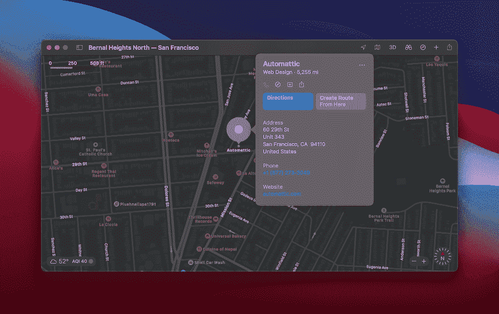
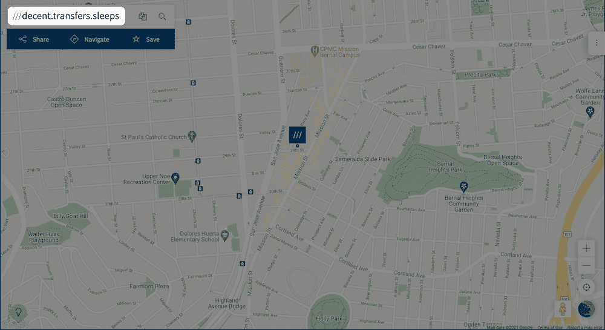
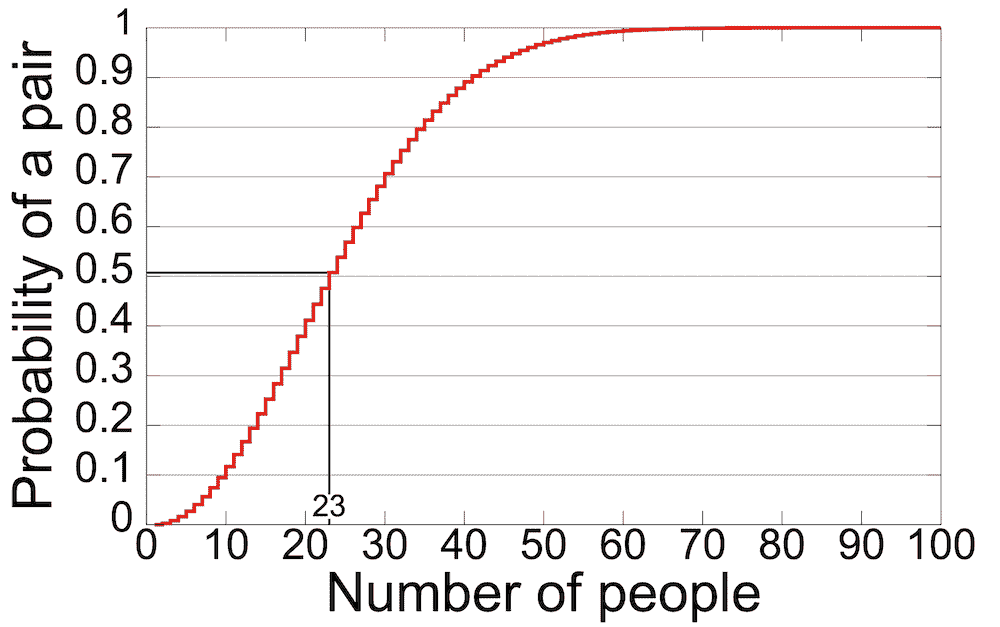
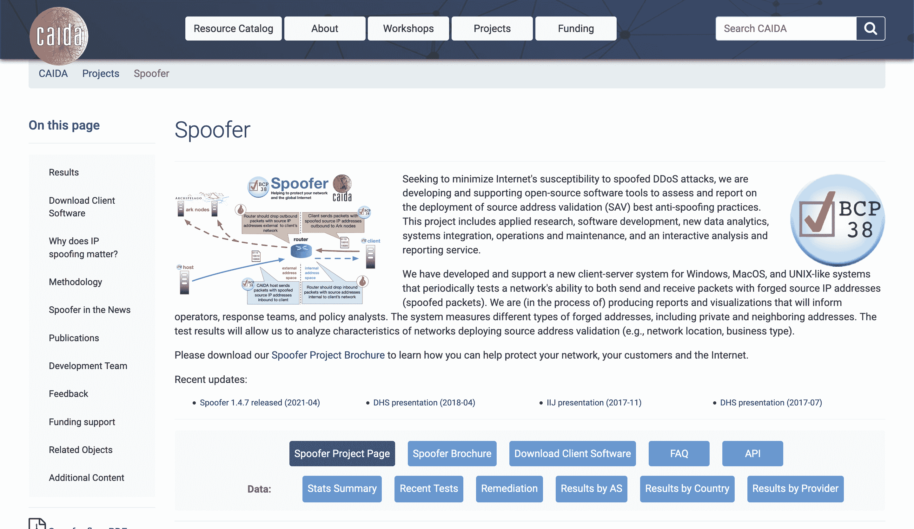

# “DNS 中毒”介绍(以及如何预防)

> 原文：<https://kinsta.com/blog/dns-poisoning/>

如果说好莱坞电影教会了我们一件事，那就是黑客很聪明，有各种各样的技巧来绕过我们的安全。在现实世界中，安全问题往往归结于机会，而不是发展的技能。一个“DNS 中毒”攻击符合这种描述，事实上，*你*需要有技能来防止你的域名被欺骗。

这个概念很简单:访问者看到的是看起来像你的网站，但它是欺诈性的和有害的，而这个假网站看起来很相似。因此，您需要采用多种技术来确保用户的安全，并且您的站点不会受到攻击。

在本帖中，我们将深入探讨 DNS 中毒和域名欺骗的概念。我们还将讨论一些相关概念，以帮助您理解为什么您的最终反应是最佳方法。

## 域名系统(DNS)入门

在我们进入 DNS 中毒的细节之前，让我们聊聊[域名系统](https://kinsta.com/knowledgebase/what-is-dns/)。虽然浏览一个网站似乎是一项简单的任务，但在服务器的罩下进行了很多工作。

从“A”到“B”有很多因素:

*   **IP 地址。**这是一串[数字](https://kinsta.com/tools/what-is-my-ip/)这是你的实际网址。把它们当成你房子的坐标。例如， **127.0.0.1:8080** 是一个标准的“本地主机”地址(即您的电脑)。
*   **域名。**如果 IP 地址代表坐标，[域名](https://kinsta.com/blog/choose-domain-name/)就是信封上显示的您的地址。当然，“kinsta.com”是数百万个例子中的一个。
*   **一个 DNS 请求。**这是一个高级前端任务和复杂的低级流程的极好例子。现在，考虑一个请求，作为你的浏览器询问一个专用服务器一组坐标的地址是什么。
*   **一个 DNS 服务器。**这与你网站的服务器不同，它是四台服务器合二为一。它的工作是[处理 DNS 请求](https://kinsta.com/knowledgebase/dns-server-not-responding/)。我们将在后面的章节中更详细地讨论这一点。
*   **递归服务器。**您还会看到这些被称为“解析名称服务器”的服务器它是 DNS 查找过程的一部分，负责向服务器查询与 IP 地址相关的域名。

总的来说，DNS 使最终用户获取域名变得简单。它是网络的核心部分，因此，它有许多移动的部分。

> 需要在这里大声喊出来。Kinsta 太神奇了，我用它做我的个人网站。支持是迅速和杰出的，他们的服务器是 WordPress 最快的。
> 
> <footer class="wp-block-kinsta-client-quote__footer">
> 
> 
> 
> <cite class="wp-block-kinsta-client-quote__cite">Phillip Stemann</cite></footer>

[View plans](https://kinsta.com/plans/)

我们接下来将查看查找过程本身，尽管您已经可以看到 DNS 有一项重要的工作要完成。

[不要让你的网站成为 DNS 中毒攻击的牺牲品☠️在这里学习你需要的防止你的域名被欺骗的基本技能⬇️ 点击推文](https://twitter.com/intent/tweet?url=https%3A%2F%2Fkinsta.com%2Fblog%2Fdns-poisoning%2F&via=kinsta&text=Don%27t+let+your+site+fall+prey+to+a+DNS+poisoning+attack+%E2%98%A0%EF%B8%8F+Learn+the+essential+skills+you+need+to+keep+your+domain+from+being+spoofed+here+%E2%AC%87%EF%B8%8F&hashtags=Hacking%2CSiteSecurity)

## DNS 查找的过程

在我们提供看似抽象的类比时，请耐心等待。

带人们去偏远地方的活动，如登山或航海，都有一个特定的危险:迷路，不能及时被发现。定位被困人员的传统方法是使用坐标。它们清晰明了，提供了精确的精确度。

然而，这种方法也有缺点。首先，你需要知道如何计算任何位置的坐标——如果在世界的偏远地区，这就很棘手了。第二，你必须把这些坐标清晰地告诉救援队。一个错误的号码，后果是可怕的。

这款名为 what3words 的应用程序将复杂的坐标计算和传递过程转化为三个字的概括。以 [Automattic 的总部](https://automattic.com/contact/)为例:

The Automattic offices in Apple Maps.

该地点的坐标为 **37.744159，-122.421555** 。除非你是一个专业的导航员，否则你不可能知道这些。即使你知道，把它交到能帮你的人手里也是一个渺茫的提议。

简单来说，what3words 就是把一组抽象的坐标，翻译成三个值得记忆的单词。就 Automattic 的办公室而言，它是**体面的。**

The what3words website, showing Automattic’s offices.

这将复杂的全球定位交给了几乎所有能够访问该应用的人。已经拯救了很多平民的生命。

这与 DNS 查找有关，因为过程是相似的。在 what3words 的情况下，救援者向应用程序询问一个单词串的坐标。请求通过服务器发送，寻找坐标，找到后返回给最终用户。

[DNS 查找具有类似的流程](https://kinsta.com/blog/dns-propagation/#What-is-DNS-Lookup?):

*   您的浏览器请求域名的 IP 地址。
*   您的操作系统(OS)要求递归服务器找到域名，并开始运行它的服务器集合。
*   当它找到域名时，它被返回给浏览器。

what3words 的缺点之一是一个字符串不如一组坐标精确。这意味着你可以很快确定一个大概的位置，但是可能要花更长的时间来找到受困者。

DNS 查找也有缺点，恶意攻击者可以利用它们。不过，在我们开始讨论这个问题之前，让我们先绕一个弯子来讨论一下缓存以及它是如何加速查找的。

### DNS 缓存

与 web 缓存非常相似，DNS 缓存可以帮助您撤回对服务器的常规查询。这将使每次新访问获取 IP 地址的过程更快。

简而言之，缓存位于 DNS 服务器系统内，省去了到递归服务器的额外行程。这意味着浏览器可以直接从 DNS 服务器获取 IP 地址，并在更短的时间内完成 **GET** 请求。

你会发现 DNS 缓存遍布整个系统。例如，你的电脑会有一个 DNS 缓存，你的路由器和互联网服务提供商也会有( [ISP](https://kinsta.com/knowledgebase/what-is-isp/) )。你常常意识不到你的浏览体验有多依赖 DNS 缓存——直到你成为 DNS 中毒的受害者。
T3】

## 什么是 DNS 中毒

现在您已经理解了 DNS 查找的概念和获取 IP 地址的整个过程，我们可以看看如何利用它。

你会经常看到 DNS 中毒也被称为“欺骗”,因为链中有一个欺诈性的“相似”网站是攻击的一部分。

我们将更详细地讨论所有这些方面，但要知道 DNS 中毒或欺骗是一种有害的攻击，会给用户和互联网带来精神、金钱和资源相关的问题。

不过，首先让我们了解一下缓存中毒的过程。

### DNS 欺骗和缓存中毒的工作原理

鉴于整个欺骗过程非常复杂，攻击者创造了许多不同的方法来实现他们的目标:

*   **中间机器。**这是攻击者进入浏览器和 DNS 服务器之间，毒害两者，并将用户重定向到他们自己服务器上的欺诈网站的地方。
*   **服务器劫持。**如果攻击者进入 DNS 服务器，他们可以重新配置它，将所有请求发送到自己的站点。
*   **通过垃圾邮件投毒。**与服务器劫持相反，这种方法会毒害客户端(即浏览器)。访问权限通常是通过垃圾链接、电子邮件和欺诈性广告授予的。
*   《生日袭击》这是一个[复杂的密码攻击](http://www.didblog.com/what-is-a-bind-birthday-attack-on-dns-and-how-to-eliminate-this-threat/)，需要进一步解释。

生日攻击是基于[“生日问题](https://brilliant.org/wiki/birthday-paradox/)”这是一个概率场景，简单地说，如果一个房间里有 23 个人，有 50%的可能性两个人同一天生日。如果房间里有更多的人，机会就会增加。

A graph showing the Birthday Problem. (Image source: Wikipedia)

基于将 DNS 查找请求连接到 **GET** 响应的标识符，这转化为 DNS 中毒。如果攻击者发送一定数量的随机请求和响应，则很有可能匹配到成功的中毒尝试。从大约 450 个请求来看，概率约为 75%，而在 700 个请求时，攻击者几乎可以保证破解服务器。

简而言之，对 DNS 服务器的攻击在大多数情况下都会发生，因为这给了恶意用户更大的灵活性来操纵您的站点和用户数据。也没有对 DNS 数据的验证，因为请求和响应不使用[传输控制协议(TCP)](https://kinsta.com/blog/http3/#tcp) 。

## 注册订阅时事通讯

### 想知道我们是怎么让流量增长超过 1000%的吗？

加入 20，000 多名获得我们每周时事通讯和内部消息的人的行列吧！

[Subscribe Now](#newsletter)

链条中的弱点是 DNS 缓存，因为它充当 DNS 条目的存储库。如果攻击者可以向缓存中注入伪造的条目，那么每个访问它的用户都会发现自己处于一个欺诈站点，直到缓存过期。

攻击者通常会寻找一些信号、弱点和数据点作为目标。他们的工作是发现还没有被缓存的 DNS 查询，因为递归服务器将不得不在某个时候进行查询。通过扩展，攻击者还会寻找查询将到达的名称服务器。一旦有了这些，解析器使用的端口和请求 ID 号就非常重要了。

虽然没有必要满足所有这些要求——毕竟，攻击者可以通过多种方法访问服务器——但勾选这些选项会使他们的工作更容易。

### DNS 中毒的真实例子

在过去的几年里，DNS 中毒已经有了一些引人注目的例子。在某些情况下，这是一种故意的行为。例如，中国运行了一个大规模的防火墙(所谓的“中国防火长城”)来控制互联网用户接收的信息。

简而言之，他们通过将访问者重定向到未经国家批准的网站，如 Twitter 和脸书，来毒害自己的服务器。在一个案例中，中国的限制甚至进入了西方世界的生态系统。

一个来自瑞典 ISP 的网络错误提供了来自中国服务器的根 DNS 信息。这意味着智利和美国的用户在访问一些社交媒体网站时会被重定向到其他地方。

另一个例子是，抗议马来西亚虐待行为的孟加拉国黑客毒害了许多与微软、谷歌、YouTube 和其他知名网站相关的域名。这似乎是服务器劫持的情况，而不是客户端问题或垃圾邮件。

甚至维基解密也不能幸免于 DNS 中毒攻击。几年前，一次潜在的服务器劫持导致网站访问者被重定向到黑客专用页面。

DNS 中毒不一定是一个复杂的过程。所谓的“道德黑客”——即那些希望揭露安全漏洞而不是造成损害的人——有简单明了的方法在他们自己的电脑上测试欺骗。

不过，除了被重定向之外，DNS 中毒在表面上似乎没有任何长期影响。事实上，是有的——我们接下来会谈到它们。

### 为什么 DNS 中毒和欺骗如此有害

攻击者希望在服务器上执行 DNS 中毒有三个主要目标:

*   来[传播恶意软件](https://kinsta.com/knowledgebase/the-site-ahead-contains-malware/)。
*   让你转到另一个对他们有好处的网站。
*   从你或其他实体窃取信息。

当然，理解为什么 DNS 中毒或欺骗对 ISP、服务器运营商和最终用户来说是个问题并不困难。

正如我们所提到的，欺骗对于 ISP 来说是一个大问题，以至于有像 CAIDA Spoofer 这样的[工具可以提供帮助。](https://www.caida.org/projects/spoofer/)

需要一个给你带来竞争优势的托管解决方案吗？Kinsta 为您提供了令人难以置信的速度、一流的安全性和自动伸缩功能。[查看我们的计划](https://kinsta.com/plans/?in-article-cta)

The CAIDA website.

几年前，[统计数据显示](https://www.delltechnologies.com/en-us/perspectives/new-internet-research-shows-30000-spoofing-attacks-per-day/)每天大约有 30，000 次攻击。自报告发表以来，这一数字几乎肯定会增加。此外，与上一节中的示例一样，通过网络交付欺骗站点会带来用户信任问题以及隐私问题。

无论你是谁，当你成为中毒和欺骗的受害者时，都会有一些风险:

*   就像中国的防火长城一样，你可能会受到审查。这意味着你得到的信息将是不准确的，这将对许多社会和政治领域产生连锁反应。
*   数据盗窃是一个首要问题，对于那些想要获取用户银行信息和其他敏感数据的人来说，这是一个有利可图的风险。
*   您的系统可能容易受到不同类型的恶意软件和其他特洛伊木马病毒的攻击。例如，攻击者可以通过欺骗站点在您的系统中注入键盘记录器或其他形式的间谍软件。

DNS 中毒还有其他相关的影响。例如，在恢复过程全面展开时，您可能无法对系统应用任何安全更新。这让你的电脑更容易受到攻击。

此外，考虑这个清理过程的成本和复杂性，因为它会影响到整个链条上的每个人。所有联网服务的价格上涨只是不利因素之一。

消除 DNS 中毒的努力是巨大的。鉴于欺骗会影响客户端和服务器端的设置，消除欺骗并不意味着完全消除欺骗。

## 如何防止 DNS 中毒

受 DNS 中毒影响的有两个方面—客户端和服务器端。我们将看看您可以做些什么来防止这种两面攻击。

让我们从互联网作为一个整体在服务器端做什么开始。

### 互联网如何试图防止 DNS 中毒和欺骗服务器端

尽管我们在整篇文章中谈了很多关于 DNS 的内容，但我们并没有注意到这项技术有多过时。简而言之，由于一些因素，DNS 并不是现代网络浏览体验的最佳选择。首先，它是未加密的，没有一些重要的验证考虑，这将阻止许多 DNS 中毒攻击的继续。

防止攻击变得更强的一个快速方法是通过一个简单的日志策略。这在请求和响应之间进行了直接的比较，看它们是否匹配。

然而，长期的解决办法(根据专家的说法)是使用[域名系统安全扩展(DNSSEC)](https://www.dnssec.net/) 。这是一项旨在对抗 DNS 中毒的技术，简单来说，它将不同级别的验证置于适当的位置。

更深入地说，DNSSEC 使用“公钥加密”作为验证。这是认可数据真实可信的一种方式。它与您的其他 DNS 信息一起存储，递归服务器使用它来检查它接收的信息没有被更改。

与其他互联网协议和技术相比，DNSSEC 是一个相对的婴儿，但它足够成熟，可以在互联网的底层实现，尽管它还不是主流。谷歌的公共域名服务是一项完全支持 DNSSEC 的服务，而且还会有更多的服务不断涌现。

即便如此，DNSSEC 仍有一些值得注意的缺点:

*   该协议不对响应进行编码。这意味着攻击者仍然可以“监听”流量，尽管攻击必须更加复杂才能绕过 DNSSEC。
*   因为 DNSSEC 使用额外的记录来收集 DNS 数据，所以还有一个叫做“区域枚举”的漏洞这使用一个记录“遍历”并收集特定“区域”内的所有 DNS 记录这种记录的一些版本加密了数据，但其他版本还没有。
*   DNSSEC 是一个复杂的协议，因为它也是新的，所以有时会被误解。当然，这可能会侵蚀使用它的好处，并带来进一步的问题。

即便如此，至少在服务器端，DNSSEC 是未来。作为最终用户，你也可以采取一些预防措施。

### 如何在客户端防止 DNS 中毒

有更多的方法可以在客户端防止 DNS 中毒，尽管没有一种方法像专家实现的服务器端 DNSSEC 那样强大。尽管如此，作为网站所有者，您还是可以选择一些简单的选项:

*   对任何请求和回复使用端到端加密。[安全套接字层(SSL)证书](https://kinsta.com/knowledgebase/ssl-check/)在这里做得很好。
*   使用欺骗检测工具。它们可以在发送出去之前扫描接收到的数据包。这减少了任何恶意的数据传输。
*   增加 DNS 缓存的[生存时间(TTL)值](https://labs.ripe.net/author/giovane_moura/how-to-choose-dns-ttl-values/)将有助于在恶意条目到达最终用户之前清除它们。
*   您应该有一个好的 [DNS、DHCP 和 IPAM (DDI)](https://www.efficientip.com/what-is-ddi-dns-dhcp-ipam/) 策略。这包括您的 DNS 策略、动态主机配置协议和 IP 地址管理。这是一个由系统管理员和服务器安全专家处理的复杂而必要的过程。

作为最终用户，您还可以做一些事情来帮助防止中毒和欺骗:

*   使用[虚拟专用网络(VPN)](https://kinsta.com/blog/proxy-vs-vpn/#what-is-a-virtual-private-network-vpn) ，因为您的数据将被端到端加密。您还可以使用私有 DNS 服务器，同样是端到端加密。
*   采取简单的预防措施，例如不要点击未识别的链接，并定期进行安全扫描。
*   [定期刷新 DNS](https://kinsta.com/knowledgebase/flush-dns/) 缓存也能清除系统中的恶意数据。这需要几秒钟的时间，而且执行起来很简单。

虽然你不能完全消除 DNS 中毒，但你可以防止最坏的事情发生。作为最终用户，您对服务器如何处理攻击没有太多的控制权。同样，系统管理员也不能控制浏览器中发生的事情。因此，这是一个团队的努力，以阻止这种最有害的攻击影响整个链。

[Picture this: a visitor is sent to what looks like your site.. but it's a harmful fraudulent version. 😱 Put a stop to DNS poisoning attacks like this with help from this guide ⬇️Click to Tweet](https://twitter.com/intent/tweet?url=https%3A%2F%2Fkinsta.com%2Fblog%2Fdns-poisoning%2F&via=kinsta&text=Picture+this%3A+a+visitor+is+sent+to+what+looks+like+your+site..+but+it%27s+a+harmful+fraudulent+version.+%F0%9F%98%B1+Put+a+stop+to+DNS+poisoning+attacks+like+this+with+help+from+this+guide+%E2%AC%87%EF%B8%8F&hashtags=SiteSecurity%2CDNS)

## 摘要

互联网攻击司空见惯。DNS 中毒(或欺骗)是一种常见的攻击，如果不加控制，可能会影响数百万用户。这是因为 DNS 协议已经过时，不适合现代网络浏览——尽管更新的技术已经出现。

简而言之，DNS 中毒将最终用户重定向到现有网站的欺诈版本。这是一种窃取数据并用恶意软件感染系统的方式。没有万无一失的方法可以完全防止它，但是你*可以通过一些简单的措施来控制它。*

*您曾经是 DNS 中毒或欺骗的受害者吗？如果是，原因是什么？请在下面的评论区和我们分享你的经验！*

* * *

让你所有的[应用程序](https://kinsta.com/application-hosting/)、[数据库](https://kinsta.com/database-hosting/)和 [WordPress 网站](https://kinsta.com/wordpress-hosting/)在线并在一个屋檐下。我们功能丰富的高性能云平台包括:

*   在 MyKinsta 仪表盘中轻松设置和管理
*   24/7 专家支持
*   最好的谷歌云平台硬件和网络，由 Kubernetes 提供最大的可扩展性
*   面向速度和安全性的企业级 Cloudflare 集成
*   全球受众覆盖全球多达 35 个数据中心和 275 多个 pop

在第一个月使用托管的[应用程序或托管](https://kinsta.com/application-hosting/)的[数据库，您可以享受 20 美元的优惠，亲自测试一下。探索我们的](https://kinsta.com/database-hosting/)[计划](https://kinsta.com/plans/)或[与销售人员交谈](https://kinsta.com/contact-us/)以找到最适合您的方式。