# WordPress vs Blogger:哪个对你的网站更好？

> 原文：<https://kinsta.com/blog/wordpress-vs-blogger/>

博客在过去的十年里变得如此流行，以至于总的数字可能会让那些铁杆博客写手感到惊讶。

网上有将近 17 亿个网站。在这些网站中，大约有 6 亿是博客。今天，我们将看看两个[流行的博客平台](https://kinsta.com/blog/best-blogging-platform/)——WordPress 和 Blogger——看看哪一个更好。我们还将介绍 WordPress 的开源软件[CMS](https://kinsta.com/blog/wordpress-com-vs-wordpress-org/)，一个你完全拥有的 WordPress 的自托管版本。

准备好了吗？开始吧！

T3】

## WordPress 和 Blogger 概述

WordPress 和 Blogger 平台都有独特的历史。在进入比较部分之前，为了更好地理解这两者，让我们对它们做一个快速的概述。

### WordPress 概述

WordPress 成立于 2003 年 5 月 27 日，最初只是为了写博客。随着时间的推移，这个平台演变成了一个功能齐全的 CMS 平台，它允许大量的自由和功能来建立网站。

### 信息

WordPress **。org** 是由非营利组织*WordPress Foundation*管理的开源软件。WordPress **。com** 是一家由使用 WordPress 的*automatic*所有的营利性企业。 **org** 开源软件。

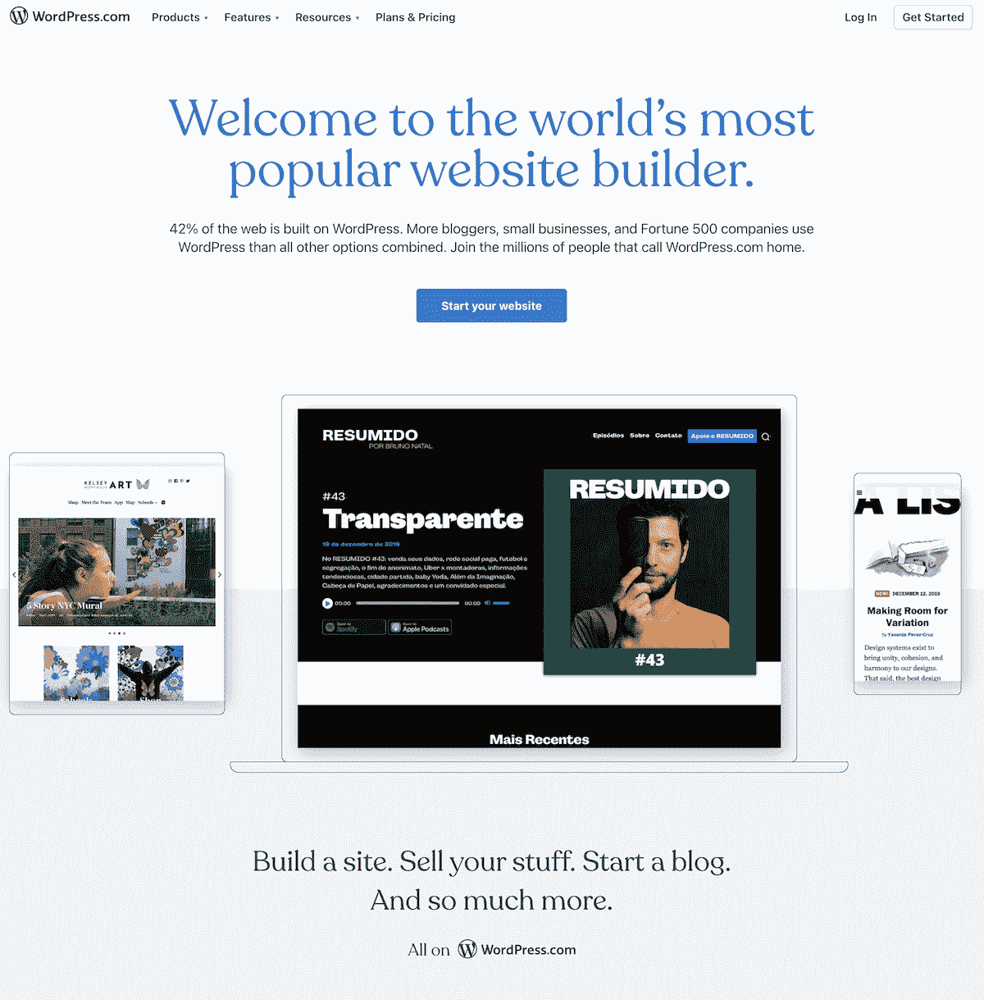

WordPress.com website.

虽然你现在可以使用 WordPress(尤其是 WordPress.org)建立任何你想建立的网站，但它仍然在博客社区中广受欢迎。所以从这个意义上来说，它仍然保持接近它的根源。

> 需要在这里大声喊出来。Kinsta 太神奇了，我用它做我的个人网站。支持是迅速和杰出的，他们的服务器是 WordPress 最快的。
> 
> <footer class="wp-block-kinsta-client-quote__footer">
> 
> 
> 
> <cite class="wp-block-kinsta-client-quote__cite">Phillip Stemann</cite></footer>

[View plans](https://kinsta.com/plans/)

WordPress 是，一直是，并将永远是一个开源平台。任何人都可以贡献代码，当使用[主题](https://kinsta.com/best-wordpress-themes/)和[插件](https://kinsta.com/best-wordpress-plugins/)时，你有自由和能力来构建和改变你想要的东西，只要你知道足够多的编码。

该系统是用 PHP 编写的，并配有一个 MySQL 数据库，或者最近的一个 MariaDB 数据库。

仅在 WordPress 上就有超过 8000 个主题可以使用，而 WordPress 插件库中有超过 58000 个可用的插件。

### 博客概述

有些人可能会感到惊讶，但是 Blogger 出现在 WordPress 之前。1999 年 8 月 23 日，Blogger 由一家名为 Pyra Labs 的公司向大众发布。谷歌后来在 2003 年收购了它，他们至今仍拥有它。

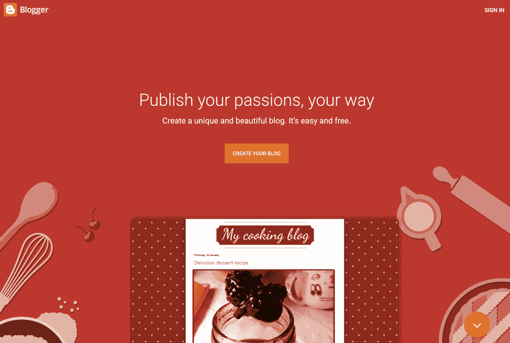

博主网站。

像 WordPress 一样，它是一个博客发布平台，为用户提供发布和[维护博客](https://kinsta.com/blog/proofreading-tips/)的所有工具。

你可能也听说过“Blogspot”这个术语。它指的是相同的服务。

虽然您可能会惊讶地发现 Blogger 仍然存在，但它确实存在，而且仍有很多人在使用它。就在 2018 年，谷歌对该平台进行了[大范围更新](https://techcrunch.com/2018/05/15/blogger-gets-a-spring-cleaning-web20-wants-its-headlines-back/)以保持其运行。

Blogger 仍然是一个广泛使用的成熟的博客平台。虽然市场份额与 WordPress 相比相形见绌——正如我们将在下面看到的那样——但它仍然是在志同道合的社区中进行互动和建设的一个很好的方式。

### WordPress vs Blogger——数据和市场份额

当谈到 WordPress 与 Blogger 的实际市场份额时，数字并不接近。WordPress 运营着互联网上 43.3%的网站。

Blogger 的数字并不令人印象深刻，因为它大约在 1.4%的市场份额点左右。你还必须记住，这个数字只代表博客 CMS 平台的市场份额。

Blogger 保持的市场份额低于其他平台，如 Weebly 或 T2。

尽管如此，Blogger 仍然有固定的受众。让我们来看一下两者的完整概要。

[17 亿网站在线(！！)，大致 6 亿(！！！)都是博客。🤯点击这里查看两个最受欢迎的博客平台👇 点击推文](https://twitter.com/intent/tweet?url=https%3A%2F%2Fbit.ly%2F3nyhExj&via=kinsta&text=Of+the+1.7+billion+sites+online+%28%21%21%29%2C+roughly+600+million+%28%21%21%21%29+are+blogs.+%F0%9F%A4%AF+Check+out+two+of+the+most+popular+blogging+platforms+here+%F0%9F%91%87&hashtags=WordPress%2CBlogger)

## WordPress vs Blogger——完整的纲要

现在你已经对 WordPress 和 Blogger 有了一点了解，是时候进入比较模式了。我们将检查两个平台的几个方面，将它们分解，并宣布每个领域的获胜者。

这将有助于你更清楚地了解什么样的平台适合你的网站。

### 易用性

大多数人首先想知道的是，使用相关平台有多容易。对许多人来说，WordPress 和 Blogger 的易用性将有助于决定媒体的最终选择。

#### WordPress

老实说，没有比 WordPress 更简单的了。整个平台注重易用性。

本质上，WordPress 为你提供了所有你需要的工具来构建和设计一个开箱即用的博客。

也就是说，在 WordPress 的安装过程中，你可能需要采取一些额外的步骤。这取决于你是用 WordPress.org 还是 WordPress.com 来建立你的博客。

这两者之间的区别我们将在下面深入探讨。然而，对于一个快速击球手来说，WordPress.com 是一个完全托管的平台，不需要任何费用来托管一个网站，除非你想使用自定义域名。

而 WordPress.org 是一个自我托管的服务，需要你建立一个自我托管的网站，首先要找到一个可靠的网站。

#### 写日志（部落格）的人

就易用性及其与 Blogger 的关系而言，如果您仅将该平台用于写作，它的使用和管理都很简单。

像 WordPress 一样，Blogger 为您提供了一系列优秀的内置工具，让您可以快速轻松地维护和管理博客网站。

如果您对添加额外功能感兴趣，Blogger 会变得稍微复杂一些。为此，你需要学习如何编码。只要懂一点 [HTML](https://kinsta.com/blog/free-html-editor/) 和 [CSS](https://kinsta.com/blog/wordpress-css/) 就应该没问题。

博客像 WordPress.com 一样运作。你得到了一个低成本，有时甚至是零成本的平台，你可以用它向大众传播你的博客内容。

因为它很容易管理和维护，你失去了对它的大部分控制，如果你没有正确地遵循 [Blogger 社区指南](https://www.blogger.com/content.g?bpli=1&pli=1)，它可以在任何时候被关闭。

**获胜者:**对于开箱即用的易用性，Blogger。更多的功能，同时仍然可以使用简单的控制功能。
T3】

### WordPress 与 Blogger——定制选项和功能

说到定制和功能，你会发现很少——如果有的话——比 WordPress 更具定制性和功能性。

Blogger 确实提供了一点定制功能，但是正如你在下面看到的，与 WordPress 的灵活性相比，它就相形见绌了。

#### WordPress

WordPress 以其让用户完全控制平台的能力而闻名。即使您使用的是 WordPress.com，您的功能也比 Blogger 多。

由于 WordPress 是开源的，它允许任何人操作代码和使用[短代码](https://kinsta.com/blog/wordpress-shortcodes/)。你可以随心所欲地增减，建造和设计任何你能想到的东西。

WordPress 网站上也有超过 50，000 个可用插件。这些插件可以让你完成任何你想做的事情，在很多情况下只需要很少甚至不需要代码。

#### 写日志（部落格）的人

Blogger 提供了一些定制体验。在这个平台中，你可以找到改变页面外观、颜色、页面布局和其他一些有价值的东西的地方。

与 WordPress 不同，尽管有[易于使用的拖放选项](https://kinsta.com/blog/wordpress-page-builders/)，但灵活性、功能性和定制选项仍然不足。

获胜者:

### WordPress vs Blogger——管理和维护

当谈到平台的管理仪表板以及它的维护和管理有多简单时，人们通常希望用户友好、易于导航、易于维护。

WordPress 和 Blogger 都提供这个；这里是个人喜好问题。

#### WordPress

完全控制你的网站是 WordPress 给用户的东西。然而，如果这是你第一次使用 [WordPress 管理仪表板](https://kinsta.com/knowledgebase/wordpress-admin/)的话，会让你大开眼界。

由于 WordPress 提供了如此多的自由和功能，你可以在管理面板上做任何事情。这包括:

*   安装和管理所有主题和插件
*   管理所有[帖子和页面](https://kinsta.com/knowledgebase/wordpress-private-page/)
*   使用[古腾堡块编辑器](https://kinsta.com/blog/gutenberg-wordpress-editor/)管理所有可重复使用的块
*   创建、删除和管理所有用户和用户角色
*   [审核所有评论](https://kinsta.com/blog/wordpress-spam-comments/)
*   设计、编码、创建
*   删除整个网站
*   编辑和管理所有[用户角色](https://kinsta.com/blog/wordpress-user-roles/)

维护将取决于你多久进入仪表板写和更新你的网站。WordPress 需要多少关注也将取决于你是否是[自托管](https://kinsta.com/plans/)。

记住。WordPress.com 和 WordPress.org 是两回事。两者都给了你使用 WordPress CMS 的机会，但是基于我们将在下面讨论的几个方面，两者是不同的。

#### 写日志（部落格）的人

尽管缺乏灵活性和可定制性，Blogger 也为用户提供了直接从用户仪表板进行管理的能力。

一旦您在 Blogger 上建立了自己的博客并登录，您将会看到许多可用的功能。这包括:

*   帮助他人找到你的博客的工具和资源
*   [在其他网站上分享内容](https://kinsta.com/blog/wordpress-social-media-plugins/)
*   控制对您博客的访问
*   备份或导入您的博客
*   管理您关注的博客
*   [管理通过 Blogger 注册的所有域名](https://kinsta.com/blog/google-domains-review/)
*   搜索引擎优化选项
*   [分析](https://kinsta.com/blog/how-to-use-google-analytics/)
*   完整的博客设置
*   删除整个博客的能力

Blogger 上的维护很容易。因为你使用的是谷歌运营的博客平台，所以整个事情都会得到妥善处理和保护。内容更新的频率完全由你决定。

**赢家:**平手

### WordPress vs Blogger——定价

就像任何事情一样，产品和服务的定价会根据某些决定而变化。例如，在 WordPress 上发言时，有两条不同的路线可供选择。

让我们来看看 WordPress.com 和 Blogger.com 的价格对比。之后，让我们谈谈 WordPress.org，以及它与其他两个选项有何不同。

#### WordPress

前往 [WordPress 定价页面](https://wordpress.com/pricing/)，你可以看到多个可用的定价选项和层级。首先，有一个免费的计划，你可以利用如果你想。

这个计划非常适合刚开始写博客的人。你所要做的就是开一个 WordPress.com 账户。

只需点击页面上可用的免费按钮选项**开始。**

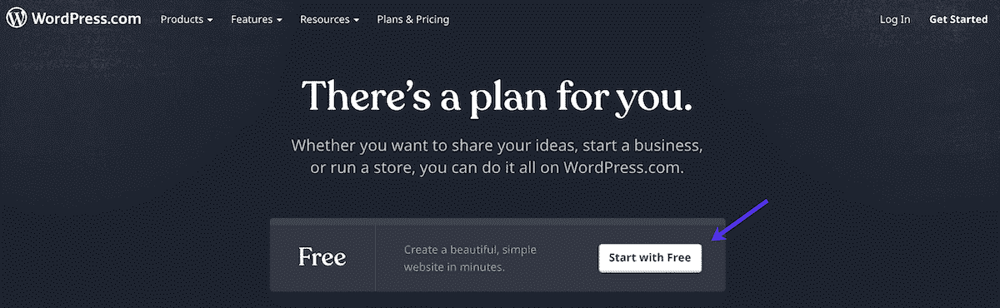

点击【免费开始】按钮。

这会自动将您带到 WordPress.com 注册页面。只需填写所需信息并创建一个免费帐户。

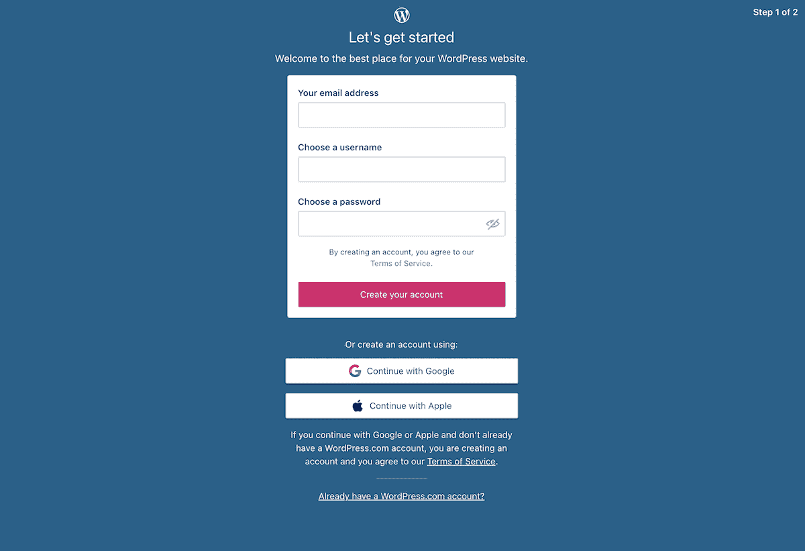

创建一个免费的 WordPress.com 账户。

当你注册一个免费的 WordPress.com 账户来写博客时，你的域名将会是一个[子域名](https://kinsta.com/blog/wordpress-subdomain/)。例如，您的域将如下所示:

*sitename.wordpress.com*

你也可以注册一个新的自定义域名或将现有的域名转移到你的免费网站。这将重定向到这些领域的任何访问者到您的 WordPress.com 子域。

## 注册订阅时事通讯

### 想知道我们是怎么让流量增长超过 1000%的吗？

加入 20，000 多名获得我们每周时事通讯和内部消息的人的行列吧！

[Subscribe Now](#newsletter)

如果你想继续使用付费选项，WordPress.com 也有几个可用的选项。付费选项开放了许多功能和定制选项。这也允许你使用自己选择的域名，而不是 WordPress 子域。

定价选项按层级细分。像其他事情一样，这完全取决于你想要什么样的特性。目前，提供了 4 个模型层:

*   个人:4 美元
*   溢价:8 美元
*   商务:25 美元
*   电子商务:45 美元

还有起价每月 2000 美元的企业级计划。请注意，WordPress.com 让您选择按年或按月付款。

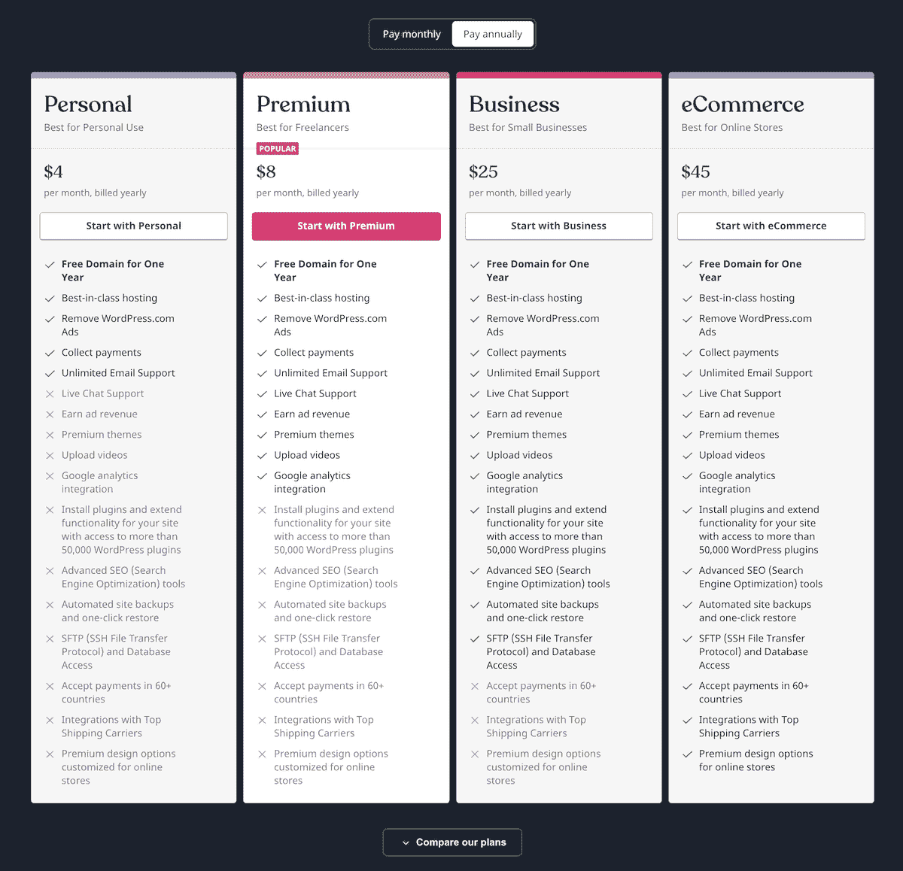

选择每年为 WordPress 付费。

点击**每月支付**选项卡查看每月价格。

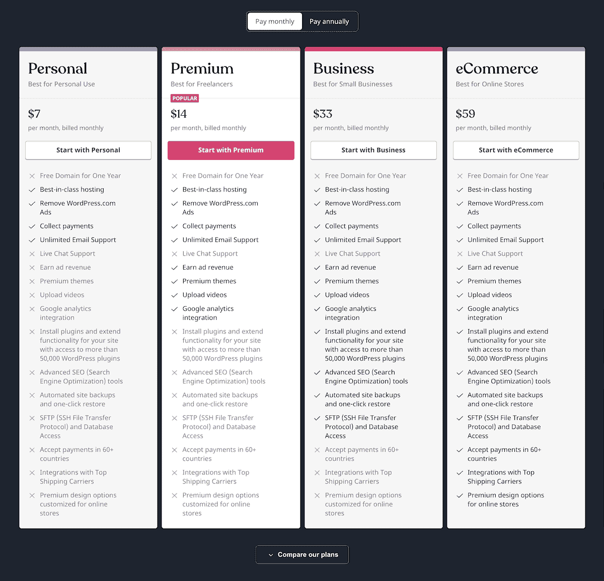

选择支付 WordPress 包月。

WordPress 也提供了一个很棒的选项来比较所有的计划。只需点击**比较我们的计划**选项卡，即可提取相关信息。

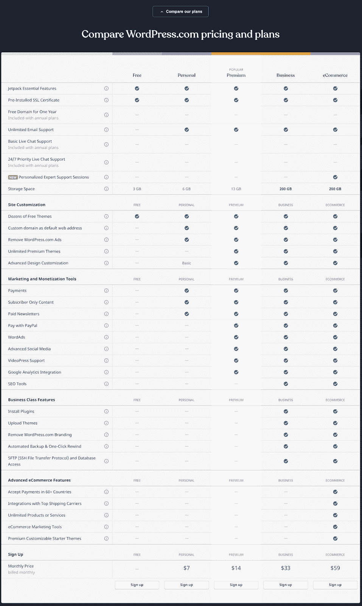

WordPress 方案对比

#### WordPress.org

我们想花一点时间来解释一下 WordPress.org。上面我们已经多次提到 WordPress 有两个选项。WordPress.com 和 WordPress.org。以上详细介绍的是 WordPress.com。

然而，你可以在 WordPress.org 下载并安装你的 WordPress 版本，并从那里开始构建和设计。由于该平台是开源的，任何人都可以免费使用。

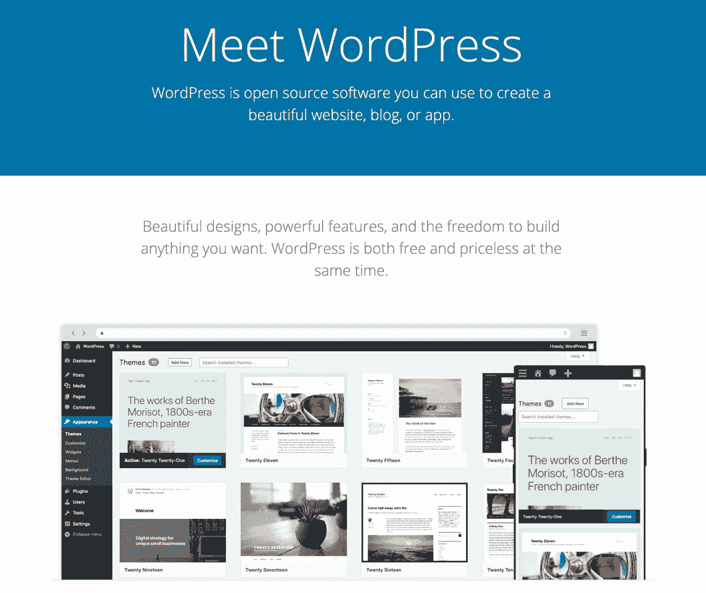

WordPress.org website.

要以这种方式使用 WordPress，你需要三样东西:

1.  [域名](https://kinsta.com/blog/choose-domain-name/)
2.  [主持](https://kinsta.com/plans/)
3.  [WordPress 主题](https://kinsta.com/knowledgebase/what-is-a-wordpress-theme/)

从那里，您可以自由地设计和构建。

#### 写日志（部落格）的人

简单地说， [Blogger](https://www.blogger.com/about/) 没有定价选项。它是免费使用的。你只需进入博客网站，点击**创建你的博客**按钮就可以开始了。

博主定价选项。

它附带了主机，就像免费的 WordPress 选项一样。你也可以得到一个免费的域名，你也可以把你的其他域名转发给它。因此，您的域在 Blogger 中将如下所示:

*yourdomain.blogspot.com*

在 Blogger 上创建博客需要一个谷歌账号。

使用 Blogger 不需要事先掌握任何技能，因为他们为您提供了一切。这是一个没有很多功能的基本布局。不过，它对初学者来说是免费的，非常棒。

获胜者:

### WordPress vs Blogger——SEO

SEO 是任何博客或网站最重要的方面之一。自然，了解你可以通过 WordPress vs Blogger 获得什么类型的 SEO 选项是很重要的。

#### WordPress

WordPress 自带了很多不同的内置 SEO 工具。您可以创建名为 [permalinks](https://kinsta.com/blog/wordpress-permalinks/) 的静态 URL，并且您还能够 blogroll 和 ping。

WordPress 的亮点在于它的第三方 SEO 插件和工具。你可以利用这些将你博客的 SEO 标准推向新的高度。

厌倦了低于 1 级的 WordPress 托管支持而没有答案？试试我们世界一流的支持团队！[查看我们的计划](https://kinsta.com/plans/?in-article-cta)

值得一提的是 [Yoast SEO](https://kinsta.com/blog/yoast-seo/) 。它是 WordPress 最受欢迎的 SEO 插件之一，也是世界上最受欢迎的插件之一。他们有一个很棒的免费版本。

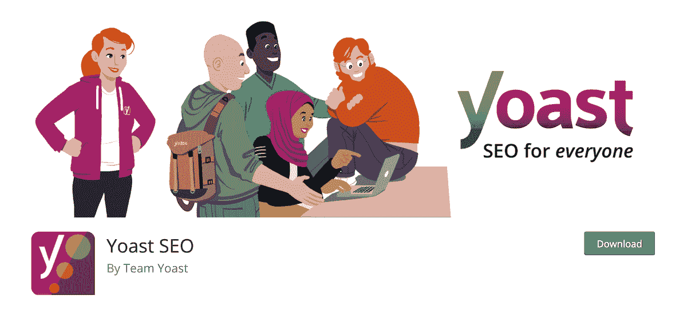

Yoast SEO 插件。

#### 写日志（部落格）的人

Blogger 还允许你从他们提供的模板中控制一些[页面上和现场 SEO](https://kinsta.com/blog/how-to-drive-traffic-to-your-website/) 功能。你也可以设置永久链接。

如果你对 SEO 略知一二，Blogger 平台提供了足够的工具来帮助你对你的内容是否扎实进行排名。毕竟，谷歌确实拥有它。

获胜者:

### WordPress vs Blogger——支持和社区

当你尝试新事物时，拥有支持和一群能在你的旅程中帮助你的人总是一个好主意。

如果博客对你来说是新的，你需要知道什么类型的支持是可用的。

#### WordPress

WordPress 可能拥有最好的在线支持系统和社区。

有数以千计的教程、留言板、视频和其他在线社区，你可以找到并得到你需要的答案。

你不需要花很长时间就能找到你网站任何方面需要的帮助。

#### 写日志（部落格）的人

虽然 Blogger 确实有一些支持，但它比 WordPress 要有限得多。

它们包括一些你可以访问的基本文档，以及一个用户论坛。除此之外，你找不到任何提供帮助、教程、视频和支持的重要或专门的在线社区。

获胜者:

### WordPress 与 Blogger——电子商务

如果你正在浏览一个简单的 WordPress 或 Blogger 网站，那么高层次的电子商务可能不是你感兴趣的事情。然而，不管怎样，让我们稍微谈一谈，因为电子商务通常会晚一点出现。

#### WordPress

WordPress 和电子商务携手并进，因为有了 WooCommerce 插件。这个插件为你提供了一切你需要的东西，让你可以开箱即用地在网上设置和销售实物和数字商品。

主要的 WooCommerce 插件是免费的，将包括你需要的所有工具。是的，你可以获得大量的[插件插件](https://kinsta.com/blog/woocommerce-plugins/)并付费扩展你的电子商务商店，但是同样，主要插件是免费的。

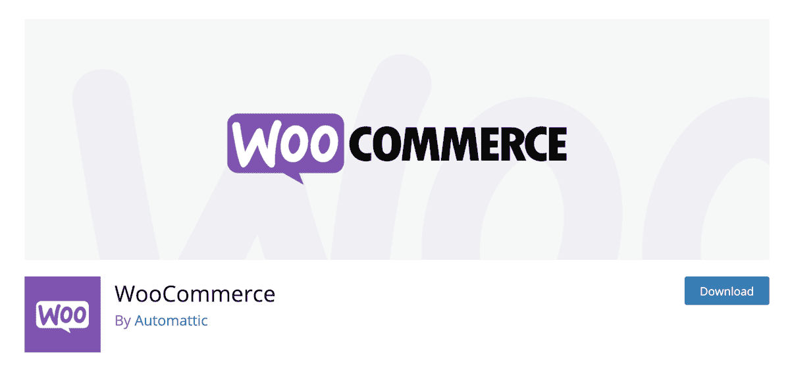

伍贸插件。

#### 写日志（部落格）的人

Blogger 也有一些可用的电子商务选项。但是，它们需要以不同的方式实现。

没有大型的第三方电子商务解决方案可以添加到 Blogger 中，使您能够为初学者建立一个在线商店。因此，有三个主要选项可供考虑:

1.  添加购买按钮或产品小部件
2.  嵌入来自其他来源的在线商店
3.  链接到外部电子商务商店

这些都是可行的选择，可以让你通过博客网站销售产品。

您可以使用 [Paypal](https://kinsta.com/blog/paypal-donate-button-wordpress/) 通过 Blogger 为您的产品付款，并嵌入其“立即购买”按钮。

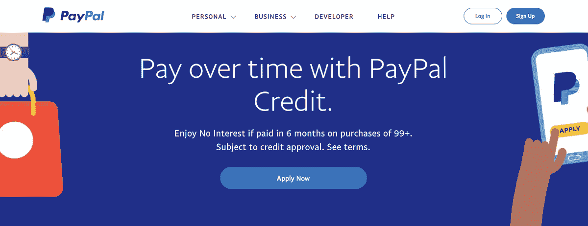

贝宝网站。

**赢家:** WordPress 因为现场功能。

### WordPress vs Blogger——货币化

赚钱几乎是每个博客作者都感兴趣的事情。好消息是 WordPress 和 Blogger 平台都允许货币化。

有两种快速简单的方法来赚钱的每个平台，Adsense 和附属链接。虽然有相当多的 Adsense 替代品，但这两个平台都可以让你使用 Google Adsense 和附属链接立即赚钱。

你需要一个 [Adsense 账户](https://kinsta.com/blog/how-to-add-google-adsense-to-wordpress/)和一些代码，但除此之外，你可以在你的 WordPress 或 Blogger 网站上相当快地显示广告。

Google Adsense 网站。

至于会员链接，你可以在网上注册许多不同的会员，并在你的内容中嵌入你的链接。

**赢家:**平手

### WordPress vs Blogger——所有权

我们需要考虑的最后一件事是每个平台如何对待内容的所有权。你可能会对答案感到惊讶。

#### WordPress

WordPress 是开源的，无论你直接使用它们来托管你的网站还是其他托管提供商，你创建的所有内容都是你的，你拥有它。

你可以决定你希望你的博客放在哪里，你希望它保持多久。

当使用 WordPress 平台时，你拥有所有的数据并控制与谁分享信息。

#### 写日志（部落格）的人

正如我们在本文前面了解到的，Google 拥有 Blogger。它非常可靠，是一个让博客运行的好方法，并且有足够的功能，发布帖子并不困难。

然而，你并不拥有它。

由于谷歌运营着博客平台，他们有权在任何时候不经警告就关闭它。如果他们认为你违反了他们的条款和条件，你也可以不经通知就被禁止或停职。

谷歌也有快速离开或放弃项目的历史。想想 [Feedburner](https://kinsta.com/blog/wordpress-rss-feed/) 和 Google+。

获胜者:

WordPress 与 Blogger:这是博客平台的战争。🥊在这里了解这两种流行的选择💥

## WordPress 和 Blogger 哪个更好？

那么，哪个博客平台比较好呢？人们做的很多选择都是基于个人观点。然而，参与决策的其他变量包括我们上面讨论过的很多东西。

在 WordPress 和 Blogger 之间选择时，很多决定都是基于易用性和价格，尤其是起步。

除了 Blogger 易于使用和赚钱之外，WordPress 赢得了我们上面提到的所有类别。WordPress 是一个明确的选择，因为它的市场份额、社区以及添加电子商务和轻松赚钱的能力。

## 摘要

WordPress 和 Blogger 是博客平台利基市场中最知名的两个名字。为了做出明智的决定，掌握所有的信息是很重要的。

最终，选择权在你。享受尝试这两个平台，找出哪个最适合你的网站。

你试过这两种吗？你喜欢哪一个？请在评论区告诉我们。

* * *

让你所有的[应用程序](https://kinsta.com/application-hosting/)、[数据库](https://kinsta.com/database-hosting/)和 [WordPress 网站](https://kinsta.com/wordpress-hosting/)在线并在一个屋檐下。我们功能丰富的高性能云平台包括:

*   在 MyKinsta 仪表盘中轻松设置和管理
*   24/7 专家支持
*   最好的谷歌云平台硬件和网络，由 Kubernetes 提供最大的可扩展性
*   面向速度和安全性的企业级 Cloudflare 集成
*   全球受众覆盖全球多达 35 个数据中心和 275 多个 pop

在第一个月使用托管的[应用程序或托管](https://kinsta.com/application-hosting/)的[数据库，您可以享受 20 美元的优惠，亲自测试一下。探索我们的](https://kinsta.com/database-hosting/)[计划](https://kinsta.com/plans/)或[与销售人员交谈](https://kinsta.com/contact-us/)以找到最适合您的方式。

