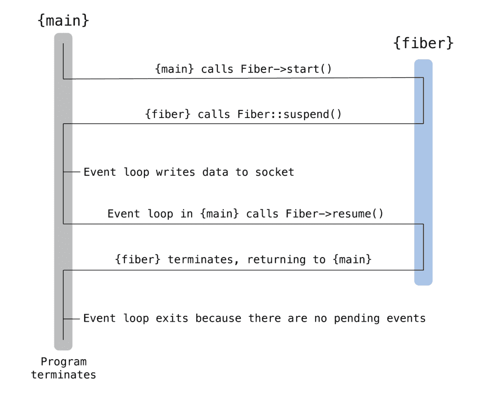

# PHP 8.1 的新特性:特性、变化、改进等等

> 原文：<https://kinsta.com/blog/php-8-1/>

2021 年 11 月 25 日发布， [PHP 8.1 终于来了](https://wiki.php.net/todo/php81)，打包了几个令人兴奋的特性。

在本文中，我们将详细介绍 PHP 8.1 中的新特性。从它的新特性和性能改进到重大变化和废弃，我们将深入探讨它们。

坐稳了！

## PHP 8.1 的新特性

让我们从 PHP 8.1 中的所有新特性开始。这是一个很长的列表。

 

### 信息

适用于所有环境的 PHP 8.1 现已在 Kinsta 发布。请查看我们的 [PHP 8.1 特性更新](https://kinsta.com/feature-updates/php-8-1/)了解更多信息。


[PHP 8.1 is here! 🎉 See what's in store in this in-depth guide ⬇️Click to Tweet](https://twitter.com/intent/tweet?url=https%3A%2F%2Fkinsta.com%2Fblog%2Fphp-8-1%2F&via=kinsta&text=PHP+8.1+is+here%21+%F0%9F%8E%89+See+what%27s+in+store+in+this+in-depth+guide+%E2%AC%87%EF%B8%8F&hashtags=PHP%2CWordPress)

### 纯交集类型

PHP 8.1 增加了对交集类型的支持。它类似于 PHP 8.0 中引入的[联合类型](https://kinsta.com/blog/php-8/#union-types-2-0)，但是它们的预期用途完全相反。


> 需要在这里大声喊出来。Kinsta 太神奇了，我用它做我的个人网站。支持是迅速和杰出的，他们的服务器是 WordPress 最快的。
> 
> <footer class="wp-block-kinsta-client-quote__footer">
> 
> 
> 
> <cite class="wp-block-kinsta-client-quote__cite">Phillip Stemann</cite></footer>

[View plans](https://kinsta.com/plans/)

为了更好地理解它的用法，让我们回顾一下 PHP 中类型声明的工作方式。

本质上，您可以向函数参数、返回值和类属性添加类型声明。这种赋值称为类型提示，它确保值在调用时是正确的类型。否则，它会立即抛出一个[类型错误](https://www.php.net/manual/en/class.typeerror.php)。反过来，这有助于您更好地调试代码。

但是，声明单一类型有其局限性。联合类型通过允许您用多种类型声明一个值来帮助您克服这个问题，并且输入必须满足至少一个声明的类型。

另一方面，[RFC](https://wiki.php.net/rfc/pure-intersection-types)将交叉口类型描述为:

> *“交集类型”需要一个值来满足多个类型约束，而不是单个类型约束。*
> 
> *…纯交集类型使用语法 T1 & T2 & …指定，并且可以在当前接受类型的所有位置使用…*

注意使用`&` (AND)运算符来声明交集类型。相反，我们使用`|` (OR)操作符来声明联合类型。

在交集类型中使用大多数标准类型将导致永远无法实现的类型(例如整数和字符串)。因此，交集类型只能包括类类型(即接口和类名)。

以下是如何使用交集类型的示例代码:

```
class A {
    private Traversable&Countable $countableIterator;

    public function setIterator(Traversable&Countable $countableIterator): void {
        $this->countableIterator = $countableIterator;
    }

    public function getIterator(): Traversable&Countable {
        return $this->countableIterator;
    }
}
```

在上面的代码中，我们定义了一个变量**可数迭代器**作为两种类型的交集:**可遍历**和**可数**。在这种情况下，声明的两种类型是接口。

交集类型也符合已经用于类型检查和继承的标准 PHP 变化规则。但是关于交集类型与子类型如何交互，还有两个附加的规则。你可以在 RFC 中阅读更多关于[交叉点类型的变化规则](https://wiki.php.net/rfc/pure-intersection-types#variance)。

在某些编程语言中，可以在同一个声明中组合联合类型和交集类型。但是 PHP 8.1 禁止这样做。因此，它的实现被称为“纯”交集类型。然而，RFC 确实提到它是“留给未来的范围”


### 枚举

PHP 8.1 终于增加了对枚举(也称为枚举或枚举类型)的支持。它们是用户定义的数据类型，由一组可能的值组成。

编程语言中最常见的枚举例子是**布尔**类型，其中`true`和`false`是两个可能的值。它太常见了，以至于被融入了许多现代编程语言。

根据[RFC](https://wiki.php.net/rfc/enumerations)，PHP 中的枚举将首先被限制为“单元枚举”:

> 这个 RFC 的范围仅限于“单元枚举”，也就是说，枚举本身就是一个值，而不仅仅是一个原始常量的花哨语法，并且不包括额外的相关信息。这一功能极大地扩展了对数据建模、自定义类型定义和 monad 风格行为的支持。枚举启用了“使无效状态不可表示”的建模技术，这导致更健壮的代码，而不太需要穷举测试。

为了达到这个阶段，PHP 团队研究了许多已经支持枚举的语言。[他们的调查](https://github.com/Crell/enum-comparison)发现可以将枚举分为三大类:奇特的常量、奇特的对象和全代数数据类型(ADT)。这是一本有趣的读物！

PHP 实现了“奇特的对象”枚举，并计划在未来将其扩展到完整的 ADT。它在概念和语义上模仿了 Swift、Rust 和 Kotlin 中的枚举类型，尽管它没有直接模仿它们中的任何一个。

RFC 使用一副牌中的花色这一著名类比来解释其工作原理:

```
enum Suit {
  case Hearts;
  case Diamonds;
  case Clubs;
  case Spades;
}
```

这里，**花色**枚举定义了四个可能的值:**红心**、**方块**、**梅花**和**黑桃**。您可以使用语法直接访问这些值:`Suit::Hearts`、`Suit::Diamonds`、`Suit::Clubs`和`Suit::Spades`。

这种用法可能看起来很熟悉，因为枚举是建立在类和对象之上的。他们的行为相似，几乎有完全相同的要求。枚举与类、接口和特征共享相同的命名空间。

上面提到的枚举称为**纯枚举**。

如果你想给任何情况一个标量等值，你也可以定义**支持的枚举**。然而，反枚举只能有一种类型，要么是`int`要么是`string`(不能两者都有)。

```
enum Suit: string {
  case Hearts = 'H';
  case Diamonds = 'D';
  case Clubs = 'C';
  case Spades = 'S';
}
```

此外，支持枚举的所有不同情况都必须有唯一的值。你永远不能混合纯枚举和支持枚举。

RFC 深入研究了枚举方法、静态方法、常量、常量表达式等等。涵盖所有这些内容超出了本文的范围。你可以参考文档来熟悉它的所有优点。

### `never`返回类型

PHP 8.1 增加了一个新的返回类型提示，叫做`never`。在总是`throw`或`exit`的函数中使用非常有用。

根据其[RFC](https://wiki.php.net/rfc/noreturn_type)，URL 重定向函数总是`exit`(显式或隐式)是其使用的一个很好的例子:

```
function redirect(string $uri): never {
    header('Location: ' . $uri);
    exit();
}

function redirectToLoginPage(): never {
    redirect('/login');
}
```

一个`never`声明的函数应该满足三个条件:

*   它不应该显式定义`return`语句。
*   它不应该有隐式定义的`return`语句(例如 **if-else** 语句)。
*   它必须用一个`exit`语句结束执行(显式或隐式)。

上面的 [URL 重定向](https://kinsta.com/help/redirect-rules/)例子显示了`never`返回类型的显式和隐式用法。

`never`返回类型与`void`返回类型有许多相似之处。它们都确保函数或方法不会返回值。然而，它的不同之处在于执行更严格的规则。例如，`void`声明的函数仍然可以`return`没有显式值，但是你不能对`never`声明的函数做同样的事情。

根据经验，当您希望 PHP 在函数调用后继续执行时，使用`void`。当你想要相反的结果时，选择`never`。

此外，`never`被定义为“底部”类型。因此，任何声明为`never`的类方法都“永远”不能将其返回类型更改为其他类型。然而，你可以用一个`never`声明的方法来扩展一个`void`声明的方法。


### 信息

最初的 RFC 将`never`返回类型列为`noreturn`，这是一个已经被两个 PHP 静态分析工具支持的返回类型，这两个工具分别是 Psalm 和 PHPStan。因为这是由诗篇和诗篇的作者自己提出的，他们保留了它的术语。然而，由于命名惯例，PHP 团队对`noreturn`和`never`进行了投票，`never`成为了永远的赢家。因此，对于 PHP 8.1+版本，总是用`never`替换`noreturn`。


### 纤维

历史上，PHP 代码几乎总是同步代码。即使对于 I/O 操作，代码执行也会暂停，直到返回结果。你可以想象为什么这个过程可能会使代码执行变慢。

有多个第三方解决方案可以克服这个障碍，允许开发人员异步编写 PHP 代码，尤其是对于并发 I/O 操作。一些流行的例子包括 [amphp](https://amphp.org/) 、 [ReactPHP](https://reactphp.org/) 和 [Guzzle](https://guzzlephp.org/) 。

然而，在 PHP 中没有处理这种实例的标准方法。而且，在同一个调用栈中处理同步和异步代码[会导致其他问题](https://journal.stuffwithstuff.com/2015/02/01/what-color-is-your-function/)。

纤程是 PHP 通过虚拟线程(或绿色线程)处理并行性的方式。它试图通过允许 PHP 函数中断而不影响整个调用栈来消除同步和异步代码之间的差异。

RFC *承诺*如下:

*   向 PHP 添加对纤程的支持。
*   引入一个新的纤程类和相应的反射类 ReflectionFiber。
*   添加异常类 FiberError 和 FiberExit 来表示错误。
*   光纤允许现有接口(PSR-7、教条 ORM 等)的透明非阻塞 I/O 实现。).那是因为占位符(承诺)对象被消除了。相反，函数可以声明 I/O 结果类型，而不是不能指定解析类型的占位符对象，因为 PHP 不支持泛型。

您可以使用纤程来开发全栈、可中断的 PHP 函数，然后您可以使用这些函数在 PHP 中实现协作式多任务处理。当纤程暂停整个[执行堆栈](https://kinsta.com/help/apm-tool/#stack-trace)时，您可以放心，因为它不会损害您代码的其余部分。

[](https://kinsta.com/wp-content/uploads/2021/08/PHP-8.1-fiber-flow.png)

Chart illustrating PHP code execution flow with Fibers (Source: PHP.net).


为了说明纤程的使用，它的 RFC 使用了这个简单的例子:

```
$fiber = new Fiber(function (): void {
    $value = Fiber::suspend('fiber');
    echo "Value used to resume fiber: ", $value, "\n";
});

$value = $fiber->start();

echo "Value from fiber suspending: ", $value, "\n";

$fiber->resume('test');
```

您在上面的代码中创建了一个“纤程”，并立即用字符串`fiber`将它挂起。`echo`语句充当纤程恢复的视觉提示。

您可以从对`$fiber->start()`的调用中检索这个字符串值。

然后，使用字符串“test”恢复纤程，该字符串是从对`Fiber::suspend()`的调用中返回的。完整的代码执行会产生如下输出:

```
Value from fiber suspending: fiber
Value used to resume fiber: test
```

这是 PHP 纤维工作的基本教科书示例。[这里是另一个执行七个异步 GET 请求的纤程示例](https://github.com/nox7/async-php-8-io-http)。

综上所述，大多数 PHP 开发人员永远不会直接与纤程打交道。RFC 甚至提出了同样的建议:

> 光纤是一项高级功能，大多数用户不会直接使用。该特性主要面向库和框架作者，以提供事件循环和异步编程 API。纤程允许在任何时候将异步代码执行无缝地集成到同步代码中，而不需要修改应用程序调用堆栈或添加样板代码。
> 
> Fiber API 不应该直接用在应用级代码中。纤程提供了一个基本的、低级的流控制 API 来创建更高级的抽象，然后在应用程序代码中使用。

考虑到它的性能优势，您可以期待 PHP 库和框架利用这一新特性。看看他们如何在他们的生态系统中实现纤程会很有趣。


### 新的`readonly`属性

PHP 8.1 增加了对`readonly`属性的支持。它们只能从声明它们的作用域初始化一次。一旦初始化，就不能修改它们的值。这样做会抛出一个**错误**异常。

其 RFC 显示:

> *一个* ***readonly*** *属性只能初始化一次，并且只能从声明它的作用域初始化。对该属性的任何其他赋值或修改都将导致错误异常。*

这里有一个你如何使用它的例子:

```
class Test {
    public readonly string $kinsta;

    public function __construct(string $kinsta) {
        // Legal initialization.
        $this->kinsta = $kinsta;
    }
}
```

一旦初始化，就没有回头路了。将这一特性嵌入 PHP 极大地减少了通常用于实现这一功能的样板代码。

属性提供了强大的不变性保证，无论是在类内部还是外部。中间运行什么代码并不重要。调用一个`readonly`属性将总是返回相同的值。

然而，在特定的用例中，使用`readonly`属性可能并不理想。例如，您只能将它们与一个[类型化属性](https://kinsta.com/blog/php-7-4/#typed-properties)一起使用，因为没有类型的声明是隐式的`null`，不能是`readonly`。

此外，设置一个`readonly`属性并不会使对象不可变。属性将保存相同的对象，但是对象本身可以改变。

这个属性的另一个小问题是您不能克隆它。对于这个特殊的用例，已经有了一个[解决方案。如有必要，调查一下。](https://stitcher.io/blog/cloning-readonly-properties-in-php-81)

### 定义`final`类常量

从 PHP 8.0 开始，您可以用它的子类覆盖类常量。这是由于 PHP 中实现继承的方式。

下面是一个如何覆盖先前声明的常量值的示例:

```
class Moo
{
    public const M = "moo";
}

class Meow extends Moo
{
    public const M = "meow";
}  
```

现在，如果奶牛想要对猫的行为(至少是常数)更加严格，他们可以用 PHP 8.1 的新`final`修饰符来实现。

一旦你声明了一个常数为`final`，这意味着。

```
class Moo
{
    final public const M = "moo";
}

class Meow extends Moo
{
    public const M = "meow";
}

// Fatal error: Meow::M cannot override final constant Moo::M
```

您可以在[final class constants](https://wiki.php.net/rfc/final_class_const)PHP RFC 中了解更多信息。

### 新的`fsync()`和`fdatasync()`功能

PHP 8.1 新增了两个名为`fsync()`和`fdatasync()`的文件系统函数。对于那些习惯了同名的 [Linux 功能的人来说，它们似乎很熟悉。那是因为它们是相关的，只是为 PHP 实现的。](https://linux.die.net/man/2/fsync)

事实上，这一增加早就应该了。PHP 是少数几个直到 PHP 8.1 才实现 [fsync()和 fdatasync()](https://wiki.php.net/rfc/fsync_function)——也就是[的主流编程语言之一。](https://wiki.php.net/rfc/fsync_function)

`fsync()`函数类似于 PHP 现有的`fflush()`函数，但是它在一个方面有显著的不同。鉴于`fflush()`将应用的内部缓冲区刷新到操作系统，`fsync()`更进一步，确保内部缓冲区刷新到物理[存储](https://kinsta.com/blog/what-is-ssd/)。这确保了完整和持久的写入，因此即使在应用程序或系统崩溃后，您也可以检索数据。

这里有一个你如何使用它的例子。

```
$doc = 'kinsta.txt';

$kin = fopen($doc, 'ki');
fwrite($kin, 'doc info');
fwrite($kin, "\r\n");
fwrite($kin, 'more info');

fsync($kin);
fclose($kin);
```

在末尾添加`fsync()`调用确保了 PHP 或 OS 的内部缓冲区中保存的任何数据都被写入存储。在此之前，所有其他代码的执行都将被阻止。

它的相关功能是`fdatasync()`。使用它来同步数据，但不一定是元数据。对于元数据不重要的数据，这个函数调用会使写入过程稍微快一点。

然而，你应该注意到 PHP 8.1 还不完全支持 Windows 上的`fdatasync()`。它只是充当`fsync()`的别名。在 POSIX 上，`fdatasync()`被正确地实现了。

### 新`array_is_list()`功能

PHP 数组可以保存整数和字符串键。这意味着您可以将它们用于多种用途，包括列表、哈希表、字典、集合、堆栈、队列等等。您甚至可以在数组中包含数组，从而创建多维数组。

您可以有效地检查一个特定的条目是否是一个数组，但是要检查它是否有任何缺失的数组偏移量、乱序键等就不那么容易了。简而言之，您无法快速验证一个数组是否是一个列表。

[array_is_list()函数](https://wiki.php.net/rfc/is_list)检查一个数组的键是否从`0`开始按顺序排列，并且没有间隔。如果所有条件都满足，它将返回`true`。默认情况下，对于空数组，它也返回`true`。

下面是几个在满足`true`和`false`条件的情况下使用它的例子:

```
// true array_is_list() examples
array_is_list([]); // true
array_is_list([1, 2, 3]); // true
array_is_list(['cats', 2, 3]); // true
array_is_list(['cats', 'dogs']); // true
array_is_list([0 => 'cats', 'dogs']); // true
array_is_list([0 => 'cats', 1 => 'dogs']); // true 

// false array_is_list() examples 
array_is_list([1 => 'cats', 'dogs']); // as first key isn't 0
array_is_list([1 => 'cats', 0 => 'dogs']); // keys are out of order
array_is_list([0 => 'cats', 'bark' => 'dogs']); // non-integer keys
array_is_list([0 => 'cats', 2 => 'dogs']); // gap in between keys 
```

带有乱序键的 PHP 数组列表[是 bug](https://kinsta.com/blog/wordpress-security/#2-use-latest-php-version)的潜在来源。在继续执行代码之前，使用这个函数强制严格遵守**列表**的要求是 PHP 的一个很好的补充。

### 钠 XChaCha20 的新功能

钠是一个现代的，易于使用的加密库，用于加密，解密，[密码](https://kinsta.com/blog/password-managers/)散列，签名等等。[PECL lib 钠包](https://pecl.php.net/package/libsodium)为钠添加了一个包装器，以便 PHP 开发人员可以使用它。

甚至像脸书、Discord、Malwarebytes 和 Valve 这样的领先科技公司也使用 like 来保证他们用户的快速安全连接。

libna 支持 [XChaCha20 加密算法](https://www.cryptopp.com/wiki/XChaCha20)对数据进行加密和解密，尤其是流加密。同样，PECL lib 钠扩展已经支持 XChaCha20，但只支持 Poly1305 消息认证代码。

许多 PHP 应用程序直接使用 XChaCha20 进行流加密。为了使事情变得更简单，从 PHP 8.1 开始，您将有三个新的函数来使用 XChaCha20 加密或解密数据，而不涉及身份验证。这种模式称为“分离模式”

新引入的 XChaCha20 函数有:

*   `sodium_crypto_stream_xchacha20_keygen`:返回一个安全的随机密钥，用于钠 _ 加密 _ 流 _xchacha20。
*   `sodium_crypto_stream_xchacha20`:将密钥和 nonce 扩展成伪随机字节的密钥流。
*   `sodium_crypto_stream_xchacha20_xor`:使用随机数和密钥加密消息(无认证)。

此外，在全局名称空间中定义了两个新的 PHP 常量:

*   `SODIUM_CRYPTO_STREAM_XCHACHA20_KEYBYTES`(分配的 **32**
*   `SODIUM_CRYPTO_STREAM_XCHACHA20_NONCEBYTES`(已分配 **24**

但是要小心使用。由于没有认证，解密操作容易受到常见的密文攻击。

你可以在 [GitHub 页面](https://github.com/php/php-src/pull/6868)上阅读更多关于它的用法和要求。

### 新的 IntlDatePatternGenerator 类

PHP 的底层 ICU 库支持创建本地化的[日期和时间格式](https://kinsta.com/blog/wordpress-calendar-plugin/)，但它不是完全可定制的。

例如，如果您想在 PHP 8.0 之前创建特定于地区的数据和时间格式，您可以使用[预定义的 IntlDateFormatter 常量](https://www.php.net/manual/en/class.intldateformatter.php)以 6 种方式实现:

*   **`IntlDateFormatter::LONG` :** 更长，比如 2017 年 11 月 10 日**或者 **11:22:33pm****
***   **`IntlDateFormatter::MEDIUM` :** 稍短一点，像 2017 年 11 月 10 日***   **`IntlDateFormatter::SHORT` :** 只是数字，比如 **10/11/17** 或者 **11:22pm******

 ****其中每一个都有自己的`RELATIVE_`变量，它将日期格式设置在当前日期之前或之后的有限范围内。在 PHP 中，这些值是昨天的**，今天的**，明天的**。******

 ******比如你想用长版本表示年份，用短版本表示月份，比如 **10/11/2017** 。从 PHP 8.0 开始，你不能。

在 PHP 8.1+中，可以使用新的 **IntlDatePatternGenerator** 类指定日期、月份和时间的格式。您可以将这些组件的确切顺序留给格式化程序。

您应该注意到，虽然这个类中只有单词 **Date** ，但是它与 ICU 的 **DateTimePatternGenerator** 是一致的。这意味着您还可以使用它来创建灵活的时间格式。为了简化命名，PHP 团队选择了更短的 **IntlDatePatternGenerator** 术语。

这里有一个直接来自[其 RFC](https://wiki.php.net/rfc/intldatetimepatterngenerator) 的例子:

```
$skeleton = "YYYYMMdd";

$today = \DateTimeImmutable::createFromFormat('Y-m-d', '2021-04-24');

$dtpg = new \IntlDatePatternGenerator("de_DE");
$pattern = $dtpg->getBestPattern($skeleton);
echo "de: ", \IntlDateFormatter::formatObject($today, $pattern, "de_DE"), "\n";

$dtpg = new \IntlDatePatternGenerator("en_US");
$pattern = $dtpg->getBestPattern($skeleton), "\n";
echo "en: ", \IntlDateFormatter::formatObject($today, $pattern, "en_US"), "\n";

/*
de: 24.04.2021
en: 04/24/2021
*/
```

在上面的代码中，**框架**变量定义了要使用的特定日期或时间格式。但是，格式化程序处理最终结果的顺序。
T3】

### 支持 AVIF 图像格式

AVIF，或 AV1 图像文件格式，是基于 AV1 视频编码格式的相对较新的免版税的[图像格式](https://kinsta.com/blog/image-file-types/)。除了提供更高的压缩率(因此文件更小)，它还支持一些功能，如透明度、HDR 等。

AVIF 格式最近(2021 年 6 月 8 日)才[标准化。这为 Chrome 85+和 Firefox 86+等浏览器铺平了道路，增加了对 AVIF 图像的支持。](https://aomediacodec.github.io/av1-avif/)

PHP 8.1 的图像处理和 GD 扩展增加了对 AVIF 图像的支持。

然而，要包含这个功能，您需要编译具有 AVIF 支持的 GD 扩展。您可以通过运行下面的命令来做到这一点。

对于 Debian/Ubuntu:

```
apt install libavif-dev
```

对于 Fedora/RHEL:

```
dnf install libavif-devel
```

这将安装所有最新的依赖项。接下来，您可以通过用`./configure`脚本运行`--with-avif`标志来编译 AVIF 支持。

```
./buildconf --force
./configure --enable-gd --with-avif
```

如果您正在从头开始一个新环境，您也可以在这里启用其他 PHP 扩展。

安装后，您可以通过在 PHP 终端中运行以下命令来测试是否启用了 AVIF 支持:

```
php -i | grep AVIF
```

如果您已经正确安装了 AVIF，您将看到以下结果:

```
AVIF Support => enabled
```

您还可以使用`gd_info()`调用来检索 GD 特性的列表，包括是否启用了 **AVIF 支持**功能。

这个更新的 PHP 8.1 GD 扩展还增加了两个处理 AVIF 图像的新函数:`imagecreatefromavif`和`imageavif`。它们的工作方式与 JPEG 和 PNG 类似。

函数从给定的 AVIF 图像中返回一个 GdImage 实例。然后，您可以使用此实例来编辑或转换图像。

另一个`imageavif`功能输出 AVIF 图像文件。例如，您可以使用它将 JPEG 转换为 AVIF:

```
$image = imagecreatefromjpeg('image.jpeg');
imageavif($image, 'image.avif');
```

你可以在 GitHub 页面上了解更多关于这项新功能的信息。

### 目录上传的新`$_FILES: full_path`键

PHP 维护了大量预定义的变量来跟踪各种事情。其中一个是 [$_FILES 变量](https://www.php.net/manual/en/reserved.variables.files.php)，它保存了通过 HTTP POST 方法上传的条目的关联数组。

大多数现代浏览器支持[上传整个目录](https://developer.mozilla.org/en-US/docs/Web/HTML/Element/input/file#htmlattrdefwebkitdirectory_non-standard_inline)和 [HTML 文件上传](https://kinsta.com/knowledgebase/how-to-upload-html-file-to-wordpress/)字段。甚至 PHP 8.1 也支持这个功能，但是有一个很大的警告。你不能上传一个有确切目录结构或相对路径的文件夹，因为 PHP 没有将这些信息传递给`$_FILES`数组。

这在 PHP 8.1 中有所改变，在数组`$_FILES`中添加了一个名为`full_path`的新键。使用这些新数据，您可以在服务器上存储相对路径或复制精确的目录结构。

您可以通过使用`var_dump($_FILES);`命令输出`$FILES`数组来测试这些信息。

但是，如果您正在使用此功能，请谨慎操作。确保您防范了[标准文件上传攻击](https://php.watch/versions/8.1/%24_FILES-full-path#security-hardening)。

### 字符串键数组的数组解包支持

PHP 7.4 增加了[对数组展开操作符 **…** 的数组解包](https://kinsta.com/blog/php-7-4/#array-spread-operator)支持。它是使用`array_merge()`功能的一种更快捷的替代方式。但是，这个特性仅限于数字键数组，因为在合并具有重复键的数组时，解包字符串键数组会导致冲突。

然而，PHP 8 增加了对命名参数的支持[，消除了这一限制。因此，数组解包现在也支持使用相同语法的字符串键数组:](https://kinsta.com/blog/php-8/#named-arguments)

```
$array = [...$array1, ...$array2];
```

这个 [RFC 示例](https://wiki.php.net/rfc/array_unpacking_string_keys)展示了 PHP 8.1 中如何处理合并具有重复字符串键的数组:

```
$array1 = ["a" => 1];
$array2 = ["a" => 2];
$array = ["a" => 0, ...$array1, ...$array2];
var_dump($array); // ["a" => 2]
```

这里，字符串键“a”在通过数组解包合并之前出现了三次。但只有属于`$array2`的最后一个值获胜。

### 显式八进制数字符号

PHP 支持各种数字系统，包括十进制(基数为 10)、二进制(基数为 2)、八进制(基数为 8)和十六进制(基数为 16)。十进制数字系统是默认的。

如果你想使用任何其他的数字系统，那么你必须给每个数字加上一个标准的前缀:

*   **十六进制:** `0x`前缀。(例如 17 = `0x11`)
*   **二进制:** `0b`前缀。(例如 3 = `0b11`)
*   **八进制:** `0`前缀。(例如 9 = `011`)

你可以看到八进制数字系统的前缀是如何不同的。为了使这种担心标准化，许多编程语言都增加了对显式八进制数字符号的支持:`0o`或`0O`。

从 PHP 8.1 开始，你可以把上面显示的例子(即十进制的数字 9)在八进制数值系统中写成`0o11`或者`0O11`。

```
0o16 === 14; // true
0o123 === 83; // true

0O16 === 14; // true
0O123 === 83; // true

016 === 0o16; // true
016 === 0O16; // true
```

此外，这个新特性还支持 PHP 7.4 中引入的数字字符分隔符。

在 RFC 中阅读更多关于 PHP 8.1 的新特性。

### MurmurHash3 和 xxHash 哈希算法支持

PHP 8.1 增加了对 MurmurHash3 和 xxHash 哈希算法的支持。它们不是为加密使用而设计的，但它们仍然提供了令人印象深刻的输出随机性、分散性和唯一性。

这些新的散列算法比大多数 PHP 现有的散列算法更快。事实上，这些散列算法的一些变体比 RAM 吞吐量更快。

## 注册订阅时事通讯


### 想知道我们是怎么让流量增长超过 1000%的吗？

加入 20，000 多名获得我们每周时事通讯和内部消息的人的行列吧！

[Subscribe Now](#newsletter)

由于 PHP 8.1 还增加了对声明特定于算法的`$options`参数的支持，您可以对这些新算法做同样的事情。这个新参数的默认值是`[]`。因此，它不会影响我们现有的任何哈希函数。

你可以在他们的 GitHub 页面上阅读更多关于这些 PHP 8.1 新特性的内容: [MurmurHash3](https://github.com/php/php-src/pull/6059) ， [xxHash](https://php.watch/versions/8.1/xxHash) ，[算法特定的$options](https://github.com/php/php-src/pull/6400) 。

### HTTPS 域名系统(DoH)支持

HTTPS 域名系统(DoH)是通过 HTTPS 协议进行域名解析的协议。使用 HTTPS 加密客户端和 DNS 解析器之间的数据，DoH 通过防止 MitM 攻击来提高用户隐私和安全性。

从 PHP 8.1 开始，您可以使用 Curl 扩展来指定 DoH 服务器。它要求 PHP 用 **libcurl** 7.62+版本编译。对于大多数流行的操作系统来说，这不是问题，包括 Linux 发行版，因为它们通常包含 Curl 7.68+。

您可以通过指定`CURLOPT_DOH_URL`选项来配置 DoH 服务器 URL。

```
$doh = curl_init('https://kinsta.com');
curl_setopt($doh, CURLOPT_DOH_URL, 'https://dns.google/dns-query');
curl_exec($doh);
```

在上面的例子中，我们使用了 Google 的公共 DNS 服务器。另外，请注意在所有使用的 URL 中使用了`https://`。确保配置完美，因为 Curl 中没有默认的 DNS 服务器。

您还可以从 Curl 文档中包含的公共 DoH 服务器列表中选择。

此外，Curl 文档的 [CURLOPT_DOH_URL 引用](https://curl.se/libcurl/c/CURLOPT_DOH_URL.html)详细解释了如何使用它的各种参数。

### 使用 CURLStringFile 从字符串上传文件

PHP Curl 扩展支持带有文件上传的 [HTTP(S)](https://kinsta.com/knowledgebase/redirect-http-to-https/) 请求。它使用 **CURLFile** 类来实现这一点，该类接受 URI 或文件路径、mime 类型和最终文件名。

然而，使用 **CURLFile** 类，您只能接受文件路径或 URI，而不能接受文件本身的内容。如果您已经在内存中上传了文件(如处理过的图像、XML 文档、pdf)，您必须使用 Base64 编码的`data://` URIs。

但是 **libcurl** 已经支持一种更简单的方式来接受文件的内容。新的 **CURLStringFile** 类正是为此增加了支持。

你可以[阅读它的 GitHub 页面](https://github.com/php/php-src/pull/6456)来了解它在 PHP 8.1 中是如何实现的。

### 新的`MYSQLI_REFRESH_REPLICA`常数

PHP 8.1 的 **mysqli** 扩展增加了一个名为`MYSQLI_REFRESH_REPLICA`的新常量。相当于现有的`MYSQLI_REFRESH_SLAVE`常数。

这一变化在 MySQL 8.0.23 中受到欢迎，以解决技术词汇中的种族不敏感问题(最常见的例子包括“slave”和“master”)。

您应该注意到旧的常量不会被删除或废弃。开发人员和应用程序可以继续使用它。这个新的常数只是开发者和公司的一个选择，他们希望不再使用这些术语。

### 继承缓存的性能改进

[继承缓存](https://github.com/php/php-src/commit/4b79dba93202ed5640dff317046ce2fdd42e1d82)是 opcache 的新增功能，它消除了 PHP 类继承的开销。

PHP 类分别被 opcache 编译和[缓存](https://kinsta.com/blog/what-is-cache/)。然而，它们已经在运行时对每个请求进行了链接。这个过程可能涉及几次兼容性检查和从父类和特征借用方法/属性/常数。

因此，即使每个请求的结果都是相同的，这也需要相当长的时间来执行。

继承缓存链接所有唯一的依赖类(父类、接口、特征、属性类型、方法),并将结果存储在 opcache 共享内存中。因为这种情况现在只发生一次，所以继承需要更少的指令。

此外，它消除了对不可变类的限制，例如未解析的常数、类型化属性和协变类型检查。因此，存储在 opcache 中的所有类都是不可变的，这进一步减少了所需的指令数量。

总而言之，它承诺显著的性能优势。这个补丁的作者 Dimitry Stogov 发现，它比基本的 Symfony“Hello，World！”有 8%的改进程序。我们迫不及待地想在下面的 [PHP 基准测试中测试它。](https://kinsta.com/blog/php-benchmarks/)

### 一级可调用语法

PHP 8.1 增加了一个一级可调用语法来取代现有的使用字符串和数组的编码。除了创建一个更干净的**闭包**之外，这个新语法也可以被静态[分析工具](https://kinsta.com/blog/code-review-tools/)访问，并且遵守声明的范围。

这里有一些来自 RFC 的例子:

```
$fn = Closure::fromCallable('strlen');
$fn = strlen(...);

$fn = Closure::fromCallable([$this, 'method']);
$fn = $this->method(...)

$fn = Closure::fromCallable([Foo::class, 'method']);
$fn = Foo::method(...);
```

这里，所有的表达式对都是等价的。三点( **…** )语法类似于参数解包语法(`...$args`)。除此之外，参数尚未填写。

## PHP 8.1 中的变化

PHP 8.1 还包括对其现有语法和特性的改变。让我们来讨论一下:

### PHP 交互式 Shell 需要 **readline** 扩展

PHP 的 **readline** 扩展支持[交互 shell](https://kinsta.com/blog/how-to-use-ssh/) 特性，比如导航、自动完成、编辑等等。虽然它与 PHP 捆绑在一起，但默认情况下是不启用的。

您可以使用 PHP CLI 的`-a`命令行选项来访问 PHP 交互式 shell:

```
php -a

Interactive shell

php >
php > echo "Hello";
Hello
php > function test() {
php { echo "Hello";
php { }
php > test();
Hello
```

在 PHP 8.1 之前，即使没有启用 **readline** 扩展，您也可以使用 PHP CLI 打开交互式 shell。不出所料，shell 的交互特性没有起作用，使得`-a`选项变得毫无意义。

在 PHP 8.1 CLI 中，如果您还没有启用 readline 扩展，交互式 shell 会退出并显示一条错误消息。

```
php -a
Interactive shell (-a) requires the readline extension.
```

### MySQLi 默认错误模式设置为异常

在 PHP 8.1 之前， [MySQLi](https://kinsta.com/knowledgebase/what-is-mysql/) 默认沉默错误。这种行为经常导致代码不遵循严格的错误/异常处理。开发人员必须实现他们自己的显式错误处理功能。

PHP 8.1 通过将 MySQLi 的默认错误报告模式设置为抛出异常来改变这种行为。

```
Fatal error: Uncaught mysqli_sql_exception: Connection refused in ...:...
```

由于这是一个突破性的变化，对于 PHP <8.1 版本，您应该在建立第一个 MySQLi 连接之前使用`mysqli_report`函数显式设置错误处理模式。或者，您也可以通过实例化一个`mysqli_driver`实例来选择错误报告值。

RFC 遵循了 PHP 8.0 中引入的[类似变化。](https://wiki.php.net/rfc/pdo_default_errmode)

### CSV 书写功能的可定制行尾

在 PHP 8.1 之前，PHP 内置的 [CSV](https://kinsta.com/feature-updates/export-redirects-csv/) 编写函数`fputcsv`和`SplFileObject::fputcsv`被硬编码为在每一行的末尾添加`\n`(或者换行符)。

PHP 8.1 为这些函数增加了对名为`eol`的新参数的支持。您可以使用它来传递可配置的行尾字符。默认情况下，它仍然使用`\n`字符。因此，您可以在现有代码中继续使用它。

标准字符转义规则适用于使用行尾字符。如果要使用`\r`、`\n`或`\r\n`作为 EOL 字符，必须用双引号将它们括起来。

下面是跟踪这一新变化的 GitHub 页面。

### 新的`version_compare`操作员限制

PHP 的`version_compare()`函数比较两个版本号字符串。这个函数接受可选的第三个参数`operator`来测试特定的关系。

虽然文档中没有明确介绍，但是在 PHP 8.1 之前，您可以将该参数设置为部分值(例如`g`、`l`、`n`)，而不会遇到错误。

PHP 8.1 对`version_compare()`函数的`operator`参数增加了更严格的限制来克服这种情况。您现在可以使用的唯一运算符是:

*   **==** 、 **=** 、**情商**
*   **！=** 、 **< >** 、 **ne**
*   **>** 和 **gt**
*   **> =** 和**葛**
*   **<** 和 **lt**
*   **< =** 和**乐**

[不再有部分运算符值](https://github.com/php/php-src/pull/6510)。

需要一个给你带来竞争优势的托管解决方案吗？Kinsta 为您提供了令人难以置信的速度、一流的安全性和自动伸缩功能。[查看我们的计划](https://kinsta.com/plans/?in-article-cta)

### HTML 编码和解码函数现在使用`ENT_QUOTES | ENT_SUBSTITUTE`

HTML 实体是字符的文本表示，否则会被解释为 HTML。想想`<`和`>`这样的字符用来[定义 HTML 标签](https://kinsta.com/blog/html-best-practices/)(比如`<a>`、`<h3>`、`<script>`)。

`<`的 HTML 实体是`& lt;`(小于符号)`>`是`& gt;`(大于符号)。

**注意:**去掉“&和“amp”之间的空格

您可以在 HTML 文档中安全地使用这些 HTML 实体，而无需触发浏览器的呈现引擎。

例如，`& lt;script& gt;`将在浏览器中显示为`<script>`，而不是被解释为 HTML 标签。

在 PHP 8.1 之前， [htmlspecialchars()](https://www.php.net/manual/function.htmlspecialchars.php) 和 [htmlentities()](https://www.php.net/manual/en/function.htmlentities.php) 函数将类似于`**"**`、`<`、`>`和`&`的符号转换成它们各自的 HTML 实体。但是默认情况下，他们没有将单引号字符(`**'**`)转换为 HTML 实体。此外，如果文本中有格式错误的 UTF-8，它们会返回一个空字符串。

在 PHP 8.1 中。，这些 HTML 编码和解码函数(以及它们的相关函数)也会在默认情况下将单引号字符转换成它们的 HTML 实体。

如果给定的文本包含无效字符，函数将使用 Unicode 替换字符(ᦅ)来替换它们，而不是返回空字符串。PHP 8.1 通过将这些函数的签名改为`ENT_QUOTES | ENT_SUBSTITUTE`而不是默认的`ENT_COMPAT`来实现这一点。

大多数框架已经使用`ENT_QUOTES`作为默认标志值。所以，你不会因为这个改变而看到太多的不同。然而，新的`ENT_SUBSTITUTE`标志并没有被广泛使用。PHP 8.1 将导致无效的 UTF-8 字符被替换为\u 字符，而不是返回一个空字符串。

### 关于非法**压缩**函数调用的警告

PHP 的`compact()`函数超级好用。您可以使用它来创建一个数组，数组中的变量使用它们的名称和值。

例如，考虑以下代码:

```
$animal = 'Cat';
$sound = 'Meow';
$region = 'Istanbul';
compact('animal', 'sound', 'region');
// ['animal' => "Cat", 'sound' => "Meow", 'region' => "Istanbul"]
```

[compact 函数的文档](https://www.php.net/manual/en/function.compact.php)声明它只接受字符串参数或带有字符串值的数组值。然而，在 PHP 7.3 之前，任何未设置的字符串都会被忽略。

PHP 7.3 修改了`compact()`函数，如果你使用了未定义的变量，它会给出提示。PHP 8.1 更进了一步，抛出了一个警告。

你可以[阅读它的 GitHub 页面](https://github.com/php/php-src/pull/6921)来了解这个变化是如何发生的。

### 从资源到类对象的新迁移

PHP 的长期目标之一是将[从资源转移到标准类对象](https://php.watch/articles/resource-object)。

由于历史原因，资源对象在 PHP 应用程序中被广泛使用。因此，资源向类对象的迁移需要尽可能少的中断。PHP 8.1 迁移了五种这样的资源:

#### `file_info`资源迁移到了`finfo`对象

PHP 的 [finfo 类](https://www.php.net/manual/en/class.finfo.php)为`fileinfo`函数提供了一个[面向对象的](https://kinsta.com/blog/python-object-oriented-programming/#what-is-objectoriented-programming-in-python)接口。然而，使用`finfo`函数返回的是`file_info`类型的`resource`对象，而不是`finfo`类本身的一个实例。

[PHP 8.1 修复了这个异常](https://github.com/php/php-src/pull/5987)。

#### IMAP 资源迁移到`IMAP\Connection`类对象

根据资源到对象的迁移目标，当 PHP 最终修改类的实现细节时，新的`IMAP\Connection`类最小化了潜在的破坏性变化。

这个新类也被声明为`final`，所以你不允许`extend`它。

在 GitHub 页面上阅读更多关于它的实现。

#### FTP 连接资源现在是`FTP\Connection`类对象

在带有`ftp_connect()`或`ftp_ssl_connect()`函数的 PHP <8.1, if you create an [FTP 连接](https://kinsta.com/blog/best-ftp-clients/)中，你会得到一个 **ftp** 类型的**资源**对象。

PHP 8.1 增加了新的`FTP\Connection`类来纠正这个问题。和`IMAP\Connection`类一样，它也被声明为`final`以防止它被扩展。

在 GitHub 页面上阅读更多关于[的实现](https://github.com/php/php-src/commit/b4503fbf882e490f16d85915e83173bd1e414e84)。

#### 字体标识符迁移到`GdFont`类对象

PHP 的 GD 扩展提供了 [imageloadfont()函数](https://www.php.net/manual/en/function.imageloadfont.php)来加载用户定义的位图并返回其字体标识符资源 ID(一个整数)。

在 PHP 8.1 中，这个函数将返回一个 **GdFont** 类实例。此外，为了使迁移更容易，所有以前接受来自`imageloadfont()`的资源 ID 的函数现在将接受新的 **GdFont** 类对象。

在 GitHub 页面上阅读更多关于这次迁移的信息。

#### LDAP 资源迁移到对象

LDAP 或轻量级目录访问协议用于访问“目录服务器”像硬盘目录结构一样，它是一个独特的数据库，以树形结构保存数据。

在 PHP 8.1 之前，PHP 包含了一个接受或返回**资源**对象的 LDAP 扩展。然而，它们现在都无缝地迁移到了新的类实例中。已经过渡的**资源**类型有:

*   `ldap link`资源到`\LDAP\Connection`类对象
*   `ldap result`资源到`\LDAP\Result`类对象
*   `ldap result entry`资源到`\LDAP\ResultEntry`类对象

浏览[它的 GitHub 页面](https://github.com/php/php-src/pull/6770)来更好地理解这次迁移。

#### Pspell 资源现在是类对象

PHP 的 [Pspell 扩展](https://www.php.net/manual/en/intro.pspell.php)允许你检查拼写和单词建议。

PHP <8.1 使用了带有整数标识符的`pspell`和`pspell config`资源对象类型。这两个资源对象现在被替换为`PSpell\Dictionary`和`PSpell\Config`类对象。

像以前的迁移一样，[以前接受或返回资源对象标识符的所有 Pspell 函数](https://php.watch/versions/8.1/PSpell-resource#PSpell-Dictionary)将接受新的类对象实例。

更多信息请参考[其 GitHub 页面](https://github.com/php/php-src/commit/bd12c94f46438dad03d1d3c02fff37b9b950ae6f)。

## php 8.1 中的解除

PHP 8.1 摒弃了之前的许多特性。以下列表简要概述了 PHP 8.1 不支持的功能:

### 无法将`null`传递给不可为空的内部函数参数

从 PHP 8.0 开始，它的内部函数默默地接受`null`值，即使是不可空的参数。这不适用于用户定义的函数——它们只接受可空参数的`null`。

例如，考虑这种用法:

```
var_dump(**str_contains**("foobar", null));
// bool(**true**)
```

这里，`null`值被悄悄地转换成一个空字符串。因此，结果返回`true`。

这个 RFC 旨在通过在 PHP 8.1 中抛出一个弃用警告来同步内部函数的行为。

```
var_dump(str_contains("foobar", null));
// Deprecated: Passing null to argument of type string is deprecated
```

弃用将成为下一个主要 PHP 版本(即 PHP >=9.0)中的 TypeError，使内部函数的行为与用户定义的函数保持一致。

### 受限使用

PHP 的`$GLOBALS`变量提供了对其内部符号表的直接引用。支持此功能非常复杂，并且会影响阵列操作性能。另外，它很少被使用。

根据[RFC](https://wiki.php.net/rfc/restrict_globals_usage)，不再允许间接修改`$GLOBALS`。这种变化是向后不兼容的。

这种变化的影响相对较小:

> *在排名前 2k 的 composer 包中，我发现了* [*23 个使用$GLOBALS*](https://gist.github.com/nikic/9fd95866f9811b349b947f63214ad7a9) *而没有直接删除它的例子。根据粗略的检查，只有两种情况下****$ GLOBALS****不是以只读方式使用的。*

然而，`$GLOBALS`的只读用法仍然照常工作。不再支持的是整体写入`$GLOBALS`。因此，您可以预期会有轻微的[性能提升](https://kinsta.com/blog/performance-testing-tools/)，尤其是在使用普通 PHP 数组时。

### 内部函数的返回类型声明

PHP 8.0 允许开发人员为大多数内部函数和方法声明参数和返回类型。这要感谢各种 RFC，比如内部函数的[一致类型错误](https://kinsta.com/blog/php-8/#type-errors-internal-functions)、[联合类型 2.0](https://kinsta.com/blog/php-8/#union-types-2-0) 和[混合类型 v2](https://wiki.php.net/rfc/mixed_type_v2) 。

但是，在许多情况下，类型信息可能会丢失。其中一些包括带资源的类型、 **out** 按引用传递参数、非最终方法的返回类型以及不根据一般规则解析参数的函数或方法。你可以在 [its RFC](https://wiki.php.net/rfc/internal_method_return_types) 中读到确切的细节。

这个 RFC 只解决了非 final 方法的返回类型的问题。然而，PHP 团队并没有立即完全淘汰它，而是提供了一个渐进的迁移路径，用相关的方法返回类型更新您的代码库。

在 PHP 8.1 中，非最终的内部方法返回类型——如果可能的话——是暂时声明的，而在 PHP 9.0 中，它们将被强制执行。这意味着在 PHP 8.x 版本中，当一个内部方法以返回类型不兼容的方式被覆盖时，在继承检查期间会发出一个“不推荐使用”的通知，PHP 9.0 会使这些成为致命错误。

如果您在更新到 PHP 8.1 后看到这个反对通知，请确保更新您的方法的返回类型。

### 可序列化接口已弃用

PHP 7.4 引入了[自定义对象序列化机制](https://kinsta.com/blog/php-7-4/#serialization)和两个新的神奇方法:`__serialize()`和`__unserialize()`。这些新方法旨在最终取代破损的**可串行化**接口。

这个 [RFC 提议](https://wiki.php.net/rfc/phase_out_serializable)通过制定一个最终移除 **Serializable** 的计划来最终决定。

在 PHP 8.1 中，如果实现了 **Serializable** 接口而没有实现`__serialize()`和`__unserialize()`方法，PHP 将抛出“已弃用”警告。

```
Deprecated: The Serializable interface is deprecated. Implement __serialize() and __unserialize() instead (or in addition, if support for old PHP versions is necessary) in ... on line ...
```

如果你正在支持 **PHP < 7.4** 和 **PHP > =7.4** ，你应该实现**可串行化**接口和新的魔法方法。在 **PHP > =7.4** 版本中，魔法方法将优先使用。

### 不兼容的`float`到`int`转换已弃用

PHP 是一种动态类型语言。因此，在许多情况下，类型强制会自然发生。这些强制手段大多无伤大雅，超级方便。

然而，当一个**浮点数**被转换成一个**整数**时，往往会涉及数据丢失。例如，当浮点数 **3.14** 转换为整数 **3** 时，它会丢失其小数值。

当浮点超出平台整数范围时，或者当浮点字符串被转换为整数时，也会发生同样的情况。

PHP 8.1 纠正了这种行为，并使其动态类型强制更符合大多数现代编程语言。目标是让这种胁迫变得可预测和直观。

在 PHP 8.1 中，当一个不兼容的 **float** 被隐式强制转换成一个 **int** 时，你会看到一个弃用通知。但是什么构成了整数兼容的浮点数呢？[RFC](https://wiki.php.net/rfc/implicit-float-int-deprecate)这样回答:

*如果一个浮点数具有以下特征，那么称它是整数兼容的:*

*   *是一个数(即不是 NaN 或无穷大)*
*   *在 PHP 整数的范围内(取决于平台)*
*   *没有小数部分*

这个弃用通知将在下一个主要 PHP 版本(即 PHP 9.0)中升级为 **TypeError** 。

### 不推荐使用`mysqli::get_client_info`方法和`mysqli_get_client_info($param)`

MySQL 客户端 API 定义了两个常量:`client_info`(一个字符串)和`client_version`(一个 int)。MySQL 本地驱动程序(MySQLnd)是官方 PHP 源代码的一部分，它将这些常量与 PHP 版本绑定在一起。在 libmysql 中，它们表示编译时的客户端库版本。

在 PHP 8.1 之前，mysqli 以 4 种方式公开这些常量:`mysqli_driver`属性、`mysqli **properties**`、`mysqli_get_client_info()`函数和`mysqli::get_client_info`方法。尽管如此，`client_version`还是没有办法。

MySQLnd 以两种方式向 PHP 公开这些常量:常量和函数调用。为了用这两个选项统一 mysqli 访问方法，PHP 8.1 放弃了另外两个选项:

*   **mysqli** 类中的`get_client_info`方法。相反，您可以只使用`mysqli_get_client_info()`功能。
*   `mysqli_get_client_info()`带参数的函数。调用不带任何参数的函数以避免不推荐通知。

在 GitHub 页面上阅读更多关于这种反对的信息。

### 所有的`mhash*()`函数(散列扩展)都被否决

PHP 5.3 将`mhash*()`函数集成到`ext/hash`中，作为`ext/mhash`的兼容层。后来 PHP 7.0 去掉了`ext/mhash`。

与`hash_*()`函数不同，`mhash*()`函数并不总是可用的。在配置 PHP 时，您必须分别启用它们。

在 PHP 7.4 中，hash 扩展与 PHP 捆绑在一起，成为 PHP 的默认扩展。然而，出于兼容性原因，它仍然支持启用`--enable-mhash`选项。

PHP 团队已经决定[在 PHP 8.1 中弃用 mhash*()函数](https://wiki.php.net/rfc/deprecations_php_8_1#mhash_function_family)，并在 PHP 9.0 中将其全部移除。不推荐使用的功能有`mhash()`、`mhash_keygen_s2k()`、`mhash_count()`、`mhash_get_block_size()`和`mhash_get_hash_name()`。您可以使用标准的`ext/hash`功能来代替它们。

### 不推荐使用`filter.default`和`filter.default_options` INI 设置

PHP 的`filter.default` INI 设置允许您将过滤器应用于所有 PHP 超级全局变量——即 GPCRS 数据(`$_GET`、`$_POST`、`$_COOKIE`、`$_REQUEST`和`$_SERVER`)。

比如可以设置`filter.default=magic_quotes`或者`filter.default=add_slashes`(基于 PHP 版本)复活 PHP 的[有争议且不安全的魔语录](https://en.wikipedia.org/wiki/Magic_quotes)功能(在 PHP 5.4 中已移除)。

INI 设置通过允许更多的过滤器来提供额外的功能，使它变得更糟。例如，它的另一个选项——`filter.default=special_chars`——只为 HTML 启用魔术引号。人们对这些环境的意识要少得多。

如果`filter.default`被设置为除了`unsafe_raw`(默认值)之外的任何值，PHP 8.1 将[抛出一个反对警告](https://wiki.php.net/rfc/deprecations_php_8_1#filterdefault_ini_setting)。你不会看到单独的反对`filter.default_options`的通知，但是 PHP 9.0 会删除这两个 INI 设置。

或者，您可以开始使用 [filter_var()](https://www.php.net/manual/en/function.filter-var.php) 函数。它用指定的过滤器过滤变量。

### 反对**上的`autovivification`假**

PHP 允许自动验证(从假值自动创建数组)。如果变量未定义，这个特性非常有用。

尽管如此，当值为 false 或 null 时，自动创建数组并不理想。

此 [RFC 不允许自动验证](https://wiki.php.net/rfc/autovivification_false)为假值。但是，请注意，来自未定义变量和 null 的自动验证仍然是允许的。

在 PHP 8.1 中，向 false 类型的变量追加将发出一个反对通知:

```
Deprecated: Automatic conversion of false to array is deprecated in
```

PHP 9.0 将抛出一个致命错误，这与其他标量类型相同。

### `mysqli_driver->driver_version`属性已被否决

MySQLi 扩展的**MySQLi _ driver->driver _ version**属性已经 13 年没有更新了。尽管此后对驱动程序进行了许多更改，但它仍然返回旧的驱动程序版本值，使该属性变得毫无意义。

在 PHP 8.1 中，[mysqli _ driver->driver _ version 属性被弃用](https://github.com/php/php-src/commit/3dfd3558ca2f63f)。

## 其他小改动

PHP 8.1 中还有[多得多的弃用。把它们都列在这里将是一项令人疲惫的工作。我们建议您直接检查 RFC 中的这些次要折旧。4](https://wiki.php.net/rfc/deprecations_php_8_1)

PHP 的 GitHub 页面还包括一个 [PHP 8.1 升级说明](https://github.com/php/php-src/blob/master/UPGRADING)指南。它列出了在升级到 PHP 8.1 之前你应该考虑的所有重大变化。

[Are you excited for PHP 8.1? 👀 Check out all the new features in this post 🚀Click to Tweet](https://twitter.com/intent/tweet?url=https%3A%2F%2Fkinsta.com%2Fblog%2Fphp-8-1%2F&via=kinsta&text=Are+you+excited+for+PHP+8.1%3F+%F0%9F%91%80+Check+out+all+the+new+features+in+this+post+%F0%9F%9A%80&hashtags=PHP%2CWordPress)

## 摘要

PHP 8.1 比它的前任更好，这是一个不小的成就。我们认为 PHP 8.1 最令人兴奋的特性是枚举、纤程、纯交集类型以及它的许多性能改进。此外，我们迫不及待地想测试 PHP 8.1，并对各种 [PHP 框架](https://kinsta.com/blog/php-frameworks/)和 [CMSs](https://kinsta.com/cms-market-share/) 进行基准测试。

请确保将这篇博客文章加入书签，以供将来参考。

*你最喜欢 PHP 8.1 的哪个特性？请在下面的评论区与社区分享您的想法。*

* * *

让你所有的[应用程序](https://kinsta.com/application-hosting/)、[数据库](https://kinsta.com/database-hosting/)和 [WordPress 网站](https://kinsta.com/wordpress-hosting/)在线并在一个屋檐下。我们功能丰富的高性能云平台包括:

*   在 MyKinsta 仪表盘中轻松设置和管理
*   24/7 专家支持
*   最好的谷歌云平台硬件和网络，由 Kubernetes 提供最大的可扩展性
*   面向速度和安全性的企业级 Cloudflare 集成
*   全球受众覆盖全球多达 35 个数据中心和 275 多个 pop

在第一个月使用托管的[应用程序或托管](https://kinsta.com/application-hosting/)的[数据库，您可以享受 20 美元的优惠，亲自测试一下。探索我们的](https://kinsta.com/database-hosting/)[计划](https://kinsta.com/plans/)或[与销售人员交谈](https://kinsta.com/contact-us/)以找到最适合您的方式。**********