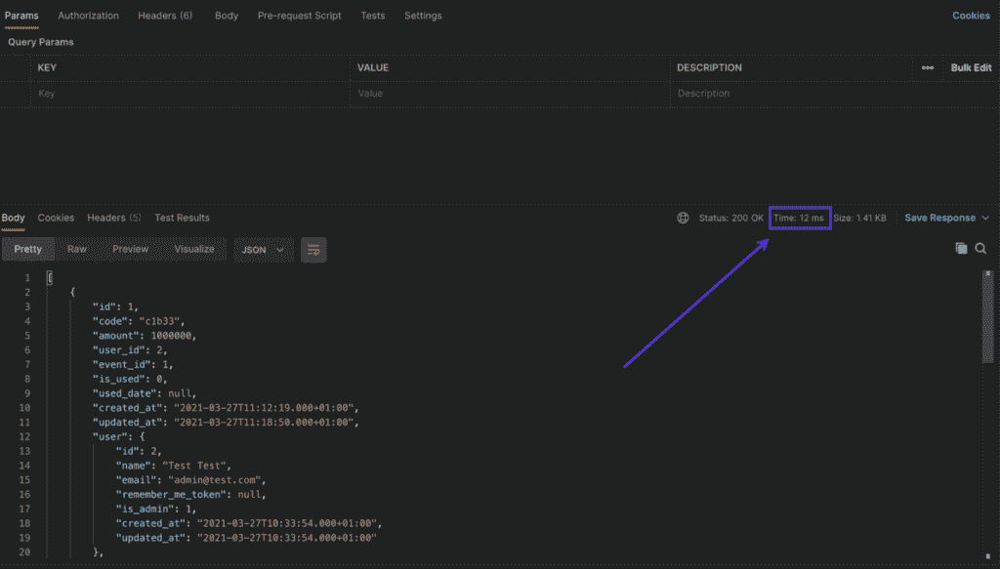
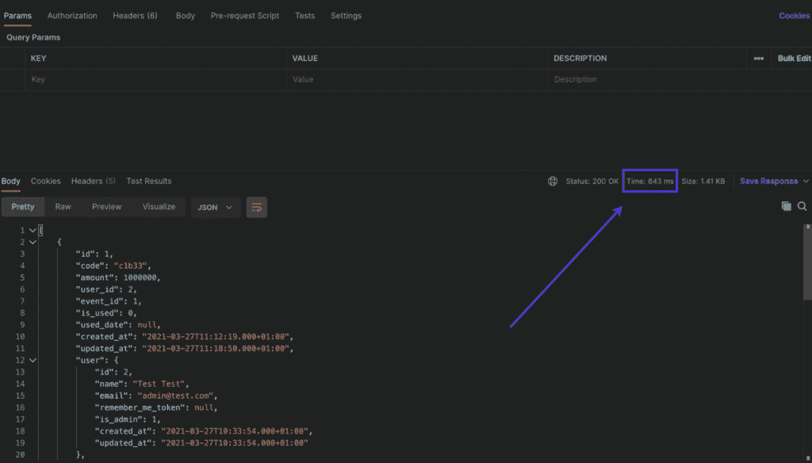

# 关于 Laravel 缓存您需要知道的一切

> 原文：<https://kinsta.com/blog/laravel-caching/>

缓存对于实现高性能和可伸缩性至关重要。从开发阶段就实施正确的[缓存策略](https://kinsta.com/blog/what-is-cache/)对于避免滞后的 API 和缓慢的[页面加载时间](https://kinsta.com/blog/wordpress-caching-plugins/)至关重要。Laravel 是最流行的 PHP 框架之一，因此实现最佳的 Laravel 缓存策略对于更好的用户体验和更大的业务影响是不可或缺的。

在本文中，我们将探索在 Laravel 中实现和操作缓存的策略。您将了解 Laravel 缓存如何工作，几个 Laravel 缓存查询，以及如何在 Laravel 应用程序上处理缓存。

如果您已经对以下内容有了基本的了解，那么您将从这篇文章中获得更多:

*   精通[网络开发](https://kinsta.com/blog/web-development-tools/)
*   对 Laravel 的基本了解
*   用 Laravel 构建[API](https://masteringbackend.com/posts/laravel-framework-the-ultimate-guide)
*   对缓存的基本理解

让我们开始吧！

### 查看我们的[视频指南](https://www.youtube.com/watch?v=6eJMRMgn6mI)到 Laravel 缓存


## 为什么缓存很重要？

随着最近互联网业务的蓬勃发展，不同公司的统计数据显示，网站加载时间和低性能如何严重影响 SEO、用户参与度和没有缓存的对话率。这从一个优秀的缓存策略开始。


> 需要在这里大声喊出来。Kinsta 太神奇了，我用它做我的个人网站。支持是迅速和杰出的，他们的服务器是 WordPress 最快的。
> 
> <footer class="wp-block-kinsta-client-quote__footer">
> 
> 
> 
> <cite class="wp-block-kinsta-client-quote__cite">Phillip Stemann</cite></footer>

[View plans](https://kinsta.com/plans/)

一项[在线研究发现](https://kinsta.com/learn/page-speed/#slow-how-slow)“1 秒钟的加载延迟时间会让亚马逊每年损失 16 亿美元的销售额。”

另一项[谷歌研究报告](https://www.thinkwithgoogle.com/future-of-marketing/digital-transformation/the-google-gospel-of-speed-urs-hoelzle/)“我们的研究表明，如果搜索结果慢了甚至几分之一秒，人们就会少搜索(说真的:一个**400 毫秒的延迟**会导致**0.44%的搜索量下降**，数据粉丝)。这种不耐烦不仅限于搜索领域:如果视频在加载过程中出现停滞，五分之四的互联网用户会点击离开。

网页加载时间稍有迟缓，就会对用户体验造成巨大影响，并导致大量资金损失。


## 什么是 Laravel 缓存？

Laravel 提供了一个健壮且易于使用的缓存实现和不同的缓存后端。使用 Laravel cache，您无需编写任何代码，就可以高效地在许多缓存引擎之间进行切换。

您可以在`**config/cache.php**`文件夹中找到 Laravel 缓存的配置，尽管您可能只需要**。env** 文件在不同的缓存后端之间切换。

Laravel cache 还提供了许多实用的方法，我们可以用它们来实现不同的缓存策略。

### Laravel 高速缓存驱动程序和比较

Laravel cache 提供了优秀的缓存后端和驱动程序。根据您的使用情况，您可以在它们之间切换，以提高您的应用程序性能和加载时间。

也就是说，Laravel cache 还提供了一种无缝的方式来创建自定义后端并将其与 Laravel cache 一起使用，但前提是下面的列表不适合您的用例。

我们接下来会谈到 Laravel cache 提供的所有后端的列表。

#### 1.文件

当在**中没有指定驱动程序时，**文件**驱动程序是 Laravel 缓存使用的默认后端。env** 文件。

**文件**后端被设计成将[缓存数据](https://kinsta.com/blog/what-is-cached-data/)存储在`**storage/framework/**`下的加密文件中。当缓存新数据时，Laravel 用数据和缓存密钥创建一个加密文件。当用户试图检索内容时，也会发生同样的情况。Laravel cache 在文件夹中搜索指定的键，如果找到，就返回内容。

虽然**文件**后端工作完美，节省了安装和配置外部驱动程序的时间，但它也可以成为开发的完美[。这比直接从数据库服务器访问数据要快。](https://kinsta.com/developer-roles/development-at-kinsta/)

要使用**文件**驱动程序，将以下代码添加到您的**中。env** 文件:

```
CACHE_DRIVER=file
```

#### 2.排列

**数组**驱动程序是运行自动化测试的完美的缓存后端，可以通过 Github Actions、Jenkins 等工具轻松配置。

**数组**后端将缓存的数据存储在 PHP 中的一个数组中，不需要您安装或配置任何驱动程序。它非常适合自动化测试，并且比文件缓存后端快一点。

要使用**数组**驱动程序，将以下代码添加到您的**中。env** 文件:

```
CACHE_DRIVER=array
```

#### 3.数据库ˌ资料库

当使用**数据库**驱动程序时，当前 PHP 进程的数据存储在内存中。因此，您需要创建一个数据库表来存储缓存的数据。此外，[数据库](https://kinsta.com/knowledgebase/wordpress-database/)缓存通过将查询工作负载从后端分配到多个前端来提高可伸缩性。

您可以运行 Artisan 命令`php artisan cache:table`来自动生成数据库驱动程序所需的数据库模式。

**数据库**驱动主要用于你可以在你的托管平台上安装任何软件的情况。

例如，假设你正在使用一个有限选项的免费托管计划。为此，我们建议坚持使用**文件**驱动程序，因为**数据库**驱动程序在大多数情况下是应用程序最薄弱的地方，试图将更多的数据推入这个瓶颈并不是一个好主意。

要使用**数据库**驱动程序，将以下代码添加到您的**中。env** 文件:

```
CACHE_DRIVER=database
```

#### 4.雷迪斯

**redis** 驱动使用基于内存的缓存技术，称为 [Redis](https://kinsta.com/help/redis-cache/) **。**虽然与上面讨论的其他高速缓存驱动程序相比，它很快，但它需要安装和配置外部技术。

要使用 **redis** 驱动程序，将以下代码添加到您的**中。env** 文件:

```
CACHE_DRIVER=redis
```

#### 5.Memcached

众所周知，Memcached 是最流行的基于内存的缓存存储。如果你不介意额外的服务器维护(必须安装和维护额外的服务)，基于内存的缓存驱动 Memcached 是很好的选择。

使用 **memcached** 驱动需要安装 [Memcached PECL 包](https://pecl.php.net/package/memcached)。

要使用 **memcached** 驱动程序，将以下代码添加到您的**中。env** 文件。

```
CACHE_DRIVER=memcached 
```

要使用的[最佳缓存驱动程序和缓存驱动程序的性能](https://www.georgebuckingham.com/laravel-cache-driver-performance/)取决于您的项目用例以及要检索的数据量。

### Laravel 高速缓存的使用和方法

Laravel cache 提供了许多有价值的方法，用于实现许多缓存策略。

下面我们将列出并解释不同的方法(根据它们的用例分类):

1.  `put()`
2.  `get()`
3.  `many()`
4.  `putMany()`
5.  `increment()`
6.  `decrement()`
7.  `forever()`
8.  `forget()`
9.  `flush()`
10.  `remember()`
11.  `rememberForever()`

#### 存储缓存

使用不同的方法在缓存中存储新数据非常简单，每种方法都有几个用例。

##### 1.Cache::put()

这个方法接受三个关键参数，**持续时间**，以及要缓存的**数据**。

让我们来看看如何使用`**Cache::put()**`:

```
Cache::put(key, data, duration)

$post = Post::find(1);

Cache::put('post_1', $post, 20); 
```

上面的代码将使用唯一的**键**缓存帖子 20 秒。

##### 2.高速缓存::putMany()

此方法以相同的持续时间在缓存中一次存储一个数据数组。它接受两个参数，即**数据**和**秒**。

让我们来看看如何使用`**Cache::putMany()**`:

```
Cache::putMany(data, duration) // syntax

$posts = Post::all();

Cache::putMany($posts, 20);
```

##### 3.Cache::remember()

这种方法是实现缓存备用策略的另一种很好的方式。`**Cache::remember()**`方法接受三个参数，一个**键**、**秒**和**闭包**，用于在没有找到数据时从数据库中检索数据。

让我们来看看如何使用`**Cache::remember()**`:

```
Cache::remember(key, duration, closure) // syntax

Cache::remember('posts', 20, function(){
  return Post::all();
}); 
```

Laravel cache 也有`**Cache::rememberForever()**`方法，不接受**秒**参数，永久存储**数据**。

##### 4.Cache::forever()

此方法将数据永久存储在缓存服务器中，而不指定任何持续时间。您可以用下面的代码实现它:

```
Cache::forever(key, data)

$post = Post::find(1);

Cache::forever('post_1', $post); 
```

#### 正在检索缓存数据

此类别中的方法从缓存中检索数据。根据数据是否被找到，这些方法中的一些会有不同的表现。

##### 1.Cache::get()

该方法使用特定的键从缓存服务器中检索数据。您可以使用下面的代码来检索项目:

```
Cache::get(key) // syntax

$posts = Cache::get('posts');
```

##### 2.Cache::many()

这个方法类似于`**Cache::putMany()**`。它用于使用缓存的键数组一次检索缓存的数据数组。您可以使用以下代码检索缓存数组:

```
Cache::many(keys) // syntax

const $keys = [
  'posts',
  'post_1',
  'post_2'
];

$posts = Cache::many($keys); 
```

##### 3.Cache::remember()

您还可以使用此方法通过使用提供的键检查缓存服务器来检索缓存的数据。如果数据存储在缓存中，它将检索它。否则，它将从数据库服务器中检索数据并缓存。该方法与`**Cache::rememberForever()**`方法相同，只是在`**Cache::remember()**`方法中多了一个**秒**参数。

#### 从缓存中删除项目

此类别下的方法用于从缓存中移除项目，按功能分组。

##### 1.Cache::forget()

此方法使用指定的键参数从缓存中移除单个项:

```
Cache::forget('key');
```

##### 2.Cache::flush()

该方法清除所有缓存引擎。它会删除存储在缓存中任何位置的所有项目:

```
Cache::flush();
```

#### 递增或递减高速缓存值

您可以分别使用 increment 和 decrement 方法来调整存储在缓存中的整数值:

```
Cache::increment('key');

Cache::increment('key', $amount);

Cache::decrement('key');

Cache::decrement('key', $amount); 
```

Laravel cache 有很多我们上面没有讨论的很棒的方法，但是上面的方法很受欢迎。你可以在官方的 [Laravel 缓存文档](https://laravel.com/docs/8.x/cache#cache-usage)中获得所有方法的概述。

## 注册订阅时事通讯


### 想知道我们是怎么让流量增长超过 1000%的吗？

加入 20，000 多名获得我们每周时事通讯和内部消息的人的行列吧！

[Subscribe Now](#newsletter)

### 缓存命令解释

Laravel 提供了一些命令，使使用 Laravel 缓存变得简单快捷。以下是所有[命令](https://kinsta.com/blog/ssh-commands/)及其功能的列表。

#### 清除 Laravel 缓存

该命令用于使用终端/控制台在 Laravel 缓存过期之前将其清除。例如，您可以运行以下命令:

```
php artisan cache:clear
```

#### 清除路由缓存

这个命令用于清除 Laravel 应用程序的路由缓存。例如，运行以下命令来清除路径缓存:

```
php artisan config:cache
```

#### 清除编译的视图文件

该命令用于清除 Laravel 应用程序的编译视图文件。您可以使用以下命令来实现它:

```
php artisan view:clear
```

#### 数据库表

使用数据库驱动时，需要创建一个名为 **cache** 的数据库模式来存储缓存数据。您也可以使用 Artisan 命令生成具有正确模式的移植:

```
php artisan cache:table
```

## Laravel 缓存策略

根据您的应用程序用例和数据结构，您可能会有几种不同的缓存策略。您甚至可以创建自定义策略来满足您的需求。下面我们将讨论可以在 Laravel 项目中实现的流行缓存策略列表。


### 信息

Kinsta 允许您为您的产品运行 Laravel，尽管我们的团队没有正式支持它。


### 直写

在**直写**策略中，缓存服务器位于请求和数据库服务器之间，使得每个**写**操作在到达数据库服务器之前都要经过缓存服务器。因此，**直写**缓存策略类似于**直读**策略。

您可以使用 Laravel 缓存通过以下代码实现这一策略:

```
public function writeThrough($key, $data, $minutes) {
    $cacheData = Cache::put($key, $data, $minutes)

    // Database Server is called from(after) the Cache Server.
    $this->storeToDB($cachedData)
    return $cacheData
}

private function storeToDB($data){
    Database::create($data)
    return true
}
```

### 写回(写后)

这种策略是通过增加写操作延迟来实现**写通**策略的更高级的方式。

您也可以称之为 **writeBehind** 策略，因为在将数据写入数据库服务器之前，缓存服务器会有时间延迟。

您可以使用 Laravel 缓存通过以下代码实现这一策略:

```
$durationToFlush = 1; // (in minute)
 $tempDataToFlush = [];

  public function writeBack($key, $data, $minutes){
    return $this->writeThrough($key, $data, $minutes);
  }

  public function writeThrough($key, $data, $minutes) {
      $cacheData = Cache::put($key, $data, $minutes);
      $this->storeForUpdates($cacheData);
      return $cacheData;
  }

// Stores new data to temp Array for updating
  private function storeForUpdates($data){
    $tempData = {};
    $tempData['duration'] = this.getMinutesInMilli();
    $tempData['data'] = data;
    array_push($tempDataToFlush, data);
  }

// Converts minutes to millisecond
private function getMinutesInMilli(){
  $currentDate = now();
  $futureDate = Carbon(Carbon::now()->timestamp + $this->durationToFlush * 60000)
  return $futureDate->timestamp
}

// Calls to update the Database Server.
public function updateDatabaseServer(){
  if($this->tempDataToFlush){
    foreach($this->tempDataToFlush as $index => $obj){
      if($obj->duration timestamp){
        if(Database::create($obj->data)){
            array_splice($this->tempDataToFlush, $index, 1);
        }
      }
    }
  }
}
```

**写回**方法调用**写通**方法，该方法将数据存储到缓存服务器，并使用**更新数据库服务器**方法将一个临时数组稍后推送到数据库服务器。您可以设置一个 [CronJob](https://masteringbackend.com/posts/laravel-cron-the-definitive-guide) 每五分钟更新一次数据库服务器。

### 四处写

这种策略允许所有的**写**操作直接进入数据库服务器，而无需更新缓存服务器——只有在**读**操作期间，缓存服务器才会被更新。

假设用户想要创建一个新的**文章**，**文章**直接存储到数据库服务器。当用户第一次想要阅读**文章**的内容时，从数据库服务器中检索**文章**，并为后续请求更新缓存服务器。

您可以使用 Laravel 缓存通过以下代码实现这一策略:

厌倦了低于 1 级的 WordPress 托管支持而没有答案？试试我们世界一流的支持团队！[查看我们的计划](https://kinsta.com/plans/?in-article-cta)

```
public function writeAround($data) {
    $storedData = Database::create($data);
    return $storedData;
}

public function readOperation($key, $minutes){
    $cacheData = Cache::remember($key, $minutes, function() {
      return Article::all();
    })
    return $cacheData;
} 
```

### 缓存搁置(延迟加载)

在这种策略中，数据库处于闲置状态，应用程序首先从缓存服务器请求数据。然后，如果有一个命中(发现)，数据被返回给客户端。否则，如果有未命中(未找到)，数据库服务器将请求数据并为后续请求更新缓存服务器。

您可以使用 Laravel 缓存通过以下代码实现这一策略:

```
public function lazyLoadingStrategy($key, $minutes, $callback) {
  if (Cache::has($key)) {
      $data = Cache::get($key);
      return $data;
  } else {
      // Database Server is called outside the Cache Server.
      $data = $callback();
      Cache::set($key, $data, $minutes);
      return $data;
  }
}
```

上面的代码展示了缓存备用策略的实现，这相当于实现了 **Cache::remember** 方法。

### 通读

这种策略与缓存备用策略正好相反。在这种策略中，缓存服务器位于客户机请求和数据库服务器之间。

请求直接发送到缓存服务器，如果在缓存服务器中没有找到数据，缓存服务器负责从[数据库服务器](https://kinsta.com/blog/install-php/)中检索数据。

您可以使用 Laravel 缓存通过以下代码实现这一策略:

```
public function readThrough($key, $minutes) {
      $data = Cache::find($key, $minutes);
      return $data;
}

private function find($key, $minutes){
    if(Cache::has($key);){
      return Cache::get($key);
    }

    // Database Server is called from the Cache Server.
    $DBdata = Database::find($key);
    Cache:put($key, $DBdata, $minutes);
    return $DBdata;
}
```

你有它！我们现在已经讨论了下一个 Laravel 应用程序的一些流行的缓存策略。请记住，您甚至可以使用最适合您的项目需求的自定义缓存策略。


## 缓存 Laravel 应用程序的 UI 部分

缓存我们的 Laravel 应用程序的 UI 是一个被称为全页面缓存 FPC 的概念。该术语指的是缓存来自应用程序的 HTML 响应的过程。

它非常适合动态 HTML 数据不经常变化的应用程序。您可以缓存 HTML 响应以获得更快的总体响应和 HTML 呈现。

我们可以用下面一行代码实现 FPC:

```
class ArticlesController extends Controller {
    public function index() {
        if ( Cache::has('articles_index') ) {
            return Cache::get('articles_index');
        } else {
            $news = News::all();
            $cachedData = view('articles.index')->with('articles', $news)->render();
            Cache::put('articles_index', $cachedData);                                         
            return $cachedData;           
        }  
    }
}
```

乍一看，您可能已经注意到我们检查了那个 **articles_index** 页面是否已经存在于我们的缓存服务器中。然后，我们通过用 Laravel 的**视图()**和**渲染()**方法渲染页面来返回页面。

否则，我们将呈现页面，并在将呈现的页面返回到浏览器之前，将输出存储在缓存服务器中以供后续请求使用。

## 构建一个 Laravel 应用程序

现在，我们将通过创建一个新的 Laravel 项目并实现 Laravel 缓存来应用我们目前所学的内容。

如果你没有用过 Laravel，你可以通读[什么是 Laravel](https://kinsta.com/knowledgebase/what-is-laravel/)并偷看我们的[优秀 Laravel 教程列表](https://kinsta.com/blog/laravel-tutorial/)来入门。

### 设置 Laravel

首先，我们将使用下面的命令创建一个新的 Laravel 实例。你可以查阅更多的官方文件。

在运行下面的命令之前，打开您的控制台并导航到您存储 PHP 项目的位置。确保正确安装和配置了 [Composer](https://getcomposer.org/) 。

```
composer create-project laravel/laravel fast-blog-app

// Change directory to current Laravel installation
cd fast-blog-app

// Start Laravel development server.
php artisan serve 
```

### 配置和设定数据库种子

接下来，我们将建立我们的数据库，创建一个新的**文章**模型，并播种 500 个假数据点进行测试。

打开您的[数据库客户端](https://kinsta.com/blog/adminer/)并创建一个新的数据库。我们将对名称 **fast_blog_app_db** 做同样的处理，然后填充我们的**。带有数据库凭证的 env** 文件:

```
DB_CONNECTION=mysql
DB_HOST=127.0.0.1
DB_PORT=3306
DB_DATABASE=fast_blog_app_db
DB_USERNAME=//DB USERNAME HERE
DB_PASSWORD=//DB PASSWORD HERE 
```

接下来，我们将运行以下命令来同时创建迁移和**文章**模型:

```
php artisan make:model Article -m
```

打开新创建的迁移发现`database/migrations/xxx-create-articles-xxx.php`并粘贴以下代码:

```
<?php
use Illuminate\Support\Facades\Schema;
use Illuminate\Database\Schema\Blueprint;
use Illuminate\Database\Migrations\Migration;
class CreateArticlesTable extends Migration
{
    /**
     * Run the migrations.
     *
     * @return void
     */
    public function up()
    {
        Schema::create('articles', function (Blueprint $table) {
            $table->id();
            $table->string('title');
            $table->text('description');
            $table->timestamps();
        });
    }
    /**
     * Reverse the migrations.
     *
     * @return void
     */
    public function down()
    {
        Schema::dropIfExists('articles');
    }
}
```

接下来，运行下面的命令来创建一个新的种子:

```
php artisan make:seeder ArticleSeeder
```

打开在`database/seeders/ArticleSeeder.php`中新创建的种子文件，并粘贴以下代码:

```
<?php
namespace Database\Seeders;
use App\Models\Article;
use Illuminate\Database\Seeder;
class ArticleSeeder extends Seeder
{
    /**
     * Run the database seeds.
     *
     * @return void
     */
    public function run()
    {
        Article::factory()->count(500)->create();
    }
}
```

打开同一目录下的**DatabaseSeeder.php**文件，添加以下代码:

```
<?php
namespace Database\Seeders;
use Illuminate\Database\Seeder;
class DatabaseSeeder extends Seeder
{
    /**
     * Seed the application's database.
     *
     * @return void
     */
    public function run()
    {
        $this->call(ArticleSeeder::class);
    }
}
```

接下来，运行下面的命令创建一个新工厂:

```
php artisan make:factory ArticleFactory
```

打开在`database/factories/ArticleFactory.php`中找到的新建工厂文件，并粘贴以下代码:

```
<?php
namespace Database\Factories;
use App\Models\Article;
use Illuminate\Database\Eloquent\Factories\Factory;
class ArticleFactory extends Factory
{
    /**
     * The name of the factory's corresponding model.
     *
     * @var string
     */
    protected $model = Article::class;
    /**
     * Define the model's default state.
     *
     * @return array
     */
    public function definition()
    {
        return [
            'title' => $this->faker->text(),
            'description' => $this->faker->paragraph(20)
        ];
    }
}
```

现在，运行下面的命令来迁移我们新创建的模式，并为测试植入我们的假数据:

```
php artisan migrate --seed
```

### 创建文章控制器

接下来，我们将创建控制器，并设置路由来处理我们的请求，并使用上述模型检索数据。

运行以下命令，在`app/Http/Controllers`文件夹中创建一个新的 **ArticlesController** :

```
php artisan make:controller ArticlesController --resource
```

打开文件，并将以下代码添加到类中:

```
// Returns all 500 articles with Caching
public function index() {
  return Cache::remember('articles', 60, function () {
      return Article::all();
  });
}

// Returns all 500 without Caching 
public function allWithoutCache() {
  return Article::all();
}
```

之后，打开在`routes/`文件夹中找到的**api.php**文件，并粘贴以下代码来创建一个端点，我们可以调用它来检索我们的数据:

```
Route::get('/articles', '[[email protected]](/cdn-cgi/l/email-protection)');

Route::get('/articles/withoutcache', '[[email protected]](/cdn-cgi/l/email-protection)');
```

### 测试性能

最后，我们将[测试我们的应用程序响应的性能](https://kinsta.com/blog/application-performance-monitoring/),无论是否实现了 Laravel 缓存。

此屏幕截图显示了实现了缓存的 API 的响应时间:

[](https://kinsta.com/wp-content/uploads/2021/07/laravel-api-response-time-cache.png)

Laravel API response time with cache.


下面的屏幕截图显示了未实现缓存的 API 的响应时间—注意，缓存实例的响应时间增加了超过 **5，000%** :

[](https://kinsta.com/wp-content/uploads/2021/07/laravel-api-response-time-no-cache.png)

Laravel API response time without cache.


[对 web 开发和 laravel 有扎实的掌握，但是想了解更多关于 laravel 缓存的知识，以及如何实现？✅:这封信是给你的👇](https://twitter.com/intent/tweet?url=https%3A%2F%2Fkinsta.com%2Fblog%2Flaravel-caching%2F&via=kinsta&text=Have+a+solid+grasp+of+web+development+and+laravel%2C+but+want+to+learn+more+about+laravel+caching+and+how+you+can+implement+it%3F+%E2%9C%85+This+post+is+for+you+%F0%9F%91%87&hashtags=Laravel%2CCaching)

## 摘要

我们通过构建一个新的项目，对其响应进行基准测试，并比较结果，探索了实现和操作 Laravel 缓存的各种策略。

您还了解了如何使用不同的 Laravel 缓存驱动程序和方法。此外，我们实施了不同的缓存策略来帮助您确定哪种策略可能适合您。

要了解更多 laravel，请浏览我们精心挑选的[最佳 Laravel 教程](https://kinsta.com/blog/laravel-tutorial/)。无论您是初学者还是高级 Laravel 开发人员，这里都有适合每个人的东西！

如果你还有关于 Laravel 缓存的问题，请在评论区告诉我们。

* * *

让你所有的[应用程序](https://kinsta.com/application-hosting/)、[数据库](https://kinsta.com/database-hosting/)和 [WordPress 网站](https://kinsta.com/wordpress-hosting/)在线并在一个屋檐下。我们功能丰富的高性能云平台包括:

*   在 MyKinsta 仪表盘中轻松设置和管理
*   24/7 专家支持
*   最好的谷歌云平台硬件和网络，由 Kubernetes 提供最大的可扩展性
*   面向速度和安全性的企业级 Cloudflare 集成
*   全球受众覆盖全球多达 35 个数据中心和 275 多个 pop

在第一个月使用托管的[应用程序或托管](https://kinsta.com/application-hosting/)的[数据库，您可以享受 20 美元的优惠，亲自测试一下。探索我们的](https://kinsta.com/database-hosting/)[计划](https://kinsta.com/plans/)或[与销售人员交谈](https://kinsta.com/contact-us/)以找到最适合您的方式。