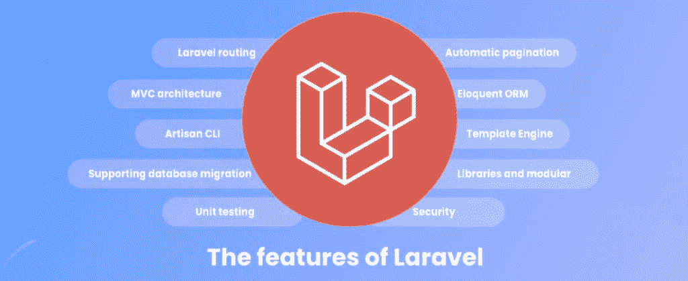

# Laravel 9 的新特性:深入了解最新的主要版本

> 原文：<https://kinsta.com/blog/laravel-9/>

多年来，Laravel 一直是最受欢迎的 PHP 开发框架之一。它优雅、可伸缩，已经成为开发人员和使用 PHP 的公司事实上的框架之一。Laravel 9 是其最新发布的版本，具有许多新功能。

在过去，每六个月就会有新的 Laravel 发布，导致了大量的问题、苛刻的评论和对 Laravel 新发布过程的困惑。随着 2022 年 2 月 Laravel 9 的发布，该框架进入了 12 个月的主要发布周期。

本文探讨了 Laravel 9 的主要特性。除此之外，我们还将详细介绍如何升级到 Laravel 9 并开始开发 web 应用程序。

T3】

## 什么是 Laravel？

Laravel 是一个开源的 PHP web 应用程序框架，以其优雅的语法而闻名。这是一个使用 [PHP 编程语言](https://kinsta.com/knowledgebase/what-is-php/)构建简单到复杂的 web 应用程序的 MVC 框架，它严格遵循 MVC(模型-视图-控制器)架构模式。

如果你还没有使用过 Laravel，你可以阅读[什么是 Laravel](https://kinsta.com/knowledgebase/what-is-laravel/)并查看我们的[优秀 Laravel 教程列表](https://kinsta.com/blog/laravel-tutorial/)来开始使用。

[Laravel 9 来了，还有很多要拆包的！🎒在本指南的帮助下深入了解👇 点击推文](https://twitter.com/intent/tweet?url=https%3A%2F%2Fkinsta.com%2Fblog%2Flaravel-9%2F&via=kinsta&text=Laravel+9+is+here%2C+and+there%27s+a+lot+to+unpack%21+%F0%9F%8E%92+Dive+in+with+help+from+this+guide+%F0%9F%91%87&hashtags=Laravel%2CWebDev)

## Laravel 的主要特点

如果你是这个框架的新手，我们已经整理了一些最好的 Laravel 特性，让你有更好的理解。


> Kinsta 把我宠坏了，所以我现在要求每个供应商都提供这样的服务。我们还试图通过我们的 SaaS 工具支持达到这一水平。
> 
> <footer class="wp-block-kinsta-client-quote__footer">
> 
> 
> 
> <cite class="wp-block-kinsta-client-quote__cite">Suganthan Mohanadasan from @Suganthanmn</cite></footer>

[View plans](https://kinsta.com/plans/)

[](https://kinsta.com/wp-content/uploads/2021/08/The-features-of-Laravel.jpeg)

Laravel features in bubbles. (Image source: [Moon Technolabs](https://www.moontechnolabs.com/laravel-technology))


### 雄辩的 ORM

Laravel 的对象关系映射器(ORM)被称为雄辩的，这是 Laravel 的最佳特性之一，因为它允许与数据模型和选择的数据库无缝交互。

借助雄辩，Laravel 抽象出了涉及与复杂的 SQL 查询[交互和编写复杂的 SQL 查询](https://kinsta.com/knowledgebase/what-is-mysql/)以从数据库中访问数据的每一个障碍。

### Artisan CLI

Artisan CLI 或命令行是 Laravel 的另一个重要方面。有了它，您可以从命令行创建或修改 Laravel 的任何部分，而不必浏览文件夹和文件。

使用 Artisan，您甚至可以使用 Laravel Tinker 从命令行直接与数据库进行交互，而无需安装数据库客户端。

### MVC 架构

Laravel 的 MVC 架构本质使得这种语言具有相关性和适应性，因为它遵循了一种流行的 web 开发模式，并不断进行重大改进。

Laravel 会强迫你学习和理解 [MVC 架构模式](https://kinsta.com/blog/php-frameworks/#model-view-controller-architecture)，这种模式在几乎所有框架中都很流行和使用，比如 JavaScript 的 AdonisJS 和 C#的 ASP.NET MVC。
T3】

### 自动分页

如果您曾经在应用程序中挣扎过分页，那么您将会理解通过内置框架整理分页的价值。

Laravel 通过构建开箱即用的自动分页解决了分页问题。这个特性是它最受认可的特性之一，它消除了自己解决分页之谜所涉及的工作。

### 安全性

仔细检查你正在考虑使用的任何网络应用程序的安全措施是很重要的，因为缺乏尽职调查会导致资金损失，甚至劫持你的网站或产品。

由于 Laravel 遵循了 [OWASP 安全原则](https://owasp.org/www-project-top-ten/)，因此它提供了许多安全措施。从跨站请求伪造(CSRF)到 [SQL 注入](https://kinsta.com/blog/sql-injection/)，Laravel 有一个内置的解决方案。


## Laravel 9 的新功能

原定于 2021 年 9 月发布的 Laravel 9 版本被[推迟到 2022 年 1 月](https://blog.laravel.com/laravel-9-release-date)(以及 2022 年 2 月晚些时候)，这使得它成为继 12 个月的发布周期之后推出的第一个长期支持(LTS)版本。这种延迟是由多种原因造成的，包括但不限于以下原因:

1.  Laravel 使用各种社区驱动的项目和大约 9 个 Symfony 库。然而，Symfony 计划在 2021 年 11 月发布 6.0 版本。延迟将允许 Laravel 团队将这个新版本的 Symfony 作为 Laravel 9 的一部分。
2.  这一延迟将为团队提供两个月的时间来监控 Laravel 如何与 Symfony 的新版本进行交互。这也给了他们修正任何重大变化或错误的空间。
3.  最后，延迟 Laravel 9 可以更好地为 Laravel 团队将来的年度发布做准备。Symfony 发布后，将会给团队两个月的额外加速时间。

基于这些原因，你可以看到发布延迟是值得等待的。


Kinsta 允许您为您的产品运行 Laravel，尽管我们的团队并不正式支持它。


## Laravel 9 中的新功能

现在，让我们来看看 Laravel 即将发布的主要版本中的特性和改进列表。

## 注册订阅时事通讯


### 想知道我们是怎么让流量增长超过 1000%的吗？

加入 20，000 多名获得我们每周时事通讯和内部消息的人的行列吧！

[Subscribe Now](#newsletter)

### 最低 PHP 要求

首先也是最重要的，Laravel 9 需要[最新的 PHP 8](https://kinsta.com/blog/php-8/) 和 PHPUnit 8 进行测试。这是因为 Laravel 9 将使用最新的 Symfony v6.0，它也需要 PHP 8。

PHP 8 有显著的改进和特性，从 JIT 编译到构造函数属性提升。你可以在我们的博客上探索不同的 PHP 版本基准测试，并学习如何从 T2 升级到最新的 PHP 8。


### 匿名存根迁移

Laravel 将匿名存根迁移设置为运行常用迁移命令时的默认行为:

```
php artisan make:migration 
```

匿名存根迁移特性在 Laravel 8.37 中首次发布，以解决这个 Github 问题。问题是，当试图从头开始重新创建数据库时，具有相同类名的多个迁移可能会导致问题。新的存根迁移功能消除了迁移类名冲突。

从 Laravel 8.37 开始，框架现在支持匿名类迁移文件，在 Laravel 9 中，这将是默认行为。

```
<?php

use Illuminate\Database\Migrations\Migration;
use Illuminate\Database\Schema\Blueprint;
use Illuminate\Support\Facades\Schema;
return new class extends Migration {
    /**
     * Run the migrations.
     *
     * @return void
     */
    public function up()
    {
        Schema::table('people', function (Blueprint $table)
        {
            $table->string('first_name')->nullable();
        });
    }
}; 
```

### 新的查询生成器界面

有了新的 Laravel 9，类型提示在他们的[ide](https://kinsta.com/blog/php-editor/)中对于重构、静态分析和代码完成是高度可靠的。由于在**查询\构建器、雄辩\构建器和雄辩\关系之间缺乏共享接口或继承。**尽管如此，有了 Laravel 9，开发人员现在可以享受新的查询构建器接口，用于类型提示、重构和静态分析。

```
<?php

return Model::query()
	->whereNotExists(function($query) {
		// $query is a Query\Builder
	})
	->whereHas('relation', function($query) {
		// $query is an Eloquent\Builder
	})
	->with('relation', function($query) {
		// $query is an Eloquent\Relation
	}); 
```

这个版本增加了新的`Illuminate\Contracts\Database\QueryBuilder interface`，以及将代替`__call`魔法方法实现接口的`Illuminate\Database\Eloquent\Concerns\DecoratesQueryBuilder`特征。

需要为您的电子商务网站提供超快的、可靠的、完全安全的托管服务吗？Kinsta 提供了所有这些以及来自 PHP 专家的 24/7 世界级支持。[查看我们的计划](https://kinsta.com/plans/?in-article-cta)

### PHP 8 字符串函数

由于 Laravel 9 的目标是 PHP 8，Laravel 合并了[这个 PR](https://github.com/laravel/framework/pull/38011) ，建议使用最新的 PHP 8 字符串函数。

这些函数包括在`\Illuminate\Support\Str`类内部使用`str_contains()`、`str_starts_with()`和`str_ends_with()`。

上面列出的 Laravel 9 的特性和改进是对即将到来的事物的一个先睹为快。它肯定会带来许多 bug 修复、特性，当然，还有许多突破性的变化。

## 如何安装 Laravel 9

如果您想开始使用 Laravel 9 进行开发和测试，您可以很容易地在本地机器上安装并运行它。

Laravel 9 支持 PHP 版本 8，所以如果你打算测试它，确保检查你的 [PHP 版本](https://kinsta.com/knowledgebase/devkinsta/php-versions/)或者[启动全新安装](https://kinsta.com/blog/install-php/)。

你可以通过 Packagist 找到关于发布[的更多细节。](https://packagist.org/packages/laravel/laravel#dev-develop)

要使用 composer 安装 Laravel 9，请运行以下命令:

```
composer create-project --prefer-dist laravel/laravel laravel-9-dev dev-develop 
```

上面的命令将创建一个新的 Laravel 项目，项目名为`laravel-9-dev`，使用最新的 Laravel 9，正如我们所知，它仍在开发中(因此为`dev-develop`)。

第二种方法是使用 [Laravel 全局 CLI](https://laravel.com/docs/8.x/installation#the-laravel-installer) 创建一个新的 Laravel 项目，并选择从 dev 分支创建您的新项目。

输入以下命令创建一个新的 Laravel 9 项目:

```
laravel new laravel-9-dev --dev 
```

现在您已经安装了 Laravel 9，您可以进入新目录(laravel-dev)并执行 artisan 命令来检查版本:

```
cd laravel-9-dev
php artisan --version 
```

它应该向您展示 Laravel 9 的开发版本。瞧啊。

[就在这里！😄在这本大型指南中获取所有关于 Laravel 9 的独家新闻💥](https://twitter.com/intent/tweet?url=https%3A%2F%2Fkinsta.com%2Fblog%2Flaravel-9%2F&via=kinsta&text=It%27s+here%21+%F0%9F%98%84+Get+the+scoop+on+all+things+Laravel+9+in+this+mega+guide+%F0%9F%92%A5&hashtags=Laravel%2CWebDev)

## 摘要

Laravel 是一个引人注目的 PHP 框架,越来越受到开发人员的关注。Laravel 9 是 12 个月发布周期后的第一个版本，我们已经可以体验到它“有趣”的新功能。

Laravel 团队可能会在未来宣布新的特性和更新。因此，请确保将这篇文章加入书签，因为我们将在未来的更新中涵盖它们。

现在，轮到你了！你对 Laravel 9 最期待的是什么？请在评论区告诉我们！

* * *

让你所有的[应用程序](https://kinsta.com/application-hosting/)、[数据库](https://kinsta.com/database-hosting/)和 [WordPress 网站](https://kinsta.com/wordpress-hosting/)在线并在一个屋檐下。我们功能丰富的高性能云平台包括:

*   在 MyKinsta 仪表盘中轻松设置和管理
*   24/7 专家支持
*   最好的谷歌云平台硬件和网络，由 Kubernetes 提供最大的可扩展性
*   面向速度和安全性的企业级 Cloudflare 集成
*   全球受众覆盖全球多达 35 个数据中心和 275 多个 pop

在第一个月使用托管的[应用程序或托管](https://kinsta.com/application-hosting/)的[数据库，您可以享受 20 美元的优惠，亲自测试一下。探索我们的](https://kinsta.com/database-hosting/)[计划](https://kinsta.com/plans/)或[与销售人员交谈](https://kinsta.com/contact-us/)以找到最适合您的方式。