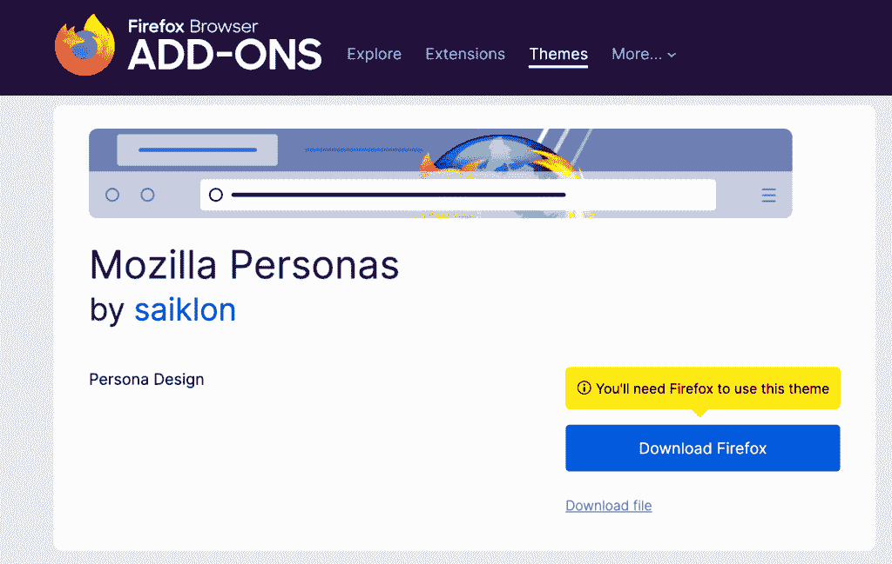

# 2022 年最受欢迎的 10 种 Node.js 应用

> 原文：<https://kinsta.com/blog/node-js-apps/>

Node.js 已经存在了一段时间，有许多记录证明了它在构建和扩展企业级应用程序时是多么高效和快速。几家领先的技术公司开发的这些 Node.js 应用程序通过高效、简单、灵活的 API 解决了业务需求。

它也是协作开发的优秀工具，允许用一种语言开发产品的前端和后端，从而允许一个统一的 JavaScripters 团队。

在本文中，我们将通过示例讨论十种流行的 Node.js 应用程序。我们还将聚焦使用 Node.js 的顶级领先公司，以帮助您确定为什么应该使用 Node.js。

我们开始吧！

## Node.js 是什么？

[Node.js](https://kinsta.com/knowledgebase/what-is-node-js/#nodejs-architecture-and-how-it-works) 是一个异步事件驱动的 JavaScript 运行时引擎，旨在构建可扩展的网络应用。这是一个快速、轻量级、高效和可扩展的开发环境，由 Chrome 的 V8 JavaScript 引擎构建。

自从拉恩·达尔在 2009 年首次发布 Node.js 以来，它在财富 500 强企业中的使用量和普及率都有了巨大的增长。

[对 Node.js 好奇？👀了解其快速、高效和灵活的 API 如何使其成为许多企业的首选✅ 点击推特](https://twitter.com/intent/tweet?url=https%3A%2F%2Fkinsta.com%2Fblog%2Fnode-js-apps%2F&via=kinsta&text=Curious+about+Node.js%3F+%F0%9F%91%80+Learn+how+its+fast%2C+efficient%2C+and+flexible+APIs+have+made+it+a+favorite+choice+for+many+businesses+%E2%9C%85&hashtags=Nodejs%2CWebDev)

> 需要在这里大声喊出来。Kinsta 太神奇了，我用它做我的个人网站。支持是迅速和杰出的，他们的服务器是 WordPress 最快的。
> 
> <footer class="wp-block-kinsta-client-quote__footer">
> 
> 
> 
> <cite class="wp-block-kinsta-client-quote__cite">Phillip Stemann</cite></footer>

[View plans](https://kinsta.com/plans/)

## 为什么要用 Node.js？

由于其单线程和实时推送架构，开发人员主要将 Node.js 用于非阻塞、事件驱动的应用程序和服务器。它对于开发传统的 web 应用程序后端和 API 也非常有用。

以下是您可能希望使用 Node.js 以及它适合构建应用程序的几个原因。

### 可量测性

Node.js 允许您使用微服务架构和容器化来构建随业务扩展的应用程序。您几乎不费吹灰之力就可以实现可伸缩性和灵活性。

### 表演

Node.js 使用 Chrome 的 V8 引擎提高了性能。这是一个[高性能系统](https://kinsta.com/blog/boosting-wordpress-performance/)，这就是为什么优步等公司在 2009 年的早期版本中采用了它。

### 微服务

Node.js 的微服务特性对于可维护性来说是一个巨大的优势。如果你能把一个代码库分成小块，那么维护起来就比一个臃肿的代码库简单多了。

### 可用性

由于 Node.js 的微服务架构、在前端和后端使用一种编程语言的能力，以及通过 NPM 提供的[数百万个库来满足您的确切开发需求，因此使用 node . js 可以优化和加速 web 应用程序开发过程。
T3】](https://kinsta.com/knowledgebase/what-is-node-js/#what-is-npm)

## 构建 Node.js 应用的顶级公司

下面列出了一些在服务器上运行 Node.js 来支持企业应用程序的热门公司。

### 商务化人际关系网

LinkedIn

LinkedIn 是一种社交媒体服务，用于职业联系和职业发展。它的目标是寻求职业发展的候选人和寻找有竞争力的候选人的公司。

Linkedin 开始只在他们的移动应用程序中使用 Node.js，后来将整个代码库迁移到它上面。他们还记录了比之前的 Ruby on Rails 快 20 倍的应用速度。

### 网飞

Netflix

[网飞](https://www.netflix.com/)是一个拥有数百万用户的视频流媒体平台，允许使用任何智能设备或平台的[流媒体](https://kinsta.com/blog/video-hosting/)电影和电视节目。

据网飞称，由于 Node.js 的模块化，他们用 node . js 构建了自己的用户界面。使用 Node.js 时，网飞的启动时间比快了两倍

### 超级的

Uber

[优步](https://www.uber.com/)是一款国际乘车和交通网络应用。显而易见，优步已经改变了运输业。它在 [85 个国家](https://ride.guru/content/resources/rideshares-worldwide#UBER)和全球 900 多个城市提供服务，每天完成超过 1400 万次旅行。

最重要的是，优步也是 Node.js 的早期采用者

采用它们的主要原因是因为 Node.js 拥有易于错误检查、卓越的[调试](https://kinsta.com/blog/wordpress-debug/)、更快的处理速度和持续的开发。

这些特性促进了优步的开发运营，使他们几乎可以立即修复错误，而无需重启应用程序。

### 贝宝

PayPal

[PayPal](https://paypal.com/) 是[顶级在线支付系统](https://kinsta.com/blog/paypal-alternative/)之一，为许多受支持国家的数百万用户提供值得信赖的支付服务。PayPal 使用 Node.js 构建应用程序中面向用户的内容部分。

Node.js 统一了每个应用程序前端和后端的 JavaScript。最值得注意的是，PayPal 喜欢 Node.js 的地方在于它有助于他们的开发过程。

根据 Brainhub 的消息，Node.js 为 PayPal 提供了更快的网络应用加载时间，比最初基于 Java 的应用快了近一倍，代码行数减少了 33%，文件数量减少了 40%。

### 浏览器名

Mozilla Personas

Mozilla Firefox 是第二受欢迎的网络浏览器。Mozilla 使用 Node.js 作为他们的主要语言，他们的许多 web 应用程序都使用它。[例如，Mozilla Persona](https://addons.mozilla.org/en-US/firefox/addon/mozilla-personas/) 是用 Node.js 构建的跨平台登录技术

## 注册订阅时事通讯

### 想知道我们是怎么让流量增长超过 1000%的吗？

加入 20，000 多名获得我们每周时事通讯和内部消息的人的行列吧！

[Subscribe Now](#newsletter)

## 10 种流行的 Node.js 应用程序

下面是我们精心挑选的可以构建的 10 种 Node.js 应用程序。

### 实时协作工具

Node.js 是一个强大的引擎，用于创建实时协作工具，从协同工作应用程序到项目管理、视频和音频会议以及协作文档编辑。

这解释了为什么 Node.js 是大型科技公司拥有的许多流行协作工具的基础，如用于项目管理的 [Trello 和用于小组聊天和远程团队通信的](https://kinsta.com/blog/trello-vs-asana/) [Slack。](https://kinsta.com/blog/how-to-use-slack/)

Node.js 的异步和基于事件的架构提供了基础，非常适合构建和扩展协作应用程序。

### 单页应用程序

单页应用程序(SPA)对于 web 开发来说并不是新概念。这是一个流行词，描述了一种方法，其中整个应用程序适合单个页面，具有更好的开发人员体验。

Node.js 非常适合 spa，因为它可以更快、更高效地处理异步调用和繁重的输入/输出(I/O)工作负载。为了实现视图和服务器之间的无缝数据转换，Node.js 事件循环可以“延迟”来自客户端的多个并发请求，从而实现平滑处理。

Node.js 也是利用其数据驱动方法构建 SPA 后端的绝佳选择。我们可以使用 [JavaScript 框架](https://kinsta.com/blog/javascript-libraries/)比如 [Express.js](https://kinsta.com/knowledgebase/what-is-express-js/) ，Adonis.js，或者 Koa 来开发一个[复杂的数据密集型 SPA 后端](https://masteringbackend.com/posts/backend-development-the-ultimate-guide)。

### 实时应用

构建实时网络应用程序是 Node.js 的最佳功能之一。从[构建实时聊天应用程序](https://masteringbackend.com/posts/build-a-real-time-chat-app-with-vue-3-socket-io-and-nodejs)如即时消息(IM)和互联网中继聊天(IRC)应用程序到构建复杂的实时应用程序，您都可以完成。

Node.js 提供了使用事件 API 构建和部署实时和网络应用程序的基本功能。它可以创建一个名为发射器的对象，该对象定期发射命名事件，并且可以被事件处理程序监听。

由于其基于事件的体系结构，Node.js 可以有效地使用 WebSockets 协议，促进服务器和客户端之间的实时双向通信。

Node.js 通过诸如 [Socket.io](http://socket.io) 和 WebSocket-node 等库提供了出色的 WebSockets 支持，您可以使用这些库快速有效地创建和部署[实时聊天](https://kinsta.com/blog/chatbot/)。

### 基于位置的应用

Node.js 的异步特性及其提供实时更新的能力使其成为构建基于位置的应用程序的首选。

需要一流的，快速的，安全的托管你的新 WordPress 网站？Kinsta 提供超快的服务器和来自 WordPress 专家的 24/7 世界级支持。[查看我们的计划](https://kinsta.com/plans/?in-article-cta)

2020 年，基于位置的应用数量有所增加。这些应用程序大多使用 Node.js 和其他相关堆栈，因为 Node.js 具有基于事件的架构和异步编程等特性，可用于构建实时和网络应用程序。

### 流媒体应用

应用程序流是一个按需下载部分应用程序的过程，不会使服务器或用户的本地计算机过载。

有了 stream API， [Node.js](https://kinsta.com/knowledgebase/what-is-node-js/) 可以轻松处理实时数据流，这是一个流应用的主要特性。Node.js 还可以提供服务器和客户端之间的快速数据同步，这通过使用 Node.js 事件循环最小化延迟来改善用户体验。

Node.js 提供了一个可读和可写的流接口，您可以使用它来高效地处理数据流。

### 物联网

自 2012 年物联网兴起以来，Node.js 已成为为私有和公共物联网系统构建企业和组织级解决方案的首选引擎。

Node.js 可以处理遍布互联网的数百万个物联网设备发出的多个并发请求和事件，这是任何物联网设备的本质属性。

例如，Skycatch 使用 Node.js 为其专门的[无人机](https://kinsta.com/clients/dartdrones-shark-tank-effect/)提供动力，这些无人机拍摄建筑工地照片并将其转化为 3D 模型——如果没有 Node.js，这一壮举将更难完成

### 微服务架构

将一个应用程序分解成独立的模块化服务组，每个服务作为一个独特的进程运行，这称为微服务。

Node.js 对微服务架构有很好的支持，并鼓励将大型复杂的应用程序拆分成较小的独立工作单元。

Node.js 的微服务架构大大减少了开发时间，并提高了应用程序的可维护性、可伸缩性和效率。PayPal 通过利用 Node.js 构建世界领先的在线支付解决方案证明了这一点。

### 复杂的金融科技应用

要开发一个成功的金融科技应用，你必须有安全意识，因为金融科技应用很容易受到黑客的攻击。

Node.js 有专门的[安全工作组](https://nodejs.org/en/about/working-groups/#security)负责所有的[安全和漏洞](https://kinsta.com/blog/is-wordpress-secure/)更新，使得开发企业级、可扩展的 fintech 应用非常安全可靠。

PayPal 和 Capital One 等公司信任 Node.js 在构建和扩展具有最高安全需求的企业级金融科技应用程序方面的安全性。

### 电子商务应用

电子商务应用程序也需要更快的加载时间和高级网络开发语言来处理它们产生的数百万流量。

易贝和 Groupon 使用 Node.js 来开发和扩展他们的企业级电子商务平台，将页面加载时间减少到最低限度。

由于将代码库从 Ruby on Rails 转移到 Node.js，Groupon 的页面加载时间减少了 50%。

### 内容管理系统

内容管理系统(CMS)并不新鲜，尽管 CMS 行业已经有了大量的改进。

Node.js 是一个强大的引擎，用于开发和扩展复杂的分布式 CMS 应用程序，如用于在整个互联网上共享和分发内容的 [Strapi](http://strapi.io) 。

另一个流行的 Node.js app 是 Medium。截至 2019 年， [Medium](http://medium.com) 每月吸引近 2 亿次访问，这需要一个非常可扩展的解决方案，而这正是 Node.js 带来的。

[想了解更多流行的 Node.js 应用类型？你来对地方了。😌](https://twitter.com/intent/tweet?url=https%3A%2F%2Fkinsta.com%2Fblog%2Fnode-js-apps%2F&via=kinsta&text=Want+to+learn+more+about+popular+types+of+Node.js+apps%3F+You%27ve+come+to+the+right+place.+%F0%9F%98%8C&hashtags=Nodejs%2CWebDev)

## 摘要

我们已经讨论了十种最受欢迎的 Node.js 应用程序，以及用这个运行时引擎开发的几个流行的应用程序。您也已经了解了许多顶级领先的技术公司如何以及为什么使用 Node.js 来驱动他们的服务器。

希望这能让您对 Node.js 的受欢迎程度和可伸缩性有所了解。在开发下一个应用程序时，一定要考虑它。

你有正在使用 Node.js 的项目吗？在评论区告诉我们，继续编码！

* * *

让你所有的[应用程序](https://kinsta.com/application-hosting/)、[数据库](https://kinsta.com/database-hosting/)和 [WordPress 网站](https://kinsta.com/wordpress-hosting/)在线并在一个屋檐下。我们功能丰富的高性能云平台包括:

*   在 MyKinsta 仪表盘中轻松设置和管理
*   24/7 专家支持
*   最好的谷歌云平台硬件和网络，由 Kubernetes 提供最大的可扩展性
*   面向速度和安全性的企业级 Cloudflare 集成
*   全球受众覆盖全球多达 35 个数据中心和 275 多个 pop

在第一个月使用托管的[应用程序或托管](https://kinsta.com/application-hosting/)的[数据库，您可以享受 20 美元的优惠，亲自测试一下。探索我们的](https://kinsta.com/database-hosting/)[计划](https://kinsta.com/plans/)或[与销售人员交谈](https://kinsta.com/contact-us/)以找到最适合您的方式。