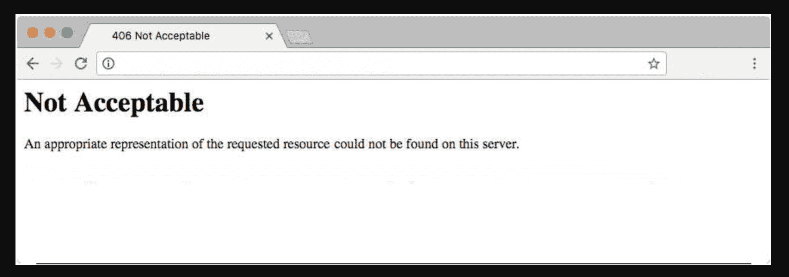
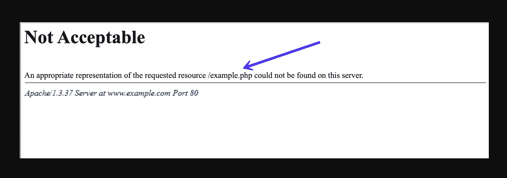
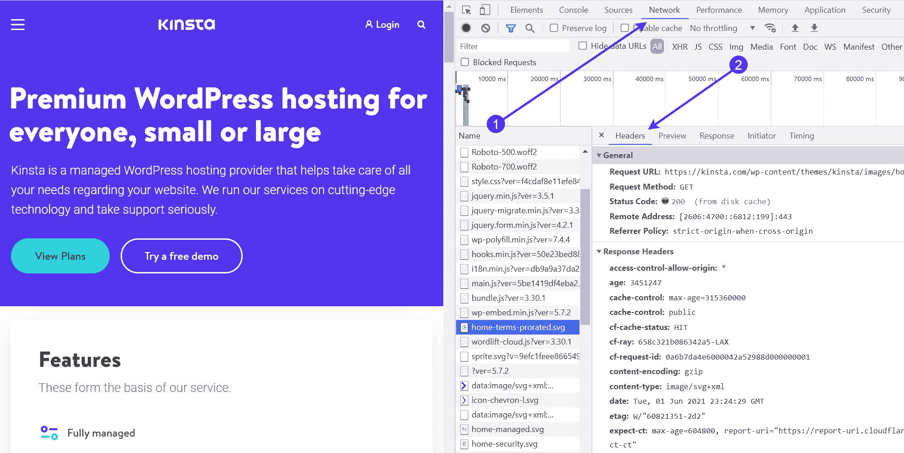
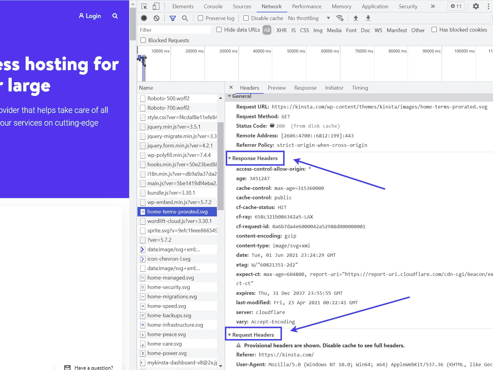
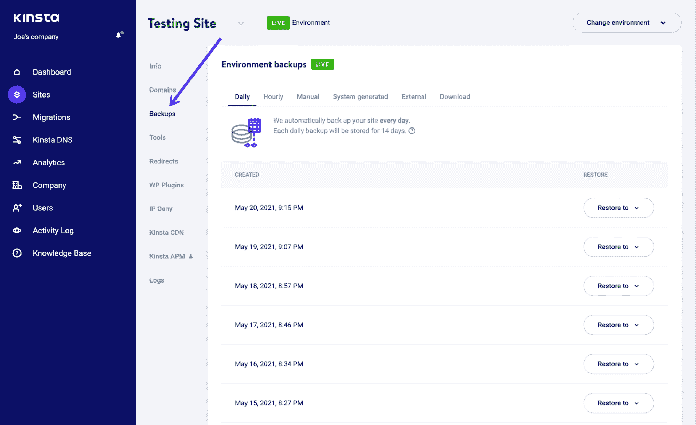
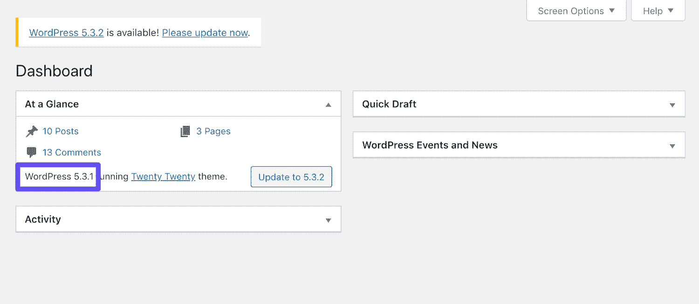
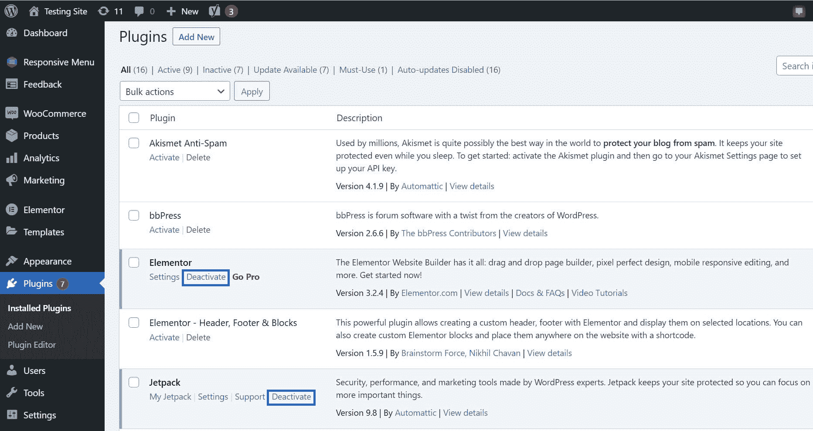
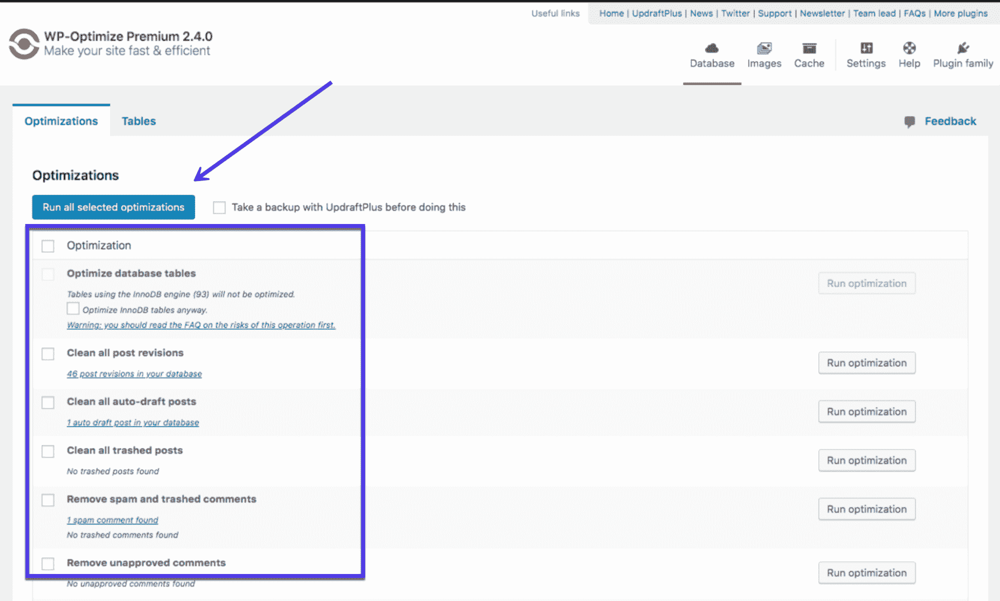
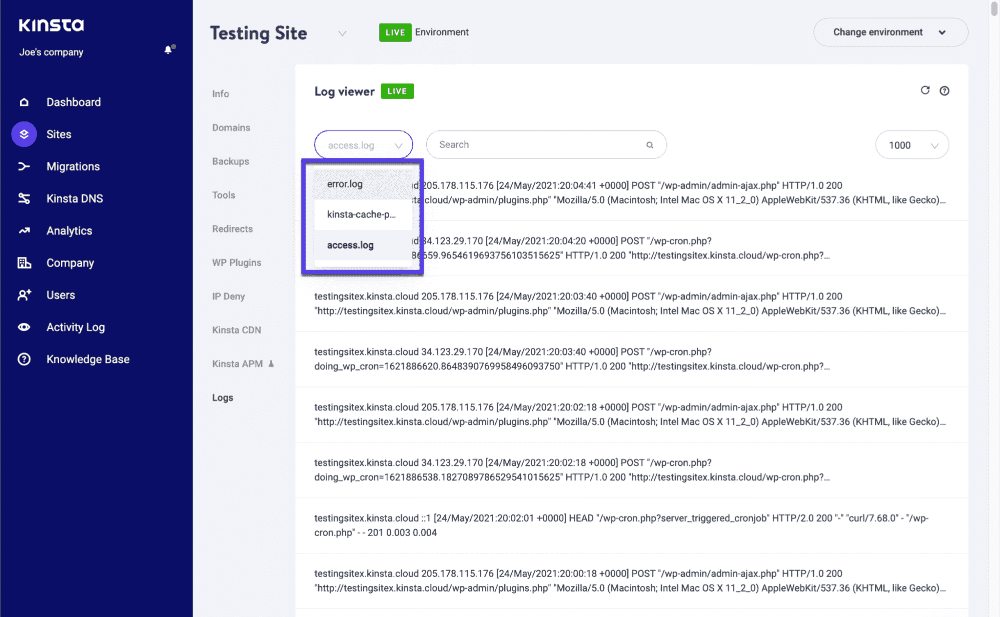
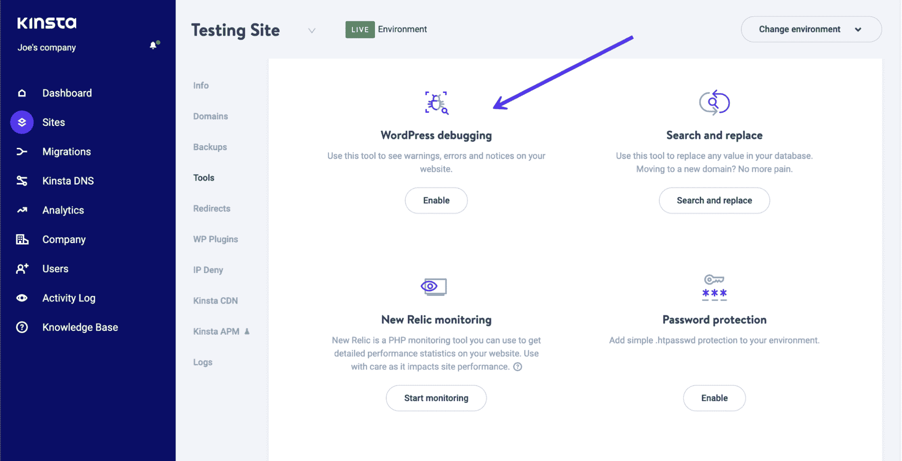

# 如何修复 406 错误并找到问题的根源

> 原文：<https://kinsta.com/blog/406-error/>

服务器端和客户端错误偶尔会发生，我们通常称之为 [HTTP 响应或状态代码](https://kinsta.com/blog/http-status-codes/)。“406 错误”或“406 不可接受”错误就是这样一种 HTTP 响应。

您可能会在访问网站时看到 406 错误。或者更糟，在你的网站上。虽然这可能会激怒普通的互联网用户，但对于网站或应用程序所有者来说，这可能是非常可怕的。除了看起来有些不专业和混乱之外，任何 HTTP 响应代码，包括 406 错误，都可能会失去销售和用户。

本文将解释“406 不可接受”错误的基础知识，其原因，如何修复它，以及在将来避免它的步骤。

T3】

### 查看我们的指南来修复 406 错误并找到问题的根源

## 什么是 406 错误？

好消息是，HTTP 错误“406 不可接受”消息不像 404 服务器错误(通常表示不存在的网页)或 301 或 500 HTTP 错误那样常见。因此，你绝对不应该看到这一个。

### 信息

浏览最常见的 [WordPress 错误代码](https://kinsta.com/blog/wordpress-errors/)并理解它们。

尽管这种情况很少发生，但 406 错误仍然有可能成为网站的一个问题。通常看起来是这样的:

One example of a “406 Not Acceptable” message.

该消息通常为:

> *不可接受*
> 
> 在此服务器上找不到所请求资源的适当表示。

然后，它有时会识别问题所在的“请求的资源”,并在最后提到其他消息或服务器信息:

Some 406 errors show the rejected resource.

406 错误信息中的外观和文本取决于网站、主机和用于访问网站的浏览器。406 错误可以揭示错误的来源。其他时候，您可能会发现这只是一个简单的“406 不可接受”错误，没有任何信息可以帮助您解决问题。

现在，让我们假设浏览器说的是简单的英语，而不是这些晦涩难懂的信息。在这种情况下，浏览器会像这样说:

*你好，我是一名浏览器。我尝试显示此网页，但是出现了两个问题中的一个:*

1.  网站的服务器发给我错误的文件格式，所以我不能接受。
2.  网站的服务器违反了一些设置或安全要求。

因此，请解决违规问题，或者让服务器使用我接受的文件格式之一。如果你想知道，这里有我知道如何阅读的文件格式。

要是浏览器有那么友好就好了！

本质上，在服务器和浏览器或用于呈现 web 应用程序的机器之间存在通信错误。浏览器要么不能读取进入的内容，要么验证数据，因为它不符合某些要求。

现在，我们必须回答一些问题，找出沟通不畅的原因。

## 是什么导致了 406 错误？

每次打开网页时，浏览器(如 Safari、Firefox、Brave、Chrome 或 Internet Explorer)都会向页面服务器发送请求，以获取站点内容和数据库文件。浏览器充当你和服务器之间的信使——它告诉服务器用户想看什么，并有希望返回正确的信息。

在第一次请求时，浏览器告诉服务器它可以接受的所有文件格式。这被称为 **Accept-** header 请求，它提示服务器以适当的格式提交文件，以生成整个网站或 web 应用程序，从 header 开始。

有时，服务器发送的回复格式不合适，或者违反了浏览器或客户机设定的规则。在这种情况下，浏览器窗口中会出现 406 错误，表明服务器没有提供适当的数据。

以下是标题请求中可能出现的“格式错误”和“违反规则”的一些示例:

*   **Accept-ranges:** 有些服务器设置了安全措施，或者在响应中只允许特定的文件大小范围。如果响应试图发送太多超出允许范围的字节，您将看到 406 错误。
*   接受编码:这里是文件头的一个区域，用来压缩文件，这样它们就可以快速地从服务器转移到浏览器。一些压缩方法和格式不被接受，呈现 406 错误代码。
*   **Accept-charset:** 指的是一个字符集或者站点文件表如何获取代码(比如 CSS 和 [HTML](https://kinsta.com/blog/html-vs-html5/) )并将其转化为可理解的字符。世界上有如此多的字符、语言和符号，很难一一涵盖。标准表称为 ISO-8859，但也有其他补充表。新的字符表偶尔会发布，以跟上语言和字符的增加。
*   **Accept-language:** 这通常是 **Accept-charset** 的另一个名字，表示其对国际语言的关注。
*   **MIME 类型违规:**有时，浏览器会向服务器请求特定的 MIME 类型。MIME 类型是像 JPEG 图像、特定视频格式或简单文本这样的内容元素。如果服务器不能提供请求的 MIME 类型，如 JPEG 图像，您将看到 406 错误。

解决和修复 406 错误的主要方法是检查源代码中的 **Accept-、Request-和 Response-** 头中的问题。

查看**接受-** 和**响应-** 标题的最简单方法是在浏览器中打开一个网页，点击右键，选择**检查**。

转到**网络>标题**显示来自该网页的所有请求。

Right-click and choose Inspect in the browser, then go to the Network and Headers tabs.

您通常可以从长列表中选择任何一个请求，查看该特定请求的**请求-** 和**响应-** 标题。

Click on any request in the list to see things like Response- and Request- headers.

或者，您可以联系您的 web 开发人员查看源代码。然而，当您拥有调试和清理数据库的工具时，检查源代码要容易得多[，这一点我们将在本文后面讨论。](https://kinsta.com/blog/code-review-tools/)

如前所述,“406 不可接受”错误告诉我们，客户端已经向服务器发送了一个有效的请求，但是该请求包含了一个对服务器的独特要求。最初请求中的特殊要求是以 HTTP **Accept-** 报头的形式出现的。

这给我们留下了一些潜在的原因:

1.  服务器没有提供请求的 MIME 类型或正确的格式，如 JPEG 或 mp4 视频。
2.  服务器没有返回正确的语言( **Accept-language** )。例如，当浏览器要求输入法语时，它可能会用德语发回一个响应。
3.  服务器在响应**接受编码**请求时使用了错误的压缩方法或格式。
4.  服务器发回了太多与**接受范围**请求不一致的字节。
5.  服务器未能提供可理解的字符，这将导致来自浏览器的 **Accept-charset** 请求出现问题。

您可能会看到 406 错误还有其他原因，但它们并不常见。上面的列表是从最常见的原因到最不常见的原因。前两个比其他两个更经常出现，所以您通常应该集中精力排除潜在的 MIME 类型违规或 **Accept-language** 问题。

总的来说，网站所有者应该知道这些格式问题和违规行为，看看你的[站点文件](https://kinsta.com/knowledgebase/wordpress-files/)中的某些内容是如何引起问题的。这种情况通常是由于人为错误而发生的，比如意外键入了错误的代码、删除了必要的代码或者错误配置了服务器。当特定的安全设置或规则阻止来自服务器的内容传输时，也会出现 406 错误。
T3】

## 如何修复 406 错误

在完成任何解决 406 错误的步骤之前，谨慎的做法是运行一个[网站或应用程序备份](https://kinsta.com/help/wordpress-backups/)。进入站点的源代码总是有可能导致进一步的问题，所以如果必要的话，你会想要有一个数据库和站点文件备份来恢复。

确保对从数据库到应用程序、从媒体元素到站点文件的所有内容进行完整备份。如果你是 Kinsta 用户，你可以使用 [MyKinsta 备份功能](https://kinsta.com/help/wordpress-backups/)来完成这项工作，它将你的整个网站记录在一个单独的文件中，并有一个**恢复**按钮供以后使用:

Run Daily, Hourly, or Manual backups in the MyKinsta dashboard.

现在，我们对 406 错误发生的原因有了更深入的了解，是时候讨论解决该错误并防止其再次发生的最佳方法了。

这些策略包括客户端原因(用户出错或机器工作不正常)、服务器端原因和基于平台的原因，如有缺陷的插件。

### 请确保 URL 是正确的

我们的第一条建议可能听起来很简单，但它是最快的故障诊断选项，它将重点放在客户端(即您的计算机)的问题上。

在这种情况下，404 错误比 406 错误更有可能出现，但是如果网站 URL 有效，您可能最终会看到“406 不可接受”错误。然而，你的浏览器翻译请求的方式有些奇怪。例如，在 URL 末尾添加“JSON”或“PHP”可能会被误解为对这些特定格式的请求，即使客户端并不需要它们。

要解决此问题，请仔细检查产生错误的先前使用的 URL。尝试再次键入或选择网站上的不同子域，看看是否只有一个页面没有呈现。

从技术上讲，406 消息被认为是客户端错误代码(尽管它通常是平台或服务器问题)，因此这是确定客户端是否有问题的第一步。

### 重置您的设备和网络

另一个客户端问题偶尔会涉及那些从用户计算机发送到平台的相同的 **Accept-** 头，这些头不能满足请求。这些平台中有许多包括面向游戏或媒体的系统，如 Hulu 或音乐市场，如 Spotify。

## 注册订阅时事通讯

### 想知道我们是怎么让流量增长超过 1000%的吗？

加入 20，000 多名获得我们每周时事通讯和内部消息的人的行列吧！

[Subscribe Now](#newsletter)

更简单地说，你可能会登录 Hulu 这样的平台，试图观看你最喜欢的电视节目，并收到 406 错误信息。在这个例子中，问题几乎总是出在客户端。通常是您的计算机、网络或其他用于启动平台的设备。

尽管任何平台都可能发生这种情况，但一些平台通常会报告 406 错误，包括:

*   葫芦
*   Google Play
*   方块 Enix 小游戏
*   网飞
*   微软游戏机
*   Windows(通常用于游戏)

这个列表并不完整，但是它给了你一个 406 错误可能发生的概念。

媒体和游戏平台有许多复杂的限制，这些限制取决于您的位置或网络配置。由于所有的移动部件，您可能会遇到这样的错误。

虽然我们无法帮助您对每个特定平台进行故障排除，但请考虑浏览以下建议，并检查错误是否得到解决:

*   在线检查平台服务器的状态。可能只是公司服务器的问题。
*   重新启动电脑、游戏系统、流媒体设备或其他机器。
*   断开所有设备的电缆连接，等待几分钟后再重新连接，并检查错误是否消失。
*   检查应用程序是否运行最新版本。另外，看看你的机器是否有可用的固件更新。
*   重置您的家庭或办公室网络(通过路由器的 WiFi 或互联网连接)。
*   如果仍然有问题，请考虑从无线网络切换到有线网络连接。
*   尽管这种可能性并不总是存在，但是可以考虑用完全不同的机器来复制这个错误。确保设备在同一个网络上。如果您无法重现错误，请查看您的网络和原始机器。

如果所有其他方法都失败了，请进入您的搜索引擎，键入您的平台名称以及“+ 406 错误代码”，以获得特定于平台的故障排除建议。这通常会显示一些论坛和支持文档来指导您完成整个过程。

### 回滚您最近的 CMS 更改

接下来，是时候探索你的网站或应用所使用的系统了。你可能会发现你的内容管理系统，比如 WordPress，是导致“406 不可接受”错误的直接原因，这个错误是由于你的站点文件内部的复杂因素造成的。

无论是使用 [WordPress](https://kinsta.com/blog/wordpress-5-8/) 还是任何其他内容管理系统，看看你最后一次更新是什么时候。WordPress 有一个健壮的默认基础设施，无论如何都可以避免这类错误。

但是，特定的插件、主题或手动调整的编码可能会导致站点文件违反客户端或服务器请求。一个简单的升级到你的 CMS 的最新版本可以马上解决这个问题。

为了确定这是否是您的 [CMS](https://kinsta.com/blog/cms-software/) ，首先回滚核心文件最近发生的任何升级。你可能已经知道，WordPress 会定期向系统发送更新。这些更新大部分是自动发生的，但是旧版本仍然需要你点击一个按钮。

此外，WordPress 和其他 CMS 利用了几个移动部分，如插件、主题和扩展。这些也会定期更新，所以您可能需要回滚其中的一些。

对于 WordPress 之外的所有系统，搜索“平台名称+如何降级。”

如果你使用 WordPress，你可以很容易地降级你的 WordPress 网站，有效地回滚到以前的一个版本:

Downgrade to a previous WordPress version.

该指南概述了以下降低你的 WordPress 站点等级的方法，其中大多数只需要几分钟:

需要一流的，快速的，安全的主机为您的新电子商务网站？Kinsta 提供超快的服务器和来自 WooCommerce 专家的 24/7 世界级支持。[查看我们的计划](https://kinsta.com/plans/?in-article-cta)

*   手动降级你的 WordPress 站点。
*   [使用插件](https://kinsta.com/blog/downgrade-wordpress/#2-use-wp-downgrade-to-run-a-previous-version-of-wordpress)完成 WordPress 系统降级。
*   [恢复以前的备份](https://kinsta.com/blog/downgrade-wordpress/#3-restore-a-previous-backup-to-undo-changes-to-your-site)恢复旧版本，或者至少是以前的内容和文件。
*   [手动降级主题](https://kinsta.com/blog/downgrade-wordpress/#4-manually-downgrade-a-plugin-or-theme)或插件。
*   用一个单独的插件降级一个插件或主题[。](https://kinsta.com/blog/downgrade-wordpress/#5-roll-back-plugin-and-theme-updates-with-wp-rollback)
*   [切换到旧版本的 PHP](https://kinsta.com/blog/downgrade-wordpress/#6-revert-to-an-older-version-of-php) 。

### 卸载并重新安装插件、主题和扩展

WordPress 插件和主题为你的站点文件添加了额外的代码，与核心 WordPress 文件交互。著名的插件通常不会引起任何问题，但是偶尔会发生冲突。插件、主题或第三方扩展可能是 406 错误的原因。

识别一个麻烦的插件或主题的可靠方法是一个接一个地停用你的插件和主题。禁用每个选项后，检查 406 错误是否消失。如果是这样，你就找到问题了。如果它没有消失，重新安装插件或主题，并继续卸载下一个。

Go to the Plugins tab in WordPress and Deactivate each plugin one by one.

### 重要的

从你的插件开始，然后转向主题。卸载并重新安装主题更有可能导致内容重新安排。

### 分析数据库的状态以发现更改和冲突

不幸的是，一个被移除的“问题”插件仍然会影响你的 WordPress 数据库，因为插件可以完全访问数据库来正常工作。因此，你仍然应该检查你的数据库的状态，即使插件的删除使得 406 错误消失。否则，您仍有可能在未来看到更多问题。

如果插件或主题不是罪魁祸首，你也应该检查你的数据库，如果它是错误的主要来源。有时，数据库更改，无论是偶然的还是有意的，都成为出现 406 错误的主要原因。

要扫描和修复数据库，请考虑以下解决方案:

1.  安装一个数据库扫描仪和清除器，清除无用和麻烦的表格和资产。一些选项包括 [WP 优化](https://wordpress.org/plugins/wp-optimize/)和[高级数据库清理器](https://wordpress.org/plugins/advanced-database-cleaner/)。这个过程的大部分涉及删除旧的或孤立的项目，如垃圾箱、修订版和元数据。这是清理数据库并有可能消除 406 错误的坚实的第一步。
2.  扫描数据库，寻找可能被有问题的插件更改的记录和表格，或者那些看起来不合适或不必要的记录和表格。
3.  如果你知道你的数据库出了什么问题，去搜索引擎，从论坛和其他在线讨论中寻求帮助。很有可能其他人也经历过同样的问题。

Clean your database with an optimization tool like WP-Optimize. Image Source: [WP-Optimize](https://wordpress.org/plugins/wp-optimize/)

### 信息

Kinsta 托管不依赖 Apache，而是 Nginx。如果您遇到 406 错误，请立即联系 Kinsta 客户支持或您的主机提供商寻求帮助。

### 分析您的服务器日志

前面的建议侧重于客户端和面向 CMS 的故障排除。现在我们将考虑所有服务器端的问题。如果您没有使用 CMS，或者知道 406 错误与您的 CMS 或客户机无关，那么这个技巧和下面的技巧是最好的。

排除服务器故障的第一步是检查日志。使用什么类型的 web 应用、CMS 或 web 设计系统并不重要；它们都有服务器端日志。

应用程序日志存储了该 web 应用程序的整个(或最近的)历史记录，以及关于每个数据库查询、提供的结果、请求的页面等等的信息。另一方面，服务器日志包含用于运行 web 应用程序的服务器或硬件的健康和状态信息。

对于 Kinsta 用户，您可以在 MyKinsta 仪表板中找到[错误和服务器日志](https://kinsta.com/knowledgebase/wordpress-error-log/)。[检查所有可能导致 406 错误的日志](https://kinsta.com/knowledgebase/devkinsta/logging/):

*   **error.log** 文件
*   **kinsta-cache-perf.log** 文件
*   **access.log** 文件

To see the three necessary logs, click on the Sites tab, choose your site, then the Logs button, along with the type of log from the dropdown menu.

你也可以用一个 [FTP 客户端](https://kinsta.com/blog/best-ftp-clients/)来[检查原始访问和 WordPress 错误日志文件](https://kinsta.com/knowledgebase/wordpress-error-log/#raw-wordpress-logs)。其他选项包括在 wp-config.php 的**中启用错误日志**，以及在 MyKinsta 仪表板中进入[调试模式。](https://kinsta.com/help/wordpress-enable-debug/)

如果您在查找错误日志时遇到问题或不知道如何解释它们，请联系 [Kinsta 客户支持团队](https://kinsta.com/kinsta-support/)寻求帮助。

### 调试 Web 应用程序(如 WordPress)

像大多数 web 应用程序都有服务器和错误日志一样，它们通常也提供关于调试应用程序本身的信息。调试包括检查应用程序的代码，以找到并消除小错误(或 bug)。

对 WordPress(以及任何网络应用程序)进行全面扫描的最好方法之一是调试数据库和网站文件。幸运的是，调试并不意味着你必须通读每一行代码并自己找出错误。程序可用于这一特定目的，正如我们前面提到的，Kinsta 甚至在 MyKinsta 仪表板中有其调试工具。

通过学习使用 Kinsta 调试模式、WordPress 调试插件或更手动的过程调试 WordPress 的[基础，开始调试过程:](https://kinsta.com/blog/wordpress-debug/)

Sites > Tools brings you to a page to activate the WordPress Debugging Mode feature in the Kinsta dashboard.

## 防止将来出现 406 错误

406 错误的问题是，它可以在许多不同的情况下弹出。作为一名普通用户，你可能会在浏览 Hulu 或网飞时看到“406 不可接受的 HTTP”错误。

这不是很令人愉快，但没有什么是一点点故障排除不能解决的。更值得关注的是 406 错误发生在您的网站或应用程序上。对于这些实例，您需要检查服务器和 CMS 站点文件。

如果是你的网站，你会希望防止错误再次发生。插件、主题和人为错误总是会起作用，但是我们有一些建议可以让你的数据库和网站文件在未来保持干净:

*   只安装必要的和有信誉的插件、主题和扩展。始终将这些元素保持在最低限度。
*   不要修改 WordPress 的核心文件，除非你绝对必须并且知道你在做什么。
*   定期运行一个[数据库清理器](https://kinsta.com/blog/wordpress-database-plugin/)和[站点优化器](https://kinsta.com/learn/speed-up-wordpress/)。我们建议每个月完成这个过程，最好能找到一个在后台自动运行的更干净的插件。
*   养成调试服务器和 web 应用程序的习惯。如上所述，Kinsta 在其仪表板中提供了一个**调试**功能。许多其他应用程序也有这种类型的功能。
*   设置网站或应用程序的自动备份。这样，代码冲突或错误不会给你带来太大的压力，因为你可以恢复网站以前的版本，并从那里开始。
*   在你计划更新 WordPress 和任何插件之前，手动备份你的站点，即使你已经运行了自动备份(安全胜于遗憾)。在编辑任何文件或向站点添加新代码之前运行备份也是明智的。

除了显得不专业和造成混乱，406 错误还会导致你失去销售或用户💸在这里了解如何修复⬇️ 点击推文

## 摘要

您可以用几种方法修复 406 错误。只要您知道您看到了什么以及在哪里可以找到修复方法，您就应该能够清除错误。

虽然这不是一个更常见的 WordPress 错误，但是如果你的配置不正确的话，你会经常看到这个错误。

对于解决“406 不可接受”错误，您还有其他建议吗？请在下面的评论区分享它们！

* * *

让你所有的[应用程序](https://kinsta.com/application-hosting/)、[数据库](https://kinsta.com/database-hosting/)和 [WordPress 网站](https://kinsta.com/wordpress-hosting/)在线并在一个屋檐下。我们功能丰富的高性能云平台包括:

*   在 MyKinsta 仪表盘中轻松设置和管理
*   24/7 专家支持
*   最好的谷歌云平台硬件和网络，由 Kubernetes 提供最大的可扩展性
*   面向速度和安全性的企业级 Cloudflare 集成
*   全球受众覆盖全球多达 35 个数据中心和 275 多个 pop

在第一个月使用托管的[应用程序或托管](https://kinsta.com/application-hosting/)的[数据库，您可以享受 20 美元的优惠，亲自测试一下。探索我们的](https://kinsta.com/database-hosting/)[计划](https://kinsta.com/plans/)或[与销售人员交谈](https://kinsta.com/contact-us/)以找到最适合您的方式。