# 如何创建 YouTube 频道(分步教程)

> 原文：<https://kinsta.com/blog/how-to-create-a-youtube-channel/>

创作视频只是成功的一半。您还需要一个地方来发布它们，以便于您的受众访问。由于 YouTube 是最受欢迎的视频托管网站，知道如何创建一个 YouTube 频道对于开始你的旅程至关重要。

仅仅点击两下就上传并发布一个视频是不够的。你还需要了解 YouTube 平台的内部运作，以确保你的频道以最佳的方式展示你的品牌。

在本帖中，我们将涵盖你需要知道的关于创建 YouTube 频道的一切。不管你是在制作个人 YouTube 频道还是品牌频道。本教程中概述的步骤是通用的。

开始吧！

### 查看我们的[视频指南](https://www.youtube.com/watch?v=wAHaQZO0RX4)创建 YouTube 频道:

## 开一个 YouTube 频道要多少钱？

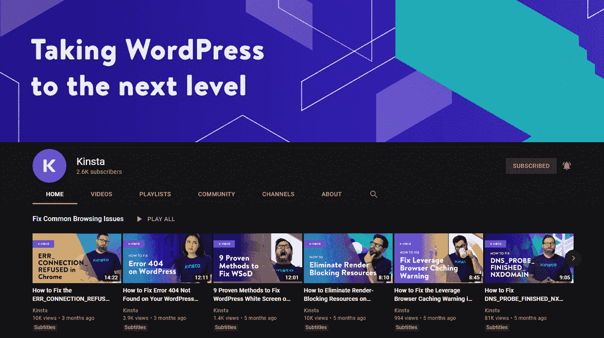

[Kinsta’s YouTube channel](https://www.youtube.com/kinsta).

YouTube 频道可以免费开始，并且非常容易设置。

> 需要在这里大声喊出来。Kinsta 太神奇了，我用它做我的个人网站。支持是迅速和杰出的，他们的服务器是 WordPress 最快的。
> 
> <footer class="wp-block-kinsta-client-quote__footer">
> 
> 
> 
> <cite class="wp-block-kinsta-client-quote__cite">Phillip Stemann</cite></footer>

[View plans](https://kinsta.com/plans/)

虽然网站上没有托管费，但您的视频制作工作可能会产生额外的费用。大多数创作者和[企业](https://kinsta.com/small-business-hosting/)建立 YouTube 频道，开始制作预算低于 2500 美元的视频。这些可能包括你的相机，灯光，麦克风，人才和编辑费用的价格。

[创作视频只是成功的一半。🎬在本指南的帮助下，了解如何设置自己的 YouTube 频道🎞 点击推文](https://twitter.com/intent/tweet?url=https%3A%2F%2Fkinsta.com%2Fblog%2Fhow-to-create-a-youtube-channel%2F&via=kinsta&text=Creating+videos+is+only+half+the+battle.+%F0%9F%8E%AC+Learn+how+to+set+up+your+own+YouTube+channel+with+help+from+this+guide+%F0%9F%8E%9E&hashtags=YouTube%2CContentCreator)

## 你为什么要创建一个 YouTube 频道？

对于任何希望加大视频营销力度的企业来说，YouTube 频道几乎是必不可少的。设置一个，你就有了一个完美的地方来存放你的视频，并与热切的相关观众分享。

但是为什么这么多 [B2B 商家](https://kinsta.com/blog/b2b-lead-generation/)转向视频营销？嗯，视频营销已经显示出对他们的业务有影响的结果。2021 年，大约 87%的[公司](https://blog.hubspot.com/marketing/state-of-video-marketing-new-data)看到了视频营销的正回报。

[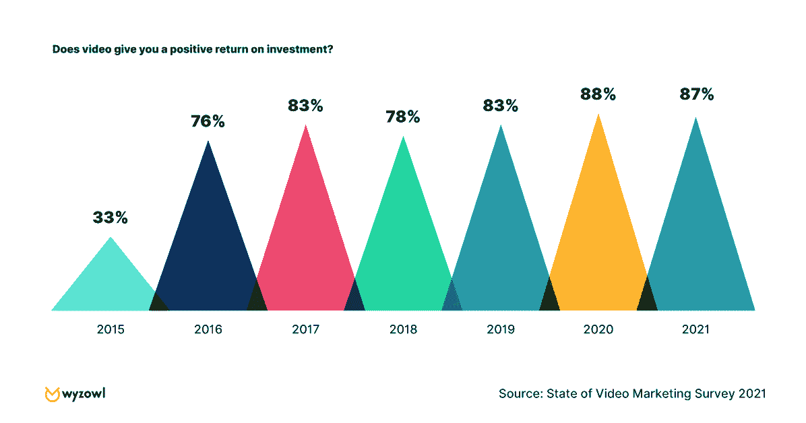](https://kinsta.com/wp-content/uploads/2021/07/roi-video-marketing-survey.png)

Video ROI graph of 2021 video marketing survey (Image Source: HubSpot)

自 2015 年以来，视频业务取得成功的企业数量大幅增长。它仍然是一种有效的营销形式，越来越多的公司开始注意到视频对他们底线的影响。

## 你如何创建一个成功的 YouTube 频道？

许多不同的因素促成了你的 YouTube 频道的成功。首先，您需要确保您的频道设置正确，并针对观众进行了优化。

谚语“如果你建立了它，他们就会来”并不一定适用于 YouTube 频道。您需要确保您的渠道拥有必要的组件来推动有意义的结果。

一个成功的 YouTube 帐户的核心要素包括:

*   渠道的明确重点(即针对特定业务或组织)
*   吸引观众的高质量视频
*   优化的标题、标签和描述
*   精美的个人资料照片、标题和播放列表
*   从其他自有频道到该频道的流量

最后但同样重要的是，你需要一致性。就像[内容营销](https://kinsta.com/learn/content-marketing/)和[搜索引擎优化](https://kinsta.com/blog/wordpress-seo/)一样，你需要提前知道，你将被要求定期发布几个视频，以便能够收集有价值的数据，并开始看到更多的视图。

看看我们的 [YouTube 频道](https://www.youtube.com/c/Kinsta)是如何在 2020 年 11 月推出后仅几个月就开始增长的:

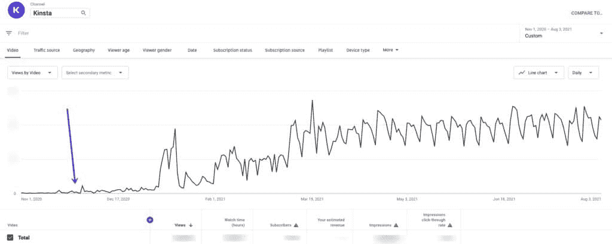

我们的 YouTube 频道的初步成长。

T6】

## 如何一步一步创建 YouTube 频道

现在你已经知道了基本知识，是时候开始创建你自己的 YouTube 频道了。

这些步骤将引导你通过将你的通道带入生活的过程。通过严格遵循这个指南，你将拥有一个专业的 YouTube 频道，以最好的方式展示你的企业或组织。

### 1.创建您的帐户

首先，请访问[YouTube.com](https://www.youtube.com/)并登录您的谷歌账户。这第一步很简单，让你走上正确的道路。

要创建一个账户，你需要一个有效的[电子邮件地址](https://kinsta.com/blog/find-email-address/)直接链接到你的 YouTube 账户。这首先给你一个决定:这是一个商业 YouTube 帐户还是一个个人帐户？您的回答将决定您使用的电子邮件地址的类型。

在创建您的帐户之前，您应该考虑您的 YouTube 页面的用途。思考以下问题:

*   你打算发布什么类型的视频？
*   你希望你的订户是谁？
*   你想被如何介绍？

要创建个人 YouTube 帐户，您可以使用您的个人电子邮件。要创建一个公司的 YouTube 账户，使用你的[工作邮箱](https://kinsta.com/blog/professional-email-address/)或者一个普通的公司邮箱，比如 *[【邮件保护】](/cdn-cgi/l/email-protection)* 。

一旦你访问 YouTube.com 后用你的电子邮件登录，你会看到你的频道已经开通。点击**定制频道**按钮打开您的频道仪表板，开始为您的业务定制频道。

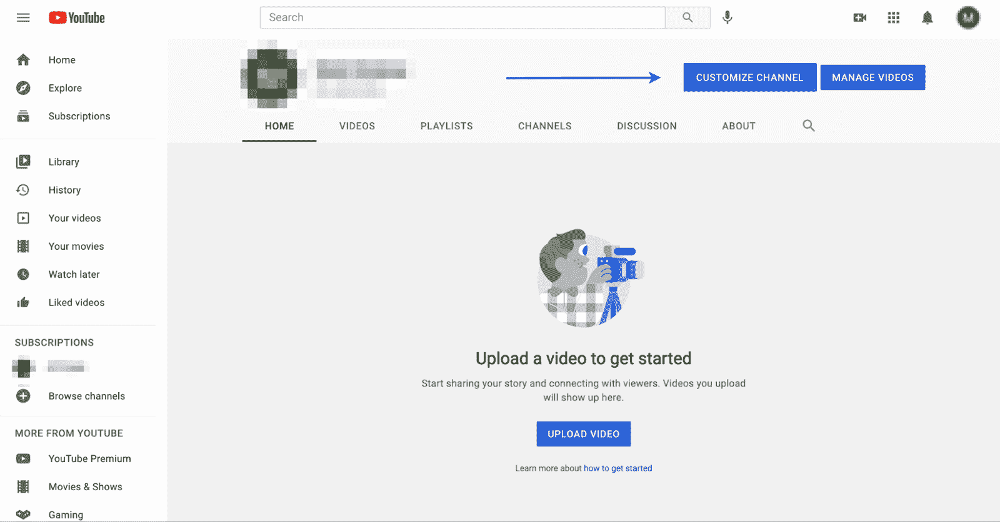

YouTube 的自定义频道按钮。

完成此步骤将为您的后续步骤做好准备，这些步骤的重点是构建您的渠道，并确保其设计和结构能够满足您客户的需求。

在频道页面，你可以上传视频，调整你的频道横幅，添加 YouTube 标签，并查看你的 YouTube 分析。

### 2.更新频道名称和描述

创建帐户后，是时候创建您的企业或个人帐户渠道了。

您需要做的第一件事是将频道名称更新为反映页面内容类型主题的名称。

通过采取这一步骤，您将确保公众能够通过搜索您的企业或组织的名称找到您的频道。

首先，点击顶部菜单上的**基本信息**。您现在可以更新您的频道名称、描述和 [URL](https://kinsta.com/knowledgebase/what-is-a-url/) 。

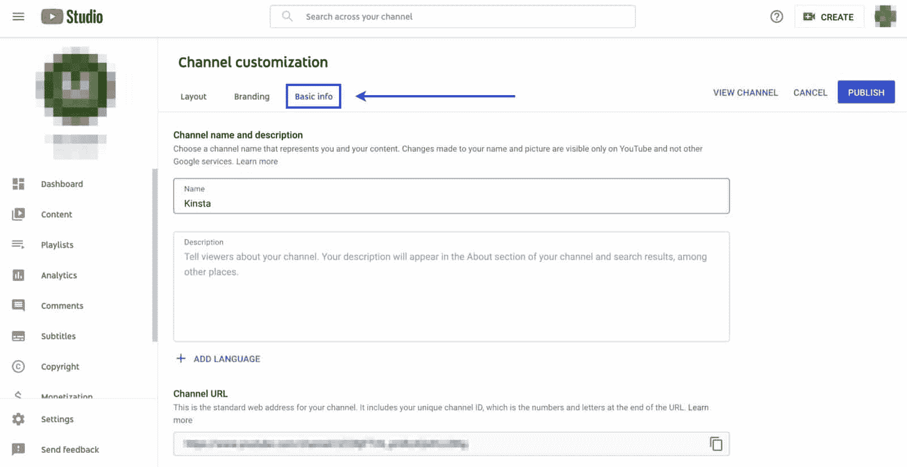

基本信息按钮更新 YouTube 中的频道名称

例如，下面是我们在 [Kinsta 的 YouTube 频道](https://www.youtube.com/c/Kinsta)上使用的基本信息:

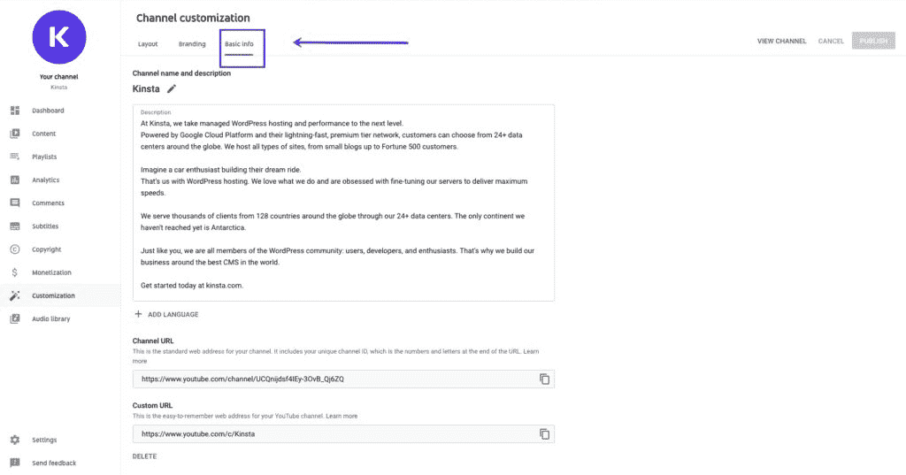

Basic information of Kinsta’s YouTube channel.

确保你利用这三个选项，使你的渠道真正成为你自己的。添加标题、描述和自定义 URL 是提升你的 YouTube SEO 的好方法。

使用受众可能会搜索的相关关键词。这将有助于你的页面在 YouTube 的搜索引擎中更早地弹出。

有了相关的标题和描述，你的读者会更加了解你的页面。

### 3.上传您的个人资料照片和徽标

接下来，是时候关注你的网页品牌了，以准确描述你的公司或个人账户。

你需要上传三个重要的品牌形象:图片，横幅图像，视频水印。

你会希望你的 YouTube 页面成为你品牌的延伸。因此，这一步是至关重要的，以确保您所有的数字财产携带一个统一的信息。

对于被动观众来说，以高质量图像作为图片、横幅和水印的频道看起来更有吸引力和专业。他们可能会被令人难忘的个人资料图片或横幅吸引，留下来查看您的一些视频。

要上传这些图像，请单击页面顶部导航栏中的**品牌**选项卡。

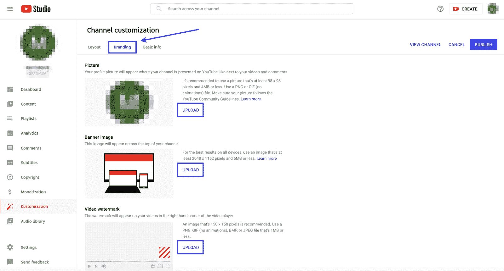

给你的 YouTube 页面添加品牌。

上传您的品牌资产后，它看起来像下面这样:

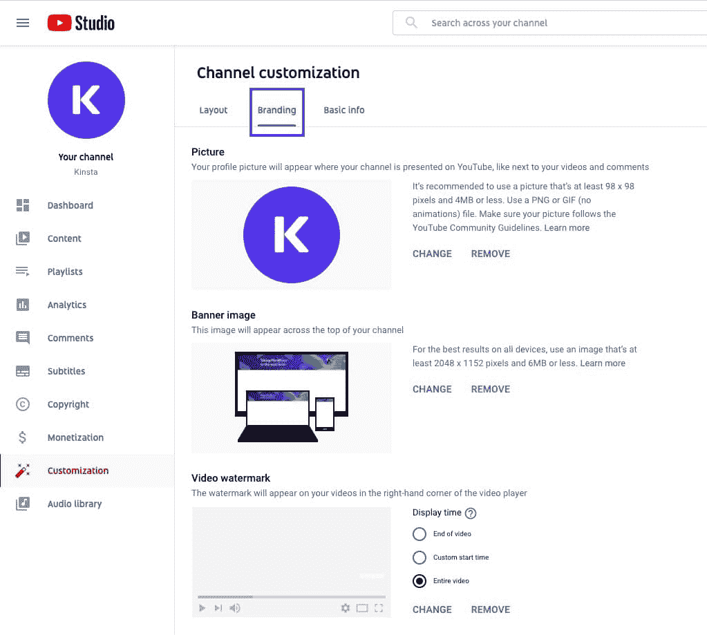

Adding branding assets to a YouTube channel.

您应该为您的图片上传至少 98×98 像素、重量不超过 4 MB 的清晰、高质量的徽标。我们建议上传一张 [PNG 图片](https://kinsta.com/blog/image-file-types/)。

#### 如何为你的 YouTube 频道创建一个标志

考虑用什么照片或标志来代表你的渠道。它会出现在很多地方，包括你的视频和评论所在的每个页面。

要开始设计，你可以使用像 Adobe Photoshop 或 Illustrator 这样的软件。如果你对独立设计不感兴趣，你可以使用像 [99designs](https://99designs.com/) 这样的服务来众包设计。

#### 如何创建 YouTube 频道艺术

YouTube 频道上的另一个重要元素是你的[横幅](https://kinsta.com/blog/banner-ad-sizes/)图片。

对于您的横幅图像，您应该考虑如何扩展您的品牌，并借鉴您在个人资料图片中使用的照片风格。你可以使用一张照片或一个带有插图的自定义图形来突出你的品牌。

此图片将出现在您页面的顶部，位于您的个人资料图片的后面。该图形至少应为 2048×1152 像素，并且小于 6 MB。

#### 如何创建 YouTube 频道图标

你的图标是标志的一部分，象征着你的品牌。

你应该考虑你想为你的视频水印使用什么类型的图标。一个视频水印会出现在你每一个视频的角落里。理想情况下，这将是不同于你的个人资料图片，但你也可以使用相同的。

有了水印，您的观众将能够快速识别哪些视频是您独有的。水印有助于创建多个视频的一致性，将它们绑定到您的帐户。

这些图片对于确保你的 YouTube 账户的成功至关重要。通过在您的渠道中推广品牌，您将创建一个流媒体中心来扩展您的品牌或业务。

### 4.上传您的视频

现在终于是时候上传你的第一个视频了。当它出现在你的 YouTube 页面时，它就是“主要事件”。

## 注册订阅时事通讯

### 想知道我们是怎么让流量增长超过 1000%的吗？

加入 20，000 多名获得我们每周时事通讯和内部消息的人的行列吧！

[Subscribe Now](#newsletter)

毕竟，只有当你的页面上有吸引人的视频内容时，你的观众才会访问你的页面。值得庆幸的是，上传视频的步骤简单易行。

首先，将您的视频文件保存到计算机上容易访问的位置。它可以是你的**文档**文件夹，在你的**桌面**，甚至在你的**下载**。重要的是，你只需点击几下就可以访问它。

接下来，回到你的频道，点击屏幕角落的**创建**按钮。

点击**创建**按钮后，会弹出一个屏幕，邀请您选择您想要[上传](https://kinsta.com/knowledgebase/bulk-upload-files-wordpress-media-library-ftp/)的文件:

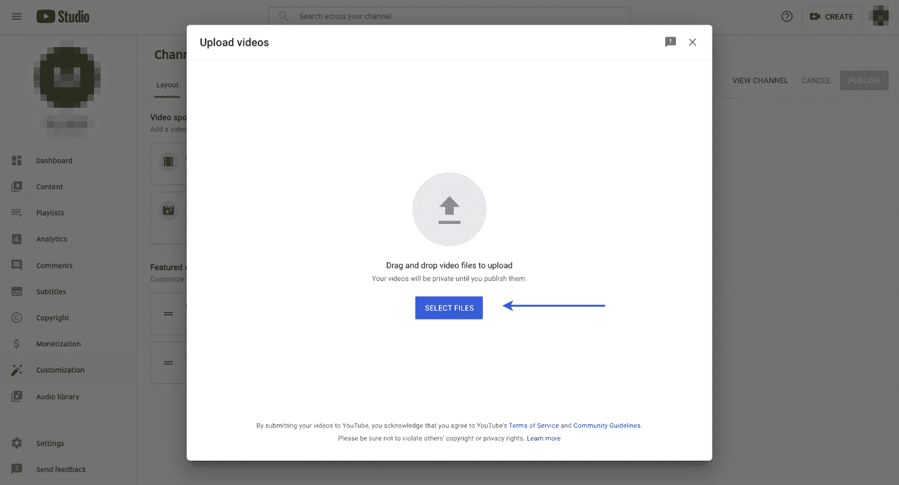

将您的视频上传到 YouTube。

点击**选择文件**找到您刚刚保存到电脑上的视频文件。然后 YouTube 会自动开始上传。

上传过程很简单，只需要几分钟。然而，上传后的步骤(包括优化)是至关重要的。

### 5.优化您的视频

如果没人能找到你的视频，上传有什么用？

有数十亿分钟的视频上传到 YouTube，你需要确保你的内容突出，并易于访问。

优化您的视频是确保您的视频被正确标记的关键步骤，因此当有人在 YouTube 的大规模搜索引擎中键入相关关键词时，它们就会出现。

就像 SEO 从业者花时间在谷歌上排名一样，你应该花适当的时间来确保你在 YouTube 上排名靠前。

为什么？

YouTube 是全球第二大搜索引擎，仅次于谷歌(他们也拥有 YouTube)。因此，你要确保在你的标题、描述和标签中使用正确的关键词，否则你就不会在列表中出现得足够早，让你的目标受众发现你。

如果不迈出这关键的一步，你所有具有挑战性的工作拍摄、制作和编辑视频都将付之东流。

要开始优化过程，请进入上传屏幕的下一阶段。

继续上传过程时，会出现一个**详细信息**屏幕，邀请您填写标题、描述和缩略图:

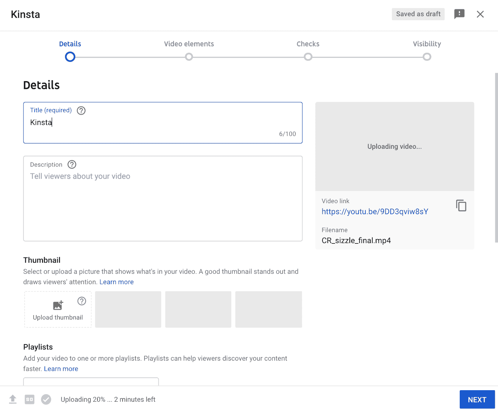

优化你的 YouTube 视频。

此外，您可以添加各种视频元素，包括字幕、结束屏幕，甚至具有文本等功能的卡片:

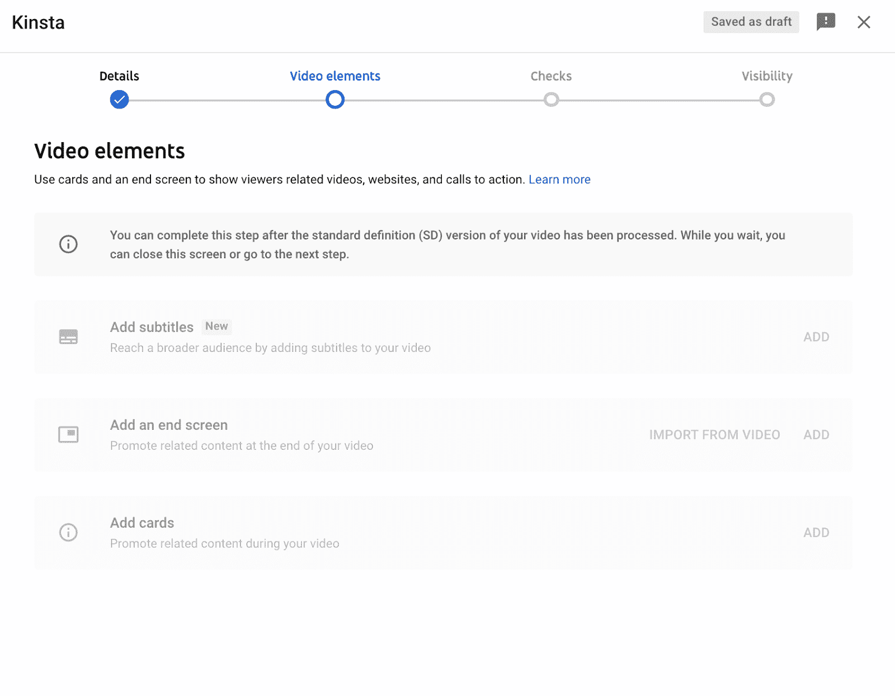

在 YouTube 上添加视频元素。

你必须在你的标题和描述中添加关键词。这是你需要重点关注的房地产最有价值的两个地方。

然而，你可能想知道:什么是正确的关键字使用？

你可以使用各种专门从事 YouTube SEO 的软件程序。例如， [VidIQ](https://vidiq.com/) 和 [TubeBuddy](https://www.tubebuddy.com/) 是两个专注于 YouTube 的工具，可以帮助你确定你的内容类型应该针对哪些关键词。您也可以使用典型的 Ahrefs

这些工具还可以为您的视频内容策略提供信息。你可能会找到一些有用的关键词和标签，并利用它们来激发你的下一个视频。

### 6.设置您的频道布局

现在您的频道上已经有了一些视频，是时候[定制](https://kinsta.com/blog/how-to-customize-wordpress-theme/)外观和感觉了。

需要一个给你带来竞争优势的托管解决方案吗？Kinsta 为您提供了令人难以置信的速度、一流的安全性和自动伸缩功能。[查看我们的计划](https://kinsta.com/plans/?in-article-cta)

你可以控制人们如何从一个视频转到另一个视频。你应该注意这一点，因为吸引观众让他们在你的频道上多呆一会儿是很重要的。

通过个性化您的频道页面布局，让您的频道为您的公司服务。

您有许多选项可以根据访问者的类型定制这种体验。

首先，点击**定制频道**页面顶部导航栏菜单中的**布局**标签。

点击此选项卡将显示两个不同的选项:视频聚焦和特色部分。

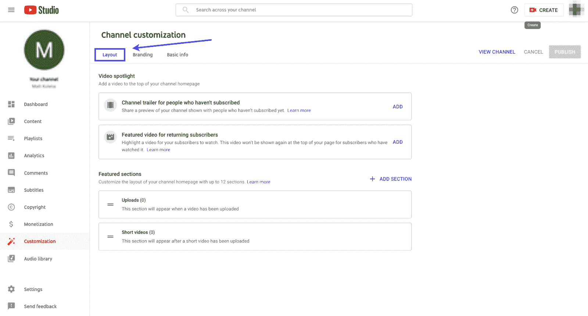

设置您的 YouTube 频道布局。

在这一部分，您可以调整频道的设置，根据观众的订阅状态显示不同的内容。

您可以选择:

*   向尚未订阅的用户展示频道预告片
*   为回头客播放特色视频

下面你可以看到我们在 YouTube 频道上设置的内容，我们有一个关于 Kinsta 的介绍视频和一个关于[如何增加网站流量的视频](https://www.youtube.com/playlist?list=PLhYfuAN3YCfwP5GEtfdSMVG0GsOfcfNxU)，这是我们观众中的一个“热门话题”:

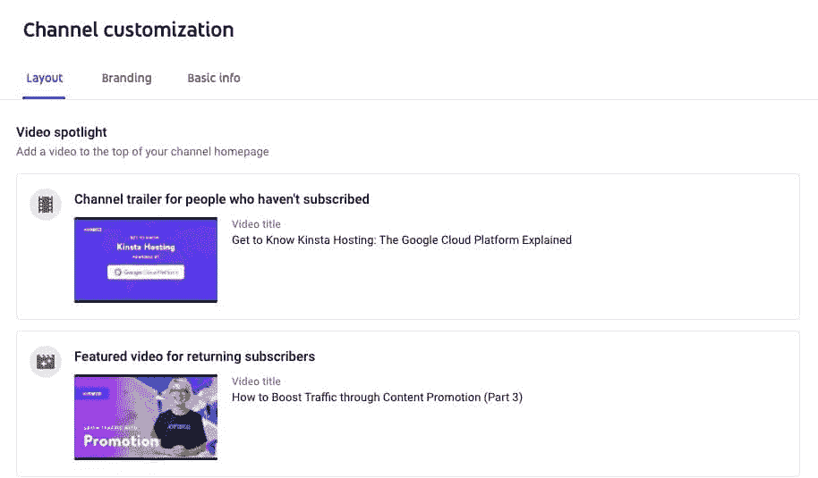

YouTube’s Video Spotlight.

这个选项很有帮助，因为它可以让您向新访问者展示一个关于您的频道的高级概述视频，以尝试并说服他们订阅。

订阅者不需要看这个，因为他们知道你的频道是关于什么的，所以你可以向这些访问者展示一个特色视频。你选择哪一个视频是由你决定的；这可能是你最受欢迎的视频之一，也可能是你最新的视频。

除此之外，您还可以在您的频道主页上设置特色栏目，就像我们所做的那样:

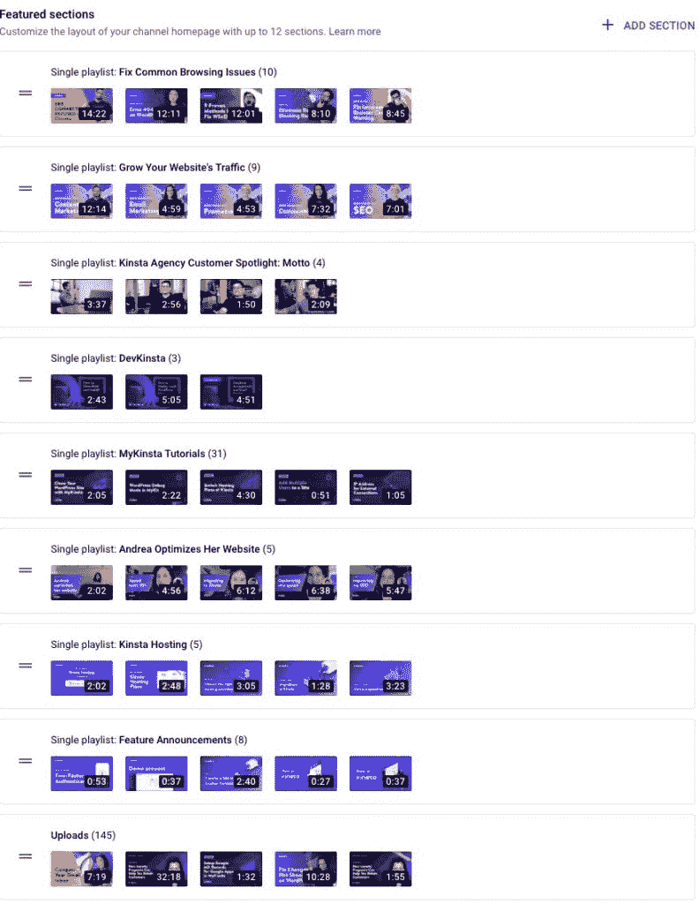

Featured sections in YouTube.

你可以有多达 12 个类似的视频分组这些部分。这些特色栏目可以让您更轻松地增加观看次数和观看时间。通过管理密切相关的视频，你的观众很有可能会继续浏览(和观看)!

这些板块还可以让观众在登陆你的频道后更容易找到视频。然而，这只是将它们分组。为了便于连续播放，可以考虑创建一个播放列表。

### 7.创建播放列表

播放列表是汇集相似视频并鼓励观众继续观看的好方法。您可以按相似的主题对播放列表进行分组，并在您的频道主页上展示它们。

播放列表在更深层次上吸引您的粉丝和客户，增加他们在您的频道上观看您的内容的时间。如果你的浏览者在你的页面上花更多的时间，他们会对你的品牌有更深的理解。

首先，点击左侧菜单中的**播放列表**按钮。在右上角，你会看到一个**新播放列表**按钮。

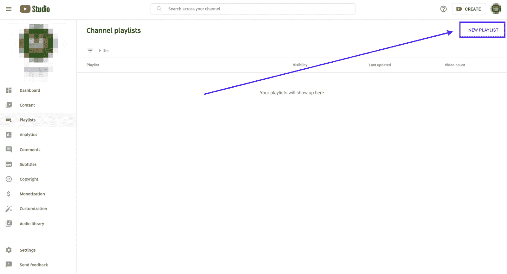

在 YouTube 上建立播放列表。

单击后，您可以命名新的播放列表并设置播放列表的可见性级别:

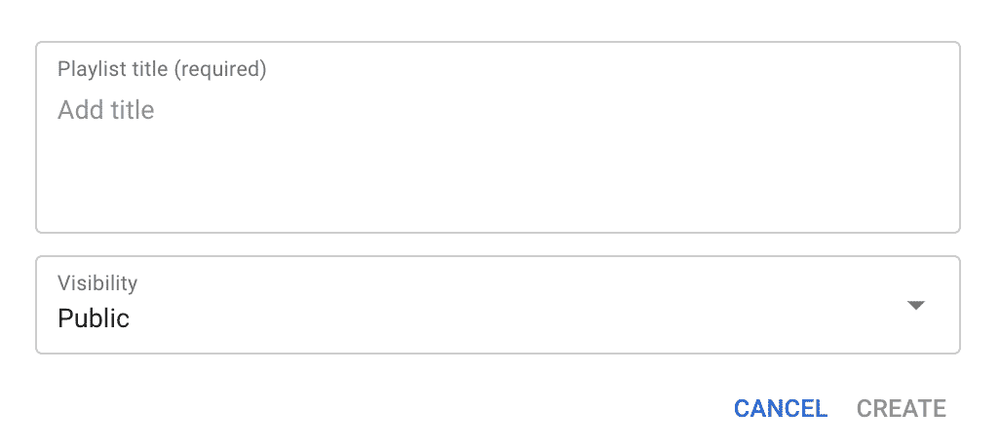

播放列表标题框。

现在播放列表已经完成，您可以开始向其中添加视频了。

通过点击左侧的**内容**按钮，您可以选择刚刚创建的播放列表，并直接向其中添加视频。就这么简单！

所以很多人使用播放列表来寻找他们感兴趣的相关内容。通过建立引人入胜的播放列表，您将使您的频道更值得关注，并用一系列激动人心的内容吸引观众。

你可以为你的观众感兴趣的主题创建播放列表。不过，你也可以考虑创建播放列表，将你的播客的所有剧集[，你的最新发布和项目更新，](https://www.youtube.com/watch?v=ZA4FOTDmqdA&list=PLhYfuAN3YCfwZkEDA1GdeyjbK9F2Dx77T)[关于如何使用你的产品的教程](https://www.youtube.com/watch?v=9XCVGuDwNx4&list=PLhYfuAN3YCfyWfewbJsn2noK9bGqf1mm-)，等等。

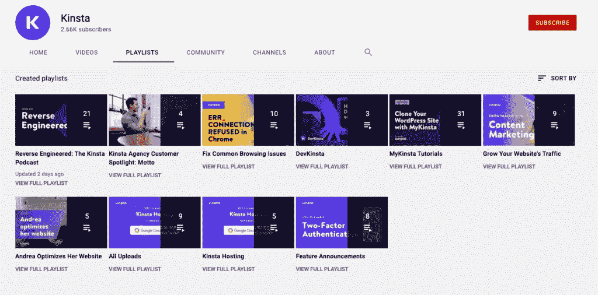

Kinsta’s YouTube playlists.

播放列表可能看起来很乏味，但是它们允许你完全自由地创建它们。此外，它们还提供了一种展示视频的额外方式。

## YouTube 常见问题

现在你已经创建了你的频道，这里有一些最常见的 YouTube 问题。

你自己可能也在考虑一些，所以这将是一个很好的资源。

### 1.我如何创建第二个 YouTube 频道？

如果你有多个不同的企业或组织，你可能需要不止一个 YouTube 频道。谢天谢地，有一个简单的方法来建立第二帐户。

YouTube 创作者或企业拥有多个 YouTube 频道是很常见的。每个 YouTube 频道应该有一个单一的焦点，并致力于一个特定观众的内容。

只需点击几下鼠标，您就可以在现有的[谷歌账户](https://kinsta.com/blog/multiple-gmail-accounts/)中添加一个新频道。

要制作第二个 YouTube 频道，点击右上角的头像，选择**切换账户**。如果您还没有创建第二个帐户，您可以点击**添加帐户**，按照上一节列出的步骤创建您的第一个频道。

### 2.我如何创建一个私人 YouTube 频道？

想为自己和特定人群创建一个频道吗？私人频道可能是最好的选择。

私人频道限制了可以访问您的内容的人数。如果您想[限制您的内容](https://kinsta.com/knowledgebase/wordpress-private-page/)或者将频道用作存储视频的地方，这些频道会很有帮助。

你需要做的就是从菜单中选择**隐私**。在该屏幕上，您可以选择将频道设为私人频道的选项。

### 3.如何在手机上创建 YouTube 频道？

在手机上创建 YouTube 频道再简单不过了！你需要做的就是下载 YouTube 应用程序并登录。

然后，您可以使用您的 Google 帐户创建频道。就这么简单，你可以在几分钟内完成。

由于复杂性，在台式机或笔记本电脑上设置整个渠道可能更容易。然而，仅仅在你的手机上建立一个频道是轻而易举的事。

[无论你是在制作个人 YouTube 频道还是品牌频道，本指南都有你需要的一切🎥🍿](https://twitter.com/intent/tweet?url=https%3A%2F%2Fkinsta.com%2Fblog%2Fhow-to-create-a-youtube-channel%2F&via=kinsta&text=Whether+you%E2%80%99re+making+a+personal+YouTube+channel+or+a+brand+channel%2C+this+guide+has+everything+you+need+to+get+started+%F0%9F%8E%A5%F0%9F%8D%BF&hashtags=YouTube%2CContentCreator)

## 摘要

YouTube 为任何企业吸引或拦截可能从未听说过你的观众提供了巨大的潜力。有了视频，你可以用一种不同的，或许更“亲密”的方式与用户建立联系。

然而，为了让你的企业获得最大的投资回报率，对你的观众的反馈的一致性和主动性是至关重要的。没有这些，创建一个频道将是一种资源浪费。还是单纯的爱好！

现在，轮到你了:你有没有考虑过为你的企业推出一个 YouTube 频道？如果你已经有一个了:你希望在发布前知道的一件事是什么？请在评论区告诉我们！

* * *

让你所有的[应用程序](https://kinsta.com/application-hosting/)、[数据库](https://kinsta.com/database-hosting/)和 [WordPress 网站](https://kinsta.com/wordpress-hosting/)在线并在一个屋檐下。我们功能丰富的高性能云平台包括:

*   在 MyKinsta 仪表盘中轻松设置和管理
*   24/7 专家支持
*   最好的谷歌云平台硬件和网络，由 Kubernetes 提供最大的可扩展性
*   面向速度和安全性的企业级 Cloudflare 集成
*   全球受众覆盖全球多达 35 个数据中心和 275 多个 pop

在第一个月使用托管的[应用程序或托管](https://kinsta.com/application-hosting/)的[数据库，您可以享受 20 美元的优惠，亲自测试一下。探索我们的](https://kinsta.com/database-hosting/)[计划](https://kinsta.com/plans/)或[与销售人员交谈](https://kinsta.com/contact-us/)以找到最适合您的方式。