# 如何从零开始成为一名网页开发者并找到工作

> 原文：<https://kinsta.com/blog/how-to-become-a-web-developer/>

如果有一份工作不需要任何经验或教育就可以轻松获得，那就是网站开发。你可以现在就开始，经过几周或几个月的学习和实践，你会对如何开发一个网站有一个实用的理解。

问题是不知道具体从哪里开始。任何人都可以想出如何编写一行简单的 HTML，但是创建一个人们会使用的功能性网站更复杂。web 开发的许多规则也更具挑战性。

如果你正在寻找资源或想了解更多关于你即将从事的工作的信息，我们已经收集了最好的在线学习平台、[网络开发工具](https://kinsta.com/blog/web-development-tools/)，以及你需要的所有信息，从这里开始。

### 查看我们的[视频指南](https://www.youtube.com/watch?v=YbOCpNGw1Mc)成为一名网页开发者

## 什么是网页开发者？

一个网站可以有任何地方，从一个人到背后的整个团队，但至少，它需要一个网站开发者。这些人编写代码，使网站运行并在万维网上可见。

web 开发人员的主要任务是编写代码，代码是用特定编程语言编写的一组命令和指令。代码构成了网络世界的一切，从你电脑的操作系统到你访问的网站的后端。

> Kinsta 把我宠坏了，所以我现在要求每个供应商都提供这样的服务。我们还试图通过我们的 SaaS 工具支持达到这一水平。
> 
> <footer class="wp-block-kinsta-client-quote__footer">
> 
> 
> 
> <cite class="wp-block-kinsta-client-quote__cite">Suganthan Mohanadasan from @Suganthanmn</cite></footer>

[View plans](https://kinsta.com/plans/)

看看维基百科的主页，想象一下创建这样一个简单的网站需要什么。web 开发人员设置了这个页面的布局，从侧边栏到表格，再到顶栏。他们必须设置脚本，从特色文章中获取导语，并从网站上请求动态内容。

数据库存储这些文章和它们的修订，也是由开发者建立的。

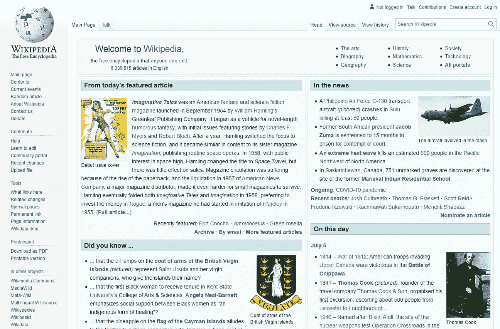

Wikipedia homepage

这需要大量的工作，但是所有的东西都一点一点地组合在一起，来创建一个功能性的网站。

随着互联网的指数级增长，程序员的需求量很大，就业前景非常好。每个人都想拥有自己的网站，而网站开发者就在这里帮助他们制作网站。

[想从事网页开发工作...但是不知道从哪里开始？😅这个帖子有最好的在线学习平台、网络开发工具，以及你需要的职业信息⬇️ 点击推文](https://twitter.com/intent/tweet?url=https%3A%2F%2Fkinsta.com%2Fblog%2Fhow-to-become-a-web-developer%2F&via=kinsta&text=Want+to+work+in+web+development...+but+no+idea+where+to+start%3F+%F0%9F%98%85+This+post+has+the+best+online+learning+platforms%2C+web+development+tools%2C+and+career+info+you%E2%80%99ll+need+%E2%AC%87%EF%B8%8F&hashtags=WebDev%2CTechCareers)

## 一个网页开发者是做什么的？

想知道你的日常任务到底是什么？以下是网站开发人员的一般工作描述:

*   使用代码创建网站和原型
*   为网站设计一个视觉上吸引人的布局(从头开始或者在网页设计师的帮助下)
*   通过[清理代码](https://kinsta.com/blog/code-review-tools/)和调试错误来维护活动网站
*   使用 SQL 创建一个数据库
*   与客户一起决定项目范围，并找出网站功能和设计的细节

有很多方法可以让你专业化，这将会改变你的工作描述。例如，你可以选择在前端或后端技术部门工作，或者你可以[成为一名系统管理员](https://kinsta.com/blog/sysadmin/)负责保持服务器正常运行。

但是总的来说，这些是你要负责的最基本的任务。

## 为什么要成为一名网页开发者？

虽然它可能不适合每个人，但 web 开发的门槛很低，是你能找到的最容易的工作之一。尽管如此，它的报酬还是相当不错的，而且网络开发者总是很吃香。

这并不是说这项工作不具有挑战性，但是基础知识可以很快自学(许多开发人员喜欢挑战！).

从长远来看，打入不断增长的科技行业始终是一个不错的选择。如果你愿意并且有能力学习流行的编程语言，在网络开发领域，总会有一种热门的新语言被雇主争相雇佣，你几乎可以保证有一份稳定的工作。

Popular coding languages between 2020–21

最后，web 开发是一项灵活的工作。你的职业生涯可能会花在做自由职业或者在 T2 的公司拿薪水上。你做的任务和你关注的技能或语言取决于你自己。

你需要先尝试编程，然后才能说它是否适合你，但是如果你投入工作尝试初学者编码，并发现它有意义，那么你可能会成为一名优秀的 web 开发人员。

### 网络开发人员的工资和需求

如果你正在考虑成为一名网站开发人员，最好能知道你期望的薪水是多少，以及找工作有多容易。

你可以查看我们关于[平均 web 开发人员工资](https://kinsta.com/blog/web-developer-salary/)、[前端开发人员工资](https://kinsta.com/blog/front-end-developer-salary/)、[后端开发人员工资](https://kinsta.com/blog/back-end-developer-salary/)，加上 [PHP 开发人员](https://kinsta.com/blog/php-developer-salary/)和 [WordPress 开发人员](https://kinsta.com/blog/wordpress-developer-salary/)的报道。

但普遍的看法是，开发人员的平均年收入为 6-7.5 万美元。

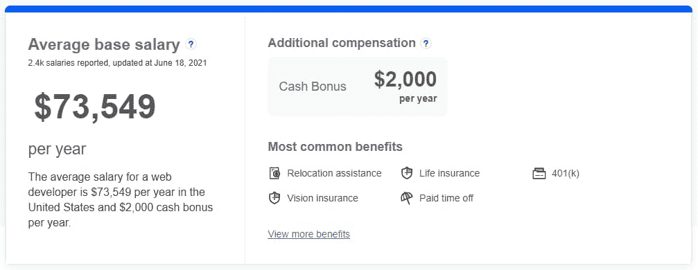

Average developer base salary in June 2021

当然，报酬将取决于你的经验水平、你所追求的语言和技术，以及你是自由职业者还是有稳定的工作。但这是一个合理的估计。

至于需求，美国劳动局预测，从 2019 年到 2029 年，对网页设计师和开发人员的需求将增长 8%。作为参考，这是大多数职业平均预期增长的两倍。

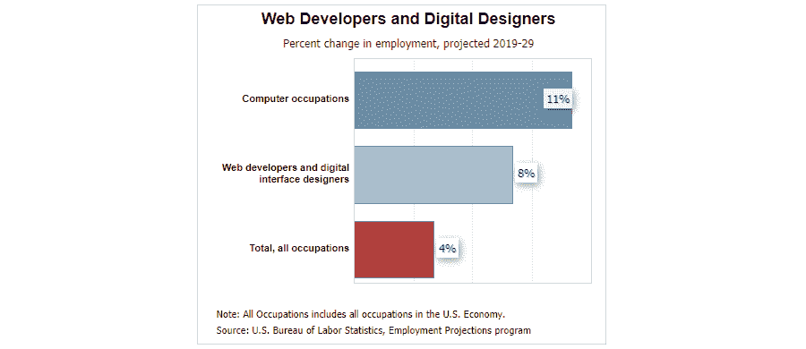

U.S. Bureau of Labor statistics on increases in employment opportunities for web developers

一些[网页开发员的工作](https://jooble.org/jobs-web-developer)比其他的更有竞争力——像[前端开发员](https://kinsta.com/blog/frontend-developer/)这样的职位更容易获得，薪水可能更低，找工作也更辛苦——但是前景仍然很好。

## 成为一名网页开发者有多难？

如果你懂编程的话，网络开发是最简单的工作之一。不是所有的工作都适合每个人，有些人可能会纠结于代码。

对于一些人来说，成为一名网络开发人员将是轻而易举的事情。对其他人来说，它可能永远不会与你合拍。但是对大多数人来说，一点点的奉献和大量的练习将会有很大的帮助。

成为一名网络开发人员的过程比其他工作要简单得多，而且有更多的途径让你步入正轨。这也是一份更加灵活多样的工作，有很多不同的专业。因此，无论你适合哪种学习方式或技能，总有适合你的。

掌握 web 开发需要持续的工作和奉献，这是一项具有挑战性并需要解决问题的技能的工作。学习基础知识很容易，但是在学习过程中会遇到令人沮丧但可以解决的问题。

### Web 开发要求

想知道成为一名 web 开发人员需要什么吗？确切的要求取决于你的专业领域。例如，后端开发人员通常应该创建和编辑数据库，但是你不能期望前端开发人员也这样做。

此外，你所知道的编程语言和框架将使你成为一个特殊类型的开发人员。

尽管如此，在你称自己为 web 开发人员之前，这里有一些你需要的技能和知识，不管你的专业是什么:

*   精通至少一种网络语言。根据你的职位，你可能需要学习更多。
*   其他相关技能的知识( [web 框架](https://kinsta.com/blog/php-vs-angular/)，库， [Git](https://kinsta.com/knowledgebase/git-vs-github/) 等。).
*   处理和调试代码需要解决问题的技能。
*   关注细节，从一开始就阻止错误的发生。
*   沟通和团队技能是与其他开发人员、客户、设计人员和测试人员合作的基础。
*   一定程度的独立性和独立解决问题的能力。
*   自我激励的学习是成功的另一个必要技能。
*   熟悉[流行的网络开发工具](https://kinsta.com/blog/web-development-tools/)是很有价值的。

### 成为一名网页开发者需要学位吗？

许多工作要求申请者拥有计算机科学或类似领域的大专文凭。其他职位可能会要求学士学位或只是在线课程的认证。

然而，你并不一定需要大学文凭才能找到工作。经验和完整的投资组合往往更有价值。越来越多的工作清单不再要求学位，而是选择要求经验证明。

由于这是一个技术含量很高的领域，有很大的自学空间，所以你知道如何做这份工作比你有资格做这份工作更重要。也就是说，学位会让事情从一开始就变得简单。

自学成才的开发人员可能会发现，既没有经验也没有学位，很难找到第一份工作。你可能需要先在你的文件夹里装满自制的项目，或者转向自由职业，积累一些工作经历。

如果你不想要一个正式的大学学位，像编码训练营提供的在线认证可以是一个合适的替代品。

### Web 开发人员的类型

Web 开发是一个高度专业化的职业。你很少会找到一个人把自己简单地描述为“网络开发者”根据你所做的工作，你关注网站的哪个部分，以及你使用的技术，你可以从大量的职位中进行选择。

### 信息

寻找工资信息？查看 [web 开发人员的平均工资](https://kinsta.com/blog/web-developer-salary/)。

*   前端开发人员:广泛的选择因为这些技能很容易掌握，前端/客户端开发人员在面向前端的网站上工作。选择的语言有[、HTML](https://kinsta.com/blog/html-vs-html5/) 、CSS 和 JavaScript。Bootstrap 和 [jQuery](https://kinsta.com/knowledgebase/what-is-jquery/) 也是流行的技术。
*   后端开发人员:这些开发人员使用服务器和数据库等技术。没有一个后端开发人员是相同的，因为有几十种后端编程语言。常见的选择有 Java，Ruby， [PHP](https://kinsta.com/blog/php-tutorials/) ，Python， [MySQL](https://kinsta.com/knowledgebase/what-is-mysql/) 。
*   **全栈开发者:**前端和后端开发者的组合。他们懂得足够多的语言，可以在服务器端和客户端使用。

这是主要的三种，但是你可以通过成为网络工程师、安全专家、 [WordPress 开发人员](https://kinsta.com/blog/wordpress-developer-salary/)、移动网络开发人员、网络应用程序开发人员等等进一步专业化。

## 成为网页开发者的步骤

你可以通过各种途径成为一名 web 开发人员，你自己的经历将会带来独特的挑战。但是一般来说，大多数 web 开发职业都遵循类似的形式。

首先，你需要选择你将如何学习发展。你会去上大学吗？你在追求什么样的学位？最好有计算机科学相关的大专或学士学位。

如果你不打算上大学，你会努力获得认证吗？认证与否，你会上付费还是免费的网络课程？或者你会全力以赴只使用[在线资源](https://kinsta.com/blog/php-tutorials/)自学？

## 注册订阅时事通讯

### 想知道我们是怎么让流量增长超过 1000%的吗？

加入 20，000 多名获得我们每周时事通讯和内部消息的人的行列吧！

[Subscribe Now](#newsletter)

决定之后，你需要选择一个专业(前端、后端、全栈等。).当你尝试 web 开发的不同方面时，你可以把它推迟，但是你需要在进行缩小范围的研究之前做出选择。

接下来，你想学的是什么[编程语言](https://kinsta.com/blog/best-programming-language-to-learn/)和技术？

所有这些可能会以不同的顺序出现。你可以选择专攻某门语言，或者在已经知道你想学什么语言的情况下，选择相应的课程。

在你掌握了一些 web 开发技能之后，你需要为你的文件夹准备一些项目。实践经验也会让你更好地了解一份真正的工作需要什么。[建立你的第一台服务器](https://kinsta.com/knowledgebase/mysql-community-server/)和[为自己设计一个网站](https://kinsta.com/blog/responsive-web-design/)。几个小项目会让你走上正轨。

有了你需要的知识和一份[好的开始投资组合](https://kinsta.com/blog/wordpress-portfolio-plugins/)，你就能为你的第一份工作做好准备。

## 最好的网络开发学习资源

准备好亲自尝试 web 开发了吗？我们已经收集了十几个很好的资源来帮助你开始。如果你选择自学或在线学习，这是开始的地方。对于那些要上大学的人来说，它们是你课程的很好补充。

### 1\. StackOverflow

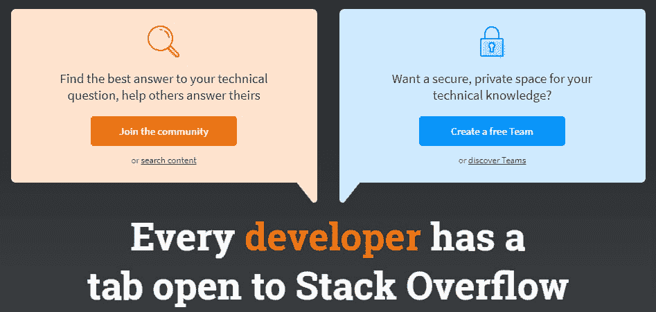

StackOverflow

作为开发人员的第一条规则是使用 [StackOverflow](https://stackoverflow.com/) 。每个开发人员都知道，当你被困在一个项目中时，这是你可以求助的地方。你的问题可能已经被问过和回答过了。如果没有，由经验丰富的专业人士组成的[社区](https://kinsta.com/learn/wordpress-communities/)很乐意提供帮助。

虽然这不是严格意义上的初学者学习资源，但它将伴随你的每一步。

### 2.w3 学校

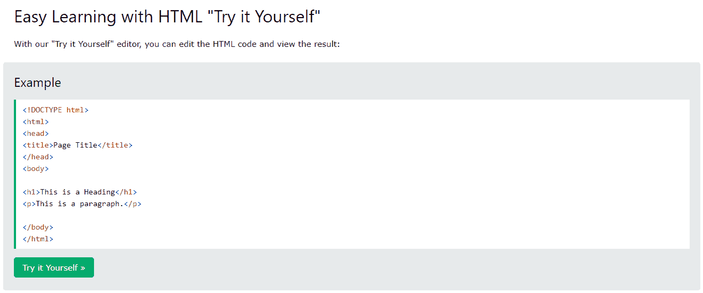

W3Schools

W3Schools 是一个优秀的初学者资源，它将带你了解各种 web 语言和标准的基础。它超级容易理解，即使你不习惯编码。
T3】

### 3.代码集

Codecademy

如果你需要一个提供十几种语言和技术的初学者友好课程，Codecademy 是你的选择。更好的是，大部分内容是免费的。虽然有高级功能，但课程本身是完全免费的。

### 4.犹达

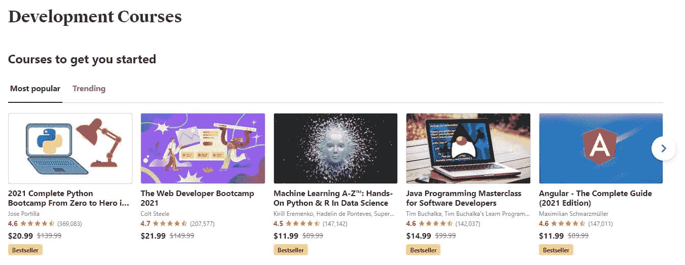

Udemy

需要一些更高级的课程，还是更具体技能的课程？Udemy 可能是适合你的网站。有数以千计的课程是由专业的导师制作的，有些甚至可以让你获得认证。

### 5.GitHub 学习实验室

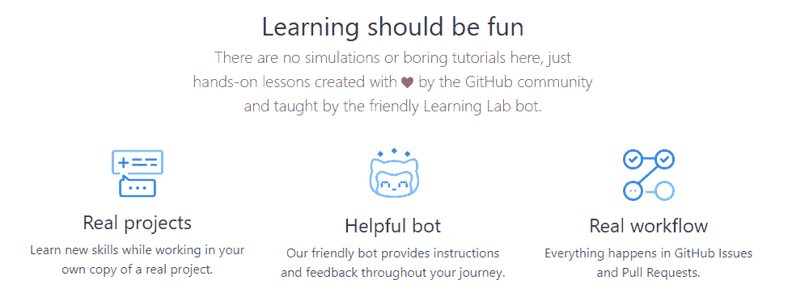

GitHub Learning Lab

如果你没有专业技能，Git 可能很难理解。一旦你掌握了窍门，这很容易，但跨越第一个障碍可能会很棘手。 [GitHub 学习实验室](https://lab.github.com/)用一个简单、有趣、互动的教程带你了解它。

需要一个给你带来竞争优势的托管解决方案吗？Kinsta 为您提供了令人难以置信的速度、一流的安全性和自动伸缩功能。[查看我们的计划](https://kinsta.com/plans/?in-article-cta)

### 6.德夫金斯塔

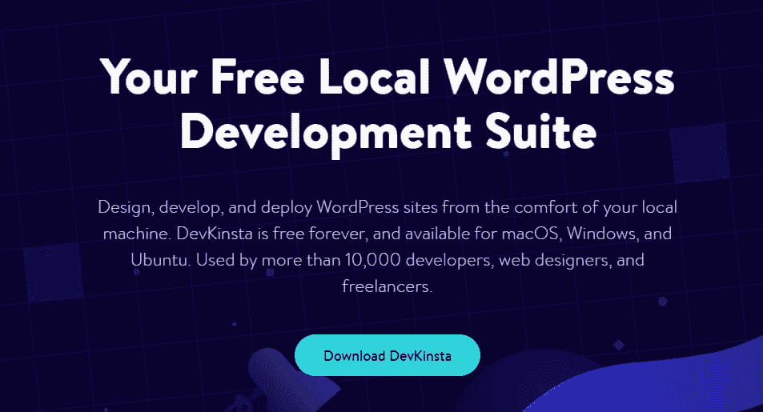

DevKinsta

有兴趣[学习 WordPress 开发](https://kinsta.com/blog/learn-wordpress/)？将[德夫金斯塔](https://kinsta.com/devkinsta/)作为您的第一站。这是一个免费的开发套件，使得启动一个本地 WordPress 服务器没有痛苦。使用它进行测试和开发，并将最终结果直接推送到 Kinsta 服务器。

### 7.自由代码营

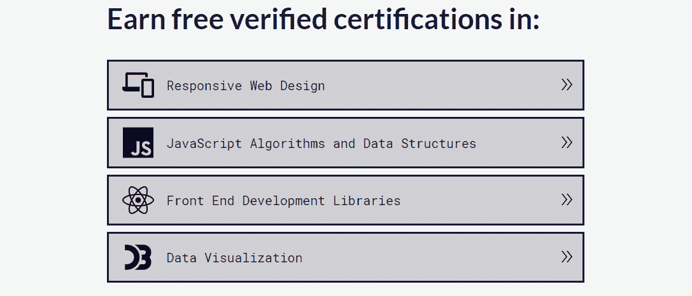

FreeCodeCamp

想边做边学编码并获得认证？与 Codecademy 不同， [FreeCodeCamp](https://www.freecodecamp.org/) 是 100%免费的，因为它是一个非营利组织。每个认证路径估计需要大约 300 个小时，你可以选择学习各种不同的技能。

### 8\. DevDocs

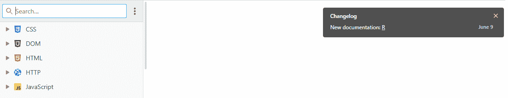

DevDocs

任何开发人员都知道，为几十种不同的工具寻找文档是很烦人的。DevDocs 是一个免费的开源工具，它将所有这些文档整合到一个简单易用的应用程序中。

### 9.团队树屋

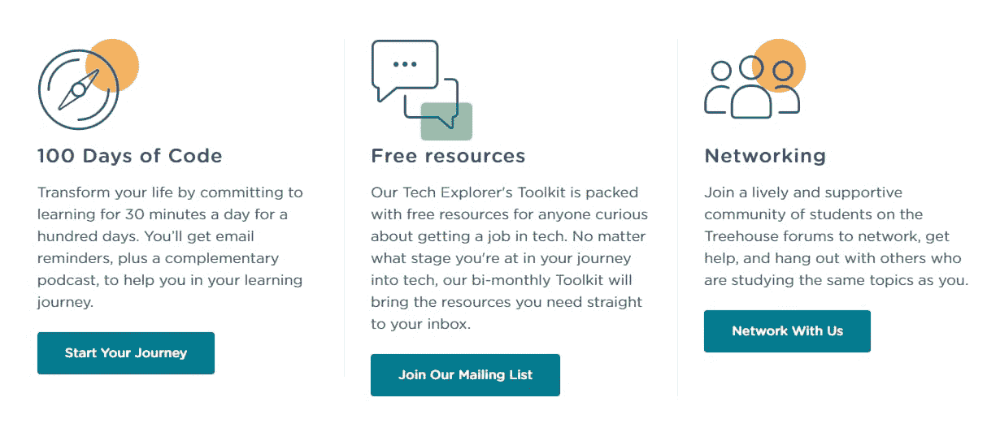

Team Treehouse

Treehouse 是一个有用的初学者资源，旨在从头开始教你 web 开发和其他基础知识。基于视频的学习平台还包括互动挑战。虽然这是一项高级服务，但对开发者来说，这是一个极好的起点。

### 10.Coursera

Coursera

与其他[学习平台](https://kinsta.com/blog/wordpress-lms-plugins/)不同，Coursera 有一个独特的优势:你可以用它获得技术大学的认证和正式大学学位。这可能比在大学注册要便宜，但是你会学到和大学生几乎一样的内容，和同样的教授一起工作。

由于 Coursera 提供认证和非认证课程，如果你的目标是一个合法的大学学位，请确保你知道你将进入什么样的环境。

### 11.蛋头

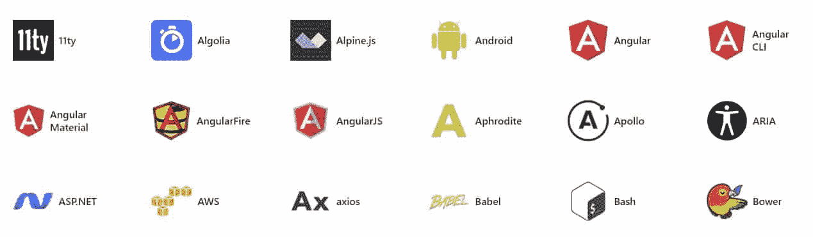

Egghead.io

[Egghead](https://egghead.io/) 包含了关于各种发展主题的有用的小课程。有几十个主题可供选择，每个主题都有更多的文章，涵盖了您可以想象的每个开发方面。也可以找到专业导师开设的课程。

### 12.CSS-技巧

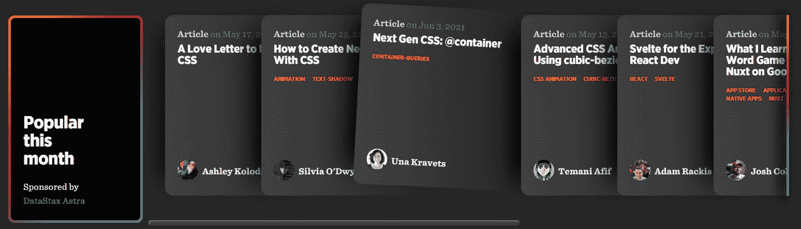

CSS-Tricks

虽然不是系列课程，CSS-Tricks 提供了关于前端 web 开发的高质量文章。如果你想[掌握 Javascript](https://kinsta.com/blog/javascript-libraries/) 或 CSS，这里有大量的阅读材料和入门文章。

### 13\. Udacity

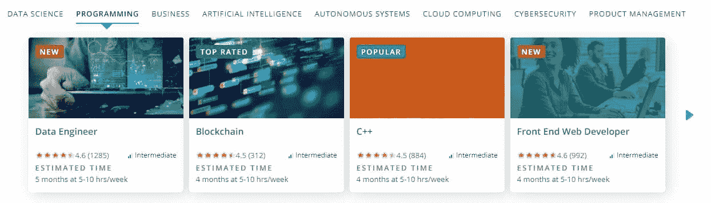

Udacity

Udacity 是一家专注于技术的付费在线课程提供商。除了网络开发，你还可以参加高度专业化的课程，比如[网络安全](https://kinsta.com/blog/cloud-security/)，数据科学，商业等等。

### 14.编写训练营程序

如果你通过充满计算的高强度项目学得最好，你可能想转向编码训练营。你可以在各个级别找到它们——甚至有针对初学者的编码训练营，它会教你窍门，还有针对专业人士的程序，它会让你保持警觉。

虽然大学或其他班级经常提供这些课程，但你也可以参加在线训练营。有些是付费课程，有些是免费的。这完全取决于你选择哪一个。

这种学习方式压力更大，但如果你正在与代码作斗争，它肯定会激励你。

网上有很多编码训练营，但你可以先看看 [HackReactor](https://www.hackreactor.com/online-coding-bootcamp) 、 [Fullstack Academy](https://www.fullstackacademy.com/online-coding-bootcamp) 和 [CodeSmith](https://codesmith.io/) 。

## 寻找网络开发人员的工作

一旦你参加了一门课程并且[建立了一个成功的作品集](https://kinsta.com/blog/portfolio-website/)，是时候走出去找一份网络开发员的工作了。

如果你已经选择了在一家有薪的公司工作，下一步很简单:开始申请！你可以在你当地的报纸上或者通过像谷歌招聘和 T2 招聘这样的网站找到工作列表。

如果你选择了自由职业呢？你的第一步应该是[建立一个网站](https://kinsta.com/blog/gatsby-wordpress/)，作为你的在线作品集。但是客户不会来找你。你需要伸出手。

当你需要赚一点钱时，像 [Upwork](https://www.upwork.com/freelance-jobs/website-development/) 这样的网站可以是一个很好的起点，但报酬很少很高。

建立关系网是获得客户的最佳途径。参与开源项目，这些项目可能会把你介绍给能帮你找到一份有报酬工作的人。尽可能在任何地方宣传你的生意。不要害怕伸出手去[找工作](https://kinsta.com/developer-roles/the-ideal-candidate/)。

无论你是自由职业者还是寻找传统工作，你也可以看看[网络开发工作论坛](https://resources.workable.com/tutorial/hire-developers)。

[准备好投身新的职业领域了吗？👩‍💻本综合入门指南⬇️ 点击推文](https://twitter.com/intent/tweet?url=https%3A%2F%2Fkinsta.com%2Fblog%2Fhow-to-become-a-web-developer%2F&via=kinsta&text=Ready+to+dive+into+a+new+career+field%3F+%F0%9F%91%A9%E2%80%8D%F0%9F%92%BB+Get+started+with+this+comprehensive+guide+%E2%AC%87%EF%B8%8F&hashtags=WebDev%2CDevelopers)

## 摘要

对于那些喜欢尝试新技能并准备将学习掌握在自己手中的人来说，Web 开发是一个极好的选择。这些 web 开发资源是您入门所需要的，随着您成为一名更熟练的开发人员，其中许多资源将继续提供帮助。

如果你正在寻找一家创新的成长型科技公司，[你很幸运](https://kinsta.com/careers/)！

想成为一名网站开发者，你还有其他的建议吗？请在评论区与我们分享！

* * *

让你所有的[应用程序](https://kinsta.com/application-hosting/)、[数据库](https://kinsta.com/database-hosting/)和 [WordPress 网站](https://kinsta.com/wordpress-hosting/)在线并在一个屋檐下。我们功能丰富的高性能云平台包括:

*   在 MyKinsta 仪表盘中轻松设置和管理
*   24/7 专家支持
*   最好的谷歌云平台硬件和网络，由 Kubernetes 提供最大的可扩展性
*   面向速度和安全性的企业级 Cloudflare 集成
*   全球受众覆盖全球多达 35 个数据中心和 275 多个 pop

在第一个月使用托管的[应用程序或托管](https://kinsta.com/application-hosting/)的[数据库，您可以享受 20 美元的优惠，亲自测试一下。探索我们的](https://kinsta.com/database-hosting/)[计划](https://kinsta.com/plans/)或[与销售人员交谈](https://kinsta.com/contact-us/)以找到最适合您的方式。