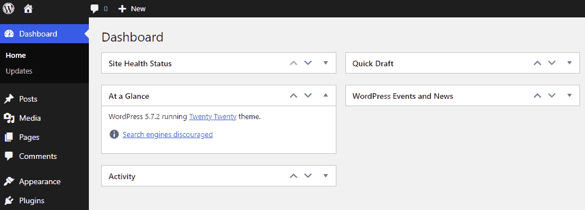
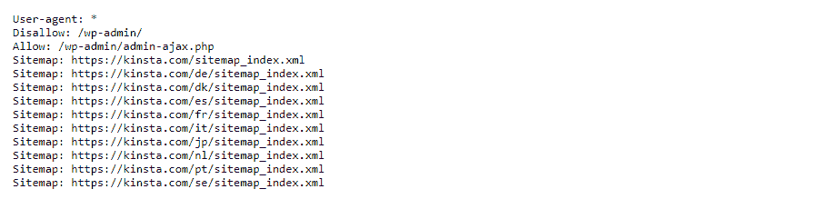
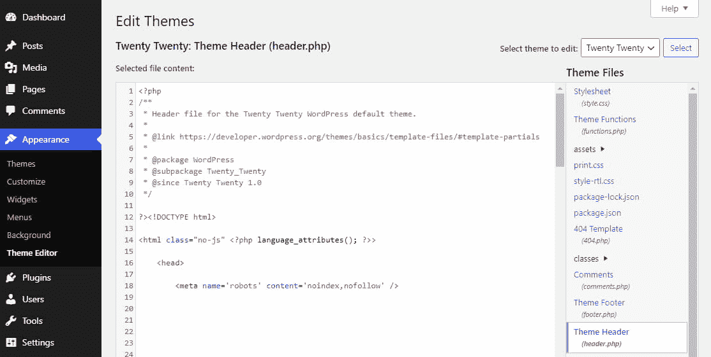
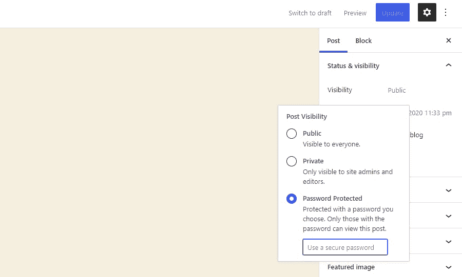
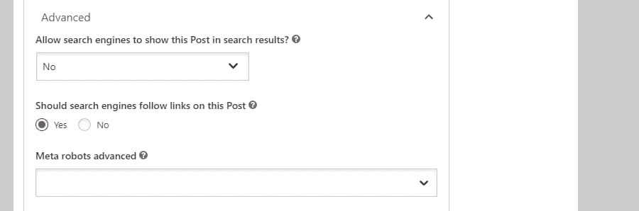
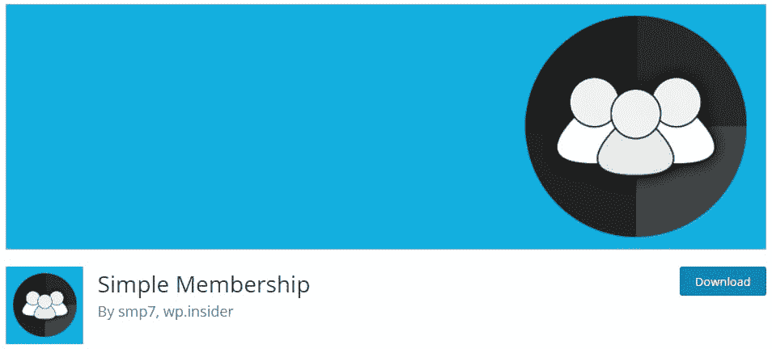

# 阻止搜索引擎索引这个网站:它的意思和如何使用它

> 原文：<https://kinsta.com/blog/discourage-search-engines-from-indexing-this-site/>

如果你曾在 WordPress 后端探索过，你可能会注意到一个设置，上面写着“阻止搜索引擎索引这个网站”，你想知道这是什么意思。

或者，您可能正在寻找一种方法来隐藏您的网站，防止不速之客访问，并想知道这个小复选框是否足以保护您的内容安全隐私。

这个选项是什么意思？它对你的网站到底有什么影响？为什么你应该避免依赖它——即使你试图隐藏你的内容？

下面是答案和一些其他的方法来降低你的网站的索引和阻止对某些页面的访问。

### 查看我们的[视频指南](https://www.youtube.com/watch?v=wewfXF92YaE)来使用 WordPress 中的“阻止搜索引擎索引这个网站”选项


## “阻止搜索引擎索引这个网站”是什么意思？

你有没有想过搜索引擎是如何索引你的网站和评估你的搜索引擎优化的？他们通过一个叫做蜘蛛的自动化程序来完成这项工作，蜘蛛也被称为机器人或爬虫。蜘蛛“爬行”网络，访问网站并记录你的所有内容。


谷歌使用它们来决定如何在搜索结果中排列和放置你的网站，为搜索结果页面从你的文章中抓取广告词，并将你的图片拉进谷歌图片。

当你勾选“阻止搜索引擎索引这个站点”时，WordPress 会修改你的 [robots.txt 文件](https://kinsta.com/blog/wordpress-robots-txt/)(一个指导蜘蛛如何抓取你的站点的文件)。它还可以在你的网站头上添加一个 meta 标签，告诉谷歌和其他搜索引擎不要在你的整个网站上索引任何内容。

这里的关键词是“劝阻”:搜索引擎没有义务尊重这一请求，尤其是那些不像谷歌那样使用标准 **robots.txt** 语法的搜索引擎。

网络爬虫仍然能够找到你的站点，但是正确配置的爬虫将读取你的 **robots.txt** 并且不索引内容或者在他们的搜索结果中显示它。

在过去，WordPress 中的这个选项并不能阻止谷歌在搜索结果中显示你的网站，只是阻止对其内容进行索引。您仍然可以看到您的页面出现在搜索结果中，并出现类似“此页面没有可用信息”或“由于该网站的 robots.txt，此结果的描述不可用”的错误

虽然谷歌没有索引页面，他们也没有完全隐藏页面。这种反常现象导致人们能够访问他们不应该看到的页面。多亏了 WordPress 5.3 ，它现在可以正常工作了，阻止了网站的索引和列表。

你可以想象如果你不小心启用了它，这会如何破坏你的 SEO。只有当你真的不想让任何人看到你的内容时，才使用这个选项，这一点很重要，即使这样，这也可能不是你想采取的唯一措施。

### 为什么你可能不想索引你的网站

网站是为了让人们看到而制作的。你希望用户阅读你的文章，购买你的产品，消费你的内容——为什么你要故意屏蔽搜索引擎呢？

有几个原因可以让你隐藏部分或全部的站点。

*   您的网站正在开发中，还没有准备好向公众开放。
*   你使用 WordPress 作为一个内容管理系统，但是你想保持这些内容的私密性。
*   你试图隐藏敏感信息。
*   你希望你的网站只对一小部分有链接的人开放，或者只通过邀请，而不是通过公共搜索页面。
*   你想把一些内容放在付费墙或其他门后，比如时事通讯独家文章。
*   你想切断旧的，过时的文章的流量。
*   你想防止在测试页面或重复内容上受到 SEO 惩罚。

有更好的解决方案——使用一个合适的离线开发服务器(T0 )( T1 ),( T2 ),将你的文章设为私有(T3 ),或者设置密码——但是你有正当的理由去索引你的部分或者全部网站。


## 如何检查你的网站是否阻碍了搜索引擎

虽然你可能有合理的理由去索引你的站点，但是如果你无意中打开了这个设置或者不小心打开了它，那将是一个可怕的打击。如果你[的流量为零](https://kinsta.com/blog/how-to-drive-traffic-to-your-website/)并且怀疑你的网站没有被索引，下面是如何确认的方法。

一个简单的方法是检查位于管理仪表板主屏幕上的**一览**框。只要登录到你的后台，选中这个框。如果你看到“搜索引擎被阻止”，那么你知道你已经激活了这个设置。



“At a Glance” in the WordPress dashboard.


更可靠的方法是检查你的机器人。您可以在浏览器中轻松验证这一点，甚至无需登录您的网站。

要检查 **robots.txt** ，你需要做的就是在你的网址末尾添加`/robots.txt`。比如:`https://kinsta.com/robots.txt`

如果你看到`Disallow: /`，那么你的整个网站被阻止索引。



“Disallow” in robots.txt.


如果你看到`Disallow:`后面跟着一个 URL 路径，比如`Disallow: /wp-admin/`，这意味着任何带有`/wp-admin/`路径的 [URL](https://kinsta.com/knowledgebase/what-is-a-url/) 都被屏蔽了。这种结构对于某些页面来说是正常的，但是如果，例如，它阻塞了包含您想要索引的页面的`/blog/`，这可能会导致问题！

现在 WordPress 使用 meta 标签而不是 **robots.txt** 来为你的网站去索引，你也应该[检查你的标题](https://kinsta.com/knowledgebase/add-code-wordpress-header-footer/)的修改。

登录你的后台，进入**外观** > **主题编辑器**。找到【header.php】的**主题头**，寻找如下代码:

```
<meta name='robots' content='noindex,nofollow' />
```



noindex, nofollow in header.php.


您还可以检查**functions.php**中的`noindex`标签，因为可以通过这个文件远程将代码插入到头文件中。

如果你在你的主题文件中发现了这段代码，那么你的网站没有被 Google 索引。但是，与其手动删除它，不如让我们先尝试关闭原始设置。

## 如何阻止 WordPress 中的搜索引擎索引

如果你想跳过额外的步骤，直接回到最初的设置，下面是如何激活或停用 WordPress 中的“阻止搜索引擎”选项。

登录你的 [WordPress 仪表盘](https://kinsta.com/knowledgebase/wordpress-admin/)，导航到**设置** > **阅读**。寻找**搜索引擎可见性**选项，带有一个标记为“阻止搜索引擎索引该站点”的复选框


Search engine visibility checkbox.


如果你发现这个已经打开，并希望你的网站被索引，那么取消选中它。如果你打算阻止你的网站被索引，检查它(并在某处记下提醒你以后关闭它！).

现在点击**保存更改，**您就可以开始了。您的网站可能需要一段时间才能被重新索引或从搜索结果中删除。

如果你的网站仍然没有被索引，你也可以从你的头文件中删除`noindex`代码，或者手动编辑 **robots.txt** 来删除“不允许”标志。

这很简单，但是你有什么理由应该避免这个选项，或者至少不完全依赖它呢？

### 使用阻止搜索引擎选项的缺点

看起来很简单——勾选一个复选框，没有人能看到你的网站。这还不够好吗？为什么应该避免单独使用这个选项？

当你打开这个设置或任何类似的选项时，它所做的只是给你的标题或你的 **robots.txt** 添加一个标签。正如旧版本的 WordPress 仍然允许你的网站被列在搜索结果中，一个小故障或[其他错误](https://kinsta.com/blog/wordpress-errors/)会导致人们看到你所谓的隐藏页面。

此外，这完全取决于搜索引擎是否尊重不抓取你的网站的请求。像 Google 和 Bing 这样的主要搜索引擎通常会，但并不是所有的搜索引擎都使用相同的 **robots.txt** 语法，也不是所有爬网的蜘蛛都是由[搜索引擎](https://kinsta.com/blog/alternative-search-engines/)发出的。

## 注册订阅时事通讯


### 想知道我们是怎么让流量增长超过 1000%的吗？

加入 20，000 多名获得我们每周时事通讯和内部消息的人的行列吧！

[Subscribe Now](#newsletter)

例如，一个使用网络爬虫的服务是 [Wayback 机器](https://archive.org/web/)。如果你的内容被这样的服务编入索引，它就永远在网上了。


Wayback Machine.


你可能认为仅仅因为你的新网站没有链接，它就不会被蜘蛛攻击，但这不是真的。存在于共享服务器上，发送一封包含网站链接的电子邮件，甚至在浏览器(尤其是 Chrome)中访问您的网站，都可能会让您的网站被抓取。

如果您想隐藏内容，添加一个参数并希望它能达到目的并不是一个好主意。

让我们明确一点，如果你定义的内容是敏感的或者个人的，你绝对不应该依靠 **robots.txt 或者 meta 标签来隐藏它。**

最后但并非最不重要的是，这个选项将完全隐藏您的网站从搜索引擎，而很多时候你只想去索引某些网页。

那么，你应该做什么来代替或配合这种方法呢？


## 防止搜索引擎索引的其他方法

虽然 WordPress 提供的选项通常可以完成它的工作，但是在某些情况下，使用其他隐藏内容的方法通常会更好。连谷歌自己都说[不要用 robots.txt 隐藏页面](https://developers.google.com/search/docs/advanced/robots/intro#understand-the-limitations-of-a-robots.txt-file)。

只要你的网站[有域名](https://kinsta.com/blog/choose-domain-name/)并且在面向公众的服务器上，就没有办法保证你的内容不会被爬虫看到或索引，除非你删除它或隐藏在密码或登录要求之后。

也就是说，有什么更好的方法来隐藏你的网站或某些网页呢？

### 阻止搜索引擎。htaccess

虽然其实现在功能上与简单地使用“阻止搜索引擎”选项相同，但您可能希望手动使用**。阻止你网站的索引。**

你需要使用一个 [FTP/SFTP 程序](https://kinsta.com/blog/best-ftp-clients/)来访问你的网站并打开[。htaccess 文件](https://kinsta.com/knowledgebase/wordpress-htaccess-file/)，通常位于根文件夹(打开站点时看到的第一个文件夹)或 **public_html** 中。将此代码添加到文件中并保存:

```
Header set X-Robots-Tag "noindex, nofollow"
```

注意:这个方法只适用于 Apache 服务器。NGINX 服务器，比如那些运行在 Kinsta 上的服务器，需要将这段代码添加到**中。conf** 文件，可以在 **/etc/nginx/** 中找到(你可以在这里找到一个 [meta 标签实现](https://developers.google.com/search/docs/advanced/robots/robots_meta_tag#xrobotstag-implementation)的例子):

```
add_header X-Robots-Tag "noindex, nofollow";
```

### 密码保护敏感页面

如果你不想让搜索引擎收录某些文章或页面，隐藏它们的最好方法是用[密码保护你的网站](https://kinsta.com/blog/password-protect-wordpress-site/)。这样，只有您和您想要的用户才能看到该内容。

需要为您的电子商务网站提供超快的、可靠的、完全安全的托管服务吗？Kinsta 提供所有这些服务，并由 WooCommerce 专家提供 24/7 的世界级支持。[查看我们的计划](https://kinsta.com/plans/?in-article-cta)

幸运的是，这个功能内置在 WordPress 中，所以不需要安装任何插件。只需进入**文章页面**，点击你想要隐藏的页面。编辑你的页面，在右侧寻找**状态和可见性** > **可见性**菜单。

如果你没有使用古腾堡，过程是类似的。您可以在**发布**框中找到相同的菜单。

将**可见性**改为**密码保护**并输入密码，然后保存——你的内容现在对公众是隐藏的。



Setting a post to Password Protected.


如果你想用密码保护你的整个网站呢？要求每个页面都有密码是不现实的。

Kinsta 用户很幸运:你可以在**网站** > **工具**中启用密码保护，需要用户名和密码。

否则，你可以使用[一个内容限制插件](https://kinsta.com/knowledgebase/wordpress-private-page/#free-plugins-for-generating-private-pages-and-posts-in-wordpress)(例如[密码保护](https://wordpress.org/plugins/password-protected/))。请安装并激活它，然后前往**设置** > **密码保护**并启用**密码保护状态**。这为您提供了更好的控制，甚至允许您将某些 IP 地址列入白名单。


### 重要的

写这篇文章的时候，这个插件已经 11 个多月没有更新了。它可能不再被维护或支持，并且可能与最新的 WordPress 版本有兼容性问题。


Setting a post to Password Protected.


### 安装一个 WordPress 插件

当 WordPress 的默认功能不够用时，一个好的插件通常可以解决你的问题。

例如，如果您想要对特定页面而不是整个站点进行索引，那么 [Yoast](https://wordpress.org/plugins/wordpress-seo/) 提供了这个选项。

在 [Yoast SEO](https://kinsta.com/blog/yoast-seo/) 中，你可以打开一个你想隐藏的页面，在**高级**标签下寻找选项:**允许搜索引擎在搜索结果中显示这篇文章？**改为**否**页面将被隐藏。



Yoast SEO settings


你应该注意到这两个都依赖于和 WordPress 的默认选项相同的方法来阻止搜索引擎索引，并且有相同的缺陷。一些搜索引擎可能不会接受你的请求。如果您真的想完全隐藏这些内容，您需要使用其他方法。

另一个解决方案是付费墙你的内容或隐藏在一个必要的登录。[简单会员](https://wordpress.org/plugins/simple-membership/)或[终极会员](https://wordpress.org/plugins/ultimate-member/)插件可以帮助你设置免费或付费会员内容。



Simple Membership plugin.


### 使用临时站点进行测试

当在测试项目或正在进行的网站上工作时，隐藏它们的最好办法是使用一个测试或开发网站。这些网站是私有的，通常托管在本地机器上，除了您和您允许的其他人，没有人可以访问。

许多网络主机会为你提供易于部署的中转站点，并允许你在准备好的时候[将它们推送到你的公共服务器](https://kinsta.com/help/push-staging-live/)。Kinsta 为所有计划提供了一个点击 [WordPress staging](https://kinsta.com/wordpress-staging/) 网站。

您可以通过进入**站点** > **信息**并点击**更改环境**下拉菜单来[访问您在 MyKinsta 的中转站点](https://kinsta.com/blog/wordpress-staging-site/)。点击**暂存环境**，然后点击**创建暂存环境**按钮。几分钟后，您的开发服务器将启动并准备好进行测试。

如果你没有一个简单的方法来创建一个暂存站点，WP 暂存插件可以帮助你复制你的安装，并把它移动到一个文件夹中以便于访问。

### 使用谷歌搜索控制台暂时隐藏网站

谷歌搜索控制台是一项服务，它允许你宣称自己网站的所有权。随之而来的是暂时阻止谷歌索引某些页面的能力。

这种方法有几个问题:它是谷歌专有的(所以像 Bing 这样的网站不会受到影响),而且只能持续 6 个月。

但是如果你想要一个快速简单的方法让你的内容暂时离开谷歌搜索结果，这是一个好方法。

如果你还没有，你需要[将你的网站添加到谷歌搜索控制台](https://kinsta.com/blog/google-search-console/)。完成后，打开[清除](https://search.google.com/search-console/removals)，选择**临时清除** > **新请求**。然后点击**仅删除此 URL**并链接您想要隐藏的页面。

这是一种更加可靠的屏蔽内容的方式，但是同样，它只对谷歌有效，并且只能持续 6 个月。

## 摘要

有很多原因可以让你隐藏网站上的内容，但是依靠“阻止搜索引擎索引该网站”选项并不是确保这些内容不被看到的最好方法。

除非你想在网上隐藏你的整个网站，否则你永远不要点击这个选项，因为如果它被意外切换，会对你的搜索引擎优化造成巨大的损害。

即使你想隐藏你的站点，这个默认选项也是一个不可靠的方法。它应该与密码保护或其他阻止措施配合使用，尤其是在处理敏感内容时。

你有没有用其他方法隐藏你的网站或网站的一部分？请在评论区告诉我们。

* * *

让你所有的[应用程序](https://kinsta.com/application-hosting/)、[数据库](https://kinsta.com/database-hosting/)和 [WordPress 网站](https://kinsta.com/wordpress-hosting/)在线并在一个屋檐下。我们功能丰富的高性能云平台包括:

*   在 MyKinsta 仪表盘中轻松设置和管理
*   24/7 专家支持
*   最好的谷歌云平台硬件和网络，由 Kubernetes 提供最大的可扩展性
*   面向速度和安全性的企业级 Cloudflare 集成
*   全球受众覆盖全球多达 35 个数据中心和 275 多个 pop

在第一个月使用托管的[应用程序或托管](https://kinsta.com/application-hosting/)的[数据库，您可以享受 20 美元的优惠，亲自测试一下。探索我们的](https://kinsta.com/database-hosting/)[计划](https://kinsta.com/plans/)或[与销售人员交谈](https://kinsta.com/contact-us/)以找到最适合您的方式。