# 深入探究最新的古腾堡 WordPress 编辑器(2022)

> 原文：<https://kinsta.com/blog/gutenberg-wordpress-editor/>

当 WordPress block editor，或者古腾堡，[在 2018 年 12 月](https://kinsta.com/blog/wordpress-5-0/)推出的时候，我们不知道该期待什么。当然，我们有足够的时间来玩它的测试版，但我们无法预测实际的发布会有多顺利，或者用户和开发者会有多渴望接受新的编辑器。

自从我们第一次发表这个帖子以来，我们已经看到古腾堡编辑器在两年多的时间里经历了巨大的增长。它已经从一个最小可行产品(MVP)的发布转移到一个更成熟的项目，这个项目越来越接近为 WordPress 创建一个统一的[全站点编辑](https://kinsta.com/blog/wordpress-5-8/#full-site-editing-features-in-wordpress-58)体验的目标。

为了说明这些变化，我们重新访问了古腾堡编辑器，带您了解它的新面貌，包括它下一步将去哪里。

## 什么是古腾堡块编辑器？

古腾堡，或者被称为“WordPress 块编辑器”或只是“WordPress 编辑器”，是在 2018 年 12 月 6 日发布的 [WordPress 5.0](https://kinsta.com/blog/wordpress-5-0/) 中引入的 WordPress 内容编辑器。

如果你没有听说过这个术语，它是所有 WordPress 网站使用的默认编辑器，除非你特别禁用它。它看起来像这样:

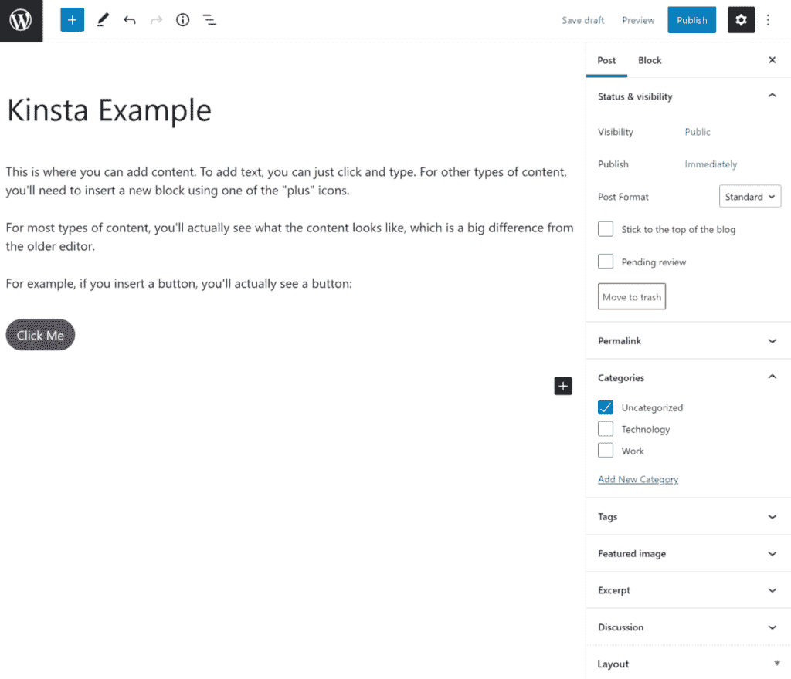

The Gutenberg WordPress editor.

Gutenberg WordPress 编辑器和以前的 WordPress 编辑器(现在称为“经典编辑器”或“TinyMCE 编辑器”)之间的最大区别是一种新的基于块的内容创建方法。

> 需要在这里大声喊出来。Kinsta 太神奇了，我用它做我的个人网站。支持是迅速和杰出的，他们的服务器是 WordPress 最快的。
> 
> <footer class="wp-block-kinsta-client-quote__footer">
> 
> 
> 
> <cite class="wp-block-kinsta-client-quote__cite">Phillip Stemann</cite></footer>

[View plans](https://kinsta.com/plans/)

使用 Gutenberg，内容中的每个元素都是一个块，这使得内容的操作变得非常容易。每个段落都是一个模块，每个图像都是一个模块，每个按钮都是一个模块——你明白了！

第三方开发者也可以创建自定义区块，这有助于结束 WordPress 与短代码的关系[。假设您想在](https://kinsta.com/blog/wordpress-shortcodes/)[中嵌入一个联系人表单](https://kinsta.com/blog/wordpress-contact-form-plugins/)。不需要像过去那样添加一个短代码(例如`[your-form-shortcode]` ),你现在可以直接放入你的表单插件块。

除此之外，您还可以使用块来创建更复杂的布局，如设置多栏设计或分组块来创建有凝聚力的部分。

随着我们深入向您展示如何使用块编辑器，您将更好地了解如何使用块来改进内容的创建方式。

[古腾堡 2018 年 12 月上线，到现在变化很多！🚀查看此更新指南了解更多⬇️ 点击推文](https://twitter.com/intent/tweet?url=https%3A%2F%2Fkinsta.com%2Fblog%2Fgutenberg-wordpress-editor%2F&via=kinsta&text=Gutenberg+launched+in+December+2018%2C+and+a+lot+has+changed+since+then%21+%F0%9F%9A%80+Check+out+this+updated+guide+to+learn+more+%E2%AC%87%EF%B8%8F&hashtags=Gutenberg%2CWordPress)

### 古腾堡不仅仅是一个内容编辑器

需要理解的重要一点是，Gutenberg 项目的目标不仅仅是一个内容编辑器。

2021 年 7 月，古腾堡还只是一个内容编辑(大部分情况下)。但是古腾堡的长期目标是将它推向一种叫做“全网站编辑”的东西。

全网站编辑的想法是，你可以使用古腾堡编辑器来设计 100%的网站。例如，不再局限于你的 [WordPress 主题](https://kinsta.com/blog/how-to-customize-wordpress-theme/)附带的标题选项，你将能够使用 Gutenberg 使用块编辑器来设计定制的标题。

这种类型的功能还没有在*和*推出，但它正在路上，我们确实有一些“概念验证”项目，我们会在这篇文章的结尾给你看看。
T3】

## 古腾堡与流行替代方案的利弊

现在我们已经能够使用 WordPress 块编辑器两年多了，我们对 Gutenberg 和其他解决方案的优缺点有了很好的了解。

对于在 WordPress 上创建内容的[,你有两个主要的选择:](https://kinsta.com/blog/evergreen-content/)

*   [WordPress TinyMCE 编辑器](https://kinsta.com/blog/wordpress-tinymce-editor/):这是 WordPress 在 WordPress 5.0 之前使用的经典编辑器。
*   [页面生成器插件](https://kinsta.com/blog/wordpress-page-builders/) **:** 这些是第三方插件，为 WordPress 添加了可视化的拖放式设计。

总的来说，经典的 TinyMCE 编辑器提供了更精简的类似文字处理器的体验，而页面生成器提供了更加灵活的可视化拖放设计体验。

如果我们根据设计灵活性订购所有三个编辑器，结果会是这样:

**经典 TinyMCE 编辑器(最不灵活)<古腾堡<页面生成器(最灵活)**

现在，让我们来谈谈古腾堡块编辑器与替代方案的优缺点。

### 古腾堡 vs 经典编辑器:利弊

我们先来对比一下古腾堡和经典的 TinyMCE 编辑器。

**优点**:

*   古腾堡提供了一个更加视觉化的设计背景
*   您不需要使用短代码来嵌入内容，您将获得一个统一的块系统

**缺点**:

*   有些人觉得在古腾堡写作有点笨拙，因为每一段都是一个独立的块。对于长文章，操作文本可能会很困难。您可能更喜欢在另一个编辑器中编写，并在完成后将文本粘贴到 Gutenberg 中。
*   虽然 Gutenberg 的性能有了显著提高，但它仍然会在大量帖子上滞后，这在经典编辑器中不太可能发生。

如果你认为经典的 TinyMCE 编辑器更适合你的需要，你可以[完全禁用 Gutenberg 编辑器](https://kinsta.com/blog/disable-gutenberg-wordpress-editor/)。

### 古腾堡 vs 页面生成器:利弊

现在，让我们来看看古腾堡如何对抗第三方页面生成器插件。

**优点**:

*   Gutenberg 是核心特性，也就是说你不用担心兼容性问题。
*   因为这是一个核心特性，所有开发者都可以将 Gutenberg 支持构建到他们的插件中，从而提高兼容性。
*   Gutenberg 输出更干净、更轻量级的代码。在所有条件相同的情况下，用 Gutenberg 构建的设计通常比用页面生成器构建的设计加载得更快。

**缺点**:

*   Gutenberg 不像页面生成器那样提供适当的可视化编辑。它比经典编辑器更容易访问，但仍不能像页面生成器那样 100%无缝。
*   页面生成器仍然为您提供了更加灵活的设计和布局选项。
*   大多数页面生成器提供更加流畅和灵活的拖放操作。

### 关于比较的思考

对于大多数用户来说，Gutenberg 在灵活性方面达到了最佳效果。

大多数人不需要页面生成器的灵活性来处理他们的内容，尤其是博客文章。但同时，快速设置多栏设计或插入按钮也很好，这是经典编辑器不容易做到的。

记住这一点，让我们来看看如何开始使用古腾堡。

## 如何使用 Gutenberg WordPress 块编辑器

现在，您已经对 Gutenberg 块编辑器有所了解，让我们深入了解如何使用它来开始创建内容。

我们将从介绍界面开始，逐步开发更高级的方法来使用编辑器和改进您的工作流。

### 古腾堡块编辑器界面

当你打开编辑器时，它会隐藏 WordPress dashboard 工具条，给你一个全屏的体验:

The Gutenberg WordPress block editor interface.

编辑器有三个主要部分:

*   **内容**:你的内容占据了大部分屏幕。你将会看到一个视觉预览，它将会出现在你的网站的前端。虽然不是 100%准确，但是你应该对最终的设计有一个很好的想法。
*   **顶部工具栏:**顶部的工具栏帮助您插入新块、撤销/重做以及访问其他重要设置
*   **侧边栏:**侧边栏包含两个标签页。**帖子**标签可以让你配置帖子等级设置，如类别、标签、[特色图片](https://kinsta.com/blog/wordpress-featured-image-not-showing/)等。**块**选项卡显示您选择的块的设置——稍后将详细介绍。

要创建一个更加身临其境的写作体验，您可以通过点击右上角的“齿轮”图标来隐藏侧边栏。要恢复侧边栏，您只需再次点击“齿轮”图标:

Clicking the “gear” icon will show/hide the sidebar.

### 信息

您的编辑器可能看起来略有不同，因为主题开发人员可以选择将他们的样式添加到编辑器中，以创建更直观的体验。根据你的主题，你可能会看到不同的字体或颜色。

例如，如果你使用的是新的 221 默认主题，编辑器界面看起来是这样的:

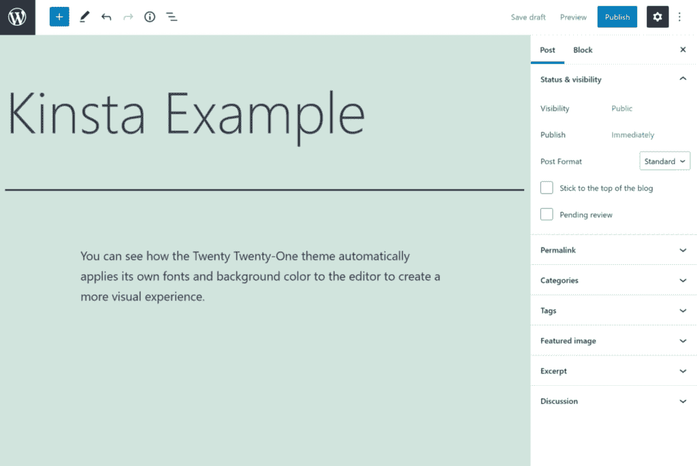

An example of the Twenty Twenty-One theme applying its styles to the block editor.

### 添加块

要在文章中添加常规段落文本，您只需点击并键入即可。每次按 enter 键，编辑器都会自动创建一个新的段落块。

对于其他类型的内容，您需要插入一个新块。你将为图像、按钮、[视频嵌入](https://kinsta.com/blog/embed-youtube-video-wordpress/)等使用块。

要添加新块，您可以单击界面中的“加号”图标之一。它是左上角的主块插入器图标，但您还会在打开较小的块插入器界面的界面中看到其他图标:

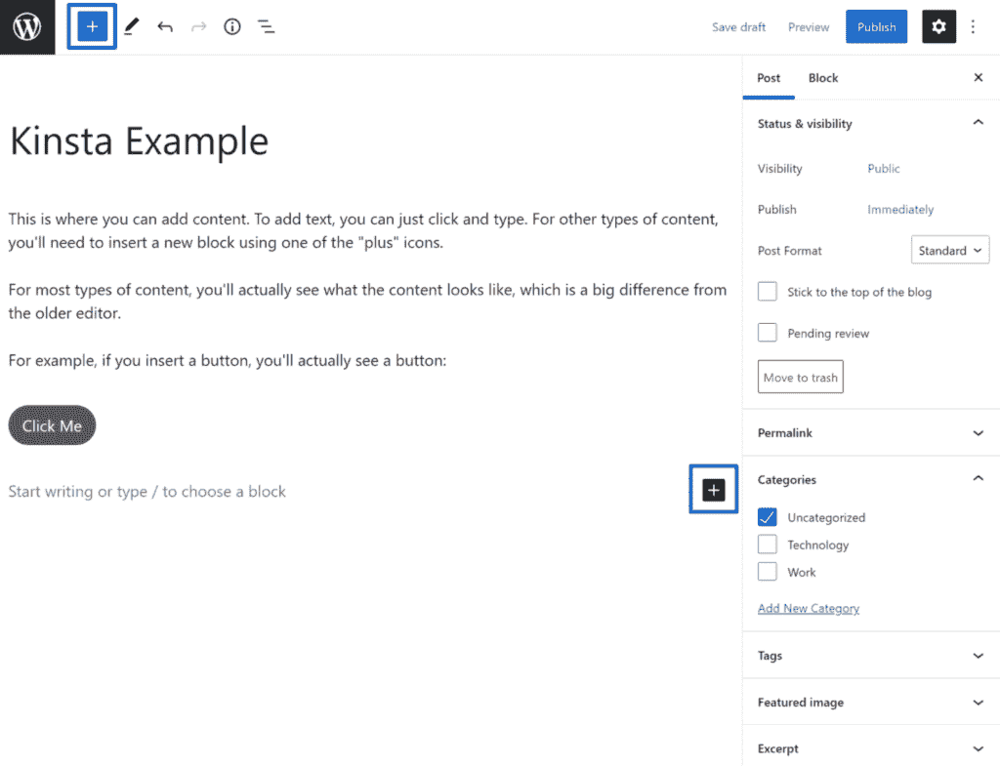

The “plus” icons let you insert a new block.

首先，将鼠标光标放在要插入新块的位置。例如，要在按钮下面添加一个新块，您可以单击按钮下面，然后单击 **+** 图标。

您应该看到一个侧面板，显示所有可用的块，分为不同的类别。您可以搜索特定的块，也可以从列表中选择一个选项。当您将鼠标悬停在某个块上时，您会看到它的功能描述和预览。

要插入块，你只需要点击它。例如，要插入常规的[图像](https://kinsta.com/blog/optimize-images-for-web/)，只需点击图像块:

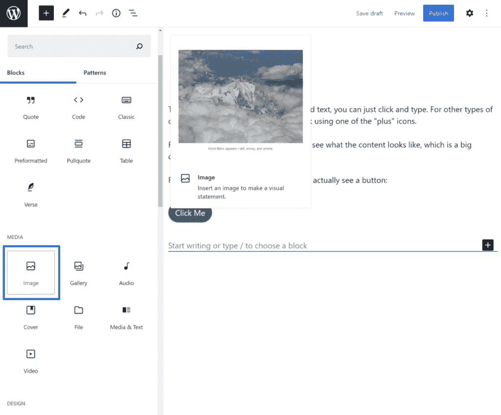

Click on the block type that you want to insert.

然后，您可以按照提示上传或从您的[媒体库](https://kinsta.com/blog/wordpress-media-library/)中选择现有图像。

### 基本格式选项

为了对你的块进行基本的格式选择，当你点击任何块时，你会得到一个浮动的工具栏。

如果您正在格式化常规文本，您可以在这里:

*   添加粗体或斜体
*   插入链接
*   更改对齐方式
*   添加格式，如内嵌代码、删除线和订阅

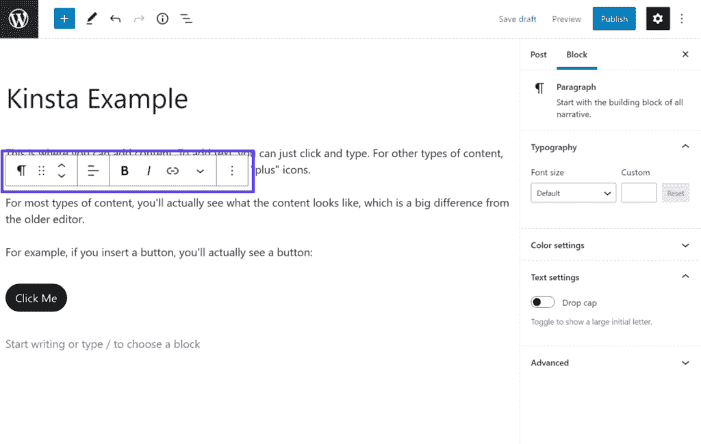

The floating toolbar lets you make basic formatting choices.

例如，假设您想在内容中插入一个链接。您首先要选择您想要链接的特定文本——在我们的例子中，这是“针对其他类型的内容”然后，您可以单击工具栏上的链接图标来打开链接插入选项:

Inserting a link in the Gutenberg WordPress block editor.

### 配置高级阻止设置

您插入的所有块都带有侧边栏中的附加设置。有些模块可能会给你一些设置，而其他模块会给你几个选项来控制[设计](https://kinsta.com/blog/web-design-best-practices/)，布局，功能等。

要打开某个块的设置，请在编辑器中单击该块将其选中。然后，转到侧边栏中的**块**选项卡，查看其设置。

下面，您可以看到按钮块的设置，这是一个更灵活的块。你可以改变颜色，让它更宽，等等。

当您更改块的设置时，您会立即看到这些更改反映在编辑器中。

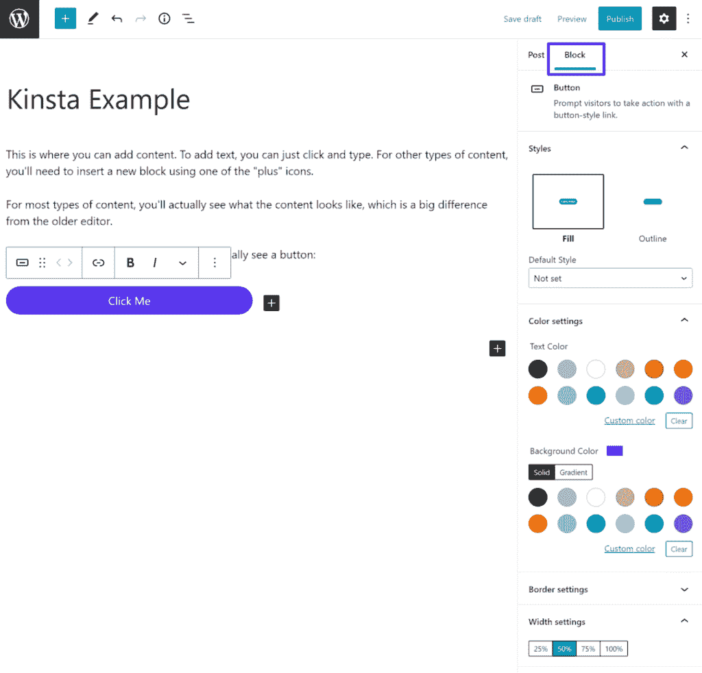

You can access a block’s settings in the sidebar.

同样，每个块都有该块独有的设置。例如，如果你打开常规段落文本的设置，你只是得到一些基本的[排版](https://kinsta.com/blog/modern-fonts/)和颜色选项。下面，您可以看到我们能够应用颜色背景来突出显示一些文本:

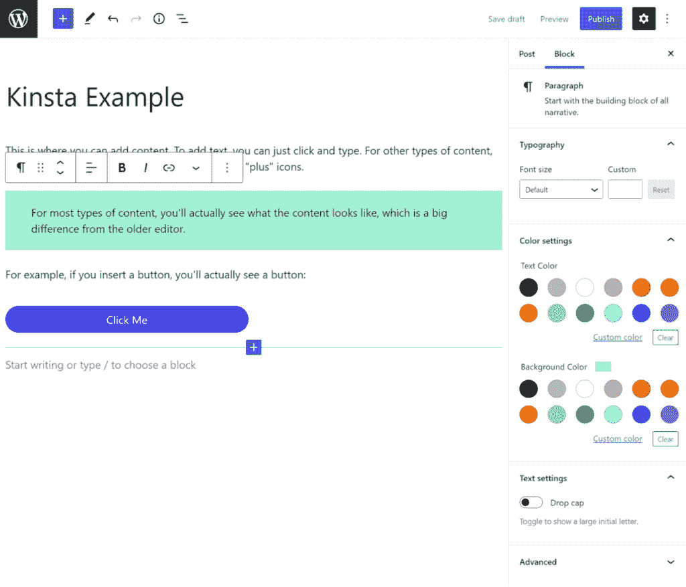

The block settings for a regular paragraph text.

### 重新排列块

除了使用复制和粘贴(可以像其他编辑器一样对文本进行复制和粘贴)，Gutenberg 还提供了两种主要的方法来重新排列块。

首先，如果您想将一个块向上或向下移动几个位置，可以使用浮动工具栏上的向上或向下箭头。

对于大范围的移动，您可以使用拖放。要拖放块，你需要点击箭头左边的“六点”图标。

单击并按住图标后，您可以将块拖动到页面上的任何位置:

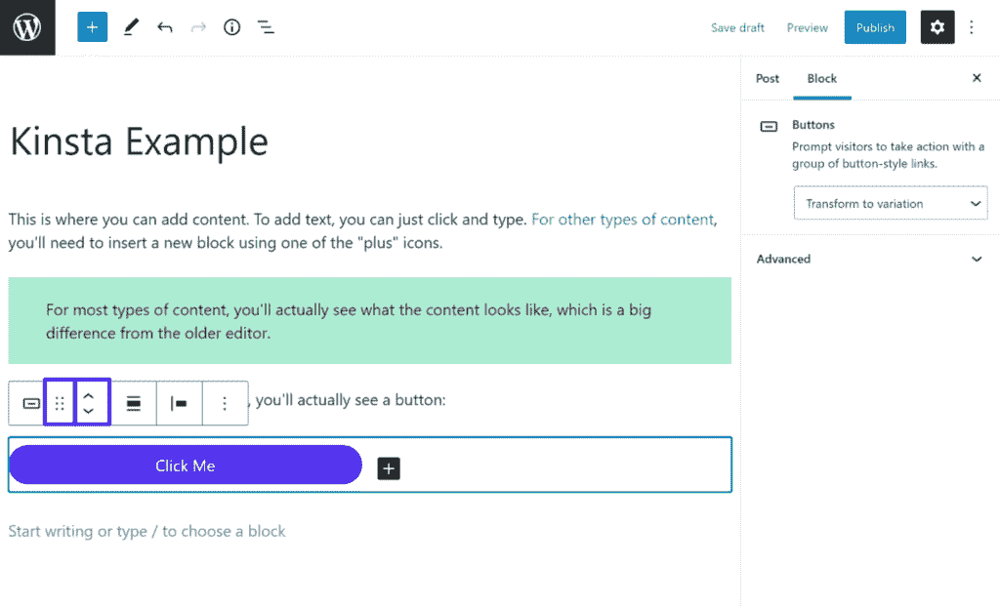

You can rearrange blocks using the arrows or drag-and-drop.

### 重要的

对于非文本内容，复制和粘贴可能会很棘手。稍后在这篇文章中，我们将向您展示如何复制和粘贴整个块，同时保留它们的样式。

### 嵌入来自其他来源的内容

Gutenberg 提供了专门的块来嵌入来自第三方来源的内容，如 YouTube、Vimeo、Soundcloud 等。您可以在块插入器的**嵌入**部分找到所有这些选项。

例如，要[嵌入 YouTube 视频](https://kinsta.com/blog/embed-youtube-video-wordpress/)，您需要做的就是:

1.  添加专用的 YouTube 块。
2.  粘贴视频的直接网址。
3.  点击**嵌入**。

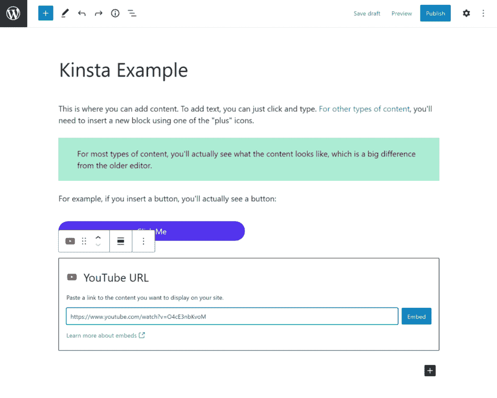

Embedding a YouTube video in Gutenberg.

然后，您应该会在编辑器中看到嵌入视频的预览。

### 创建多栏或成组布局

正如我们前面提到的，块编辑器相对于老式 TinyMCE 编辑器的一个显著优势是，您可以创建更复杂的布局，而不需要依赖于[自定义代码](https://kinsta.com/knowledgebase/edit-wordpress-code/#css)或短代码。

块编辑器附带了两个默认块来帮助您完成此操作:

*   **列**:创建多栏布局。
*   **分组:**分组多个块。例如，您可以使用它来设置显示在许多块后面的整个部分的背景颜色。

这两个块的工作原理都是“嵌套”块，这意味着你将把一个或多个块*放在另一个块*的内部。

我们将向您展示一个使用 columns 块的示例，但是相同的基本原理也适用于 group 块。

假设您想要创建一个两列布局，其中左边的列有一些常规段落文本，右边的列有一个按钮。

首先，您将使用块插入器来添加列块。这将显示一个提示，您可以在其中选择您的首选布局:

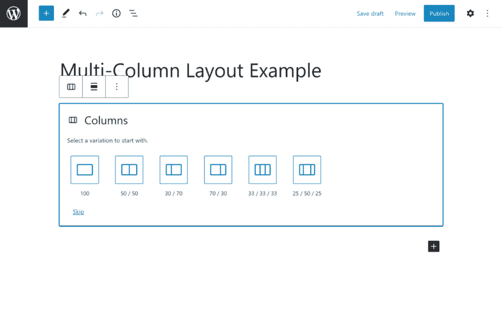

Choose the column structure and ratio.

在这个例子中，我们将选择两列 50/50 布局。这样，你会看到两个大小相等的盒子，里面有 **+** 图标。要插入内容，可以点击 **+** 图标，打开插件界面:

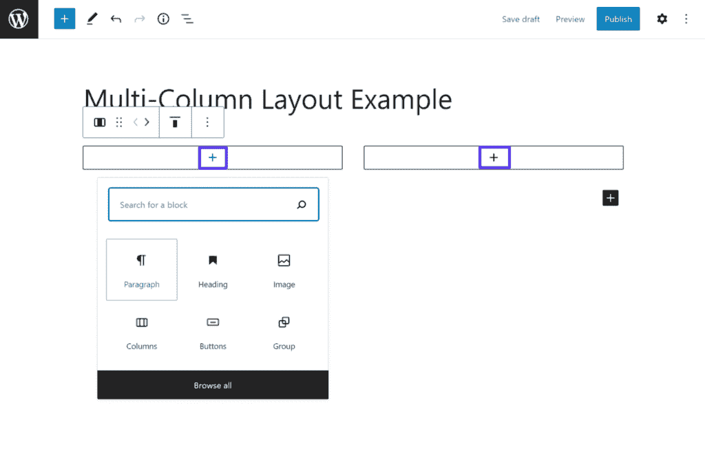

How to add content to the columns.

一旦将第一个块添加到列中，就可以点击 **+** 图标来插入更多的块。或者，可以将块从柱结构外部拖放到柱中。
T3】

## 提高工作效率的 10 个有用的古腾堡建议

现在，您已经对 Gutenberg 的工作原理有了基本的了解，让我们来看一些有价值的提示和技巧，它们将帮助您更有效地使用块编辑器。

### 1.使用 **`/`** (正斜杠)快速插入块

如果您需要插入许多块，手动打开块插入器可能会有点乏味。值得庆幸的是，一旦你开始学习你需要使用的公共块的名字，有一个更快的方法只使用你的键盘来插入块——**`/`**(正斜杠)。

如果您按“Enter”开始一个新的段落块，您可以通过键入一个正斜杠，后跟您想要插入的块的名称来快速插入一个块。

当您开始输入时，您将看到与您的查询匹配的所有块的列表。然后，您可以使用键盘箭头来导航块，并点击“Enter”来选择您想要插入的块。

以下是使用快速插入添加图像块的示例:

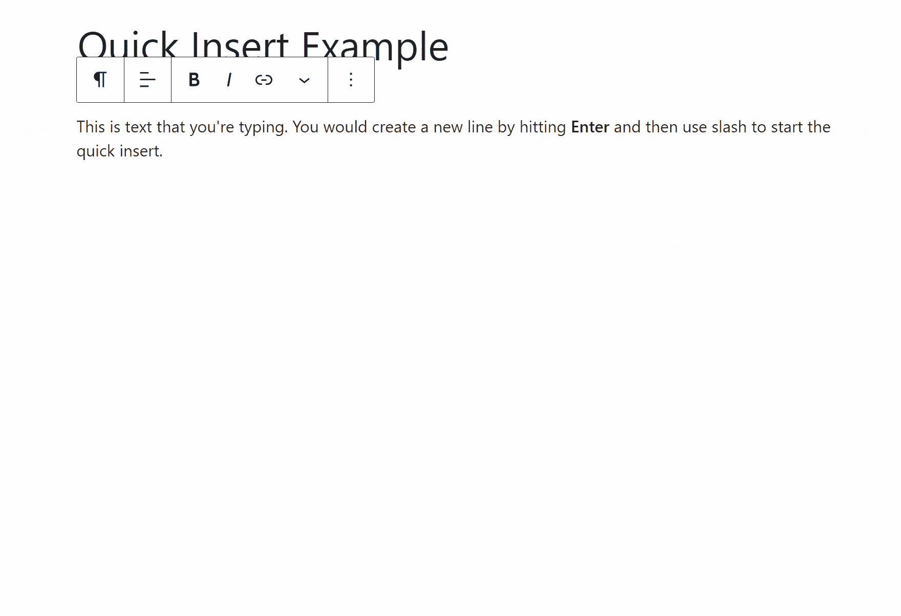

How to use the forward slash to quick-insert blocks.

### 2.通过从桌面拖动图像来插入图像

如果您正在插入许多图像，块编辑器包括另一个节省时间的功能，让您无需在[上传图像](https://kinsta.com/knowledgebase/bulk-upload-files-wordpress-media-library-ftp/)之前添加图像块。

相反，你可以直接把图片文件从你的桌面拖到你想把它添加到文章中的位置。当您将图像文件拖到站点内容上时，您会看到一条蓝色的线标记图像显示的位置。

一旦你发布了文件，WordPress 会自动上传并在适当的位置插入一个图片块:

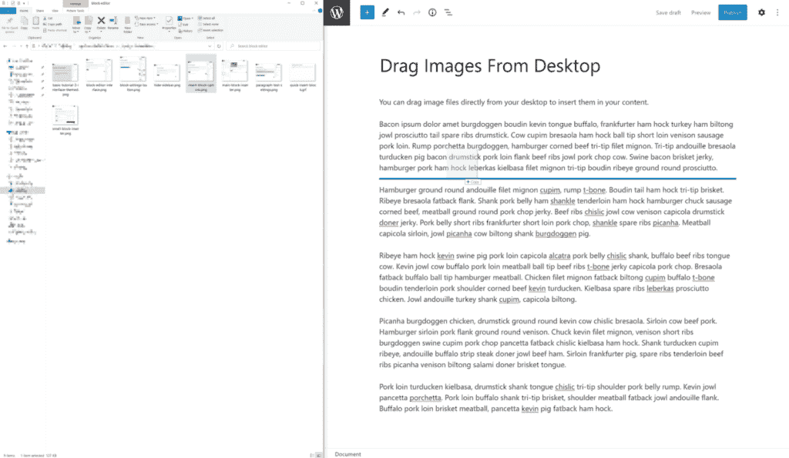

You can insert images by dragging the file from your desktop.

### 3.使用一些降价格式

如果你是创建内容的 Markdown 语法的粉丝，你会很高兴地知道块编辑器确实支持对 [markdown](https://kinsta.com/blog/markdown-editor/) 的一些有限使用——主要用于标题。

## 注册订阅时事通讯

### 想知道我们是怎么让流量增长超过 1000%的吗？

加入 20，000 多名获得我们每周时事通讯和内部消息的人的行列吧！

[Subscribe Now](#newsletter)

例如，如果要插入带有 H3 标签的标题块，可以键入三个标签(`### `)，然后按空格键。编辑器会自动将其转换为 H3，然后您可以继续键入标题:

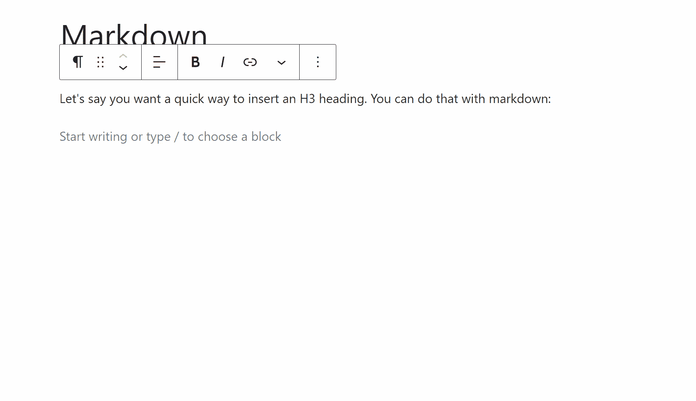

The block editor supports basic Markdown syntax for headings.

假设您想要更高级的降价支持。在这种情况下，你可以安装一个像 [EditorsKit](https://wordpress.org/plugins/block-options/) 这样的免费插件，它也可以让你对粗体、斜体和删除线使用 Markdown 我们稍后会在这篇文章中更多地讨论 Gutenberg 插件。

### 4.将格式工具栏固定在编辑器的顶部

如果您不喜欢格式化工具“浮动”在块上方的方式，块编辑器包括一个功能，可让您将其固定在顶部工具栏下方:

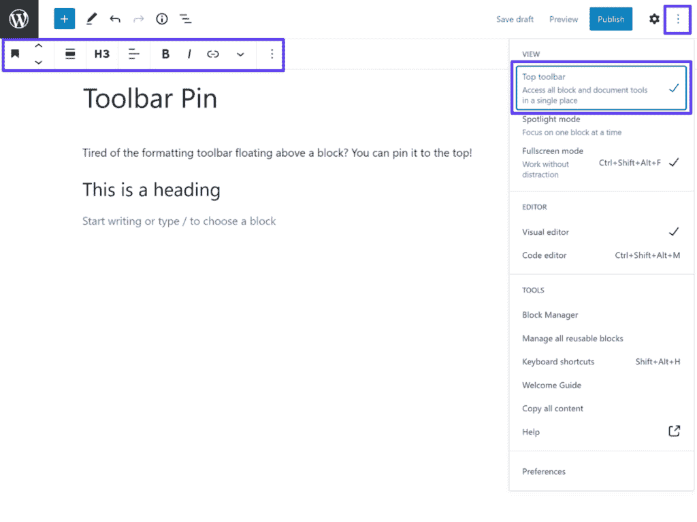

You can pin the formatting toolbar to the top.

### 5.复制块及其所有设置

块编辑器允许您复制和粘贴文本，就像在任何编辑器中一样—“**Ctrl**+**C**”或者右键单击并选择**复制**。

但是，您不能使用此方法复制和粘贴整个块，同时保留其设置。相反，您需要:

1.  选择该块。
2.  单击块工具栏上的三点图标。
3.  选择**复制**。

How to copy a block with all of its settings.

一旦你以这种方式复制了这个块，你就可以像平常一样粘贴它了——即“T0”Ctrl+**V**或者右击并选择**粘贴**。

### 6.使用块列表视图快速选择正确的块

对于大多数块，您只需点击编辑器来选择块。然而，如果您开始使用“嵌套”块，比如在列或组块中插入块，这可能会变得棘手。

编辑器包括一个[列表视图](https://kinsta.com/blog/wordpress-5-8/#persistent-list-view-in-the-post-editor)选项，你可以从顶部工具栏打开它来解决这个问题。列表视图将显示每个块，包括缩进的嵌套块。

您可以通过单击列表中的块来选择它，当您将鼠标悬停在列表中的块上时，编辑器也会高亮显示该块。

在下面的示例中，您可以看到:

*   主父列块
*   每列的嵌套块
*   一列中的嵌套组块
*   组块中的嵌套标题块

要选择主父块，只需打开列表视图并从列表中选择它:

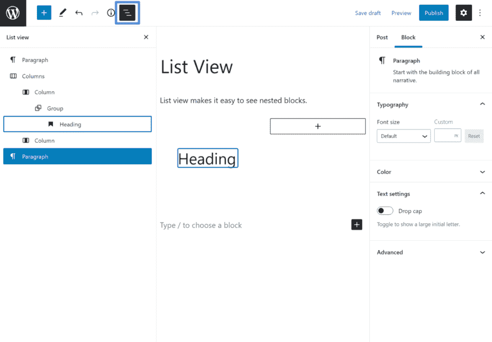

Opening List View helps you navigate nested blocks.

### 7.打开代码编辑器(针对单个块或完整的帖子)

古腾堡块编辑器的优势之一是，它允许您配置许多样式和布局选项，而无需求助于代码。然而，在某些情况下，对于更高级的用户来说，您可能仍然希望直接访问代码。

为了帮助你做到这一点，古腾堡编辑器提供了几个不同的选项。

首先，您可以只编辑单个块的代码，这对于插入 CSS 类这样的小调整很有用。为此，从块的工具栏打开下拉菜单并选择**编辑为 HTML** :

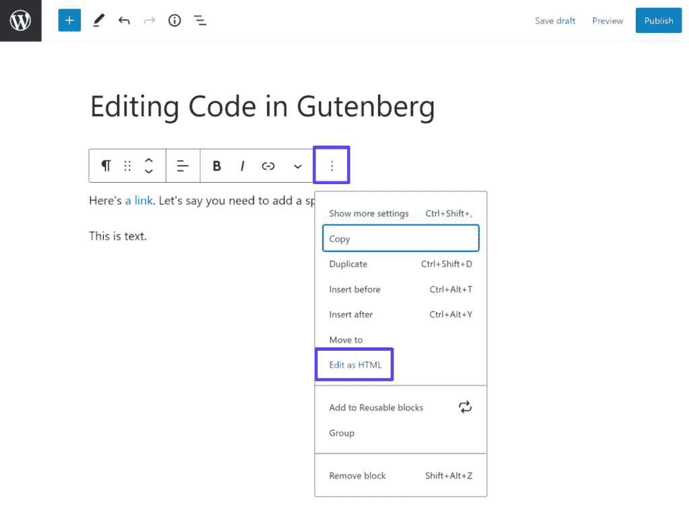

How to edit a single block as HTML.

选择此选项会将可视预览转换为该块的代码编辑器，而不会影响其他块的可视预览:

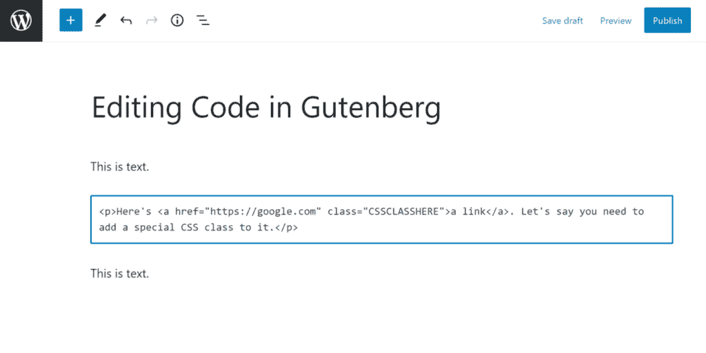

The HTML editor for a single block.

其次，编辑器包括一个定制的 [HTML](https://kinsta.com/blog/html-vs-html5/) 块，您可以使用它来嵌入完整的 HTML 片段。你所要做的就是添加代码块并粘贴到你的代码中。

最后，您还可以使用右上角的下拉菜单或键盘快捷键打开整个文档的完整代码编辑器:**Ctrl**+**Shift**+**Alt**+**M**。

请记住，当您打开完整的代码编辑器时，您还会看到来自 Gutenberg 的块格式标记，因此导航起来可能有点棘手:

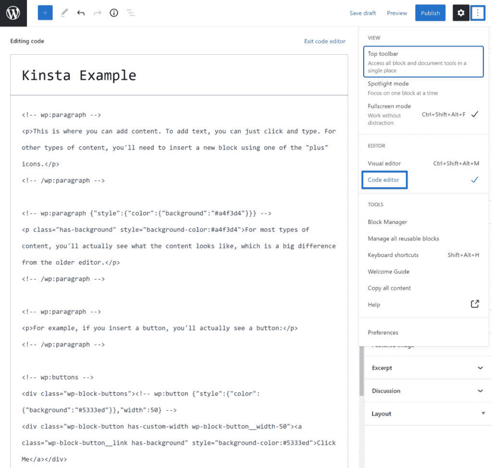

The full code editor, which includes the block markup.

### 8.学习键盘快捷键

块编辑器包括许多[键盘快捷键](https://kinsta.com/blog/wordpress-keyboard-shortcuts/)，让你执行常见的动作。花时间去学习它们是值得的，因为它们会让你更有效率，让你免于重复点击鼠标。

以下是一些最常见的快捷键——如果你用的是 Mac，你会想把“Ctrl”换成“Command (⌘)":

*   打开封锁列表视图—**Shift**+**Alt**+**O**
*   保存您的更改— **Ctrl** + **S**
*   撤消您的最后一次更改— **Ctrl** + **Z**
*   重做你上一次的撤销—**Ctrl**+**Shift**+**Z**
*   复制选中的块—**Ctrl**+**Shift**+**D**
*   删除选中的块—**Shift**+**Alt**+**Z**
*   在所选块之前插入一个新块—**Ctrl**+**Alt**+**T**
*   在所选块后插入一个新块—**Ctrl**+**Alt**+**Y**

当你在编辑器中时，你也可以打开所有键盘快捷键的完整备忘单。为此，您可以使用键盘快捷键— **Shift + Alt + H** —或者单击编辑器右上角的“三个垂直点”菜单图标( **⋮** )并从下拉菜单中选择**键盘快捷键**。

### 9.通过隐藏块来清理你的界面

默认情况下，块编辑器会添加许多块，但是您可能不会使用所有的块。为了帮助你清理界面，编辑器包含了一个名为**块管理器**的特性，可以让你禁用和隐藏不使用的块:

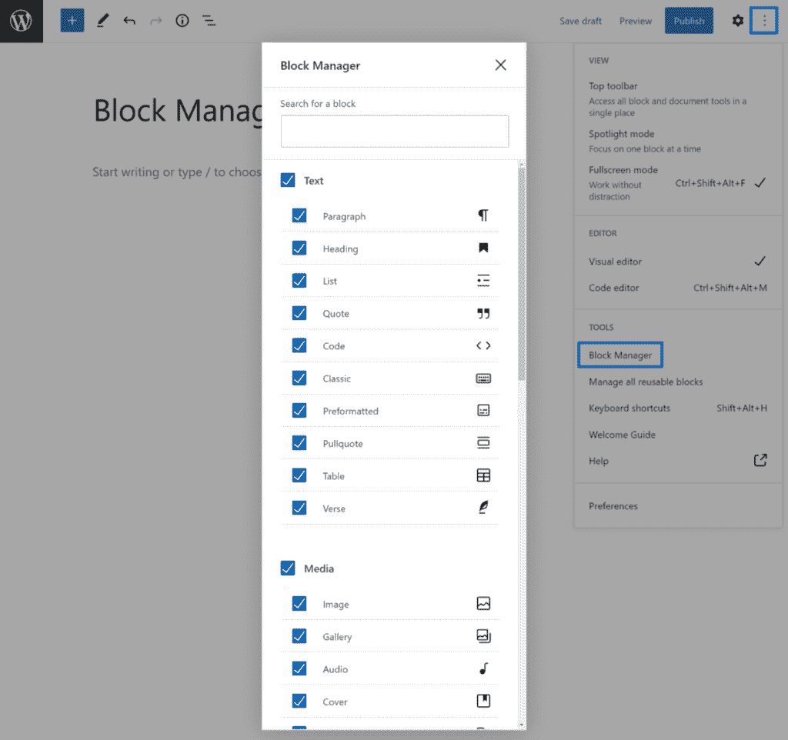

You can uncheck blocks to hide them from the block inserter.

### 10.为跳转链接添加锚点

最后，我们最后一个有用的技巧是块编辑器专用的 HTML 锚链接特性，它让你[创建到你的内容](https://kinsta.com/blog/anchor-links/)的特定部分的跳转链接(例如目录)。

需要一个给你带来竞争优势的托管解决方案吗？Kinsta 为您提供了令人难以置信的速度、一流的安全性和自动伸缩功能。[查看我们的计划](https://kinsta.com/plans/?in-article-cta)

在经典编辑器中，您必须使用代码手动添加 HTML 锚。但是有了 Gutenberg，你可以在任何区块设置的**高级**区域的 **HTML 锚**字段中输入跳转链接的文本:

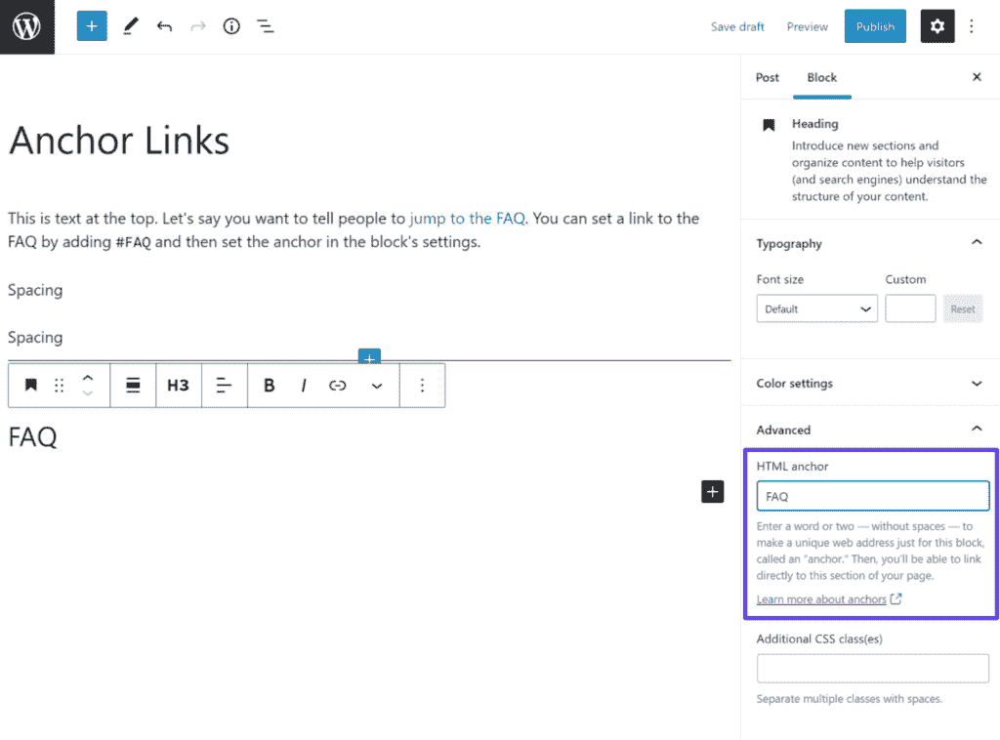

How to set a custom anchor text.

## 深入了解更高级的块编辑器概念

至此，我们已经介绍了相当多的关于编辑器如何工作的内容，以及一些提高工作效率的技巧。现在您已经有了基本的知识，让我们来看两个稍微高级一点的策略:

*   块状图案
*   可重复使用的块

### 块状图案

一个[块模式](https://kinsta.com/blog/wordpress-5-5/#block-patterns)本质上是一个模板。它是排列成一个布局的块的集合。可能是一些小事情，比如按钮的排列。它甚至可以是整个部分的模板，甚至是整个页面的模板。

WordPress 自带内置的 block 模式，第三方插件开发者也可以添加他们自己的。

您可以从主插页器的**图案**选项卡插入新图案:

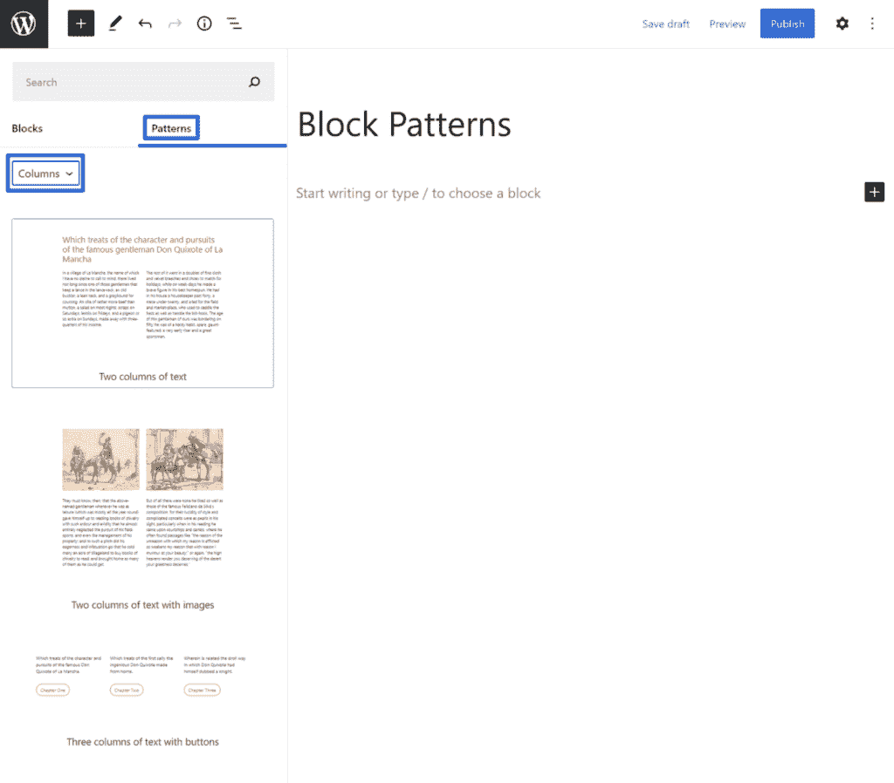

How to insert a block pattern.

插入块图案后，您可以完全编辑组成该图案的所有块，就像手动添加块一样。

目前，核心 Gutenberg 编辑器不允许您创建您的块模式(除非您知道如何编码)。然而，你可以用 Justin Tadlock 的免费[块模式生成器插件](https://wordpress.org/plugins/block-pattern-builder/)来解决这个问题。激活插件后，你可以使用 Gutenberg 创建你的设计，然后将设计保存为图案。

首先，进入**模块模式** > **添加新的**，使用编辑器创建一个新的模式。完成后，请务必发布它:

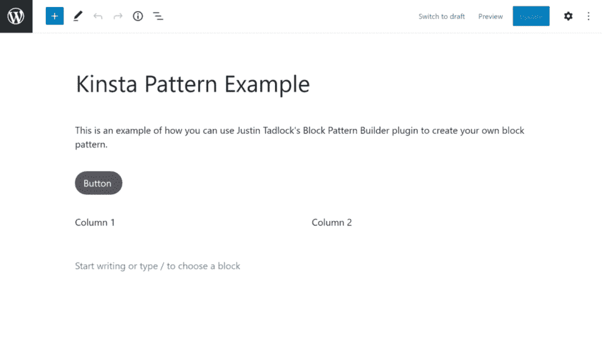

Creating your custom block pattern.

完成后，您就可以像插入任何其他图案一样插入您的积木图案了——在**未分类的**部分寻找它:

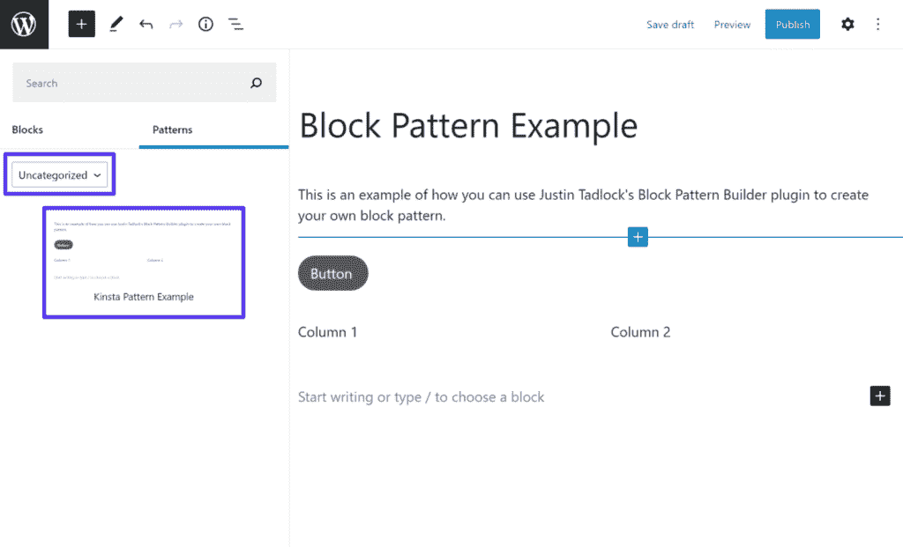

Inserting the custom block pattern that you created.

WordPress 核心团队还在 WordPress.org 发布了[官方区块模式库。您可以使用复制和粘贴将它们插入编辑器中。只需点击版型库网站上的**复制**按钮，然后粘贴到编辑器中即可。](https://wordpress.org/patterns/)

### 可重复使用的块

[可重用模块](https://kinsta.com/blog/wordpress-5-8/)是一个或多个模块的集合，可以作为一个组插入。它们类似于块模式，但有一个关键区别:

块模式是您将在每个实例中编辑的起始模板，而可重用块在您包含它的每个实例中都是相同的。

如果更新可重用块，这些更改将自动应用于所有现有实例。

例如，您可以使用一个可重用的块来创建一个行动号召(CTA ),您希望它在所有内容中都是相同的。然后，如果您想要更新 CTA，您只需要更新可重用块一次，就可以在整个站点中更改它。

要在 Gutenberg WordPress 编辑器中创建一个可重用的块，单击并拖动选择一个或多个块。然后，点击**添加到可重用模块**选项。(我们上面提到的插件也可以让你用这种方式创建方块图案。)

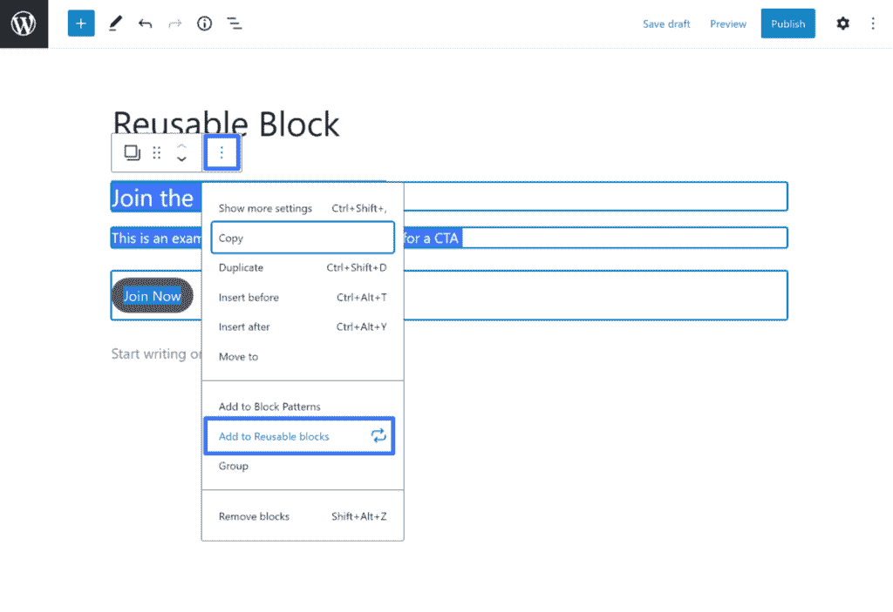

How to create a reusable block.

然后，您的块将被分组，您可以在侧栏的可重用块设置中为您的可重用块命名。

现在，您将能够通过搜索其名称来插入该可重用块。您可以使用`/'快速插入块:

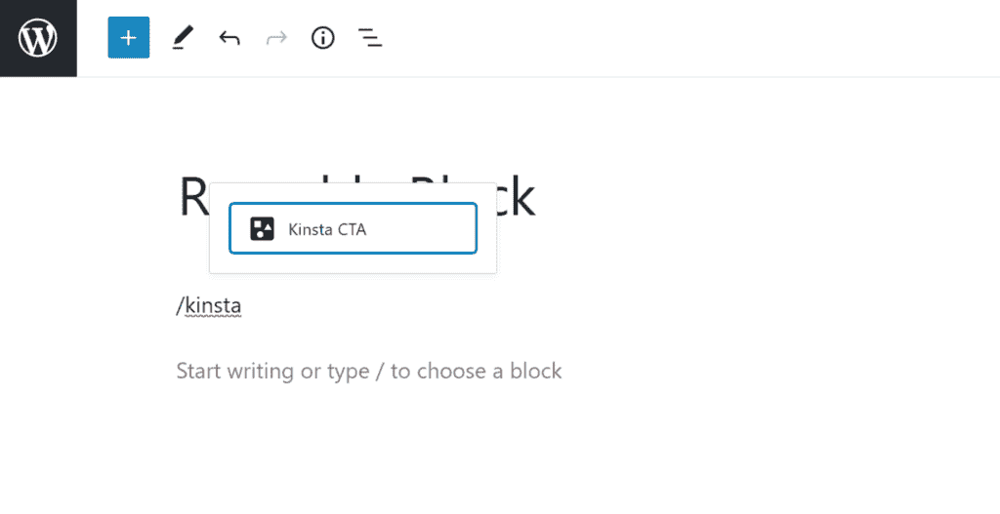

How to insert a reusable block.

如果您更改了可重用块，您可以选择在更新帖子时发布这些更改。如果您决定发布可重用块的更改，这些更改将自动应用到可重用块的每个实例:

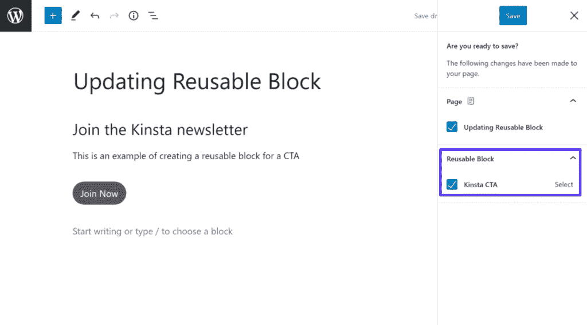

How to update a reusable block.

## 用插件扩展块编辑器

到目前为止，除了少数例外，我们一直关注核心块编辑器功能。

不过，block editor 最棒的一点是，你可以使用插件来扩展它，就像你可以使用 WordPress 站点的其他部分一样。

您可以使用插件做一些不同的事情:

*   **添加新的内容块:**插件可以添加您可以在设计中使用的新内容块。这是目前 Gutenberg 插件最常见的用例。
*   **添加新的模板/块模式:**有些插件使用了核心块模式系统，有些则创建了自己的模板系统。
*   **改变编辑器界面/特性**:可以使用插件修改编辑器本身。例如，您可以添加更好的降价支持。

除了专门为 Gutenberg 构建的插件，许多其他 WordPress 插件也可以使用 block editor。

例如，如果你正在使用一个联系人表单插件，这个插件可能会给你一个专用的块，你可以用它来嵌入你的表单。许多其他类型的插件也是如此。

一旦你掌握了编辑器的基础知识，就值得探索这些插件，看看你是否能找到任何可以改善你的体验的插件。

以下是我们写这篇文章时一些最受欢迎的选择:

*   古腾堡终极插件
*   [卡登斯块](https://wordpress.org/plugins/kadence-blocks/)
*   [生成块](https://wordpress.org/plugins/generateblocks/)
*   [可堆叠](https://wordpress.org/plugins/stackable-ultimate-gutenberg-blocks/)
*   [Getwid](https://wordpress.org/plugins/getwid/)

你可以在[WordPress.org 阻止启用插件部分](https://wordpress.org/plugins/browse/blocks/)看到更多。

## 古腾堡 WordPress 编辑器和全网站编辑

正如我们在本文开头提到的，Gutenberg 项目的目标不仅仅是一个内容编辑器。

长期计划是让 WordPress 进入**全网站编辑**。它的意思就是它所说的——目标是你最终能够使用古腾堡编辑器编辑你的网站的所有部分。这包括你网站的页眉、页脚、边栏等。

与 WordPress 5.0 中的 block editor 不同，完整的站点编辑采用了一种迭代的方法。这将是一个逐渐增加的功能，每个新版本都建立在以前的基础上。

例如，[从 WordPress 5.8](https://kinsta.com/blog/wordpress-5-8/) 开始，你现在将使用块编辑器来管理你站点的小部件。您还可以访问一些新的主题块，如站点徽标、导航、查询循环(允许您为列表帖子创建模板)等等。

但是，尽管官方的全站点编辑仍在进行中，一些勇敢的主题开发者已经开始发布基于块的主题，这给了我们一些关于全站点编辑如何工作的很好的例子。

此外，你可以在 Gutenberg 的插件版本[中访问一些实验性的完整站点编辑功能。](https://wordpress.org/plugins/gutenberg/)

所以，让我们来看两件事:

1.  从 WordPress 5.8 开始，现有的核心全站点编辑功能
2.  基于实验特征的“完全”全站点编辑可能如何工作

### 重要的

到全网站编辑成为主流的时候，所有这些都可能发生或大或小的变化。只是给你一个大概的概念。

### 使用块而不是小部件

从 WordPress 5.8 开始，你将使用块来控制你的[侧边栏](https://kinsta.com/blog/wordpress-register-sidebar/)和页脚，而不是小部件(默认情况下——如果你愿意，你可以禁用它)。

当你进入**外观** > **微件**时，你将能够使用块编辑器管理每个微件区域的内容。

您可以看到每个小部件区域都有一个单独的编辑器，您可以通过单击折叠开关来打开它。您还可以通过单击顶部附近的钩形箭头图标在不同的小部件区域之间移动块:

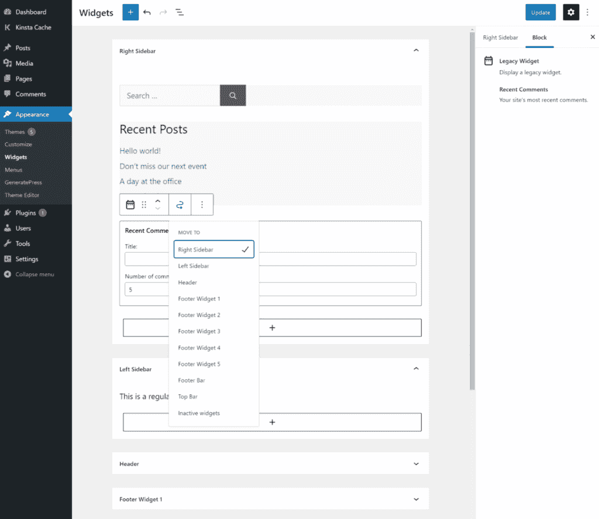

Using blocks to edit widget areas.

### 使用新的主题块

WordPress 5.8 还增加了新的专用主题块，可以让你在网站中插入动态内容。当你在未来的版本中为你的主题设计模板时，这些模块也将扮演一个关键的角色。

例如，假设您想要在页面上嵌入一个最近内容的列表。现在，您只需添加查询循环块，就可以动态地插入来自特定的[文章类型](https://kinsta.com/blog/wordpress-custom-post-types/)(例如博客文章)的内容，包括按类别、作者、关键字等进行过滤:

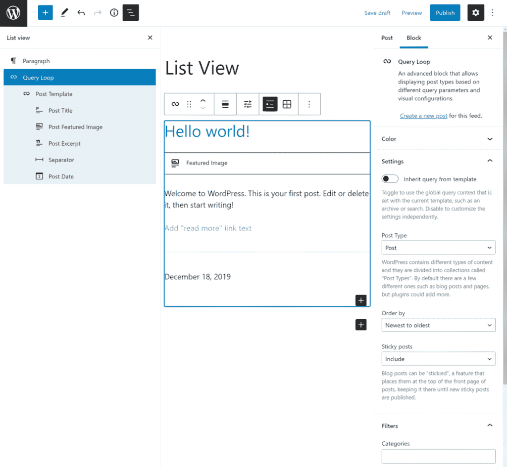

Using the Query Loop block to display dynamic content.

在查询循环块中，可以嵌套其他主题块来控制显示内容的模板。例如，您可以通过在模板中添加帖子日期块来显示每个帖子的日期。

使用 WordPress 5.8 中的查询循环块，你可以设计你自己的博客列表页面。适当的全站点编辑会扩展到你的整个主题——所以接下来让我们看看。

### 设计内容模板

模板编辑模式是 WordPress 5.8 的另一个新特性。它允许你使用 Gutenberg 来设计你的文章和页面的模板。

目前，这个特性只有在你的主题开发者特别启用它的情况下才可用，所以如果你的主题开发者还没有这样做，你可能看不到它。

如果你*使用的*主题支持 WordPress 5.8 中的模板编辑模式，当你编辑一篇文章或页面时，你会在侧边栏的**文章/页面**标签中看到一个新的**模板**部分。您可以创建一个新模板或选择一个现有模板:

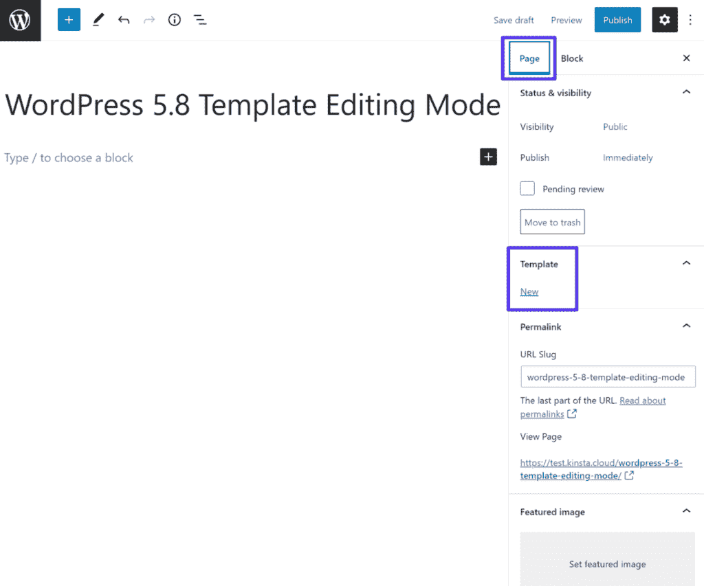

Creating a new template in themes supporting Template mode.

如果你创建了一个新的模板，你可以给它一个名字来帮助你记住它。然后，您可以使用特殊的模板编辑器模式设计模板，以及我们在上一节中详述的新主题块:

The new template editor in WordPress 5.8.

### Blockbase 全站点编辑示例

Blockbase 是 Automattic 的一个主题，作为一种“概念验证”和完整站点编辑的平台。它仍然是实验性的，所以在这些功能出现在核心 WordPress 软件之前，它可能会改变。但是它提供了一个完整站点编辑的概念。

安装了主题和 Gutenberg 的插件版本后，你会得到一个新的**站点编辑器**区域，让你使用上面看到的编辑器“构建”你的主题。

然而，最关键的区别在于，你不仅仅是在创建一篇文章或一个页面。相反，您使用 Gutenberg WordPress 块编辑器来创建所有站点内容都将使用的实际模板——例如，您的标题模板。

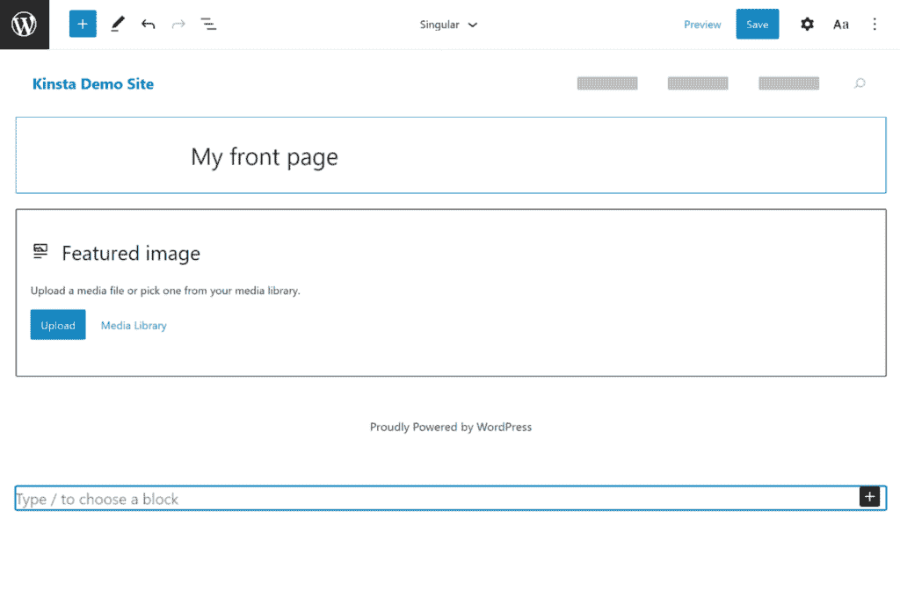

An early example of Full Site Editing.

为了帮助您实现这一点，您将获得一系列新的设计模块，包括您在上面看到的一些主题模块:

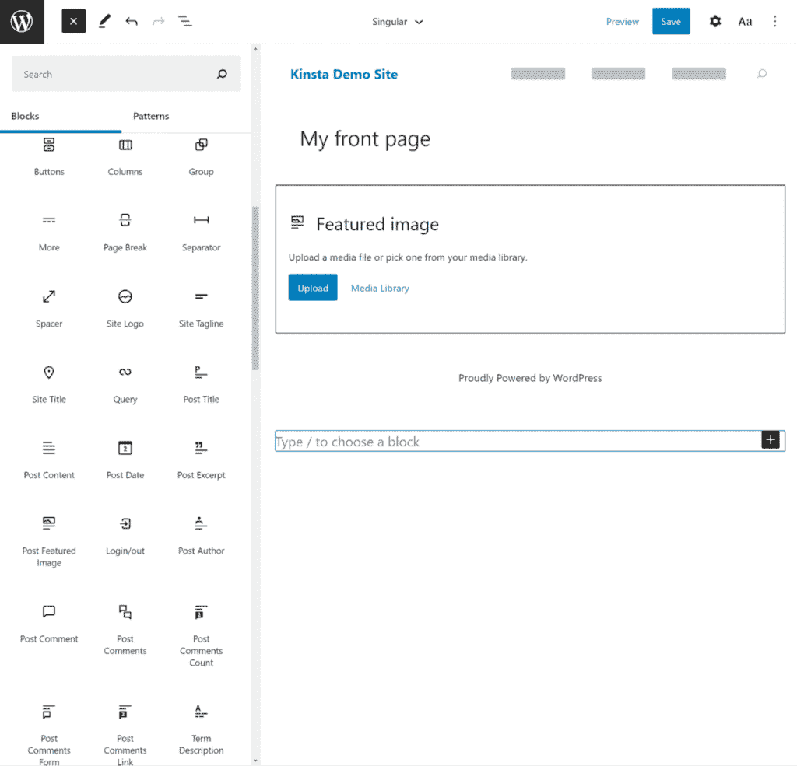

The new design blocks with Full Site Editing.

要在不同的模板之间导航，你可以点击左上角的 WordPress 标志来编辑其他模板和创建新的模板:

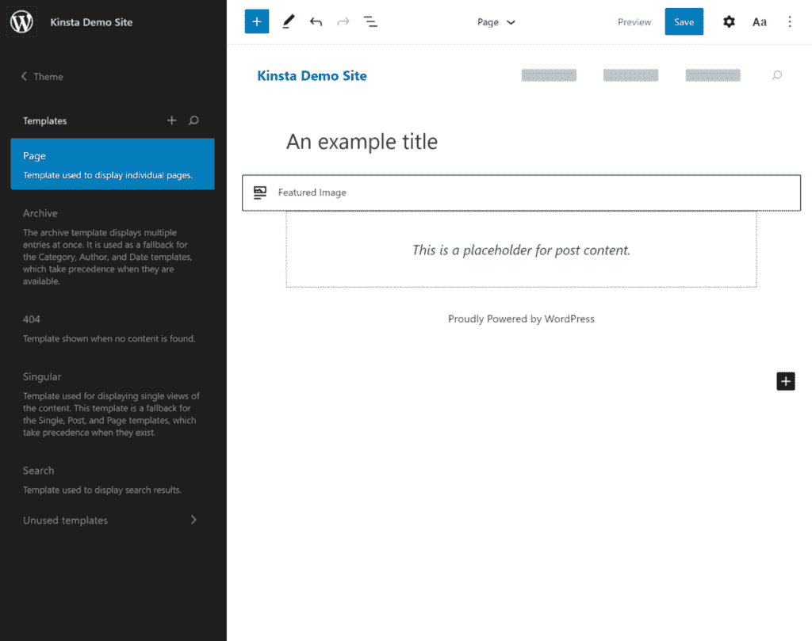

Editing different theme templates.

同样，这个想法是你将*最终*能够使用古腾堡编辑器来控制你的主题的所有模板/布局。当这种情况发生时，创建一个 WordPress 网站将会与我们在 2021 年认为的“正常”大不相同。

[自古腾堡计划启动以来的两年多时间里，已经发生了很多变化，未来还会有更多变化！😲看看这个指南，看看未来几个月和几年将会发生什么👀](https://twitter.com/intent/tweet?url=https%3A%2F%2Fkinsta.com%2Fblog%2Fgutenberg-wordpress-editor%2F&via=kinsta&text=In+the+2%2B+years+since+the+launch+of+Gutenberg%2C+much+has+changed%2C+and+there%27s+still+more+to+come%21+%F0%9F%98%B2+Check+out+this+guide+to+see+what%27s+coming+in+the+months+and+years+ahead+%F0%9F%91%80&hashtags=Gutenberg%2CWordPress)

## 摘要

自 2018 年以来，古腾堡块编辑器取得了很多进展。随着即将到来的全站点编辑，块编辑器只会成为 [WordPress](https://kinsta.com/blog/wordpress-statistics/) 更重要的一部分。

在这篇文章中，我们涵盖了从块编辑器基础到高级提示和功能的所有内容。我们还研究了未来完整的网站编辑可能会是什么样子。

如果你还没有准备好尝试它，你可以永久禁用古腾堡和使用经典编辑器。然而，古腾堡将继续增长，所以这不是你想永远忽视的东西。

你对编辑还有什么问题或想法吗？如果是这样，我们很想听听你的意见，好的和坏的。

* * *

让你所有的[应用程序](https://kinsta.com/application-hosting/)、[数据库](https://kinsta.com/database-hosting/)和 [WordPress 网站](https://kinsta.com/wordpress-hosting/)在线并在一个屋檐下。我们功能丰富的高性能云平台包括:

*   在 MyKinsta 仪表盘中轻松设置和管理
*   24/7 专家支持
*   最好的谷歌云平台硬件和网络，由 Kubernetes 提供最大的可扩展性
*   面向速度和安全性的企业级 Cloudflare 集成
*   全球受众覆盖全球多达 35 个数据中心和 275 多个 pop

在第一个月使用托管的[应用程序或托管](https://kinsta.com/application-hosting/)的[数据库，您可以享受 20 美元的优惠，亲自测试一下。探索我们的](https://kinsta.com/database-hosting/)[计划](https://kinsta.com/plans/)或[与销售人员交谈](https://kinsta.com/contact-us/)以找到最适合您的方式。