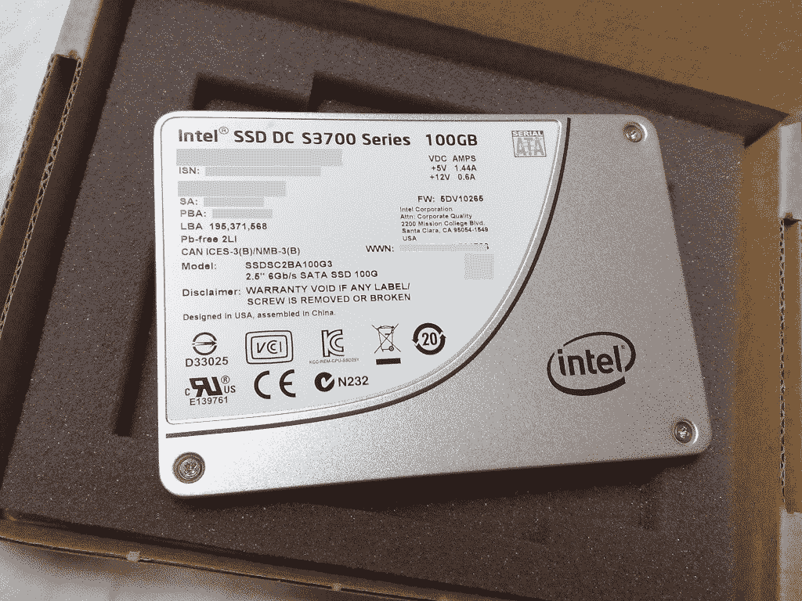
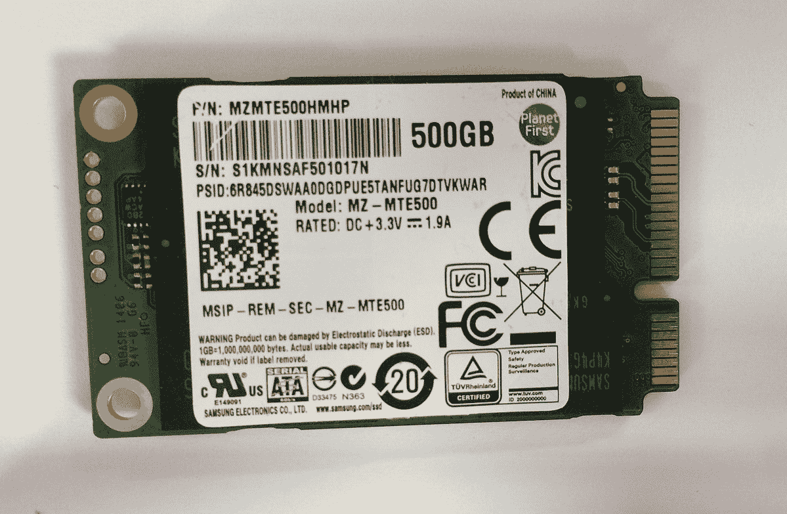
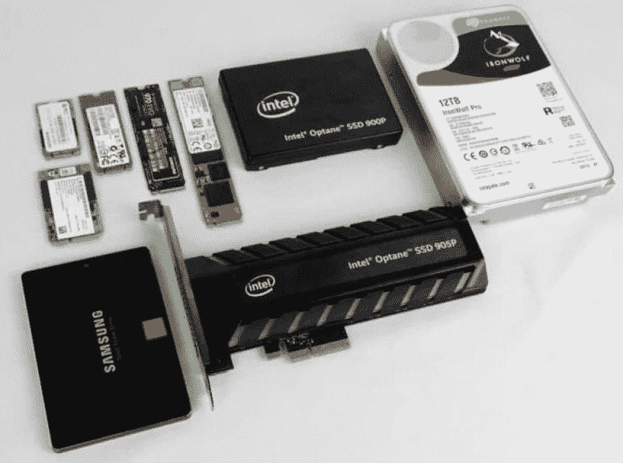

# SSD 是什么？关于固态存储，你需要知道的一切

> 原文：<https://kinsta.com/blog/what-is-ssd/>

如果你想知道，“什么是固态硬盘？”不过不太了解，你来对地方了。固态硬盘(SSD)是一种存储设备，允许在没有恒定电源的情况下永久读取、写入和存储数据。

SSD 与硬盘驱动器(HDD)有何不同？哪个更好？您如何根据自己的需求选择合适的固态硬盘？

在本指南中，我们将帮助您了解什么是固态硬盘，固态硬盘和硬盘的区别，固态硬盘的各种类型，以及如何选择最佳固态硬盘。

继续读！

## 固态存储(SSD)的历史

A 2.5-inch bay SSD. (Image source: [Dsimic](https://commons.wikimedia.org/wiki/File:Intel_DC_S3700_SSD_series,_top_side_of_a_100_GB_SATA_3.0_model.jpg), via Wikimedia Commons)

你知道 SSD 存储及其发展的漫长旅程始于 20 世纪 50 年代吗？

没错，就是那么老！

> Kinsta 把我宠坏了，所以我现在要求每个供应商都提供这样的服务。我们还试图通过我们的 SaaS 工具支持达到这一水平。
> 
> <footer class="wp-block-kinsta-client-quote__footer">
> 
> 
> 
> <cite class="wp-block-kinsta-client-quote__cite">Suganthan Mohanadasan from @Suganthanmn</cite></footer>

[View plans](https://kinsta.com/plans/)

当时，他们通过两种类似的技术在第一代计算机([真空管计算机](https://en.wikipedia.org/wiki/Vacuum_tube_computer))中使用它们:*卡容量只读存储器*和*磁* *磁芯存储器*。

然而，这两种解决方案在 20 世纪 50 年代和 60 年代就过时了，因为像*磁鼓存储器*这样的廉价存储组件越来越受欢迎。

随着技术的不断发展，到 20 世纪 70 年代和 80 年代，固态硬盘重新出现，但它们非常昂贵，直到 1976 年 Dataram 推出 Bulk Core 固态硬盘才被广泛采用。尽管这款 2 GB 固态硬盘的革命性创新仍然使用核心内存，但它具有高度兼容性，运行速度比固定磁头磁盘快得多。

公司开始开发 SSD 技术，如 1983 年配备 128 KB SSD bubble 内存的夏普 PC-5000。到 20 世纪 90 年代，基于闪存的固态硬盘问世，并开始在全球范围内流行起来，但它们仍然非常昂贵(高达 47，000 美元)。

2003 年，Transcend 推出了带有并行高级技术附件(并行 ATA 或 PATA)连接器的廉价闪存固态硬盘，价格低至 50 美元。PATA 连接器插在电脑硬盘上。

直到 2006 年，三星才开始大规模销售 32 GB 容量和 PATA 接口的闪存固态硬盘。OCZ Technology 在 2009 年推出了大量存储固态硬盘，并配有 1 TB 基于闪存的固态硬盘，而 Virident Systems 在 2012 年开发了第二代基于闪存的固态硬盘，存储容量高达 2.2 TB。

到 2012 年底，我们看到了用于高性能应用的可靠的企业级闪存驱动器，例如英特尔的 SDD DC S3700 驱动器。对速度、高性能和可靠性的日益增长的需求是固态硬盘相对于硬盘发展和进步的关键因素。

[固态硬盘与硬盘有何不同？哪个更好？您如何根据自己的需求选择合适的固态硬盘？🤯点击了解更多⬇️ 点击推文](https://twitter.com/intent/tweet?url=https%3A%2F%2Fkinsta.com%2Fblog%2Fwhat-is-ssd%2F&via=kinsta&text=How+is+an+SSD+different+from+an+HDD%3F+Which+one+is+better%3F+And+how+can+you+pick+the+right+SSD+for+your+needs%3F+%F0%9F%A4%AF+Click+to+learn+more+%E2%AC%87%EF%B8%8F&hashtags=SSD%2CHDD)

## 固态硬盘和硬盘的区别

为了理解对固态硬盘的大肆宣传，你应该首先知道它是如何工作的，以及它与传统的存储技术(如硬盘驱动器)有何不同。尽管固态硬盘和硬盘都用于存储数据，但它们的操作方式不同。

### 硬盘如何工作

硬盘比固态硬盘存在的时间更长。您可以在各种电子设备中找到它们，如台式机、笔记本电脑、游戏机、手机和平板电脑。然而，由于其操作方法，它现在被认为是一种存储数据的旧技术。

An HDD drive (Image source: [Wikimedia Commons](https://commons.wikimedia.org/wiki/Main_Page))

如果你熟悉老式唱机，硬盘有点类似。硬盘驱动器是一种机电、易失性存储设备，由围绕主轴(中心轴)旋转的多个盘片(磁盘)组成。它有一个机械臂，使它能够写和读数据。

有两种流行的硬盘尺寸:用于笔记本电脑的 2.5 英寸硬盘和用于台式机的 3.5 英寸硬盘。硬盘的速度取决于它每分钟旋转的次数。

### 固态硬盘的工作原理

与硬盘不同，固态硬盘存储设备没有移动部件，并且[几乎是即时访问时间](https://kinsta.com/learn/speed-up-wordpress/#offload-media)。使用 SSD，数据存储在微芯片中，速度更快。与硬盘相比，固态硬盘的尺寸更小，甚至可以直接安装到主板上。你可以说它是一种更高级、更复杂的 u 盘。

An SSD drive (Image source: [Wikimedia Commons](https://commons.wikimedia.org/wiki/Main_Page))

SSD 依赖于基于闪存的内存，NOR 和 NAND 是两种最受欢迎的闪存类型。大多数固态硬盘使用 NAND 闪存，因为它的写入速度更快，尺寸也比 NOR 更小。NAND 是一种非易失性闪存，即使磁盘关闭，数据也能保存在其中。

硬盘使用机械臂来读写数据，而固态硬盘则使用处理器(控制器)来读写数据。它还负责存储、恢复、[缓存](https://kinsta.com/blog/what-is-cache/)和清理数据。

SSD 读写数据的速度及其整体性能由其控制器决定。

### 为什么固态硬盘比硬盘好

现在，让我们来看看存储驱动器之战。虽然许多数据中心和预算消费者仍在销售和使用优质的旋转磁盘，但更多的企业和消费者正在转向固态硬盘。原因如下:

*   **速度:**速度是固态硬盘相对于硬盘最显著的优势。由于没有移动部件，固态硬盘读取数据的速度比硬盘快 10 倍，写入速度快 20 倍。此外，硬盘的复制过程在 30 MB/s 到 150 MB/s 之间，而标准 SSD 需要 500 MB/s。这样，SSD 可以提供更快的启动时间、应用程序和文件(例如游戏和视频)的[加载时间以及数据传输。](https://kinsta.com/blog/what-is-cache/)

*   **能效:**由于硬盘依赖于大量的机械操作，它是一种耗电的存储设备。相比之下，固态硬盘更节能，功耗更低，延长了电池寿命。

*   **不会过热:**固态硬盘更加耐热，而硬盘往往会过热，影响系统的整体性能。

*   **构建:**固态硬盘没有活动部件，在耐用性方面比硬盘更胜一筹。这是一种更可靠的存储设备，不会振动，可以承受冲击，这是 HDD 所不能的。固态硬盘也很安静，而硬盘噪音很大。

*   **重量:**与硬盘相比，固态硬盘重量更轻，使其在[性能](https://kinsta.com/blog/boosting-wordpress-performance/)和功能方面更高效。

## 当您需要使用固态硬盘时

鉴于固态硬盘相对于硬盘的各种优势，许多人和公司都在采用固态硬盘。但这并不一定意味着你必须拥有一个固态硬盘或耗尽你的钱包。

那么，让我们来看看 SSD 的一些顶级用例。

### 1.商业

SSD 是管理和存储大量数据的企业的绝佳选择，因为它在文件传输和访问时间方面具有高速、高性能和可靠性。

以[编程](https://kinsta.com/blog/best-programming-language-to-learn/)和[平面设计](https://kinsta.com/blog/web-design-courses/)为例。虽然硬盘因其大存储容量而在图形设计师和程序员中很常见，但专业人士最近因其速度而转向固态硬盘。与硬盘相比，它们可以在更短的时间内交付更多的项目。

### 2.网站托管

速度是虚拟主机行业的一个重要因素。如果你的网站加载缓慢，你会失去收入和流量，最终扼杀你的在线业务。你知道速度是提高[你的网站在谷歌上的排名](https://kinsta.com/blog/what-does-seo-stand-for/)的关键因素之一吗？

专业网站包括丰富的内容和互动功能，尤其是托管在 WordPress 上的数据库密集型网站[。固态硬盘的快速读/写速度有助于减少延迟和快速执行请求，使你的 WordPress 网站加载更快。我们已经写了很多关于如何提高你的 WordPress 网站速度的文章。](https://kinsta.com/ebooks/wordpress/managed-wordpress-hosting/)

[数据安全性](https://kinsta.com/cheatsheets/site-security-cheat-sheet/)是使用 SSD 的另一个重要原因，因为 HDD 容易发生机械故障，导致数据丢失风险。如上所述，固态硬盘对物理损坏的抵抗力更强，是保护数据的更好选择。

与硬盘不同，固态硬盘不会出现数据碎片，从而提高了整体性能。他们的低功耗也是理想的网站托管公司，以节省电力和降低电力消耗，从而使他们变得更加环保。

在 Kinsta，我们相信固态硬盘的力量，我们所有的计划都采用固态硬盘存储。了解我们如何开发出[最快的托管解决方案](https://kinsta.com/features/)以及[如何为您的网站选择合适的存储容量](https://kinsta.com/blog/disk-space-wordpress-hosting/)。

### 3.赌博

SSD 受到游戏发烧友的欢迎，这并不奇怪。从速度到耐用性和能效，固态硬盘的性能非常适合游戏。如今的游戏加载了大量的纹理和模型，用硬盘加载可能需要 3 分钟。但有了固态硬盘，同样的游戏不到一分钟就能加载完毕。

### 4.旅行

无论你是研究人员、公用事业工作者，还是博客作者/ [vlogger](https://kinsta.com/blog/youtube-stats/) ，如果你经常旅行，你都需要一个便携式固态硬盘。固态硬盘和硬盘确实有内部和外部两种形式。然而，由于其非易失性机制，固态硬盘更耐用，并且与外置硬盘相比不占用太多空间。

## 注册订阅时事通讯

### 想知道我们是怎么让流量增长超过 1000%的吗？

加入 20，000 多名获得我们每周时事通讯和内部消息的人的行列吧！

[Subscribe Now](#newsletter)

## 不同类型的固态硬盘

如今市场上有不同类型的固态硬盘。你可能听说过术语“萨塔”、“NVMe”、“T0”、“PCIe”和“M.2”，但它们到底是什么呢？

首先，不同类型的固态硬盘主要取决于存储单元和计算机或[服务器](https://kinsta.com/blog/nginx-vs-apache/)之间的连接接口。让我们深入了解每一种类型。

Different types of SSD (Image source: [Tech Society](https://tech-society.com/en-us/))

### 萨塔（人名）

固态硬盘使用的第一代接口称为串行高级技术附件(SATA)。这是硬盘和存储设备中最常用的接口。

SATA 提供高达 600 MB/s 的速度，其大小适合大多数笔记本电脑和个人电脑，因此广受欢迎。SATA 也有较小的尺寸，称为迷你 SATA (mSATA)。

SATA 是所有 SSD 类型中最慢的，但它的数据传输率仍然比 HDD 快 5 倍。

### NVMe

非易失性快速内存(NVMe)是一种固态硬盘协议，允许数据交换速度高达 2600 MB/s，几乎是 SATA 固态硬盘的 5 倍。NVMe SSD 比 SATA SSDs 更新，通常使用外围组件互连快速(PCIe ),下面将详细讨论。

NVMe 固态硬盘比 SATA 固态硬盘更贵，通常需要更大的功率。这就是它们仅用于特定需求的原因，例如优先考虑高数据处理和传输速度的[企业](https://kinsta.com/blog/category/business/)。

NVMe 协议也适用于闪存，这意味着即使是外部或便携式 NVMe 固态硬盘也能像内部连接的 NVMe 固态硬盘一样快。

### PCIe 连接器

您还可以根据使用的连接器对固态硬盘进行分类，连接器定义了数据传输速度。

PCIe 是用于将高性能显卡直接连接到主板的同一种连接器。当 NVMe 固态硬盘使用 PCIe 连接器时，它们可以提供最快的数据处理和传输速度。

然而，在处理[更大的文件](https://kinsta.com/blog/increase-max-upload-size-wordpress/) (50 GB 或更大)时，速度或带宽的差异是最明显的，但在启动 Windows 或启动游戏时，它与使用典型的固态硬盘不会有太大区别。

### M.2 连接器

以前被称为下一代外形(NGFF)，M.2 连接器确保 SSD 达到最快的速度(高达 2600 MB/s)。如果电脑的主板没有 M.2 连接器，那么或者，一个带有 M.2 连接器的 PCIe 卡用于将 NVMe SSD 连接到主板。

您的新网站需要顶级、快速、安全的固态硬盘托管吗？Kinsta 提供超快的服务器和来自 WordPress 专家的 24/7 世界级支持。[查看我们的计划](https://kinsta.com/plans/?in-article-cta)

如果电脑的主板已经有一个 M.2 连接器，你会发现存储标签为“SATA M.2”或“NVMe M.2”。但是，如果主板没有它，有一个内置 M.2 连接器的 PCIe 卡，它会被标记为“PCIe NVMe M.2 SSD”

M.2 连接器尺寸相对较小，是用来替代 mSATA 的。它也适用于小型笔记本电脑和大型设备。M.2 连接器兼容 SATA、PCIe，甚至 USB 3.0。

## 固态硬盘的优势和劣势

从我们到目前为止对固态硬盘的讨论来看，你现在对固态硬盘的主要优势有了一个很好的了解。

让我们概括一下:它们比传统的磁盘驱动器快得多。它们也更可靠，因为它们提供了更稳定的性能。更重要的是，它们节能且体积更小。

固态硬盘的缺点呢？固态硬盘确实在几个方面落后了:

*   **价格点:**价格是固态硬盘最大的劣势。虽然它们变得越来越便宜，越来越实惠，但仍然比硬盘贵。尽管如此，固态硬盘仍然不适合所有人，尤其是预算紧张的用户。

*   **存储容量:**一些用户将存储容量优先于性能，因为他们通常将存储用于大型文件，如电影、音乐、[照片](https://kinsta.com/blog/wordpress-stock-photos/)等。虽然固态硬盘可以为您提供高达 4 TB 的存储，但如果与硬盘相比，它们的容量仍然有限。

*   **有限写入/擦除:**固态硬盘的写入/擦除周期有限。例如，消费级固态硬盘的写入/擦除周期数量有限，在 3，000–5，000 个周期之间。高级固态硬盘的写入/擦除周期可达 100，000 个周期。

## 固态硬盘定价

尽管固态硬盘通常比硬盘更贵，但对固态硬盘的需求一直在快速增长，特别是对于基于云的平台，以实现我们上面讨论的优势。自推出以来，其他因素也导致了 SSD 价格的下降。

例如，NAND 闪存的价格在过去几年一直在下降。此外，从 32 层和 64 层技术到 96 层和 128 层工艺的转变，使得更小的空间可以容纳更多的存储空间，从而降低了材料成本。

另一个因素是如今市场上面向消费者的固态硬盘种类繁多，从经济型到高级选项。例如，你可以以低至 150 美元的价格买到配有 1TB 存储和 3D NAND NVMe Gen3x4 PCIe M.2 2280 接口的阿达塔 XPG SX8200 Pro，或者以大约 60 美元的价格买到配有 500 GB 存储的关键 MX500 3D NAND SATA SSD。

当你购买固态硬盘时，计算每千兆字节的成本。但请记住，大存储容量驱动器(大于 256 GB 的驱动器)将为您带来更高的性价比。

## 如何选择合适的固态硬盘

选择正确类型的固态硬盘取决于几个因素，包括您的预算、所需存储容量的大小以及设备([台式机](https://kinsta.com/browser-market-share/)、笔记本电脑、服务器等)的种类。).

### 1.预算

最实惠的存储形式确实是硬盘，而固态硬盘，即使有各种类型，通常也更贵。

SATA 固态硬盘是最实惠的固态硬盘类型。换句话说，如果你预算不多，但追求性能，那么 SATA SSD 是最适合你的选择。

另一方面，如果预算不成问题，表现更好的 NVMe 是更有效的选择。

### 2.存储容量

固态硬盘的存储容量越来越大。容量越大，它们的性价比越高。一个简单的计算可以帮助您确定您的电脑需要多少固态硬盘存储空间。

首先，知道你平均每月使用多少数据。然后，为了安全起见，再加上至少 20%。这就是你需要的储物方面。

例如，如果您使用的所有文件和数据的平均总大小为 700 GB，那么 1 TB 的 SSD 将非常适合您。但是，如果你的使用量不超过 500 GB，那么 512 GB 的 SSD 似乎就足够了。

### 3.设备类型

由于固态硬盘及其连接器的不断发展，它们的尺寸在保持性能的同时不断变小。因此，大多数固态硬盘与大多数计算机设备及其主板兼容。

也就是说，使用的 SSD 类型取决于您的设备是否与之兼容。但是可以通过合适的连接器进行调整。

唯一不能用于某些设备的类型是 SATA SSD，因为它的尺寸很大。这就是为什么它在台式机等更大的设备中更常见。

另一方面，NVMe 固态硬盘兼容几乎所有设备，尤其是在使用 M.2 连接器时。

如果您仍然不确定应该使用哪种固态硬盘，请查看下面的对照表:

| **固态硬盘类型** | **负担能力** | **优势** | **缺点** | **最适合** |
| 萨塔（人名） | 负担得起的 | 最便宜的固态硬盘 | 性能比 NVMe 固态硬盘慢 | 国内消费 |
| NVMe | 相对昂贵 | 高性能和小尺寸 | 相对昂贵并且可能需要连接器来与一些设备兼容 | 业务用途、游戏、[网站托管](https://kinsta.com/blog/fastest-wordpress-hosting/#what-makes-kinsta-fast) |

[了解什么是固态硬盘，固态硬盘和硬盘的区别，固态硬盘的各种类型，&如何选择最佳固态硬盘👇](https://twitter.com/intent/tweet?url=https%3A%2F%2Fkinsta.com%2Fblog%2Fwhat-is-ssd%2F&via=kinsta&text=Everything+you+need+to+know+to+understand+what+an+SSD+is%2C+the+difference+between+SSD+and+HDD%2C+the+various+types+of+SSDs%2C+%26amp%3B+how+to+choose+the+best+one+%F0%9F%91%87&hashtags=SSD%2CHDD)

## 摘要

毫无疑问，由于企业和网络托管服务需求的增加，固态硬盘市场正在蓬勃发展。但是固态硬盘会永久取代硬盘吗？鉴于硬盘的巨大存储容量和可承受的成本，它是否会成为过去仍不确定。

然而，固态硬盘的成本正在下降。它们有不同的存储容量、大小和配置，比以往任何时候都更加经济实惠。

我们建议您对台式机和笔记本电脑使用固态硬盘而非硬盘。如果你正在为你的 WordPress 站点寻找托管的固态硬盘，[我们已经为你准备好了](https://kinsta.com/knowledgebase/custom-plan/)！

*在选择固态硬盘和硬盘时，你的选择是什么？请在评论中告诉我们！*

* * *

让你所有的[应用程序](https://kinsta.com/application-hosting/)、[数据库](https://kinsta.com/database-hosting/)和 [WordPress 网站](https://kinsta.com/wordpress-hosting/)在线并在一个屋檐下。我们功能丰富的高性能云平台包括:

*   在 MyKinsta 仪表盘中轻松设置和管理
*   24/7 专家支持
*   最好的谷歌云平台硬件和网络，由 Kubernetes 提供最大的可扩展性
*   面向速度和安全性的企业级 Cloudflare 集成
*   全球受众覆盖全球多达 35 个数据中心和 275 多个 pop

在第一个月使用托管的[应用程序或托管](https://kinsta.com/application-hosting/)的[数据库，您可以享受 20 美元的优惠，亲自测试一下。探索我们的](https://kinsta.com/database-hosting/)[计划](https://kinsta.com/plans/)或[与销售人员交谈](https://kinsta.com/contact-us/)以找到最适合您的方式。