# 2022 年学习 Python 的最佳方式(免费和付费 Python 教程)

> 原文：<https://kinsta.com/blog/python-tutorials/>

Python 的受欢迎程度不断提高，这主要是由于它在数据科学、机器学习和人工智能等新兴技术中的使用。它的高效性、多功能性和易学性也风靡了软件开发。

目前，Python 是 [GitHub](https://kinsta.com/knowledgebase/what-is-github/) 上[第二受欢迎的编程语言](https://madnight.github.io/githut/#/pull_requests/2020/3)(仅次于 JavaScript)。无论您是想作为一个完全的初学者学习 Python，还是已经有了一些编码经验，并且想要提升自己的技能以获得更好的职业前景，这篇文章都适合您。

我们整理了一份最好的 Python 教程列表，包括免费和付费资源。

### 查看我们的视频指南[最佳 Python 教程](https://www.youtube.com/watch?v=XDgtp1VFSYU)

## Python 是什么？

[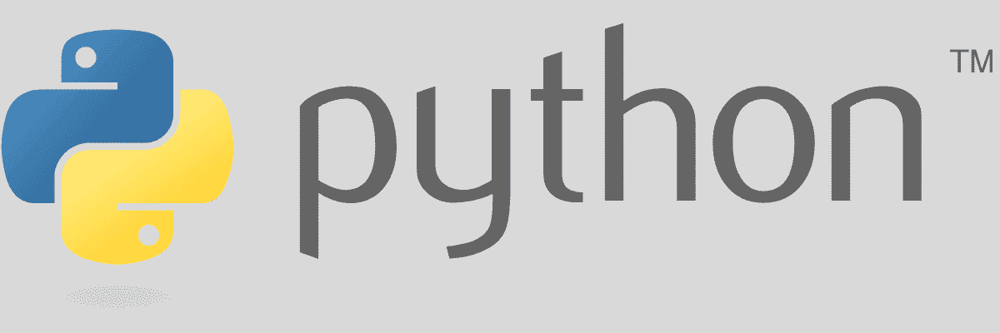](https://kinsta.com/wp-content/uploads/2021/07/python-1.png)

Python logo.

Python 是由吉多·范·罗苏姆设计的开源高级编程语言。发布于 1991 年，这种编程语言的设计理念旨在提高代码可读性，这也是为什么它是最容易学习的语言之一。

> Kinsta 把我宠坏了，所以我现在要求每个供应商都提供这样的服务。我们还试图通过我们的 SaaS 工具支持达到这一水平。
> 
> <footer class="wp-block-kinsta-client-quote__footer">
> 
> 
> 
> <cite class="wp-block-kinsta-client-quote__cite">Suganthan Mohanadasan from @Suganthanmn</cite></footer>

[View plans](https://kinsta.com/plans/)

另外， [Python](https://kinsta.com/blog/php-vs-python/) 是一种面向对象的、反射的、函数式的、过程化的、结构化的语言。Python 的所有这些方法都有助于程序员为各种规模的项目编写逻辑清晰的代码。

到目前为止，Python 有三个主要版本，Python 3 是最新的。它还支持各种各样的库来简化代码的编写。

### 特征

Python 的特点是:

*   **开源与免费:** Python 是开源的，你可以免费下载它的代码，供你的项目使用和修改。
*   **易学:** Python 之所以变得流行，是因为与其他语言相比，它很容易学会。其简单的语法使用简单的英语，不太复杂。因此，它对开发人员友好并且易于编码。
*   **丰富的库:** Python 的标准库非常丰富，包含丰富的模块和函数，可以帮助您更快地完成项目，而不是从头开始编写代码。您可以为图像处理、单元测试、CGI 等过程找到可重用的代码。例子包括 Django、Flask、NumPy 和 SciPy。
*   **可扩展:** Python 是高度可扩展的，可以用不同的模块来扩展核心功能。例如，您可以向现有应用程序添加可编程接口。
*   **面向对象:** [Python 使用面向对象编程](https://kinsta.com/blog/python-object-oriented-programming/)的概念，比如对象、类、继承、数据封装等等。
*   **解释简单，易于调试:** Python 像 Java、C、C++一样线性执行代码。这样，就不需要编译，调试也变得容易了。
*   **动态类型:**指定变量类型，如 char、int、double 等。在 Python 中是不需要的，因为它是在代码运行时决定的，而不是在开始时。因此，它简化了编程，减少了许多代码行。
*   **可移植:** Python 使用可移植代码。因此，您可以在不同的平台上使用相同的代码，如 Windows、macOS、Unix 或 Linux。

[你知道 Python 是第二流行的编程语言(仅次于 JavaScript)吗？🤓更有理由把它添加到你的编程工具箱🛠 点击推文](https://twitter.com/intent/tweet?url=https%3A%2F%2Fkinsta.com%2Fblog%2Fpython-tutorials%2F&via=kinsta&text=Did+you+know+that+Python+is+the+second+most+popular+programming+language+%28right+behind+JavaScript%29%3F+%F0%9F%A4%93+All+the+more+reason+to+add+it+to+your+programming+toolkit+%F0%9F%9B%A0&hashtags=Python%2CProgramming)

## Python 用在哪里？

Python 是一种通用的编程语言。您可以将 Python 用于多种用途，包括:

*   **Web 开发:**由于其效率、速度和其他积极方面，Python 非常适合于 [web 开发](https://kinsta.com/blog/web-development-tools/)。随着像 Django 和 Flask 这样的扩展库的出现，这个过程变得更加易于管理。一些为此目的使用它的流行公司包括 Instagram、Reddit、优步和 Spotify。
*   **软件开发:**使用 Python，你可以创建在你的设备上运行的软件程序和应用。很多 Python 包，比如 NumPy，Tkinter，SciPy 等。，简化软件开发程序。你也可以用科学和数字计算开发复杂的应用程序。一些使用它进行软件开发的大公司包括 Dropbox、PyChess、BitTorrent、Gramps 等。
*   **机器学习和人工智能:**从搜索引擎和社交媒体到聊天机器人和虚拟助手，算法无处不在，并由机器学习和人工智能提供动力。Python 的专属库，如 SciPy、Seaborn、TensorFlow、NumPy、Pandas 等。，服务于这些目的。
*   **数据科学:** Python 在数据科学中应用广泛。它有很多相关的库和框架，如 PyBrain、Bottle、Flask、web3py 等。，在数据科学中用于可视化和分析大量数据以及其他目的。它也有助于[网络抓取](https://kinsta.com/knowledgebase/what-is-web-scraping/)，这对于商业来说已经变得相当重要。
*   **创建桌面图形用户界面:**由于 Python 的模块化结构，它可以在各种操作系统上工作，并允许您利用高效的框架、模块或文本处理器来构建桌面图形用户界面，如 PyGUI、PyGtk、PyQt4、PyQt5 等。
*   **游戏开发:**可以使用 PySoy(基于 Python 的 3D 游戏引擎)这样的 Python 库开发游戏。使用 Python 开发的游戏有迪士尼的《卡通小镇 Online》、《战地 2》、《燃烧的烦恼》等。

## 学习 Python 的 4 个好处

学习 Python 对你的职业前景有几个好处。让我们来找出“为什么要学 Python”这个问题的答案。

### 1.发展高效

Python 不仅易于学习和编码，而且还加速了整个开发过程。它有大量的框架、包、库和模块，不需要你从头开始做任何事情。

您还可以利用可重用代码来更快、更稳定地编写代码。它帮助您自动化标准流程，并节省时间来关注 web 和软件开发的逻辑和其他重要方面。

### 2.极其通用

Python 是一种高度通用的语言，这也是其流行和高度可用性背后的原因之一。从小型到大型项目，Python 的工作效率都是一样的。除了上面提到的用途，开发人员还将它用于深度学习、数据工程、过程自动化、物联网(IoT)等。

也就是说，它的多功能性可能是由于它支持大量的函数、方法、[框架](https://kinsta.com/blog/php-frameworks/)和库。Python 的可读性、流行性和可用性进一步鼓励了更多的库，使得这种语言更加用户友好。

### 3.对 Python 开发者的需求

随着 Python 在新兴技术中的普及和使用，市场上对 Python 开发人员的需求正在增加。它广泛应用于商业服务、保险、航空航天、零售、银行、金融、信息技术、咨询、医疗保健和硬件等领域。

使用 Python 的顶级公司有谷歌、美国宇航局、YouTube、Quora、IBM、惠普、高通和 Dropbox。而且他们还经常雇佣 Python 开发者。

2021 年，美国 Python 开发者的[平均年薪为 110840 美元。所以，学习 Python 对你的职业生涯是有益的。](https://www.daxx.com/blog/development-trends/python-developer-salary-usa)

### 4.支持性社区

尽管有官方的 Python 文档可用，但有时您可能会被卡住，尤其是如果您是初学者。这个时候，一个支持性的社区是可以帮助你的。幸运的是，Python 有一个庞大的开发人员社区，如果您有疑问或问题，可以向它求助。

你可以找到在线论坛，比如 Stack Overflow、[开源社区](https://kinsta.com/learn/wordpress-communities/)和本地聚会来探索这种语言。此外，还有许多专门针对 Python 的课程、教程、网站和其他资源(其中一些我们将在本文中讨论)。

## 如何循序渐进地学习 Python

即使你手上有最好的 Python 教程，如果你不知道学习 Python 的最佳方法，你可能也不会从中收获全部价值。这也是为什么我们要说学习 Python 的循序渐进的过程。

### 第一步:想想你为什么要学 Python

在你开始做一件事之前，首先要弄清楚你为什么要做这件事。这同样适用于学习 Python。必须有一些目标让你在整个旅程中保持动力；不然可能挺痛苦的挺过去。

弄清楚你为什么对 Python 感兴趣，是想提升自己的技能还是想成为一名 Python 开发人员。它可能是数据科学、ML、AI、[建立网站](https://kinsta.com/blog/gatsby-wordpress/)、应用程序和游戏、工作自动化脚本、数据分析、网页抓取或任何其他东西。

一旦你设定了目标，继续下一步。

### 第二步:了解基础知识

毫无疑问地清楚了解 Python 基础知识。学习语法和基本的编程语言，如变量、数据类型、函数等。本文中提到的 Python 资源将在这一步帮助您。

然而，如果你只是浏览理论，它会变得乏味。这里的关键是练习和休息。

自己编写简单的代码，或者通过所选 Python 教程中给出的例子编写简单的代码。基础完成后，您可以进入高级主题。

### 第三步:将知识应用到项目中

基础之后，试着完成一个项目来实现你的知识。项目将释放你的潜力，帮助你学到更多，同时建立一个投资组合来展示潜在的雇主。

你可以在数据科学、ML、网站、移动应用、游戏、自动化脚本等方面创建结构化项目。你会发现很多关于结构化项目的资源，比如 Dataquest、Scikit-learn 文档、Bottle 教程、Codecademy、使用 Python 学习机器人技术，以及使用 Python 自动完成枯燥的工作，等等。

完成高级主题后，继续您自己创建的项目。使用你可以得到的资源，但是要做你想用 Python 做的事情。

此时，您一定已经学会了查找错误并调试它们。你可以扩展以前的项目，寻找开源平台进行贡献，在非营利组织做志愿者，在 [GitHub](https://kinsta.com/blog/gitlab-vs-github/) 上做贡献，等等。

### 第四步:与他人合作

与其他学习者和专家合作将有助于你扩大知识面，讨论问题，学习应用到项目中的技巧和诀窍。您可以在各种 Python 社区、论坛、聚会和活动中遇到他们。一些例子包括堆栈溢出、Python.org、Reddit 和 Sololearn。

### 第五步:坚持练习

学习是一个持续的过程。因此，在你完成了所有的步骤后，要不断练习你所学到的东西。作为全职 Python 开发人员或业余爱好者，在游戏中创建各种行业垂直领域的 Python 项目。

继续练习吧！

接下来，我们将最终揭晓 2022 年最好的 Python 教程。

## 学习 Python 的 25 个最佳免费工具和资源

我们对免费 Python 资源的前 25 个选择是:

### 1.Python.org

[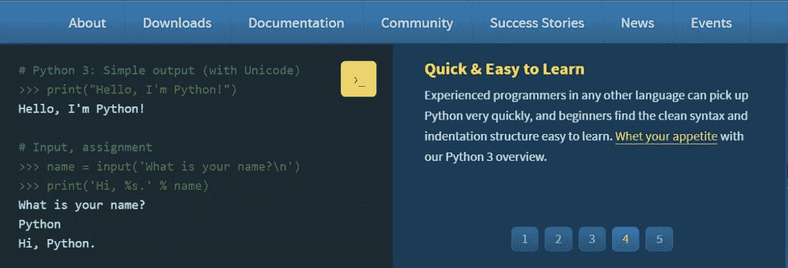](https://kinsta.com/wp-content/uploads/2021/07/pythonorg-1.jpg)

Python.org

如果你正在寻找一个免费的学习 Python 的资源，在[Python.org](https://www.python.org/)查看官方 Python 文档。这对初学者和有经验的开发人员很有帮助，因为它涵盖了从基础到高级的广泛主题，都是关于 Python 编程的。

*   它为初学者提供了 Python 的简要说明。
*   它演示了如何安装 Python、 [IDE 和解释器](https://kinsta.com/blog/php-editor/)。您可以阅读教程并尝试使用 Python 解释器。
*   Python.org 为 Python 开发人员提供了一个全面的高级主题指南，从安装依赖项到风格指南，编写代码，问题跟踪，故障排除，持续集成和测试，等等。

#### 特征

*   课程类型:基于文本
*   先决条件:无
*   证书:否
*   教程被翻译成 81 种语言，帮助非英语母语者更高效地学习 Python。
*   展示了初学者指南中包含的完整页面列表，您可以下载并阅读
*   它通过多种练习和测验使学习变得有趣。它还通过动态分数计算和提示来检查您的 Python 风格。
*   提供其他学习 Python 的参考，包括 Codecademy，DataCamp，Dataquest 等。

除了教程和指南，您还可以访问 Python 相关的播客、信息视频、最新事件和新闻、开发者社区、成功案例、常见问题等等。

### 2.代码集

[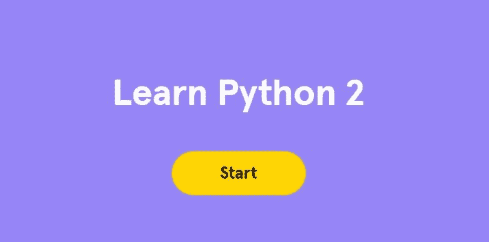](https://kinsta.com/wp-content/uploads/2021/07/codeacademy-1.jpg)

Codecademy

互联网上免费学习 Python 的最好地方之一是 [Codecademy](https://www.codecademy.com/) 。这个电子学习平台提供大量免费和付费的 Python 课程。 [Python 2](https://www.codecademy.com/learn/learn-python) 是他们提供的免费课程，是对基本编程概念和 Python 的有益介绍。

他们从理论开始，然后要求学习者利用概念在线编写 Python 代码。这门课程已经由美国宇航局、IBM、谷歌、脸书和其他公司的员工承担。

它们涵盖的一些主题有:

*   Python 语法
*   Python 字符串和控制台输出
*   如何使用控制和条件流编写程序
*   Python 函数、循环、字典和数据结构列表

这个课程最好的一点是所有的练习和课程都直接在你的浏览器上运行；因此，没有必要在你的电脑上安装 Python。

Codecademy 还免费提供了一个[代码编辑器](https://kinsta.com/blog/best-text-editors/)，你可以边写代码边练习。你甚至可以加入一个论坛，与其他成员进行互动和讨论。

#### 特征

*   课程类型:基于视频
*   完成时间:25 小时
*   证书:您可以在课程结束后获得专业会员资格认证
*   先决条件:无

### 3.犹达

[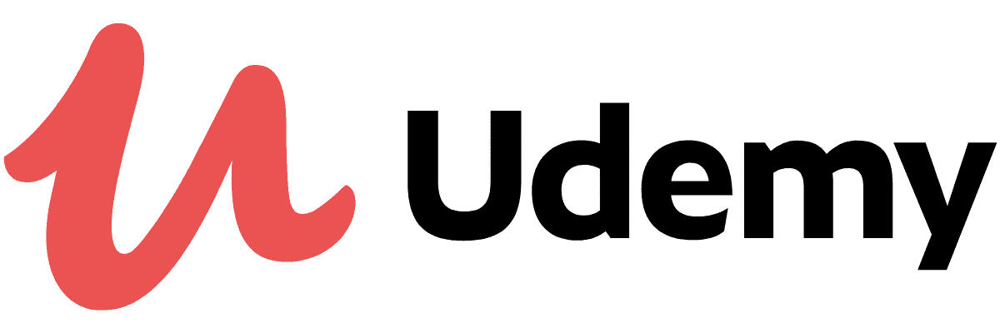](https://kinsta.com/wp-content/uploads/2021/07/udemy.png)

Udemy

Udemy 拥有大量各种主题的课程，包括 [Python](https://www.udemy.com/courses/search/?src=ukw&q=python) 。他们提供适合初学者和专家的免费和付费课程。如果你正在寻找基于视频的教程，Udemy 是最好的地方之一。

他们免费的[Python 编程入门](https://www.udemy.com/course/pythonforbeginnersintro/)课程是对 Python 编程语言的简单快速的介绍。本教程有英文版，从以下主题开始:

*   Python 基础知识、字符串、数据类型和变量
*   循环、条件、函数和文件操作
*   编写 Python 脚本和函数

该课程的一些特点包括:

*   课程类型:基于视频
*   时长:1 小时 39 分钟，视频点播
*   注册学生:619，075 人
*   评分:4.4
*   先决条件:无
*   证书:否

Udemy 的 [Python 在 30 分钟内从初级到中级](https://www.udemy.com/course/python-from-beginner-to-expert-starter-free/)课程为你准备高级 Python 概念。它包括一系列关于 Python 编程的教程和讲座，您将学习如何从头开始编码并安装 Python。

企业家、学生或任何对学习 Python 感兴趣的人都可以选修这门课程。在这里，他们教你:

*   Python 基础
*   Python 中的函数、模块、字符串
*   切片、序列、条件和循环语句
*   文件处理和[面向对象编程](https://kinsta.com/blog/interview-with-carl-alexander/)

该课程的一些特点包括:

*   课程类型:基于视频
*   时长:1 小时 32 分钟，视频点播
*   评分:4.2
*   注册学生:92，015 人
*   先决条件:无
*   证书:否

顾名思义，Udemy 的 [Python 绝对初学者](https://www.udemy.com/course/free-python/)课程最适合那些完全不了解 Python 或任何其他编程语言的人。讲师讲授如何用 Python 3 编写代码，涵盖以下主题:

*   Python 安装
*   如何运行 Python 脚本并设置 PyCharm IDE
*   变量、数字、字符串、列表、字典和布尔运算符
*   模块、函数、循环、参数和返回值
*   如何利用 Python 开发计算器应用程序
*   最终方案

该课程的一些特点包括:

*   课程类型:基于视频
*   时长:2 小时 16 分钟，视频点播
*   评分:4.5
*   注册学生:75，783 人
*   证书:否
*   先决条件:下载 Python 3 和 PyCharm(都是开源的)

### 4.Coursera

[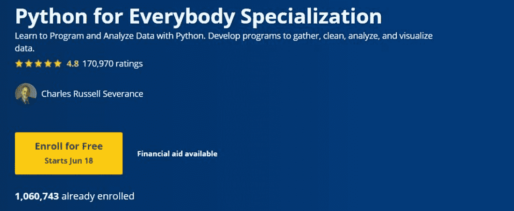](https://kinsta.com/wp-content/uploads/2021/07/coursera-1.jpg)

Coursera

Coursera 是一个平台，你可以在这里学习世界顶尖大学的各种课程，包括耶鲁大学、斯坦福大学、悉尼大学等等。Coursera 提供免费的 Python 课程: [Python for Everybody 由密歇根大学](https://www.coursera.org/specializations/python)特殊化。

本课程将帮助您学习如何用 Python 编程和分析数据。课程结束时，你将自己开发 Python 程序，并使用它收集、清理、可视化和分析数据。

他们增加了 12 种语言的字幕，包括英语、西班牙语、俄语、阿拉伯语、意大利语、法语、德语、土耳其语、葡萄牙语、越南语、韩语和简体中文。每门专业化课程都要求您成功完成一个动手项目以获得证书。

本课程涵盖以下主题:

*   Python 安装和编写程序
*   Python 基础
*   如何使用变量来存储、计算、检索数据
*   如何利用核心编程方面，如循环和函数
*   数据结构、基本编程语言、数据库管理系统、网络搜集、SQL、元组、Python 语义和语法等技能

#### 特征

*   课程类型:基于视频
*   持续时间:大约 8 个月
*   评分:4.8
*   注册学生:1，056，382 人
*   认证:是的，可以在 LinkedIn、职业网络和雇主那里分享
*   先决条件:无

### 5.Learnpython.org

[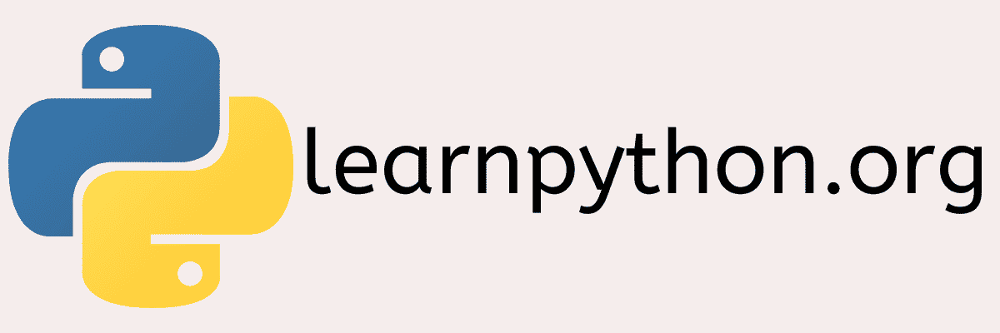](https://kinsta.com/wp-content/uploads/2021/07/learnpython.png)

Learnpython.org

如果你正在寻找一个基于文本的学习 Python 的资源，[Learnpython.org](https://www.learnpython.org/)是一个不错的选择。是一个互动教程，不管你有没有经验，对大家都有帮助。你也可以加入他们的[脸书](https://kinsta.com/blog/facebook-statistics/)小组进行讨论、更新和提问。

该教程包括以下主题:

*   变量及其类型、列表、运算符、条件、循环、函数、列表、字符串格式、字符串操作、对象和类、包和模块以及字典
*   数据科学课程包括熊猫基础和数字阵列
*   高级教程，如生成器、集合、列表理解、函数参数、异常处理、正则表达式、序列化、代码自省、部分函数、闭包、过滤器、映射和 Reduce

#### 特征

*   课程类型:基于文本
*   注册学生:575，000 人
*   先决条件:无
*   认证:你可以在 LearnX 获得认证，并在你的 LinkedIn 个人资料中展示

### 6.自由代码营

[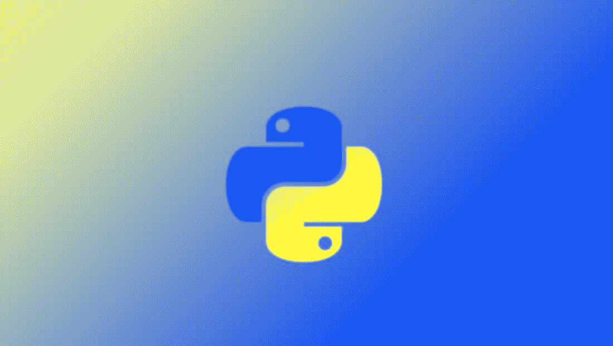](https://kinsta.com/wp-content/uploads/2021/07/freecodecamp.jpg)

FreeCodeCamp

[学习 Python:初学者完全教程](https://www.freecodecamp.org/news/learning-python-from-zero-to-hero-120ea540b567/)是 [FreeCodeCamp](https://www.freecodecamp.org/) 提供的教程，非常优秀，尤其是如果你热爱基于文本的课程。然而，他们也有一个 [YouTube 视频](https://www.youtube.com/watch?v=rfscVS0vtbw)，在那里他们为初学者漂亮地解释了 Python 概念。

在网站上，您可以了解到:

*   Python 基础，包括变量、控制流语句、循环、数组、数据结构、字典等。
*   类别和对象
*   面向对象的编程概念，如数据封装和继承

最棒的是他们用好的例子和代码解释了每个概念。YouTube 视频还介绍了如何安装 PyCharm 和 Python，如何构建计算器，以及关于 Python 解释器的想法。总的来说，如果你是编程和 Python 的新手，这是一个不错的选择。

#### 特征

*   课程类型:基于视频
*   时长:4 小时 20 分钟的 YouTube 视频
*   浏览量:2400 多万次
*   先决条件:无

他们还有一个[媒体账户](https://www.freecodecamp.org/news/)，在那里你可以阅读数百篇关于各种编程语言的有用文章。

### 7.数据营

[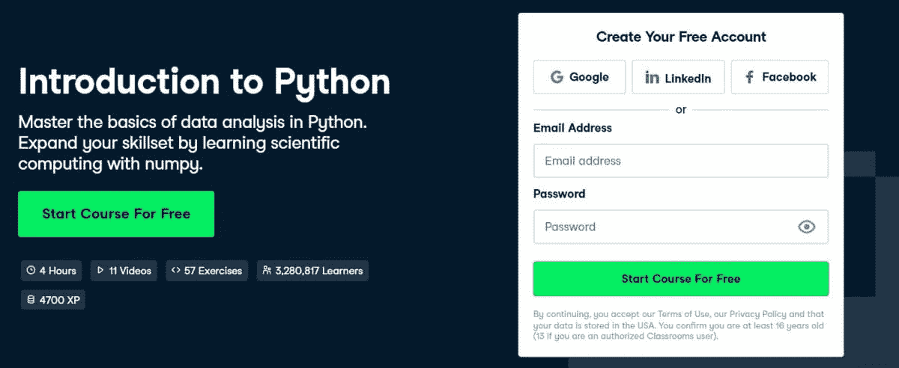](https://kinsta.com/wp-content/uploads/2021/07/datacamp-1.jpg)

DataCamp

在数据科学教育方面，DataCamp 大放异彩。他们提供这门课程——[Python 简介](https://www.datacamp.com/courses/intro-to-python-for-data-science)——帮助你掌握 Python 中的数据分析基础知识，并通过学习科学[计算](https://kinsta.com/blog/benefits-of-cloud-computing/)的 Numpy 扩展你的技能。

课程包括 11 个视频和 57 个练习，而且完全免费。DataCamp 的另一个好处是你不需要在你的机器上安装 Python 相反，它们提供了令人印象深刻的用户界面和网络编译器。

本课程的 USP 将它与其他在线 Python 教程区分开来，让学生学习用于数据科学的 Python。在这里，您将了解到:

*   存储和操作数据的有效方法
*   用于分析的数据科学工具
*   基本 Python 概念
*   如何交互式地利用 Python
*   如何使用脚本利用 Python
*   在 Python 的数据类型上创建变量和想法

#### 特征

*   课程类型:基于视频
*   时长:4 小时
*   注册学生:300 多万
*   评分:4.6/5
*   先决条件:没有技能，只是一个谷歌，脸书，或 LinkedIn 帐户

### 8.eDx

eDx

与 Coursera 类似， [eDx](https://www.edx.org/) 也是一个电子学习平台，提供来自[全球顶尖大学](https://kinsta.com/wordpress-hosting-for-education/)的在线课程。目前，他们有 3000 多门课程，并与 160 多所大学合作，包括哈佛大学、麻省理工学院、伯克利分校等。

只要进入 edX 的网站，搜索你需要的课程，它就会显示所有相关的课程和项目。

我们来说说他们提供的一些免费的 Python 课程。

如果你想让你的 Python 基础知识更上一层楼，[哈佛大学](https://www.edx.org/course/using-python-for-research)用 Python 做研究是适合你的。由哈佛大学提供，它将帮助您学习 Python 3 以及如何在您的研究中利用它。

在这里，您将了解到:

*   Python 3 编程基础
*   一些用于研究目的的 Python 工具，如 SciPy 和 NumPy
*   如何在实际场景中实现用于研究的 Python 工具

#### 特征

*   课程类型:基于视频
*   持续时间:12 周，每周 2-4 小时
*   注册学生:284，309 人
*   证书:你可以通过支付 169.14 美元获得认证证书
*   课程类型:根据您的时间自定进度
*   语言:英语
*   先决条件:之前有一些 Python 编程经验

其他免费课程包括:

*   IBM **撰写的[数据科学 Python 基础知识:](https://www.edx.org/course/python-basics-for-data-science)**本课程讲授 Python、其在数据科学中的应用、其基础知识、如何利用 Pandas 进行数据分析等等。这种自定进度的课程持续时间为 5 周，您可以通过支付 99 美元来添加证书。
*   [Python 中的计算 I](https://www.edx.org/course/computing-in-python-i-fundamentals-and-procedural) **:** 佐治亚理工学院的《基础与过程编程》帮助你学习 Python 中的计算基础知识，比如变量和运算符，你还可以编写和调试你的程序。需要 5 周完成，支付 130.30 美元即可添加证书。
*   [用 Python 进行机器学习:实用介绍](https://www.edx.org/course/machine-learning-with-python-a-practical-introduct) **:** 这门入门课程帮助你学习机器学习方法、算法、统计建模，以及 MI 如何影响社会的真实例子。它是由 IBM 提供的为期 5 周的课程，您可以通过支付 99 美元来添加证书。

### 9.谷歌的 Python 类

Google 将 Python 用于许多项目，包括系统构建、广告分钟工具、[代码评估工具](https://kinsta.com/blog/code-review-tools/)、API 和数据分析。作为谷歌教育的一部分，他们的 [Python 类](https://developers.google.com/edu/python)是免费的，对拥有基本编程技能的人非常有用。

本课程包括讲座视频、文本内容和代码练习，帮助您练习 Python 编码。在这里，您将了解到:

*   第一个练习中的基本 Python 概念，如列表和字符串
*   涉及文本文件、 [HTTP 连接](https://kinsta.com/blog/make-fewer-http-requests/)和进程的完整程序练习
*   如何安装和设置 Python

#### 特征

*   课程类型:基于视频
*   持续时间:2 天
*   先决条件:基本编程技能
*   证书:否

也可以直接在 YouTube 上看他们的视频教程。

### 10.商务化人际关系网

[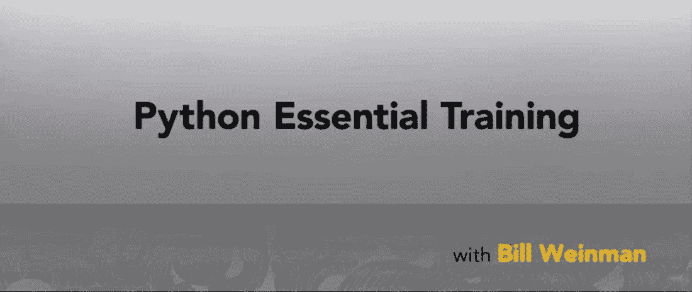](https://kinsta.com/wp-content/uploads/2021/07/linkedin-1.jpg)

LinkedIn

LinkedIn 不仅是一个专业人士的网络平台，也是学习大量技能的有用资源中心，包括 Python。他们通过注册 LinkedIn Learning 并开始你的免费月，免费提供 [Python 基础培训](https://www.linkedin.com/learning/python-essential-training-2018)。

在本课程中，讲师将演示 Python 3 如何生成设计良好的脚本和维护现有项目。对初学者和中级学习者都有帮助。

本课程涵盖:

*   Python 的基本语法、用法和高级特性，如对象、异常、生成器等等
*   值和类型如何与对象相关联
*   如何利用函数、控制语句和循环
*   Python 模块系统
*   如何使用装饰器和生成器
*   展示真实实现中 Python 脚本的示例

#### 特征

*   课程类型:基于视频
*   时长:4 小时 51 分钟
*   观众:已经有超过 2 万人喜欢这门课了
*   证书:LinkedIn Learning 提供的可共享证书
*   包括 16 章的测验
*   通过智能手机和平板电脑访问
*   先决条件:无

### 11.微软

[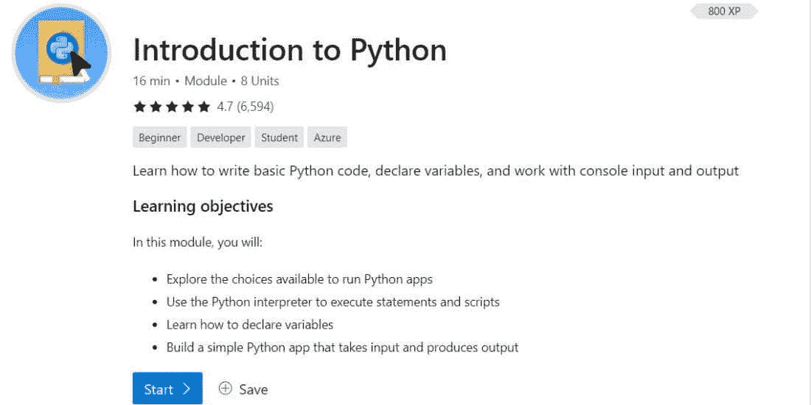](https://kinsta.com/wp-content/uploads/2021/07/microsoft-1.jpg)

Microsoft

借助[微软的 Python 入门](https://docs.microsoft.com/en-us/learn/modules/intro-to-python/)课程，学习编写基础代码、探索控制台输出和输入、声明变量。它与他们的 [Azure](https://kinsta.com/azure-market-share/) 学习资源相结合，但它对学生、Python 初学者和开发人员也很有用。

本课程包括 10 个单元，涵盖各种主题，例如:

*   Python 基础
*   关于如何使用 Python 创建应用程序的练习
*   数据类型、变量、一个“Hello”程序、如何读取键盘输入
*   如何创建计算器应用程序

#### 特征

*   课程类型:基于视频
*   课程时长:1 小时 7 分钟
*   评分:4.7/5
*   先决条件:无
*   语言:英语

### 12.Simplilearn

[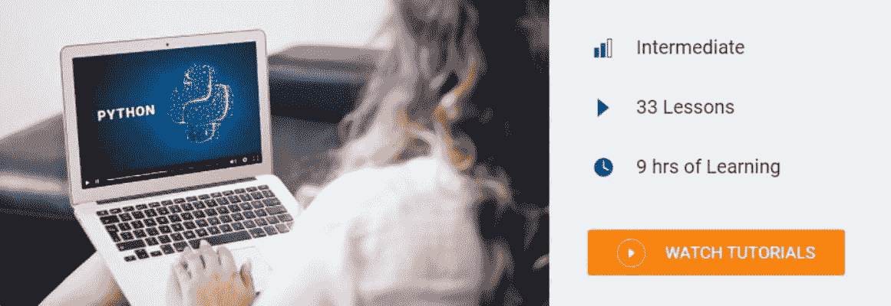](https://kinsta.com/wp-content/uploads/2021/07/simplilearn-1.jpg)

Simplilearn

[Simplilearn](https://www.simplilearn.com/) 是一个领先的在线学习平台，提供广泛的课程，涉及数据科学、软件开发、IT、[云计算](https://kinsta.com/blog/types-of-cloud-computing/)、数字营销、项目管理以及更多新兴技术。

Simplilearn 的 Python 初学者教程旨在帮助你通过练习以最简单的方式学习这门语言。它让你毫不费力地掌握诸如面向对象编程(OOP)类、属性、线程、脚本等概念。这门课程对初学者和中级水平的学习者都有用。

在本课程中，您将学习:

*   如何在 Windows 上安装 Python
*   哎呀概念
*   皮查姆和努皮
*   Python 的变量、数字、循环、函数、条件语句、列表、字符串、切片、正则表达式、线程、集合、字典等。
*   Python 线程、类和对象、熊猫、元组、ide 和 Matplotlib
*   Scikit 和 Django 框架
*   成为 Python 开发人员的技能
*   面试问题

如果你有疑问，也可以向他们的社区论坛寻求帮助。

#### 特征

*   课程类型:基于视频
*   课程时长:9 小时，包括 33 节课
*   课程类型:基于视频的教程
*   先决条件:无
*   证书:否

### 13.SoloLearn

[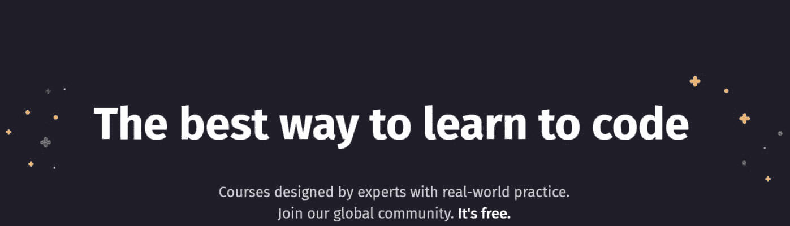](https://kinsta.com/wp-content/uploads/2021/07/soloearn-1.jpg)

SoloLearn

SoloLearn 针对不同技能水平的学习者提供大量免费的 Python 课程。他们的学习者数量呈指数级增长，每门课程都有数百万的学习者。

他们提供 5 门 Python 课程:

*   [Python 内核](https://www.sololearn.com/learning/1073)
*   [初学 Python](https://www.sololearn.com/learning/1157)
*   [用于数据科学的 Python](https://www.sololearn.com/learning/1161)
*   [中级 Python](https://www.sololearn.com/learning/1158)
*   [Python 数据结构](https://www.sololearn.com/learning/1159)

其中，Python Core 最受欢迎，拥有 720 万学习者。本课程将帮助您通过代码编写实践学习 Python。你甚至可以为此收集积分，并扩展你的技能以获得更好的机会。

本课程分为 10 个模块。每个模块都结合了课程及其各自的实践或练习，以测试您所学的技能。涵盖的模块相关主题包括:

*   Python 的基本概念以及为什么应该学习它
*   字符串和变量，换行符，字符串操作，使用输入
*   控制结构，如 if 和 else 语句、布尔和比较、运算符和条件、循环、列表、范围
*   功能和模块、标准库和 pip
*   例外和文件
*   字典、元组、切片、函数、字符串格式、文本分析器
*   函数式编程、Lambda、生成器、映射和过滤器、装饰器、递归等。
*   OOP 概念，包括类、继承、封装等。
*   正则表达式
*   腐败与包装

#### 特征

*   课程类型:视频类型
*   注册学生:720 万
*   证书:否
*   先决条件:无

除了 Python，SoloLearn 还提供许多其他主题的免费课程，如 [JavaScript](https://kinsta.com/blog/javascript-libraries/) 、 [HTML](https://kinsta.com/blog/html-vs-html5/) 、响应式网页设计、CSS、SQL、 [Angular](https://kinsta.com/blog/php-vs-angular/) + NestJS、 [PHP](https://kinsta.com/blog/install-php/) 、jQuery 等等。

### 14.教程点

[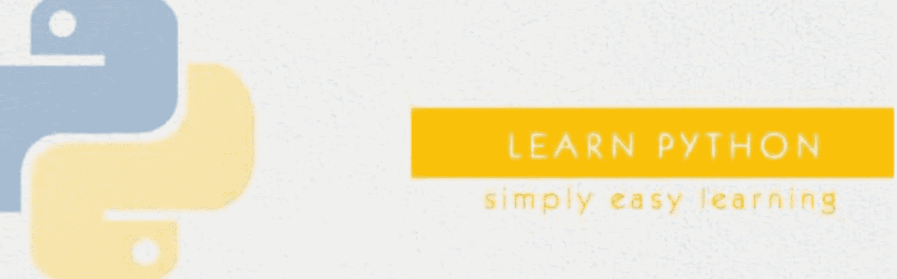](https://kinsta.com/wp-content/uploads/2021/07/tutorialspoint-1.jpg)

Tutorials Point

[教程点](https://www.tutorialspoint.com/)是一个免费提供优质内容的优秀平台。他们的 [Python 教程](https://www.tutorialspoint.com/python/index.htm)通过深入的、基于文本的教程和丰富的例子帮助你学习 Python。它最适合 Python 初学者和编程语言新手。

此外，还有大量的实践练习和编码选项，这样你可以测试你的技能。即使你有一些 Python 的知识，你也可以在本教程的帮助下提高你的编码技能。

它不仅涵盖了基本的 Python 概念，还涵盖了高级主题，包括:

*   你应该学习 Python 的原因
*   Python 的特点及应用
*   环境设置
*   如何用 Python 编写你的第一个“Hello World”程序
*   Python 的基本语法，变量，运算符，循环，数字，列表，字符串，字典，元组，日期和时间，模块，函数，异常等。
*   高级主题，如类、对象、回归、CGI 编程、网络、[数据库访问](https://kinsta.com/help/db-access/)、多线程、发送电子邮件、GUI 编程、XML 处理和扩展

#### 特征

*   课程类型:基于文本
*   先决条件:计算机编程术语的基本知识
*   教程的可下载 PDF 版本
*   快速指南
*   资源、工作搜索和讨论面板
*   证书:否

### 15.w3 学校

[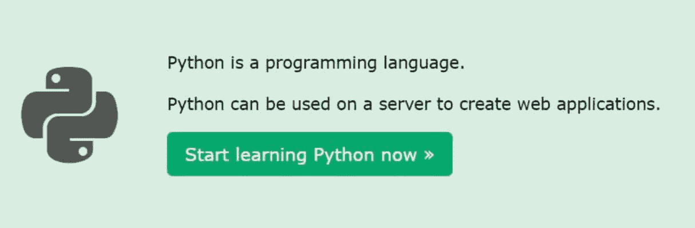](https://kinsta.com/wp-content/uploads/2021/07/w3schools-1.jpg)

W3Schools

W3Schools 是一个著名的网站，提供大量的教程，包括用简单易懂的语言编写的 Python。他们提供了一个 [Python 教程](https://www.w3schools.com/python/default.asp)，里面有组织良好的课程和例子。

## 注册订阅时事通讯

### 想知道我们是怎么让流量增长超过 1000%的吗？

加入 20，000 多名获得我们每周时事通讯和内部消息的人的行列吧！

[Subscribe Now](#newsletter)

此外，您可以使用他们的编辑器——“自己试试”——自己编辑 Python 代码，然后查看结果。

本教程涵盖的主题有:

*   Python 简介和入门方法
*   语法、注释、数据类型、变量、数字、字符串、类型转换、布尔值、运算符、元组、列表、Lambda、OOPs 概念、Python PIP 等。
*   使用 Python 进行文件处理，读取文件，写入，创建或删除文件。
*   Python 模块——NumPy、SciPy 和 Pandas 教程
*   python Matplotlib-py plot、标记、绘图、线条、标签、支线图、网格、直方图、散点图、饼图和条形图
*   用 Python 进行机器学习
*   Python [MySQL](https://kinsta.com/blog/mysql-version/) 和 MongoDB
*   Python 参考资料、操作指南、示例和测验

#### 特征

*   课程类型:基于文本
*   先决条件:无
*   证书:完成本教程后，您可以通过在线测验测试您的 Python 技能。接下来，您可以随时随地通过减免考试费和参加在线考试来申请证书。

除了 Python，W3Schools 还有 HTML、JavaScript、 [CSS](https://kinsta.com/blog/wordpress-css/) 、SQL、 [Bootstrap](https://kinsta.com/blog/bootstrapping-startup/) 、PHP、C++、jQuery、Java 等课程和教程。您还可以在这个网站上找到大量关于各种技术的参考资料，以丰富您的知识。

### 16.用 Mosh 编程

YouTube 也是一个很好的平台，在那里你可以免费找到很多 Python 教程。[用 Mosh](https://www.youtube.com/channel/UCWv7vMbMWH4-V0ZXdmDpPBA) 编程是 YouTube 上最好的 Python 教程资源之一。这个频道的创建者是 Mosh，他在这个 YouTube 频道上为初学者提供了一个 [Python 教程](https://www.youtube.com/watch?v=_uQrJ0TkZlc)。

本教程有 Python 的所有基本概念，甚至包括 3 个项目供您完成。涵盖的主题有:

*   Python 3 安装
*   编写第一个 Python 程序
*   变量、类型转换、格式化字符串、算术运算、数学函数、运算符、循环、2D 列表、表情转换器、参数、元组、解包、构造函数、oops 概念等基本概念。
*   Python 备忘单
*   重量转换器程序
*   创建一个猜谜游戏和汽车游戏
*   目录、Pip 和 Pypi
*   使用 Python 的自动化项目，使用 Python 的 ML 项目，以及使用 Django 创建网站的项目

#### 特征

*   教程类型:基于视频
*   时长:6 小时 14 分钟
*   浏览量:1800 多万
*   订户:185 万
*   推荐额外的 Python 书籍
*   包括补充材料
*   先决条件:无

### 17.CS 道场

CS Dojo 是一个很棒的 YouTube 频道，为绝对的初学者提供 Python [教程](https://www.youtube.com/watch?v=Z1Yd7upQsXY)。它还为具有中级 Python 技能的[学习者](https://kinsta.com/blog/wordpress-lms-plugins/)提供教程。

教程中的所有课程都用简单的语言和适当的例子进行了解释。教师还提供了一些有价值的提示，您可以使用这些提示来充分利用本教程。此外，您还可以在此下载示例文件。其中涵盖的主题有:

*   Python 及其用法介绍
*   IDE 和 Jupyter 笔记本
*   如何安装 Jupyter 和 Python
*   变量以及如何给它们赋值
*   一道练习题及解答

#### 特征

*   教程类型:基于视频
*   时长:24 分钟
*   浏览量:600 多万
*   频道用户:168 万
*   先决条件:无

### 18.聪明的程序员

名单上的另一个 YouTube Python 教程是 Qazi 的[聪明的程序员](https://www.youtube.com/channel/UCqrILQNl5Ed9Dz6CGMyvMTQ)。如果你是一个想要从头开始学习 Python 的完全初学者，这也是一个极好的选择。

到目前为止，他已经在他的频道上传了 350 多个视频，都是给学习者的价值炸弹。此外，如果你想成为一名网络开发人员，他也提供大师班。他在教程 [Python 初学者教程](https://www.youtube.com/watch?v=4F2m91eKmts)中涉及的主题是:

*   所有基本的 Python 概念
*   造型、切片、元组、连接和拆分等。
*   字典、可变性、正则表达式和列表理解
*   [网页抓取](https://kinsta.com/blog/wordpress-lms-plugins/)和压缩功能
*   4 个项目:井字游戏、Twilio 短信应用程序、待办事项应用程序和 Craiglist 克隆
*   Python 自由职业者指南

#### 特征

*   教程类型:基于视频
*   时长:11 小时
*   浏览量:200 多万
*   订户:968，000 人以上
*   先决条件:无

### 19.Pythonspot

如果你正在免费寻找基于文本的 Python 资源，Pythonspot 是另一个有用的资源。这个网站有一个完整的 Python 教程，涵盖了 Python 2 和 3。它既适合[专业开发者](https://kinsta.com/blog/hire-wordpress-developer/)，也适合初学者。

他们用实际例子深入解释了每个概念，以帮助您轻松理解。其中包括的主题有:

*   Python 的基本概念，OOPs 概念，递归函数，工厂方法，Lambda，线程，图，模块，二进制数，Python 调试等。
*   数据库:读/写文件、平面数据库、SQLite、MySQL 和 ORM
*   Web 开发:Python web 开发、JSON 编码和解码、Flask 和 Django
*   GUI: PyQt4、PyQt5、wxPython 和 Tkinter
*   网络:HTTP、FTP、POP3、链接提取等等
*   高级:Matplotlib，正则表达式，使用 Python 创建量子计算应用，Chrome 插件，语音引擎和有趣的技巧
*   更多关于 Android、计算机视觉、机器人和用 Python 创作游戏的教程

#### 特征

*   课程类型:基于文本
*   先决条件:无
*   证书:否

### 20.今晚学习

[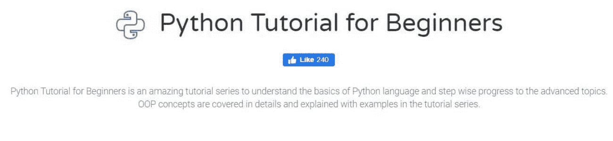](https://kinsta.com/wp-content/uploads/2021/07/studytonight-1.jpg)

Studytonight

另一个从头开始学习 Python 的免费资源是 [Studytonight](https://www.studytonight.com/) 。他们为初学者提供 Python [教程](https://www.studytonight.com/python/)，教授 Python 基础知识，然后逐渐让你准备好高级概念，包括详细的 OOP 概念。

内容简单易懂，附有示例，是一个很受欢迎的在线教程。您将获得大量练习来测试您在本教程中学到的 Python 技能，并在创建有用的工具中实现所学内容。

他们还有一个问答论坛，帮助学习者互相讨论和寻求帮助。本教程涵盖的主题有:

*   Python 基础知识、Python 2.x 与 Python 3.x、语法、函数、字符串、输入和输出、变量、运算符等等
*   复杂数据类型、OOP 概念、[错误](https://kinsta.com/blog/wordpress-errors/)和文件处理、多线程、日志、MySQL 和其他主题
*   库函数

它们还涵盖了 Python 库，如 NumPy、Matplotlib、Tkinter、网络编程和 BeautifulSoup 的 web 抓取。

#### 特征

*   课程类型:基于文本
*   先决条件:无
*   持续时间:自定进度
*   证书:否

### 21.全栈 Python

[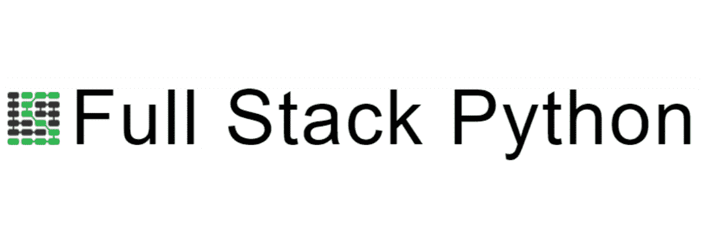](https://kinsta.com/wp-content/uploads/2021/07/fullstack.png)

Full Stack Python

如果你对编程语言有一些基本的了解，你可以去读一下[全栈 Python](https://www.fullstackpython.com/) 教程。这个免费的在线 Python 教程将帮助你熟练掌握 Python，以抓住更好的职业机会，并实际实施学习。

本教程重点介绍如何构建、操作和部署 Python 应用程序。这本开源书籍用简单的语言描述了技术主题和概念。课程内容可让您连续学习，或选择特定主题并点击查看。

它包括以下主题:

*   Python、Python 2 或 Python 3 及其用法介绍
*   Python 社区、使用它的公司、最佳资源、播客和必看视频
*   开发环境和使用数据库
*   Web 开发:Flask、Django 等 web 框架。、模板引擎、网页设计、[静态站点生成器](https://kinsta.com/blog/static-site-generator/)、测试、联网、API 创建和集成、安全性等等
*   Web 应用程序开发、 [DevOps](https://kinsta.com/blog/devops-tools/) 和元概念

#### 特征

*   课程类型:书本
*   持续时间:自定进度
*   先决条件:基本的 Python 知识
*   证书:否
*   可购买 PDF、MOBI 和 EPUB 格式

### 22.用 Python 发明

如果你以前从未写过一行代码，用 Python 发明[是一个不错的选择。除了可以在其他资源中找到的基本概念，这个网站之所以大放异彩，是因为它教你如何为日常目的构建有价值的工具。](https://inventwithpython.com/)

这个网站的作者已经出版了许多关于 Python 的免费在线书籍,并且漂亮地展示了所有的概念，这样你就可以在现实世界中应用这些知识。

无论你是想提升技能的专业人士，还是想从事软件开发职业的学生，或者是喜欢制作电子游戏的业余爱好者，这个拥有一流在线书籍的网站都适合你。

有很多在线书籍可供你免费在线阅读，从这家出版商那里免费获得一本电子书，或者在亚马逊上购买一本。以下是几个例子:

*   小型 Python 项目大全
*   除了 Python 的基本知识
*   用 Python 自动化枯燥的东西(第二版)
*   用 Python 破解代码
*   用 Python 发明你自己的电脑游戏
*   用 Python 和 Pygame 制作游戏

### 23.Python 的搭便车指南

[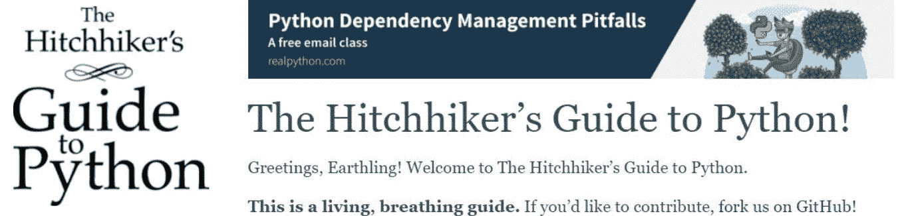](https://kinsta.com/wp-content/uploads/2021/07/pythonguide-1.jpg)

The Hitchhiker’s Guide to Python

学习 Python 可以参考的一个极好的基于文本的材料是[Python 的搭便车指南](https://docs.python-guide.org/)。它包含了对每一个 Python 概念的全面解释，旨在帮助您理解 Python、它的安装以及它在现实世界中的用法。

本指南对初学者和专业开发人员都有帮助，帮助他们有效地练习 Python。它还包含一个简明的建议列表，而不是包含每个 Python web 框架的列表。

这些主题包括:

*   选择 Python 解释器
*   在 Windows、macOS 和 Linux 上安装 Python
*   使用 Pipenv 和虚拟环境
*   开发环境:ide、文本编辑器、解释器和其他工具
*   项目结构、代码风格、阅读和测试代码、文档、日志、选择许可等等
*   Python 应用程序，如网络应用程序、web 应用程序和框架、HTML 抓取、命令行应用程序、GUI 应用程序、数据库、网络、持续集成、科学应用程序、密码学、机器学习等等
*   部署代码并共享它

#### 特征

*   课程类型:书本
*   持续时间:自定进度
*   先决条件:无
*   证书:否
*   可下载 PDF 格式
*   英语、法语、巴西葡萄牙语、菲律宾语、日语、韩语和中文翻译

### 24.Python 适合你和我

[Python for You and Me](https://pymbook.readthedocs.io/en/latest/index.html) 是一本免费阅读的在线书籍。它也被称为 PYM 之书，用简单的语言解释了 Python 编程语言。这本书对想学习 Python 的程序员很有帮助，对完全的初学者也很有帮助。

需要为您的电子商务网站提供超快的、可靠的、完全安全的托管服务吗？Kinsta 提供所有这些服务，并由 WooCommerce 专家提供 24/7 的世界级支持。[查看我们的计划](https://kinsta.com/plans/?in-article-cta)

这本书里的所有内容都被分成清晰的章节和主题导向的课程。它涵盖的主题有:

*   Python 在 Windows、Linux/GNU 上的安装
*   如何使用 Python 解释器，源文件，缩进，空格，代码求值等。
*   mu 编辑器:如何安装使用
*   变量、数据类型、表达式、运算符、控制流语句和循环
*   数据结构、字符串、函数、文件处理、异常、类和模块
*   如何使用 vs 代码、PEP8 指南、`virtualenv`、装饰器、迭代器和生成器
*   简单的代码测试、注释、类型提示、项目结构
*   使用 PyperCard 开发命令行应用和简单的 GUI 应用
*   瓶

#### 特征

*   课程类型:书本
*   持续时间:自定进度
*   先决条件:无
*   证书:否
*   可下载 [PDF](https://kinsta.com/blog/wordpress-pdf-viewer-plugins/) 、HTML 和 EPUB 格式

### 25.跟我说说 Python

[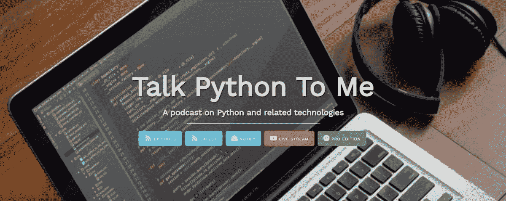](https://kinsta.com/wp-content/uploads/2021/07/talkpythontome-1.jpg)

Talk Python to Me

[跟我说说 Python](https://talkpython.fm/)是一个优秀的[播客](https://kinsta.com/blog/wordpress-podcast/)，致力于 Python 及相关概念和技术。它有免费版和专业版。它主要关注用 Python 编码的组织和人员。他们在每一集中邀请不同的嘉宾来谈论他们在 Python 中的工作。

由于这些原因，它提供了一个巨大的机会，可以向真正的 Python 程序员学习，并自己实现 Python 来创建出色的应用程序和工具。到目前为止，他们已经录制了 320 集精彩的 Python 相关主题。

此外，他们还为 PyCharm 和其他科目的初学者提供在线 Python 课程。

#### 特征

*   素材类型:播客
*   可在:谷歌播客，iTunes，阴云，和 Soundcloud
*   你也可以在 YouTube、脸书、Twitter 和 GitHub 上找到它们

## 学习 Python 的 10 个最佳付费工具和资源

到目前为止，我们已经看到了关于 Python 的免费在线课程。但是如果你是一个认真的开发人员，或者想作为 Python 开发人员建立一个稳固的职业生涯，你可以选择参加一些付费课程。

开始了。

### 第一章

[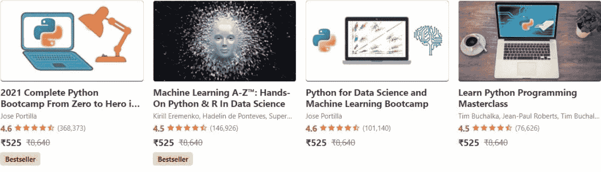](https://kinsta.com/wp-content/uploads/2021/07/udemypaid-1.jpg)

Udemy

除了免费的 Python 课程， [Udemy](https://www.udemy.com/topic/python/) 还提供一些付费课程，这可能是在线学习 Python 的最佳地点之一。他们的付费课程面向初学者和专业开发人员。

在这里，除了基本的 Python 概念之外，您还可以进行高级别的学习。Udemy 上一些收费最高的 Python 课程包括:

#### 1.2021 年完成 Python Bootcamp 从零到 Python 中的英雄

[本课程](https://www.udemy.com/course/complete-python-bootcamp/)旨在帮助你从零开始学习 Python，并达到高级水平以创建游戏和应用程序。该课程在 Python 3 上既全面又直观，适合以前从未编程、有一些基础知识或想获得 Python 高级技能的人。

课程内容分为 23 节，155 讲。它涵盖以下主题:

*   Python 基础知识和课程常见问题
*   Python 设置、对象和数据结构基础
*   比较运算符、语句、函数和模型
*   OOP、包和模块、异常和错误处理
*   装饰者，生成器，高级模块，
*   网页抓取、[电子邮件](https://kinsta.com/blog/find-email-address/)，处理电子表格、图像、pdf 和 CSV 文件
*   额外材料:图形用户界面和 Python 2
*   2 个里程碑项目和一个关于 Python 的最终顶点项目

##### 特征

*   基于视频的课程类型
*   时长:22 小时 13 分钟
*   注册学生:1，311，104 人
*   评分:4.6/5 (368，004 次评分)
*   14 篇文章和 19 个编码练习
*   语言:英语、法语、西班牙语、意大利语、德语、波兰语和葡萄牙语
*   先决条件:只有一台计算机和互联网连接
*   在电视和手机上终身访问
*   证书:是
*   费用:117.99 美元，30 天退款保证

#### 2.Python 圣经

被认为是学习 Python 的最佳资源之一，[Python 圣经](https://www.udemy.com/course/the-python-bible/)是你可以查阅的。它是为编程或 Python 初学者设计的，具有基本 Python 技能的人也可以利用它。

他们互动地制定了解释技术方面的内容，使学习变得有趣和容易掌握。课程内容分为 11 节 74 讲，包括:

*   课程介绍
*   Python 安装和入门
*   变量、数字、字符串和条件流
*   Python 中的数据结构、循环、函数和 OOP
*   资源

##### 特征

*   课程类型:基于视频
*   时长:9 小时 8 分钟
*   注册学生:117，563 人
*   评分:4.6/5 (33，530 分)
*   4 篇文章、11 个编码练习和 3 个可下载资源
*   语言:英语、西班牙语和葡萄牙语
*   先决条件:带互联网连接的笔记本电脑/台式机
*   在电视和手机上终身访问
*   证书:是
*   费用:165.85 美元，30 天退款保证

荣誉奖:除了这两个流行的 Python 课程，Udemy 还有很多其他有用的付费课程。它包括 Python for Data Science 和 ML Bootcamp，Learn Python 编程大师班，100 天的代码，以及 Python Mega 课程。

### 2.代码集

[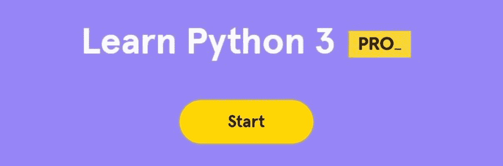](https://kinsta.com/wp-content/uploads/2021/07/codecademypaid-1.jpg)

Codecademy

Codecademy 在我们上面的免费 Python 资源中出现过一次。那是针对 Python 2 的。但是如果你想学习 Python 3，Codecademy 提供了一个付费课程——[学习 Python 3](https://www.codecademy.com/learn/learn-python-3)——你可以通过选择他们的专业会员计划来学习。

本课程向您介绍基本的 Python 和编程概念。当前版本 Python 3 对 Python 2 进行了各种改进，提高了代码的简单性和编写效率。

它涵盖的主题包括:

*   Python 语法和一个“Hello World”程序
*   如何创建控制流、逻辑运算符和布尔变量
*   列表、循环、函数、代码挑战、字符串、模块和字典
*   自动化文件处理、类和参数
*   投资组合项目:正楷，[创建收据](https://kinsta.com/help/hosting-invoices/)，和魔术 8 球游戏

#### 特征

*   课程类型:基于视频
*   时长:30 小时
*   学生:4500 万以上的代码学院学习者
*   每一部分都包括测验和文章
*   先决条件:无，只有你的设备和互联网
*   证书:是
*   费用:每月订阅费用约 20 美元

### 3.eDx

[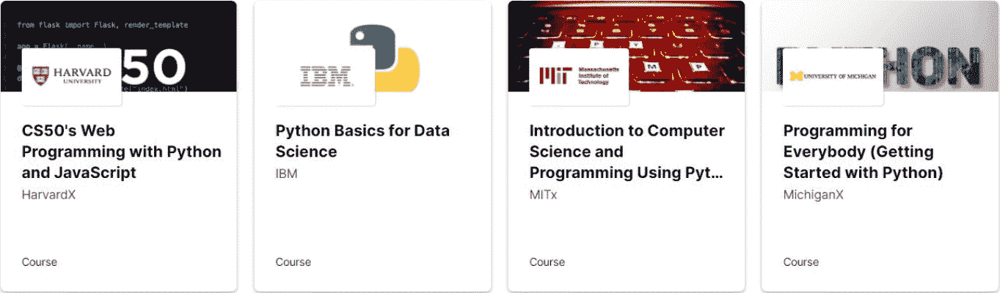](https://kinsta.com/wp-content/uploads/2021/07/edxpaid-1.jpg)

eDx

如前所述， [eDx](https://www.edx.org/) 是一个知名的在线学习平台，与世界顶尖大学有联系。除了免费课程，他们还提供带专业证书的付费课程，以增加你的技能和职业前景。

他们提供的一些报酬最高的 Python 课程有:

#### 1.Python 编程简介

[这门课程](https://www.edx.org/professional-certificate/introduction-to-python-programming)由佐治亚理工学院提供，是为任何想学习 Python 的人设计的。它将把你从一个完全的新手变成一个熟练的 Python 程序员。

这门要求很高的课程将为你提供 Python 和其他计算机科学研究的坚实基础。它设计独特，涵盖了基本的计算机科学原理和 Python 概念。

除了从教师那里获得有关您的理解和进步的持续反馈之外，您还可以访问包含实时编程练习、多项选择题和真实示例的短视频。

它涵盖的主题有:

*   编程基础，如编写代码、执行、解释结果等。
*   变量、运算符、布尔运算等基础知识。
*   控制结构、错误处理和 [Python 库](https://kinsta.com/blog/php-vs-python/#library-support)
*   数据结构和文件操作
*   OOP 技巧和算法

##### 特征

*   课程类型:基于视频
*   持续时间:5 个月，每周 9-10 小时，自定进度
*   4 门技能培养课程
*   认证:是
*   费用:536 美元

#### 2.Python 数据科学

如果你想从事数据科学方面的职业，IBM 的 [Python 数据科学课程可能是一个明智的选择。不管你是这个领域的新手还是已经有了一些经验，这门课程都会帮助你提升自己的技能。](https://www.edx.org/professional-certificate/ibm-python-data-science/)

它将为你从事机器学习和数据科学的职业做准备。该课程包括关于每个 Python 概念的广泛课程、[数据可视化](https://kinsta.com/blog/wordpress-charts/)和分析，以及机器学习的实际介绍。最后，你将会用一个现实生活中的商业问题来完成一个最终的顶点项目。

本课程旨在为工作做准备和实践学习，你将使用数据集和 Python 库和工具包。

本课程涵盖的主题有:

*   Python 基础及其在数据科学中的应用
*   使用 IBM cloud 和 Jupyter 笔记本等工具的迭代概念
*   使用 NumPy 和 Pandas 等工具分析数据
*   使用 Folium、Seaborn 和 Matplotlib 创建数据可视化
*   用 Scipy 和 Scikit 构建 ML 模型-学习
*   解决与数据科学相关的现实问题

##### 特征

*   课程类型:基于视频
*   持续时间:7 个月，每周 3-5 小时，自定进度
*   6 门技能建设课程
*   先决条件:无
*   证书:是
*   费用:574 美元

### 4.Coursera

Coursera 提供了很多 Python 课程，密歇根大学的 [Python 3 编程专门化](https://www.coursera.org/specializations/python-3-programming)课程是其中最好的课程之一。它将通过教你初级和中级 Python 3 概念和练习，帮助你成为一名熟练的 Python 程序员。

当这个程序完成时，你将能够通过阅读 Python 文档编写程序来查询 API 和提取数据，使用新的 API 和模块。如果你已经掌握了 Coursera 的 Python for Everybody Specialization(如免费资源部分所讨论的)，本课程将帮助你迈出下一步。

本课程包括的主题有:

*   如何理解和检查适用于 Python 3 的 API 和第三方库
*   Python 中图像库在图像浏览和操作中的应用
*   将 Python tesseract 库(py-tesseract)用于 Python 3，使用光学字符识别(OCR)检测图像
*   使用开源库 OpenCV 进行图像中的面部识别，处理面部，并将其用于联系表
*   获得课程结业证书的动手项目

#### 特征

*   课程类型:基于视频
*   持续时间:大约。5 个月，每周 7 小时(建议)
*   评分:4.7/5 (12，777 次评分)
*   注册学生:137，249 人
*   字幕:英语、阿拉伯语、西班牙语、法语、意大利语、俄语、德语、韩语、越南语和葡萄牙语
*   先决条件:否
*   证书:是，可共享
*   费用:7 天免费试用，然后每月 49 美元

除此之外，Coursera 还有其他不错的 Python 课程，比如:

*   Google 的 Python 速成班:这个 32 小时的课程是为初学者开设的，帮助你理解 Python 及其在自动化中的重要性。它还指导您创建 Python 对象。
*   [Python for Data Science，AI，& Development](https://www.coursera.org/learn/python-for-applied-data-science-ai) by IBM:注册学生超过 300，000 人，这个 17 小时的课程帮助你学习 Python for web development，Data Science，and artificial intelligence。

### 5.一个月

[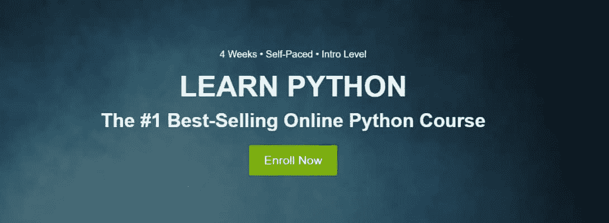](https://kinsta.com/wp-content/uploads/2021/07/onemonth-1.jpg)

One Month

[一个月学会 Python](https://onemonth.com/courses/python)是一门最畅销的在线 Python 课程，你可以在 30 天内完成。如果你是初学者，这是你可以参加的最好的 Python 课程之一，因为它是专门为新手设计的。

它有助于您学习 Python 编码的基本要素:

*   微小的内容
*   每周目标
*   动手项目

他们的学习 Python 课程也在著名的哥伦比亚商学院教授。此外，在过去 3 年里，他们根据 MBA 学生和商业领袖的反馈改进了课程。

这些主题包括:

*   Python 基础和中级概念
*   如何用 Python 写脚本
*   使用 Python 框架，如 Flask
*   如何从 API 中提取数据
*   如何用 Python 搭建网站

#### 特征

*   课程类型:视频教程
*   持续时间:30 天
*   6 个多小时的分步视频教程
*   基于真实世界的 Python 项目
*   先决条件:无
*   证书:是
*   费用:299 美元的年度会员，如果不满意，100%退款保证

关于一个月的另一个值得注意的事情是，他们提供了视频讲座和学习者与教师之间讨论的结合。您可以通过 Slack 频道与其他学习者互动。

### 6.艰难地学习 Python

如果你是一个渴望学习 Python 的图书爱好者，那么 Zed Shaw 的《艰难地学习 Python》就是你所需要的。在这本向初学者教授 Python 的精彩书籍中，作者简化了学习 Python 的方法，这样你就可以从零水平顺利地过渡到更高水平的 Python 程序员。

课程内容分为 52 个精彩的练习，帮助您了解 Python 的工作原理、编写代码、纠正错误以及提高技能的技巧和窍门。它涵盖的主题包括:

*   安装 Python 环境
*   编写和组织代码
*   基础数学、变量、字符串、文件处理、逻辑和循环
*   数据结构与程序设计
*   OOP、类、对象和模块
*   Python 打包、自动化测试和[调试](https://kinsta.com/blog/wordpress-debug/)
*   基础网页和游戏开发

这本书有一张 DVD，里面有 5 个多小时的视频，泽德·肖讨论了这本书的不同方面，可以给你更多的帮助。

#### 特征

*   课程类型:书本
*   持续时间:自定进度
*   先决条件:无
*   证书:否
*   价格:亚马逊 38 美元，艰难学习代码网站 29.99 美元

### 7\. Udacity

[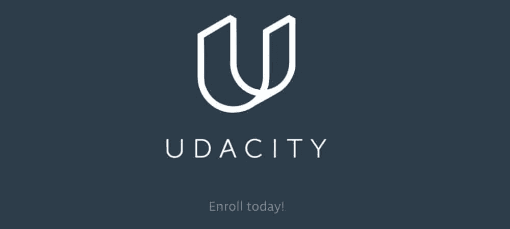](https://kinsta.com/wp-content/uploads/2021/07/udacity-1.jpg)

Udacity

另一个提供 Python 课程的在线学习平台是 [Udacity](https://www.udacity.com/) 。他们的 [Learn Immediate Python](https://www.udacity.com/course/intermediate-python-nanodegree--nd303) 课程是他们的纳米学位项目的一部分，该项目包括各种编程语言的微型课程。

本课程帮助您获得从业者级别的 Python 技能，并学习实现机器学习、数据科学等。

对于想学习高级 Python 的人来说，这个课程非常棒。它使学习者能够利用 Python 提供的特性和功能，并简化执行复杂任务(如文件分类、网页抓取等)的应用程序功能。

完成该课程后，你将获得一个展示你的 Python 技能的作品集，这样你就可以申请相关的工作。

涵盖的主题有:

*   高级 Python 课程，如方法、函数、问题解决策略、基于对象的设计、类和对象、创建代码库，以及将 Python 与[外部文档](https://kinsta.com/blog/google-docs-to-wordpress/)融合
*   如何编写、扩展和构建代码来支持大型系统的开发
*   如何利用开源库快速添加高级功能并将代码打包到库中
*   如何应用面向对象编程来保持代码的模块化、可理解和清晰

#### 特征

*   课程类型:基于视频
*   持续时间:2 个月，10 小时/周
*   先决条件:Python 和面向对象编程的基础知识
*   评分:4.6/5
*   包括来自专家的真实项目和身临其境的内容
*   技术导师支持为您提供指导，回答您的问题，并激励您
*   职业支持，如简历支持、LinkedIn 个人资料优化和 GitHub 投资组合评估
*   基于您的时间表的灵活学习计划
*   无限的反馈循环和提交
*   价格:两个月 530.58 美元

### 8.多元视觉

[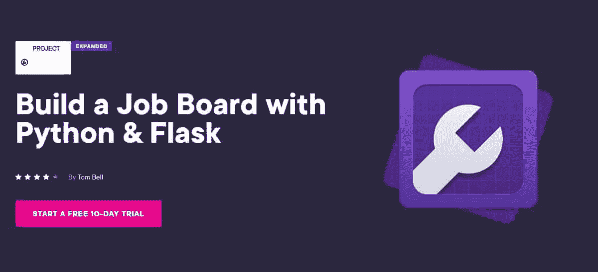](https://kinsta.com/wp-content/uploads/2021/07/pluralsight-1.jpg)

PluralSight

如果想把学到的 Python 技能落实到现实项目中，就要 [PluralSight](https://www.pluralsight.com/projects/build-a-job-board-with-python-flask) 。他们有一门课程可以帮助你使用 Python 和 Flask (web 框架)构建你的工作板。

这门课程既适合初学者，也适合中级程序员。他们将指导您学习 Python 的每个基本方面，包括安装和配置构建环境，以便您可以方便地完成任务。

其中包括的主题有:

*   如何设置本地环境和 Flask
*   提供一致视图的样式和基础模板
*   动态内容准备
*   显示数据库中的单个作业和所有作业
*   显示雇主个人的[所列工作](https://kinsta.com/blog/working-remotely/#where-to-find-remote-work)
*   为用户创建一个雇主评估表，以获得 1 到 5 分的反馈

#### 特征

*   课程类型:视频
*   时长:2 小时 35 分钟
*   评分:4/5
*   先决条件:无
*   证书:不适用
*   费用:联系他们的销售团队，还有 10 天的免费试用期

### 9.Simplilearn

[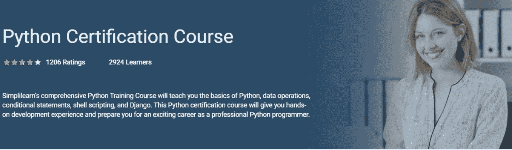](https://kinsta.com/wp-content/uploads/2021/07/simplilearnpaid-1.jpg)

Simplilearn

Simplilearn 是包括 Python 在内的各种学科的高质量教程的中心。他们的 [Python 认证课程](https://www.simplilearn.com/mobile-and-software-development/python-development-training)是一个全面的教程，将教授你 Python 基础、多重操作、Django、 [shell 脚本](https://kinsta.com/knowledgebase/ssh-vs-ssl/#what-is-ssh)等等。

此外，您将承担一个实践项目，并最终完成，为自己在 Python 编程方面的成功职业生涯做好准备。该课程教授你 Python 在现实世界中的应用，并附带了大量的模块、作业和项目。

本课程涵盖以下主题:

*   Python 基础和学习目标
*   数据运算符、函数和条件语句
*   文件操作和错误处理
*   Django 和 shell 脚本
*   单元测试和日志基础设施
*   网络概念
*   关于上述前四个主题的实时虚拟课堂

#### 特征

*   课程类型:视频
*   持续时间:38 小时混合学习、30 小时教师指导学习和 8 小时自定进度在线学习
*   每课结束时 5 次测验，1 个期末专题，每个模块 20 多次辅助练习
*   先决条件:无
*   证书:是
*   费用:自定进度课程 135.50 美元，在线训练营 243.95 美元，两者都是终身访问

### 10.编码游牧民

[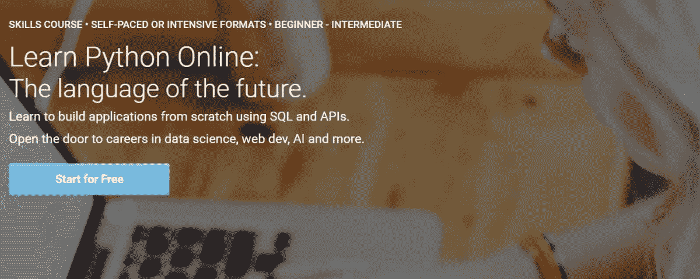](https://kinsta.com/wp-content/uploads/2021/07/codingnomads-1.jpg)

Codingnomads

想用 API 和 SQL 从头开始构建应用吗？

通过编码游牧民在线学习 Python 是另一个很好的选择。成功完成这门课程也有助于你在 web 开发、人工智能和数据科学领域取得令人兴奋的职业生涯。

该课程包括以下主题:

*   Python 用例及基本概念
*   程序员的关键工具，如 GitHub、虚拟环境、PyCharm IDE 和 CLI
*   Python 编程构建自动化软件
*   SQL 和数据库介绍及其与 Python 的集成
*   如何将 Python 应用与 RESTful APIs 集成并利用数百万的数据集
*   最重要的项目

#### 特征

*   课程类型:基于视频
*   持续时间:200 小时的课程和 9 小时以上的视频教程
*   500 多页的教程和文档
*   300 多个实验室练习和代码示例
*   150 多个定制演示和视频教程
*   只有会员才能访问论坛，与教师和学生交流
*   先决条件:无
*   认证:是
*   费用:多层次的每月付款计划和免费试用

[由于在数据科学、机器学习和人工智能等新兴技术中的使用，Python 比以往任何时候都更受欢迎💪今天就开始学习⤵️ 点击推文](https://twitter.com/intent/tweet?url=https%3A%2F%2Fkinsta.com%2Fblog%2Fpython-tutorials%2F&via=kinsta&text=Thanks+to+its+use+in+emerging+technologies+like+data+science%2C+machine+learning%2C+and+artificial+intelligence%2C+Python+is+more+popular+than+ever+%F0%9F%92%AA+Start+learning+it+today+with+this+guide+%E2%A4%B5%EF%B8%8F&hashtags=Python%2CProgramming)

## 摘要

Python 现在需求量很大。而且，由于它对新兴技术拥有出色的能力，预计未来仍将如此。但是如果你想学 Python，先定个目标。

无论你是一个完全的初学者还是已经有一点编程语言经验的人，都可以使用合适的 Python 资源。它可以是视频、基于文本的学习、书籍、[播客](https://kinsta.com/podcast/)或博客的形式。你也可以采取混合的方法，比如交替参加视频课程和听你最喜欢的 Python 播客。

根据你的目标、技能水平、是否需要认证以及预算来选择 Python 教程。完成 Python 课程后，继续在现实项目中运用你的技能来实现你的目标，并继续学习和尝试。

*学习 Python 有什么小技巧吗？在评论区分享吧！*

* * *

让你所有的[应用程序](https://kinsta.com/application-hosting/)、[数据库](https://kinsta.com/database-hosting/)和 [WordPress 网站](https://kinsta.com/wordpress-hosting/)在线并在一个屋檐下。我们功能丰富的高性能云平台包括:

*   在 MyKinsta 仪表盘中轻松设置和管理
*   24/7 专家支持
*   最好的谷歌云平台硬件和网络，由 Kubernetes 提供最大的可扩展性
*   面向速度和安全性的企业级 Cloudflare 集成
*   全球受众覆盖全球多达 35 个数据中心和 275 多个 pop

在第一个月使用托管的[应用程序或托管](https://kinsta.com/application-hosting/)的[数据库，您可以享受 20 美元的优惠，亲自测试一下。探索我们的](https://kinsta.com/database-hosting/)[计划](https://kinsta.com/plans/)或[与销售人员交谈](https://kinsta.com/contact-us/)以找到最适合您的方式。