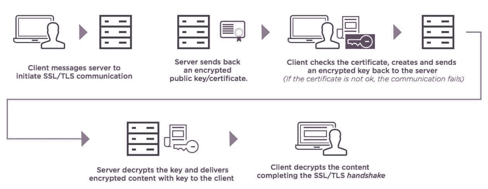
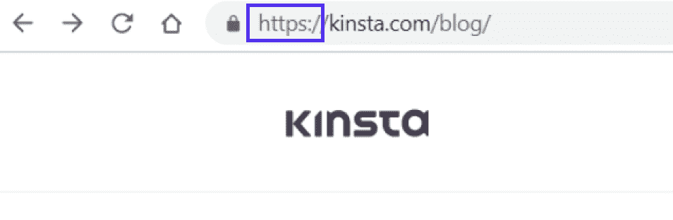

# SSL 证书的类型:哪一种适合您的站点？

> 原文：<https://kinsta.com/blog/types-of-ssl-certificates/>

用 SSL 证书保护的网站让访问者知道它是安全的。它也赢得了搜索引擎的认可，确认你的网站可以安全浏览。因此，你必须为你的网站获得一个有效的 SSL 证书。

SSL 是安全套接字层(Secure Sockets Layer)的缩写，它是一种安全协议，通过网络服务器和网络浏览器之间的网络连接对数据进行认证和加密。SSL 证书保护您的站点和访问者之间的连接，防止恶意方的入侵。

SSL 证书有不同的类型、验证级别和价格标签。但是哪种 SSL 最适合您的网站和业务呢？在本指南中，我们深入研究了不同类型的 SSL 证书，以帮助您做出正确的决定。

请继续阅读！

### 查看我们的[视频指南](https://www.youtube.com/watch?v=r1ITva_UsOY)为您的网站选择正确的 SSL 证书

## 何时以及为什么需要 SSL 证书

无论你经营的是一家电子商务商店还是一个博客，SSL 对于网站来说已经变得和开车前系好安全带一样重要。

以下是您的网站需要 SSL 证书的三个主要原因:

### 1.数据保护和访问者信任

SSL 证书的主要目的是确保用户和 web 服务器之间交换的数据得到加密，并防止黑客、网络钓鱼和身份盗窃等网络威胁。

您不希望您的访问者在访问您的网站时收到“[您的连接不是私人的](https://kinsta.com/blog/your-connection-is-not-private/)”警告。有效的 SSL 证书将帮助您避免此类错误。

SSL 的核心是向访问者表明他们可以安全地在您的网站上共享敏感信息，如信用卡号、id、电子邮件地址和密码。因此，SSL 加强了您和您的客户/访问者之间的信任。

### 2.认证和完整性

当你访问一个网站时，你如何确保它是正确的，而不是一个窃取你信息的骗局？当涉及到 web 安全时，身份验证是必不可少的，这就是 SSL 的用武之地。SSL/TLS 验证 web 服务器身份的真实性。

要[安装 SSL 证书](https://kinsta.com/help/how-to-install-ssl-certificate/)，您必须通过身份验证过程。换句话说，SSL 可以证明你的网站确实是你的*网站，而不是你公司的欺骗或假冒，这使它成为抵御钓鱼网站的有效屏障。看看你如何[验证你的 SSL 证书](https://kinsta.com/knowledgebase/ssl-check/)。*

数据完整性是 SSL/TLS 的另一个重要优势。使用消息认证码(MAC)，SSL/TLS 确保传输的数据不会丢失或以任何方式更改。发送的消息按原样接收。

要了解更多信息，请阅读我们解释 SSL 和 TLS 之间[差异的文章。](https://kinsta.com/knowledgebase/tls-vs-ssl/)

### 3.提高搜索引擎排名

为了让网络浏览对所有人来说都更安全，像谷歌这样的搜索引擎已经打击了不安全的网站，并明确表示他们更喜欢 SSL 加密的网站 HTTP，而不是 HTTP。SSL 将超文本传输协议(HTTP)转变为安全超文本传输协议(HTTPS)。

SSL 现在是一个 SEO 排名信号。所以，如果你想让你的网站出现在谷歌的首页，拥有一个有效的 SSL 证书是必须具备的条件之一。

[一个用 SSL 证书保护的网站让访问者知道它是安全的，并赢得搜索引擎的认可🔒了解如何为您的网站选择合适的⬇️ 点击推文](https://twitter.com/intent/tweet?url=https%3A%2F%2Fkinsta.com%2Fblog%2Ftypes-of-ssl-certificates%2F&via=kinsta&text=A+website+secured+with+an+SSL+certificate+lets+visitors+know+that+it%E2%80%99s+safe%2C+and+wins+the+approval+of+search+engines+%F0%9F%94%92+Learn+how+to+pick+the+right+one+for+your+site+here+%E2%AC%87%EF%B8%8F&hashtags=SSL%2CSiteSecurity)

## SSL 证书如何工作

我们已经确定 SSL 可以加密并保护托管服务器和访问者应用程序(web 浏览器或应用程序)之间的连接。

How SSL certificates work. (Source: [Entrust](https://www.entrust.com/))

如果您想知道这是如何工作的，我们将探索一个例子。

让我们以您的网站为例，假设它是用 SSL 证书保护的。当一个人使用[网络浏览器](https://kinsta.com/browser-market-share/)访问你的网站时，他们的浏览器会要求你网站的主机服务器识别自己。

服务器将通过向浏览器发送其 SSL 证书的副本来做出响应。浏览器还将进行一些验证检查，以验证 SSL 证书是否可信，并向服务器发送信号。

作为回报，服务器会以数字方式作出回应，在您的网站和访问者的浏览器之间开始 SSL 加密会话。

## SSL 证书的类型

有两个不同的类别来区分 SSL 证书的类型—域和子域的数量，以及证书的验证级别。因此，有四种不同的 SSL 证书类型:

### 单域 SSL 证书

顾名思义，这种类型的证书保护一个[单个域](https://kinsta.com/blog/choose-domain-name/)和该域上的所有页面。但是，它不会保护任何关联的子域。

例如，如果你有一个域`*kinsta.com*`的 SSL 证书，它也会覆盖所有与这个域相关的页面，比如`*kinsta.com/knowledgebase/*`。但它不会覆盖任何子域，如`*my.kinsta.com*`。

### 通配符 SSL 证书

与单域 SSL 证书一样，通配符 SSL 证书仅保护单个域。然而，它还[涵盖了与该单个域相关的任何子域](https://kinsta.com/knowledgebase/wildcard-ssl/)(无限数量的子域)。单个通配符 SSL 证书可以保护所有这些。

### 多域 SSL 证书

该证书的目的与通配符 SSL 证书完全相反，因为它保护多个域的安全，但不保护任何相关的子域。它也被称为主题别名(SAN)和统一通信证书(UCC)。

### 多域通配符 SSL 证书

多域通配符 SSL 证书结合了多域和通配符 SSL 证书的功能。换句话说，用一个证书，你可以保护多个域以及所有相关的子域。

## 注册订阅时事通讯

### 想知道我们是怎么让流量增长超过 1000%的吗？

加入 20，000 多名获得我们每周时事通讯和内部消息的人的行列吧！

[Subscribe Now](#newsletter)

## SSL 验证级别

SSL 证书验证级别由证书颁发机构(CA)指定，该机构在向您颁发 SSL 证书之前验证您的业务真实性。

SSL 证书有三种不同的验证级别:

### 域验证(DV) SSL 证书

DV 是 SSL 证书验证的最简单形式，仅适用于[域所有权](https://kinsta.com/blog/google-site-verification/)验证。这通常是通过电子邮件验证完成的，不需要 CA 的任何进一步调查。这也是获取 SSL 证书最便宜、最快的方式。

### 组织验证(OV) SSL 证书

在验证方面，OV 更上一层楼。除了验证您的域，CA 还通过直接联系您或您的企业来验证您的[企业](https://kinsta.com/small-business-hosting/)。CA 验证您拥有该域，并且它是合法注册的企业。这些证书被认为是非常可靠的。

### 扩展验证(EV) SSL 证书

EV 是商业网站中的典型，提供最高级别的信任和可靠性。它包括对你的企业进行全面的背景调查。获得该证书需要通过 CA 的严格审查过程。

在某些浏览器上，带有 EV SSL 证书的企业名称会突出显示。当访问他们的网站时，他们会在域名旁边显示为绿色。

| SSL 证书类型 | 验证级别 |
| 单域 | DV 还是 OV |
| 通配符 | DV 还是 OV |
| 多域 | 电子伏特(electron volt) |
| 多域通配符 | 电子伏特(electron volt) |

## 不同 SSL 证书的优点和缺点

就安全性而言，用 SSL 证书来保护你的网站没有任何坏处。然而，每种类型的证书都有其优点和缺点，使每种证书适合不同的目的或需要。

让我们来看看上面讨论的不同 SSL 证书的优缺点。

从单域 SSL 证书开始，最显著的优势是它是最经济实惠的证书类型，并且覆盖了与域相关的所有页面。唯一的挫折是它不能保护任何子域。

厌倦了没有答案的乏味的网站托管支持？试试我们世界一流的基础设施和支持团队！[查看我们的计划](https://kinsta.com/plans/?in-article-cta)

通配符 SSL 证书更昂贵，但它涵盖了单个域、所有相关页面和第一级无限数量的[子域](https://kinsta.com/blog/wordpress-subdomain/)。不幸的是，它没有涵盖任何二级子域。

多域 SSL 证书同时覆盖多个域。尽管它们看起来很贵，但您只需要获得一个覆盖所有域的证书，而不是为每个域获得一个 SSL 证书，这样更划算。

具有这两种类型的优点，多域通配符 SSL 证书在第一级覆盖多达 100 个域和无限个子域。它唯一的缺点是价格昂贵。但是和多域 SSL 证书一样，通配符 SSL 对于[大型网站或者商家](https://kinsta.com/blog/wordpress-enterprise/)来说是非常划算的。

## 如何选择正确的 SSL 证书

如图所示，SSL 证书有不同的风格。如果你想让你的网站看起来合法，并得到访问者的信任，但不确定哪种 SSL 证书能满足你的需求，我们将帮助你做出正确的选择。

*   对于只有一个域的小型或个人网站来说，单域 SSL 证书更适合你，因为它价格合理，而且很管用。

*   如果你的商业网站只有一个域名，但有多个子域，那么通配符 SSL 证书是一个不错的选择，比每个子域都获得一个单独的 SSL 证书要便宜得多。

*   对于[较大的网站](https://kinsta.com/blog/wordpress-site-examples/)或拥有多个域的企业(例如，拥有多个品牌的公司，每个品牌都有自己的域)，多域 SSL 证书是明智的选择。它将覆盖你所有的域名，并且肯定比每个域名获得一个 SSL 证书要便宜。

*   如果您的[组织](https://kinsta.com/enterprise-wordpress-hosting/)想要节省时间和金钱，多域通配符 SSL 是保护多个域和无限数量子域的理想选择。

为了便于参考，这里有一个简要的表格，列出了每种 SSL 证书类型的优点:

| SSL 证书 | 支付能力 | 优势 | 不足之处 | 最适合 |
| 单域 | 最便宜最实惠 | 保护单个域的经济性 | 不保护子域 | 只有一个域的小网站 |
| 通配符 | 比单域 SSL 贵，但更具成本效益 | 在一级保护无限的子域名 | 它只涵盖了一个子域级别 | 具有单个域和多个子域的中小型网站 |
| 多域 | 昂贵的 | 用一个证书保护多个域 | 必须在颁发此证书之前定义域 | 拥有一个以上域名的大型商业网站 |
| 多域通配符 | 最贵，但也是性价比最高的 | 单个证书在第一级保护多个域和无限的子域 | 昂贵的和任何改变域和子域将需要重新颁发此证书 | 拥有多个域和子域的大型网站/企业 |

## 访问者如何知道你的网站是否有 SSL 证书

您的访问者可以很快知道 SSL 证书是否保护您的网站，以及您的 SSL 证书是否有效。我们会告诉你怎么做。

看看 Kinsta 主页的地址栏，你会[看到一个小挂锁](https://kinsta.com/knowledgebase/ssh-vs-ssl/#what-do-you-use-ssl-for)。这意味着我们的网站是 SSL 安全的。

如果你使用的是谷歌浏览器，点击挂锁标志并选择“证书”现在，您将看到您需要了解的关于安装在我们的 Kinsta 网站上的 SSL 证书的所有细节:谁发布了它，它属于谁，以及它的有效日期。

除了小挂锁符号，你会注意到地址栏中的 URL 以 HTTPS 开头(在一些浏览器中默认是隐藏的)。HTTPS 表示，我们网站上的连接是安全的，它有一个授权的 SSL 证书。

浏览器地址栏中 HTTPS 的位置。

你是否在网站上安装了 SSL 证书，但访问者却遇到了*NET::ERR _ CERT _ AUTHORITY _ INVALID*错误？没必要惊慌——查看这个[详细教程](https://kinsta.com/knowledgebase/neterr-cert-authority-invalid/)来学习如何修复这个错误。

## SSL 证书的成本

SSL 证书的费用从免费到掏钱不等，取决于证书的类型、验证级别和购买地点(例如 Comodo、VeriSign、GeoTrust 等)。).

所有托管在 Kinsta 的 WordPress 站点都受到我们的 [Cloudflare 集成](https://kinsta.com/cloudflare-integration/)、、的保护，其中包括带有通配符支持的、**免费 SSL 证书。**

在投资高级或付费 SSL 证书时，DV 和单域 SSL 证书的成本是最实惠的。

随着您的业务需求的增长和您在 SSL 阶梯上更上一层楼，您会发现通配符 SSL 证书的成本会更高。相比之下，OV 和 EV SSL 证书是最昂贵的，并为组织和企业提供最高的加密。

[Struggling to pick the right SSL certificate for your business? 🤯 This guide is here to help ⬇️Click to Tweet](https://twitter.com/intent/tweet?url=https%3A%2F%2Fkinsta.com%2Fblog%2Ftypes-of-ssl-certificates%2F&via=kinsta&text=Struggling+to+pick+the+right+SSL+certificate+for+your+business%3F+%F0%9F%A4%AF+This+guide+is+here+to+help+%E2%AC%87%EF%B8%8F&hashtags=SSL%2CSiteSecurity)

## 摘要

几乎每个网站都广泛采用 SSL 证书来保证安全的互联网连接。随着网络威胁的增加，难怪它会被流行的搜索引擎严格执行。

现在，您对不同类型的 SSL 证书及其各种验证级别有了清晰的了解。我们希望它能帮助你选择最适合你的网站的 SSL 证书。

使用 SSL 证书保护您的网站后，请[执行 SSL 检查](https://kinsta.com/knowledgebase/ssl-check/)以验证一切正常。从 HTTP 迁移到 HTTPS 需要很多改变，所以也请阅读我们的 [HTTP 到 HTTPS 迁移](https://kinsta.com/blog/http-to-https/)指南。

关于选择正确的 SSL 证书，您有什么问题吗？请在评论区告诉我们！

* * *

让你所有的[应用程序](https://kinsta.com/application-hosting/)、[数据库](https://kinsta.com/database-hosting/)和 [WordPress 网站](https://kinsta.com/wordpress-hosting/)在线并在一个屋檐下。我们功能丰富的高性能云平台包括:

*   在 MyKinsta 仪表盘中轻松设置和管理
*   24/7 专家支持
*   最好的谷歌云平台硬件和网络，由 Kubernetes 提供最大的可扩展性
*   面向速度和安全性的企业级 Cloudflare 集成
*   全球受众覆盖全球多达 35 个数据中心和 275 多个 pop

在第一个月使用托管的[应用程序或托管](https://kinsta.com/application-hosting/)的[数据库，您可以享受 20 美元的优惠，亲自测试一下。探索我们的](https://kinsta.com/database-hosting/)[计划](https://kinsta.com/plans/)或[与销售人员交谈](https://kinsta.com/contact-us/)以找到最适合您的方式。