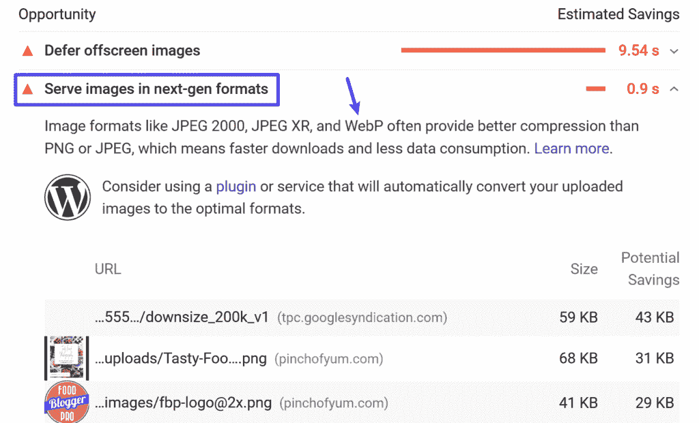
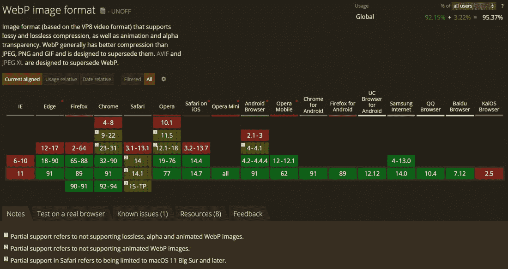
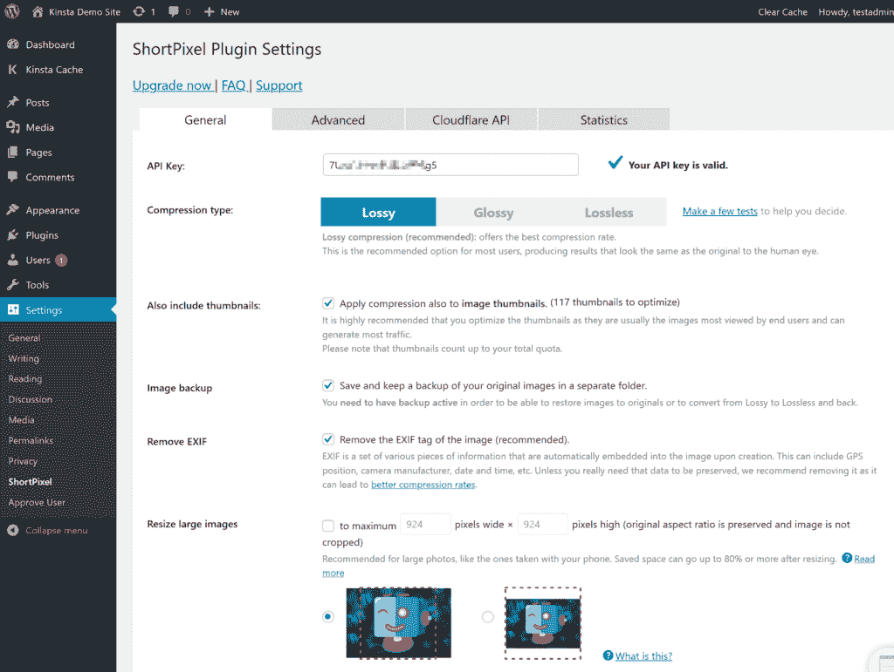
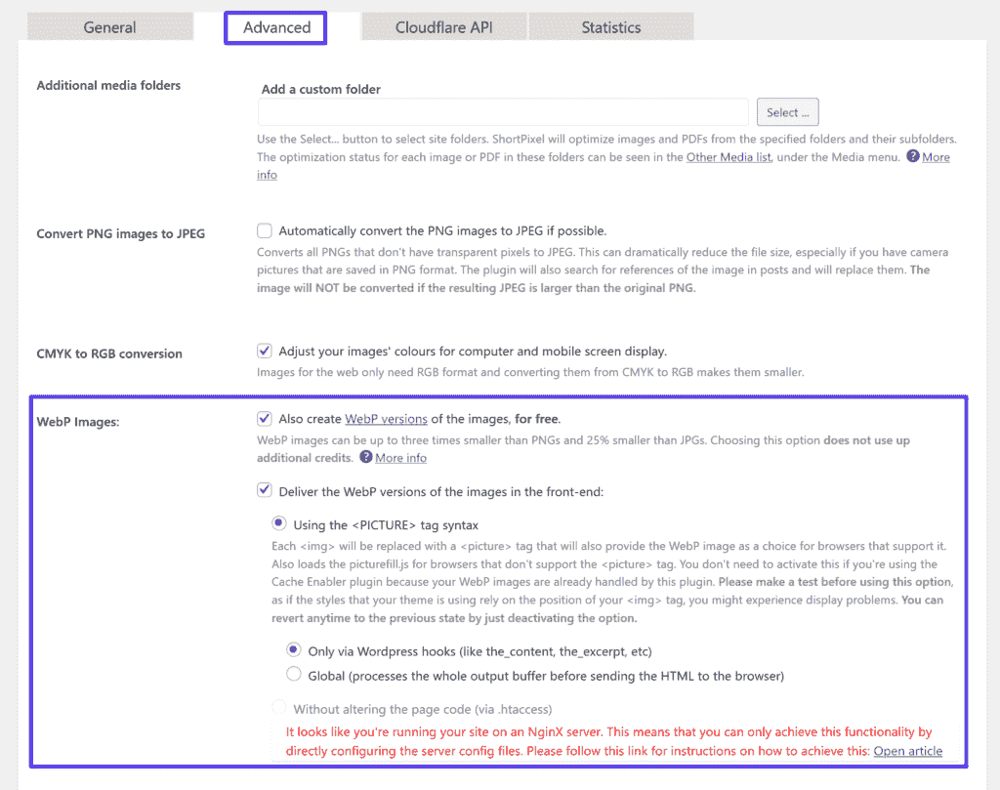
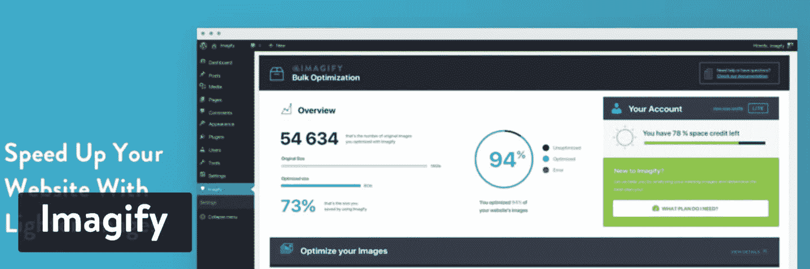
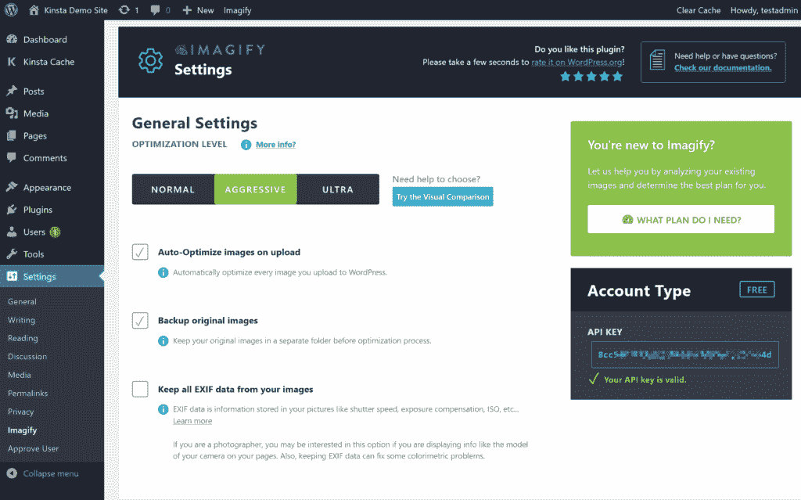
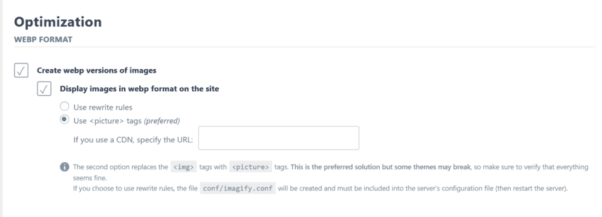
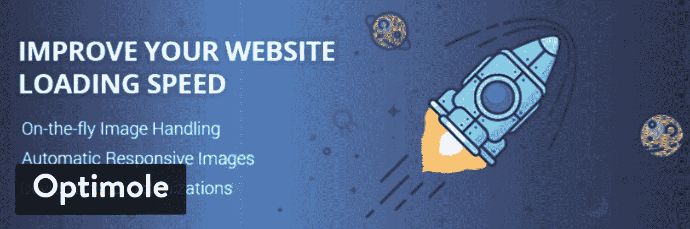
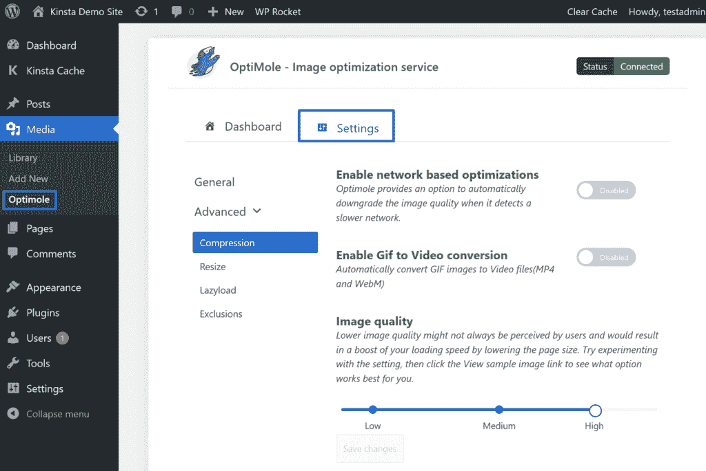

# 如何在 WordPress 上使用 WebP 图片(将图片文件大小缩小 35%)

> 原文:# t0]https://kinta . com/blog/web/

如果你想加快你的 WordPress 站点的速度，减小图片的文件大小会给你的投资带来可观的回报。平均而言，图片占网页文件大小的一半左右，因此即使是微小的改进也会产生巨大的效果。WebP 可以在这方面给你极大的帮助！

WebP 是一种现代图像格式，可以帮助您在不改变图像外观的情况下缩小图像的大小。平均来说，学习如何将图像转换成 WebP 可以将文件大小缩小 25-35%,而质量没有明显的损失。

大多数[现代浏览器](https://kinsta.com/browser-market-share/)和 [WordPress 5.8+](https://kinsta.com/blog/wordpress-5-8/) 都支持 WebP 开箱即用。在本文中，我们将深入探讨这种令人兴奋的新图像格式，并向您展示如何利用它的神奇之处。

准备好了吗？我们开始吧！

## 什么是 WebP？

那么，什么是 WebP 文件呢？简单来说，WebP 是 Google 开发的一种比流行的图像格式(当时)更好地优化图像的图像格式。例如，你有像 JPEG 或 JPG 和 PNG 这样的图像格式。

**注意:**看看[不同的图像文件类型](https://kinsta.com/blog/image-file-types/)如何影响你网站的速度。

WebP 专注于提供相同的图像文件，只是文件更小。通过减小图像文件的大小，你仍然可以给网站的访问者同样的体验，但是你的网站会加载得更快。

> 需要在这里大声喊出来。Kinsta 太神奇了，我用它做我的个人网站。支持是迅速和杰出的，他们的服务器是 WordPress 最快的。
> 
> <footer class="wp-block-kinsta-client-quote__footer">
> 
> 
> 
> <cite class="wp-block-kinsta-client-quote__cite">Phillip Stemann</cite></footer>

[View plans](https://kinsta.com/plans/)

例如，在[谷歌的 WebP 压缩研究](https://developers.google.com/speed/webp/docs/webp_study)中，谷歌发现一个 WebP 图像文件平均:

*   比类似的 JPEG 图像小 25-34%。
*   比可比的 PNG 图像小 26%。

这就是为什么如果你[通过 PageSpeed Insights](https://kinsta.com/blog/google-pagespeed-insights/) 运行你的网站，许多建议之一是**提供像 WebP** 这样的下一代格式的图片:

Google PageSpeed Insights suggests using WebP images

那么 Google 的 WebP 格式是如何实现这些文件大小的缩减的呢？

首先，它支持[有损和无损压缩](https://kinsta.com/blog/lossy-vs-lossless)，因此确切的减少量将取决于您使用的是有损还是无损压缩。

对于有损压缩，WebP 使用一种叫做“预测编码”的东西来降低文件大小。预测编码使用图像中相邻像素的值来预测值，然后只对差值进行编码。它基于 VP8 关键帧编码。

无损 WebP 使用一组由 WebP 团队开发的更复杂的方法。

如果您想详细了解 WebP 压缩技术，[这篇文章是一个很好的起点](https://developers.google.com/speed/webp/docs/compression)。
T3】

## 哪些网络浏览器支持 WebP？

为了让 WebP 图像工作，访问者的网络浏览器需要支持它们。不幸的是，虽然浏览器支持已经增长了很多， **WebP 兼容性仍然不是普遍的**。

流行的浏览器支持 WebP 图像，例如:

*   Chrome ( *桌面和移动*)
*   Firefox ( *桌面和移动*)
*   微软 Edge
*   iOS 和 macOS Safari ( *macOS 11 Big Sur 和更高版本仅*)
*   Opera ( *桌面和移动*)

在我们写这篇文章的时候，Safari 只部分支持 WebP 图片。

Internet Explorer 也缺乏 WebP 支持(但 Edge 支持 WebP，因为它基于 Chromium)。然而，IE 的使用已经萎缩到不到总互联网用户的 1%。这对网络上的每个人来说都是一个福音！

总的来说，[大约 95%的互联网用户](https://caniuse.com/#feat=webp)使用支持 WebP 的浏览器。因此，虽然它肯定得到了大多数人的支持，但这 5%是一个小障碍，特别是当它是旧 macOS 版本的 Safari 用户时。在我们下面的 WordPress WebP 教程中，我们将向你展示如何处理这个问题，这样你所有的访问者都会有很好的体验。

WebP support across major browsers.

## WebP 与 JPG 和巴布亚新几内亚的大小比较

根据谷歌的测试，WebP 图片是:

*   比类似的 JPEG 图像小 25-34%。
*   比类似的 PNG 图像小 26%。

如果你想了解更多关于谷歌的方法，你可以在下面找到完整结果的直接链接:

*   [JPEG](https://developers.google.com/speed/webp/docs/webp_study)
*   [PNG](https://developers.google.com/speed/webp/docs/webp_lossless_alpha_study#results)

这两项测试都基于超过 11，000 张图像，包括:

*   著名的[蕾娜形象](https://en.wikipedia.org/wiki/Lenna)
*   来自[柯达真彩色图像套件](http://r0k.us/graphics/kodak/)的 24 幅图像
*   来自 Tecnick.com 的 100 张图片
*   来自谷歌图片搜索的 11，000 多张图片的随机样本

## 如何在 WordPress 上使用 WebP 图片

从 [WordPress 5.8](https://kinsta.com/blog/wordpress-5-8/) 开始，你将能够像使用 JPEG、PNG 和 GIF 格式一样使用 WebP 图像格式。只需[将您的图像上传到您的媒体库](https://kinsta.com/blog/wordpress-media-library/)并将它们包含在您的内容中。由于 WordPress 5.8+默认支持 WebP 格式，所以你不必安装第三方插件来上传 WebP 图片。对于大多数常见用例来说，这应该足够了。

要立即开始，你可以参考我们关于在 WordPress 5.8+ 中使用 WebP 图片的[快速入门。我们建议你浏览一下 WordPress](https://kinsta.com/blog/wordpress-5-8/#how-to-use-webp-images-in-wordpress) 中关于 WebP 支持的[警告。](https://kinsta.com/blog/wordpress-5-8/#caveats-about-webp-in-wordpress-58)

然而，大约有 5%的人(主要是旧 macOS 上的 Safari 用户)使用不支持 WebP 的网络浏览器。如果你转换 WebP 图片并直接在你的内容中使用，那些访问者将看不到你的图片，这将破坏他们的浏览体验。

此外，生成 WebP 图像并不像获得 JPG/JPEG 图像那样简单，这是大多数相机、智能手机和[在线图像库](https://kinsta.com/blog/free-images-for-wordpress/)的默认图像文件格式。WordPress 不支持自动图像转换为 WebP 格式(还没有！).

不要烦恼！有一个解决办法。

你可以使用一个 WordPress 插件将你的原始图片转换成 WebP 格式**，如果访问者的浏览器不支持 WebP，那么**还可以提供原始图片作为后备。

例如，如果你上传一个 JPEG 文件到你的站点，插件将:

*   将 JPEG 文件转换为 WebP，并为 Chrome、Firefox、Edge 等提供 WebP 版本。
*   向使用 Safari(在较旧的 macOS 版本上)和其他不支持 WebP 的浏览器浏览的访问者显示原始 JPEG 文件。

这样，每个人都可以看到您的图像，每个人都可以获得最快的体验。

下面，我们将浏览一些**最好的 WebP WordPress 插件**，所有这些插件都与 Kinsta 和[kin sta CDN](https://kinsta.com/help/kinsta-cdn/)一起工作。

 

### 信息

如果你在 Kinsta 托管，你需要[联系我们的支持](https://kinsta.com/kinsta-support/)，这样我们就可以为这些插件的 WebP 缓存桶创建一个 Nginx 规则。

### 短像素

ShortPixel WordPress plugin

ShortPixel 是一个流行的 WordPress [图片优化](https://kinsta.com/blog/optimize-images-for-web/)插件，可以帮助你自动调整和压缩你上传到 WordPress 网站的图片。

## 注册订阅时事通讯

### 想知道我们是怎么让流量增长超过 1000%的吗？

加入 20，000 多名获得我们每周时事通讯和内部消息的人的行列吧！

[Subscribe Now](#newsletter)

作为其功能列表的一部分，ShortPixel 还可以帮助您自动将图像转换为 WebP，并将这些图像提供给支持它的浏览器。

ShortPixel 有一个有限的免费计划，让你每月免费优化大约 100 张图像。付费计划的起价为每月 4.99 美元，最多可获得 5000 张图片/积分，或者一次性获得 10000 个积分的费用为 9.99 美元。

ShortPixel 把你优化的每一个 WordPress 图片大小算作一个积分。因此，如果你想优化多个图像缩略图大小，一个图像可能会使用许多信用。图像没有文件大小限制。

您可以将您的 ShortPixel 点数分散到无限的网站上——没有每个网站的限制(*并且您的所有网站都可以使用同一个 ShortPixel 帐户*)。

要使用 ShortPixel 在 WordPress 上提供 WebP 图片，你需要安装来自 WordPress.org 的插件[，并添加你的 API 密匙(*，你可以通过注册一个免费的 ShortPixel 账户*获得)。](https://wordpress.org/plugins/shortpixel-image-optimiser/)

在**常规**选项卡中，您可以设置图像优化工作的基本设置。例如，使用何种压缩级别以及是否调整图像大小:

How to set compression level and image dimensions in ShortPixel

要启用 WebP 图像，请转到**高级**选项卡，然后:

1.  勾选 **WebP 图像的复选框**
2.  选中复选框**交付 WebP 版本…** (在选中第一个复选框后出现)
3.  使用<图片>标签语法选择**的单选按钮(在选中前一个框后出现)**
4.  仅通过 WordPress 挂钩选择保留默认

 **

How to enable WordPress WebP images in ShortPixel

然后，保存您的更改。

如果你在 Kinsta 上托管，ShortPixel 会给你一个关于在 Nginx 上配置服务器配置文件的警告信息。要配置这些设置，您可以[联系 Kinsta support](https://kinsta.com/kinsta-support/) ，我们很乐意为您设置服务器配置。

### 意象

Imagify WordPress plugin

[Imagify](https://kinsta.com/blog/optimize-images-for-web/#imagify) 是一款流行的图片优化插件，与 [WP Rocket](https://wp-rocket.me/) ( [为数不多的与 Kinsta](https://kinsta.com/blog/wp-rocket/) 合作的缓存插件之一)出自同一开发商。

厌倦了你的 WordPress 站点缓慢的主机？我们提供超快的服务器和来自 WordPress 专家的 24/7 世界级支持。[查看我们的计划](https://kinsta.com/plans/?in-article-cta)

它可以自动压缩和调整你上传到 WordPress 网站的图片。然后，它还可以帮助您将它们转换成 WebP，并通过支持它的浏览器将这些版本提供给访问者。

在功能方面，ShortPixel 和 Imagify 有很多相似之处。最显著的区别来自于价格。ShortPixel 根据图像收费，没有图像大小限制，而 Imagify 根据整体文件大小收费，没有图像限制。

因此，如果你需要优化大量的大图像，ShortPixel 的方法可能会更便宜。但是如果你需要优化大量的小图像，Imagify 的方法可能更实惠。

Imagify 有一个有限的免费层，允许每月 25 MB 的优化。之后，付费计划的起价为每月 4.99 美元，最高可达 1 GB，或 9.99 美元的一次性 1 GB 信用额度。

像 ShortPixel 一样，你可以将你的账户限额分散到无限的网站上。

要使用 Imagify 来发送 WordPress WebP 图片，你需要安装来自 WordPress.org 的插件[，并添加你的 API 密匙。](https://wordpress.org/plugins/imagify/)

一旦你激活了插件，你可以使用**通用设置**框来选择你的压缩级别。

How to set compression level in Imagify

要启用 WebP 图像，向下滚动到**优化**部分，找到 **WebP 格式**部分:

1.  勾选复选框**创建图像的 webp 版本**
2.  勾选复选框**以 webp 格式显示图像…**
3.  选择单选按钮**使用<图片>标签**

How to enable WordPress WebP images in Imagify

和 ShortPixel 一样，如果你在 Kinsta 托管，你需要为 WebP 缓存桶创建一个 [Nginx](https://kinsta.com/knowledgebase/what-is-nginx/) 规则(联系 Kinsta 支持)。
T3】

### 最佳的

Optimole WordPress plugin

Optimole 是一个 WordPress 图片优化插件，它的操作与 Imagify 和 ShortPixel 略有不同。Optimole 可以自动压缩和调整您的图像。然而，它还有另外两个显著的特点:

1.  它可以通过它的 CDN(由 Amazon CloudFront 提供支持)提供你的图片。
2.  它提供实时自适应图像，Optimole 将为每位访客提供最佳尺寸的图像。例如，在小屏幕上浏览的人将获得比在视网膜屏幕上浏览的人更低分辨率的图像。

这种方法类似于其他实时优化/操作服务，如 Cloudinary、imgix、KeyCDN 图像处理等。

Optimole 还可以向浏览器支持的访问者提供 WebP 图像，作为这种实时图像优化的一部分。

Optimole 有一个有限的免费计划，每月可以向大约 5，000 名访问者提供图像服务。之后，付费计划每月 19 美元起，适用于约 25000 名访客。

首先，你需要安装来自 WordPress.org 的[插件，并使用 API 密匙*激活它，你可以通过注册一个免费的 Optimole 账户*来获得这个密匙。](https://wordpress.org/plugins/optimole-wp/)

一旦你这样做了，Optimole 将开始自动优化你的图像，并通过它的 [CDN](https://kinsta.com/blog/wordpress-cdn/) 发送它们。默认情况下，WebP 支持是打开的，所以没有必要手动启用它。

要配置其他设置，如压缩级别和缩放行为，您可以进入 **Media → Optimole → Settings** :

Optimole enables WordPress WebP images by default.

由于 Optimole 通过其 CDN 处理图像的传送，如果你在 Kinsta 上托管，就没有必要设置任何 Nginx 规则。

[Increase ⬆️ site speed while decreasing ⬇️ image sizes. Learn how to take advantage of the WebP format on your #WordPress site 💥Click to Tweet](https://twitter.com/intent/tweet?url=https%3A%2F%2Fkinsta.com%2Fblog%2Fwebp%2F&via=kinsta&text=Increase+%E2%AC%86%EF%B8%8F++site+speed+while+decreasing+%E2%AC%87%EF%B8%8F++image+sizes.+Learn+how+to+take+advantage+of+the+WebP+format+on+your+%23WordPress+site+%F0%9F%92%A5&hashtags=WebP%2Csitespeed)

## 摘要

你的 WordPress 站点的图片占了一个普通页面文件大小的很大一部分。如果你能找到减小图片尺寸的方法，你就能在不影响用户体验的情况下加速你的网站。WebP 是一种现代图像格式，与 JPEG 或 PNG 文件相比，文件大小减少了约 25%。

大约 95%的互联网用户已经在使用支持 WebP 的浏览器。WordPress 5.8+版本现在也支持 WebP 开箱即用。所以你没有理由不使用它。

然而，少数浏览器，尤其是老版本 macOS 上的 Safari，仍然不支持 WebP。因此，您还不能向所有访问者提供 WebP 图像。为了解决这个问题，你可以使用一个 WordPress 插件，将图片转换成 WebP，并将 WebP 版本提供给浏览器支持它的访问者，而将原始图片提供给浏览器不支持它的访问者。

要了解更多优化图片的策略，请查看[我们针对网页性能优化图片的完整指南](https://kinsta.com/blog/optimize-images-for-web/)。

如果你有任何关于在 WordPress 上使用 WebP 的问题，请在下面的评论中问我们！

* * *

让你所有的[应用程序](https://kinsta.com/application-hosting/)、[数据库](https://kinsta.com/database-hosting/)和 [WordPress 网站](https://kinsta.com/wordpress-hosting/)在线并在一个屋檐下。我们功能丰富的高性能云平台包括:

*   在 MyKinsta 仪表盘中轻松设置和管理
*   24/7 专家支持
*   最好的谷歌云平台硬件和网络，由 Kubernetes 提供最大的可扩展性
*   面向速度和安全性的企业级 Cloudflare 集成
*   全球受众覆盖全球多达 35 个数据中心和 275 多个 pop

在第一个月使用托管的[应用程序或托管](https://kinsta.com/application-hosting/)的[数据库，您可以享受 20 美元的优惠，亲自测试一下。探索我们的](https://kinsta.com/database-hosting/)[计划](https://kinsta.com/plans/)或[与销售人员交谈](https://kinsta.com/contact-us/)以找到最适合您的方式。**