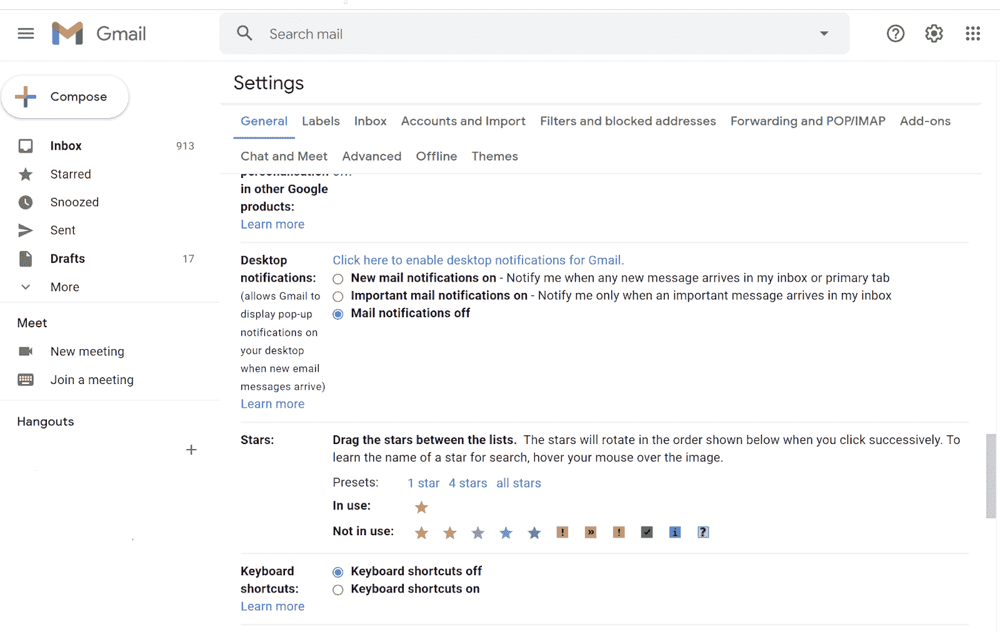
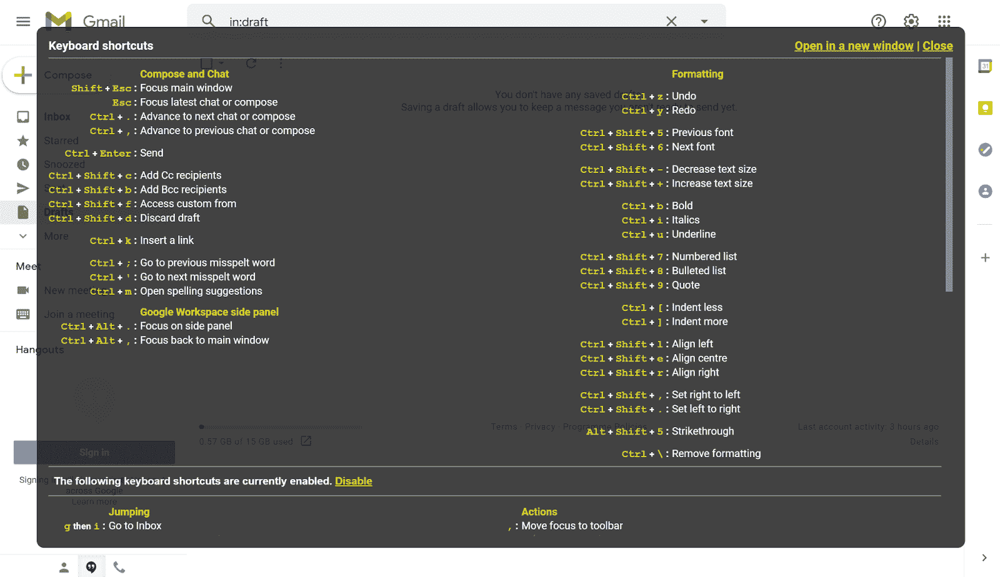
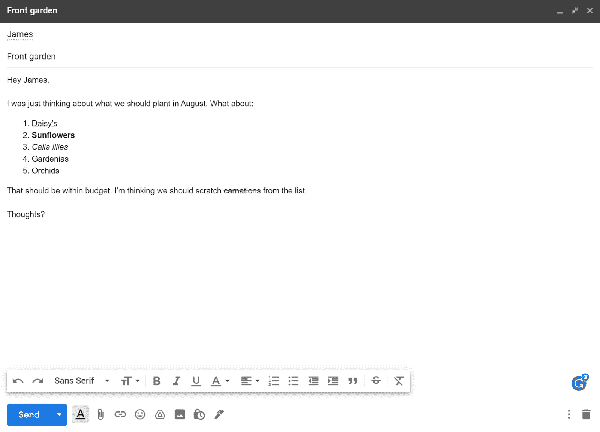
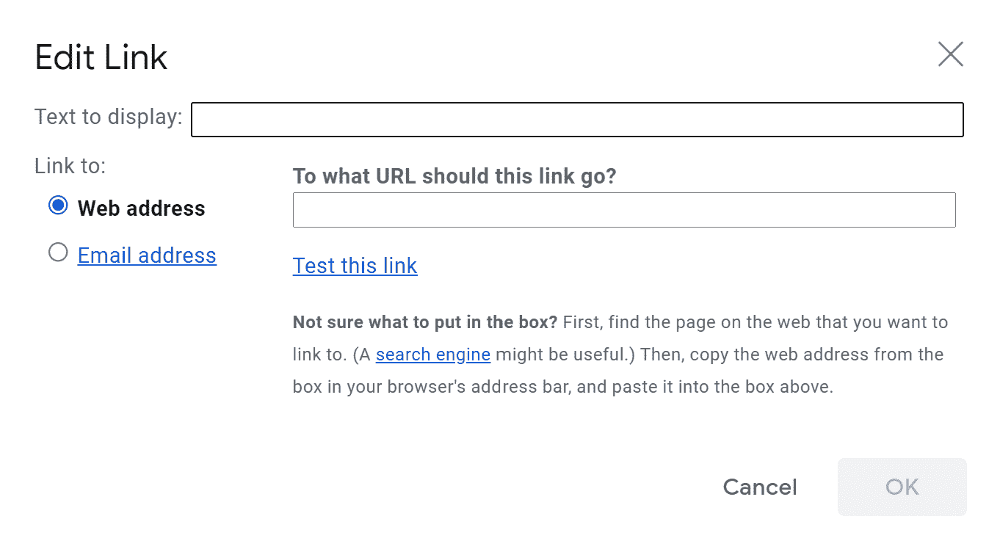
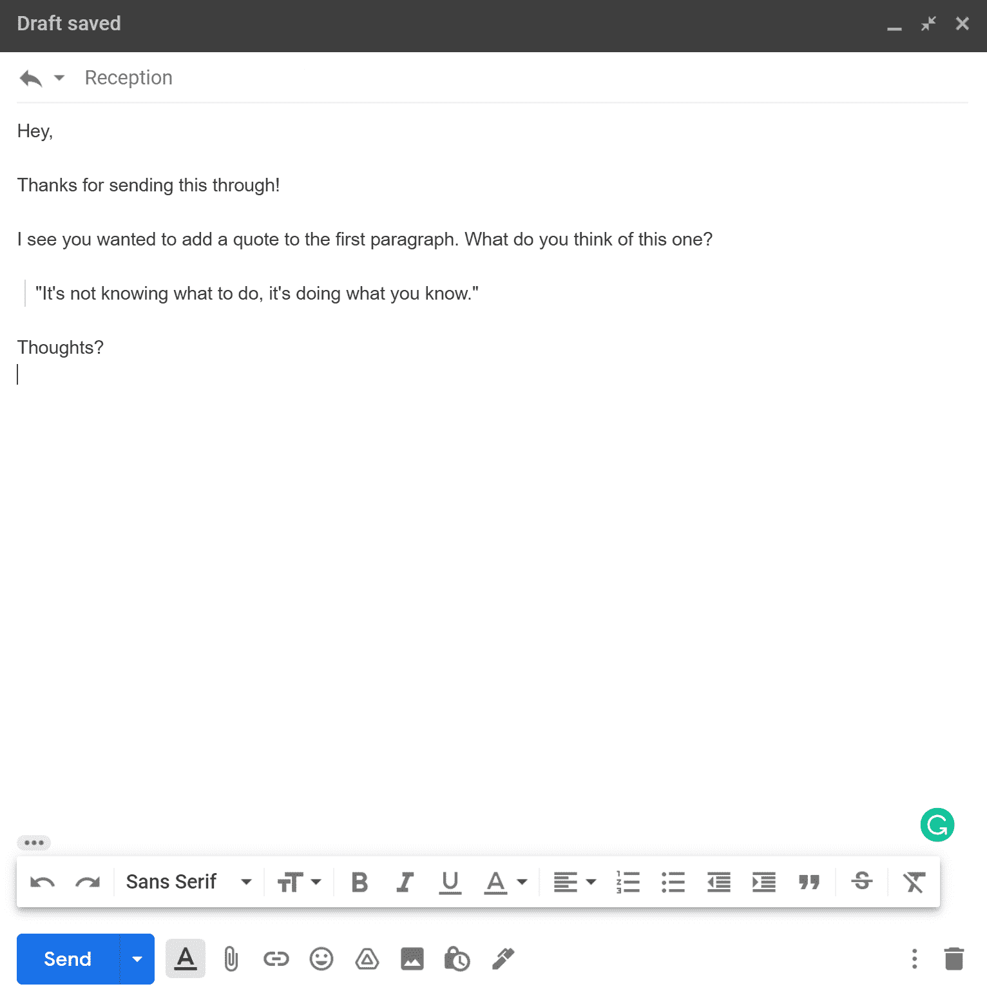
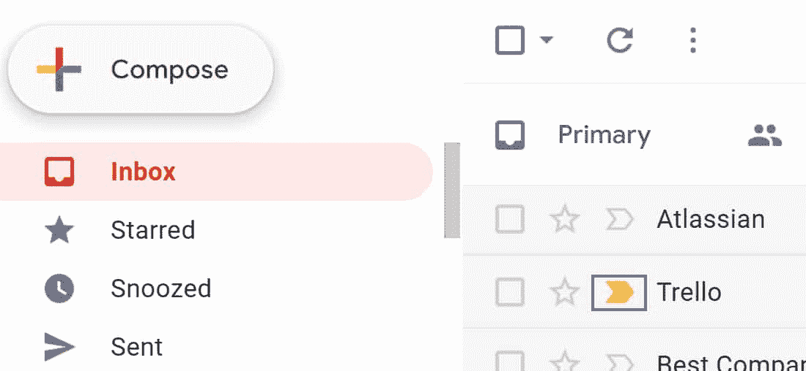
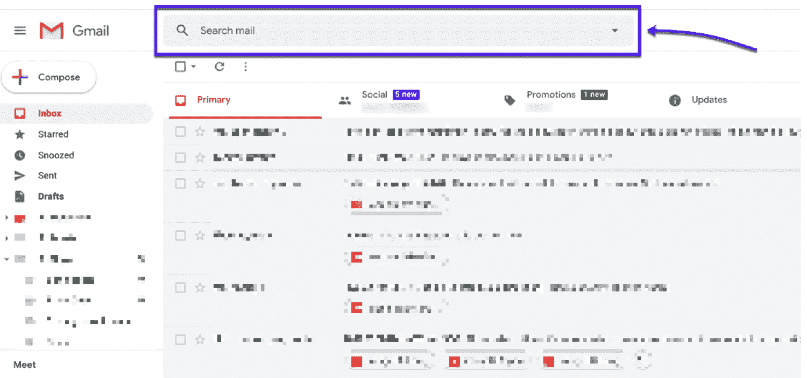

# 48 个方便的 Gmail 键盘快捷键，大大提高您的工作效率

> 原文：<https://kinsta.com/blog/gmail-keyboard-shortcuts/>

如果你想减少花在电子邮件上的时间，学习 Gmail 键盘快捷键是一项了不起的投资。

像我们大多数人一样，你可能每周都会浪费几分钟浏览你的邮箱——无论你是在寻找旧文件，格式化电子邮件，还是反复检查你不会把你的周末计划抄送给整个办公室。

对这一切说再见吧！这些 Gmail 键盘快捷键将减少您的日常工作量，让您腾出时间来完成[更高效的](https://kinsta.com/blog/best-chrome-extensions/)任务。我们将从解释如何在 Gmail 中启用键盘快捷键开始，然后介绍 48 个方便的 Gmail 快捷键。

准备好了吗？我们开始吧！

### 查看我们的[视频指南](https://www.youtube.com/watch?v=hJJQhJG1xNQ)Gmail 键盘快捷键

## 什么是 Gmail 快捷方式？

在我们开始研究节省时间的快捷键列表之前，让我们先简单了解一下键盘快捷键的基础知识。键盘快捷键是一个键或一系列键，用于完成用户通常使用鼠标执行的操作。

> Kinsta 把我宠坏了，所以我现在要求每个供应商都提供这样的服务。我们还试图通过我们的 SaaS 工具支持达到这一水平。
> 
> <footer class="wp-block-kinsta-client-quote__footer">
> 
> 
> 
> <cite class="wp-block-kinsta-client-quote__cite">Suganthan Mohanadasan from @Suganthanmn</cite></footer>

[View plans](https://kinsta.com/plans/)

你现在可能正在想象许多常见的快捷方式，比如用于复制文本的 **Ctrl+C** (Windows)或 **⌘+C** (Mac)。另一个标准快捷键是文本搜索的 **Ctrl+F** (Windows)或 **⌘+F** (Mac)。这些对于提高工作效率很有帮助，但它们不是唯一的键盘快捷键。

Gmail 有自己的一套快捷方式，专为高效发送电子邮件而设计。使用这些快捷方式有很多好处:

*   更快地浏览您的 Gmail 收件箱。
*   在不中断流程的情况下执行日常格式化操作。
*   无需使用鼠标，保持符合人体工程学的运动。

那么，如何打开键盘快捷键呢？

[Want to reduce the amount of time you spend on email? 📧 You need these shortcuts ⬇️Click to Tweet](https://twitter.com/intent/tweet?url=https%3A%2F%2Fkinsta.com%2Fblog%2Fgmail-keyboard-shortcuts%2F&via=kinsta&text=Want+to+reduce+the+amount+of+time+you+spend+on+email%3F+%F0%9F%93%A7+You+need+these+shortcuts+%E2%AC%87%EF%B8%8F&hashtags=GmailHacks%2CProductivity)

## 如何使用 Gmail 键盘快捷键

您需要手动打开 Gmail 键盘快捷键，然后才能使用它们。谢天谢地，这是一个非常简单的过程。你只需要遵循这六个步骤:

1.  去 Gmail。
2.  点击**设置**图标。
3.  点击**查看所有设置**。
4.  滚动到**键盘快捷键**部分。
5.  通过选择单选按钮打开键盘快捷键。
6.  点击页面底部的**保存**。

在 Gmail 中开启键盘快捷键。

如果你有[个 Gmail 账户](https://kinsta.com/blog/multiple-gmail-accounts/)，你需要为每个账户执行以下步骤。

一旦你打开了 Gmail 快捷键，你就需要学习如何使用它们。接下来让我们来探索一下。

### 如何找到 Gmail 键盘快捷键？

谷歌将通过快捷菜单向您显示 Gmail 键盘快捷键的完整列表。启用快捷方式后，您可以通过按住 **Shift+调出快捷方式菜单。**在 Gmail 中。

**键盘快捷键**弹出菜单允许您选择是否要启用或禁用快捷键组，如下图所示:

Gmail 的键盘快捷选项

有两个关键的地方你可以找到更多关于快捷方式的信息。

首先，你会在 Gmail 的网站上找到它的快捷方式列表[。第二，你可以使用键盘快捷键训练工具，比如](https://support.google.com/mail/answer/6594?)[快捷键 Foo](https://www.shortcutfoo.com/) 。

如果您想扩展 Gmail 默认快捷方式之外的快捷方式，您也可以创建自定义快捷方式。为此，您需要按照以下说明打开自定义快捷方式:

1.  进入 Gmail，点击**设置**。
2.  点击**高级**。
3.  点击自定义快捷键旁边的**启用**。
4.  按下**保存更改**。

### 为什么我的 Gmail 快捷方式仍然无法使用？

如果你按照上面的步骤操作，你的键盘快捷键应该是有效的。然而，人们偶尔会遇到一些打嗝。

以下是三个常见问题及其解决方案:

| 问题 | 解决办法 |
| --- | --- |
| 您的快捷方式没有正确打开。 | 尝试关闭键盘快捷键，然后再打开。 |
| 您的 web 浏览器已过期。 | 更新您的浏览器，重新启动计算机，然后重试。 |
| 您的[扩展](https://kinsta.com/blog/gmail-add-ons/)正在阻止键盘快捷键工作。 | 禁用所有扩展并测试快捷方式。然后，逐个打开您的分机，找到有问题的分机。 |

## 最佳 Gmail 快捷方式

在这一部分，我们将带您了解 Gmail 的 48 种键盘快捷键。让我们跳进来。

### 1.存档电子邮件

**键盘快捷键:`E`**

这个快捷方式会将你选择的所有电子邮件移动到你的档案。当你[存档](https://kinsta.com/blog/archive-a-website/)一封电子邮件或一段对话时，Gmail 不会删除它。相反，Gmail 会将其从您的收件箱中删除，并放入您的“所有邮件”文件夹中。

### 2.撰写电子邮件

**键盘快捷键:`C`**

这个漂亮的快捷方式会在你的屏幕上打开一封新邮件，就像 **+撰写**按钮一样。它非常适合加速你的日常电子邮件。然而，如果你的邮件没有立即加载，不要再按 **C** ，否则你会打开另一个新的邮件窗口。

### 3.垃圾邮件

**键盘快捷键:`#`**

此 Gmail 快捷方式会将您当前选择的电子邮件移至您的垃圾文件夹。垃圾文件夹会在 30 天后自动删除你的邮件。您也可以随时手动清空废纸篓文件夹。

### 4.选择所有对话

**键盘快捷键:`*+A`**

这个快捷方式将选择当前屏幕上的所有对话。当您需要快速归档、删除或启动大量电子邮件时，这很有帮助。

### 5.全部回复

**键盘快捷键:`A`**

当您在查看电子邮件时使用此快捷方式时，它会启动一封回复电子邮件，回复所有收到原始电子邮件的人(不仅仅是发件人)。此快捷方式不包括电子邮件中抄送或密件抄送的人。

### 6.回答

**键盘快捷键:`R`**

与上一个快捷方式类似，这个快捷方式打开一封回复邮件。但是，它只会直接回复给您发送原始邮件的人(而不是其他抄送或密件抄送的收件人)。

### 7.在新窗口中回复

**键盘快捷键:`Shift+A`**

这个组合是第三个“回复”快捷方式。这个键盘快捷键将在一个单独的标签中打开回复邮件，这对于起草[更长的消息](https://kinsta.com/blog/long-form-articles/)来说是完美的。

Gmail 中不同文本格式的例子。

### 8.将文本设为斜体

**键盘快捷键:`Ctrl+I`** (Windows)或 **`⌘+I`** (Mac)

这个快捷方式将你高亮显示的任何文本变成斜体*，就像这个*。这个快捷方式非常适合快速格式化你的邮件。

### 9.将文本加粗

**键盘快捷键:`Ctrl+B`** (Windows)或 **`⌘+B`** (Mac)

这个快捷方式会将您高亮显示的任何文本设为**粗体，就像这个**一样。在你的电子邮件中使用粗体文本是抓住读者注意力的好方法，这样这个快捷方式可以帮助你快速起草[更吸引人的电子邮件](https://kinsta.com/blog/email-marketing-best-practices/)。

### 10.给文本加下划线

**键盘快捷键:`Ctrl+U`** (Windows)或 **`⌘+U`** (Mac)

这个 Gmail 快捷方式会给你高亮显示的文本加下划线，就像这个。

如果你想把读者的注意力吸引到句子的特定部分，比如“我不想要花园里的康乃馨”，在电子邮件中给文本加下划线会很有帮助

当人们浏览电子邮件时，格式化你的邮件会让你的观点更清晰。

### 11.删除线文本

**键盘快捷键:`Alt+Shift+5`** (Windows)或 **`⌘+Shift+X`** (Mac)

这个快捷键会删除你选择的任何文本，比如这个例子。

### 12.打开 Google 任务

**键盘快捷键:`G+K`**

此快捷方式将在屏幕左侧打开谷歌任务中的“我的任务”标签。您可以在该选项卡中添加新的[待办任务](https://kinsta.com/blog/trello-alternative/)，勾选任务，或编辑您当前的任务。

### 13.向 Google 任务添加对话

**键盘快捷键:`Shift+T`**

此快捷键会将您正在查看的对话添加为 Google 任务中的新任务。只有当你点击了一封邮件时，快捷方式才起作用。

当记下某件事以备后用时，比如请求给同事发送一份文件，这是很方便的。当您将对话添加到 Google 任务时，它看起来像这样:

在 Gmail 中给 Google Tasks 添加邮件的例子。

### 14.发送电子邮件

**键盘快捷键:`Ctrl+Enter`** (Windows)或 **`⌘+Enter`** (Mac)

当您使用此快捷方式时，它会自动发送您当前正在处理的电子邮件或回复。如果你不小心使用了这个快捷方式，你可以在几秒钟内点击“撤销”按钮来停止发送电子邮件(前提是你已经在设置中启用了“撤销发送”)。

### 15.插入链接

**键盘快捷键:`Ctrl+K`** (Windows)或 **`⌘+K`** (Mac)

该快捷方式将打开“编辑链接”小部件。在这个小部件中，您可以输入要显示的文本，并从 web 或电子邮件地址插入 URL。您可以看到下面的小部件:

在 Gmail 中编辑链接的例子。

### 16.将抄送收件人添加到您的电子邮件

**键盘快捷键:`Ctrl+Shift+C`** (Windows)或 **`⌘+Shift+C`** (Mac)

此快捷方式会将“抄送”栏添加到您当前正在处理的电子邮件中。在这里，您可以键入联系人的地址，将他们添加为抄送人。此快捷方式仅在您打开电子邮件时有效。

### 17.将密件抄送收件人添加到您的电子邮件中

**键盘快捷键:`Ctrl+Shift+B`** (Windows)或 **`⌘+Shift+B`** (Mac)

此 Gmail 快捷方式将“密件抄送”栏添加到您当前正在撰写的电子邮件中。您可以通过键入密件抄送人的地址来添加他们。同样，这个快捷方式只在你起草电子邮件时有效。

### 18.添加编号列表

**键盘快捷键:`Ctrl+Shift+7`** (Windows)或 **`⌘+Shift+7`** (Mac)

此快捷方式会将编号列表添加到您选择的任何竖排文本中。看起来是这样的:

1.  一些文本
2.  更多文本
3.  更多文本

### 19.添加项目符号列表

**键盘快捷键:`Ctrl+Shift+8`** (Windows)或 **`⌘+Shift+8`** (Mac)

像“添加编号列表”快捷方式一样，这个快捷方式将项目符号列表添加到所选文本。看起来是这样的:

## 注册订阅时事通讯

### 想知道我们是怎么让流量增长超过 1000%的吗？

加入 20，000 多名获得我们每周时事通讯和内部消息的人的行列吧！

[Subscribe Now](#newsletter)

*   一些文本
*   更多文本
*   更多文本

### 20.增加文本大小

**键盘快捷键:`Ctrl+Shift++`** (Windows)或 **`⌘+Shift++`** (Mac)

此快捷方式将增加您高亮显示的任何文本的大小(如果可能)。Gmail 有四种基本的文本大小:小、正常、大和巨大。如果您已经将[字体大小](https://kinsta.com/blog/wordpress-fonts/#most-common-font-styles)设置为“巨大”，则此命令不起作用

### 21.减小文本大小

**键盘快捷键:`Ctrl+Shift+-`** (Windows)或 **`⌘+Shift+-`** (Mac)

像“增加文本大小”快捷方式一样，这个快捷方式可以减小您高亮显示的任何文本的大小。同样，这只适用于文本尺寸小于当前尺寸的情况。

### 22.取消

**键盘快捷键:`Ctrl+Z`** (Windows)或 **`⌘+Z`** (Mac)

“撤销”总是一个有用的快捷方式。它[撤销](https://kinsta.com/knowledgebase/how-to-undo-changes-in-wordpress/)你最近采取的行动(如果可能的话)。例如，如果您不小心将一封电子邮件移至垃圾箱，此快捷方式会将其恢复至您的 Gmail 收件箱。

### 23.重做

**键盘快捷键:`Ctrl+Y`** (Windows)或 **`⌘+Y`** (Mac)

“重做”是“撤消”的反义词当您使用此快捷方式时，它会重做您上一次执行的操作(如果可能)。

### 24.添加报价

**键盘快捷键:`Ctrl+Shift+9`** (Windows)或 **`⌘+Shift+9`** (Mac)

这个 Gmail 快捷方式会将您高亮显示的任何文本转换成引用。Gmail 格式的引用文本与普通文本略有不同，因此您的引用文本会很突出。在一封电子邮件中是这样的:

Gmail 中引用文本格式的一个例子。

### 25.打开拼写建议

**键盘快捷键:`Ctrl+M`** (Windows)或 **`⌘+M`** (Mac)

当您在撰写电子邮件时使用此快捷方式，Gmail 会为您的文本列出[拼写更正](https://kinsta.com/blog/grammar-checker-tools/)。

### 信息

**奖励快捷键:**在 Windows 上，可以使用**Ctrl+；**和**Ctrl+’**来导航到上一个和下一个拼写建议。这个额外的快捷键在 Mac 上也有效——你只需要将 **Ctrl** 切换到 **⌘** 。

### 26.删除格式

**键盘快捷键:`Ctrl+\`** (Windows)或 **`⌘+\`** (Mac)

此快捷方式将删除您突出显示的文本的所有格式，只留下纯文本。例如，“*我们* **b 德** ve *lop* **er** ”会变成“web developer”

### 27.减少文本缩进

**键盘快捷键:`Ctrl+[`** (Windows)或 **`⌘+[`** (Mac)

此快捷键减少了文本的缩进，将文本在屏幕上向左移动(如果可能的话)。

### 28.增加文本缩进

**键盘快捷键:`Ctrl+]`** (Windows)或 **`⌘+]`** (Mac)

与前面的快捷键类似，这个快捷键增加了文本的缩进。当您增加文本缩进时，您的文本会在屏幕上向右移动。当你需要快速缩进邮件的关键部分时，这个快捷方式很有用。

### 29.将文本与屏幕中央对齐

**键盘快捷键:`Ctrl+Shift+E`** (Windows)或 **`⌘+Shift+E`** (Mac)

这个 Gmail 快捷方式会将任何高亮显示的文本的对齐方式更改为屏幕中央，将高亮显示的文本块从默认的左对齐移动到中间。

需要为你的 WordPress 站点提供超快的、可靠的、完全安全的托管服务吗？Kinsta 提供所有这些以及 WordPress 专家提供的 24/7 世界级支持。[查看我们的计划](https://kinsta.com/plans/?in-article-cta)

### 30.将文本靠屏幕右侧对齐

**键盘快捷键:`Ctrl+Shift+R`** (Windows)或 **`⌘+Shift+R`** (Mac)

此快捷方式还会更改任何高亮显示文本的对齐方式，但它会将其更改为向右对齐。使用此选项会将所有突出显示的文本向右对齐。

### 31.将文本靠屏幕左侧对齐

**键盘快捷键:`Ctrl+Shift+l`** (Windows)或 **`⌘+Shift+l`** (Mac)

此快捷方式将任何突出显示的文本的对齐方式更改回屏幕左侧。因为这是默认的对齐方式，所以此快捷方式仅适用于与屏幕中央或右侧对齐的文本。

### 32.将电子邮件标记为重要

**键盘快捷键:`+`** 或 **`=`**

此快捷方式会将所有选定的电子邮件标记为重要邮件。当你使用它时，Gmail 会显示一个通知，上面写着:“对话被标记为重要。”

Gmail marks “Important” emails in your inbox with a tiny yellow icon.

### 33.将电子邮件标记为不重要

**键盘快捷键:`-`**

使用此快捷方式时，Gmail 会从您标记为重要的电子邮件中删除“重要”标签。您必须先选择一封电子邮件，此快捷方式才能生效。

### 34.标记为已读

**键盘快捷键:`Shift+I`**

当您使用此快捷方式时，它会将任何选定的电子邮件标记为已读。使用此快捷方式将删除 Gmail 在未读邮件上的突出显示。当然，这个快捷方式只对未读邮件有效。

### 35.标记为未读

**键盘快捷键:`Shift+U`**

当您使用此快捷方式时，它会将您选择的所有已读邮件标记为未读。该快捷方式将突出显示您邮箱中的电子邮件，无论您之前是否打开过它。

### 36.扩展对话

**键盘快捷键:`;`**

此快捷方式扩展了带有多个回复的电子邮件。当你使用它时，它会垂直打开所有以前的回复邮件，从最近到最近。它只在你查看打开的电子邮件时有效。

### 37.折叠对话

**键盘快捷键:`:`**

同样，这个 Gmail 快捷方式可以在你展开邮件后折叠它们。当您使用此快捷方式时，Gmail 会在您的屏幕上显示电子邮件中的最新回复。您仍然可以通过点击预览或使用**来查看以前的电子邮件回复；**。

### 38.转发电子邮件

**键盘快捷键:`F`**

此快捷方式会在当前窗口中打开电子邮件转发屏幕。你只需要输入收件人的地址，然后按下 **Shift+Enter** 键就可以转发邮件了。

### 39.在新窗口中转发电子邮件

**键盘快捷键:`Shift+F`**

此快捷方式打开了在新窗口中转发电子邮件的选项。如果你喜欢在回复之前一口气读完所有的邮件，使用这个快捷方式会特别有用。

### 40.将电子邮件报告为垃圾邮件

**键盘快捷键:`!`**

此快捷方式会将您选择的电子邮件报告为垃圾邮件。Gmail 会自动将任何被举报为垃圾邮件的电子邮件发送到垃圾邮件文件夹。

Gmail 还会自动标记带有大量附件和关键词(如“免费”和“垃圾邮件”)的电子邮件如果你的收件人经常错过你的邮件，他们可能会发垃圾邮件。

进入 Gmail 中的“垃圾邮件”文件夹。

### 41.打开“已发送邮件”文件夹

**键盘快捷键:`G+T`**

这种导航快捷方式非常适合在邮箱中快速移动。当你使用它时，它会直接带你到你的“已发送邮件”文件夹。该文件夹包含您回复、转发或发送的每封电子邮件。

### 42.打开“草稿”文件夹

**键盘快捷键:`G+D`**

与“打开已发送邮件文件夹”快捷方式一样，Gmail 快捷方式会将您带到“草稿”文件夹。Gmail 会自动将您已经开始但尚未发送的所有电子邮件存储在“草稿”文件夹中。

### 43.查看带星号的对话列表

**键盘快捷键:`G+S`**

此快捷方式会暂时删除屏幕上所有未加星号的对话。它将在您的“已发送”文件夹和收件箱中工作。如果想撤销这个动作，只需按“撤销”或 **Ctrl+Z** / **⌘+Z** 。

### 44.静音对话

**键盘快捷键:`M`**

这种快捷方式对于那些经常收到电子邮件更新的人来说非常方便。使用此快捷方式时，Gmail 会将您选择的电子邮件静音，这意味着您仍会收到电子邮件的更新和回复，但不会收到[通知](https://kinsta.com/blog/turn-off-push-notifications/)。

### 45.搜索邮箱

**键盘快捷键:`/`**

此快捷方式会打开邮箱顶部的搜索栏。要使用它，只需键入一个关键字，如“汤姆”，然后按回车键查看所有带有关键字“汤姆”的电子邮件如果你想搜索特定的东西，试着使用这些谷歌搜索操作符。

Gmail 中的搜索栏。

### 46.将字体更改为下一种字体

**键盘快捷键:`Ctrl+Shift+5`** (Windows)或 **`⌘+Shift+5`** (Mac)

此快捷方式将任何高亮字体的样式更改为 Gmail 列表中的下一种字体。Gmail 包括 11 种默认字体，但如果你愿意，你可以[添加自定义字体](https://kinsta.com/blog/best-fonts-for-email/)。

### 47.将字体更改为以前的字体

**键盘快捷键:`Ctrl+Shift+6`** (Windows)或 **`⌘+Shift+6`** (Mac)

此 Gmail 快捷方式会将任何高亮字体的样式更改为 Gmail 列表中的前一种字体。

### 48.查看您的 Gmail 键盘快捷键

**键盘快捷键:`Shift+?`** (Windows)或 **`⌘+?`** (Mac)

此快捷方式调出 Gmail 的键盘快捷菜单。

## Gmail 快捷方式备忘单

这里是我们在本文中提到的所有 Gmail 键盘快捷键的快速参考列表。

| Gmail 键盘快捷键 | Windows 操作系统 | 苹果个人计算机 |
| --- | --- | --- |
| 存档电子邮件 | E | E |
| 撰写电子邮件 | C | C |
| 垃圾邮件 | # | # |
| 选择所有对话 | *+A | *+A |
| 全部回复 | A | A |
| 回答 | 稀有 | 稀有 |
| 在新窗口中回复 | Shift+A | Shift+A |
| 将文本设为斜体 | Ctrl+I | ⌘+I |
| 将文本加粗 | Ctrl+B | ⌘+B |
| 给文本加下划线 | Ctrl+U | ⌘+U |
| 删除线文本 | Alt + Shift+5 | ⌘+Shift+X |
| 打开 Google 任务 | G + K | G + K |
| 向 Google 任务添加对话 | Shift+T | Shift+T |
| 发送电子邮件 | Ctrl+Enter | ⌘+Enter |
| 插入链接 | Ctrl+K | ⌘+K |
| 将抄送收件人添加到电子邮件 | Ctrl+Shift+C | ⌘+Shift+C |
| 将密件抄送收件人添加到电子邮件中 | Ctrl+Shift+B | ⌘+Shift+B |
| 添加项目符号列表 | Ctrl+Shift+7 | ⌘+Shift+7 |
| 添加编号列表 | Ctrl+Shift+8 | ⌘+Shift+7 |
| 增加文本大小 | Ctrl+Shift++组合键 | ⌘+Shift++ |
| 减小文本大小 | Ctrl+Shift+- | ⌘+Shift+- |
| 取消 | Ctrl+Z 组合键 | ⌘+Z |
| 重做 | Ctrl+Y | ⌘+Y |
| 添加报价 | Ctrl+Shift+9 | ⌘+Shift+9 |
| 打开拼写建议 | Ctrl+M | ⌘+M |
| 删除格式 | Ctrl+ | ⌘+ |
| 减少文本缩进 | Ctrl+[ | ⌘+[ |
| 增加文本缩进 | Ctrl+] | ⌘+] |
| 将文本与屏幕中央对齐 | Ctrl+Shift+E | ⌘+Shift+E |
| 将文本靠屏幕右侧对齐 | Ctrl+Shift+R | ⌘+Shift+R |
| 将文本靠屏幕左侧对齐 | Ctrl+Shift+l | ⌘+Shift+l |
| 将电子邮件标记为重要 | =或+ | =或+ |
| 将电子邮件标记为不重要 | – | – |
| 将电子邮件标记为已读 | Shift+I | Shift+I |
| 将电子邮件标记为未读 | Shift+U | Shift+U |
| 扩展对话 | ； | ； |
| 折叠对话 | ： | ： |
| 转发电子邮件 | f | f |
| 在新窗口中转发电子邮件 | Shift+F | Shift+F |
| 将电子邮件报告为垃圾邮件 | ！ | ！ |
| 打开“已发送邮件”文件夹 | G+T | G+T |
| 打开“草稿”文件夹 | G+D | G+D |
| 仅查看带星号的对话 | G+S | G+S |
| 静音对话 | M | M |
| 搜索邮箱 | / | / |
| 将字体更改为下一种字体 | Ctrl+Shift+5 | ⌘+Shift+5 |
| 将字体更改为以前的字体 | Ctrl+Shift+6 | ⌘+Shift+6 |
| 查看您的 Gmail 键盘快捷键 | Shift+？ | ⌘+? |

[Less time on email, more time enjoying the things you love 😌 This guide has all the time-saving shortcuts you never knew you needed ⬇️Click to Tweet](https://twitter.com/intent/tweet?url=https%3A%2F%2Fkinsta.com%2Fblog%2Fgmail-keyboard-shortcuts%2F&via=kinsta&text=Less+time+on+email%2C+more+time+enjoying+the+things+you+love+%F0%9F%98%8C+This+guide+has+all+the+time-saving+shortcuts+you+never+knew+you+needed+%E2%AC%87%EF%B8%8F&hashtags=GmailHacks%2CProductivity)

## 摘要

学习所有最好的 Gmail 键盘快捷键需要一点时间。一旦你多次使用每个快捷方式，你就可以快速有效地浏览你的邮箱，提高你的工作效率，减少你在收件箱中花费的时间。

虽然我们已经收录了 48 个最好的 Gmail 键盘快捷键，但其中一些会比其他的对你更有用。你可能需要一些时间来找到捷径，但是为了提高生产力，这种努力是值得的。

你最喜欢的 Gmail 键盘快捷键是什么？在评论里分享给我们吧！

* * *

让你所有的[应用程序](https://kinsta.com/application-hosting/)、[数据库](https://kinsta.com/database-hosting/)和 [WordPress 网站](https://kinsta.com/wordpress-hosting/)在线并在一个屋檐下。我们功能丰富的高性能云平台包括:

*   在 MyKinsta 仪表盘中轻松设置和管理
*   24/7 专家支持
*   最好的谷歌云平台硬件和网络，由 Kubernetes 提供最大的可扩展性
*   面向速度和安全性的企业级 Cloudflare 集成
*   全球受众覆盖全球多达 35 个数据中心和 275 多个 pop

在第一个月使用托管的[应用程序或托管](https://kinsta.com/application-hosting/)的[数据库，您可以享受 20 美元的优惠，亲自测试一下。探索我们的](https://kinsta.com/database-hosting/)[计划](https://kinsta.com/plans/)或[与销售人员交谈](https://kinsta.com/contact-us/)以找到最适合您的方式。