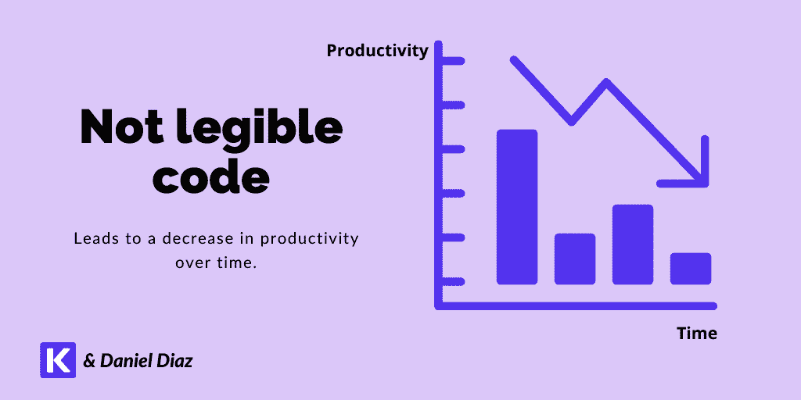
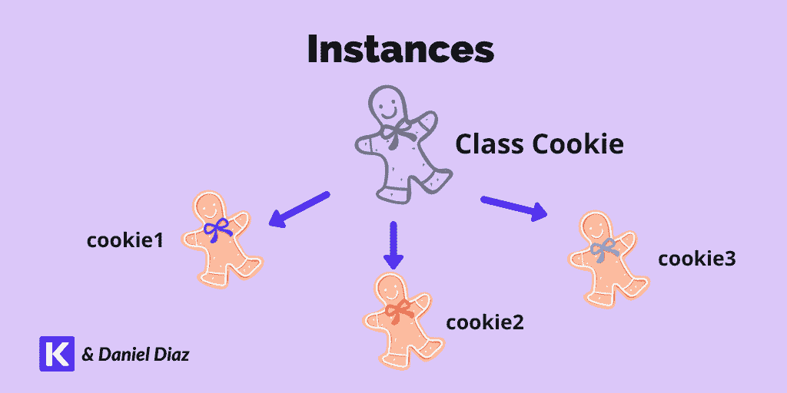
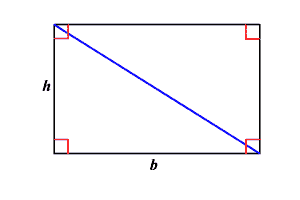
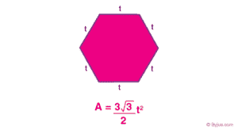

# Python 面向对象编程(OOP)初学者指南

> 原文：<https://kinsta.com/blog/python-object-oriented-programming/>

编程是一门艺术。和艺术一样，选择合适的画笔和颜料对于创作出最好的作品至关重要。Python 面向对象编程就是这样一种技能。

选择正确的编程语言对任何项目来说都是至关重要的一部分，它可能导致流畅愉快的开发，也可能导致一场彻底的噩梦。因此，如果您使用最适合您的用例的语言，那将是最好的。

这是学习 Python 面向对象编程的主要原因，Python 也是最流行的编程语言之一。

让我们学习吧！

## 一个示例 Python 程序

在深究此事之前，让我们提出一个问题:你有没有写过类似下面这样的 Python 程序？

```
secret_number = 20

while True:
   number = input('Guess the number: ')

   try:
       number = int(number)
   except:
       print('Sorry that is not a number')
       continue

   if number != secret_number:
       if number > secret_number:
           print(number, 'is greater than the secret number')

       elif number < secret_number:
           print(number, 'is less than the secret number')
   else:
       print('You guessed the number:', secret_number)
       break 
```

这个代码是一个简单的数字猜测。尝试将其复制到 Python 文件中，并在您的系统中运行。它完美地实现了它的目的。


> 需要在这里大声喊出来。Kinsta 太神奇了，我用它做我的个人网站。支持是迅速和杰出的，他们的服务器是 WordPress 最快的。
> 
> <footer class="wp-block-kinsta-client-quote__footer">
> 
> 
> 
> <cite class="wp-block-kinsta-client-quote__cite">Phillip Stemann</cite></footer>

[View plans](https://kinsta.com/plans/)

但是这里出现了一个大问题:如果我们要求你实现一个新特性会怎么样？它可能很简单，例如:

"如果输入的是密码的倍数，给用户一个提示."

随着特性数量的增加，以及嵌套条件总数的增加，程序会迅速变得复杂和繁重。

这正是面向对象编程试图解决的问题。

## 学习 Python OOP 的要求

在开始面向对象编程之前，我们强烈建议您对 Python 基础有一个牢固的掌握。

将主题归类为“基本”可能很困难。正因为如此，我们设计了一个[备忘单](https://kinsta.com/cheatsheets/)，其中包含了学习 Python 中面向对象编程所需的所有主要概念。

 ***   **变量:**指向特定对象的符号名(通过文章我们会看到**对象**是什么意思)。

*   **算术运算符:**加法(+)、减法(-)、乘法(*)、除法(/)、整数除法(//)、模(%)。

*   **内置数据类型:**数值型(整数、浮点、复数)、序列型(字符串、列表、元组)、布尔型(真、假)、字典、集合。

*   **布尔表达式:**结果为**真**或**假的表达式。**

*   **条件:**计算一个布尔表达式，并根据结果进行一些处理。由 **if/else** 语句处理。

*   **循环:**代码块的重复执行。当循环时，或**可以是**。****

*   **功能:**有组织的可重用代码块。你用关键字 **def** 创建它们。

*   **参数:**传递给函数的对象。例如:`sum([1, 2, 4])`

*   **运行 Python 脚本**:打开终端或[命令行](https://kinsta.com/blog/ssh-commands/)，输入“python <文件名>

*   **打开一个 Python Shell** :打开一个终端，根据你的系统键入`python`或者`python3`。

现在你已经非常清楚这些概念了，你可以继续理解面向对象编程了。

## Python 中的面向对象编程是什么？

面向对象编程(OOP)是一种编程范式，在这种编程范式中，我们可以将复杂的问题视为对象。

范式是为解决问题提供基础的理论。

所以当我们谈论 OOP 时，我们指的是我们用来解决对象问题的一组概念和模式。

Python 中的对象是数据(属性)和行为(方法)的单一集合。你可以把物体想象成你周围真实的东西。例如，考虑计算器:

[](https://kinsta.com/wp-content/uploads/2021/06/Kinsta-Objects-around-you.png)

A calculator can be an object.


您可能注意到，数据(属性)总是名词，而行为(方法)总是动词。

这种划分是面向对象编程的核心概念。您构建存储数据并包含特定种类功能的对象。


## 为什么我们在 Python 中使用面向对象编程？

OOP 允许你创建安全可靠的软件。许多 [Python 框架和库](https://kinsta.com/blog/php-vs-python/#library-support)使用这种范式来构建他们的代码库。一些例子是 Django、Kivy、pandas、NumPy 和 TensorFlow。

让我们看看在 Python 中使用 OOP 的主要优势。

### Python OOP 的优势

以下原因将使您选择在 Python 中使用面向对象编程。

#### 所有现代编程语言都使用面向对象程序设计

这种范式是独立于语言的。如果你学习了 Python 中的 OOP，你将能够在下面使用它:

*   Java 语言(一种计算机语言，尤用于创建网站)
*   PHP(确保阅读 PHP 和 Python 之间的[比较)](https://kinsta.com/blog/php-vs-python/)
*   红宝石
*   [Javascript](https://kinsta.com/blog/javascript-libraries/)
*   C#
*   我的锅

所有这些语言要么本身就是面向对象的，要么包含面向对象功能的选项。如果你想在 Python 之后学习它们中的任何一种，会更容易——你会发现处理对象的语言之间有许多相似之处。

#### OOP 允许你更快地编码

编码更快并不意味着写更少的代码行。这意味着您可以在更短的时间内实现更多的功能，而不会影响项目的稳定性。

面向对象编程允许你通过实现[抽象](#1-abstraction)来重用代码。这个原则使你的代码更加简洁易读。

你可能知道，[程序员](https://kinsta.com/blog/hire-wordpress-developer/)花在阅读代码上的时间比写代码多得多。这就是易读性总是比尽可能快地展示功能更重要的原因。

[](https://kinsta.com/wp-content/uploads/2021/06/Kinsta-Not-legible-code.png)

Productivity decreases with not legible code


稍后您将看到更多关于抽象原则的内容。

#### OOP 帮助你避免意大利面条代码

您还记得本文开头的数字猜测程序吗？

如果您继续添加特性，将来会有许多嵌套的 **if** 语句。这种纠缠在一起的无穷无尽的代码行被称为意大利面条式代码，您应该尽可能地避免它。

OOP 为我们提供了压缩对象中所有逻辑的可能性，因此避免了长段嵌套的 T2 if ' s T3。

#### OOP 改善了你对任何情况的分析

一旦你对 OOP 有了一些经验，你就能把问题想象成小而具体的对象。

这种理解导致了快速的项目初始化。


### 结构化编程与面向对象编程

结构化编程是初学者最常用的范例，因为它是构建小程序最简单的方式。

它涉及到顺序运行 Python 程序。这意味着你给计算机一个任务列表，然后从上到下执行它们。

让我们看一个咖啡店程序的结构化编程的例子。

```
small = 2
regular = 5
big = 6

user_budget = input('What is your budget? ')

try:
   user_budget = int(user_budget)
except:
   print('Please enter a number')
   exit()

if user_budget > 0:
   if user_budget >= big:
       print('You can afford the big coffee')
       if user_budget == big:
           print('It\'s complete')
       else:
           print('Your change is', user_budget - big)
   elif user_budget == regular:
       print('You can afford the regular coffee')
       print('It\'s complete')
   elif user_budget >= small:
       print('You can buy the small coffee')
       if user_budget == small:
           print('It\'s complete')
       else:
           print('Your change is', user_budget - small) 
```

上面的代码充当咖啡店的小贩。它会询问你的预算，然后“卖给”你你能买到的最大的咖啡。

尝试在[终端](https://kinsta.com/blog/wp-cli/)运行。它将根据您的输入逐步执行。

这段代码运行良好，但是我们有三个问题:

1.  它有很多重复的逻辑。
2.  它使用了许多嵌套的 if 条件句。
3.  很难阅读和修改。

OOP 的发明是为了解决所有这些问题。

让我们看看上面用 OOP 实现的程序。如果你还不明白，也不要担心。只是为了比较结构化编程和面向对象编程。

```
class Coffee:
        # Constructor
        def __init__(self, name, price):
                self.name = name
                self.price = float(price)
        def check_budget(self, budget):
                # Check if the budget is valid
                if not isinstance(budget, (int, float)):
                        print('Enter float or int')
                        exit()
                if budget < 0: 
                    print('Sorry you don\'t have money') 
                    exit() 
        def get_change(self, budget):
                return budget - self.price

        def sell(self, budget):
                self.check_budget(budget)
                if budget >= self.price:
                        print(f'You can buy the {self.name} coffee')
                        if budget == self.price:
                                print('It\'s complete')
                        else:
                                print(f'Here is your change {self.get_change(budget)}/kinsta-auto-toc>)

                        exit('Thanks for your transaction') 
```

**注:**以下所有概念将通过文章进行更深入的解释。

上面的代码表示一个名为“Coffee”的**类**它有两个属性——“名称”和“价格”——它们都在方法中使用。主要方法是“销售”，它处理完成销售过程所需的所有逻辑。

如果你试图运行那个类，你不会得到任何输出。这主要是因为我们只是声明了咖啡的“模板”，而不是咖啡本身。

让我们用下面的代码实现这个类:

```
small = Coffee('Small', 2)
regular = Coffee('Regular', 5)
big = Coffee('Big', 6)

try:
   user_budget = float(input('What is your budget? '))
except ValueError:
   exit('Please enter a number')

for coffee in [big, regular, small]:
   coffee.sell(user_budget) 
```

这里我们制作“coffee”类的**实例、**或 Coffee 对象，然后调用每种咖啡的“sell”方法，直到用户可以负担任何选项。

用这两种方法我们会得到相同的输出，但是我们可以用 OOP 更好地扩展程序功能。

下表比较了面向对象编程和结构化编程:

| **OOP** | **结构化编程** |
| 更易于维护 | 难以维护 |
| 不要重复你自己(干)的方法 | 许多地方重复的代码 |
| 许多地方重用了小块代码 | 在几个地方有大量的代码 |
| 目标方法 | 分组码方法 |
| 更容易[调试](https://kinsta.com/blog/wordpress-debug/) | 更难调试 |
| 巨大的学习曲线 | 更简单的学习曲线 |
| 用于[大型项目](https://kinsta.com/clients/intuit/) | 针对简单程序进行了优化 |

总结范式比较:

*   这两种范式都不是完美的(在简单的项目中使用 OOP 可能是压倒性的)。
*   这只是解决问题的两种方式；外面还有其他人。
*   OOP 用于大型代码库，而结构化编程主要用于简单项目。

让我们继续讨论 Python 中的内置对象。

## 在 Python 中，一切都是对象

我们告诉你一个秘密:你一直在使用 OOP，却没有察觉到。

即使在 Python 中使用其他范式，您仍然使用对象来做几乎所有的事情。

那是因为，在 Python 中，*一切*都是对象。

记住对象的定义:Python 中的对象是数据(属性)和行为(方法)的单一集合。

它匹配 Python 中的任何数据类型。

字符串是数据(字符)和行为( **upper()** ， **lower()** 等)的集合..).同样适用于**整数**、**浮点**、**布尔**、**列表、**和字典。

在继续之前，让我们回顾一下属性和方法的含义。

### 属性和方法

属性是对象内部的内部变量，而方法是产生某种行为的 T2 函数。

让我们在 Python shell 中做一个简单的练习。你可以在你的终端中输入`python`或`python3`来打开它。

[](https://kinsta.com/wp-content/uploads/2021/06/Python-terminal.png)

Python shell


现在，让我们使用 Python [shell](https://kinsta.com/knowledgebase/ssh-vs-ssl/) 来发现方法和类型。

```
>>> kinsta = 'Kinsta, Premium Application, Database, and Managed WordPress hosting'
>>> kinsta.upper()
'KINSTA, PREMIUM APPLICATION, DATABASE, AND MANAGED WORDPRESS HOSTING' 
```

在第二行中，我们调用一个字符串方法， **upper()** 。它以大写形式返回字符串的内容。但是，它不会改变原始变量。

```
>>> kinsta
'Kinsta, Premium Application, Database, and Managed WordPress hosting' 
```

让我们深入研究使用对象时有价值的函数。

**type()** 函数允许你获取一个对象的类型。“类型”是对象所属的类。

```
>>> type(kinsta)
# class 'str' 
```

函数的作用是:返回一个对象的所有属性和方法。让我们用 **kinsta** 变量来测试一下。

```
>>> dir(kinsta) ['__add__', '__class__',  ........... 'upper', 'zfill'] 
```

现在，试着打印这个对象的一些隐藏属性。

```
 >>> kinsta.__class__ # class ‘str’ e>
```

这将输出对象 **kinsta** 所属的类。所以我们可以说**类型**函数返回的唯一东西是对象的 **__class__** 属性。

您可以试验所有的数据类型，直接在终端上发现它们的所有属性和方法。你可以在[官方文档](https://docs.python.org/3/library/stdtypes.html)中了解更多关于内置数据类型的信息。

## 注册订阅时事通讯


### 想知道我们是怎么让流量增长超过 1000%的吗？

加入 20，000 多名获得我们每周时事通讯和内部消息的人的行列吧！

[Subscribe Now](#newsletter)

## Python 中的第一个对象

一个**类**就像一个模板**。**它允许您根据自己定义的属性和方法创建自定义对象。

你可以把它想象成一个**切饼器**，你修改它来烘烤完美的饼干(物体，而不是[跟踪饼干](https://kinsta.com/blog/wordpress-cookies-php-sessions/))，具有定义好的特征:形状、大小等等。

另一方面，我们有**个实例。**一个实例是一个类的单个对象，有唯一的内存地址。

[](https://kinsta.com/wp-content/uploads/2021/06/Kinsta-Instances.png)

Instances in Python


现在你知道什么是类和实例，让我们定义一些！

要在 Python 中定义一个类，可以使用 **class** 关键字，后跟其名称。在本例中，您将创建一个名为 **Cookie** 的类。

**注意:**在 Python 中，我们使用 [camel case 命名约定](https://en.wikipedia.org/wiki/Camel_case#:~:text=Camel%20case%20(sometimes%20stylized%20as,word%20starting%20with%20either%20case.)来命名类。

```
class Cookie:
	pass 
```

打开 Python shell，输入上面的代码。要创建一个类的实例，只需键入它的名称和后面的括号。这和调用函数的过程是一样的。

```
cookie1 = Cookie() 
```

祝贺您——您刚刚在 Python 中创建了第一个对象！您可以使用以下代码检查其 id 和类型:

```
id(cookie1)
140130610977040 # Unique identifier of the object

type(cookie1)
<class '__main__.Cookie'> 
```

可以看到，这个 cookie 在内存中有一个惟一的标识符，它的类型是 **Cookie** 。

你也可以用 **isinstance()** 函数检查一个对象是否是一个类的实例。

```
isinstance(cookie1, Cookie)
# True
isinstance(cookie1, int)
# False
isinstance('a string', Cookie)
# False 
```

### 构造函数方法

**__init__()** 方法也被命名为“构造函数”。每当我们实例化一个对象时，它就被称为 Python。

[构造函数](https://kinsta.com/blog/php-8/#constructor-property-promotion)用它需要存在的最小参数集创建对象的初始状态。让我们修改一下 **Cookie** 类，这样它就可以在其构造函数中接受参数。

```
class Cookie:
	# Constructor
	def __init__(self, name, shape, chips='Chocolate'):
		# Instance attributes
		self.name = name
		self.shape = shape
		self.chips = chips 
```

在 **Cookie** 类中，每个 Cookie 都必须有名称、形状和碎片。我们把最后一个定义为“巧克力”

另一方面， **self** 指的是类的实例(对象本身)。

尝试将该类粘贴到 shell 中，并像往常一样创建一个 cookie 实例。

```
cookie2 = Cookie()
# TypeError 
```

你会得到一个错误。这是因为您必须提供对象生存所需的最少数据集——在本例中， **name** 和 **shape** ，因为我们已经将 **chips** 设置为“巧克力”

```
cookie2 = Cookie('Awesome cookie', 'Star') 
```

要访问实例的属性，必须使用点符号。

```
cookie2.name
# 'Awesome cookie'
cookie2.shape
# 'Star'
cookie2.chips
# 'Chocolate' 
```

目前， **Cookie** 类还没有任何有趣的东西。让我们添加一个示例方法 **bake()** 让事情变得更有趣。

```
class Cookie:
	# Constructor
	def __init__(self, name, shape, chips='Chocolate'):
		# Instance attributes
		self.name = name
		self.shape = shape
		self.chips = chips

	# The object is passing itself as a parameter
	def bake(self):
		print(f'This {self.name}, is being baked with the shape {self.shape} and chips of {self.chips}')
		print('Enjoy your cookie!') 
```

要调用一个方法，使用点符号并作为函数调用它。

```
cookie3 = Cookie('Baked cookie', 'Tree')
cookie3.bake()
# This Baked cookie, is being baked with the shape Tree and chips of Chocolate
Enjoy your cookie! 
```

## Python 中面向对象的四大支柱

面向对象编程包括四个主要支柱:

#### 1.抽象

抽象向用户隐藏了应用程序的内部功能。用户可以是最终客户或其他开发人员。

我们可以在日常生活中找到抽象概念。例如，你知道如何使用你的手机，但你可能不知道每次你打开一个应用程序时手机里到底发生了什么。

需要一个给你带来竞争优势的托管解决方案吗？Kinsta 为您提供了令人难以置信的速度、一流的安全性和自动伸缩功能。[查看我们的计划](https://kinsta.com/plans/?in-article-cta)

再比如 Python 本身。你知道怎么用它来构建[功能软件](https://kinsta.com/blog/cms-software/)，即使不懂 Python 的内部工作原理也能做到。

对代码应用同样的方法允许你收集问题中的所有对象，并将标准功能抽象成类。

#### 2.遗产

继承允许我们从一个已经定义的类中定义多个**子类**。

它的主要目的是遵循[干燥原则](https://en.wikipedia.org/wiki/Don%27t_repeat_yourself)。通过将所有共享组件实现到**超类**中，您将能够重用大量代码。

你可以把它想象成现实生活中的**基因遗传**的概念。[孩子](https://kinsta.com/blog/wordpress-child-theme/)(子类)是两个父母(超类)继承的结果。它们继承了所有的物理特征(属性)和一些常见的行为(方法)。

#### 3.多态性

多态让我们稍微修改先前在**超类**中定义的**子类**的方法和属性。

字面意思是“**多种形式**”这是因为我们构建的方法名称相同，但功能不同。

回到之前的想法，孩子也是多态性的完美例子。它们可以继承一个已定义的行为 **get_hungry()** ，但方式略有不同，例如，每 4 小时而不是每 6 小时饿一次。

#### 4.包装

封装是我们保护类中数据内部完整性的过程。

虽然 Python 中没有**私有**语句，但是你可以通过使用 Python 中的 [mangling 来应用封装。有一些名为**getter**和**setter**的特殊方法允许我们访问独特的属性和方法。](https://en.wikipedia.org/wiki/Name_mangling#Python)

让我们想象一个**人类**类，它有一个名为 **_height** 的独特属性。您只能在特定的约束条件下修改该属性(几乎不可能高于 3 米)。

## 构建区域形状解析器计算器

Python 最棒的一点是它让我们可以创建各种各样的软件，从 [CLI(命令行界面)](https://kinsta.com/knowledgebase/devkinsta/wp-cli/)程序到复杂的 web 应用程序。

既然您已经学习了 OOP 的支柱概念，那么是时候将它们应用到实际项目中了。

**注意:**下面所有的代码都可以在这个 [GitHub 库](https://github.com/DaniDiazTech/Object-Oriented-Programming-in-Python/blob/main/shape_calculator/calculator.py)中获得。一个[代码修订工具](https://kinsta.com/blog/code-review-tools/#3-github)，帮助我们用 Git 管理代码版本。

您的任务是创建以下形状的面积计算器:

*   平方
*   矩形
*   三角形
*   圆
*   六边形

### 形状基类

首先，创建一个文件 **calculator.py** 并打开它。既然我们已经有了要处理的对象，在一个类中抽象它们就很容易了**。**

你可以分析一下共同特征，发现这些都是 **2D 形状**。因此，最好的选择是用一个方法 **get_area()** 创建一个类**形状**，每个形状将从该方法继承。

**注意:**所有的方法都应该是动词。那是因为这个方法被命名为 **get_area()** ，而不是 **area()** 。

```
class Shape:
	def __init__(self):
		pass

	def get_area(self):
		pass 
```

上面的代码定义了这个类；然而，里面还没有什么有趣的东西。

让我们实现这些形状的标准功能。

```
class Shape:
	def __init__(self, side1, side2):
		self.side1 = side1
		self.side2 = side2

	def get_area(self):
		return self.side1 * self.side2

	def __str__(self):
		return f'The area of this {self.__class__.__name__} is: {self.get_area()}' 
```

让我们来分解一下我们对这段代码做了什么:

*   在 **__init__** 方法中，我们请求两个参数， **side1** 和 **side2** 。这些将作为**实例属性**保留。
*   **get_area()** 函数返回形状的面积。在这种情况下，它使用的是矩形的面积公式，因为用其他形状更容易实现。
*   **__str__()** 方法和 **__init__()一样，是一种“神奇的方法”。**它允许您修改实例的打印方式。
*   **自我。__class__。__name__** 隐藏属性指的是类名。如果你正在处理一个**三角形**类，那么这个属性就是“三角形”

### 矩形类

因为我们实现了矩形的面积公式，所以我们可以创建一个简单的 **Rectangle** 类，它除了继承 **Shape** 类之外什么也不做。

要在 Python 中应用**继承**，您将像往常一样创建一个类，并用括号将您想要继承的**超类**括起来。

```
# Folded base class
class Shape: ...

class Rectangle(Shape): # Superclass in Parenthesis
	pass 
```

### 方形类

我们可以用 **Square** 类来很好地处理**多态性**。

记住，正方形只是一个四边都相等的长方形。这意味着我们可以用同样的公式得到面积。

我们可以通过修改 **init** 方法来做到这一点，只接受一个**边**作为参数，并将该边值传递给 **Rectangle** 类的构造函数。

```
# Folded classes
class Shape: ...
class Rectangle(Shape): ...

class Square(Rectangle):
	def __init__(self, side):
		super().__init__(side, side) 
```

如你所见，[超函数](https://docs.python.org/3/library/functions.html#super)将**方**参数两次传递给**超类**。换句话说，它将**侧**作为**侧 1** 和**侧 2** 传递给先前定义的构造函数。

### 三角形类

三角形是环绕它的长方形的一半大。

[](https://kinsta.com/wp-content/uploads/2021/06/Triangle-formula.png)

Relation between triangles and rectangles (Image source: Varsity tutors).


所以我们可以从 **Rectangle** 类继承，修改 **get_area** 方法来匹配三角形面积公式，就是底乘以高的二分之一。

```
# Folded classes
class Shape: ...
class Rectangle(Shape): ...
class Square(Rectangle): ...

class Triangle(Rectangle):
	def __init__(self, base, height):
		super().__init__(base, height)

	def get_area(self):
		area = super().get_area()
		return area / 2 
```

**super()** 函数的另一个用例是调用**超类**中定义的方法，并将结果存储为变量。这就是在 **get_area()** 方法内部发生的事情。

### 圆形类

你可以用公式 **πr** 求出圆的面积，其中 **r** 是圆的半径。这意味着我们必须修改 **get_area()** 方法来实现这个公式。

**注意:**我们可以从数学模块导入 **π** 的近似值

```
# Folded classes
class Shape: ...
class Rectangle(Shape): ...
class Square(Rectangle): ...
class Triangle(Rectangle): …

# At the start of the file
from math import pi

class Circle(Shape):
	def __init__(self, radius):
		self.radius = radius

	def get_area(self):
		return pi * (self.radius ** 2) 
```

上面的代码定义了 **Circle** 类，它使用了不同的构造函数和 **get_area()** 方法。

虽然 **Circle** 继承了 **Shape** 类，但是你可以根据自己的喜好重新定义每一个方法。

### 正六边形类

我们只需要正六边形的一条边的长度来计算它的面积。它类似于 **Square** 类，我们只将一个参数传递给构造函数。

[](https://kinsta.com/wp-content/uploads/2021/06/Hexagon-formula.png)

Hexagon area formula (Image source: BYJU’S)


然而，这个公式是完全不同的，它暗示了平方根的使用。这就是为什么您将使用数学模块中的 **sqrt()** 函数。

```
# Folded classes
class Shape: ...
class Rectangle(Shape): ...
class Square(Rectangle): ...
class Triangle(Rectangle): …
class Circle(Shape): …

# Import square root
from math import sqrt

class Hexagon(Rectangle):

	def get_area(self):
		return (3 * sqrt(3) * self.side1 ** 2) / 2 
```

### 测试我们的类

使用调试器运行 Python 文件时，可以进入交互模式。最简单的方法是使用内置的[断点](https://docs.python.org/3/library/functions.html#breakpoint)函数。

**注意:**该函数仅在 Python 3.7 或更新版本中可用。

```
from math import pi, sqrt
# Folded classes
class Shape: ...
class Rectangle(Shape): ...
class Square(Rectangle): ...
class Triangle(Rectangle): …
class Circle(Shape): …
class Hexagon(Rectangle): …

breakpoint() 
```

现在，运行 Python 文件并使用您创建的类。

```
$ python calculator.py

(Pdb) rec = Rectangle(1, 2)(Pdb) print(rec)
The area of this Rectangle is: 2
(Pdb) sqr = Square(4)
(Pdb) print(sqr)
The area of this Square is: 16
(Pdb) tri = Triangle(2, 3)
(Pdb) print(tri)
The area of this Triangle is: 3.0
(Pdb) cir = Circle(4)
(Pdb) print(cir)
The area of this Circle is: 50.26548245743669
(Pdb) hex = Hexagon(3)
(Pdb) print(hex)
The area of this Hexagon is: 23.382685902179844 
```

### 挑战

使用方法 **run** 创建一个类，用户可以选择一个形状并计算其面积。

当你完成挑战后，你可以向 [GitHub repo](https://kinsta.com/knowledgebase/git-vs-github/) 发送一个 pull 请求，或者在评论区发布你的解决方案。

[Ready to start learning object-oriented programming in Python? ✅ You've come to the right place 😄Click to Tweet](https://twitter.com/intent/tweet?url=https%3A%2F%2Fkinsta.com%2Fblog%2Fpython-object-oriented-programming%2F&via=kinsta&text=Ready+to+start+learning+object-oriented+programming+in+Python%3F+%E2%9C%85+You%27ve+come+to+the+right+place+%F0%9F%98%84&hashtags=Python%2CProgramming)

## 摘要

面向对象编程是一种范式，在这种范式中，我们通过将问题视为**对象**来解决问题。如果你懂 Python OOP，你也可以在类似 [Java](https://kinsta.com/blog/best-programming-language-to-learn/#java) 、 [PHP](https://kinsta.com/knowledgebase/what-is-php/) 、Javascript、 [C#](https://kinsta.com/blog/best-programming-language-to-learn/#c-1) 的语言中轻松应用。

在本文中，您了解了:

*   Python 中面向对象的概念
*   面向对象相对于结构化编程的优势
*   Python 中面向对象编程的基础
*   **类**的概念以及如何在 Python 中使用它们
*   Python 中某个类的**构造函数**
*   Python 中的**方法**和**属性**
*   面向对象的四大支柱
*   在一个项目中实现**抽象**、**继承、**和**多态**

现在轮到你了！

如果你喜欢这个指南，看看我们在 [Python 教程](https://kinsta.com/blog/python-tutorials/)上的帖子。

请在评论中告诉我们你对挑战的解决方案！别忘了看看我们的[Python 和 PHP](https://kinsta.com/blog/php-vs-python/) 的对比指南。

* * *

让你所有的[应用程序](https://kinsta.com/application-hosting/)、[数据库](https://kinsta.com/database-hosting/)和 [WordPress 网站](https://kinsta.com/wordpress-hosting/)在线并在一个屋檐下。我们功能丰富的高性能云平台包括:

*   在 MyKinsta 仪表盘中轻松设置和管理
*   24/7 专家支持
*   最好的谷歌云平台硬件和网络，由 Kubernetes 提供最大的可扩展性
*   面向速度和安全性的企业级 Cloudflare 集成
*   全球受众覆盖全球多达 35 个数据中心和 275 多个 pop

在第一个月使用托管的[应用程序或托管](https://kinsta.com/application-hosting/)的[数据库，您可以享受 20 美元的优惠，亲自测试一下。探索我们的](https://kinsta.com/database-hosting/)[计划](https://kinsta.com/plans/)或[与销售人员交谈](https://kinsta.com/contact-us/)以找到最适合您的方式。**