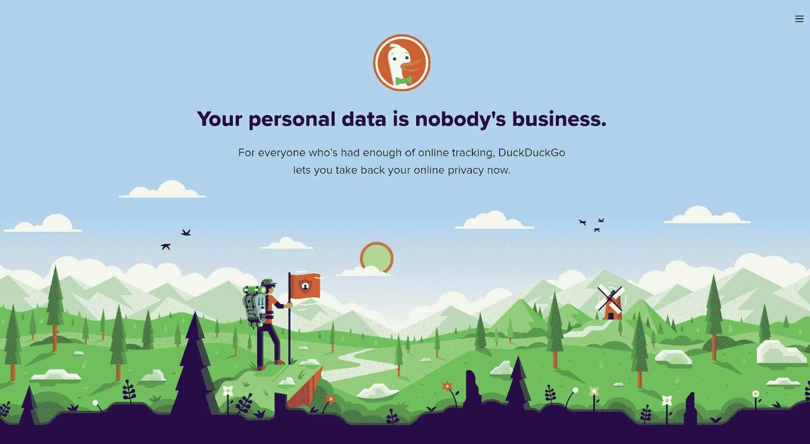
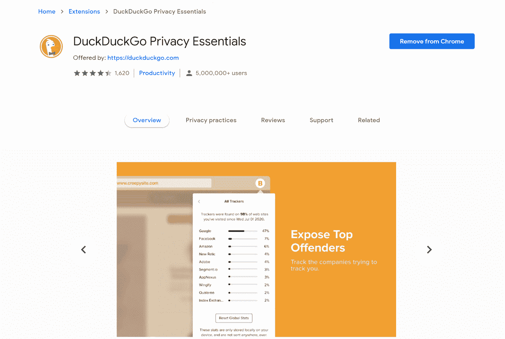
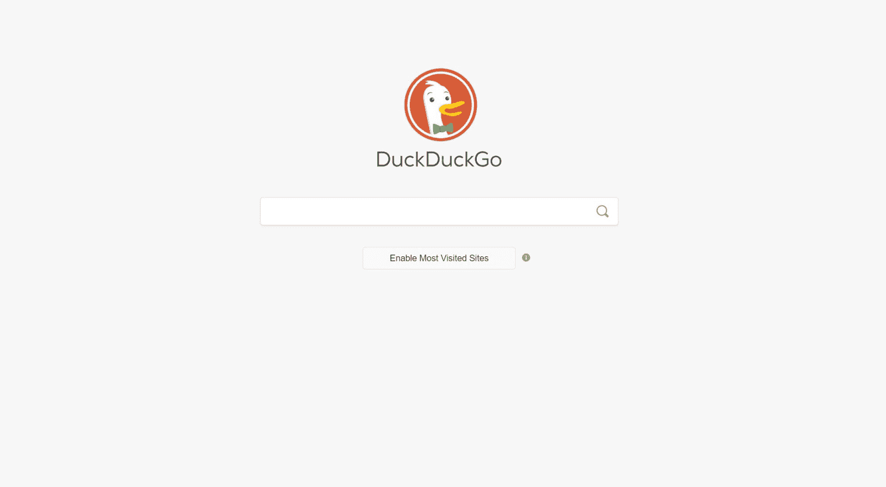
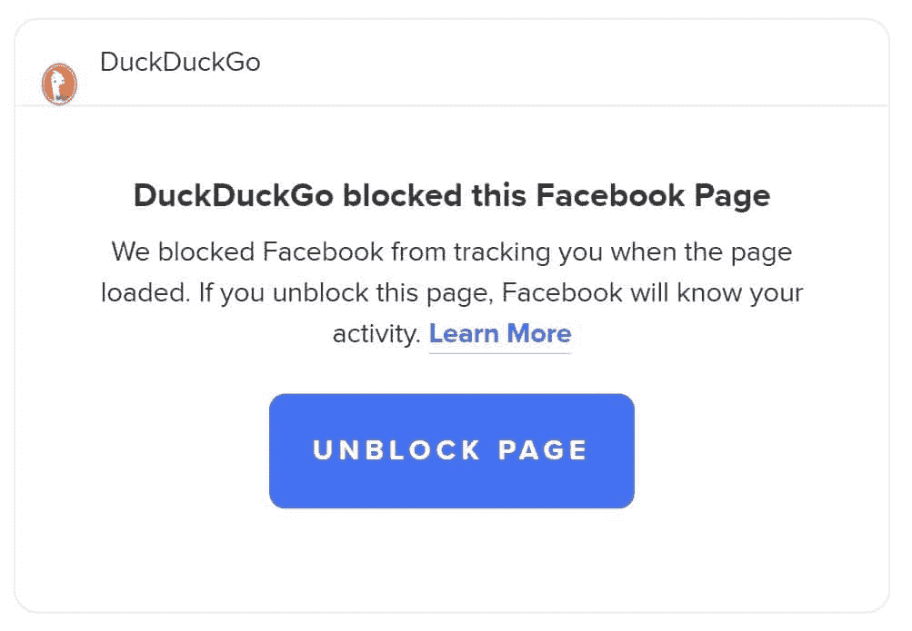
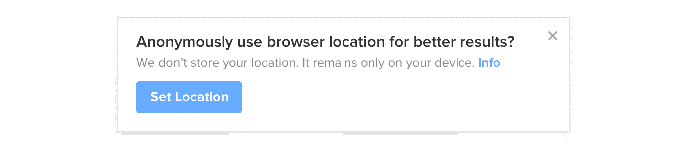
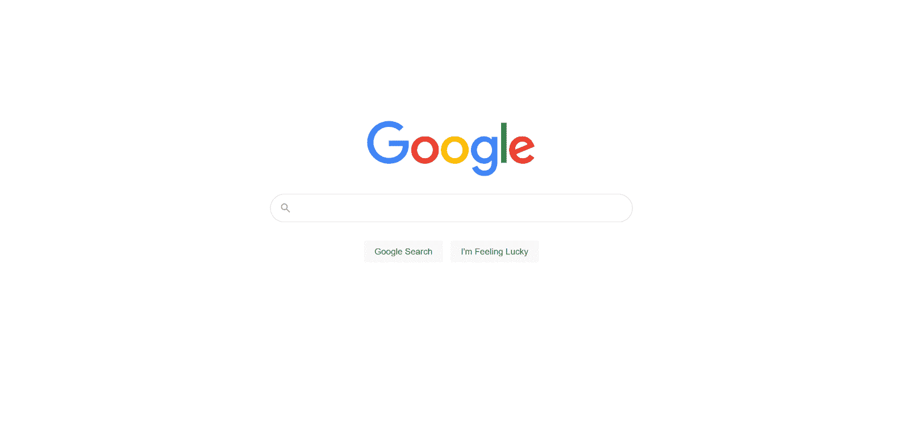
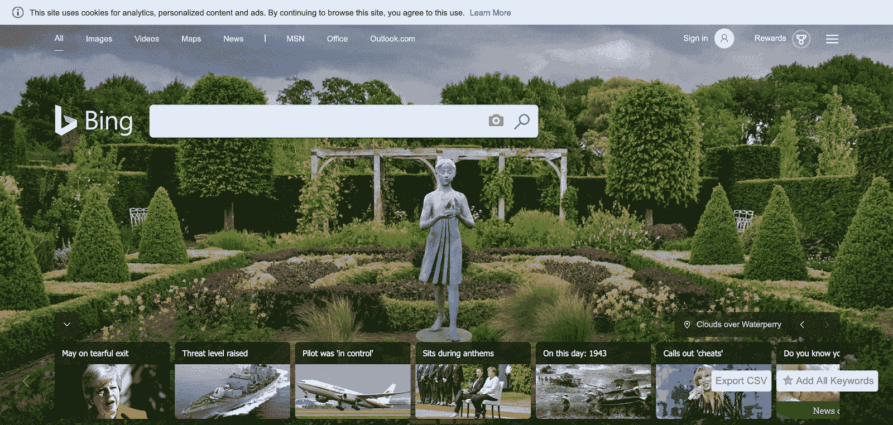
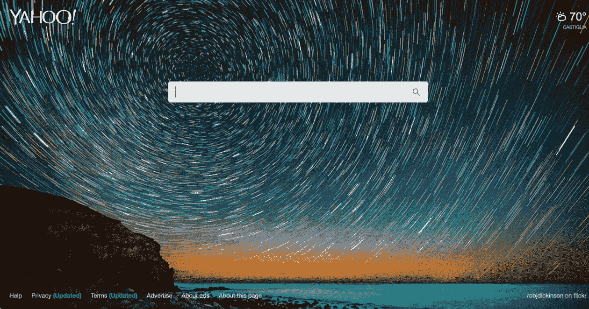
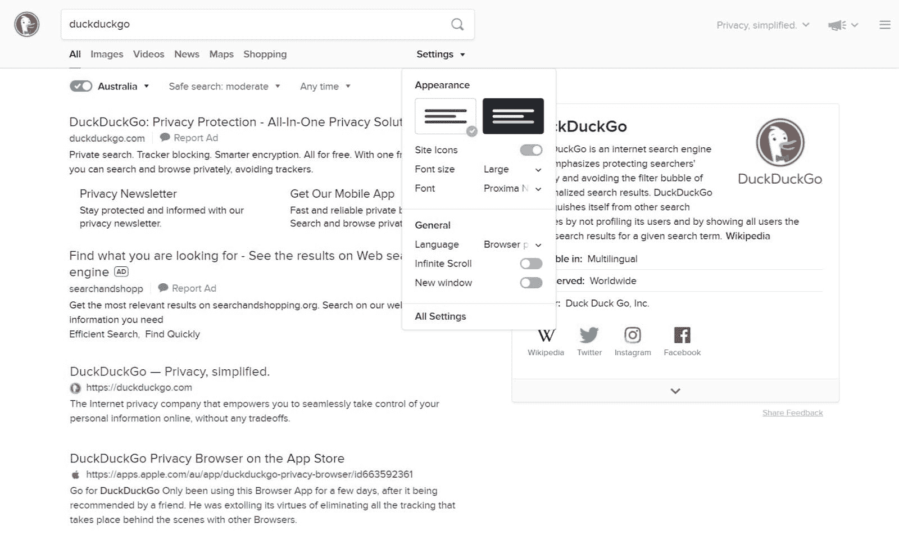

# DuckDuckGo 评论:关注隐私的搜索引擎

> 原文：<https://kinsta.com/blog/duckduckgo-privacy/>

保护您的数据和隐私变得越来越重要。用户现在担心他们的私人数据被谷歌、必应和雅虎等搜索引擎收集。这种担心导致许多人转向替代品，其中最受欢迎的是 DuckDuckGo 隐私搜索引擎。

DuckDuckGo 是一家承诺安全可靠浏览的搜索引擎公司。他们还为移动设备提供了注重隐私的浏览器。

但是 DuckDuckGo 到底有多安全可靠呢？

在本文中，您将了解关于 DuckDuckGo 和它的许多隐私特性的所有信息。

让我们开始吧。

### 来看看这个【to DuckDuckGo 视频指南

## DuckDuckGo 是什么？

DuckDuckGo 是一个促进网络隐私的搜索引擎。

DuckDuckGo 是一个搜索引擎，专门为那些希望在使用互联网时保护自己隐私的用户设计。

> Kinsta 把我宠坏了，所以我现在要求每个供应商都提供这样的服务。我们还试图通过我们的 SaaS 工具支持达到这一水平。
> 
> <footer class="wp-block-kinsta-client-quote__footer">
> 
> 
> 
> <cite class="wp-block-kinsta-client-quote__cite">Suganthan Mohanadasan from @Suganthanmn</cite></footer>

[View plans](https://kinsta.com/plans/)

与其他搜索引擎不同的是，DuckDuckGo 严格限制其收集的个人信息。这使得它成为想要保护数据隐私的用户的绝佳选择。

DuckDuckGo 用一句简单的格言总结了它的服务:“同样的互联网，更多的隐私。

虽然 DuckDuckGo 不是世界上最受欢迎的搜索引擎，但它确实拥有令人印象深刻的庞大用户群。2021 年，DuckDuckGo 每月提供超过 30 亿次搜索，并帮助用户在移动应用和台式电脑上进行超过 500 万次下载。

DuckDuckGo 的用户也很喜欢这个搜索引擎，因为 DuckDuckGo 在苹果和谷歌 Play 商店的平均评分为 4.8。

让我们深入了解一下 DuckDuckGo 的历史。

[Wondering if you should make the switch to @DuckDuckGo? 🤔 Learn more about this privacy-conscious search engine in this post 👇Click to Tweet](https://twitter.com/intent/tweet?url=https%3A%2F%2Fkinsta.com%2Fblog%2Fduckduckgo-privacy%2F&via=kinsta&text=Wondering+if+you+should+make+the+switch+to+%40DuckDuckGo%3F+%F0%9F%A4%94+Learn+more+about+this+privacy-conscious+search+engine+in+this+post+%F0%9F%91%87&hashtags=OnlinePrivacy%2CWebBrowser)

## DuckDuckGo:简史

企业家加布里埃尔·温伯格于 2008 年 2 月创立了 DuckDuckGo。温伯格将 DuckDuckGo 设计为谷歌和雅虎等主流搜索引擎的替代产品。

虽然这个搜索引擎没有一夜成名，但它确实迅速流行起来。2008 年底，它登上了黑客新闻和 Reddit 等热门平台的主页。

在接下来的几年里，DuckDuckGo 通过几次重要的活动而出名。其中包括匿名浏览 DuckDuckGo、 [DontTrack.us](https://donttrack.us/) 网站，以及著名的广告牌广告“谷歌追踪你。我们没有。”

这些活动成功后，DuckDuckGo 的用户群像滚雪球一样越滚越大。

2012 年，搜索引擎达到了每天一百万次搜索。然后在 2013 年和 2015 年分别达到每天 200 万和 1000 万次搜索。由于越来越受欢迎，苹果，Mozilla，甚至谷歌都在他们的浏览器中增加了 DuckDuckGo 作为一个[搜索引擎选项。](https://kinsta.com/blog/how-to-change-search-engine/)

在对监控资本主义加强审查后，DuckDuckGo 目前正经历一个受欢迎的高峰期。2018 年至 2020 年间，该搜索引擎的搜索量翻了一番，从 250 亿次增加到 500 亿次。

当人们第一次知道 DuckDuckGo 时，他们通常会对它的名字表示惊讶。“DuckDuckGo”这个名字和搜索引擎没有关系。温伯格以儿童游戏“鸭鸭鹅”命名他的搜索引擎

## DuckDuckGo 隐私功能

DuckDuckGo 因其隐私功能而闻名全球。从早期开始，DuckDuckGo 就作为一个优先考虑用户隐私的替代搜索引擎而赢得了声誉。

但是 DuckDuckGo 到底是怎么保证你的数据安全的呢？在这一节中，我们将介绍 DuckDuckGo 的最佳隐私功能及其工作原理。

### DuckDuckGo 隐私必备浏览器扩展

DuckDuckGo 隐私精华是这个搜索引擎的一个显著特点。

DuckDuckGo 的 Privacy Essentials 浏览器扩展是其最显著的功能。它适用于所有重要的互联网浏览器。仅 Chrome 扩展版就拥有[超过五百万用户](https://chrome.google.com/webstore/detail/duckduckgo-privacy-essent/bkdgflcldnnnapblkhphbgpggdiikppg)。

Privacy Essentials 扩展既可以作为搜索引擎，也可以作为广告拦截器。当您使用搜索引擎时，Privacy Essentials 会阻止通常会出现在搜索结果中的任何横幅广告和弹出窗口。

该扩展也有几个内置的隐私功能。其中包括:

*   阻止来自您访问的网站的基于浏览器的在线跟踪。
*   加密您的搜索结果，以隐藏他们从互联网服务提供商。
*   全球隐私控制(GPC)警告网站不要分享或出售他们收集的关于你的数据。

Privacy Essentials 还为您提供了控制隐私设置的选项。虽然它[阻止了大多数广告](https://kinsta.com/blog/ad-blockers/)，但它让你可以选择将来自特定域名的广告列入安全列表。您还可以打开安全搜索，更改您搜索的国家，并管理您的搜索结果。

### 未跟踪搜索

自定义您的 DuckDuckGo 体验，使其显示您最常访问的网站。

DuckDuckGo 最广为人知的隐私功能是“无追踪搜索”。大多数搜索引擎以几种方式跟踪您的搜索，包括您访问的网站的数据、您搜索的内容、您的 IP 地址、浏览器和设备信息等。即使每个数据集都是匿名的，公司也可以将它们结合起来识别和跟踪你。

为了保护您的隐私，DuckDuckGo 不会收集[cookie](https://kinsta.com/blog/wordpress-cookies-php-sessions/)、 [IP 地址](https://kinsta.com/tools/what-is-my-ip/what-is-my-ip/)或用户代理信息(如您使用的网络浏览器)。相反，DuckDuckGo 匿名保存用户的搜索——这意味着它没有办法将你对“泰国餐馆现在开业”的搜索与你联系起来。

DuckDuckGo 的未追踪搜索功能也延伸到你访问的网站。

#### 如果网站使用 Cookies，DuckDuckGo 如何保护隐私？

许多网站通过 cookies 收集您的数据。Cookies 是识别您身份的小文本文件。网站使用 cookies 来了解您的浏览习惯，并为有针对性的内容做广告。

DuckDuckGo 通过阻止网站访问您的数据来阻止网站收集 cookies。由于 DuckDuckGo 无法识别您的身份，因此它无法传递该信息。

### 隐私等级

当一个网站正在追踪你的信息时，DuckDuckGo 隐私等级会发出警告。

隐私等级是另一个众所周知的 DuckDuckGo 功能，它通过浏览器扩展和移动应用程序工作。简而言之，隐私等级可以识别网站何时跟踪你的数据，并在你浏览时向你发出警告。

每当您访问网站时，DuckDuckGo 会自动激活隐私等级。该功能然后[扫描](https://kinsta.com/blog/create-qr-code/)该网站，并给它分配一个从“A”到“F”的隐私等级，“A”是最安全的。

隐私等级做两件事:

1.  它会检查阻止了多少来自网站的跟踪请求。
2.  它审查网站与 [ToS:博士](https://tosdr.org/)的服务条款协议(服务条款:没看)。

一旦你收到每个网站的分数，你就可以看到网站试图给你设置的追踪器。

DuckDuckGo 还向您展示了其隐私功能的影响。当它给你一个等级时，它会显示一个带有“从 __ 增强到 __”的条形(例如，“从 D 增强到 B”)。红色的第一个等级是原始等级，绿色的第二个等级是从 DuckDuckGo 的隐私功能调整的等级。

### 烧伤酒吧

DuckDuckGo 的 Burn Bar 是其手机应用特有的功能。刻录栏允许您在每次会话结束时关闭标签并[删除您的浏览数据](https://kinsta.com/knowledgebase/how-to-clear-browser-cache/)。因此，DuckDuckGo 不会在内部存储你的数据，让你完全控制你的搜索历史。

若要使用 DuckDuckGo 应用程序中的加深条，请点按屏幕底部可见的火焰图标。

### 阻止嵌入的社交媒体内容

如果一个社交媒体网站试图跟踪你，DuckDuckGo 可以立即阻止它。

由于社交媒体是大多数互联网用户日常生活的一部分，网站现在正在将 Youtube 视频等社交媒体帖子嵌入到他们的网络内容中。

然而，这带来了一个隐私问题，引起了许多互联网用户的关注。

每当网站嵌入社交媒体帖子时，该社交媒体平台就会收集关于谁查看了该帖子的数据，包括你的 IP 地址。

这意味着两个不同的第三方正在收集你的数据:你访问的网站和嵌入式社交媒体平台。

DuckDuckGo 正在通过屏蔽嵌入式社交媒体帖子来解决这个问题。到目前为止，DuckDuckGo 只阻止了一些社交媒体公司(如脸书)的内容，但该公司将很快将其阻止列表扩展到其他平台。

该功能目前在 DuckDuckGo 的浏览器扩展和移动应用中可用。

### 搜索泄漏预防

DuckDuckGo 使用术语“搜索泄漏”来描述雅虎、必应和谷歌等搜索引擎如何链接你的数据。

每当你点击一个新的链接，你的搜索引擎就会与你点击的网站分享微小的数据。这些小金块创建了一个数据轨迹，允许搜索引擎和第三方网站跟踪你的活动。

为了防止这种情况发生，DuckDuckGo 用两种策略来保护它的用户。

首先，DuckDuckGo 会重新路由你的点击，让网站无法确定你是如何进入网站的。假设你搜索了一家[本地餐厅](https://kinsta.com/blog/wordpress-seo/#37-use-local-seo-techniques)，并在搜索结果中点击了其网站的链接，网站所有者不会看到你在搜索“我附近的泰国餐厅”后找到了他们的网站。

其次，DuckDuckGo 显示你点击的网站的加密版本。这种策略可以防止网站了解你的任何信息，因为 DuckDuckGo 本质上是在你和网站之间建立了一堵墙。

### 没有用户配置文件集合

像谷歌这样的搜索引擎通过“用户档案”生成你是谁的图片。此用户资料描述了您的一般信息，包括:

*   年龄
*   性别
*   国际电脑互联网地址
*   设备

然后，搜索引擎将这些数据与你的浏览历史和 cookies 配对，这使他们能够产生一个想法，并利用你的兴趣。

搜索引擎使用这个用户档案来过滤你看到的[广告内容](https://kinsta.com/blog/adsense-alternatives/)。许多品牌都想针对特定的人群做广告(例如，22-30 岁的北美男性 Mac 用户)。

由于 DuckDuckGo 的隐私功能阻止搜索引擎收集关于您和您的搜索的识别数据，它允许您在没有用户配置文件的情况下浏览互联网。这个功能对任何想避开个性化广告的人来说都是极好的。

这个功能还有另一个好处:它消除了过滤器气泡。当你陷入“过滤气泡”时，你的搜索引擎会根据你的用户资料对你的搜索结果进行优先排序。由于过滤气泡会限制您的搜索，因此在没有用户配置文件的情况下浏览互联网有助于您获得更完整的结果。

### Tor 出口飞地

虽然许多 DuckDuckGo 用户对其其他功能提供的加密感到满意，但一些用户更喜欢用 [Tor](https://kinsta.com/blog/most-secure-browser/#6-tor) (即“洋葱路由器”)来完全加密他们的互联网活动。

Tor 是一个互联网浏览器，允许人们匿名浏览互联网。当您使用 Tor 时，您的搜索会通过多个加密的服务器。

这种策略使得任何人都不可能跟踪你的互联网使用，因为多层加密保护你的浏览数据。

DuckDuckGo 通过操作 Tor 出口飞地，帮助用户通过 Tor 浏览互联网。这个飞地允许用户通过 Tor 快速使用 DuckDuckGo，而不牺牲匿名性。

要使用 DuckDuckGo 的 Tor exit enclave，你需要下载 Tor 并使用 DuckDuckGo 的搜索引擎。

### 内容安全策略报告

像许多其他互联网公司一样，DuckDuckGo 的搜索引擎使用内容安全策略(CSP)来保护用户免受恶意网站的攻击。

## 注册订阅时事通讯

### 想知道我们是怎么让流量增长超过 1000%的吗？

加入 20，000 多名获得我们每周时事通讯和内部消息的人的行列吧！

[Subscribe Now](#newsletter)

CSP 与您的网络浏览器进行通信，以识别和阻止可能对您发起网络安全攻击的第三方网站。

DuckDuckGo 的 CSP 保护您免受一系列攻击，包括:

*   **跨站点脚本(XSS)攻击**:在这些攻击中，网站会向您的浏览器中注入不需要的恶意代码。
*   **代码注入攻击**:攻击者[在这些攻击过程中向你的计算机或服务器注入代码](https://kinsta.com/blog/sql-injection/)，然后改变你或你的网站的动作(例如，将你或你的用户重定向到另一个网站)。
*   **点击劫持攻击**:在这些攻击中，攻击者诱骗你点击一些恶意的东西。

DuckDuckGo 的 CSP 功能通过其搜索引擎工作，这意味着你可以通过 DuckDuckGo.com、Privacy Essentials 浏览器扩展或移动应用程序来使用它。

## 为什么 DuckDuckGo 更有利于隐私

在上一节中，我们介绍了 DuckDuckGo 的许多隐私功能。但是为什么 DuckDuckGo 总体来说对隐私更好呢？

DuckDuckGo 的每一项功能都可以保护用户免受特定的威胁。虽然其中一些威胁可能看起来微不足道，但它们可以很快累积起来。大多数互联网用户每天都会进行多次搜索。你不断地在不知不觉中向网站提供关于你自己的宝贵数据。

最终，DuckDuckGo 在不影响你的网页浏览体验的情况下，为用户提供了 Tor 等更强大的解决方案的隐私和匿名优势。

也就是说，DuckDuckGo 并不是一个完美的工具。

## DuckDuckGo 隐私问题

DuckDuckGo 是一项有益的技术，但用户确实对它有一些担忧。本节将简要概述其中的两个问题。

### 附属链接

DuckDuckGo 通过搜索引擎广告和[附属链接](https://kinsta.com/affiliate-academy/what-is-affiliate-marketing/)为自己融资。DuckDuckGo 的搜索引擎广告的运作就像谷歌或雅虎一样(除了它不依赖于你的数据)。

此外，当你在亚马逊或易贝购物时，它的会员链接会自动应用。当 DuckDuckGo 使用代销商链接时，销售平台就你的购买向公司支付佣金。

虽然这确实让 DuckDuckGo 可以访问你的购买数据(比如你买了什么)，但该公司无法访问任何识别数据(比如你的送货地址)。

### 本地化结果

虽然 DuckDuckGo 不会使用您的 IP 地址，但搜索引擎会在您搜索“我附近的泰国餐馆”时使用您的位置数据具体来说，DuckDuckGo 使用 GEO::IP 查找，这与您的位置很接近。

有时候这个数据非常准确，而其他时候则不然。

DuckDuckGo 有时会询问用户的位置，以提供更准确的搜索结果。如果 DuckDuckGo 想使用你的位置，它会像这样弹出一个窗口询问你:

使用 DuckDuckGo 时，可以匿名浏览网页。

正如弹出窗口提到的，DuckDuckGo 不会将您的位置数据存储在其服务器上。

### 如何最大化 DuckDuckGo 隐私

虽然 DuckDuckGo 已经为用户提供了合理程度的隐私，但还有一些方法可以充分利用这项技术。以下是让你开始的一些想法:

*   下载 DuckDuckGo 浏览器扩展，开启所有隐私设置。
*   检查您经常访问的网站的隐私等级。
*   下载手机应用程序，并在每次互联网会话后使用其“刻录”按钮。
*   获得一个[虚拟专用网络(VPN)](https://kinsta.com/blog/proxy-vs-vpn/) 让你匿名浏览。
*   将 DuckDuckGo 与 [Brave 浏览器](https://kinsta.com/blog/brave-browser-review/)配对。
*   使用 Tor 和 DuckDuckGo 作为出口飞地。

## DuckDuckGo 与其他搜索引擎相比如何

如果你考虑试用 DuckDuckGo，你可能想知道它与 Google、Bing 和 Yahoo 相比如何。

### DuckDuckGo vs 谷歌

DuckDuckGo 可以是谷歌的替代品，看你的喜好。

虽然 DuckDuckGo 是一个很好的谷歌替代品，但就搜索结果而言，谷歌是一个更好的搜索引擎。

需要为你的 WordPress 站点提供超快的、可靠的、完全安全的托管服务吗？Kinsta 提供所有这些以及 WordPress 专家提供的 24/7 世界级支持。查看我们的计划！

谷歌理解你的上下文查询，对最新内容进行优先排序，并根据你的行为和用户资料对你的搜索进行个性化。谷歌搜索还集成了其他谷歌产品，如谷歌地图和谷歌工作空间。

虽然 DuckDuckGo 的搜索引擎具有 Bang 搜索等功能，但它无法为你提供与谷歌相同水平的定制。

如果你需要全面的搜索功能，你可能会选择谷歌，但如果你重视你的数据隐私，你可能会更喜欢 DuckDuckGo。

### DuckDuckGo vs Bing

你可能会认为 DuckDuckGo 是阿炳的替代品。

Bing 不像 Google 那样受欢迎，但它仍然是一个很好的搜索引擎。作为微软奖励计划的一部分，必应拥有非常先进的[图片](https://kinsta.com/blog/optimize-images-for-web/)搜索功能、浏览器面板、必应应用和[必应返利](http://www.bing.com/rebates)。

DuckDuckGo 的图片搜索功能比不上 Bing，但它确实提供匿名浏览。

### DuckDuckGo vs 雅虎

你可以用 DuckDuckGo 作为雅虎的替代品。

雅虎是一个非常可定制的搜索引擎。它允许用户根据自己的喜好调整界面，并提供个性化广告。雅虎搜索也能很好地与雅虎新闻和雅虎邮件等其他雅虎产品配合使用。

然而，雅虎在提供图片和视频内容方面不如必应和谷歌。

DuckDuckGo、Bing 和 Yahoo 在搜索引擎功能上不相上下，但对你来说最好的选择将取决于你的隐私品味和上网习惯。

## 如何安装 DuckDuckGo

现在您已经对 DuckDuckGo 有了更多的了解，让我们深入搜索引擎本身。

有三种方法可以使用 DuckDuckGo:

1.  DuckDuckGo.com
2.  浏览器扩展
3.  该公司的 iOS 和 Android 应用程序

我们在下面概述了访问每个选项的步骤。

### DuckDuckGo 浏览器扩展

DuckDuckGo 目前没有自己的桌面浏览器，但你可以将 DuckDuckGo 作为扩展添加到你的浏览器中。该扩展现在可以在谷歌 Chrome、 [Mozilla Firefox](https://kinsta.com/blog/most-secure-browser/#3-firefox) 、微软 Edge、Opera 和 Safari 上使用。

#### **谷歌浏览器**

1.  跟随[这个链接到 Chrome 商店](https://chrome.google.com/webstore/detail/duckduckgo-privacy-essent/bkdgflcldnnnapblkhphbgpggdiikppg/related)。
2.  点击屏幕右侧的“添加到 Chrome”。
3.  出现提示时，单击“添加扩展”。
4.  等 Chrome 安装 DuckDuckGo。

#### **Mozilla Firefox**

1.  跟随[这个链接到 Mozilla 插件](https://addons.mozilla.org/en-US/firefox/addon/duckduckgo-for-firefox/)。
2.  点击“下载 Firefox 并获取扩展”
3.  出现提示时，单击“确认”。
4.  等待 Mozilla Firefox 安装 DuckDuckGo。

#### **微软 Edge**

1.  跟随[这个链接到微软商店](https://microsoftedge.microsoft.com/addons/detail/duckduckgo-privacy-essent/caoacbimdbbljakfhgikoodekdnlcgpk)。
2.  点击“获取”
3.  出现提示时，单击“添加扩展”。
4.  等待 Microsoft Edge 安装 DuckDuckGo。

#### **歌剧**

1.  跟随[链接到 Opera 附加组件商店](https://addons.opera.com/en/extensions/details/duckduckgo-for-opera-2/)。
2.  点击“立即下载”
3.  确认您的下载。
4.  等 Opera 安装 DuckDuckGo。

#### **狩猎之旅**

1.  跟随[这个链接到 Mac 应用商店](https://apps.apple.com/us/app/duckduckgo-privacy-essentials/id1482920575)。
2.  点击“获取应用程序”
3.  确认您的下载。
4.  等待 Safari 安装 DuckDuckGo。

#### **网络浏览器**

DuckDuckGo 的扩展目前不适用于 Internet Explorer。如果您想在 Internet Explorer 中使用 DuckDuckGo，您可以通过以下方式将 DuckDuckGo 设置为默认搜索引擎:

1.  转到“DuckDuckGo.com”
2.  选择“将此设为我的默认搜索提供商”
3.  点击“添加”

### DuckDuckGo.com

如果你是使用 DuckDuckGo 的新手，你可能想在下载之前测试一下这个搜索引擎。

您可以通过访问“[duckduckgo.com](https://duckduckgo.com/)”网页来使用搜索引擎然后你可以像使用其他搜索引擎一样使用 DuckDuckGo。

虽然 DuckDuckGo 像其他搜索引擎一样向您提供结果，但它也有一些独特的怪癖。这包括它的[字体](https://kinsta.com/blog/modern-fonts/)，它如何提供搜索结果，以及它的特点。

从下图可以看出，DuckDuckGo 并没有用页码来标记你的搜索结果。相反，它给你提供了查看“更多结果”或打开无限滚动的选项。

您可以更改 DuckDuckGo 设置以获得更个性化的体验。

您也可以在浏览器顶部更改您的搜索设置。

通过这些设置，您可以更改正在浏览的国家/地区、想要使用的安全搜索级别(“严格”、“中等”或“关闭”)，以及您的个人设置—语言、[无限滚动](https://kinsta.com/knowledgebase/wordpress-jetpack/#theme-enhancements)、布局和文本大小。

DuckDuckGo 的搜索引擎还有一个被称为“Bang！”。Bang 搜索允许你在一个域名内快速搜索。这些搜索通常使用“！(快捷方式):(搜索词)”，其中“快捷方式”是指网站。

例如，您可以使用 bang search 在 [Youtube](https://kinsta.com/blog/youtube-stats/) 上搜索内容！yt:(搜索词)”。一些最受欢迎的 Bang 搜索包括:

*   "!gimg:“—用于谷歌图片搜索
*   "!nf:“—用于网飞搜索
*   "!giphy:“—用于 Giphy 搜索
*   "!hulu:“—用于 Hulu 搜索

你还可以学习如何[改变你的默认搜索引擎](https://kinsta.com/blog/how-to-change-search-engine/)来通过你浏览器的地址栏即时访问 DuckDuckGo。

### DuckDuckGo 移动应用

DuckDuckGo 目前有两个移动应用:一个用于 iOS 设备，另一个用于 Android 设备。

要下载 iOS 设备，您只需:

1.  去苹果应用商店。
2.  搜索“DuckDuckGo 隐私浏览器。”
3.  点击“获取”并用您的[密码](https://kinsta.com/blog/password-managers/)或触摸 ID 确认您的下载。
4.  等待应用程序下载。

要下载 Android 应用程序，您只需:

1.  去 Google Play 商店。
2.  搜索“DuckDuckGo 隐私浏览器”(或[点击此处](https://play.google.com/store/apps/details?id=com.duckduckgo.mobile.android))。
3.  点击“安装”并确认您的下载。
4.  等待应用程序下载。

一旦你下载了任何一个应用程序，你就可以开始浏览或者按照我们之前的说明将 DuckDuckGo 设置为你的默认搜索应用程序。

[If safe, secure, privacy-focused browsing is something you're interested in, check out this review of @DuckDuckGo ⬇️Click to Tweet](https://twitter.com/intent/tweet?url=https%3A%2F%2Fkinsta.com%2Fblog%2Fduckduckgo-privacy%2F&via=kinsta&text=If+safe%2C+secure%2C+privacy-focused+browsing+is+something+you%27re+interested+in%2C+check+out+this+review+of+%40DuckDuckGo+%E2%AC%87%EF%B8%8F&hashtags=WebBrowser%2CWebPrivacy)

## 摘要

对于任何想匿名使用互联网的人来说，DuckDuckGo 是一个很好的 Google、Bing 和 Yahoo 替代品。

虽然 DuckDuckGo 的搜索引擎没有谷歌的强大，但它对大多数日常查询都很好。此外，它提供独特的隐私功能，保护您的数据免受网站、其他搜索引擎和任何[恶意方](https://kinsta.com/blog/wordpress-hacked/)的攻击。

对我们来说，最好的 DuckDuckGo 功能是其广告拦截浏览器扩展、未跟踪浏览、Burn Bar、Tor exit enclave 和隐私等级。

你还喜欢 DuckDuckGo 的什么？在评论区和我们分享吧！

* * *

让你所有的[应用程序](https://kinsta.com/application-hosting/)、[数据库](https://kinsta.com/database-hosting/)和 [WordPress 网站](https://kinsta.com/wordpress-hosting/)在线并在一个屋檐下。我们功能丰富的高性能云平台包括:

*   在 MyKinsta 仪表盘中轻松设置和管理
*   24/7 专家支持
*   最好的谷歌云平台硬件和网络，由 Kubernetes 提供最大的可扩展性
*   面向速度和安全性的企业级 Cloudflare 集成
*   全球受众覆盖全球多达 35 个数据中心和 275 多个 pop

在第一个月使用托管的[应用程序或托管](https://kinsta.com/application-hosting/)的[数据库，您可以享受 20 美元的优惠，亲自测试一下。探索我们的](https://kinsta.com/database-hosting/)[计划](https://kinsta.com/plans/)或[与销售人员交谈](https://kinsta.com/contact-us/)以找到最适合您的方式。