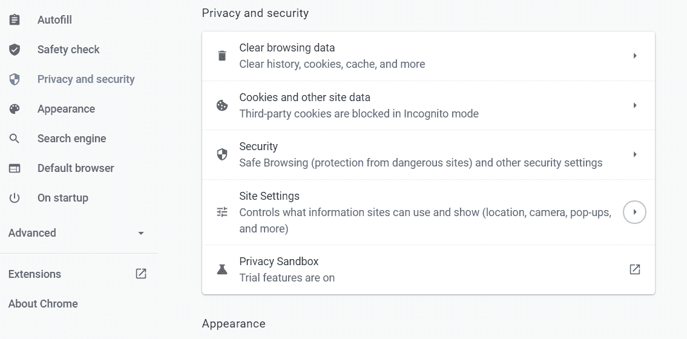
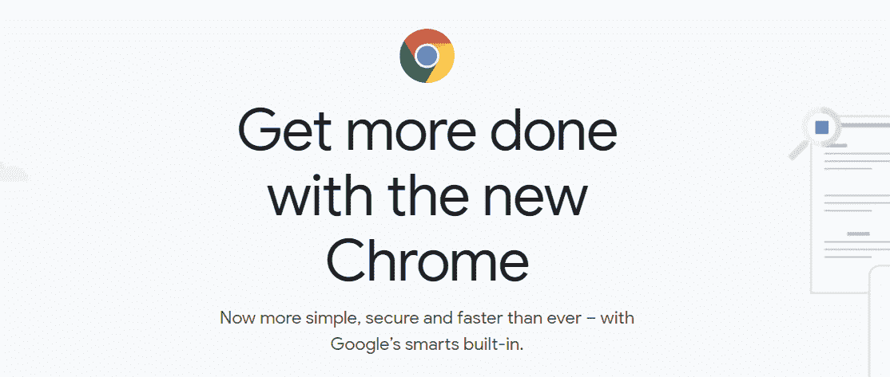
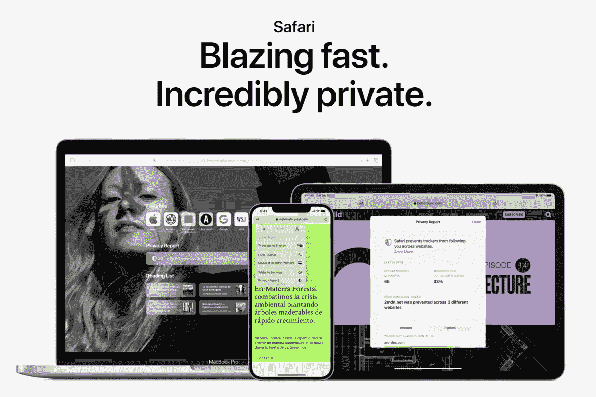
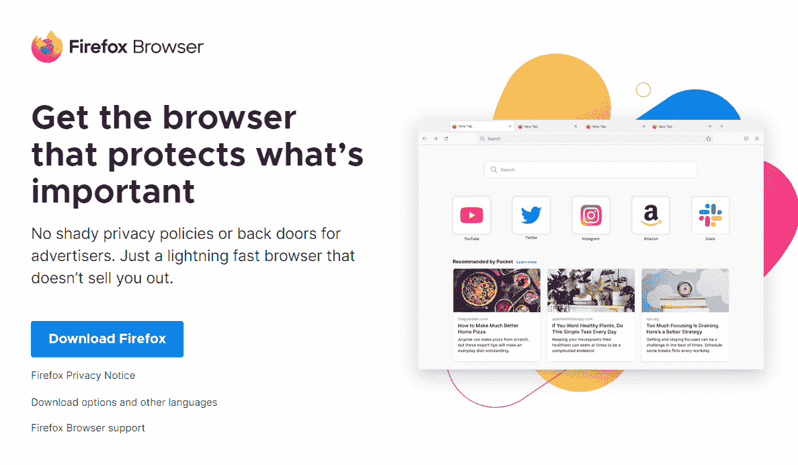
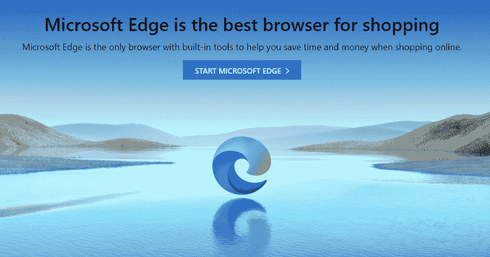
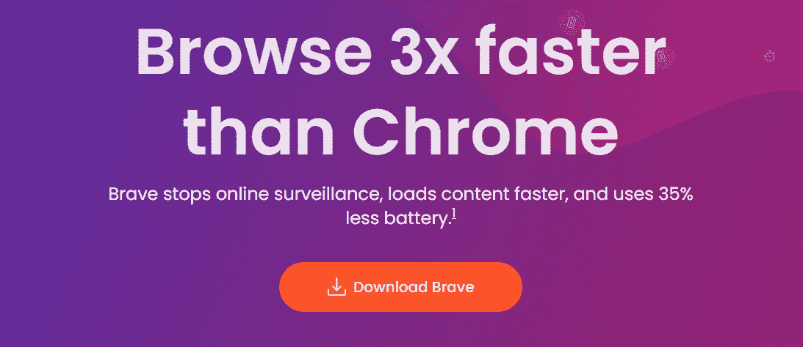
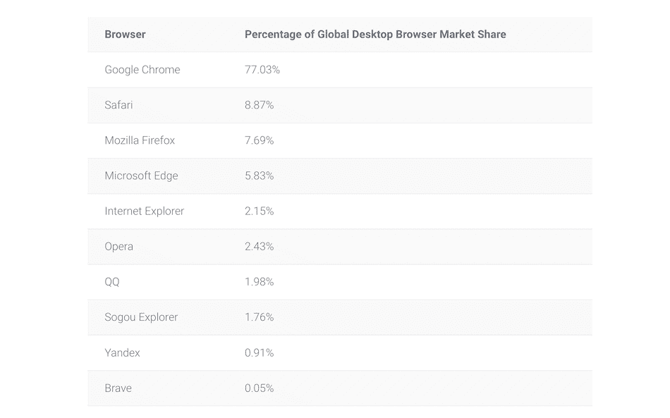
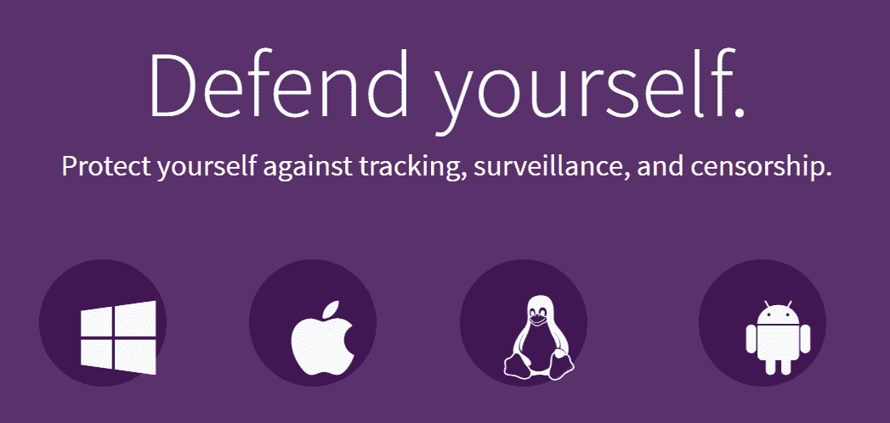

# 2022 年，6 款最安全的浏览器将确保您的安全并保护您的隐私

> 原文：<https://kinsta.com/blog/most-secure-browser/>

每个人都有一个日常使用的最喜欢的浏览器。虽然几乎所有的浏览器都提供相似的功能，但有必要考虑到一些浏览器比其他浏览器提供更好的安全性和隐私性。因此，为您的日常使用选择最安全的浏览器将在您浏览网页时保护您。

一个安全的浏览器也将帮助你保持你的数据安全，并确保其他人不能窥探你的活动。不幸的是，尽管许多流行的浏览器提供了类似的安全和隐私功能，但并不是所有的浏览器都易于使用。

在本文中，我们将帮助您找出最安全的浏览器来满足您的需求。我们将讨论六种最流行的浏览器，从 Chrome 到 Tor。

我们开始吧！

 **查看[我们的安全浏览器视频指南](https://www.youtube.com/watch?v=2aAdOxZVFGc):**

## 什么使浏览器安全？

重要的是要明白大多数浏览器并不提供开箱即用的最安全或最私密的体验。作为用户，由您决定如何配置浏览器提供给您的隐私和安全选项。

默认情况下，大多数浏览器会跟踪你访问的网站，存储 cookies，甚至要求你保存密码。网站也可能获得大量识别信息，包括您的位置、显示弹出窗口的能力、运行脚本等等。

Configuring Chrome’s privacy settings.

安全浏览器为您提供了大量选项来保护您的信息并确保您的匿名性。然而，在许多情况下，更私密的网络浏览体验意味着更少的便利，我们将在下一节讨论这一点。

[每个人都有自己喜欢的浏览器...但是这种浏览器并不总是最安全的🔒查看此列表，找到您的新首选⬇️ 点击推文](https://twitter.com/intent/tweet?url=https%3A%2F%2Fkinsta.com%2Fblog%2Fmost-secure-browser%2F&via=kinsta&text=Everyone+has+a+favorite+browser...+but+that+browser+isn%27t+always+the+most+secure+%F0%9F%94%92+Check+out+this+list+to+find+your+new+go-to+%E2%AC%87%EF%B8%8F&hashtags=SiteSecurity%2CWebSecurity)

## 浏览器安全的基础

当涉及到数据隐私和整体安全浏览时，浏览器安全性就是应用最佳实践。根据我们的经验，提供以下功能的浏览器可确保浏览网页时的安全体验:

*   就他们认为“不安全”的网站和下载向您发出警告
*   让您可以控制要授予网站的权限
*   使您能够[禁用 cookie](https://kinsta.com/blog/wordpress-cookies-php-sessions/)(如果您愿意)
*   大多数网站默认禁用弹出窗口
*   大多数网站默认禁用重定向
*   使您能够全局禁用脚本或为特定站点禁用脚本
*   让您控制自己的[浏览历史和缓存](https://kinsta.com/knowledgebase/how-to-clear-browser-cache/)
*   经常更新你的浏览器

一些浏览器自带了更强大的隐私和安全功能。但是，我们始终建议您在设置新浏览器时手动配置设置。不管你用的是什么软件，这都适用。

总的来说，在 2022 年浏览网页是一种更安全的体验。许多功能可以保护您免受“危险”网站的攻击，这些网站可能会试图利用您的数据或强迫您下载不安全的文件。根据一点常识，如果您使用现代浏览器，您的数据应该是安全的。

## 2022 年最安全的浏览器(6 个选项)

让我们仔细看看你可以使用的六种最流行的安全浏览器。

你应该注意到这个列表不是基于安全和隐私特性来排名的。把它们全部看完之后，你就可以决定哪一个最符合你的需求了。

### 1.铬

谷歌 Chrome 的主页。

就市场份额而言，Chrome 是浏览器中无可争议的领导者。它还提供了许多功能来帮助保护您的数据，并增加浏览时的匿名性。

使用 Chrome，您可以:

*   要求网站不要跟踪你的浏览
*   阻止弹出窗口和脚本
*   部分或全局阻止 cookies
*   如果您正在访问“危险”网站或下载不安全的文件，请启用警告
*   如果您存储的密码暴露，会收到通知
*   控制网站可以访问的权限
*   [阻止特定网站](https://kinsta.com/blog/how-to-block-a-website-on-chrome/)

Chrome 还可以让你进入匿名导航模式，这样你就可以浏览网页，而不用保存每次会话的历史记录或 cookies。该浏览器也经常更新，其部分代码是开源的。

尽管根据你的设置，Chrome 可能非常安全，但就隐私而言，它并不是最好的浏览器。你必须登录你的谷歌账户才能使用它，该公司会跟踪你的大量个人信息，即使它不会与其他网站共享这些数据。

**注意:**谷歌目前正在[进行一场诉讼](https://www.inc.com/jason-aten/googles-incognito-mode-isnt-what-you-think.html)，被指控跟踪其用户，即使他们使用匿名模式。

### 2.旅行队

Safari 的主页。

如果你使用的是苹果设备，你可能会依赖 [Safari](https://www.apple.com/safari/) 来完成大部分浏览。就市场份额而言，Safari 仅次于 Chrome，其份额还在继续增长。

就安全性而言，Safari 提供了许多功能来保护您的数据，包括:

*   防止危险场所装载
*   智能跟踪预防(ITP)功能，限制广告商跟踪您的浏览
*   阻止所有 cookies
*   默认情况下阻止网站利用浏览器缓存
*   向[块弹出窗口](https://kinsta.com/blog/google-mobile-popup-penalty/)提供选项
*   控制网站权限
*   提供隐私报告，告诉你在网上遇到了哪些追踪者

同样值得注意的是，苹果公司在保护用户隐私方面取得了重大进展。例如，在 2021 年，他们推出了一个更新，使你能够[阻止应用程序跟踪你](https://www.theguardian.com/technology/2021/apr/27/apple-ios-145-update-includes-app-tracking-transparency-feature)，如果你正在使用他们的设备，这是一个极好的消息。

2020 年，谷歌研究人员披露了 Safari 的[多个安全漏洞。其中一人声称 ITP 的功能泄露了用户数据，但苹果公司声称他们已经解决了这个问题。然而，由于 Safari 不是开源的，很难知道你的数据发生了什么。](https://arstechnica.com/information-technology/2020/01/safaris-anti-tracking-protections-can-leak-browsing-and-search-histories/)

## 注册订阅时事通讯

### 想知道我们是怎么让流量增长超过 1000%的吗？

加入 20，000 多名获得我们每周时事通讯和内部消息的人的行列吧！

[Subscribe Now](#newsletter)

需要注意的是，尽管 Safari 保护你的隐私免受第三方侵犯，但该浏览器是封闭源代码的，会与苹果共享你的信息。这是使用与应用和平台生态系统紧密相连的浏览器的常见问题(就像 Chrome 一样)。

### 3.火狐浏览器

火狐的主页。

Mozilla Firefox 是全球最受欢迎的浏览器之一。然而，在过去十年中，与竞争对手 Chrome 和 Safari 相比，它的受欢迎程度有所下降。回到 2010 年，火狐占据了全球浏览器市场份额的 31%。十一年后，[下降到 11.4%](https://www.w3counter.com/globalstats.php?year=2015&month=12) 。

Firefox 受欢迎程度的下降促使浏览器重新发明自己。尽管如此，Firefox 仍然是您可以使用的最安全的互联网浏览器之一，包括以下功能:

*   提供跨网络的跟踪保护(具有不同的安全级别)
*   提供关于试图跟踪您的网站的报告(分为不同类别)
*   让您能够选择加入数据泄露警报
*   让你选择退出火狐数据收集
*   提供对网站权限的控制
*   默认情况下阻止弹出窗口
*   阻止危险的下载
*   强制所有连接[通过 HTTPS](https://kinsta.com/knowledgebase/how-ssl-works/) 加载

同样值得注意的是，Firefox 是一个开源项目，这意味着任何人(拥有适当的技能)都可以分析它的代码库，并确保浏览器不会收集它不应该收集的数据。Firefox 也会定期更新。

Firefox 提供了良好的安全选项和隐私实践的完美结合。此外，该公司非常重视隐私。因此，它使 Firefox 成为浏览器的主要卖点之一，有助于它与 Chrome、Safari 和 Edge 等浏览器竞争。
T3】

### 4.边缘

微软 Edge 的主页。

微软 Edge 是 ie 浏览器的精神继承者。但是，不像它的前身，它不一定是一个你可以毫不犹豫地打折的浏览器。2020 年 1 月，Edge [改用 Chromium](https://www.browserstack.com/blog/chromium-based-edge/) ，这意味着它是部分开源的。Edge 也获得了许多安全更新，它在发布时间表的速度上可以与 Chrome 匹敌。

就市场份额而言，Edge 略微领先于 Firefox，但落后于 Chrome 和 Safari。在功能方面，Edge 提供了一组类似的安全相关选项，包括:

*   多种级别的跟踪预防选项
*   报告它在网络上阻止的跟踪者
*   选项来配置在浏览器的私人模式下使用什么级别的跟踪预防
*   阻止网站查看您是否保存了[付款](https://kinsta.com/blog/stripe-vs-square/)偏好设置
*   自动防御恶意网站和文件下载
*   让您选择退出微软的跟踪

与 Chrome 和 Safari 类似，Edge 也犯有收集用户隐私数据的罪行。一些研究指出 Edge 比其他浏览器更不注重隐私，因为它与第三方共享硬件标识符。

尽管 Edge 在用户体验上比微软之前的浏览器产品有了巨大的飞跃，但它并不是保护用户隐私的最佳选择。然而，该浏览器在功能和获得市场份额方面正在取得重大进展，这意味着它值得关注。

需要一个给你带来竞争优势的托管解决方案吗？Kinsta 为您提供了令人难以置信的速度、一流的安全性和自动伸缩功能。[查看我们的计划](https://kinsta.com/plans/?in-article-cta)

### 5.勇敢的

勇者主页。

勇敢者是浏览器世界的新人。它于 2019 年推出，与更受欢迎的选项相比，它仍然几乎没有市场份额。如果你看看 2022 年浏览器市场份额的统计数据，Brave 以 0.05%的使用率[垫底](https://kinsta.com/browser-market-share/):

市场份额为顶级浏览器。

尽管市场份额很小，但 Brave 是最近几年推出的最令人兴奋的浏览器。它提供了许多其他浏览器没有的令人兴奋的功能，包括它紧密相连的广告平台和加密货币。

在安全性方面，Brave 比其他浏览器要激进得多。以下是它包括的一些功能:

*   默认情况下阻止第三方广告
*   默认情况下阻止跟踪
*   内置的[密码管理器](https://kinsta.com/blog/password-managers/)
*   阻止 cookies 和脚本的能力
*   类似于 Tor 浏览器的私人浏览(我们将在下面讨论)
*   强迫所有联系通过 HTTPS

需要注意的是，Brave 是基于铬的。这意味着，尽管浏览器有一系列隐私设置，但与谷歌服务器共享的数据仍有一些问题。

此外，即使 Brave 默认禁用广告，它仍然显示其广告，这意味着你*正在被跟踪。你可以禁用 Brave 的广告和奖励，但整个程序与 Brave 声明的隐私标准相冲突。*

### 6.突岩

Tor 项目的主页。

不能不谈 [Tor 项目](https://www.torproject.org/download/)(或简称 Tor)就谈私有浏览器。在引擎盖下，它是火狐浏览器的[分支，专门设计用于 Tor 网络。](https://support.torproject.org/tbb/tbb-4/)

所有这些使得 Tor 成为目前为止你可以使用的最安全的浏览器。它也不遗余力地保护你的隐私。但是，不幸的是，这也意味着 Tor 不是最用户友好的浏览器(它的设计也不是如此)。

为了让您了解 Tor 在多大程度上保护了您的隐私，让我们回顾一下它的一些主要特性:

*   使得通过在志愿者中继服务器之间跳跃请求来追踪你变得非常困难
*   默认情况下禁用跟踪
*   在所有网站上默认禁用[脚本](https://kinsta.com/blog/scripting-languages/)
*   不跟踪你的浏览历史
*   在所有网站上强制使用 HTTPS
*   默认情况下，每次会话后删除所有 cookies

这些特性也意味着 Tor 不是日常使用的最佳选择。例如，一些网站阻止 Tor 退出中继，这意味着您将无法登录您的帐户。此外，由于浏览器默认阻止脚本，它不会正确地呈现许多网站。

Tor 也可能相当慢，即使你有一个快速的互联网连接。这是通过多个中继路由连接的副作用。这个过程增加了迷惑性，但是它减慢了导航速度。

最后，如果你想要最安全和最私密的浏览器，我们建议你使用 Tor。难怪大多数举报程序，如新闻自由基金会的 [SecureDrop](https://freedom.press/projects/) ，也推荐使用 Tor。

## 最安全的网络浏览器是什么？

在绝对安全方面，你是打不过 Tor 的。它提供了迄今为止最私密的网络浏览体验，并且不遗余力地保护你的数据。然而，Tor 并不是为日常使用而设计的，浏览器也没有提供特别友好的用户体验。

Firefox 和 Brave 都在可靠的安全特性、隐私保护和用户友好性之间提供了更好的平衡。如果你注重隐私，这两种浏览器都是不错的选择。然而，为了增加安全性，我们建议您研究两种浏览器的隐私增强扩展。

您可能使用的一些常见扩展类型包括:

*   **一个密码管理器:** Brave 提供了这个现成的，但是[使用第三方选项](https://kinsta.com/blog/password-managers/#9-best-password-managers-to-choose-from-free-and-paid-tools)会更安全。
*   脚本拦截器:【Firefox 和 Brave 都提供了脚本拦截功能。但是，某些扩展允许您在每个页面中阻止特定的脚本，而不是逐个站点地阻止。
*   广告拦截器: [禁用广告](https://kinsta.com/blog/ad-blockers/)会带来更好的网络浏览体验。Brave 默认禁用广告，但它也试图让你选择进入它的广告网络。

Firefox 有一个丰富的插件库，而 Brave 接受了 Chrome 扩展，因为它是基于 Chrome 的。只要您保持所选的扩展和浏览器处于最新状态，并检查您的隐私设置，您在浏览网页时应该是安全的。此外，这两种浏览器在所有主流操作系统上都可以使用。

[Stay protected while browsing the web with help from these ultra-secure browsers 👩‍💻Click to Tweet](https://twitter.com/intent/tweet?url=https%3A%2F%2Fkinsta.com%2Fblog%2Fmost-secure-browser%2F&via=kinsta&text=Stay+protected+while+browsing+the+web+with+help+from+these+ultra-secure+browsers+%F0%9F%91%A9%E2%80%8D%F0%9F%92%BB&hashtags=SiteSecurity%2CWebSecurity)

## 摘要

2022 年选择最安全的浏览器相对简单。总的来说，如果你使用的浏览器依赖于 Chrome、Edge 或 Safari 等生态系统，你可以肯定你的数据不会是 100%隐私的。这并不是说这三个浏览器都不好，但是它们没有把用户隐私放在第一位。

如果你关心安全和隐私，你最好的选择是 Tor、Firefox 和 Brave。然而，Tor 对于日常使用来说并不是特别用户友好。那就只剩下勇敢或者火狐了。您的选择将取决于您是想使用基于 Chromium 的浏览器还是其他浏览器。无论哪种情况，都不会错。

关于应该使用什么浏览器，你有什么问题吗？那么，下面评论区来说说他们吧！

* * *

让你所有的[应用程序](https://kinsta.com/application-hosting/)、[数据库](https://kinsta.com/database-hosting/)和 [WordPress 网站](https://kinsta.com/wordpress-hosting/)在线并在一个屋檐下。我们功能丰富的高性能云平台包括:

*   在 MyKinsta 仪表盘中轻松设置和管理
*   24/7 专家支持
*   最好的谷歌云平台硬件和网络，由 Kubernetes 提供最大的可扩展性
*   面向速度和安全性的企业级 Cloudflare 集成
*   全球受众覆盖全球多达 35 个数据中心和 275 多个 pop

在第一个月使用托管的[应用程序或托管](https://kinsta.com/application-hosting/)的[数据库，您可以享受 20 美元的优惠，亲自测试一下。探索我们的](https://kinsta.com/database-hosting/)[计划](https://kinsta.com/plans/)或[与销售人员交谈](https://kinsta.com/contact-us/)以找到最适合您的方式。