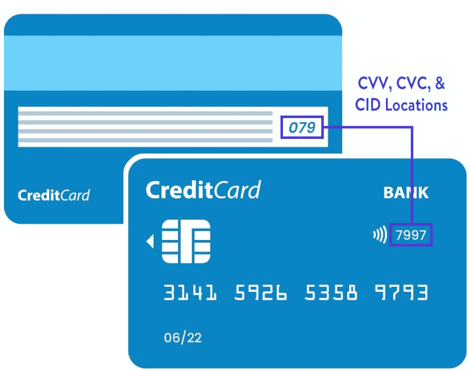
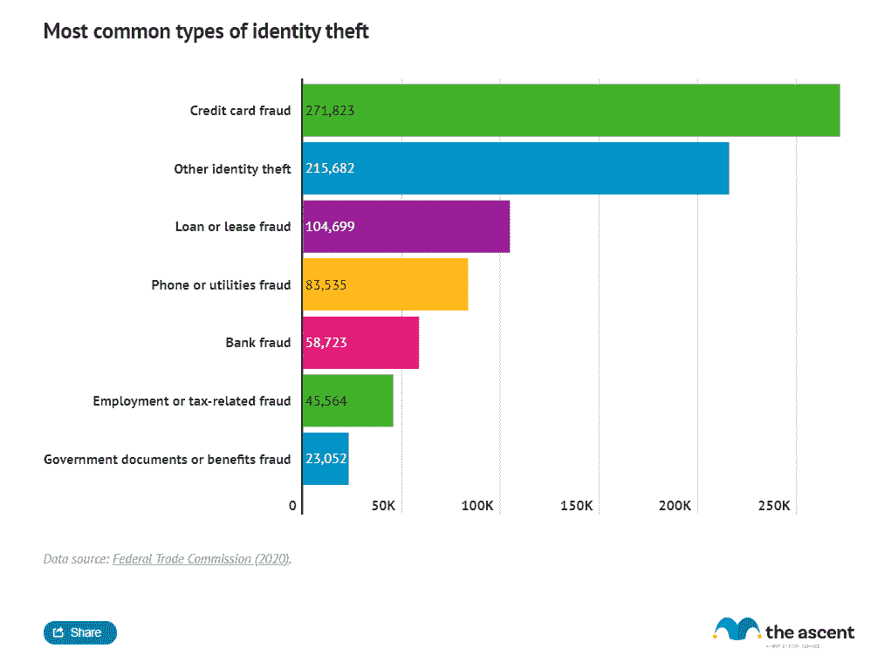
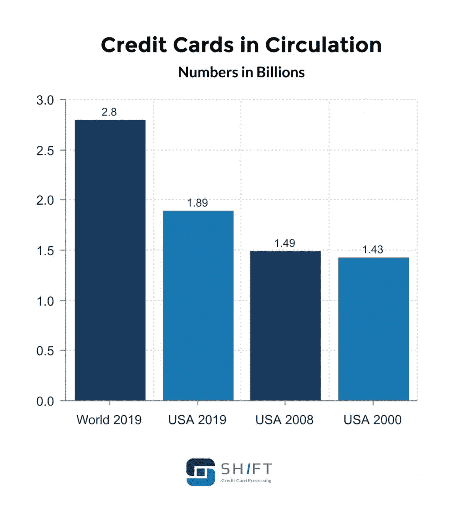

# 2022 年信用卡拒绝代码完整列表

> 原文：<https://kinsta.com/blog/list-of-credit-card-declined-codes/>

当你尝试使用信用卡时，你的信用卡被拒绝了吗？

您是否想知道您的交易被阻止的原因是因为您没有资金还是因为位置限制？还是[别的什么](https://kinsta.com/blog/credit-card-fraud-stripe/)？

有了这个信用卡拒绝代码列表，您可以确定问题的来源。

在这篇文章中，我们将帮助您找出您(或您的客户)的信用卡到底发生了什么，以及为什么交易没有通过。我们将详细介绍所有标准的(不太常见的)信用卡拒绝代码，包括它们的含义以及您应该如何处理每一个代码。

我们走吧！

### 查看我们的[视频指南](https://www.youtube.com/watch?v=WWgIOLT1j4EI)，其中有完整的信用卡拒绝代码列表

## 什么是信用卡拒绝代码？

信用卡拒绝代码是当交易或支付被拒绝时出现在信用卡处理器上的代码。

> Kinsta 把我宠坏了，所以我现在要求每个供应商都提供这样的服务。我们还试图通过我们的 SaaS 工具支持达到这一水平。
> 
> <footer class="wp-block-kinsta-client-quote__footer">
> 
> 
> 
> <cite class="wp-block-kinsta-client-quote__cite">Suganthan Mohanadasan from @Suganthanmn</cite></footer>

[View plans](https://kinsta.com/plans/)

如果你在商店里不能使用你的信用卡，你和卖主会得到一个错误信息，它会告诉你哪里出错了。

您也可以在尝试进行[在线购买](https://kinsta.com/blog/ecommerce-statistics/)时获得错误代码。

信用卡网上购物被拒的例子(来源:[【SmarterQueue.com】](https://help.smarterqueue.com/article/108-how-to-resolve-payment-issues))

每当交易被供应商、银行或发卡机构停止时，都会发生这种情况。

当您遇到这个问题时，您会收到一条简短的错误消息，包含一到三个数字(在某些情况下是字母)。

这个错误信息就是所谓的信用拒绝代码。代码可以解释实际问题是什么…只要你知道它的意思。

首先，在深入探讨*所有*潜在的信用卡拒绝代码之前，我们将介绍一些最常见的信用卡拒绝原因以及与之相关的代码。

[如果您的客户在您的网站上尝试结账时看到这些代码中的一个，请使用本指南了解可能是什么原因造成的✅ 点击发布推文](https://twitter.com/intent/tweet?url=https%3A%2F%2Fkinsta.com%2Fblog%2Flist-of-credit-card-declined-codes%2F&via=kinsta&text=If+your+customers+see+one+of+these+codes+when+attempting+to+check+out+on+your+site%2C+learn+what+could+be+causing+it+with+this+guide+%E2%9C%85&hashtags=FinanceTips%2COnlineStore)

## 信用卡被拒的最常见原因

首先，让我们从交易可能被拒绝的几个常见原因开始。

问题可能很简单，比如[支付处理器](https://kinsta.com/blog/paypal-alternative/)卡出问题，资金不足，或者与你的银行或信用卡公司有关的电子问题。

一些最常见的退卡原因包括:

*   **信用卡验证错误(代码 CV):** 您的卡的微芯片或磁条可能有问题，无法用于交易。
*   **资金不足(代码 51):** 您的卡(信用卡和借记卡)相关账户中的资金不足。
*   **超过信用额度(代码 65):** 即使你的账户里有钱，如果你已经超过了信用卡的信用额度，你也需要付清才能再次使用。
*   **过期卡(代码 54):** 所有信用卡都有过期日期，在该日期后尝试使用卡会给你一个错误信息。
*   **不允许交易(代码 57):** 当您试图使用您的卡进行不允许的交易时(例如，如果您阻止了在线交易或国际支付)，就会出现这种情况。
*   **卡号输入错误(代码 14 & 15):** 卡号输入不正确有两种错误方式。如果第一个数字不正确，你会看到**错误代码 15** 表示“没有这样的发行商”，因为第一个数字指出了卡的发行银行。如果您得到任何其他错误的号码，您将得到**错误代码 14** ，因为您输入了无效的卡号。
*   **错误的安全码(代码 63):** 当您在卡背面错误地键入三位数的 CVV 或 CVC 代码，或者在卡正面错误地键入四位数的 CID 代码时，就会出现这种情况。

哪里可以找到你的 CVV、CVC 或 CID 号码的例子(来源: [LendingTree](https://www.comparecards.com/) )

对于其中的许多问题，您可能还会看到**错误代码 12** 或**错误代码 85** 。这些只是表示一个无效的交易。信用卡发卡银行经常使用这两个错误作为总括响应代码，从而更难知道哪里出了问题。

您可能输入了错误的信用卡号码，使用了错误的验证码，输入了无效的过期日期，或者尝试了一些本来不可能的事情，如尝试退款。

如果您在这一部分没有看到您的错误代码，您可以浏览下表，其中按数字顺序列出了 50 多个信用卡拒绝代码，以及每个代码出现的原因和如何解决问题的详细信息。

## 信用卡拒绝代码完整列表

此表包括所有信用卡错误代码的列表、它们的确切含义(实际问题)以及如何修复它们。

| 密码 | 标签 | 问题是 | 狐狸 |
| 01 | 参考发行人 | 发卡银行(万事达卡、维萨卡、发现卡等。)在没有具体原因的情况下阻止了交易。 | 给银行打电话，让他们解释这个问题。 |
| 02 | 参考发行人(特殊条件) | 客户的银行阻止了该交易(类似于代码 01)。 | 用卡上的号码打电话给银行，要求解释。 |
| 04 | 拿起卡，保持通话(无欺诈暗示) | 客户的银行阻止了该交易，并告知商家保留该卡。这并不意味着欺诈，而是指透支的卡或过期的卡。 | 打电话给银行，询问为什么你的信用卡会出现提货通知。 |
| 05 | 不兑现 | 客户的银行停止了交易，并告诉商家“不承兑”该卡(不接受付款)。 | 打电话给银行，要求解释。 |
| 06 | 其他错误 | 发卡行无法指明错误，但交易出了问题。 | 请重试，如果问题仍然存在，请致电银行。 |
| 07 | 提货卡，特殊情况(欺诈) | 客户的银行停止了交易，因为该卡或银行帐户已被标记为欺诈。 | 如果你是客户，立即给银行打电话，澄清任何潜在的问题。如果你是商家，在你能从银行和顾客那里得到关于他们的身份和卡的合法性的确认之前，扣留卡。 |
| Ten | 部分批准 | 发卡银行接受一部分付款，但阻止其余部分，通常是因为超出了信用限额或帐户中的资金。 | 打电话给银行解决这个问题(如果信用额度有问题，就付清你的贷款)。 |
| Twelve | 无效交易 | 尝试的交易无效。这可能是由于任何数量的错误操作，包括试图退款退款。 | 打电话给银行之前，从头开始重新交易，并确保输入的所有信息都是正确的。 |
| Thirteen | 无效金额 | 您为交易输入的金额无效，通常是因为金额中输入了非数字符号(如美元符号)。 | 只需重新开始交易，并注意在输入金额时避免使用符号。 |
| Fourteen | 无效的卡号 | 卡号无效，信用卡处理器找不到相关账户。 | 重新开始交易，注意准确输入数字。如果问题仍然存在，请致电发卡银行。 |
| Fifteen | 没有这样的发行人 | 第一个数字，识别卡的发行银行，是不正确的。(信用卡发卡银行有自己独特的代码，以第一个数字开头——3 代表美国运通，4 代表维萨，5 代表万事达，6 代表发现。) | 再次仔细键入信用卡号，确保正确输入第一个数字。 |
| Nineteen | 重新进入 | 出现未知错误。 | 重新启动交易，并注意正确输入所有信息。如果问题仍然存在，请致电发卡机构。 |
| Twenty-eight | 没有答复/回应 | 交易过程中发生错误，但未说明原因。 | 重新启动交易，并注意正确输入所有信息。如果问题仍然存在，请致电发卡机构。 |
| Forty-one | 丢失的卡，捡起来 | 该卡的合法所有者已经报告了它的丢失或被盗，因此该卡的发行者已经否认了该交易。 | 如果是自己的卡，需要马上给银行打电话。如果你是商家，请顾客使用备用卡或联系他们的银行。 |
| Forty-three | 盗卡、提货(欺诈账户) | 合法所有者已将该卡挂失，因此发卡方否认了该交易。 | 如果是你自己的卡，你需要尽快用卡背面的号码打电话给银行。如果你是商家，请他们使用备用卡或联系他们的银行。 |
| Fifty-one | 存款不足 | 发卡方正在阻止交易，因为帐户已经超过信用限额，或者未决交易会使卡过期。 | 用卡背面的号码联系银行，用网银转账到卡上，或者用备用卡。 |
| Fifty-four | 过期卡 | 过期日期已经过了。 | 使用仍然有效的信用卡。(如果你只有一张卡，新卡通常会在旧卡到期前寄到，所以一定要联系银行。) |
| Fifty-seven | 不允许交易-卡 | 当您试图使用信用卡进行明确禁止的交易时，例如向外国商家账户转账，就会出现此代码。 | 使用没有此类限制的备用卡，或致电发卡银行，了解您是否可以选择允许此类交易。 |
| Fifty-eight | 不允许交易-终端 | 如果连接到终端或支付处理器的商家帐户配置不正确，您会看到此错误。 | 商家需要给他们的银行打电话来澄清事情。如果你是顾客，使用另一种支付方式，如现金或支票。 |
| Sixty-two | 无效服务代码，受限 | The invalid service code can refer to two specific situations.1: You’re trying to process an American Express or Discover card, but the system doesn’t support those card issuers.2:您试图用不支持在线支付的卡支付在线购物。 | 尝试使用不同发行商的信用卡，如 Visa。如果商家宣传接受您的发卡机构的支付，您需要联系银行，询问您的卡的在线支付配置。 |
| Sixty-three | 安全违规 | 三位数的 CVV2 或 CVC 或四位数的 CID 安全码不正确或未正确读取。 | 从头开始重新启动交易，并仔细键入正确的安全代码。 |
| Sixty-five | 超过活动限制 | 信用卡用户已超过信用额度(或者该交易会使他们透支)。 | 使用另一张信用卡。如果您没有其他卡，您可以使用网上银行或电话银行支付该卡，然后再重试。 |
| 85 或 00 | 发卡行系统不可用 | 当商家和发卡银行之间出现临时通信错误时，就会出现此错误代码。 | 稍等片刻，然后从头开始事务。 |
| eighty-five | 没有理由拒绝 | 发卡行无法识别具体问题，但交易仍未通过。 | 重新开始交易，如果问题仍然存在，请致电发卡行。你也可以尝试使用另一张信用卡，看看这个问题是否是商家特有的。 |
| Ninety-one | 发行者或交换机不可用 | 终端或支付处理器无法完成支付授权。 | 从头开始交易，如果问题依然存在，打电话给发卡行。 |
| Ninety-two | 无法路由交易 | 终端无法联系发卡方来处理交易。 | 等待几分钟，然后重试。如果问题仍然存在，请联系您的银行。 |
| Ninety-three | 违反，无法完成 | 发卡银行已经认识到(或被告知)信用卡用户的违法行为，资产已经被冻结。 | 如果你错误地得到了这个错误代码，请立即打电话给发卡银行来解决任何问题。 |
| Ninety-six | 系统误差 | [支付处理器](https://kinsta.com/blog/woocommerce-payment-gateways/)出现临时问题。 | 重新开始交易。如果问题仍然存在，请尝试另一张信用卡。如果什么都没用，很可能是商家的支付处理器出了问题。 |
| RO 或 R1 | 客户请求停止特定的定期付款 | 您的客户特别要求停止您尝试处理的定期付款。 | 首先，取消对[的所有预定未来付款，以避免拒付和相关费用](https://kinsta.com/blog/startups-avoid-stripe/)。如果客户违反了合同，你需要和他们联系，把事情弄清楚。 |
| 履历 | 卡类型验证错误 | 读卡器在验证卡时遇到问题。这可能是微芯片或磁条的问题。 | 试试古老的把戏，把信用卡在你的衬衫上擦一擦，然后小心翼翼地再刷一遍。如果不起作用，输入号码或联系发卡银行。 |
| W1、W2、W9 | 连接到银行时出错 | 这可能是由于停电或服务中断造成的。 | 等待电力恢复，或者寻找可能影响您的当地停电消息。如果没有任何明显的原因，请联系您的商业银行。 |

## 欺诈的错误代码

无论你是商家还是持卡人，最糟糕的情况是你得到一个欺诈的错误代码。

## 注册订阅时事通讯

### 想知道我们是怎么让流量增长超过 1000%的吗？

加入 20，000 多名获得我们每周时事通讯和内部消息的人的行列吧！

[Subscribe Now](#newsletter)

作为商家，您希望[避免退款及相关费用和损失](https://kinsta.com/blog/ecommerce-fraud-prevention/)。作为持卡人，你显然不希望别人随意使用你的卡。

但是信用卡诈骗比你想象的要普遍得多。2019 年，仅在美国就有[271823](https://www.fool.com/the-ascent/research/identity-theft-credit-card-fraud-statistics/)起信用卡诈骗案件。

2019 年美国信用卡诈骗案(来源:)

每年都有成千上万的信用卡欺诈事件发生，你需要警惕那些并不是他们所使用的信用卡的真正主人的顾客。你还需要保持警惕，意识到自己的牌是如何被利用的。

以下是所有与欺诈相关的信用卡拒绝代码:

*   **代码 7 —取卡，特殊情况(欺诈账户):**发卡方已将该账户标记为欺诈账户，因此拒绝交易。
*   **代码 41 —失卡，拾到(诈骗账户):**真正的主人将此卡挂失或被盗，发卡方已封锁交易。
*   **代码 43 —盗卡，提货(诈骗账户):**机主已挂失卡，发卡行已封锁交易。
*   **代码 215 —丢失/被盗卡:**真实持卡人已挂失或被盗卡，发卡方阻止交易。
*   **代码 534 —不兑现，高额欺诈:**交易未通过 PayPal 或 Google Checkout 风险建模。
*   **代码 596 —疑似欺诈:**发卡机构再次怀疑欺诈，并已阻止交易。

**注意**:如果你接受网上支付，并且你担心欺诈和拒付，我们已经写了一份关于[如何减少高达 98%的信用卡欺诈](https://kinsta.com/blog/credit-card-fraud-stripe/)的指南。

## 如果我的信用卡被拒绝，我该怎么办？

当你的信用卡被拒绝时，你应该做的第一件事是寻找[错误](https://kinsta.com/blog/wordpress-errors/)代码(或者如果你自己使用支付处理器，写下来)。

然后，检查您的信用卡/账户或商家的终端是否有问题。

最后，您必须采取解决该特定问题所需的适当措施。这可能是重新开始交易，仔细输入所有内容，给银行打电话，或者尝试另一张卡。

需要为您的电子商务网站提供超快的、可靠的、完全安全的托管服务吗？Kinsta 提供所有这些服务，并由 WooCommerce 专家提供 24/7 的世界级支持。[查看我们的计划](https://kinsta.com/plans/?in-article-cta)

故障排除可归结为一个简单的三步流程:

1.  询问拒绝的代码。
2.  了解代码的含义。
3.  采取适当的行动(通常打电话给发卡银行或尝试另一种信用卡)。

你可能认为你已经准备好了你的资金，或者你的信用卡额度还没有达到，但是去银行核实一下也无妨。

我们大多数人都有多张卡，很难把它们都记录下来。仅在美国就有超过 10 亿张信用卡在使用。

美国和世界信用卡数量图表(来源: [Shift](https://shiftprocessing.com/credit-card/) )

因此，如果你在使用你的一张卡时收到错误代码，避免[直接使用下一张卡](https://kinsta.com/help/multiple-credit-debit-cards/)。第一，一定要联系银行，了解真实情况。

你不想遭受不必要的透支或滞纳金，或者在成为欺诈受害者后收到令人讨厌的意外账单。

## 信用卡拒绝代码常见问题

您还对错误代码感到困惑吗？查看这些常见问题。

### 为什么我有钱的时候信用卡被拒？

尽管您的账户中有资金，但您的信用卡可能会被拒绝的原因有很多:

*   您可能已经超出了您的信用额度。除非你已经设置了[自动](https://kinsta.com/blog/wordpress-booking-plugins/)支付，否则你必须先还清信用卡债务，然后才能再次使用。
*   你可能试图使用信用卡进行未经批准的交易，如在线支付或在国外支付。
*   您的信用卡号可能被标记为欺诈。
*   您可能输入了不正确的信用卡号、CVV2 代码或 PIN。
*   问题可能出在商家的终端上，而不是你的信用卡。

### 信用卡代码 51 是什么意思？

信用卡拒绝代码“51”表示您已超出信用额度(如果是信用卡)或资金用完(如果使用借记卡)。

### 为什么我的卡在网上订购时被拒？

你的信用卡可能会因为三个潜在的原因被拒:账户设置，资金不足，信息不准确。

1.  您的信用卡可能无法处理在线支付。联系你的银行确认是否是这种情况。
2.  您输入的信用卡号、CVV2、CVC、CID、PIN 或姓名可能不正确。
3.  您的帐户中可能没有足够的剩余资金，或者已经超出了您的信用额度。

[Don't let these credit card codes stop you (or your customers!) from making online transactions 🙅‍♀️ Learn what they mean & how to fix them here ⬇️Click to Tweet](https://twitter.com/intent/tweet?url=https%3A%2F%2Fkinsta.com%2Fblog%2Flist-of-credit-card-declined-codes%2F&via=kinsta&text=Don%27t+let+these+credit+card+codes+stop+you+%28or+your+customers%21%29+from+making+online+transactions+%F0%9F%99%85%E2%80%8D%E2%99%80%EF%B8%8F+Learn+what+they+mean+%26amp%3B+how+to+fix+them+here+%E2%AC%87%EF%B8%8F&hashtags=FinancialTips%2COnlineShop)

## 摘要

无论是你自己的信用卡还是客户的信用卡被拒绝，知道真正的原因对于决定正确的反应是至关重要的。

如果你不知道你遇到了什么问题，你可以用另一张信用卡继续你的一天。然而，要时刻保持警惕，监控你的信用额度使用情况，保护自己免受身份盗窃。

希望这个列表能帮助你弄清楚你的信用卡出了什么问题，并给你必要的知识来采取适当的措施解决这个问题。

* * *

让你所有的[应用程序](https://kinsta.com/application-hosting/)、[数据库](https://kinsta.com/database-hosting/)和 [WordPress 网站](https://kinsta.com/wordpress-hosting/)在线并在一个屋檐下。我们功能丰富的高性能云平台包括:

*   在 MyKinsta 仪表盘中轻松设置和管理
*   24/7 专家支持
*   最好的谷歌云平台硬件和网络，由 Kubernetes 提供最大的可扩展性
*   面向速度和安全性的企业级 Cloudflare 集成
*   全球受众覆盖全球多达 35 个数据中心和 275 多个 pop

在第一个月使用托管的[应用程序或托管](https://kinsta.com/application-hosting/)的[数据库，您可以享受 20 美元的优惠，亲自测试一下。探索我们的](https://kinsta.com/database-hosting/)[计划](https://kinsta.com/plans/)或[与销售人员交谈](https://kinsta.com/contact-us/)以找到最适合您的方式。