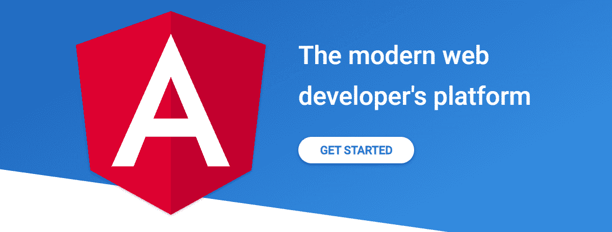
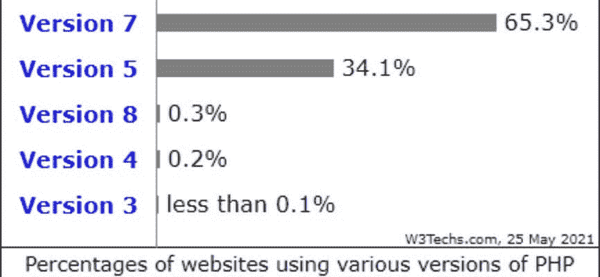
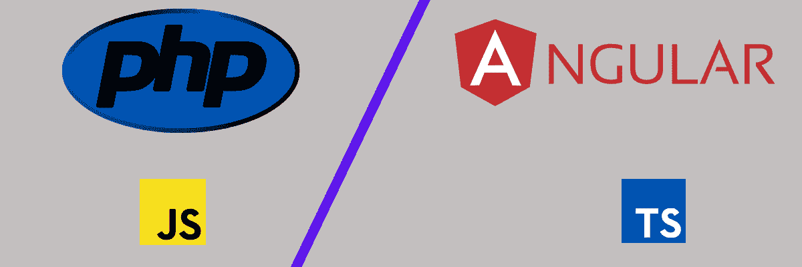
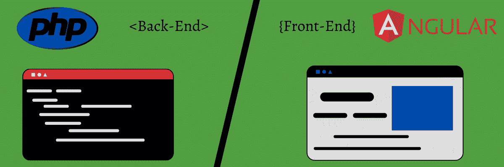
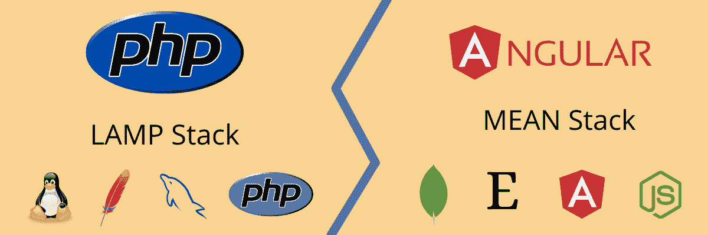
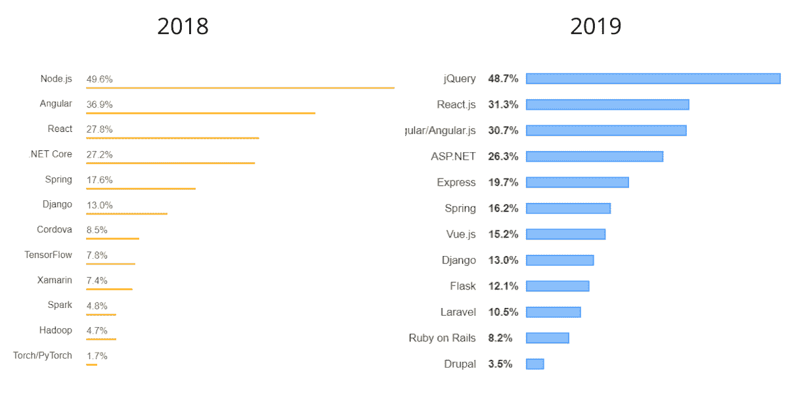
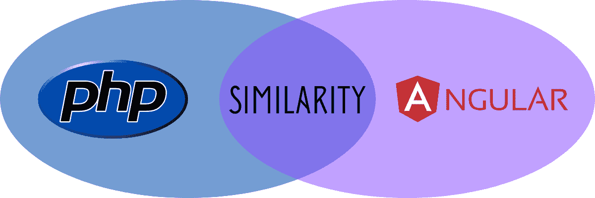

# PHP vs Angular:2022 年开发者该选择什么？

> 原文：<https://kinsta.com/blog/php-vs-angular/>

开发可高效扩展并提供诺克斯堡级安全性的 web 应用和网站是每个开发人员的梦想。而使用这样的产品是每一个用户的愿望。因此，为您的项目选择最合适和最可靠的技术非常关键。

虽然 PHP 和 Angular 是完全不同的技术— [PHP vs JavaScript](https://kinsta.com/blog/php-vs-javascript/) 是一个更恰当的比较——它们都在 web 开发中广泛使用(有时一起使用)。那么，为什么是这一块呢？在我们的研究中，我们发现“PHP vs Angular”是一个相对流行的搜索查询。

这篇文章将解决关于 PHP 和 Angular 的争论，并帮助你为你的下一个项目选择最合适的技术。

准备好了吗？让我们开始吧！

## PHP 与 Angular:为什么要比较？

在比较 Angular 和 PHP 之前，有必要了解一下它们。因此，让我们来看看这些技术是什么，它们的关键特性和应用。

### 什么是有角？

Angular logo.

Angular 是一个开源的基于 TypeScript 的框架，用于开发 web 和桌面应用程序。Angular 项目由谷歌的 Angular 团队领导，并在一个由许多个人和公司组成的社区的帮助下开发。因为它完全重写了 AngularJS (Angular 1)，所以也被称为“Angular v2 及以上”或“Angular 2+”

Angular 于 2016 年发布，获得了麻省理工学院的许可，主要用于前端 web 开发。目前我们一共有 12 个角版，最新的一个发布于 2021 年 5 月 12 日。

Angular 包括一个基于组件的 web [框架](https://kinsta.com/blog/php-frameworks/)来帮助你开发可扩展的 web 应用。它还有一个广泛的集成库，涵盖了几个重要的特性，比如表单管理、客户机-服务器通信、路由等等。

#### 角度与角度

Angular 经常与 [AngularJS](https://kinsta.com/blog/javascript-libraries/#angularjs) 混淆。这并不奇怪，因为 Angular 是 AngularJS 的重大更新。因此，了解有角度和有角度之间的区别是很重要的:

| 有角的 | 安古斯 |
| 它是一个基于类型脚本的 Web 框架 | 这是一个基于 JavaScript 的框架 |
| 它是基于组件的，利用不同组件的层次结构 | 它利用控制器和范围 |
| Angular 包含标准指令。例如，要创建单向或双向绑定，只能将`ng-model`与 Angular 一起使用。 | 它有几个指令。在 AngularJS 中，您需要明智地选择指令。您将使用`ng-bind`进行单向绑定，而使用`ng-model`进行双向绑定。 |
| Angular 的架构包括带有模板的结构和属性指令。 | AngularJS 遵循模型-视图-控制器(MVC)架构来管理数据、规则和逻辑，并表达应用程序的行为方式。 |
| 通过更好的框架结构，Angular 提供了更高的速度和性能。 | 相比之下，AngularJS 提供的速度和[性能](https://kinsta.com/blog/application-performance-monitoring/)。 |
| 为了提供更快的应用程序创建，Angular 使用命令行界面(CLI)。 | AngularJS 严重依赖第三方工具，如 WebStorm 和其他 ide 来提供更快的应用程序创建。 |
| Angular 正在不断发展中。 | 谷歌已经停止了 AngularJS 的积极开发，但他们已经承诺将它的长期支持延长到 2021 年 12 月 31 日，主要是为了解决安全问题。之后谷歌就不再支持了。 |

#### 特征

*   **开源** : Angular 是开源免费的。
*   **跨平台支持**:您可以为所有平台构建应用程序和网站，包括移动平台、web 平台、本地桌面平台、本地移动平台和操作系统，如 Windows、Linux 和 Mac。
*   **性能和速度** : Angular 将模板转换成高度优化的 JavaScript 虚拟机代码。它提供了仅用 [CSS](https://kinsta.com/blog/wordpress-css/) 和 [HTML](https://kinsta.com/blog/html-vs-html5/) 的即时应用渲染，并促进了更好的 SEO 优化。此外，利用组件路由器，Angular 应用加载速度更快，提供自动代码分割。
*   **可伸缩性**:Angular 框架是高度可伸缩的，通过在 Immutable.js 或其他推送模型上创建数据模型，帮助开发人员满足海量数据需求。
*   简单的界面:它有声明性的模板，可以帮助你更快地构建像 UI 视图这样的应用功能。您还可以使用组件扩展其模板语言。
*   **生产力**:您可以立即开始创建应用程序，添加测试和组件，并使用命令行工具进行部署。它在[领先的 ide 和编辑器](https://kinsta.com/blog/php-editor/)中提供智能代码完成、快速错误检查和反馈。
*   **测试**:Angular 中的依赖注入通过向控制器中注入虚拟或模拟数据来帮助你测试代码。接下来，它评估其行为和输出，并利用不存在的 HTTP 提供者将伪造的响应从服务器推入控制器。
*   **内置组件** : Angular 具有功能性的内置特性，如导航元素、按钮、布局、数据表、指示器等。因此，Angular 可以轻松创建直观的应用程序界面，并开发类似 Gmail、Android OS、Google Drive 等应用程序。
*   代码可重用性:它帮助你节省时间，加速你的开发过程。

#### 应用程序

由于 Angular 在创建高性能和可伸缩的应用程序方面无可挑剔的特性，它现在得到了广泛的应用。以下是它的一些可能用途:

*   **构建渐进式 web 应用**:您可以使用 Angular 开发高性能渐进式 web 应用，通过零步骤安装提供离线、类似应用的体验。
*   **桌面应用开发** : Angular 用于创建兼容 Windows、macOS 和 Linux 的桌面应用。
*   **开发本地应用** : Angular framework 适用于移动设备，因此，您可以使用它来创建移动应用。
*   **创建单页应用**:通过在一个实例中检索网页的关键部分(HTML、CSS 和 [JavaScript](https://kinsta.com/blog/defer-parsing-of-javascript/) )，Angular 可以轻松处理复杂性。因此，它可能是开发单页面应用程序的最佳选择之一。
*   **创建动画**:Angular 的智能 API 可以让你创建高性能的动画和复杂的舞蹈动作，只需要很少的代码行。
*   **创建可访问的应用**:您可以使用开发人员指南、内置 a11y 测试基础设施和支持 ARIA 的组件来创建可访问的应用。

此外，在 Angular 中创建某些应用程序是无缝的，包括 YouTube 和 PlayStation 等视频流应用程序；电子商务应用程序；weather.com 等实时数据 apps 以及像《卫报》这样以内容为中心的新闻网站。

[Calling all developers! 💥 Determine whether a PHP-based framework or Angular is the right fit for your next project with help from this guide 👇Click to Tweet](https://twitter.com/intent/tweet?url=https%3A%2F%2Fkinsta.com%2Fblog%2Fphp-vs-angular%2F&via=kinsta&text=Calling+all+developers%21+%F0%9F%92%A5+Determine+whether+a+PHP-based+framework+or+Angular+is+the+right+fit+for+your+next+project+with+help+from+this+guide+%F0%9F%91%87&hashtags=PHP%2CWebDev)

### PHP 是什么？

PHP.

PHP 是 [PHP:超文本预处理器](https://kinsta.com/knowledgebase/what-is-php/)的递归首字母缩写(最初，它代表*个人主页*)。它主要是一种用于服务器端 web 开发的[通用脚本语言。](https://kinsta.com/blog/php-vs-javascript/)

PHP 于 1994 年由丹麦裔加拿大程序员拉斯马斯·勒德尔夫设计，现在由 PHP 开发团队和 T2 Zend 科技公司开发和维护。标准的 PHP 软件在 PHP 许可下是免费的。它几乎免费支持所有操作系统、平台和 web 服务器。

PHP 于 1995 年发布，从那以后，它的专用开发人员社区带来了一些修改。因此，最新的主要 PHP 版本是 PHP 8。

一般来说，PHP 代码是在服务器上的 PHP 解释器的帮助下处理的，并在模块、可执行 CGI 或守护进程中实现。最后，它会产生一个 HTTP 响应。

这种编程语言[是最受欢迎的语言之一](https://kinsta.com/blog/scripting-languages/)用于开发世界范围内的许多网站和应用程序。

[根据 W3Techs](https://w3techs.com/technologies/details/pl-php) 的数据，在所有已知服务器端编程语言的网站中，超过 79%的网站使用 PHP。

W3Techs survey showing PHP version usage.

使用 PHP 的流行网站包括:WordPress、T2、Joomla、T4、Drupal、Canva、脸书和 Salesforce 等等。

#### 特征

PHP 的主要特点是:

*   **免费:** PHP 的标准许可是免费的。因此，任何人都可以轻松地下载、安装和使用它来完成他们的 web 开发项目。开发者也可以检查它的代码，并为[的错误修复](https://kinsta.com/blog/wordpress-debug/)和新功能做出贡献。
*   简单:开发人员喜欢使用 PHP，因为它简单，无论是初学者还是有经验的人。它很容易学习，并且在语法方面与 C 语言相似，具有逻辑的、有组织的结构。
*   **性能**:PHP 中数据库连接和数据加载更快。因此，它在数据库管理、服务器管理、邮件功能等方面也很有效。请务必阅读我们的 [PHP 基准博客帖子](https://kinsta.com/blog/php-benchmarks/#the-state-of-php)。
*   **面向对象编程**:和 C++一样，PHP 是一种面向对象的编程语言，具有数据封装、抽象、继承、多态等有用的特性。
*   **兼容性** : PHP 支持跨平台兼容性，可以跨 macOS、Windows、Unix、Linux 等多个操作系统运行。它的脚本也可以在不同的服务器上无缝工作，比如 T2、Apache 和 IIS，以及智能手机、平板电脑、笔记本电脑和台式机等设备。
*   **实时监控** : PHP 使您能够轻松地获取服务器日志，以便您可以监控资源使用情况，如内存、CPU 和其他数据。
*   **灵活性**:PHP 的嵌入能力优秀；因此，您可以轻松地将它与其他技术(如 HTML、JavaScript、XML 等)集成。
*   **数据库支持**:支持 [MySQL](https://kinsta.com/blog/mariadb-vs-mysql/) 、 [PostgreSQL](https://kinsta.com/knowledgebase/what-is-postgresql/) 、MongoDB、Oracle 等多个数据库。由于是数据库友好的，您可以直接在数据库系统中添加、更改或删除数据。
*   异常处理 : PHP 生成快速错误警告，因为它支持错误报告常量。它可以让你很容易地发现错误，并在它们造成大麻烦之前修复它们。

除了所有这些特性，PHP 还提供了魔法常数、cookies、正则表达式、shell 命令行执行、PDO 类等等。

#### 应用程序

尽管 PHP 是一种通用脚本语言，但开发人员主要使用 PHP 进行服务器端 web 开发。然而，PHP 有很多应用，无论是在 web 环境中还是在 web 环境之外:

*   创建网站和 web 应用程序 : PHP 让你创建现代的、交互式的应用程序和网站，具有更好的定制和用户友好的界面。为了实现这一点，它利用了一个 3 层 web 架构，线性地支持您的服务器、浏览器和数据库系统。因此，这些基于网络的产品是高性能的，能够与许多服务集成，并促进安全的在线支付。
*   构建电子商务应用 : PHP 让你轻松构建电子商务应用。你可以使用基于 [PHP 的 web 框架](https://kinsta.com/blog/php-frameworks/)，比如 [Laravel](https://kinsta.com/blog/laravel-tutorial/) ，CodeIgniter，Symfony，以及许多其他的。PHP 使应用程序能够无缝扩展，对早期创业公司和大企业都有帮助。一些利用 PHP 的电子商务平台有 [Magento](https://kinsta.com/blog/magento-vs-woocommerce/) 、 [WooCommerce](https://kinsta.com/blog/woocommerce-checkout/) 和 [Shopify](https://kinsta.com/blog/shopify-alternatives/) 。
*   **创建内容管理系统(CMS)** : [CMS](https://kinsta.com/knowledgebase/content-management-system/) 对于内容营销已经变得非常有用。PHP 帮助创建 web [CMS 平台](https://kinsta.com/blog/cms-software/)而没有麻烦，所以你可以满足这种需求。它支持多个数据库，可以通过 POP3、HTTP、IMAP、COM、SNMP 等协议与各种服务轻松交互。
*   **表示数据**:使用 PHP，您可以使用 Image_Graph 之类的工具创建大量格式的数据表示，包括图形和图表，如饼图、线条、条形图、柱形图等等。
*   **构建基于 GUI 的应用**:使用 ZZEE、PHP-GTK2 等 GUI。，支持 PHP 脚本，您可以创建基于 GUI 的应用程序。
*   **图像处理与平面设计** : PHP 对图像处理与平面设计有帮助。您可以集成基于 PHP 的应用程序和库，如 Imagine、ImageMagic 和 GD library。此外，您还可以[创建缩略图](https://kinsta.com/blog/regenerate-thumbnails/)，旋转图像，调整大小和裁剪图像，添加[水印](https://kinsta.com/blog/protect-images/#watermark-images)，以及取出 PNG、JPEG、GIF 等几种[图像格式](https://kinsta.com/blog/image-file-types/)的图片。
*   **机器人无人机控制**:可以用 PHP 进行[无人机控制](https://kinsta.com/clients/dartdrones-shark-tank-effect/)。人们也用它来交互式地计算、下载、上传和显示数据。

## 使用 PHP 和 Angular

如果您想知道是否可以将 PHP 与 Angular 一起使用，答案是肯定的。但是 Angular 仍然需要一个独立的客户端-服务器架构。

一般来说，PHP 运行在服务器端，而 Angular 运行在客户端。因此，要在它们之间建立通信，您需要一个 API。

使用 Angular 创建应用程序或站点的整个前端，使用 PHP 创建与前端和数据库通信的 API。

应用程序前端使用 Angular 的 HTTP 请求技术，如 GET 和 POST，用于 UI 和数据库之间的数据传输。所以你可以在 JSON 中传输这些数据，在 PHP 代码中管理这些数据以将其存储在数据库中，并根据需要将其转发给 UI。

## PHP 与 Angular:一个详细的比较

现在你对 PHP 和 Angular 有了一点了解，以及它们的特性和应用，让我们来比较一下，以帮助你决定在下一个项目中应该使用哪一个。

**注意:**由于 PHP 和 Angular 是截然不同的技术，因此进行严格的一对一比较是不可行的。我们将讨论他们在许多方面的优势和劣势，以帮助您做出更好的决定。

### PHP vs Angular:语言 vs Web 框架

PHP vs Angular.

PHP 与 Angular 比较的第一个也是最重要的方面是 PHP 是一种编程语言，而 Angular 是一种基于类型脚本的框架。

它们都以 web 和应用程序开发为目标，但是它们的本质是不同的。

现在，如果你比较他们的编程语言，TypeScript 是 JavaScript 的超集，或者你可以说是类型化的 JavaScript。因此，JavaScript 程序也是类型脚本程序。

这种语言由微软在 2012 年开发，提供可选的静态类型。TypeScript 旨在为 JavaScript 创建大型应用程序和转换器，并简化 JavaScript 中的复杂组件开发。

另一方面，与 TypeScript 相比，PHP 是一种设计糟糕的编程语言。它在函数名和参数顺序方面的不一致性，版本的缓慢采用等等都是常见的抱怨。

### PHP vs Angular:前端 vs 后端

Backend vs Frontend: PHP vs Angular.

Angular 是最通用和最先进的前端 web 框架之一，用于构建基于 TypeScript 的成熟应用程序，通常用于前端开发。

PHP 运行在一个网站或应用程序的后端，它对访问者来说是隐藏的。例如，PHP 在你的 web 服务器和 WordPress 网站的[管理区执行它的工作。](https://kinsta.com/knowledgebase/wordpress-admin/)

### PHP 与 Angular:服务器端与客户端脚本

Angular 在用户的智能手机、平板电脑或笔记本电脑上的客户端工作，而不是在服务器上。因此，这也意味着您需要另一种用于服务器端脚本的编程语言。

PHP 就是这么做的。它是一种服务器端脚本语言，其代码在 web 服务器上执行，并对浏览器的请求产生 HTML 响应。PHP 作为一种服务器端编程语言，允许您向用户交付动态内容，通常来自数据库。它也有助于构建电子商务应用程序。

### PHP vs Angular:哪个更容易学？

如果你懂 JavaScript，你就不会觉得理解 Angular 有困难，因为它是用 TypeScript 写的，是 JS 的上标。

然而，两者都很容易学。这是因为它们类似于其他编程语言，如 Java、C 和 C++，并且依赖于编程基础，如对象、变量、范围、条件语句、循环等等。因此，即使对初学者来说，学习 Angular 或 PHP 也很容易。

然而，与 PHP 相比，掌握 TypeScript 可能有点困难。另外，现在互联网上有很多免费和付费的 PHP 教程，可以帮助你掌握这门语言。

### PHP 与 Angular:区分大小写

区分大小写意味着您必须以正确的大写(大写或小写)键入变量、函数名、关键字和其他标识符。

例如，`while`语句将总是用小写字母书写，而不是用`WHILE`或`While`书写。

Angular 区分大小写，因为它使用 TypeScript，这是一种区分大小写的编程语言。但是 Angular 的指令、模块和控制器是不区分大小写的。因此，你需要小心使用这些。

例如，如果你想在 Angular 中创建一个变量作为`$x`并期望得到`$X`的值，这是不可能的。

但是另一方面，PHP 是部分区分大小写的。所以，还是要小心。

在 PHP 中，字符串、常量(默认)、对象属性和变量是区分大小写的。但是，函数、关键字、对象方法、定义的常数和类名是不区分大小写的。

例如，如果您输入一个区分大小写的变量`$x`，您将只获得`$x`的值，而不是`$X`。

但是，如果你在 PHP 中输入一个函数`xY()`，然后你想调用`Xy()`、`XY()`或`xy()`，这个函数就会运行。

也就是说，基于 PHP 的框架或 CMS 可以定义自己的语法。WordPress 钩子和函数就是一个完美的例子。

无论使用什么编程语言，编写代码时保持一致都是至关重要的。

### PHP 与 Angular:易于安装

安装现代前端应用程序并不容易。但是，Angular 提供了一个名为 Angular CLI 的命令行界面来使事情变得更简单。它消除了复制粘贴配置文件以使项目进入开发阶段。

您可以通过一些简单的步骤安装 Angular:

*   安装 NPM 软件包
*   通过 NPM 安装角度 CLI
*   在 Angular 中创建新项目

Angular 可以跨操作系统工作，包括 Windows、Linux 和 Mac。所以，仔细阅读他们的[详细文档](https://angular.io/guide/setup-local)来检查在你的系统上安装 Angular 的具体步骤，因为每一个都有一些不同的方法。

然而，安装 PHP 相对容易。此外，PHP 可以在 Windows、Mac 和 Linux 等多种操作系统上运行。

要使用它:

*   通过支持 MySQL 和 PHP 的 web 主机获得空间。
*   在你的电脑上安装一个服务器，然后开始安装 MySQL 和 PHP。

就是这样！

### PHP 与 Angular:技术堆栈

Technology stacks for PHP vs Angular.

角度属于均值叠加。这里，MEAN 代表涵盖软件开发重要方面的四种技术。这四项技术是:

*   M : MongoDB，一个非关系或 NoSQL 数据库
*   **E** : [Express.js](https://kinsta.com/knowledgebase/what-is-express-js/) ，后端 JavaScript 框架
*   **A** : Angular，一个前端 web 框架
*   **N** : [Node.js](https://kinsta.com/blog/node-js-vs-php/) 作为运行时环境

MEAN 是一种用于全栈软件开发的高级技术栈，因为它具有前端和后端技术。它的组件更高级，包括应用程序表示层，而不是操作系统层。

PHP 属于 LAMP 栈。在这里，LAMP 是 web 开发中最常用的四种技术的缩写。这些是:

*   **L** : Linux 作为操作系统
*   **一个** : [Apache](https://kinsta.com/knowledgebase/what-is-apache/) HTTP 服务器
*   **M** : [MySQL](https://kinsta.com/knowledgebase/what-is-mysql/) ，关系数据库
*   PHP，编程语言

这些免费的开源技术在世界各地被广泛使用。它们形成了 CMS 的技术栈，如 WordPress、Drupal 等。

### PHP 与 Angular:性能和速度

性能和速度至关重要。用户希望你的网站能在 2-3 秒内加载，没人有时间看缓慢的应用程序。

除了硬件资源、存储、内存等之外，使用的编程语言也是网站和应用程序性能的一个因素。

由于 Angular 使用 TypeScript，所以在单个硬件上测量时，它的执行速度比 PHP 快。然而，由于它主要在客户端工作，如果用户的机器不够强大，Angular 的性能也会下降。

此外，Angular 在移动设备上提供了卓越的性能，特别是智能手机，与台式电脑相比，智能手机的使用在当今世界正在飞速增长。它可以在不同屏幕尺寸、界面可访问性和硬件的移动设备上无缝工作。此外，它对构建移动应用程序的原生支持非常棒，并提供了更高级别的可伸缩性。

PHP 的早期版本代码执行缓慢。但是随着 PHP 7 和 Zend Engine 3 的推出，PHP 的速度和性能都有了大幅提升。因此，它变得比许多编程语言如 Ruby、Python、Perl 甚至 TypeScript 都要快。

## 注册订阅时事通讯

### 想知道我们是怎么让流量增长超过 1000%的吗？

加入 20，000 多名获得我们每周时事通讯和内部消息的人的行列吧！

[Subscribe Now](#newsletter)

PHP 7 能够处理比 PHP 5 多两倍的用户请求。PHP 8 甚至更进一步。阅读我们深入的 [PHP 基准测试](https://kinsta.com/blog/php-benchmarks/)以获得更多信息。

PHP 8 也是一个重要的 PHP 版本，它在一些特性方面改进了上一个版本，比如即时编译、匹配表达式以及语法、库和类型注释方面的其他变化。所有这些都使得 PHP 在编码方面更加高效和健壮。

### PHP 与 Angular:包管理器

编程语言使用包管理器来加速开发过程，因此您不必从头开始设计一切。

包可以是向软件应用程序添加功能的第三方可重用代码的模块。

类似地，软件包管理器指的是一个软件集合，它可以帮助您自动执行特定的过程，比如一致地安装、配置、升级和删除软件包。此外，它维护软件依赖关系和版本信息，以避免遗漏先决条件和软件不匹配。通过这种方式，您可以更专注于更大的事情，例如应用程序服务和逻辑。

Angular 使用了两个流行的包管理器，即[节点包管理器(NPM)](https://kinsta.com/knowledgebase/what-is-node-js/#what-is-npm) 和 Yarn。安装 Node.js 时，默认情况下会安装 NPM。它让你建立或启动你的应用程序，测试，格式检查，等等。脸书使用的是 Yarn，它提供了卓越的性能，对于开发小型项目非常有用。

PHP 提供了许多包和扩展；因此，需要软件来管理它们。PHP 的包管理器是 PEAR、Composer 和 PECL。

PEAR 是 PHP 的第一个包管理器，旨在让您在一个集中的存储库中安装包。此外，PECL 管理所有已编译的扩展，Composer 列出软件依赖关系，同时使安装更容易。

在这些包管理器中，NPM 是用得最多的，但是如果你想开发小应用，Yarn 也是很棒的。

### PHP 与 Angular:数据库集成

由于 Angular 是一个客户端 web 框架，它在一个 [web 浏览器](https://kinsta.com/browser-market-share/)中执行其代码，而不是数据库服务器或应用服务器。与 JavaScript 一样，Angular 不能直接访问本地计算机。因此，您不能将 Angular 与数据库直接集成。

这里您可以做的是构建一个 RESTful API ,它可以使用服务器端编程语言(如 PHP、Ruby On Rails 等)使用您的数据库来处理写或读请求。接下来，使用 Angular HTTP 请求来访问您的软件端针。另外，如果您使用 MEAN stack 进行软件开发，您可以使用 MongoDB。

然而，PHP 与几个数据库无缝集成，包括 MariaDB 和 MySQL(PHP 所属的 LAMP 堆栈的组件之一)。

此外，您可以找到许多提供轻松数据库集成的 [PHP 框架](https://kinsta.com/blog/php-frameworks/)，这样您就可以搜索、排序和过滤数据，并将其呈现给用户。

### PHP 与 Angular:线程

线程是给编程语言的指令。线程是可以独立运行的计算机程序的一部分。单线程就像一个有开始、执行和结束的顺序程序。它不是一个完整的程序，但它运行在程序的一个特定部分。

也就是说，多线程程序可以显著提高应用程序的性能。这是因为它们可以在一个程序中同时运行许多任务。

Web 浏览器是多线程应用程序的一个很好的例子。您可以在浏览器[下载图像](https://kinsta.com/blog/image-file-types/)时滚动页面，在下载新页面时在后台打印页面，或者同时播放音乐和动画。

Angular 没有线程来组织你的代码和执行并发进程。相反，它工作在客户端，在一个运行 JavaScript 的浏览器中。

因此，您可以使用 web workers 来实现线程化。它们是与主线程并行创建的后台线程，用于执行繁重的计算并帮助提高应用程序性能。您可以通过 Angular CLI 安装 web workers 并使用它们。

另一种方法是使用 JavaScript 的`async`属性来[推迟解析非关键代码](https://kinsta.com/blog/defer-parsing-of-javascript/)。

PHP 是一种多线程编程语言，这意味着它能够并行处理多个任务。还有一个名为“pthreads”的面向对象的 API，它可以提供 PHP 中多线程所需的不同工具。或者，也可以用并行来代替。

因此，PHP 应用程序可以轻松地读取、写入、创建、同步和执行线程、线程对象和工作线程。

### PHP 与 Angular:灵活性和可伸缩性

现代应用程序必须能够根据场景进行伸缩，并满足客户需求。你可能会从一个较小的网站或应用程序开始，但你总会想要[扩大规模，将你的业务推向更高的高度](https://kinsta.com/blog/bootstrapping-startup/)。

可扩展性还让您的应用程序能够调整并高效工作，即使流量很高，尤其是在节日或旺季。

Angular 和 PHP 都能够很好地扩展并支持您的应用程序。

然而，Angular 表现出更高的可扩展性，因此人们广泛使用它来开发企业级的应用程序和网站。此外，它是用 TypeScript 编写的，这有助于您快速检测和删除常见错误，同时使您的代码更干净、更好。

凭借其强大的架构和[强大的 CLI](https://kinsta.com/blog/wp-cli/) ，可轻松实现角度缩放。您还可以轻松地使用 Angular 生成大型单页面应用程序，从而简化单元测试和代码可重用性。此外，angular 还提供了模块，并附带了扩展应用程序和添加新功能所需的核心功能。

尽管最近的版本令人印象深刻，但 PHP 对新兴的客户需求和增长趋势提供的灵活性较低。积极的一面是，PHP 支持许多框架，如 [Laravel](https://kinsta.com/blog/php-frameworks/#laravel) 、 [Zend](https://kinsta.com/blog/php-frameworks/#zend-framework--laminas-project) 、 [CodeIgniter](https://kinsta.com/blog/php-frameworks/#codeigniter) 、 [CakePHP](https://kinsta.com/blog/php-frameworks/#cakephp) 、 [Symfony](https://kinsta.com/blog/php-frameworks/#symfony) 等等。

所以，如果你在做一个小项目，可以考虑用 PHP。在投资方面不会花你太多钱；因此，这是初创公司和小规模组织的好选择。

### PHP 与 Angular:调试

调试和编程一样，是 web 开发人员的基本技能之一。这是一个消除软件错误并根据程序让它们按照你期望的方式运行的过程。

此外，编写一个没有错误的程序是具有挑战性的。您可能无法控制这一点，但是在特定技术和工具的帮助下，您确实可以删除程序中的错误。

需要一个给你带来竞争优势的托管解决方案吗？Kinsta 为您提供了令人难以置信的速度、一流的安全性和自动伸缩功能。[查看我们的计划](https://kinsta.com/plans/?in-article-cta)

Angular 1 或者 AngularJS 在[调试](https://kinsta.com/blog/debugging-wordpress-performance/)的时候很恐怖。但是 Angular 2+，尤其是 Angular 9，引入了很多改进，比如使用树抖动减少包的大小，Ivy 编译器等等。

因此，Angular 9 增强了调试以及开发时与不同组件的交互方式。此外，您可以在 Angular 中触发变化检测，并在用户界面中反映变化，调用方法，评估对象值，并使用实例手动更改它们。

更不用说，您有大量的调试工具和技术，如 Angury、debugger 语句、ng probe、profiler、编辑器和 ide(如 WebStorm 和 VS Code)。

所有这些功能使得 Angular 易于调试。

另一方面，PHP 可能更难调试，尤其是对于服务器端编程语言。停止程序执行、打印变量的值并继续可能需要很长时间。

调试 PHP 程序时，您可能需要执行一些额外的步骤。但是 PHP 也提供了一些调试器，如 ZendDebugger 和 Xdebug，以使[调试过程](https://kinsta.com/knowledgebase/devkinsta/logging/)不那么痛苦，并且竞争更快。您还可以将一些 PHP 调试器与 CLI 或 IDE 集成在一起进行调试，如 [VS 代码](https://kinsta.com/blog/php-editor/#1-visual-studio-code)。

### PHP 与 Angular:安全性

随着技术的进步，网络安全问题也在发展。黑客正在发明更新的方法来利用你的网站和应用，包括你的客户资料。他们不断寻找您系统中的漏洞，注入有害意图并获取访问权限。

不同类型的安全威胁，包括跨站点脚本(XSS)、 [DDoS](https://kinsta.com/blog/what-is-a-ddos-attack/) 、网络钓鱼活动、恶意软件攻击和病毒，会渗透并侵入您的系统。结果，公司在声誉、资金和法规遵从性风险方面损失惨重。

这就是为什么你需要格外小心你的应用程序或网站安全。首先要选择一种更安全的编程语言(同时也是一家[安全主机提供商](https://kinsta.com/secure-wordpress-hosting/))。

Angular 使用 TypeScript，它通过支持接口、原语等类型来确保高级别的安全性。它能够更快地捕捉和消除错误，以确保您的应用和网站的安全。

默认情况下，Angular 认为每个值都不可信。当您通过属性、样式、属性、插值、类绑定或从模板向 DOM 中插入值时，Angular 会快速清理不可信的值以进行修改，并使它们在插入时更加安全。

Angular 还保护您的应用程序免受攻击和漏洞，如 XSS 攻击和 HTTP 漏洞，并提供减轻它们的方法。此外，它强制执行内容安全策略(CSP)和可信类型，以防止 XSS 攻击。你也可以通过写信来报告 Angular 中的漏洞。

相比之下，PHP 只是一种基本的编程语言——也是使用最广泛的语言之一。像几乎所有流行的软件一样，不幸的是，它也不是最安全的。即使 PHP 7 的到来带来了巨大的安全改进，你也不能完全依赖 PHP。一份 [2019 安全报告](https://insights.dice.com/2019/11/27/programming-language-vulnerabilities/)将 PHP 列为世界上最易受攻击的服务器端编程语言的第二名。

在 PHP 程序中，可能会遇到安全问题，如 [SQL 注入](https://kinsta.com/blog/sql-injection/)、XSS、源代码泄露、会话劫持和远程文件包含。

在这种情况下，Angular 可能看起来比 PHP 更安全，但是您最好将其与基于 PHP 的框架进行比较。

### PHP 与 Angular:可扩展性

您为 web 开发选择的编程语言必须是可扩展的，以便您可以将其与其他技术集成。

当可重用代码[模板](https://kinsta.com/blog/wordpress-template-hierarchy/)可供您包含在应用程序中时，您不必从头开始编写一切。此外，它们非常适合添加特定的功能，比如统一的 UI，包括数据输入、数据呈现等等。因此，它节省了您开发标准功能的时间和精力。

也就是说，Angular 提供了出色的可扩展性，可以与其他技术如[库](https://kinsta.com/blog/javascript-libraries/)一起工作，并通过添加可重用的代码来扩展应用程序的功能。

有许多可用的角度库，包括:

*   提供高级和[灵活用户界面组件](https://kinsta.com/blog/responsive-web-design/)的角形材料
*   NGX 引导库提供高适应性，并在桌面和移动设备上提供无可挑剔的性能
*   用 70 多个用户界面组件填充 NG
*   具有更高测试覆盖率的 NG 引导程序
*   面向移动和混合网络应用的 Onsen UI

如果您想要将库集成到您的应用程序中，请安装 NPM 包，然后在您想要使用的地方导入给定的功能。您也可以将 Angular CLI 用于许多已发布的角度库。

类似地，PHP 也是可扩展的，支持许多 PHP 库。尽管用 PHP 编写代码更简单，但为添加每一项功能而编写新代码可能会很乏味。

相反，节省您的开发时间，并使用一些 PHP 库，如:

*   [pChart](http://www.pchart.net/) 将文本数据创建为可视图表，如饼图、条形图等。
*   PHP 验证码创建自动化的音频或视频验证码，区分机器人和人类
*   [分派](https://dispatchhttp.org/Dispatch.html)来定义 URL 规则，以便更好地组织您的网站或应用程序

您还可以找到更多的 PHP 库，如 phpAES、PHP Thumbnailer、Mink、ImageWorkshop、Symfony 控制台组件、Faker(已存档，但可用)、Monolog 等等。

### PHP 与 Angular:文档

好的文档使开发网站或应用程序时实现编程语言变得更加容易。它就像一个向导，你可以随时回来。

文档不仅对初学者有益，对有经验的开发人员也有益。它包含了关于该语言的完整细节，如何实现它，以及您可能需要的其他实用细节。此外，它还帮助您了解该语言的最新变化。

因此，您会希望使用一种编程语言或任何具有良好定义和可读文档的工具或框架。

Angular 的文档非常出色。通过访问它的[官网](https://angular.io/)，你可以点击菜单，看到它的文档是如何以一种精简的方式编写的，就像一个指南。要理解这些文档，你只需要熟悉 JavaScript、CSS 和 HTML。

该文档包括几个关于 Angular with 特性的主题、框架介绍、组件、依赖项、模板、最佳实践、工具、教程等等。你还需要什么？

这些文档将帮助你学习 Angular 框架，并有效地实现它来创建单页面应用程序，甚至是针对企业。此外，指南和教程还下载了示例，这有助于您加快 web 或应用程序的开发。

PHP 也有全面的文档。由于它有一个庞大的社区和用户群，你可以找到许多 PHP 论坛、讨论板、课程、教程和网站。

PHP 文档可在其官方网站上获得。此外，它的在线手册有 10 种语言版本:英语、西班牙语、法语、日语、俄语、德语、土耳其语、罗马尼亚语、巴西葡萄牙语和简体中文。

该文档用简单的语言介绍了 PHP 及其特性、安装和其他部分。开发者也可以在任何页面上发表评论，用例子来阐明复杂的东西。它可以帮助其他人有效地理解 PHP，因为人们可以查看所有添加后永久保留的评论。

尽管这很有帮助，但也造成了在更新的 PHP 版本中解决了哪些注释的混乱。

### PHP vs Angular:开发者社区和支持

无论是新手还是有经验的开发人员，一个支持和活跃的开发人员社区总是令人鼓舞的。它让你更好地学习语言，同时也作为一个健康的与业内其他开发者交流的渠道，不管你在世界地图上的什么位置。

所以，在选择编程语言的时候，考虑[社区，支持](https://kinsta.com/learn/wordpress-communities/)是因素之一。它将使你免于陷入 web 开发的困境，并使你的努力免于白费。

Angular 的社区的故事有点争议，前后矛盾。比如在 [2018 栈溢出调查](https://insights.stackoverflow.com/survey/2018/)中，Angular 在使用最多的库、框架、工具中排名第二。但根据次年的 [2019 栈溢出调查](https://insights.stackoverflow.com/survey/2019)，Angular 滑落至第九位。

尽管有很高的性能和能力，Angular 的社区似乎还在变动。另外，你看不到那么多的论坛、讨论区和网站来寻找 Angular 的信息。

与此相反，自 1995 年以来，PHP 拥有一个庞大的开发者社区。所以遇到疑问可以向开发者寻求帮助，与他们建立健康的职业关系。

### PHP vs Angular:市场需求

Stack Overflow survey for 2018 and 2019.

Angular 是全球最先进和使用最广泛的 web 框架之一，因为它提供了出色的服务。根据这个从 2020 年开始的[栈溢出调查](https://insights.stackoverflow.com/survey/2020#technology-web-frameworks)，Angular 在使用最多的 web 框架中排名第三，证明了其在全球市场的高需求。

由于它被用于开发移动应用程序、网站和本地应用程序，其需求急剧上升。使用 Angular 的巨头有 PayPal、T2、YouTube、Upwork、网飞等等。

对基于 Angular 的网站和应用程序的需求增加，也增加了熟练 Angular 开发人员的工作。在美国，Angular developer 的平均年薪[略高于 68300 美元。](https://mobilunity.com/blog/salary-of-angular-4-js-developers/)

说到 PHP，正如本文已经提到的， [79.2%](https://w3techs.com/technologies/details/pl-php/7#:~:text=PHP%20is%20used%20by%2079.2,51.7%25%20of%20all%20the%20websites.) 的网站使用 PHP 作为他们的服务器端语言。在我写这篇文章的时候，WordPress 使用 PHP，并且为超过 [41.4%](https://kinsta.com/wordpress-market-share) 的网站提供支持。

除了 WordPress，PHP 还支持维基百科、Joomla、Drupal 等等。在 PHP 7 以其令人难以置信的更快速度和无可挑剔的额外改进推出后，对 PHP 的需求增加了很多。

在美国，一名 PHP 开发人员的平均年薪约为 6-8 万美元。

## PHP 与 Angular:哪个更适合开发？

比较 PHP 和 Angular 旨在帮助您找到更适合您的 web 或应用程序开发。它们都是不同的，是的，比较它们有时就像比较苹果和水果沙拉。不过话说回来，你还是可以在水果沙拉中加入苹果。

最终，您需要为您的项目选择最佳的框架或编程语言。因此，考虑你的网站或应用的目标、用途、复杂性，以及它是一个小项目还是一个企业级应用。

Angular 适合于开发企业级的应用程序，因为它具有出色的性能、灵活性、可扩展性、可伸缩性，并且使用了 TypeScript。因此，你可以使用 Angular 构建复杂的应用程序，如天气预报、[视频流](https://kinsta.com/blog/video-hosting/)、游戏等等。

另一方面，PHP 是一种基础编程语言。开发人员主要将其用于简单的中小型应用程序。但是你可以随心所欲地使用它，甚至可以使用 Angular。另外，如果你打算开发电子商务网站和 CMS，这可能是一个不错的选择。此外，如果你打算构建[学习管理系统(LMS)](https://kinsta.com/wordpress-lms-hosting/) ，PHP 也是合适的。

因此，你不能在 PHP 和 Angular 之间做出具体的选择。这完全取决于你的项目的需求。因此，请从这两者中选择一个最能满足您所有应用需求的。在某些情况下，你甚至会发现[它们是相辅相成的](https://phpenthusiast.com/blog/develop-angular-php-app-getting-the-list-of-items)。

### PHP 与 Angular:相似之处

Similarities between Angular and PHP.

尽管有一些不同，Angular vs PHP 也有一些相似之处。这些是:

*   两者都是开源的。因此，您可以根据自己的需求自由使用和修改。
*   根据您的项目范围，它们适合于 web 和应用程序开发。
*   两者都有大量的库来扩展它们的功能。
*   Angular 和 PHP 的需求都很高(嘿， [Kinsta 的招聘](https://kinsta.com/careers/))。
*   他们都有有用的包管理器。
*   Angular 和 PHP 都是面向对象的，虽然一个是框架，一个是语言。
*   两者在速度和[性能](https://kinsta.com/blog/php-benchmarks/)上都很优秀。

### PHP 与 Angular:差异

| 参数 | 有角的 | 服务器端编程语言（Professional Hypertext Preprocessor 的缩写） |
| 自然 | Angular 是一个基于类型脚本的框架，用于构建 web 应用程序、网站和桌面应用程序。 | PHP 是一种编程语言。您几乎可以将它用于任何类型的项目，但它主要用于 web 开发。 |
| 服务器端/客户端 | 它在客户端工作。 | 它在服务器端工作。 |
| 前端/后端 | 这是一个前端 web 框架。 | 它主要用于后端 web 开发。 |
| 学习曲线 | 学习 TypeScript 可能有点困难。 | PHP 比较好学。 |
| 区分大小写 | Angular 区分大小写。 | PHP 部分区分大小写。 |
| 易于安装 | 这涉及到几个额外的步骤，而且可能很困难。 | 安装 PHP 更容易。 |
| 技术栈 | 属于均值栈(MongoDB，Express.js，Angular，Node.js)。 | 属于 LAMP 栈(Linux，Apache，MySQL，PHP)。 |
| 数据库集成 | 它不直接与数据库集成。 | 它集成了多个数据库，如 MySQL、MongoDB、PostgreSQL 等等。 |
| 穿线 | 它使用 web workers 进行线程化，以运行并行任务并提高应用程序性能。 | PHP 是一种多线程编程语言。 |
| 灵活性和可扩展性 | Angular 由于其健壮的架构和强大的 CLI 而易于扩展和灵活。 | 对于新兴的客户和市场需求，它的可扩展性和灵活性较差。 |
| 排除故障 | 更容易调试，尤其是在 Angular 9 引入了改进的调试功能之后。 | 在服务器端语言中调试有点困难。 |
| 安全性 | Angular 是用 TypeScript 编写的，它提供了更多的安全性，可以抵御 XSS、HTTP 漏洞等威胁和攻击。 | 安全性较低，容易受到 SQL 注入、XSS、会话劫持等攻击。 |
| 证明文件 | Angular 的文档是用简单的语言和简化的方式编写的。 | PHP 手册记录了编程语言的方方面面。 |
| 社区和支持 | 与 PHP 相比，社区更小。 | 一个庞大的开发者社区。 |
| 使用范围 | 非常适合构建单页企业级应用程序。 | 适用于构建不太复杂、价格合理、较小且动态的网站。 |

[PHP and Angular may be entirely different technologies, but determining which one is right for your project can still be confusing 🥴 This post is here to help ✅Click to Tweet](https://twitter.com/intent/tweet?url=https%3A%2F%2Fkinsta.com%2Fblog%2Fphp-vs-angular%2F&via=kinsta&text=PHP+and+Angular+may+be+entirely+different+technologies%2C+but+determining+which+one+is+right+for+your+project+can+still+be+confusing+%F0%9F%A5%B4+This+post+is+here+to+help+%E2%9C%85&hashtags=PHP%2CWebDev)

## 摘要

谨慎的做法是宣布 PHP 或 Angular 胜出。凭借其出色的性能和特性，它们对于构建网站和应用程序都很有效。

Angular 框架非常适合构建复杂且需要可伸缩性的大规模应用程序。

PHP 是个老玩家了，在游戏中[还是很厉害的。对你来说，开发一个](https://kinsta.com/blog/is-php-dead/)[小型商业网站](https://kinsta.com/blog/wordpress-site-examples/)、一个[投资组合网站](https://kinsta.com/blog/wordpress-portfolio-plugins/)，甚至一个[电子商务商店](https://kinsta.com/blog/ecommerce-platforms/#1-woocommerce)，都是一个不错的低成本选择。

项目的范围和需求是你需要关注的最重要的因素。当然，PHP 和 Angular 各有利弊，但是应该由您的项目需求来决定哪一个更适合您的用例。

*你还在困惑 PHP vs Angular 吗？留下评论，我们会尽力帮你解决！*

* * *

让你所有的[应用程序](https://kinsta.com/application-hosting/)、[数据库](https://kinsta.com/database-hosting/)和 [WordPress 网站](https://kinsta.com/wordpress-hosting/)在线并在一个屋檐下。我们功能丰富的高性能云平台包括:

*   在 MyKinsta 仪表盘中轻松设置和管理
*   24/7 专家支持
*   最好的谷歌云平台硬件和网络，由 Kubernetes 提供最大的可扩展性
*   面向速度和安全性的企业级 Cloudflare 集成
*   全球受众覆盖全球多达 35 个数据中心和 275 多个 pop

在第一个月使用托管的[应用程序或托管](https://kinsta.com/application-hosting/)的[数据库，您可以享受 20 美元的优惠，亲自测试一下。探索我们的](https://kinsta.com/database-hosting/)[计划](https://kinsta.com/plans/)或[与销售人员交谈](https://kinsta.com/contact-us/)以找到最适合您的方式。