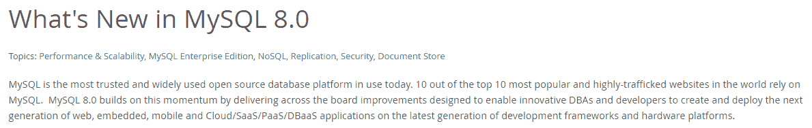
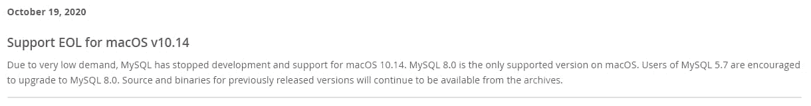
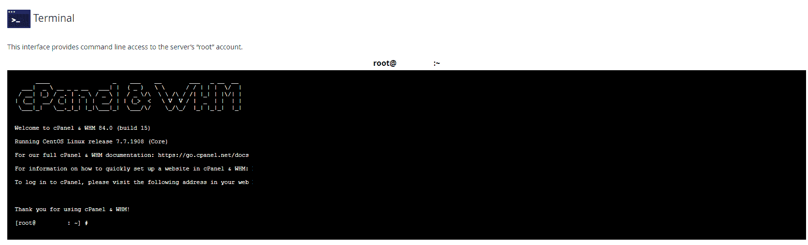
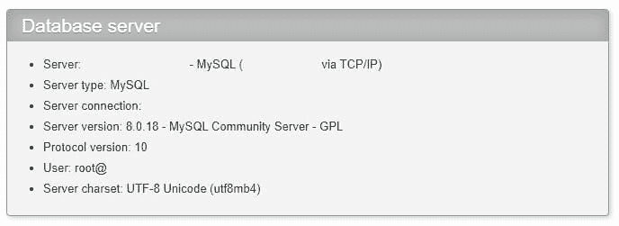
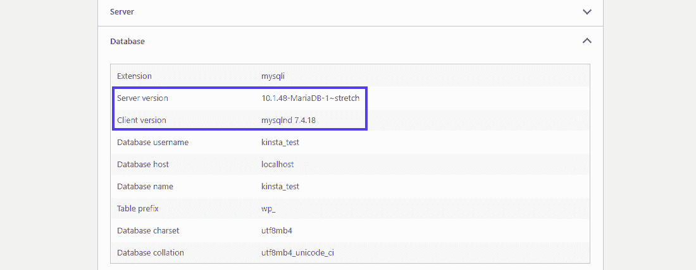
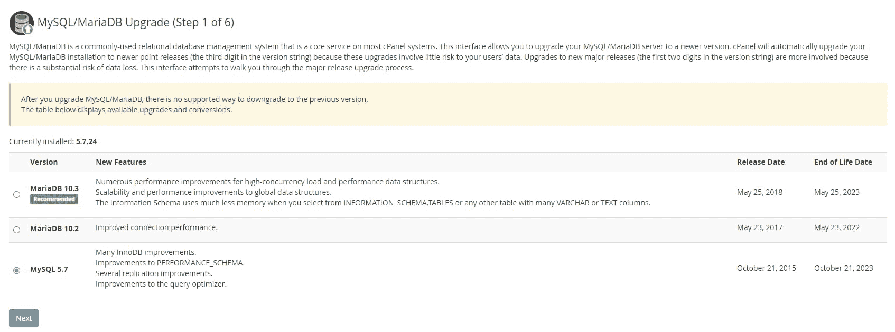
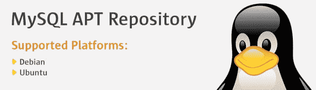
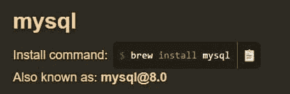

# 如何轻松检查和升级您的 MySQL 版本

> 原文:# t0]https://kinta . com/blog/MySQL-version/

你的数据库很可能运行在 MySQL 或完全开源的 MariaDB 上。这些流行的数据库管理软件为 [90%的网站](https://looker.com/databases/mysql)提供动力，所以你的服务器主机可能已经为你安装了它们中的任何一个。

但并不是所有的主机都会继续保持最新，所以经常要由你来检查你的 MySQL 版本并保持升级。服务器上过时的软件从来都不是好东西，还可能是有害的。

让我们来学习如何检查你的 MySQL 版本是否是最新的，如果不是，就升级它。

### 观看我们的[视频指南](https://www.youtube.com/watch?v=S2e5qEJR0_M)来检查和升级您的 MySQL 版本


## 为什么要让 MySQL 保持最新？

手动[服务器维护](https://kinsta.com/blog/wordpress-maintenance/)不是一件有趣的任务，尤其是如果你不太熟悉你的网络服务器的内部工作方式。只要你的服务器和[数据库](https://kinsta.com/knowledgebase/wordpress-database/)工作正常，忽略一个过时的软件可能会很有诱惑力。但是有相当多的理由说明这是一个坏主意。

在你的服务器上安装过时的软件从来都不是好事。即使是你的安全系统中最微小的漏洞也可能成为攻击者逃脱并接管的媒介。


> 需要在这里大声喊出来。Kinsta 太神奇了，我用它做我的个人网站。支持是迅速和杰出的，他们的服务器是 WordPress 最快的。
> 
> <footer class="wp-block-kinsta-client-quote__footer">
> 
> 
> 
> <cite class="wp-block-kinsta-client-quote__cite">Phillip Stemann</cite></footer>

[View plans](https://kinsta.com/plans/)

他们甚至可以扰乱你的数据库。各种重要信息都存储在那里，比如你的 WordPress 帖子和所有其他类型的敏感信息。你不希望任何不需要的人能够修改它。

除此之外，一个新的版本意味着新的特性和对已有版本的全面改进。即使这些额外的功能不会影响你，最近的 MySQL 版本也更加安全、优化和快速。



What’s new in MySQL 8.0.


MySQL 的每一次更新都会带来一系列的错误修复，修补那些往好了说可能会令人烦恼，往坏了说可能会给你带来严重麻烦的错误。

当涉及到你网站上的任何软件时，最好保持最新版本。

[MySQL 在 90%的网站后台运行😲...但并不是所有的主机都会持续更新。在这里学习如何检查自己⬇️ 点击推文](https://twitter.com/intent/tweet?url=https%3A%2F%2Fkinsta.com%2Fblog%2Fmysql-version%2F&via=kinsta&text=MySQL+runs+in+the+background+of+90%25+of+websites+%F0%9F%98%B2...+but+not+all+hosts+will+continue+to+keep+it+updated.+Learn+how+to+check+for+yourself+right+here+%E2%AC%87%EF%B8%8F&hashtags=MySQL%2CSFTP)


### MySQL 哪个版本最好？

如今，许多服务器仍在运行 MySQL 5.7(跳转到 8.0 之前的最新版本)，即使存在更新更好的版本。这是为什么呢？还有 MySQL 5.7 和 8.0 哪个最好？

大部分人不升级，要么是不知道最新的 MySQL 版本，要么是不想花时间去更新。此外，5.7 没有被弃用，直到 2023 年才会被弃用。



Support EOL for macOS v10.14


但是，虽然 MySQL 5.7 仍然受支持，但转换到最新版本绝对值得您花费时间。它更快也更安全——激活它后可以立即观察到变化。对于能够利用新功能的[开发者](https://kinsta.com/blog/hire-wordpress-developer/)来说，好处多得无法快速列举。

有一些[升级注意事项](https://mysqlserverteam.com/upgrading-to-mysql-8-0-here-is-what-you-need-to-know/)和向后不兼容你需要知道，但对于大多数网站来说，它们不会引起问题。

保持 MySQL 的最新稳定版本几乎总是最好的。即使是微小的更新也值得麻烦，尽管新的内置自动更新程序可能会为您处理这些问题。至于重大更新，除非服务器的关键部分不兼容，否则是值得的。

虽然 WordPress 一直支持 MySQL 版本，但是 8.0 可以很好地支持它。由于 5.6 不再受支持，容易出现错误和安全风险，您至少应该更新到 5.7。
T3】

## 如何检查 MySQL 版本

保持 MySQL 最新是至关重要的，但是你需要在升级之前知道它的版本。很有可能，你已经在使用最新的版本，根本不需要做任何事情。有几种方法可以检查；这些只是最简单的几个。

### 用 MyKinsta 检查 MySQL 版本

使用 MyKinsta 访问您的数据库并检查您的 MySQL 版本非常简单。有几种方法可以做到这一点，如上所述，但最简单的两种方法是使用 phpMyAdmin 或使用命令行连接。

登录 MyKinsta 后可以找到 phpMyAdmin。只需进入**站点>信息**，在**数据库访问**部分下，点击**打开 phpMyAdmin** 。您需要登录的凭证就在那里。

您也可以使用 SSH 通过命令行进行连接。通过 Kinsta，我们为您设置了允许 SSH 访问的一切。只需在**SFTP/宋承宪**部分的**网站>信息**中找到你的证书。然后按照下面的步骤登录并输入正确的命令。

### 使用命令行

获得 MySQL 版本最简单的方法是通过命令行提交一个简单的代码。它只需要几秒钟，并立即回答你的问题。获取服务器的命令行应该不会太难，除非你使用最小主机。

有多种方法可以访问服务器的命令行。例如，您的 web 主机可能会提供一种通过后端提交命令的方式，比如使用 [cPanel](https://kinsta.com/knowledgebase/what-is-cpanel/) 。或者，您可以使用内置终端或命令提示符来连接到您的服务器。像 [PuTTY](https://www.putty.org/) 这样的工具也可以帮助你登录，通常是 Windows 用户[用 SSH](https://kinsta.com/blog/how-to-use-ssh/) 连接所需要的。

无论哪种方式，您都需要一些 SSH 登录凭证。你通常可以在你的虚拟主机面板中找到他们，或者你可以给他们发邮件寻求帮助。

一旦您知道如何连接到服务器的命令行，请遵循以下步骤。

**第一步:**在电脑上启动终端(Linux、macOS)或命令提示符/PuTTY (Windows)。在 cPanel 中，你可以在**高级>终端**下找到。



cPanel Terminal view


**步骤 2:** 提供您的 SSH 凭证以连接并登录到服务器。

**第三步:**输入以下命令:

```
mysql -V
```

如果您安装了 [MySQL Shell](https://dev.mysql.com/doc/mysql-shell/8.0/en/) ，您也可以使用简单的命令“MySQL”来显示您的版本信息。

无论哪种方式，版本号都应该在屏幕上输出。


### 用 phpMyAdmin 检查 MySQL 版本

还有另一种简单的方法来检查你的 MySQL 版本，那就是使用 [phpMyAdmin](https://kinsta.com/blog/install-phpmyadmin/) 。这个软件也是无处不在的，大多数服务器上都有，所以你很有可能找到你的 MySQL 版本。

通过检查您的虚拟主机仪表板找到您的 phpMyAdmin 证书。甚至可能有一个直接链接登录那里。如果你找不到他们，给你的主人发邮件。

找到凭证后，登录 phpMyAdmin。一进入，你就会在屏幕右侧看到一个**数据库服务器**框。在**软件版本**部分，是你的 MySQL 版本。就这么简单！



Viewing MySQL version in phpMyAdmin


### 通过 WordPress 仪表盘

找到你的 MySQL 版本的最后一个简单方法是通过你的站点的 WordPress 管理仪表板。

要做到这一点，请访问你的 WordPress 仪表盘，进入**工具>** **站点健康**。在这里，首先进入**信息**标签，然后进入下面的**数据库**部分。

## 注册订阅时事通讯


### 想知道我们是怎么让流量增长超过 1000%的吗？

加入 20，000 多名获得我们每周时事通讯和内部消息的人的行列吧！

[Subscribe Now](#newsletter)

你可以在**服务器版本**标签旁找到你的服务器当前的 MySQL 版本。



Finding the MySQL version in WordPress dashboard.


## 如何升级 MySQL 版本

如果你确定你的 MySQL 已经过时了，你应该尽快改正。有多种方法可以将 MySQL 更新到最新版本；这完全取决于你使用的工具和操作系统。

值得注意的是，如果脚本注意到您的安装已经过期，MySQL 的后续版本将尝试自动更新。您可能根本不需要做任何事情。如果您确定 MySQL 已经过时，需要手动更新，请遵循以下步骤。

就像用命令行检查 MySQL 版本一样，您需要从 web 主机获得 SSH 登录凭证来访问服务器上的终端。当然，你需要你的服务器的 IP 地址。


在更新 MySQL 之前，确保[备份你的数据库](https://kinsta.com/knowledgebase/mysql-backup-database/)。对于 Kinsta 用户来说，在 MyKinsta 中要做的事情很简单:登录并进入**站点>备份**。您可以在那里找到一个可下载的 zip 文件。


这个备份包含了你的数据库(一个 SQL 文件)和你的整个站点，所以如果出现问题，你会非常安全。

### 使用 cPanel 升级 MySQL

如果您的主机提供 cPanel，这可能是最简单的升级方式，因为您可以使用提供的接口。但是由于 cPanel 默认默认为 MySQL 5.7，你可能要做一个升级。

由于 cPanel 不允许您降级，您应该在继续之前备份您的数据库。

大多数 cPanel 安装都带有 Web 主机管理器，WHM，它给你更深层次的根访问。

**第一步:**通过访问“example-site.com:2087”或“example-site.com/whm”登录 WHM 你也可以询问你的虚拟主机如何访问 WHM。

**第二步:**导航到**软件> MySQL 升级**或者在搜索栏中键入“MySQL”。你也可以在 **SQL 服务> MySQL/MariaDB 升级**下找到它。

**第三步:**选择想要升级到的 MySQL 版本，点击**下一步**。现在，按照升级步骤，它会为您处理一切。



Web Host Manager cPanel MySQL update


这种方法是目前最简单的 MySQL 升级方法，但是如果你的主机不提供 cPanel 或 WHM，你可能需要手动升级。

### 在 Linux/Ubuntu 中升级 MySQL

有各种各样的 Linux 发行版，但是 Ubuntu 是最常见的。这些说明应该适用于任何使用 apt/apt-get 函数来安装软件的操作系统。

需要一个给你带来竞争优势的托管解决方案吗？Kinsta 为您提供了令人难以置信的速度、一流的安全性和自动伸缩功能。[查看我们的计划](https://kinsta.com/plans/?in-article-cta)



MySQL APT Repository


Linux 可以轻松地进行 SSH 连接，而不需要任何额外的软件要求。所以，你可以直接进入你的服务器。

**第一步:**启动终端。获取您的 SSH 凭证并使用 [ssh 命令](https://www.geeksforgeeks.org/ssh-command-in-linux-with-examples)登录。

第二步:你应该已经安装了 [MySQL apt 库](https://dev.mysql.com/downloads/repo/apt/)，因为 MySQL 已经在你的服务器上了。使用以下命令更新您的软件包列表:

```
sudo apt-get update
```

**第三步:**现在升级 MySQL。

```
sudo apt-get upgrade mysql-server
```

如果上述方法不起作用，您也可以尝试此命令:

```
sudo apt-get install mysql-server
```

它会提示您选择一个版本；选择 5.7 或 8.0。如果你从 5.6 升级，你应该先升级到 5.7，而不是直接升级到 8.0。

### 在 macOS 上升级 MySQL

虽然 macOS 自带 MySQL 版本，但是你无法通过通常的方法升级它。最有可能的是，您的服务器正在使用一个单独的实例。

其中许多步骤与在 Linux 上更新 MySQL 非常相似。macOS 同样在操作系统中内置了 SSH，所以您需要做的就是运行命令。

我们假设你正在使用 [Homebrew](https://brew.sh/) 作为包管理器，因为这是在 Mac 上安装和更新 MySQL 最简单的方法。如果你最初没有用自制软件安装 MySQL，你就不应该尝试用它来升级。



Using Homebrew to install MySQL on Mac


**步骤 1:** 启动终端程序，用 ssh 命令登录。

第二步:使用自制软件运行这些命令。

```
brew update
brew install mysql
```

该命令应该会自动安装 8.0 并升级任何现有版本。

你遇到麻烦了吗？请先尝试卸载当前版本的 MySQL。使用这些命令:

```
brew remove mysql
brew cleanup
```

然后，您可以再次尝试运行更新和安装命令。

**步骤 3:** 确保再次手动启动 MySQL 服务器:

```
mysql.server start
```

### 在 Windows 中升级 MySQL

与 Mac 和 Linux 不同，Windows 默认不能使用 SSH。相反，您需要安装一个单独的客户端，然后您可以连接到您的服务器。

**第一步:**下载 [PuTTY](https://www.putty.org/) 并安装在你的系统上。启动它并输入您的 SSH 凭证以连接到服务器。3306 是[默认端口号](https://kinsta.com/knowledgebase/mysql-port/)。忽略任何安全警报；这些都很正常。

**第二步:**假设你正在连接一个 Linux 终端，你可以使用上面 Linux/Ubuntu 部分的 [Linux 命令](https://kinsta.com/blog/linux-commands/)来执行升级。

您也可以使用 [MySQL 安装程序](https://dev.mysql.com/downloads/installer/)将 MySQL 直接下载到系统中。这个过程完全跳过 SSH 连接。

[保持你的 MySQL 版本最新对于网站安全至关重要🔒点击此处查看如何升级您的版本⬇️ 点击推文](https://twitter.com/intent/tweet?url=https%3A%2F%2Fkinsta.com%2Fblog%2Fmysql-version%2F&via=kinsta&text=Keeping+your+MySQL+version+up+to+date+is+crucial+for+site+security+%F0%9F%94%92+See+how+to+upgrade+your+version+here+%E2%AC%87%EF%B8%8F&hashtags=MySQL%2CSSH)

## 摘要

对于任何软件来说，保持最新都是至关重要的。随着 MySQL 成为你的网站及其数据库不可或缺的一部分，它变得更加重要。不幸的是，太多的网站管理员选择让他们的 MySQL 版本落后，这不利于他们网站的速度和安全性。

幸运的是，检查你的 MySQL 版本并升级它几乎总是一个平稳的过程。虽然你肯定应该备份你的网站和数据库以备不时之需，但你不太可能遇到任何问题。

只需在您的 web 服务器终端输入一个微小的命令，您的数据库就会得到很好的优化，而且比以往任何时候都要快。

* * *

让你所有的[应用程序](https://kinsta.com/application-hosting/)、[数据库](https://kinsta.com/database-hosting/)和 [WordPress 网站](https://kinsta.com/wordpress-hosting/)在线并在一个屋檐下。我们功能丰富的高性能云平台包括:

*   在 MyKinsta 仪表盘中轻松设置和管理
*   24/7 专家支持
*   最好的谷歌云平台硬件和网络，由 Kubernetes 提供最大的可扩展性
*   面向速度和安全性的企业级 Cloudflare 集成
*   全球受众覆盖全球多达 35 个数据中心和 275 多个 pop

在第一个月使用托管的[应用程序或托管](https://kinsta.com/application-hosting/)的[数据库，您可以享受 20 美元的优惠，亲自测试一下。探索我们的](https://kinsta.com/database-hosting/)[计划](https://kinsta.com/plans/)或[与销售人员交谈](https://kinsta.com/contact-us/)以找到最适合您的方式。