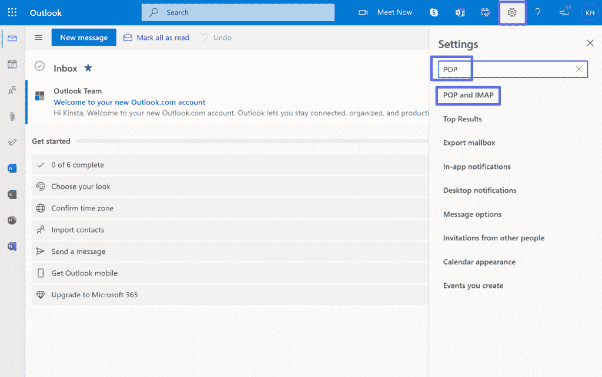
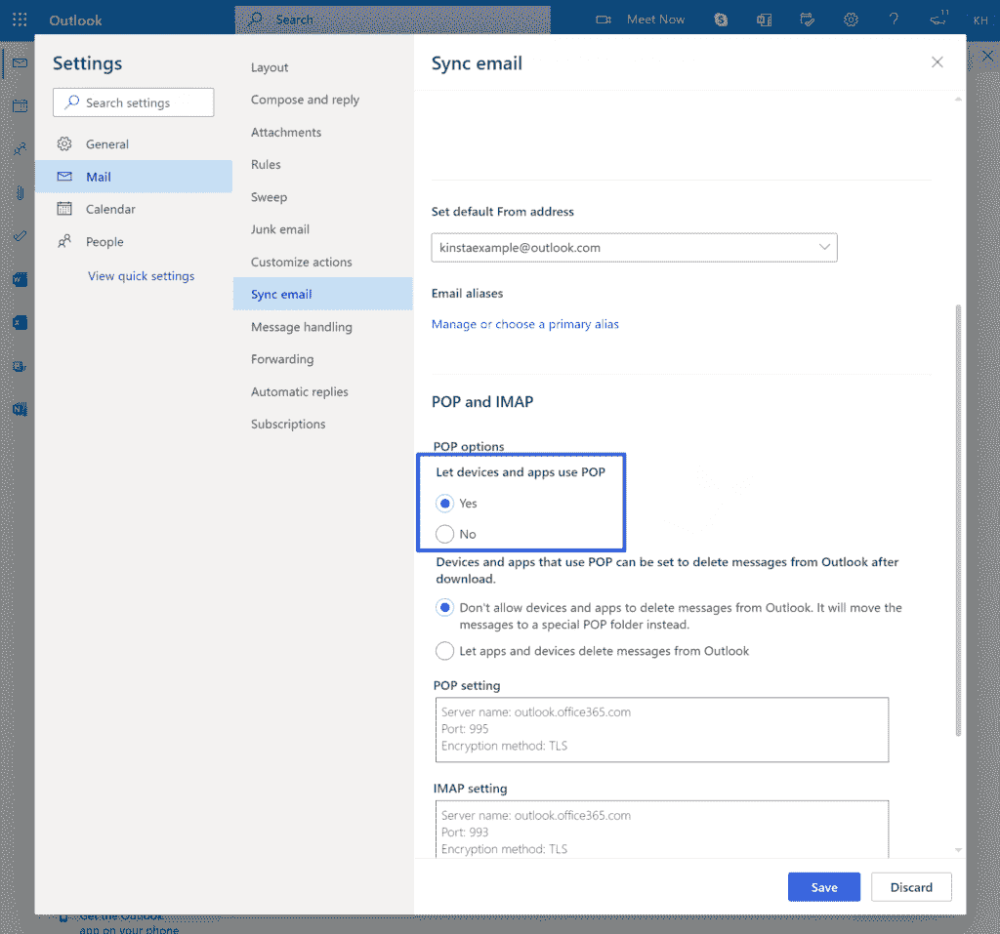
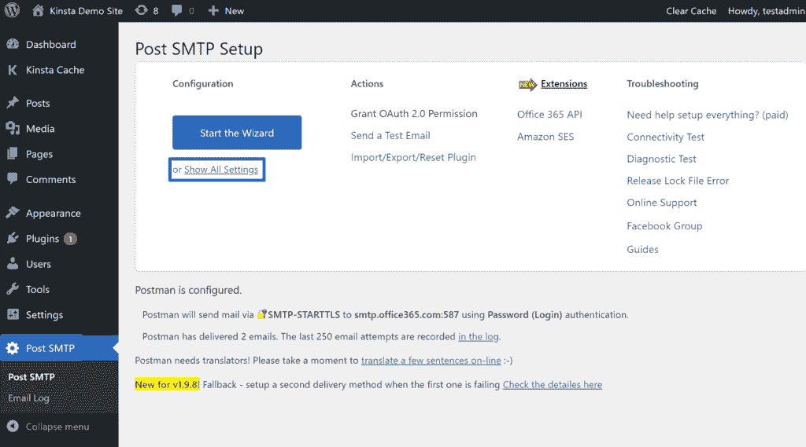
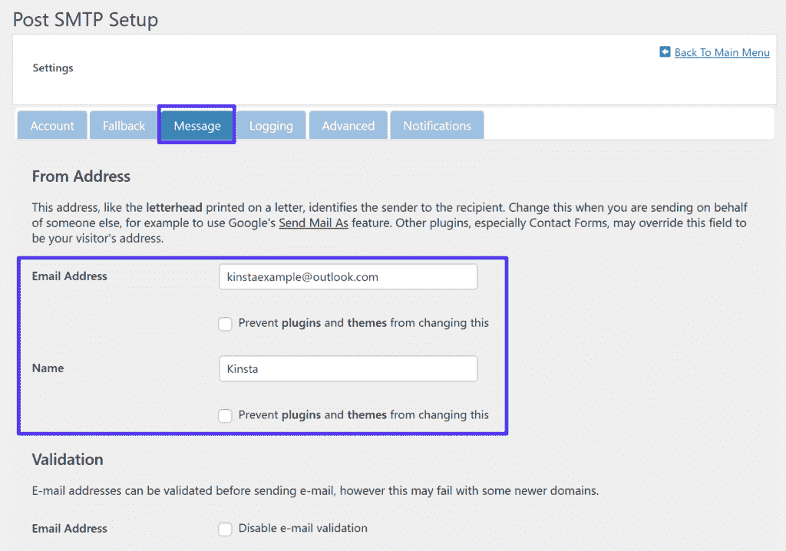
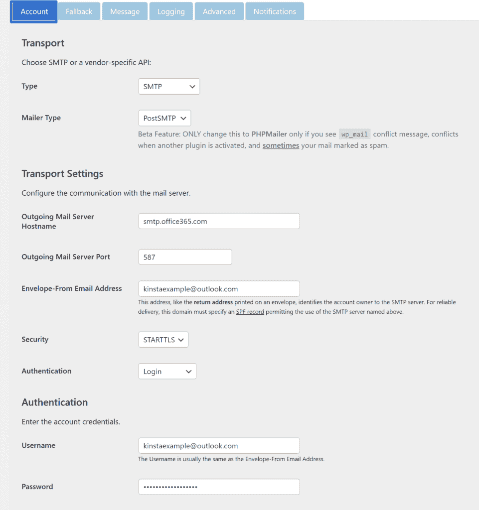
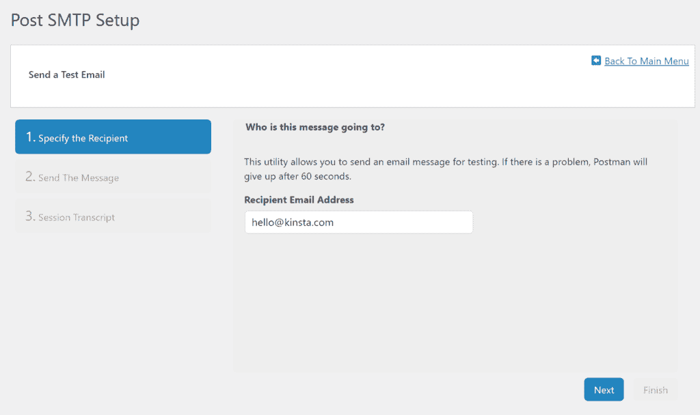
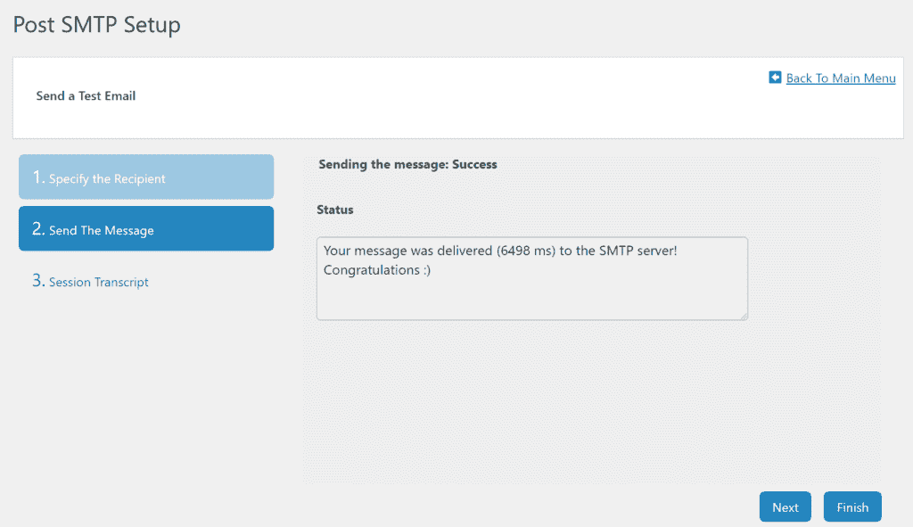
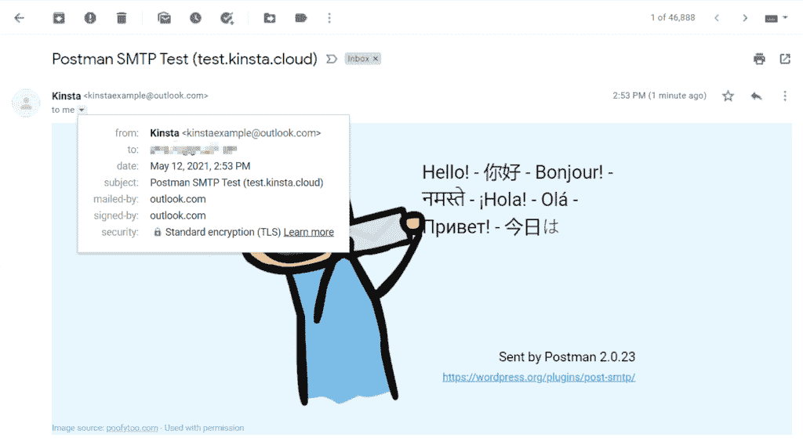
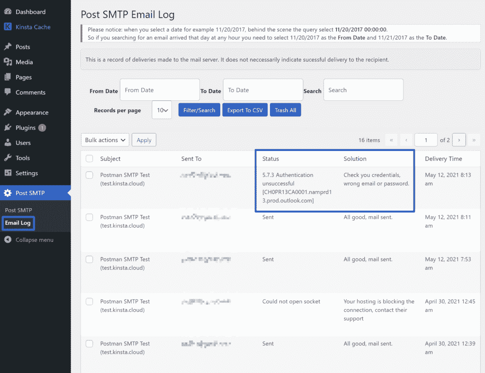

# 如何设置正确的 Outlook SMTP 设置来发送电子邮件

> 原文：<https://kinsta.com/blog/outlook-smtp-settings/>

正在寻找正确的 Outlook SMTP 设置？

使用 Outlook SMTP 服务器，您可以配置您的首选电子邮件客户端来使用您的 Outlook 帐户发送电子邮件。或者，如果你[有一个 WordPress 站点](https://kinsta.com/blog/why-use-wordpress/)，你也可以配置 WordPress 使用你的 Outlook 账户发送电子邮件，以提高你的站点电子邮件的可靠性。

在这篇文章中，我们将涵盖你需要知道的关于 Outlook SMTP 设置的一切。我们将首先分享实际的 SMTP 设置本身，以及 POP3 和 IMAP 设置(除了发送之外，还接收电子邮件)。

对于 WordPress 用户，我们也将解释如何配置 WordPress 来使用 Microsoft Outlook 发送电子邮件。

### 查看我们的[视频指南](https://www.youtube.com/watch?v=r1yh0u9Buhs)来设置 Outlook SMTP 设置以发送电子邮件

## 如何配置我的 Outlook SMTP 设置？

*   **SMTP 服务器**:smtp.office365.com
*   **端口** : 587
*   **需要 SSL** :是
*   **需要 TLS** :是(如果有)
*   **认证**:是(如果有多个选项，选择**登录**
*   **用户名**:您完整的 Outlook 电子邮件地址(例如[【电子邮件保护】](/cdn-cgi/l/email-protection))
*   **密码**:您的 Outlook 密码(与您登录 Outlook 网站时使用的密码相同)
*   **发送限制**:一天 300 封邮件或一天 100 个收件人。

这些是您需要配置您的电子邮件客户端或 WordPress 网站以使用 Outlook SMTP 服务器的详细信息。

> 需要在这里大声喊出来。Kinsta 太神奇了，我用它做我的个人网站。支持是迅速和杰出的，他们的服务器是 WordPress 最快的。
> 
> <footer class="wp-block-kinsta-client-quote__footer">
> 
> 
> 
> <cite class="wp-block-kinsta-client-quote__cite">Phillip Stemann</cite></footer>

[View plans](https://kinsta.com/plans/)

*专业提示*:在我们的博客文章中了解更多关于 [SMTP 端口](https://kinsta.com/blog/smtp-port/)的信息。

[在本指南的帮助下，确保您的 Outlook SMTP 设置配置正确⬇️ 点击发布推文](https://twitter.com/intent/tweet?url=https%3A%2F%2Fkinsta.com%2Fblog%2Foutlook-smtp-settings%2F&via=kinsta&text=Make+sure+your+Outlook+SMTP+settings+are+configured+correctly+with+help+from+this+guide+%E2%AC%87%EF%B8%8F&hashtags=SMTP%2CEmail)

## Outlook POP3 设置

Outlook [SMTP 服务器](https://kinsta.com/blog/free-smtp-server/)允许你使用 Outlook 账户发送电子邮件，而 POP3 和 IMAP 允许你导入其他人发送给你的电子邮件。我们将在下一节讨论 IMAP。

如果您想使用电子邮件客户端，添加 POP3 或 IMAP 凭据以在您的电子邮件客户端中接收来自 Outlook 的电子邮件也很重要。一般来说，如果你想从多种设备(如台式机和手机)访问电子邮件，IMAP 比 POP3 更好，因为它允许双向同步。然而，如果你只使用一种设备，POP3 可能是更好的选择。

您应该注意到 Outlook 默认禁用 POP3。要启用它，请单击 Outlook 界面右上角的齿轮图标，然后搜索“pop”然后，点击 **POP 和 IMAP** 的结果(或者您可以[点击此链接直接进入](https://outlook.live.com/mail/0/options/mail/accounts/popImap))。

Accessing the POP settings

在 **POP 选项**区域下，选择**下的**是**让设备和应用使用 POP** 选项。然后，您可以选择是让应用程序和设备从 Outlook 中删除电子邮件，还是永久保留它们。

Enabling POP access for Outlook

保存启用 POP3 访问的更改后，您可以使用这些设置:

*   **服务器**:outlook.office365.com
*   **端口** : 995
*   **加密方式** : [TLS](https://kinsta.com/blog/tls-1-3/)

## Outlook IMAP 设置

正如我们上面提到的，如果你想从多个设备上访问电子邮件，IMAP 通常是一个更好的选择。Outlook 默认启用 IMAP 访问，因此您只需使用这些设置:

*   **服务器**:outlook.office365.com
*   **端口** : 993
*   **加密方式** : TLS

## 如何为 WordPress 站点配置 Outlook SMTP

假设你想提高你的 WordPress 站点发送的电子邮件的可靠性。在这种情况下，你也可以配置你的 WordPress 站点来使用 Outlook SMTP 服务器发送邮件，以利用大量的发送限制(每天 300 封邮件给最多 100 个收件人)。

设置过程主要包括将 Outlook SMTP 服务器设置插入到 WordPress SMTP 插件中(下面的*)。然而，如果你遇到任何问题，也有许多其他免费的 SMTP 服务器可供选择，包括[的免费 Gmail SMTP 服务器](https://kinsta.com/blog/gmail-smtp-server/)。*

### 1.安装 Post SMTP 插件并设置“发件人”详细信息

要配置 WordPress 使用 SMTP 服务，你需要一个 WordPress SMTP 插件。

## 注册订阅时事通讯

### 想知道我们是怎么让流量增长超过 1000%的吗？

加入 20，000 多名获得我们每周时事通讯和内部消息的人的行列吧！

[Subscribe Now](#newsletter)

有几个受欢迎的选项，但我们推荐 [Post SMTP 插件](https://wordpress.org/plugins/post-smtp/)，因为它是 100%免费的，并且包括调试您网站的电子邮件可能存在的任何潜在问题的功能。

首先，安装并激活 WordPress.org 的免费插件。然后，转到你的 WordPress 仪表盘中新的 **Post SMTP** 区域，点击选项**显示所有设置**:

Accessing the full Post SMTP settings

然后，转到**消息**选项卡，输入您的“发件人”电子邮件地址和姓名。电子邮件地址应该是您的 Outlook 帐户电子邮件，而名称可以是您希望收件人看到的任何名称:

Setting the “From” email and name

完成后，请确保保存您的更改。

### 2.将 Outlook SMTP 服务器添加到插件设置中

接下来，点击**显示所有设置**链接，再次打开全部设置。

在**账户**选项卡中，从**类型**下拉列表中选择 **SMTP** ，并确保**邮件程序类型**下拉列表显示**postssmtp。**

现在，您应该会在 Outlook SMTP 服务器详细信息字段下看到一组扩展的选项。按如下方式输入它们:

*   **发送邮件服务器主机名**:smtp.office365.com
*   **发送邮件服务器端口:** 587
*   **信封发件人电子邮件地址:**添加您的 Outlook 电子邮件地址。如果您使用不同的电子邮件地址，您可能会遇到错误。
*   **安全性:** STARTTLS
*   **认证:**登录
*   **用户名:**您完整的 Outlook 电子邮件地址。
*   **密码:**您的 Outlook 密码，也就是您登录 Outlook 网站时使用的密码。

Configuring the Outlook SMTP server in Post SMTP

添加完所有细节后，请务必保存设置。

厌倦了低于 1 级的 WordPress 托管支持而没有答案？试试我们世界一流的支持团队！[查看我们的计划](https://kinsta.com/plans/?in-article-cta)

### 3.发送测试电子邮件

现在，您已经完成了使用 Outlook SMTP 服务器发送电子邮件的配置。

为了确保一切正常运行，该插件包含了发送测试电子邮件的功能。

为此，进入 **Post SMTP** 区域，点击**发送测试邮件**选项:

Accessing Post SMTP’s test email feature

输入您想要发送测试邮件的电子邮件地址，然后点击**下一步**:

Enter your email in the Recipient Email Address box

如果您输入的详细信息正确，您应该会看到一条成功消息:

The success message when the Outlook SMTP settings are correct

此外，您应该会在接收测试邮件的电子邮件帐户中看到一封新邮件:

An example of the test email that Post SMTP sends

如果一切正常，您就完成了设置！

如果您有问题，您可以通过进入 **Post SMTP >电子邮件日志**并查看失败电子邮件的特定错误消息来调试它。插件还会建议一个解决方案。例如，如果您输入了错误的密码，它会告诉您仔细检查这些细节:

Debugging email sending problems using Post SMTP’s email log

如果你想不出哪里出了问题，可以考虑使用[另一个免费的 SMTP 服务器](https://kinsta.com/blog/free-smtp-server/)，比如[的免费 Gmail SMTP 服务器](https://kinsta.com/blog/gmail-smtp-server/)。

[如果您是 Outlook 用户，您可以配置您的首选电子邮件客户端，使用您的 Outlook 帐户及其 SMTP 服务器发送电子邮件📧](https://twitter.com/intent/tweet?url=https%3A%2F%2Fkinsta.com%2Fblog%2Foutlook-smtp-settings%2F&via=kinsta&text=If+you%27re+an+Outlook+user%2C+you+can+configure+your+preferred+email+client+to+send+emails+using+your+Outlook+account+and+its+SMTP+server+%F0%9F%93%A7&hashtags=SMTP%2CEmail)

## 摘要

Outlook SMTP 服务器允许您配置您喜爱的电子邮件客户端或您的网站，以使用您的 Outlook 帐户发送电子邮件。

对于 WordPress 用户来说，这里的好处是它提高了你网站的电子邮件的可靠性，因为你可以使用 Outlook 优化的 SMTP 服务器。此外，对于大多数 WordPress 网站来说，每天发送 300 封邮件的限制应该绰绰有余。

对于电子邮件客户端，SMTP 服务器允许您使用客户端界面发送电子邮件。如果你将它与 POP3 或 IMAP 结合使用，你还可以在你选择的电子邮件应用或客户端接收 Outlook 邮件。

请务必查看 DevKinsta ，这是我们免费的本地开发测试工具，在为您的站点配置 SMTP 设置时非常方便。

关于 Outlook SMTP 设置或如何在 WordPress 网站上使用它们，您还有任何问题吗？请在评论中告诉我们！

* * *

让你所有的[应用程序](https://kinsta.com/application-hosting/)、[数据库](https://kinsta.com/database-hosting/)和 [WordPress 网站](https://kinsta.com/wordpress-hosting/)在线并在一个屋檐下。我们功能丰富的高性能云平台包括:

*   在 MyKinsta 仪表盘中轻松设置和管理
*   24/7 专家支持
*   最好的谷歌云平台硬件和网络，由 Kubernetes 提供最大的可扩展性
*   面向速度和安全性的企业级 Cloudflare 集成
*   全球受众覆盖全球多达 35 个数据中心和 275 多个 pop

在第一个月使用托管的[应用程序或托管](https://kinsta.com/application-hosting/)的[数据库，您可以享受 20 美元的优惠，亲自测试一下。探索我们的](https://kinsta.com/database-hosting/)[计划](https://kinsta.com/plans/)或[与销售人员交谈](https://kinsta.com/contact-us/)以找到最适合您的方式。