# 2022 年 15 种最佳谷歌字体(以及使用它们的技巧)

> 原文：<https://kinsta.com/blog/best-google-fonts/>

有 1052 种不同的 Google 字体系列可供免费使用(在撰写本文时)。选择真多啊！因此，难怪你需要帮助来找到一个最好的谷歌字体列表。

我们已经为你准备好了，然后我们也会分享一些在 WordPress 中使用谷歌字体的最佳实践。

选择字体不仅仅是一种审美选择——它会对你网站的 T2 跳出率和 T4 转换率产生重大影响，尤其是当你选择一种难以阅读的字体时。因此，花点时间为你的网站选择最完美的谷歌字体是值得的，而不是使用你遇到的第一种字体。

如果你需要更多的字体，看看我们关于在你的 WordPress 网站上使用的 50 多种现代字体的帖子。

### 查看我们的[视频指南](https://www.youtube.com/watch?v=iJ0LT1vkh6M)中的最佳谷歌字体

## 为什么要用谷歌字体？

互联网上有成千上万的字体库，那么到底是什么让谷歌字体如此特别呢？

> Kinsta 把我宠坏了，所以我现在要求每个供应商都提供这样的服务。我们还试图通过我们的 SaaS 工具支持达到这一水平。
> 
> <footer class="wp-block-kinsta-client-quote__footer">
> 
> 
> 
> <cite class="wp-block-kinsta-client-quote__cite">Suganthan Mohanadasan from @Suganthanmn</cite></footer>

[View plans](https://kinsta.com/plans/)

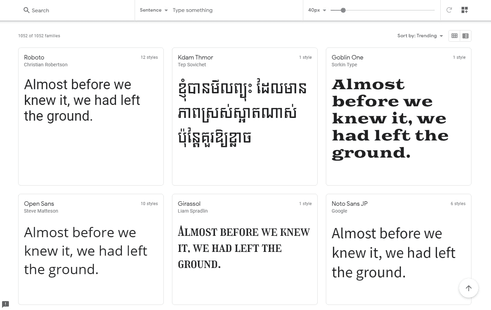

Google Fonts catalog.

首先，它是免费的！最重要的是，谷歌字体由谷歌维护和交付，这意味着它们保证是安全的。当然，有很多不可靠的网站可以让你下载免费字体，但是谁知道你会从这些文件中得到什么呢？

这类网站的字体质量有时也很成问题。

谷歌精选了一千多种高质量字体。当你不是一个对字体设计有着完美眼光的平面设计师时，这是一个更安全的选择。

其次，没有令人费解的许可限制。Google 字体目录中的所有字体都是开源的，可以在商业项目中免费使用。您可以将它们下载或嵌入到您的网站上，甚至可以在印刷项目中使用它们。

虽然没有统一的许可，但是存储库中的大多数字体都使用[开放字体许可](https://scripts.sil.org/cms/scripts/page.php?site_id=nrsi&id=OFL)。

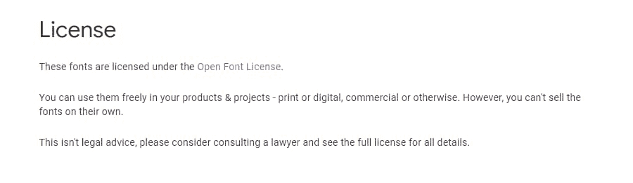

Open Font License.

其他“免费字体”很少是免费的，而且带有一大堆令人困惑的许可限制，如果你犯了一个错误，可能会让你陷入困境。不幸的是，谷歌字体没有同样的包袱。

最后，使用 [Google Fonts API](https://developers.google.com/fonts/docs/getting_started) 可以毫不费力地将 Google 字体添加到您的网站上。或者，你可以单独下载并通过 FTP/SFTP 上传到你的网络服务器[。](https://kinsta.com/blog/best-ftp-clients/)

虽然谷歌字体往往很简单，可能不像一些付费字体那么花哨，但它肯定胜过主要操作系统预装的 T2 网页安全字体，这些字体每个人都已经看过几千次了。

[有 1052 种不同的谷歌字体家族可供免费使用...你感到不知所措了吗？🤯在这篇文章的帮助下缩小你的选择范围👇 点击推文](https://twitter.com/intent/tweet?url=https%3A%2F%2Fkinsta.com%2Fblog%2Fbest-google-fonts%2F&via=kinsta&text=There+are+1052+different+Google+Font+families+available+for+free...+are+you+feeling+overwhelmed+yet%3F+%F0%9F%A4%AF+Narrow+down+your+choices+with+help+from+this+post+%F0%9F%91%87&hashtags=Fonts%2CWebDesign)

## 在谷歌字体中寻找什么？

如果有一件事你应该在设计网站时学习的话，那就是如何选择适合你项目的谷歌字体。好的排版将决定你网站的成败。

这可能看起来是一个不重要的细节，但它可能是某人提前离开你的网站或留下来成为忠实读者或客户的区别。

选择合适的字体是平面设计师花费数年时间掌握的，但是记住一些原则，你可以为你的网站选择一个漂亮的字体。

*   **适合你的品牌:**这可能是最关键的方面。最好的网站都有一种字体，可以展示他们的个性，同时仍然具有可读性，并且符合当前的设计。例如，苹果和铁娘子使用的字体大相径庭，但它们都适合自己的品牌。
*   可读性:第二个最重要的原则是可读性。一个滑稽的幻想或肮脏的字体可能肯定适合你的品牌，但如果你的访问者不能阅读它，他们会很快离开。因此，你的字体必须专业、易读。
*   字体分类:虽然字体有数百种分类方式，但主要有五种:衬线字体、无衬线字体、[字体](https://kinsta.com/blog/cursive-fonts/)、等宽字体和装饰字体。脚本或衬线字体传达优雅，而等宽字体在技术网站上很受欢迎。了解这些分类会让你的搜索有一个更好的起点。
*   ****显示或正文字体:**** 显示字体用于大尺寸、页眉或打印项目。为了独特的设计，它们可以不那么易读。正文字体的主要目的是可读性，因为它们构成了你网站的主要部分。
*   **情绪和意图:**就像任何艺术作品一样，艺术家为特定的情绪和背景设计字体。大多数字体都会附带注释，说明它们是如何设计的，以及如何使用它们。使用它们来决定字体是否适合您的项目。

## 2022 年十大最佳谷歌字体(根据大众智慧)

那么，当这么多都是主观的时候，你如何开发一个最好的谷歌字体列表呢？我们不希望整个列表有偏见，所以我们将根据这些数据建立一个最流行的谷歌字体列表。

我们将使用[谷歌字体分析](https://fonts.google.com/analytics)来信任群众的智慧。总字体浏览量超过 50 万亿，谷歌只有一点点数据可以提取。

然后，我们将超越原始的流行数字，选择一些正在流行的新兴 HTML 字体。

准备好了吗？让我们开始吧！

### 1\. Roboto

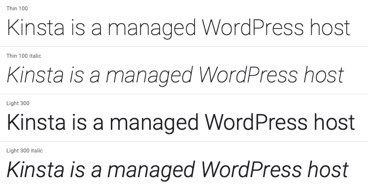

Roboto.

长期以来排名第一，也是金斯塔的首选字体， [Roboto](https://fonts.google.com/specimen/Roboto) 是克里斯蒂安·罗伯逊(Christian Robertson)提供的无衬线字体，谷歌将其开发为 Android 的系统字体。它现在非常受欢迎，有 12 种不同的风格，并在谷歌字体分析中多次出现。

例如，Roboto 是最流行的字体。但是 [Roboto Condensed](https://fonts.google.com/specimen/Roboto+Condensed) 也是第六受欢迎的字体， [Roboto Slab](https://fonts.google.com/specimen/Roboto+Slab) 也出现在第 12 位！

### 2.开启无

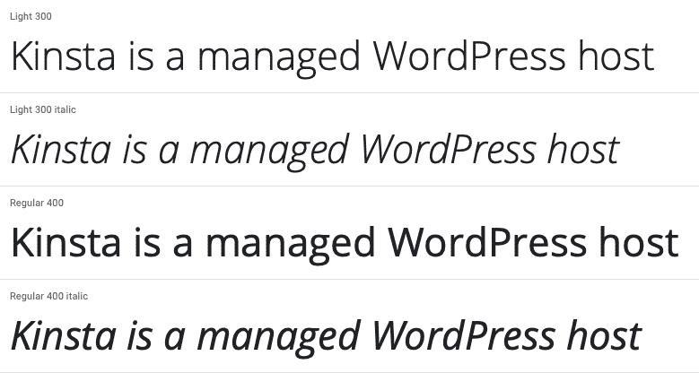

Open Sans.

Open Sans Condensed 是谷歌委托开发的一种非常易读的字体，灵感来自其前身 Droid Sans。谷歌在它的一些网站、印刷品和[网络广告上使用开放存储区域网络。Open Sans Condensed 是它的姐妹字体，也是谷歌字体中第十三大最受欢迎的字体。](https://kinsta.com/blog/adsense-alternatives/)

### 3.拉托

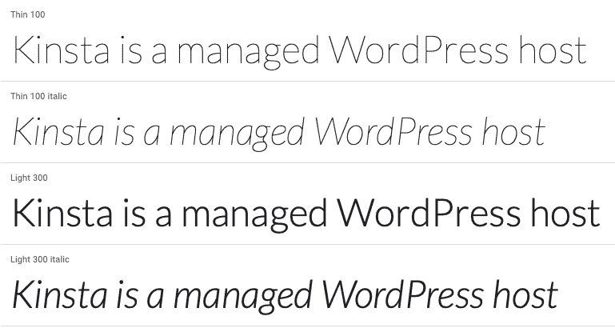

Lato.

拉图是祖卡斯·泽季奇的另一个热门选择。它的设计背后有相当的故事，平衡了相互冲突的目标，产生了一种独特的，轻量级的无衬线字体。

### 4.蒙特塞拉特岛

Monstserrat.

[Montserrat](https://fonts.google.com/specimen/Montserrat) 是一种无衬线字体，来自 Julieta Ulanovsky，她住在布宜诺斯艾利斯的 Montserrat 街区。有从轻到重的 18 种不同风格可供选择。

### 5.奥斯瓦德

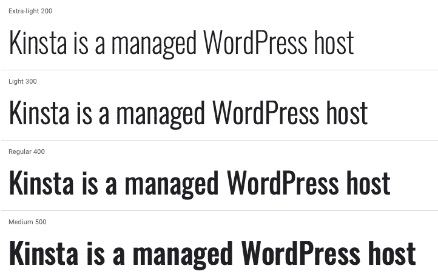

Oswald.

[Oswald](https://fonts.google.com/specimen/Oswald) 是一种无衬线字体，最初由 Vernon Adams 开发。它的设计考虑到了独特的另类哥特式风格，通过其大胆的笔触显而易见。

### 6.非专业来源

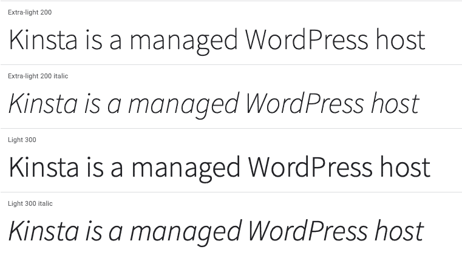

Source Sans Pro.

[Source Sans Pro](https://fonts.google.com/specimen/Source+Sans+Pro) 是为 Adobe 创建的无衬线字体，也是 Adobe 的首款开源字体。由 Paul Hunt 制作，其浅色字体使其清晰易读。
T3】

### 7\. Slabo 27px/13px

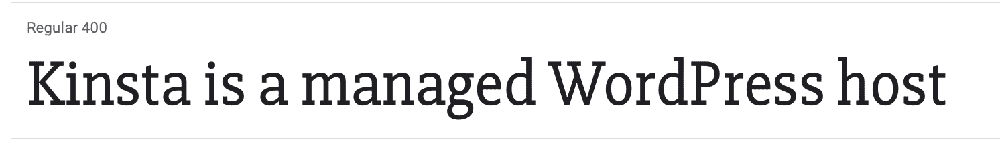

Slabo.

Slabo 是由 Tiro Typeworks 的 John Hudson 开发的衬线字体。这种字体是专门为特定大小设计的，可以是 27px，也可以是 13px，这取决于您的需要。

### 8.罗威

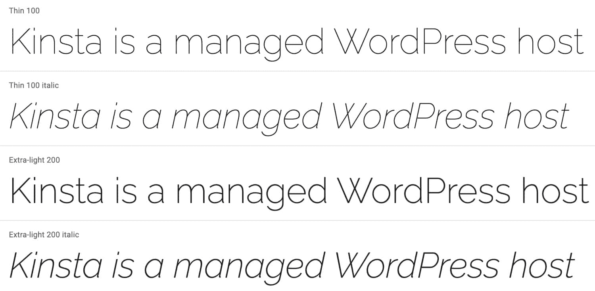

Raleway

Raleway 拥有 18 种不同的风格，是另一种大型无衬线字体，最初由 Matt McInerney 创建。如果你喜欢罗威，并在寻找一些独特的东西，[罗威圆点](https://fonts.google.com/specimen/Raleway+Dots)提供了类似的点缀风格，可以为[大标题](https://kinsta.com/blog/headline-analyzer/)工作。

### 9.PT 无

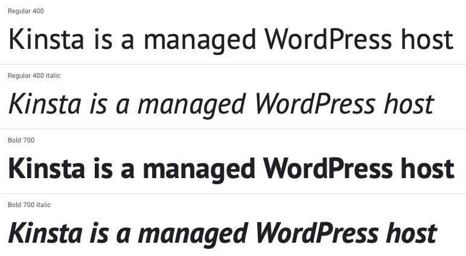

PT Sans.

[PT Sans](https://fonts.google.com/specimen/PT+Sans) 是为俄罗斯联邦的公共类型开发的，因此包括拉丁和西里尔字符。PT 家族中还有其他几种字体，包括一些衬线选项。

### 10.梅里韦瑟

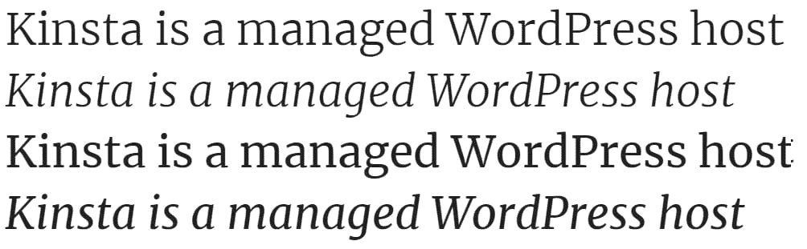

Merriweather.

梅里韦瑟的名字让人联想到令人愉快的设计，而这正是它的设计者的意图。虽然不太受欢迎，但 [Merriweather Sans](https://fonts.google.com/specimen/Merriweather+Sans) 是一个姐妹项目，与它配合得非常好。

## 注册订阅时事通讯

### 想知道我们是怎么让流量增长超过 1000%的吗？

加入 20，000 多名获得我们每周时事通讯和内部消息的人的行列吧！

[Subscribe Now](#newsletter)

## 奖励字体+后起之秀

从数字上看，上面的十种字体是最受欢迎的谷歌字体。但是，只显示最受欢迎的选项对那些还没有在分析中显示出来的优秀的新兴字体是有害的。

这里有一些我们最喜欢的，没有出现在分析顶部的。

### 11.无字体/衬线字体

Noto Sans / Serif.

Noto 是谷歌委托开发的字体，有衬线和无衬线两种版本。它会定期更新，现在已经有超过 100 种 Noto 字体，而且还会有更多！

Noto 的目标是涵盖各种语言的所有字母和字符，同时其独特的设计协调了数百种不同的字体系列。这些衍生品包括流行的 [Noto Sans KR](https://fonts.google.com/specimen/Noto+Sans+KR) 和 [Noto Sans JP](https://fonts.google.com/specimen/Noto+Sans+JP) 。

### 12.努涅特·桑

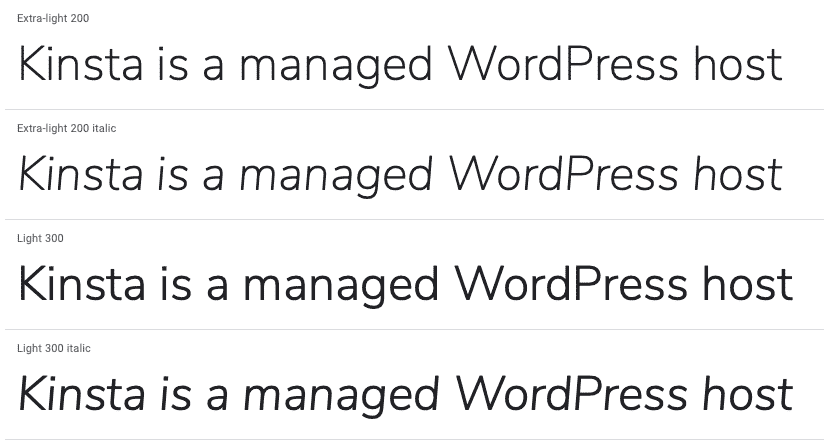

Nunito Sans.

Nunito Sans 是一种越来越流行的无衬线字体。在 2018 年至 2019 年期间，它的使用量增加了两倍，而且每年都变得更受欢迎。

### 13.音乐会一

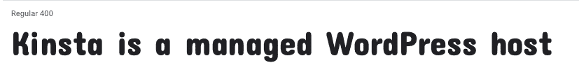

Concert One.

Concert One 是一种圆形奇形怪状的字体，是头条新闻的最佳选择。它标新立异的设计一定会吸引眼球。

### 14.提示

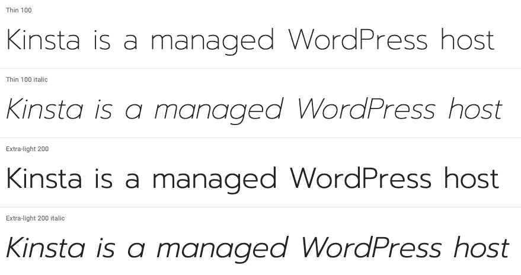

Prompt.

[Prompt](https://fonts.google.com/specimen/Prompt) 是泰国通信设计公司 Cadson Demak 提供的无衬线字体。它是无循环的(泰语相当于 sans-serif ),包括泰语和拉丁语字符。

### 15.工作无

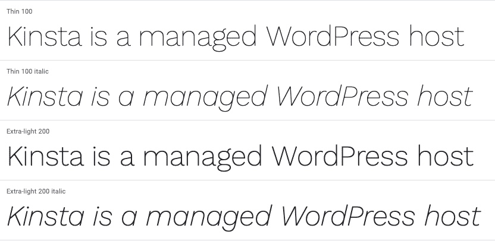

Work Sans.

[Work Sans](https://fonts.google.com/specimen/Work+Sans) 是一种为在屏幕上使用而优化的无衬线字体。设计师建议使用中量级的款式，从 14px 到 48px 不等。

需要为你的 WordPress 网站提供超快的、可靠的、完全安全的托管服务吗？Kinsta 提供所有这些以及 WordPress 专家提供的 24/7 世界级支持。[查看我们的计划](https://kinsta.com/plans/?in-article-cta)

## 如何创建最好的谷歌字体组合？

如果你认为尝试从谷歌字体中选择一种字体很难，那就等着在你的网站上把它们配对吧！谢天谢地，这不是一个你必须解决的问题(除非你想解决)。你可以用几种方法来想出最好的谷歌字体组合。

首先，如果你向下滚动页面，谷歌字体网站本身会推荐流行的搭配:

[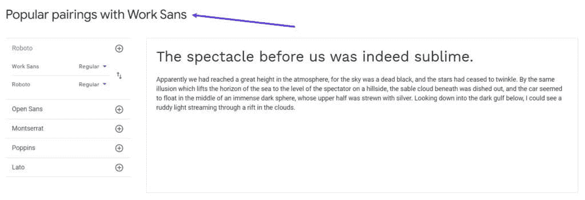](https://kinsta.com/wp-content/uploads/2021/05/google-fonts-pairs.jpg)

Discovering popular Google Fonts pairings.

除此之外，你还可以使用像[字体对](https://fontpair.co/)这样的网站来获得更多的建议。

## 在 WordPress 上使用谷歌字体的最佳实践

一旦你为你的项目找到了完美的字体，这里有一些在 WordPress 上使用谷歌字体的最佳实践。

### 限制您使用的字体粗细数量

其中一些字体，如 Montserrat 和 Raleway，有 18 种不同的字体粗细。虽然这有利于给你更多的选择，但你不会想在你的 WordPress 网站上加载所有 18 个权重，因为这会[减慢你的加载时间](https://kinsta.com/blog/google-pagespeed-insights/)。

遵循这一方针非常重要！

对于大多数字体，一个好的经验法则是最多使用三种粗细:

*   规则的
*   意大利语族的
*   大胆的

我们现在看到的许多 WordPress 网站甚至跳过了斜体，只使用了两种不同的字体粗细。

如果你自己嵌入谷歌字体，你可以选择包含哪些权重。首先，访问一个字体页面，然后点击**选择你想要的字体旁边的样式**。

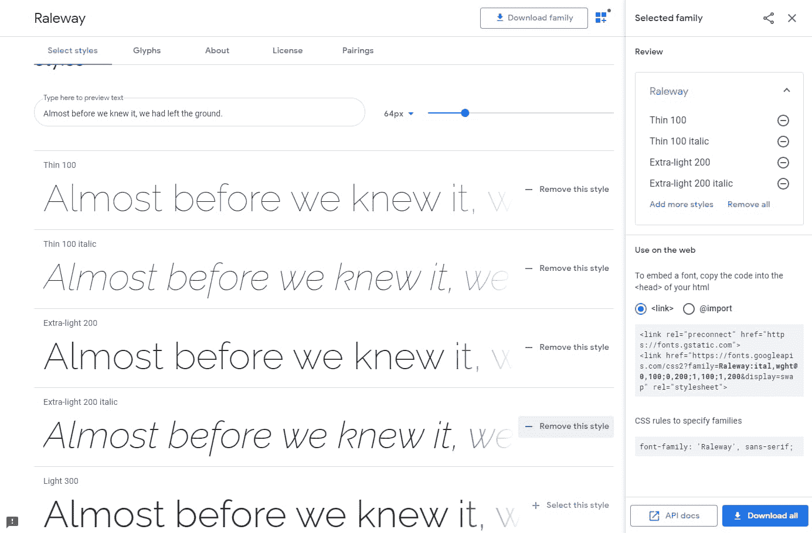

Choosing a font in Google Fonts.

今天，大多数 WordPress 主题都包含了选择你想要使用的 Google 字体和粗细的简单方法。但并不是所有的主题开发者都专注于性能。所以在某些情况下，最好在你的主题中禁用谷歌字体，然后[自己添加](https://kinsta.com/blog/how-to-change-font-in-wordpress/)。

可变字体也开始流行起来，所有现代浏览器都支持。这些都很棒，因为它允许一个字体文件转换不同的属性。谷歌字体有大量的可变字体可供选择，你甚至可以缩小搜索范围。

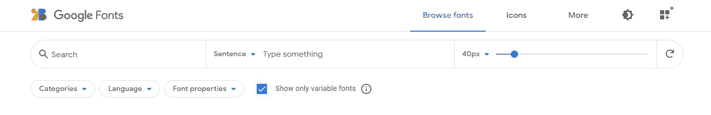

### 考虑在本地托管谷歌字体

作为从谷歌服务器提供字体的替代方法，你也可以在本地托管字体，提供[性能优势](https://kinsta.com/learn/speed-up-wordpress/)。然而，请记住，大多数谷歌字体可能已经缓存在人们的浏览器中。因此，我们建议您进行性能测试。

如果你使用的是谷歌字体以外的高级字体，比如我们在 Kinsta 网站上使用的“Brandon”字体，那么在本地托管它们(并从你的 CDN 提供服务)是最好的途径。关于这个话题的更多信息，请查看我们关于[如何在本地托管字体](https://kinsta.com/blog/local-fonts/)的帖子。

### 选择将获得更新的字体

字体就像 WordPress 插件和主题一样——随着时间的推移，它们会得到更新和改进，变得更好。虽然风险远没有 WordPress 插件那么可怕，但选择一种定期更新的字体仍然是有益的。例如，自 2014 年以来，谷歌的 Noto 家族已经获得了[定期更新](https://www.google.com/get/noto/updates/)。

因为这个列表中的大多数字体都很受欢迎，所以这个列表中的任何字体都会定期更新和改进。如果你决定不使用列表中的字体，确保你选择的字体足够受欢迎，以引起注意，这绝对不是一个坏主意。

### 不要忘记可访问性

根据世界卫生组织 2015 年收集的数据，估计有 2.53 亿人患有 T2 视力障碍:3600 万人失明，2.17 亿人有中度至重度视力障碍。此外，截至 2022 年，患有某种形式障碍的人数已上升至 22 亿。

当使用谷歌字体时，你可以控制它在 CSS 中的外观，比如颜色和大小。所以不要忘记遵循[网页内容可访问性指南(WCAG) 2.0](https://www.w3.org/TR/WCAG20/) 。这将确保每个人都可以轻松访问您的内容。

遵循这些指南将使更多的残疾人可以访问内容，包括失明和低视力、耳聋和听力损失、学习障碍、认知限制、行动受限、言语障碍、光敏以及这些情况的组合。–*网页内容无障碍指南(WCAG) 2.0*

一个重要的指导方针是颜色对比。在 Kinsta 网站的旧设计中，我们的字体有点太浅了，访问者表达了他们的担忧，因为它很难阅读。你最不想做的事情就是发布惊人的内容，却让它成为人们的眼中钉！

你可以使用像 WebAIM 的[颜色对比检查器](https://webaim.org/resources/contrastchecker/)这样的工具，看看你的[字体颜色](https://kinsta.com/blog/html-font-color/)是否通过了官方推荐。例如，您可以看到我们博客文章上的颜色现在通过了测试。👍

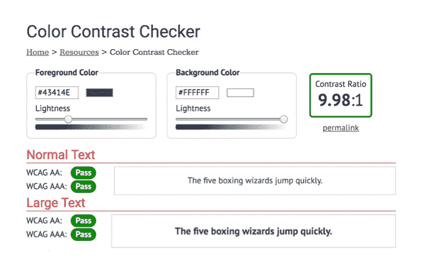

Color contrast checker tool. 

## **如何在 WordPress 中添加谷歌字体？**

挑选出一两种字体后，最后一步就是把它添加到你的网站上。多亏了谷歌字体，这项任务甚至比平时更容易。

假设你想在你的网站上放一种字体。在这种情况下，你有三个选择:安装一个插件，如[简易谷歌字体](https://wordpress.org/plugins/easy-google-fonts/)或[谷歌字体排版](https://wordpress.org/plugins/olympus-google-fonts/)，使用谷歌字体 API 将字体上传到你的网站，或手动下载并托管在你的网站上。

如果你需要知道如何在 WordPress 中改变你的字体，我们已经写了一份详细的指南来帮助你。

[选择字体不仅仅是一种审美选择——它会对你网站的跳出率和转换率产生重大影响😲在此入门⬇️ 点击推文](https://twitter.com/intent/tweet?url=https%3A%2F%2Fkinsta.com%2Fblog%2Fbest-google-fonts%2F&via=kinsta&text=Choosing+a+font+is+more+than+just+an+aesthetic+choice+%E2%80%94+it+can+have+a+substantial+effect+on+your+site%E2%80%99s+bounce+rates+and+conversion+rates+%F0%9F%98%B2+Get+started+here+%E2%AC%87%EF%B8%8F&hashtags=Typography%2CFonts)

## **总结**

谷歌字体非常棒，被数百万网站使用。它们通过坚实的排版和图标原则使网络更加愉悦、开放、快捷和易于访问。

为了确保为您的访问者提供更好的整体体验，我们建议您遵循最佳字体实践，例如限制字体粗细、本地托管字体(如果需要)以及遵守可访问性指南。

现在轮到你了——谷歌字体中你最喜欢的字体和字体对是什么？请在下面的评论中告诉我们，别忘了阅读我们关于 [WordPress 字体](https://kinsta.com/blog/wordpress-fonts/)的深度指南！

* * *

让你所有的[应用程序](https://kinsta.com/application-hosting/)、[数据库](https://kinsta.com/database-hosting/)和 [WordPress 网站](https://kinsta.com/wordpress-hosting/)在线并在一个屋檐下。我们功能丰富的高性能云平台包括:

*   在 MyKinsta 仪表盘中轻松设置和管理
*   24/7 专家支持
*   最好的谷歌云平台硬件和网络，由 Kubernetes 提供最大的可扩展性
*   面向速度和安全性的企业级 Cloudflare 集成
*   全球受众覆盖全球多达 35 个数据中心和 275 多个 pop

在第一个月使用托管的[应用程序或托管](https://kinsta.com/application-hosting/)的[数据库，您可以享受 20 美元的优惠，亲自测试一下。探索我们的](https://kinsta.com/database-hosting/)[计划](https://kinsta.com/plans/)或[与销售人员交谈](https://kinsta.com/contact-us/)以找到最适合您的方式。