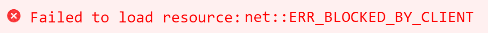
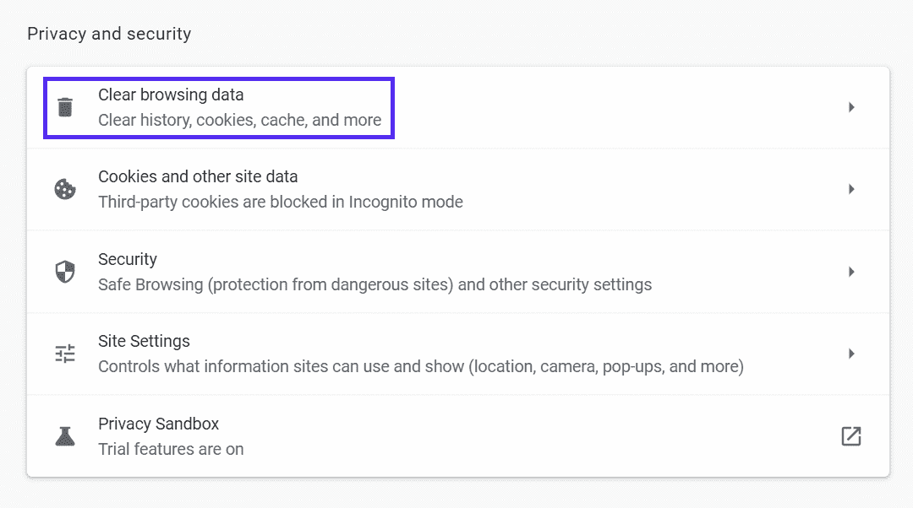
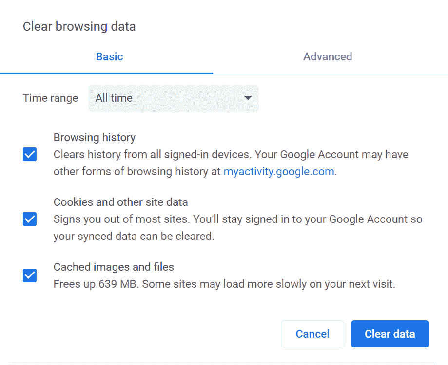
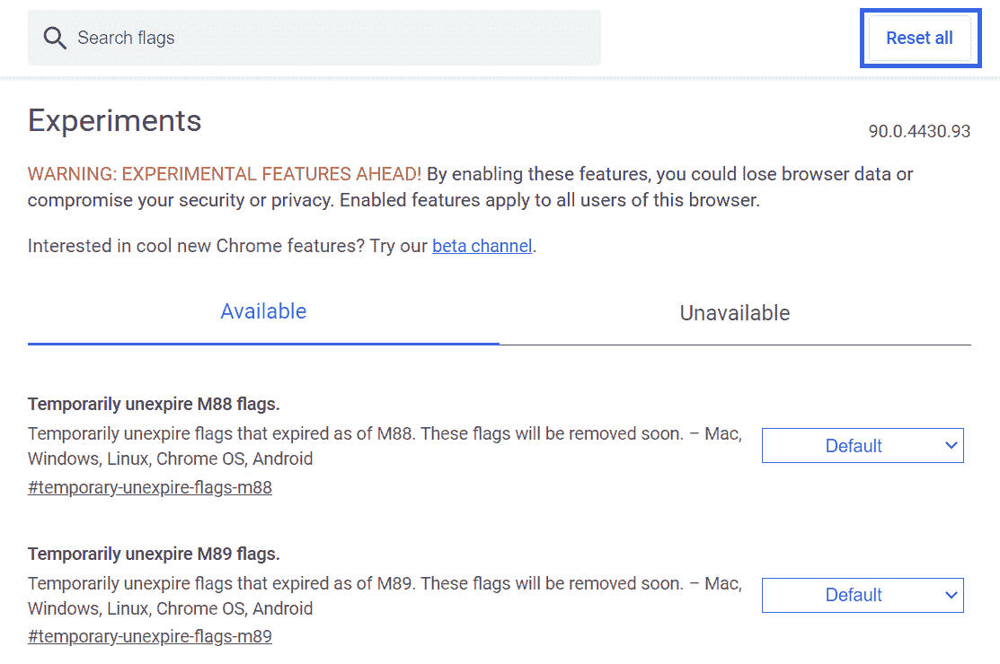
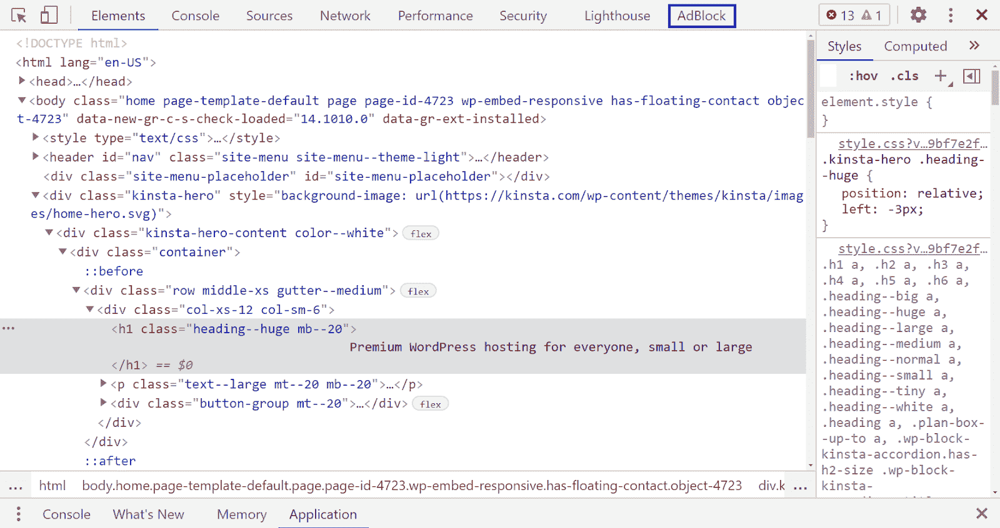
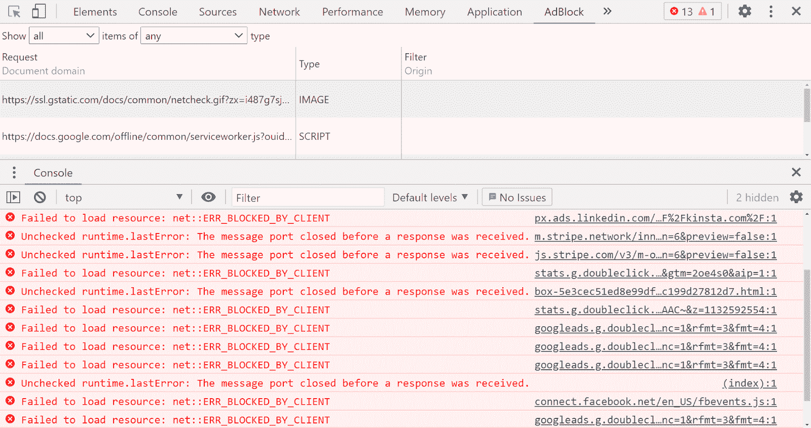
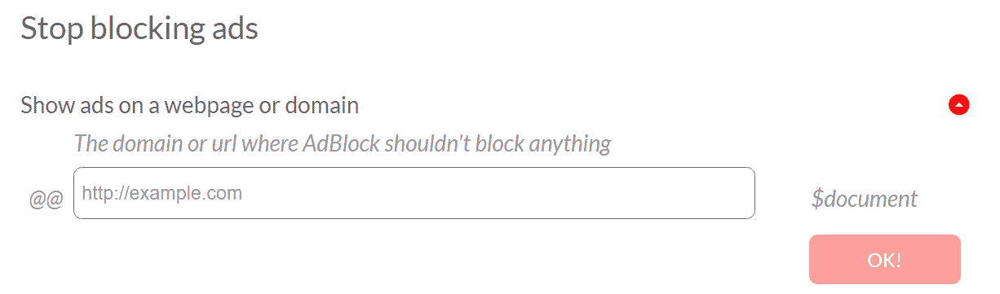

# 修复“无法加载资源:net::ERR_BLOCKED_BY_CLIENT”错误的 4 种方法

> 原文：<https://kinsta.com/blog/err_blocked_by_client/>

大多数人都习惯了偶尔的电脑故障。然而，如果你面对一个“ERR_BLOCKED_BY_CLIENT”错误，你可能不知道下一步该怎么做。几个不同的问题可能导致此问题，使故障排除成为一项挑战。

幸运的是，有一种方法可以避免混淆。通过了解此错误的所有可能的解决方案，您可以以最小的摩擦快速解决问题。

在本文中，我们将解释为什么您可能会看到“ERR_BLOCKED_BY_CLIENT”错误。然后我们将讨论四种方法来帮助你解决这个问题。

让我们开始吧！

### 查看[我们的指南](https://www.youtube.com/watch?v=O28RRcvSock)修复“加载资源失败:net::ERR_BLOCKED_BY_CLIENT”错误

## 为什么您可能会看到“加载资源失败”错误

虽然消息“ERR_BLOCKED_BY_CLIENT”很常见，但这可能不是您看到的确切文本:

> Kinsta 把我宠坏了，所以我现在要求每个供应商都提供这样的服务。我们还试图通过我们的 SaaS 工具支持达到这一水平。
> 
> <footer class="wp-block-kinsta-client-quote__footer">
> 
> 
> 
> <cite class="wp-block-kinsta-client-quote__cite">Suganthan Mohanadasan from @Suganthanmn</cite></footer>

[View plans](https://kinsta.com/plans/)

出现“加载资源失败:net::ERR_BLOCKED_BY_CLIENT”错误。

您可能会看到这样的变化:

*   "无法加载资源:net::ERR_BLOCKED_BY_CLIENT "
*   " chrome 无法加载资源:net::ERR_BLOCKED_BY_CLIENT "

或者，该消息可以是特定于应用程序或插件的，例如:

*   " woocommerce 无法加载资源:net::ERR_BLOCKED_BY_CLIENT "

你也可能在热门网站上看到这个错误，比如 [YouTube](https://kinsta.com/blog/youtube-stats/) 和[脸书](https://kinsta.com/blog/facebook-statistics/)。不管错误通知的措辞如何，效果通常是一样的:您无法查看页面的一部分。

不可否认，面对这种情况会令人沮丧。然而，错误消息可以提示您原因。因此，您可能能够比其他问题更快地解决类似这样的错误，这些问题会导致内容不能正确显示。

有时，“加载资源失败”错误是由于缺少服务器文件造成的。一个 [URL 输入错误](https://kinsta.com/knowledgebase/what-is-a-url/)也可能导致它。然而，更常见的是，浏览器扩展[阻止了一个请求](https://kinsta.com/knowledgebase/requests-to-the-server-have-been-blocked-by-an-extension/)。

[广告拦截器](https://kinsta.com/blog/ad-blockers/)和其他内容版主可能会干扰网页的正常部分。这些工具的工作原理是在网站上搜索特定的单词和模式。任何相似之处都可能意味着你的文件会被列入黑名单。

幸运的是，有一些方法可以防止这种情况。

## 如何修复“加载资源失败:net::ERR_BLOCKED_BY_CLIENT”错误

如果你遇到了这个错误，不要担心！下面有四种方法可以解决这个问题。

我们建议您依次完成每个解决方案。如果一个没有解决问题，您可以尝试下一个。

### 1.将浏览器重置为默认设置

先说一个常见问题:[你的浏览器](https://kinsta.com/browser-market-share/)。有些浏览器的设置会干扰特定资源的显示。因此，您可能希望从重置其中的几个选项开始。请注意，该方法还会禁用[扩展](https://kinsta.com/blog/best-chrome-extensions/)，例如可能导致问题的广告拦截器。

谷歌 Chrome 的一个常见问题是缓存。要重置你的 Chrome 缓存，打开浏览器。通过在地址栏中输入“chrome://settings/”导航到您的 Chrome 设置。然后向下滚动找到标题为**隐私与安全**的部分，选择**清除浏览数据**:

Chrome 浏览器的“隐私和安全”设置。

浏览器会带你到一个有几个选项的屏幕。确保时间范围为**所有时间**，并选择所有三个选项。准备好之后，点击**清除数据**:

## 注册订阅时事通讯

### 想知道我们是怎么让流量增长超过 1000%的吗？

加入 20，000 多名获得我们每周时事通讯和内部消息的人的行列吧！

[Subscribe Now](#newsletter)

Chrome 的缓存清理过程，勾选所有选项，并将时间范围设置为“所有时间”

清除缓存后，这可能会重置产生错误的任何选项。检查有问题的页面，查看资源现在是否正确显示。如果没有，你也可以尝试重置 Chrome 标志。

Chrome 标志是浏览器的实验性功能——默认情况下大多数是关闭的。但是，您可能仍然会使用一些，因为它们可以扩展功能。

要重置您的标志，请在地址栏中输入“chrome://flags/”。您可以逐个禁用它们，或者只需点击右上角的**重置所有**:

首页为谷歌标志。

你也可以按照类似的步骤[清除所有主流浏览器](https://kinsta.com/knowledgebase/how-to-clear-browser-cache/)上的缓存。完成该过程后，重新启动浏览器并尝试再次查看资源。如果它仍然没有出现，您可以继续下面的方法。
T3】

### 2.重命名任何有问题的文件

解决这个问题的另一个方法是直接找到问题的根源。如果一个审核扩展阻止了你的内容，可能是因为它的文件名。因此，您会想要尝试用不同的名称重新上传您的资产。

用户不太可能停用他们的广告拦截器，所以这通常是解决问题的直接方法。从寻找任何包含广告相关术语的文件名开始。它可以由“广告”、“广告”或“促销”等词组成

如果你找到这样的标题，考虑用后相关的关键字来代替它们。例如，一篇分析新软件的文章应该在图片标题中包含该软件的名称。除了帮助防止不正确的阻止，这也可以[提高你的网页排名](https://kinsta.com/blog/wordpress-seo/)。

### 3.使用广告拦截器调试您的页面

第三方工具可能是“ERR_BLOCKED_BY_CLIENT”错误的原因，但也可能是解决方案。许多用户选择利用[提高生产力的 Chrome 扩展](https://kinsta.com/blog/best-chrome-extensions/#7-evernote-web-clipper)，它们通常带有有用的[调试](https://kinsta.com/blog/wordpress-debug/)功能。

需要一个给你带来竞争优势的托管解决方案吗？Kinsta 为您提供了令人难以置信的速度、一流的安全性和自动伸缩功能。[查看我们的计划](https://kinsta.com/plans/?in-article-cta)

在本演练中，我们将使用 [Adblock 加](https://adblockplus.org/)，因为这是一个流行的选项。当我们使用这个工具通过 Chrome 演示这些步骤时，请注意，你也可以[将它用于带有](https://adblockplus.org/en/adblock-plus-firefox) [Firefox 扩展](https://kinsta.com/blog/firefox-extensions/)的 Mozilla Firefox 和其他主流浏览器。

首先，导航到您想要调试的页面。接下来，右键单击页面上的任意位置，并选择**检查**。然后点击右上角的 **AdBlock** 选项卡:

一个充满彩色代码的控制台，高亮显示“AdBlock”标签。

您将被带到一个关注 AdBlock 运营的检查页面。您可以向下滚动控制台以查看“加载资源失败”错误的所有实例:

谷歌 Chrome 控制台的 AdBlock Plus 标签显示几条错误信息。

从这里，您可以检查每个错误，看看是否有一个模式。在上面的例子中，许多“ERR_BLOCKED_BY_CLIENT”消息是由 Google 广告引起的。

一旦你看到一个模式，你就能决定如何避开一个障碍。例如，您可以记下这些术语，并在将来防止它们。

您可以使用这些知识来重命名或重新发布您的资源。对于与广告不密切相关的文件名来说，这一点很重要。

### 4.允许列出网站(如果您是访问者)

最后，你可能并不拥有你无法访问的网站。如果是这种情况，您可以“允许列出”有问题的站点，以确保所有内容都能正确显示。

为此，请导航至您的 Adblock Plus 设置页面。从左侧菜单中选择**定制**，向下滚动找到**停止屏蔽广告**选项:

一个标题为“停止屏蔽广告”的页面图像，带有一个输入网站的字段。

在这里，您可以在框中输入您想要访问的网站名称，然后点击**确定！**将其添加到允许列表中。但是，请考虑这样做会关闭该页面或网站的所有广告拦截。

如果您在另一个网站上发现“ERR_BLOCKED_BY_CLIENT”错误，您可能需要联系网站所有者并让他们知道。你可能不是唯一一个看到这条消息的人，以上任何一个动作都只会为你解决问题。向站点发出警报有助于解决根本原因。

[If you're seeing this issue, there are 4 ways to solve it...and they're all covered in this guide ⬇️Click to Tweet](https://twitter.com/intent/tweet?url=https%3A%2F%2Fkinsta.com%2Fblog%2Ferr_blocked_by_client%2F&via=kinsta&text=If+you%27re+seeing+this+issue%2C+there+are+4+ways+to+solve+it...and+they%27re+all+covered+in+this+guide+%E2%AC%87%EF%B8%8F&hashtags=SiteError%2CWPTips)

## 摘要

大多数错误信息都是不受欢迎的。它们表明出现了问题，通常会中断您的浏览。幸运的是，您可以通过调整一些设置来解决“加载资源失败:net:: ERR_BLOCKED_BY_CLIENT”错误。

在本文中，您了解了解决这个紧迫的浏览问题的四种方法:

1.  将浏览器选项重置为默认设置。
2.  重命名标题中包含广告相关术语的文件。
3.  使用广告拦截器，如 [Adblock Plus](https://adblockplus.org/) 调试页面。
4.  允许列出您想要访问的网站。

*您对“ERR_BLOCKED_BY_CLIENT”错误的故障排除有任何疑问吗？请在下面的评论区告诉我们！*

* * *

让你所有的[应用程序](https://kinsta.com/application-hosting/)、[数据库](https://kinsta.com/database-hosting/)和 [WordPress 网站](https://kinsta.com/wordpress-hosting/)在线并在一个屋檐下。我们功能丰富的高性能云平台包括:

*   在 MyKinsta 仪表盘中轻松设置和管理
*   24/7 专家支持
*   最好的谷歌云平台硬件和网络，由 Kubernetes 提供最大的可扩展性
*   面向速度和安全性的企业级 Cloudflare 集成
*   全球受众覆盖全球多达 35 个数据中心和 275 多个 pop

在第一个月使用托管的[应用程序或托管](https://kinsta.com/application-hosting/)的[数据库，您可以享受 20 美元的优惠，亲自测试一下。探索我们的](https://kinsta.com/database-hosting/)[计划](https://kinsta.com/plans/)或[与销售人员交谈](https://kinsta.com/contact-us/)以找到最适合您的方式。