# 如何在所有浏览器和设备上更改默认搜索引擎

> 原文：<https://kinsta.com/blog/how-to-change-search-engine/>

每个浏览器都有自己默认的[搜索引擎](https://kinsta.com/blog/alternative-search-engines/)，方便用户进行在线搜索。例如，Chrome 和 Safari iOS 使用谷歌，而 Edge 使用必应。

但是如果你不喜欢浏览器默认的搜索引擎呢？幸运的是，每个标准浏览器——谷歌 Chrome、Firefox、Edge、Internet Explorer、Safari 和 Opera——都允许你改变它使用的搜索引擎。通常，它们还包括从网上添加自定义搜索引擎的选项。

具体过程取决于您的浏览器和设备。无论你是手机用户还是电脑用户，我们都会给你详细说明如何改变默认的搜索引擎。

### 查看我们的[视频指南](https://www.youtube.com/watch?v=2dbKaBo3xP4)改变默认搜索引擎:

## 默认的搜索引擎是什么？

你知道你浏览器的地址栏不仅仅是为了[访问网站](https://kinsta.com/knowledgebase/what-is-a-url/)吗？你也可以用它来自动搜索网页。

每个 web 浏览器都有自己的默认搜索提供商。当您尝试搜索地址栏时，它会自动将您重定向到您的浏览器偏好的站点。

> Kinsta 把我宠坏了，所以我现在要求每个供应商都提供这样的服务。我们还试图通过我们的 SaaS 工具支持达到这一水平。
> 
> <footer class="wp-block-kinsta-client-quote__footer">
> 
> 
> 
> <cite class="wp-block-kinsta-client-quote__cite">Suganthan Mohanadasan from @Suganthanmn</cite></footer>

[View plans](https://kinsta.com/plans/)

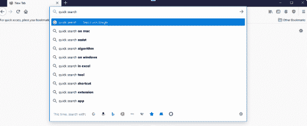

The default search engine is listed in the address bar.

这比手动访问像谷歌这样的网站，然后输入你的查询要快得多，因为你可以跳过整个步骤。但是如果默认的搜索引擎是你不喜欢的网站，你可能想改变它。

你总是可以通过在地址栏中输入它的网址来访问你选择的搜索引擎，但是当你可以将它设置为默认搜索引擎，然后直接在地址栏中访问它时，就没有必要这么麻烦了。

想知道默认的搜索引擎是什么吗？以下是本指南涵盖的所有主流浏览器的完整列表:

*   谷歌浏览器
*   火狐浏览器:谷歌(之前的雅虎)
*   **缘:**冰
*   互联网浏览器:必应
*   Safari: 谷歌
*   **歌剧:**谷歌

虽然谷歌是大多数浏览器的默认选择，但你也可以选择你喜欢的。许多浏览器都预装了可供选择的其他搜索引擎列表，你也可以添加自己的搜索引擎。

[想更改浏览器上的默认搜索引擎吗？✅⬇️点击推文](https://twitter.com/intent/tweet?url=https%3A%2F%2Fkinsta.com%2Fblog%2Fhow-to-change-search-engine%2F&via=kinsta&text=Want+to+change+the+default+search+engine+on+your+browser%3F+%E2%9C%85+It+has+never+been+easier+%E2%AC%87%EF%B8%8F&hashtags=iOS%2CFirefox)

## 为什么要改变浏览器的默认搜索引擎？

有一个很大的原因让你想改变它:谷歌是大多数浏览器的默认选择。但是谷歌正在跟踪你已经不是什么大秘密了，一些用户对侵犯隐私感到不安。如果是你的话，你可能连不小心都不想用它搜索了。

如果你担心隐私问题，像 DuckDuckGo 这样致力于保护你的匿名的搜索提供商可能是更好的选择。这个搜索引擎现在是许多关注隐私的浏览器的默认选择(例如[勇敢浏览器](https://kinsta.com/blog/brave-browser-review/))。

另一方面，Edge 用户可能更喜欢谷歌而不是必应。考虑到几乎所有主流浏览器都使用最流行的搜索引擎谷歌，他们可能也不喜欢打破标准。

你可能也不想使用专用的搜索引擎，而是使用较小网站的搜索功能。例如，如果你的设备主要用于研究，你可以让维基百科成为你的首选快速搜索工具。

或者这一切都可能归结为个人喜好。

## 如何更改默认搜索引擎(所有浏览器)

不管你用的是什么浏览器，也不管你用的是电脑还是移动设备，改变默认的搜索引擎应该不难。如果您不确定从哪里开始或在哪里找到合适的设置，这些提示将带您完成每个步骤。

### 信息

恶意软件的一个常见策略是改变你的默认搜索引擎。如果你注意到这种情况发生，尤其是在手动撤销后再次发生，你的浏览器可能被恶意软件感染。

### 谷歌浏览器

随着谷歌 Chrome 浏览器的打开，首先在你的屏幕右上角寻找一排三点。点击它，然后在底部找到**设置**按钮。

Opening Settings in Google Chrome.

打开**设置**页面，然后向左寻找到**搜索引擎**标签的快速链接，或者滚动直到找到它。

你应该在地址栏选项中使用的**搜索引擎的右边看到一个下拉菜单。点击它，选择你喜欢的搜索引擎。**

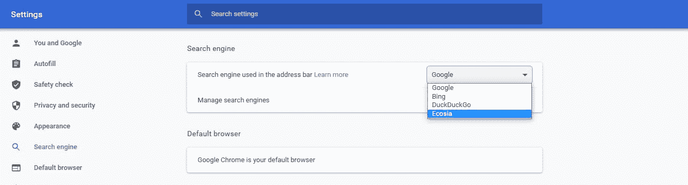

Selecting the search engine used in the address bar.

或者，您可以点击**管理搜索引擎**，然后点击您想要的搜索引擎旁边的垂直三个点，并选择**设为默认**。

**手机用户:**打开谷歌 Chrome 应用，点击地址栏旁边的三个点，然后**设置**。

在**基础知识**部分找到**搜索引擎**。然后选择您想要使用的搜索引擎。

### 火狐浏览器

在右上角寻找 Firefox 的菜单按钮，类似于三条水平线。然后点击位于齿轮符号旁边的**选项**链接，打开**设置**菜单。

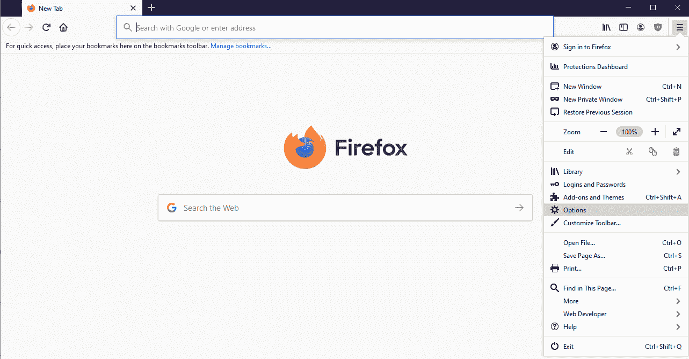

Opening the Options menu in Firefox.

屏幕左侧应该有一个带放大镜图标的**搜索**按钮。点击它调出**搜索**选项。

通过下拉菜单查找默认搜索引擎部分。火狐有六个默认设置:谷歌、亚马逊、[必应](https://kinsta.com/blog/alternative-search-engines/#1-bing)、DuckDuckGo、易贝和维基百科。选择你喜欢的一个。

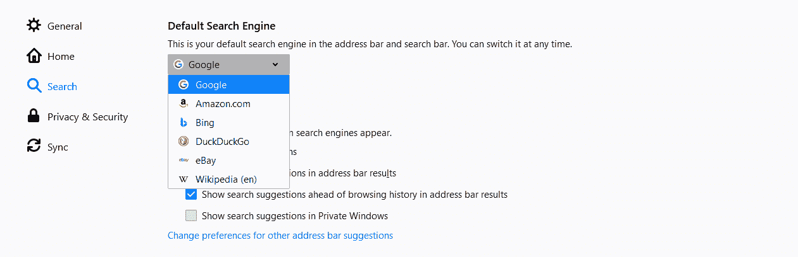

Changing the default search engine used in Firefox.

**移动用户:**轻点地址栏旁边的菜单按钮，看起来就像一排竖着的三个点。点击**设置**，然后在**设置**页面上，**搜索。你会看到一个默认搜索引擎列表，可以从中选择。**

### 边缘

你可以通过点击屏幕右上方的水平线，然后点击**设置来找到 Edge 的设置。**点击**隐私、搜索和服务**，滚动到**服务**部分，然后点击**地址栏，搜索列表最底部的**。

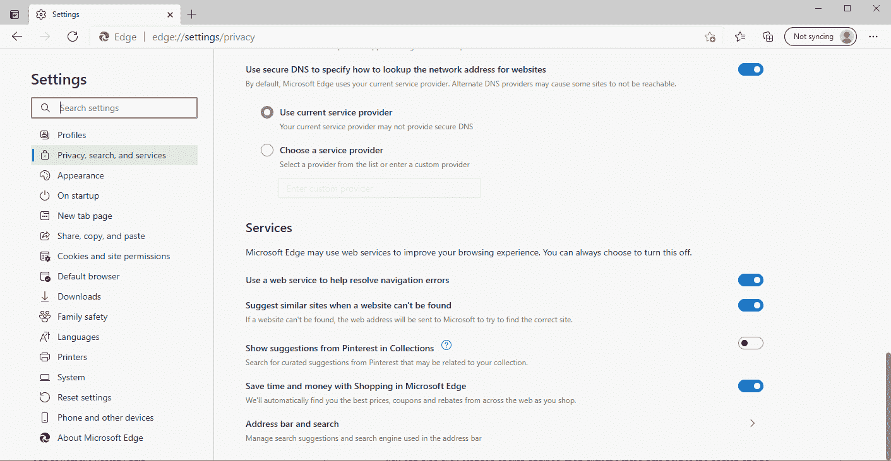

Accessing the default search and address bar menu in Edge.

您应该会看到地址栏中标有**搜索引擎的部分，带有一个下拉菜单。默认情况下，你可以从必应、雅虎、谷歌、DuckDuckGo 和 [YouTube](https://kinsta.com/blog/youtube-stats/) 中选择。**

您也可以点击**管理搜索引擎**，然后点击您想要使用的搜索引擎旁边的三个点，并点击**设为默认**。

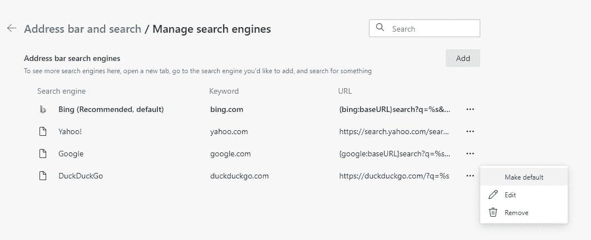

Manage search engines menu in Edge.

**移动用户:**要找到您的设置，点击屏幕底部栏上的一排圆点，然后点击**设置**。在**高级**下，寻找**搜索**选项。选择**默认搜索引擎**，然后从搜索提供商列表中选择。

### 微软公司出品的 web 浏览器

Internet Explorer 是不受支持的浏览器，出于安全考虑，我们建议您升级到现代浏览器。然而，今天仍有许多人使用它，尤其是在遗留的企业环境中，用户别无选择，只能使用过时的应用程序。

在 IE 上改变你的默认搜索引擎的过程有点混乱，但是你仍然可以做到。

要获得设置，请单击屏幕顶部的齿轮符号，然后单击**管理附加组件**。

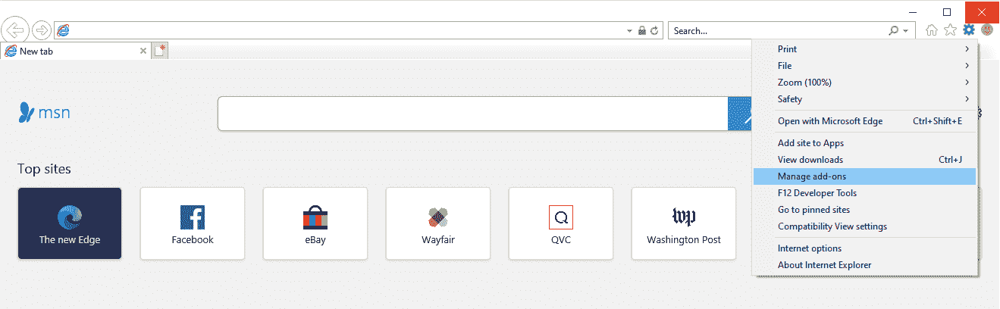

Managing add-ons in Internet Explorer.

在弹出的窗口中，在**附加类型**下寻找，然后点击**搜索提供商**。默认情况下，Bing 是唯一列出的提供商。

如果您已经添加了其他搜索引擎，请选择您喜欢的搜索引擎，然后单击**设置为默认**。

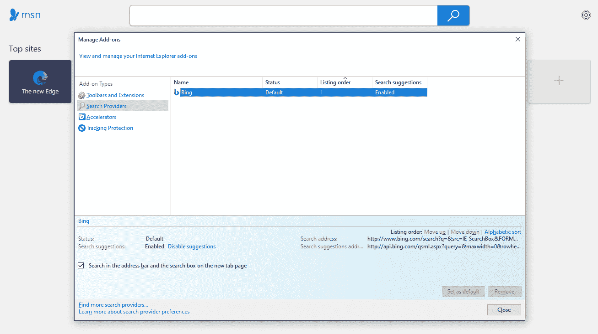

Changing the default search engine in Internet Explorer.

### 旅行队

作为 Apple 设备的默认浏览器，您可以在 iPhone 和 Mac 上使用 Safari。虽然其他操作系统也有 Safari 版本，但它们已经过时了，您应该避免使用它们。

## 注册订阅时事通讯

### 想知道我们是怎么让流量增长超过 1000%的吗？

加入 20，000 多名获得我们每周时事通讯和内部消息的人的行列吧！

[Subscribe Now](#newsletter)

如果您在 MacBook 或 iMac 上使用 Safari，请在浏览器顶部寻找菜单窗口。选择第一个选项，即 **Safari** ，点击**偏好设置**。接下来，点击屏幕顶部的**搜索**标签。你可以选择谷歌、必应、雅虎、Ecosia 或 DuckDuckGo。

**iOS 用户:**打开手机的设置，寻找 **Safari** 部分，而不是在浏览器中寻找。在**搜索**下方，点击**搜索引擎**。你有五个和台式机一样的搜索引擎可以选择。

### 歌剧

通过单击左侧面板上的齿轮打开 Opera 的设置。向下滚动到**搜索引擎部分**并寻找地址栏中使用的**搜索引擎旁边的下拉菜单。你可以在谷歌、雅虎、DuckDuckGo、亚马逊、必应和维基百科中进行选择。**

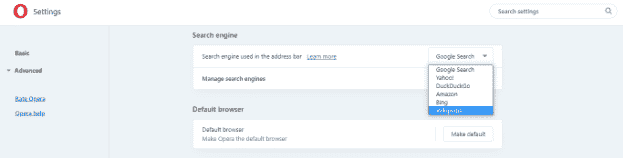

Changing the default search engine in Opera.

**移动用户:**打开 Opera 点击屏幕右下角的 logo，然后点击**设置**。滚动直到你看到在**搜索**下面列出的**默认搜索引擎**。

与桌面版相比，你有一些额外的选择:谷歌、雅虎、必应、DuckDuckGo、[亚马逊](https://kinsta.com/affiliate-academy/amazon-affiliate-website/)、易贝、IMDB 和维基百科。从列表中选择您想要的。
T3】

## 如何添加或删除自定义搜索引擎

假设你添加了你最喜欢的搜索引擎，但是你发现它不在列表中。然后呢？

如果是这样的话，你必须手动输入。虽然这在一些浏览器上比其他浏览器更容易，但除了 Safari 和 Opera Mini 之外，其他浏览器都有一些方法来添加除默认搜索引擎之外的搜索引擎。

您可能还会注意到，您的列表包含您不感兴趣的网站，因为它们有时会自动添加到列表中。如果这让你烦恼，你可以把它们去掉。

幸运的是，这些设置离您更改默认搜索引擎的位置不远。

### 谷歌浏览器

默认情况下，谷歌 Chrome 在默认搜索引擎列表中只包括 Google、Bing、Yahoo、DuckDuckGo 和 Ecosia。如果您有不同的想法，您必须手动添加。

点击右上角的三个点，然后点击**设置**，打开 Chrome 的设置页面，滚动到**搜索引擎**部分。然后点击**管理搜索引擎**。

要添加搜索引擎，点击**旁边的**添加**其他搜索引擎**并填写字段。

*   在**搜索引擎**字段中，添加一个标签。你想要什么都可以。
*   在**关键词中，**输入你想要触发 Chrome 中快速搜索功能的单词或网址。例如，要启动[谷歌的快速搜索功能](https://kinsta.com/blog/google-search-operators/#2-find-pages-to-add-internal-links)，在地址栏中键入“google.com”并按下键盘上的**空格键**。
*   最后，输入搜索网址。要找到正确的 URL，请搜索您要添加的站点。您的 URL 可能看起来像`http://www.example.com/search?q=kinsta`。在这个例子中，用`%s`替换`kinsta`，将初始查询留空。

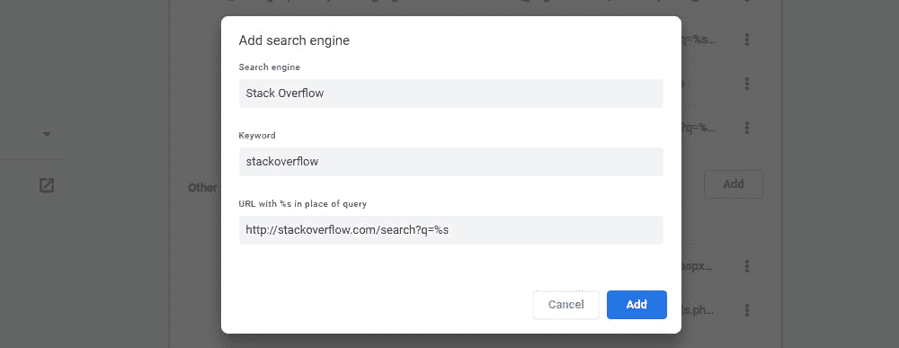

Adding search engine options in Google Chrome.

或者，你可以访问你喜欢的搜索引擎网站，并在那里搜索，以将其自动添加到你的浏览器列表中。

您还可以删除搜索引擎，包括默认引擎。只需点击它们旁边的一排圆点，然后点击**从列表中删除**。

厌倦了低于 1 级的 WordPress 托管支持而没有答案？试试我们世界一流的支持团队！[查看我们的计划](https://kinsta.com/plans/?in-article-cta)

**移动用户:**目前无法手动添加自定义搜索引擎，但您可以通过访问您想要添加的网站并执行搜索来自动添加。然后你可以在你的设置页面的**基础>搜索引擎**下找到它。

### 火狐浏览器

Firefox 提供了多种方式来添加新的搜索引擎。

要通过**设置**页面添加，打开地址栏旁边的菜单，然后进入**选项**，接着进入**搜索**。滚动到搜索页面的底部，点击**查找更多搜索引擎**。然后你可以下载一个 [Firefox 扩展](https://kinsta.com/blog/firefox-extensions/)，它将为你的浏览器添加搜索工具。

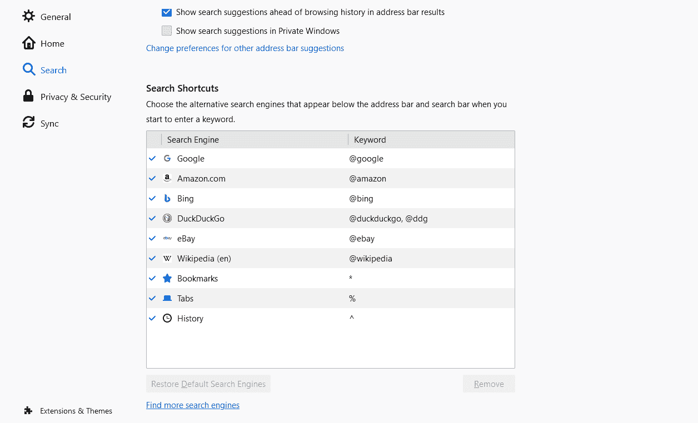

Firefox settings for adding or removing search engine extensions.

如果你不想下载扩展，还有其他选择。

首先，访问你的搜索引擎的网站。如果您在**搜索**设置中启用了单独的搜索栏(位于地址栏旁边)，您会看到一个绿色加号出现在放大镜图标上。点击它，您应该会看到一个选项来添加您的搜索引擎。

如果您不使用搜索栏，请点击地址栏中三个点的水平行。然后点击**添加搜索引擎**。

Adding a search engine to Firefox.

移除搜索引擎很容易。在**设置**页面，滚动到**搜索快捷方式**并高亮显示您想要删除的搜索引擎。点击**移除**按钮，Firefox 会将其从你的搜索快捷方式和**默认搜索引擎**下拉列表中删除。

如果你使用了一个扩展来添加搜索引擎，那么你需要卸载这个扩展。

手机用户:奇怪的是，*安卓版火狐*包括手动添加搜索引擎，而其桌面版却没有。

点击菜单按钮访问**设置**页面，然后进入**搜索**设置。点击**添加搜索引擎，**然后**其他**。命名搜索引擎，然后将 URL 放入**搜索字符串以使用**字段。

像 Chrome 一样，你需要通过访问网站和搜索来获得正确的网址。复制 URL，然后用`%s`替换您输入的查询。

### 边缘

与 Firefox 非常相似，Edge 依靠 OpenSearch 标准在你浏览时自动添加搜索引擎。要添加搜索引擎，请访问其网站并进行搜索。然后，您应该能够在前面讨论的设置中替换您的默认搜索引擎。

无论您使用的是 Edge 的桌面版还是移动版，此规则都适用。

也可以通过访问**设置>** **管理搜索引擎**点击**添加**来添加搜索引擎。它与谷歌 Chrome 添加搜索引擎的提示相同——输入网站的标签，一个激活快速搜索功能的关键词，最后用`%s`链接网址，替换你的搜索查询。

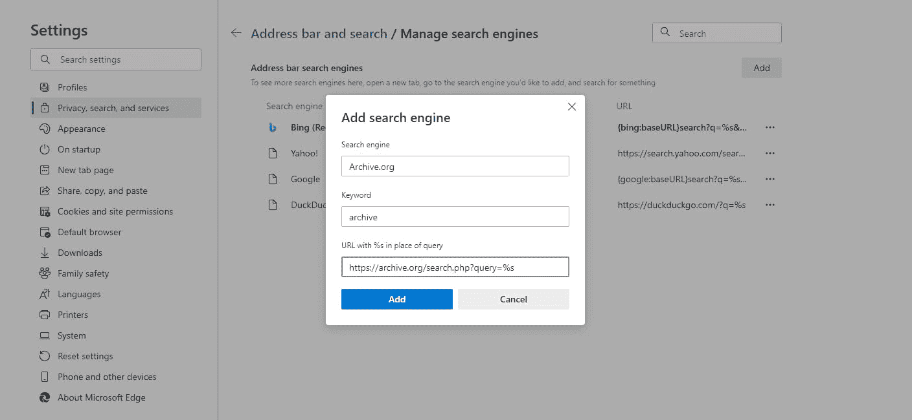

Adding a new search engine option to the address bar in Edge.

移除搜索引擎需要访问**设置**，点击**管理搜索引擎，**并点击三个点。然后点击**删除**将其删除。

### 微软公司出品的 web 浏览器

导航到**工具**(齿轮符号)> **管理加载项** > **加载项类型** > **搜索提供者**，打开**设置**页面。由于 Internet Explorer 只附带 Bing，您需要手动添加额外的引擎。

在弹出窗口的底部，点击**查找更多搜索提供商**。从那里，你可以安装各种插件，让你用不同的引擎搜索。

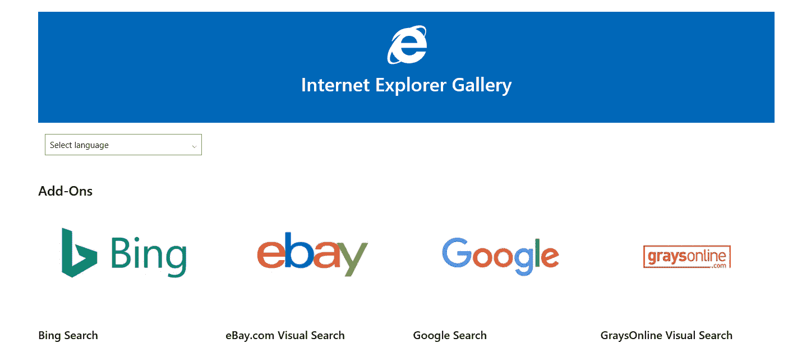

Selecting from search engine add-ons in Internet Explorer.

移除您安装的搜索引擎，在**搜索提供商**列表中选择它，然后点击**移除**。

### 旅行队

不幸的是，在 iOS 或 Mac 的 Safari 中，没有内置的方法来添加额外的搜索引擎。您仍然可以手动导航到某个网站以使用其搜索功能，但无法将他们的快速搜索添加到您的 Safari 地址栏中。

你也许可以在 Safari 的内置**扩展库**中寻找一个插件，比如 Anysearch，它允许你将新的搜索引擎添加到你的列表中。

### 歌剧

在 Opera 的设置中，在**搜索引擎**下，寻找标签为**管理搜索引擎**的按钮。接下来，点击**添加，**，你会看到一个窗口，你可以手动添加你最喜欢的搜索提供商。

像往常一样，输入搜索引擎的标签，一个激活快速搜索的关键字(例如，在 Opera 的地址栏中键入“g”将启动快速谷歌搜索)，以及替换为您的查询的搜索 URL。

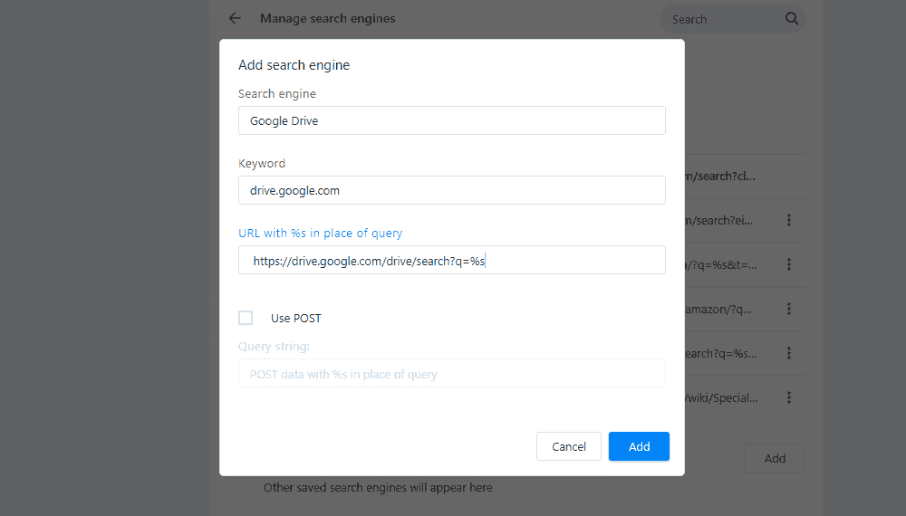

Adding a search engine option to Opera.

与其他允许手动添加搜索引擎的浏览器相比，这里有一点不同:Opera 支持 StartPage 等网站，它们使用 POST [HTTP 请求方法](https://kinsta.com/blog/wordpress-http-api/)而不是 GET。除非您知道您正在使用这样的网站，否则请将此框留空。

您不能删除任何默认的搜索引擎，因为它们是浏览器的一部分。但是如果你添加了一个你不再需要的网站，点击它旁边的圆点线并选择**从列表**中移除。

**移动用户:**目前没有办法给 Opera Mini 添加自定义搜索引擎或者从默认列表中删除任何搜索引擎。

[Whether you're a mobile or desktop user, this guide has everything you need to know to change your default search engine 👩‍💻Click to Tweet](https://twitter.com/intent/tweet?url=https%3A%2F%2Fkinsta.com%2Fblog%2Fhow-to-change-search-engine%2F&via=kinsta&text=Whether+you%27re+a+mobile+or+desktop+user%2C+this+guide+has+everything+you+need+to+know+to+change+your+default+search+engine+%F0%9F%91%A9%E2%80%8D%F0%9F%92%BB&hashtags=iOS%2CFirefox)

## 摘要

大多数人对哪个搜索引擎最好有强烈的看法。当你的浏览器默认使用你不喜欢的浏览器时，你会很沮丧。

幸运的是，改变你的搜索引擎并添加一个更好的在任何设备上都是一件容易的事情。不管你的首选搜索引擎有多不传统，只要你遵循这些指示，它应该可以完美地工作。

不幸的是，一些浏览器，尤其是移动浏览器，可能不支持手动添加搜索引擎——有些根本不支持添加额外的搜索引擎(例如 Safari)。

如果你发现自己很难使用你喜欢的搜索提供商，通常你最好的选择是切换浏览器。你可以随时查看 2021 年[浏览器市场份额](https://kinsta.com/browser-market-share/)，看看是否存在更好的替代方案。

* * *

让你所有的[应用程序](https://kinsta.com/application-hosting/)、[数据库](https://kinsta.com/database-hosting/)和 [WordPress 网站](https://kinsta.com/wordpress-hosting/)在线并在一个屋檐下。我们功能丰富的高性能云平台包括:

*   在 MyKinsta 仪表盘中轻松设置和管理
*   24/7 专家支持
*   最好的谷歌云平台硬件和网络，由 Kubernetes 提供最大的可扩展性
*   面向速度和安全性的企业级 Cloudflare 集成
*   全球受众覆盖全球多达 35 个数据中心和 275 多个 pop

在第一个月使用托管的[应用程序或托管](https://kinsta.com/application-hosting/)的[数据库，您可以享受 20 美元的优惠，亲自测试一下。探索我们的](https://kinsta.com/database-hosting/)[计划](https://kinsta.com/plans/)或[与销售人员交谈](https://kinsta.com/contact-us/)以找到最适合您的方式。