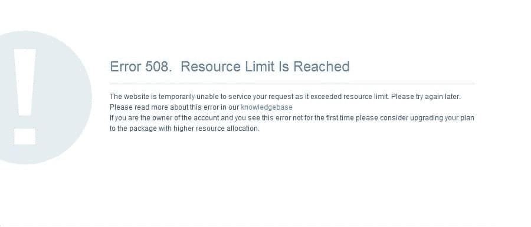
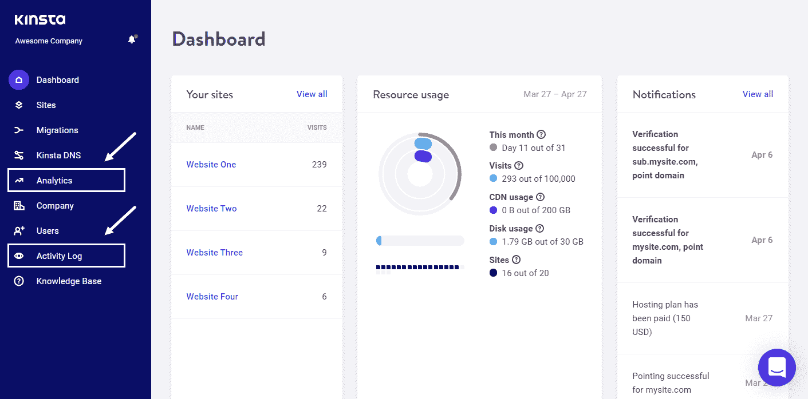

# 如何修复达到 508 资源限制错误

> 原文：<https://kinsta.com/blog/resource-limit-is-reached/>

遇到“错误 508。达到资源极限”会让你失去平衡。这不是一个常见的 HTTP 错误，但它可以使您的网站和 web 服务器无法访问。

但是不要担心。本文将解释什么是 HTTP 错误 508，如何对它进行故障排除，以及可以采取的预防措施，以确保它不会再次发生。

我们开始吧！

### 查看[视频版本](https://www.youtube.com/watch?v=RF-uaZmVVrc)

## **什么原因导致“已达到 508 资源限制”错误？**

大多数 web 主机帐户都设置了资源限制。如果超过这个限制，就会触发“达到 508 资源限制”错误，并且[您的站点将暂时无法访问](https://kinsta.com/blog/website-downtime/#top-causes-of-website-downtime)。

The “Error 508 Resource Limit Is Reached” browser message. ([Source](https://www.namecheap.com/support/knowledgebase/article.aspx/9568/2194/my-website-is-down-what-to-do/))

此错误在服务器级别触发，可能由各种因素引起，包括服务器 CPU 和 RAM 资源的过度紧张。这通常还与对并发进程的高需求有关，如果您的站点经历异常高的流量，就会经常看到这种情况。

> 需要在这里大声喊出来。Kinsta 太神奇了，我用它做我的个人网站。支持是迅速和杰出的，他们的服务器是 WordPress 最快的。
> 
> <footer class="wp-block-kinsta-client-quote__footer">
> 
> 
> 
> <cite class="wp-block-kinsta-client-quote__cite">Phillip Stemann</cite></footer>

[View plans](https://kinsta.com/plans/)

网站流量激增也可能是企图进行 [DDoS 攻击](https://kinsta.com/blog/ddos-attack/)的结果。在这种情况下，一旦可用资源在攻击过程中耗尽，您的站点将触发“508 资源限制已达到”错误。但是，您可能不需要做任何事情来解决这个问题！

如果你认为网络流量的激增是一次性事件，那么你可能会选择等待，看看流量是否会下降。

如果你在一个[共享服务器](https://kinsta.com/blog/managed-wordpress-hosting/#shared-hosting)上，或者你已经订阅了一个[入门级主机包](https://kinsta.com/blog/cheap-wordpress-hosting/)，你更有可能会遇到这种类型的错误。如果是这种情况，您需要在短期内提高资源限制，以使您的网站恢复运行。

[这可能并不常见，但当 HTTP 错误 508 确实弹出时，它会给您的站点和 web 服务器带来重大问题。👀了解如何修复它就在这里⬇️ 点击推文](https://twitter.com/intent/tweet?url=https%3A%2F%2Fkinsta.com%2Fblog%2Fresource-limit-is-reached%2F&via=kinsta&text=It+might+not+be+common%2C+but+when+HTTP+Error+508+does+pop+up%2C+it+can+cause+major+problems+for+your+site+and+your+webserver.+%F0%9F%91%80+Learn+how+to+fix+it+right+here+%E2%AC%87%EF%B8%8F&hashtags=WordPress%2CWPTips)

## **如何修复“已达到 508 资源限制”错误**

当流量高于预期时，您的站点可能会很快超出分配的资源，导致您的服务器陷入停顿。

### **检查您的资源使用情况**

修复资源限制错误的第一件事是检查资源使用情况。一定要查看服务器活动日志。这将有助于确定问题的根本原因。

如果你是 Kinsta 的客户，那么你可以很容易地查看资源使用和活动日志。

The Analytics and Activity Log menu items in MyKinsta.

登录您的 [MyKinsta 仪表盘](https://kinsta.com/mykinsta)，选择您希望查看的网站。您可以通过**分析**菜单查看资源使用情况，通过**活动日志**菜单查看活动日志。

还有[额外的工具和方法](https://kinsta.com/blog/disk-usage-wordpress/)可以用来补充这一点。

请记住，你所看到的强加在你的网站上的限制将会比保持网站运行所需的限制略少。

这是为什么呢？

## 注册订阅时事通讯

### 想知道我们是怎么让流量增长超过 1000%的吗？

加入 20，000 多名获得我们每周时事通讯和内部消息的人的行列吧！

[Subscribe Now](#newsletter)

假设您的网站与许多其他客户和他们的网站位于一个共享服务器上(记住，Kinsta 不会出现这种情况)。随着您的网站开始吸引更多的流量，托管所有这些网站(包括您的网站)的服务器正在处理越来越多的请求，以适应您不断增长的流量。

如果你的流行趋势继续下去，服务器最终会达到它托管的每个站点的资源极限，包括你的。您可以及早发现这一趋势，以防止停机。一个好的主机提供商会密切关注流量。你的虚拟主机应该[联系你，警告你](https://kinsta.com/help/overages/)如果你的网站继续以高于你的计划允许的速度消耗资源，它将关闭。

### **检查您网站上运行的内部流程和第三方代码**

“达到 508 资源限制”错误的原因可能不总是外部的。资源可能会被站点内部运行的一个或多个流氓进程过度消耗，例如:

*   [站点备份](https://kinsta.com/help/wordpress-backups/#wordpress-backups)
*   [克朗乔布斯](https://kinsta.com/help/how-to-write-a-cron-job/)
*   冗长或复杂的数据库查询
*   运行有害脚本的[被黑网站](https://kinsta.com/blog/wordpress-hacked/)
*   第三方代码

在第三方代码的情况下，这通常可以归结为特定的[内容管理解决方案(CMS)](https://kinsta.com/blog/cms-software/) 扩展。例如，如果你正在运行 WordPress，并且安装了一个或多个[插件](https://kinsta.com/knowledgebase/how-to-install-wordpress-plugins/)，这些插件经常消耗多于分配的资源，那么你迟早会遇到 508 错误。

为了避免这种情况，保持你的 CMS 扩展为最新是明智的。对于 WordPress，这意味着保持你的主题和插件[更新到最新版本](https://kinsta.com/knowledgebase/manually-update-wordpress-plugin/)。

如果某个特定的主题或插件暂时没有可用的更新，那么考虑停止使用它，转而使用一个类似的、最近更新的产品，或者联系作者检查新版本是否即将推出。

### 停用你站点的所有扩展，然后逐个启用它们

可能是你的某个 CMS 扩展消耗了过多的服务器资源——在这种情况下，你应该尝试禁用它们。如果错误消失了，那么您的怀疑就被证实了——扩展是罪魁祸首。

需要一个给你带来竞争优势的托管解决方案吗？Kinsta 为您提供了令人难以置信的速度、一流的安全性和自动伸缩功能。[查看我们的计划](https://kinsta.com/plans/?in-article-cta)

从停用站点的扩展开始。

一旦所有的扩展被停用，重新激活他们一次一个，每次重新测试您的网站，以确定罪魁祸首。您的下一步行动应该是联系扩展作者来报告这个问题。如果扩展维护得很好，它的作者应该会给你一个可行的解决方案。

### **停用您的儿童主题**

最后，如果你正在使用一个 [WordPress 子主题](https://kinsta.com/blog/wordpress-child-theme/)，你应该检查对它所做的改变，看看它们是否会导致任何问题。您可以通过暂时切换到父主题来快速测试这一点。

### **联系支持人员**

如果以上方法都不能帮助你找出资源使用增加的原因，你应该[联系你的网络主机支持团队](https://kinsta.com/kinsta-support/)并向他们询问更多详细信息。金斯塔的支持团队在[全天候待命](https://kinsta.com/kinsta-support/)。

## **预防措施**

作为一种预防措施，注意服务器资源的使用是一个好主意。这将给你一个机会，让你在任何可能导致你的网站瘫痪的潜在问题面前抢先一步。

自我维护是一种明智的方法，有助于随着网站的成长和成熟控制托管成本，同时确保网站的停机时间最小化。理想情况下，您会希望保持在分配的资源限制以下，以降低风险。

许多附加应用程序可以帮助您跟踪网站的使用情况。在决定如何监控你的站点时，一个[应用性能监控工具](https://kinsta.com/blog/application-performance-monitoring/)(比如 [Kinsta APM](https://kinsta.com/apm-tool/) )应该是首要考虑的因素。

如果你正在进行任何促销或营销活动，那么期待并[准备好网站流量](https://kinsta.com/clients/dartdrones-shark-tank-effect/)的增加。这有助于理解你的主机提供商[如何统计你网站的访问量](https://kinsta.com/knowledgebase/count-visits/)。在大多数情况下，你不一定会看到大规模的流量高峰，但尝试和预测你是否有可能接近你的极限仍然是明智的。

此外，确保您的联系方式(电话和电子邮件)始终是最新的。这样，你就不会错过任何资源使用警报。

为了省心起见，我们建议投资一个专用的网络服务器，或者——除此之外——一个更高的初始资源分配，比如使用 [Kinsta 的磁盘空间插件。拥有这种灵活性将会花费更多，但是你的网站瘫痪的几率将会下降到几乎为零。](https://kinsta.com/help/disk-space-add-on/)

[Don't let an HTTP Error 508 message ruin your day. 😥 With these quick tips you can troubleshoot it and take preventative measures to stop it from happening again👇Click to Tweet](https://twitter.com/intent/tweet?url=https%3A%2F%2Fkinsta.com%2Fblog%2Fresource-limit-is-reached%2F&via=kinsta&text=Don%27t+let+an+HTTP+Error+508+message+ruin+your+day.+%F0%9F%98%A5+With+these+quick+tips+you+can+troubleshoot+it+and+take+preventative+measures+to+stop+it+from+happening+again%F0%9F%91%87&hashtags=WPTips%2CWordPress)

## **总结**

当您的站点遇到“达到 508 资源限制”错误时，这可能是一个挑战。你会想让一切尽快恢复正常。为了防止将来再次发生这种错误，您应该:

*   通过检查导致高资源使用率的原因来解决当前问题
*   提高网站的资源限制，考虑未来的增长和流量

更多信息，请查看 Kinsta 如何通过[谷歌云基础设施](https://kinsta.com/blog/google-cloud-hosting/)和[隔离软件容器](https://kinsta.com/knowledgebase/shared-vps-dedicated-hosting/)为每个站点做不同的事情。

* * *

让你所有的[应用程序](https://kinsta.com/application-hosting/)、[数据库](https://kinsta.com/database-hosting/)和 [WordPress 网站](https://kinsta.com/wordpress-hosting/)在线并在一个屋檐下。我们功能丰富的高性能云平台包括:

*   在 MyKinsta 仪表盘中轻松设置和管理
*   24/7 专家支持
*   最好的谷歌云平台硬件和网络，由 Kubernetes 提供最大的可扩展性
*   面向速度和安全性的企业级 Cloudflare 集成
*   全球受众覆盖全球多达 35 个数据中心和 275 多个 pop

在第一个月使用托管的[应用程序或托管](https://kinsta.com/application-hosting/)的[数据库，您可以享受 20 美元的优惠，亲自测试一下。探索我们的](https://kinsta.com/database-hosting/)[计划](https://kinsta.com/plans/)或[与销售人员交谈](https://kinsta.com/contact-us/)以找到最适合您的方式。