# 如何修复错误:“无法安装软件包。主题缺少 style.css 样式表"

> 原文：<https://kinsta.com/blog/the-package-could-not-be-installed/>

你为你的 WordPress 站点下载了一个[漂亮的新主题](https://kinsta.com/best-wordpress-themes/),并试图将它上传到 WordPress 仪表盘。不幸的是，主题安装失败，并显示以下错误:“软件包无法安装。主题缺少 style.css 样式表。

在本文中，我们将探讨这个错误的原因以及如何解决它。我们还将向你展示如何通过对 WordPress 文件结构的基础的深入理解，以及通过帮助你确保你首先上传的是正确的文件，来避免将来出现这种错误。

开始吧！

### 更喜欢看[视频版](https://www.youtube.com/watch?v=tRIPzOIyiSk)？

## “无法安装软件包”错误出现在哪里？

这个特殊的主题上传错误显示在 WordPress 仪表盘中的**外观** > **主题** > **添加新的** > **上传主题**。

它主要发生在你点击**选择文件**按钮，选择一个要上传的文件，然后点击**立即安装**按钮之后。简而言之，这个错误是**添加主题**模块独有的，所以你不应该在 WordPress 的其他地方看到它。

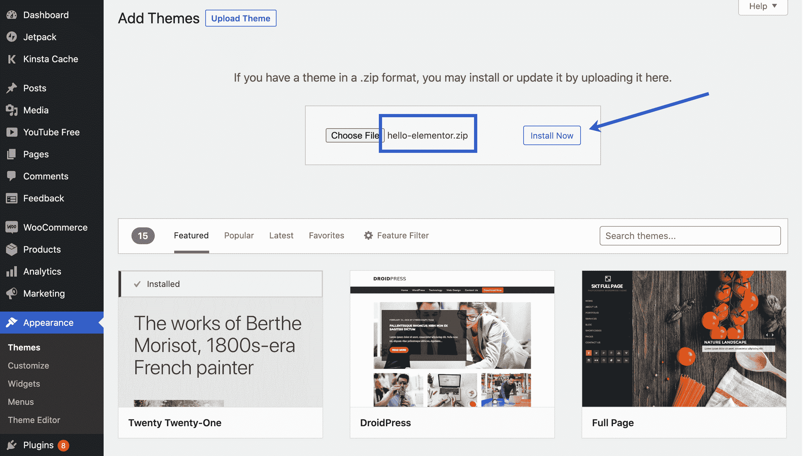

Click the “Install Now” button.

错误文本本身，即“无法安装软件包。主题缺少 **style.css** stylesheet ，它被放在主题安装状态消息中，就在另一条消息告诉您“主题安装失败”之前

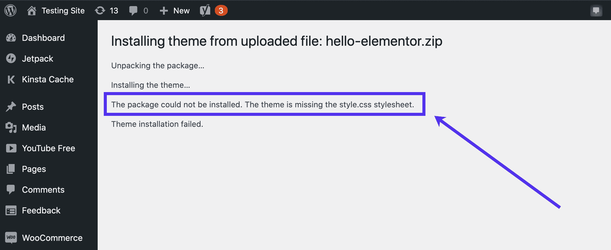

The missing stylesheet error.

## 当您看到“无法安装软件包”错误时，会发生什么情况？

这是少有的一次，电脑屏幕上的一个错误几乎准确地告诉你正在发生什么。第二行声明:“主题缺少 style.css 样式表。”

简而言之，你试图通过上传到你的 WordPress 仪表盘来安装一个 WordPress 主题。它包含一个. zip 文件，其中填充了一个复杂的主题文件目录,该目录包含代码、样式表以及管理和呈现你的仪表板、前端界面和许多其他 WordPress 元素的职责。

这个错误特别表明，要么是 **style.css** 样式表不在 WordPress 文件集合中，要么是 WordPress 很难找到样式表，因为你上传的文件不正确。

简而言之，错误的发生是因为它无法检测到 **style.css** 文件。它是由于以下原因之一而发生的:

*   因为主题开发者犯了一个错误，主题根目录中的 **style.css** 文件丢失了。
*   目录中缺少了 **style.css** 文件，因为您在某个时候不小心删除了它。
*   **style.css** 文件其实在根目录下，但是你还没有把目录正确上传到 WordPress。当你在上传前没有解压文件时，有时会发生这种情况。
*   你正试图上传一个不属于 WordPress 的文件——它可能根本不是主题文件。

### 什么是 style.css 样式表？

你的 WordPress 文件目录包含许多文档和文件夹，包括 PHP、CSS 和 HTML 代码。

CSS，或级联样式表，指的是一种与 PHP 和 HTML 结合使用的网页设计语言。CSS 的主要原因是用颜色、格式和字体将静态网页设计元素风格化。简单地说，CSS 让你的网站内容看起来很漂亮。

一个基本的例子是你网站上的一个简单的图片。HTML 只在样式方面做了这么多。尽管如此，CSS 通过将图像移动到页面上的任何位置、添加边距、填充、背景和许多其他元素来增强您的设计可能性，从而为您的内容提供更直观的方法。

然而， **style.css** 电子表格不能单独工作。它与 WordPress 中的所有目录交互，并且经常与其他编程语言一起工作以产生想要的结果。

要获得详细的指南，请阅读我们的文章。

### style.css 样式表应该在哪里？

样式表是所有 WordPress 主题的一部分。因为这是 WordPress 控制网站视觉设计和布局的主要方式，所以它是一个必需的文件。

这意味着无论何时购买或下载主题，都应该在主题文件中找到一个 **style.css** 样式表。

**注意:**通常要解压主题文件包才能查看主题文件。

例如，我们下载了 Hello Elementor 主题，打开主题文件显示文件和文件夹列表，包括 **style.css** 表单。

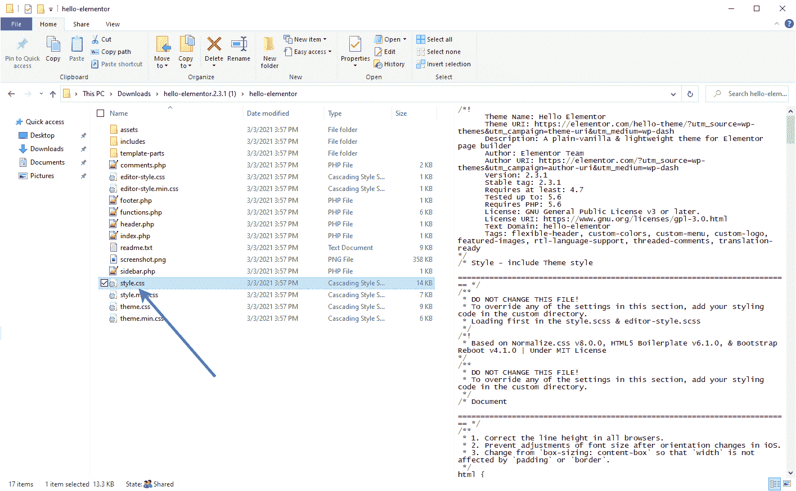

Finding the style.css stylesheet.

打开 **style.css** 表单显示其内容，从作者的主题名称等基本信息开始。您会注意到，它告诉您不要更改该文件的任何部分，因为许多主题更喜欢您在仪表板或另一个自定义目录中进行 CSS 修改。

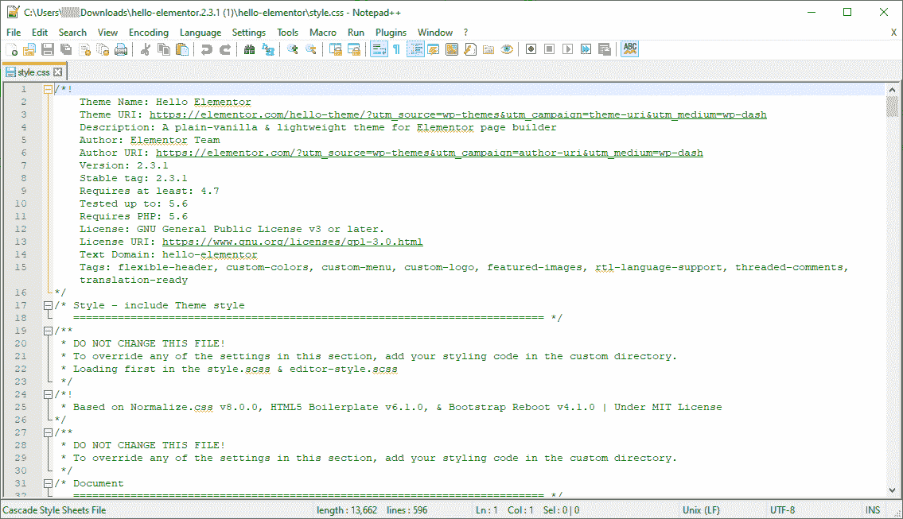

An open example of the style.css stylesheet.

向下滚动， **style.css** 样式表显示了一长串 [CSS 片段](https://kinsta.com/knowledgebase/edit-wordpress-code/)，所有这些组合在一起使你的主题看起来就像它那样。

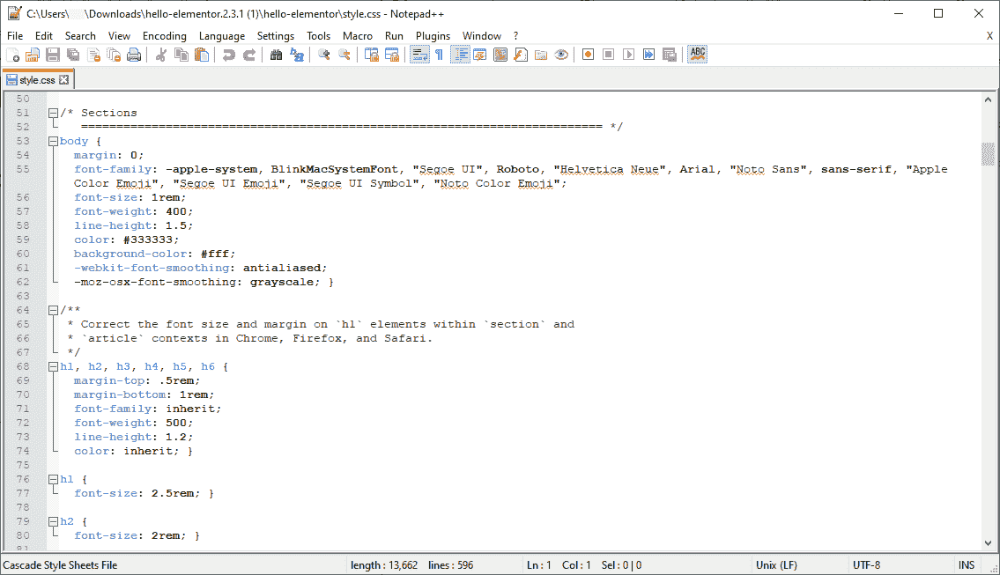

CSS code in the style.css stylesheet.

因此， **style.css** 样式表应该在每个主题文件目录中，通常位于其他 css 文件附近以及资产和模板文件夹附近。

## 看到“无法安装软件包”错误后会发生什么？

一个没有 **style.css** 样式表的主题文件夹是没有用的，至少在上传到 WordPress 和制作一个功能齐全的主题时是这样。

上传根目录是不可能的，因为没有 **style.css** 样式表，WordPress 会阻止所有上传文件的尝试。这样做的原因是因为一个丢失的样式表可能会破坏或损害整个 WordPress 基础设施。

此外，您还会收到错误消息:“无法安装软件包。主题缺少 **style.css** 样式表。

好消息是，之前在你的 WordPress 网站上激活的任何主题仍然存在。对你的网站没有任何损害，你也不能上传新的主题。

然而，你可能想要替换当前的主题，所以有必要通过下面的解决方案来替换旧的并安装新的主题。

## 如何修复“主题缺少 style.css 样式表”错误？

在这一节中，我们将概述出现缺少样式表错误的两个主要原因，以及如何解决这些问题的信息。

### 如何解决主题缺少 Style.css 文件的情况

一个丢失的 **style.css** 文件意味着两种情况之一:主题开发者(可能是你)没有将它包含在根目录中，或者你自己无意中删除了 style.css 文件。

对于第一种情况，我们建议采取以下行动:

1.  **联系主题开发者，通知他们问题:**虽然可能性不大，但可能是下载不好，或者开发者端的某人/某物出错了。声誉好的主题开发者应该会给你一个新的主题文件的快速响应。如果你是主题开发者，[请阅读这篇关于创建子主题的指南](https://kinsta.com/blog/wordpress-child-theme/)，尤其是关于制作样式表的[部分。](https://kinsta.com/blog/wordpress-child-theme/#the-stylesheet)
2.  寻找一个新的主题:考虑到一个优秀的主题开发者很少会错过最关键的部分，这很可能是最好的行动方案。也许你从一个粗略的来源或者一个正在学习如何编码的初学者那里下载了一个主题。

您可以添加一个 **style.css** sheet，但是这种做法违背了使用预制主题的初衷。更不用说，一个本来应该有样式表的主题，现在却没有了，就不能正常工作了。

### 如何解决 WordPress 无法识别 style.css 表单的情况

有时，当你试图在仪表板中上传主题目录中的 **style.css** 工作表时，WordPress 无法识别它。

原因如下:

*   你没有正确上传主题。
*   您必须从开发人员处解压缩原始文件，以显示主题文件。
*   主题文件不是为 WordPress 准备的。
*   该文件不是一个主题文件，而是其他东西。
*   **style.css** 不在根目录的正确位置。

其中一些原因可能看起来很简单，但通常最表面的原因会导致令人沮丧的问题。

请查看以下部分，了解如何根据根本原因解决这些情况。

#### 正确上传主题

您可能看到“无法安装软件包”的一个原因是。主题缺少 **style.css** stylesheet”错误是由于您上传主题文件的过程造成的。

一个新用户，甚至是一个有经验的用户，可能会不小心偏离上传主题文件的最佳步骤。

请阅读我们关于安装 WordPress 主题的指南，以确保你遵循正确的步骤。这篇文章涵盖了寻找最好的 WordPress 主题和安装方法，比如通过仪表板或 FTP。它也指导你通过稍微不同的方式安装免费和高级主题。

#### 查看主题文件是否需要解压缩

许多主题上传错误的发生是因为一个压缩的下载文件。对于认为 WordPress 只接受压缩文件的人来说，这有点令人困惑。

## 注册订阅时事通讯

### 想知道我们是怎么让流量增长超过 1000%的吗？

加入 20，000 多名获得我们每周时事通讯和内部消息的人的行列吧！

[Subscribe Now](#newsletter)

但是，有些主题开发者会在压缩文件中给你一个压缩文件，你必须解压原始包才能找到只包含主题内容的有效上传文件。

例如，你可能会发现一个主题开发者将其他文档打包到原始下载中，所以 WordPress 会查看所有这些内容，并想知道实际的主题文件在哪里。

虽然大多数著名的主题开发者都知道这种混乱，但是我们偶然发现了一种罕见的情况，你必须解压缩第一个主题下载才能看到用户手册和其他内容。

除了上一点中上传主题文件的错误方式之外，这是你在寻找其他方法之前应该解决的第一个问题，考虑到这是一个简单的解决方法，主题开发者做这个还是有点熟悉的。这也只有当你从第三方开发者那里购买一个主题时才会发生，就像 WordPress.org 主题库限制奇怪包装的主题文件一样。

因此，假设您从第三方开发者上传了一个压缩文件，却发现您收到了错误消息:“无法安装该包。主题缺少 **style.css** 样式表。

很有可能你所要做的就是解压主题开发者提供的原始文件，在其中提取另一个 zip 文件。

“The package could not be installed” error.

要解决这个问题，请转到您最初从主题开发人员那里下载的文件。

它很可能是一个 ZIP 文件，这对于作为主题上传到 WordPress 是有意义的，但是它可能包含额外的内容文件，使文件夹变得混乱，并使 WordPress 很难识别主题文件。

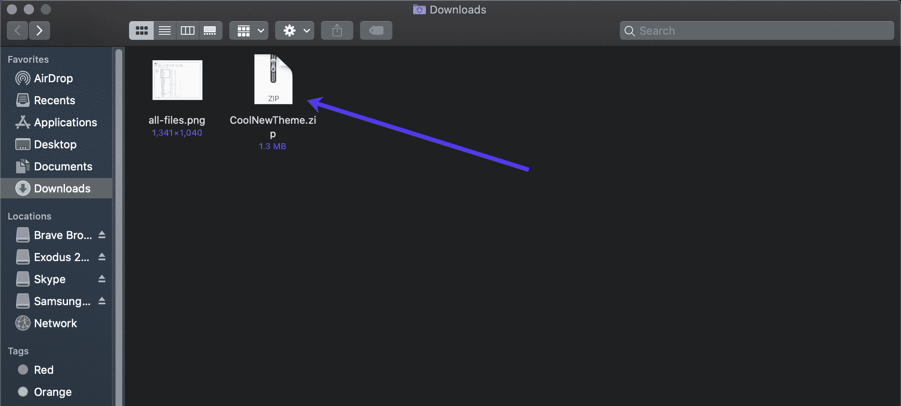

Find the theme’s zipped download file.

因此，打开或解压缩文件，提取其中的内容。这通常是通过右键单击并选择您喜欢的解压缩或存档工具。

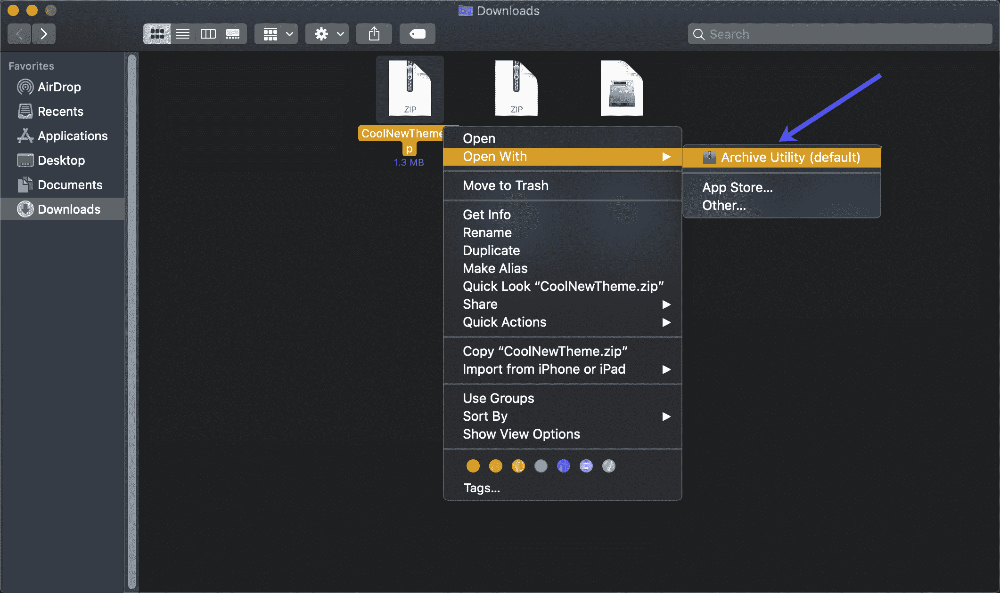

Unzip the downloaded theme package.

现在，打开解压后的文件以显示其内容。正如您在这个例子中看到的，主题开发者在主题下载的根目录中包含了一个 readme.txt 文件和另一个内容文件夹。他们在这个区域也有真正的压缩主题文件。这是你需要上传到 WordPress 的实际主题文件。

回到**外观** > **主题** > **添加新的** > **上传主题**从你的电脑中选择一个文件。然后，确保您选择了这个压缩的主题文件，没有任何额外的内容(比如本例中的 ReadMe 文档)。

The actual theme file.

请记住，您可能会完成这个故障诊断过程，并发现这不是一个奇怪的主题包装的问题。如果您在开发人员提供的原始主题包中没有看到压缩的主题文件，请考虑查看下面的其他故障排除提示。

#### 弄清楚主题文件是否是为 WordPress 准备的

许多网站主题存在于网上。你喜欢的主题设计并不少见，但当你购买后发现它实际上并不适合 WordPress。例如，ThemeForest marketplace 为各种内容管理系统和网站建设者出售网站模板，包括 Drupal、Joomla、 [Webflow](https://kinsta.com/blog/webflow-vs-wordpress/) 和 Shopify。

每个平台都有自己的主题根文件结构，所以 WordPress 会拒绝任何试图为 Bigcommerce 或 Magento 等其他系统上传主题的行为。

请记住，在这种情况下，您可能会看到“主题缺少 style.css 样式表”错误。毕竟，来自 Shopify 或 Drupal 的主题目录可能将其 **style.css** 表放在不同的地方。但是，您也可能会看到另一个错误。

厌倦了低于 1 级的 WordPress 托管支持而没有答案？试试我们世界一流的支持团队！[查看我们的计划](https://kinsta.com/plans/?in-article-cta)

至于修复这个问题，你要做的就是去掉不兼容的主题文件，选择一个新的。

将来，仔细看看所有的主题产品页面，确保它们是为 WordPress 而不是其他东西准备的。例如，大多数 theme forest——以及其他高级主题产品页面——会在页面上多次显示该主题所在的平台。查看页面上的类别、标题和图片。

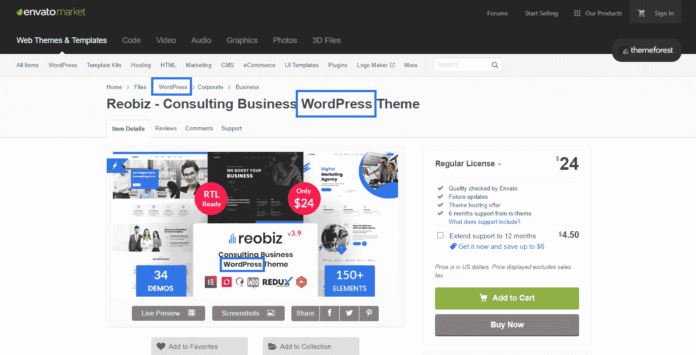

Seek out mentions of “WordPress” on product pages.

大多数主题销售者还包括一个关于该主题的软件类型或版本的区域。再次注意，WordPress 是列出的主要软件。

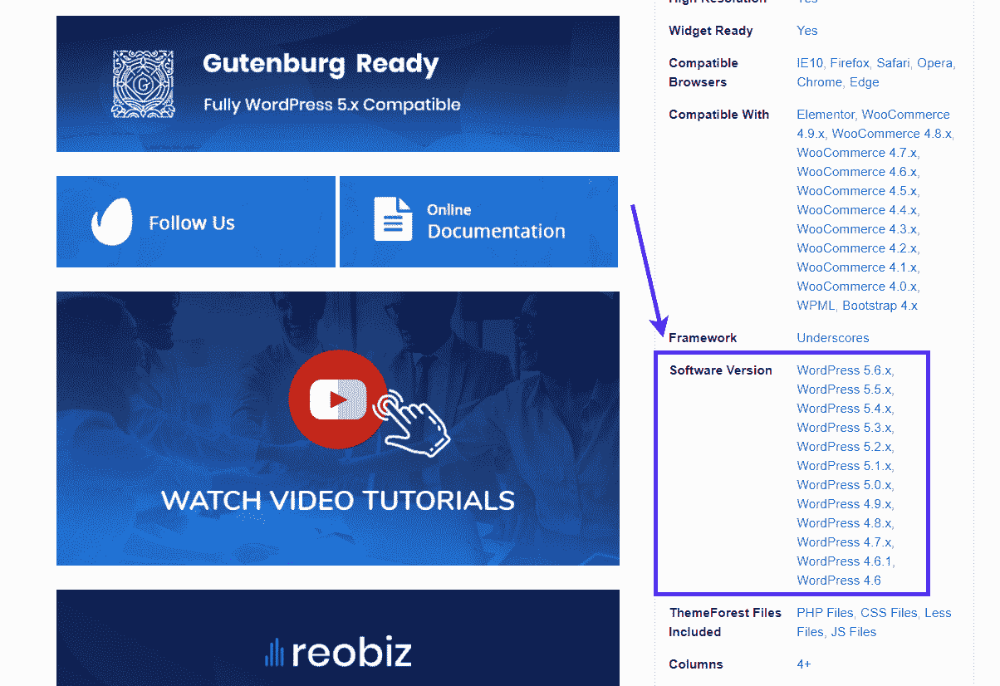

Check out the WordPress software version.

或者你可以坚持使用全 WordPress 库，比如 WordPress 主题目录。

如果你在网上找不到任何关于主题的信息，请查看主题目录。尽管每个 WordPress 主题目录都有不同的配置和文件，你可以通过寻找一些特定的文件来判断它是否是一个 WordPress 主题。

所有的 WordPress 主题在根目录中都有一个 **style.css** 表。您还应该看到像资产和模板潜在文件夹这样的文件夹。找出 index.php、、**、**等**、**的文件。你有时会在其他平台的主题中看到这些，但是它们通常被赋予不同的名称或者位于其他地方。****

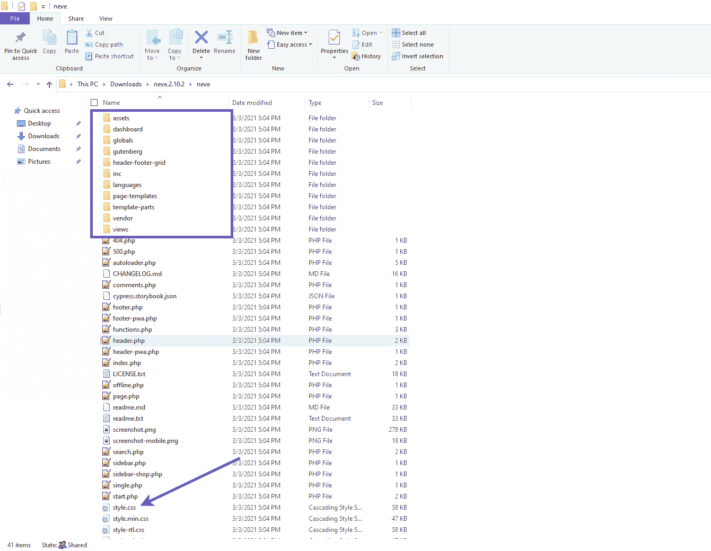

Make sure the stylesheet is in the right place.

#### 判断它是否是一个主题文件

你可以上传许多类型的压缩文件夹到 WordPress，有时很难看出它是不是主题文件。从表面上看，插件文件和主题文件没有什么不同。

对于来自另一个 WordPress 站点或 Tumblr 或 Blogger 等平台的站点导入文件，也可以这么说。你可能还会发现，你正试图上传一个 WooCommerce 产品或 WXR 文件，用于导入帖子和页面等项目。清单还在继续，但是想法是这些文件没有一个和 WordPress 主题文件是一样的。

因此，首先仔细检查你上传的内容是很重要的。你可以在电脑上点击一个名称相似的文件类型，或者你很难区分最近下载的插件文件和同一时间下载的主题文件。

避免这种情况的主要方法是当你保存和上传 WordPress 文件时，保持有条理和专注。请确保将主题文件保存在容易记住的位置，并在下载到电脑时知道文件的名称。

区分主题文件和其他面向 WordPress 的文件的另一种方法是了解每个文件的结构。

我们推荐阅读关于 WordPress 文件和使用它们的指南，特别是 T2 WordPress 主题目录部分。这样，你就积累了关于 WordPress 文件夹结构的知识，并且当你看到一个文件的内容时，你就能识别出它是做什么的。

对于这种情况，请打开您尝试上传的文件，并确保它看起来像一个主题文件。

假设我们有两个文件，我们不记得主题的具体名称。你可能很难决定这两个中的哪一个应该上传到 WordPress。我们知道其中一个是插件文件，另一个是主题文件。从拉开拉链开始，看看里面是什么。

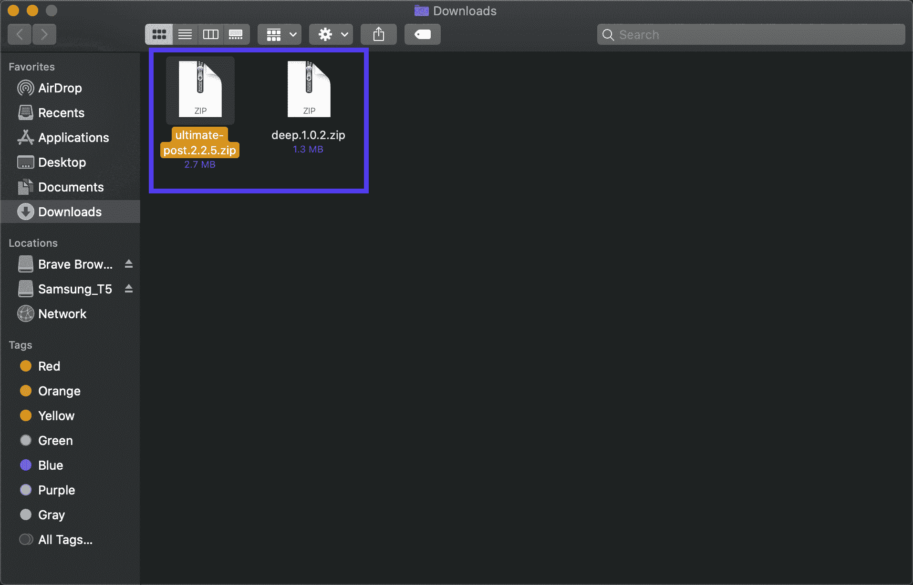

Deciding which file is for a theme.

分别打开每个文件来分析内容。

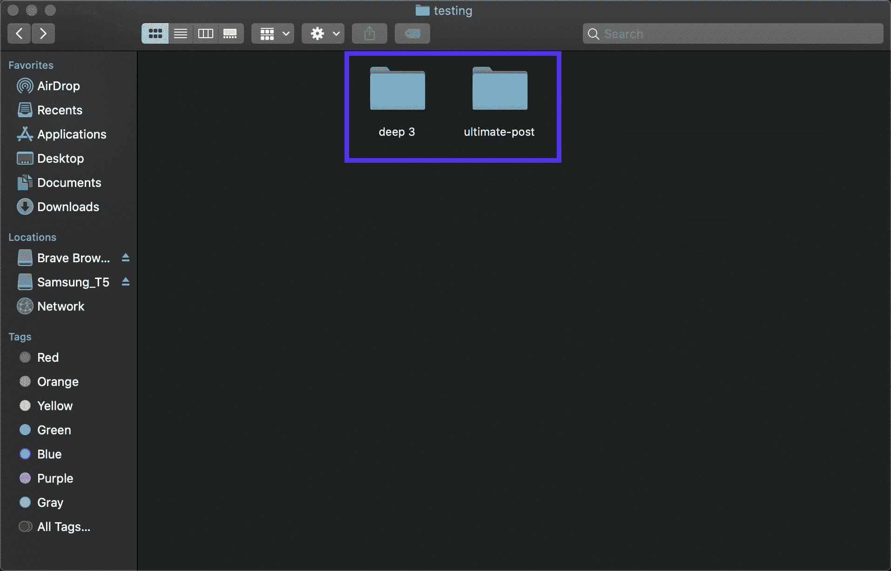

Open each file directory.

这个文件有像插件、资产、模块和类这样的文件夹。它不包括标准的主题文件夹和文件。尽管所有的插件文件看起来都有点不同，但可以肯定地说，这看起来更像是一个插件，而不是一个主题。

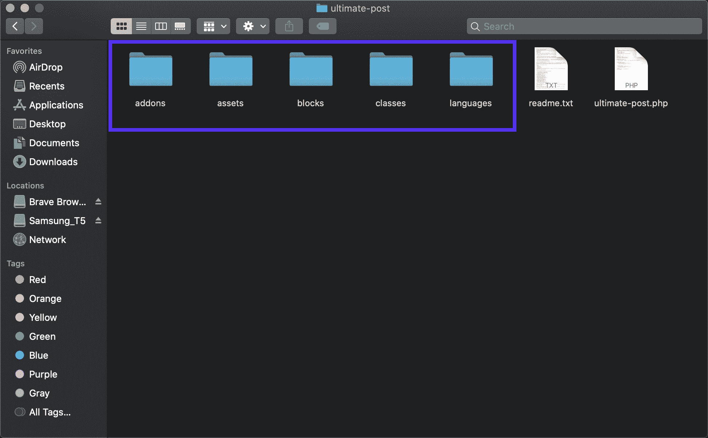

This directory looks like a plugin.

另一个文件展示了大量的文件夹和 PHP 文件。这个 **style.css** 文件就在里面，还有主题要点，比如 footer.php、**header.php**和**sidebar.php**。在主题文件中看到 CSS、字体和模板部件的文件夹也是相对常见的。

因此，这是我们正在寻找的主题文件，另一个是插件。将来，请留意主题文件的经典属性，以确保您上传了合适的文件。

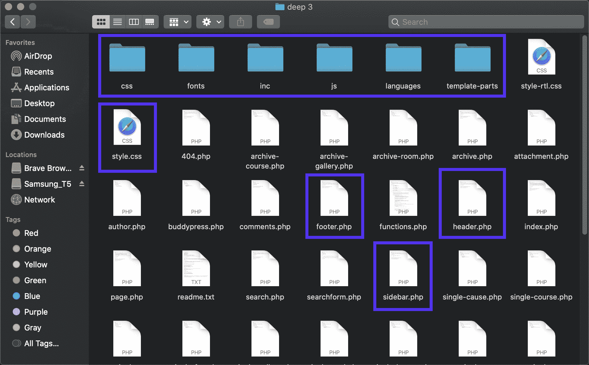

An example of a theme file.

#### 确保 style.css 文件位于正确的位置

无论是自己做的还是开发者做的， **style.css** 文件都有可能在正确的地方缺失。

为什么会出现这种情况并不重要，只是 WordPress 正在根目录中搜索 **style.css** 文件，它找不到它。

要解决这个问题，检查主题的根文件夹并寻找 **style.css** 文件。

我们打开了 TwentyTwenty 主题的根文件夹，但似乎没有显示出 **style.css** 样式表。有可能你在整理时无意中把它拖到了其他文件夹中，所以你至少应该花几秒钟点击这些文件夹，看看它是否在那里。

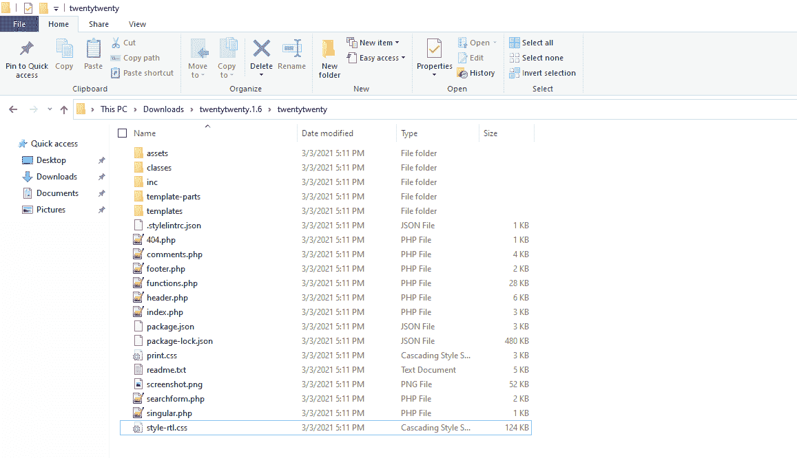

Root folder missing the stylesheet.

原来我们已经把它移到了**模板**文件夹中。如果 **style.css** 工作表不在根文件夹中，WordPress 可能很难识别它，所以把它移回它所属的根文件夹。

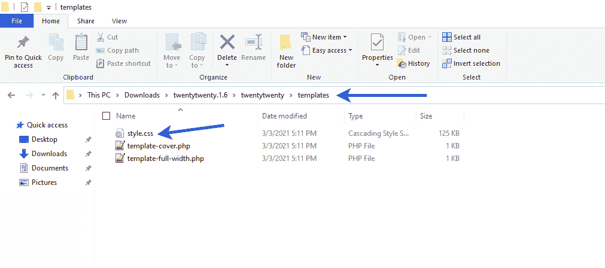

Stylesheet located in the wrong place.

[Don't let this common error slow down your site designing. ✨ Learn how to quickly resolve it (and prevent it from happening in the future!) with this guide 👇Click to Tweet](https://twitter.com/intent/tweet?url=https%3A%2F%2Fkinsta.com%2Fblog%2Fthe-package-could-not-be-installed%2F&via=kinsta&text=Don%27t+let+this+common+error+slow+down+your+site+designing.+%E2%9C%A8+Learn+how+to+quickly+resolve+it+%28and+prevent+it+from+happening+in+the+future%21%29+with+this+guide+%F0%9F%91%87&hashtags=WordPress%2CWPTips)

## 摘要

缺少 **style.css** 样式表错误源于一个有缺陷的主题文件，只有当你试图在 WordPress 的**添加主题**部分上传一个文件时，它才会出现。

看到该消息的主要原因包括:

*   **style.css** 文件丢失，原因是开发人员没有将它包含在目录中。
*   **style.css** 文件丢失，因为您不小心删除了它或将其移动到了其他地方。
*   你没有以正确的方式上传主题文件。
*   您必须解压缩文件，以显示开发人员给您的原始包中的实际主题文件。
*   主题文件不是为 WordPress 准备的，而是为 Shopify、Joomla 或 Drupal 等其他平台准备的。
*   该文件不是主题文件。它是其他的东西，比如一个插件文件，甚至是你电脑上的一个随机文件或压缩文件。

使用本指南解决您的主题文件问题，如果您仍有问题，请联系 Kinsta 客户支持。

* * *

让你所有的[应用程序](https://kinsta.com/application-hosting/)、[数据库](https://kinsta.com/database-hosting/)和 [WordPress 网站](https://kinsta.com/wordpress-hosting/)在线并在一个屋檐下。我们功能丰富的高性能云平台包括:

*   在 MyKinsta 仪表盘中轻松设置和管理
*   24/7 专家支持
*   最好的谷歌云平台硬件和网络，由 Kubernetes 提供最大的可扩展性
*   面向速度和安全性的企业级 Cloudflare 集成
*   全球受众覆盖全球多达 35 个数据中心和 275 多个 pop

在第一个月使用托管的[应用程序或托管](https://kinsta.com/application-hosting/)的[数据库，您可以享受 20 美元的优惠，亲自测试一下。探索我们的](https://kinsta.com/database-hosting/)[计划](https://kinsta.com/plans/)或[与销售人员交谈](https://kinsta.com/contact-us/)以找到最适合您的方式。