# Stripe 与 Braintree:为您的企业选择合适的支付解决方案

> 原文：<https://kinsta.com/blog/stripe-vs-braintree/>

选择支付处理器和网关是一项重大的商业决策。选择一个可靠的解决方案至关重要，这样你就不会在以后遇到问题。Stripe 和 Braintree 是最受欢迎的两个数字支付平台！

凭借透明的费用、令人印象深刻的反欺诈技术和全球覆盖，这是初创公司和成熟企业的两个最佳选择。

但是当 Stripe 和 Braintree 对决时，哪一个会胜出呢？

这就是我们将在本帖中发现的。

激动吗？让我们开始吧！

## Stripe 和 Braintree 是做什么的？

Stripe 和 [Braintree](https://www.braintreepayments.com/) 都提供在线工具帮助企业接收和处理支付。

这两家公司都是全栈支付平台，提供从支付处理和支付网关到商家账户的一切服务。

> Kinsta 把我宠坏了，所以我现在要求每个供应商都提供这样的服务。我们还试图通过我们的 SaaS 工具支持达到这一水平。
> 
> <footer class="wp-block-kinsta-client-quote__footer">
> 
> 
> 
> <cite class="wp-block-kinsta-client-quote__cite">Suganthan Mohanadasan from @Suganthanmn</cite></footer>

[View plans](https://kinsta.com/plans/)

无论选择哪一种，您都可以轻松地为在线列出的产品创建结账流程。他们实现了账单确认的自动化，并拥有先进的欺诈防范工具。

换句话说，他们提供了企业在线收款所需的一切。

[Choosing a payment processor and a gateway is a big business decision. 👩‍💻 This post makes it easier. See how Stripe and Braintree stack up so you can pick the right platform for your company.📈Click to Tweet](https://twitter.com/intent/tweet?url=https%3A%2F%2Fbit.ly%2F2RqJ6za&via=kinsta&text=Choosing+a+payment+processor+and+a+gateway+is+a+big+business+decision.+%F0%9F%91%A9%E2%80%8D%F0%9F%92%BB+This+post+makes+it+easier.+See+how+Stripe+and+Braintree+stack+up+so+you+can+pick+the+right+platform+for+your+company.%F0%9F%93%88&hashtags=Startup%2CStartupLife)

### Braintree 是支付处理器吗？

和你可能已经熟悉的 Stripe 一样，Braintree 帮助企业接受在线支付。[支付处理器](https://kinsta.com/blog/paypal-alternative/)是帮助促进从一个银行账户到另一个银行账户的资金交易的第三方。

这只是 Braintree 提供的服务的一小部分。

Braintree 处理完整的在线/电子商务支付周期:

*   它通过支付网关安全地收集和保存客户的信用卡信息。
*   网关分析潜在欺诈的数据。
*   最后，它处理信息并启动从相关银行账户/信用卡到您的商家账户的转账。

您可以稍后将平台上的商户账户余额转移到一个单独的银行账户。

Braintree 是处理和接受在线支付的完整解决方案。

### PayPal 和 Braintree 有什么区别？

Braintree 是 Paypal 的子公司，专注于支付网关、支付处理和商业账户。一般来说，它并不专注于点对点的资金转移或私人客户。

Braintree 帮助公司直接通过 Apple Pay、Venmo、信用卡等接收付款。

你不必重定向用户到贝宝的网站来完成他们的结帐。和 Stripe 一样，你可以直接在你的网站上安装它的支付网关。

### PayPal 拥有 Braintree 吗？

Braintree logo.

从它的官方 logo 你大概能看出来，答案是肯定的。

Paypal 在 2013 年收购了 Braintree 及其团队。从 2013 年到 2015 年，它是当时 Paypal 的母公司易贝的间接子公司。

但在分拆期间，Braintree 成立了新的独立 Paypal 实体。所以直到今天，它仍然是 Paypal 的直接子公司和密切合作伙伴。

### Stripe 与 Braintree:市场份额

这两种支付解决方案的最大区别之一是市场份额。根据 SimilarTech，一个追踪流行网站上使用的网络技术的网站，这些数字是非常不同的。

全球约有 25，000 家顶级网站和电子商务商店使用 Braintree。另一方面，Stripe 在全球有超过 660，000 个网站使用，使 [Stripe 的市场份额略低于 20%](https://kinsta.com/stripe-revenue/) 。

他们的流行趋势也有所不同。Stripe 的营销预算很大，集中精力扩张。他们呈上升趋势，并不断增加更多的用户。

布伦特里不太注重扩张，人气也慢慢下降。

但我们不要忘记，Braintree 的母公司 Paypal 拥有比 Stripe 更大的市场份额，其估值几乎是 Stripe 理论市值的两倍。

因此，布伦特里并不存在很快消失的风险。

## 定价、交易成本和费用

说到费用，布伦特里和 Stripe 实际上是一样的。大多数主要的信用卡、借记卡和数字钱包收取 2.9%的费用，外加每笔交易 0.30 美元的固定费用。

与布伦特里的母公司 Paypal 不同，布伦特里和 Stripe 都没有提供小额支付的具体费率。

但是让我们更深入一点。

这两家公司中有没有隐藏的费用或交易成本会影响平衡？

### 布伦特里

Braintree 在其网站上提供了有关其定价和收费政策的详细信息。如果你使用它的商业帐户，没有经常性或一次性的费用来建立一个帐户。

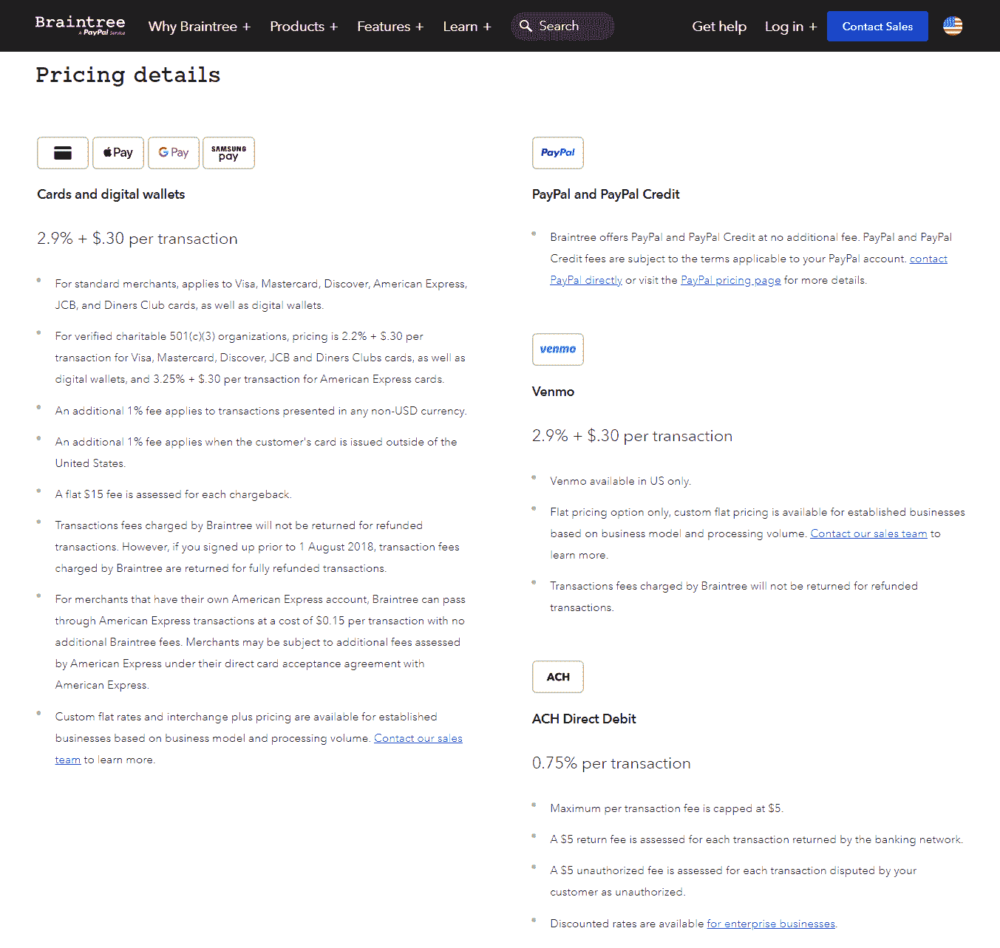

Braintree pricing details.

如你所见，标准费用涵盖了大多数交易——从 Venmo 和其他数字钱包到大多数主要信用卡。

国际信用卡和货币各加收 1%的费用。这使得以另一种货币进行国际支付的总费用为每笔交易 4.9%+0.30 美元。

**一般费用** **:** 所有信用卡和支付方式的 2.9% + $0.30。

*   非美国货币+1%，美国境外信用卡+1%
*   ACH 付款的 0.75%，上限为 5 美元

### 种类

Stripe 还在其网站上分享了深入的支付处理费用信息。使用 Stripe 处理您的付款，无需安装成本或每月重复费用。

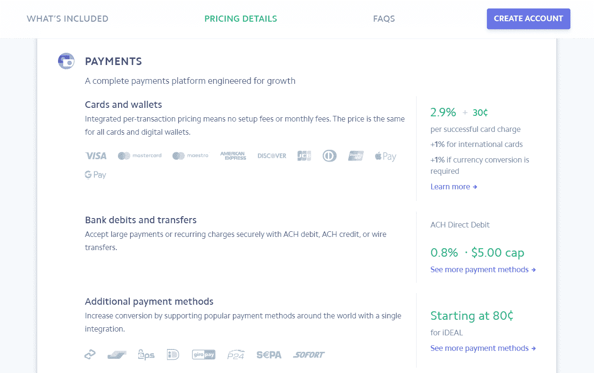

Stripe pricing details.

同样，标准费用适用于大多数主要信用卡、Apple Pay 和其他数字钱包。

与布伦特里一样，Stripe 也对国际转账收取额外费用。国际卡和货币各加收 1%的费用。同样，用另一种货币进行国际支付的总费用是每笔交易 4.9%+0.30 美元。

**一般费用:**所有信用卡和支付方式的 2.9% + $0.30。

*   非美国货币+1%，美国境外信用卡+1%。
*   0.80%的 ACH 付款上限为 5 美元。

**获胜者:**都不是

从技术上来说，Braintree 的费用较低，在 ACH 直接银行转账中有 0.05%的差异，但这一金额对于大多数电子商务商店和在线业务来说可以忽略不计。

即使你有一个当地的企业，你的发票更喜欢 ACH 付款，5 美元的上限基本上意味着你将支付更大的发票的确切费用。

## 争议和退款费用

当涉及到电子商务时，争议和退款是一个不幸的现实。这不仅冻结了交易的初始资金，而且大多数支付处理器还向商家收取额外的费用。

通常，拒付发生在信用卡欺诈和未授权支付的情况下。无论支付网关的反欺诈算法有多先进，都不可能消除争议。

虽然 Braintree 是一家 Paypal 公司，但它的退款费用便宜 5 美元，每笔交易 15 美元。

这与 Stripe 的争议费相同，也是每笔交易 15 美元。

**扣款费用:**

*   条带化 **:** $15 退款
*   布伦特里 **:** $15 退款

虽然两者都比 Paypal 便宜，但 15 美元仍占电子商务交易的 90%以上。答案是从一开始就防止欺诈交易的发生。

Stripe 提供了名为 [Stripe Radar](https://stripe.com/radar) 的下一级反欺诈解决方案，我们已经在 Kinsta 进行了深入测试。它帮助我们[将欺诈性付款和退款减少了 98%](https://kinsta.com/blog/credit-card-fraud-stripe/) ！

Braintree 还提供[欺诈保护](https://www.braintreepayments.com/features/fraud-tools)，欺诈损失平均减少 60%。

**获胜者:**条纹

由于费用是相同的，这归结于他们的欺诈保护工具的质量。最后，15 美元比大多数交易费都要多。

这不是你想为最终甚至没有实现的付款支付的东西。如果你出售实物产品，你还会有额外的运输和产品成本损失。

这就是为什么 Stripe 的欺诈保护 Radar 让他们走在了前面。由于拥有更大的客户群，他们拥有比 Braintree 更广泛的数据集，因此能够产生更好的结果。

它几乎消除了 Kinsta 的欺诈性付款问题，也可以帮助您的业务。

## 退票费

经营企业的另一个现实是，有时你不得不退款。您的产品可能没有库存，或者您可能无法将产品运送到客户所在地。

谢天谢地，无论是 Stripe 还是 Braintree，退款都是免费的。坏消息是他们也不退原来的加工费。

*   **Stripe:** 退款不收手续费，但不退原交易手续费。
*   **Braintree:** 退款不收取任何费用，但不退还原交易费用(除非您的账户日期早于 2018 年 8 月)。

**获胜者:**都不是

除非你在一年前注册了 Braintree，否则在这个类别中没有明确的赢家。

## 支持的国家和货币

接下来，让我们看看每个提供商支持世界上的哪些国家。请注意，这些国家是企业可以设立商家账户的国家，而不是你可以接受付款的国家。

### 条纹:可用国家

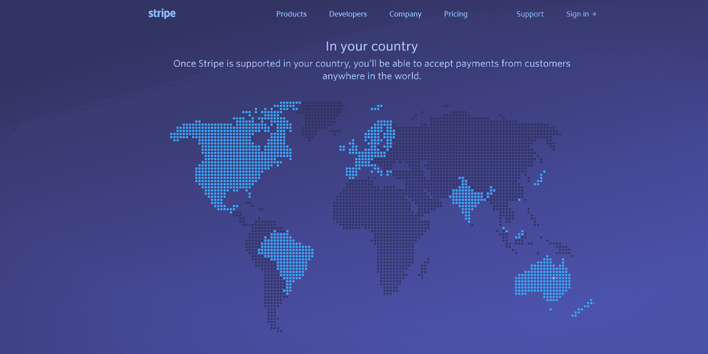

Stripe’s available countries world map.

Stripe 商户帐户在以下国家可用*:

*   澳大利亚
*   奥地利
*   比利时
*   巴西(预览)
*   保加利亚
*   加拿大
*   塞浦路斯
*   捷克共和国
*   丹麦
*   爱沙尼亚
*   芬兰
*   法国
*   德国
*   直布罗陀(凭邀请函)
*   希腊
*   香港
*   匈牙利
*   印度(预览)
*   爱尔兰
*   意大利
*   日本
*   拉脱维亚
*   列支敦士登(仅限受邀者)
*   立陶宛
*   卢森堡
*   马来西亚
*   马耳他
*   墨西哥
*   荷兰
*   新西兰
*   挪威
*   菲律宾(仅限受邀者)
*   波兰
*   葡萄牙
*   罗马尼亚
*   新加坡
*   斯洛伐克
*   斯洛文尼亚
*   西班牙
*   瑞典
*   瑞士
*   阿拉伯联合酋长国(凭邀请函)
*   联合王国
*   美国

**请注意，在这些国家，您可以开设商家账户。您仍然可以接受来自世界任何地方的付款，只要他们使用支持方法和货币。*

Stripe 在大多数西欧国家、美国、加拿大、澳大利亚和少数亚洲国家有售。

### 布伦特里:可用国家

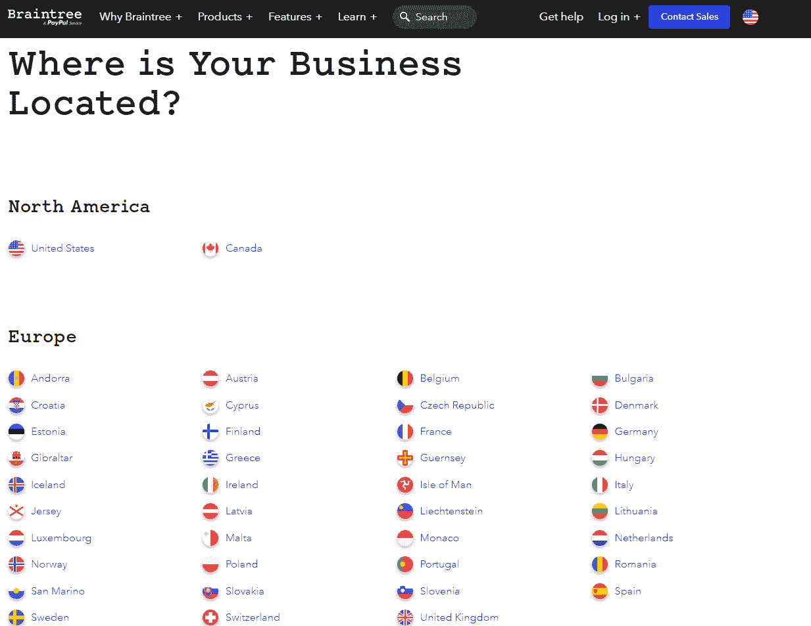

Braintree—Available countries list.

您可以在以下国家注册并使用 Braintree 进行支付处理*:

*   安道尔
*   澳大利亚
*   奥地利
*   比利时
*   保加利亚
*   加拿大
*   克罗地亚
*   塞浦路斯
*   捷克共和国
*   丹麦
*   爱沙尼亚
*   芬兰
*   法国
*   德国
*   直布罗陀
*   希腊
*   根西岛
*   中国香港特别行政区
*   匈牙利
*   冰岛
*   爱尔兰
*   马恩岛
*   意大利
*   泽西岛
*   拉脱维亚
*   列支敦士登
*   立陶宛
*   卢森堡
*   马来西亚
*   马耳他
*   摩纳哥
*   荷兰
*   新西兰
*   挪威
*   波兰
*   葡萄牙
*   罗马尼亚
*   圣马力诺
*   新加坡
*   斯洛伐克
*   斯洛文尼亚
*   西班牙
*   瑞典
*   瑞士

**请注意，在这些国家，您可以开设商家账户。您仍然可以接受来自世界任何地方的付款，只要他们使用支持方法和货币。*

**赢家**:都不是

Braintree 对欧洲的覆盖更好，Stripe 正在向南美和中亚扩张。

请记住，支持的国家列表指的是商家账户。Stripe 和 Braintree 在美国、加拿大和大多数欧洲国家都有销售。

只要使用受支持的支付方式和货币，商家就可以接受世界上任何国家的支付。

因此，除非你的企业在较小的欧洲国家(仅限布伦特里)或巴西(仅限 Stripe)，否则这里没有明显的赢家。

### 支持的货币

Stripe 和 Braintree 都支持世界上大多数稳定的货币。从 AED 到 ZWD，两家公司都在其网站上列出了 135 种以上受支持的货币。

不管你是否需要或想要接受津巴布韦元的支付，你可能不会面临来自国际客户的任何问题。

**获胜者:**都不是

Stripe 和 Braintree 都支持多种货币。99%的在线企业对这两种选择都不会有问题。

## 经常性付款和其他付款计划

因此，我们知道，您可以选择任何一种货币进行一次性支付。

但是，经常性付款、账单和付款计划呢？

### 种类

Stripe 有一个单独的计费解决方案，在第一个 100 万美元后，您可以额外收取 0.5%的定期付款费用。

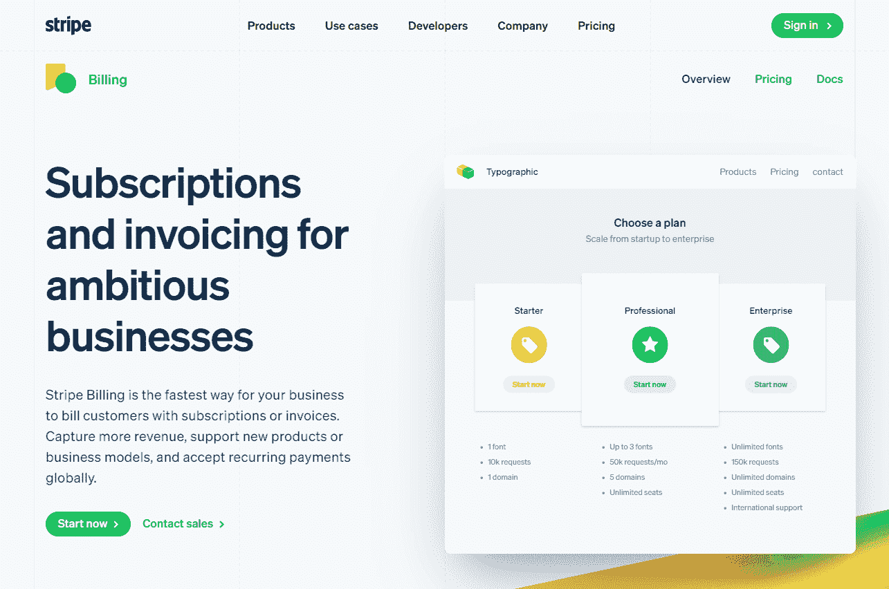

Stripe Billing page.

它会自动发送每月，每季度，或每年的发票给客户或客户注册。

自动发票对账从每张发票 7 美元的固定费用开始。您也可以使用条纹计费发送一次性发票。

为了[创建一个分期付款计划](https://stripe.com/docs/billing/subscriptions/subscription-schedules)，你需要安装一个 webhook 并定制开发与 Stripe API 一起工作的代码。

### 布伦特里

有了 Braintree，您可以设置[重复计费](https://articles.braintreepayments.com/guides/recurring-billing/plans)，而无需注册单独的服务。

创建计划时，您可以选择付款周期数，无需任何自定义开发。这意味着您可以轻松制定支付计划，而无需 API、webhooks 或定制开发。

**获胜者:**布伦特里

条带计费提供了一个完整的计费解决方案，但每笔交易需要额外的费用。使用 Braintree，您可以轻松创建付款计划，无需自定义编码。

## 付款方式比较

现在是支付方式摊牌的时候了。哪种服务可以接受最多的信用卡、数字钱包和其他支付解决方案？

### 种类

首先，让我们仔细看看 Stripe 接受的支付方式。它接受所有主要的信用卡和一系列数字钱包。

## 注册订阅时事通讯

### 想知道我们是怎么让流量增长超过 1000%的吗？

加入 20，000 多名获得我们每周时事通讯和内部消息的人的行列吧！

[Subscribe Now](#newsletter)

**支持条纹的信用卡:**

*   美国运通
*   银行卡
*   中国银联(银联杯)
*   发现和用餐者
*   Interac
*   日本信用局
*   万事达信用卡
*   签证

**支持条纹的数字钱包:**

*   支付宝
*   Apple Pay
*   点击播放
*   google play
*   GrabPay
*   微软支付

Stripe 还支持 ACH 传输和其他选项。

### 布伦特里

现在让我们深入了解一下 Braintree 支持的支付方式。它接受所有主要的信用卡，Venmo，Paypal 和一系列数字钱包。

**布伦特里支持的信用卡:**

*   美国运通
*   中国银联(银联杯)
*   用餐者
*   发现
*   日本信用局
*   艺术大师
*   万事达信用卡
*   签证

**布伦特里支持的数字钱包:**

*   Apple Pay
*   点击播放
*   google play
*   贝宝
*   三星支付
*   文莫

Braintree 还支持 ACH 转移和其他选项。

这两种选择涵盖了美国所有领先的信用卡提供商。

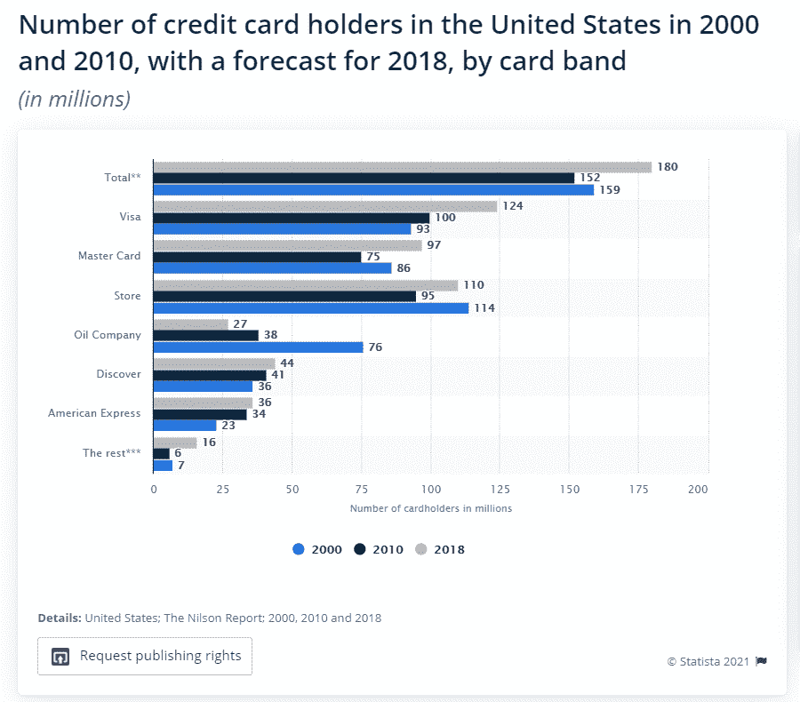

The leading US credit card companies. ([Source](https://www.statista.com/statistics/605634/leading-credit-card-companies-usa-by-number-of-card-holders/))

如你所见，这两家供应商涵盖了美国所有主要的信用卡，即 Visa、Mastercard、Discover 和 American Express。他们支持的信用卡比美国公民还多。

他们也支持日本领先的信用卡 JCB 和中国主要的银联。

**获胜者**:布伦特里

Stripe 和 Braintree 支持相同的数字钱包，如 Apple Pay、Google Pay、Paypal 和 Venmo。有了支付宝，Stripe 更适合有许多中国客户的企业，而 Braintree 可能会因为 Samsung Pay 而吸引以移动用户为主的客户。

Stripe 支持更多美国商户的信用卡，而 Braintree 在欧洲的覆盖更好，包括 Maestro。请注意，Braintree 可能需要额外的流程来接受美国运通的国际交易。

## 结账体验和用户友好性

对于供应商来说，几乎没有什么比支付处理的结账体验更重要的了。

出色的结账体验有助于减少[放弃购物车](https://kinsta.com/blog/shopping-cart-abandonment/)，额外的步骤会让你损失很大一部分销售额。

幸运的是，您可以使用这两种解决方案轻松创建用户友好的结账体验。

### 条带检出示例:Kickstarter

[Kickstarter](https://www.kickstarter.com/) 在现场实现了 Stripe 支付网关，这意味着在结账时没有离开他们网站的重定向。

结帐页面的设计易于理解和使用。

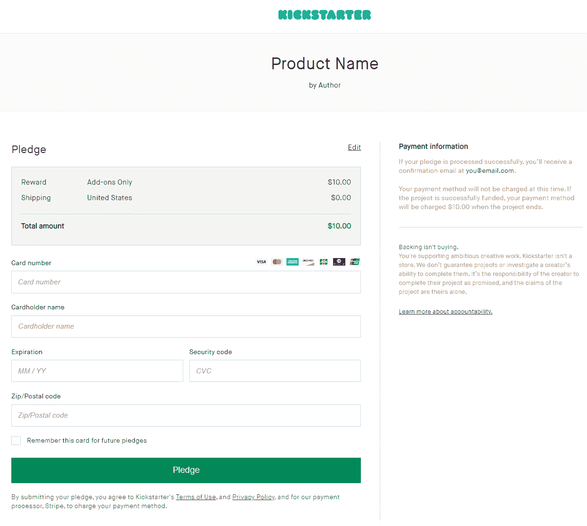

Kickstarter checkout page.

如果你曾经在 Kickstarter 上支持过任何东西，你就已经用过 Stripe 了。

填写所需信息，然后进行结帐。确认您的订单，Stripe 将处理您的信用卡。

订单确认后，它会将您重定向到确认页面。(或者，在许多情况下，确认显示在您进行购买的同一页面上。)

这再简单不过了。

### 布伦特里检验示例:Bon-Ton

Paypal 的结账流程以将用户重定向到 Paypal 的网站并要求用户登录或注册而闻名。

而 Braintree 的支付网关却不是这样。

虽然你可以选择在结账页面上提供一键式 Paypal 按钮，但主要选项将是信用卡支付。

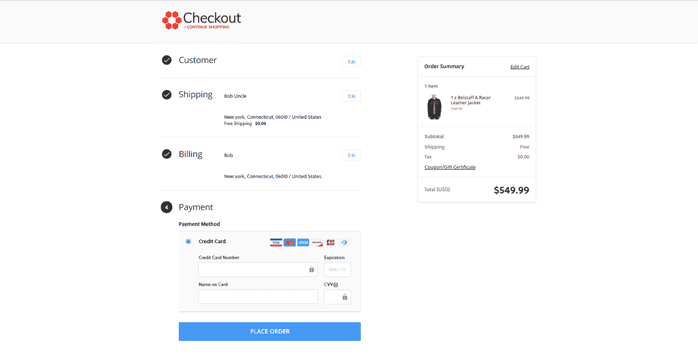

Bon-Ton checkout page.

从 [Bon-Ton](https://www.bonton.com/) 的结账页面可以看到，你可以输入信用卡信息，而不会弹出或重定向。

这与 Stripe 在结账过程中采用的方法相同。我们没有发现这两个选项在用户体验上有任何明显的差异。

**赢家**:都不是

虽然 Paypal 和 Stripe 的结账体验有着明显的差异，但 Braintree 却是另一番景象。

需要一流的，快速的，安全的主机为您的新电子商务网站？Kinsta 提供超快的服务器和来自 WooCommerce 专家的 24/7 世界级支持。[查看我们的计划](https://kinsta.com/plans/?in-article-cta)

您可以让用户留在您的网站上，甚至保存信用卡数据，而无需自己处理或保护数据。

也就是说，Paypal 用户的一键式支付选项对一些企业来说可能是一个优势。

## 客户服务比较

支付处理是任何业务不可或缺的一部分。如果你不能成功地收到你的产品或服务的付款，你就会陷入困境。

这就是为什么[客户服务在选择您的提供商时是如此重要的一个因素](https://kinsta.com/blog/customer-retention/#customer-feedback)。

### 种类

Stripe 的客户支持为用户提供每周 7 天、每天 24 小时的服务。他们通过电子邮件、实时聊天和电话提供服务。

没有公开的服务电话号码，但你可以要求 Stripe 的客户服务团队打电话。

实时支持的平均等待时间为三分钟。

*   **邮件**:24 小时内收到回复。
*   **聊天**:只有英文版。平均等待时间为 3 分钟。
*   **请求打电话**:仅提供英文版本。平均等待时间为 3 分钟。

### 布伦特里

布伦特里从周一到周五提供定期支持。营业时间是从周一到周四的早上五点到午夜。

周五，布伦特里从早上 5 点到 8 点处理邮件，电话从 8 点到下午 5 点开放。

*   **电子邮件**:美国中部时间周一至周四上午 5 点至 12 点；星期五上午 5 时至下午 8 时
*   **电话**:美国中部时间周一至周四上午 8 点到 7 点；星期五上午 8 时至下午 5 时

他们还提供 24/7/365 的紧急支持，并声称随时准备好支持代表和工程师。

### 客户服务的社交媒体晴雨表

尽管他们声称，在社交媒体上很容易找到对两家公司的客服投诉。

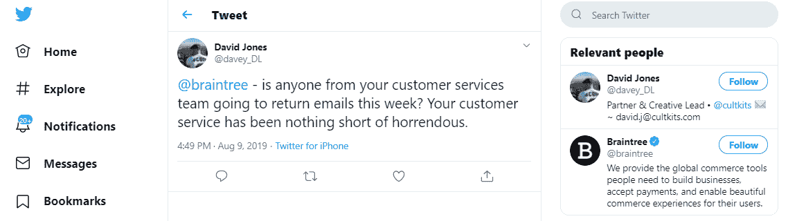

Braintree customer tweet.

在这里，一个用户因为几天内没有收到回复而感到沮丧。

尽管在帖子中被贴上标签，但没有来自 Braintree 的回复或行动。

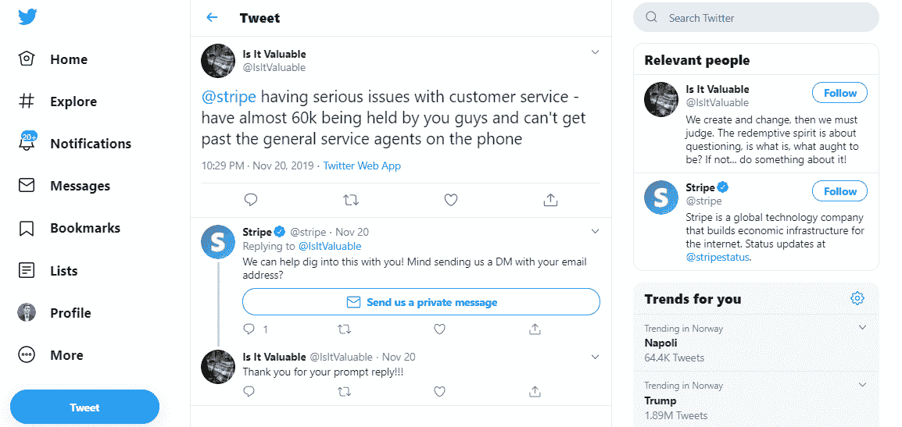

Stripe customer tweet.

在这里，一个被 Stripe 冻结了近 60，000 美元的供应商不顾一切地想要联系系统中更高层的人。总务处的特工还没能在电话里解决他的问题。

Stripe 的支持团队几乎立即取得了联系，并要求 DM 提供用户的电子邮件地址，以推动事情的发展。

**赢家**:条纹

Stripe 的一般支持是全天候开放的，他们还通过实时聊天甚至社交媒体处理客户支持查询。

虽然不是每个人都对这两家公司的支持感到高兴，但这是因为支付处理没有正常工作时的高风险。

分秒必争。

## Stripe Connect 与布伦特里市场

Stripe 和 Braintree 都提供市场支付网关。

与常规网关的不同之处在于，它允许次级商户(例如，你的应用程序的用户)接收和处理支付。

该功能对于分布式对等商务应用和平台是必要的。(想想 Kickstarter，Patreon，Etsy 等。)

### 条带连接

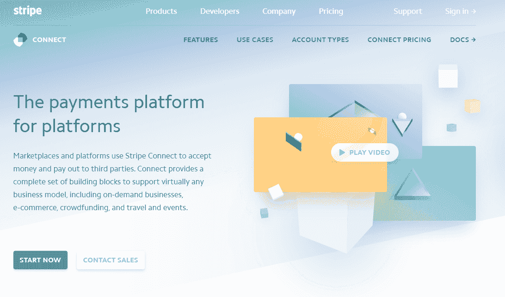

Stripe Connect.

Stripe Connect 将自己定位为平台的支付平台。

拥有庞大的用户群、广泛的 SDK 库、优秀的文档，并且除了交易费之外没有额外的费用，很难对此提出异议。

**条纹强度:**

*   更大的用户群
*   更好的 API 文档
*   更广泛的 SDK 库，因此无需定制开发就能提供更好的定制选项。

### 布伦特里市场

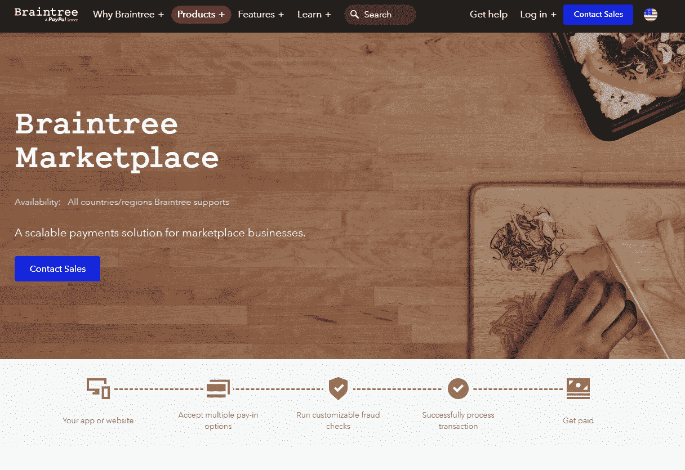

Braintree Marketplace.

Braintree Marketplace 标榜自己是市场业务的可扩展解决方案。

它具有一个简单的结构，一个主账户可以为你的市场平台上的卖家创建子账户。

您可以设置子账户交易的自定义费用。

**布伦特里强项:**

*   结构简单。
*   子账户上的主账户。
*   API 和 Ruby SDKs 的深入文档。

**获胜者**:条纹连接

## 与电子商务和 CRM 平台的集成

Stripe 和 Braintree 都支持电子商务领域的三巨头——[woo commerce](https://woocommerce.com/)、 [BigCommerce](https://www.bigcommerce.com/) 和 [Magento](https://magento.com/) 。

### 伍尔科贸易公司

由于我们的用户在他们的网站上使用 WordPress，我们不能忽视这个世界上最常用的电子商务插件。我们甚至在另一篇文章中介绍了为 WordPress 设置 Stripe 的[种方法。](https://kinsta.com/blog/stripe-for-wordpress/)

幸运的是，WooCommerce 支持这两种支付平台。

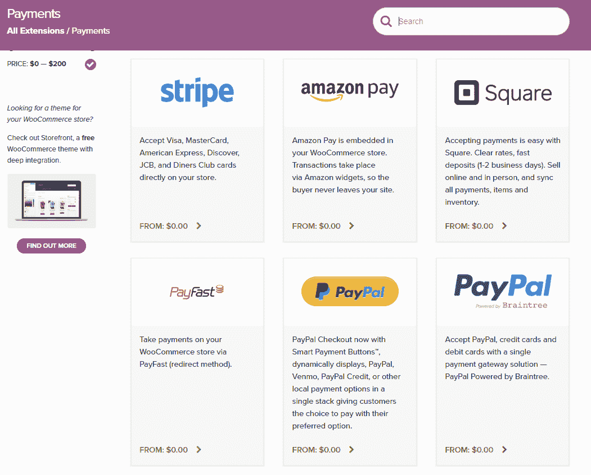

WooCommerce extensions for payments.

WooCommerce [自动生成结账页面](https://kinsta.com/blog/woocommerce-checkout/)，你不需要定制任何代码。

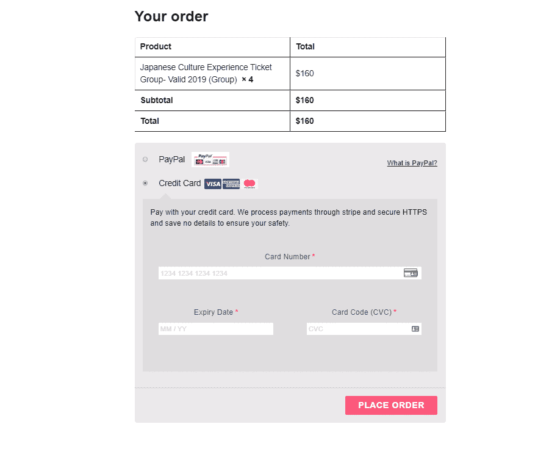

WooCommerce checkout page with Stripe and Paypal options.

您还可以为您的结账流程提供多种选择。在这里，主要选择是 Stripe 支持的信用卡支付，但你也可以使用 Braintree 通过 PayPal 支付。

### CRM 集成

但是说到 CRM，两者之间有更多的区别。

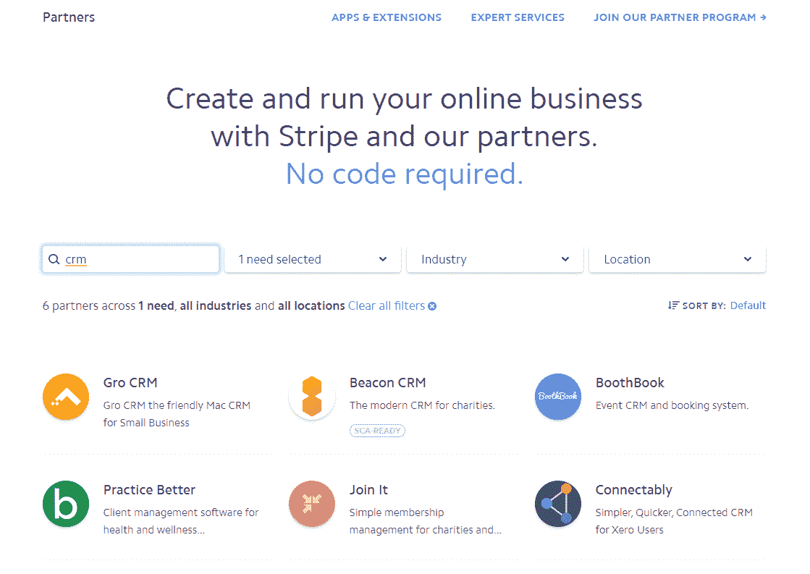

Stripe CRM integrations.

Stripe 提供与 Gro、Beacon CRM、Agile CRM 和其他平台的集成。如果您选择规模计划，您还可以将条带计费与 SalesForce 连接。

布伦特里的情况有所不同。

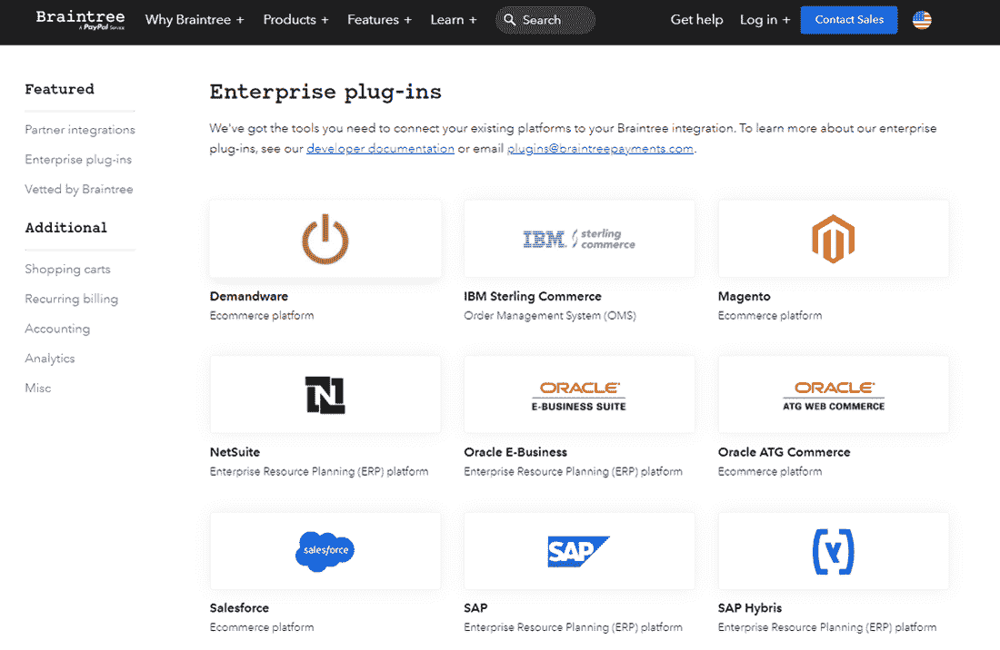

Braintree integrations with CRM.

Braintree 确实提供了大量的第三方集成。但它能直接使用的 CRM 只有 Salesforce 和 Agile CRM。

这使得 Stripe 在 [CRM 和业务工具集成](https://kinsta.com/blog/wordpress-crm/)方面拥有明显优势。

**赢家**:条纹

虽然大型电子商务解决方案支持 Stripe 和 Braintree，但它归结于 CRM 集成、业务工具和重复计费选项。

Stripe 显然是这些领域的领导者，这意味着它为大多数企业提供了更好的选择。

## Stripe vs Braintree:哪个更好？

在每一节的短兵相接中，都有很多平局。费用和定价结构实际上是一样的，两种结账体验都很好。

但是，凭借稍好的客户服务、欺诈保护和集成，Stripe 勉强超过了 Braintree 的终点线。

*   你是否在美国经营一家电子商务商店，大多数交易都是通过信用卡进行的？条纹是明显的选择。
*   你是否在一个欧洲国家经营一家企业，在那里许多交易都是通过 Paypal 或其他数字钱包进行的？布伦特里是个更好的选择。

### Stripe 比 Braintree 好吗？

条纹比较容易上手。

有了 Braintree，你需要直接申请 Braintree 或者额外付费申请第三方商家账号。

然而，两者的结账体验是相似的，正如我们所看到的，费用实际上是一样的。不过条纹雷达的客服更好，集成选项更多，防欺诈更好的平台。

对于一家标准的美国电子商务企业来说，这使得 Stripe 成为最佳选择。

但是 Stripe 声称的相对于 Braintree 的微小优势并不意味着它在所有业务上都优于其竞争对手。

例如，Braintree 还支持 Maestro，这是一种在许多欧洲国家使用的信用卡选项，在为全球客户服务的企业中很受欢迎。

[Stripe or Braintree? 🤷‍♂️ With transparent fees, anti-fraud technology, & global coverage, these are two of the best options for startups and established businesses alike...but which one is right for you? 👇Click to Tweet](https://twitter.com/intent/tweet?url=https%3A%2F%2Fbit.ly%2F2RqJ6za&via=kinsta&text=Stripe+or+Braintree%3F+%F0%9F%A4%B7%E2%80%8D%E2%99%82%EF%B8%8F+With+transparent+fees%2C+anti-fraud+technology%2C+%26amp%3B+global+coverage%2C+these+are+two+of+the+best+options+for+startups+and+established+businesses+alike...but+which+one+is+right+for+you%3F+%F0%9F%91%87&hashtags=Startup%2CSaaSStartup)

## 摘要

为您的企业选择支付网关和处理器不是一个你可以轻易做出的决定。在这篇文章中，我们通过强调两个可靠的市场领导者，涵盖了从费用和可用性到客户服务和集成的所有内容。

在结账体验、费用、支付方式和可用性方面，Stripe 和 Braintree 不相上下。

然而，如果你是一家 SaaS 企业，Stripe 值得一试。它拥有更好的欺诈防范工具、市场选项和集成。这使得 Stripe 更容易集成为您的 [SaaS 堆栈](https://kinsta.com/blog/saas-products/)的一部分。

总的来说，我们发现 Stripe 是电子商务企业的更好选择。

* * *

让你所有的[应用程序](https://kinsta.com/application-hosting/)、[数据库](https://kinsta.com/database-hosting/)和 [WordPress 网站](https://kinsta.com/wordpress-hosting/)在线并在一个屋檐下。我们功能丰富的高性能云平台包括:

*   在 MyKinsta 仪表盘中轻松设置和管理
*   24/7 专家支持
*   最好的谷歌云平台硬件和网络，由 Kubernetes 提供最大的可扩展性
*   面向速度和安全性的企业级 Cloudflare 集成
*   全球受众覆盖全球多达 35 个数据中心和 275 多个 pop

在第一个月使用托管的[应用程序或托管](https://kinsta.com/application-hosting/)的[数据库，您可以享受 20 美元的优惠，亲自测试一下。探索我们的](https://kinsta.com/database-hosting/)[计划](https://kinsta.com/plans/)或[与销售人员交谈](https://kinsta.com/contact-us/)以找到最适合您的方式。