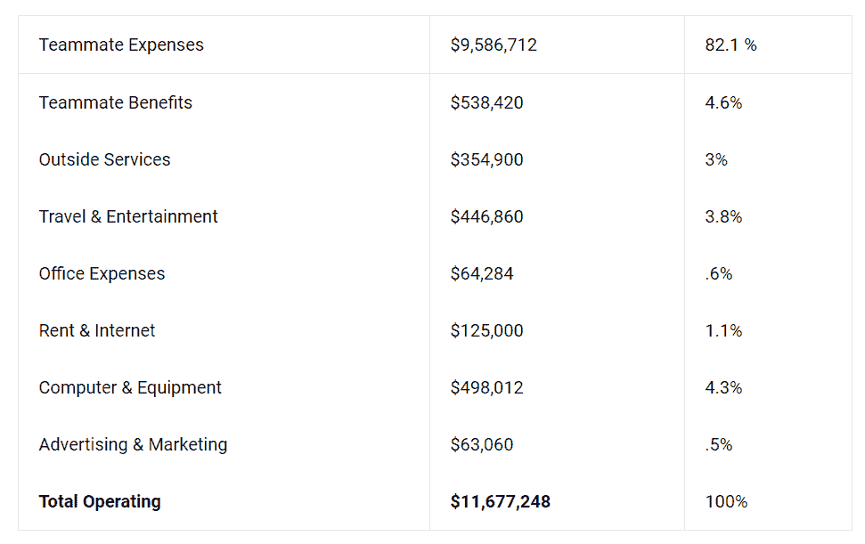
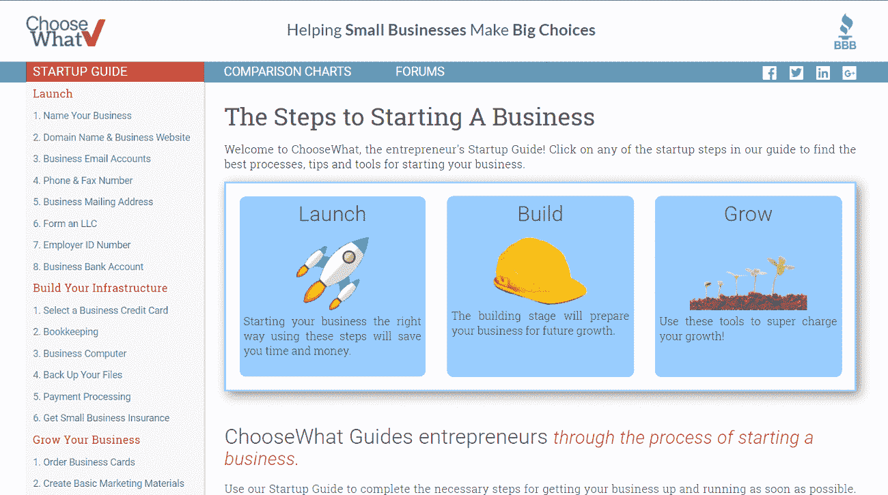
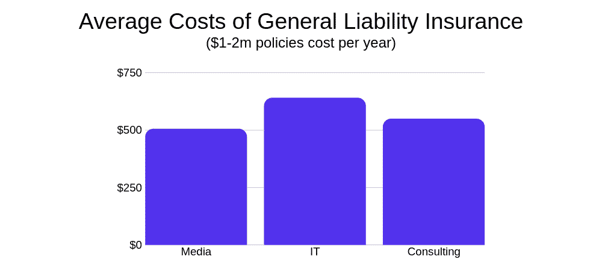
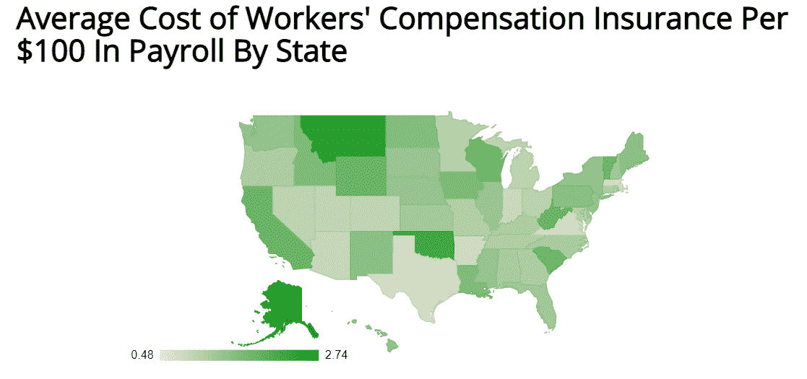

# 创业公司的商业保险成本:多少钱？(2022)

> 原文：<https://kinsta.com/blog/business-insurance-cost-for-startup/>

如果你是一个初创公司的创始人，也许研究不同的保险政策并不是你的首要任务，因为你正在扶持你的公司，并试图扩大你的客户群。如果你曾经尝试研究过，你可能很难找到创业公司商业保险成本的准确估算。

网上大多数与保险相关的内容要么是由保险公司直接发布的，要么是由保险公司赞助的。这很像为虚拟主机提供商寻找诚实的评论。因此，很难找到政策和成本的公正分类。保险是一个以销售为主的行业，他们会得到你的联系信息，而不是不与你交谈就给你那些细节。

我们决定编写一份全面的价格指南。在这份保险中，我们将涵盖您的业务可能需要的所有类型的保险。

这篇文章涵盖了从一般责任保险这样的基本政策到网络责任保险这样更复杂的政策。

## 创业公司的保险费用是多少？

与初创企业相关的政策每年的成本从 500 美元到数万美元不等。你可能会认为这不是一个非常有用的估计…你不会错的。

对于大多数创业公司来说，保险不太可能让他们倾家荡产。例如，Buffer 是一家唯一公开其财务状况的初创公司；回到 2018 年，他们[分享了他们全年的预算](https://open.buffer.com/transparent-budget/)。商业保险显然是一项相对较小的支出——只包括在他们办公室支出的 0.6%中。医疗保险和工伤赔偿包含在队友福利中。这些福利占其运营成本的 4.6%。

Buffer’s 2018 Operating Costs.

在他们的 2016 年[预算](https://open.buffer.com/transparent-pricing-buffer/)中，健康保险/工伤保险占月支出的 1.9%，或总工资的 2.9%，每月 6635 美元。

在 Kinsta，我们的全部商业保险每年大约花费 30，000 美元。

但是保险离提供 SaaS 保险还有很长的路要走，所以不可能根据一家公司的经验给出一个通用的答案。根据公司的规模、行业和情况，你可能会支付更高或更低的工资比例。

[Hey startup founders! 👋 📊 This one is for you. Learn how to cut through the noise and find the best policy for your business with this guide ⬇️Click to Tweet](https://twitter.com/intent/tweet?url=https%3A%2F%2Fkinsta.com%2Fblog%2Fbusiness-insurance-cost-for-startup%2F&via=kinsta&text=Hey+startup+founders%21+%F0%9F%91%8B+%F0%9F%93%8A+This+one+is+for+you.+Learn+how+to+cut+through+the+noise+and+find+the+best+policy+for+your+business+with+this+guide+%E2%AC%87%EF%B8%8F&hashtags=Startup%2CEntrepreneur)

## 小型企业需要哪种保险？

Types of Business Insurance. ([Source](https://www.surepayroll.com/resources/blog/common-types-of-business-insurance))

大多数小企业事故都包括在职业责任险、工伤赔偿险和一般责任险中。这是否意味着你的创业公司需要这三样东西？

这里没有万能的正确答案。由于创业公司和中小企业在资产、员工和风险方面有很大差异，我们根据它们覆盖的业务特定部分对每项政策进行了细分。

如果您已经知道您需要哪些政策，您可以跳到下面显示价格的部分。

### 你的企业直接与消费者或客户互动吗？—一般责任保险

Interacting with Consumers and Clients.

如果你会见潜在的前景，客户，销售实物产品，或亲自服务，这种类型的政策通常是一个好主意。虽然法律在技术上没有要求，但一般责任保险被认为是希望保护自己免受一般责任诉讼的成长型企业所必需的。

即使你是一个在自己家里专门与自由职业者合作的个体经营者，这个政策通常仍然是一个好主意。

#### 它包括什么？

任何与员工造成的人身伤害或诽谤相关的财产损失或费用——从潜在客户滑倒在任性的香蕉皮上、员工将咖啡洒在施乐机器上，到产品发布或广告活动引起的诉讼。

### 你一定要有私人办公室吗？—一般责任保险、财产保险和企业主保单

时代变了。鉴于不断发展的技术，许多初创公司甚至小企业都选择搬到共享办公室和共同工作空间，而不是出租专用办公楼。在大多数情况下，这些共同工作的公司已经为他们的财产投保，他们不需要你公司的任何保险。

然而，如果你打算从房东那里租赁传统的商业地产，他们会要求你在完成租赁前购买保险。

一些房东只要求标准的一般责任保险，而其他人可能也需要财产保险。你可能也知道这是“滑倒保险”

#### 它包括什么？

一般责任保险涵盖贵公司员工造成的任何基本财产损失，以及与这些行为直接导致的伤害相关的费用。

财产保险的范围因保单而异。不过，它将为你(或你的房东)的有形资产提供更广泛的保护，从严重的水渍或霉菌到家具、墙壁或地板的意外损坏。

企业主的政策是综合一般责任保险和商业财产保险，涵盖上述所有。

### 你有员工在工资单上吗？—工人赔偿保险和就业惯例责任保险(EPLI)

如果您的公司直接雇用任何全职或兼职员工，您的公司很可能需要获得工伤保险。你还应该认真考虑一份 EPLI 保单，以保护自己免受现任/前任员工的起诉。

### 工人赔偿保险

截至 2021 年，这项政策是大多数雇主的法定要求。在美国，是在州一级监管的。因此，各州的具体要求和费用各不相同。

由于所涉及的法律要求，为贵公司获得工伤保险的过程应该是几乎完全自动化的。也就是说，你仍然需要仔细检查你所在州的特殊要求，以确保你符合这些要求。

#### 它包括什么？

如果雇员在工作中遭受事故或生病，工人赔偿保险包括医疗费用和一部分损失的工资。

它所涵盖的工资损失的百分比取决于具体的政策。(要使索赔有效，伤害/疾病必须是员工在工作时履行职责的直接结果。)

### **就业实践责任保险(EPLI)**

当然，当你雇佣全职员工时，员工生病并不是你面临的唯一风险。当他们在上班时，你的员工是以你公司的名义行事。

你的公司要对你的员工对待其他员工的行为负责。EPLI 保单保护你免受因害群之马的行为而引起的诉讼。

#### 它包括什么？

它涵盖了几乎所有因雇佣(甚至不雇佣)某人而导致的潜在诉讼:

*   违反雇佣合同
*   不当终止
*   未能雇用或提升
*   性骚扰
*   疏忽评估

### **利用专业雇主组织(PEO)**

许多初创公司没有专门的人力资源人员，这使得员工保险和合规方面的流程更具挑战性。

在美国，各州的法律各不相同，合规性非常复杂。雇佣一些帮手通常是个好主意。

专业雇主组织，或称 PEO，是代表你的公司雇佣员工的公司。他们确保每个新员工都根据他们在当地的权利投保，并遵守所有就业法律。

他们也有典型的 EPLI 政策，但限制很小，往往是非常普遍的。你的行业或商业模式特有的风险可能没有被很好地覆盖。

在 Kinsta，我们使用 [JustWorks](https://justworks.com/) 来处理我们所有的美国员工。这有助于我们保持合规，并确保我们的所有员工都得到他们应得的东西(甚至更多)。

### 你是给公司提供量身定制的服务还是在网上发布内容？错误和遗漏保险(也称为职业责任保险)

如果你的公司以公司为客户提供专门的服务，这通常是一个好主意。

如果你的产品或服务直接影响到公司创收或处理敏感信息的方式，这样的政策是个好主意。你这边的一个错误会对这件事产生负面影响，这几乎肯定会引起诉讼。

这里每个政策的范围取决于行业的客户和涉及的潜在错误。

一家销售处理 0 敏感信息的内部协作工具的小型初创公司将拥有与[支付处理](https://kinsta.com/blog/paypal-alternative/)初创公司完全不同的政策。一个为百万美元的广告活动提供咨询的数字代理机构会有不同于小型设计代理机构的需求。

#### 它包括什么？

它涵盖了各种错误和失误，从导致漏洞的代码缺陷到物理产品的问题——专业疏忽，即您未能根据合同交付产品或服务。

项目范围争议，客户认为您的公司没有交付最初项目讨论中概述的最终产品。

重要的是，它还涵盖了任何意外的商标侵权行为。它可以帮助您的企业避免可怕的最坏情况。

利奥·焊工比任何人都清楚这一点。就像电影中的一个场景，[他的创业公司 choosewhat.com 因为使用“efax”这个词而被起诉商标侵权](https://www.inc.com/magazine/201706/kate-rockwood/business-insurance-tips.html)

ChooseWhat website Homepage.

如果他没有风险投资，那他的生意就完了。

如果风险投资没有支付法律费用，这个网站今天可能就不存在了。

在那次事故已经让公司损失了几十万美元之后，他选择每年支付额外的几百美元作为职业责任。

一份标准保单包括高达 100 万美元的法律费用。想象一下利奥能存下多少钱。

### 公司使用你的产品来处理敏感信息吗？—网络责任保险

几乎每个现代创业公司都严重依赖互联网和数据。如果您的公司直接处理敏感信息，或者您的客户使用它来做这件事，您应该考虑网络责任政策。

#### 它包括什么？

该策略涵盖了由错误、漏洞、利用或长时间停机导致的大多数最坏情况。比如[黑客](https://kinsta.com/blog/wordpress-hacked/)导致的法律费用，数据泄露，漏洞利用，宕机，利润损失。

## 一般责任险多少钱？

初创企业或小型企业的一般责任保险通常每年花费 400-750 美元。这相当于每月 42 到 92 美元。

对于你所得到的内心的平静来说，这不是一个巨大的价格标签。有了它，您可以保护您的企业免受最基本的责任诉讼和损害。

价格取决于公司规模、风险因素、保单限额和免赔额。

### 初创企业的平均成本和成本范围

Average Costs of a GLI Policy.

[根据 insurance](https://www.insureon.com/small-business-insurance/general-liability/cost)，平均保费为 741 美元，中位数为每年 421 美元。相关创业行业、媒体、IT 和咨询行业的平均年薪在 505 美元到 640 美元之间。

[Progressive Commercial](https://www.progressivecommercial.com/business-insurance/business-insurance-cost/) 的客户平均保费为 636 美元，中位数为 684 美元。 [TechInsurance](https://www.techinsurance.com/ask-us/business-insurance-costs/cost-of-general-liability-insurance/) 的客户平均保费为 336 美元，中位数为 340 美元。

[可信的选择](https://www.trustedchoice.com/business-insurance/compare-coverage/cost/)建议独资企业的年薪为 500 美元，但小型咨询公司的年薪最高可达 3000 美元。

一个只有创始团队、没有员工、只有几笔小生意/客户的早期创业公司，可能每年有 400-500 美元的溢价。

## 注册订阅时事通讯

### 想知道我们是怎么让流量增长超过 1000%的吗？

加入 20，000 多名获得我们每周时事通讯和内部消息的人的行列吧！

[Subscribe Now](#newsletter)

在一个高风险行业中，一个拥有更多员工、更大规模交易的初创企业，最终可能需要每年支付 1000 至 2000 美元，甚至更多。

## 企业主的保单保险费用是多少？

企业所有者的政策保险是综合一般责任保险和商业财产政策。这使得它比一般责任险略贵。但是比分开拿两个便宜多了。

对于小型企业来说，一份保单的平均成本在每年 600 美元到 1，200 美元之间。

成本取决于年收入、员工总数、商业地产价值和企业风险水平。

根据[投保](https://www.insureon.com/small-business-insurance/business-owners-policy/cost)，年均保费为 1191 美元，中位数为 636 美元。信息技术公司的中位数是 540 美元。

根据 [Progressive Commercial](https://www.progressivecommercial.com/business-insurance/business-insurance-cost/) 的数据，覆盖的平均成本为 1008 美元，保费中位数为每年 1020 美元。

如果选择了合适的供应商，只有几名员工和一个小办公室的早期创业公司每年可能会支付大约 400-500 美元。

一家拥有更华丽的办公室、更多员工、处于负债风险更高的行业的初创企业，将支付每年 1200 美元或以上的最高薪酬。

## 职业责任险和错漏险要多少钱？

专业责任保险，也被称为错误和遗漏保险，对于一个小企业来说，每年的费用在 500 美元到 2000 美元之间。

这个范围很广，也有很好的理由。价格取决于你的合同规模和与你的服务相关的潜在损害。

例如，即使你是一个独资经营者，你可能有一个大的咨询合同，对客户有重大的潜在负面商业影响。在这种情况下，您可能需要一个较高的策略限制，这会相应地增加策略成本。

### 初创企业的平均成本和成本范围

根据[insurance](https://www.insureon.com/small-business-insurance/professional-liability/cost)的数据，职业责任保险的平均费用为 1735 美元，平均费用为每年 713 美元。据 [Progressive Commercial](https://www.progressivecommercial.com/business-insurance/business-insurance-cost/) 称，他们的客户每年平均支付 500-1000 美元的保费，中位数为 504 美元。

据 CoverWallet 估计，每年每百万美元的保险费用在 1000 美元到 3000 美元之间。 [TechInsurance](https://www.techinsurance.com/ask-us/business-insurance-costs/cost-of-errors-and-omissions-insurance/) 列出了从 730 美元到超过 1400 美元的平均范围和每年 728 美元的中位数。

一家拥有少量合同或客户、与职业责任相关的风险有限的初创公司，可能会支付较低的年薪，在 600-900 美元之间。一家拥有一份或多份重大合同、潜在损失更大的初创公司，预计每年要支付 1500 美元以上。

## 工人赔偿保险要花多少钱？

对于大多数员工都属于文员/办公室人员类别的初创公司，典型的政策可能是每年 2000 美元到 3000 美元不等。由于软件开发人员、销售人员和营销人员受伤的风险比建筑工人低得多，成本应该反映降低的风险。

工人赔偿保险的费用因州而异。它还取决于员工人数、工资总额以及员工个人工作职责的风险类别。

### 初创企业的平均成本和成本范围

The average cost of Workers’ Comp. (Image source: [insureon.com](https://www.insureon.com/small-business-insurance/workers-compensation/cost))

根据美国国家社会保险学会的数据，每 100 美元的工资的平均成本从 0.75 美元(德克萨斯州)到 2.74 美元(阿拉斯加州)不等。

好消息是，谢天谢地，每个州的平均成本比最高的阿拉斯加州更接近每 100 美元 1 美元(0.98 美元)。与旧金山(加州为 1.85 美元)甚至纽约(1.02 美元)相比，德克萨斯州的低价格只是在奥斯汀(0.75 美元)中心创业的另一个成本效益。

但是这些数字的变化也可能受到高风险职业的不同表现的影响。根据国家赔偿保险委员会的数据，文书工作每 100 美元的工资成本平均为 0.12 美元，而对于园林绿化，每 100 美元的保险成本平均为 6.94 美元。

大多数初创公司的文员比园艺师和油漆工多得多，这意味着工人的薪酬政策通常不会太贵。

在 2009 年的一项政府研究中，美国初创雇主平均拥有 4.1 名全职员工。

最近，更大和更成功的公司仍然被包括在创业公司的保护伞下，这影响了员工的平均人数。但是，由于精益和吝啬是定义的一部分，大多数自我认定的创业公司的员工不到 10 人。

根据 Payscale 的数据，所有初创公司职位的平均工资高达 102，000 美元。如果你在旧金山有四名平均工资的员工，并支付该州的平均保险费用，你每年将花费 7252 美元。德克萨斯州的平均价格是 2940 美元。

需要为您的企业网站提供超快的、可靠的、完全安全的托管服务吗？Kinsta 提供所有这些以及 WordPress 专家提供的 24/7 世界级支持。[查看我们的计划](https://kinsta.com/plans/?in-article-cta)

一个更乐观的估计是，对于文书工作，每 100 美元的工资是 0.12 美元，整个政策的管理费是 250 美元，最终每年只有 720 美元。

根据 Progressive Commercial 的数据，他们保单的平均成本为每年 960 美元。平均价格为每年 1032 美元(按公司计算，而不是按员工计算)。 [TechInsurance](https://www.techinsurance.com/ask-us/business-insurance-costs/cost-of-workers-compensation-insurance/) 表示，小型科技公司每年的平均保费可达 440-600 美元。

## **雇佣行为责任保险(EPLI)的费用是多少？**

小型企业的就业实践责任保险通常需要 800 到 4000 美元。EPLI 对你的国际收支保单的担保起价约为每年 300 美元。

你可能认为创业是安全的，这是一笔不必要的开支。数据显示并非如此。

在过去的 30 年里，员工诉讼增加了 400%,其中 41.5%是针对员工人数不足 100 人的公司。

庭外和解的平均费用为 75，000 美元。在法庭上败诉平均会让你损失 217，00 美元。

### **创业成本范围**

如果你有企业主的政策，你的保险公司可能会提供 EPLI 背书。EPLI 的支持将为你的标准 BOP 增加 EPLI 保险。小型企业通常每年花费 300-500 美元。

对于 10-15 名员工的初创企业，单独的政策应该在 1200-2000 美元/年的范围内。

一家拥有 40-50 名员工的科技创业公司可能每年支付 4000-5000 美元。

## 网络责任(数据泄露)保险要花多少钱？

网络责任保险的费用可能低至每年 500 美元，也可能高达 5000 美元或更多。

网络责任保险政策的成本再次严重依赖于您公司的个人需求。如果你的公司为大公司处理支付或敏感信息，你需要比一个为小企业创建网站的网站设计师更高的政策限制。

如果您以电子方式存储或处理任何敏感数据，从技术上讲，您应对由此造成的任何损害负责。这就是为什么即使是小的电子商务企业也需要这样的政策。

这里最大的区别在于保单或保单限额的大小，这是基于在数据泄露、黑客攻击或[延长停机时间](https://kinsta.com/blog/website-downtime/)的情况下可能发生的预计损害。

### 平均成本和成本范围

因为它更多的是一个利基政策，大小政策和保费差别很大，有很少的信息。

根据 Progressive Commercial 的说法，一份针对初创公司的网络责任保单可能会让你花费 500 美元到 5000 美元不等。据 T2 报道，他们收到的报价从 750 美元到 8000 美元不等。

其他来源显示每年在 1，100 美元至 22，000 美元之间。

如果您的初创公司直接存储信用卡信息或处理支付，这将显著影响[潜在的违规成本](https://kinsta.com/blog/credit-card-fraud-stripe/)。在这种情况下，平均成本高达每丢失一张唱片 150 美元。也就是说，一份保单实际上毫无价值，除非你选择一份足够大的保单来覆盖大多数潜在损失。

最终，这意味着这里的平均值或中间值可能不会告诉你最终要支付多少。

不直接处理重要客户信息的初创公司可能会获得 500-1000 美元的溢价。

一家直接处理许多客户记录的初创公司每年将支付至少 3000-5000 美元的保费。

## **影响您保险费用的因素**

你的商业保险将花费多少取决于许多因素。第一个因素是你选择为你的企业采用哪些政策。但这绝不是唯一的一个。

### **公司规模和工资总额**

如果你经营一家小公司，并且只和自由职业者一起工作，你或许可以免于一般责任保险。对于初创公司和小企业来说，每年的 It 成本中位数为 500 美元。

但如果你雇佣全职员工，你很可能会被州法律要求确保员工的薪酬。一般来说，每位员工每年要花费数百甚至数千英镑。实际金额取决于当地法律和其他因素。

还记得 Buffer 如何支付他们工资的 2.9%作为健康保险和工人补偿吗？

### **行业和商业模式及潜在损害范围**

其他因素是你的公司所处的行业和任何潜在责任的固有范围。理发师能做的最糟糕的事情就是弄伤某人的耳朵或者引起过敏反应。这里可能的损失在一百美元左右。

但是一个为亚马逊分包的开发公司，情况就大不一样了。如果他们的可交付产品中的一个小故障导致了黑客攻击或长时间的停机，那就是数百万美元的损失。

保存包括信用卡信息在内的数千份客户记录的 B2C SaaS 也更容易受到攻击。

### **保障限额和保费**

保险限额是特定保单的最高赔付额。这个限额直接影响你的保险费。

当与保险代理人合作时，你可能会认为他们会推荐一个天文数字的保险限额来获得更高的保费。

虽然有时可能是这样，但初创公司很容易受到诉讼，并可能面临代价高昂的最坏情况。

您必须选择反映您所在行业、公司规模和商业模式的限额。

### **员工风险**

员工风险也会影响企业的保险成本。具体来说，这是你的健康保险和工人赔偿政策的一个因素。大多数初创公司的员工都属于文员类工作，这种工作被认为风险很低。幸运的是，保险政策反映了这一点，所以为你的办公室职员投保通常只需要他们工资的很小一部分。

如果你雇佣像木匠这样的体力劳动者，你可能要为这几个员工支付比所有职员加起来还要多的保险费。

### **地点**

您总是受制于当地的州法律和法规，影响您的业务和成本的必要政策。

商业财产保险也受到财产价格、极端天气风险等的严重影响。

### **分布式业务需要遵守当地法规**

仅仅考虑公司注册地和办公地点是不够的。作为一家初创公司，您的企业可能是分布式的，并且您可能有远程员工。

根据所在州和国家的当地法规，您可能需要为不同的员工支付不同的保险费。这些直接影响了工人赔偿保险，仅在美国，平均费率从每 100 美元工资 0.75 美元到 2.74 美元不等。

由于各州和各国的保险立法不同，你甚至可能不得不提供完全不同的政策。这是远程团队的一个缺点(尽管我们强烈支持)。

但这并不意味着你的创始团队必须花费数小时埋头于法律文件中。您可以使用 POE 服务来解决这些问题。额外的工作和不合规的风险终究不值得。

我们涵盖了您可能需要的所有标准商业保险单及其平均费用。我们甚至根据我们的经验给了你一些估计。

请记住，你的企业真正的保险需求和成本不是你仅仅通过阅读一篇博客文章就能弄清楚的。这对于在全球拥有全职员工的分布式公司来说尤其如此。

[If you're a startup founder, you know that finding the right insurance policy for your business can be, well, a headache. 🤯 Let this post be your guide to navigating the process 👇Click to Tweet](https://twitter.com/intent/tweet?url=https%3A%2F%2Fkinsta.com%2Fblog%2Fbusiness-insurance-cost-for-startup%2F&via=kinsta&text=If+you%27re+a+startup+founder%2C+you+know+that+finding+the+right+insurance+policy+for+your+business+can+be%2C+well%2C+a+headache.+%F0%9F%A4%AF+Let+this+post+be+your+guide+to+navigating+the+process+%F0%9F%91%87&hashtags=Startups%2CStartupLife)

## 摘要

如果你是一个在家庭办公室或共同工作空间工作的独资经营者，你以数字方式存储的最敏感的信息是电子邮件地址，那么每月 40-50 美元的一般责任险可能是你需要的唯一保险。

但如果你保存信用卡信息或为科技公司的大合同提供咨询，你的初创公司保险组合中最昂贵的部分可能是网络责任保险。

虽然覆盖您业务的每个部分每年会让您损失几千美元，但一次数据泄露[会让您损失 86，500 美元](https://usa.kaspersky.com/blog/security_risks_report_financial_impact/)或更多。如果你的软件中的一个错误导致一个大公司几天的生产力损失，相比之下，这个数字是微不足道的。

创业公司和传统企业一样容易受到这种事件的影响，所以保护你的企业和资产免受最坏情况的影响至关重要。

* * *

让你所有的[应用程序](https://kinsta.com/application-hosting/)、[数据库](https://kinsta.com/database-hosting/)和 [WordPress 网站](https://kinsta.com/wordpress-hosting/)在线并在一个屋檐下。我们功能丰富的高性能云平台包括:

*   在 MyKinsta 仪表盘中轻松设置和管理
*   24/7 专家支持
*   最好的谷歌云平台硬件和网络，由 Kubernetes 提供最大的可扩展性
*   面向速度和安全性的企业级 Cloudflare 集成
*   全球受众覆盖全球多达 35 个数据中心和 275 多个 pop

在第一个月使用托管的[应用程序或托管](https://kinsta.com/application-hosting/)的[数据库，您可以享受 20 美元的优惠，亲自测试一下。探索我们的](https://kinsta.com/database-hosting/)[计划](https://kinsta.com/plans/)或[与销售人员交谈](https://kinsta.com/contact-us/)以找到最适合您的方式。