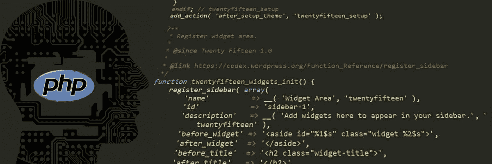
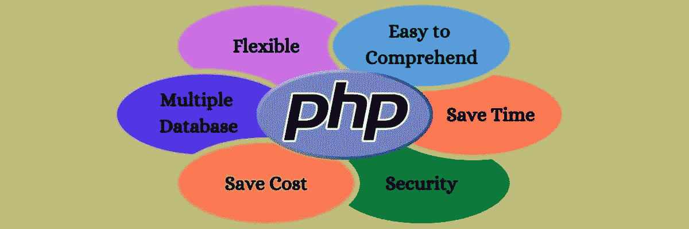
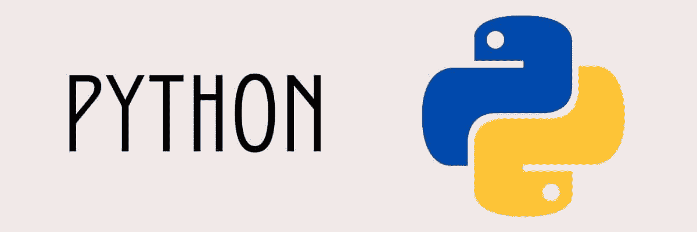
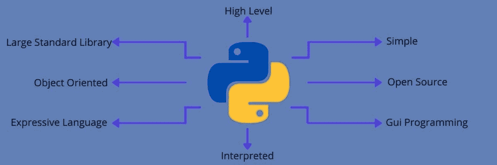
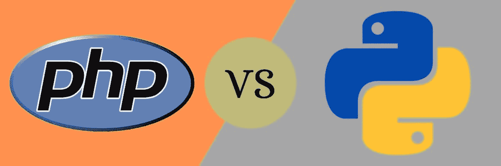
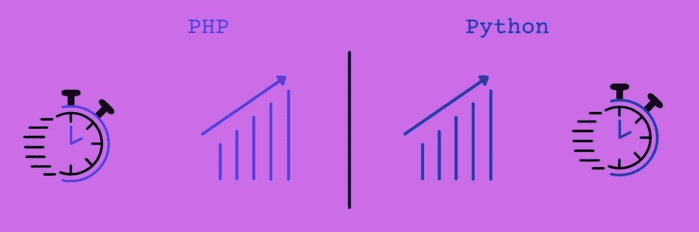
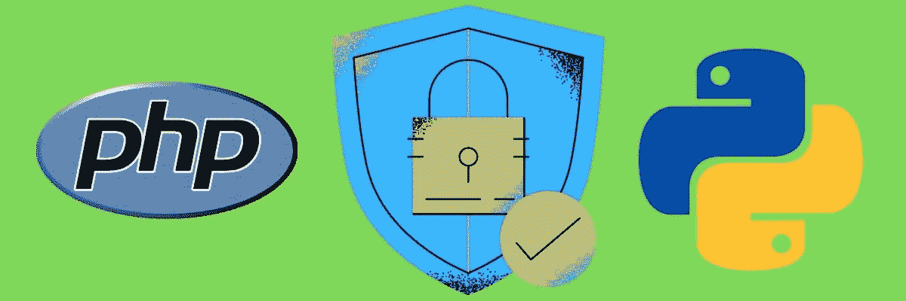
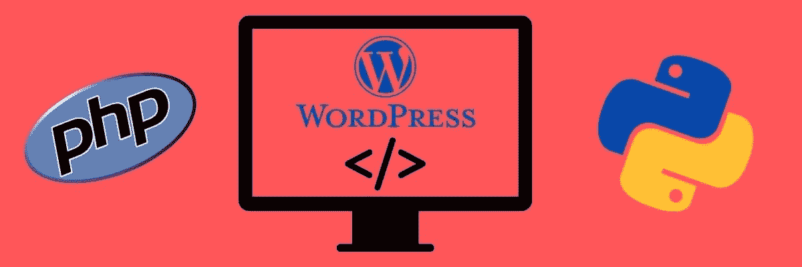
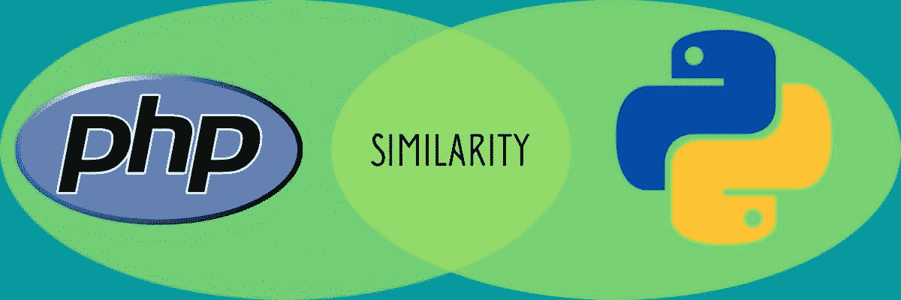

# PHP 与 Python:两种语言的详细比较

> 原文:# t0]https://kinta . com/blog/PHP-vs-python/

软件开发领域正在进行一场战斗，PHP vs Python。而且似乎永远不会结束。

开发一个成功的网站或应用程序始于选择一种可靠的编程语言。

随着生产高性能、可伸缩、可靠、安全和灵活的 web 产品的激烈竞争，选择明智的技术基础变得很有必要，包括[编程语言](https://kinsta.com/blog/best-programming-language-to-learn/)。

虽然有经验的程序员有他们的个人偏好、逻辑观点和最喜欢的软件开发工具，但初学者和项目经理在选择开始使用的编程语言时会遇到麻烦。

有很多编程语言，比如 Java、Python、 [JavaScript](https://kinsta.com/blog/javascript-libraries/) 、PHP、Ruby 等等。，各有优缺点。您还需要根据您独特的项目需求、时间表、最终目标、预算以及其他因素来缩小编程语言的选择范围。

如果你已经加入了这场 PHP 与 Python 的战争，并且不知道应该站在哪一边，那么这篇文章可以帮助你。

让我们来看看在我们的比较标准中，哪些胜出，哪些适合您的项目需求。

## PHP 与 Python:它们是什么？

在我们开始比较这两种编程语言之前，首先了解它们是什么是很重要的。

> 需要在这里大声喊出来。Kinsta 太神奇了，我用它做我的个人网站。支持是迅速和杰出的，他们的服务器是 WordPress 最快的。
> 
> <footer class="wp-block-kinsta-client-quote__footer">
> 
> 
> 
> <cite class="wp-block-kinsta-client-quote__cite">Phillip Stemann</cite></footer>

[View plans](https://kinsta.com/plans/)

给你！

### PHP 是什么？

PHP

超文本预处理器(PHP)是一种广泛用于服务器端 web 开发的开源脚本语言。

由丹麦裔加拿大程序员拉斯马斯·勒德尔夫于 1994 年创建的 [PHP](https://kinsta.com/knowledgebase/what-is-php/) 最初被命名为个人主页。他在 1995 年 6 月发布了第一个 PHP 版本(PHP 1.0)。

从那时起，对后续的 PHP 版本进行了各种开发，我们有了 PHP 8 作为 2020 年 11 月发布的最新 PHP 版本。

PHP 项目的吉祥物是一只蓝色的“elephant”(大象)，侧面写着它的 logo。文森特·庞捷是这个吉祥物的设计者。

使用在守护程序、模块或可执行 CGI(公共网关接口)中实现的 PHP 解释器在 web 服务器上处理 PHP 代码。

PHP 代码的解释和执行可以是任何类型的数据，比如二进制图像。

#### 特征

PHP 的特性包括:

Features of PHP

*   开源:由于 PHP 是开源的，任何人都可以下载并使用它来完成他们的 web 开发目标。这使得世界各地的开发人员能够检查代码，发布错误，并对编码和错误修复做出贡献。
*   **简单易用** : PHP 简单易用，这也是很多开发者偏爱这种编程语言的首要原因之一。

它的语法与 C 语言非常相似，具有良好的组织和逻辑结构。与许多脚本语言相比，学习 PHP 和钻研编码也很容易。

*   **多数据库** **支持** : PHP 支持各种数据库，包括 [MySQL](https://kinsta.com/knowledgebase/what-is-mysql/) ，Oracle， [PostgreSQL](https://kinsta.com/knowledgebase/what-is-postgresql/) 等。，以及数据库集成。
*   **跨平台兼容性**:可以[运行在几乎所有操作系统](https://kinsta.com/blog/install-php/)上，包括 Windows、Mac、Linux、Unix。PHP 脚本也可以在电脑、笔记本电脑、平板电脑和手机等设备上运行。此外，PHP 还兼容各种服务器，如 IIS、[、Apache](https://kinsta.com/knowledgebase/what-is-apache/) 等。
*   灵活 : PHP 提供了更大的灵活性和嵌入能力。它可以很容易地与 JavaScript、 [HTML](https://kinsta.com/blog/html-vs-html5/) 、 [XML](https://kinsta.com/blog/xmlrpc-php/) 等集成。
*   **错误报告和异常处理** : PHP 支持一些预定义的错误报告常量来生成错误警告。此外，它有助于异常处理来显示错误并修复它们。
*   **高效快速的性能:** PHP 脚本可以表现出比很多[脚本语言](https://kinsta.com/blog/scripting-languages/)如 JSP、PERL、ASP.NET 等更好的性能。它的数据加载和数据库连接也更快，以实现高效的数据库管理、邮件功能和服务器管理。
*   **实时监控**:提供用户最近的登录详情。您还可以访问 CPU 和内存使用数据。
*   面向对象的特性:PHP 中的面向对象特性有助于提高速度，并提供继承、数据封装等附加特性。
*   **更多特性:** PHP 提供了魔法常数、正则表达式、PDO 类、支持 cookies、shell 命令行执行等等。

#### 它是用来做什么的？

这种服务器端脚本语言可以生成动态页面内容，在服务器上创建文件，打开、写入、读取、关闭或删除文件。

PHP 是数据库友好的，这就是为什么它可以毫不费力地添加、修改或删除数据库中的数据。

除此之外，PHP 还可以从表单中收集数据，支持 cookies，执行数据加密，以及控制用户访问。

根据 W3Techs 的一份报告，截至 2021 年 3 月 19 日，互联网上 79.2%的网站使用 PHP 作为服务器端编程语言。

一些使用 PHP 的流行网站有 WordPress.com、Facebook.com、Wikipedia.org、Zoom.us、Microsoft.com、Canva.com、Salesforce.com 等等。

#### 应用程序

*   **基于网络的应用程序和网页:**现代的网页和应用程序必须提供更高水平的定制、高度交互式和友好的用户界面、支持无缝集成，并且除了提供快速性能之外，还能够实现安全的在线交易。

PHP 使用一个三层架构，它线性地工作在您的服务器、数据库系统和浏览器上，以满足这种需求。

*   **图形设计和图像处理:** PHP 可靠的管理文本内容和图形设计和图像处理。它支持与许多库的集成，如 ImageMagick、GD 库、Imagine 和更多基于 PHP 的应用程序。

它允许用户旋转，调整大小，裁剪，添加水印，创建缩略图，并提取各种格式的图像，如 PNG，GIF，JPEG，WBMP 和 XPM。

*   **Web CMS:** PHP 扩展了对各种数据库的支持，通过协议与不同的服务交互，包括 IMAP、POP3、HTTP、COM、SNMP 等。

因此，创建像 WordPress、Moodle、Drupal、Joomla 等 web 内容管理系统是很常见的。

*   **基于 GUI 的应用程序:**你可以使用 PHP-GTK 2 和 ZZEE PHP GUI 创建一个基于图形用户界面(GUI)的应用程序，它们允许 PHP 脚本并将你的代码编译成一个**。exe** 文件，可以独立运行。
*   **数据表示:**使用 PHP 的 Image_Graph 等工具，可以创建不同的数据表示，如图表、图形等。它在利用各种形式的数据表示的电子商务网站和应用程序中非常有用。
*   **创建 flash 元素:**您可以创建 flash 元素，如渐变、形状、位图、按钮、文本、变形、动画、动作、电子邮件表单、登录表单等。，使用基于 PHP 的开源库(如 Ming)。
*   构建电子商务应用程序:使用[基于 PHP 的框架](https://kinsta.com/blog/php-frameworks/)如 CodeIgniter，构建电子商务应用程序很容易。这对各种规模的企业都很有用，从初创企业到大型企业。使用 PHP 创建的电子商务平台有 Magento、PrestaShop、OpenCart 等等。

这都是关于 PHP 的。

现在让我们来看看 Python，并为这两种语言之间的直接竞争奠定基础。

[PHP vs . Python...你站在哪一边？🥊💥 点击推文](https://twitter.com/intent/tweet?url=https%3A%2F%2Fkinsta.com%2Fblog%2Fphp-vs-python%2F&via=kinsta&text=PHP+vs.+Python...+which+side+are+you+on%3F+%F0%9F%A5%8A%F0%9F%92%A5&hashtags=PHP%2CPython)

### Python 是什么？

Python

Python 是一种面向对象的、解释性的高级编程语言。

它由吉多·范·罗苏姆开发并于 1991 年发布。随着各种版本和颠覆版本的发展，我们现在有了 Python 2 和 Python 3，最新的是 Python 3.9.2，最近于 2021 年 2 月 19 日发布。

Python 的设计理念关注代码的可读性，并使用重要的缩进和动态语义。它是动态类型的，支持垃圾收集和各种编程范例，如结构化(主要是过程化)、函数式和面向对象编程。

因此，它有助于程序员用逻辑清晰地编码，对大型和小型项目都很有用。由于其广泛的标准库列表，Python 也被称为“包含电池”的编程语言。

#### 特征

Python 的主要特性是:

Features of Python

*   **免费开源:** Python 在其官方[网站](https://www.python.org/)可以免费下载使用。您也可以使用其公开可用的源代码，并根据您的需要对其进行修改。
*   **易学易编码:**这种高级语言比其他语言更容易学习，包括 Java、 [JavaScript](https://kinsta.com/blog/javascript-libraries/) 、C++、C 等。在其中编写程序不需要你管理内存或者记住整个系统架构。

它也是开发人员友好的，使用更简单、不太复杂的语法和简单的英语和数学。因此，使用 Python 编码变得毫不费力，这也是许多开发人员喜欢它的原因。

*   面向对象:这是 Python 的主要特性之一，它支持对象封装、类、构造和析构等概念。
*   可扩展:这种语言不是在核心中构建全部功能，而是被设计成可以用各种模块扩展。由于紧凑的模块化，开发人员发现很容易将可编程接口添加到现有的应用程序中。也可以用 C/C++写一个 Python 代码，编译一下。
*   **解释语言:** Python 代码是逐行执行的，类似 Java、C++、C，一次执行一个，因此不需要代码编译，使得[调试](https://kinsta.com/blog/wordpress-debug/)更加容易，节省时间。
*   **可移植:** Python 代码是可移植的。如果您有用于 Windows 操作系统的 Python 代码，并且希望在 Mac、Linux 或 Unix 等其他操作系统上运行它，那么无需更改代码就可以实现。
*   **动态类型:**变量类型是在运行时决定的，而不是在开始时。因此，您不需要指定变量类型，如 int、char、long、double 等。它减少了代码行，使编程更加简单。

例如，在 Java 中，你写 int x = 5

但是在 Python 中，你会写 x = 5。就是这样。这个“x”可以是任何类型的变量。

*   **压缩标准库**:它的标准库容纳了一套丰富的函数和模块，你不用从头开始写每一段代码。您可以简单地将可用代码用于单元测试、正则表达式、web 浏览器、CGI、图像处理等应用程序。

#### 它是用来做什么的？

Python 有很多用途，比如:

*   创建 web 应用程序: Python 是 web 开发的最佳编程语言之一，因为它为您提供了一系列选项。它支持 Pyramid 和 Django 等框架，Bottle 和 Flask 等微框架，以及 Django CMS 和 Plone 等高级 CMS。

这些框架灵活、可伸缩、安全，并带有各种模块和标准库，可用于简化任务，如数据库交互、内容管理等。它的标准库也支持像 HTML、XML、FTP、IMAP、POP 等互联网协议。

此外，它的包索引还有其他有用的库，包括 Requests、Feedparser、Beautiful Soup、Paramiko 和 Twisted Python。

*   **机器学习(ML)和人工智能(AI):** AI 和 ML 项目不同于传统的软件项目和模型。它们需要不同的技能、技术和工具，以及稳定可靠的语言。Python 具备这样的功能和灵活性来处理独特的项目需求。

它的简单性、平台独立性、资源丰富的库、一致性和活跃的开发社区加强了人们在他们的 AI 和 ML 项目中对 Python 的使用。

以 AI 和 ML 闻名的 Python 包包括用于复杂计算的 SciPy，用于可视化数据的 Seaborn，用于数据分析的 Pandas，用于并行计算和记录工作会话的 IPython tensor flow，以及用于 ML 的 Keras，用于高级科学计算的 NumPy 等等。

*   **桌面 GUI 创建:**由于 Python 具有模块架构，可以在多种操作系统上工作，所以可以使用高效的文本处理工具、框架或 Python 模块来创建桌面 GUI，如 PyQt4、PyQt5、WxPython、PyGtk、PySide、PyGUI、Tkinter 等。
*   **软件开发和快速原型制作:** Python 应用和软件包旨在简化[软件开发](https://kinsta.com/blog/cms-software/)过程。Python 可以帮助您开发 web 和桌面应用程序，以及能够进行数字和科学计算的复杂应用程序。

开发人员广泛使用 Python，甚至用于构建控制、管理和测试。对于这些单独的目的，您可以分别使用 SCons、Trac 或 Roundup 以及 Apache Gump 或 Buildbot。

*   **其他用途:** Python 用于使用 PySoy 等库的游戏开发，py soy 是基于 Python 的 3D 游戏引擎。这就是为什么视频游戏开发商在游戏中使用 Python，如战地 2，文明-4，等等。

Python 还用于构建企业级或业务应用程序，要求更高的可伸缩性、可扩展性和可读性。为此，可以使用支持 Python 的工具，如 Odoo 和 Tryton。

它用于 Boo、Cobra、Swift、CoffeeScript 等的语言开发。Python 是 Oss 背后的语言，就像 Linux 发行版的“无处不在的安装程序”。你还可以控制大数据，连接到数据库，执行[网页抓取](https://kinsta.com/knowledgebase/what-is-web-scraping/)，利用图形设计和图像处理等。，使用 Python。

查看我们的 [Python 教程](https://kinsta.com/blog/python-tutorials/) 综合列表，了解学习 Python 的最佳方法！

## PHP 与 Python:深入比较

PHP vs Python comparison

既然我们已经讨论了 PHP 和 Python 这两种语言，以及它们的特性和应用，现在是时候将它们与下面解释的各种参数进行比较了。

它将帮助您了解哪种语言更适合哪种用途，使用它们有多有效和容易，以及哪种语言可以为您的开发工作和时间带来更好的结果。

让我们开始这场拉锯战——PHP vs . Python。

### 哪个更容易学？

Easier to learn

尽管 PHP 是一种通用语言，但它非常适合开发更复杂的 web 应用程序。它的语法有点类似于 Java、C、C++和 Perl。如果条件，*则函数返回*，而*和*对于*循环也是类似的。*

在 PHP 中，变量名区分大小写。它用分号终止语句，并将空白和换行符视为自由格式语言。它要求你给变量加上前缀 *$，*使用花括号和`- >`操作符来表示一个方法。

总的来说，学习 PHP 和里面的代码需要相当长的时间，尤其是新手。但是他们的开发者社区正在努力让它变得更容易。

例如，PHP 4 包含了改进的面向对象编程，具有更好的抽象，使任务更容易。

另一方面，Python 更容易学习，即使对于初学者也是如此。这种脚本语言被设计成易于阅读，具有整洁的格式、更简单的语法和简单的英语单词，而不是标点符号。

Python 不使用花括号来分隔块。相反，它使用空白缩进。这为其语义提供了准确的视觉结构。Python 也包含了分号的罕见用法，并且有更少的特殊情况和语法异常。

这些属性使得 Python 编码易于学习和编写，长度更短，调试更简单。除此之外，它还为错误留下了空间，因为在出现小错误的情况下，主代码不会中断。这也是为什么各种编程课程都要用 Python 来教授初学者编程基础知识的原因。

结论:Python 是明显的赢家。

### 易于安装

Ease of installation

PHP 安装相对容易。它可以在 Windows、Linux 和 macOS X 上很好地安装和运行。你也可以在世界各地的许多共享主机网站上找到它，费用较低。

如果你想建立一个小的应用程序，PHP 将是一个很大的帮助。

相比之下，Python 可能很难安装。在已经安装了另一个 Python 版本的 macOS X 上，这也变得更加困难。

另一个缺点是现有的 Python 版本已经过时，因此不适合开发应用程序。即使你尝试安装新的 Python 包，你也需要安装新的 Python 版本。

我们知道这可能会令人沮丧。

除此之外，在 Windows 上安装 Python 可能会有点棘手。为了降低遇到问题的风险，可以使用一个包管理器，比如 Chocolatey。

但是如果你是 Linux 用户，你不会发现在你的计算机系统上安装 Python 有任何问题。

结论:PHP 在安装方面胜出。

### 性能和速度

Performance and speed

根据 2018 年 12 月发布的 [Unbounce 报告](https://unbounce.com/landing-pages/7-page-speed-stats-for-marketers/)，79%面临网站速度和整体性能问题的在线购物者表示，他们不会再次访问或光顾该网站。

这表明你开发的所有应用和网站都必须响应迅速，加载速度更快——最多 2-3 秒。

虽然速度和[性能](https://kinsta.com/blog/application-performance-monitoring/)会因硬件资源、内存、存储空间、代码逻辑、硬盘访问时间、数据路径宽度等各种因素而有所不同，但您使用什么编程语言也是一个需要考虑的因素。

因此，比较 Python 和 PHP 的速度和性能是至关重要的。

PHP 的早期版本很慢，包括 PHP 5.x，它需要花费大量的时间来执行代码。看起来他们的开发者社区已经在用 PHP 7.x 提高编程语言的性能和速度方面做了大量的工作。

它比许多编程语言都要快，包括 Python。Zend Engine 3.0 也随 PHP 7 一起发布，使得这种编程语言比之前的版本快了 2 倍。

相比之下，Python 的代码编译过程被设计得更快，即使没有安装缓存系统。当一个文件被创建和/或修改时，它将这个代码转换成字节码。它比引入 PHP 7.x 之前的 PHP 要快得多。

例如，如果您正在开发一个银行系统，它每天可以接收大量的流量，它需要非常快。更短的延迟会极大地影响系统性能。在这种情况下，推荐使用 PHP 7 而不是 Python。

但是，如果您想构建一个速度和时间延迟没有太大影响的简单应用程序，您可以同时使用 Python 和 PHP。

结论:PHP 在速度和性能上胜出。

### 图书馆支持

开发人员可以将库与 web 框架集成起来，以促进快速开发。他们可以随时重用这些库，并根据他们的开发需求进行一些调整。

这样，您的项目在更短的时间内完成，测试变得风险更小，成本也最小化。因此，图书馆管理是一个必须考虑的因素。

PHP 的库支持没那么强。然而，PHP 7 引入了一个强大的工具 Composer，这是它的依赖管理器。您可以将它与 Packagist(PHP 包存储库)结合起来，更有效地管理您的库。

但是作曲家还年轻，目前可能还不完全可靠。

另一方面，Python 为库提供了优秀和成熟的支持。Python 利用“Pip 安装 Python”(Pip)进行包控制。Pip 速度很快，使管理 Python 应用程序的库变得更简单，而且您可以更容易地解析您的项目需求。

人工智能和 ML 支持的网络应用程序现在很受欢迎。如果你也想开发这样的应用程序，Python 有一些优秀的 ML 库，如 TensorFlow、Scikit Learn、Keras、Theano 和许多更成熟的库。

所有这些库都与 web 框架无缝集成，并且非常快速、易于使用和安装。因此，Python 有助于简化 web 开发。

结论:Python 是赢家。

### Web 框架选项

Python 和 PHP 都为 web 框架提供了广泛的选择。

## 注册订阅时事通讯

### 想知道我们是怎么让流量增长超过 1000%的吗？

加入 20，000 多名获得我们每周时事通讯和内部消息的人的行列吧！

[Subscribe Now](#newsletter)

最常用的[基于 PHP 的框架](https://kinsta.com/blog/php-frameworks/#what-are-the-best-php-frameworks-in-2021)有 Zend(效率惊人)、CodeIgniter、Symfony、Laravel、Yii、Phalcon 等等。

如今，许多现代 PHP 应用程序利用 Laravel、Symfony 和 CodeIgnitor，因为它们具有最低的配置要求、更高的可伸缩性和更快的性能。

使用这些框架的著名网站有:Vogue、索尼 VAIO 英国、Barracuda、Casio 等。

Python 还提供了许多 web 框架来支持您的高级定制开发，支持诸如解释请求、产生响应、存储数据等功能。

著名的 Python web 框架有 Django、TurboGears、Pylons、CubicWeb、Flask、Bottle、Pyramid 等等。

Django 目前的使用率很高，非常适合追求完美的开发人员。这是一个鼓励干净设计和快速开发的高级框架。它强调自动化，你可以用更少的代码更快地构建应用程序。

其他 Python 支持的框架在安全性、性能、更少的依赖性和易于定制方面也很丰富。

结论:就支持的 web 框架而言，PHP 与 Python 的拉锯战不分胜负。

### 环境管理

在 PHP 和 Python 中，考虑环境管理是必要的，特别是如果你不想在构建应用程序时依赖软件容器。

不使用容器意味着你需要注意将应用程序的安装语言和库版本分开。这并不像听起来那么简单，需要大量的耐心、时间和努力。

所以，当谈到环境管理时，PHP 使用 virtPHP 作为它的环境管理器。但不主动维护，长期存档。这也是为什么连 PHP 开发者都建议不要用 virtPHP，而要用容器的原因。

对于运营开发来说，容器是一个更好的选择，开发者可以用它来运行一个软件流程，小的微服务，甚至是大的应用。

它支持更少的开销、一致的操作、更高的可移植性和更高的应用程序开发效率。这就是为什么像 Kubernetes 和 Docker 这样的容器现在需求量很大。

事实上，如果您使用容器，您甚至不必考虑环境管理。

如果没有，让我们看看 Python 基于环境管理有多好。

Python 有 Virtualenv，这是对管理环境最有用的应用程序之一。它可以并行安装多个 Python 版本，管理它们，并快速切换版本。

Virtualenv 是开发人员社区中最早的环境管理应用程序之一。他们管理这个优秀的应用程序已经超过 10 年了。

结论:在环境管理方面，Python 显然比 PHP 更好。

### 灵活性、可扩展性和多功能性

The flexibility of PHP and Python

随着企业的发展，其用户群也随之增长。因此，他们使用的应用程序必须可伸缩，以满足客户的需求。

可扩展的应用程序还可以根据市场需求为企业提供更多灵活性，并承受高峰季节的高流量。它还必须为您提供根据业务需求进行扩展和缩减的选项。

Python 和 PHP 都适合使用广泛的框架和库进行 web 开发。

PHP 支持 Symfony、 [Laravel](https://kinsta.com/blog/laravel-tutorial/) 等强大的框架。如上所述，这样您就不会在开发、测试和管理过程中遇到麻烦。

然而，当我们谈到可伸缩性时，Python 比 PHP 有优势，它的人工智能和机器学习能力可以适应新的趋势，并根据需求进行扩展。

相比之下，PHP 在应对新趋势和不断增长的需求方面不够灵活，即使最近对该语言进行了一些重大改进。

Python 也提供了很多 web 框架，而且你已经知道 Python 在库支持方面更好。你有像 Django 和 Flask 这样的高度可伸缩、安全和快速的框架。

无论您是想部署 ML 模型，还是想使用独立的解耦组件来构建应用程序，Django 都可以提供帮助。您可以根据不断变化的业务需求更换或拔掉这些组件。

由于其通用性和简单性，Instagram 使用 Django 框架，在 PHP 与 Python 的竞赛中选择了 Python。它帮助这个社交媒体网站每天轻松地迎合数百万用户的需求。

结论:Python，又来了。

### 安全性

PHP vs Python: Security

网络安全可能是互联网世界最大的担忧之一。

随着技术的进步，网络攻击也在不断发展，例如跨站脚本(XSS)、恶意软件注入、网络钓鱼诈骗、DDoS 攻击等等。

最终，企业和个人在金钱和声誉方面遭受巨大损失。

根据 2021 年 3 月发布的一份 [Varonis 报告](https://www.varonis.com/blog/cybersecurity-statistics/), 2019 年，88%的全球组织面临鱼叉攻击，而 95%的网络安全漏洞是由于人为错误造成的。

这就是为什么开发人员和设计人员需要[认真对待 web 开发的安全性](https://kinsta.com/blog/cloud-security/)。选择一种能够提供更好安全性的编程语言是他们应该追求的目标。

【2015 年 12 月发表的另一项研究显示，大约 86%用 PHP 编写的应用至少涉及一个 XSS 漏洞。PHP 中的许多安全问题由于其庞大的社区已经得到解决，但是您需要选择最安全的替代方案。

Python 比 PHP 更安全。它有许多安全特性，您可以利用这些特性来构建具有高端功能和明确目标的复杂应用程序。事实上，这份 2019 年 3 月的[报告](https://resources.whitesourcesoftware.com/research-reports/what-are-the-most-secure-programming-languages)显示，Python 是最安全的编程语言之一。

例如，Python 支持 Django，它具有安全特性，可以保护应用程序免受威胁。这就是为什么许多政府组织和银行机构利用 Python 来构建具有顶级安全性的健壮应用程序。

厌倦了低于 1 级的 WordPress 托管支持而没有答案？试试我们世界一流的支持团队！[查看我们的计划](https://kinsta.com/plans/?in-article-cta)

结论:Python 毫不犹豫地赢了。

### 排除故障

PHP vs Python: debugging

我们的 PHP 和 Python 的下一个比较是两种语言对于调试的效率。

作为一名开发人员，您需要为两种情况做好准备，一种是工作正常，另一种是工作不正常。

当您的应用程序中存在错误时，它将不会按照预期的方式运行，并且还可能会带来安全风险。

在这种情况下，高效的调试器有助于找出代码中的错误并修复它。

调试 PHP 可能有点棘手。有时可能需要您做一些额外的工作来完成调试过程。然而，使用像 XDebug 这样的 PHP 调试器并不困难，因此您可以更快地开始调试过程并完成它。

像 PHP 一样，Python 也有出色的调试器，如 Python 调试器(PDB ),即使你是初学者，使用起来也毫不费力。因此，只需按下“调试”按钮，并开始摆脱错误，以实现更好的性能和安全的应用程序。

此外，PHP 和 Python 的一些调试器可以与 IDE 集成，如 PyCharm 或 Visual Studio 代码。

结论:平手。

### 证明文件

如果你是一个初学者或有经验的开发人员，将开始一个新项目，你需要的最重要的东西之一是好的文档。对于你选择的编程语言或者你将要使用的工具来说，这是必不可少的。

它将提供完整的信息，并帮助您了解最新的发展以及您必须应对的挑战。

这就是为什么我们需要在 PHP 和 Python 的比较中看到每种编程语言的文档有多好。

PHP 和 Python 都有大量全面的文档。你可以参考无数的论坛、网站、讨论板、教程以及两者都有的课程。

PHP 有一个包含 10 种语言信息的文档网站。它用简单的语言深入介绍了 PHP 的特性。开发者可以在每个页面上发表评论，用有效的例子来帮助澄清复杂的概念。

但是这些评论一旦发表，就会永远留在页面上，这样每个访问者都可以看到。因此，即使是与以前的 PHP 版本相关的旧注释也会显示在顶部。

这意味着它们要么已经解决，要么已经过时。但是当人们第一次看到他们的时候，会产生很多困惑，因为他们不能立即理解什么问题已经被解决了，他们还在做什么。这是原生 PHP 文档的一个缺点。

使用 Python，你不会遇到这种情况。它还为每个版本提供了[深度文档](https://docs.python.org/3/)，包括目录、引入的新改进、安装 Python 模块、完整教程、用法、库参考、扩展、FAQ 部分等等。

除此之外，文档没有显示注释，所以不会有混淆。然而，给出的解释对一些人来说可能很难理解。

比较每个优点和缺点，Python 仍然得分较高，因为过时的注释在 PHP 中造成了混乱。

结论:Python。

### 他们如何使用 WordPress

PHP vs Python: WordPress

WordPress 使用 PHP 作为其核心编程语言。因此，它在 WordPress 社区中已经很重要了。

如果你想了解 PHP 如何与 WordPress 一起工作，只需[从他们的官方网站下载 WordPress](https://wordpress.org/download/) 并打开下载的 ZIP 文件。它将有 PHP 的大部分详细说明。

除此之外，如果你安装了一个 WordPress 主题或者插件，你会发现大多数都有 PHP 文件。

因此，当访问者浏览您的站点时，服务器上的 PHP 模块处理 PHP 代码，生成 HTML 格式的输出，并显示在访问者的屏幕上。

WordPress 需要 PHP 来处理 URL 的请求，从数据库中获取数据，加载文件，获取帖子元数据，验证用户权限，调用插件和主题，上传文档或图像，以及构建网页和界面等。

现在最好的事情来了:你不一定需要学习 PHP 来使用和管理一个 WordPress 网站。

但是如果你想修改默认的 WordPress 属性，进行复杂的定制，或者开发新的 WordPress 插件和主题，学习 PHP 是必须的，还有 CSS 和 HTML 基础知识。

WordPress 及其插件和主题都是用 PHP、Python 编写的，WordPress 看起来是奇怪的一对。

这就是为什么如果你只是需要一个 CMS 或计划开始一个博客，使用 WordPress，但选择 Python 来开发一个高端的 fin-tech，web scraping 或数据分析应用程序。

尽管如此，如果你仍然想在 WordPress 中使用 Python，你需要找到一个共同的链接——MySQL。

WordPress 和 Python 都支持 MySQL。您将需要一个插件，可以启动 MySQL 查询您的数据库，然后在您的前端显示输出。

然而，许多人不想与这些麻烦。

因此，毫无疑问，PHP 与 WordPress 配合得很好，并且在这方面远远胜过 Python。

结论:PHP 胜出。

### 他们如何使用 MySQL

MySQL 于 1995 年推出，与 PHP 同年。它很快成为数据库世界的领导者。它是开源的，具有许多优点，如速度快、数字足迹少、可伸缩、易于安装、安全可靠等等。

因此，如果你想在你的应用中使用 MySQL，你需要确定哪种编程更好。因此，我们将在这场 PHP 与 Python 的较量中比较 MySQL 的可用性。

MySQL 和 PHP 的结合为构建几乎任何类型的网站提供了无限的选择，从大型商业门户到小规模的联系形式。PHP 几乎可以与所有数据库一起工作，比如 Oracle、MySQL 等等。

MySQL 是基于 PHP 的 web 产品中最常用的，因为它是开源的、免费的、高度通用的、易于使用的、快速的、可靠的，并且使用标准的 SQL。

人们广泛使用 PHP 和 MySQL 来开发跨平台的应用程序，这些应用程序可以运行在不同的操作系统上，如 Windows、Unix、Linux、Mac 等。

PHP 被设计成只要你运行完 **php** 命令，就可以毫不费力地连接到 MySQL。但是使用其他编程语言，你可能需要安装额外的代码或者一些插件来连接 MySQL。

来到 Python，它需要一个特殊的驱动来和一个 [MySQL 数据库](https://kinsta.com/knowledgebase/what-is-mysql/)对话。这些驱动程序可从第三方供应商处获得。在使用它们之前，建议您阅读 Python 文档，并检查哪些驱动程序符合它们的标准接口。

MySQL 文档使用“连接器”一词代替“驱动程序”来阐明它与数据库的连接和交互。

不同的编程语言有不同的驱动程序或连接器，Python 使用 MySQL 连接器。

要建立连接，您可以使用 PIP 来安装 MySQL 连接器。接下来，需要使用 Python 测试数据库连接，然后创建一个数据库。现在，您可以执行 SQL 查询，获取结果，通知数据库任何更改，并关闭连接。

所有这些过程对许多人来说都很棘手。因此，在 PHP 和 Python 中比较 MySQL 更好的，肯定是 PHP。

结论:PHP 是赢家。

### 对于 Web 和应用程序开发

接下来，了解什么更适合您的 web 和应用程序开发是关键。您选择的语言必须非常适合您的独特需求。

PHP 和 Python 都适合 web 和 app 开发。所以，这一切都归结于你到底计划开发什么，它有多复杂，以及规模。

PHP 的核心是为 web 开发而设计的。如果你想开发一个不太复杂、功能有限的小型或中型应用程序，PHP 可能是合适的。

此外，PHP 通过其功能丰富的现成工具帮助加速或简化开发过程。这也是开发 CMS 和电子商务网站的明智选择。PHP 使您能够与第三方应用程序完美集成。

另一方面，Python 具有强大的功能，非常适合构建基于人工智能、人工智能、数据科学、大数据等的应用。对于 TensorFlow、Theano、Pandas 等库，您有各种各样的选择(在前面的部分中我们已经看到了一些)。

所以，你可以看到 Python 和 PHP 各有所长。选择哪一个很大程度上取决于您的项目需求。如果您也对这两种语言及其可用性有了透彻的了解，那么选择其中任何一种都是最好的。

结论:没有明显的赢家。

### 开发者社区和支持

拥有一个活跃的、支持性的开发者社区是可取的。它帮助新开发人员和好奇的专业人员消除疑虑。

PHP 和 Python 在几十年前就已经在市场上发布了，并且拥有优秀的开发者社区来支持专业人士。

你可以在专门的网站和论坛上搜索它们，并提出问题，以更好地了解你的编程和 web 开发技能。

自 1995 年推出以来，PHP 一直在不断改进，发布了新的特性和问题解决方案。因此，我们现在有了 PHP 7，它以令人难以置信的速度和性能而闻名。

有一个庞大的开发人员社区可以为 PHP 提供帮助。由于这种语言的强大功能，脸书使用 PHP 作为其主要的后端编程语言。

说到 Python，它发布于 1991 年，拥有一个庞大的开发人员社区，他们进一步致力于开发这种编程语言，使其更加健壮。因此，它的社区也像 PHP 一样强大。

当谷歌用 Python 开发 YouTube 和其他产品时，python 变得更加出名。此外，其他使用 Python 的著名公司还有 Pinterest、Reddit，甚至 Instagram。

因此，在开发人员社区和支持方面，PHP 和 Python 的竞争不分上下。

结论:两者都是赢家。

### 类似

PHP vs Python: Similarity

现在，让我们找出 PHP 和 Python 之间的一些相似之处:

*   这两种语言都是开源的，可以免费使用。
*   两者的调试过程都很好。
*   它们都有定制的 ide，可以很好地与所有主流操作系统兼容。
*   两者都有一个很棒的开发者社区，他们可以在你有疑问的时候帮助你，拓展你的技能。
*   两者都支持动态类型和方法链接。

### 差异

PHP 和 Python 之间的主要区别总结如下:

| **参数** | **PHP** | **Python** |
| 语言类型 | 用于 web 开发的脚本语言 | 通用编程语言 |
| 学习曲线 | 比 Python 更难学 | 更容易学习，即使是初学者 |
| 带有示例的框架 | 支持更多的框架(例如:CodeIgniter，Laravel，Symfony，Yii，CakePHP) | 与 PHP 相比，框架更少，但可用的是有效的(例如:Django、TurboGears、Bottle、Flask、Web2Py、Tornado、Pyramid) |
| 速度 | 早期版本较慢，但 PHP 7 非常快——甚至比 Python 还快。 | 从一开始就设计得很快 |
| 数据库连接 | 它是数据库友好的，能够与 25 个以上的数据库无缝连接。 | 数据库连接是可能的，但不是对所有人。另外，它需要司机。 |
| 句法 | 它的语法可能有点复杂，使用花括号、命名规则、变量前的符号等等。 | 它的语法清晰明了。不使用花括号，也不需要定义变量。 |
| 图书馆支持 | 提供了强大的 Packagist，但是 PHP 在提供更广泛的库支持方面仍然落后 | 对几乎所有类型的应用程序的大量库支持 |
| 关键标识符 | 免费和开源，频繁的增强，松散的部署 | 动态键入、简单代码和快速开发 |
| 流行 | 更受欢迎(大约 79%的网站使用 PHP) | 不如 PHP 流行(互联网上大约 1.1%的网站使用 Python) |
| 可读性 | 可读性和可维护性较差 | 它旨在降低复杂性，并具有简单英语的可读性。 |
| 函数式编程 | 没有功能范例 | 支持函数式编程方法。 |
| 安全性 | 人们目睹了许多安全攻击 | 内置网络安全功能，更加安全 |
| 证明文件 | 记录良好且可用，但旧的评论不断出现，造成混乱。 | 有据可查，没有混淆 |
| 使用 | 主要用于 web 开发 | 更广泛的用途，包括 web 和应用程序开发以及人工智能、ML、数据科学、大数据等。新兴技术 |
| 著名用户 | 脸书，WordPress，维基百科，雅虎 | YouTube、Pinterest、Instagram、Quora、优步、Spotify、Dropbox |
| GitHub stars | 30K | 30.4 千 |
| 叉 | 8.04 千 | 8.23 千 |

[软件开发领域正在进行一场战斗&这一切都要追溯到 PHP 与 Python 的较量🥊在这里找到最适合您项目需求的编程语言👇](https://twitter.com/intent/tweet?url=https%3A%2F%2Fkinsta.com%2Fblog%2Fphp-vs-python%2F&via=kinsta&text=There%E2%80%99s+a+battle+going+on+in+the+arena+of+software+development+%26amp%3B+it+all+comes+back+to+PHP+vs.+Python+%F0%9F%A5%8A+Find+the+best+programming+language+for+your+project%27s+needs+right+here+%F0%9F%91%87&hashtags=PHP%2CPython)

## 摘要

在这场 PHP 与 Python 的比较中，Python 以 2 分的优势胜出。但这并不意味着你必须选择 Python 而忽视 PHP。PHP 和 Python 都是适合 web 和 app 开发的优秀编程语言。

很长一段时间以来，PHP 一直是大多数 web 开发项目的首选。但现在，Python 正慢慢地以其卓越的特性和功能走向高端科学应用，并迎合这个现代的、精通技术的世界。

最后，这很大程度上取决于您的项目需求以及您在 PHP 或 Python 方面的技能、知识和专长。如果你是一个有经验的程序员，并且你需要设计一个简单的网站，你可以选择其中任何一个。

但是如果你是初学者，先试着学习 Python，然后你可以逐渐转向 PHP 或其他语言。

还是那句话，如果你需要开发像 AI、ML、大数据等基于科学的应用和站点。，Python 比较好。

* * *

让你所有的[应用程序](https://kinsta.com/application-hosting/)、[数据库](https://kinsta.com/database-hosting/)和 [WordPress 网站](https://kinsta.com/wordpress-hosting/)在线并在一个屋檐下。我们功能丰富的高性能云平台包括:

*   在 MyKinsta 仪表盘中轻松设置和管理
*   24/7 专家支持
*   最好的谷歌云平台硬件和网络，由 Kubernetes 提供最大的可扩展性
*   面向速度和安全性的企业级 Cloudflare 集成
*   全球受众覆盖全球多达 35 个数据中心和 275 多个 pop

在第一个月使用托管的[应用程序或托管](https://kinsta.com/application-hosting/)的[数据库，您可以享受 20 美元的优惠，亲自测试一下。探索我们的](https://kinsta.com/database-hosting/)[计划](https://kinsta.com/plans/)或[与销售人员交谈](https://kinsta.com/contact-us/)以找到最适合您的方式。