# 如何在 Windows (7，8，10)上截图，并保存和编辑

> 原文：<https://kinsta.com/blog/how-to-screenshot-on-windows/>

学习如何在 Windows 系统上截屏是保存或分享任何来自网站、程序或视频游戏的视觉内容的最简单方法。只需点击几下鼠标，你就可以通过电子邮件、社交媒体或文件共享网站将它发送出去。

这篇文章将向你展示如何使用各种各样的方法截屏任何网页，程序，甚至全屏视频游戏。您将学习如何不仅捕捉静态截图，还录制视频。

我们还将探索最新的 Windows 版本 7、8 和 10 之间的屏幕截图差异。

### 查看我们的[视频指南](https://www.youtube.com/watch?v=Y-vEg5i18Vw)在 Windows 上截图(7、8、10)

## 基本 Windows 方法:打印屏幕键

此方法适用于任何版本的 Windows，包括 Windows XP 和 95。

Windows 电脑的标准键盘包括一个专用键来捕捉您的屏幕。它看起来像这样:

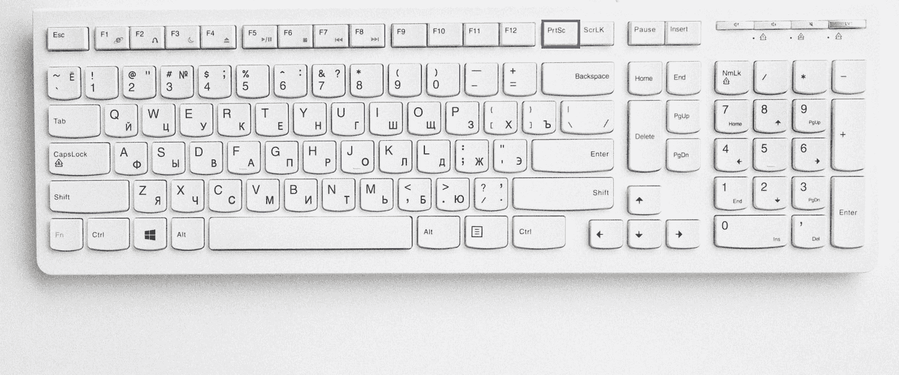

The PrtSc key on the keyboard.

打印屏幕键显示“**打印屏幕**、“ **PrtSc** ”或“ **PrtScn** ”，这取决于您的键盘和国家。它通常位于最后一个 F12 键旁边的右上角。

**注意:**在一些较新的键盘上，尤其是笔记本电脑上，你需要按住“ **Fn** 或者“**功能键**的同时按下“**PrtSc”**来截屏。

使用这种方法时，操作系统会自动将整个屏幕复制到剪贴板。在那里，你可以直接将其粘贴到电子邮件、[社交媒体平台](https://kinsta.com/blog/social-media-image-sizes/)或消息应用程序中。你甚至可以在 Photoshop 甚至 MS Paint 这样的图像编辑软件中开始编辑。

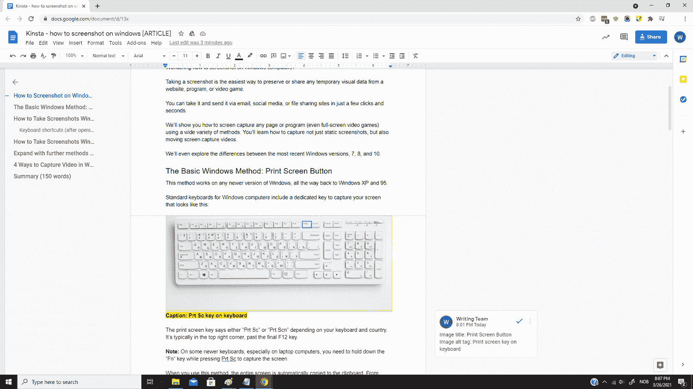

A basic full-screen screenshot in Windows.

**注意:**使用这种方法的一个缺点是它会自动捕捉整个屏幕，包括你屏幕的工具栏和标签栏。手动裁剪会导致屏幕截图大小不一致。

[在本指南的帮助下，在 Windows 中快速捕获任何网页、程序，甚至全屏视频游戏📸 点击推文](https://twitter.com/intent/tweet?url=https%3A%2F%2Fkinsta.com%2Fblog%2Fhow-to-screenshot-on-windows%2F&via=kinsta&text=Quickly+capture+any+webpage%2C+program%2C+and+even+full-screen+video+games+in+Windows+with+help+from+this+guide+%F0%9F%93%B8&hashtags=WindowsTips%2CWebTips)

### 如何保存和分享截图

保存使用 print screen 键拍摄的屏幕截图的最简单方法之一是将其粘贴到您选择的照片编辑软件中。例如，您可以使用 Microsoft Paint，它是 Windows 所有相关版本的免费软件。

打开画图，按下 **Ctrl + V** 粘贴截图。您也可以点击右键，从下拉菜单中选择**粘贴**。

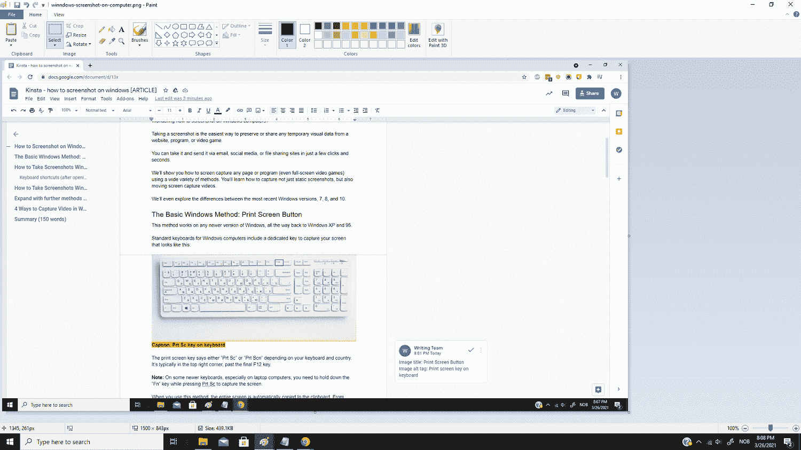

Screenshot in MS Paint.

从那里，你可以编辑你想要的文件，然后以你喜欢的[图像格式](https://kinsta.com/blog/image-file-types/)保存它( **Ctrl + S** )。

如果使用 Windows 10，也可以使用 Paint 3D。但是如果你想使用一个更强大的图片编辑器，我们推荐一个专门的工具。

也可以将截图直接粘贴到电子邮件或社交媒体消息中。

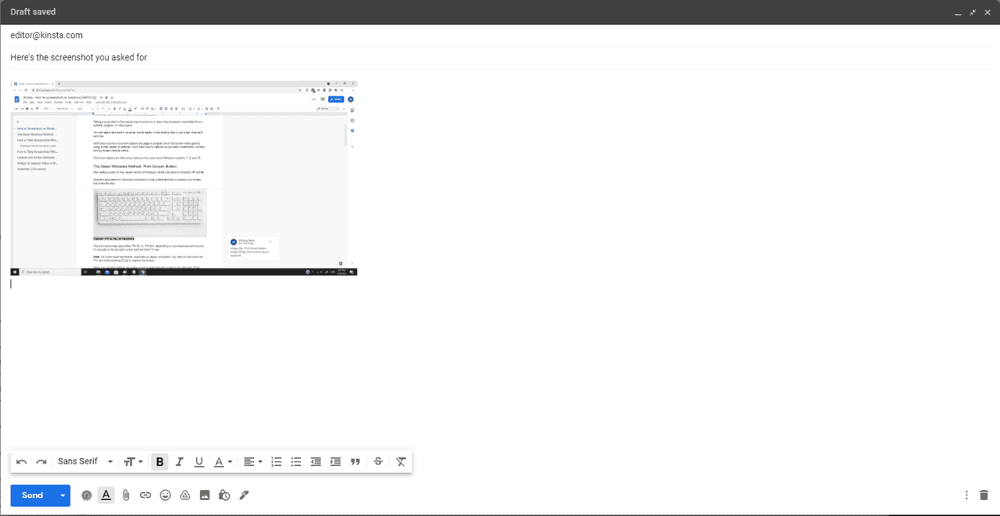

Inserting a screenshot in Gmail.

这是分享您屏幕上内容的最快方式之一，无需接听来电。按打印屏幕键，粘贴进去，按**发送**，就上路了。

如果你想对你的截图进行更多的控制，比如捕捉一个标签，你可以使用内置的 Windows“截图工具”或其他第三方应用程序或软件。

这样，您就不必手动裁剪掉工具栏或其他元素。

## 如何用截图工具在 Windows 7、8、10 中截图

所有最新版本的 Windows，包括 7、8 和 10，都包含了 Snipping 工具。您可以通过在工具栏搜索中搜索它来轻松打开它。

按下 **Windows** 键打开工具栏，跳转到 Windows 搜索。或者，你也可以使用 **Windows + S** 快捷键来召唤 Windows 搜索。但是，请注意，在 Windows 7 中，您必须手动选择搜索字段，然后才能键入关键字。输入“剪切工具”并按下**进入**。

**注意**:没有快捷键可以打开截图工具。最好是手动完成。在 Windows 10 中，这款应用的更新版本可以通过快捷方式打开——稍后会详细介绍。

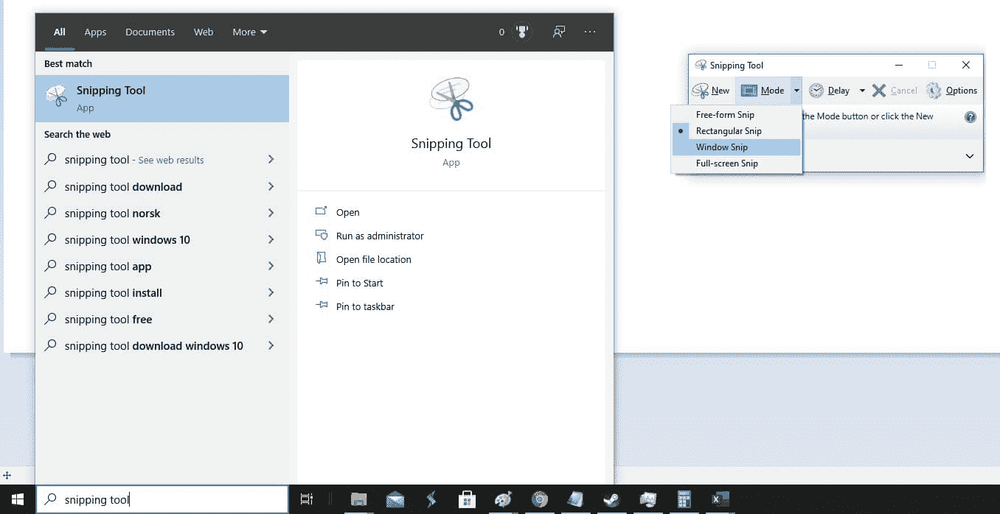

The Snipping Tool in Window’s Start menu.

输入正确的短语后按下 **Enter** 键将自动打开程序。

它有各种模式，包括自由形式的截图，但基本形式是矩形截图形状。但至少它比仅仅按下打印屏幕键给了你更多的灵活性。

一旦你点击“新建”按钮开始“剪贴”，整个屏幕变成灰色。然后，您可以选择想要采集和保存的区域。

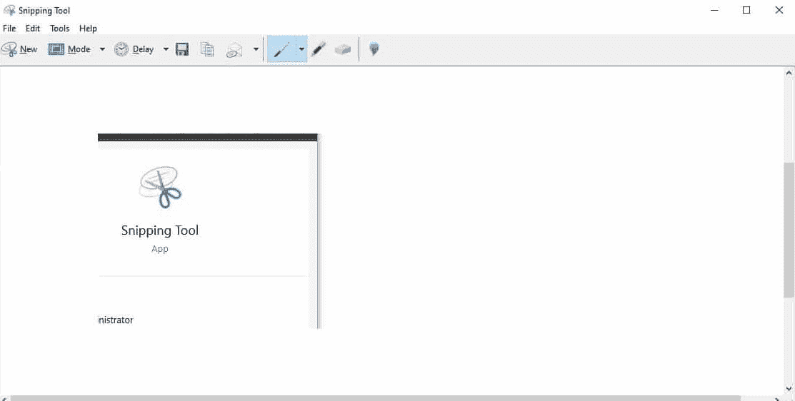

Windows Snipping Tool.

现在，您可以使用钢笔、荧光笔和橡皮擦工具编辑屏幕截图。与复制粘贴到画图相比，它还提供了一些独特的选项，例如用于拍摄延迟(定时)截图的**延迟**模式。您也可以突出显示截图中的内容，并直接从截图工具中通过电子邮件发送。

一旦打开，你还可以使用[许多快捷方式](https://kinsta.com/blog/wordpress-keyboard-shortcuts/)来加快工作速度。

在下表中，我们细分了所有键盘快捷键(仅在打开截图工具后可用):

| **键盘快捷键** | **它的作用** |
| **ctrl+PRT cn**/**alt+n** | 使用截图工具应用程序拍摄新的截图(当它打开时)。 |
| **Alt + M** | 在不同模式(自由形式、矩形、窗口和全屏)之间切换。 |
| **Alt + D ** | 设置屏幕截图的延迟。 |
| **CTRL + S** | 保存屏幕截图。 |
| **CTRL + C** | 将屏幕截图复制到剪贴板。 |

我们错过的一个功能是用相同大小和位置的窗口拍摄多个屏幕截图的能力。

总而言之，无论怎么想象，这都不是一个改变生活的截屏应用，但对于主要用途来说已经足够了。

## 如何使用截图和草图工具截取 Windows 10 屏幕截图

在 Windows 10 中，你还可以使用新的略有改进的 *Snip & Sketch* 应用。

你可以通过搜索菜单或者使用内置快捷方式用同样的方法打开: **Shift + Windows + S** 。

这将自动打开应用程序菜单进行截屏。此外，在这里，您可以为您的快照选择窗口、自由格式、全屏或矩形选项。

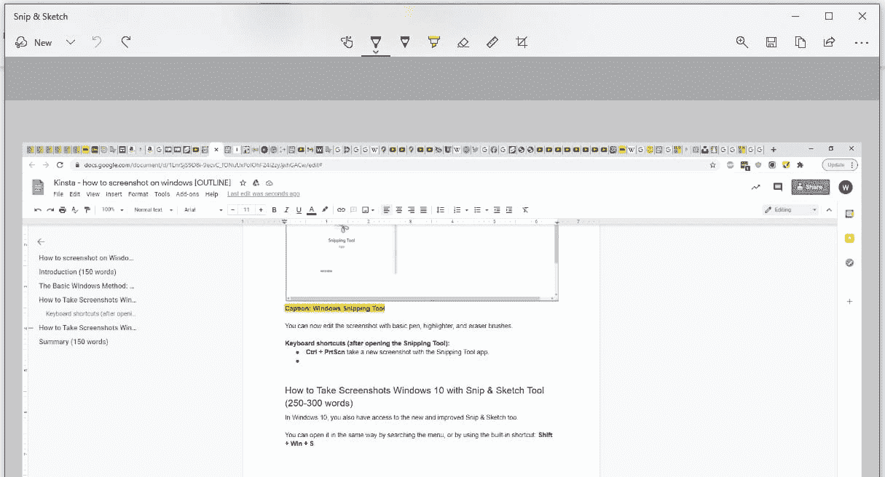

Windows Snip & Sketch tool.

使用窗口截图选项，它不会自动捕获活动窗口。您可以使用 **Alt + Tab** 切换标签，然后单击您想要捕获的特定窗口。

与原始版本相比，有一些变化:

*   屏幕截图会自动保存到仪表板(包括您所做的更改，如高亮显示或注释)。
*   自动添加轮廓到截图-有助于部分截图。
*   通过 WiFi 或蓝牙分享截图。
*   更改设置，使 **PrtScn** 按钮自动打开剪切&草图。
*   你不能再设置截图的延迟时间。

想把这些截图上传到你的网站上来为你最新的博客文章增添趣味吗？

默认情况下，Windows 截屏软件保存的 [PNG 格式](https://kinsta.com/blog/image-file-types/#2-png--portable-network-graphics)文件是不必要的大。一旦你拍摄并编辑了这些截图，你应该确保[为网络](https://kinsta.com/blog/optimize-images-for-web/)优化图像。

如果你想要一些额外的功能，如更强大的编辑，自动网页优化，或全页网站捕获，你需要使用第三方工具。

## 如何在谷歌浏览器中截屏标签和整个网页

谷歌 Chrome 没有内置的截屏功能，但是有很多很棒的免费扩展。

只要去 Chrome 网上商店搜索“截图”，按扩展名过滤结果，你就能自己看到了。然后你可以从几十个 [chrome 扩展中选择来截图](https://chrome.google.com/webstore/search/screenshot?hl=en&_category=extensions)网页。

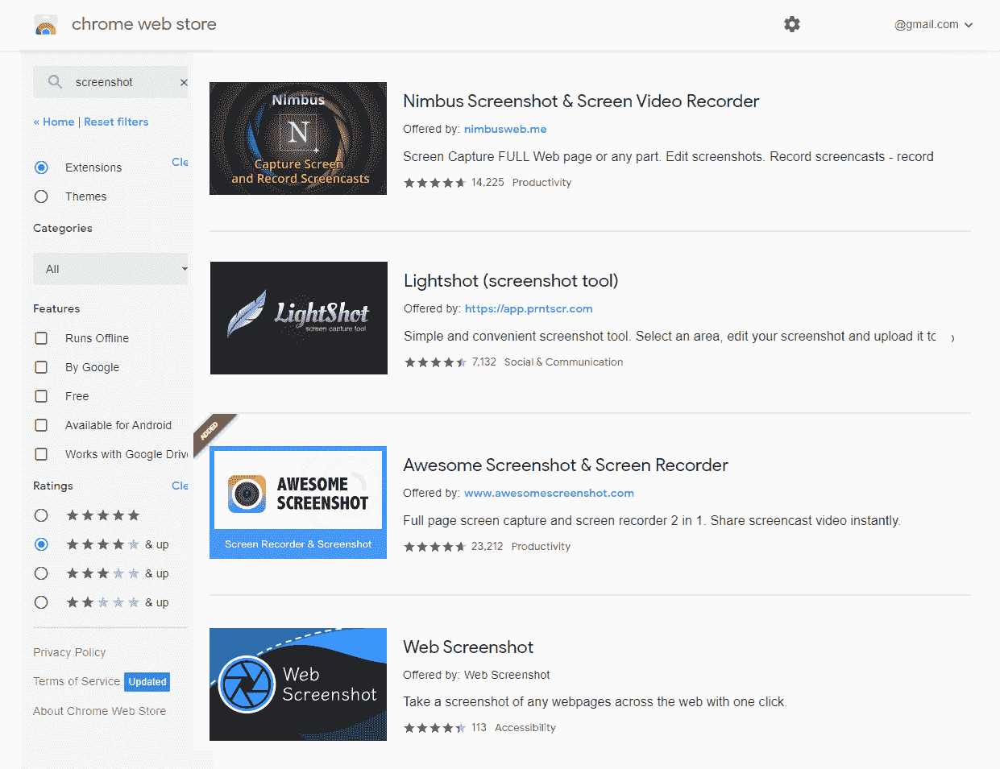

Chrome Web Store screenshot extensions.

有太多的选择，很难做出选择。为了简单起见，我们推荐以下任何一种方法:

*   [邵兵截图&屏幕录像机](https://chrome.google.com/webstore/detail/nimbus-screenshot-screen/bpconcjcammlapcogcnnelfmaeghhagj)
*   [牛逼截图&屏保](https://chrome.google.com/webstore/detail/awesome-screenshot-screen/nlipoenfbbikpbjkfpfillcgkoblgpmj)
*   [LightShot](https://chrome.google.com/webstore/detail/lightshot-screenshot-tool/mbniclmhobmnbdlbpiphghaielnnpgdp) (仅限静态截图)

所有这些工具都远远超出了你可以用 Snip & Sketch 做的事情。例如，您可以捕捉整个页面的屏幕截图，而不仅仅是其中的可见部分。

在牛逼截图中，你甚至可以使用一个 **Ctrl + Shift + E** 快捷键或者手动打开菜单来做到这一点。

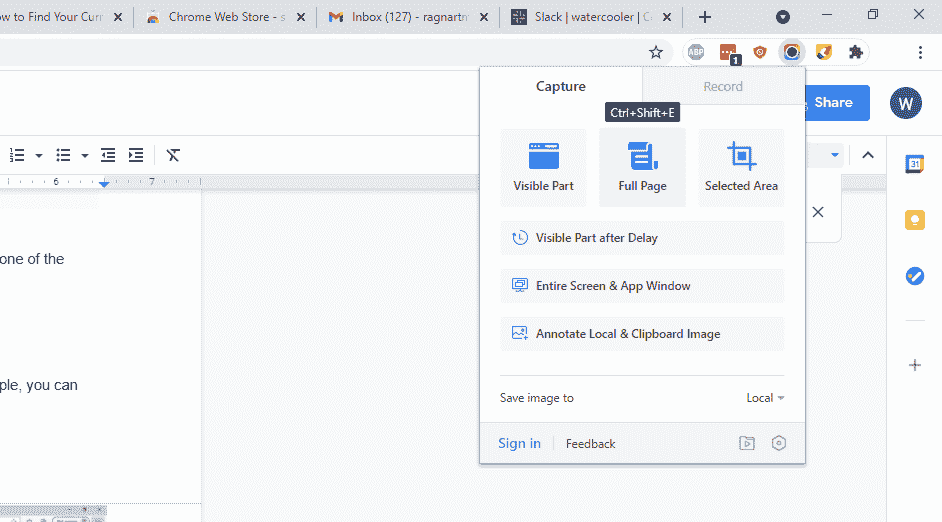

Awesome Screenshot’s menu in Chrome.

如果你想知道这看起来像什么，看看我们主页的全屏截图:一个连续的镜头完美地呈现了我们的网站在浏览器中的样子。如果有错误没有出现在 [staging](https://kinsta.com/add-ons/?plan=visits-business1&interval=month#h-premium-staging-environments) 中，这是一个分享本地服务器上的测试站点的简单方法。

[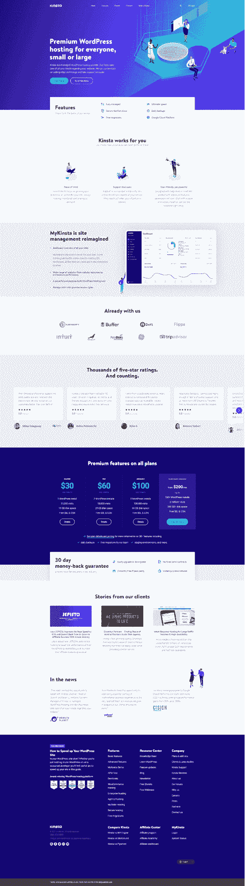](https://kinsta.com/wp-content/uploads/2021/04/Kinsta-Full-Page-Screenshot.png)

A full-page screenshot of the Kinsta homepage (click for bigger image).

另一个实用的特性是你可以截屏任何特定标签的内容。这意味着你不必裁剪掉 90 多个标签窗口或秘密文件的完整网址。

在 Awesome 截图中，这个的快捷键是 **Ctrl + Shift + V** 。

这也意味着你可以在多个不同的页面上截取相同尺寸的截图。如果你将截图作为博客或内容营销的一部分，并希望保持视觉效果的一致性，这是非常完美的。

此外，这些扩展中的大多数，包括令人敬畏的屏幕截图，都带有比你在 Windows 中找到的更好的图像编辑器。

例如，您可以模糊图像的某些部分，添加形状、箭头、文本框等等。这些选项在免费版本中都有。

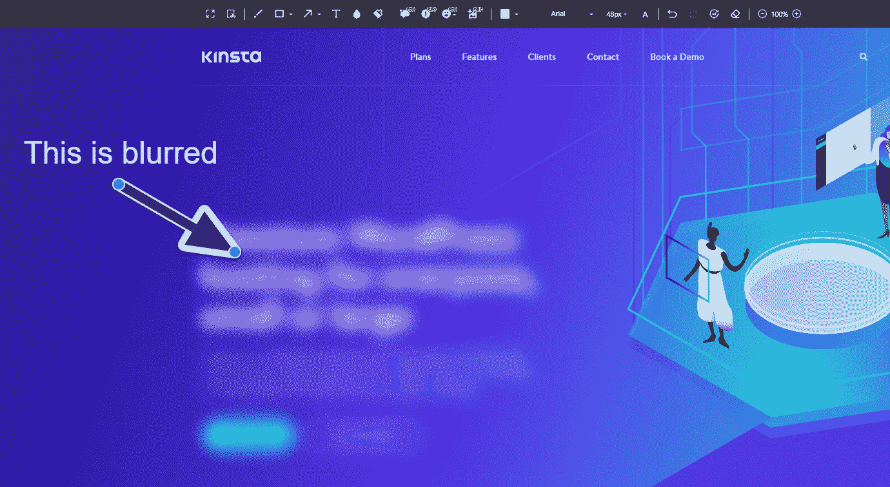

Awesome Screenshot’s editor.

这些特性使得编辑和准备教程风格的截屏变得容易，以便包含在 how-to 博客帖子中。

(如果你想成为一个更有效率的博客作者，看看我们的列表【WordPress 用户的最佳 Chrome 扩展。)

## 如何在 Microsoft Edge 中截图(整页)

关于微软 Edge 的一个有趣的事情是，最新版本已经内置了截屏功能。

你不需要安装任何额外的插件。打开浏览器，开始截图。使用快捷键 **Ctrl + Shift + S** 打开“网页截图”覆盖图。

然后，您可以选择自由选择或捕获整个页面。

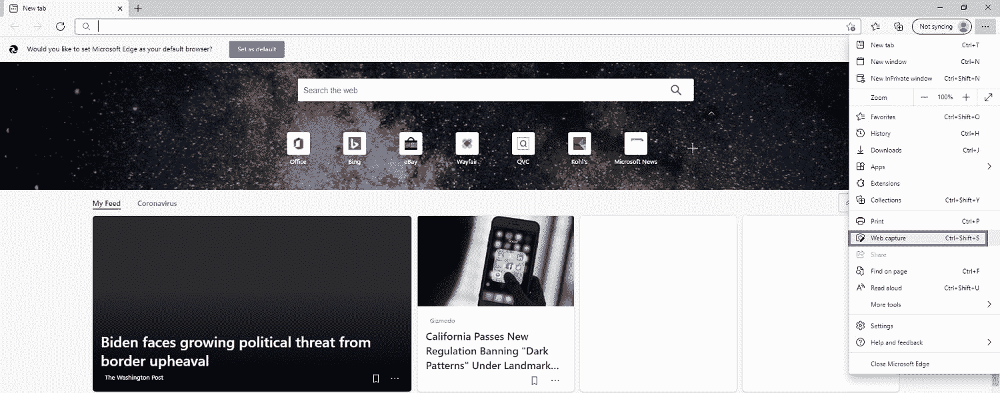

Microsoft Edge menu showing the location of the “Web capture” option.

整页抓取不依赖于多个部分截图和滚动。所以一个浮动栏不会毁了你的截图。

## 注册订阅时事通讯

### 想知道我们是怎么让流量增长超过 1000%的吗？

加入 20，000 多名获得我们每周时事通讯和内部消息的人的行列吧！

[Subscribe Now](#newsletter)

捕获页面后，您可以使用可用的绘制和擦除工具来突出显示页面上的项目或进行注释。

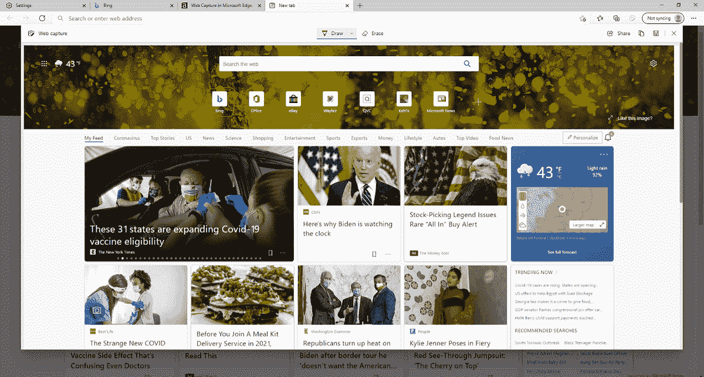

A full-page screenshot in Edge.

除此之外，你还可以分享、复制或保存截图(默认截图文件夹为`/User/Downloads/`)。

这些功能还很初级，但是这个工具非常适合与朋友或同事分享网页。

## 如何用 Xbox Game Bar 截图一个游戏(或其他任何东西)

在 Windows 10 中，默认情况下会安装并激活 Xbox Game Bar(即使你没有 Xbox)。按下 **Windows 键+ G** 就可以随时打开。

虽然它是作为截图和录制视频游戏的功能内置到 Windows 中的，但它也可以很好地捕捉电影、网站或任何其他程序的内容。

打开 Xbox 游戏吧后，要么按左上角的相机键，要么按打印屏幕快捷键不打开菜单截图: **Windows 键+ Alt + PrtScn** 。

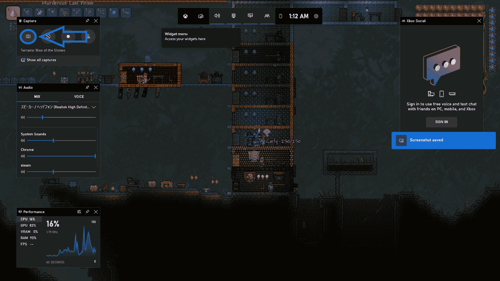

Xbox Game Bar Terraria screenshot.

打开游戏栏后，你可以点击“显示所有截图”按钮来显示最近的截图。

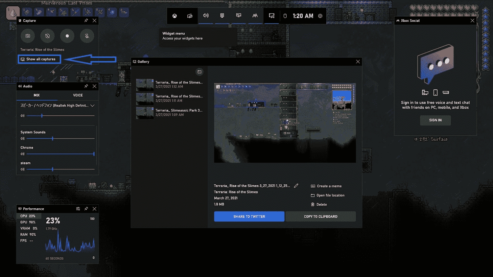

Xbox Game Bar screenshot gallery.

从这里，你可以在 Twitter 上浏览和分享所有最近的截图。甚至还有一个超级基本的“模因编辑器”，可以让你在顶部和底部添加一大块文本。

Xbox Game Bar 默认保存文件到`/User/Videos/Captures/`文件夹。它有一些独特的功能，比如可以将截图放大到 4K。

**注意:**你不一定要在玩电子游戏才能使用游戏栏来截图。

## 如何在 PowerPoint 中截图

如果你的 Windows 10 中有最新版本的 PowerPoint，它支持截图。

不用使用 **PrtScn** 键并粘贴它，您可以在 PowerPoint 中捕获其他窗口。

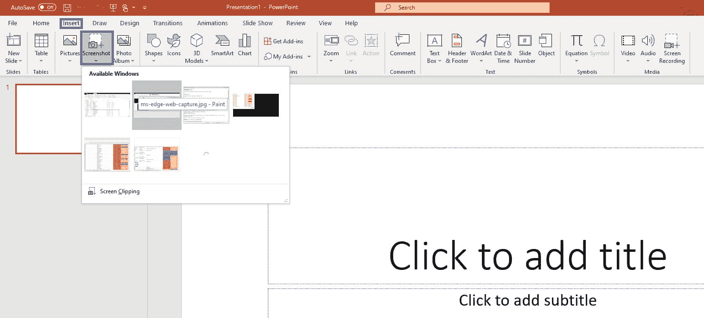

Taking a screenshot through PowerPoint.

它会自动将你选择的窗口截图插入到幻灯片中。如果是全尺寸窗口，它会覆盖整个页面。

较新版本的 PowerPoint 附带了一个相当强大的图像编辑器。你可以改变颜色、饱和度，甚至用魔棒去掉[背景](https://kinsta.com/blog/wordpress-background-image/)。

您还可以使用 PowerPoint 中的形状、边框和文本来自定义屏幕截图，并将幻灯片保存为图像。

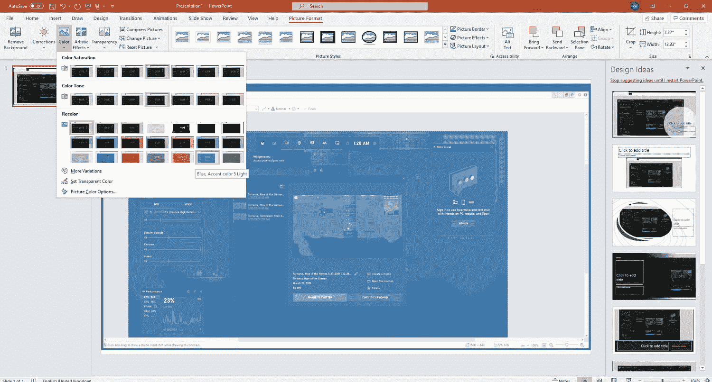

Editing a PowerPoint screenshot.

综合起来，这可能使 PowerPoint 成为最有效的微软官方截屏工具。

## 如何使用 LightShot(和其他第三方应用程序)截屏

Lightshot 是一款轻量级、令人惊喜且易于使用的截屏软件。要使用 LightShot 这样的第三方软件，首先需要做的就是下载程序。

访问官方网站上的[下载页面](https://app.prntscr.com/en/download.html)，使用相应的按钮或链接下载 Windows 版本。

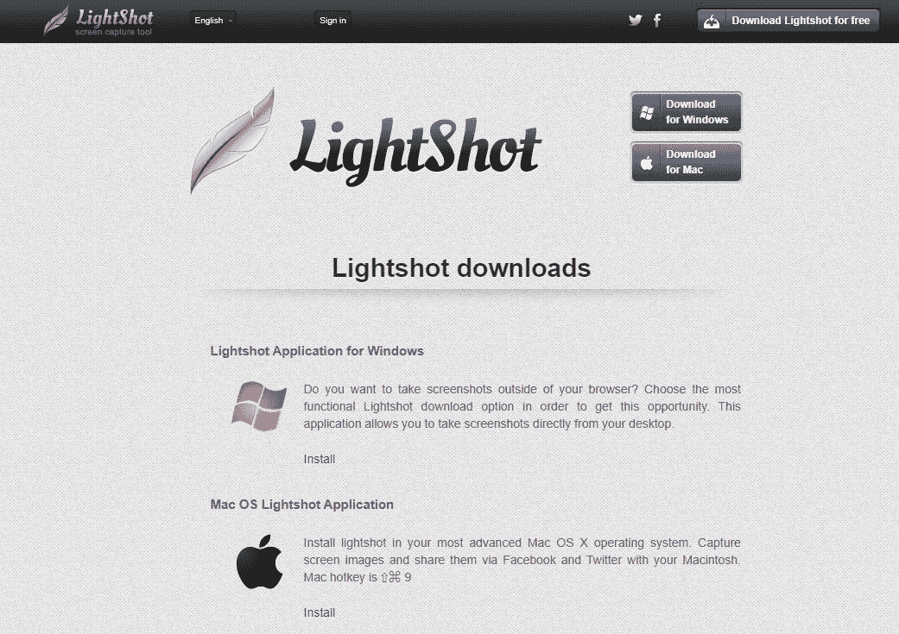

LightShot screenshot tool’s download page.

一旦安装，它会自动覆盖常规的 **PrtScn 键**命令。每次你按下那个键，现在你就打开了 LightShot 界面。

需要为您的电子商务网站提供超快的、可靠的、完全安全的托管服务吗？Kinsta 提供所有这些服务，并由 WooCommerce 专家提供 24/7 的世界级支持。[查看我们的计划](https://kinsta.com/plans/?in-article-cta)

您可以选择屏幕的一个区域来捕捉和添加简单的文本、矩形或箭头。您可以使用鼠标滚动来编辑线条和元素的粗细。如果您没有插入鼠标，请尝试用两个手指在触摸板上滑动。

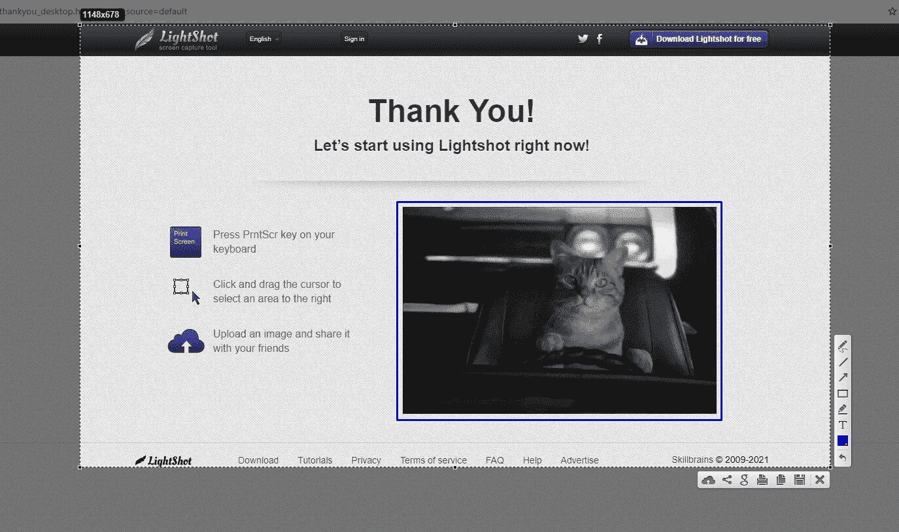

Taking a screenshot with LightShot.

要保存文件，你可以点击保存图标或者使用 Windows 标准的 **Ctrl + S** 快捷键。默认情况下，它将文件保存在`/Documents/Lightshot/`文件夹中。但是您可以更改该文件夹，并轻松地将文件保存在其他位置。

不是超级厉害，但是用起来又快又省力。

## 如何在微软 Surface 设备上截图

在安装了 Windows 10 的微软 Surface 上，你已经可以使用我们到目前为止提到的任何方式。

好像这还不够，还有一种自定义的截图方式——因为从技术上来说它也是一台平板电脑。

要在你的 Surface 设备上截图，按住 **Windows** 按钮，同时按下**音量调低**按钮。当它截图时，屏幕会变暗。

您将在`/User/Pictures/Screenshots`文件夹中找到屏幕截图文件。

一些 Surface 用户抱怨说，这个选项对他们的电脑不适用。如果不起作用，您可以对设置进行故障诊断，或者使用我们到目前为止介绍的其他八种方法中的任何一种。

如果你成功了，我们已经向你展示了在你的 Windows 电脑上截屏的九种方法。我们将在下一节讲述如何从你的电脑屏幕上捕捉视频。

## 在 Windows 中捕获视频的 4 种方法

对静态图像不满意？想要运动吗？

我们并不惊讶。视频通常是展示教程步骤、分享游戏或提供反馈的更好方式。

这里有四种不同的工具可以用来在 Windows 中捕捉视频。

### 查看我们的[视频指南](https://www.youtube.com/watch?v=movAdBNW3mY):如何在 Windows 上进行屏幕录制(7、8、10)

### 1.xbox 游戏吧

录屏和截图一样简单。您可以使用快捷键 **Windows 键+ Alt + R，**或打开游戏栏，开始录制。

一旦游戏栏打开(**赢** + **G** ，就可以按下录制按钮开始录制画面。

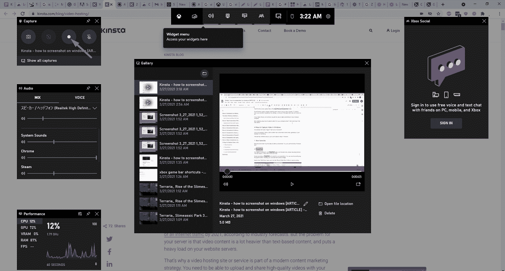

Xbox Game Bar record screen.

很简单，对吧？它将所有视频文件存储在`/User/Videos/Captures/`文件夹中。

但是在你上传一步一步的视频教程到你的网站之前，请注意。视频文件很大。你最好使用这些[视频托管解决方案](https://kinsta.com/blog/video-hosting/)中的一个。

### 2.文稿演示软件

您可能会惊讶地在本文中再次看到 PowerPoint，但它也有屏幕录制功能。唯一的事情是，它有一个最小的用例。

PowerPoint 中的屏幕录制只适用于您的演示文稿。您可以记录自己浏览幻灯片的过程，包括您的声音和网络摄像机镜头。

进入**幻灯片放映**菜单，点击**录制幻灯片放映**按钮开始录制。

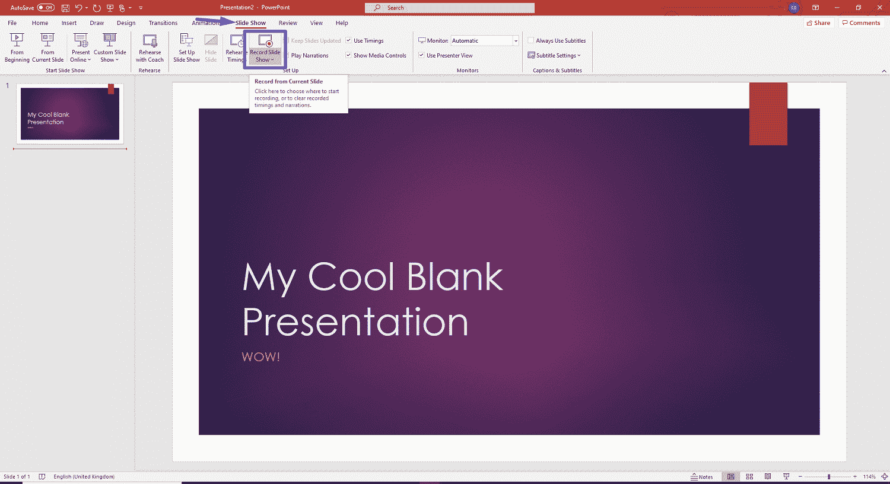

PowerPoint’s Slide Show menu.

然后它会记录你的声音和摄像头，你可以使用绘图工具来帮助你的解释。

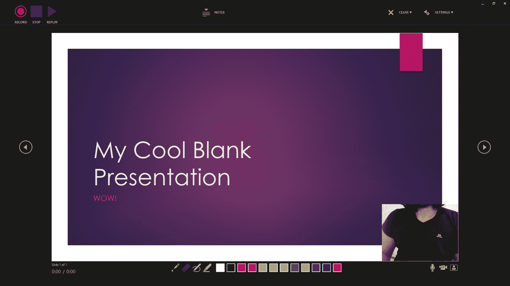

Recording a PowerPoint presentation.

**注意:**如果你没有一台功能强大的电脑，PowerPoint 演示文稿中花哨的动画过渡会导致大量的延迟和最终视频的起伏。保持动画最少，以避免不连贯的结果。

### 3.专用屏幕录制软件

您也可以使用专用的第三方软件解决方案来录制您的屏幕。

对于初学者，我们会推荐一个简单的工具，如 [Snagit](https://www.techsmith.com/screen-capture.html) 或 [Zappy](https://zapier.com/zappy) 。然而，你可能已经安装了 Xbox 游戏条(如果你使用的是 Windows 10 的话)。

对于高级用户和经验丰富的[视频编辑](https://kinsta.com/blog/free-video-editing-software/)，你可能想要更多的功能和可定制性。

Camtasia 是一个强大的屏幕记录器和视频编辑器，可以很容易地从头开始创建[详细的教程视频](https://www.youtube.com/c/Kinsta/featured)。

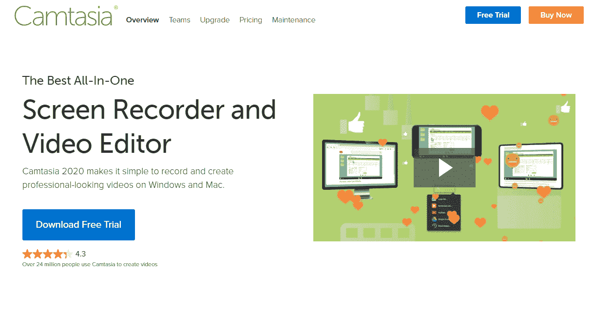

Camtasia screen recorder app.

300 美元，可能超出了非专业用例的预算范围。

如果你想要比 Zappy 或游戏条多一点的功能而不需要付费，我们可以满足你。

这个列表中的最后一个选项是 100%免费的。此外，它非常适合各种专业用途。

### 4.织机镀铬延伸

Loom 是一个简单易用的屏幕录制工具，你可以作为 Chrome 扩展下载。它可以记录你的屏幕、声音和面部长达五分钟(免费版)。

您可以通过点击开始菜单中的图标或使用 **Alt + Shift + L** 快捷键来打开 Loom up。

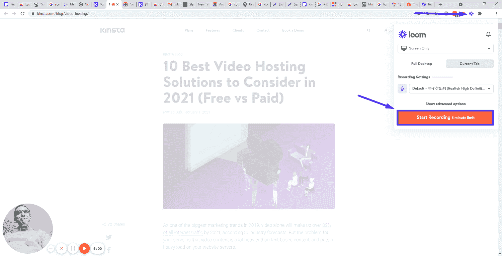

Loom screen recording Chrome extension.

这是与[远程同事](https://kinsta.com/blog/working-remotely/)、客户或商业伙伴分享反馈或交流难题的完美工具。

如果你安装了桌面版，你甚至可以用一个五彩纸屑的效果来祝贺某人做得很好。

Loom 的独特之处在于它不仅仅是一个截屏工具。这是一个免费的 [SaaS 解决方案](https://kinsta.com/blog/saas-products/)，可以自动上传你的截屏视频和可分享的链接。

你可以通过访问 [Loom Chrome 扩展页面](https://chrome.google.com/webstore/detail/loom-for-chrome/liecbddmkiiihnedobmlmillhodjkdmb)轻松安装。

[让捕捉 Windows 中的截图像 1、2、3 一样简单，多亏了这个快速指南✅ 点击推文](https://twitter.com/intent/tweet?url=https%3A%2F%2Fkinsta.com%2Fblog%2Fhow-to-screenshot-on-windows%2F&via=kinsta&text=Make+capturing+a+screenshot+in+Windows+as+easy+as+1%2C+2%2C+3%2C+thanks+to+this+quick+guide+%E2%9C%85&hashtags=WindowsTips%2CWindows)

## 摘要

无论你是在全新的 Surface 笔记本电脑上使用旧版本的 Windows 7，还是最新版本的 Windows 10，你都有大量的截图选项。

你可以使用内置的键盘快捷键、Snip & Sketch 等 Windows 工具，或者 Chrome 中的第三方应用。甚至 PowerPoint 也有一个内置的功能，可以截图并包含在你的演示文稿中。

和 Windows 一样，这同样适用于在 Mac 上截图。

静态截图只是开始。你甚至可以拍摄视频，显示你正在一步一步地做什么，并立即在网上分享，包括评论。

* * *

让你所有的[应用程序](https://kinsta.com/application-hosting/)、[数据库](https://kinsta.com/database-hosting/)和 [WordPress 网站](https://kinsta.com/wordpress-hosting/)在线并在一个屋檐下。我们功能丰富的高性能云平台包括:

*   在 MyKinsta 仪表盘中轻松设置和管理
*   24/7 专家支持
*   最好的谷歌云平台硬件和网络，由 Kubernetes 提供最大的可扩展性
*   面向速度和安全性的企业级 Cloudflare 集成
*   全球受众覆盖全球多达 35 个数据中心和 275 多个 pop

在第一个月使用托管的[应用程序或托管](https://kinsta.com/application-hosting/)的[数据库，您可以享受 20 美元的优惠，亲自测试一下。探索我们的](https://kinsta.com/database-hosting/)[计划](https://kinsta.com/plans/)或[与销售人员交谈](https://kinsta.com/contact-us/)以找到最适合您的方式。