# 如何在 2022 年卖掉一个网站，获得你应得的价格

> 原文：<https://kinsta.com/blog/sell-website/>

你是否厌倦了管理你的电子商务商店的日常事务？你是否突然得到了一份妨碍你在线业务的新工作？要不要和城市的乱象断开连接，线下生活在农村？本指南将告诉你如何销售网站并获得最高价格。

如果你担心出售网站不值得，你可能需要重新考虑。你可以获得月净利润的 20-40 倍。本文将向您展示如何做到这一点。

激动吗？我们开始吧！

## 卖一个网站需要多长时间？

大多数网站经纪人和市场都有 30-180 天的活跃上市期。但这并不意味着一两个月就能让你的网上生意达到你想要的价格。

你可以在很多方面将网站销售比作创业退出或出售房屋。

你需要投入时间[让你的网站达到巅峰](https://kinsta.com/blog/bootstrapping-startup/)。在接触买家之前，你还必须为新的所有权打下基础。如果你做不到这一点，你甚至一开始就很难找到一个愿意购买的人。

你预先投入的时间、金钱和精力越多，销售就越容易。一个管理良好的在线企业，拥有自动化的内容创建流程和实现，比一个临时拼凑的烂摊子更容易销售。

> Kinsta 把我宠坏了，所以我现在要求每个供应商都提供这样的服务。我们还试图通过我们的 SaaS 工具支持达到这一水平。
> 
> <footer class="wp-block-kinsta-client-quote__footer">
> 
> 
> 
> <cite class="wp-block-kinsta-client-quote__cite">Suganthan Mohanadasan from @Suganthanmn</cite></footer>

[View plans](https://kinsta.com/plans/)

在你考虑出售你的网站之前，我们已经包括了一些必要的步骤。

[厌倦了管理您的电子商务商店的日常事务？😴准备好断开连接并收获您所建立的成果了吗？😌在这篇⬇️指南中，你可以看到如何出售你的网站并获得最高的价格💰 点击推文](https://twitter.com/intent/tweet?url=https%3A%2F%2Fkinsta.com%2Fblog%2Fsell-website%2F&via=kinsta&text=Tired+of+running+the+day-to-day+of+your+ecommerce+store%3F+%F0%9F%98%B4+Ready+to+disconnect+and+reap+the+rewards+of+what+you%27ve+built%3F+%F0%9F%98%8C+See+exactly+how+to+sell+your+website+and+get+the+highest+price+for+it+in+this+guide+%E2%AC%87%EF%B8%8F%F0%9F%92%B0&hashtags=Ecommerce%2CWebDev)

## 卖网站赚大钱的 7 个步骤

出售你的网站或在线业务可能看起来是一个复杂的过程。当你增加步骤，试图最大化售前价值时，事情变得更加复杂。下面，我们概述了一个 7 步流程，将帮助您应对这一挑战。

### 1.多样化你的流量来源

如果你的业务目前主要依赖于付费流量和广告，你应该在考虑出售前分散你的流量来源。特别是，你要专注于[增加你的有机流量](https://kinsta.com/blog/wordpress-seo/)。

有机来源的流量利润率更高，但这还不是全部。有经验的买家和经纪人非常重视长期稳定性和易管理性。

由微影响者促销活动驱动的电子商务商店的价值与每月持续吸引成千上万有机访客的电子商务商店的价值有很大的不同。

谷歌稳定的有机搜索引擎流量向买家表明，他们不会在广告上破产。

举例来说， *A-Z 动物*与它们每月的访客相比，收入数字相对较低。尽管有几个月没有获得 5000 美元的收入，但它的售价超过了 30 万美元。

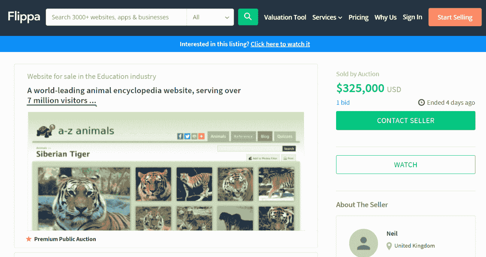

A-Z Animals Flippa listing.

但是流量来源是有机的，几乎保证了未来几年每个月都有成千上万的游客。成功的卖家知道如何用谷歌分析和搜索控制台报告突出这一点。

有机交通报告帮助感兴趣的买家评估未开发的收入潜力。他们可能有网络或资源来改善商业模式，提高每次访问的收入。

我们将在下面更详细地介绍这个例子，但主要的要点是，稳定的有机流量是一个很好的销售论据。即使没有实际的商业模式，它也能提升你的商业价值。

为了获得更多的有机流量，查看我们广泛的 [45 点 WordPress SEO 清单](https://kinsta.com/blog/wordpress-seo/)。即使你使用 BigCommerce 或 Shopify 而不是 WooCommerce，许多技巧仍然适用。

如果你已经获得了有机流量，确保你利用电子邮件营销和社交媒体建立了一个回头客平台。这些受众是任何电子商务商店或在线业务的强大资产，即使你即将出局。

当你试图出售你的业务时，对现有客户的重复销售也会看起来很棒。

### 2.创建流程并使用第三方服务

一些类型的网站和电子商务商店需要更多的参与。如果你正在经营一家电子商务商店，目前正在自己完成订单，你应该在出售业务之前改变这种情况。在卖掉它之前，你必须尽可能地减少你对企业的参与。

有资本以数万美元的固定费用购买一家企业的潜在买家不会再寻找另一份全职工作。他们在寻找现成的投资机会。这通常意味着自动化的[业务，几乎不需要动手。](https://kinsta.com/blog/ecommerce-strategies/#automation)

如果他们认为你的业务不符合标准，他们会很快提出问题。

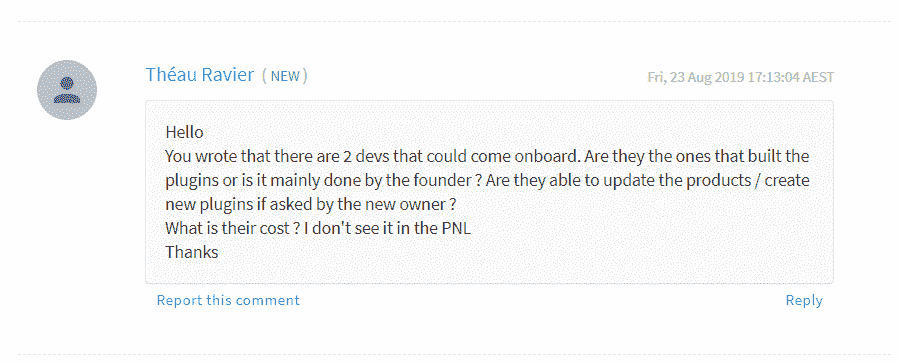

Flippa listing comment.

这里，一个潜在的买家关心维护 WordPress 插件，这是卖家的主要收入来源。这是对你的目标市场的优先次序的一瞥:他们不想接管一个企业——不得不把他们的生命奉献给它——因为它已经分崩离析了。

为了帮助减轻这样的担忧，请遵循下面的清单。

**自动化流程清单:**

*   培训虚拟助理处理日常业务任务(客户支持、运营等)。).
*   通过第三方服务处理订单履行。
*   将新的内容创作外包给可靠的作家和设计师。
*   对于软件产品，让自由开发者来处理更新和补丁。
*   自动化 CMS 更新和备份。

**注意:**你也可以选择像 Kinsta 这样的[管理的 WordPress 托管提供商，在那里我们为你处理备份。](https://kinsta.com/blog/managed-wordpress-hosting/)

[亚马逊 FBA](https://services.amazon.com/fulfillment-by-amazon/benefits.html) 是订单履行和运输的绝佳选择，但也有其他选择。你可以使用像 [UpWork](https://www.upwork.com/) 这样的自由市场来测试潜在的增值业务。

你越能脱离这个过程，就越好。当然，只有当你的网站的收入能够覆盖这些费用时，这些费用才会成为卖点。

### 3.整理好你的财务和交通报告

没有人会投资一家没有财务和资产证明的企业。如果你的在线业务资产之一是有机流量或社交媒体关注，采取措施对此进行适当的记录。

请记住，市场和经纪人需要几个月的核实财务和交通报告。

所以确保你已经在你的网站上安装了[谷歌分析](https://kinsta.com/blog/google-analytics-wordpress/)或者其他软件。销售报告通常可以从任何电子商务工具中导出，问题不大。

**推荐财务报告:**

*   损益解释(PnL 解释或 P&L 解释)
*   销售证明(亚马逊/AdSense/woo commerce/Shopify/big commerce 报告)——大多数经纪人要求至少 6-12 个月的报告。
*   广告支出

**推荐流量报告:**

*   **Google Analytics:** 大多数经纪人要求至少三个月的经核实的 Google Analytics 报告。
*   谷歌搜索控制台报告:你可以用它们来展示你的有机流量的潜在价值。
*   **广告报告:**无论是谷歌广告，脸书广告，还是[其他广告网络](https://kinsta.com/blog/adsense-alternatives/)，如果你的主要流量来源之一是广告，提供相关报告证明你的盈亏数字。

### 4.选择正确的市场或经纪人

一旦你完成了所有的细节，就该进入销售环节了。第一部分是选择合适的销售地点。

既然你正在读这篇博客，你可能会想知道:

#### 哪里可以卖我的网站？

销售你的网站最好的地方是有经验证的网站经纪人或网站市场。它们比在你的网站或社交媒体页面上进行营销要有效得多。他们还充当你和买家之间的中介，通过托管系统处理销售。

我们准备了一份三个最有声誉的市场和经纪人的名单。仅在上周，这些平台的总销售额就超过了 100 万美元。

因为销售时的第一要务是可靠性，确保没有人窃取你的网站或卷走你的钱，所以我们把重点放在了有最佳记录的经纪人身上。

##### 鳍状肢

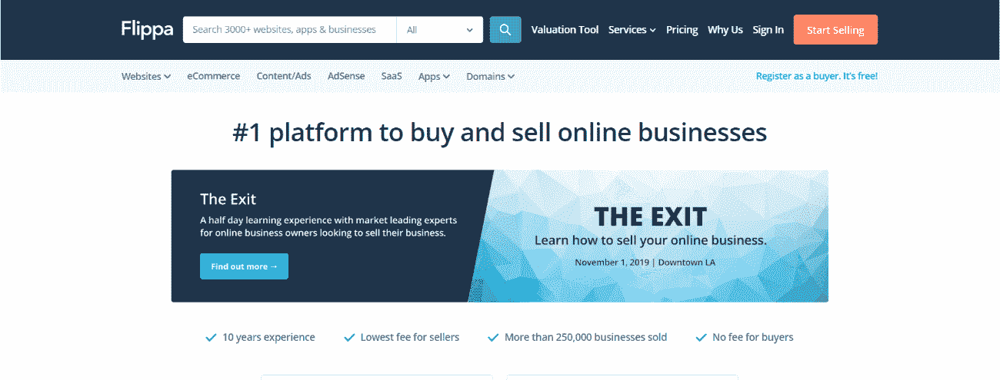

Flippa website marketplace.

自推出以来，用户已经在 [Flippa](https://flippa.com) 上售出了超过 38，000 个网站。Flippa 是一个类似于易贝的[公开拍卖平台](https://kinsta.com/blog/woocommerce-extensions/#simple-auctions)。默认情况下，任何人都可以在你的网站上看到并出价。为了避免激发竞争对手和揭示你的利基，你也可以选择让你的上市保密。

**费用:** $49 上市费，5 万美元以下成功销售额的 10%(如果你选择使用经纪人，15%)。

Flippa 是唯一一个有最近出售网站的可视目录的网站。你可以访问这些网站寻找灵感，并将最终价格与你的出价进行比较。

##### 帝国脚蹼

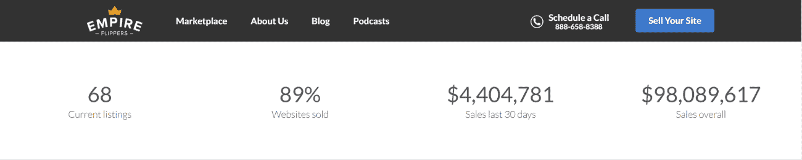

帝国鳍状肢是一个网站经纪人，专注于各种规模的在线业务。上市的最低要求是每月净利润 1000 美元。

自推出以来，他们已经卖出了价值近 2.45 亿美元的网站。

**费用:** $0 到列表，销售额的百分比

成功[佣金](https://kinsta.com/knowledgebase/recurring-commissions/)取决于您企业的标价:

*   1000 万美元以上的公司为 2%
*   500 万到 1000 万美元之间的任何公司 5%
*   200 万至 500 万美元的企业为 8%
*   对于 100 万至 200 万澳元之间的公司为 12%
*   100 万美元以下的公司为 15%

选择像帝国鳍状肢这样的经纪人的好处之一是潜在买家已经信任他们。他们对卖家和他们的网站有严格的要求。这有助于你确保准备好买家想要的一切。

你的潜在买家会对你提供的数字更有信心，因为可信的第三方已经核实了这些数字。

##### FE 国际

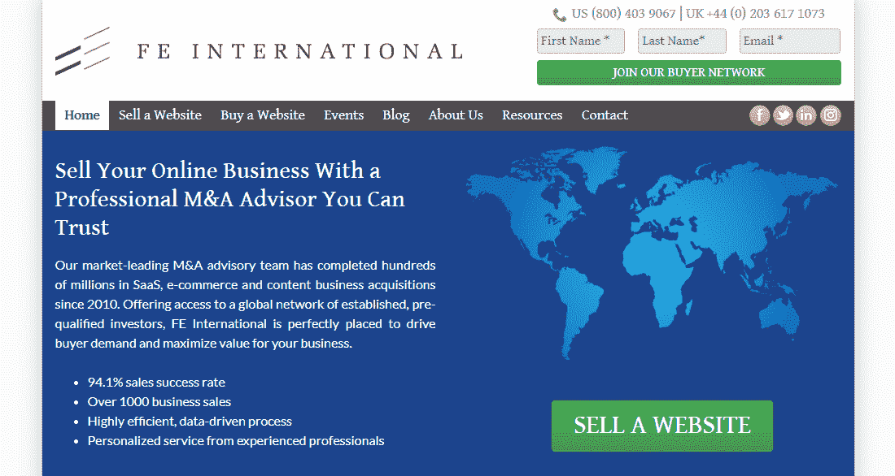

FE International website homepage.

[FE International](https://feinternational.com/) 是一家专业的并购&顾问公司，主要专注于大型[电子商务商店](https://kinsta.com/blog/ecommerce-platforms/)、SaaS 公司和在线内容出版商。

根据他们的内部消息来源，FE 已经完成了 1，000 多项收购，销售额超过 5 亿美元。他们拥有令人印象深刻的 94.1%的成功率。《金融时报》还将 FE 列为 2021 年美洲发展最快的[公司之一。](https://www.ft.com/americas-fastest-growing-companies-2021)

**费用**:0 美元；大约 14%的佣金

FE 没有上市费，但他们在将企业上市销售之前会对其进行彻底审查。佣金是与 FE 国际销售网站相关的唯一费用。

他们的佣金根据交易规模的不同而不同，而且他们没有公开的指导方针。但是在接受《增长无处不在》采访时，FE 的首席执行官表示他们的平均佣金在 14%左右。

FE 最近发表了他们的[技术 M & A: 2021 展望报告](https://feinternational.com/2021-market-report-download/)。他们还经营贸易刊物 [SaaS 杂志](https://www.saasmag.com/) ( [金斯塔在他们的 SaaS 1000 强排行榜上排名 140](https://kinsta.com/fastest-growing-saas-companies/) )和 [LTV 会议](https://ltvconf.com/) SaaS 会议。

### 5.了解您的潜在买家，定制您的销售页面

当你创建一个网页来销售你的网站时，你需要知道谁是你的潜在买家，他们在网站上寻找什么。观看帝国鳍状肢对一位买家的采访，听听他的优先考虑和恐惧。

在 Flippa 上查看[最近出售的网站，这些网站达到了你想要达到的利润倍数。考虑流量来源、可靠的文档和劳动强度等因素。你也许能找到一种模式，其中一个方面在你的行业中非常重要。](https://www.flippa.com/search?search_template=just_sold&filter%5Bproperty_type%5D=website&sort_alias=highest_price)

86%的消费者对提供相关内容的公司的产品更感兴趣。

如果你能提供你的理想买家想要的所有内容、报告和细节，你就领先了一步。他们会觉得在你的网站上出价更舒服，他们的上限会比他们有任何未解疑惑时高得多。

因为所有重要的经纪人都收取佣金，他们有动力去推销你的网站。潜在交易越大，推动你上市和完成交易的动力就越大。

这是在完成上市之前把所有事情都安排好的另一个原因。

如果你选择像帝国鳍状肢这样的经纪人，他们会为你设计销售页面，处理广告。

### 6.让您的团队或虚拟助理为销售做好准备

一旦你决定出售企业，你需要让所有相关人员为潜在的所有权转移做好准备。确保所有利益相关者了解情况，核心成员准备好帮助买方转变为所有者/经营者的角色。

你可以通过使用现代团队管理解决方案让事情变得更简单，比如 [Slack](https://kinsta.com/blog/how-to-use-slack/) ，在这里转移所有权是一个简单的过程。

这样，他们可以立即看到所有正在进行的项目。你不必转发数百封与业务相关的电子邮件。

你还应该用一个可转让的商业账户来处理邮件，而不是用你的 Gmail。这有利于客户服务问题和类似的沟通。

## 注册订阅时事通讯

### 想知道我们是怎么让流量增长超过 1000%的吗？

加入 20，000 多名获得我们每周时事通讯和内部消息的人的行列吧！

[Subscribe Now](#newsletter)

### 7.知道你的网站值多少钱

为了避免亏损，你需要知道你的网站值多少钱。在你扣动扳机出售你的网站之前，你应该对它能带来什么有一个大致的概念。

通常价值在你月利润的 15-30 倍(或年利润的 1-3 倍)之间。通常，您可以使用过去 12 个月的平均值来计算这个数字。

2015 年网站销售的平均价格从[的 2.2 到 2.9 倍](https://blog.flippa.com/how-much-is-my-website-worth/)不等，视行业而定。

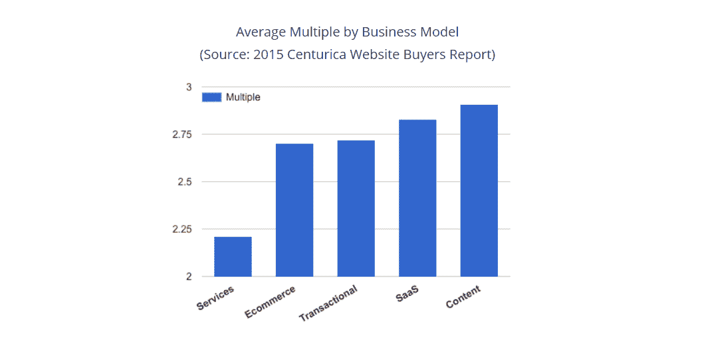

Average multiples by business models. ([Source](https://blog.flippa.com/how-much-is-my-website-worth/))

对于单个网站，还有其他因素，如销售的预期寿命、流量来源、费用、所需工作量等等。

我们已经在另一篇文章中深入介绍了[评估你的网站](https://kinsta.com/blog/how-much-is-my-website-worth/)价值的过程。但是上面列出的平均倍数应该会给你一些你期望净赚多少的概念。

你年净利润的 2-3 倍并不是一个硬性规定。如果你在过去六个月里看到了稳定、快速的增长，你可以预期你的预期收益会有所不同，这意味着你的网站估值应该反映这一点。

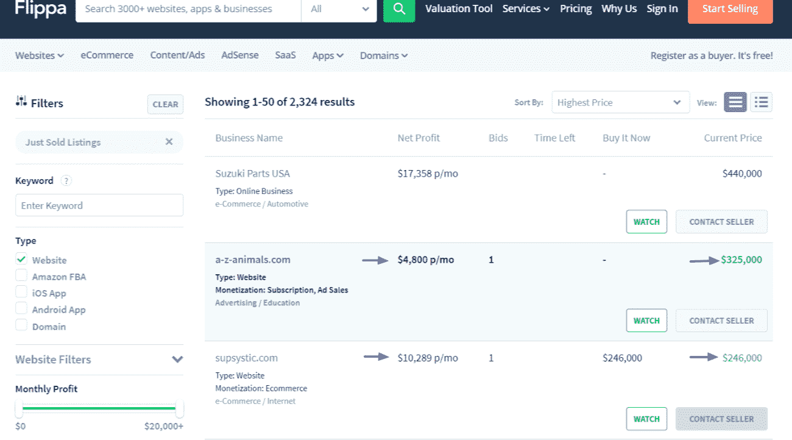

Flippa homepage with recently sold websites.

在 Flippa 上最近出售的网站列表中，你可以看到一个网站的售价超过了其年利润的 5.6 倍。另一个网站勉强刮了 2.0 次。还有其他一些关键因素，但关键的区别在于，一个买家设定的即时“立即购买”价格低于年利润的三倍。

如果你看到类似的企业在去年达到更高的数字，不要急于出售你的网站。

## 2021 年销售额超过 10 万美元的 5 个网站

在这一节中，我们仔细看看 2021 年销售额达到 10 万美元及以上的五个网站。我们很快分析了为什么他们能卖这么高的价格的移动部分。

### 重罪犯就业中心——售价 50 万美元

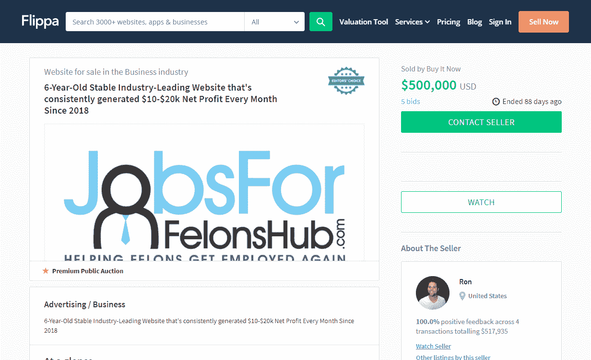

Jobs For Felons Hub Flippa listing.

**行业** **:** 广告(商业)

2021 年,《重罪犯的工作》Hub 在 Flippa 上的售价高达 50 万美元。

为什么这个网站能够获得比平均水平高得多的收益？

流量和商业模式才是主要的。

#### 交通

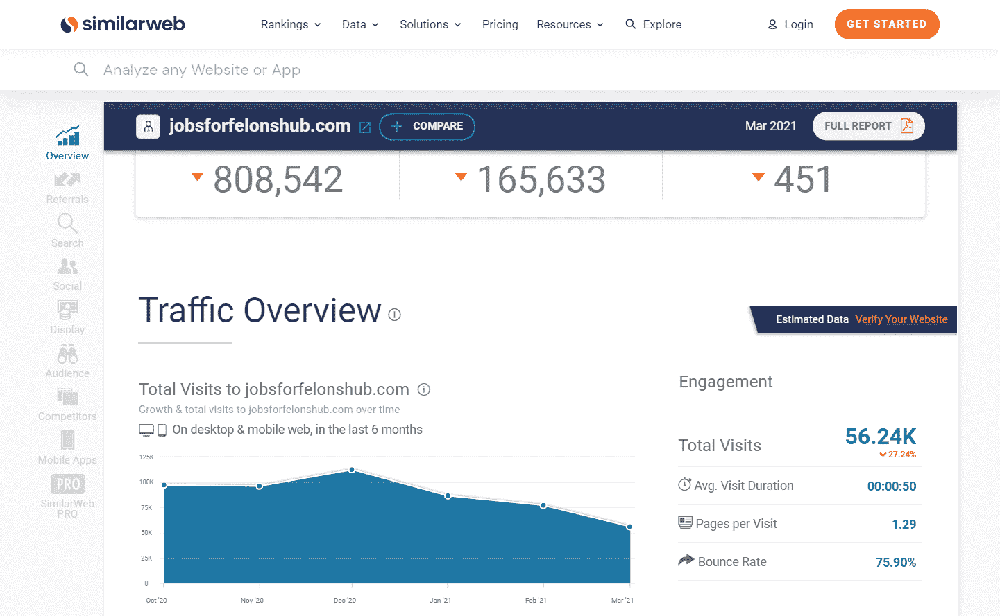

Jobs For Felons Hub SimilarWeb report.

SimilarWeb 估计该网站的月访问量约为 56，000。

但这还不是全部:超过 85%的流量来自有机搜索结果。

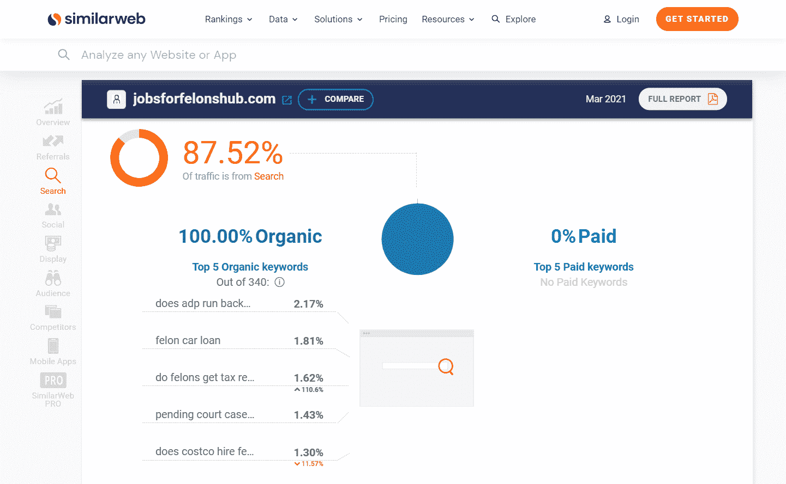

Jobs For Felons Hub search traffic.

交通源分解开始显示部分全貌。这个网站的有机流量和搜索引擎优化策略是稳健的，在不投入一分钱的付费广告努力的情况下，为他们赢得了超越同类大多数网站的排名。

#### 商业模式

正如你可能从域名中猜到的那样，这项在线业务专注于帮助被定罪的重罪犯找到工作——这是一项需求越来越大的服务。它的重点是提供高质量的内容，以帮助提升求职者的前景，并以工作板的形式为重罪犯友好的工作列表提供搜索聚合平台。

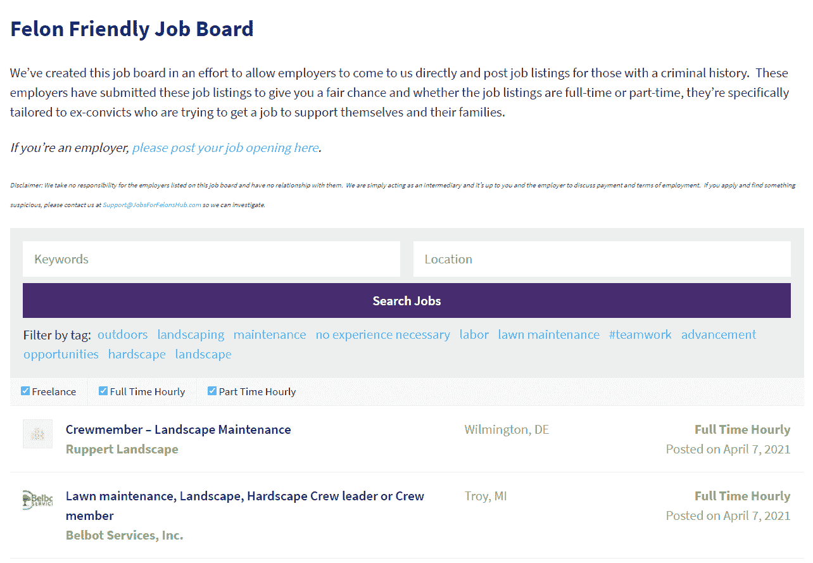

Jobs For Felons job board.

佐治亚大学 2010 年的一项研究发现，3%的美国人口有重罪前科。这个数字还在继续上升。

即使考虑到不是所有的重罪犯都会在网上找工作，这也是一个庞大的受众群体。

虽然重刑犯工作中心提供的内容是他们业务的驱动力，但他们的附属链接是他们商业模式的基石——他们在网站上提到了这一事实。

一个快速的网站对于发展和维持你的业务至关重要。Kinsta 提供超快的服务器和来自 WordPress 专家的 24/7 世界级支持。[查看我们的计划](https://kinsta.com/plans/?in-article-cta)

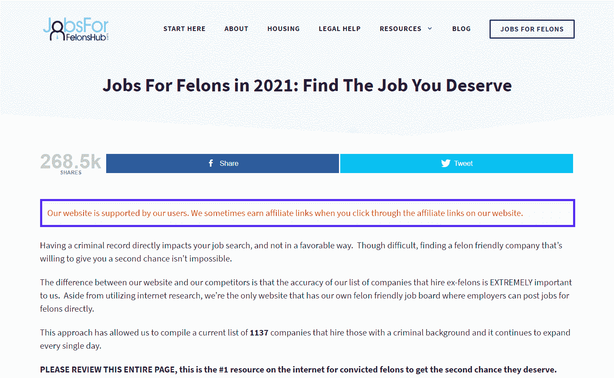

Jobs For Felons Hub website notice about affiliate links.

该网站还通过网站盈利平台 Ezoic 进行定向页面广告。通过他们的网页和博客提供了如此多的内容，重刑犯工作中心有足够的机会从读者那里收取会员佣金。

### 阿特科夫——售价 21 万美元

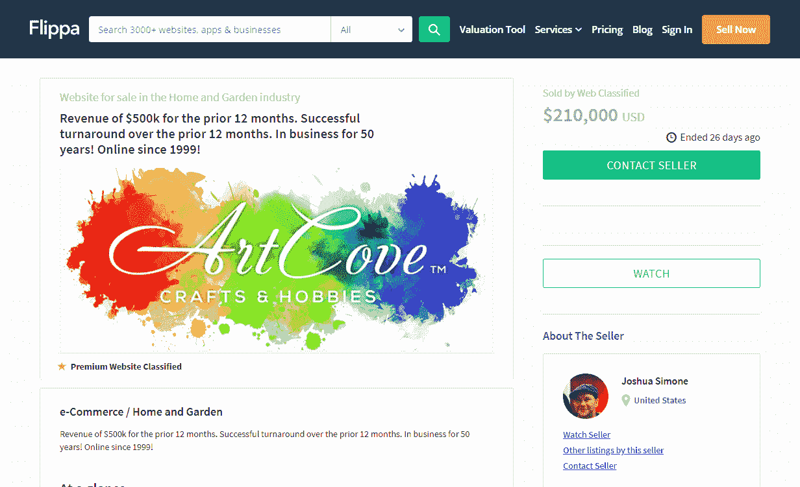

ArtCove Flippa listing.

**行业:**电子商务(家居和花园)

ArtCove 拥有完全不同的基础和商业模式。但它仍然净赚了 210，000 美元，每月净利润为 13，339 美元。

如果我们看一下他们的流量数字，我们很快意识到流量不是原因。

#### 交通

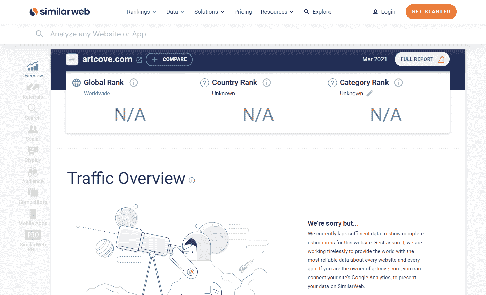

ArtCove SimilarWeb report.

根据 SimilarWeb 的说法，由于数据不足，它无法显示任何统计数据。这意味着流量很低，他们没有办法提供每月的估计。像这样的网站通常每个月会有几千的访问量。

ArtCove Ahrefs organic search traffic.

使用 [Ahrefs](https://ahrefs.com/) ，我们可以看到该网站的流量比列表中的其他销售网站要低，每个月只有大约 2500 个有机访问者。

这么低的流量，他们是怎么卖出 20 多万美元的？

#### 商业模式

商业模式是简单的艺术用品零售。

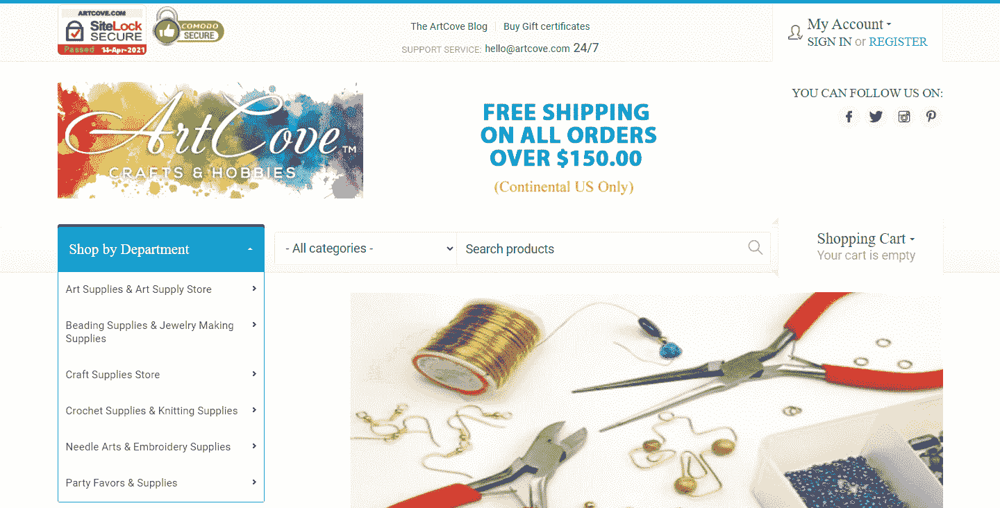

The ArtCove website.

ArtCove 的独特之处在于，它始于 70 年代，当时是一家实体企业。然后，到 2015 年，它发展成为一家纯在线零售商，以跟上不断变化的商业世界，并获得更广泛的消费者基础。

他们悠久的历史赋予了他们作为真正的成功供应商的信誉。拥有这样一家成熟的企业对他们留住客户很有帮助。

ArtCove 还在社交媒体上建立了稳固的地位。他们的脸书、Instagram、Twitter 和 Pinterest 账户经常更新，并经过精心策划，以吸引艺术家和手工艺者。

一个功能齐全的零售企业——包括内置的供应商、内容、销售策略和忠诚的客户——对那些寻求投资交钥匙经营的人来说是无价的。通过这种方式，即使是最普通的基于产品的网站也可以在销售过程中获得可观的利润，只要它们能够展示具体的成功历史。

### Tiredeets.com——售价 20 万美元

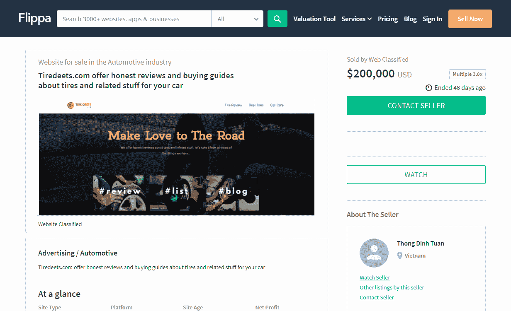

Tiredeets.com Flippa listing.

**行业:**广告(汽车)

Tiredeets.com 是一个专门评论汽车轮胎的博客。他们的模型完全是内容驱动的。

#### 交通

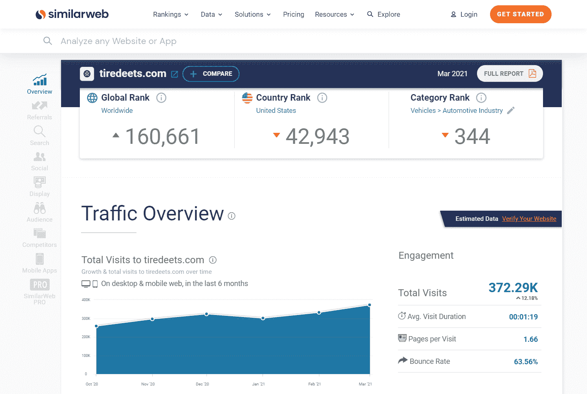

这个网站有着非常健康的流量，平均每月有 370，000 的访问量。

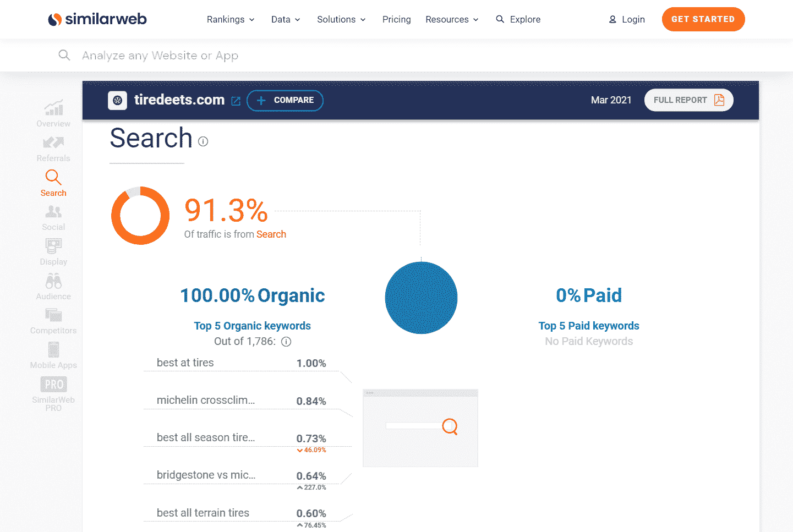

正如重刑犯工作中心一样，大部分流量来自有机搜索。一些顶级的有机关键词是高度相关的。他们以零经常性成本将高购买意愿的用户引导到网站。

#### 商业模式

作为一个博客，Tiredeets.com 依靠他们的搜索引擎优化努力吸引驾车者观众，然后通过页面上的定向广告充分利用每个用户的访问。这些努力带来的利润给网站所有者带来了每月 5471 美元的可观收入。

### 冰窟——售价 117，382 美元

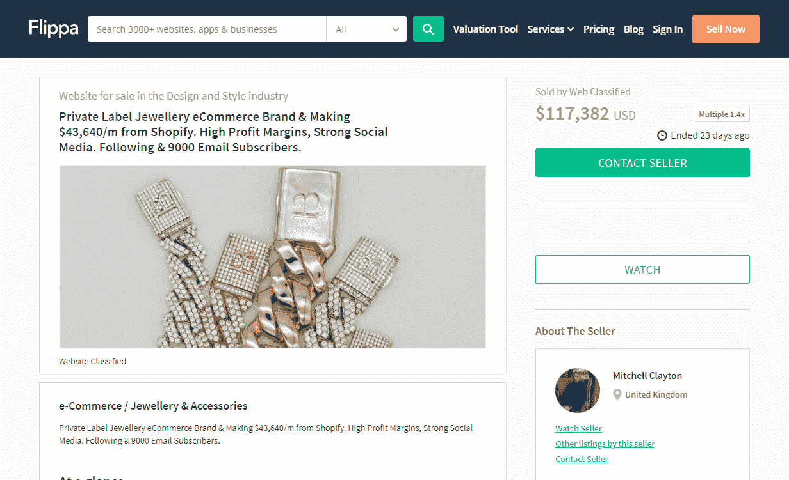

Icebrooks Flippa listing.

**行业:**电子商务(珠宝&配饰)

Icebrooks 是该榜单上第一家拥有自有品牌产品的电子商务商店。

和 ArtCove 一样，交通并不是最终价格背后的原因。

#### 交通

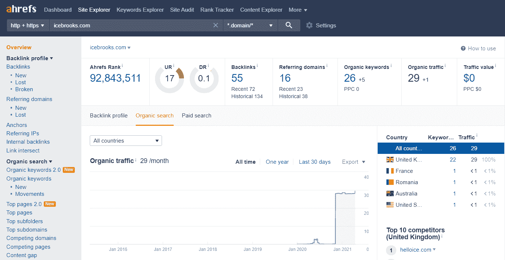

Icebrooks Ahrefs organic search traffic.

与我们列表中的其他项目相比，冰溪的流量几乎不存在。这在很大程度上与网站在 2020 年是全新的这一事实有关——它还没有时间让访问者达到临界质量。

然而，这也说明了网站缺乏内容和一般的搜索引擎优化策略。新主人可能会计划加强这一点。

#### 商业模式

Icebrooks 在一家电子商务商店销售高端黄金珠宝产品。价格从 71 美元到 561 美元不等，所有原价都明显下调。

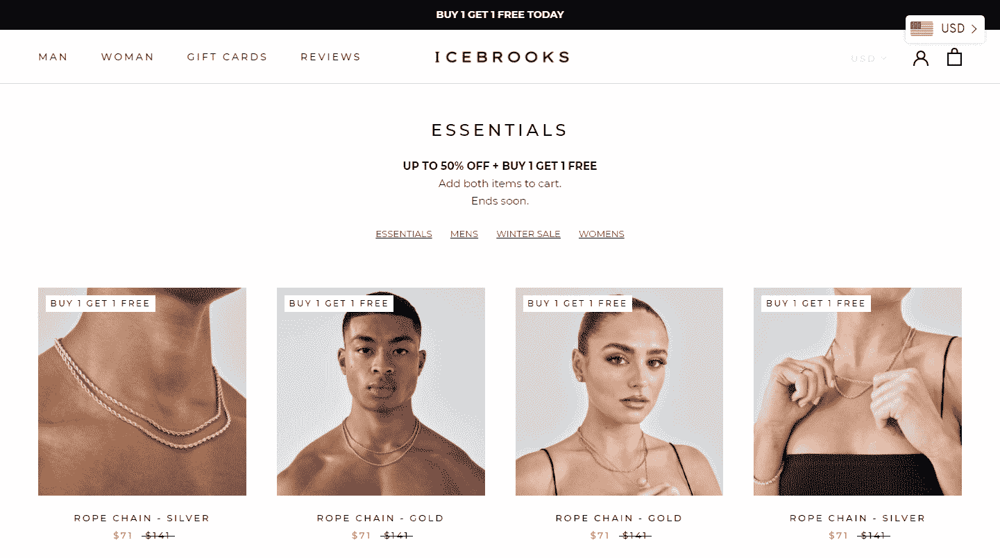

Icebrooks ecommerce product page.

产品是实物，所以它们需要处理和运输。但是除了标准的预付选项之外，他们还提供了“以后再付”的选项，这无疑吸引了许多购物者。

他们也非常依赖广告宣传他们过去顾客的评论。Icebrooks 利用 Shopify 应用程序 [Loox](https://loox.app/) 在他们的网站上收集并展示顾客的照片和评论。

### 音频组件——售价 100，001 美元

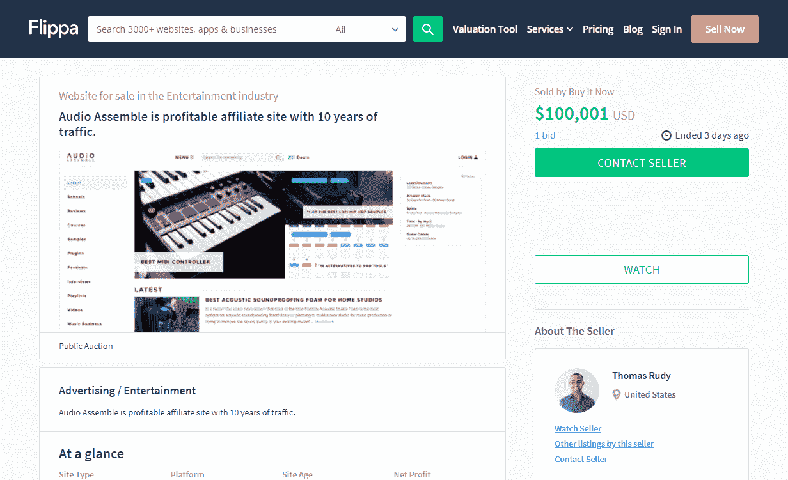

Audio Assemble Flippa listing.

**行业:**广告(娱乐)

另一个内容网站 Audio Assemble 的售价为 100，001 美元，月收入约为 3，300 美元。它自称是“为有抱负的音乐家和音频工程师提供的一站式音频工程学习中心”，它专注于通过从产品评论到学生资源的内容来增加流量。

#### 交通

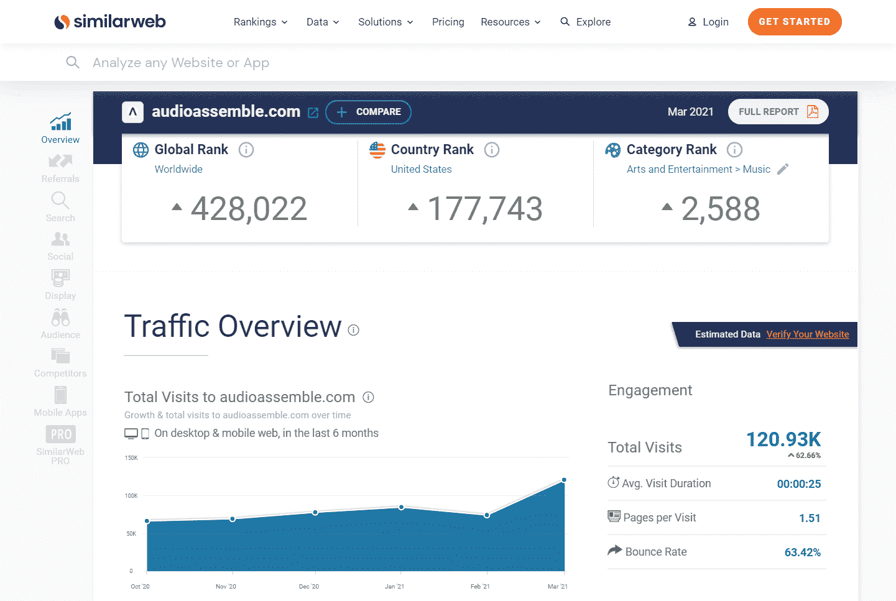

Audio Assemble SimilarWeb report.

该网站每月大约有 120，000 名访客，几乎所有的访客都是有机流量。

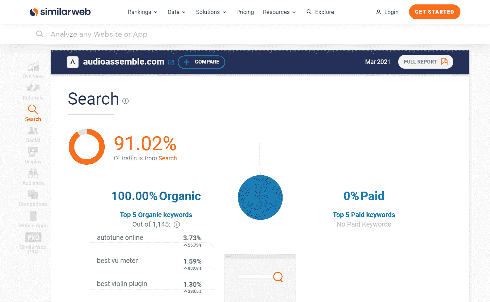

Audio Assemble search traffic.

他们吸引的读者可能会点击整个网站上显示的会员链接，因为流量是 100%有机的。在这种情况下，您可以更容易地忽略跳出率。

#### 商业模式

Audio Assemble 的商业模式几乎完全是联盟营销。该网站在产品评论和比较中列出了合作伙伴的链接。不涉及库存、履行或客户服务。

尽管其持续增长的潜力较小，但操作的便利性和利基开发的机会导致其最终价格为年净利润的 2.5 倍，几乎与《重罪犯工作中心》的利润率一样高。

[准备好向你的网站挥手告别了吗？👋通过这个网站销售指南，了解如何获得 20-40 倍的月净利润。💰。](https://twitter.com/intent/tweet?url=https%3A%2F%2Fkinsta.com%2Fblog%2Fsell-website%2F&via=kinsta&text=Ready+to+wave+goodbye+to+your+website%3F+%F0%9F%91%8BLearn+how+you+can+get+between+20%E2%80%9340+times+your+monthly+net+profit+with+this+guide+to+selling+your+site.+%F0%9F%92%B0.&hashtags=Entrepreneur%2CWebDev)

## 摘要

当你在网上销售你的网站时，重要的是不要无知。积极研究那些以你所追求的价格成功销售的网站。

耐心点，投资你的网站，尽可能地改进它。找出你的潜在买家，并学会说他们的语言。

最后，为你的业务选择合适的平台，并创建一个关注你网站最重要卖点的列表。

*如果你想了解更多关于我们的[应用托管](https://kinsta.com/application-hosting/)、[数据库托管](https://kinsta.com/database-hosting/)和[托管 WordPress 托管](https://kinsta.com/wordpress-hosting/)计划如何帮助你的业务增长，请留下评论。*

* * *

让你所有的[应用程序](https://kinsta.com/application-hosting/)、[数据库](https://kinsta.com/database-hosting/)和 [WordPress 网站](https://kinsta.com/wordpress-hosting/)在线并在一个屋檐下。我们功能丰富的高性能云平台包括:

*   在 MyKinsta 仪表盘中轻松设置和管理
*   24/7 专家支持
*   最好的谷歌云平台硬件和网络，由 Kubernetes 提供最大的可扩展性
*   面向速度和安全性的企业级 Cloudflare 集成
*   全球受众覆盖全球多达 35 个数据中心和 275 多个 pop

在第一个月使用托管的[应用程序或托管](https://kinsta.com/application-hosting/)的[数据库，您可以享受 20 美元的优惠，亲自测试一下。探索我们的](https://kinsta.com/database-hosting/)[计划](https://kinsta.com/plans/)或[与销售人员交谈](https://kinsta.com/contact-us/)以找到最适合您的方式。