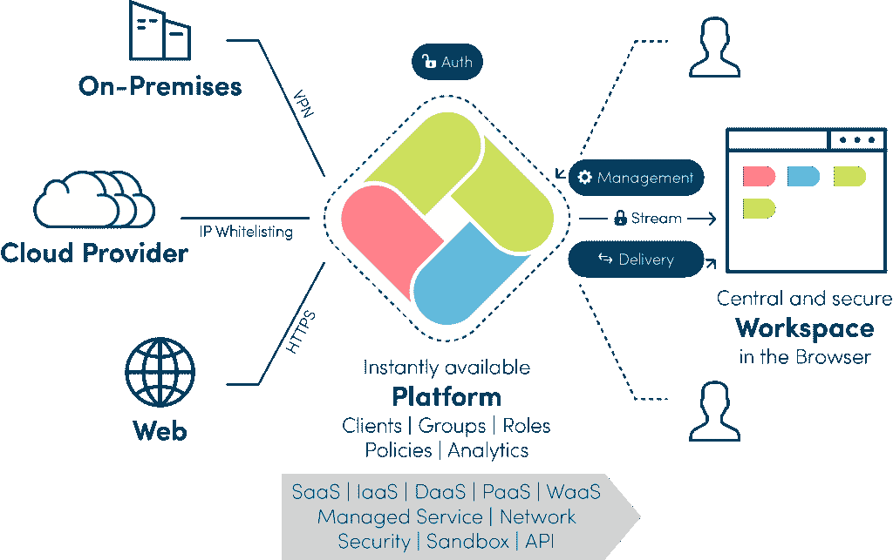
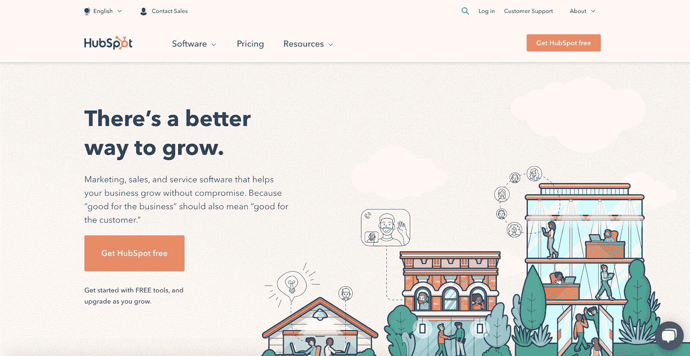
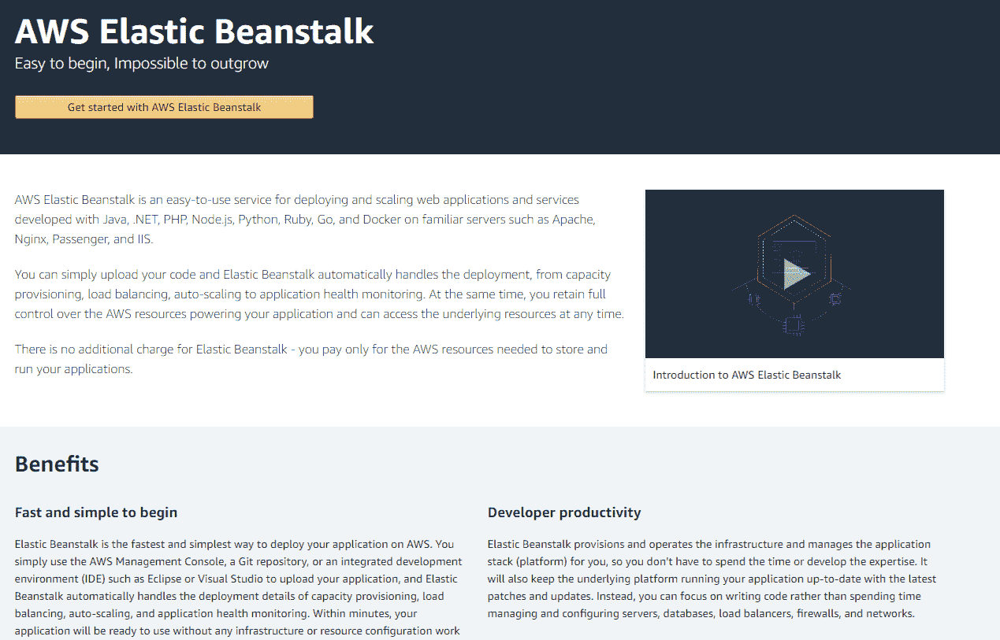
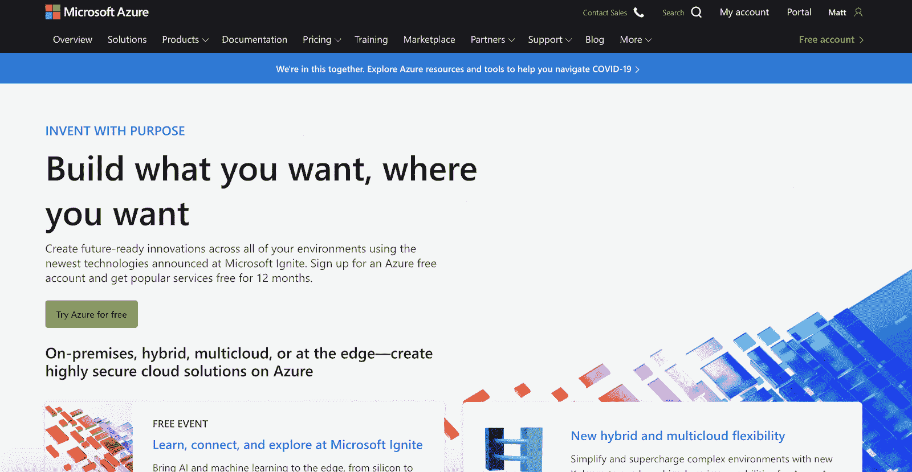
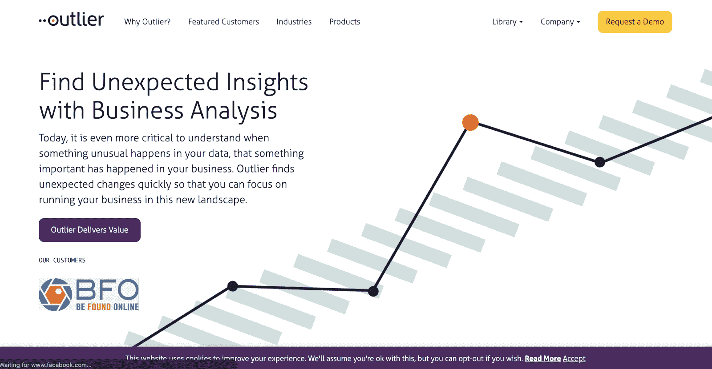
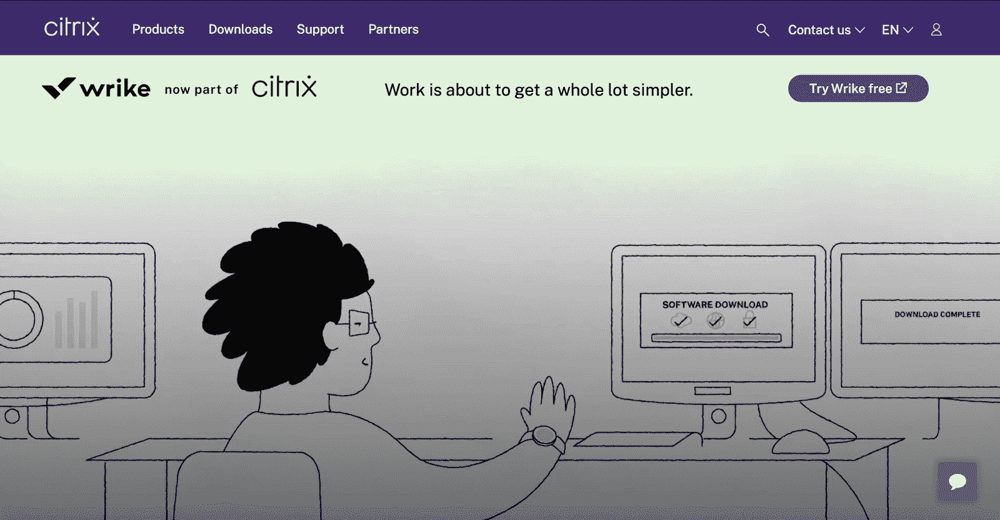
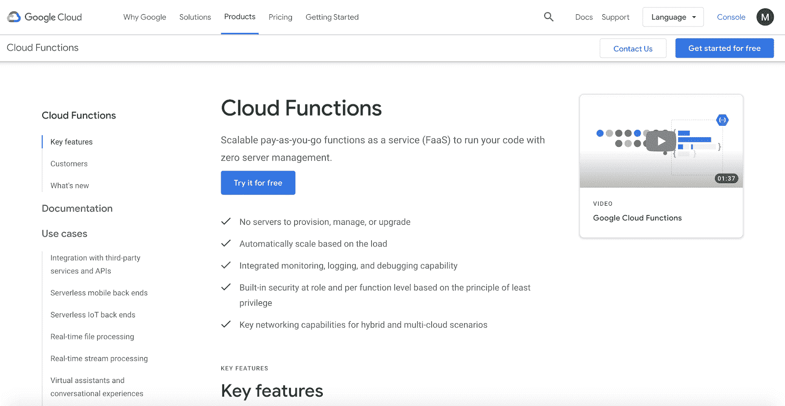
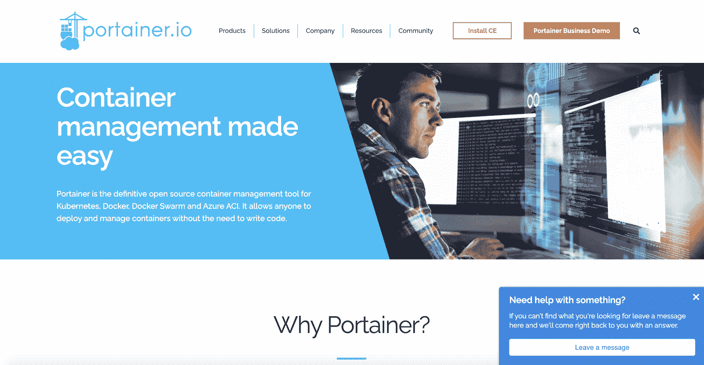
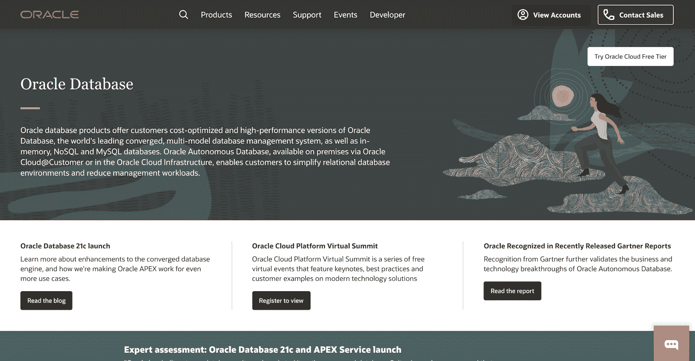
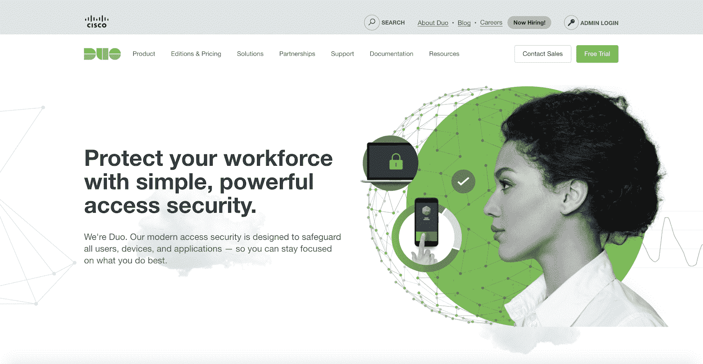

# XaaS:一切即服务模式(包含 10 个示例类别)

> 原文：<https://kinsta.com/blog/xaas/>

有时似乎有太多的商业缩略语需要记忆。随着快速变化的技术进步和云计算的出现，新的类别将继续涌现。XaaS 就是这样一个最新的例子。

该领域的大多数读者都知道 [SaaS(软件即服务)](https://kinsta.com/blog/saas-products/#saas-definition-what-is-saas)、 [IaaS(基础设施即服务)](https://kinsta.com/blog/what-is-iaas/)和 [PaaS(平台即服务)](https://kinsta.com/blog/what-is-paas/)。但是你听说过 XaaS 吗？

XaaS(一切即服务)涵盖了一切:*一切*现在都可以成为服务。

这听起来好像有很多要理解，但不要担心，我们会为你分解它。这篇文章将介绍什么是 XaaS，并回顾不同类型的 XaaS 公司。

## 什么是 XaaS？

XaaS 代表着任何服务。

在某些技术和创新通过网络连接并融合成为产品后，术语 XaaS 开始使用。

XaaS 利用云计算而不是本地软件来提供各种服务和接触客户。它让您可以更加灵活地在位于仓库甚至现场的服务器上运行您的业务。

XaaS 行业正在发展，在未来几年应该会成为一个越来越大的焦点。说它改变了企业的运营方式是一种保守的说法。

越来越多的企业转向 XaaS 寻求动力，发展自己的企业。全球 XaaS 市场目前正以大约 26% 的复合年增长率[增长，专家预测这一趋势至少会持续到 2025 年。](https://introspectivemarketresearch.com/reports/xaas--market/?utm_source=whatech&utm_medium=refferal&utm_campaign=shorturl&utm_content=whatech-com-667230)

但是 XaaS 的商业模式到底是什么？XaaS 公司是如何运作的？这是一个好的商业模式吗？让我们从更深的层面来看一下。

[有没有觉得有太多的业务缩写需要跟上？😅进入，XaaS，又名一切即服务。迷茫？😲点击阅读更多⬇️ 点击推文](https://twitter.com/intent/tweet?url=https%3A%2F%2Fkinsta.com%2Fblog%2Fxaas%2F&via=kinsta&text=Ever+feel+like+there+are+just+too+many+business+acronyms+to+keep+up+with%3F+%F0%9F%98%85+Enter%2C+XaaS%2C+AKA+Anything+as+a+Service.+Confused%3F+%F0%9F%98%B2+Click+to+read+more+%E2%AC%87%EF%B8%8F&hashtags=SaaS%2CXaaS)

### 什么是 XaaS 模式？

XaaS 公司利用云计算向全球数百万客户提供服务。

他们的产品通常是在线平台，用户可以随时登录。用户将会遇到一个易于使用的工作空间，通常就在他们的浏览器中。

在进行更改或从该工作区下载数据后，浏览器会将请求发送到平台。通常，该平台运行在本地服务器、云提供商或基于 web 的网络上。

XaaS 公司提供平台，助你创业。([来源](https://oneclick-cloud.com/en/blog/trends-en/everything-as-a-service/) )

XaaS 平台消除了构建大量内部存储、web 服务、硬件或定制软件的担忧。这取决于具体的 XaaS 公司提供什么服务。

公司可以购买一个长期的 XaaS 产品许可证，并利用其广泛的基础设施，而不是在内部构建一切。

只要 XaaS 的产品是可利用的，这可能是有利可图的。

不过，“任何东西”是一个宽泛的范畴，这有时会让 XaaS 公司的概念难以理解。

为了充分了解目前市场上不同的 XaaS 企业，现在让我们来看看 10 种最常见的 XaaS 公司。

## 10 种 XaaS 企业

世界各地数以百万计的客户使用几种类型的 XaaS 业务。让我们仔细看看，一些最受欢迎的。

### 1.SaaS(软件即服务)

SaaS 代表“软件即服务”，这是 XaaS 最常见的业务类型。

公司将 SaaS 的产品整合到他们的技术堆栈中，并使用该软件来简化业务运营，而无需从头开始开发软件。

最终，它节省了公司的时间和资源，使其成员能够专注于核心业务功能。

平均每个公司使用 137 个 Saas 应用，比上一年[增长了 30%](https://www.blissfully.com/saas-trends/2020-annual-report/)。它显示了集成 SaaS 解决方案在几乎所有类型的公司中是多么受欢迎。

一家著名的 SaaS 公司是 HubSpot T1，这是一个集营销、销售和服务于一体的营销解决方案。

HubSpot 可以作为你的客户关系经理(CRM)。

成千上万的客户使用这个软件来推动他们的营销工作，包括我们在金士达。它依赖于基于订阅的商业模式。像大多数 SaaS 公司一样，HubSpot 使用云计算来存储和管理数据。

### 2.平台即服务

PaaS 代表“平台即服务” [PaaS 公司](https://kinsta.com/blog/what-is-paas/)为用户提供基于云的解决方案，使他们能够在平台上创建应用、软件和其他工程项目，而不是构建自己的应用、软件和工程项目。

PaaS 公司可以为他们的客户提供从服务器到存储、数据库功能等一切。

该平台由公司提供并完全归公司所有。用户可以在这个平台上构建他们的产品，省去了独立购买和存储硬件的昂贵费用。

PaaS 公司的一个例子是 [AWS 弹性豆茎](https://kinsta.com/blog/what-is-paas/#aws)。

AWS 弹性豆茎使客户能够设计他们的项目。

AWS Elastic Beanstalk 使公司能够“在熟悉的服务器上部署和扩展 web 应用程序和服务。”

PaaS 为企业家和企业主提供了一个在基于云的基础设施上开发产品并销售给大众的基础。

### 3.IaaS(基础设施即服务)

IaaS 代表“基础设施即服务”IaaS 公司以基于网络的解决方案和存储的形式提供基础架构。通常，它们提供计算能力来开发、运行和扩展产品。

如果 PaaS 平台是一家公司用来构建他们的应用程序或软件的平台，那么 IaaS 公司就是他们用来推动和发展平台的平台。

IaaS 公司通常提供“现收现付”模式，允许客户为他们在一段时间内使用的量付费。

一个主要的缺点是你变得完全依赖 IaaS 公司，因为它本质上构成了你公司的基础设施。您的成功将取决于它的可靠性和正常运行时间。如果基础设施变得不稳定，你的公司也会变得不稳定。

IaaS 公司的一个例子是[微软 Azure](https://kinsta.com/azure-market-share/) 。

使用 Microsoft Azure 节省服务器硬件成本。

微软 Azure 为公司提供了“在任何地方构建、管理和部署应用程序的灵活性。”它使用户能够在扩展产品和公司时使用所有计算语言和框架。

### 4.AaaS(分析即服务)

AaaS 代表“分析即服务”公司正在将数据转化为见解，并使用这些见解来推动业务决策。随着向数字解决方案的转变，公司正在使用 AaaS 产品来跟踪他们的关键业务指标。

2019 年，AaaS 行业价值近 50 亿美元。专家预计，到 2027 年，中国的复合增长率将超过 25%。

对分析有深刻理解的企业将更好地为自己定位，以应对他们可能面临的任何障碍。

AaaS 公司的一个例子是[离群值](https://outlier.ai/)。

没有 AAA，你可能缺乏推动业务发展的数据。

Outlier 的软件可以从您的公司获取数据，并使用专有技术提取见解。数据只有在可操作的情况下才有价值，这款软件对不知道如何在大型数据集中找到洞察的公司很有帮助。

### 5.DaaS(桌面即服务)

DaaS 代表“桌面即服务”DaaS 公司使用户能够通过安全的 web 浏览器管理他们的全部员工。员工在报到上班时将单独登录该浏览器。

这项安全的服务使员工能够轻松访问必要的文件、程序和软件，即使他们不在办公室。

随着越来越多的公司转向远程办公，对 DaaS 产品的需求也在增加。到 2023 年，DaaS 市场预计将增长到超过[107 亿美元](https://www.statista.com/statistics/1132224/worldwide-daas-market/)。

DaaS 产品的灵活性和可靠性正在取代企业构建定制、本地化台式机的需求。

DaaS 公司的一个例子是 Citrix。

Citrix 使员工能够从任何地方轻松登录桌面。

Citrix 提供了一系列产品，可以帮助您和您的员工在任何地方工作。他们的 Citrix Workspace 旨在将您的所有应用和软件整合到一个安全的桌面中，使您的团队能够跨各种不同的设备和平台更高效地工作。

### 6.FaaS(作为服务运行)

FaaS 代表“功能即服务”如果您想运行一个应用程序或服务功能，而不是自己构建整个系统，该怎么办？这正是 FaaS 公司可以提供帮助的地方。

FaaS 公司使企业能够利用特定的功能或成果，而无需强迫他们开发或运行应用程序。

FaaS 的产业正在滚雪球，估计价值约 77 亿美元。

FaaS 公司的一个例子是谷歌云功能。

## 注册订阅时事通讯

### 想知道我们是怎么让流量增长超过 1000%的吗？

加入 20，000 多名获得我们每周时事通讯和内部消息的人的行列吧！

[Subscribe Now](#newsletter)

谷歌云功能以更精简的方式运行应用和软件功能。

Cloud Functions 是谷歌云的可扩展产品，可以让你按需付费。它为客户提供了“无需服务器管理即可运行代码”的能力

此外，它还具有内置的安全功能、混合和多云选项以及调试功能。

### 7.存储即服务

STaaS 代表“存储即服务”将所有数据存放在内部可能会非常昂贵和麻烦。这就是公司转向 STaaS 提供商寻求存储解决方案的原因。

[将一些数据卸载给可靠的 STaaS 合作伙伴](https://kinsta.com/knowledgebase/wordpress-google-cloud-storage/)可以释放内部资源并降低成本。

在所有 XaaS 类别中，STaaS 行业的绝对数量最令人印象深刻。据估计，到 2027 年，整个 STaaS 行业的价值将超过 1000 亿美元。随着越来越多的公司使用基于云的 STaaS 解决方案来扩展其运营，预计这一数字将在未来几年呈指数级增长。

STaaS 公司的一个例子是 HPE 格林莱克公司。

HPE 格林莱克存储了世界各地公司的重要数据。

HPE 格林莱克是惠普企业母公司旗下的产品。该产品提供“针对所有工作负载优化的存储云服务”

数据平台的功能完全是为您提供服务，使其成为按需扩展的完美解决方案。

### 8.容器即服务

CaaS 代表“容器即服务”所有的软件代码都打包在“容器”中，可以在任何地方读取和运行。代码、库和依赖项都打包在一个容器中，以便在需要时读取和执行。

与其他 XaaS 公司类似，如果客户不想构建一个容器来存储代码库，他们可以从 CaaS 公司购买来解决这个问题。到明年，CaaS 行业有望增长到 41 亿美元。

CaaS 公司的一个例子是 [Portainer](https://www.portainer.io/) 。

Portainer 是一个 XaaS，将你的代码存放在容器中。

Portainer 是一个容器管理工具，“允许任何人部署和管理容器，而无需编写代码。”对于许多希望将容器开发外包给可靠合作伙伴的公司来说，这可以节省大量的时间和金钱。

### 9.数据库即服务

DBaaS 代表“数据库即服务”DBaaS 解决方案使企业能够在软件中组织、过滤和存储客户数据，便于合适的员工访问和检索。

使用 DBaaS 软件的公司不必从头开始构建数据库。相反，他们可以使用可信的 DBaaS 解决方案在云中定制和创建个性化的数据库。

DBaaS 产品的一个例子是 [Oracle 数据库](https://www.oracle.com/database/)。

甲骨文因许多不同的产品而闻名，包括广受欢迎的甲骨文数据库。

Oracle 数据库是“世界领先的融合多模式数据库管理系统。”它统一了内存、NoSQL 和 MySQL 数据库。

该产品使用户能够建立连接业务部门的数据库，并减少每个员工投入数据库操作的时间和精力。

厌倦了 WordPress 的问题和缓慢的主机？我们提供来自 WordPress 专家和高速服务器的 24/7 世界级支持。[查看我们的计划](https://kinsta.com/plans/?in-article-cta)

### 10.认证即服务

在本例中，AaaS 代表“身份验证即服务”(正如您所看到的，其中一些缩写可能有不止一种含义。)如果存在重复行业(即分析即服务)，有时指定您所指的商业模式可能是合适的。

AaaS 企业为用户提供了在其平台上实现[访问控制](https://kinsta.com/feature-updates/multi-user-access-permissions/)解决方案的能力。这使他们能够灵活地控制谁可以跨设备和网络使用该产品。

到 2026 年，AaaS 行业预计将增长到 24 亿美元。

AaaS 业务的一个例子是 [Duo Security](https://duo.com/) 。

使用 Duo Security 的认证产品安全登录您的帐户。

Duo Security 提供“旨在保护所有用户、设备和应用的现代访问安全性”使用 Duo Security 产品的企业可能会要求员工启用双因素或多因素身份验证。

它迫使员工通过各种措施来验证他们的登录尝试，以确保没有未经授权的用户进入他们的帐户。

现在你已经知道了不同类型的 XaaS 企业，让我们看看为什么这么多的企业使用这种模式作为基础。

## XaaS 模式的优点是什么？

XaaS 模式有许多优点，包括灵活的客户计划、精益运营、增强的技术支持和可扩展性。

### 顾客可以在订阅的基础上付费

对终端消费者来说，XaaS 公司更具成本效益。许多公司采用订阅模式运营，这最终为客户提供了更大的灵活性。

如果客户需要取消或调整服务，他们可以与 XaaS 公司一起成长或收缩。它可以使公司以更快的速度扩展。

公司不需要用服务器来构建他们的后台办公室，也不需要通过[昂贵的招聘计划来招聘负责扩展工作的员工](https://kinsta.com/blog/bootstrapping-startup/#3-find-the-best-talent-globally-and-even-save-some-money)。相反，他们可以依靠 XaaS 公司在基础设施和整体成功中发挥关键作用。

### 公司可以变得更精简

初创公司和成熟公司将不再需要投资庞大、昂贵的硬件和基础设施需求，也不再需要雇佣大量全职员工来构建和开发产品。

相反，企业可以寻求 XaaS 公司的帮助来使用这些服务，并将它们整合到企业中。这使得公司在需要的时候更容易转向，特别是如果他们是自举的话。

企业不必专注于建立数据仓库、购买服务器，甚至拥有庞大的 IT 部门。他们可以留住关键员工，并利用 XaaS 公司作为真正的合作伙伴。

### 企业获得更多技术支持

您是否遇到过您的团队无法解决的服务器问题或数据集中的错误？

XaaS 公司经常为一些问题提供技术支持，否则企业将不得不独立处理这些问题。这是一个巨大的好处，因为 XaaS 公司是你的团队的延伸。

企业可以求助于 XaaS 公司的支持团队来帮助解决软件或整体业务功能的问题。一个团队可以利用 XaaS 公司的专业知识，并将其作为推动业务发展的资产。

### XaaS 产品的可扩展性更容易

企业可以通过与他们的 XaaS 合作伙伴协调，简单地改变他们选择的计划，迅速扩大或缩小他们的经营规模。

以前，扩展需要路线图和数月的规划。现在，通过一家 XaaS 公司只需几分钟。

然而，尽管有这么多好处，XaaS 企业仍然有一些负面影响。

## XaaS 模式的缺点是什么？

XaaS 模式有许多缺点，包括安全问题、性能中断和转嫁给客户的隐性费用。

### 可能会出现安全问题

XaaS 公司会让你的生意变得更加脆弱。你把你的名誉和敏感数据托付给了这家公司。

根据基础设施的不同，[安全问题](https://kinsta.com/blog/cloud-security/)可能会出现，黑客攻击也可能会发生。为了缓和你对这家公司的完全依赖，你需要确保在选择 XaaS 公司时做了适当的研究。

在评估 XaaS 合作伙伴时，请密切关注他们的安全验证和徽章。查看他们过去是否遭受过数据泄露，或者新闻中是否有其他相关报道。这可能是确保你做出正确选择的一小步，但却是关键的一步。

### 可能会发生性能问题和停机

因为你是在利用这些公司来为你的业务执行特定的功能，所以你最终要依靠它们来为客户提供服务。如果 XaaS 提供商[出现了故障](https://kinsta.com/blog/aws-outage/)，你就要听从他们团队的安排去解决。

这些中断会中断您的业务功能，并使运营陷入停顿。评估每个 XaaS 平台的平均正常运行时间并记录日常维护通常发生的时间至关重要。

虽然停机在某个时候不可避免地会发生，但是您应该了解您的漏洞点，以及如何为它们做好业务准备。如果发生停机，您可以制定紧急缓解措施和客户沟通计划来吸收影响。

### 隐藏的费用和许可证可能会增加

在签约前检查合同的所有部分，这样你就知道你在协议中支付的是什么。

虽然使用 XaaS 公司可能比拥有你的服务器或存储你的数据成本更低，但你仍然可能会发现自己支付隐藏费用和购买昂贵的席位许可证。

当试图扩大规模时，很容易为你的员工积累大量的费用和额外的席位。根据您现在的需求和未来的需求评估每个订阅。这可能是昂贵的切换下来的道路，所以你要确保你选择了完美的 XaaS 服务与你的规模。

[在业务的关键时刻迁移服务](https://kinsta.com/knowledgebase/wordpress-migrations/)可能会中断您的发展。在评估 XaaS 期权时，牢记未来对你公司的成长轨迹至关重要。

[PaaS，SaaS，IaaS，现在..XaaS，也就是所谓的服务。🤯了解这一最新商业缩写的含义，以及在哪里可以看到它出现✅ 点击发推](https://twitter.com/intent/tweet?url=https%3A%2F%2Fkinsta.com%2Fblog%2Fxaas%2F&via=kinsta&text=PaaS%2C+SaaS%2C+IaaS%2C+and+now..+XaaS%2C+otherwise+known+as+Anything+as+a+Service.+%F0%9F%A4%AF+Learn+what+this+latest+business+acronym+means%2C+and+where+you+can+expect+seeing+it+pop+up+%E2%9C%85&hashtags=XaaS%2CSaaS)

## 摘要

XaaS 公司越来越受欢迎，被全世界成千上万的公司所使用。“一切即服务”行业不会很快放缓。

XaaS 模式为消费者提供了更大的价格灵活性、更精简的结构和相关的支持。然而，它也容易受到黑客攻击、停机和隐性成本的影响。

通过了解 XaaS 公司如何运作，你将能够决定使用 XaaS 公司是否是你的业务的正确举措。

你最喜欢的 XaaS 公司是哪家，为什么？请在评论中与我们的读者分享你的观点。

* * *

让你所有的[应用程序](https://kinsta.com/application-hosting/)、[数据库](https://kinsta.com/database-hosting/)和 [WordPress 网站](https://kinsta.com/wordpress-hosting/)在线并在一个屋檐下。我们功能丰富的高性能云平台包括:

*   在 MyKinsta 仪表盘中轻松设置和管理
*   24/7 专家支持
*   最好的谷歌云平台硬件和网络，由 Kubernetes 提供最大的可扩展性
*   面向速度和安全性的企业级 Cloudflare 集成
*   全球受众覆盖全球多达 35 个数据中心和 275 多个 pop

在第一个月使用托管的[应用程序或托管](https://kinsta.com/application-hosting/)的[数据库，您可以享受 20 美元的优惠，亲自测试一下。探索我们的](https://kinsta.com/database-hosting/)[计划](https://kinsta.com/plans/)或[与销售人员交谈](https://kinsta.com/contact-us/)以找到最适合您的方式。