# 如何存档网站:我们拯救网站的庞大指南

> 原文：<https://kinsta.com/blog/archive-a-website/>

维护你的网站需要有一个专用的备份策略。虽然备份是必不可少的，但它们不是保存网站的唯一方法。备份的自然延伸是归档网站，尽管它们是互补的过程。

有几种灵活的方法来归档网站。好消息是，它们都是用户友好的，易于使用的。您只需要根据您的需求和要求选择正确的解决方案。

在这篇文章中，我们将看看如何归档一个网站。我们还将探索您将遇到的不同归档类型，收集一些最著名的站点归档工具，并讨论一些归档站点的技巧。

### 更喜欢看[视频版](https://www.youtube.com/watch?v=jcidrjs_WaY)？

## 网站存档介绍

存档网站意味着保存内容、数据和媒体以供将来参考。使用专用服务，如 [Wayback Machine](https://archive.org/web/) (尽管我们稍后会谈到其他解决方案)，你可以查看网站的旧版本。

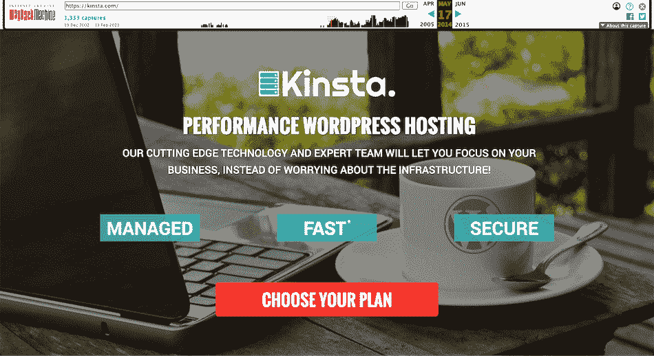

How the Kinsta website looked in 2015 – we’ve come a long way!

从技术层面来说，爬虫抓取网站的快照，这就构成了档案本身。您可以使用一个简单的日历来访问它，并且如果您愿意的话，可以用时间线格式来查看每个迭代。

> 需要在这里大声喊出来。Kinsta 太神奇了，我用它做我的个人网站。支持是迅速和杰出的，他们的服务器是 WordPress 最快的。
> 
> <footer class="wp-block-kinsta-client-quote__footer">
> 
> 
> 
> <cite class="wp-block-kinsta-client-quote__cite">Phillip Stemann</cite></footer>

[View plans](https://kinsta.com/plans/)

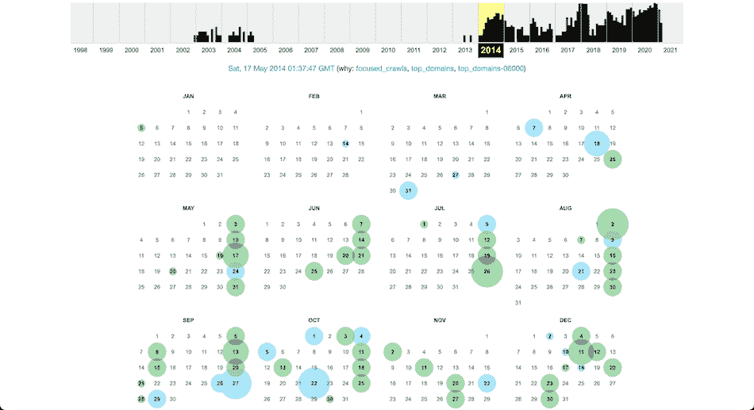

The Wayback Machine calendar archive for Kinsta’s website.

至于为什么会有 Wayback Machine 这样的解决方案存在，还得追溯到 21 世纪初。网络泡沫几乎破灭了；许多企业正在倒闭。一些[热门网站](https://kinsta.com/blog/alexa-rank/#top-10-websites)被关闭或放弃，留下的记忆寥寥无几。

就像互联网出现之前的其他媒体形式，如音乐和电视，这些网站具有历史和怀旧价值。拯救它们意味着给未来的互联网用户一瞥我们离早期技术有多远。

互联网档案馆推出了回溯机来帮助保存网站。如果一个网站已经在那里存档，你可以看到一个网站是如何演变的。

归档一个网站需要许多爬虫，包括可能需要数年才能完成的巨大的单个爬虫。执行爬行“探险”和[存储结果快照](https://thehustle.co/inside-wayback-machine-internet-archive)所需的工作量是巨大的。

例如，Wayback Machine 的第一台 100 TB 服务器于 2004 年投入使用。到 2020 年底，Wayback Machine 已经在[存储了超过 70 PB 的数据](https://blog.adafruit.com/2020/12/01/donate-to-the-internet-archive-digital-library-of-free-borrowable-books-movies-music-wayback-machine-internetarchive/)。超过 70，000 兆字节。

然而，并不是每个人都对互联网档案馆的工作感到满意。基于网站档案是否违反了现有的版权问题，已经有了一些讨论和法律挑战。

尽管如此，鉴于存储的档案数量大幅增长，人们显然希望保留网站。

[准备好归档你的站点了吗？👀好消息是:这是一个相当用户友好的过程。😄最重要的部分是为你的网站选择正确的解决方案&的要求。查看此处所有选项⬇️ 点击推文](https://twitter.com/intent/tweet?url=https%3A%2F%2Fkinsta.com%2Fblog%2Farchive-a-website%2F&via=kinsta&text=Ready+to+archive+your+site%3F+%F0%9F%91%80+Good+news%3A+it%27s+a+reasonably+user-friendly+process.+%F0%9F%98%84+The+most+important+part+is+picking+the+right+solution+for+your+site%27s+needs+%26amp%3B+requirements.+See+all+the+options+here...&hashtags=WordPressBlogger%2CWebsiteTips)

## 为什么你想存档一个网站

除了简单的怀旧原因，还有很多原因让你想把一个网站存档。为了进行真实世界的类比，[看看 GitHub](https://kinsta.com/knowledgebase/what-is-github/) 。

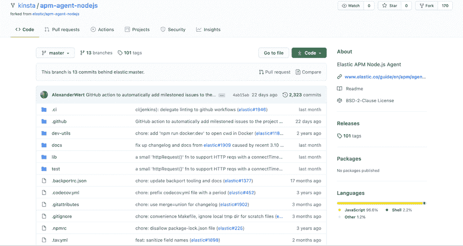

GitHub’s infrastructure is much like an internet archive.

Github 存储了一个项目的存储库，以及每一次提交。与互联网归档相比，存储库代表整个归档，而提交则是快照。

正如 [Git 仓库](https://kinsta.com/knowledgebase/git-vs-github/)有价值一样，归档也有价值。例如，您可以查看站点以前的迭代——甚至是多年前的——来影响您当前的设计选择。

此外，你可能在法律上有义务对你的网站进行存档，尤其是如果你从事金融或法律行业。

最后，如果你不幸卷入了与你的网站相关的诉讼，你的档案将是有价值的证据。如果你能提供清晰完整的遗址档案，你甚至可以在法庭介入之前就解决争端。

### 备份和归档之间的区别

在我们讨论可用的不同类型的 web 归档之前，有必要回到我们前面提到的主题。理论上，站点备份和网站存档看起来很相似。然而，他们执行不同的工作，这些工作相辅相成。简而言之:

*   **备份是基于数据的。**他们更关心保存你网站的数据。如果你需要[恢复你的站点](https://kinsta.com/blog/restore-wordpress-from-backup/)，备份是至关重要的，拥有一个完整的数据备份是最重要的。
*   归档保存数据的上下文。如果你浏览[你最喜欢的网站的档案](https://web.archive.org/web/*/kinsta.com)，你会注意到功能经常是不完整的。然而，网站的设计和静态内容通常是完整的。

值得注意的是，归档并不打算完全避开数据保存工作。事实上，其中一个好处是让用户浏览你的网站，就像它是活的一样。即便如此，鉴于像 Wayback Machine 这样的网站是作为一个虚拟的“记忆通道”而存在的，保持视觉效果的完整比保留后端功能更重要。

简而言之，你会希望对你的站点同时使用备份和存档——前者作为[日常保护](https://kinsta.com/blog/wordpress-backup-plugins/)以防最坏的情况发生，后者作为一种额外的方式来帮助记录你的站点的发展。
T3】

## 您将会遇到的不同类型的 Web 存档

Web 存档并不只有一种风格。你会遇到几种不同的类型。以下是每一项的细目分类:

*   **客户端:**它涉及最终用户保存有问题的网站版本。它简单、可扩展，让你可以毫不费力地对网站进行归档。
*   **服务器端:**way back 机等的做法归类为服务器端存档。它使用爬虫和其他技术来存档网站，但它也需要一定程度的同意，这在客户端存档中是找不到的。
*   **基于事务:**虽然这仍然基于服务器端归档，但它更加复杂，需要得到网站所有者的明确同意。本质上，它将最终用户和服务器之间的站点事务归档。

对于具有静态数据的简单网站，加上有组织的归档策略，客户端归档应该符合要求。然而，大多数其他网站将倾向于服务器端存档—基于事务的存档对大多数网站来说是不必要的。

最后——我们将在整篇文章中更详细地讨论这一点——您还需要考虑您的[档案存储在哪里以及如何存储](https://kinsta.com/knowledgebase/wordpress-google-cloud-storage/)。例如，本地存档是不错的选择，但是如果您的计算机出现故障，您可能会看到它消失。另一方面，如果选择第三方解决方案，您对归档内容的控制会更少。

正如你所料，这里的答案是使用多方面的方法来归档网站。我们建议像对待备份一样对待存档:在不同的位置保存三个不同的副本，并以某种方式同步。

您可能还想让其中一个存档处于活动状态，这样您就可以利用站点上的任何服务器端功能。结果是一个具有强大的备份和归档策略的网站对其他人仍然有用。

## 互联网档案工具和网站初学者指南

有太多的解决方案可以用来归档网站。我们将列出几个更受欢迎的，以及我们对它如何适合你的看法。

### 1.返程机

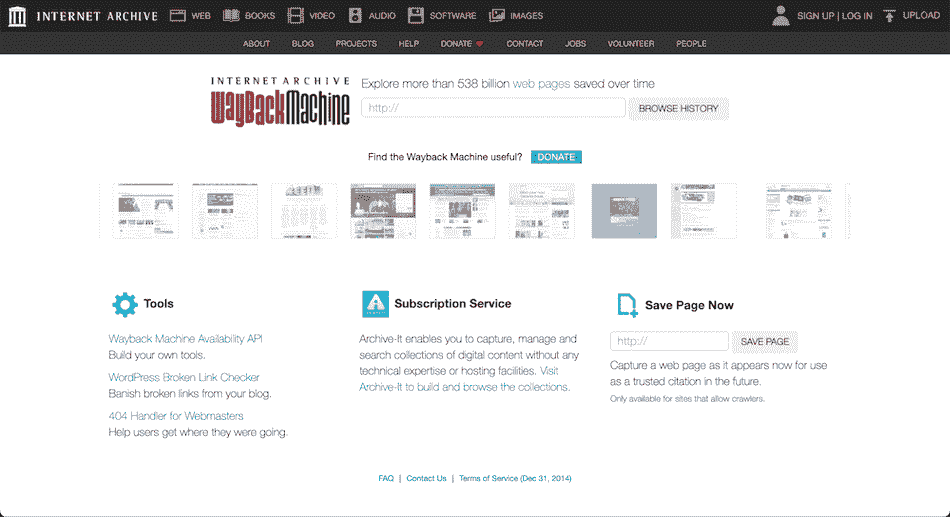

The Wayback Machine.

首先，让我们讨论一下[时光倒流机](https://archive.org/web/)。这是同类产品中的第一款，因此它为其他归档工具树立了标杆。

因此，它可能会成为网站存档时的第一选择。它有很多方法来创建和上传档案，甚至有一个专用的 API 来挂钩它的功能。值得注意的是，它也是一个服务器端归档解决方案。

也就是说，由于其抓取和归档网站的方式，Wayback 机器可能无法保留您网站的所有功能。然而，它被认为是网络档案管理员的行业标准，而且完全免费。在本文的后面，我们将向您展示如何使用 Wayback 机器更详细地归档网站。

### 2.存档.今天

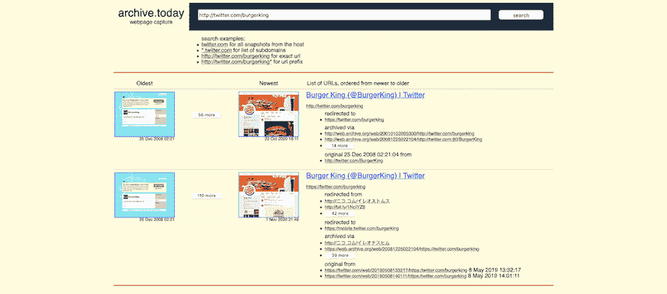

The Archive.today website.

接下来是 [Archive.today](http://archive.fo/) 它在许多方面都与 Wayback 机器相似——甚至是该网站近乎“复古”的设计。它的[数据服务器](https://kinsta.com/knowledgebase/best-data-center/)设在欧洲，但它的归档方式不同于 Wayback 机器。

首先，Archive.today 并不是基于在网络上运行的爬虫。相反，你提交你的网址，并同意纳入存档。此外，它的功能列表比其他解决方案更加精简。例如，没有一个可靠的删除策略，而且存档过程排除了某些媒体和文件类型。

尽管如此，如果你想要一个免费的地方存放档案，这是免费和合适的。该网站甚至有搜索功能，可以找到以前存档的网站。

### 3.Heritrix

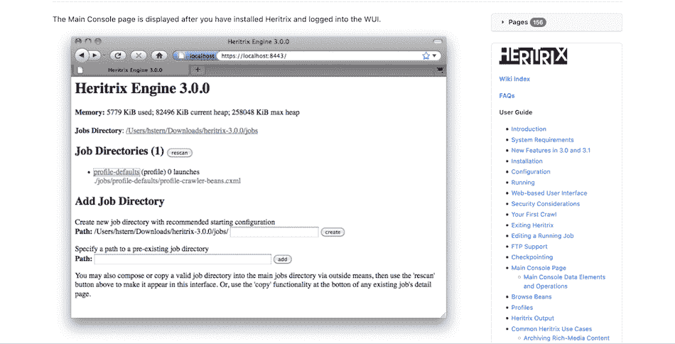

The Heritrix website.

到目前为止，我们已经在这篇文章中提到了互联网档案馆和回溯机。然而，Wayback 机器只是一项服务，除此之外，互联网档案馆还提供一些其他的存档产品。Heritrix 是一个免费的开源工具，诞生于互联网档案馆和北欧图书馆的合作。

它本质上是一个[网络爬虫](https://kinsta.com/blog/submit-website-to-search-engines/)而不是一个全功能的存档工具。但是，您可以将所有爬网结果打包在一起。虽然过去没有这种情况，但 Wayback 机器现在使用 Heritrix 来抓取网站，以便包含在自己的网站上。更有甚者，大量的[图书馆和机构](https://www.loc.gov/programs/web-archiving/about-this-program/)使用 Heritrix 建立档案。

尽管有令人印象深刻的功能，安装 Heritrix 需要一些技术知识。没有一个用户友好的界面来帮你安装它，所以你需要 Git、GitHub 和[命令行](https://kinsta.com/blog/ssh-commands/)的知识。

与其他类似的解决方案一样，Heritrix 完全免费使用，因此它适合作为一种经济高效的自归档解决方案。

### 4.Web 归档集成层(WAIL)

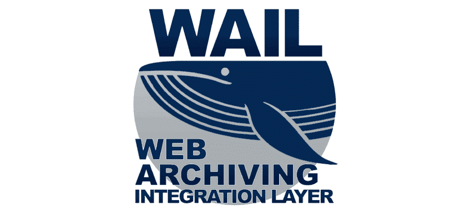

The Web Archiving Integration Layer (WAIL) website.

如果你正在寻找 Heritrix 来存档一个网站，但被简单安装软件所需的技术知识所阻碍，那么有一个潜在的解决方案适合你。 [Web 归档集成层(WAIL)](https://machawk1.github.io/wail/) 是一款免费开源的[跨平台桌面应用](https://kinsta.com/devkinsta/)，它为你提供了一个实用的图形用户界面(GUI)和一个安装程序。

好消息是，Heritrix 是 WAIL 的爬行引擎。这意味着您可以利用 Heritrix 的强大功能，而不必遍历 GitHub 和命令行。此外，WAIL 使用 [OpenWayback](https://github.com/iipc/openwayback) 引擎来“重放”网络档案。

这样，您就有了一个全功能的 web 归档工具，可以在您的机器上运行了。在本文的后面，我们还将向您展示 WAIL 是如何工作的。

### 5.斯蒂利奥

The Stillio website.

我们的倒数第二个归档工具被宣传为自动解决方案，可以在设定的时间间隔拍摄快照。Stillio 是一项高级服务，其外观和感觉都不同于其他归档解决方案。

该网站看起来很光滑，给你无数的选项来创建一个符合你确切要求的档案。例如，你可以给你的网址添加标签和自定义标题。

更重要的是，你可以选择将档案存储到 [Dropbox](https://kinsta.com/blog/best-tools-for-freelancers/#3-dropbox) 、 [Google Drive](https://kinsta.com/blog/google-workspace/#google-drive) ，以及其他[第三方服务](https://kinsta.com/blog/saas-products/)。

然而，Stillio 有一个巨大的缺点:它不支持后端归档。你只能看到你网站的截图，而不是完整的数据档案。对于许多应用程序来说，这还不够。

然而，Stillio 在某些情况下可能是有用的，比如作为一个品牌管理和跟踪工具。例如，您可以截取竞争对手网站或搜索引擎结果的截图。对于内容验证也很棒。

Stillio 的定价从每月 29 美元开始，经过四个等级，每月 299 美元。这是一个很大的要求，尤其是当有更强大功能的免费替代品时。但是如果它完全符合您的用例，那么就值得一看！

## 注册订阅时事通讯

### 想知道我们是怎么让流量增长超过 1000%的吗？

加入 20，000 多名获得我们每周时事通讯和内部消息的人的行列吧！

[Subscribe Now](#newsletter)

### 6.页面冻结器

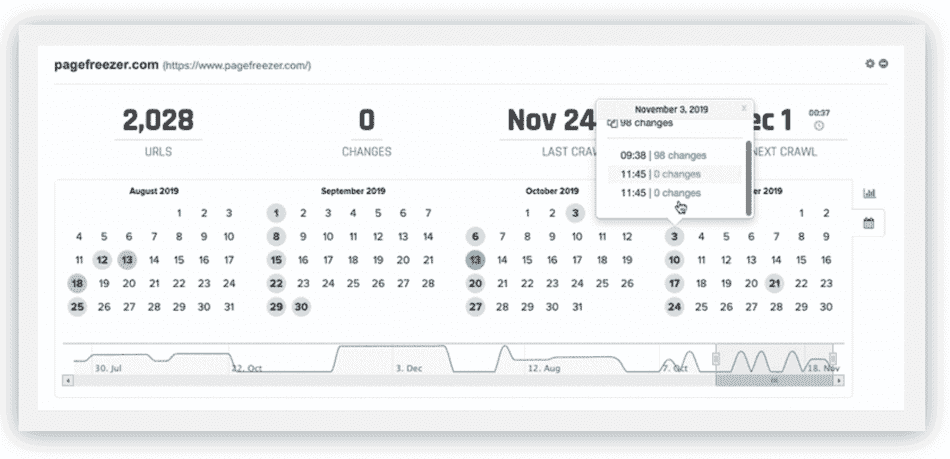

The Pagefreezer website.

我们最终的解决方案是另一个自动化工具。Pagefreezer 提供了许多与 Stillio 相同的好处，但它也可以归档社交媒体内容、短信、完整网站和[企业级协作平台](https://kinsta.com/blog/saas-products/#collaboration-and-internal-communication)。

从表面上看，Pagefreezer 似乎是一个比 Stillio 更健壮的解决方案，在各种用例中会有更大的价值。

例如，在法律要求你对一个网站进行完全存档的地方，Pagefreezer 就符合要求。它允许您[自动化快照数量](https://kinsta.com/help/disaster-recovery/#2-automatic-snapshots-of-every-site)，并使用站点档案浏览器和比较工具查看它们。

总的来说，Pagefreezer 是一个非常棒的企业级工作场所归档解决方案。使用 [Yammer](https://www.microsoft.com/en-us/microsoft-365/yammer/yammer-overview) 或 [Salesforce 的 Chatter](https://www.salesforce.com/products/chatter/overview/) 的公司将会被这种类型的解决方案所吸引，[的工作场所用户](https://www.workplace.com/)也是如此。

## 什么是网络存档(WARC)文件格式？

如果你正在研究如何将一个网站存档，你会遇到[网络存档(WARC)](https://iipc.github.io/warc-specifications/specifications/warc-format/warc-1.1/) 格式。它是你的站点存档的各种文件的打包组合，所以它是可移植的和独立的。

互联网档案馆创建了 WARC 来长期保存网络数据。国际互联网保存联盟(IIPC)已经发布了文件格式的[完整规范](https://iipc.github.io/warc-specifications/specifications/warc-format/warc-1.0/)。它将[存储图像](https://kinsta.com/knowledgebase/wordpress-google-cloud-storage/)、[元数据](https://kinsta.com/blog/meta-description-wordpress/)，以及几乎所有你的网站需要独立运行的东西。

虽然它最初只是一种方便的文件格式，但现在 WARC 已经成为数字档案馆的国际 ISO 标准。因此，它已被政府和其他官方机构采用。事实上，在一些使用案例中，WARC 文件至关重要:

*   **电子发现** **:** 这是诉讼过程中的一个过程，在此过程中，对数字记录进行研究，并提交给审判。对于社交媒体记录，一份 WARC 文件符合[电子发现](https://cdslegal.com/knowledge/the-basics-what-is-e-discovery/)法律标准。
*   **信息自由(FOI):**[许多政府](https://a860-openrecords.nyc.gov/)和官方机构利用《FOI 和公开档案法案》向州选民提供“知情权”(RTK)服务。在涉及数字记录的情况下，WARC 格式是理想的。

WARC 被许多不同的归档解决方案和爬虫使用，例如 [StormCrawler](http://stormcrawler.net/) 和 [Apache Nutch](https://nutch.apache.org/) 。您还可以调整命令行工具[如 Wget](https://wiki.archiveteam.org/index.php/Wget) 的设置，将请求提取并打包为 WARC 文件。我们稍后将更详细地讨论这一点。

还有很多其他工具可以输出到 WARC 文件。比如开源的网页保存工具 [wallabag](https://github.com/wallabag/wallabag) 就可以做到这一点。

另外， [grab-site](https://github.com/ArchiveTeam/grab-site) 是一个基于网络的应用程序，可以帮助抓取 WARC 文档。

[打开 WARC 文件](https://guides.lib.vt.edu/webarchiving/openwarc)取决于你使用的工具。无论您喜欢哪种解决方案，请记住，这些工具中的一些已经有一段时间没有更新了。

因此，您需要确保您选择的解决方案与您当前的系统兼容，并且在将来可以使用。如果您在归档项目进行过程中避免使用可能会停止使用或被放弃的工具，您将会省去很多麻烦。

## 管理脱机存档的提示

在我们开始如何对网站进行归档之前，让我们花几分钟时间来帮助您组织现有的归档。我们已经谈到了这个问题，但有一个可靠的方法将使您的档案更易于管理。你网站的用户也将从一个组织良好的档案中获得更多的利用。

有三个关键因素你必须记住:

*   **频率:**决定您希望多久归档一次网站。[巨大的、动态的、复杂的站点](https://kinsta.com/knowledgebase/migrating-dynamic-wordpress-sites/)几乎每天都有变化，比静态站点需要更频繁的快照。
*   **位置:**就像备份一样，你要把档案保存在几个不同的地方，包括云端。遵循 [3-2-1 规则](https://us-cert.cisa.gov/sites/default/files/publications/data_backup_options.pdf)以获得额外的保证。如果你想捕捉你的网站的全部深度，我们还会建议比这更多的东西。
*   结构:像你的计算机目录一样，你应该使用明确的文件夹，细分为站点档案的名称和特定站点存档的日期。

虽然您可以进一步扩展您的归档管理，但这三个提示将为您的归档工作打下良好的基础。

## 网站存档的 5 种方法

下面，我们将建议五种不同的网站存档方法。我们根据解决方案的相对难度对它们进行了排序。但是，如果您发现了一个您认为适合您当前需求的解决方案，请随时投入并寻找更多。

### 1.将单个页面保存到本地计算机

首先，让我们讨论最简单的解决方案。如果您需要归档单个页面，这很好，更好的是，几乎每个浏览器都有这种功能。

与宕机和 WordPress 问题做斗争？Kinsta 是一个性能优化的托管解决方案，旨在节省您的时间。[查看我们的功能](https://kinsta.com/features/)

首先，打开你最喜欢的浏览器，进入你想存档的网站。一旦页面加载完毕，导航到浏览器的**文件**菜单，找到**页面另存为**选项:

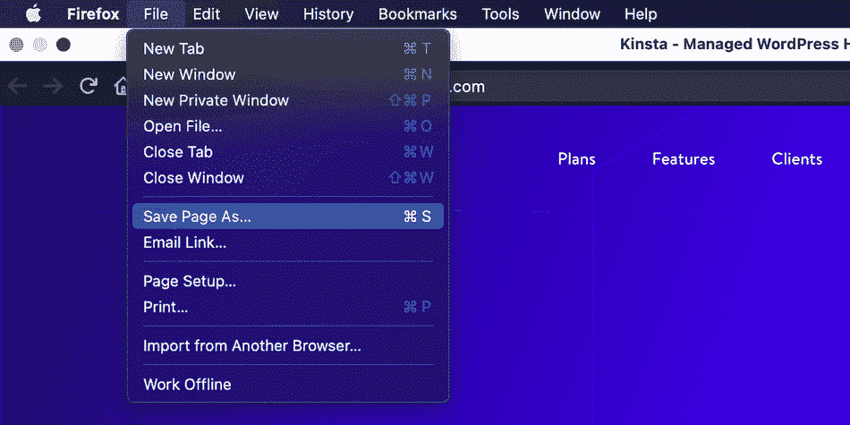

Firefox’s File menu contains the functionality you need to save a single web page.

接下来，单击保存页面的选项，此时浏览器会显示一个对话框。

在这里，为您的页面选择一个名称(尽管默认名称也可以)。另外，确保你保存的是整个页面，而不仅仅是 HTML 文件。它将尽可能保留网站的最大功能。

### 2.使用 DevKinsta 来归档你的 WordPress 网站

DevKinsta can also help you archive a website.

我们认为 [DevKinsta](https://kinsta.com/devkinsta/) 是创建和部署 WordPress 网站的必要工具。然而，它也有另一个目的:它也可以帮助你存档你的 Kinsta 托管的网站。

在我们的一篇知识库文章中，我们已经介绍了将一个[外部 MyKinsta 备份](https://kinsta.com/knowledgebase/devkinsta/import-an-external-backup/)拉入 DevKinsta 的整个过程。总结一下:

*   在 MyKinsta 中创建并下载一个备份。
*   用 DevKinsta 创建一个新站点。
*   导入您的内容和数据库。
*   在你的数据库上执行一个搜索和替换操作，将 URL 名称从你的实时站点更改为你的新的本地存档。

此时，您可以在 DevKinsta 中打开您的站点，并像运行时一样使用它。

### 3.使用在线存档(如 Wayback 机器)

没有一个教程是完整的，它会向你展示如何使用时光倒流机。幸运的是，这个过程很简单。也就是说，请注意，这种方法只允许您归档单个页面(尽管订阅 [Archive-It 服务](https://www.archive-it.org/)确实允许您归档整个站点)。

对于这种方法，请访问 Wayback 机器主页，查看**立即保存页面**表单:

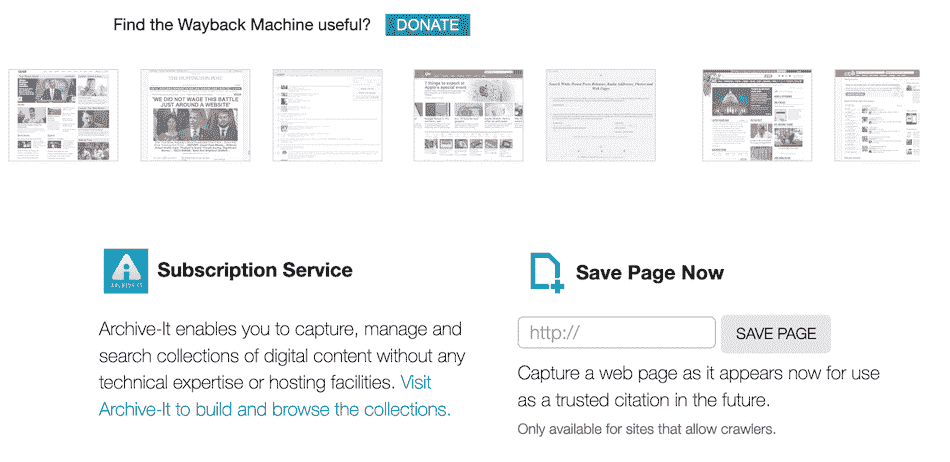

The Save Page Now form on the Wayback Machine website.

要存档一个页面，只需[将您希望保存的 URL](https://kinsta.com/knowledgebase/what-is-a-url/) 添加到该表单，然后点击**保存页面**。根据页面的大小或复杂程度，您可能需要等待几分钟，让爬虫和引擎完成它们的工作。这可能是因为页面看起来像是崩溃了。在我们的测试中，有一段时间我们面临着[白屏死机(WSoD)](https://kinsta.com/blog/wordpress-white-screen-of-death/) 。

然而，一旦页面存档，Wayback Machine 会将您重定向到新的专用页面。

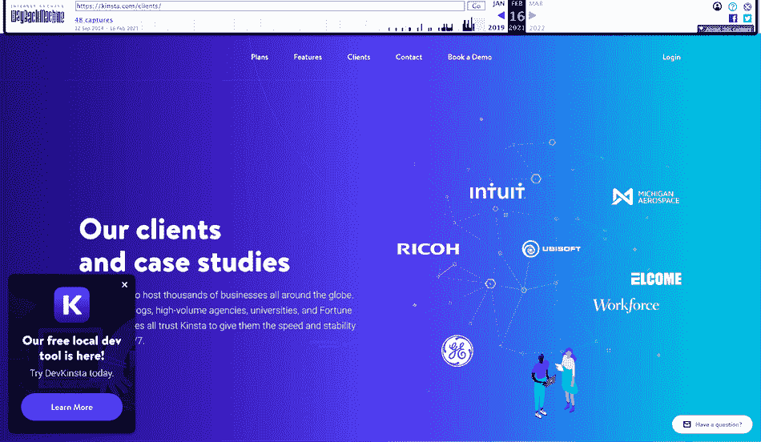

A Kinsta page archived on the Wayback Machine.

请注意，您也可以使用[书签和浏览器扩展](https://www.bitsgalore.org/2014/08/02/How-to-save-a-web-page-to-the-Internet-Archive)来存档网站。事实上，目前大多数[浏览器](https://kinsta.com/browser-market-share/)都有这些开箱即用的选项，包括[谷歌 Chrome](https://chrome.google.com/webstore/search/web%20archive) 、[火狐](https://addons.mozilla.org/en-US/firefox/search/?q=web%20archive)和 [Safari](https://apps.apple.com/app/wayback-machine/id1472432422?mt=12) 。

### 4.安装 Web 存档集成层(WAIL)

这种方法的第一步是下载并安装 WAIL 本身。幸运的是，该工具有一个专用的安装程序(尽管因为该程序是用 [Python](https://kinsta.com/blog/best-programming-language-to-learn/#python) 编写的，所以它使用 PyInstaller 模块)。

安装过程非常容易。无论您使用何种操作系统，您都可以执行以下操作:

*   导航到[wall 网站](https://machawk1.github.io/wail/)并为您的操作系统下载合适的安装程序。
*   或者解压缩 Windows 版本的文件，或者挂载 macOS 的 DMG 映像。
*   在生成的 macOS 对话框屏幕上，将应用程序图标拖到您的**应用程序**文件夹中。对于 Windows 用户，只需将解压后的文件夹拖到你的根目录 **C:\** 驱动器。
*   启动 **WAIL.app** 或者【WAIL.exe】T2(取决于你的操作系统)。

一旦 WAIL 打开，您将看到它的最小界面:

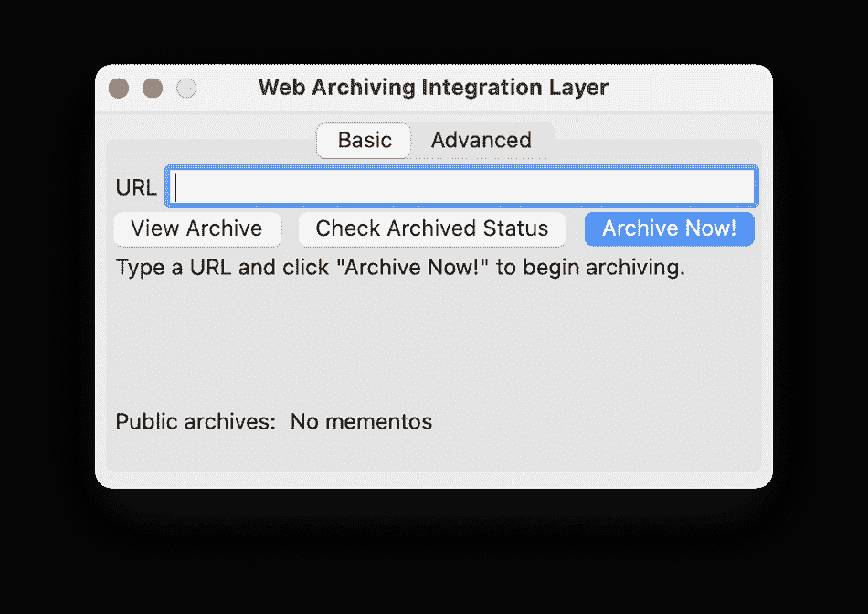

The WAIL interface gives you three options.

现在您有三个选项可供选择:查看存档、检查其状态或存档网站。这些按钮有点令人困惑，因为您的自然倾向可能是从左向右阅读。然而，在第一次启动时，您的档案中什么也没有。

相反，输入您想要存档的站点的 URL，然后单击**立即存档！**你会看到 WAIL 开始抓取网站。您可以在**高级****T6】Heritrix**选项卡上查看您的抓取状态:

WAIL showing the current status of the crawl job.

完成后，它会给你显示一个“成功”的信息。此时，您可以点击**基本**选项卡上的**查看档案**按钮。这将在浏览器中打开您的存档站点，供您查看。

### 5.如果您习惯使用命令行，请使用 Wget

对于我们归档网站的最后一个方法，在开始之前，您需要一些东西:

*   命令行访问您的计算机
*   合适的命令行工具，如 Windows 命令提示符，或 macOS 和 Linux 上的终端
*   Wget 安装在您的计算机上

你可能已经有了前两个。

在 macOS 上，你可以用`brew install wget`命令通过[家酿](http://brew.sh)安装 Wget。注意，还需要安装家酿，不过只需要几秒钟。在 Linux 上，Wget 预装在大多数主要发行版中。

如果你是 Windows 用户，在你的电脑上安装 Wget 可能会比较困难。虽然网上有[教程可用](https://www.osradar.com/how-to-install-wget-in-windows-10/)，但是它们的指导在不同的机器之间并不一致。相反，我们建议你前往 Wget 官方网站，查看一些可用的 [Windows 二进制文件](http://wget.addictivecode.org/FrequentlyAskedQuestions.html#Where_can_I_download_Wget.3F)，因为它们更有可能为你工作。

不管怎样，一旦你安装了 Wget，使用它就很简单了。首先，在新的终端窗口中导航到一个目录。这里，我们也在创建目录，但这一步是可选的:

`cd documents && mkdir archive && cd archive`

请注意，Wget 会将所有下载内容放入任何工作目录中。在本例中，我们为文件指定了一个文件夹。

接下来，您需要对一个站点进行爬网并提取文件。每个动作都是使用`wget`命令调用的，您会希望使用以下格式:

`wget "https://kinsta.com/" --warc-file="kins"`

点击**回车**键将开始把 kinsta.com 的[下载到 index.html 的**文件中，并创建一个名为**kins-00000.warc.gz**的 WARC 文件。**](https://kinsta.com)

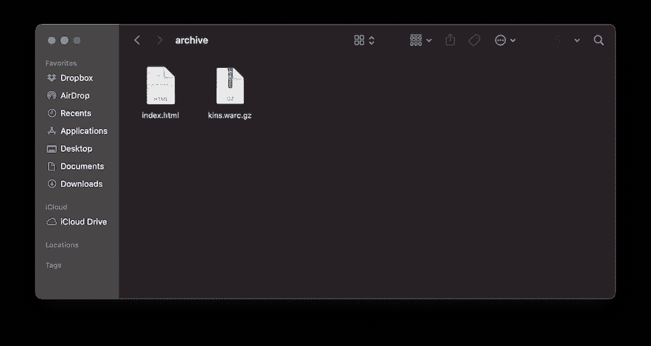

A site archived as a WARC file.

Wget 功能强大，有[许多命令和选项](https://wiki.archiveteam.org/index.php/Wget_with_WARC_output)可以使用。例如，您可以使用`**--mirror**`命令创建一个包含站点完整镜像的 WARC 文件。您也可以使用`**--no-warc-compression**`命令来编写未压缩的文件，尽管这显然会在每次下载时占用更多的空间。使用内置压缩机是最佳方法。

[归档你的网站有点像制作时间胶囊⏳...幸运的是，在本指南的帮助下，很容易上手。✅ 点击推文](https://twitter.com/intent/tweet?url=https%3A%2F%2Fkinsta.com%2Fblog%2Farchive-a-website%2F&via=kinsta&text=Archiving+your+website+is+a+bit+like+making+a+time+capsule+%E2%8F%B3...+and+luckily%2C+it%27s+simple+to+get+started+with+help+from+this+guide.+%E2%9C%85&hashtags=BloggingTips%2CWordPress)

## 摘要

Web 存档是从记录快速变化的互联网形态的需要发展而来的。它现在有多个有效的应用程序—例如，在法律文件和需求方面。无论您的需求是什么，拥有一个结构良好、组织有序的归档都可以补充您的总体备份策略。

幸运的是，有很多解决方案可以提供帮助。大多数浏览器都提供在你的电脑上保存网页的功能，尽管像 DevKinsta 这样的解决方案也是胜任这项工作的工具。然而，专用归档工具，如 [Wayback Machine](https://archive.org/web/) 、 [Heritrix](https://github.com/internetarchive/heritrix3/) 、[wall](https://machawk1.github.io/wail/)和 [Wget](http://www.gnu.org/software/wget/) 都是特别强大的解决方案，并提供标准化的文件格式来工作。

这篇文章是否让你想建立一个自己的网站？在下面的评论区分享你的想法和观点吧！

* * *

让你所有的[应用程序](https://kinsta.com/application-hosting/)、[数据库](https://kinsta.com/database-hosting/)和 [WordPress 网站](https://kinsta.com/wordpress-hosting/)在线并在一个屋檐下。我们功能丰富的高性能云平台包括:

*   在 MyKinsta 仪表盘中轻松设置和管理
*   24/7 专家支持
*   最好的谷歌云平台硬件和网络，由 Kubernetes 提供最大的可扩展性
*   面向速度和安全性的企业级 Cloudflare 集成
*   全球受众覆盖全球多达 35 个数据中心和 275 多个 pop

在第一个月使用托管的[应用程序或托管](https://kinsta.com/application-hosting/)的[数据库，您可以享受 20 美元的优惠，亲自测试一下。探索我们的](https://kinsta.com/database-hosting/)[计划](https://kinsta.com/plans/)或[与销售人员交谈](https://kinsta.com/contact-us/)以找到最适合您的方式。