# 勇敢的浏览器审查:一个安全的浏览器有一个强大的骨干

> 原文：<https://kinsta.com/blog/brave-browser-review/>

论坛和社交媒体是“[浏览器大战](https://kinsta.com/browser-market-share/)的激烈战场某一特定浏览器的用户强烈支持另一方。当然，这并不是浏览器独有的，但是这个[勇敢的浏览器](http://brave.com/)评论可能会引发另一场冲突。

从表面上看，所有迹象都表明 Brave 是一个出色的浏览器，其核心是没有用户跟踪，广告减少到最低限度。然而，随着你的深入，你会发现更多的东西，比如浏览器的性能、代码库和插件兼容性。

本文将详细回顾 Brave 浏览器，并将其与所有其他主流浏览器进行比较。

开始吧！

## 介绍勇敢的浏览器

The Brave logo.

Brave 是一长串网络浏览器中的另一个，它将自己定位为大枪的替代品——在这个例子中，[谷歌 Chrome](https://kinsta.com/blog/how-to-block-a-website-on-chrome/) 。

它是由布莱恩·邦迪和布伦丹·艾奇创造的。布兰登更为人所知的是 JavaScript 的创造者和 Mozilla(Firefox 浏览器的开发者)的联合创始人。因此，这里有一个注重隐私的血统，将吸引精通技术的用户。

浏览器本身是免费和开源的，目标是阻止广告和网站追踪器。然而，它也提供了一种向其他人，主要是内容创作者发送其专有加密货币的方式。

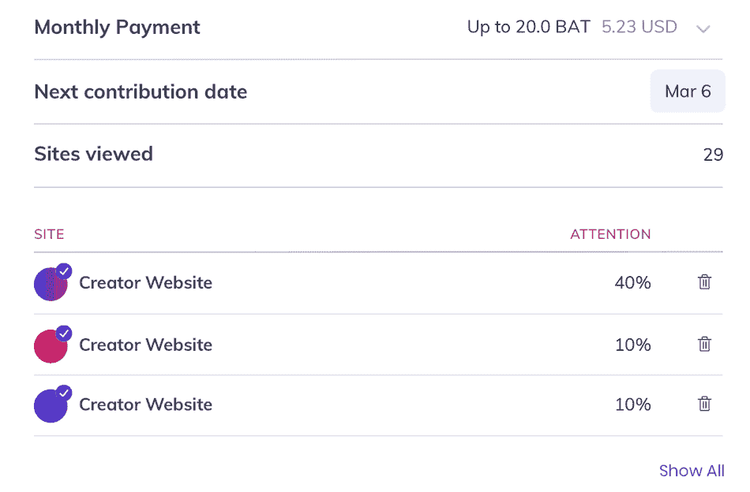

The BAT dashboard.

Brave 的开源基金会建立在 Mozilla 公共许可证(MPL)之上。这与其他 Mozilla 产品如 Firefox 和[雷鸟](https://www.thunderbird.net/en-US/)的许可相同。然而，一些包含的浏览器扩展，如 [HTTPS Everywhere](https://www.eff.org/https-everywhere) 和 [Privacy Badger](https://privacybadger.org/) ，运行在不同的开源许可证上——GNU 通用公共许可证(GPL) 的版本。

总的来说，Brave 旨在回答一个常见的用户问题:你如何利用谷歌 Chrome 的代码库，保护你的隐私和在线数据？答案是我们将在接下来的勇敢浏览器评测中讨论的内容。

[你用过勇者吗？🦁本指南涵盖了你需要知道的关于开源浏览器的一切，专注于阻止广告和网站追踪器。💪 点击推文](https://twitter.com/intent/tweet?url=https%3A%2F%2Fkinsta.com%2Fblog%2Fbrave-browser-review%2F&via=kinsta&text=Have+you+ever+used+Brave%3F+%F0%9F%A6%81+This+guide+covers+everything+you+need+to+know+about+the+open-source+browser+focused+on+blocking+ads+and+website+trackers.+%F0%9F%92%AA&hashtags=BraveBrowse%2CUX)

## 为什么要审核勇敢浏览器？

如果你去看最新的[浏览器使用统计](https://kinsta.com/browser-market-share/)，你可能会注意到几个熟悉的名字:

A list of commonly used browsers.

谷歌 Chrome 在该领域领先并不奇怪，但它的统治地位可能是你没有考虑到的。考虑到我们的生活被 Alphabet Inc .的主要关注点所触动，这是可以理解的，无论是在线还是离线。

然而，你也会注意到，Brave 只有 **0.05%** 的用户份额。考虑到这一点，你可能会问:我们为什么要在这个勇敢的浏览器审查上花费精力？

答案在于它的核心价值观和用户勇敢面对的目标。更重要的是，Brave 仅在 2019 年底推出，却积累了近[千万用户](https://brave.com/brave-launches-next-generation-browser/)。从那里，用户群迅速达到 1500 万用户，去年 11 月，Brave 达到了[2000 万用户的里程碑](https://cryptobriefing.com/brave-browsers-successful-year-proves-users-care-about-privacy/)。

你还可以在 YouTube 上找到与勇敢相关的内容。这款浏览器已经在著名的频道上亮相，如 [Pocketnow](https://www.youtube.com/watch?v=i1feoop_YSY) 、 [dottotech](https://www.youtube.com/watch?v=cQuTwpUFIXU) 、 [Chris Titus Tech](https://www.youtube.com/watch?v=DxlO-LFSJQs) 等等。对使用 Vim 感兴趣的开发者可能也注意到了 prime agen——一个渠道不断增长的网飞开发者——使用了 Brave(尽管没有明确地推广它)。

勇敢之星正在崛起。到 2021 年底，我们可能会看到它的市场份额进一步增加，特别是因为它正被许多开发人员和安全意识强的技术用户使用和考虑。

## 勇敢浏览器的商业模式分析

简而言之，Brave 通过[两个流](https://brave.com/brave-rewards/)赚钱，这两个流都专注于广告:Brave 注意力令牌(BAT)和一个广告网络。

内容创建者注册广告网络，这些广告通过浏览器显示在网站上。当你浏览网页时，你会看到来自网络的经过 Brave 批准的广告，而不是来自第三方(即基于谷歌的)网络:

An example of Brave’s ads on display.

Brave 跟踪您访问的网站，并添加您的特定广告浏览量。由此，你将获得蝙蝠——一种你可以[返还给创造者](https://brave.com/tips/)的加密货币。每月一次，你的蝙蝠数量会根据浏览时间，也就是你的“注意力”按比例发送到网站你也可以按 70%的比例付费观看广告。

重申一下，Brave 表面上看起来是一个很好的以用户为中心的工具。然而，对这种商业模式有许多批评:

*   Brave 跟踪你来投放广告，这和你在谷歌的生态系统中没有太大的不同。
*   我们积极鼓励你浏览广告以赚取现金。我们认为这个要求并不符合最终用户选择 Brave 的核心需求。
*   比起在谷歌的生态系统中，内容创作者可能面临更糟糕的待遇。

让我们更详细地讨论其中的一些要点。默认情况下，Brave 会屏蔽广告，作为回报，它会用自己网络中的广告来替代广告。您的货币化路径被转换为 Brave 的加密货币解决方案(可与[维护](https://uphold.com/en-us/get-started/brave)关联以提取)。

更重要的是，内容创作者必须以 BAT 的形式潜在地[拿更少的钱](https://www.kevinmuldoon.com/do-not-use-brave-browser/)，这显然比用你的当地货币支付更不直接。

此外，值得注意的是，在 Brave 的旧版本中，开发人员不得不改变他们的 Brave 奖励选择加入的措辞。一些用户的网站和社交媒体在未经他们同意的情况下被货币化。一个网站是否是 Brave 货币化网络的一部分，现在在浏览器中一目了然:

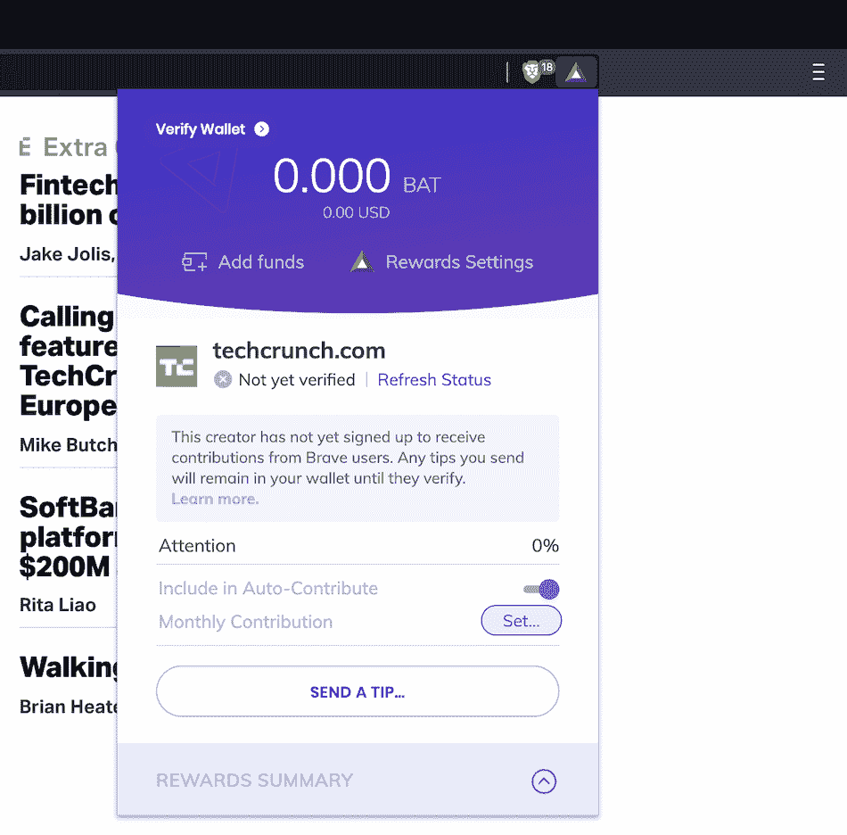

TechCrunch is not part of the Brave Rewards scheme, which is shown in the browser.

虽然 Brave 和它的核心用户之间似乎存在一些哲学上的不一致，但这个网络对许多人来说是有价值的。实际上，大多数人很可能在浏览网页的时候不会去想他们的蝙蝠数量或者它们会去哪里。

## 勇敢浏览器的主要特性

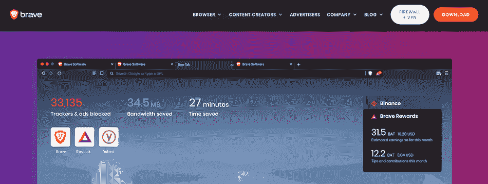

The Brave website.

现在我们已经讨论了 Brave 的背景和背景故事，让我们深入浏览器本身。

正如我们提到的，Brave 是一个利用 MPL 许可的开源浏览器。它建立在 Chromium 开源浏览器之上。对于外行来说，这是谷歌浏览器的开发版本，没有任何专有元素。

我们将在稍后与 Brave 进行直接比较时更详细地研究 Chromium。然而，请注意，Brave 可能会有与 Chrome 和 Chrome 相同的问题。

您可以使用许多附加组件来扩展 Brave，其中一些运行在 GPL 许可证上。由于它是基于 Chromium 构建的，你也可以从 Chrome 网上商店安装任何扩展。它们将以相同的方式运行，具有相似的性能。

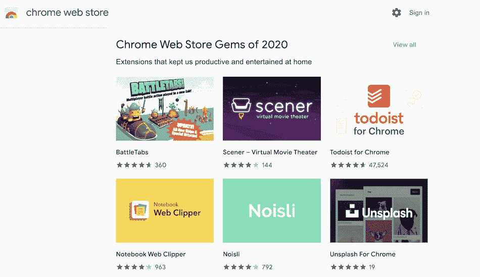

The Extensions link within Brave redirects to the Chrome Web Store.

还有一个浏览器的勇敢开发版本，它提供了一个使用最先进的夜间构建的机会。这类似于[火狐开发者版](https://www.mozilla.org/en-US/firefox/developer/)。幸运的是，Brave 提供了相同口径的 Chrome 和 Chrome 开发工具，通过相同的快捷方式访问:

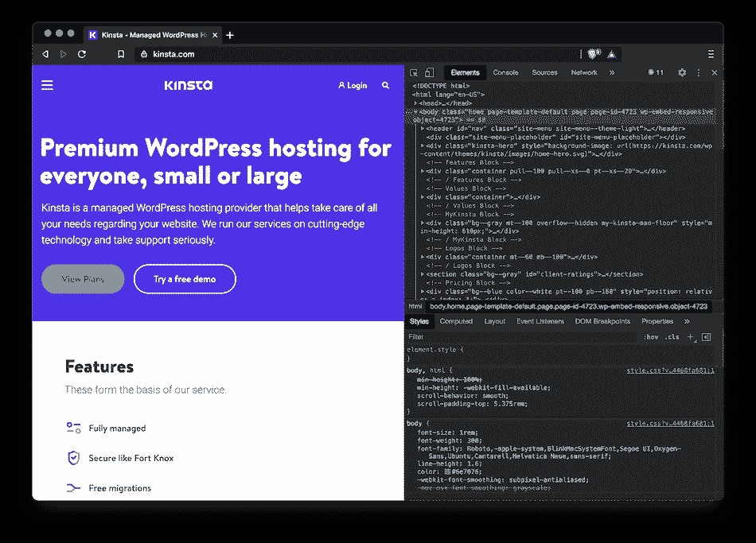

Brave’s Developer Tools.

因为浏览器是免费的，而且专注于广告限制，你可能会问开发者如何从用户那里获得收入。我们接下来将更详细地讨论这一点。

### Brave 对网络安全的关注

在安全性方面，Brave 至少和 Chrome 一样可靠，这意味着它也可能和 Chrome 一样安全。当然，没有一个浏览器是 100%安全的，但是请放心，如果你问:“Brave 是一个安全的浏览器吗？”那么答案是“是”

Brave 包含了许多安全特性。例如:

*   有一个内置的密码管理器，以帮助您创建和存储安全的密码，而浏览。
*   您可以逐个站点地控制对自动播放功能的访问。
*   你可以通过网站控制 cookies 和阻止脚本。
*   私人浏览器窗口被包裹在来自 [Tor 项目](https://www.torproject.org/)的功能中，确保安全可靠的网上冲浪。

这些都是坚实的特征。更重要的是，你可以[启用 HTTPS Everywhere](https://kinsta.com/blog/http-to-https/) 来确保所有的站点连接都是加密的。如果你发现自己经常输入敏感数据，这是很棒的，所以看到它成为 Brave 的标准真是太棒了。

很明显，开发者希望提高网络用户的安全性和隐私性。例如，Brave 是第一个为[星际文件系统(IPFS)链接](https://www.zdnet.com/article/brave-becomes-first-browser-to-add-native-support-for-the-ipfs-protocol/)提供本地支持的浏览器。这显示了“日常”安全设置是多么的巧妙。

你可以从勇敢工具栏访问你所有的“盾牌”设置——它是最右边的小狮子标志:

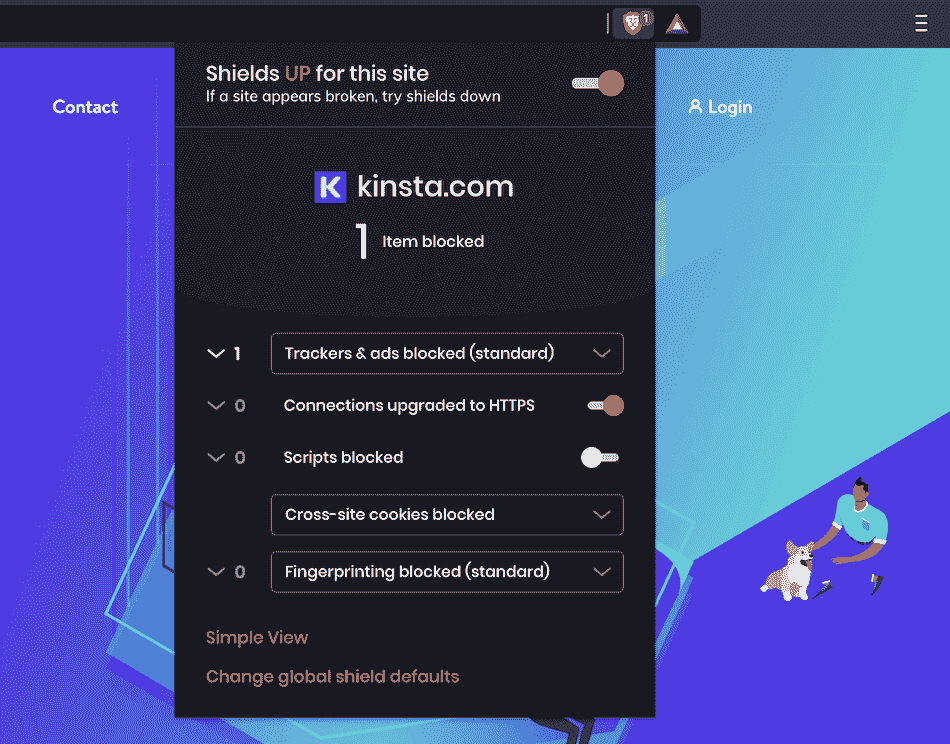

The Brave Shield settings.

默认情况下，护盾是打开的，关闭护盾很简单。在此之下，您将看到一个简单的屏幕，显示已经执行了多少块:

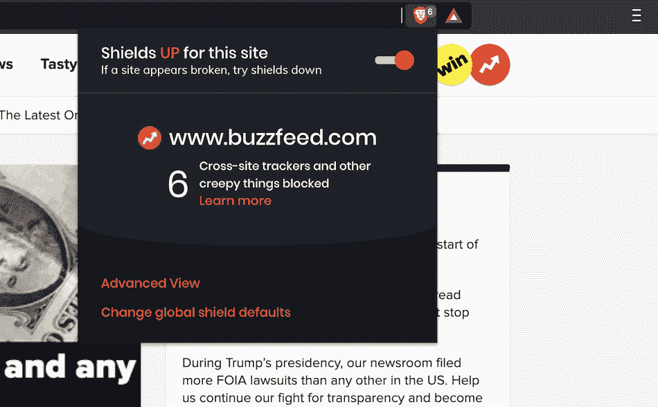

Brave’s Basic View, showing the number of actions taken to block ads and trackers.

如果您点击**高级视图**链接，对话框会展开以显示被阻止元素的明细。几乎所有网站都有一个下拉框，允许您更改特定网站的设置:

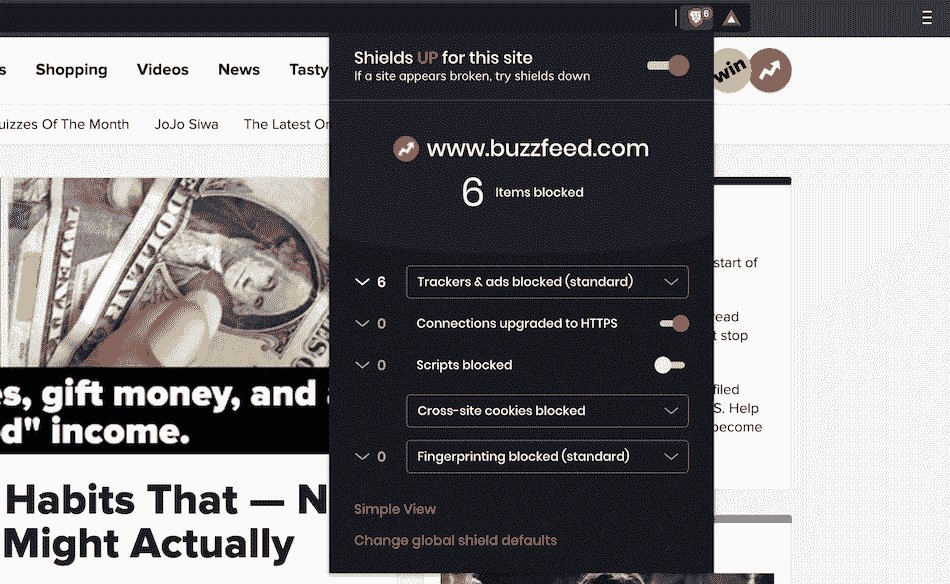

Brave’s Advanced View, showing more details for the number of blocking actions taken.

你可以改变 Brave 阻止广告和追踪器、[跨站点 cookie](https://kinsta.com/blog/wordpress-cookies-php-sessions/)和“指纹识别”的方式您还可以切换 HTTPS Everywhere 功能，该功能适用于网站的所有传入连接，而不仅仅是主页。

许多用户对 Brave 及其安全条款有很多疑问。我们甚至看到用户问:“勇敢的浏览器是病毒吗？”当然，答案是“不”

总的来说，Brave 在保护用户免受病毒入侵方面做了很多工作。

### Brave 中的广告拦截

在我们继续之前，值得指出 Brave 广告拦截的一些方面，开发者在他们的[常见问题(FAQ)页面](https://brave.com/faq/)上回答了这些问题。

简而言之，Brave 默认屏蔽所有第三方广告和追踪器。但是，它不会阻止“第一方”内容。你通常会在推广帖子和搜索引擎广告中看到这种情况:

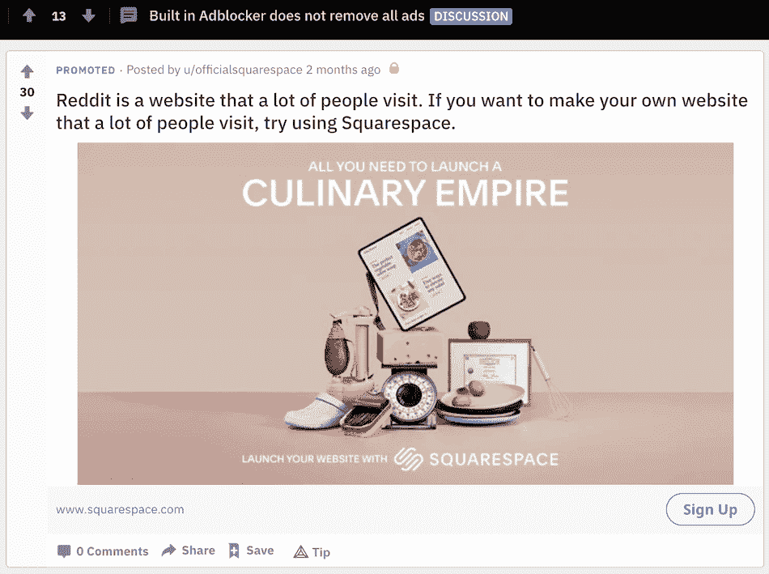

An example of first-party content on Reddit.

此外，Brave 还没有使用[可接受的广告](https://adblockplus.org/acceptable-ads)模式。当然，考虑到 Brave network 是唯一“批准”的广告来源，我们可能会在一段时间的增长后看到这一点的实现。

## 注册订阅时事通讯

### 想知道我们是怎么让流量增长超过 1000%的吗？

加入 20，000 多名获得我们每周时事通讯和内部消息的人的行列吧！

[Subscribe Now](#newsletter)

### Brave 如何处理用户跟踪和数据收集

随着 cookies 的发展和广告网络规模的扩大，用户跟踪已经成为一个相关的话题很多年了。例如，广告货币化是谷歌的“招牌功能”。虽然有些人一直在为一个用户不是产品的网站而奋斗，但是更多的普通用户现在也加入进来了。

The Electronic Frontier Foundation’s”Do Not Track” initiative.

例如， [DuckDuckGo](https://kinsta.com/blog/alternative-search-engines/#2-duckduckgo) 是一个专注于[用户隐私的搜索引擎](https://kinsta.com/blog/alternative-search-engines/#best-alternative-privacy)，它直接与谷歌竞争。它每天大约有 1 亿次点击，比往年高出 65%左右。

The DuckDuckGo search engine.

此外，最近围绕谷歌及其关于用户数据的[做法的新闻已经导致一些用户寻找替代解决方案。事实上，勇敢的团队还揭露了](https://www.cnbc.com/2020/12/18/google-antitrust-cases-in-us-and-europe-overview.html)[过去干扰谷歌跟踪的做法](https://thenextweb.com/hardfork/2019/09/04/brave-google-chrome-browser-track-users-hidden-web-pages-gdpr/)，这进一步煽风点火。

Brave 将自己定位为以用户为中心的浏览器，保护数据并阻止获取数据的企图。到目前为止，我们讨论的一些特性表明，这方面的工作正在进行中。勇敢的人声称他们“……不从事个人数据业务。”您的数据在服务器之间是保密的，这意味着没有“指纹”出售给第三方。

然而，多年来众所周知的是，Chromium 浏览器*会*联系谷歌的服务器，尽管是以一种有限的方式。此外， [PRISM Break](https://prism-break.org/en/categories/macos/#web-browsers) 网站的社区成员(该网站致力于寻找不符合[美国监控计划的](https://en.wikipedia.org/wiki/PRISM_(surveillance_program))原则的解决方案)不推荐任何基于 Chromium 的浏览器。

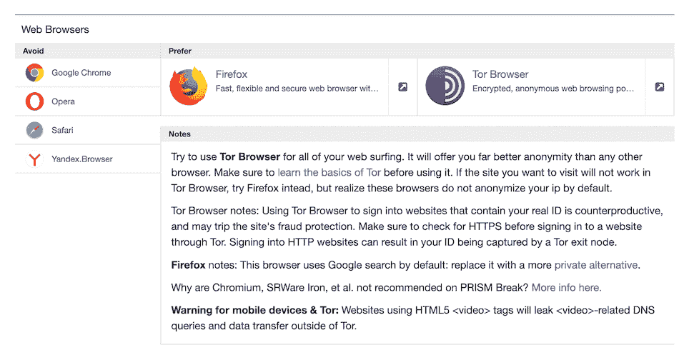

The PRISM Break website.

一个旧的 GitHub 条目详细解释了原因。简而言之，Chromium 在启动时连接到 Google，主要是检查与浏览器和扩展相关的更新。一个广泛的【激烈的】 [GitHub 线程](https://github.com/privacytools/privacytools.io/issues/649)与 Brian Bondy 讨论了 Brave 自己的跟踪能力。然而，这并没有消除任何担忧。

很明显，Brave 比其他浏览器更注重防止跟踪。但它的基本代码库有一些入口点，导致一些用户质疑 Brave 的完整性甚至合法性。

勇敢浏览器违法吗？不，它不是，尽管它*确实*帮助用户保护他们的数据不被网络跟踪，并且至少在基于广告的层面上防止指纹识别。

### 勇敢的速度和性能在使用中

在我们进行浏览器对比之前，让我们从多个角度来看看 Brave 自己的表现。

从经验的角度来看，M1 MacBook Air 搭载了 Brave。可以说，它比相同系统上的 Firefox 或 Safari 更快，而且性能显然与 Chrome 相似。考虑到我们提到的运行在引擎盖下的技术——HTTPS Everywhere、Privacy Badger 等等，这令人印象深刻。

如果你看一看 Brave 的网站，你会看到那些[速度改进](https://brave.com/new-brave-22-percent-faster/)是最重要的。这是第一个突出显示的功能。

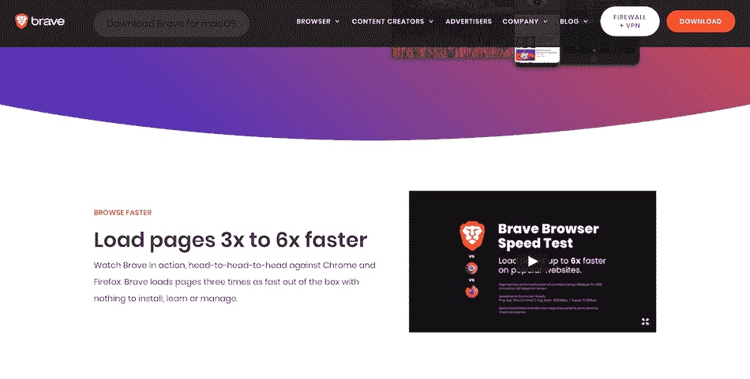

Brave’s speed claims on its website.

事实上，速度在过去也是一个主题公告。因此，你会期待勇敢的表现。

最初的基准测试令人印象深刻，这是针对一年前的 beta 代码。在 [VentureBeat 最近的测试](https://venturebeat.com/2020/01/15/browser-benchmark-battle-january-2020-chrome-firefox-edge-brave/view-all/)中，Brave 在所有测试中都表现出色，甚至赢得了垒标枪战。

为了了解 Brave 在现实世界中的表现，我们对六种不同的浏览器进行了四次不同的基准测试——分别是 [MotionMark](https://browserbench.org/MotionMark1.1/) 、[速度计](https://browserbench.org/Speedometer/)、 [Basemark](https://web.basemark.com/) 和 [WebXPRT](https://www.principledtechnologies.com/benchmarkxprt/webxprt/) 。我们使用了一台装载了 M1 芯片的全新 MacBook Air，结果如下:

|  | 运动标记 | 速度计 | 基础标记 | WebXPRT |
| 勇敢的 | Five hundred and sixteen point zero four | One hundred and ninety-one | One thousand three hundred and nineteen point nine five | Two hundred |
| 谷歌浏览器 | Five hundred and thirty-seven point one two | Two hundred and eight | One thousand three hundred and thirty-nine point zero two | Two hundred and two |
| 铬 | Four hundred and five point one four | One hundred and fourteen | Nine hundred and thirty point seven two | One hundred and eighty-two |
| Mozilla Firefox | Nine hundred and forty-two point five eight | Two hundred and ninety-one point three | One thousand and thirty point seven three | Two hundred and fifty-three |
| 苹果 Safari | One thousand nine hundred and thirty-three point eight four | Two hundred and nineteen | Eight hundred and forty-four point seven five | Two hundred and eighty-one |
| 微软 Edge | Five hundred and fifty-four point one nine | One hundred and ninety-three | One thousand four hundred and fifty-one point eight two | Two hundred and three |

基于这些结果，Brave 在性能方面与其他基于 Chromium 的浏览器不相上下，但并没有完全击败它们。

顺便说一句，Safari 和 Firefox 在测试中的优势令人惊讶(但也可以理解)。然而，在基准测试过程中，有许多因素会影响分数。不过，与竞争对手相比，这是一个有趣的“真实世界”测试。

借助我们简化的网站管理，减少网站故障排除时间，将更多时间用于发展您的业务。[免费试用 MyKinsta】](https://hubs.ly/H0pklC_0)

我们认为，鉴于 Chromium 的不足，Brave 可以与大公司竞争——作为最终用户，您很少会注意到延迟或其他性能问题。

## 与其他 5 种浏览器相比，勇敢程度如何

当然，考虑 Brave 意味着你会想把它与你当前的浏览器进行比较。因此，让我们看看你目前可能已经安装的一些浏览器，并讨论 Brave 是否有可能取代它们。

### 1.谷歌浏览器

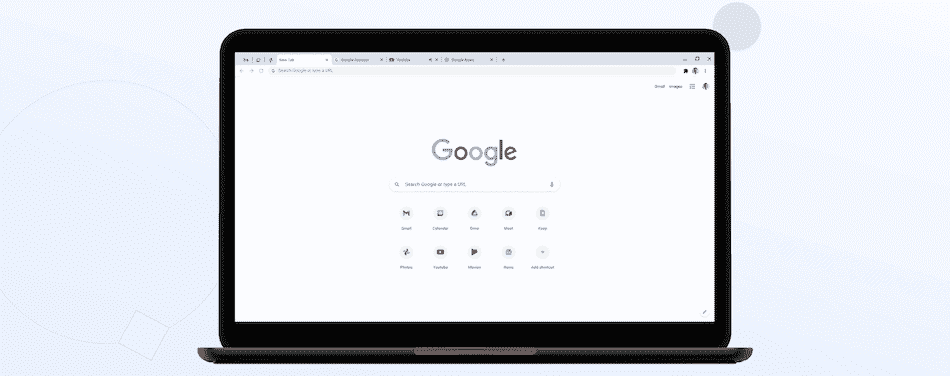

The Google Chrome website.

当然，Chrome 是 Brave 的主要竞争对手，它的大部分营销都取决于它在谷歌浏览器上的表现:

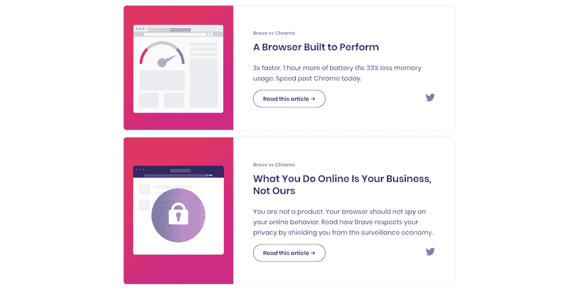

Brave’s Chrome comparison page.

因此，如果不与 Chrome 进行比较，任何勇敢的浏览器评论都是不完整的。好消息是，Brave 几乎提供了 Chrome 所做的一切，在顶部有一层隐私和广告屏蔽。当然，这取决于基础代码，尽管 Chrome 在基准性能测试中确实优于 Brave。

我们建议，不管浏览器有多相似，如果你已经在谷歌的生态系统中，Chrome 更胜一筹。Chrome 网络商店紧密集成，并提供一致的安全补丁和更新(Brave 也是如此)。

那么，Brave 比 Chrome 好吗？这个看你的整体需求了。然而，如果你喜欢 Chrome，但不喜欢被跟踪，你就会陷入 Brave 的工作方式。

### 2.铬

我们在本文中经常提到它，但是 [Chromium](https://www.chromium.org/Home) 是谷歌 Chrome 的开源代码库，其他许多浏览器也是如此。当然，勇敢是这个俱乐部的一部分。

值得指出的是，Chromium 并不打算供公众使用，尽管你会发现它可以通过一些 Linux 包管理器安装。该浏览器是为开发人员设计的，用于学习如何构建 web 应用程序，该网站完全是旧时代的产物:

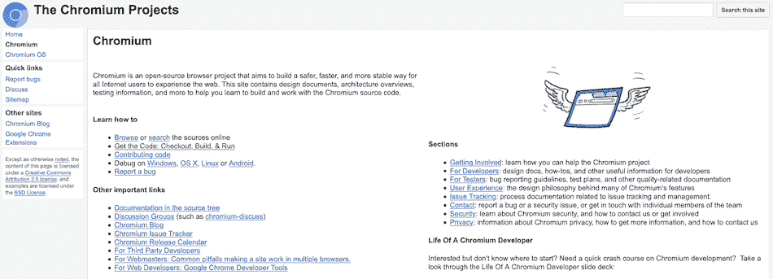

The Chromium website.

更重要的是，没有安装程序或更新功能。这意味着你必须使用特定操作系统的指令[【构建】浏览器](https://www.chromium.org/developers/how-tos/get-the-code)。要更新 Chromium，您需要安装“夜间版本”——字面意思是在工作日结束时“按原样”安装浏览器。这是软件开发者版本的标志。

当然，我们在这里比较它是因为它是勇敢成长的种子。然而，在现实中，铬是不可比的。这是一个产品浏览器的开发[“beta”版本](https://kinsta.com/help/kinsta-beta-crew/)——换句话说，是一个入门版本。即便如此，Brave 提供了 Chromium 的所有功能，甚至更多。

简而言之，对于一般的网上冲浪，Brave 将在所有方面提供更多的功能。

### 3.Mozilla Firefox

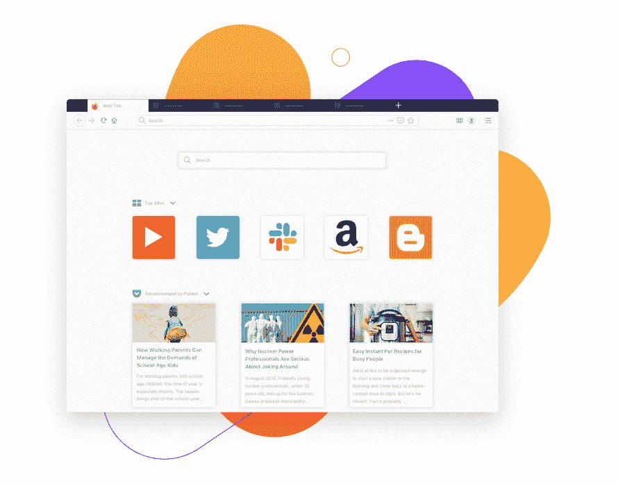

The Firefox browser.

正如我们提到的，勇敢和火狐有着独特的联系。Brendan Eich 创立了 Brave 和 Mozilla，这两款浏览器都在 MPL 许可下运行。

虽然 Brendan 在 Mozilla 的时光在云的笼罩下结束，但他是一个将用户隐私放在网上冲浪最前沿的项目的负责人。Firefox 今天仍然是用户隐私的冠军，它的性能现在与竞争对手不相上下，这使它成为几乎所有使用的伟大浏览器选择。

即便如此，在用户安全方面，Firefox 和 Brave 还是很接近的。火狐甚至在他们的官方对比中这样说。

我们建议这两种浏览器都提供强大的隐私和屏蔽工具，尽管 Brave 有更好的用户界面。它的性能也更好，这可能是一些用户的决定性因素。

### 4.苹果 Safari

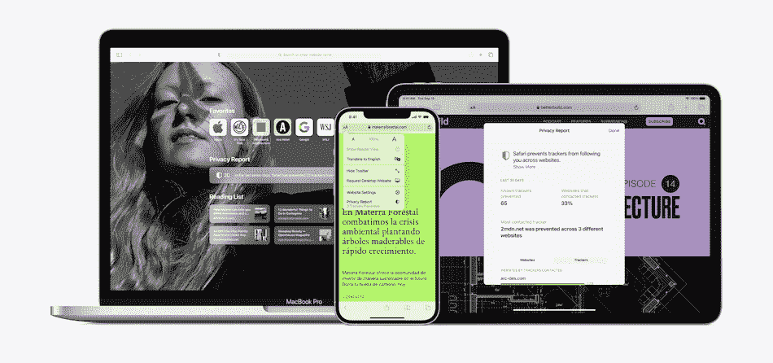

Apple’s Safari browser.

苹果的专有浏览器要么被默认使用，要么饱受诟病。然而，这是一个有能力的浏览器，需要表现良好，因为它是所有苹果设备的默认设置。

因为它无处不在，macOS 和 iOS 用户会经常比较 Safari 和 Brave。不管怎样，这两种浏览器提供了不同的体验，直接比较它们是不公平的。Brave 正在提供一项专注于广告拦截和安全网页浏览的服务。Safari 的目标是主导苹果用户，并为融入更广泛的生态系统提供一个接触点。

尽管如此，Safari 还是提供了很好的保护，表现为一组简单的复选框:

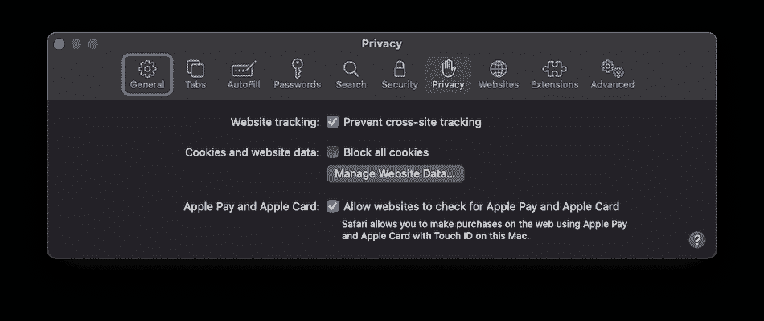

Safari’s security panel.

虽然您可以为浏览器添加扩展来创建自己的安全解决方案，但这看起来并不怎么样。相比之下，Brave 在安全性和广告拦截方面已经做好了开箱即用的准备，并提供了更多的定制功能。

选择苹果设备是假设你想要一套紧密集成的应用程序。因此，选择 Brave 有利于安全，但不利于访问苹果的其他服务。

### 5.微软 Edge

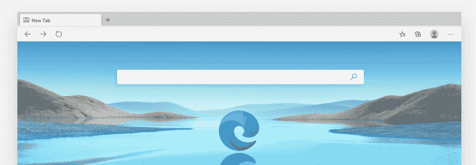

The Microsoft Edge browser.

在这篇快速综述中，我们的最后一款浏览器是 Internet Explorer 的继任者 [Edge](https://microsoftedgewelcome.microsoft.com/en-us/) 。然而，这些浏览器是截然不同的，因为 Edge 几乎在所有方面都击败了它的前辈。

尽管各种基准测试的性能指标令人印象深刻，但 Edge 的使用率很低，实际上远远落后于所有大公司。因此，你可能想知道为什么我们在这里进行比较。答案是:这是另一个基于 Chromium 的浏览器。

这意味着我们已经讨论过的关于 Chromium 浏览器的大部分内容也适用于 Edge。事实上，各种新闻媒体已经注意到它的最高性能以及隐私问题。

实际上，我们会问用户是否在直接比较 Edge 和 Brave。更有可能的是，Edge 最终与 Brave 捆绑在一起，以“联手”对付 Chrome 和 Safari 等常见的可疑产品。在那个群体中，埃奇比不上勇敢。把它当成微软版的 Safari，因为使用数据比功能更重要。

更重要的是，Edge 已经成为 Mac 用户的某种狂热浏览器，尤其是对那些从 Windows 切换过来的用户。即便如此，Edge 并不注重隐私，尽管它的表现至少和 Brave 一样好。考虑到这一点，Brave 可能是你安全和隐私浏览的更好选择。

[寻找新的网络浏览器？👀了解 Brave 对广告拦截和用户体验的关注如何使其在拥挤的领域中脱颖而出🔒](https://twitter.com/intent/tweet?url=https%3A%2F%2Fkinsta.com%2Fblog%2Fbrave-browser-review%2F&via=kinsta&text=Looking+for+a+new+web+browser%3F+%F0%9F%91%80+Learn+how+Brave%27s+focus+on+ad-blocking+and+user+experience+sets+it+apart+in+a+crowded+field+%F0%9F%94%92&hashtags=BraveBrowser%2CWebSecurity)

## 摘要

隐私问题多年来一直是一个突出的讨论话题。尽管越来越多的隐私问题，谷歌浏览器已经成为目前 T2 排名第一的浏览器。鉴于谷歌最近的反垄断担忧和商业模式，像 Brave 这样的竞争对手[是受欢迎的。](http://brave.com)

Brave 在发动机罩下的安全性方面没有获得最高分，因为它运行在[铬代码库](https://www.chromium.org/)上。然而，它的开发者正试图在广告跟踪拦截器和“指纹”混淆方面提供用户需要的东西。

虽然 Brave 的广告平台在理论上看起来不错，但批评表明，其薪酬方案可能不会给内容创作者带来很大好处。Brave 适合特定类型的用户:精通技术、注重隐私，还需要使用现代浏览器工具。

总的来说，如果你不能完全脱离 Chrome，但又想断绝与谷歌的大部分联系，Brave 可以满足你的要求。

这个勇敢的浏览器评论有助于你决定是否做出改变吗？在下面的评论区分享你的想法吧！

* * *

让你所有的[应用程序](https://kinsta.com/application-hosting/)、[数据库](https://kinsta.com/database-hosting/)和 [WordPress 网站](https://kinsta.com/wordpress-hosting/)在线并在一个屋檐下。我们功能丰富的高性能云平台包括:

*   在 MyKinsta 仪表盘中轻松设置和管理
*   24/7 专家支持
*   最好的谷歌云平台硬件和网络，由 Kubernetes 提供最大的可扩展性
*   面向速度和安全性的企业级 Cloudflare 集成
*   全球受众覆盖全球多达 35 个数据中心和 275 多个 pop

在第一个月使用托管的[应用程序或托管](https://kinsta.com/application-hosting/)的[数据库，您可以享受 20 美元的优惠，亲自测试一下。探索我们的](https://kinsta.com/database-hosting/)[计划](https://kinsta.com/plans/)或[与销售人员交谈](https://kinsta.com/contact-us/)以找到最适合您的方式。