# 如何在电脑和智能手机上显示隐藏文件

> 原文：<https://kinsta.com/blog/show-hidden-files/>

您想快速显示计算机或手机上的隐藏文件和文件夹吗？

如果您或计算机上的任何其他用户曾经隐藏过某个文件或文件夹，很容易就会丢失该文件的位置。

幸运的是，如果你有适当的权限，大多数操作系统都有显示这些隐藏文件的选项。

无论您是 Windows、macOS、Linux、Android 还是 iOS 用户，我们都能满足您的需求。在这篇文章中，我们将回顾显示隐藏文件的最快和最简单的方法，不管你的设备是什么。

让我们直接开始吧。

### 更喜欢看[视频版](https://www.youtube.com/watch?v=DpZw4KbUGj4)？

## 如何在我的 Windows 笔记本电脑上显示隐藏文件？

在 Windows 10 中，显示隐藏文件或文件夹的最简单方法是使用文件浏览器的**视图**选项。


> 需要在这里大声喊出来。Kinsta 太神奇了，我用它做我的个人网站。支持是迅速和杰出的，他们的服务器是 WordPress 最快的。
> 
> <footer class="wp-block-kinsta-client-quote__footer">
> 
> 
> 
> <cite class="wp-block-kinsta-client-quote__cite">Phillip Stemann</cite></footer>

[View plans](https://kinsta.com/plans/)

首先，打开你的**文件浏览器** ( **WIN + E** ，转到你认为有隐藏文件的文件夹。接下来，点击**视图**选项卡，然后勾选**隐藏项目**文本旁边的复选框。


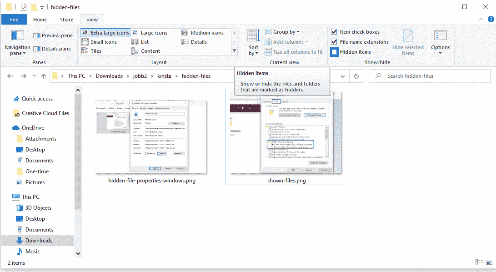

Windows 文件资源管理器显示隐藏文件


这应该会立即显示该文件夹中的任何隐藏文件。如果您没有看到任何隐藏文件，这意味着在该特定文件夹中没有任何文件。您应该注意，隐藏文件不同于删除的文件。

在旧版本的 Windows(和 Windows 10)中，你可以在控制面板的**文件浏览器选项**中编辑这些设置。

在 Windows 工具栏中搜索“文件夹”并选择第一个结果。如果“文件夹”没有显示您需要的选项，您也可以搜索“文件资源管理器选项”。


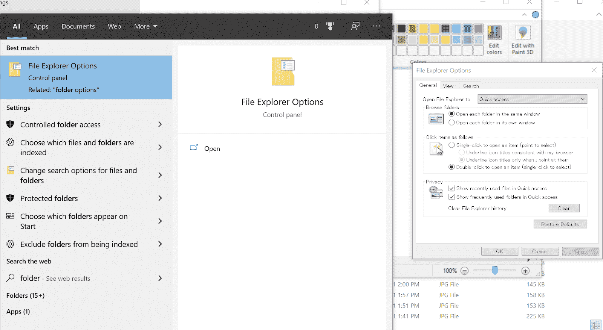

Windows 文件资源管理器选项


对于没有搜索框的比 Windows Vista 旧的版本，你可以手动导航到**外观和主题**下的**文件夹选项**。

接下来，导航到**视图**选项卡，将**隐藏文件和文件夹**设置更改为**显示**。


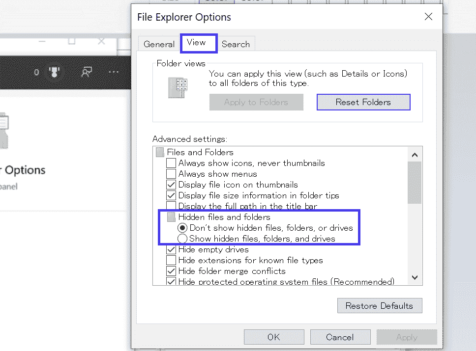

文件浏览器选项切换为显示隐藏项


一旦您选中了**显示隐藏文件、文件夹和驱动器**单选按钮，您就可以看到所有隐藏的文件。

**注:**绝大多数隐藏文件是 Windows 系统文件和软件缓存文件，包括[浏览器缓存文件](https://kinsta.com/knowledgebase/how-to-clear-browser-cache/)。编辑、移动或删除错误的文件会破坏您的操作系统。在进行任何更改之前，请 100%确定您不在系统文件夹中。

如果你想清除不同程序的缓存，通常可以在程序设置中完成。不需要手动翻看，一个一个删除隐藏文件。

### 在 Windows 中显示隐藏文件的快捷方式是什么？

不幸的是，Windows 没有显示隐藏文件的原生键盘快捷键。即使在最新版本的 Windows 10 中，你也需要一个自定义脚本。

但另一方面，通过视图设置手动显示文件只需几秒钟。

首先，按下 **WIN + E** 打开 Windows **文件浏览器**并导航到隐藏文件的文件夹。

然后，点击进入**视图**选项卡并检查**隐藏项目**框。


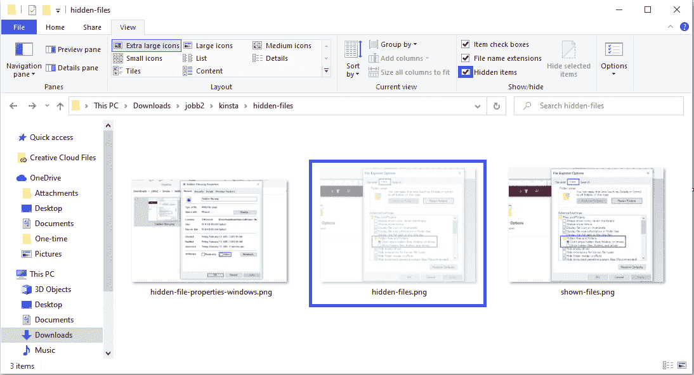

在文件浏览器中查看隐藏文件


就这么简单。

如果你是一名开发人员，想要通过快捷方式隐藏或显示隐藏的文件，你可以通过自定义的[自动热键脚本](https://www.howtogeek.com/howto/keyboard-ninja/keyboard-ninja-toggle-hidden-files-with-a-shortcut-key-in-windows/)轻松创建一个。

### 如何在 CMD 中显示隐藏文件

Windows **命令提示符(CMD)** 允许你以不同的方式探索隐藏的文件和目录。它类似于 Linux 和相关系统上的终端工具 T2。你可以使用命令挑出*给定目录中隐藏的文件和文件夹。*

要打开 CMD，你可以使用 Windows **运行**工具，按下 **WIN + R** ，然后输入`CMD`——或者你可以在 Windows 工具栏中搜索“CMD”。

然后，您可以使用基本的`dir`命令导航到您选择的文件夹。

也就是说，默认情况下，CMD 还隐藏隐藏的文件和文件夹。因此，仅仅输入目录`C:your-folder`是不够的，因为这只会显示可见的文件。

要显示隐藏文件，您需要在该命令中包含`/a:h`修饰符。所以，`dir /a:h C:your-folder`就行了。


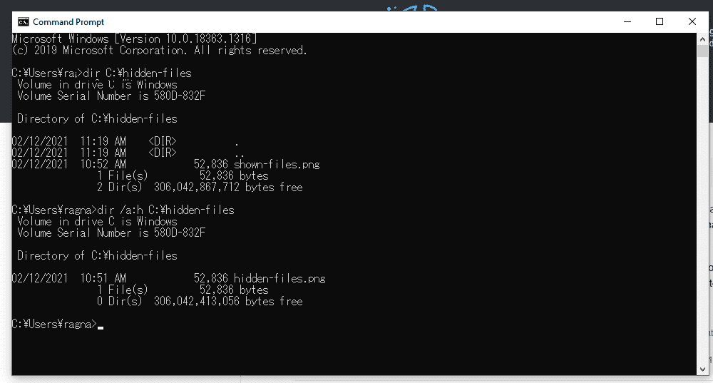

在 Windows CMD 中列出隐藏文件


CMD 也有显示目录和文件夹的特定命令。

`/a:d`显示所有隐藏的目录，`/a`显示隐藏的文件夹。

注意:你知道你也可以使用命令行界面来操作你的 WordPress 网站吗？ [WP-CLI](https://kinsta.com/blog/wp-cli/) 让你从一个类似的终端管理所有方面。

### 使用第三方软件显示隐藏和删除的文件

最后一个选项是使用第三方文件浏览器或文件恢复软件来显示隐藏的文件。如果您使用常规文件选项来查找隐藏的文件，这是不必要的。

但是高级恢复软件也可以找回那些不仅仅是隐藏，而是被永久删除的文件。一些流行的文件恢复工具包括:

*   雷丘瓦
*   御用杀手
*   EaseUS
*   圆盘钻机

### 当 Windows 文件资源管理器不够用时

在一些使用案例中，Windows 文件资源管理器和 CMD 不会帮助您。

以下是一些例子:

*   如果另一个用户专门向您隐藏了文件，而您没有[管理员](https://kinsta.com/blog/wordpress-user-roles/#administrator)权限。


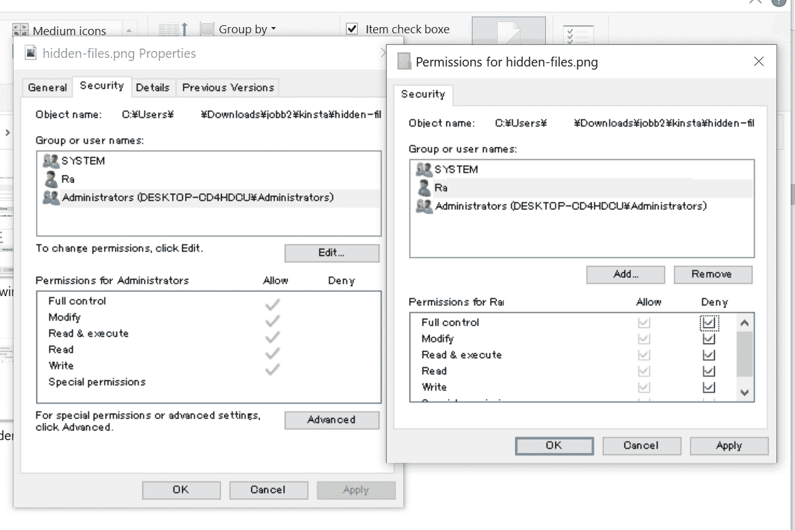

Windows 文件权限模态对话框


*   假设你正在被感染的电脑上寻找隐藏的恶意文件和恶意软件。为了降低发生这种情况的风险，请确保您的[防火墙](https://kinsta.com/blog/what-is-a-firewall/)和其他安全软件和硬件是最新的。
*   如果文件有密码保护或加密，而您忘记了密码，前提是您不是系统管理员。

## 如何在 Mac 上显示隐藏文件？

有几种不同的方法可以在 Mac 上显示隐藏文件，这取决于您浏览文件的方式。

在 Mac **Finder** 中，切换隐藏文件最简单的方法是使用键盘快捷键。您还可以使用**终端**显示或隐藏文件。

### 在 macOS 上显示隐藏文件的捷径是什么？

在任何现代苹果电脑上使用 Finder 时，您可以使用 **CMD + SHIFT +句点**快捷键来显示文件夹中的隐藏文件。

只需打开 Mac Finder(从菜单或按下 **OPTION + CMD + SPACE** )，导航到正确的地方。一旦到了那里，你可以使用上面提到的热键来显示隐藏的文件。


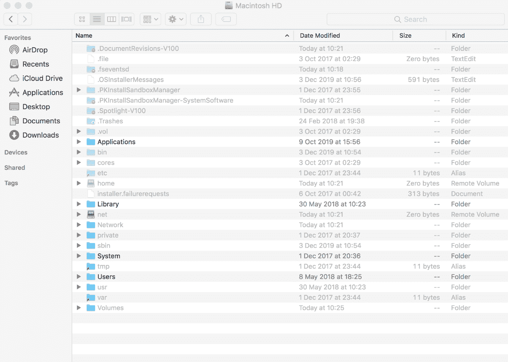

在 Mac 上显示隐藏文件


隐藏的文件和文件夹在视觉上将突出为半透明的实体。

**注意:**和 Windows 电脑一样，你需要小心这些隐藏文件。请不要对它们做任何改动，除非你 100%确定它们不是系统文件。

### 如何使用终端显示隐藏文件

您也可以使用 Mac 终端来查找和显示隐藏的文件。终端是所有 Mac 电脑的命令行界面(就像 Windows 上的 CMD)。

要打开它，使用 **CMD + SPACE** 快捷键打开**聚光灯搜索**。一旦打开，搜索“终端”然后点击**进入**。

现在你需要给 Mac 终端显示隐藏文件的命令。以下是步骤:

1.  键入以下命令:
    `defaults write com.apple.Finder AppleShowAllFiles true`
2.  按**回车**执行。
3.  键入`killall Finder`然后按**再次输入**。


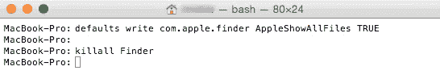

在 Mac 终端显示隐藏文件


你完了！现在，您可以使用 Finder 或终端本身来浏览隐藏的文件。

### 使用第三方文件浏览器显示隐藏(和删除)的文件

和 Windows 一样，你可以使用第三方文件浏览器来显示 Mac 上的隐藏文件，但这是不必要的。

您可能会发现这种类型的软件更有用的地方是在查找您意外删除的文件——不是您放在回收站中的项目，而是您已经“永久”删除的项目

MAC 电脑和 Windows 电脑的主要文件恢复软件选项基本相同:

*   圆盘钻机
*   雷丘瓦
*   御用杀手
*   EaseUS

### 当终端或查找器不切时

与 Windows 一样，这些默认选项并不通用，在某些情况下，您最好依赖专业软件。这里有几个例子:

*   如果用户没有授予您读取权限，并且您没有管理员权限。如果您的用户“无权访问”，那么您是否能看到该文件夹并不重要。


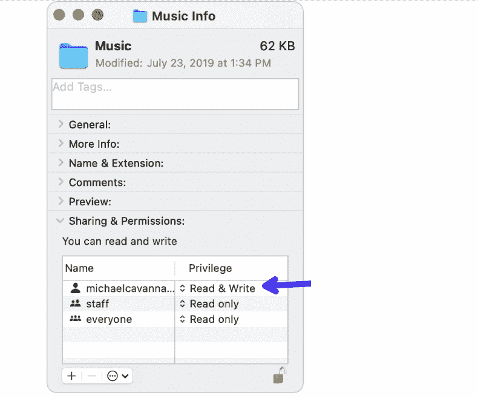

Mac 用户权限


*   如果您正在寻找隐藏的恶意文件或病毒，您无法通过标准方法取消隐藏。

## 如何在 Linux 中显示隐藏文件

你有运行在 Linux 上的计算机或服务器并且想要显示隐藏的文件吗？您可以使用 Linux **命令行**或 **GUI 文件浏览器**来完成这个任务。对于网络服务器，你也可以使用一个 [FTP/SFTP 客户端](https://kinsta.com/blog/best-ftp-clients/)来显示隐藏的文件。

您使用哪个选项将取决于您的具体 Linux 发行版和用例。我们已经涵盖了以下所有选项。

### 使用 Linux 命令行

如果你没有使用图形用户界面，这在大多数 web 服务器中是很常见的[，你可以用一个简单的](https://kinsta.com/blog/nginx-vs-apache/) [Linux 命令](https://kinsta.com/blog/linux-commands/)轻松显示隐藏的文件。

使用`-a`修饰符和`ls`命令将自动显示所有文件。


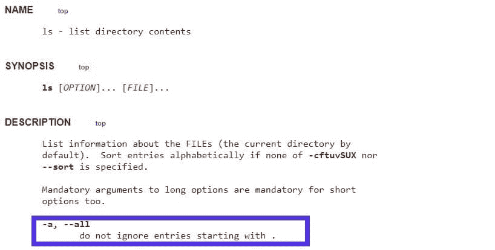

Linux 的‘ls’命令选项


例如:`$ ls -a /home/user/your-folder/`

如果您只想要显示隐藏文件，您可以使用下面的特殊正则表达式修饰符:

```
$ ls -dl .[^.]* /home/user/your-folder/
```

### 使用文件浏览器

你可以在基于 Ubuntu 的 Linux 桌面环境(Gnome 3，Mate 等)中使用文件浏览器轻松显示隐藏文件。).

## 注册订阅时事通讯


### 想知道我们是怎么让流量增长超过 1000%的吗？

加入 20，000 多名获得我们每周时事通讯和内部消息的人的行列吧！

[Subscribe Now](#newsletter)

对于最快的选项，您可以使用键盘快捷键 **CTRL + H** 来显示隐藏的文件。您也可以右键单击文件夹中的任意位置，并检查底部的**显示隐藏文件**选项。


【Ubuntu 文件资源管理器】模态对话框显示隐藏文件([来源](https://websiteforstudents.com/how-to-hide-and-unhide-files-with-ubuntu-desktop/) )


文件是否透明取决于 Linux 的具体安装。

### 使用 FTP/SFTP 客户端(用于 Web 服务器)

有时，你可能需要在你的网络服务器上来回传送隐藏的文件或文件夹(例如[)。htaccess 文件](https://kinsta.com/knowledgebase/wordpress-htaccess-file/)。这对于[解决 WordPress 错误](https://kinsta.com/blog/wordpress-errors/)至关重要。

在这种情况下，您可以使用类似于 [FileZilla](https://kinsta.com/blog/best-ftp-clients/#Filezilla) 的 FTP/SFTP 客户端来快速完成这项任务。 FileZilla 可用于所有主流操作系统。在这次演示中，我们将使用它的 Mac 版本。

首先，点击 FileZilla 菜单栏中的**服务器**标签，启用**强制显示隐藏文件**选项。

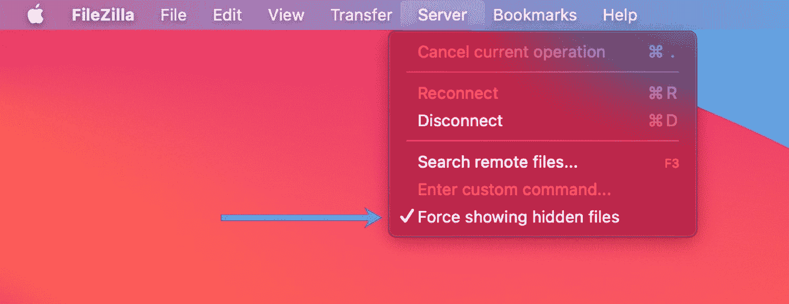

Enable the “Force showing hidden files” option in Filezilla


现在，[输入相关详细信息，通过 SFTP](https://kinsta.com/knowledgebase/how-to-use-sftp/) 连接到您的网络服务器。现在，您应该可以看到服务器上所有隐藏的文件和文件夹。

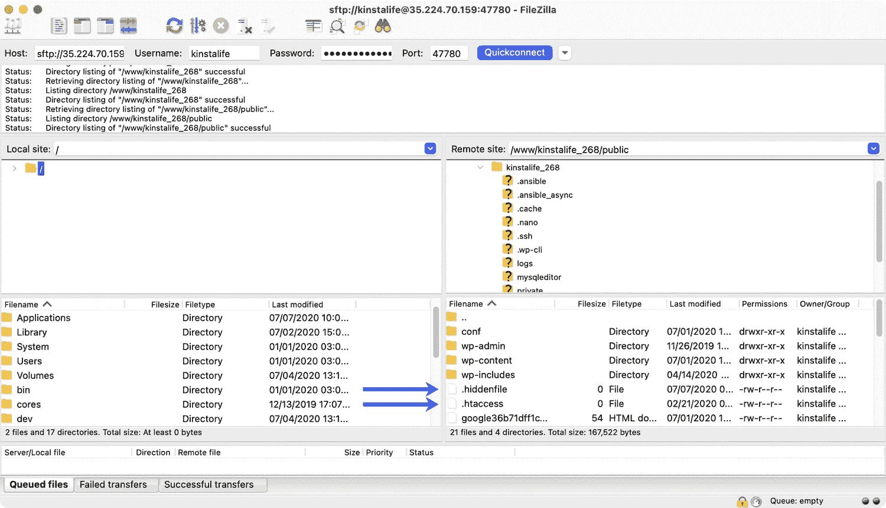

Hidden files in FileZilla


在上面的例子中，你可以在站点的 **~/public** 文件夹中看到两个隐藏文件:**。隐藏文件**和**。htaccess** 。

正如你所看到的，这是一个快速简单的过程来揭示你的 web 服务器上的隐藏文件。

## 如何显示 u 盘上的隐藏文件

另一个常见的问题是如何显示 u 盘上的隐藏文件。除非加密，否则您可以使用相同的基本 Windows 资源管理器或 Mac Finder 选项来加密。

### 在 Windows PC 上

在 Windows 计算机上，插入 u 盘，并打开 Windows 资源管理器窗口。根据您的设置，当您插入 USB 驱动器时，它可能会自动发生。

资源管理器窗口打开后，使用它导航到拇指驱动器目录。它通常位于展开的**这台电脑**菜单的底部。


文件浏览器显示 u 盘


然后，导航到**视图**选项卡，并选中**隐藏项目**框以显示所有隐藏的文件夹和文件。


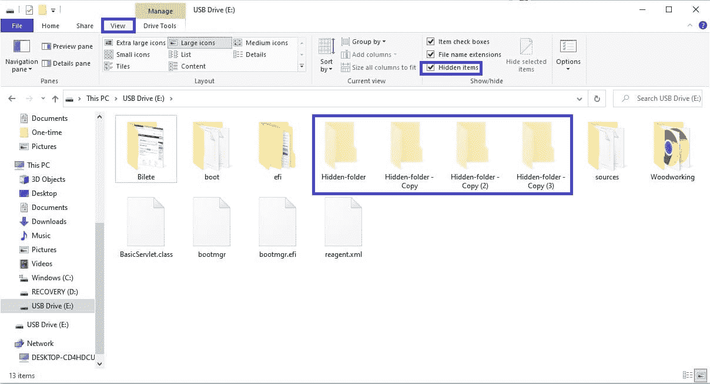

u 盘中显示隐藏项目


如上所示，这将立即显示基本 USB 驱动器文件夹中的所有隐藏文件夹。

这些文件夹中的所有隐藏文件现在也将可见。


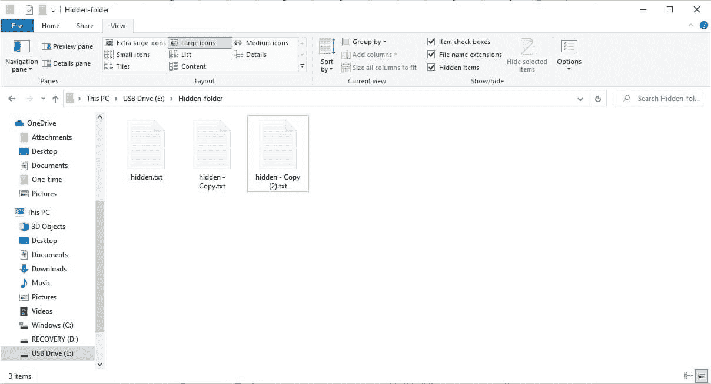

u 盘文件夹中隐藏的文件可见


这就是全部了。您已经成功揭示了您的 USB 驱动器上的所有隐藏文件。

### 在 Mac 上

在 Mac 上，这甚至更简单。只需插入 USB，打开 Mac Finder，并导航到 USB 目录。插上电源后，它应该显示在**设备**菜单下。

然后你可以立即使用 **CMD + SHIFT +句点**键盘快捷键来显示隐藏的文件。


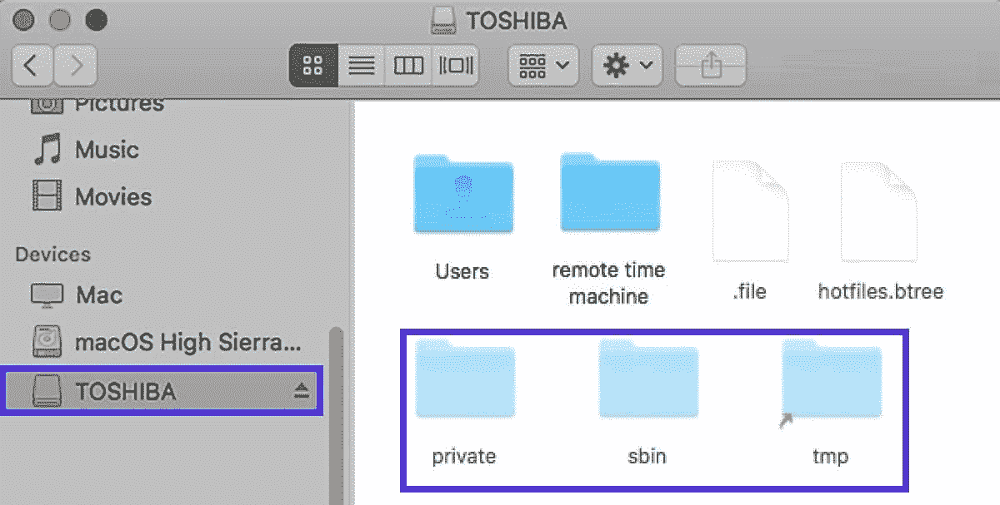

在 Mac 上显示 USB 上的隐藏文件


如果快捷方式不起作用，请尝试在您 100%确定有隐藏文件的文件夹中再次触发它。它可能已经开始切换打开，这意味着你刚刚关闭它。

如果不起作用，请检查语言输入设置。在某些语言中，句点键被重新用于英语中不包含的额外字母。

与宕机和 WordPress 问题做斗争？金斯塔是托管解决方案，旨在节省您的时间！[查看我们的功能](https://kinsta.com/features/)

### u 盘加密了怎么办？

如果使用 BitLocker 等定制软件或默认的 Mac USB 加密工具对整个拇指驱动器进行加密，并且您不再拥有[密码](https://kinsta.com/blog/password-managers/)，则没有简单的解决方案，但不一定会丢失所有数据。

你应该做的第一件事是搜索密码可能在的任何物理(或数字)位置。尽可能彻底地搜索。

如果找不到，可以试试 RecoverIt 或者 Disk Drill 之类的数据恢复工具。

只有在确信找不到密码后，才应该咨询专业的数据检索服务。这些可能相当昂贵，所以一定要先用尽所有其他的努力。

## 如何在谷歌浏览器中显示隐藏文件(Mac 和 Windows 都适用)

如果你不想弄乱终端、CMD 或者系统设置，你也可以使用浏览器来显示隐藏文件。

如果您将它用作电脑的文件资源管理器，它会自动显示所有文件，即使它们在 Mac Finder 或 Windows 文件资源管理器中被设定为“隐藏”。

让我们检查一个包含隐藏文件的文件夹。Windows 文件资源管理器设置可以选择不选中显示隐藏文件:


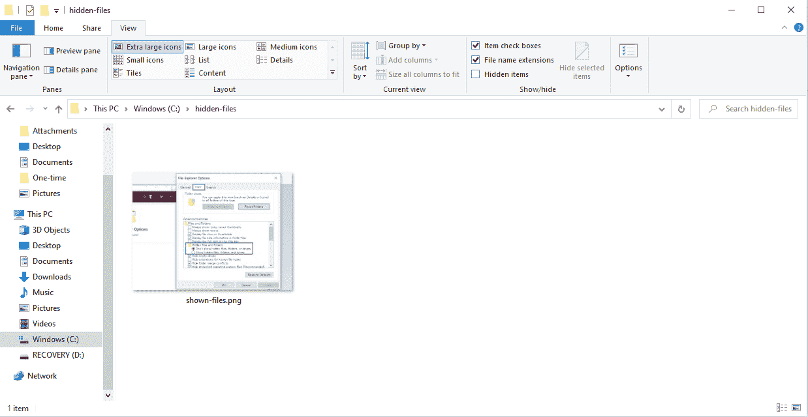

档案总管的典型观点


这意味着使用文件资源管理器或默认的 CMD 命令，您将看不到该文件夹中的任何隐藏文件。

但使用网络浏览器，您可以立即看到文件夹中的所有文件，包括隐藏的文件:


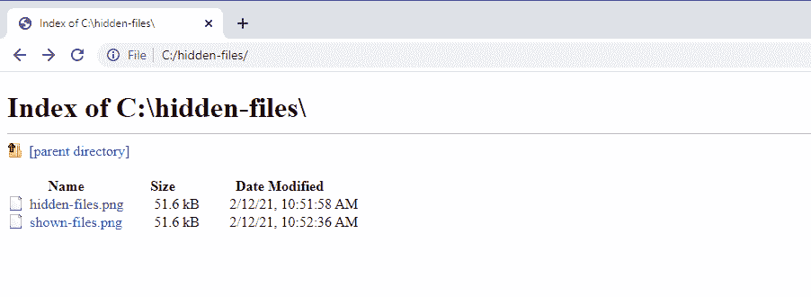

隐藏文件显示在浏览器中


这种方法适用于 Windows 和 Mac 电脑以及其他浏览器。我们选择专注于谷歌浏览器，因为它是全球桌面浏览器市场份额超过 77%的领导者。

## 如何在智能手机上显示隐藏文件

说到手机上的文件，你可能不认为你有和电脑上一样的权限。但是我们将向您展示如何在您的 iPhone 或 Android 手机上显示隐藏的文件，如照片、视频等。

### 对于安卓手机

在 Android 手机上，你可以通过默认的 Google **Files** 应用轻松探索隐藏文件。

首先打开**文件** app(或者另一个文件管理器)，点击汉堡图标( **≡** )进入主设置菜单。


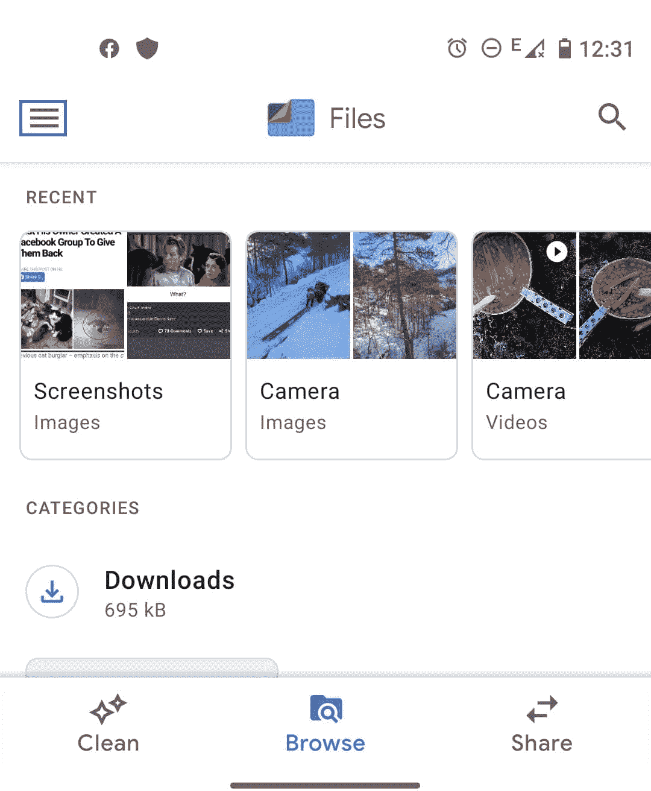

安卓的文件 app


然后你需要做的就是向下滚动，直到你看到**显示隐藏文件**选项。打开这个选项，你就可以开始了。


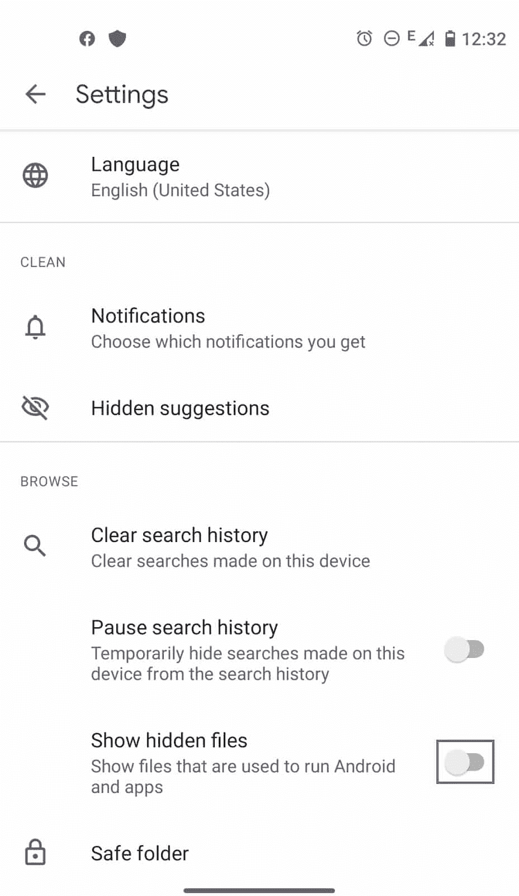

安卓文件带有【显示隐藏文件】切换按钮


你现在可以浏览手机上的所有文件。

**注意:**你能看到的大部分隐藏文件都是你不同 app 和 Android 系统文件必不可少的缓存文件(但不是全部)。因此，除非你正在清除一个未安装的应用程序中的数据，否则要小心行事。

### 对于 iphone

与安卓手机不同，iPhones 没有默认的整体文件管理器。但是，在**照片**应用程序中，您可以隐藏照片和视频。

如果你想看到这些隐藏的照片和视频文件，你可以按照这些简单的步骤。

1.  进入你的**照片**应用，访问**相册**标签。
2.  向下滚动到底部，直到你看到**其他专辑**部分，并选择**隐藏**链接。
3.  这里显示了您手机上隐藏的所有照片和视频。
4.  要恢复这些文件，您可以逐个选择它们，然后单击**取消隐藏**选项。


iOS 中隐藏的照片


如果你想探索应用程序和操作系统本身使用的隐藏文件，你首先需要越狱你的手机。然而，由于越狱你的手机违反了 iOS 最终用户协议，这将使你的保修无效，所以我们不建议普通用户使用。

如果你担心隐藏的恶意文件，如恶意软件或病毒，你最好用反恶意软件扫描你的手机。

## 如何使用反恶意软件找到隐藏的恶意文件

如果你怀疑你的电脑中了病毒或恶意软件，手动检查隐藏文件对你没有帮助。

绝大多数隐藏文件都是系统文件。外面有成千上万的人。除非您知道操作系统中的每一个文件，否则您无法知道哪个文件不属于它。您还需要检查文件大小和使用模式的不规则性。

底线是:对于任何人来说，手动完成这项工作是不现实的，甚至是不可能的。相反，使用最新的防病毒软件来扫描您的计算机。

### 使用高度可信的最新防病毒软件扫描您的计算机

2020 年，83%的恶意软件攻击目标是 Windows 电脑。所以可以肯定地说，如果你是 Windows 用户，这一步是最重要的。

如果您最近购买了笔记本电脑，那么您很可能仍然拥有有效许可证的防病毒软件。对于 Windows 计算机，McAfee 或 Norton 通常是软件包的一部分。

如果是这种情况，你可以不安装任何新软件，直接运行扫描。您可以通过打开软件本身并开始扫描来做到这一点。

或者，您可以在文件资源管理器中右键单击要检查的文件夹，然后选择扫描选项。


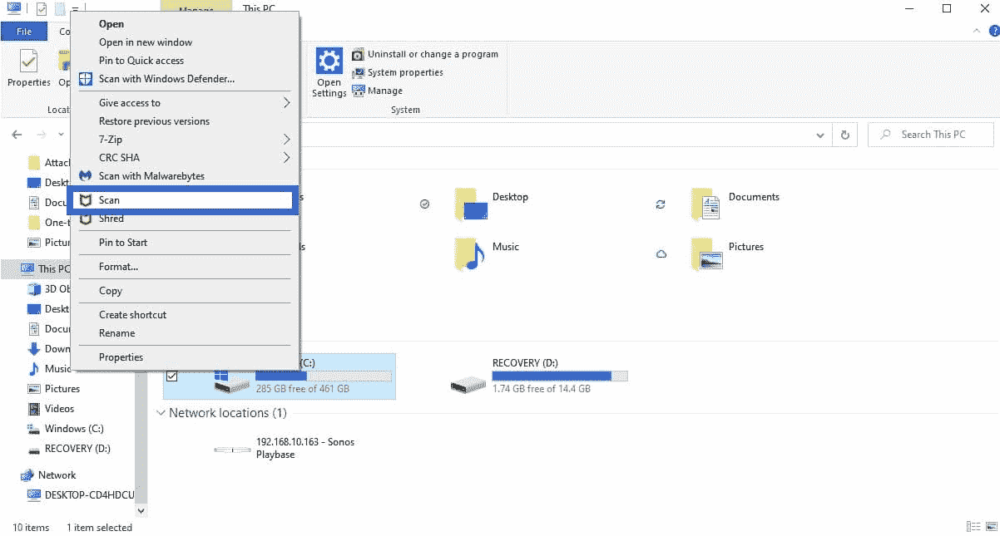

选项扫描电脑中的恶意文件


您也可以对 USB 驱动器执行此操作。

如果你没有安装任何杀毒软件，你可以下载 Bitdefender 或 Malwarebytes 等软件的免费版本或免费试用。


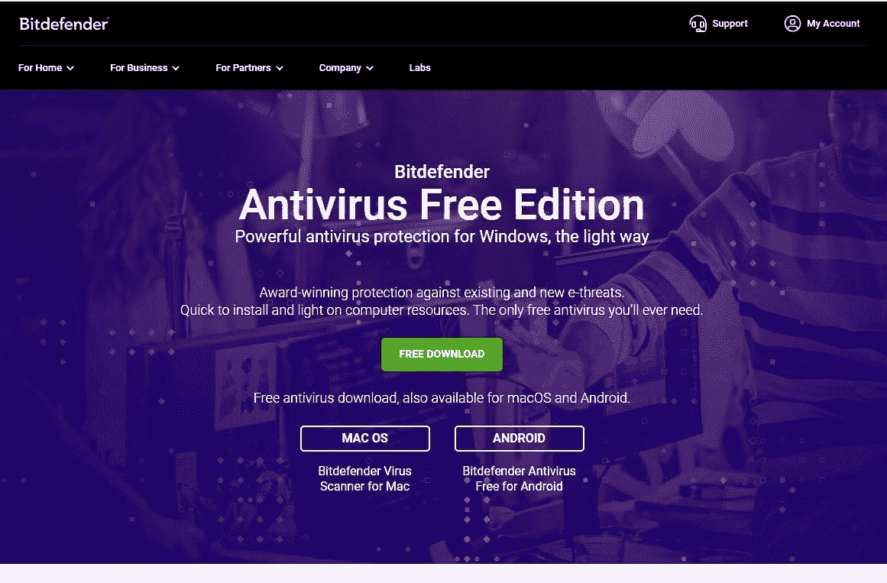


Windows 10 还内置了一个名为 Microsoft Defender 的安全软件，对于大多数用例来说已经足够好了。但它并不完美。所以即使是最新的 Windows 版本，你也应该选择一个高度可信的安全套件。

**注意:**如果你也担心你的网站或商业应用的安全性，请阅读[我们的云安全指南](https://kinsta.com/blog/cloud-security/)。它包括一个帮助您保护数据安全的 10 步清单。

### 您也可以使用手机应用程序(仅限 Android)

安卓手机用户可以安装一款杀毒软件，定期扫描手机中的恶意软件。

**注意:** iOS 不允许第三方应用扫描你的手机，因此 iOS 移动安全应用只专注于阻止钓鱼网站和潜在的骗子。

由于 Android 的开放性，您可能会担心一些恶意应用程序或后门程序正在后台运行。但同样的开放性也允许你安装第三方安全应用程序，可以对你的移动设备上的所有文件进行全面扫描，例如 Malwarebytes Security 或任何其他知名的安全应用程序。


Malwarebytes 杀毒安卓 app


安装您选择的应用程序后，您可以快速开始扫描。您也可以安排持续的定期扫描，以保护自己向前迈进。

iPhones 不太可能成为攻击的目标，因为其更具限制性的 iOS 使得意外下载和安装恶意软件变得更加困难。

但是，你应该从手机中清除的不仅仅是病毒。如果你也厌倦了不断的 pings 和广告，学习如何在你的设备上关闭推送通知。

[曾经丢失过你发誓保存的文件吗？🔎🗂如果你或任何其他用户在你的电脑上有隐藏文件，这篇帖子有办法找到它们✅ 点击推文](https://twitter.com/intent/tweet?url=https%3A%2F%2Fkinsta.com%2Fblog%2Fshow-hidden-files%2F&via=kinsta&text=Ever+lost+a+file+you+swore+you+saved%3F+%F0%9F%94%8E%F0%9F%97%82+If+you+or+any+other+users+on+your+computer+have+hidden+files%2C+this+post+has+the+solution+to+find+them+%E2%9C%85&hashtags=iOSTips%2CWPTips)

## 摘要

试图找到隐藏的文件并不具有挑战性。如果你想找到你自己隐藏的文件或者你的操作系统默认隐藏的文件，通常只需点击一个按钮或者使用键盘快捷键就可以了。

您也可以将浏览器用作文件浏览器来显示 Windows 和 Mac 电脑上的隐藏文件。

如果您想要查看其他用户隐藏的文件，您可能需要使用专门的软件(除非您有管理员权限)。对于恶意软件、病毒和其他恶意攻击，最好的选择是使用反恶意软件。

你是否仍然难以发现电脑或智能手机上的隐藏文件？请在下面的评论中告诉我们。

* * *

让你所有的[应用程序](https://kinsta.com/application-hosting/)、[数据库](https://kinsta.com/database-hosting/)和 [WordPress 网站](https://kinsta.com/wordpress-hosting/)在线并在一个屋檐下。我们功能丰富的高性能云平台包括:

*   在 MyKinsta 仪表盘中轻松设置和管理
*   24/7 专家支持
*   最好的谷歌云平台硬件和网络，由 Kubernetes 提供最大的可扩展性
*   面向速度和安全性的企业级 Cloudflare 集成
*   全球受众覆盖全球多达 35 个数据中心和 275 多个 pop

在第一个月使用托管的[应用程序或托管](https://kinsta.com/application-hosting/)的[数据库，您可以享受 20 美元的优惠，亲自测试一下。探索我们的](https://kinsta.com/database-hosting/)[计划](https://kinsta.com/plans/)或[与销售人员交谈](https://kinsta.com/contact-us/)以找到最适合您的方式。