# 如何找到你当前的 WordPress 版本并更新到最新版本

> 原文：<https://kinsta.com/blog/wordpress-version/>

WordPress 是一个不断发展的软件，定期发布新功能、安全补丁和维护更新。这些[核心更新](https://kinsta.com/knowledgebase/wordpress-core/)保证了 WordPress 系统的安全性和高效性。

如果你运行的是 WordPress 网站，你必须更新最新的 WordPress 版本，以确保你拥有最新的功能、性能增强和保护。

在这篇文章中，我们将向你展示如何检查你当前的 WordPress 版本，讨论最新的 WordPress 版本及其特性，并指导你如何更新到最新的 WordPress 版本。

让我们开始更新吧！

## 为什么 WordPress 推出定期更新

在我们开始之前，我们需要理解为什么 WordPress 有一个固定的更新周期。简而言之，由于以下原因，您可能会看到更新:

*   WordPress 定期发布新功能。无论是添加新的 oEmbed 提供商(WordPress 4.4)这样不太明显的变化，还是通过添加 Gutenberg (WordPress 5.0)对编辑器进行全面检查，这些添加都倾向于使内容创建和网站建设更加简单。
*   WordPress 的更新通常包括[安全补丁](https://kinsta.com/blog/is-wordpress-secure/)。这是一场持续的战斗，因为黑客一直在寻找漏洞。因此，更新以获得最新的保护来抵御新型攻击是至关重要的。
*   最近的 WordPress 版本经常提供“幕后”的性能改进。你可能不会马上注意到这些改进，但是它们使得在 WordPress 上工作更加简单和快速。在 WordPress 2.0 中，发布博客文章的用户体验有了相当大的提升。在 WordPress 4.2 中，他们简化了[插件更新](https://kinsta.com/knowledgebase/manually-update-wordpress-plugin/)，用一个简单的点击按钮代替了之前更繁琐的过程。
*   每个 WordPress 版本也消除了过去的错误。所有软件都会出现这种情况。这就像在你的汽车上修理出问题的东西，然后让它恢复正常。

现在你已经理解了 WordPress 更新的原因，让我们来探索一下更近的 WordPress 版本，以及如何检查和更新你当前的 WordPress 版本的细节。

> 需要在这里大声喊出来。Kinsta 太神奇了，我用它做我的个人网站。支持是迅速和杰出的，他们的服务器是 WordPress 最快的。
> 
> <footer class="wp-block-kinsta-client-quote__footer">
> 
> 
> 
> <cite class="wp-block-kinsta-client-quote__cite">Phillip Stemann</cite></footer>

[View plans](https://kinsta.com/plans/)

注意:虽然 WordPress 的人们希望每个人都更新到最新版本，但这并不意味着他们放弃对旧版本的支持。事实上，过去的 WordPress 版本仍然有更新——例如，2013 年 10 月 24 日发布的 WordPress 3.7“Count Basie”更新。然而，每年还是会有一些更新。这是因为一些(不是很多)网站仍然在旧版本上。

## WordPress 的最新版本是什么？

WordPress 5.7，昵称为“[埃斯波兰萨·斯伯丁](https://wordpress.org/news/2021/03/esperanza/)”，来自俄勒冈州的格莱美获奖爵士音乐家，是你可以升级的 WordPress 的最新版本。历经多个开发阶段，于 2021 年 3 月 9 日发布。你可以在我们的[深入 WordPress 5.7 文章](https://kinsta.com/blog/wordpress-5-7/)中了解更多，这篇文章涵盖了它所有的新特性和后端改进。

你可以[从官方仓库或者直接通过你的](https://wordpress.org/) [WordPress 管理面板](https://kinsta.com/knowledgebase/wordpress-admin/)下载 WordPress 5.7 。

### WordPress 5.7 有什么新功能？

WordPress 5.7 包括了一系列令人印象深刻的对 block editor 的小调整和改进，以及更多显著的变化，以制作更高级的 block 并提高定制的灵活性。

这是一个值得更新的版本，看看自古腾堡编辑器的介绍以来的每一次更新是如何解决人们对块编辑器的问题的，这一次也不例外。

以下是亮点:

#### 对 WordPress 编辑器的调整

WordPress 5.7 有三个显著的改进，包括可重复使用的块，更多位置的字体大小设置，以及将块拖放到编辑器中的选项。

最令人印象深刻的变化涉及到拖放块，看到 WordPress 编辑器从来就不是一个真正的[拖放页面生成器](https://kinsta.com/blog/wordpress-page-builders/)像它的许多竞争对手一样。你现在可以点击任何古腾堡块，并将其移动到页面或帖子上的任何地方。

我们还喜欢你可以访问**代码**和**列表**块中的字体控件，看看它们以前是如何丢失的。最后，您将看到对可重用块的一些改进，最显著的是自动保存特性。

#### 略有不同，更简单的调色板

WP Admin color palette (courtesy of [ryelle](https://codepen.io/ryelle/full/WNGVEjw))

WordPress 仪表盘和设计界面在 5.7 中有一些变化，WordPress 称之为更简单的默认[调色板](https://kinsta.com/blog/website-color-schemes/)。

仪表板现在只有七种核心颜色，而不是以前的大约 56 种颜色。这是一个简单的改变，但却是一个重要的改变，因为它不仅适用于仪表板，也适用于设计主题和插件。

#### 更多无代码元素

每一个 WordPress 版本都包含了一些额外的东西，消除了使用[定制代码](https://kinsta.com/knowledgebase/edit-wordpress-code/)的需要。其中一个新增功能是编辑器块的全高度对齐设置。它允许你在整个窗口中展开一个块，给你更多的块大小的控制，并使使用**封面**块相对容易，就像把它变成一个全屏图片。

Huge size for social icons

当你插入**社交图标**模块时，现在也可以调整社交媒体图标的大小。

最后，**按钮**块接收到新选项的修改，用于将宽度设置为特定的百分比大小。还可以选择水平或垂直的按钮布局，进一步改进您设计按钮和其他块的方式。

#### 更多技术改进

以下“幕后”更新帮助开发者或提升 WordPress 的整体性能或基础设施:

*   用 iframe 进行延迟加载:网站上所有的 iframe 现在都有了一个[默认的延迟加载特性](https://kinsta.com/blog/wordpress-5-7/#lazyloading-iframes)。不再需要输入你的自定义代码或者为这个特性添加插件。
*   **一个新的机器人 API:** 为了让搜索引擎显示更大的图像预览，WordPress 5.7 有一个新的机器人 API，将`max-image-preview: large`指令设置为默认选项。您还可以在 robots 元区域中包含其他过滤器指令。
*   **从 HTTP 快速切换到 HTTPS:** 过去[将一个 WordPress 网站从 HTTP 切换到 HTTPS](https://kinsta.com/blog/http-to-https/) 是一个相当繁琐的过程。有了 5.7，只需点击一下鼠标。WordPress 完成了你的数据库 URL 的自动更新，为你省去很多过程。
*   jQuery 3 . 5 . 1 更新后的持续清理:尽管 [jQuery](https://kinsta.com/knowledgebase/what-is-jquery/) 对 WordPress 中的用户界面来说是一个相当有用的工具，但它也容易分散注意力和造成混乱。WordPress 继续通过引入更少干扰的 jQuery 元素来清理这种混乱。

阅读我们的文章[深入了解 WordPress 5.7](https://kinsta.com/blog/wordpress-5-7/) 。
T3】

## 如何检查你的站点当前的 WordPress 版本

有四种方法可以在你的网站上检查当前的 WordPress 版本。这样，你就了解了 WordPress 用户的特性和局限性，并且可以决定是否该升级到新的 WordPress 版本了。

检查 WordPress 版本的四种方法包括:

1.  查看 WordPress 的管理区。
2.  通过网站的前端。
3.  检查`version.php`文件。
4.  [使用 WP-CLI](https://kinsta.com/blog/wp-cli/) 。

关于这些方法的详细信息，请查看我们关于[检查你的 WordPress 版本](https://kinsta.com/knowledgebase/check-wordpress-version/)的完整指南。链接的文章也提供了关于如何从你的 WordPress 网站移除版本信息的有价值的信息。

## 如何升级到最新的 WordPress 版本

将 WordPress 升级到最新版本总是明智的。它最大限度地减少了错误、安全漏洞或性能问题。您还可以使用所有的新功能，这是一个双赢的局面。

WordPress 几个版本前就推出了[自动核心更新](https://kinsta.com/blog/wordpress-automatic-updates/)。今天，大多数 WordPress 用户在他们的仪表板上收到自动更新或提醒。

例如，您可能会收到一封电子邮件，告知您的网站已经更新。在这种情况下，没有必要完成任何其他任务。只需删除电子邮件，或保存它供您参考，并继续您的一天。

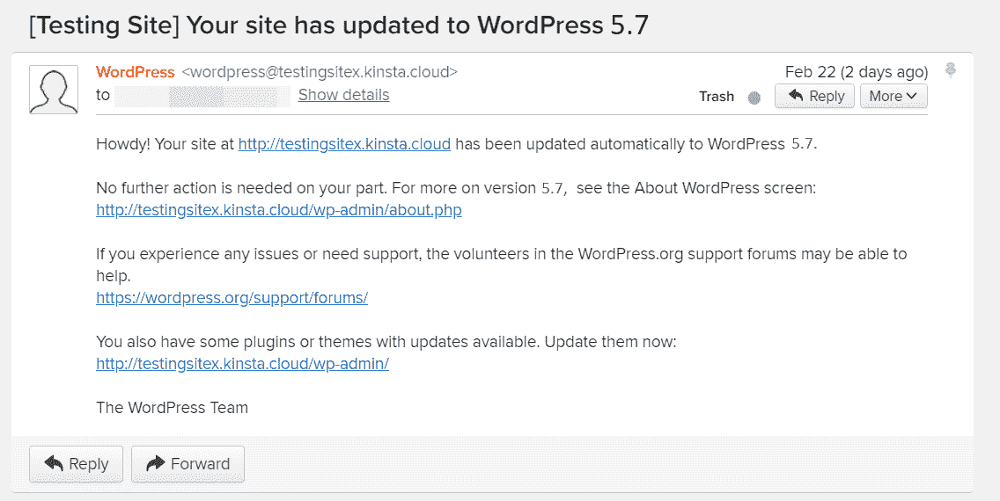

Email for the new WordPress version

我们建议查看你的 WordPress 仪表盘中的**关于**部分，看看新升级带来了哪些功能和错误修复。你可能会发现一个你一直想要的功能现在已经被添加到了 WordPress 中。

你可以通过点击 WordPress 的自动更新邮件找到关于的**页面。要直接到达那里，在你的`domain.com/wp-admin/`网址后面输入**about.php**。该页面重点介绍了新功能、致谢名单和隐私声明等内容。**

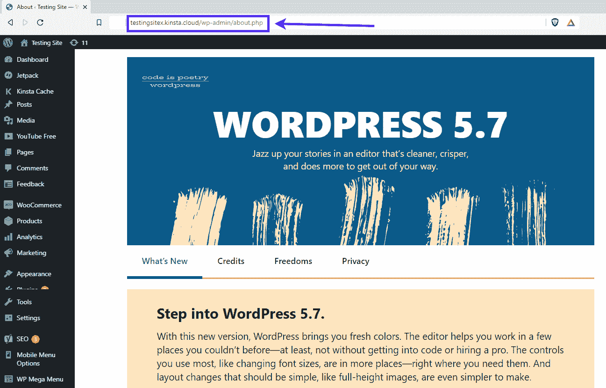

“What’s New” page for WordPress 5.7

但是如果你没有收到自动更新的邮件，但是你想完成升级以确保你使用的是最新的 WordPress 版本，该怎么办？

要完成手动升级，请转到您的[管理仪表板](https://kinsta.com/knowledgebase/wordpress-admin/#use-wordpress-admin-dashboard)。

你可以在**一览**框中看到你当前的 WordPress 版本。示例截图中的版本已经过时，因此可以升级到新版本。

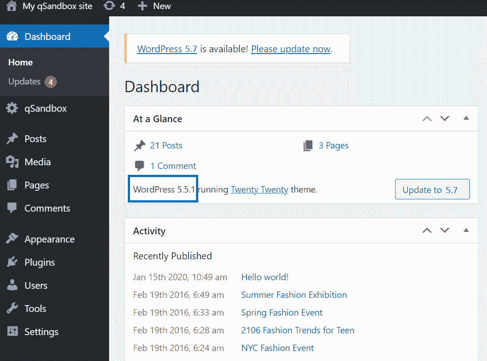

Checking the old WordPress version

您还会在仪表板的几个位置收到警告消息，最常见的是在仪表板的顶部。上面写着“WordPress X.y 可用！请立即更新。”

这个警告的重要之处在于它几乎出现在每一页上，这样你就不会忘记它。

点击**请立即更新**链接进入下一步。

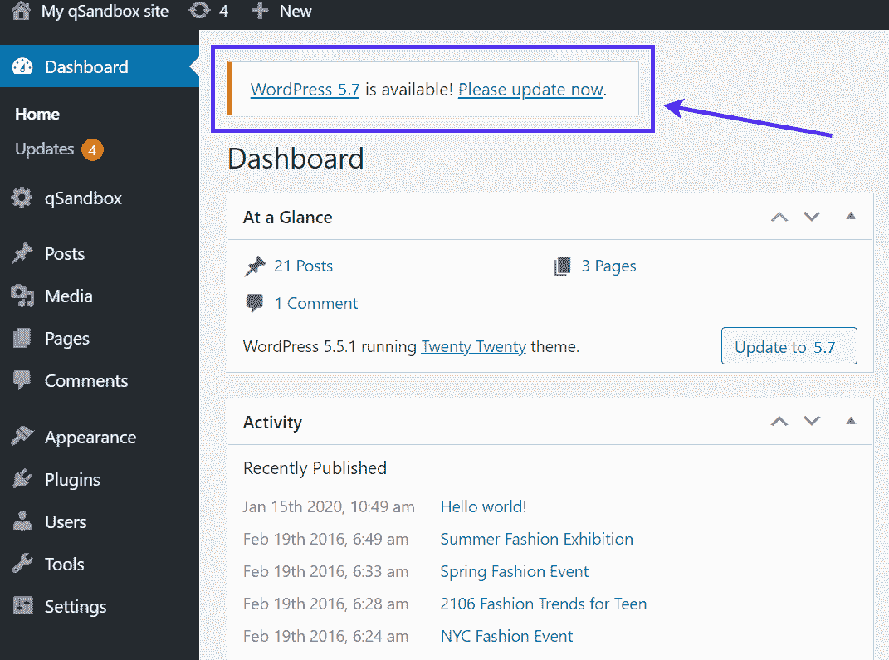

Click the “Please update now” link

作为替代，**一览**框也提供了一个更新按钮。**请现在更新**按钮，**更新到#。#** 按钮送你到同一个地方。

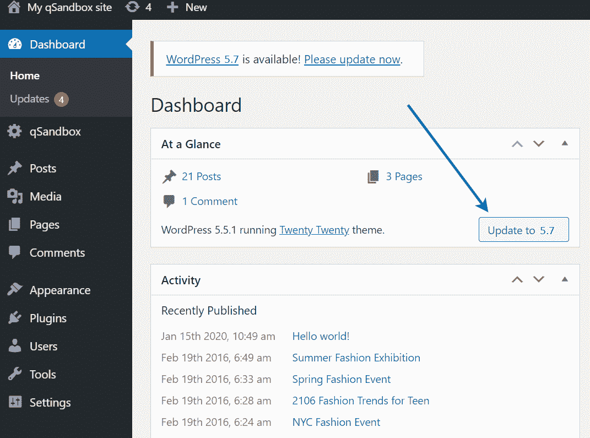

Update to latest WordPress version

下一页的标题是 WordPress 更新。它显示了最新的 WordPress 版本号和一个按钮**现在更新**。你也可以看看你有没有插件或者主题的更新。

在更新 WordPress 版本之前，明智的做法是备份你的数据库和文件。我们建议进行手动站点备份，即使你的站点上配置了 WordPress 备份插件。Kinsta 提供手动和自动站点备份工具。[了解如何备份你的 WordPress 网站](https://kinsta.com/help/external-backups/)，即使你没有使用 Kinsta 托管。

我们也有其他有用的文章，关于从备份中恢复你的站点和找到 T2 最好的 WordPress 备份插件。

WordPress 在 WordPress 更新部分提供了一个关于备份的鼓励性警告。你可以点击**备份你的数据库和文件**链接从 WordPress 获得更多关于这个过程的信息。

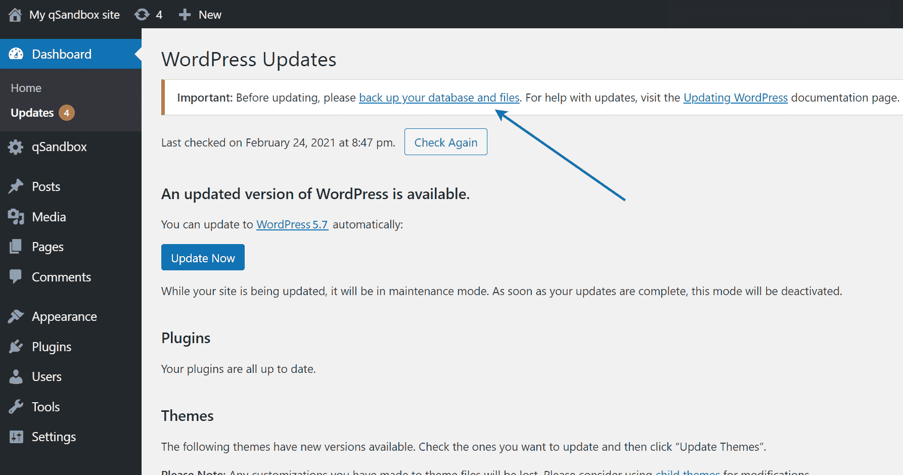

Take a backup of your site before updating.

你现在可以从旧的 WordPress 版本升级到最新的版本了。

点击**立即更新**按钮。

Click the “Update Now” button.

升级通常只需要几秒钟。

你会看到关于 WordPress 工作过程的消息，提到了验证解压文件、启用维护模式和升级数据库。

最后，一条简短的消息说 WordPress 版本已经成功更新。然后，它会将您发送到仪表板上的*关于*页面。

注意:WordPress 的更新会将你的网站切换到[维护模式](https://kinsta.com/blog/wordpress-maintenance-mode/)一小段时间，通常是几秒钟。如果你担心失去销售或打扰网站访问者，请记住这一点。在空闲时间完成更新也是一个好主意，以防出现问题，你需要花时间[恢复备份](https://kinsta.com/blog/restore-wordpress-from-backup/)。

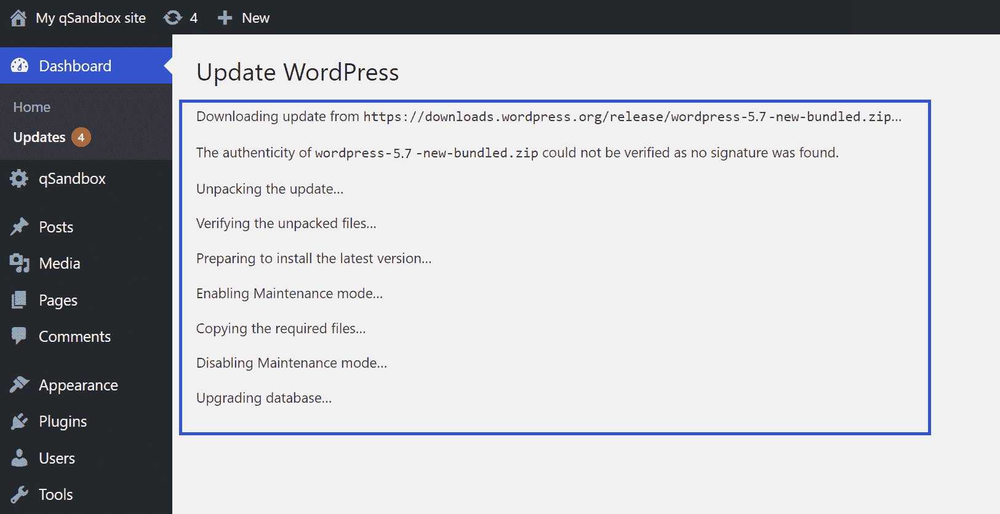

The info shown during a WordPress update

正如承诺的那样，最后显示的部分是仪表板*关于*页面。请随意浏览新功能和变化，然后继续您的一天。

## 注册订阅时事通讯

### 想知道我们是怎么让流量增长超过 1000%的吗？

加入 20，000 多名获得我们每周时事通讯和内部消息的人的行列吧！

[Subscribe Now](#newsletter)

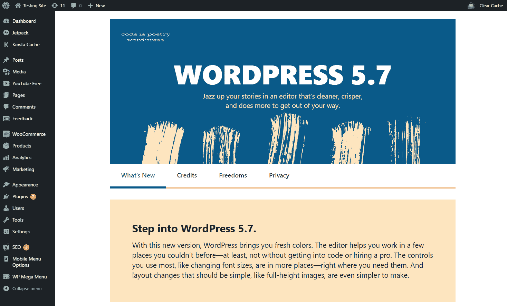

“What’s New” page for WordPress 5.7

为了确保更新发生，返回到管理仪表板，在*概览*模块下查看。你应该会看到你的 WordPress 版本。在 [WordPress 版本代码页](https://codex.wordpress.org/WordPress_Versions)上交叉引用最新版本号(在列表底部)以确保你是正确的。

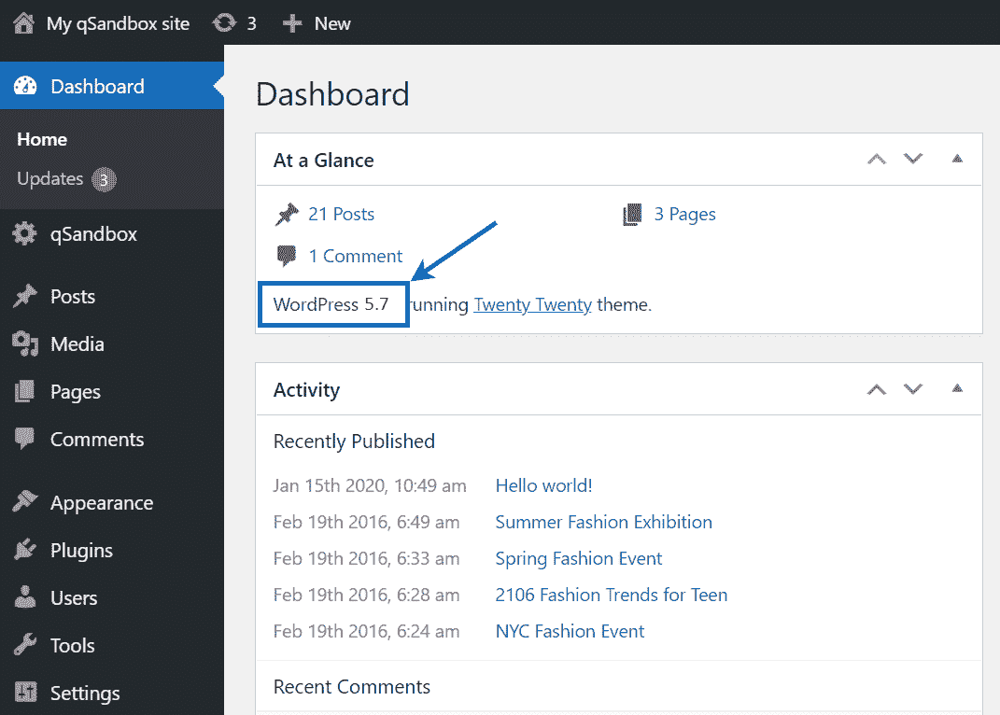

See the new WordPress version in your dashboard.

作为奖励，WordPress 版本升级过程也揭示了你应该做的其他更新。例如，它提到了插件和主题更新。

默认情况下，橙色数字图标出现在需要更新的区域旁边。在*主页*标签下甚至有一个区域专门用于所有的**更新**。

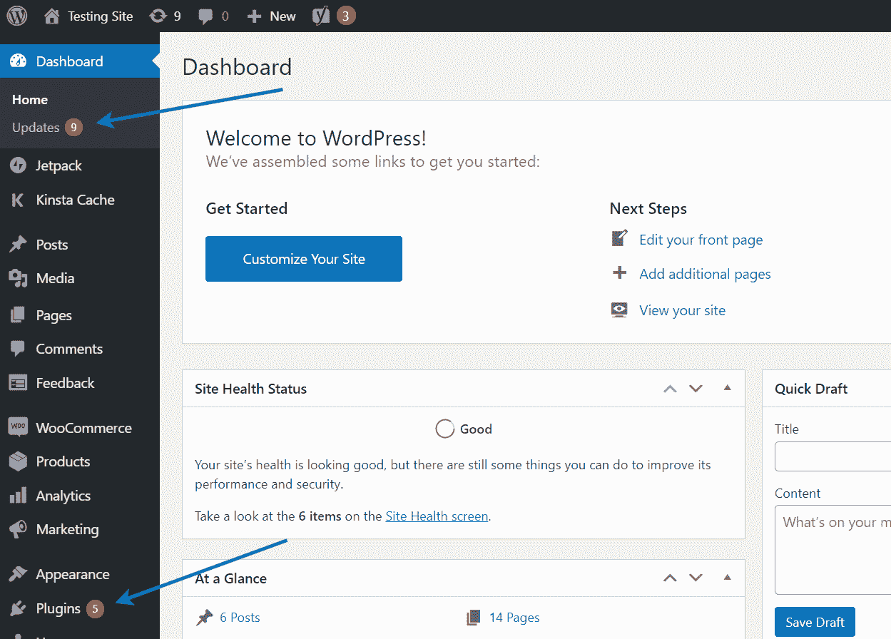

Go to your “Plugins” panel in the WP dashboard

无论是主题，插件，还是 WordPress 核心更新，每一个都提供了更新的快速链接。你也应该更新这些插件和主题来确保最好的安全性和性能。

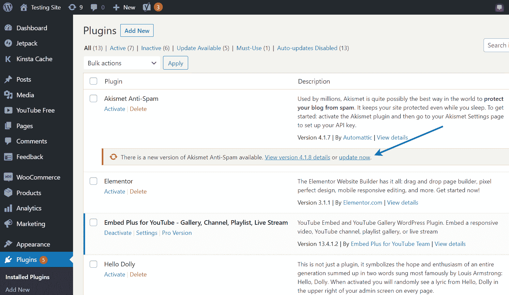

Click the “update now” link for a plugin

### 用 FTP 升级你的 WordPress 版本

尽管获得自动更新或者点击仪表盘内提供的链接是最有意义的，但是还有另外一种方法来更新 WordPress。如果您对更简单的仪表板**升级**按钮有困难，或者如果您由于某种原因无法访问您的仪表板，您可以考虑使用这种方法。

它涉及到 FTP(文件传输协议)，你可以下载最新版本的 WordPress 到你的电脑上。然后通过 FTP 客户端用新文件替换旧文件。

关于这方面的更多内容，你可以[了解 FTP](https://kinsta.com/knowledgebase/wordpress-files/) 的所有内容，包括如何通过 FTP 管理和上传文件到你的 WordPress 站点。

当使用 FTP 客户端来更新 WordPress 时，首先进入[WordPress.org 下载页面](https://wordpress.org/download/)。向下滚动到**下载按钮。按钮上也应该有版本号。**

Downloading the latest WordPress version

单击此按钮会将一个 zip 文件下载到您的计算机上。把它保存在任何你想保存的地方，然后右击 zip 文件来提取所有文件。

Extracting the files of the latest WordPress version

提取的文件夹会显示当前的 WordPress 版本号。

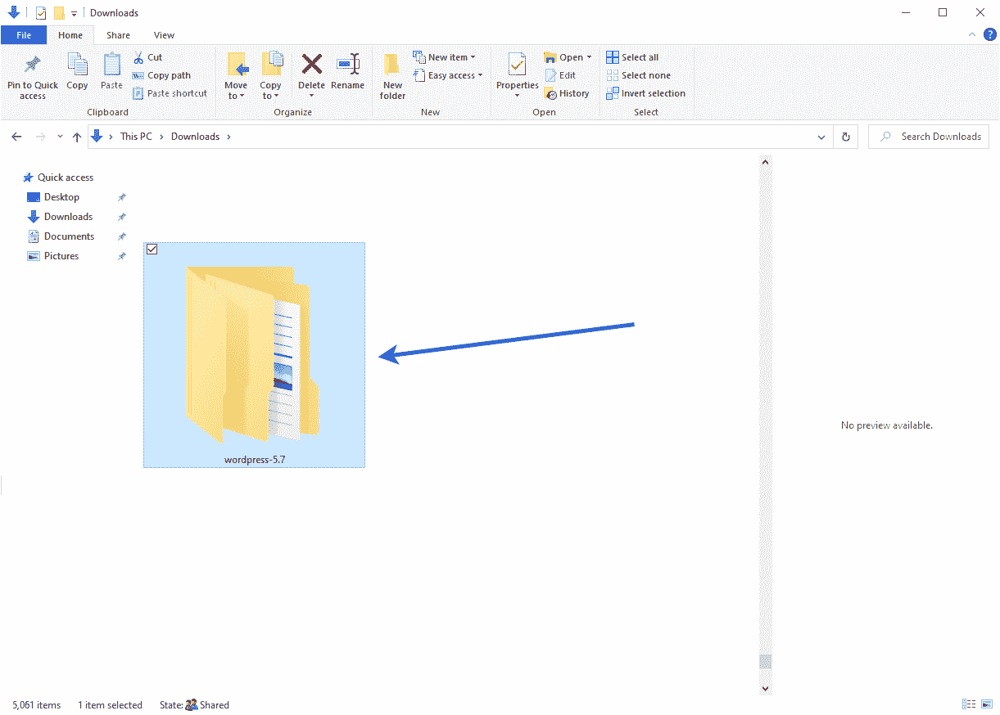

The extracted folder of the latest WordPress version

点击打开 WordPress 核心文件的集合，我们计划通过 FTP 上传的那些。

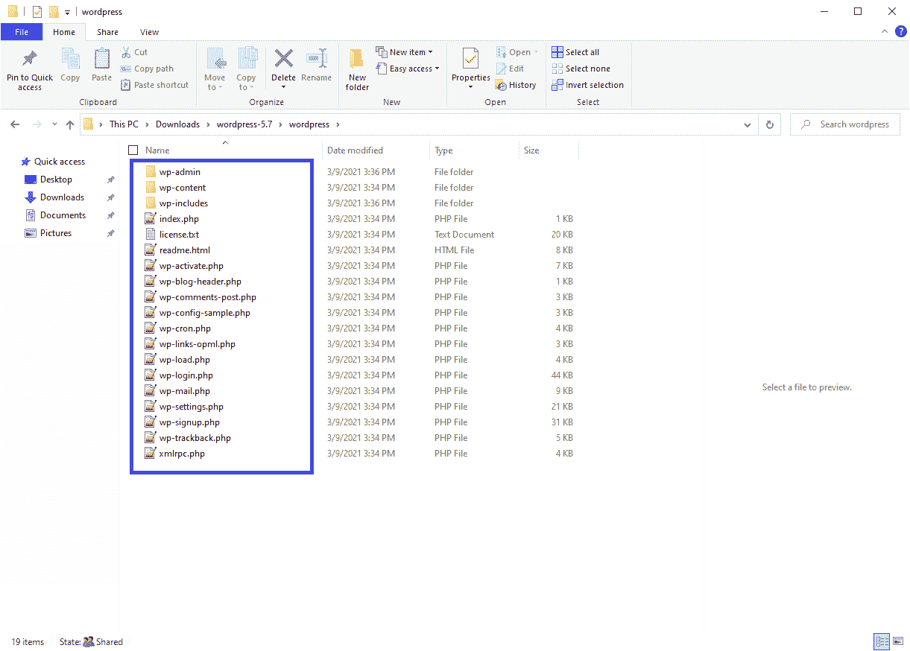

Checking all the files of the latest WordPress version

接下来，是时候打开你的 FTP 客户端并连接到你的 WordPress 网站了。如果你决定走这条路，这里有一个推荐的 FTP 客户端列表。

您需要使用您的主机、用户名、密码和端口连接到您站点的根文件夹，所有这些都可以在 Kinsta 仪表板中找到——或者从任何其他主机的仪表板中找到。

连接到您的网站后，在左栏中找到您的网站的根文件夹。根文件夹通常叫做 **public** 。有时它以你的网站命名。

无论如何，打开根文件夹会显示类似于`wp-admin`和`wp-content`的文件夹。它应该与您在“计算机文件”栏中看到的几乎相同。主要区别在于“计算机文件”列有最新的更新。

与宕机和 WordPress 问题做斗争？Kinsta 是一个性能优化的托管解决方案，旨在节省您的时间！[查看我们的功能](https://kinsta.com/features/)

选择新更新文件夹中的所有文件。右键单击该选项，然后单击**上传**按钮。

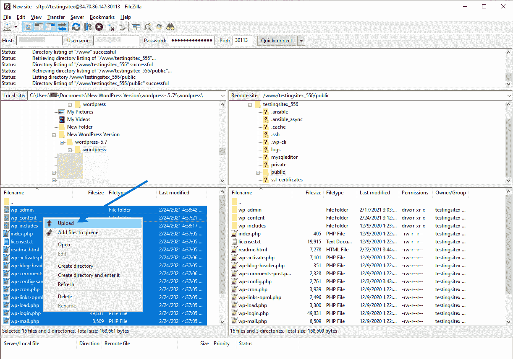

Uploading the latest WordPress version via FTP

您的 FTP 客户端尝试将电脑中的所有文件上传到您的远程网站服务器。该过程会替换旧文件，因此在单击确定之前，您应该选择**覆盖**和**总是使用该动作**。

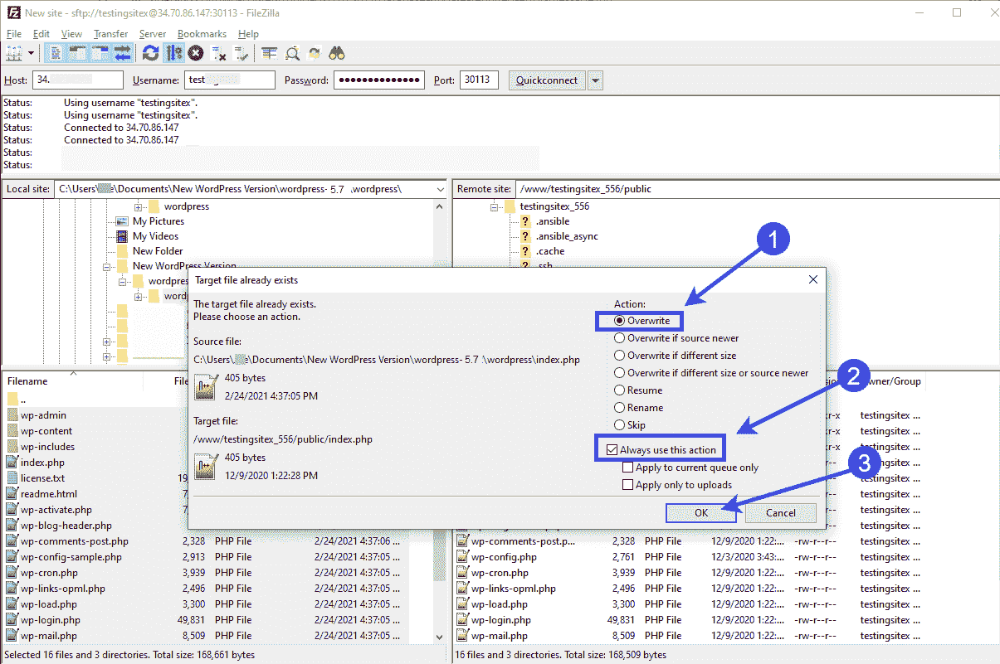

Overwrite your current WordPress version with the latest one

如果上传了所有文件，FTP 客户端最终会提供一条成功消息。

很有可能这就结束了这个过程。但是，您可能还需要更新数据库。因此，关闭 FTP 客户端，转到仪表板中的 WordPress 管理区。

如果你在仪表盘上看到以下信息，点击**更新 WordPress 数据库**按钮。

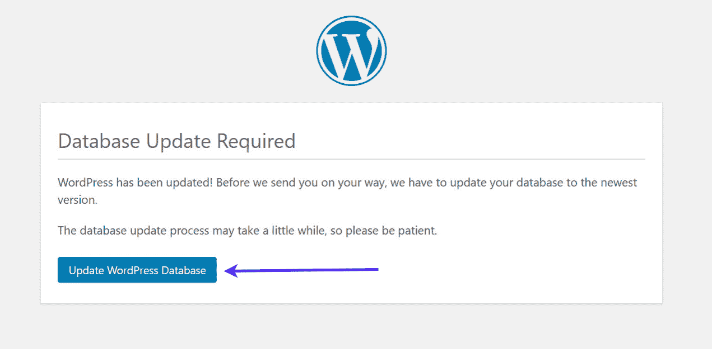

Click the “Update WordPress Database” button.

如果没有数据库消息出现，您就大功告成了！如果新的 WordPress 版本本身需要你升级数据库，我们通常只会看到数据库更新的需求。

你也可以学习如何更新你网站的 PHP 版本。PHP 版本与 WordPress 版本更新是分开的，但是在 WordPress 中提高速度和安全性通常是个好主意。

### WordPress 版本更新后的提示

似乎在更新 WordPress 之后，你就可以像往常一样工作了。这是典型的情况，但它仍然是明智的保持你的网站故障的眼睛。

你已经把你的 WordPress 核心文件全部换成了新的，所以插件或主题可能与最新的更新有冲突。或者你可能会发现有一个明显的错误，你应该向 WordPress 报告。

我们建议[清空你的缓存](https://kinsta.com/blog/wordpress-clear-cache/)，在新的浏览器窗口中进入你的 WordPress 网站的前端。确保一切正常。您也可以在后端完成这个简单的测试，确保没有任何东西看起来奇怪或损坏。

## 每年有多少新的 WordPress 发布？

WordPress 有一个“发布周期”，他们指派一个或多个核心 WordPress 开发者来领导下一个 WordPress 版本的计划、开发和发布。每个周期包含五个阶段，从规划和开发到发布和启动。

每个发布周期往往会持续大约四个月。至少这是目标。

然而，如果最新的 WordPress 主要版本有更多的错误，发布周期偶尔会改变。

因此，我们的目标是一年发布三个(也许四个)主要版本，但结果并不总是那样。过去的 WordPress 版本每年都会有更多的小维护发布，所以这似乎取决于可用的资源和时间。

例如，2020 年有三个主要的 WordPress 版本，包括:

*   2020 年 3 月 31 日
*   2020 年 8 月 11 日
*   WordPress 5.6(妮娜·西蒙)2020 年 12 月 8 日

然而，2017 年只有两个主要版本:版本 4.8 和 4.9，分别在 6 月和 11 月。2018 年只看到了一个 WordPress 版本，而那是直到 2018 年 12 月 6 日，WordPress 才推出了 5.0“Bebo valdés”更新。

每个版本的情况和范围都是独特的。所以，预测每年会有多少更新是不完全可能的。2018 年就是一个极好的例子。5.0 版本是一个大规模的发布，WordPress 完全修改了它的编辑器，增加了拖放块模块(古腾堡编辑器)。花了整整一年才发布，这是有道理的。

至于更多的小版本——主要是维护和性能调整——我们倾向于每年看到几十个这样的版本。5.4 版本在 2020 年包含了四个更新。5.3、5.2 和 5.1 版也是如此。

你可能会注意到这里的一个趋势。简而言之，开发人员最终会解决重要版本中的大多数 bug。然后，他们可以坚持过去版本的更有规律的四个发布周期来处理日常维护更新。

## 前一年的所有当前 WordPress 版本更新

WordPress 5.7 于 2021 年 3 月 9 日问世。之前的版本，WordPress 5.6，到目前为止已经有了三个小的更新，包括它的初始版本。以下是每次更新的一些细节:

### WordPress 5.6.1 更新-2021 年 2 月 3 日

WordPress 5.6.1 是一个标准的维护版本，涵盖了古腾堡块编辑器中的七个问题。他们还报告了对 5.6 基础架构中 20 个错误的修复。

WordPress 认为这是一个“短周期维护版本”，这意味着它只是在去年 12 月前一版本发布后清理了一些问题。

在 WordPress Trac 中找到这个版本的所有错误修正。

### WordPress 5.6.2 更新-2021 年 2 月 22 日

另一个快速维护版本，版本 5.6.2，自二月初的原始维护版本以来，根除了五个问题的错误修复。WordPress 建议用户升级到 5.6.2 以获得最佳性能和安全性。

在 WordPress Trac 中找到这个版本的所有错误修正。

### 其他最近的 WordPress 版本

仍然接收更新的 WordPress 版本的最新维护版本包括:

*   2021 年 2 月 22 日
*   2020 年 10 月 30 日
*   2020 年 10 月 30 日
*   2020 年 10 月 30 日
*   2020 年 10 月 30 日
*   2020 年 10 月 30 日
*   2020 年 10 月 29 日
*   2020 年 10 月 29 日
*   2020 年 10 月 29 日

这个列表可以追溯到 WordPress 3.7(2013 年推出)，在 2020 年 10 月进行了第 35 次更新。WordPress 3.6 是最后一个停止更新的版本。

一些最新的主要 WordPress 更新包括:

*   [WordPress 5.6](https://kinsta.com/blog/wordpress-5-6/) “妮娜·西蒙”——2020 年 12 月 8 日
*   2020 年 8 月 11 日，“比利·埃克斯汀”
*   2020 年 3 月 31 日
*   [WordPress 5.3](https://kinsta.com/blog/wordpress-5-3/) “拉赫桑·罗兰德·柯克”——2019 年 11 月 12 日
*   [WordPress 5.2](https://kinsta.com/blog/wordpress-5-2/)“Jaco Pastorius”——2019 年 5 月 7 日
*   [WordPress 5.1](https://kinsta.com/blog/wordpress-5-1/) “贝蒂·卡特”——2019 年 2 月 21 日
*   [WordPress 5.0](https://kinsta.com/blog/wordpress-5-0/) “贝博·巴尔德斯”——2018 年 12 月 6 日
*   [WordPress 4.9](https://kinsta.com/blog/wordpress-4-9/) “比利·蒂普顿”——2017 年 11 月 15 日

## WordPress 未来的更新

WordPress 开发从团队领导开始，分五个阶段继续。这些阶段是:

1.  规划和获取团队领导
2.  发展的起点
3.  测试阶段
4.  发布候选
5.  发布会

这个周期可能会导致一年中大约三到四个主要版本。然而，这取决于每个版本的大小和范围。记住，有些年份只有一两个版本。

在最初的五个阶段之后，一个较小的版本可以帮助团队消除大多数错误。然后导致最终的主要版本。

如果你没有运行 WordPress 的最新版本，你可能会错过一些关键的性能提升。🚀在此了解如何更新您的版本⬇️ 点击发布推文

## 摘要

更新到最新的 WordPress 版本是至关重要的。它确保你的 WordPress 站点在任何时候都处于最佳状态。更不用说，它带来了许多安全性和性能增强。

WordPress 现在也提供自动更新。你可以利用这一点将你所有的 WordPress 站点自动更新到最新版本。如果你管理很多网站，这个特性非常方便。

最后，你可以通过进入官方的[发布类别存档页面](https://wordpress.org/news/category/releases/)来了解即将发布的 WordPress 版本，该页面列出了每个 WordPress 版本的所有细节，包括小的维护更新和主要发布。

如果你对找到你当前的 WordPress 版本和升级到最新的 WordPress 版本有任何问题，请在评论中告诉我们。

* * *

让你所有的[应用程序](https://kinsta.com/application-hosting/)、[数据库](https://kinsta.com/database-hosting/)和 [WordPress 网站](https://kinsta.com/wordpress-hosting/)在线并在一个屋檐下。我们功能丰富的高性能云平台包括:

*   在 MyKinsta 仪表盘中轻松设置和管理
*   24/7 专家支持
*   最好的谷歌云平台硬件和网络，由 Kubernetes 提供最大的可扩展性
*   面向速度和安全性的企业级 Cloudflare 集成
*   全球受众覆盖全球多达 35 个数据中心和 275 多个 pop

在第一个月使用托管的[应用程序或托管](https://kinsta.com/application-hosting/)的[数据库，您可以享受 20 美元的优惠，亲自测试一下。探索我们的](https://kinsta.com/database-hosting/)[计划](https://kinsta.com/plans/)或[与销售人员交谈](https://kinsta.com/contact-us/)以找到最适合您的方式。