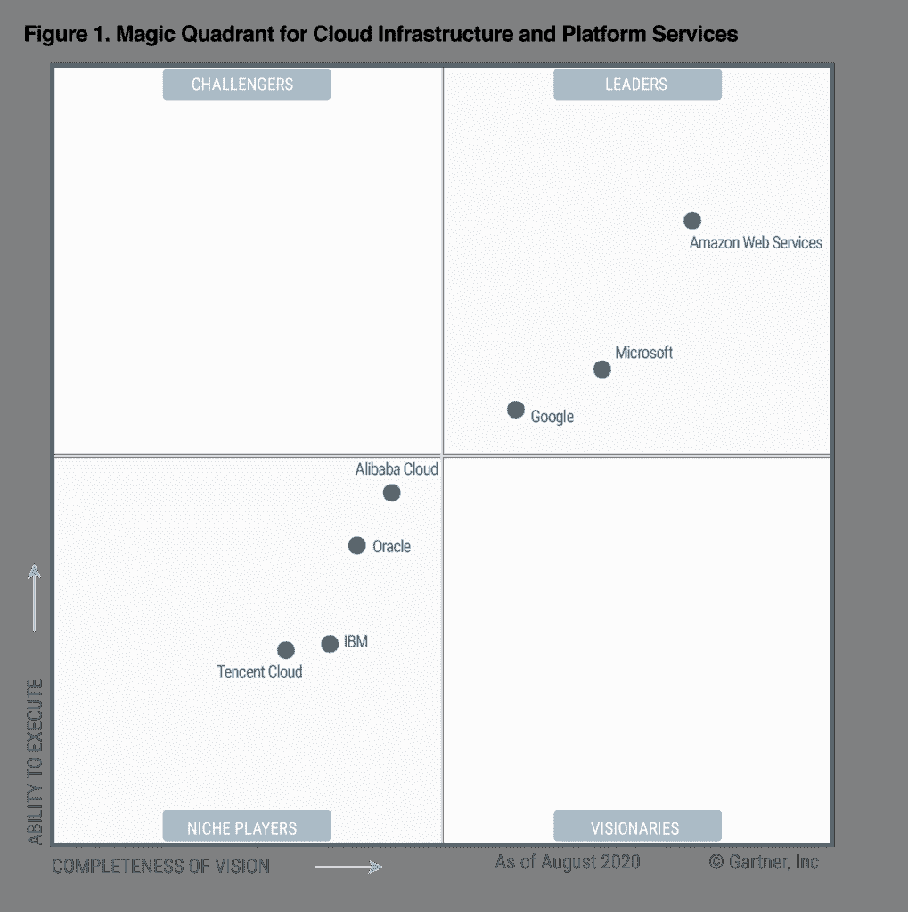
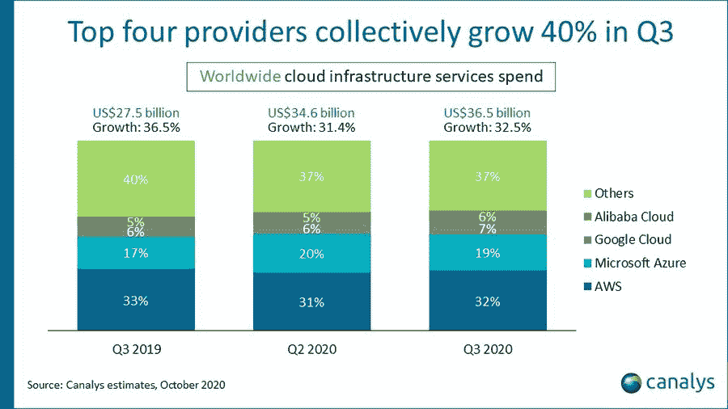
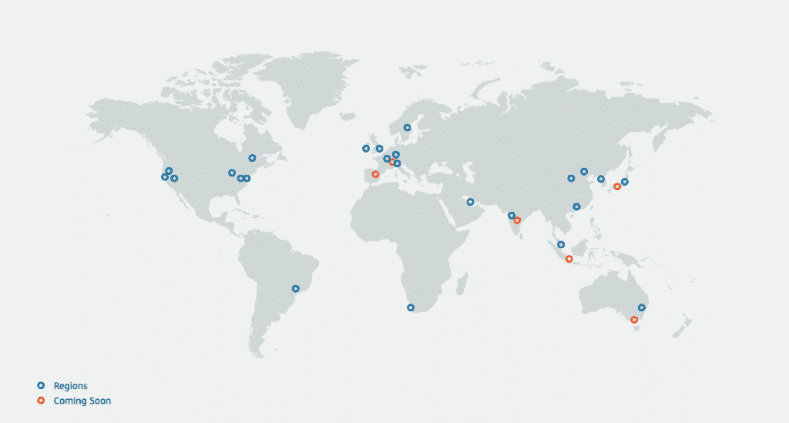
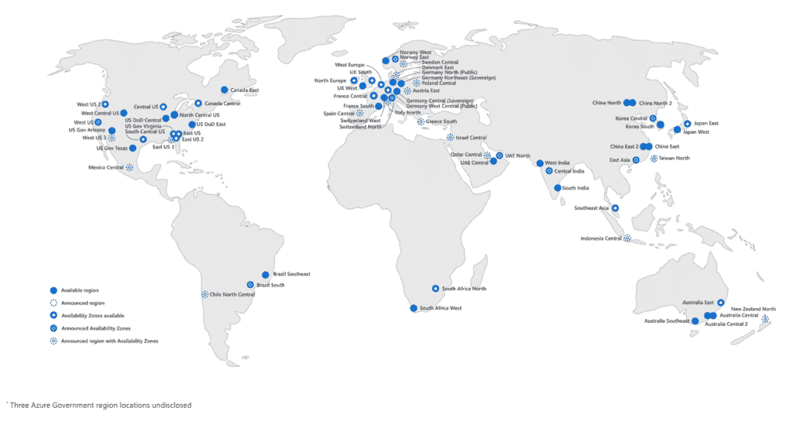
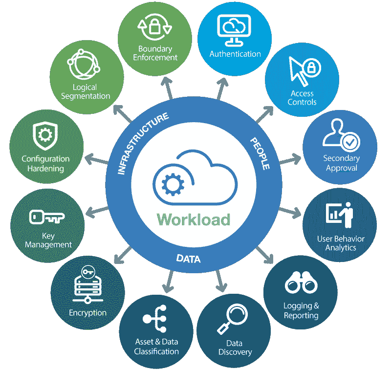
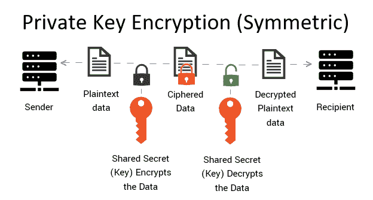
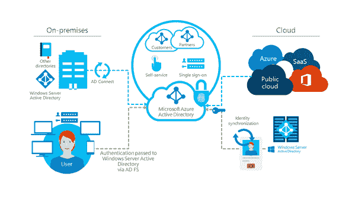
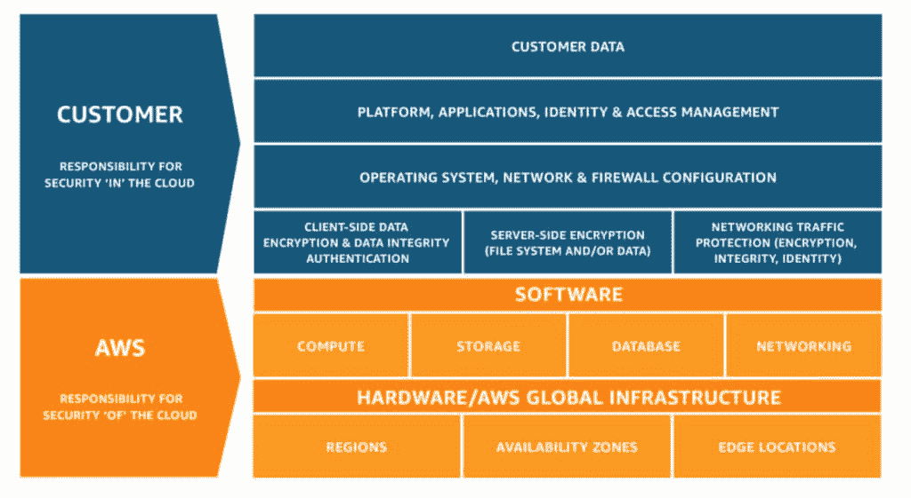
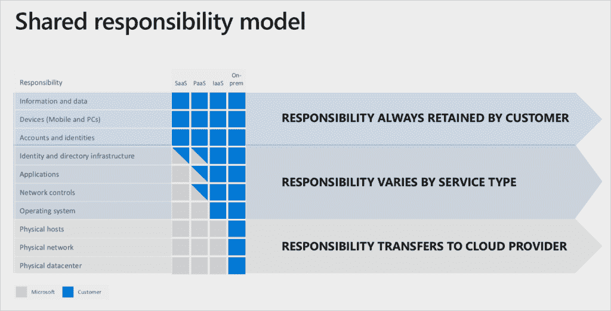

# 2021 年 AWS vs Azure(对比云计算巨头)

> 原文：<https://kinsta.com/blog/aws-vs-azure/>

当谈到云计算时，AWS 与 Azure 是一个你会经常碰到的问题。他们的云生态系统都提供了无数的优势，从卓越的计算能力、可扩展性和安全性到无与伦比的成本效益和碳足迹减少。

云计算产业发展迅速，涌现出大量的云提供商、技术、产品和服务。即使是简单的云部署也提供了数百种选择。说起来很奇怪，但这是一个选择太多的问题！

让事情变得更复杂的是，许多提供商对类似的产品使用独特的术语。同样的技术会有不同的名称，混淆同类功能的比较。因此，你需要一个向导来帮助你把困难的决定变得简单。

在本文中，我们将帮助你在两大云计算巨头之间做出选择:[亚马逊网络服务(AWS)](https://kinsta.com/aws-market-share/) 和[微软 Azure](https://kinsta.com/azure-market-share/) 。您将了解他们的核心产品、服务、定价模式和客户支持结构。

激动吗？我们开始吧！

## 为什么 AWS vs Azure

每个行业都有自己的市场领导者——一些脱颖而出的精选公司，为卓越树立了标杆。

如果你正在探索[云产品和服务](https://kinsta.com/blog/managed-wordpress-hosting/)，那么[谷歌云平台](https://kinsta.com/blog/google-cloud-hosting/)，微软 Azure 和亚马逊网络服务是三个已经成为“云”同义词的提供商，阿里云最近也加入了进来。

> Kinsta 把我宠坏了，所以我现在要求每个供应商都提供这样的服务。我们还试图通过我们的 SaaS 工具支持达到这一水平。
> 
> <footer class="wp-block-kinsta-client-quote__footer">
> 
> 
> 
> <cite class="wp-block-kinsta-client-quote__cite">Suganthan Mohanadasan from @Suganthanmn</cite></footer>

[View plans](https://kinsta.com/plans/)

在云市场崭露头角之前，亚马逊和微软是各自领域的全球领导者。每家公司都因其创新、卓越和市场主导地位的历史而独树一帜。

进入云计算前沿，他们拥有理想的技术基础、专业知识和财务资源来开发行业领先的云计算平台。自技术出现以来，两家提供商都引领了新的云产品和服务的创造。

不出所料，在 Gartner 最新的云基础设施和平台服务魔力象限[中，微软和亚马逊网络服务再次被评为领导者。两者都在领导者象限的右上角排名最高，分别授予**执行能力**和**愿景完成度**。AWS 获得了第一名的荣誉，连续第十年稳居榜首。](https://www.gartner.com/en/documents/3989743/magic-quadrant-for-cloud-infrastructure-and-platform-ser)

2020 Magic Quadrant for Cloud Infrastructure as a Service, Worldwide (Image source: [Gartner](https://www.gartner.com/en/documents/3989743/magic-quadrant-for-cloud-infrastructure-and-platform-ser))

### AWS 和微软 Azure 主导云市场份额

根据来自[科纳仕公司](https://www.canalys.com/newsroom/worldwide-cloud-market-q320)和 [Synergy Research Group](https://www.srgresearch.com/articles/cloud-market-growth-rate-nudges-amazon-and-microsoft-solidify-leadership) 的最新研究，微软 Azure 和 AWS 合计控制了超过**全球云基础设施服务支出的 50%** 。这种趋势似乎只会继续下去，两家提供商都在寻求通过投资和创新他们的云平台来进一步加强他们在市场中的立足点。

Worldwide Cloud Infrastructure Services Spend, Q3 2020 (Source: [Canalys](https://www.canalys.com/newsroom/worldwide-cloud-market-q320))

尽管冠状病毒疫情导致了全球经济衰退，云计算市场却在挑战机遇，Gartner 最近的预测预测 2020 年[全球公共云收入将增长 **6.3%** 。](https://www.gartner.com/en/newsroom/press-releases/2020-07-23-gartner-forecasts-worldwide-public-cloud-revenue-to-grow-6point3-percent-in-2020)

疫情使得远程工作的需求成为必然，从而引发了远程工作的爆炸式增长，并导致了桌面即服务(DaaS)市场的惊人增长(T2)94%。同样，这也迫使无数组织开始或加速其数字化转型之旅，以求生存。在这种背景下，你可以期待 AWS 和 Azure 继续增长。

不管你是在寻找 [IaaS](https://kinsta.com/blog/what-is-iaas/) 、 [PaaS](https://kinsta.com/blog/what-is-paas/) 还是 [SaaS](https://kinsta.com/blog/saas-products/) ，你都会发现来自[亚马逊网络服务](https://kinsta.com/aws-market-share/)和[微软 Azure](https://kinsta.com/azure-market-share/) 的有竞争力的云解决方案。两家提供商都已经发展到提供数百种云产品和服务，使他们能够在广阔的[云市场](https://kinsta.com/blog/types-of-cloud-computing/#iass)中竞争——他们持续的创新增加了新的云解决方案，创造了新的利润丰厚的收入流。
T13】

#### 2020 年亚马逊网络服务收入

AWS 在 2019 年底达到了超过**400 亿美元**的年营收运行率。他们的 [2019 年第四季度财报](https://kinsta.com/blog/types-of-cloud-computing/#iass)报告 AWS 销售收入接近**100 亿美元**。

随着 2020 年的到来和疫情的严重程度，我们开始看到 AWS 的增长率受到重大影响。 [Q1](https://kinsta.com/blog/types-of-cloud-computing/#iass) 、 [Q2](https://kinsta.com/blog/types-of-cloud-computing/#iass) 和【2020 年第三季度财报显示，年同比增长率降至 30% 以下——较之前 3 年增长持续在 40%-50%之间有明显下降。

当然，这不是一个悲观的情景。AWS 首席执行官 Andy Jassy 通过[宣布](https://kinsta.com/blog/types-of-cloud-computing/#iass)该公司年收入已经超过**400 亿美元**，拉开了最近亚马逊网络服务 *re:Invent* 会议的序幕。截至 2020 年 11 月，AWS 在之前的 12 个月中增加了 100 亿美元的收入，这是有史以来最快的。

#### 2020 年微软 Azure 收入

虽然亚马逊详细说明了其 AWS 收入，但微软只报告了 Azure 的增长率。这种缺乏特异性让大多数云专家感到沮丧，因为我们根本无法直接比较 AWS 和 Azure 的规模。

然而，微软确实报告了一组产品，Azure 是其中一部分，被称为“智能云”。当微软发布他们的[2019 年第四季度收益发布](https://ir.aboutamazon.com/news-release/news-release-details/2020/Amazon.com-Announces-Third-Quarter-Results/default.aspx)声明时，他们报告 Azure 收入增长 **62%** ，智能云收入增长 **27%** 至**119 亿美元**。

在疫情的背景下，微软继续报告 2020 年令人印象深刻的增长。其 [Q1](https://www.microsoft.com/en-us/Investor/earnings/FY-2020-Q3/press-release-webcast) 、 [Q2](https://www.microsoft.com/en-us/Investor/earnings/FY-2020-Q3/press-release-webcast) 、 [Q3](https://www.microsoft.com/en-us/Investor/earnings/FY-2020-Q3/press-release-webcast) 和 [Q4](https://www.microsoft.com/en-us/Investor/earnings/FY-2020-Q3/press-release-webcast) 财报显示，Azure 的季度增长率分别为 **59%** 、 **47%** 、 **48%** 和 **50%** 。

随着我们迈向 2021 年，[微软报告](https://www.zdnet.com/article/microsofts-q2-azure-posts-revenue-growth-of-50-commercial-cloud-run-rate-at-66-8-billion/)其商业云运营率已达到**668 亿美元，首席执行官塞特亚·纳德拉称数字化转型和云需求是微软令人印象深刻的业绩背后的驱动力。**

 **## 亚马逊网络服务与微软 Azure 功能对比

比较 AWS 和 Azure 云平台并不简单。随着传统系统从内部迁移到云，两家提供商都扩展了其服务产品，包括超过 25 种不同的云解决方案类别。

今天，AWS 和微软 Azure 提供了数百种竞争性的云解决方案，涵盖了无数的产品和服务。有大量的选择，涵盖计算、存储、数据库、[安全](https://kinsta.com/secure-wordpress-hosting/)、机器人、机器学习，甚至量子技术。为了避免在比较苹果时迷失在细节中，你需要对这两种技术有基本的了解和理解。

令人欣慰的是，亚马逊网络服务平台和 T2 微软 Azure 平台的产品和服务大部分都被归入同一类别。为了帮助您加快和简化决策过程，我们花时间比较了几个关键业务类别中最受欢迎的云产品和服务。

作为向我们的客户提供市场领先的托管解决方案的专家，我们拥有使用这些类型的云服务的第一手经验。除了讨论构建云部署，我们还将详细了解伴随这些服务的关键考虑事项，如客户支持、[、全球基础设施](https://kinsta.com/knowledgebase/what-you-should-know/#data-centers)、计费和定价结构。

使用下面的导航在各部分之间移动:

*   计算
*   建立工作关系网
*   储存；储备
*   安全性
*   支持
*   计费和定价

## 计算特征

计算资源是构建云部署的基础。您在这方面做出的决定将直接影响您平台的速度和性能。包括您在其上运行的系统和您的员工使用的服务。因此，您必须为您的业务需求选择正确的配置。

根据 ParkMyCloud 首席执行官 Jay Chapel 的说法，你还需要考虑计算成本,因为它占企业云平均支出的三分之二。

比较亚马逊网络服务和微软 Azure 计算能力，我们主要关注[虚拟机(VM)](https://kinsta.com/feature-updates/google-cloud-platform-c2-vms/)。虚拟机构成了云环境的主干，模拟物理计算机系统的功能，并为您能想到的几乎所有工作负载提供动力。

AWS 和 Azure 对虚拟机都采用了类似的方法。然而，当您深入研究两种服务时，您会发现它们对各自的计算产品使用不同的术语。

亚马逊网络服务计算产品被称为亚马逊弹性计算云(Amazon EC2)。另一方面，微软称其计算产品为 [Azure 虚拟机](https://azure.microsoft.com/en-gb/services/virtual-machines/)。下表描述了 AWS 和 Azure 之间的主要计算差异:

| **功能** | **亚马逊 EC2** | **蔚蓝色** |
| 虚拟计算机 | 例子 | 虚拟计算机 |
| 形象 | 亚马逊机器图像 | 虚拟机映像(仅引导磁盘和完整机器) |
| 虚拟机模板 | 自动气象站云的形成 | Azure 资源管理器 |
| 自动实例缩放 | 自动缩放 | Azure 自动缩放 |
| 支持的虚拟机导入格式 | 生的、卵的、VMDK 的和 VHD 的 | VHD |
| 部署地点 | 带状的 | 区域性(相当于云平台区域) |
| 可抢占的虚拟机 | 是 | 是 |
| 增量快照 | 是 | 是 |

### 虚拟机功能

当您探索 Amazon EC2 和 Azure 中的 VM 实例部署时，您会发现这些提供者共享许多相似的(如果不是完全相同的)特性。其中包括:

*   使用存储的磁盘映像创建实例的能力
*   启动和终止实例的按需功能
*   实例的无限制管理
*   标记实例的能力
*   在您的实例上安装各种可用的操作系统

### 虚拟机访问

你会发现 Azure 和 AWS 对 Linux 和 Windows 机器的 VM 访问都采用了相似的方法。

对于 Linux 机器，如果你想要[基于 SSH 的终端访问](https://kinsta.com/blog/how-to-use-ssh/)，Amazon EC2 和 Azure 都要求你包含自己的 key SSH key。除此之外，这两个提供商都不支持 SSH 浏览器访问。

当谈到 Windows 机器的 VM 访问时，Amazon EC2 和 Azure 支持通过标准远程桌面协议(RDP)进行访问。

它们稍有不同的地方在于提供了额外的访问路径。Azure 通过[微软 PowerShell](https://docs.microsoft.com/en-us/azure/virtual-machines/windows/connect-logon) 提供对 Windows 机器的额外访问，而亚马逊 EC2 通过其 [IPv6 地址](https://docs.microsoft.com/en-us/azure/virtual-machines/windows/connect-logon)和[会话管理器](https://docs.microsoft.com/en-us/azure/virtual-machines/windows/connect-logon)提供额外的 Windows 机器访问。

### 虚拟机实例类型

为了简化和加速部署 VM 设置的过程，Azure 和 Amazon EC2 都提供了广泛的预定义实例。

每个虚拟机实例类型都配置有特定的虚拟 CPU、RAM 和网络组件。无论是选择微软还是亚马逊，都有数百种虚拟机可供选择。

这两个提供者都在过程中构建了灵活性，允许您定制您的配置。您可以重新配置预定义实例的核心元素，包括 CPU 的数量[和可用 RAM 的数量](https://kinsta.com/help/scalable-cloud-hosting/)，从而使您能够根据组织的独特需求来扩展或缩减虚拟机资源。

两家提供商都提供极高的规格来支持最苛刻的工作负载。它们目前的最大规格如下:

*   Amazon EC2 虚拟机可扩展至 448 个虚拟 CPU 和 24，576 GB 内存
*   Microsoft Azure 虚拟机可扩展至 416 个虚拟 CPU 和 11，400 GB 内存

为了进一步简化流程，两个提供商都将虚拟机类型分组，并针对其计划用途进行了优化和配置。这些虚拟机分类包括通用、内存优化、计算优化、存储优化、图形处理(GPU)和高性能。

我们编制了下表，其中列出了截至 2021 年 1 月这两种服务的最新机器类型。

| **机器类型** | **亚马逊 EC2** | **蔚蓝色** |
| 通用 | a1.medium – a1.metalt4g . nano–t4g . 2x largeT3 . nano–t3.2x larget3a . nano–t3a . 2x largeT2 . nano–T2 . 2x largem6g .中型–m6gd .金属m5 .大型–m5d .金属m5a .大号–m5ad . 24x 大号m3n . large–m5dn . 24x largeM4 . large–M4 . 16 x large | A1 v2 – A8m v2B1LS–B20MSd2a v4–D96a v4d2as v4–d96a as v4D2 v4–D64 v4d2d v4–D64d v4d2ds v4–D64ds v4d2s v4–D64s v4D2 v3–D64 v3d2s v3–D64s v3D1-5 v2–D5 v2DS1-5 v2–DS5 v2DC1s v2–DC8 v2 |
| 内存优化 | r6g.medium – r6gd.metalr5 .大型–r5d .金属r5a .大型–r5ad . 24x 大型r5n .大型–r5dn . 24x 大型R4 . large–4.16 倍大x1e . x large–x1e . 32 x largex 1.16 x 大–x 1.32 x 大u-6tb1.metal -u24tb1.metalz1s .大号–z1d .金属 | E2 v3 – E64 v3E2 v4–E64 v4e2a v4–E96 v4e2as v4–e96a as v4e2d v4–E64d v4e2ds v4–E64ds v4e2s v3–E64s v3e2s v4–E64s v4d11 v2–D15 v2DS11 v2–DS15 v2G1–G5gs1–Gs5m8ms–M128msm32d ms v2–m 192 idms v2m32ms v2–m 192 IMS v2m208s v2–m 416 ms v2s96–S576ms223–s 896 oomDS11-1 v2–M128-64 毫秒 |
| 计算优化 | c6g.medium – c6gd.metalc5 .大型–c5d .金属c5a .大号–c5ad . 24x 大号c5n .大型–c5n .金属C4 . large–C4 . 8x large | F2s v2 – F72s v2f1–F16f1s–F16s |
| 存储优化 | i3.large – i3.metali3 en . large–i3 en . metalD2 . x large–d 2.8 x large1.2 倍大–1.16 倍大 | L8s v2 – L80s v2l4s–L32s |
| 国家政治保卫局。参见 OGPU | p4d.24xlargep 3.2x 大–p3db . 24x 大p2 . x large–p 2.16 x largein f1 . x large–in f1.24 x largeg4dn . x large–g4dn . metalg3s . x large–g 3.16 x large1.2 倍大–1.16 倍大 | NC6 – NC24NC6 促销–NC24r 促销NC6s v2–NC24s v2NC6s v3–NC24s v3NC4as T4 v3–nc64a T4 v3np10–np40NV6–NV24NV12s v3–NV48s v3ND6s–ND24sND40rs v2 |
| 高性能 | 不适用的 | H8 – H16mH8 Promo – H16mr PromoHB120rs v2HC44rs |

注意:Azure 和 Amazon EC2 会定期添加新的 VM 类型。有关每个服务的完整列表，请参见 [Azure Linux 虚拟机](https://azure.microsoft.com/en-us/pricing/details/virtual-machines/linux/)、 [Azure Windows 虚拟机](https://azure.microsoft.com/en-us/pricing/details/virtual-machines/windows/)和[亚马逊 EC2 实例类型](https://aws.amazon.com/ec2/instance-types/)。

### 虚拟机映像

虚拟机映像通过提供预配置的虚拟机设置(包括操作系统以及支持服务器和数据库软件)来加速您的部署。Azure 和 Amazon EC2 都允许使用机器映像来创建新的实例。

除了一系列专有的现成图像配置之外，这两个平台都支持使用由第三方供应商开发的图像，您可以通过它们各自的平台 [AWS Marketplace](https://aws.amazon.com/marketplace) 和 [Azure Marketplace](https://azure.microsoft.com/en-us/marketplace/) 访问这些图像。您还可以选择创建和存储自己的自定义图像供私人使用。

2020 年 12 月，AWS 推出了[Amazon Elastic Container Registry Public](https://aws.amazon.com/ecr)(ECR Public)，提供存储、管理、共享和部署容器图像的独特功能，供全球任何人发现和下载。事实证明，这种服务已经很受欢迎，毫无疑问，Azure 将在未来复制这种服务。

### 虚拟机实例的自动扩展

自动扩展允许您根据用户定义的策略创建和删除虚拟机实例。您可以[优化性能](https://kinsta.com/learn/speed-up-wordpress/)，实时增减计算资源以满足需求。这使您能够控制成本，最大限度地减少未利用的资源，因此您只需为您需要的东西付费。

Amazon EC2 和 Azure 都支持自动缩放，实现方式相似:

*   [AWS 自动缩放](https://aws.amazon.com/autoscaling/)成组缩放实例。每个组都有一个启动配置来创建新实例，并使用您选择的扩展计划来管理实例的创建和删除。
*   [Azure Autoscale](https://azure.microsoft.com/en-us/features/autoscale/) 有一个 VM scale 集合，其中实例被缩放。实例是根据您选择的扩展计划内联创建或移除的，这称为自动扩展策略。

在这些平台之间，有三种可用的自动扩展计划:手动、动态和预定的。Amazon Auto Scaling 支持这三者，而 Azure Autoscale 只支持动态和预定的自动缩放。每个计划可以定义如下:

*   **手动:**您可以手动指示实例的创建和删除。
*   **Scheduled:** 实例可以根据预定义的时间表扩大或缩小。
*   **动态:**您可以创建策略，根据特定指标(如 CPU 利用率或消息队列长度)来扩展实例。

### 临时虚拟机实例

临时实例是在云提供商未使用的容量上运行的虚拟机。这些虚拟机的可用性不可预测，因此您可以随时重新分配它们的资源。因此，它们可以以非常优惠的价格提供，让您以更低的价格释放云的力量。

临时实例非常适合于:

*   可以被中断而不丢失工作的工作负载
*   对时间不敏感的低优先级作业
*   受益于提高的计算能力的工作负载，如渲染视频

Amazon 和 Microsoft 云平台都支持具有相似命名约定的临时实例。针对临时实例的 AWS 服务是 [Spot 实例](https://aws.amazon.com/ec2/spot/)，而 Azure 服务是 [Spot 虚拟机](https://azure.microsoft.com/en-us/pricing/spot/) (Spot VMs)。

Azure 和 AWS 临时机器共享一组功能，包括:

*   在临时实例运行时控制它们的能力
*   与按需实例相比，限制了可用的实例类型和机器映像
*   运行临时实例时，访问与按需实例相同的性能

与标准的按需付费相比，AWS 或 Azure 上的临时实例可以高达 **90%** 的折扣率提供。这当然值得进一步研究。

### 表演

比较 Azure 和 AWS 的虚拟机性能并非易事。我们不能简单地宣布这些云提供商中的一个比另一个更好。AWS 和 Azure 之间有数百个可比较的 VM 实例，根据比较结果，性能会向两种方向倾斜。

蟑螂实验室最近的一项研究在一系列单核和 16 核虚拟机之间比较了 [AWS、Azure 和 GCP 的 CPU 性能](https://resources.cockroachlabs.com/guides/2021-cloud-report)。GCP 在单核类别中名列前茅，性能**比 AWS 高 10%** ，Azure 排名最后。在比较 16 核虚拟机时，AWS 以每秒最快的迭代次数胜出。 [GCP 第二](https://kinsta.com/blog/google-cloud-hosting/)，蔚蓝再次垫底。

## 网络功能

Azure 和 AWS 云平台建立在全球云基础设施上，数百个数据中心通过成千上万的光纤和海底电缆系统相互连接。每个公司都以提供一流的网络服务而闻名，这些服务提供高速性能、高可用性、强大的安全性和全球覆盖。

本节将详细探讨微软和亚马逊提供的核心网络产品和服务。下表给出了深入研究之前 AWS 和 Azure 的比较网络产品的高级视图。

| **产品** | **亚马逊网络服务** | **微软 Azure** |
| 加拿大 | 亚马逊云锋 | Azure CDN |
| 专用互连 | AWS 直接连接 | 快速路线 |
| 域名服务器(Domain Name Server) | AWS 路线 53 | Azure DNS |
| 负载平衡 | 弹性负载平衡 | Azure 负载平衡器 |
| 虚拟网络 | 亚马逊虚拟私有云 | Azure VNet |

### 数据中心网络位置

AWS 和 Azure 都提供了跨越多个大陆、地区、国家和地点的[互联数据中心](https://kinsta.com/knowledgebase/best-data-center/)的全球网络。这两个平台都提供了全面的网络冗余、高容错和低延迟。

#### 亚马逊网络服务网络位置

根据最新统计， [AWS 云网络位置](https://aws.amazon.com/about-aws/global-infrastructure/)在 24 个地区、77 个区域、210 个网络边缘位置以及 245 个国家和地区可用。因此，在所有提供商中，AWS 拥有最大的全球云基础架构。

这使得 AWS 在网络延迟方面具有明显的优势。平均而言，您和您的客户将离 AWS 数据中心更近。这种地理上的接近意味着数据传输的距离更短，从而减少了延迟时间。

亚马逊有雄心勃勃的计划，通过建立更多的数据中心来继续扩大其全球基础设施。这些中心的地点包括海得拉巴(印度)、雅加达(印度尼西亚)、大阪(日本)、马德里(西班牙)和苏黎世(瑞士)。

AWS Cloud Regional Network (Image Source: [Amazon Web Services](https://aws.amazon.com/about-aws/global-infrastructure/))

#### Azure 网络位置

[Azure cloud network locations](https://azure.microsoft.com/en-us/global-infrastructure/global-network/)虽然没有那么广，但在 60 多个地区和 170 个网络存在点(PoP)都有。

微软对其 Azure 全球网络也有雄心勃勃的扩张计划。[微软新数据中心的计划](https://azure.microsoft.com/en-gb/global-infrastructure/geographies/#new-regions)包括奥地利、智利、丹麦、希腊、以色列、意大利、墨西哥、新西兰、波兰、卡塔尔、西班牙、瑞典、中国台湾和美国(亚利桑那州)。

Microsoft Azure Cloud Regional Network (Image Source: [Microsoft](https://azure.microsoft.com/en-gb/global-infrastructure/geographies/))

### 内容交付网络(CDN)

使用[内容交付网络(CDN)](https://kinsta.com/blog/wordpress-cdn/) 将确保您的用户能够最快地访问您的内容，无论他们身在何处。AWS 和 Azure 各自提供了一个 CDN 解决方案:[亚马逊 CloudFront](https://aws.amazon.com/cloudfront/) 和 [Azure CDN](https://azure.microsoft.com/en-gb/services/cdn/) 。

通过在本地分发和交付内容，您将受益于更快的加载时间、更低的带宽压力以及更高的应用程序和网站响应速度。每个提供商都通过在他们由互联数据中心组成的分布式全球网络中复制和托管您的内容来提供这项服务。

这两种 CDN 解决方案都提供了增强的安全性来保护网络和传输层 DDoS 攻击，从而提高了弹性并防止服务丢失。

CloudFront 通过提供与 AWS 安全产品的深度集成来增强安全性，包括 [AWS Shield](https://aws.amazon.com/shield/) 、 [AWS Web 应用防火墙](https://aws.amazon.com/waf/)和 [Route 53](https://aws.amazon.com/route53/) 。同时，Azure CDN 通过定制的第三方解决方案提供增强的保护，如威瑞森的[Azure CDN](https://docs.microsoft.com/en-us/azure/cdn/cdn-verizon-premium-rules-engine-reference-features)和 Akamai 的[Azure CDN](https://azure.microsoft.com/en-gb/resources/videos/creating-a-cdn-endpoint-with-azure-cdn-from-akamai/)。微软通过其[产品文档平台](https://docs.microsoft.com/en-us/azure/cdn/cdn-features)提供了这些 CDN 服务之间的详细功能比较。

### 域名服务器(Domain Name Server)

一个 [DNS 服务](https://kinsta.com/knowledgebase/what-is-dns/)用于将人类可读的域名转换成服务器用来通信的 IP 地址。

亚马逊和微软都提供类似的基于云的 DNS 解决方案:[亚马逊 Route 53](https://aws.amazon.com/route53/) 和 [Azure DNS](https://azure.microsoft.com/en-us/services/dns/) 。两个平台都支持大多数 DNS 记录类型、基于任意广播的服务和域名注册。

Amazon Route 53 的优势在于提供了三个不同的特性，Azure DNS 还不支持:

*   基于地理位置的路由，允许您将内容限制在特定的地理位置
*   基于延迟的路由，或者根据 DNS 服务测量的延迟级别来引导流量的能力
*   DNSSEC 签名，验证 DNS 响应来自 Amazon Route 53 并且没有被篡改

下表列出了跨两种服务映射的功能:

| **功能** | **亚马逊 53 号公路** | **Azure DNS** |
| 地区 | 托管区域 | DNS 区域 |
| 支持大多数 DNS 记录类型 | 是 | 是 |
| 基于任意演播的服务 | 是 | 是 |
| 基于延迟的路由 | 是 | 不 |
| 基于地理的路由 | 是 | 不 |
| DNSSEC 签名 | 是 | 不 |
| 私有区域/水平分割 | 是 | 是 |

### 负载平衡

正确配置的[负载平衡](https://kinsta.com/blog/reverse-proxy/#load-balancing)服务会自动在多个虚拟机实例之间分配流量，以提高应用程序的性能、容错能力和可用性。

微软和亚马逊都提供类似的负载平衡产品，您可以根据需要进行配置。

#### AWS 负载平衡

AWS 的负载均衡解决方案称为[弹性负载均衡(ELB)](https://aws.amazon.com/elasticloadbalancing) 。它具有以下特性和功能:

*   对 AWS 实例的内部和外部流量进行负载平衡
*   通过将流量分布到指定 AWS 区域的多个可用性区域中的虚拟机实例来提高可用性
*   目标实例接受定期健康检查，当实例被认为不健康时，流量被重定向
*   ELB 与 [AWS 自动扩展](https://aws.amazon.com/autoscaling/)集成，自动创建和删除虚拟机实例，使您能够根据需求自动优化计算资源
*   通过[应用负载平衡器](https://docs.aws.amazon.com/elasticloadbalancing/latest/application/introduction.html)提供基于内容的路由和 SSL
*   通过[网络负载平衡器](https://docs.aws.amazon.com/elasticloadbalancing/latest/network/introduction.html)实现高吞吐量和低延迟的第 4 层连接
*   能够配置您的负载平衡器以使用 [IPv6 地址](https://aws.amazon.com/premiumsupport/knowledge-center/elb-configure-with-ipv6/)

为了更仔细的观察和更详细的特性比较，请查看 AWS 的[弹性负载平衡文档](https://aws.amazon.com/elasticloadbalancing/features/#Details_for_Elastic_Load_Balancing_Products)。

#### Azure 负载平衡

微软在 Azure 上的负载均衡解决方案叫做 [Azure 负载均衡器](https://azure.microsoft.com/en-us/services/load-balancer/)。它提供了以下特性和功能:

*   Azure 虚拟机内部和外部流量的负载平衡
*   通过在区域内和区域间跨虚拟机实例分配流量来提高可用性
*   使用[健康探测器](https://docs.microsoft.com/en-us/azure/load-balancer/load-balancer-custom-probe-overview)监控虚拟机性能，并在实例变得不健康时重定向流量
*   支持跨[多个端口、多个 IP 地址或两者的服务负载平衡](https://docs.microsoft.com/en-us/azure/load-balancer/load-balancer-multivip-overview)
*   使用 PowerShell 和 Azure Cloud Shell 支持 IPv6 的[负载平衡](https://docs.microsoft.com/en-us/azure/virtual-network/virtual-network-ipv4-ipv6-dual-stack-standard-load-balancer-powershell)

查看微软的[负载平衡器文档](https://docs.microsoft.com/en-us/azure/load-balancer/),更详细地了解他们的产品。

### 与其他网络的私有连接

AWS 和 Azure 都提供多种服务来支持其网络外部的私有连接，包括您的内部环境。

下表提供了 AWS 和 Azure 私有连接服务的高级比较:

| **功能** | **亚马逊网络服务** | **微软 Azure** |
| 虚拟专用网络 | 亚马逊云锋 | azure vpn 网关 |
| 到 VPC 的专用连接 | AWS 直接连接 | 虚拟网络对等 |
| 通过运营商合作伙伴的专用私人连接 | AWS 直接连接 | 快速路线 |
| 通过运营商合作伙伴的专用公共连接 | AWS 直接连接 | 快速路线 |
| CDN 连接 | 亚马逊云锋 | Azure CDN |

#### AWS 专用连接

[AWS Direct Connect](https://aws.amazon.com/directconnect/) 是向 AWS 平台提供私有连接的主要服务。AWS Direct Connect 允许您在您的网络和数百个 AWS Direct Connect 位置之一之间创建专用网络连接。

通过将数据直接传输到 AWS，建立这种连接可以降低带宽成本，最大限度地减少通过现有 ISP 的数据使用。您还可以从降低的 AWS Direct Connect 数据传输速率而不是数据传输速率中受益。

使用直接连接链接您的内部网络和亚马逊 VPC 将创建一个私人的，高带宽的网络。该服务的弹性允许您将连接从 1 Gbps 扩展到 10 Gbps，以满足您企业的独特需求。

#### Azure 私有连接

Azure ExpressRoute 是微软为 Azure 平台提供的主要私有连接服务。像 AWS 一样，您可以在内部网络和 Microsoft 全球网络之间创建专用网络连接。

通过减少 ISP 使用和 Azure ExpressRoute 降低数据传输速率，您将获得类似的带宽成本降低。

在连接速度方面，ExpressRoute 似乎比 Direct Connect 有优势，微软通过他们的直连提供高达 100 Gbps 的带宽支持。

### 潜伏

[延迟](https://kinsta.com/blog/network-latency/)是比较云网络时的一个关键因素。这是你的客户的请求和云服务提供商的响应之间的时间延迟。

蟑螂实验室 [2021 年云报告](https://resources.cockroachlabs.com/guides/2021-cloud-report)比较了 Azure、AWS 和 GCP 的网络延迟。他们的研究显示，AWS 的整体网络延迟最低，表现最好，其次是 Azure，最后是 GCP。

虽然这项研究是一个强大的和信息丰富的措施，你仍然需要考虑到你自己的独特需求。正如上述研究强调的那样，研究中的延迟因虚拟机实例的物理位置而异。

您与云提供商的数据中心的地理接近度将显著影响延迟，因此在比较 AWS 和 Azure 时，您必须探究这一因素。

## 存储功能

本节更详细地介绍了 Azure 和 AWS 平台上可用的不同存储类型和服务。

比较微软和亚马逊云平台之间的[云存储](https://kinsta.com/blog/what-is-cloud-storage/)选项分为五种不同的存储服务类型:

*   **分布式对象存储:**冗余键值存储，您可以在其中存储数据对象
*   **块存储:**可以连接到虚拟机实例的虚拟磁盘卷
*   **文件存储:**专为基于文件服务器的存储而设计
*   **冷存储:**用于备份的存储
*   **冷(归档)存储:**设计用于存储符合合规性或分析目的的归档数据

了解存储和磁盘类型之间的差异对于为您的企业选择合适的服务至关重要。这些都是至关重要的决策，因为它们将直接影响您使用云存储服务的应用程序和系统的速度和性能。

### 分布式对象存储

分布式对象存储是将数据存储为对象(也称为 blobs)的过程。此流程允许您存储、扩展、保护和访问跨多个场景使用的大量对象数据，包括网站、云原生移动应用程序、备份、归档和大数据分析。

[亚马逊简单存储服务(S3)](https://aws.amazon.com/s3/) 和 [Azure Blob 存储](https://azure.microsoft.com/en-us/services/storage/blobs/)是相互竞争的对象存储服务。尽管描述他们服务的术语有所不同，但他们提供了相似的功能。

每个对象都存储在一个集合单元中，并且有一个唯一的键和一个包含相关信息的相关元数据记录:对象大小、最后修改日期、媒体类型等。

这两个提供商为其对象存储服务提供了相似的功能集，包括:

*   托管 web 和静态媒体内容的能力
*   对象版本化，即对象存储为多个不同的版本，防止数据被覆盖以及由此导致的数据丢失
*   对象生命周期管理，使用预设的、用户指定的生命周期策略自动迁移和删除对象
*   更新通知，您可以在其中配置在创建、更新或删除对象后触发的通知
*   服务水平协议(SLA): [亚马逊 S3](https://aws.amazon.com/s3/sla/) 和 [Azure Blob Storage](https://azure.microsoft.com/en-us/support/legal/sla/storage/v1_5/) 具有正常运行时间保证的 SLA，一旦正常运行时间低于 **99.9%** ，则提供分级退款金额。

下表比较了 Azure Blob 存储和亚马逊 S3 之间的分布式对象存储的功能:

| **功能** | **亚马逊 S3** | **Azure Blob 存储** |
| 部署单位 | 水桶 | 容器 |
| 部署标识符 | 全局唯一键 | 帐户级别的唯一键 |
| 文件系统仿真 | 有限的 | 有限的 |
| 对象元数据 | 是 | 是 |
| 对象版本控制 | 是 | 手动，按对象拍摄快照 |
| 对象生命周期管理 | 是 | 是(通过生命周期规则或 Azure 自动化) |
| 更新通知 | 事件通知 | 事件通知 |
| 服务类别 | 标准、标准-不频繁访问、一个区域-不频繁访问、亚马逊冰川 | *Redundancy levels*: LRS, ZRS, GRS, RA-GRS*层*:热、冷、存档 |
| 部署地点 | 地区的 | 地带和区域 |
| 定价 | 按每月存储的数据量、网络出口和常见 API 请求数量定价 | 根据每月存储的数据量、执行的操作的数量和类型、数据传输成本以及选择的任何数据冗余选项进行定价 |

### 块存储器

数据块存储是虚拟磁盘连接到基于云的虚拟机的地方。

亚马逊和微软都提供与各自云平台完全集成的块存储服务。每一种都提供了一系列可配置的块存储类型，您可以对其进行扩展以满足您企业的独特需求。

竞争的块存储服务是[亚马逊弹性块存储(EBS)](https://aws.amazon.com/ebs/) 和 [Azure 磁盘存储](https://azure.microsoft.com/en-us/services/storage/disks/)。每项服务都允许您以两种不同的方式连接磁盘:

#### 网络连接磁盘

网络连接磁盘是通过云提供商的网络连接到虚拟机实例的卷。这提供了云固有的优势，如内置冗余、磁盘快照以及磁盘卷的无缝连接和分离。

以下是微软和亚马逊在数据块存储服务中对网络连接磁盘功能的比较:

| **功能** | **亚马逊 EBS** | **Azure VHDs** |
| 卷类型 | EBS 配置的 IOPS [固态硬盘](https://kinsta.com/blog/what-is-ssd/)，EBS 通用固态硬盘，吞吐量优化硬盘，冷硬盘 | 超级磁盘存储、高级固态硬盘、标准固态硬盘、标准硬盘 |
| 卷附件 | 一个卷最多可以连接到 16 个实例，每个实例都对共享卷具有读写权限 | 一个卷最多可以连接到 10 个实例，并且只能配置为只读状态 |
| 最大卷大小 | 16 TiB | 64 TiB |
| 裁员 | 是 | 是 |
| 给…拍快照 | 是 | 是 |
| 磁盘加密 | 默认情况下加密 | 默认情况下加密 |

让我们仔细看看网络连接磁盘的一些关键功能:

**卷的连接和分离**

直到 2020 年底，谷歌云是唯一一家提供虚拟磁盘卷连接到多个实例的功能的提供商，这一独特的功能允许您部署新的或迁移现有的集群应用程序。

看到这一功能的内在优势，亚马逊和微软现在已经在各自的云平台上发布了竞争功能: [EBS Multi-Attach](https://docs.aws.amazon.com/AWSEC2/latest/UserGuide/ebs-volumes-multi.html) 用于 AWS，以及[共享磁盘](https://docs.microsoft.com/en-us/azure/virtual-machines/disks-shared)用于 Azure。

**卷备份**

Amazon EBS 和 Azure 都允许您创建和存储磁盘卷的快照。您可以在以后使用这些快照创建新卷。您可以使用快照功能[备份关键工作负载](https://kinsta.com/help/disaster-recovery/)和数据，以便在系统出现故障时进行故障转移。

AWS 和 Azure 中的快照是增量的。第一个快照复制整个磁盘卷，后续快照仅创建自前一个快照以来发生更改的数据块的副本。

#### 本地连接的磁盘

本地连接的磁盘是直接连接到运行实例的物理机的卷。

本地连接磁盘可减少延迟并提供更高的吞吐量以提高性能，这意味着数据加载速度更快，从而改善用户体验。不利的一面是，如果本地连接的磁盘出现故障，就没有冗余。

让我们从更高的层面来看一下 AWS 和 Azure 功能在本地连接磁盘上的比较:

| **块存储** | **亚马逊 EC2** | **蔚蓝色** |
| 服务名称 | [实例存储](https://docs.aws.amazon.com/AWSEC2/latest/UserGuide/InstanceStorage.html#instance-store-volumes) | 本地 SSD |
| 卷附件 | 绑定到实例类型 | 绑定到实例类型 |
| 每个实例的附加卷 | 因实例类型而异–最多 24 个 | 因实例类型而异 |
| 存储容量 | 因实例类型而异—每卷高达 2500 GB | 因实例类型而异—每卷高达 2400 GB |
| 实时迁移 | 不 | 不 |
| 裁员 | 没有人 | 没有人 |

### 文件存储器

[亚马逊弹性文件系统(EFS)](https://aws.amazon.com/efs/) 和 [Azure Files](https://azure.microsoft.com/en-gb/services/storage/files/) 是相互竞争的文件存储服务。这两家提供商在其文件共享产品的核心都提供了简单性、可伸缩性和安全性。

AWS 和 Azure 提供完全托管的服务，让您轻松快速地创建和配置文件共享系统，摆脱部署和管理底层基础设施的负担。

默认情况下，通过数据加密来确保安全性，无论是静态数据还是传输中的数据。自动化功能使您能够扩大或缩小文件系统存储容量，根据需求提供成本效益和优化的性能。

让我们仔细看看 AWS 和 Azure 文件存储服务的一些关键特性差异:

#### 网络文件系统协议

亚马逊 EFS 和 Azure 文件都支持更新更高性能的网络文件系统协议 [NFS v4](https://en.wikipedia.org/wiki/Network_File_System#NFSv4) 。然而，截至 2020 年 9 月，[NFS 4.1 版仅在 Azure 文件预览版](https://azure.microsoft.com/en-gb/blog/nfs-41-support-for-azure-files-is-now-in-preview/)中受支持，而自 2017 年初以来，亚马逊 EFS 已提供相同的功能。

#### 每秒输入/输出操作数(IOPS)

当我们比较每秒的读取操作时，亚马逊 EFS 比 Azure 文件有明显的优势。

## 注册订阅时事通讯

### 想知道我们是怎么让流量增长超过 1000%的吗？

加入 20，000 多名获得我们每周时事通讯和内部消息的人的行列吧！

[Subscribe Now](#newsletter)

2020 年 4 月，亚马逊宣布通过最大 I/O 性能模式将通用模式文件系统的读取操作增加 400%,支持 500，000 IOPS 和 10 GB/s 的吞吐量。

根据 [Azure 文件共享目标](https://docs.microsoft.com/en-us/azure/storage/files/storage-files-scale-targets#file-share-and-file-scale-targets)，Azure file 通过其高级文件共享服务仅支持 100，000 IOPS 和 10 GB/s 的吞吐量，使亚马逊 EFS 的读取操作在服务交付的顶端比 Azure File 快 5 倍。当然，这种性能差异只与计划承载最大的数据库和最苛刻的工作负载的少数人有关。

对于一般企业来说，AWS 和 Azure 都可以满足你的文件存储需求。

### 冷藏

冷存储是为长时间存储且很少被访问的数据而设计的。冷存储通常用于[数据库和文件备份](https://kinsta.com/knowledgebase/mysql-backup-database/)。

AWS 通过[亚马逊 S3 存储类](https://aws.amazon.com/s3/storage-classes/)提供冷存储。有两类可用于蓄冷:

*   **亚马逊 S3 标准-不频繁访问(S3 标准-IA):** 用于访问频率较低但需要快速访问的数据。
*   **亚马逊 S3 One Zone-frequency Access(S3 One Zone-IA):**提供与 S3 Standard-IA 相同的服务，但仅在一个可用区域。这项服务的成本**低 20%** ，如果您想要一个更低成本的选择，并且不担心可用性和弹性降低，这是理想之选。

Azure 通过 [Azure Blob 存储访问层](https://docs.microsoft.com/en-us/azure/storage/blobs/storage-blob-storage-tiers)提供冷存储。冷存储只有一个相关层:

*   **Azure Blob Storage Cool:** 针对存储不经常访问的数据进行了优化，可存储至少 30 天。

### 档案存储

归档存储是为长期保存的数据而设计的，这些数据很少被访问。与其他存储类型相比，由于降低了工作负载要求，此服务的成本较低。

归档存储通常主要是为那些在高度管控行业(金融服务、医疗保健和公共事业部门)工作的人设计的，在这些行业中，您需要将数据集保留 7 到 10 年以满足法规遵从性要求。

AWS 通过[亚马逊 S3 存储类](https://aws.amazon.com/s3/storage-classes/)提供存档存储。有两类可用于归档存储:

*   **亚马逊 S3 冰川(S3 冰川):**支持一系列与时间相关的检索选项和可用性——针对可能每年访问一次的数据。
*   **亚马逊 S3 冰川深层存档(S3 冰川深层存档):**成本最低的选项，主要用于多年来存储的数据，以符合法规要求。

Azure 通过 [Azure Blob 存储访问层](https://docs.microsoft.com/en-us/azure/storage/blobs/storage-blob-storage-tiers)提供归档存储。只有一个相关的归档存储层:

*   **Azure Blob 存储归档:**针对存储不经常访问的数据进行了优化，具有至少 180 天的灵活延迟要求。

## 安全功能

选择云提供商时，安全性将是您的主要考虑因素之一。

当[比较 AWS 和 Azure 之间的云安全](https://kinsta.com/blog/cloud-security)时，请密切关注核心安全支柱，它们将结合起来保护您基于云的应用程序、数据、基础架构和系统。这意味着探索定义您的安全立场的控制、策略、流程和技术。

A Model for Securing Cloud Workloads (Image source: [HyTrust](https://www.hytrust.com/cloudspf/))

亚马逊网络服务和微软 Azure 因其稳健的安全立场和尖端安全的实现而闻名。两家公司都在不断投资网络安全研发，以提供一个安全的平台，能够应对技术领域不断发展和升级的威胁。

亚马逊和微软通过三种实践的结合来提供云安全:

*   **安全*****他们的云:**通过他们底层云平台基础设施的内置安全能力默认保护你。*
**   **安全*****云:**允许您通过提供其云平台内可用的安全产品和服务附加组件来增强云部署的保护。***   **安全性** ***随处可见*** **:** 将安全性扩展到云平台之外，通过加密协议保护您的资产，不受位置限制。**

 **让我们仔细看看 AWS 云安全与 Azure 云安全，以及您应该考虑作为比较一部分的核心特性和功能。

### 服从

随着政府和行业对信息的存储、传输和共享施加越来越多的控制，数据保护和合规性不断提高。无论您是在高度监管的行业、特定的地理位置，还是两者兼而有之，对您的云平台的合规性都将是一个关键的安全考虑因素。

Azure 和 AWS 都开发了符合最严格合规要求的安全云平台和流程，包括 [CSA STAR](https://cloudsecurityalliance.org/star/) 、 [GDPR](https://kinsta.com/blog/wordpress-gdpr-compliance/) 、 [HIPPA](https://www.hhs.gov/hipaa/for-professionals/privacy/laws-regulations/index.html) 、 [PCI-DSS](https://kinsta.com/knowledgebase/pci-compliant-hosting/) ，以及一系列 [ISO 标准](https://www.iso.org/standards.html)。

每家公司都提供全面的法规遵从性计划，涵盖认证、法律、行业特定法规、安全框架和隐私。两家云提供商之间存在明显的交叉，因为它们都在竞争服务相同的消费者群。

随着 GDPR 继续成为许多组织的主要考虑和关注点，AWS 和 T2 Azure 都开发了资源中心。除了强调各自的云平台如何符合 GDPR 标准之外，两者还提供了大量关于最佳实践的文档和指导，以确保您的组织符合 GDPR 要求。

如果纯粹是数字游戏，微软似乎比亚马逊更有优势。Azure 合规项目符合 91 项合规标准，而 T2 AWS 合规项目仅符合 75 项标准。

对于您来说，只有在特定的行业或政府标准适用于您的业务时，基于合规性选择云提供商才变得有意义。只有这样，它才有可能成为你选择平台的决定性因素。

### 加密

无论数据位于何处，加密对于保护数据都至关重要。对数据进行编码的做法确保了在没有解密密钥的情况下几乎不可能解密，从而保持了安全性和保密性。

Visual Model of Private Key Encryption (Image Source: [Cheap SSL Security](https://cheapsslsecurity.com/p/what-is-public-key-and-private-key-cryptography-and-how-does-it-work/))

AWS 和 Azure 云平台都默认提供你的数据加密，不管是静态的还是传输中的。数据使用 256 位 AES 加密，这是目前最强的加密算法之一。

[AWS 密钥管理服务(KMS)](https://aws.amazon.com/kms) 和 [Azure Key Vault](https://azure.microsoft.com/en-gb/services/key-vault/) 是他们相互竞争的加密服务。两者都允许您集中创建和管理用于加密和数字签名您的数据的密钥，允许您跨他们的全部云服务管理加密。

两家提供商的加密服务都符合[联邦信息处理标准 140-2](https://www.mcafee.com/enterprise/en-gb/about/cloud-compliance/fips-140-2-encryption-compliance-requirements.html) (FIPS 140-2)，这验证了他们的加密模块符合明确定义的安全标准。

### 防火墙

防火墙是基础设施的第一道防线。它负责保护您的网络免受不必要的入侵。

微软和亚马逊都用最先进的防火墙来保护他们的云平台，为你提供基本的保护。除此之外，两家云提供商都提供了一系列具有竞争力的防火墙即服务产品来增强您的安全立场。

下面列出了与竞争产品一起提供的不同防火墙服务:

#### 防火墙管理

跨所有帐户、应用程序、实例和位置集中配置和管理防火墙规则。

*   亚马逊: [AWS 防火墙管理器](https://aws.amazon.com/firewall-manager/)
*   微软: [Azure 防火墙管理器](https://azure.microsoft.com/en-us/services/firewall-manager/)

#### Web 应用防火墙

快速部署防火墙服务，保护您的 web 应用程序免受常见的 web 攻击，这些攻击会影响您的可用性、危及安全性或消耗过多的计算资源。控制流量如何到达您的应用程序，并创建规则来阻止常见攻击，如 SQL 注入和跨站点脚本。

*   亚马逊: [AWS 网络应用防火墙(AWS WAF)](https://aws.amazon.com/waf/)
*   微软: [Azure Web 应用防火墙](https://azure.microsoft.com/en-us/services/firewall-manager/)

#### 虚拟专用网防火墙

访问受管防火墙服务，允许您跨基于云的 VPN 快速部署必要的网络保护。集中创建、实施和记录您的应用程序和网络连接策略。

*   亚马逊: [AWS 网络防火墙](https://aws.amazon.com/network-firewall/)
*   微软: [Azure 防火墙](https://azure.microsoft.com/en-us/services/azure-firewall/)

### 身份和访问管理

身份访问管理对于防止私人和敏感信息被错误的人访问至关重要。

它是应用基于用户的安全性来控制谁有权访问您的应用程序、文件、文件夹、系统以及该用户在获得访问权限后可以做什么的过程。这通常控制他们访问、创建、编辑和删除文件、服务或设置的权利。

A high-level view of identity and access management at Microsoft (Image Source: [Microsoft](https://www.microsoft.com/en-us/itshowcase/managing-user-identities-and-secure-access-at-microsoft))

Amazon 和 Microsoft 提供了一系列服务，允许您在云部署中实施身份访问管理。

#### 身份和访问管理控制台

一个中央控制台，通过它您可以管理和保护身份。创建和管理用户和组，应用权限来允许或阻止他们访问基于云的资源。

一些世界上最大的品牌和行业依赖于 Kinsta 的企业 WordPress 主机。从创业公司和代理公司到财富 500 强公司。准备好开始了吗？[查看我们的计划](https://kinsta.com/plans/?in-article-cta)

*   亚马逊: [AWS 身份和访问管理(IAM)](https://aws.amazon.com/iam/)
*   微软: [Azure 活动目录(AD)](https://azure.microsoft.com/en-us/services/active-directory/)

#### 移动和 Web 应用程序控制

实施身份和访问管理，以控制用户注册、登录，并控制对面向客户的移动和 [web 应用](https://kinsta.com/blog/php-frameworks/)的访问。

*   AWS: [亚马逊认知到](https://aws.amazon.com/cognito/)
*   微软: [Azure Active Directory B2C](https://azure.microsoft.com/en-us/services/active-directory/external-identities/b2c/)

#### 单点登录

使用单点登录(SSO)访问来管理和控制用户对内部和云中的多个帐户和应用程序的访问，提供轻松的访问，从而改善用户体验并提高员工的工作效率。

*   AWS: [AWS 单点登录](https://aws.amazon.com/single-sign-on/)
*   微软: [Azure 活动目录单点登录](https://azure.microsoft.com/en-us/services/active-directory/sso/)

### 分担责任模式

在云中实现安全性是一项共同的责任。

了解您和您的云提供商之间的责任界限和起点对于保持强有力的安全立场至关重要。这里的误解可能会在您的安全中产生漏洞和缺口，而这些漏洞和缺口本来是很容易避免的。

亚马逊网络服务和 [Azure](https://docs.microsoft.com/en-us/azure/security/fundamentals/shared-responsibility) 为他们的共享责任模型提供了清晰的文档，为你提供了理解安全责任所在的信息。下面，您可以看到每个云提供商的共同责任的可视化表示:

#### AWS 共同责任模型

AWS Cloud Platform Shared Responsibility Model (Image Source: [AWS](https://aws.amazon.com/compliance/shared-responsibility-model/))

#### Azure 共享责任模型

Azure Cloud Platform Shared Responsibility Model (Image Source: [Microsoft](https://docs.microsoft.com/en-us/azure/security/fundamentals/shared-responsibility))

## 支持

在管理您的云部署时，您会遇到缺乏[知识](https://kinsta.com/knowledgebase/)来执行某些任务或解决问题的情况。当这种情况发生时，您需要一个能够为您提供有效指导和额外支持的云提供商，以便您能够快速轻松地解决这些挑战。

### 自助服务支持

AWS 和 Azure 因其自助服务支持而得到广泛认可。这包括广泛的技术文档库和蓬勃发展的在线社区，跨越了无数的博客、群组和论坛。

在这里，你会遇到成千上万的云专家公开分享他们的知识和专业技能。你可以自由浏览一个不断增长的主题、教程、讨论、虚拟或面对面聚会的生态系统。

下面，您可以找到这些宝贵的自助服务支持系统的链接:

*   [AWS 文档](https://docs.aws.amazon.com/index.html)
*   [AWS 论坛](https://forums.aws.amazon.com/index.jspa)
*   [Azure 文档](https://docs.microsoft.com/en-us/azure/)
*   [Azure 社区支持](https://azure.microsoft.com/en-us/support/community/)

### 支持计划

你不能通过自助服务解决所有情况。最终，你会遇到这样的情况，你需要专家的直接支持。当这种情况出现时，最好有一个直接来自云提供商的官方支持解决方案。

AWS 和 Azure 都提供基本的云支持计划，以及一系列付费的高级计划。如果你正在考虑一个保费计划，研究并了解相关费用包括什么，确保你选择一个你能负担得起的价格的计划。

#### AWS 云支持计划

AWS 有[四个可用的支持计划](https://aws.amazon.com/premiumsupport/plans/)分为免费和高级两个等级。特优支持分为三个层次:开发人员、商业和企业

定价从使用 AWS 的**29 美元/月**或 **3%** 开始，并向上扩展到超过**15，000 美元/月**。商业和[企业](https://kinsta.com/enterprise-wordpress-hosting/)定价是按 AWS 使用百分比计算的，该百分比在括号内递减，如下所示:

*   **第一名**的 10%**15 万美元**
*   **7%** 从**的 15 万美元**到**的 50 万美元**
*   **5%** 从**50 万美元**到**100 万美元**
*   **来自**的 3%**100 万美元+**

每增加一个支持层级，您的可用选项就会增加，包括:

*   最佳实践检查
*   额外的沟通渠道
*   全天候可用性
*   对于关键业务中断，15 分钟内发布响应时间
*   支持 API
*   培训资源
*   联系技术客户经理

特优计划是完全可定制的，允许您选择要添加特优支持的产品和服务，并让您更好地控制成本，以及反映您需求的支持服务。

#### Azure 云支持计划

微软提供了五种 Azure 支持计划:基础、开发者、标准、专业直接和高级。

基本、开发和标准支持计划是基于角色的，并为每个用户提供从免费到每月**100 美元**不等的计划。每增加一级都会增加额外的支持层，包括:

*   更多支持类型
*   更多沟通渠道
*   更快的响应时间
*   通用架构支持

专业直接支持是 Goldilocks 套餐，其吸引力在于支持和定价介于基于角色的支持和高级支持之间。它的价格标签是每个用户每月 1000 美元**，目标是对 Azure 有业务关键依赖的组织。**

 **专业直接支持比标准支持更进一步，还提供附加服务，包括:

*   响应时间不到 1 小时
*   架构支持
*   运营支持
*   培养
*   专门的客户经理

高级支持是最高级别的支持，您需要联系微软了解价格。它是为在多个产品上对 Azure 有业务关键依赖的组织而设计的。

“卓越支持”是“专业直接支持”的又一升级，其附加服务包括:

*   15 分钟的响应时间
*   可定制的架构和运营支持
*   按需培训
*   指定的技术客户经理
*   启动对新产品和服务部署的支持

在 Kinsta，我们了解一流专家支持的重要性。这就是我们整个支持团队由高技能工程师组成的原因。我们为您提供了访问专家的机会，这些专家是对 WordPress 核心、开源项目甚至插件开发的积极贡献者。

我们相信专家对所有人的支持。无论您是中小型企业还是财富 500 强公司，您都将获得相同级别的[高级支持](https://kinsta.com/help/scope-of-support/)，这使得我们的支持服务首屈一指。

## 计费和定价

和你购买的任何产品一样，价格总是最重要的考虑因素之一。不幸的是，获得提供商之间云部署的准确价格比较将是决策过程中最具挑战性和最耗时的方面之一。

每个提供商的计费方法和使用折扣，加上几乎无限的产品和服务组合，创造了复杂的层次，大多数专业人士都无法成功驾驭。

为了帮助您了解创建准确的价格比较所面临的挑战，以下是您可以控制的影响云部署定价的一小部分变量:

*   **虚拟机:**实例数量、RAM 需求、CPU 数量、保留或临时实例。
*   **存储磁盘:**所需存储量、数据类型、冗余要求、网络连接或本地连接。
*   **订阅模式:**按秒、分、小时、日、月、年购买。
*   **支持:**您选择哪一层，您是否定制您的支持，您每月的平均云支出
*   **付费模式:**无论您是选择现收现付服务、保留实例还是长期承诺使用合同
*   **位置:**数据中心的位置也会影响定价

你的价格比较的复杂性随着你加入的每一个额外的产品或服务呈指数增长。手动破解每个云提供商之间的可比技术只会让前景变得更具挑战性。

但是并没有失去一切！我们已经研究并发现了一系列工具和数据，以指导您制定自己的个性化 AWS 与 Azure 价格比较。

### AWS 与 Azure 云的定价比较

AWS 和 T2 Azure 都从数百种类似的云产品和服务中为你提供多种选择。

每个提供商都提供自己独特的定价机制和一系列可配置的选项来影响总体成本。即使是带有附加存储的单个虚拟机实例的简单云部署，也会有数千种产品配置和定价迭代可供选择。

了解您的业务需求和您需要的相关云产品将使您能够专注于这种情况。只有这样，您才能缩小选择范围，并开始形成您的云定价比较。

#### 云定价计算器

为了帮助您导航和形成准确的价格比较，亚马逊和微软都创建了全面的云定价计算器，让每种产品、可配置选项和相关价格触手可及。

*   [AWS 定价计算器](https://calculator.aws/#/)
*   [Azure 价格计算器](https://azure.microsoft.com/en-us/pricing/calculator/)

### AWS 与 Azure 计算价格比较

为了让你更深入地了解 AWS 和 Azure 在云定价方面的比较，我们进行了自己的研究。

我们选择专门比较 Azure 和 Amazon EC2 的虚拟机成本。据 Gartner 称，这一决定是基于计算资源占平均云部署总支出的三分之二这一事实。

#### 云定价比较的配置

为了在 Azure 和 AWS 虚拟机之间进行比较，我们在 CPU、操作系统和区域之间选择了相同的配置选项:

*   **地区:**美国东部–北弗吉尼亚(AWS–美国东部，Azure–美国东部)
*   操作系统: Linux
*   **虚拟 vCPUs 核心:** 4

然后，我们在以下机器使用类型中选择了具有可比 RAM 规格的虚拟机实例:

*   通用的
*   计算优化
*   内存优化

在进行您自己的配置时，请花时间探索这些选项。您将很快发现，在不同实例类型、地区、操作系统和 CPU 的不同变量之间进行切换会显著改变您的价格估计。

为了进行价格比较，我们选择了以下实例:

| **实例类型** | **亚马逊 EC2** | **AWS RAM****(GiB)** | **Azure VM** | **Azure RAM****(GiB)** |
| 通用的 | t4g.xlarge | Sixteen | B4MS | Sixteen |
| 计算优化 | c6g.xlarge | eight | 法乐四联症 | eight |
| 内存优化 | r6g.xlarge | Thirty-two | E4a v4 | Thirty-two |

### 现收现付

现收现付定价为您提供了一种灵活的按需使用云资源的方法。该选项非常适合间歇性使用云的组织，允许您根据需求添加和删除云资源。然而，这种灵活性是有代价的，即付即用定价模式的每小时价格最高:

| **实例类型** | **亚马逊 EC2** | **AWS Price****(每小时)** | **Azure VM** | **Azure Price****(每小时)** |
| 通用的 | t4g.xlarge | $0.134 | B4MS | $0.166 |
| 计算优化 | c6g.xlarge | $0.136 | 法乐四联症 | $0.199 |
| 内存优化 | r6g.xlarge | $0.201 | E4a v4 | $0.252 |

当比较 AWS 和 Azure VM 定价时，Amazon EC2 在通用、计算优化和内存优化的实例类型中明显胜出。在所有三个类别中，AWS 至少便宜 **20%** 。

如果您只对短期间歇性计算资源感兴趣，并且工作负载能够抵抗中断，那么您应该考虑探索临时实例。AWS 上的 [Spot Instances](https://aws.amazon.com/ec2/spot/) 和 Azure 上的 [Spot Virtual Machines](https://azure.microsoft.com/en-us/pricing/spot/) ，临时实例比按需付费价格便宜了 90% 。

### 长期承诺计划

如果您正在计划长期云部署，那么与您的云提供商的长期承诺计划将比现收现付模式节省大量成本。

AWS 和 T2 Azure 都提供长期承诺计划，他们称之为保留实例，你可以从两种前期承诺中选择:一年或三年。与按需购买、现收现付的定价相比，保留的实例可节省高达 **72%** 的成本。

与 Azure 相比，AWS 为其保留的实例计划提供了更大的灵活性。有了 Amazon EC2，您可以在两个计划之间进行选择:

*   **可转换实例:**在您的长期承诺期内，当一个更新的虚拟机实例可用时，能够切换到该实例。
*   **不可转换实例:**您承诺在您的长期承诺期间使用相同的 VM 实例。

不可转换的实例—您预先支付所有费用—提供最大程度的折扣，因为您牺牲了部署的灵活性。

在比较 AWS 的预订实例时，我们选择了 **100%** 预付款和不可兑换实例来解锁最高折扣。用 Azure 预付似乎不会影响你的折扣比例，至少根据 Azure 定价计算器。

#### 一年保留实例

| **实例类型** | **亚马逊 EC2** | **AWS Price****(每小时)** | **Azure VM** | **Azure Price****(每小时)** |
| 通用的 | t4g.xlarge | $0.079 | B4MS | $0.097 |
| 计算优化 | c6g.xlarge | $0.080 | 法乐四联症 | $0.124 |
| 内存优化 | r6g.xlarge | $0.118 | E4a v4 | $0.148 |

比较一年期保留实例的价格，AWS 在所有三种实例类型中明显胜出。

在通用和内存优化的实例类型上，AWS 比 Azure 便宜 **20%** ，在计算优化的实例类型上，AWS 比 Azure 便宜 **40%** 。

与按需购买、现收现付的定价相比，这两家云提供商为一年期预留实例提供了平均 40%的成本节约。

#### 三年保留实例

| **实例类型** | **亚马逊 EC2** | **AWS Price****(每小时)** | **Azure VM** | **Azure Price****(每小时)** |
| 通用的 | t4g.xlarge | $0.050 | B4MS | $0.062 |
| 计算优化 | c6g.xlarge | $0.051 | 法乐四联症 | $0.078 |
| 内存优化 | r6g.xlarge | $0.075 | E4a v4 | $0.099 |

当比较 AWS 和 Azure 三年保留实例的定价时，AWS 继续提供最具竞争力的定价，并且再次成为所有三种实例类型中最便宜的选择。

在通用和内存优化的实例类型中，AWS 比 Azure 便宜 20%。[计算优化](https://kinsta.com/blog/fastest-wordpress-hosting/#kinstas-journey-to-c2-vms)实例类型的价格差距扩大，AWS 比 Azure 同类产品便宜 **35%** 。

当谈到三年保留实例时，AWS 和 Azure 提供了令人印象深刻的平均成本节省，比按需付费定价节省了 60%。

### 免费试用

免费试用是测试云提供商服务的理想选择，无需做出财务承诺。

AWS 和 Azure 都提供对一系列核心云服务的免费试用，在一段时间内给你预定的资源量——非常适合测试云服务。

除此之外，这两家云提供商还提供“永远免费”的云服务——如果您对云的使用要求不高，并且不担心运营中断，这是理想之选。让我们仔细看看。

#### AWS 自由层

通过 [AWS 免费层](https://aws.amazon.com/free/)，您将可以免费访问 85 种不同的 AWS 云产品和服务，涵盖计算、存储、数据库、物联网、人工智能以及更多类别。

AWS 自由层分为三种类型:

*   **永远免费:**永不过期的免费服务，面向所有 AWS 客户
*   **12 个月免费:**从首次注册 AWS 开始的前 12 个月内免费
*   **试用:**特定服务激活后的短期免费试用

如果您是第一次探索 AWS，我们建议您在注册后 12 个月内免费查看 AWS 计算和存储选项。这些服务将构成您云部署的基础:

*   **计算:**用 t2 每月访问亚马逊 EC2 750 小时。或者 t3。微实例
*   **存储:**亚马逊 S3 每月 5 GB 的标准存储，20，000 次读取 2，000 次写入操作

当然，有一系列的限制，所以请务必查看 [AWS 免费层常见问题解答](https://aws.amazon.com/free/free-tier-faqs/)以了解关键信息，如从免费到按需付费、区域限制等。

#### Azure 免费帐户

创建一个 Azure 免费帐户将免费获得 54 个 Azure 云产品和服务，涵盖计算、存储、数据库、安全、人工智能和更多类别。

Azure 免费帐户为您提供了两种类型的访问权限:

*   **12 个月免费:**仅在 12 个月内使用 25 种云产品
*   **永远免费:**获得 29 种永远免费的云产品

除了您的免费访问，您还将获得 **$200** 的信用点数，可在注册后的前 30 天内使用。

如果你是第一次试用 Azure 云平台，我们将与 AWS 呼应我们的观点，并建议试用 Azure 计算和存储服务，这些服务在前 12 个月是免费的:

*   **计算:**每月 750 小时的 Azure 访问，使用 B1S 标准层实例，运行 Linux 或 Windows 操作系统
*   **存储:**每月 5 GB 的 Azure Blob，20，000 次读取 10，000 次写入操作

与 AWS 一样，确保您浏览了 [Azure 免费帐户常见问题解答](https://azure.microsoft.com/en-us/free/free-account-faq/)，因为有一系列限制和注意事项需要您了解。

### AWS 比 Azure 便宜吗？

找出哪家云提供商提供最具竞争力的价格并非易事。

说到计算定价，根据我们的广泛研究，我们可以自信地说 AWS 平均比 Azure 便宜——这一事实在所有按需付费和预约实例价格计划中都是一致的。

但这只是云部署的一个方面。纵观全局，原谅我的双关语，事情变得复杂了。我们对比较云产品、服务和定价模式的更广泛研究表明，AWS 和 Azure 之间的平衡可能会发生变化。

NetApp 的一项[研究明确显示，Azure 是对象存储最便宜的选择。但是，对于数据块存储定价，平衡发生了变化，AWS 成为了更便宜的选择。](https://cloud.netapp.com/blog/azure-vs-aws-pricing-comparing-apples-to-apples-azure-aws-cvo-blg)

经过思考，决定 AWS 或 Azure 是否是最便宜的云提供商是一个对您的组织来说独特的答案，由您的位置、云部署配置、资源要求、选择的 T2 定价计划以及其他无数将影响您最终成本的变量来定义。

## 摘要

在比较亚马逊网络服务和 Azure 时，我们试图回答哪个云提供商总体上最好的问题。在旅程的最后，我们的研究非常倾向于 AWS 成为明显的赢家。

退一步看全局，几个关键因素使这个决定变得相当容易:

*   在 Gartner 的魔力象限中，AWS 一直被誉为领先的提供商
*   全行业研究显示，亚马逊的云市场份额比 Azure 大
*   AWS 提供比 Azure 更多的云产品和服务
*   亚马逊的云网络更大，在世界各地有更多的网点
*   AWS 在蟑螂实验室的独立计算、网络和存储性能研究中全面击败 Azure
*   就计算价格而言，AWS 比 Azure 更便宜，这是云部署的支柱

然而，这项研究告诉我们，这个答案可以根据每个企业的独特需求而改变。因此，虽然 AWS 总体上看起来可能更好，但你自己对业务的研究可能会让你决定 Azure 是你的最佳选择。

最终，事实仍然是 Azure 和 AWS 都是最前沿的提供商，拥有最好的云平台、产品和服务。无论您最终在哪里，您都将获得大量云优势。

* * *

让你所有的[应用程序](https://kinsta.com/application-hosting/)、[数据库](https://kinsta.com/database-hosting/)和 [WordPress 网站](https://kinsta.com/wordpress-hosting/)在线并在一个屋檐下。我们功能丰富的高性能云平台包括:

*   在 MyKinsta 仪表盘中轻松设置和管理
*   24/7 专家支持
*   最好的谷歌云平台硬件和网络，由 Kubernetes 提供最大的可扩展性
*   面向速度和安全性的企业级 Cloudflare 集成
*   全球受众覆盖全球多达 35 个数据中心和 275 多个 pop

在第一个月使用托管的[应用程序或托管](https://kinsta.com/application-hosting/)的[数据库，您可以享受 20 美元的优惠，亲自测试一下。探索我们的](https://kinsta.com/database-hosting/)[计划](https://kinsta.com/plans/)或[与销售人员交谈](https://kinsta.com/contact-us/)以找到最适合您的方式。******