# 背景图片:如何添加、编辑和定制主题

> 原文：<https://kinsta.com/blog/wordpress-background-image/>

背景图片有各种形式。您可以上传整个网站的背景图像，将它放在按钮后面，或者为您的登录页面设置纯色背景。不管你想把它们放在哪里，理解[上传图片](https://kinsta.com/blog/increase-max-upload-size-wordpress/)的基本知识是很重要的，包括背景图片。

本文解释了什么是背景图像，以及如何编辑它以获得更好的效果。我们还将介绍如何在你的网站上快速激活背景图片，并解决过程中可能出现的任何问题。

激动吗？我们开始吧！

### 查看我们的[视频指南](https://www.youtube.com/watch?v=BsMIX1wNMNY)添加 WordPress 背景图片:


## 什么是 WordPress 背景图片？

WordPress 背景图片是你网站的完整背景。也叫自定义背景。

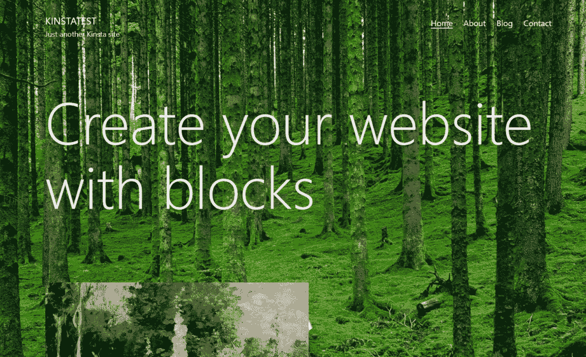

A WordPress background image example


背景也可以是纯色。


不管你选择哪个选项，**functions.php**文件处理 WordPress 主题中的背景图片。来自 WordPress 的 header.php 文件也会显示它。

因此，主题开发者可以更好地控制是否为你的主题激活自定义背景功能。你仍然可以打开的功能**或者关闭**的功能**，但是你网站的主题通常决定了默认设置。**

你可以在 WordPress 上实现几种类型的背景。你可以选择标准的全网站背景，也可以选择位于侧栏和文章等特定元素之后的背景。

WordPress 网站上更具体的位置也可能有自定义背景:

*   在 WordPress 页面或帖子后面
*   在 WordPress 类别页面上
*   在页面或帖子的内容块内部
*   在[登录页面](https://kinsta.com/blog/wordpress-login-url/)
*   导航菜单后面
*   在维护或即将推出页面上

总的来说，如果在主题中启用了自定义背景支持，用户可以上传图像或选择颜色来填充整个站点背景。

这些设置位于 WordPress 仪表盘的**外观>自定义>背景图片**下。然而，通过[拖放页面生成器](https://kinsta.com/blog/wordpress-page-builders/)，插件和不同的选项，其他类型的背景也是可能的。

将背景图像上传到仪表板只是该过程的一部分。之后，您需要配置背景图像设置。有时，您可以保持设置不变，而其他时候，重新配置设置以确保图像看起来很棒是很重要的。

WordPress 背景图片的设置包括:

*   背景颜色
*   胶料
*   像位置
*   图像是否应该重复
*   填充屏幕或拉伸图像的选项

我们将首先介绍使用 WordPress 背景图片的最佳实践。然后我们将探讨如何在各种情况下设置 WordPress 背景图片。

[想让你的网站焕然一新？✅学习如何添加背景图像，编辑大小，自定义它，使之成为你自己的，等等。✨ 点击推文](https://twitter.com/intent/tweet?url=https%3A%2F%2Fkinsta.com%2Fblog%2Fwordpress-background-image%2F&via=kinsta&text=Want+to+give+your+site+a+new+look%3F+%E2%9C%85+Learn+how+to+add+a+background+image+in%2C+edit+the+size%2C+customize+it+to+make+it+your+own%2C+and+more.+%E2%9C%A8&hashtags=WordPress%2CWPTips)


## 背景的多种风格

WordPress 背景的一个真正优势是它们不全是静态的图片。你可能会遇到各种类型的背景，从视频到照片图案到幻灯片。

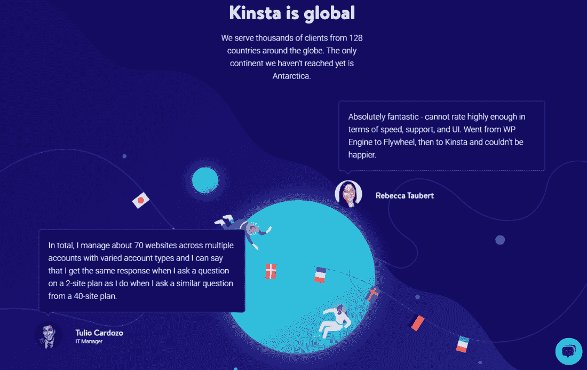

A background image example on Kinsta’s site


在自定义 CSS 或插件(或两者)的帮助下，你通常可以实现独特的背景。在本文中，我们将向您展示这两种方法。

以下是一些可以考虑的背景样式:

*   **标准背景图片:**这些是静态图片(PNG、JPG 和其他图片格式)，遍布大部分网站空间，位于主要内容之后。它们的好处包括简单，高分辨率照片的选择，以及 WordPress 核心的默认支持。不利的一面是，它们会弄乱前景元素的可见性，一个大的高分辨率图像会降低你的网站速度。
*   **纯色背景:**[纯色背景图片](https://kinsta.com/blog/website-color-schemes/)当你想给你的网站增加一些活力，但是没有一张适合你的品牌或者作为背景看起来不错的图片时，它就派上了用场。彩色背景也呈现出一种更干净、更专业的形象，而且它们不需要很长时间就能实现。它们非常适合匹配你的品牌，不需要定制代码或插件。
*   **渐变背景:**渐变背景从一种颜色过渡到另一种颜色。它比纯色更具视觉吸引力，不需要太多时间来添加，并且您可以使用许多插件来添加一个。主要的缺点是，前景可能在渐变的一端显示得很好，而在另一端却不能。
*   **图案或纹理背景:**所有的图案和纹理背景都是照片，但它们侧重于图像中的重复项目或特写纹理，如木板或一片草地。图案或纹理的好处是，它作为背景会产生奇迹，看你如何拉伸它，当图像不够大时，大多数人不会注意到图案中是否有断裂。
*   **图片幻灯片背景:**[图片幻灯片](https://kinsta.com/blog/wordpress-slider/)背景使网站所有者能够在背景中分享多种类型的设计或照片，当客户浏览您的网站时，这有助于调整情绪。然而，幻灯片可能会分散你的注意力或者降低你网站的速度。
*   视频背景:视频背景引人入胜，看起来有趣，并且容易描绘你的品牌的本质。但是，如果处理不当，它们也会导致绩效问题，并可能分散您的销售漏斗的注意力。此外，背景视频必须是完美的尺寸，并在正确的时间播放。除非你选择免费的股票视频，否则制作成本也会很高。

## 使用 WordPress 背景图片的最佳实践

设置自定义背景图像似乎是一项简单的任务。只要上传图像在正确的位置，看着它出现在前端，对不对？

大多数情况下是这样，但其他时候你会发现背景图片可能有点麻烦。这就是为什么我们建议遵循 WordPress 背景图片的[最佳实践来消除尽可能多的问题。](https://kinsta.com/blog/web-design-best-practices/)

### 使用 WordPress 背景图片的提示


### 坚持使用高质量的图像

你想要的背景图像的分辨率常常决定了它的表现。你可能认为用你的智能手机拍的照片是完美的背景图片，但它的质量可能需要更高。

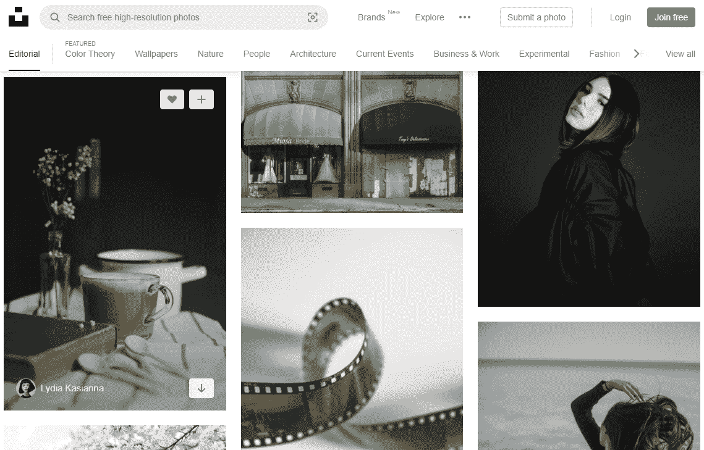

Free stock photos on Unsplash


你可以从像 Shutterstock 这样的网站上购买免版税的图片。这些网站通常有专业级的图像，这些图像已经准备好，可以作为大型背景图像上传。你也可以在免费的股票图片网站上找到很多。

背景图片可能不会完整地显示在您的网站上，因为它的大部分被内容所覆盖。尽管如此，实际的图像显示在整个屏幕上。

如果你不使用高质量的图像，你就有看到拉伸背景的风险。


### 确保背景图像大小合适

除了图像分辨率，图像的物理尺寸也很重要。

所有的[屏幕都有不同的长宽比](https://kinsta.com/blog/responsive-web-design/)。移动设备让它变得更加复杂。但是我们的目标是使用在最大屏幕上看起来很棒的图像。否则，您将面临图像被拉长或无法正常显示的风险。

一般来说，一个好的规则是坚持使用最小尺寸为 1024 x 768 像素的背景图片。然而，其他专家推荐更像 **1920 x 1080** 像素的东西。总的来说，你最好的做法是保持 1000 到 3000 像素的宽度，这取决于它的显示位置。

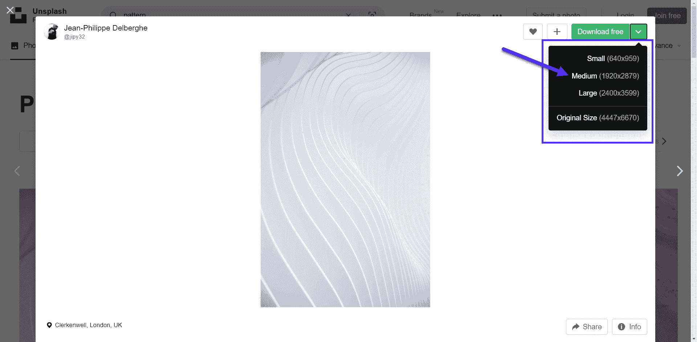

WordPress background image dimensions


你需要考虑的下一个因素是长宽比。背景图片是覆盖整个网站，还是只覆盖顶部的四分之一？

从技术上讲，一个网站有一个纵向(长高比宽)的长宽比。所以你可以看看这些类型的照片。然而，区域背景——比如标题或横幅广告的背景——应该保持横向格式(宽度大于高度)。

此外，今天台式机最常见的长宽比是 **16:9** 。围绕这个目标会有所帮助。响应主题或插件可以自动调整背景图像以供移动观看。

最终，在实际站点和多种设备类型上测试您的背景图像应该会使最终决定变得容易得多。

### 在制作 WordPress 背景图片之前进行优化

就像上传到 WordPress 的所有图片一样，如果你在发布到互联网之前没有对它们进行优化，你就是在给自己帮倒忙。这对于背景图片尤其重要，因为它们经常出现在整个网站的多个页面上。另外，它们是大照片，在屏幕上占据了相当大的空间。

较大的图像会给服务器带来很大的压力。保持图像的分辨率，但优化其大小，以便您的[网站快速加载](https://kinsta.com/learn/speed-up-wordpress/)。

您有两种优化照片的选择:

1.  在上传到 WordPress 之前，优化背景图片(和所有网站图片)。在 Photoshop Express、GIMP 和 Pixlr 等工具的帮助下完成这个手动过程。
2.  通过安装一个 WordPress 插件来自动优化过程，该插件可以在上传时调整和缩小照片。

[阅读我们深入的图像优化指南](https://kinsta.com/blog/optimize-images-for-web/)，了解如何优化图像以提高网页性能。

### 安装主题前检查背景支持

不幸的是，并不是所有的主题都支持自定义背景图片。这通常是因为背景不适合主题的整体设计，所以开发人员选择将其完全关闭。

然而，如果你真的想在你的网站上有一个背景，在下载一个新主题时检查一下功能列表是明智的，特别是如果你计划为一个高级主题付费的话。许多[主题销售网站](https://kinsta.com/blog/fastest-wordpress-theme/)提供主题是否支持背景的信息。

例如， [WordPress 主题库中列出的主题](https://wordpress.org/themes/)表示支持自定义背景作为标签。您还可以在主题描述中找到对自定义背景的引用。

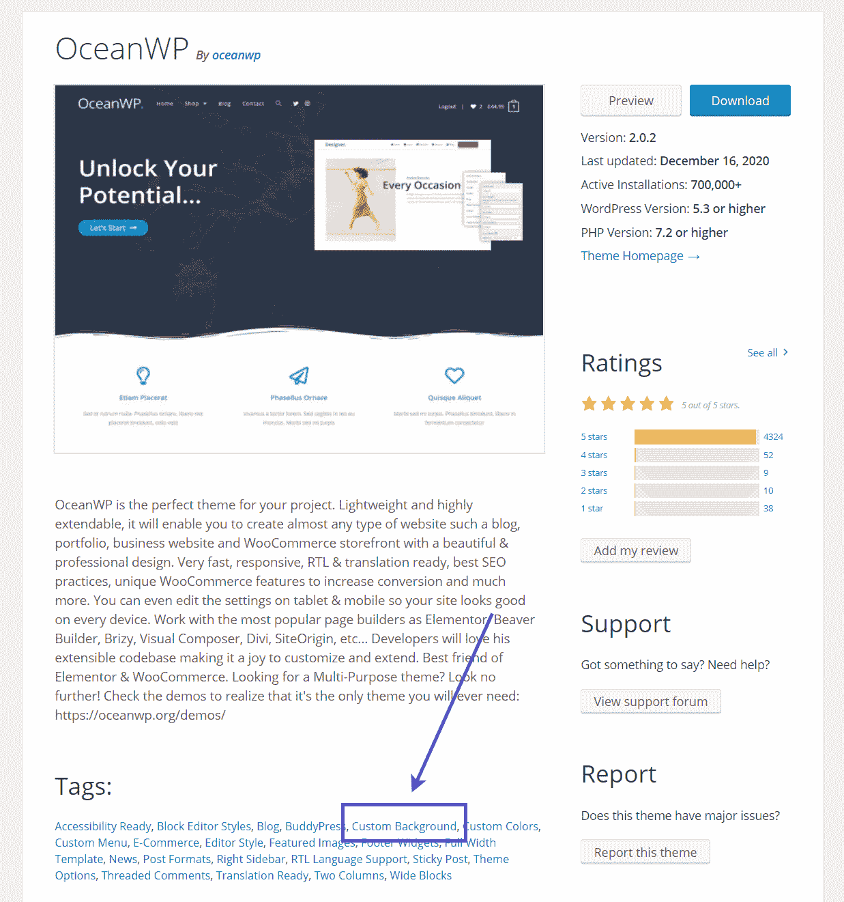

‘Custom Background’ support for themes


其他主题网站通常包括关于自定义背景图像的类似信息。如果没有，联系[开发者](https://kinsta.com/blog/hire-wordpress-developer/)看看是否有可能，覆盖背景图片块(见下文)是否会导致主题出现问题。

### 考虑使用可视化页面生成器来简化背景图像

像 Gutenberg、WPBakery、 [Divi 和 Elementor](https://kinsta.com/blog/divi-vs-elementor/) 这样的页面构建器提供了令人印象深刻的块和模块列表，可以在网页的任何地方插入图像和文本框等元素。

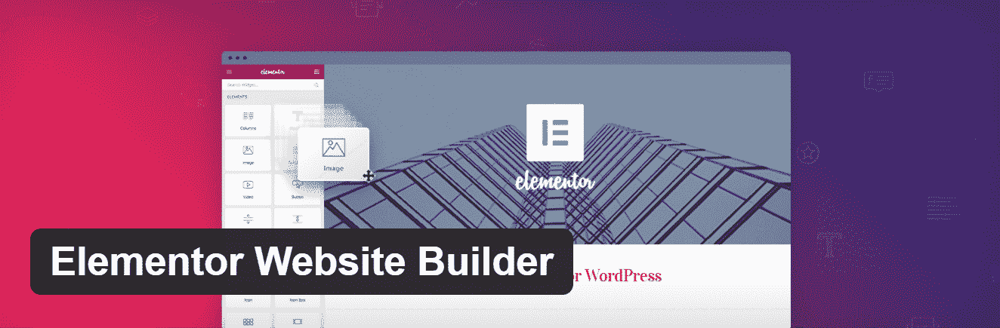

Elementor website builder


没有[拖放构建器](https://kinsta.com/blog/wordpress-page-builders/)，配置背景图像变得有点困难。试图解决你可能遇到的任何问题尤其困难。

页面生成器也倾向于替换 WordPress 提供的默认背景图片功能。您可以重写主题限制或任何有助于在代码中显示背景图像的缺失元素。

### 确保你的背景图片合法

谈到图像，尤其是发布在互联网上的图像，合法性总是会被提及。社交媒体上有一种日益增长的趋势，人们似乎认为给照片添加好友就可以自动使用该照片。

那是假的。

拍照的人拥有它。即使那张图片来自 iPhone 的快速抓拍——在美国和许多其他国家，他们也能立即获得那张照片的版权保护。

如果你想合法使用别人的照片，需要版权所有者的书面声明，允许你使用他们的照片——一封简单的电子邮件就可以了。即使这样，如果对方要求你，你也可能不得不说出照片的属性。

我们有一个关于保护你网站上图片的综合指南，但是这篇文章也为那些对使用其他来源的图片感兴趣的人提供了有价值的信息。

背景图片最难的部分是添加属性通常是不实际的，看看 WordPress 是如何没有地方为背景图片添加可见的标题。不，你不能在一个随机的博客帖子或页面上添加属性，并期望它作为一个完整的网站背景图片的信用。

为了保护你自己，也为了尊重拍照的人，在寻找 WordPress 背景图片时，考虑以下情况之一:

*   自己拍照。这是确保你没有侵犯他人版权的最简单的方法。
*   在 Shutterstock 和 iStockPhoto 等网站上付费购买照片。这些有时很贵，但对于一个背景图片来说，它可能会挤入你的预算。
*   考虑一下像 Unsplash 或 Pexels 这样的免费图片网站。但是，请确保不要求进行归因！您偶尔可以在这些网站上找到图片，建议但不要求注明出处。
*   联系摄影师或艺术家，询问是否可以免费使用。这可能就是你所需要的一切，尤其是如果你有所回报的话。
*   考虑跳过背景图片，或者考虑用彩色背景代替照片。

## 如何在 WordPress 中设置背景图片？

在 WordPress 中设置背景图片有多种方法。这些方法通常会根据您想要放置图像的位置而变化。

例如，你可能决定让背景图片在整个网站上保持不变。另一方面，你可能更想找到一种方法为你的所有页面显示独特的背景图片。

由于存在如此多的可能性，我们将涵盖如何添加背景图像或颜色到以下部分:

*   整个网站
*   WordPress 页面
*   WordPress 帖子
*   一个单独的[内容块](https://kinsta.com/blog/wordpress-5-0/)
*   WordPress 标题
*   类别存档页面
*   WordPress 登录页面
*   导航菜单
*   维护页面

### 如何给 WordPress 标题和菜单添加背景图片


### 开始之前:激活 WordPress 上的自定义背景支持(如果需要的话)

主题开发者决定了网站后台功能的命运。WordPress 的核心内置了这个功能，但是主题开发者可以关闭它，这样你就没有仪表盘设置来打开它。

如果在下面的教程中你发现[你的主题是](https://kinsta.com/knowledgebase/what-is-a-wordpress-theme/)你缺少**自定义背景**选项的原因，考虑下面的步骤来快速修复它。

WordPress 的主要自定义后台支持由**functions.php**文件处理。打开该文件，如果缺少以下代码，请插入:

```
$defaults = array(
    'default-color'          => '',
    'default-image'          => '',
    'default-repeat'         => '',
    'default-position-x'     => '',
    'default-attachment'     => '',
    'wp-head-callback'       => '_custom_background_cb',
    'admin-head-callback'    => '',
    'admin-preview-callback' => ''
);
add_theme_support( 'custom-background', $defaults );
```

请记住，实际激活后台支持的元素是包含所有内容的`add_theme_support()`函数。这段代码打开了 [WordPress dashboard](https://kinsta.com/knowledgebase/wordpress-admin/) 中的背景功能，您可以在本文的许多后续教程中使用它。

也可以通过**functions.php**文件为整个主题添加默认背景图片。只需转到前面代码中带有`default-image`值的区域，将图像的 URL 添加到`=>`后的`' '`之间的空白区域。

这是在 WordPress 仪表盘中打开自定义背景的一个快速简单的方法。

说到这里，我们建议[如果一开始就没有后台支持的话，就改主题](https://kinsta.com/blog/change-wordpress-theme/)。自定义背景功能的移除可能有它自己的目的，或者可能主题开发者发现它给设计带来了太多的问题。

### 如何给你的整个 WordPress 站点添加背景图片

如果你的主题提供了添加自定义背景图片的功能(很多人都这么做了)，那就更容易了。

首先，在你的 WordPress 仪表盘上点击**外观>定制**。

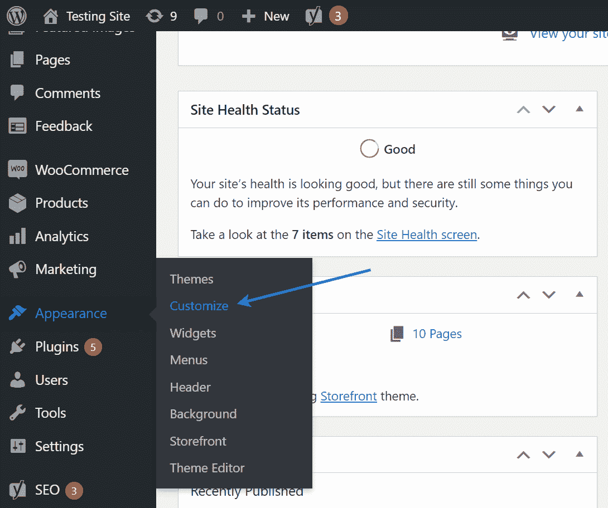

Click the ‘Customize’ link under the Appearance menu


这将把你带到 **WordPress 主题定制器**，定制设置在左边，网站预览在右边。

在这里，找到并点击**背景**标签。

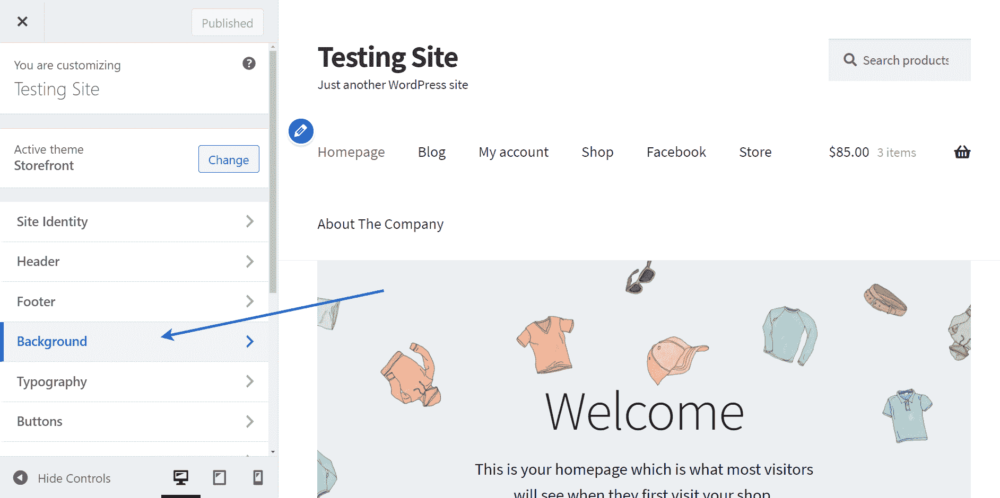

WordPress background image in the editor


或者，如果您可以选择**外观>背景**，您可以使用它来更直接地设置。

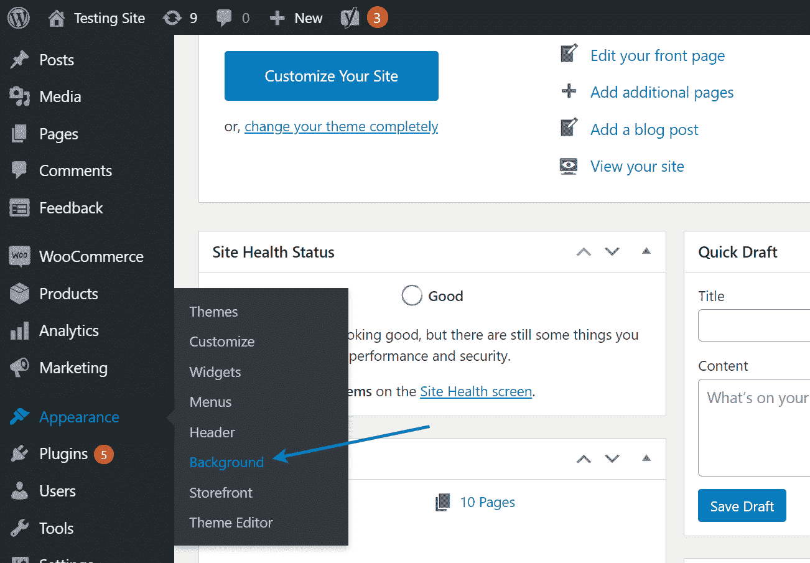

Click the ‘Background’ link under the Appearance menu


**背景**定制区管理整个网站的背景元素。

点击**选择图像**按钮继续。

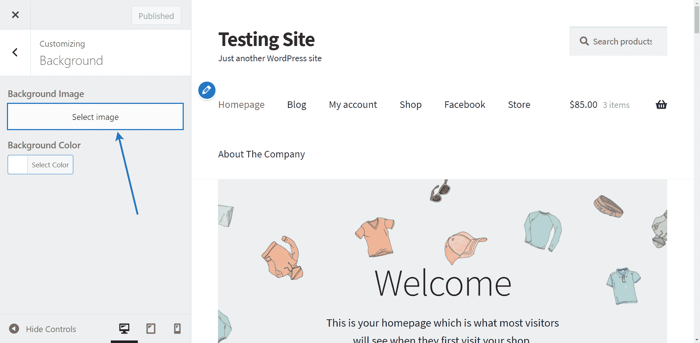

Click on the ‘Select Image’ button


在**选择图像**窗口中，选择一个适合作为您的[品牌和网站风格](https://kinsta.com/blog/web-design-trends/)背景的图像。一般来说，带有黑色、白色或灰色阴影的中性色图案通常有助于确保大部分文本和内容在背景的衬托下看起来仍然不错。

选择图像后，点击**选择图像**按钮继续。

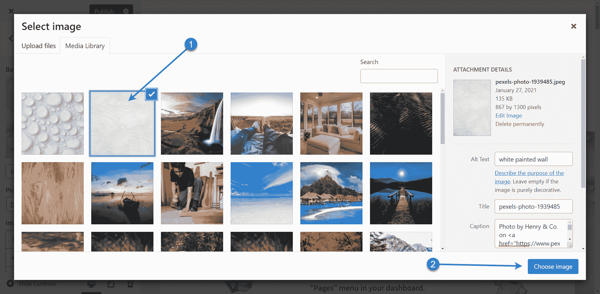

Choose the background image


您实现的背景现在出现在网站预览中。

看看你的内容是否仍然突出，看起来像所选的图像。有时你可能会发现你需要完全替换掉背景或者改变文本或者链接的颜色。

背景的一个小[缩略图](https://kinsta.com/blog/regenerate-thumbnails/)也出现在**设置**面板中，显示图像已经实现。

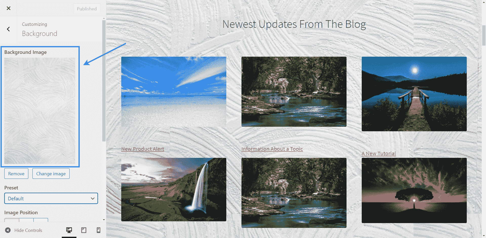

WordPress background image thumbnails


一些额外的设置可用于 WordPress 背景，包括**预置**字段。

点击**预设**字段，使用预设设计和校准更改图像格式。

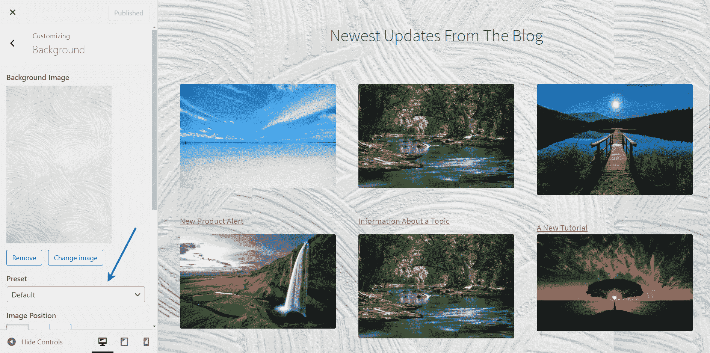

The ‘Preset’ option for WordPress background images


您可以从以下预设中选择:

*   **默认**:这通常与**重复**相同，但可能取决于你的主题。默认设置通常效果最佳，但这取决于所使用的图像。
*   **填充屏幕:**该设置拉伸图像，以确保覆盖屏幕的所有部分，即使这意味着裁剪图像，使其溢出屏幕。它适用于许多高分辨率图像，但可能会导致低分辨率图像模糊。
*   **适合屏幕**:保持原始照片的长宽比，并尝试使用该比例来适合当前屏幕图像。它很好地保持了图像接近其原始状态，但可能不会覆盖所有的背景区域。
*   **重复:**这使用了**填充屏幕**功能的一部分，扩展和拉伸图像，但当它不能成功覆盖整个屏幕时，它也会重复图像。对于模式，这通常看起来很棒。但是对于某些图像，它可能会在重复的图像之间产生一条硬线条。
*   **自定义:**这个设置给了你对背景最大的控制，提供了几个选项来自定义背景图片的大小，比如它如何在页面上重复，当用户滚动时如何伸展或移动。

没有规定哪种预设效果最好，因为图像有不同的大小、分辨率和细节。因此，你最好从**默认**预设开始，然后测试其他每个预设，看看哪一个最适合你的背景图像。

如果所有其他方法都失败了，请进入**自定义**设置，让您的选择变得更加具体。

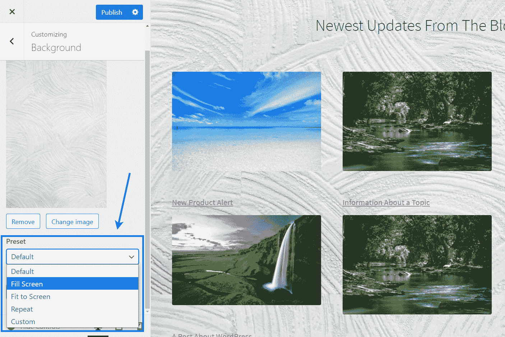

‘Fill Screen’ preset for WordPress background images


**适合屏幕**预设并不完全适用于此图像，主要是因为原始图像的长度远大于宽度，在右侧留下了大量空间。我可以将**的图像位置**改为**的中心**，但这很可能会在两侧留下空白。

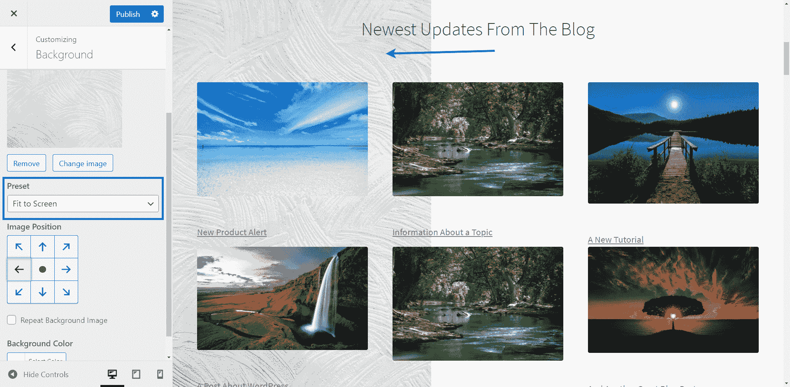

The ‘Fit to Screen’ preset


下一个要考虑的设置是**图像位置**工具。点按箭头以四处移动背景图像，调整方向以将图像的焦点朝向中心或充满屏幕。

与**预设**设置非常相似，**图像位置**工具需要一个猜测和检查您的工作的过程，因为原始图像及其内容决定了它的外观。

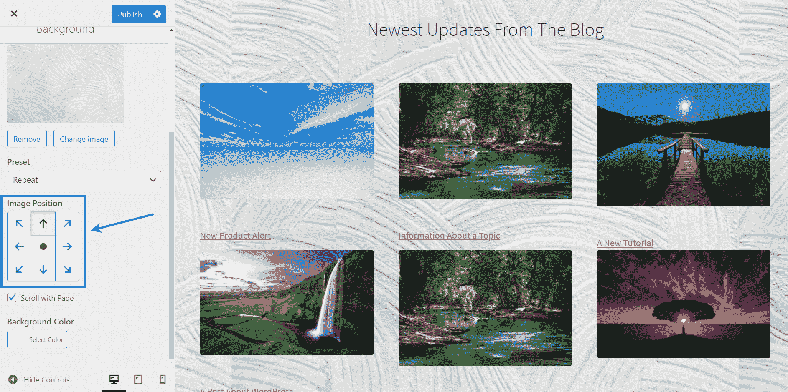

WordPress background image position


接下来，有一个复选框字段使背景图像**与页面**一起滚动。

选中此框后，背景图像会粘在前景内容上，并随着用户在页面上上下移动而滚动。

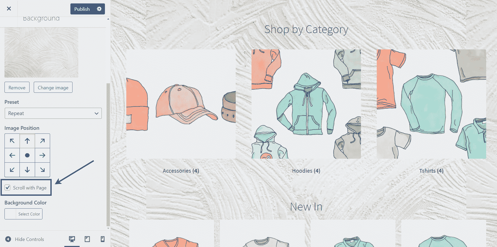

Enabling the ‘Scroll with Page’ option


取消选中该框会改变背景图像的总体方向，但它的主要特点是告诉背景在用户向下滚动页面时保持不变。

前景内容项目(如本例中的[产品](https://kinsta.com/blog/conversions-woocommerce-product-pages/))滑过背景图像，创造出吸引人的效果。

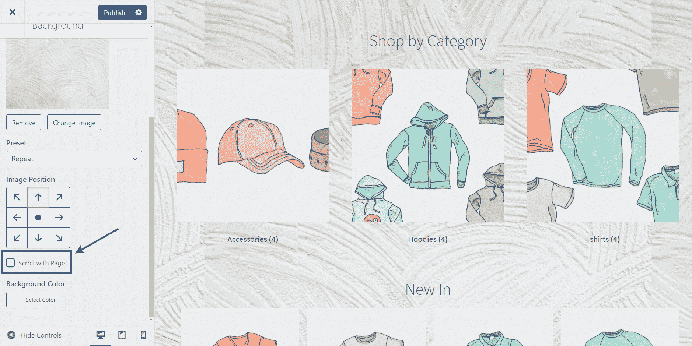

Disabling the ‘Scroll with Page’ option


#### 使用自定预设

当选择除了**自定义**预设之外的东西时，你不会得到那么多额外的设置来配置。

但是，选择自定预置会打开其他几个要考虑的字段。

例如，您可以选择**填充屏幕**或**以适合屏幕**，然后将其与重复或非重复的背景图像相结合，结合之前的预设元素。你仍然可以选择**滚动页面**。

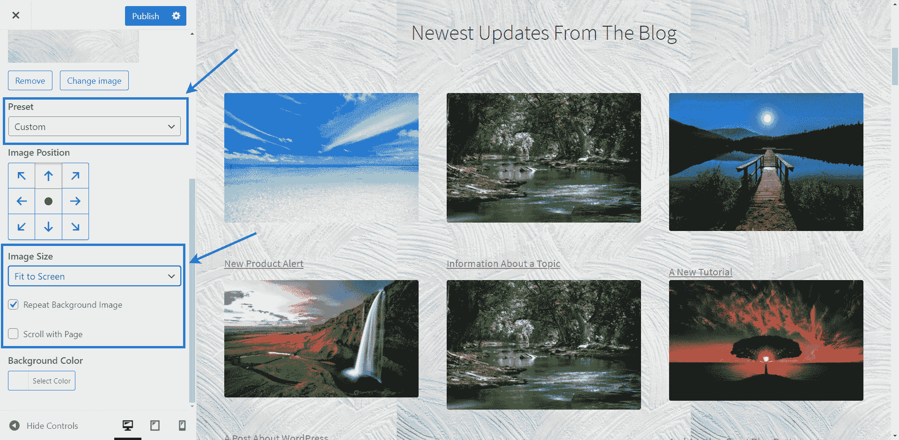

Presets and Image Sizes for background images


看看是否可以使用未经任何编辑或设置的原始图像。有时候，原始照片是用作背景的近乎完美的匹配，所以为什么要弄乱已经准备好的东西呢？

然而，它的尺寸也可能对你的网站来说太大，或者长宽比不太合适。不管怎样，我们建议尝试一下这个设置，看看它是否适合你。

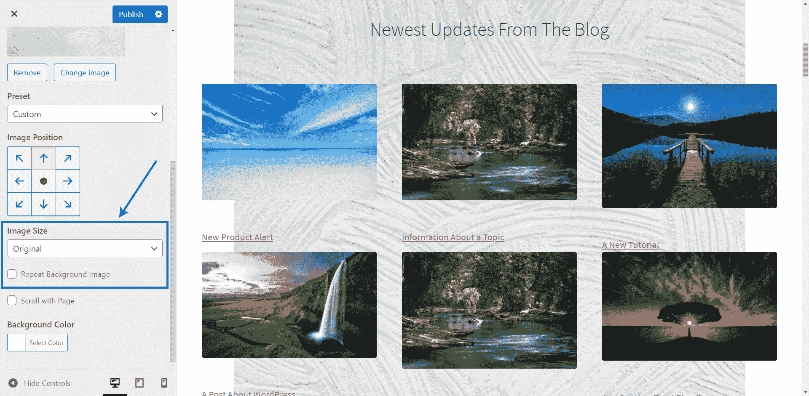

Setting the background image size


一旦你决定了你的完美背景设置(对于本教程，默认选项看起来不错)，点击**发布**按钮在你的网站上渲染修改。

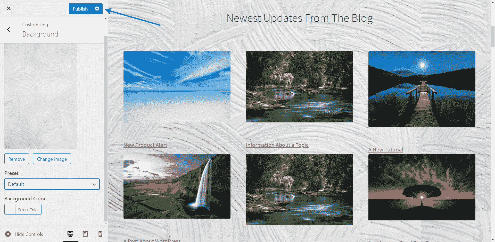

Hit the ‘Publish’ button


去你网站的前端看看背景的运行。

主页是一个很好的起点。你会注意到标题区域和欢迎图片没有背景。这是因为网站顶部的欢迎图像已经作为全屏英雄图像覆盖了屏幕的整个水平部分。

至于标题和[菜单](https://kinsta.com/blog/wordpress-menu-plugins/)，你将在下面的一些教程中学习如何配置这些背景。

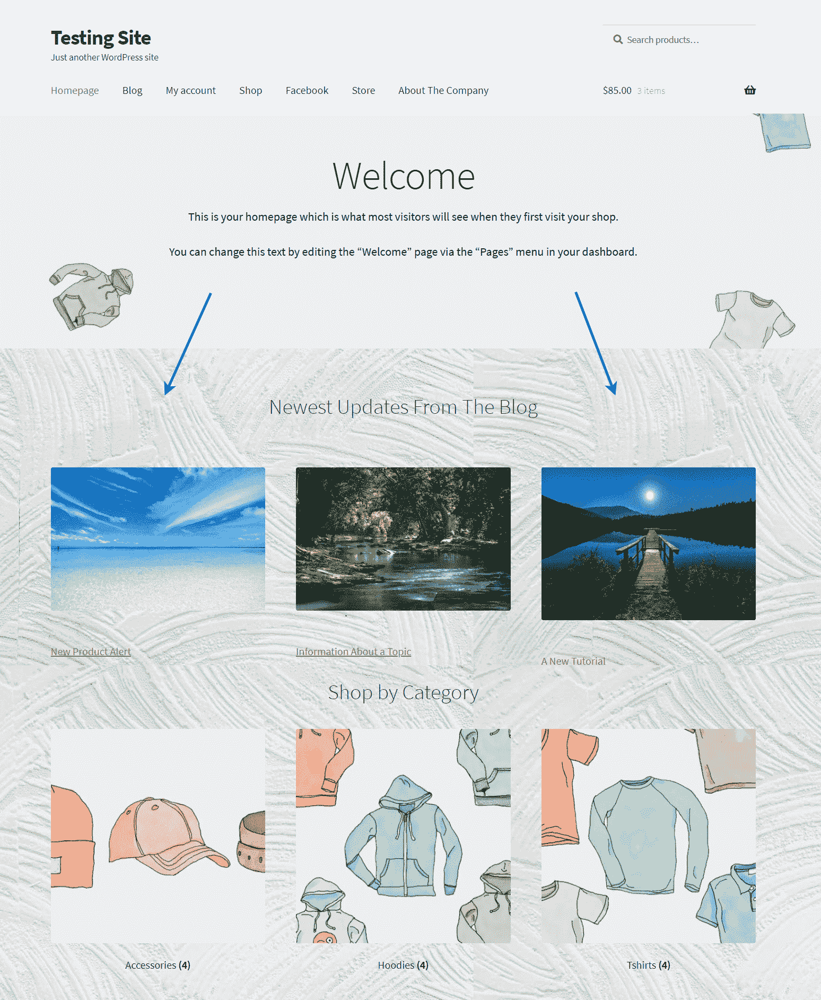

Seeing the WordPress background image


请记住，一般自定义 WordPress 背景会在网站的每个页面和帖子上激活。这是一个全球性的功能，适用于那些想要快速给自己的网站打上品牌并增加一些亮点的人。

例如，进入该网站的**商店**页面，可以看到产品选择背后的背景。

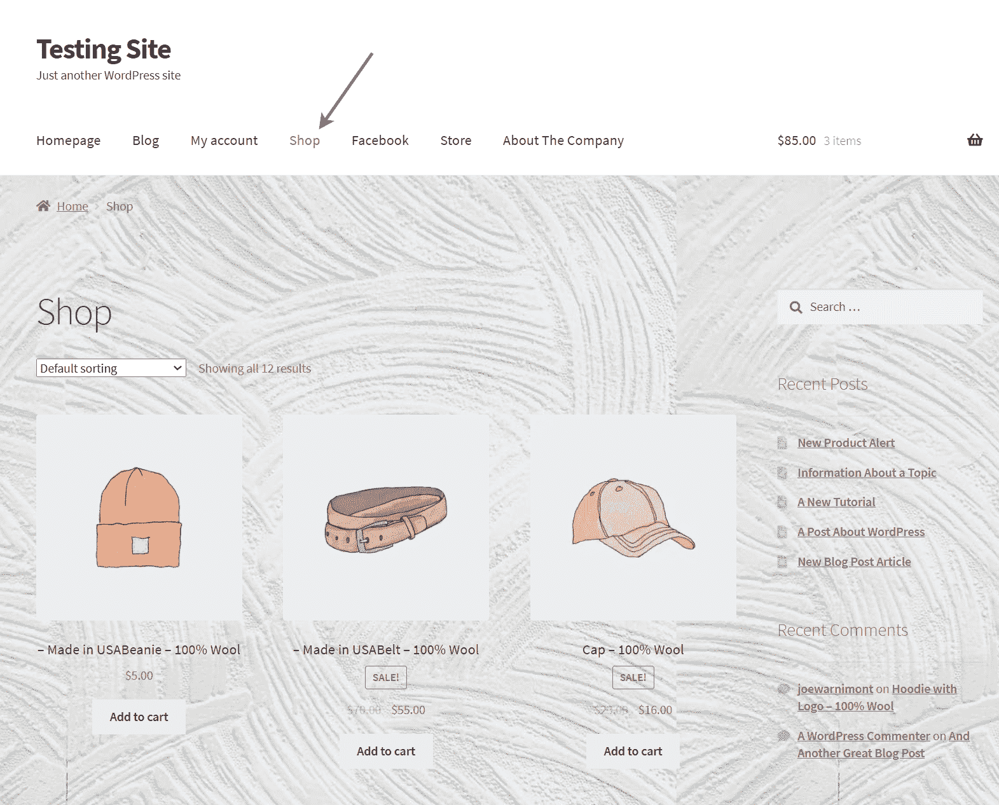

The WordPress background image on another page


#### 如何为整个网站设置背景色而不是图像

在整个网站上激活背景色的过程和你打开背景图片的过程没有太大的不同。首先进入仪表板中的**外观>背景**，然后寻找**背景颜色**字段。

单击**选择颜色**按钮打开更多设置，为您的背景选择和切换不同的颜色。

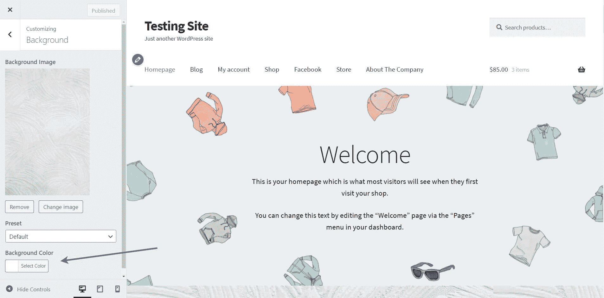

Selecting a solid color as the background


颜色面板提供了多个选项供您[选择颜色](https://kinsta.com/blog/website-color-schemes/)。第一种是输入或粘贴一个颜色代码。所有颜色都有独特的颜色代码，您可以通过快速的互联网搜索找到这些颜色及其相关代码。

另一个选择是在颜色面板周围单击，为背景找到最完美的颜色。如果你想选择一种简单的颜色，他们甚至在面板底部有普通的颜色样本。

要激活背景颜色，确保颜色被选中并显示在**选择颜色**预览中。

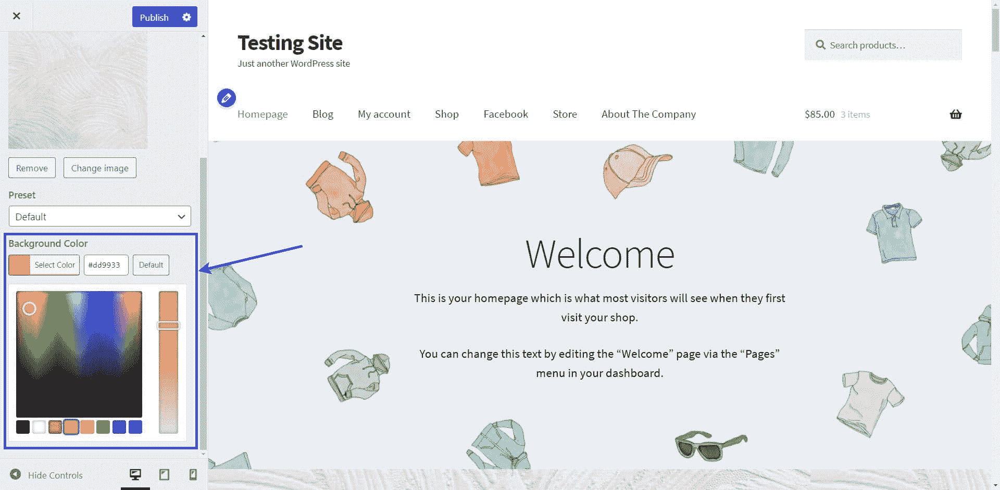

Choosing a ‘Background Color’


你应该在 [WordPress 定制器](https://kinsta.com/blog/how-to-customize-wordpress-theme/)预览中看到颜色背景。如果没有，那很可能意味着你安装了一个覆盖颜色背景的图像背景。

你所要做的就是点击**背景图像**预览下方的**移除**按钮来显示彩色背景。

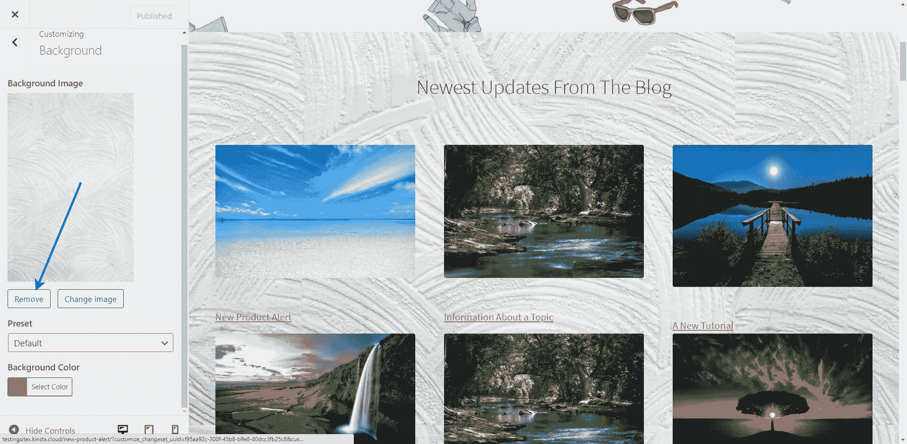

Remove WordPress background image


现在，颜色出现在整个网站的内容后面。就像你使用图片背景一样，谨慎的做法是浏览你的网站，确保所有的文本、图片和链接在新的背景下仍然可见。

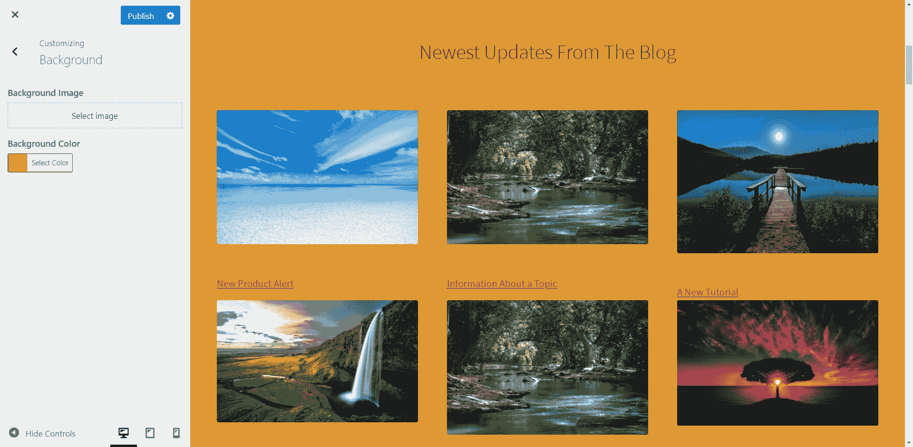

Previewing a solid orange WordPress background


### 如何给 WordPress 页面添加背景图片

但是如果你想在 WordPress 上插入一张图片，作为背景显示在一个单独的 WordPress 页面上，该怎么办呢？上一节概述了站点范围背景图像的全局设置。

### 查看我们的[视频指南](https://www.youtube.com/watch?v=ewE57bZIyRE)给 WordPress 单页、帖子、&内容块添加背景图片


许多人喜欢在他们的页面上添加背景，因为你可以将某个主题或感觉融入到适用于内容的页面中。例如，如果公司在洛杉矶，关于我们的页面可以有洛杉矶背景。或者一个作者的书的介绍可以包括一个符合故事主题的背景。

在这一节中，如果你不介意花钱购买插件或选择页面生成器，我们将介绍如何使用一种主要方法和几种替代方法将 WordPress 背景图片添加到页面中。

**注意:**不管你用古腾堡还是经典 WordPress 编辑器都没关系。

对于特定页面的背景，这些方法似乎最有效:

*   用[自定义 CSS](https://kinsta.com/blog/wordpress-css/) 添加独特的页面背景。
*   使用允许个人页面背景的插件。
*   在页面生成器的帮助下，在每个页面上合并自定义背景。

将你自己的定制 CSS 添加到一个页面包括找到那个页面的类 ID 和调用一个背景 URL，在定制 CSS 模块中，在 WordPress 页面设置中。幸运的是，考虑到我们可以查找它，或者您可能已经知道它是什么，确定一个页面的类 ID 并不困难。

转到您站点上的页面，您只需要该页面的背景。

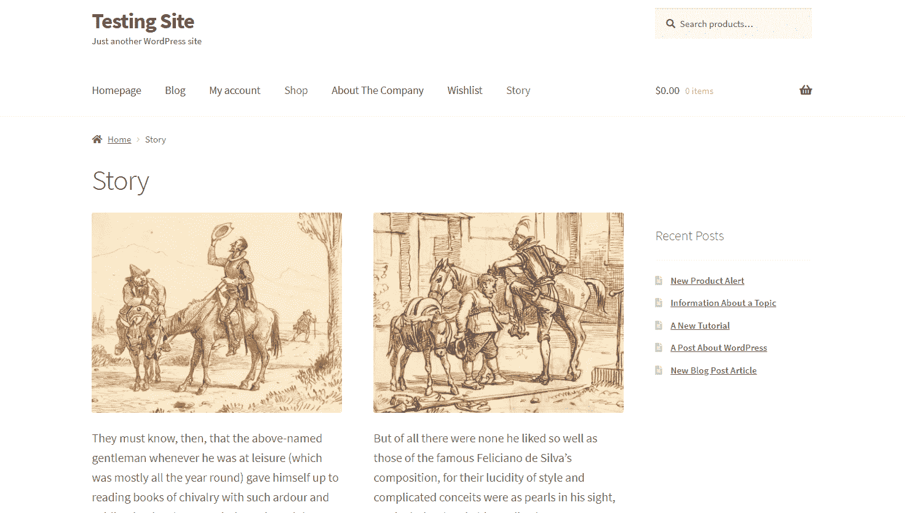

Adding a page specific WordPress background image


右键单击页面上的任意位置，在屏幕上显示下拉菜单。选择下拉菜单底部的检查工具。

Inspect 模块显示来自页面本身的编码，以及为您的网站全局使用的自定义 CSS。这是一个非常有用的区域，可以用来查找关于您站点上的页面或帖子的信息。

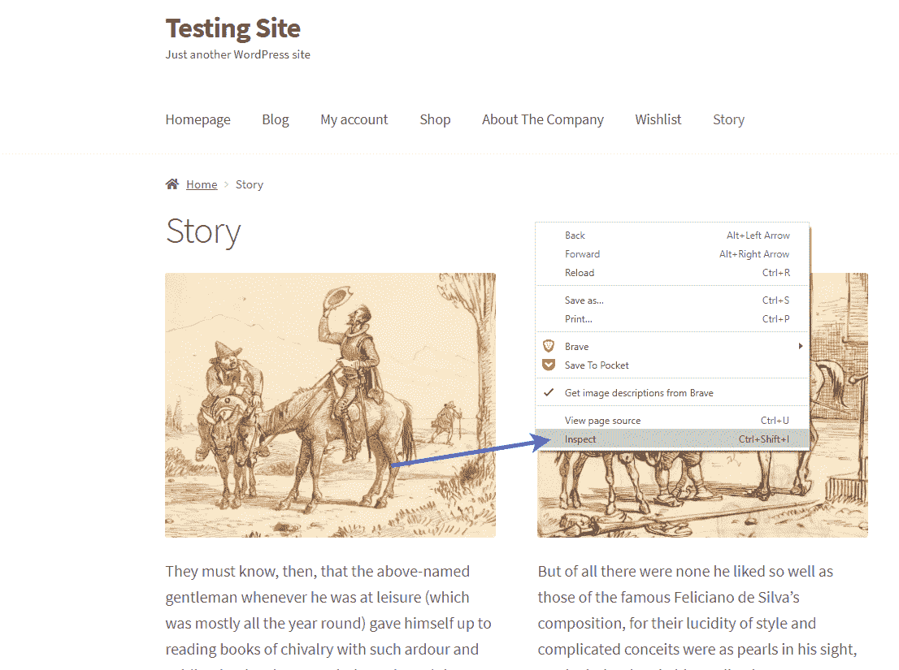

Inspecting a webpage


Inspect 框包含页面中的代码行，但是我们只对分配给该页面的 class 标记感兴趣。为了澄清，每个 WordPress 页面都有一个 class 标签作为识别码。

使用搜索功能，键入`body`或`class`找到带有`page-id`标签的代码行。

在这种情况下，ID 是`page-id-352`，但是您的 ID 会有所不同。

您想要复制带有关键字`page-id-#`的整个代码部分，包括破折号。

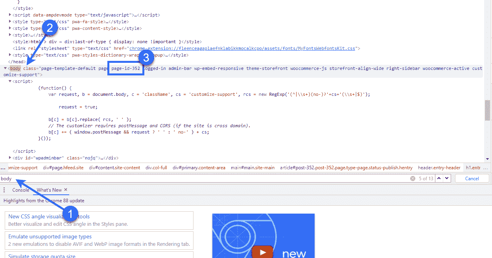

Finding the page ID in WordPress


将[页面 ID](https://kinsta.com/blog/wordpress-get-post-id/) 保存在某个地方以便在接下来的几个步骤中使用，回到你的 WordPress 仪表盘，点击**外观>定制**。

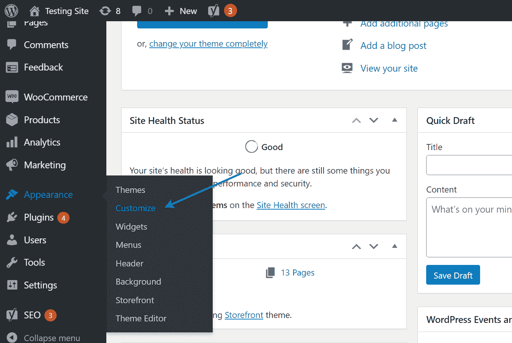

Go to the theme customizer


在 WordPress 定制器中选择**附加 CSS** 标签。

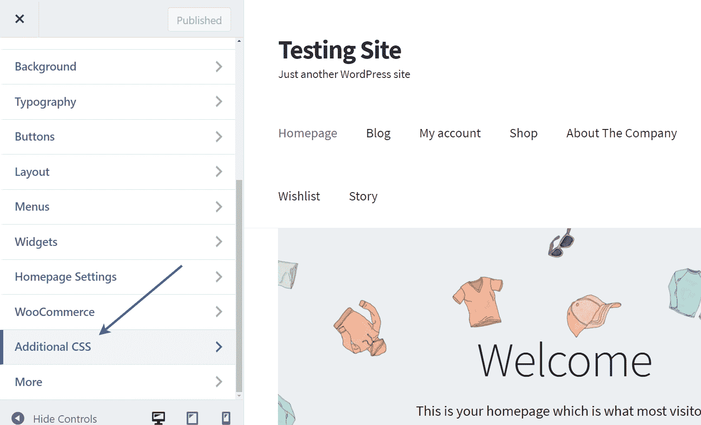

‘Additional CSS’ section in the Customizer


此部分允许您键入或粘贴任何自定义 CSS，以便在整个网站中操作项目。在这种情况下，它可以方便地覆盖默认的背景图像，并为一个页面而不是其他页面启用背景图像。

将下面的代码粘贴到附加的 CSS 字段中，但是记住将“ **#** ”替换为您在前面步骤中作为页面 ID 提取的实际数字。此外，你必须把一个真正的图像网址，在那里的填充文本(`http://YOURIMAGEURL.jpeg`)的地方。

```
body.page-id-# { 
background-image: url("http://YOURIMAGEURL.jpeg"); 
background-position: center center; 
background-size: cover; 
background-repeat: no-repeat; 
background-attachment: fixed;
}
```

对于这个例子，页面 ID 被填充为 352，我们有一个从媒体库粘贴进来的背景图片 URL。

如果您无法适应屏幕的背景图像，请根据需要更改自定义背景设置。例如，你可能想要修改像 WordPress 背景图片大小、附件或位置这样的元素。如果没有，就让它们在示例代码中保持原样。

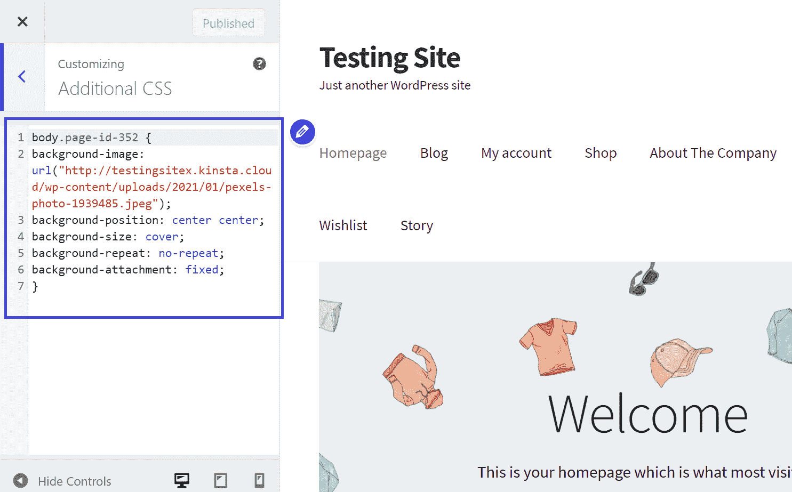

Adding custom CSS to a WordPress site


当你对定制的 CSS 满意时，点击**发布**按钮。

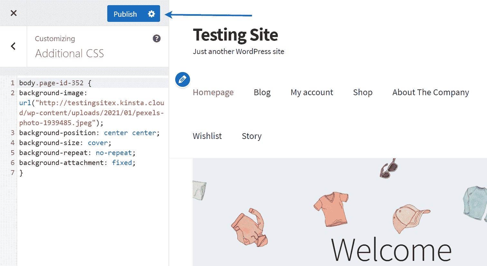

Click the ‘Publish’ button


使用该自定义 CSS，指定的页面包含使用代码的大小和位置设置的背景图像。除非你为不同的[页面 id](https://kinsta.com/blog/wordpress-get-post-id/)重复 CSS，否则你的网站上没有其他页面会显示相同的背景。

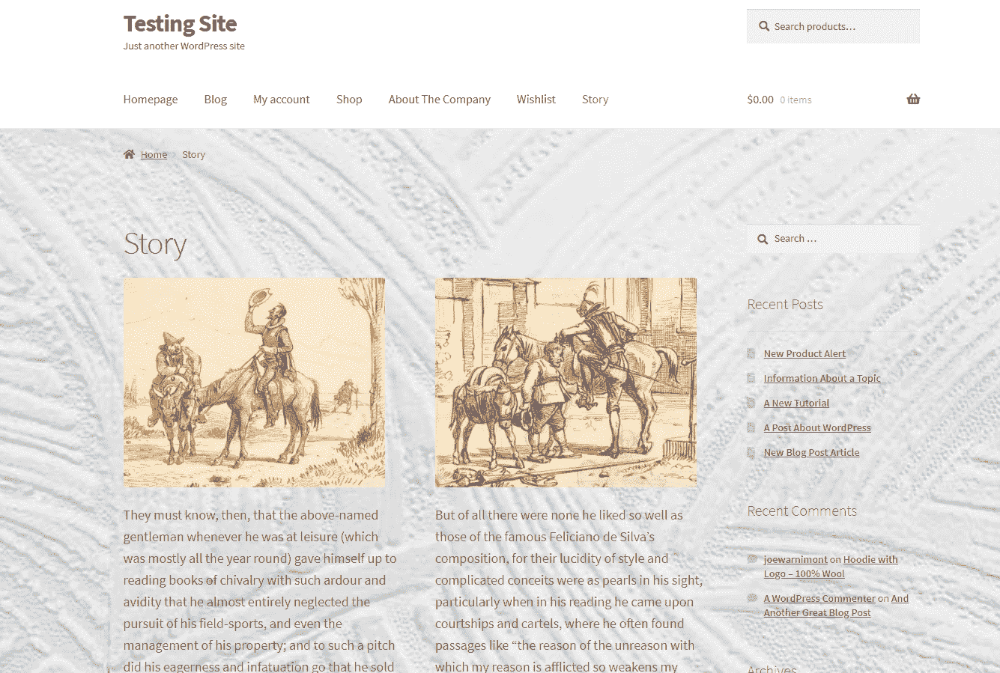

The background image now shows on the page


如前所述，给 WordPress 页面添加独特背景的其他选择包括使用页面生成器或允许在单个页面上添加背景图片的插件。

然而，在一个单独的页面上放置背景图片的最便宜和最快的方法是使用上面显示的 CSS 代码方法。

### 如何给 WordPress 文章添加背景图片

大多数背景图片会被插入到 WordPress 页面或者整个网站的每一页的后面。

WordPress 中的默认自定义背景功能与单个帖子无关，除了这个背景也会显示在博客帖子上。这对所有组织来说都不理想，因为不同的博客文章可能有完全不同的主题。

这样的博客可以从他们自己独特的背景图片中获益。然而，WordPress 帖子没有自己的背景图片设置，这就有点棘手了。

因此，在给帖子添加背景图片时，我们有几个选项可以考虑(你会注意到它们与处理页面特定的背景图片时是一样的):

*   使用自定义 CSS 插入背景图像。
*   使用一个插件来实现单个帖子的背景。
*   为文章背景安装可视化页面生成器。

像上一节关于独特的页面背景一样，您可以使用页面生成器或插件添加特定于文章的背景。

鉴于制作一个帖子特定的背景与制作一个页面特定的背景没有太大的不同，我们将只简单介绍一下为一个帖子处理这个过程的步骤。

当使用自定义 CSS 实现特定于文章的背景时，使用与页面背景相同的代码，只有一点不同:必须找到文章 ID 而不是页面 ID。

因此，打开你想插入背景的 WordPress 帖子的前端。

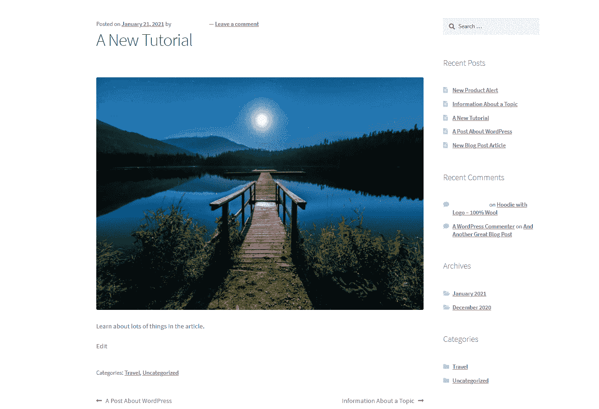

WordPress background image for posts


右键单击 post 并选择 Inspect 选项。在代码中完成搜索，找到代码中的 body 类部分。寻找`postid-#`部分——这是您需要插入到自定义 CSS 中的文章 ID。

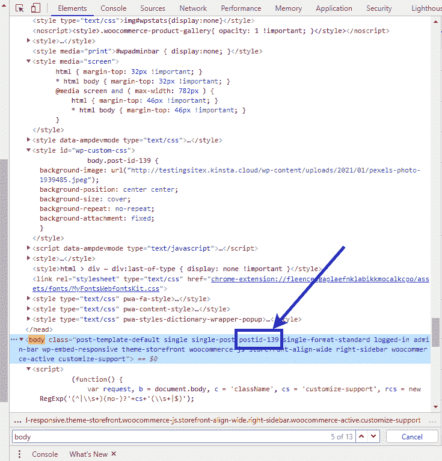

您会注意到，在这个例子中，文章 id 的格式与页面 ID 稍有不同，在页面 ID 中，`postid-#`标签没有像`page-id-#`一样在“post”和“ID”之间有一个破折号。此外，这些并不是硬性规定。您可以找到标签的各种格式。

现在，进入你的 WordPress 仪表盘，点击**外观>定制**。导航至**附加 CSS** 选项卡。

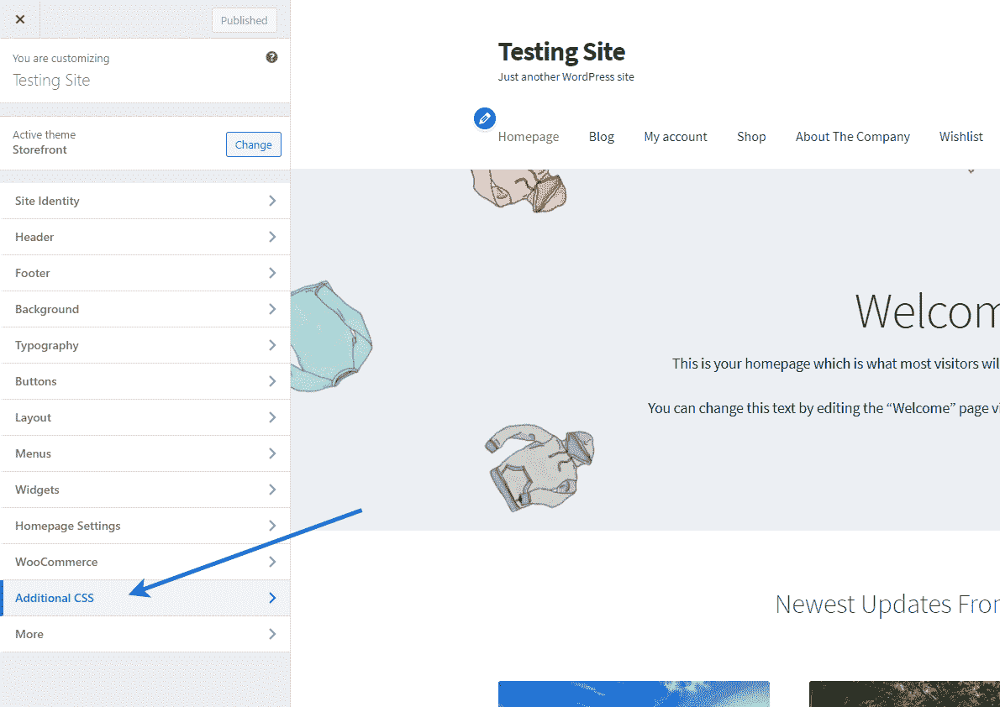

Gio to ‘Additional CSS’ section


将以下代码粘贴到该自定义 CSS 字段中:

```
body.postid-# { 
background-image: url("http://YOURIMAGEURL.jpeg"); 
background-position: center center; 
background-size: cover; 
background-repeat: no-repeat; 
background-attachment: fixed;
}
```

之后，取你之前从想要的帖子中找到的帖子 ID 号。将 CSS 代码中的“#”替换为数字。此外，用你想要显示的背景图片的真实 URL 来改变`http://YOURIMAGEURL.jpeg`文本，保留它周围的引号。

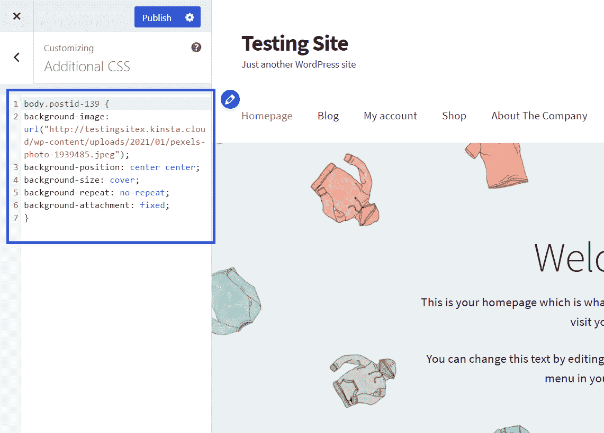

Adding the custom CSS for a specific post id


请确保在离开附加 CSS 标签之前点击**发布**按钮，因为这将保存您在网站上的更改，并允许您在前端查看背景。

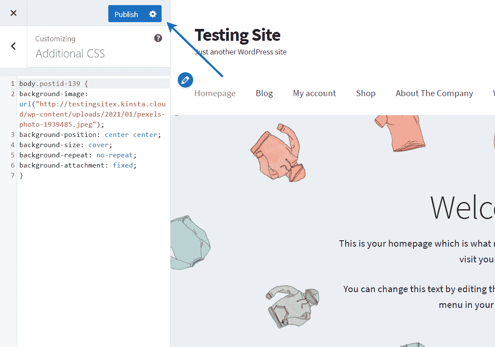

Hit the ‘Publish’ button to save changes


有了这些 CSS 的改变，你现在可以回到 WordPress 博客文章的前端来看看新的背景。测试你网站上的其他博客文章和页面，看看其他的都没有背景，除非你为这些文章 id 实现了相同的代码。

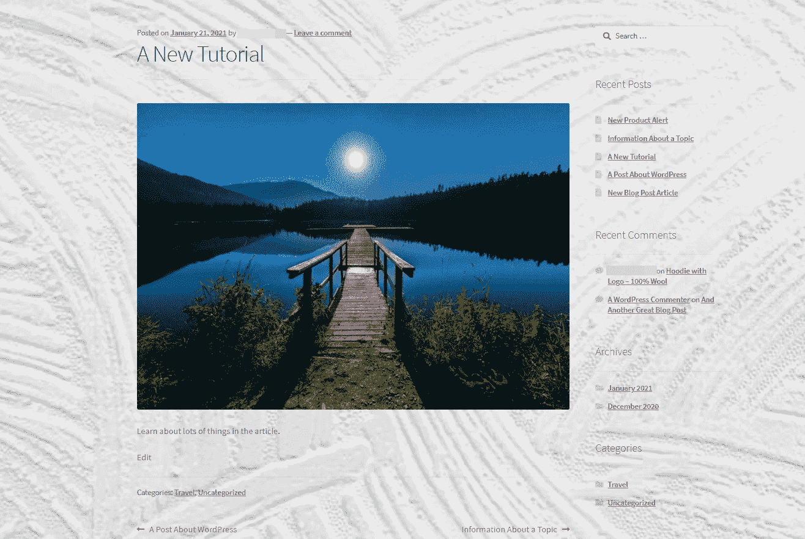

See the background image on the post


### 如何向单个内容块添加背景图像

WordPress [Gutenberg](https://kinsta.com/blog/gutenberg-wordpress-editor/) 块编辑器的独立内容块允许广泛的内容显示选项，包括文本框、图像和图库。

这些将你的内容分成不同的部分。因此，您可以为该块添加背景颜色或图像。

例如，假设你正在写一篇关于服装零售业现状的博文。你想以号召人们报名参加[你的下一场网络研讨会](https://kinsta.com/webinars/)来结束或开始这篇文章。使用背景色或图像突出这一部分是有意义的。

不幸的是，WordPress block editor 没有提供一个包罗万象的设置，让你可以给任何块添加背景。然而，有些积木可以选择加入彩色背景。

还有一个区块，称为封面区块，这是我们可以为帖子或页面中的一个区块添加背景图像的最接近的东西。封面允许您覆盖文本和一些媒体项目，使其适合我们的最终目标。

下面是为一个单独的 WordPress 块设置图像或颜色背景的技术。

#### 为一个块设置颜色背景

最简单的方法来增加一些活力，以一个单一的块是添加一个彩色背景。它不像图像背景那样花哨，但是彩色背景实际上是 WordPress 块编辑器中唯一可用于标准块的背景类型。

**注意:**有些区块根本没有任何背景设置。如果是这种情况，你最好使用一个覆盖块，并在它上面覆盖其他块，正如本文后面所讨论的。

例如，**段落**块具有激活彩色背景的设置。

要打开此功能，选择模块，然后在右侧的**模块**选项卡下找到**颜色设置**。

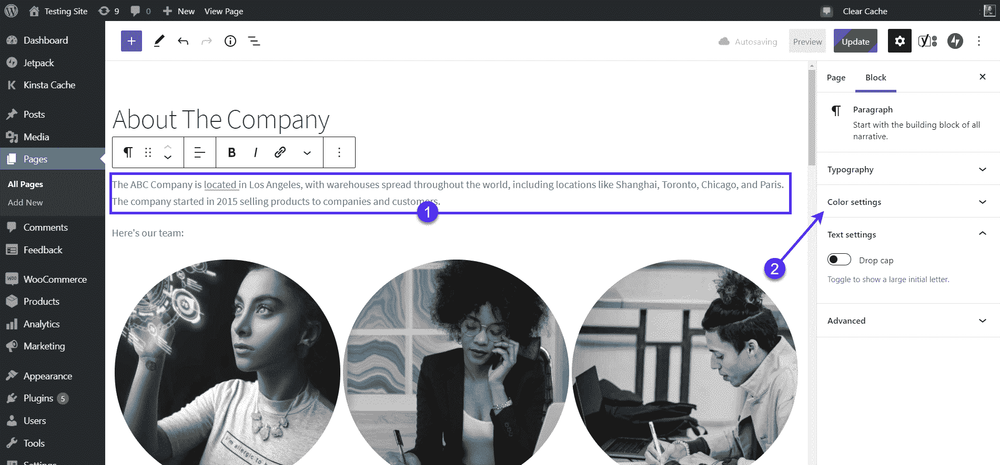

Changing the background ‘Color settings’


该部分显示了**文本颜色**和**背景颜色**字段。

转到**背景颜色**区域，从可用选项列表中选择一种颜色。您也可以选择**自定义颜色**链接来插入您自己的颜色代码或选择独特的颜色。

正如你所看到的，一旦设置到位，段落块的背景变成了不同的颜色——在这个例子中是蓝色。

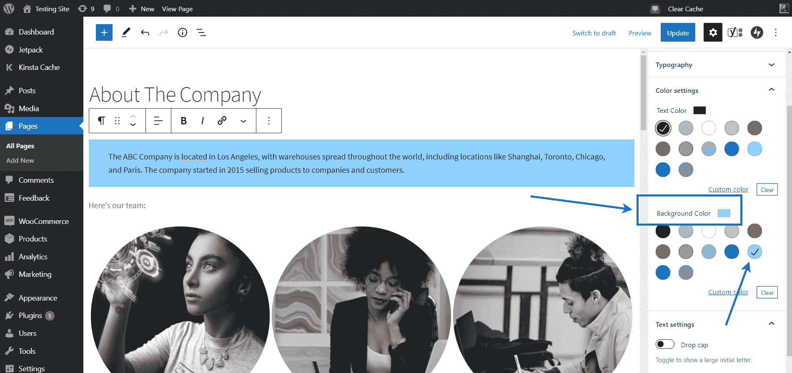

Choosing a background color


#### 给任何 WordPress 块添加颜色背景

如前所述，并不是所有的 WordPress 块都有这个内置的后台功能。如果你想制作一个不提供背景选项的图库或其他块元素，你应该怎么做？

最快的解决方案是使用 WordPress 中的**组**块功能。

为此，请选择内容中已有的多个块。对于这个例子，我将同时选择一个**段落**块和一个**画廊**块。

在出现的菜单上单击堆叠方形图标。

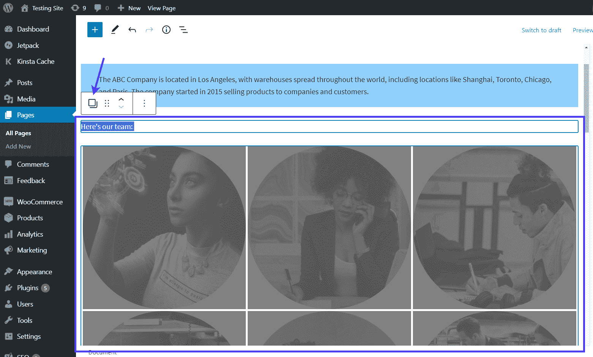

The ‘Our Team’ section on a page


在下拉菜单中选择**组**选项。

这会将你当前选择的所有块和[组合成一个组](https://kinsta.com/blog/wordpress-5-3/#editing-experience)，允许你一起移动或编辑它们，而不是单独的块。


Group the sections as a block


这将**组**设置为其自己的块。这意味着您可以到页面右侧的**块设置**选项卡找到它的设置。

找到**颜色设置**选项卡并点击。

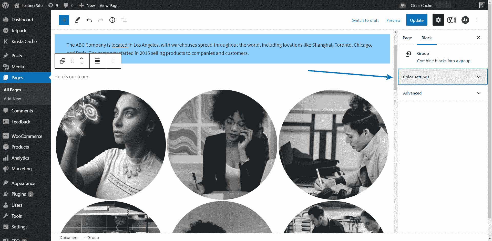

Change the ‘Color settings’ for the grouped block


与标准段落块非常相似，组块也有背景色功能。

在这种情况下，选择您最喜欢的颜色，以查看该组中的所有内容现在都应该具有该颜色背景。

组块的伟大之处在于，它采用另一个没有背景功能的块(如 Gallery 块),并允许您激活它的背景。

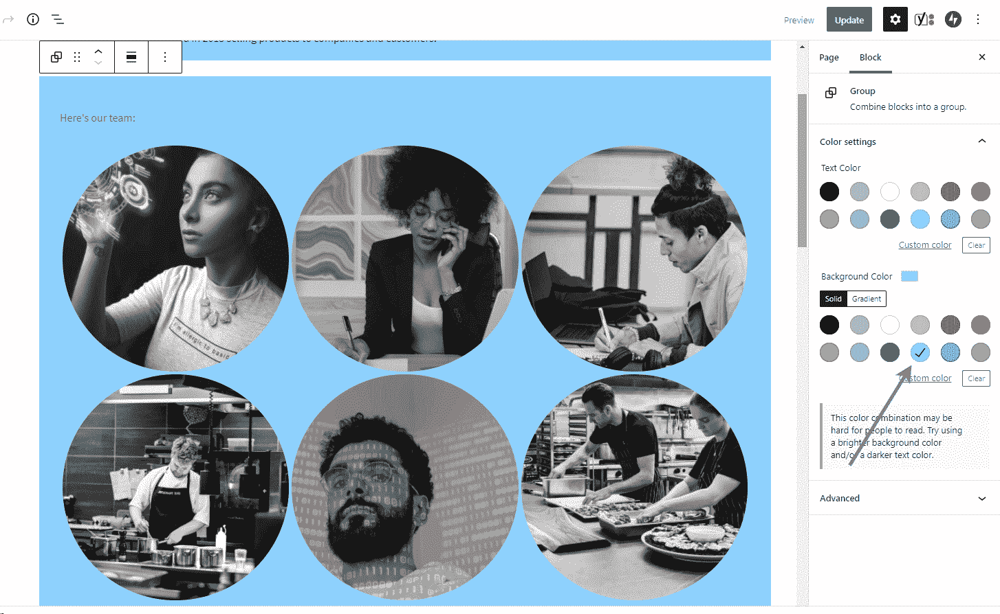

Setting the background color as blue


#### 给一个 WordPress 块添加一个图像背景

WordPress 块在页面和文章中都有。因此，我们可以在任一种情况下实施这种战术。你可以在分组块的背景上插入任何内容，或者只在一个 WordPress 块中插入。

要开始这个过程，点击**添加块**或 **+** 图标按钮，搜索**盖**块。

选择该块，将其插入到帖子或页面中。

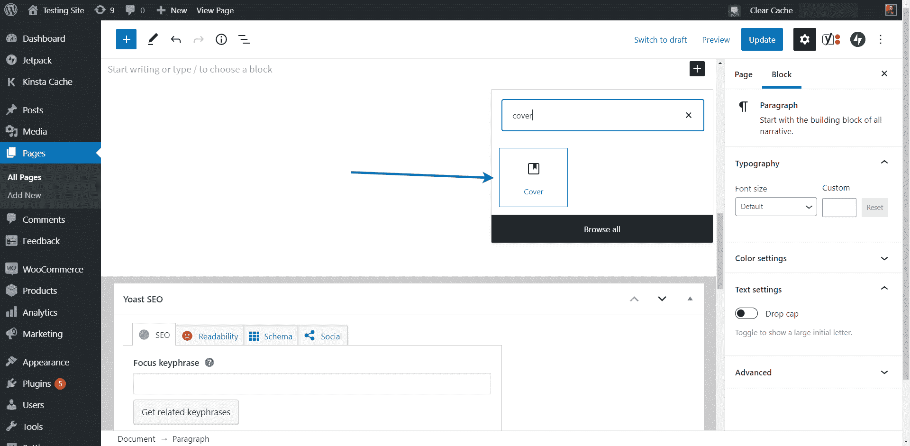

Adding a cover image block


然后，您必须点击**上传或选择媒体**按钮，这允许您搜索可用作背景的图像。

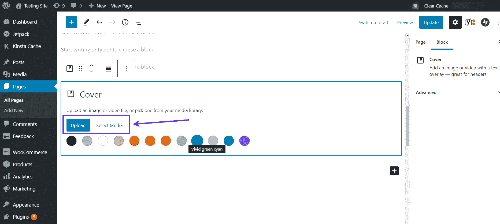

Click on the ‘Select Media’ button


选择您想要的图像并点击**选择**按钮。

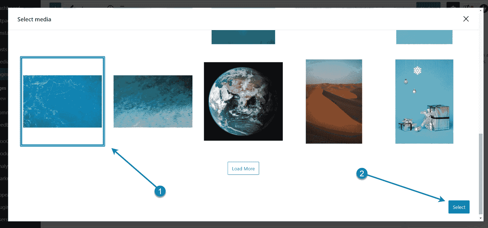

Choose the image and click the ‘Select’ button


现在，您可以看到该图像作为封面块的背景。

随意点击该块开始输入段落内容，因为主要功能是覆盖文本。

Cover block 的伟大之处在于它提供了几个[格式](https://kinsta.com/blog/best-text-editors/)选项，允许你在几秒钟内从一个标题跳到一个段落格式。

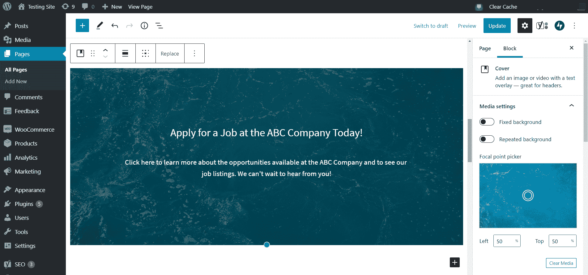

WordPress background image in section


要在该背景之上添加其他块，请单击封面块内的“ **+** ”图标按钮。您可能需要按一次回车键来显示按钮。


Click the plus sign within the block section


就像在普通文章中添加内容块一样，封面块允许你在 WordPress 中滚动浏览所有潜在的内容块。

这意味着你可以在封面块中放置一个图像、[图库](https://kinsta.com/blog/wordpress-photo-gallery-plugins/)、栏目或任何类型的 WordPress 块，使其成为一个单独块的图像背景的理想解决方案。

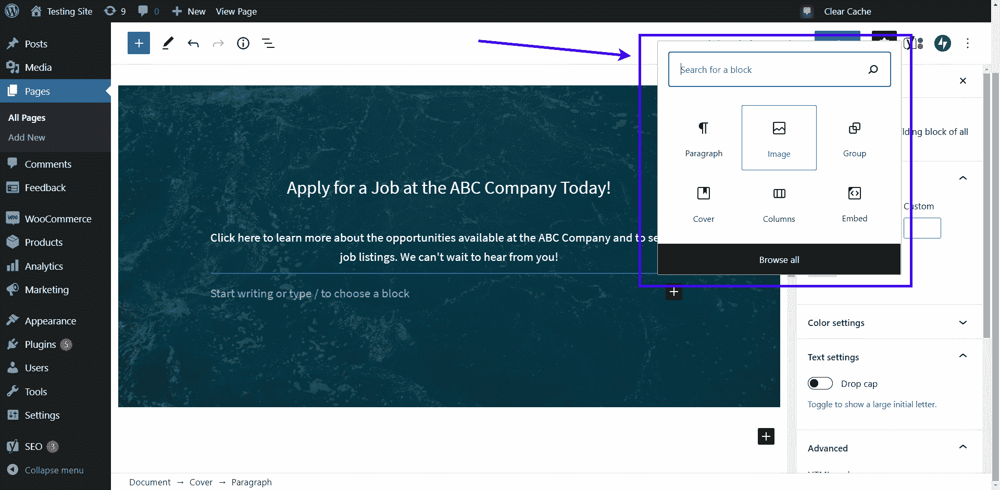

search for block


对于这个例子，我插入了一个图像，并对它进行了一些格式化，使它在封面块中看起来可以接受。

放置在背景前面的每个块在右侧的块选项卡中都有自己的自定义设置，因此在将它们放入封面块时，可以考虑对它们进行编辑。

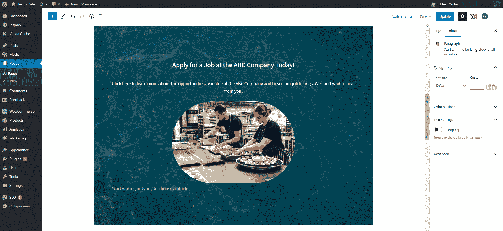

A block example with WordPress background image


有时，您可能想要编辑或自定义背景图像本身。如果是这种情况，选择封面块，然后转到页面右侧的块设置选项卡。

这将显示无数的设置来调整背景图像，包括以下内容:

*   固定背景
*   重复背景
*   焦点拾取器
*   规模
*   覆盖物
*   [不透明度](https://kinsta.com/blog/wordpress-menu-plugins/#responsive-menu)
*   先进的

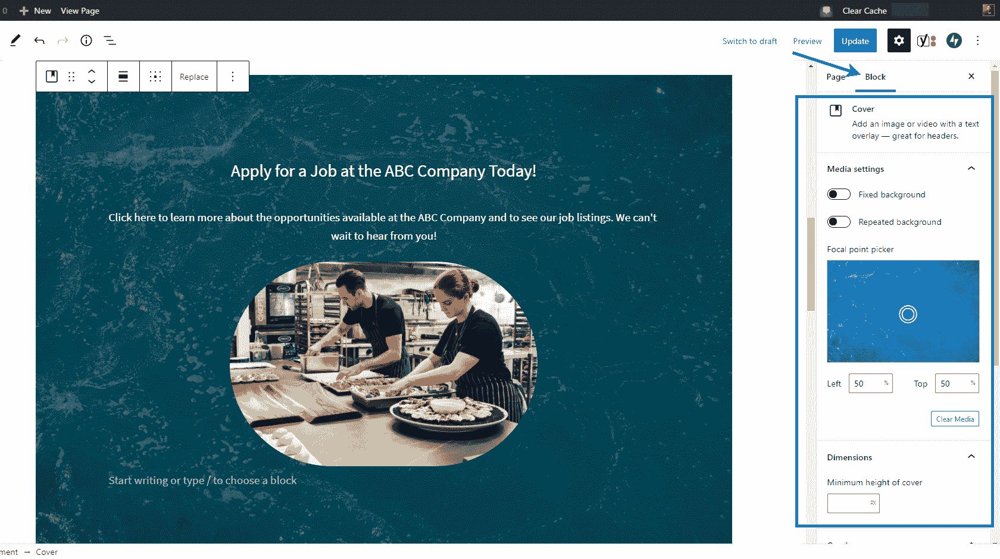

Changing the block settings


要考虑的一个更重要的设置是朝向**块设置**面板的底部。

向下滚动找到**叠加**部分。打开该部分以显示颜色叠层列表以及使这些颜色为纯色或渐变的选项。

这是一个伟大的选择，稍微改变你的背景颜色，以配合你的品牌或突出你的前景内容。你也可以调整**不透明度**以确保颜色覆盖不会完全淹没背景。

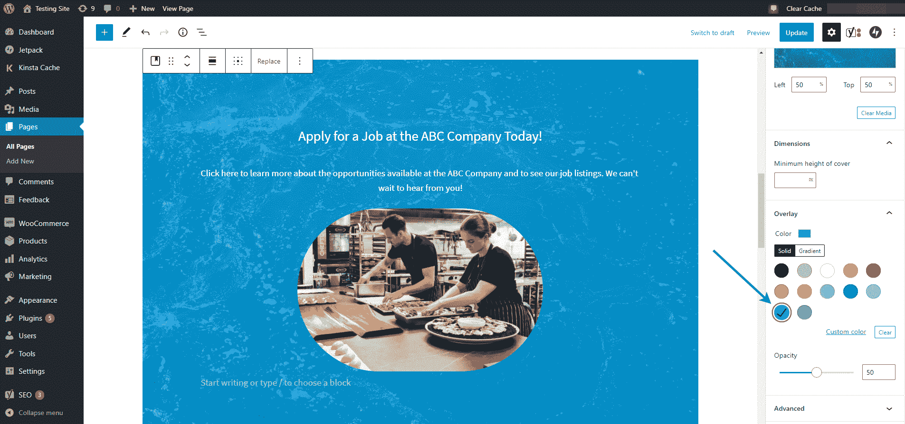

Changing the block’s background color


作为一种选择，考虑使用[可堆叠页面生成器 Gutenberg Blocks 插件](https://wordpress.org/plugins/stackable-ultimate-gutenberg-blocks/),为单个块打开更高级的背景工具。

### 如何在 WordPress 页眉后面放置背景图片

到目前为止，我们已经讨论了如何给你的整个 WordPress 站点添加背景图片，以及在特定区域如 WordPress 块、文章和页面添加背景的方法。但是包含你的菜单和标识的区域呢？

有时候，你所需要的只是标题后面的背景。

为标题[设置背景图片会给你的网站增加新的氛围](https://kinsta.com/blog/change-wordpress-theme/),特别是如果有一个节日或者一些你可以突出的大减价。

首先，进入 WordPress 仪表盘中的**外观>标题**。

**注意:**也可以到**外观>定制>表头**部分找到表头设置。

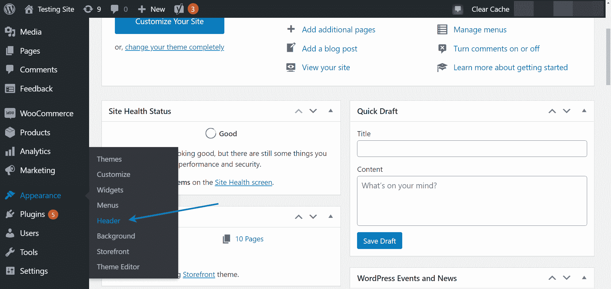

WordPress Dashboard > Appearance > Header


现在，你应该可以在屏幕的右侧看到你的主页的预览，同时在左侧看到标题设置。

标题模块解释了任何标题背景图片的首选尺寸，所以你可以选择在上传之前裁剪你的图片，或者等到你在你的 WordPress 仪表盘上看到图片。

在**当前表头**标题下，点击**添加新图像**按钮。

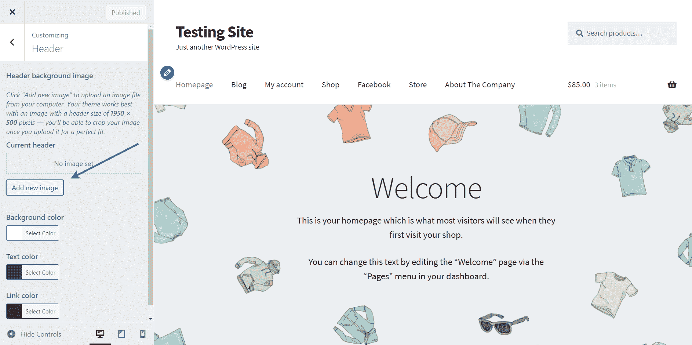

Click the ‘Add new image’ button


标题很棘手，因为你想确保所有的[链接](https://kinsta.com/blog/anchor-links/)和文本元素(更不用说你的 logo)在背景图片上看起来非常清晰。

因此，我们建议测试一下背景图片，考虑那些坚持纯色和纯色图案的图片。他们不会让你很难看到你的菜单项和标志。

选择一张看起来最适合你的图像，然后点击**选择并裁剪**按钮继续。


Choose an image


我们喜欢内置的裁剪工具，因为它可以自动为页眉背景图像提供合适的尺寸。与事先在 Photoshop 之类的软件中编辑照片相比，这应该会加快这个过程。

将裁剪框移动到对背景图像最有意义的位置。如果您需要进一步缩减图像，请随意拖动其中一个角。

一旦你有了完美的裁剪，点击**裁剪图像**按钮。

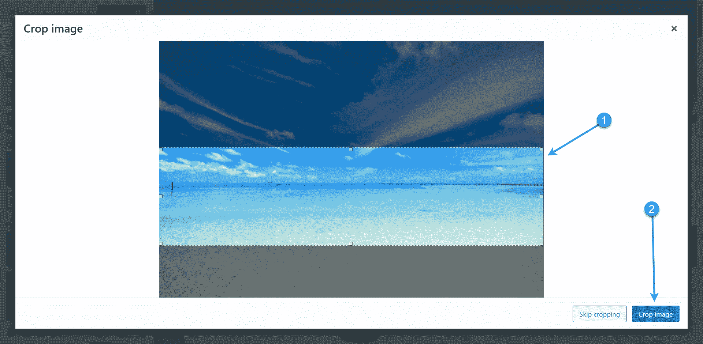

Crop the image


标题背景图片在 WordPress Customizer 预览版中立即被激活，帮助你准确地看到你的客户在这种背景下会看到什么。

您会注意到标题背景图像不会渗透到页面内容的其余部分。相反，它仍然在标题中，在任何当前位于那里的东西后面，像一个标志，标语，菜单和[搜索栏](https://kinsta.com/blog/wordpress-search/)。

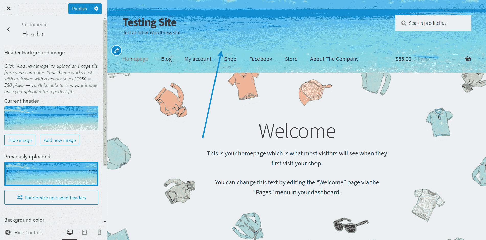

Select the header background image


标题背景的另一个选择是上传几张图片，让它们随机旋转，每当用户登陆主页时，给你的网站增加一点光彩和惊喜。

要做到这一点，你必须首先有几个图像上传到标题设置框。点击**添加新图像**按钮完成该过程。

一旦你有多张图片，点击**随机化上传的标题**按钮激活每次显示不同标题背景的功能。

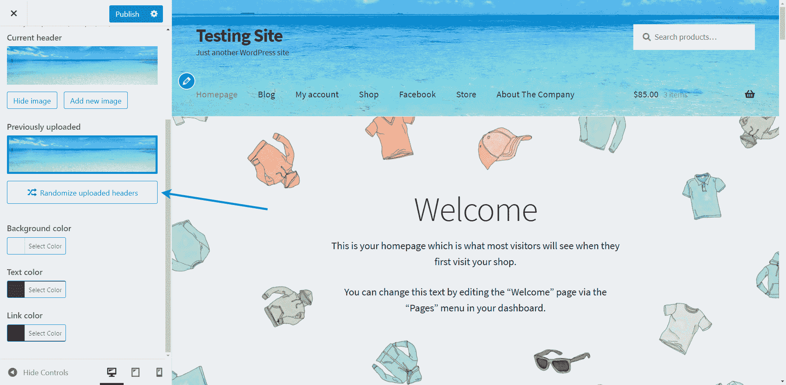

Adding more headers


您可能会注意到，在标题中添加背景图像会使某些标题项难以看到，比如您的菜单或购物车。

如果是这种情况，我们建议不要立即删除标题图像。相反，转到**文本颜色**和**链接颜色**字段，看看是否有任何调整可能有所帮助。

文本颜色设置控制页眉中没有超链接到其他内部或外部页面的任何文本。很多时候，这仅仅意味着标语，如果你有一个，但有时你可能有其他项目，如购物车总数或社交媒体图标也随着文本改变颜色。

另一个框用于链接颜色。当您调整此颜色时，您很可能会看到更多的变化，因为它包括链接到其他页面的所有菜单项。

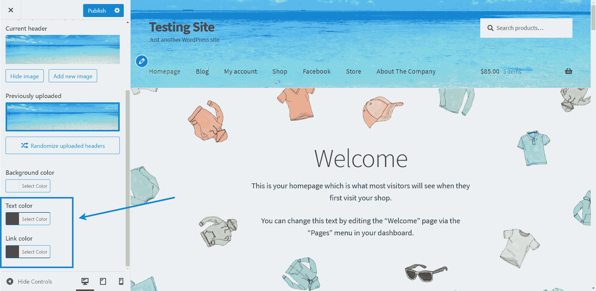

Text color over the WordPress background image


这里有一个例子，当你为**文本颜色**和**链接颜色**选择一种新颜色时会发生什么。您可以看到标语和网站名称发生了变化，菜单变成了白色，其他大部分标题元素也是如此，比如购物车图标。

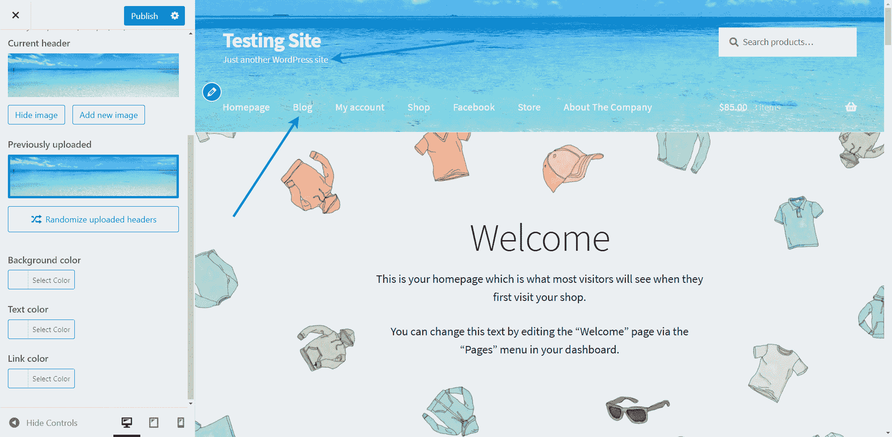

Checking the header elements


对于那些对使用背景图片不感兴趣的人，你也可以选择使用纯色背景。

为此，在同一标题设置区域下找到背景颜色字段。

点击**选择颜色**按钮，从颜色面板中选择，查看预览结果。使用背景色时，您也可以更改文本颜色。

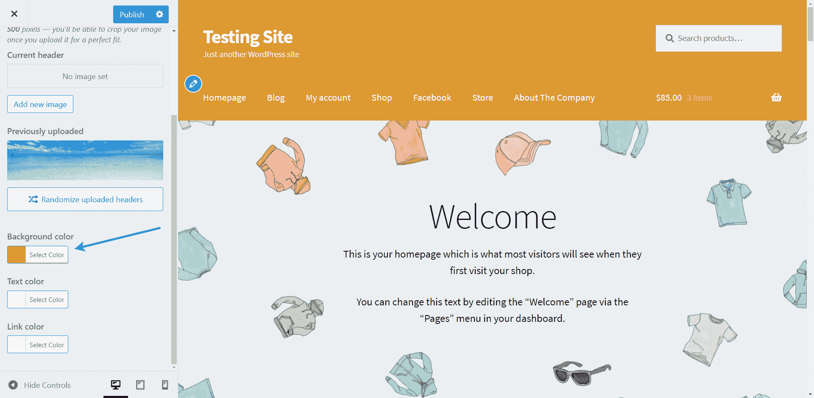

Setting a background color


在测试了什么最适合你的标题，并决定了那个标题的完美背景图像后，点击**发布**按钮让所有人都看到改变。

如果你在前端呈现修改有任何问题，考虑[清空你的 WordPress 缓存](https://kinsta.com/blog/wordpress-clear-cache/)。

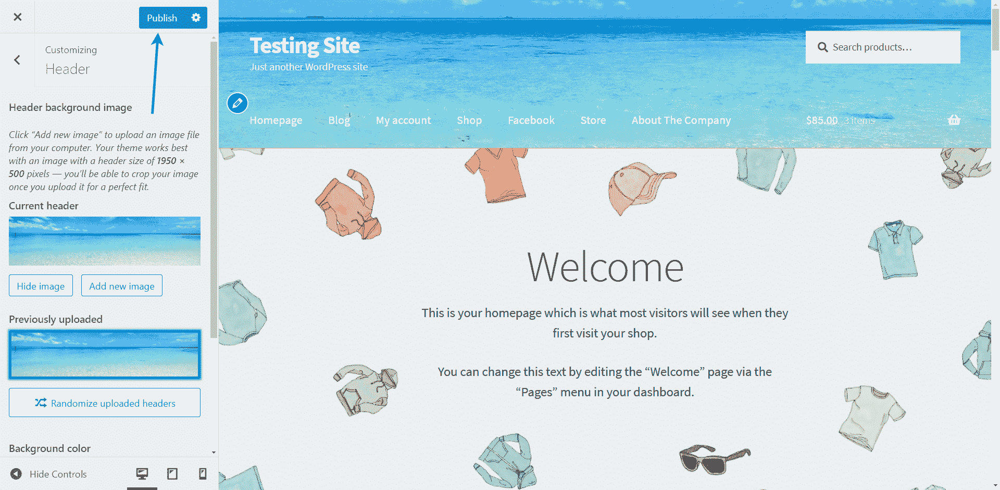

Click the ‘Publish’ button


### 如何给 WordPress 类别和登录页面添加背景图片


### 如何给 WordPress 类别添加背景图片

一个 WordPress 分类存档页面编辑了某个分类下列出的所有文章。例如，许多网站都有自定义帖子类型的类别，如产品。默认情况下，所有 WordPress 网站都有文章类别。那些你没有归类的会被标上**未归类的**类别。

由于类别归档页面聚集了相似的内容，因此在这些页面上包含相关的背景图片可以更好地展示类别。例如，您可能有一个面向技术的网页设计类别背景，或一个贝壳或海滩图案的旅游类别背景。

自定义 CSS 方法(如下所述)是最便宜的选择。然而，你也可以查看各种页面生成器和插件，看看它们中的哪些允许类别页面上的背景。

要用 CSS 完成这个任务，打开你的 WordPress 仪表盘，进入**外观>定制**。

选择**附加 CSS** 选项卡，打开允许输入您自己的 CSS 的模块。

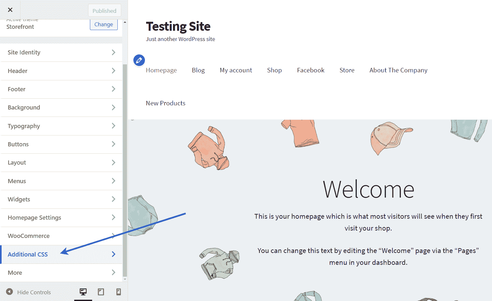

Go to the ‘Additional CSS’ section


在你的 WordPress 网站上打开一个你的类别存档页面。通常这些页面都有这样的 URL:`http://yourwebsitedomain.com/category/travel`。你需要将**旅游**部分改为你自己网站上的任何类别，并将**你的网站域名**部分改为你实际的域名。

右键单击类别页面上的任意位置，然后单击 Inspect。它将在您的浏览器中显示 Inspect 工具，并显示该页面的代码供您查看。

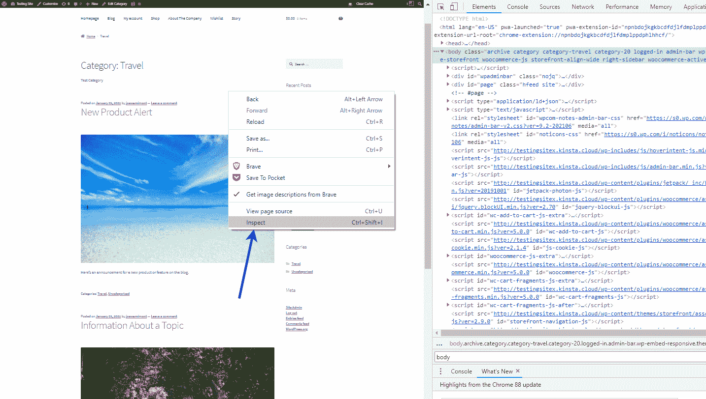

Right click on the webpage and select ‘Inspect’


搜索“body”或“class”来定位类别页面的 CSS 类，特别是这个类别的类。

对于这种情况，我们的 CSS 类是“category-travel”，因为我在网站上有一个名为“travel”的类别。

保存 CSS 标签以备后用。

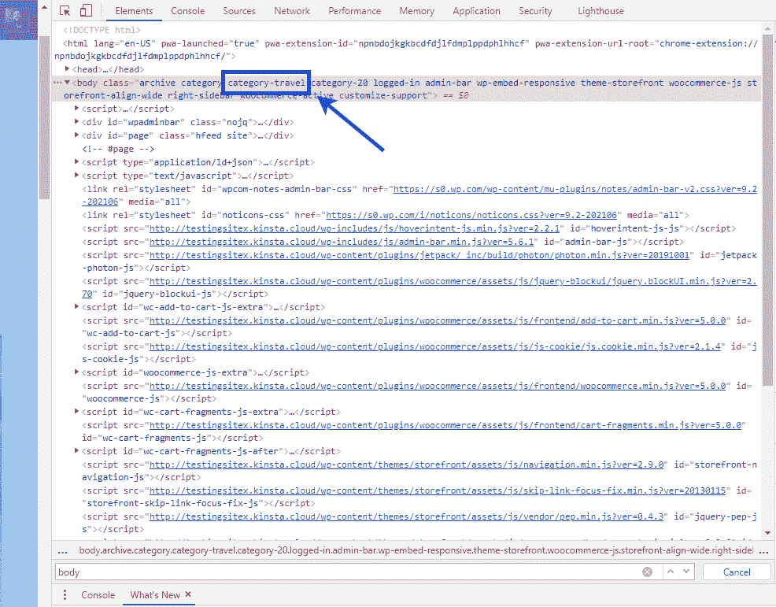

Note down the category listed


之后，导航回你的 WordPress 定制器中的**附加 CSS** 部分。

将下面的代码粘贴到那个框中，用你自己的替换掉`category-travel`类，并在显示`http://YOURIMAGEURL.jpeg`的地方放置一个真实的图像 URL。

```
body.category-travel {
background-image: url("http://YOURIMAGEURL.jpeg");
background-position: center center;
background-size: cover;
background-repeat: no-repeat;
background-attachment: fixed;
}
```

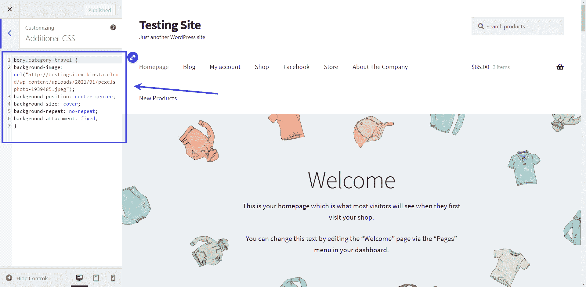

Add the custom coding for WordPress background image


点击**发布**按钮保存更改。

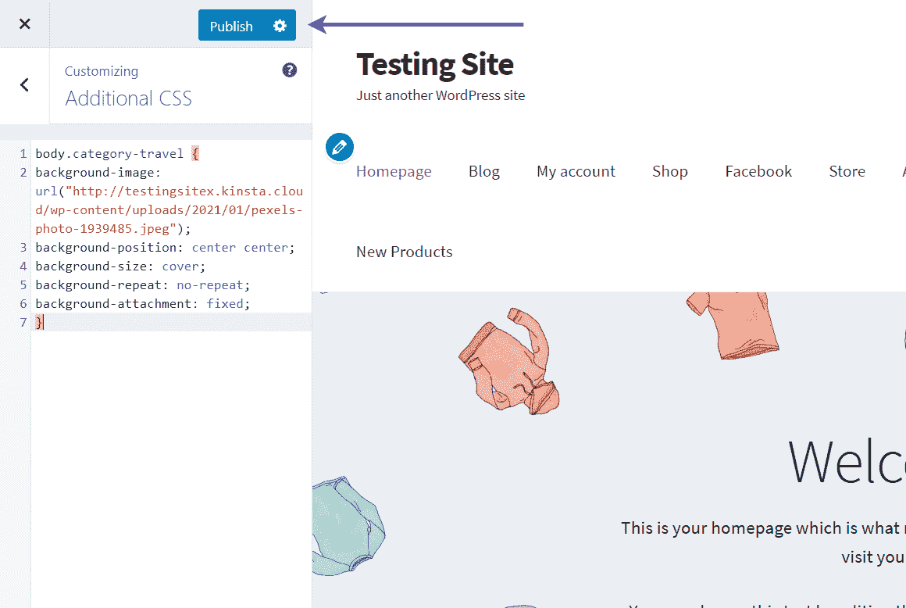

Adding the ‘Custom CSS’ code


最后，回到你的 WordPress 网站前端的分类存档页面。它现在应该显示与之前相同的页面，但背景在 CSS 代码中指定。如果你对 WordPress 背景图片格式有任何问题，切换回附加的 CSS 面板来调整元素，比如背景的位置、大小和重复功能。

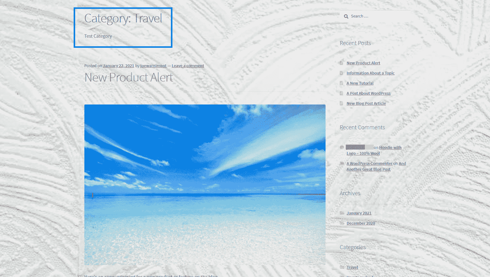

Go to the category page and see the background


### 如何给你的 WordPress 登录页面添加背景图片

WordPress 登录页面有两个版本:一个是给那些访问你的网站并想要注册和登录你的网站的普通用户的，另一个是给内部用户的，比如管理员和作者。

这些登录页面与你网站的主工作区是分开的(大部分文件位于 wp-login.php 的**文件中**)。因此，自定义背景图像工具不会渗透到登录模块中。

你可以通过使用一个名为[自定义登录页面定制器](https://wordpress.org/plugins/loginpress/)的插件来实现。首先，安装并激活你的 WordPress 站点插件。


LoginPress plugin


在左边，在 WordPress 仪表板菜单中为 LoginPress 显示了一个新的标签。

进入**登录按下>设置**。

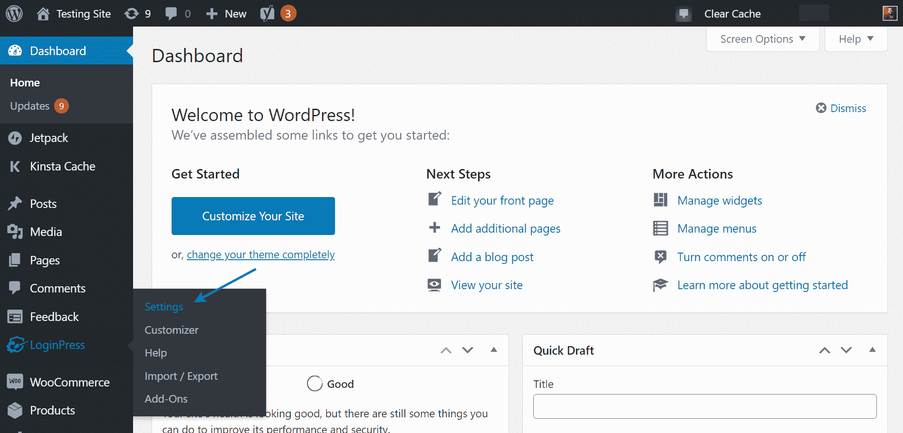

Go to LoginPress settings


在这里，您可以在添加背景和定制登录页面的任何其他部分之前调整插件设置。

例如，它提供了自动记住用户、显示自定义密码字段以及在一定时间后终止会话的设置。

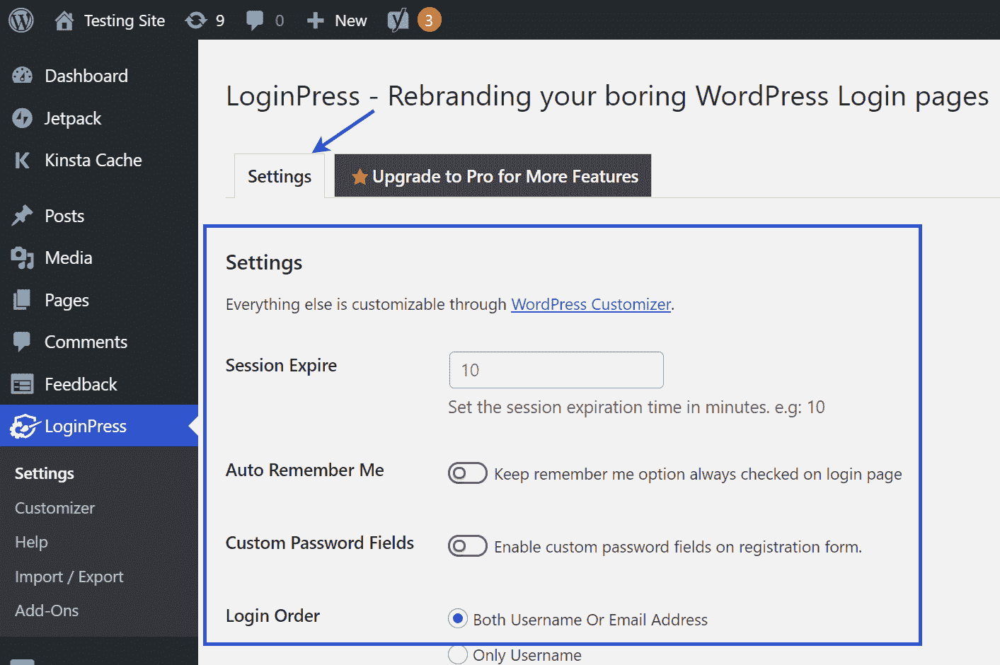

Changing the LoginPress settings


要激活登录页面的自定义图像背景，点击**登录按下>定制器**。

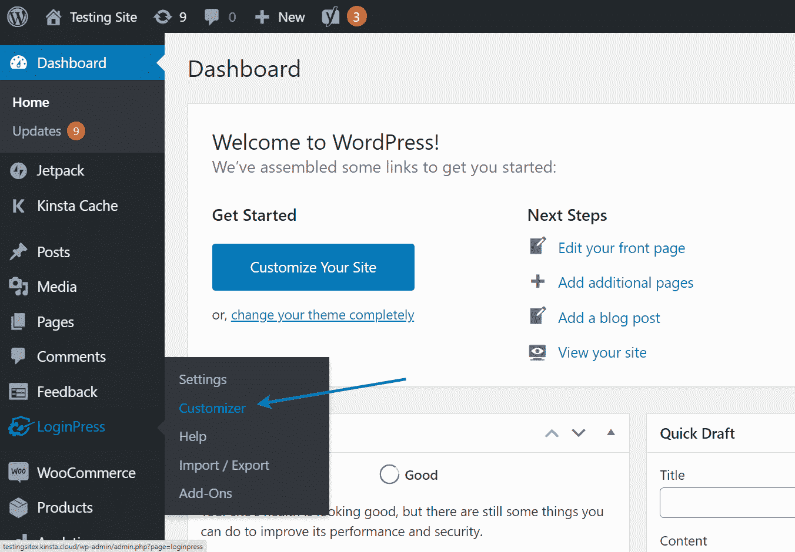

Go to ‘LoginPress > Customizer’


这将把你送到 WordPress 定制器，在这里为 LoginPress 工具添加了一个新页面。您会注意到主题、徽标、背景等标签。

也可以通过点击可视预览中的按钮来自定义登录页面。

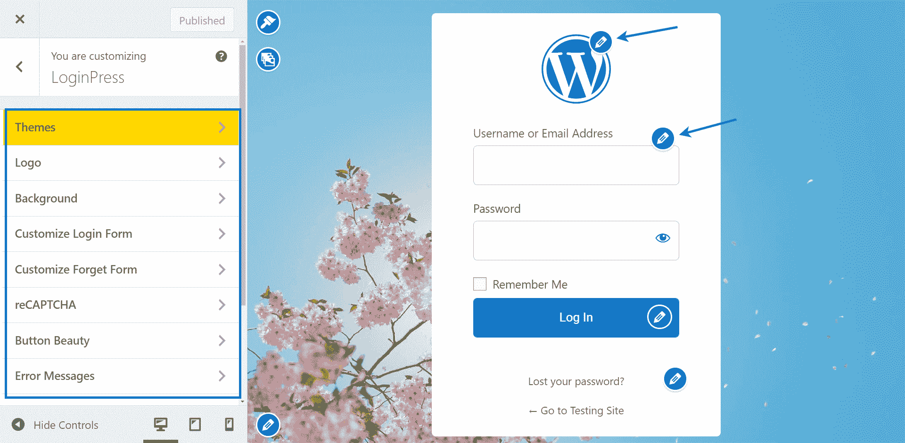

Setting a LoginPress theme


我们不会涵盖所有其他设置，因为我们现在主要关注背景。

点击**背景**标签继续。

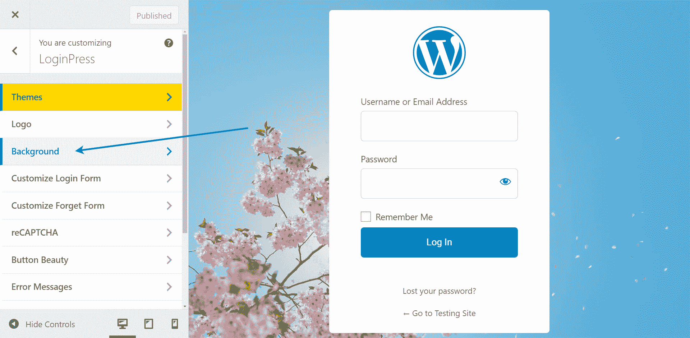

Go to the ‘LoginPress’ background tab


首先要决定你是想要彩色背景还是图像背景。

如果你想要一个彩色背景，定位**背景颜色**字段并点击**选择颜色**。这将显示一个颜色面板，供您选择最适合您业务的颜色。

正如你所看到的，这个改变也在 WordPress 定制器预览版中生效。

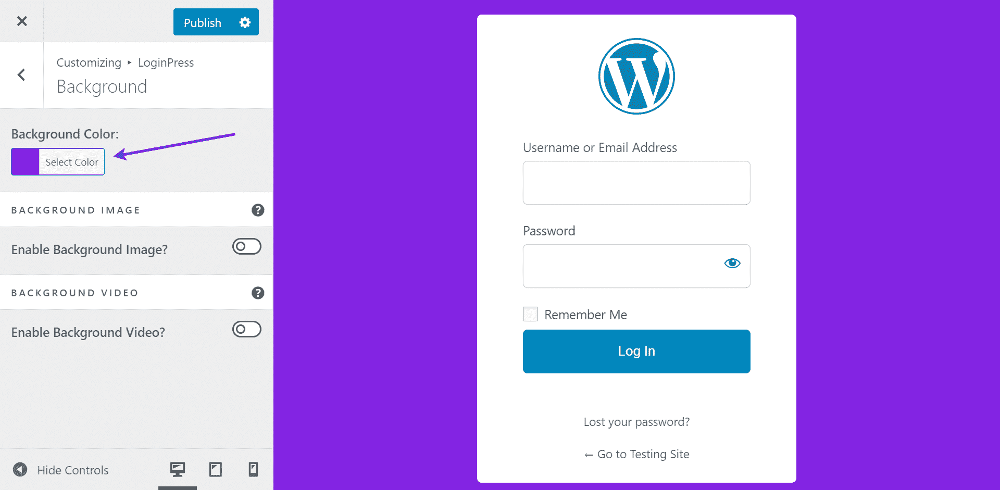

Select the ‘LoginPress’ background color


在**背景颜色**设置的正下方，有一个**背景图像**部分。

打开**启用背景图像**开关，显示一组预先制作的背景图像。

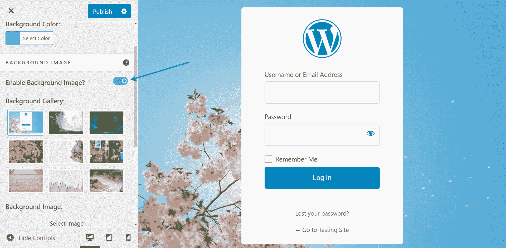

Enable the WordPress background image


免费版可供选择的并不多，但如果你决定升级到高级版，插件会增加更多。

继续测试这些预先制作的背景，看看它们是否适合你的品牌。

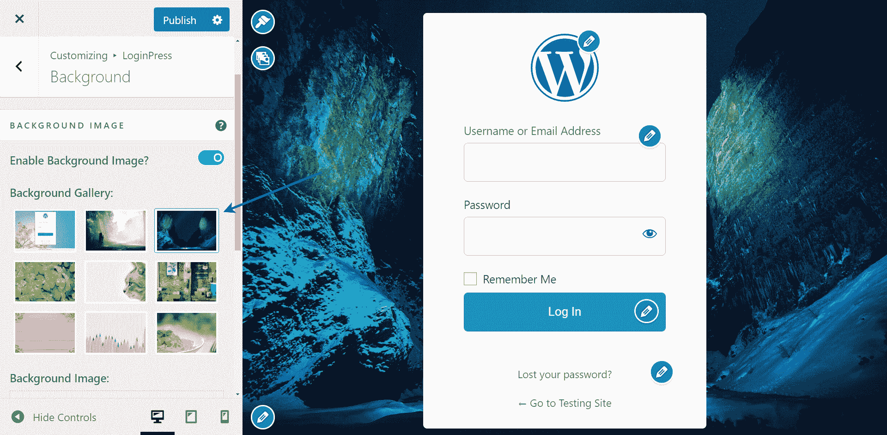

Setting a background gallery


更有可能的方法是上传你自己的图片作为登录页面的背景。

找到背景图像标题，点击**选择图像**按钮。

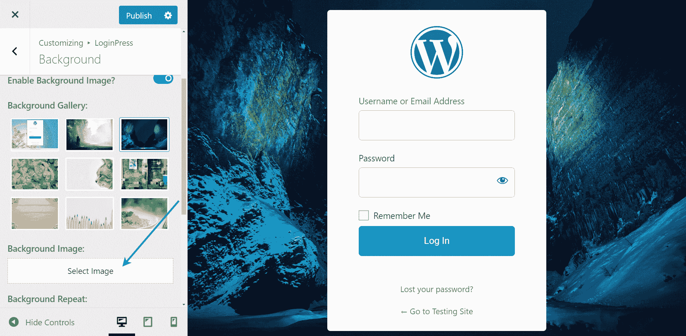

Choose the ‘Select Image’ option


你被带到 WordPress 媒体库，要么从你的电脑上传一张图片，要么从 WordPress 中选择一张图片。

选择您想要的照片并点击**选择图像**按钮。

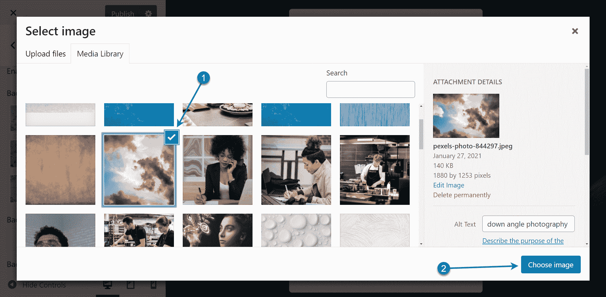

Choose the WordPress login background image


激活的背景图像在定制器面板和您的登录页面的实际预览中显示为缩略图。

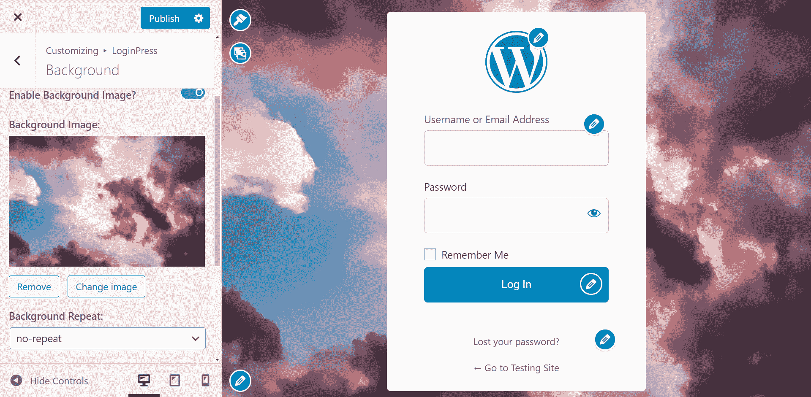

Set the background image options


您现在可以选择点击**发布**按钮，并坚持使用屏幕上的内容。或者，您可以向下滚动到附加设置，以确保上传图像的最佳视图当前处于活动状态。

点击**后台重复**下拉字段，测试**重复**、**不重复**和**重复-x** 等选项。

根据照片的大小，您可能会看到或看不到图像有一点移动。

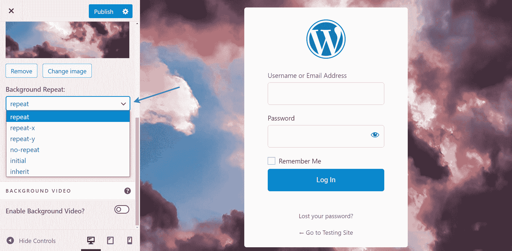

Choose the ‘Background Repeat’ settings


接下来，浏览选择位置选项，进一步移动背景图像。

默认情况下，它们把图像放在屏幕的中央，但是有时如果你把它放在右下角或左上角会看起来更好。尝试所有的方法，找出最适合你的背景图片的方法。

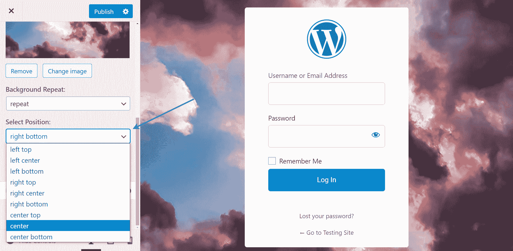

Select the Background position


向前看，WordPress 背景图片尺寸下拉菜单有图片如何覆盖屏幕空间的设置，用每个预置选项调整它的尺寸。

再次，测试这些来决定哪一个看起来最好。您可能会发现，像“包含”设置这样的设置提供了一个改进的视图，而不是“自动”或“封面”设置。

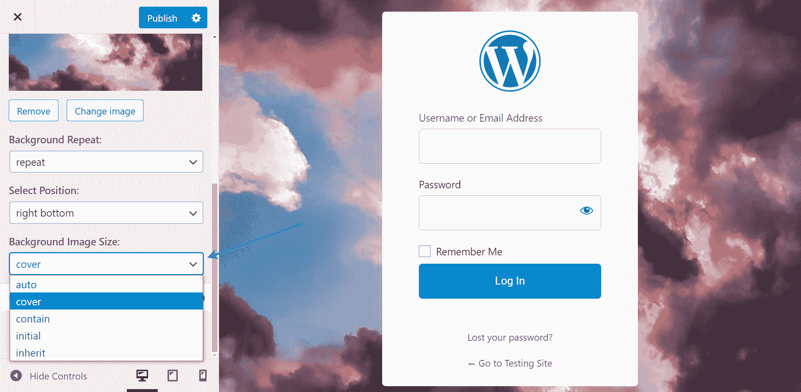

Set the WordPress background image size


这就是为你的登录页面上传和激活背景图片的全部内容！

如果你想显示一个视频作为背景，而不是一个图像，最后的设置就在那里。如果您有一个与您的业务相关的有趣视频，并且不会吸引登录该网站的人太多的注意力，请打开该设置。

## 注册订阅时事通讯


### 想知道我们是怎么让流量增长超过 1000%的吗？

加入 20，000 多名获得我们每周时事通讯和内部消息的人的行列吧！

[Subscribe Now](#newsletter)

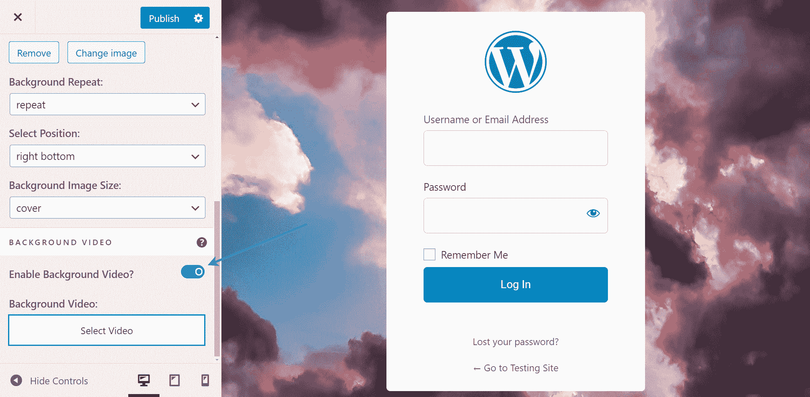

Enabling ‘Background Video’


完成所有工作后，点击 **Publish** 按钮打开您的登录页面背景，每当用户试图注册或登录该网站时，就会看到它显示出来。

### 如何给你的导航菜单添加背景图片

你可能已经注意到一些网站有包含背景图片或图标的精美菜单。这是电子商务世界中的常见做法，品牌可能有一个大型菜单，其中有类别和每个类别按钮的背景图像。

如果你对给你的菜单添加背景感兴趣，看看我们关于最好的 WordPress 菜单插件的文章。这些菜单插件中的许多都提供了在菜单中包含图像和颜色背景的选项。

鉴于有几个插件可以为导航菜单添加某种背景，我们将提供两个教程，其中一个允许在你的子菜单后面添加背景。相比之下，另一个给你的手机菜单增加了背景。

要给不同的子菜单添加背景图片，安装并激活 [WP 巨型菜单插件](https://wordpress.org/plugins/wp-megamenu/)。这个插件允许你激活和管理一个多级下拉菜单。这是大型在线商店的理想选择，但它也适用于较小的菜单，尤其是当你想添加背景图片或图标时。

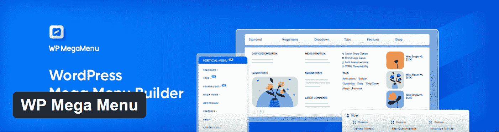

WP Mega Menu plugin


首先在 WordPress 仪表盘中找到 WP Mega 菜单标签。

点击**主题**菜单项。

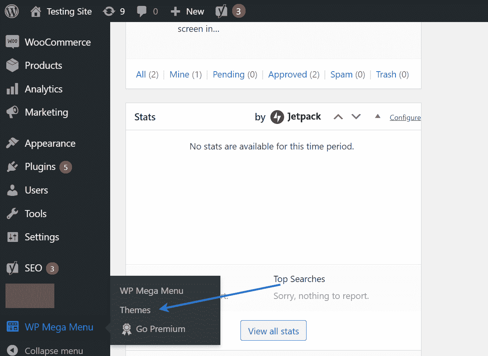

Go to the ‘Themes’ panel


在这里，你可以看到插件为你的菜单创建的默认主题列表。

您可以点击编辑任何主题或从头开始添加您自己的设计。

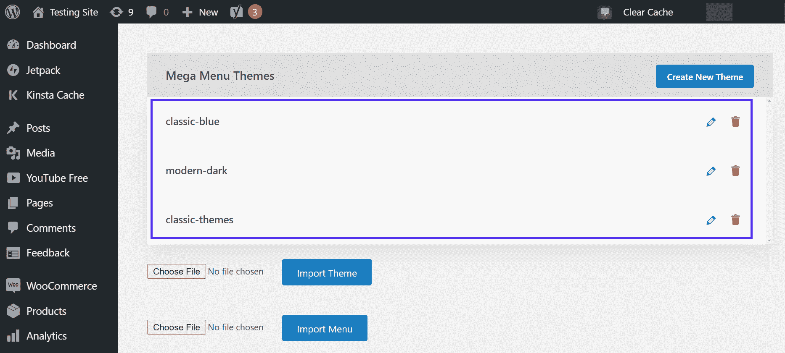

The many Mega Menu Themes


每个主题都有自己的设置，您可以在其中指定主题标题、菜单栏选项和品牌徽标等元素。从下拉菜单到子菜单，菜单的每个部分都是可定制的。

但是，对于菜单背景，你只需要知道你想选择哪个主题。

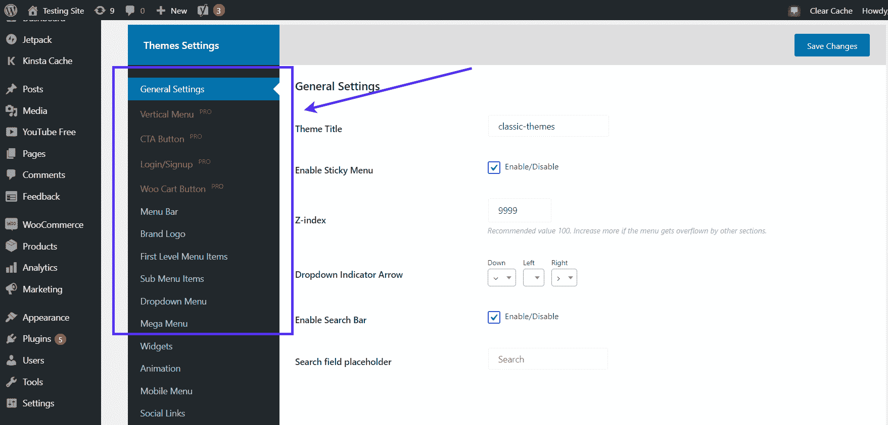

Set the Mega Menu theme settings


进入仪表板中的**外观>菜单**。

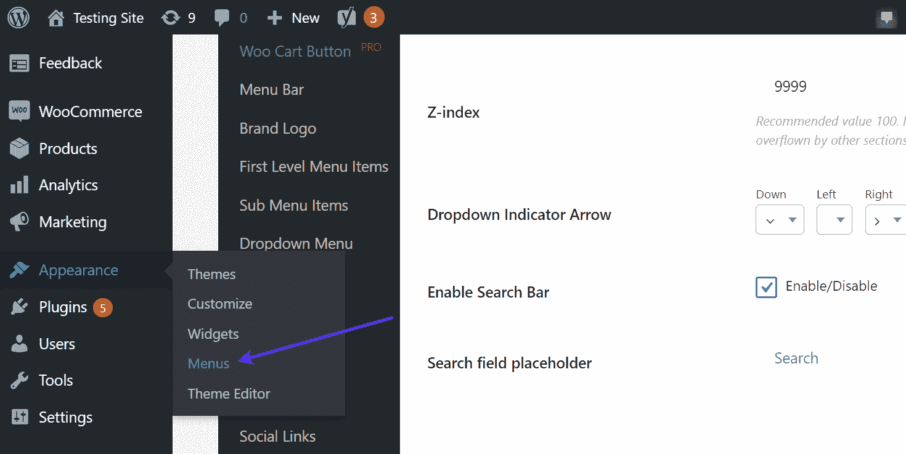

Go to ‘Appearance > Menus’


你会看到一个新模块链接到**大菜单设置**。

点击**启用**大菜单，然后为你的网站选择你最喜欢的菜单。

最后，点击**保存**按钮。

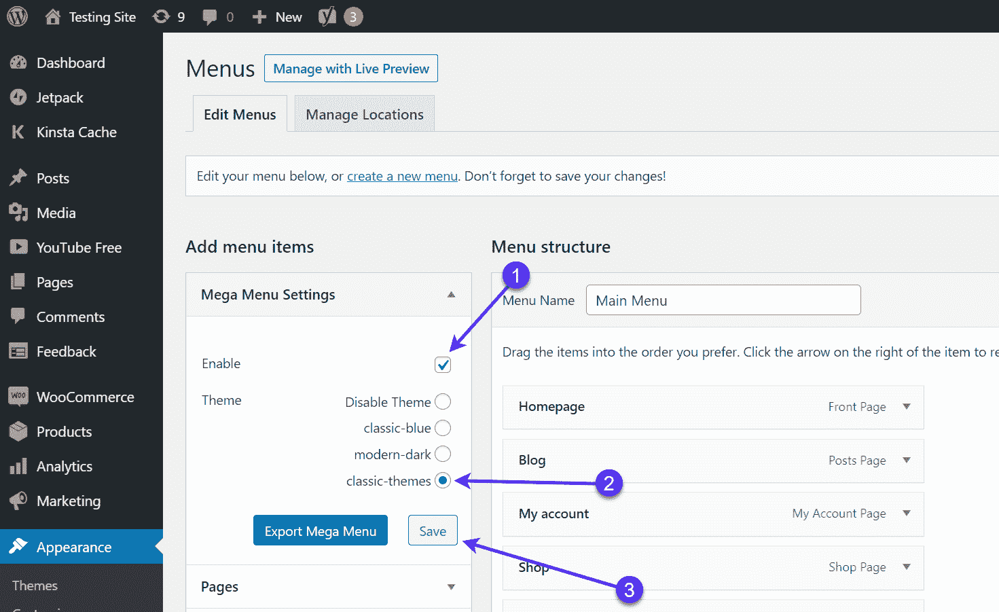

Click the ‘Enable’ button


现在，将注意力转移到**菜单结构**区域。

在你当前的任何菜单项上滚动会显示一个 **WP 大菜单**按钮。这是您为每个下拉部分定制布局和设计的地方。

点击 **WP 大菜单**按钮，选择您想要的菜单项。在这种情况下，我们将添加一个下拉菜单到商店标签。

**注意:**我们假设你已经在你的 WordPress 站点上配置了一个菜单。如果你需要帮助，请阅读我们的 [WordPress 下拉菜单指南](https://kinsta.com/knowledgebase/wordpress-dropdown-menu/)。

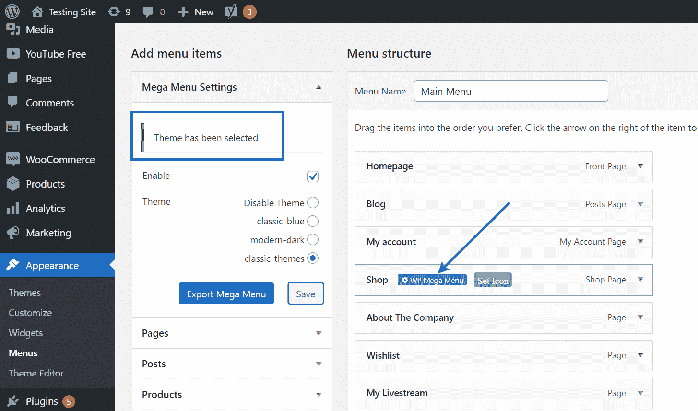

Add the mega menu to your site


在新的弹出窗口中，翻转开关以打开该特定菜单项的大菜单。

然后，您可以添加一个下拉行，并从左侧拖动一些小部件到该行中。例如，我们将拖动产品列表，这样当有人滚动商店菜单项时，它们就会显示出来。

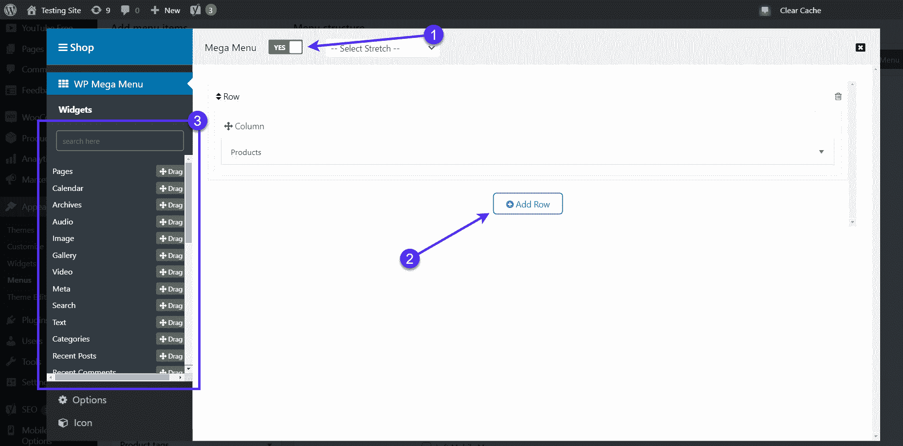

Click the ‘Add Now’ button


要给这个下拉区域添加背景，点击左下角的**选项**按钮。

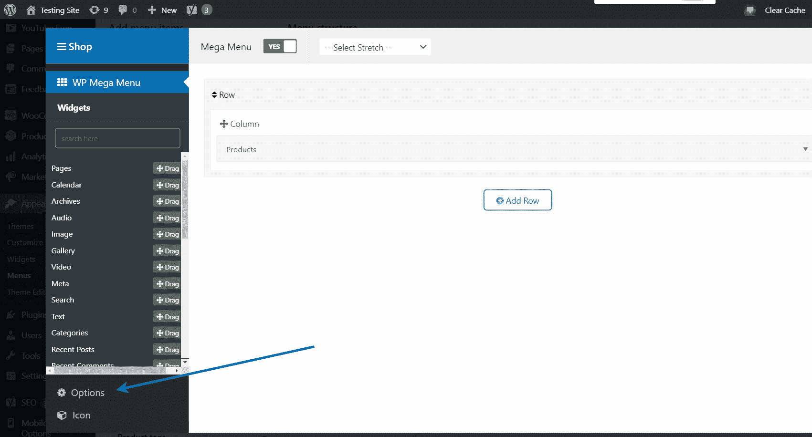

Choose the ‘Options’ link


找到**上传背景图像**字段。

点击**上传**按钮，在您的媒体库中找到合适的照片用作背景。

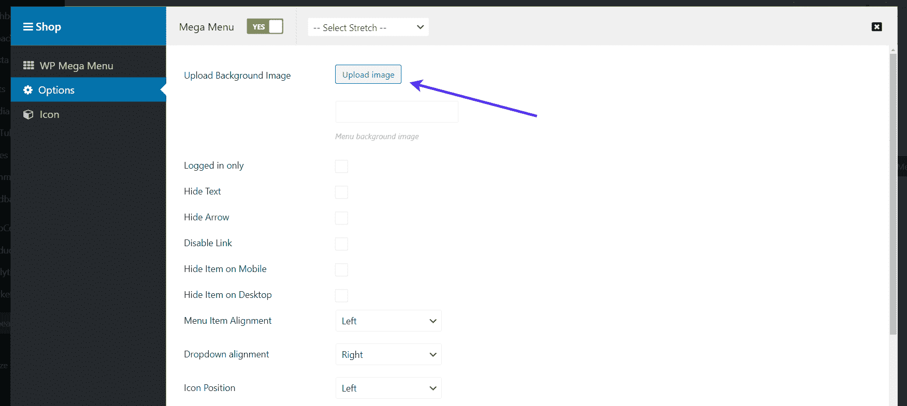

Select the ‘Upload Image’ button


从媒体库中选择图像后，会出现一个图像缩略图。

还有一些其他的设置需要考虑，所以如果你想的话，请随意检查。

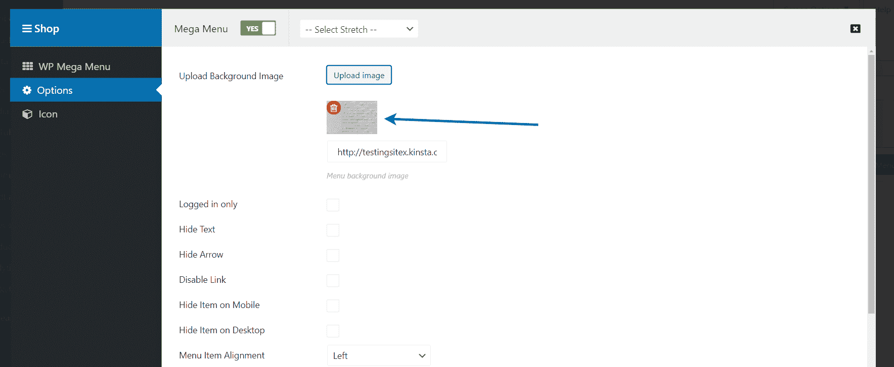

Verify the thumbnail


确保点击**选项**面板底部的**保存更改**按钮。

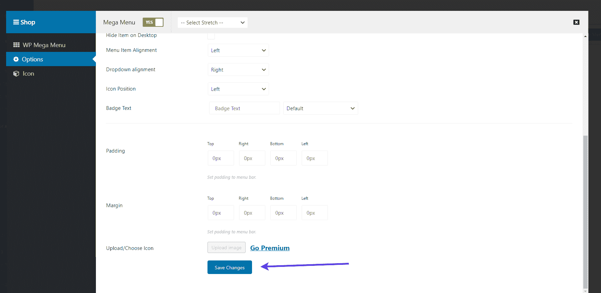

Click the ‘Save Changes’ button


你还需要在 WordPress 仪表盘的菜单结构区域点击保存菜单返回。

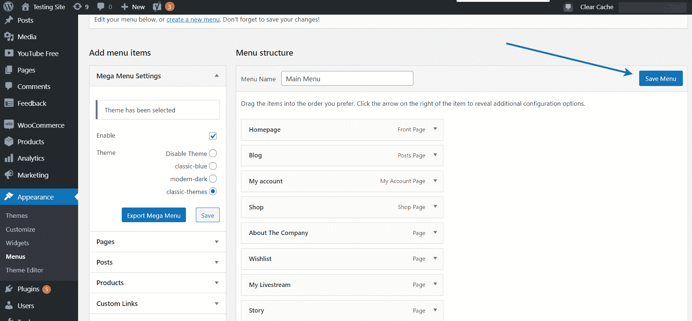

Click the ‘Save Menu’ button


现在，导航到你的网站的前端来查看菜单。如果您滚动我们刚刚定制的项目，您应该会看到一个带有背景的下拉部分。

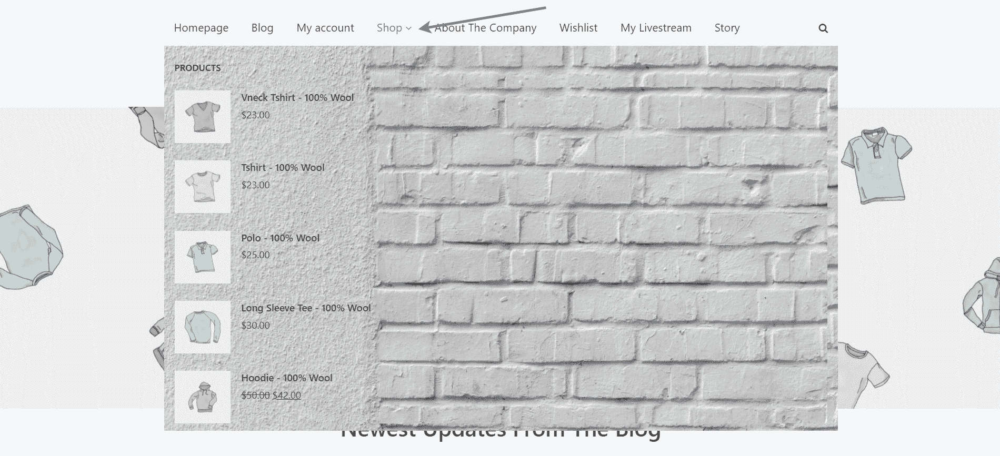

The menu now has a background image


将背景图像添加到菜单的另一种方法是使用移动响应菜单，当有人通过移动设备访问您的网站时，该菜单会显示出来。

你可以借助 [WP 手机菜单](https://kinsta.com/blog/wordpress-mobile-plugin/#wp-mobile-menu)插件在手机菜单后面放置一个背景。

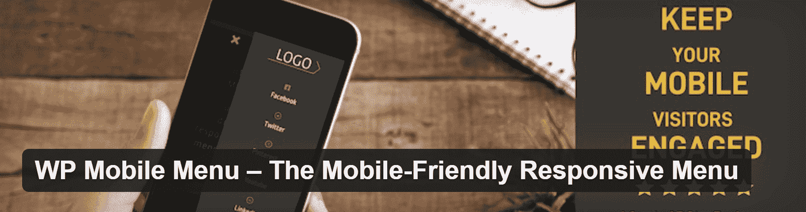

WP Mobile Menu plugin


安装并激活 WP 手机菜单插件后，进入 WordPress 仪表盘中的手机菜单选项。

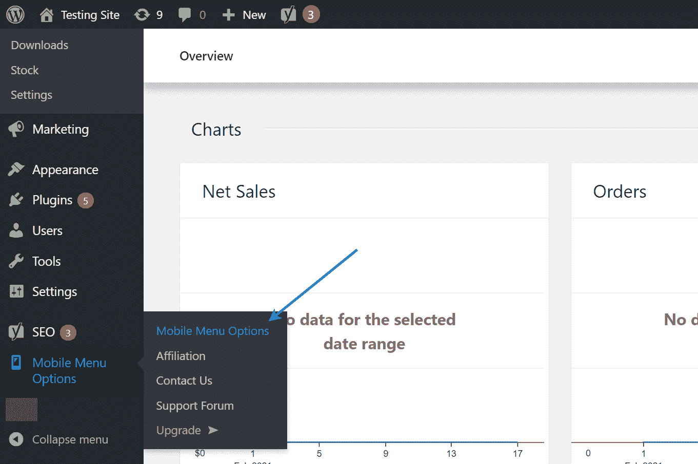

Go to the ‘Mobile Menu Options’ link


该插件提供了几种方式来配置您的手机菜单。一般的要求是启用一种菜单格式，并指出你想为那个移动菜单使用哪个 WordPress 菜单。

例如，我们可以点击**启用左侧菜单**开关(打开位于屏幕左侧的移动菜单)并从**左侧菜单**下拉菜单中选择**主菜单**选项。这将我们当前的主菜单与移动菜单链接起来，因此访问者可以看到相同的标签。

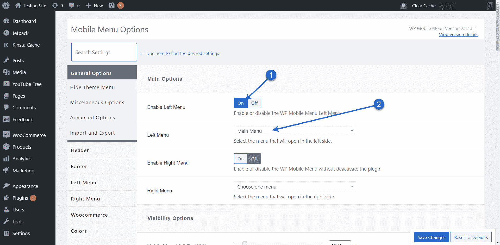

Set the mobile menu options


这取决于您创建的移动菜单的类型，但由于我们正在制作左侧菜单，我们可以单击左侧菜单选项卡来显示添加背景的适当设置。


Choose the left menu settings


向下滚动到**面板背景图像**栏，点击“ **+** ”符号打开媒体库。

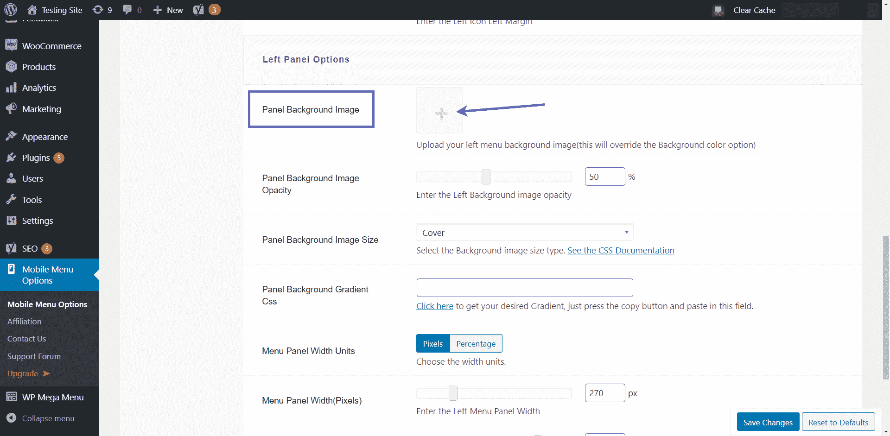

Adding a mobile menu background image


从媒体库中选择一幅图像，并将其添加到字段中。

作为确认，您应该会看到背景图像的缩略图。

选择**保存更改**按钮激活背景。

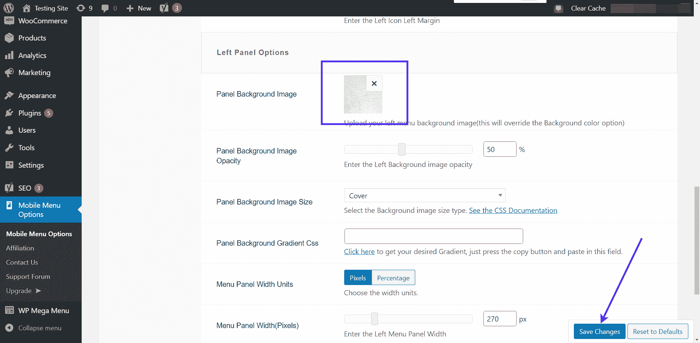

Verify the background image with the thumbnail


看看这个插件是如何生成移动菜单的，只有当你的浏览器设置为窄宽度或者当你通过手机或平板电脑访问你的网站时，菜单才会出现。

新菜单合并在一个汉堡图标下(三条水平线)。

单击该按钮以测试带有背景的新菜单。

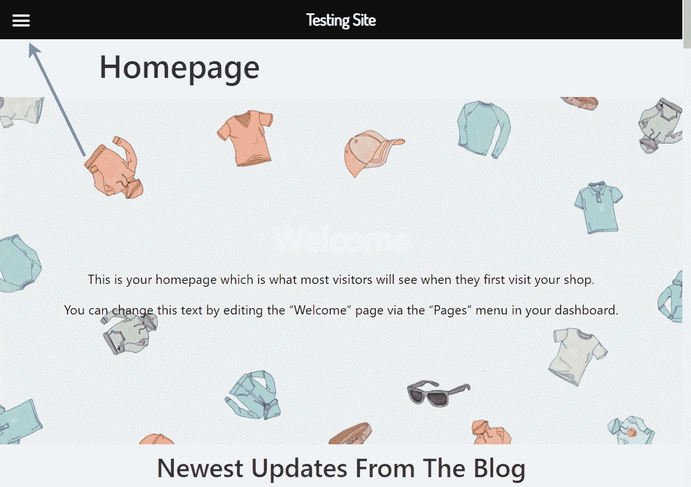

Click the hamburger menu icon


如截图所示，背景被放置在整个移动菜单的后面，让每个人都能看到。

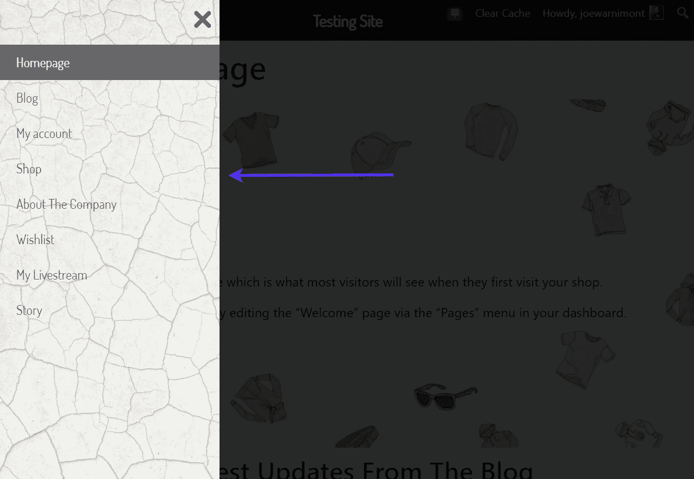

Mobile menu with a background Image


### 如何给维护页面添加背景图片

所有网站偶尔都需要维护，有时维护需要很长时间，显示维护页面会有所帮助。

在使用[维护页面](https://kinsta.com/blog/wordpress-maintenance-mode/)时，背景图像起着很大的作用。大多数维护页面由全屏背景图像组成，可能还有一些文本或更多资源的链接。

如果您已经有了一个维护页面，并且它不包含背景图像，那么考虑以下步骤，以便在您可能需要关闭您的网站一段时间时，为其创造一个美丽的环境。

在[维护插件](https://wordpress.org/plugins/maintenance/)的帮助下，您可以将背景图片添加到维护页面。在你的网站上安装并激活插件。

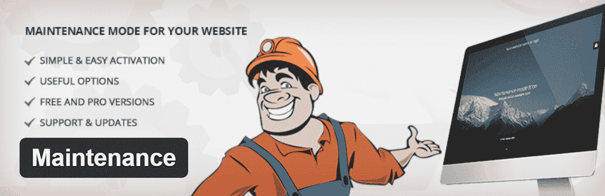

Maintenance plugin


一旦激活，找到仪表板顶部的**维护开/关**按钮。

点击按钮进入维护插件的设置页面。

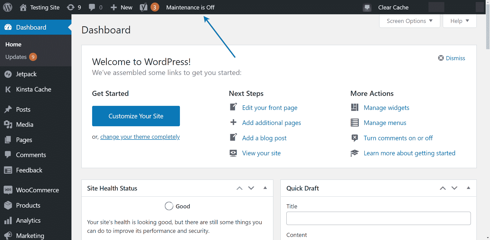

Click the ‘Maintenance is off’ link


另一种进入设置页面的方法是点击仪表板侧面菜单中的**维护**菜单项。

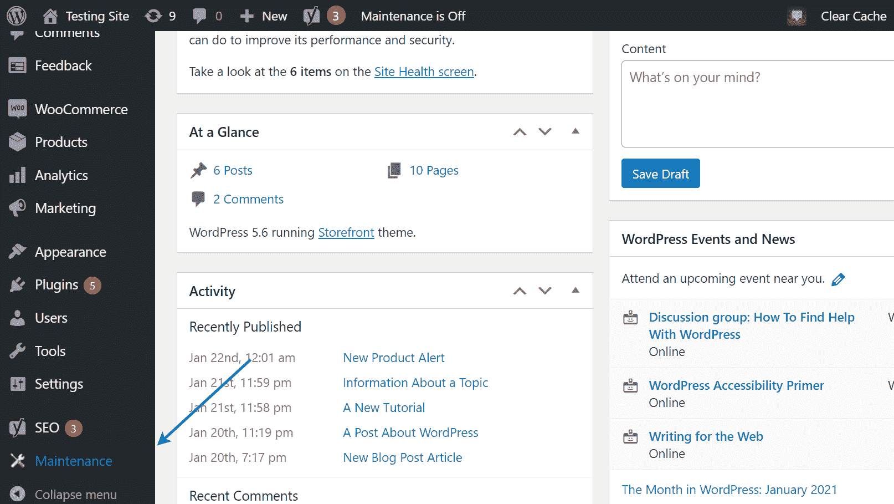

Click the ‘Maintenance’ menu item


维护插件的设置页面有一个不错的选项集合可以定制，但是要考虑的主要区域是**通用设置**模块。在这里，你可以写一个标题和描述，这两者都作为文本覆盖在我们将要插入的背景之上。

页面标题显示在浏览器选项卡中，所以您也应该考虑自定义它。

从维护页面到即将发布的页面，你都可以使用维护插件，所以你可以输入类似“我们的网站正在维护”这样的内容，或者你可以显示一些关于你的公司的信息，包括一个表单，让人们输入他们的电子邮件地址。

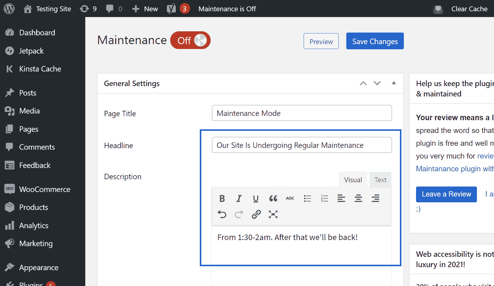

Adding a headline for the maintenance page


接下来，插件提供了一个上传你的标志的选项，它也覆盖在背景图片的上面。

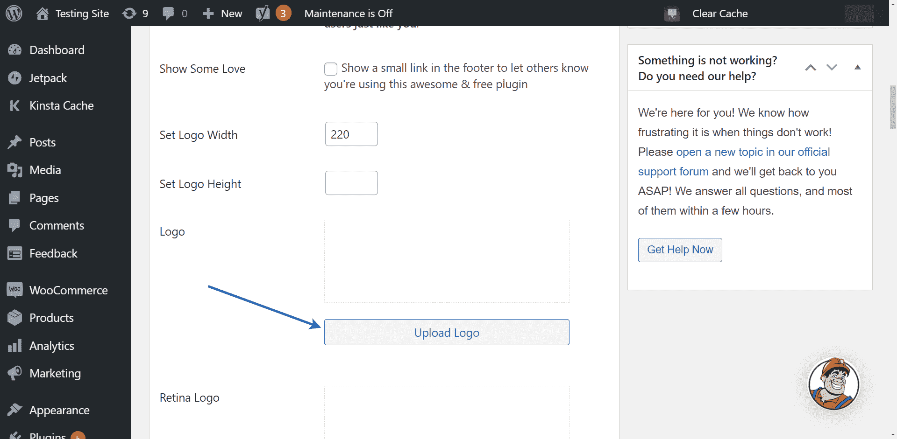

‘Upload Logo’ button


点击**上传徽标**按钮，选择您的徽标，在仪表盘中查看其缩略图。

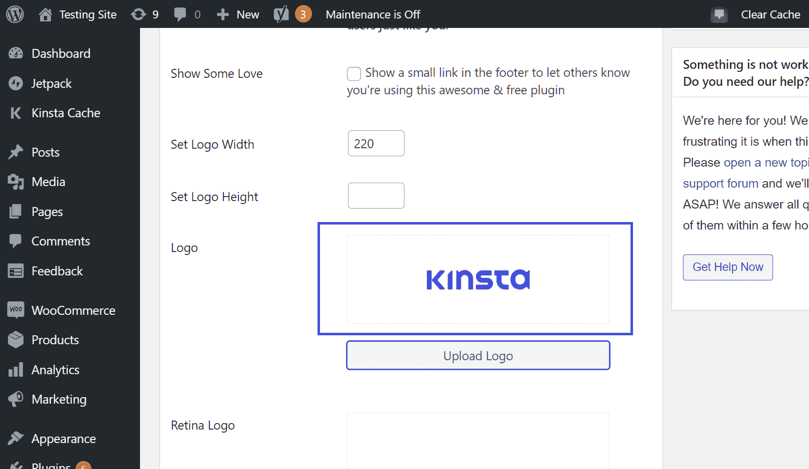

Logo for the maintenance page


最后，背景图像字段要求您单击上传背景图像。

从你的电脑上传一张图片，或者通过你的媒体库找到一个适合维护页面的背景。

**注意:**最好的维护背景图像是大尺寸、高分辨率和横向的。在下面的设置中有一个“肖像模式”背景选项。

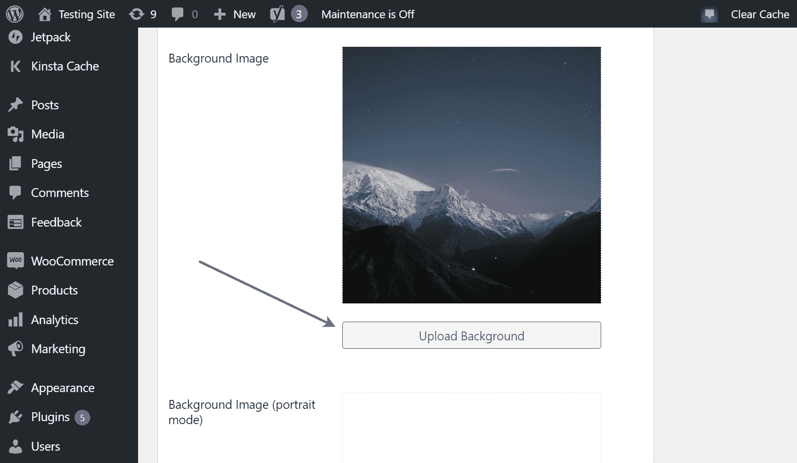

Click the ‘Upload Background’ button


选取背景后，它会在仪表板中显示为较小的缩略图预览。

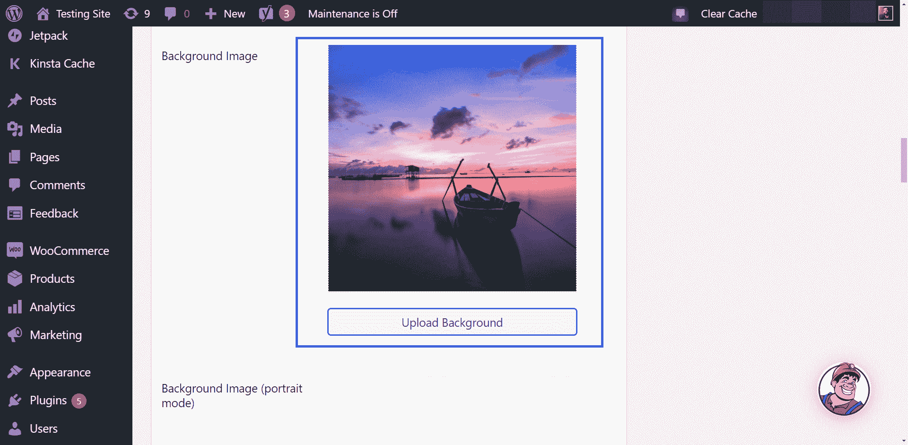

The background image thumbnail


虽然横向的背景图片对于桌面电脑和更宽的屏幕来说最有意义，但是很多人最终会在你的网站上使用纵向的屏幕，就像手机被垂直拿着一样。

因此，更宽的背景图像看起来不会那么好看。这就是为什么插件提供了一个肖像模式的背景图像作为替代，当用户使用肖像方向的屏幕访问页面时，它会相应地切换进来。

在该字段中包含图像非常重要，因此点击**上传图像以进行人像设备定向**按钮。

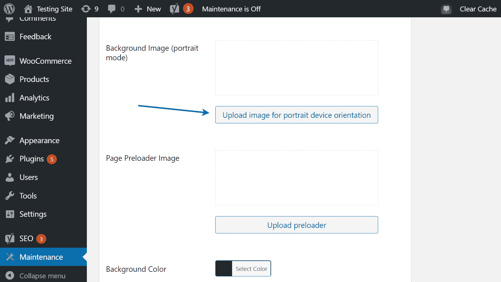

Upload a portrait orientation background image


这一次，找到一个高度大于宽度的图像(纵向模式)。你可以随时裁剪原始背景图像，使其成为一个肖像，或者你可以选择上传一个完全不同的图像，以填补现场。

突出显示您想要的图像，点击**选择图像**按钮将其插入仪表板。

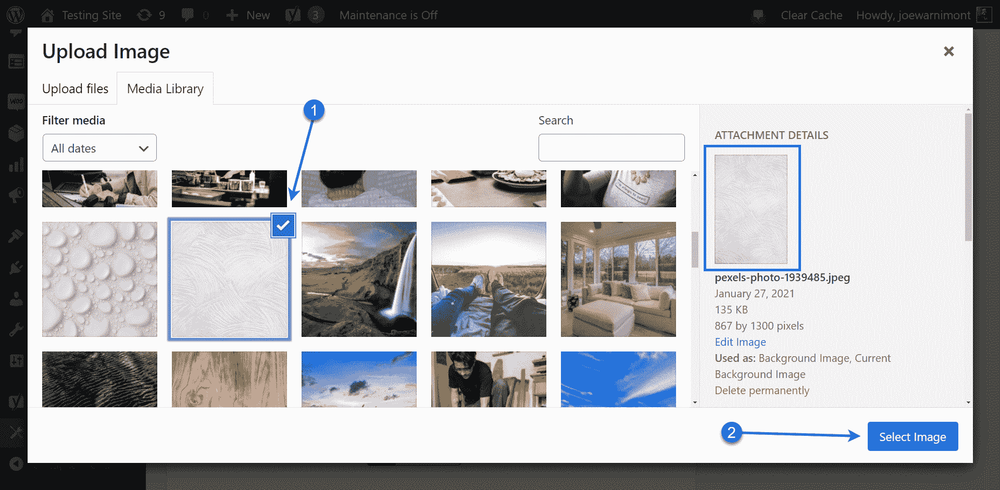

Choose the background image


除非您激活维护模式，否则所有这些设置都没有意义。

要做到这一点，请在设置页面的顶部找到维护开/关开关。

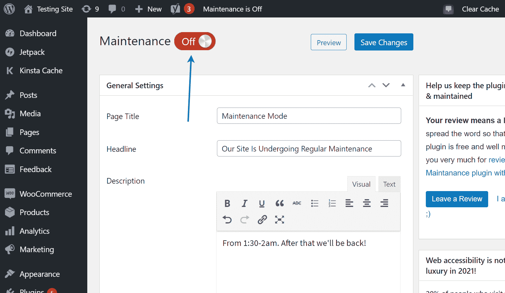

Setting the maintenance page ‘On’ or ‘Off’


翻转开关，使其显示为“开”，然后选择**保存更改**按钮。

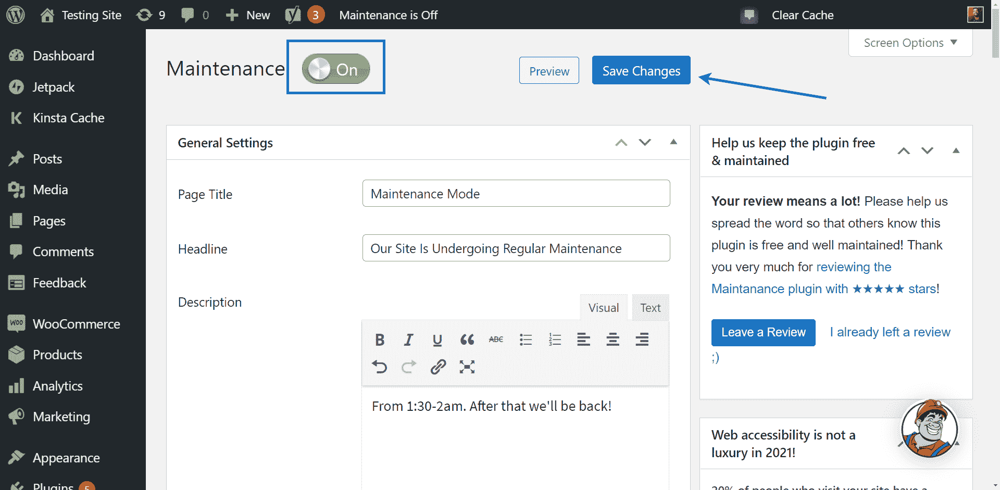

Enabling the maintenance page


去你网站的前端，确保背景图片和维护页面正确显示。

很有可能不会。

这有两个原因:首先，你必须退出 WordPress 管理帐户才能看到维护模式网站。其次，您可能需要[清除站点缓存](https://kinsta.com/blog/wordpress-clear-cache/)来更新内容的变化。

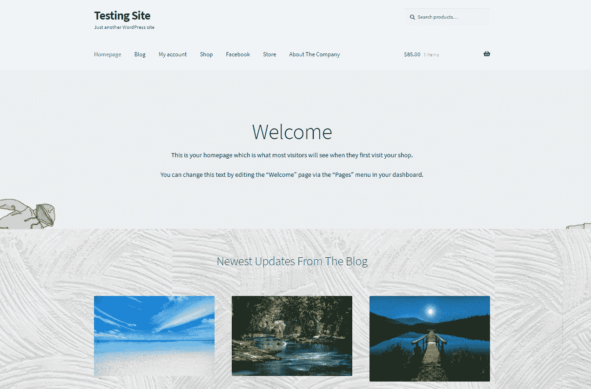

See the website in ‘Maintenance Mode’


例如，当我注销管理员帐户时，现在当我转到任何页面时都会显示维护页面。

背景图片就在那里，还有我的定制，比如徽标和文本描述。

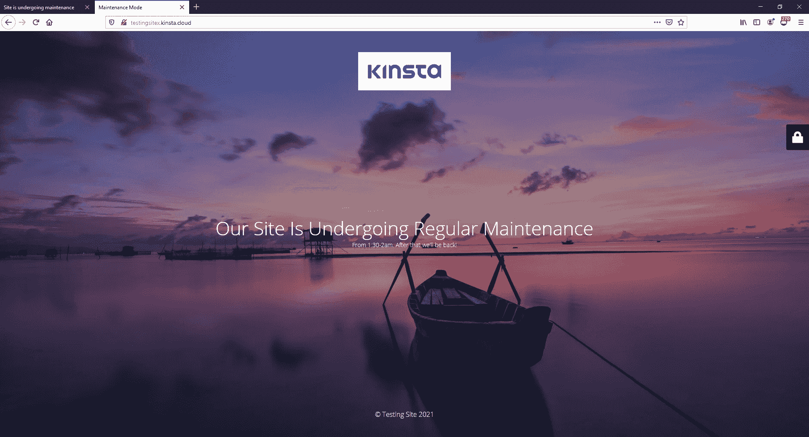

The background image on the maintenance page


此外，将浏览器窗口的大小更改为更接近纵向会将纵向模式背景捕捉到位。

在手机或平板电脑上访问该网站时，您还应该看到纵向模式。

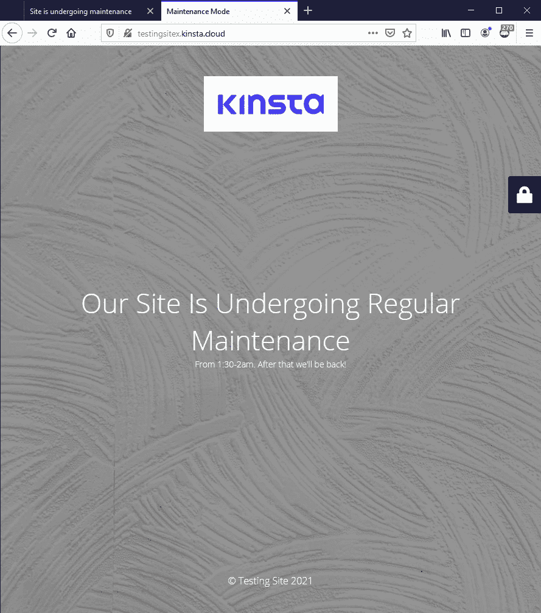

The background image in portrait mode


插件的另一种背景图片叫做预加载图片。这实际上是在显示实际的维护页面、背景和内容之前加载一个带有动画效果的快速图像。

像常规背景图片一样，点击**上传预加载器**按钮，找到一张看起来不错的图片，添加到仪表盘。

再次点击**保存更改**按钮并清空缓存。

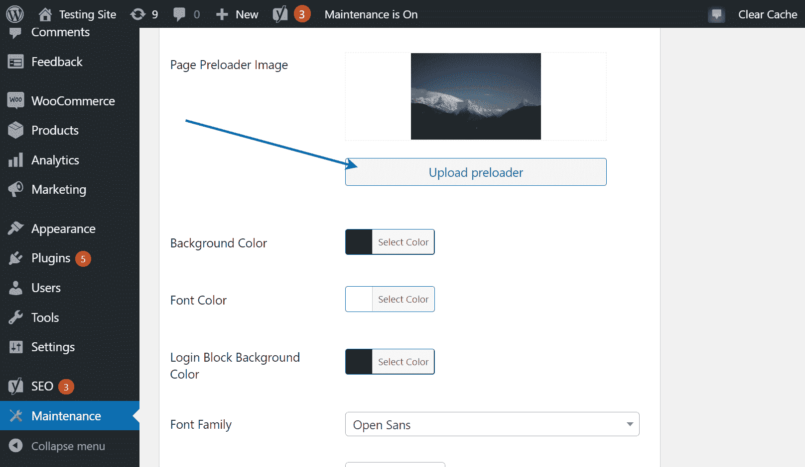

Click the ‘Upload Preloader’ button


默认情况下，**预加载器图像**效果会旋转一会儿，然后消失以呈现维护页面和背景图像。

你是否想保持这种效果完全取决于你自己。

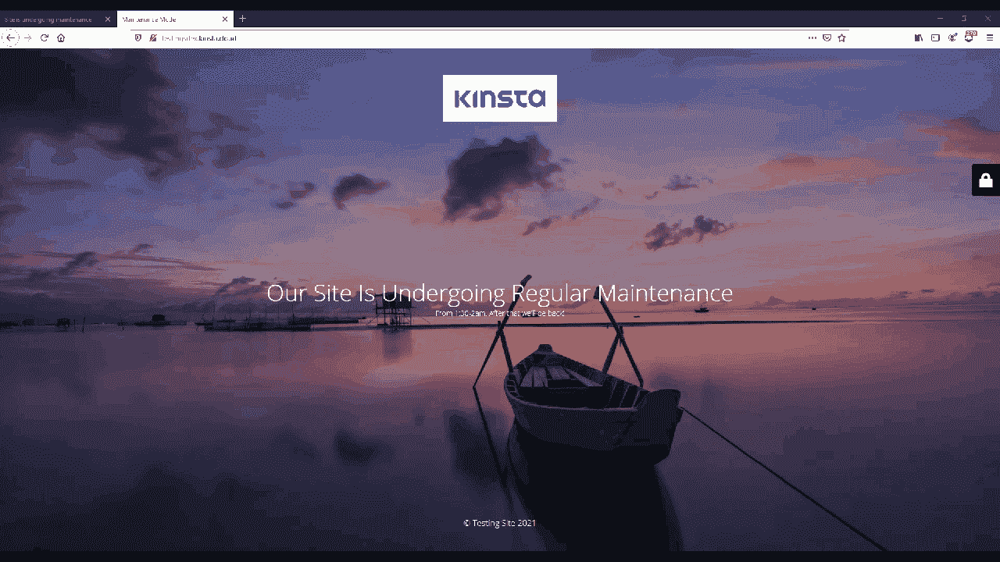

Adding an intro effect to the background image


您可以在维护插件的设置面板中试验其他一些背景元素。

例如，您可能想要添加背景颜色，而不是背景图像。

如果是这种情况，请转到**背景颜色**字段，选择适合您品牌的颜色。

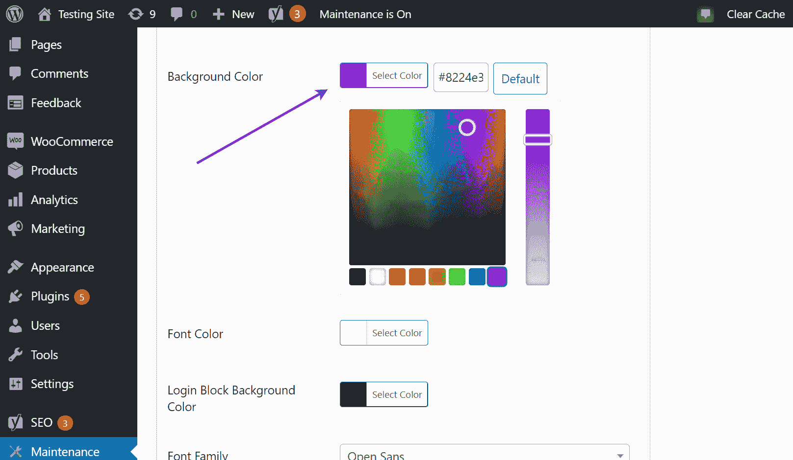

Open the background color field


除非禁用所有其他背景图像，否则维护页面不会显示背景颜色。

所以，一定要删除背景图片。


Removing the background image


您还必须删除肖像模式背景图像。

需要一个给你带来竞争优势的托管解决方案吗？Kinsta 为您提供了令人难以置信的速度、一流的安全性和自动伸缩功能。[查看我们的计划](https://kinsta.com/plans/?in-article-cta)

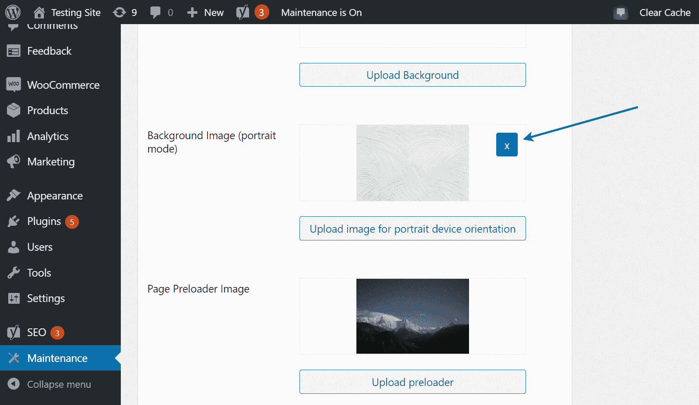

Set the Portrait Mode background image


保存更改并清除缓存。然后去你网站的前端看看背景颜色的效果。

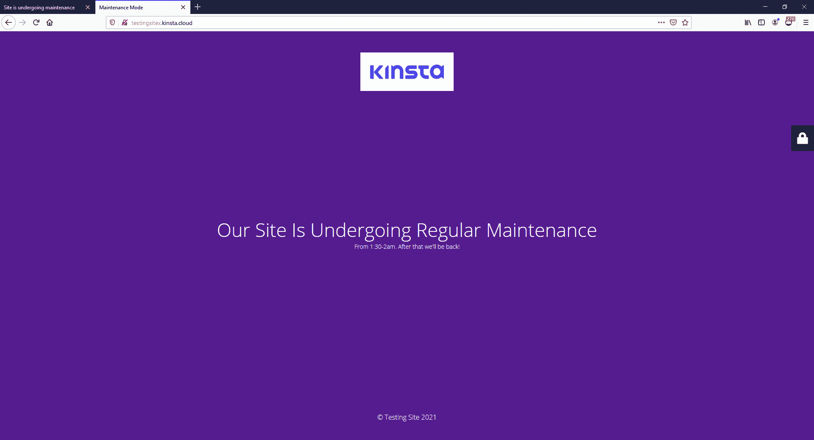

Check your site’s frontend


o 要考虑的设置包括字体颜色、字体系列和背景模糊等项目。

我们也建议考虑你是否需要一个前端登录。这为用户提供了一种登录到他们的帐户并在需要时访问配置文件的方法。

一旦一切完成，点击**保存更改**按钮。

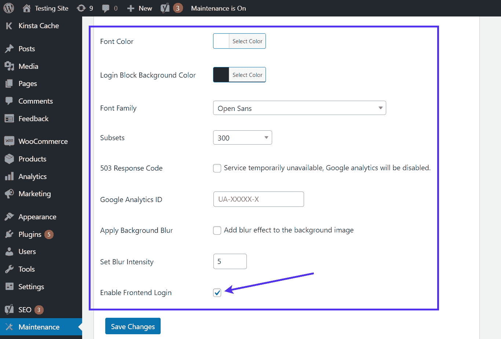

Set the font color


维护插件还提供了几个预制的主题，有漂亮的背景图片和专业设计的布局和文本。

您可以找到即将推出的页面和维护布局的主题，以及收集电子邮件地址和其他联系信息的页面。

您必须购买主题才能使用它们。

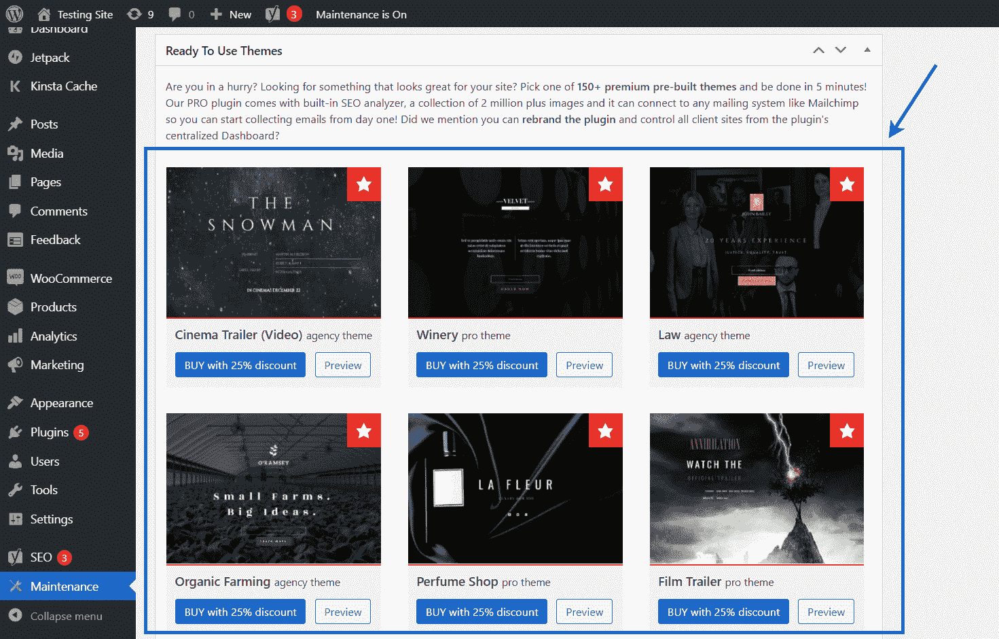

Purchasing a premium theme


根据你的预算，它们相当便宜而且看起来很棒。

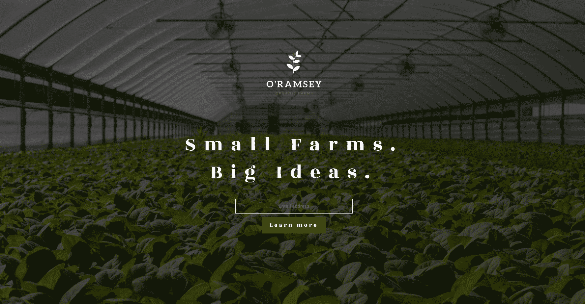

An example of a template


对于那些对购买主题不感兴趣的人来说，上面提到的所有设置都由你来决定。你也可以进入自定义 CSS 模块来配置你的维护页面和背景图片。

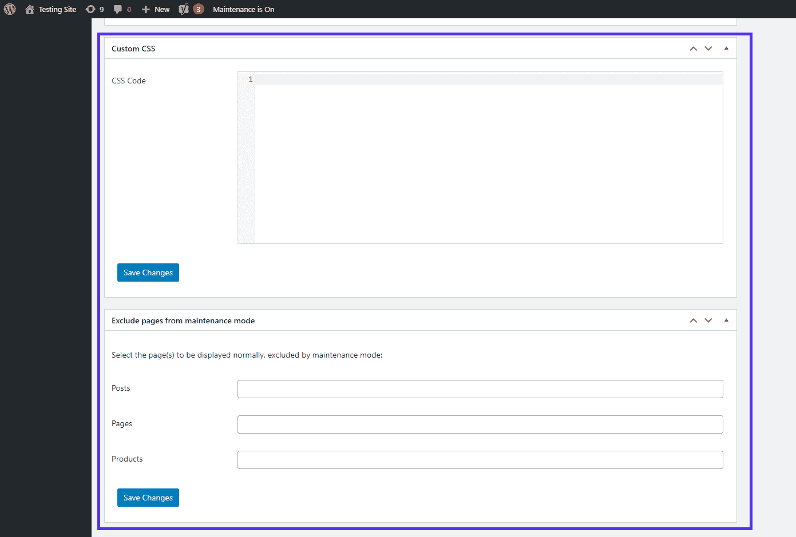

Go to the ‘Custom CSS’ module


请记住，维护页面设置很少会生效，除非您注销管理员帐户并点击**清除缓存**按钮。

使用 Kinsta 时可以在仪表盘右上角找到**清除缓存**按钮。如果使用不同的主机，考虑市场上众多[缓存插件中的一个](https://kinsta.com/blog/wordpress-clear-cache/)。

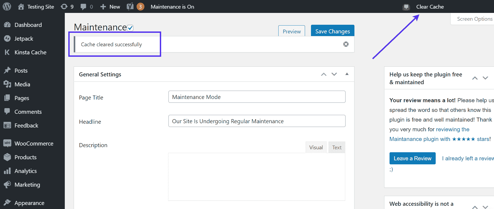

Click the ‘Clear Cache’ button


一旦你清空了缓存并保存了你的设置，你应该会看到一个漂亮的背景图片来补充维护页面！

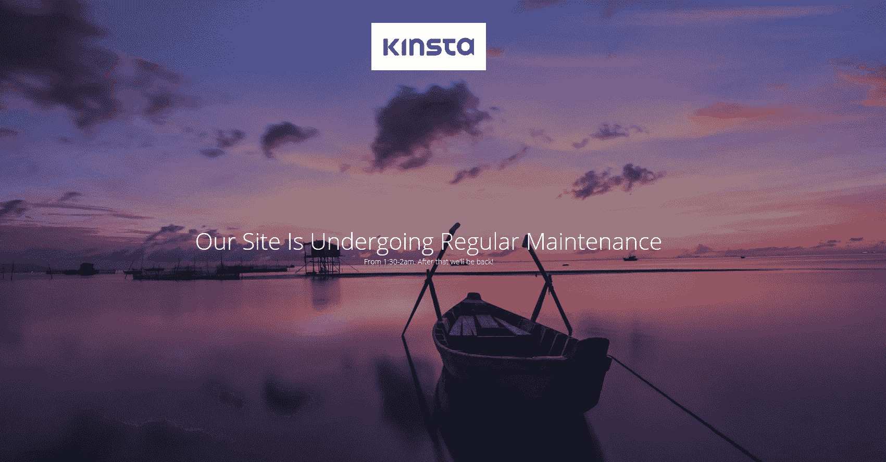

Checking the maintenance page


### 如何用第三方页面生成器添加背景

[我们关于最佳页面生成器的文章](https://kinsta.com/blog/wordpress-page-builders/)提供了一个选择具有拖放功能的页面生成器的选项列表。WordPress 已经在 Gutenberg 中包含了一个页面生成器，然而许多网站所有者更喜欢其他的解决方案。

以下部分解释了如何使用一些流行的页面生成器实现背景，包括 Elementor、Beaver Builder 和 SiteOrigin 的页面生成器。

#### 添加带有元素或的 wordpress 背景

流行的页面生成器 Elementor 旨在显著加快网站制作速度，它提供了一个免费插件，带有几个背景图像工具。

此外，Elementor 为网站的各个部分提供了灵活的视觉背景，而不是将背景局限于整个网站。例如，您可以在任何构建块部分的后面添加背景，并在不同的页面上显示不同的背景。

首先，[安装并激活 Elementor 插件](https://kinsta.com/blog/wordpress-page-builders/#elementor)。


Elementor plugin


Elementor 将其背景设置分散在整个构建器中，如果需要，可以很容易地选择元素和实现背景。因此，从技术上讲，你可以访问任何页面或帖子，并期望能够访问后台上传按钮。

在这种情况下，我们将进入测试站点的主页。从**页>所有页**的列表中选择，访问您选择的页面。你也可以对**的帖子**做同样的事情。

一旦进入默认的 WordPress 页面编辑器，点击按钮**用 Elementor 或**编辑。

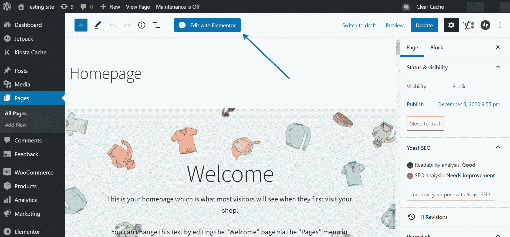

Click the ‘Edit with Elementor’ plugin


这会将屏幕上的视图切换到 Elementor 编辑器。这里，左侧有一个带有拖放模块的菜单，用于构建和编辑页面。

背景功能在部分或块中不可用，而是在该页面的主要**设置**中可用。

因此，点击编辑器左下角的小设置图标(看起来像齿轮)。

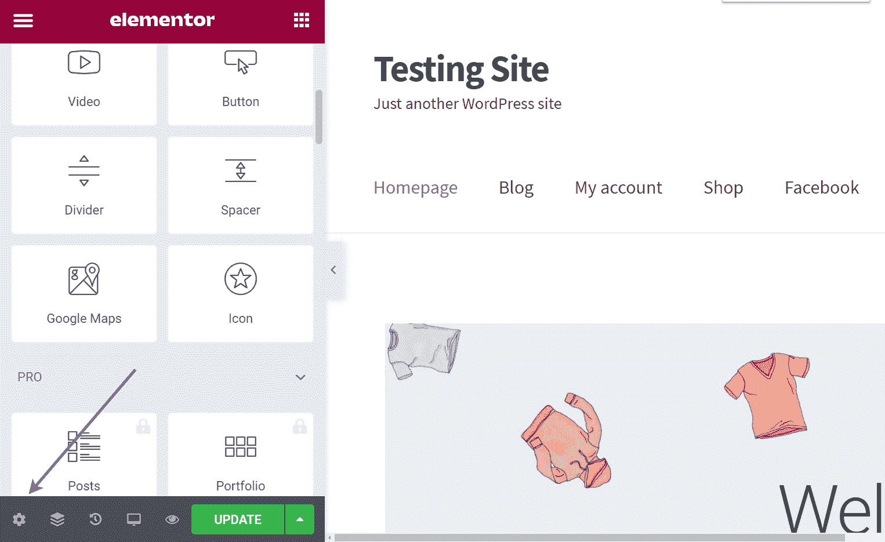

Click the settings icon


这显示了常规页面设置部分。

点击**页面设置**部分顶部的**样式**标签。

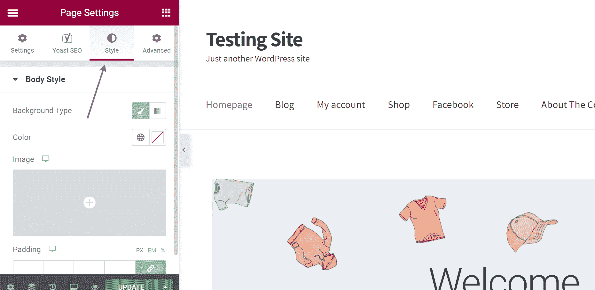

Go to the ‘Style’ tab


在样式下，找到**背景类型**字段，点击**画笔**图标添加一个标准背景。

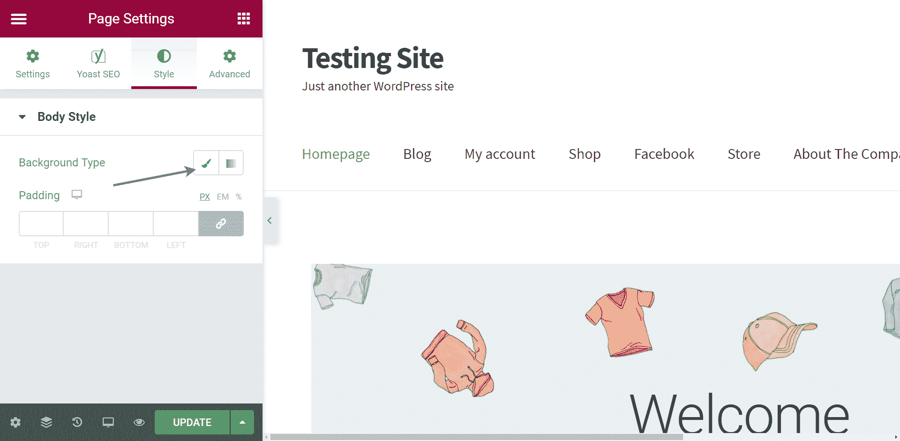

Setting the ‘Background Type’ field


接下来，选择您想要显示的背景类型。例如，**颜色**字段允许您将背景切换为纯色。如果更符合你的风格，在**背景类型**字段中还有一个**渐变**选项。

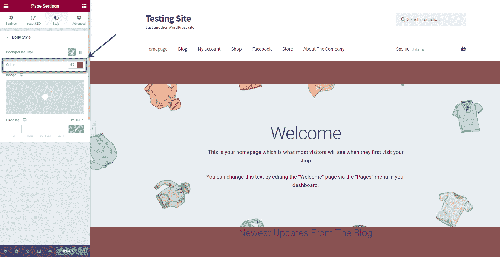

Setting the background color field


点击图像字段下的**选择图像**按钮，调出您的**媒体库**，并选择适合该页面的背景图像。

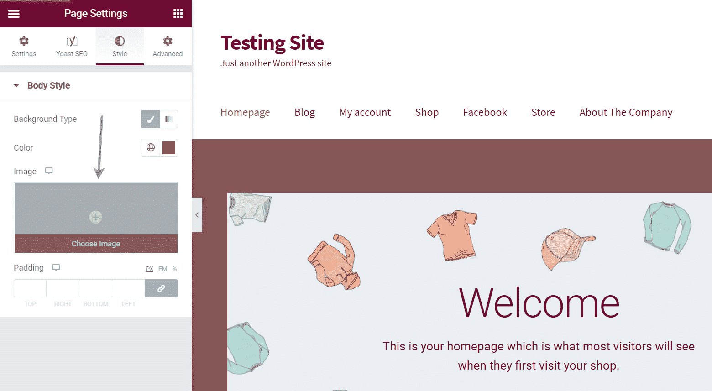

Click the ‘Choose Image’ button


像往常一样，测试您的背景图像并坚持最佳尺寸和最佳实践(大多数情况下为高分辨率和纵向)，然后选择效果良好的图像并单击**插入媒体**按钮。

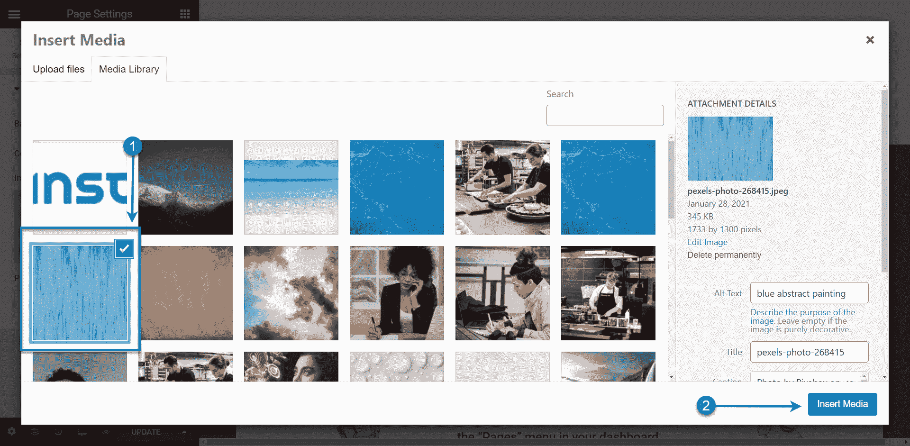

Click the ‘Insert Media’ button


所选背景图像现在出现在右侧的 Elementor 网站预览中。您可能需要调整内容的其他部分，以确保文本和图像等项目显示在背景之上。

Elementor 提供图像背景设置，如位置、附件、重复和背景图像大小。修改设置，以确定您的背景作为固定附件是否会更好看，或者具有右上角方向或其他大小。

按下**更新**按钮，保存对页面的所有更改，并发布您网站的新背景。

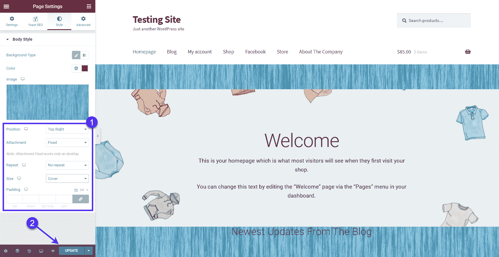

Adding a new background


##### 带有元素或的部分背景

Elementor 为添加到页面的大多数部分提供了高级后台功能。

您所要做的就是在 Elementor 页面上选择一个部分，然后修改背景设置，将背景限制在该区域。

例如，我们可以选择这个**文本编辑器**部分来查看文本部分设置。


Choose the text section with Elementor


选择**高级**选项卡，并在该选项卡中找到**背景**部分。

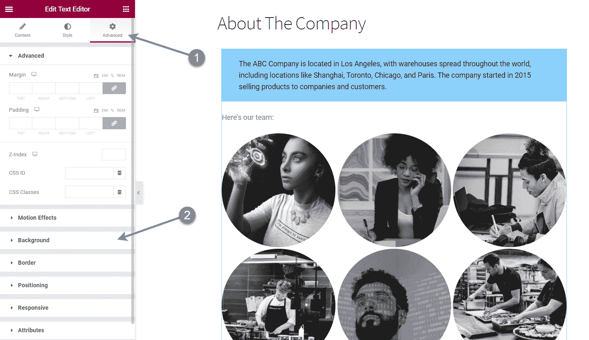

Go to the ‘Background’ section


**背景**设置包括**背景类型**、**颜色**、**图像**等等，很像我们看到的一般页面背景设置的设置。唯一的区别是，它将这些设置约束到选定的部分。

为**背景类型**选择**画笔**图标，然后点击**图像**字段下的**选择图像**按钮。

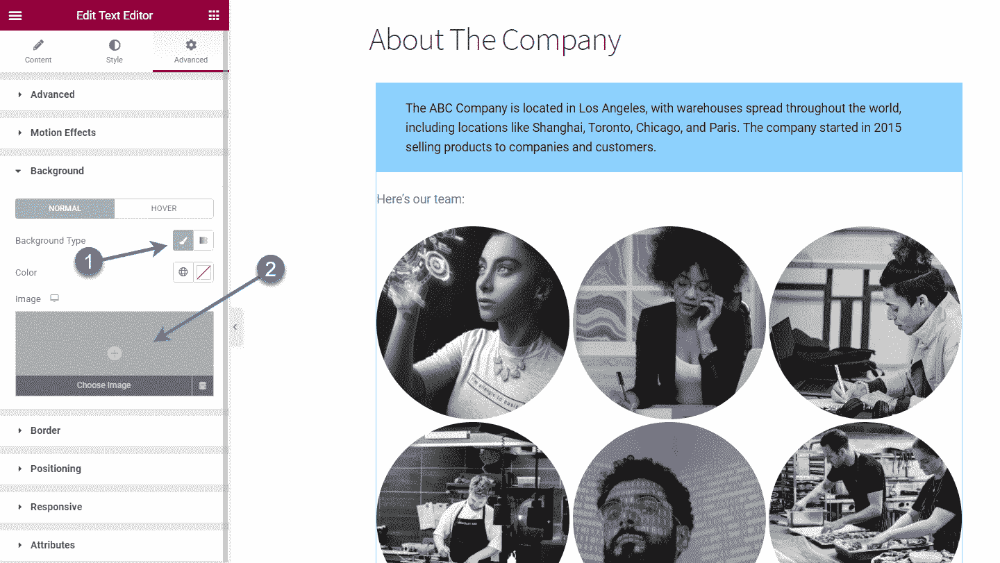

Click the ‘Choose Image’ button


从**媒体库**中选择一张图像，点击**插入媒体**按钮。

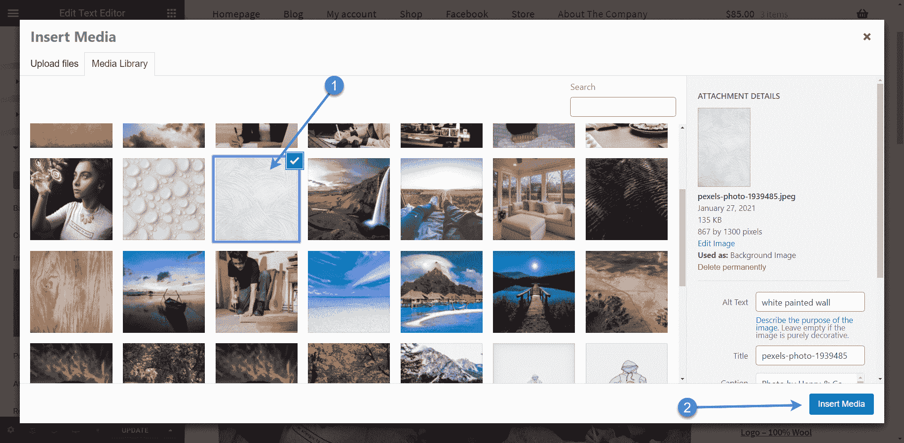

Choose the image and click the ‘Insert Media’ button


正如您所看到的，背景图像保留在该部分的边界内，同时位于已经为该部分创建的内容之后。

使用**位置**、**附件**、**重复**和**尺寸**选择器来修改背景图像在该部分的显示方式。

最后，点击**更新**按钮保存您的更改。

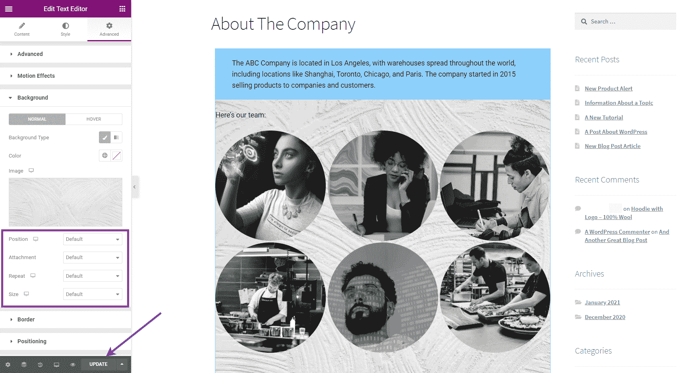

Click ‘Update’ to see changes


#### 用 Beaver Builder 添加背景图像

Beaver Builder 插件包括一个精简版，带有一些基本的后台工具。它是市场上最受欢迎的页面生成器之一，为视频、图像、段落等项目提供了许多内容模块。

除此之外，它还允许你实现一个背景图像、颜色或视频，使用可视化工具和 CSS 将背景元素放在你的整个网站、一个页面或页面上的一个单独部分。

首先，[安装 Beaver Builder 插件](https://kinsta.com/blog/wordpress-page-builders/#beaver-builder)开始使用。

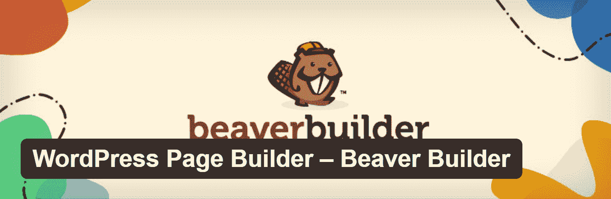

Beaver Builder plugin


使用 Beaver Builder 编辑任何页面或帖子。

您必须将以前创建的页面转换为 Beaver Builder 格式。或者，您可以选择从头开始创建页面，并选择在 Beaver Builder 中编辑页面。

要将当前页面转换为 Beaver Builder，请打开页面编辑器，然后单击三点图标打开右上角的视图菜单。

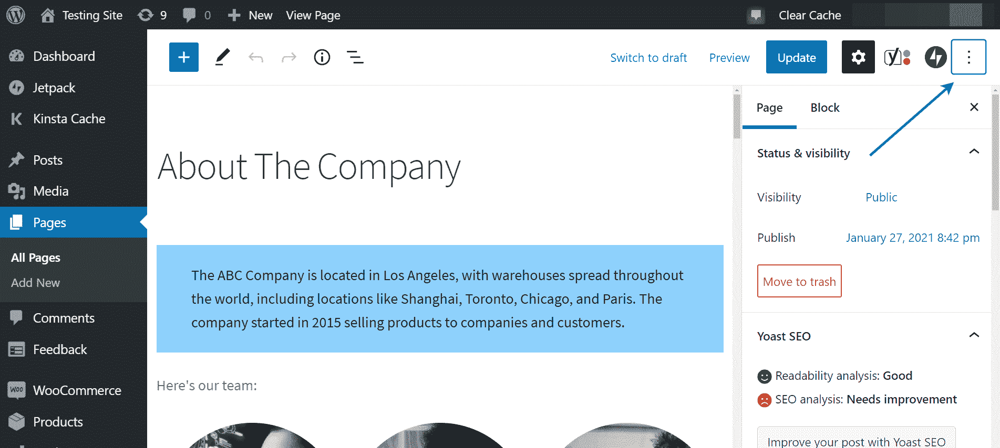

Go to the page’s settings menu


向下滚动找到并选择**转换为 Beaver Builder** 链接。

它试图编译页面上的所有内容，并将这些元素转移到兼容的 Beaver Builder 模块中。

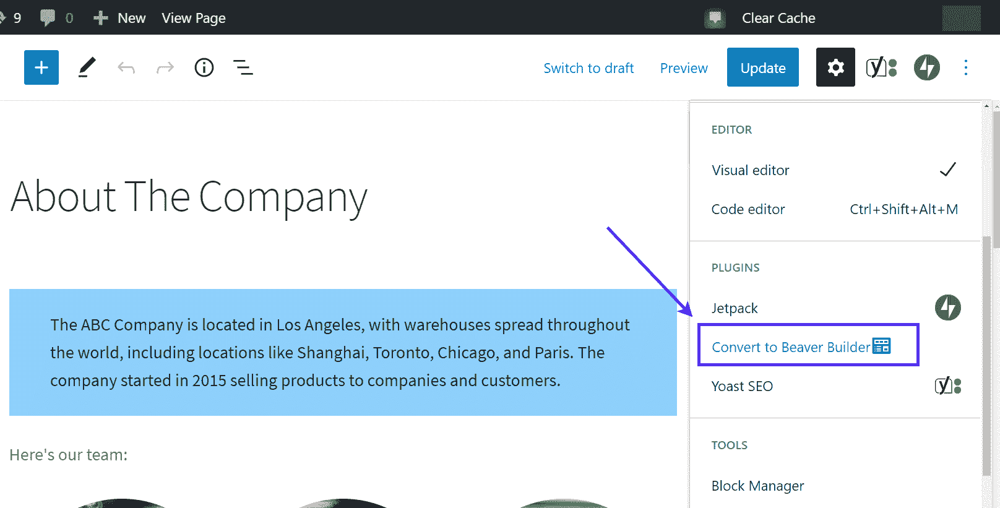

Click the ‘Convert to Beaver Builder’ link


要从头开始制作页面，请转到**页面>添加新页面**。

然后点击**启动 Beaver Builder** 按钮。

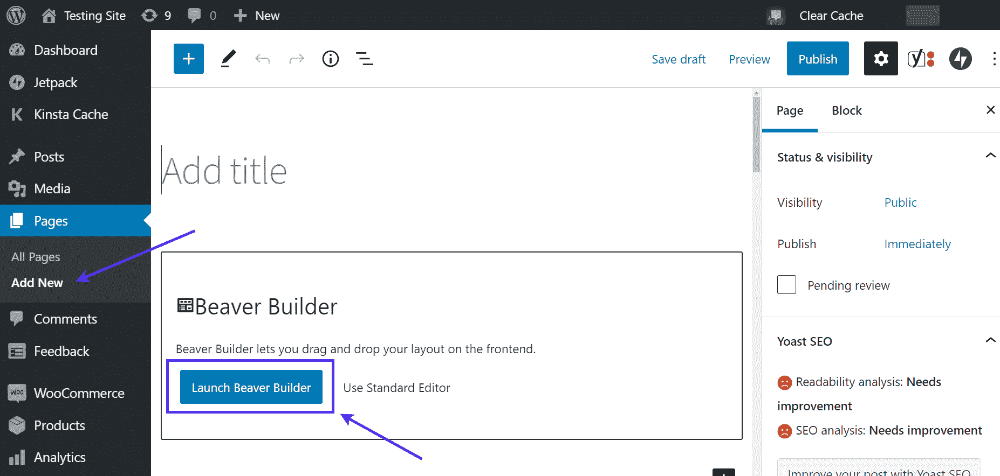

Click the ‘Launch Beaver Builder’ button


Beaver Builder 插件把你带到网页的前端。它占据了屏幕的大部分，就像一个真正的前端编辑器，在这里你可以点击元素并用鼠标在框中移动。

通过 Beaver Builder 添加背景的第一种方法是将背景上传到一个截面块。这可能会占据页面的大部分或一小部分，取决于您的节块的大小。

选中后，找到**行设置**按钮( **⚙** 图标)。

单击该图标显示该行的设置。您也可以对剖面、栏和其他类型的图块执行此操作。

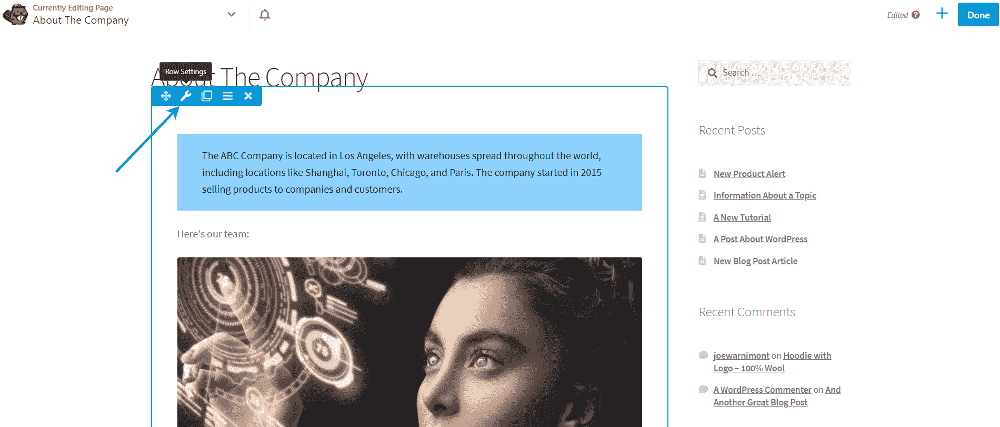

Edit the row settings


网站预览顶部会出现一个设置面板。点击**样式**标签，然后寻找背景部分。

在**背景**下，点击下拉菜单显示所有背景类型。

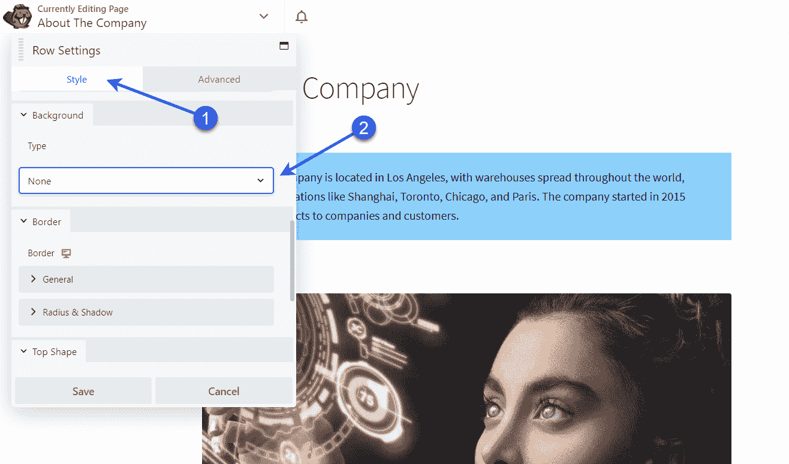

Go to the ‘Style’ tab


你需要考虑几种背景类型，其中一种是照片背景。其他包括:

*   颜色
*   梯度
*   录像
*   嵌入式代码

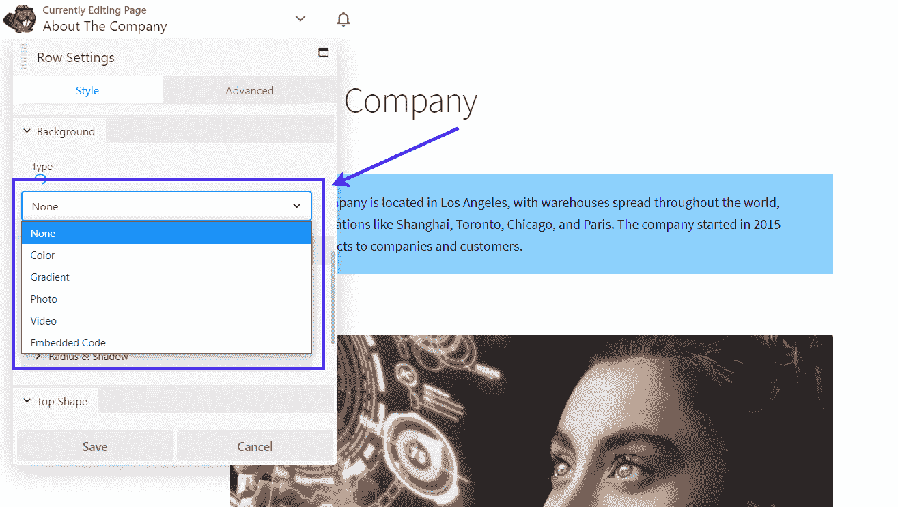

Set the type for WordPress background image


随意测试不同的背景类型。

例如，您可能会发现渐变背景比图像更好看。每种背景类型都有自己的设置。在这种情况下，**渐变**类型需要两种颜色来使渐变从一种颜色移动到另一种颜色。

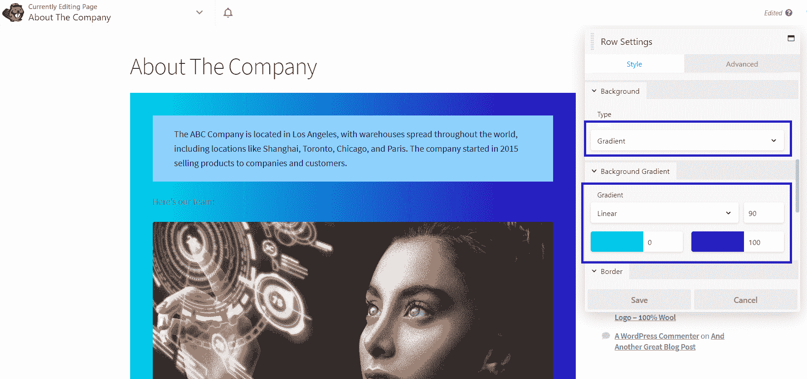

‘About The Company’ section


选择照片背景会显示从媒体库中选择或粘贴到图像 URL 中的字段。如果使用媒体库照片源，单击**选择照片**链接。

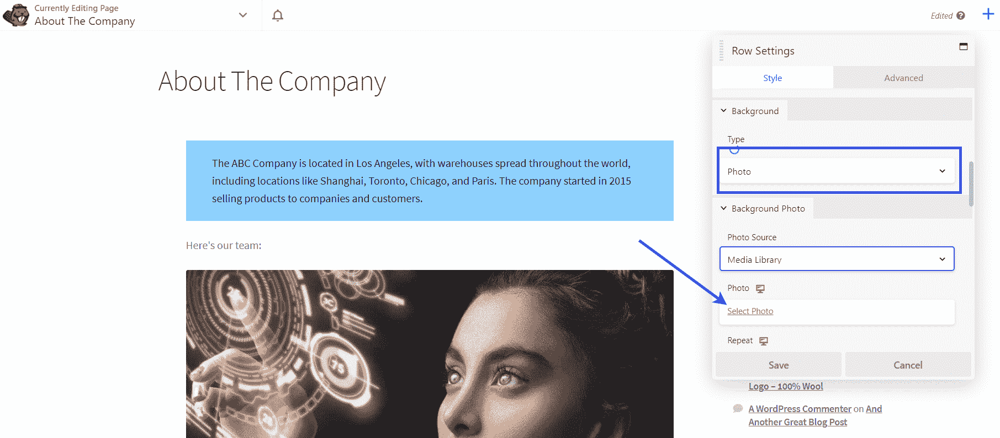

Click the ‘Select Photo’ link


找到你最喜欢的背景照片，点击**选择照片**按钮。

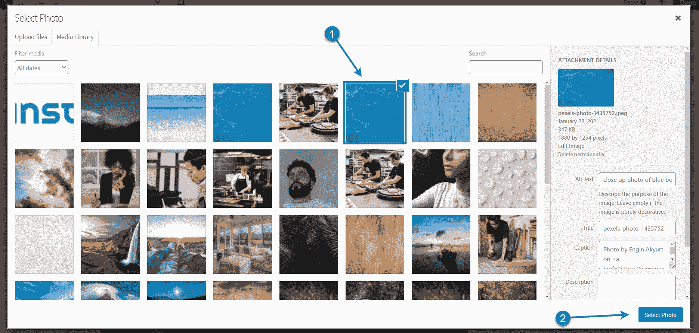

Choose the media


Beaver Builder 将照片放入之前选择的背景空间。照片设置部分询问您想要如何格式化照片。从**尺寸**、**重复**、**位置**和**附件**等选项中选择。

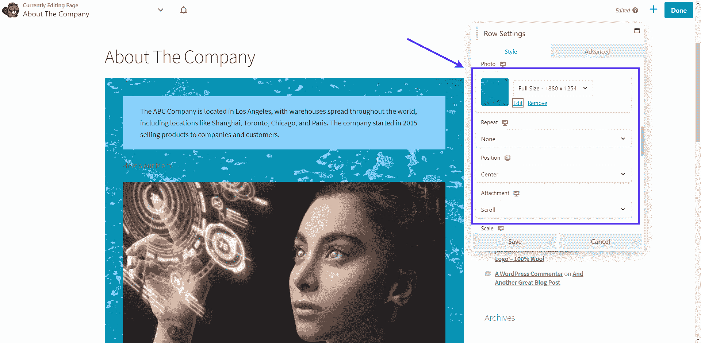

Set the background image size


##### 全球和全页海狸建设者背景照片

Beaver Builder 使用默认的 WordPress 设计工具来利用内置的背景功能。

因此，您可以进入**外观>背景**选项卡，激活整个网站的照片背景。

或者，在 Beaver Builder 中打开任何网页，点击左上角的**工具**下拉菜单。

在这里，点击**全局设置**选项。

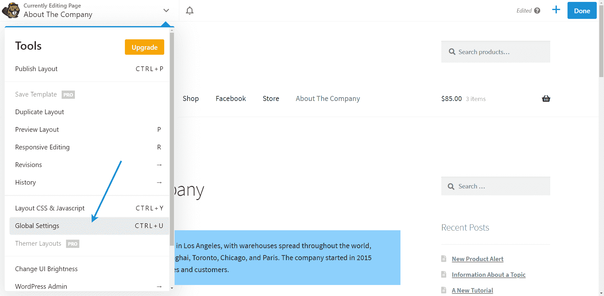

‘Global Settings’ for Beaver Builder


全局设置面板提供了改变整个网站的能力，覆盖或修改内置的 WordPress 编码。因此，我们想插入一个 CSS 代码块来改变整个网站的背景图像(全局)。

单击全局设置中的 CSS 选项卡，并将以下代码段粘贴到字段中:

```
body {
background-image: url("URL to Image");
background-repeat: no-repeat;
background-position: center top;
background-attachment: fixed;
background-size: 100%;
background-color: #0f1066;
}
```

Replace the **URL to Image** text with the URL to the desired background photo. You can also change things like repeat function, attachment, and background size with the CSS code.

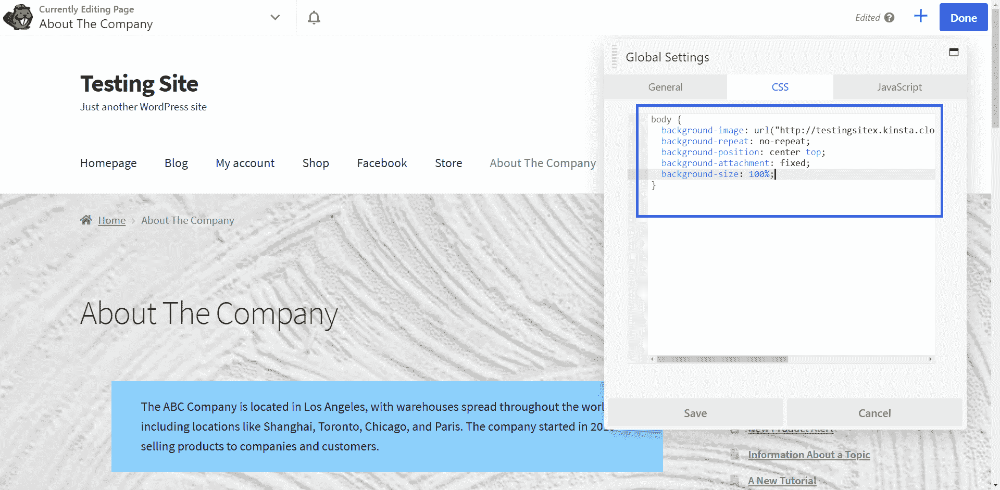

Go to the CSS tab


使用 Beaver Builder 定制页面背景更有意义，因为每个页面都有自己的图像作为背景。

在页面编辑器中，再次打开**工具**菜单。

选择**布局 CSS & Javascript** 选项。

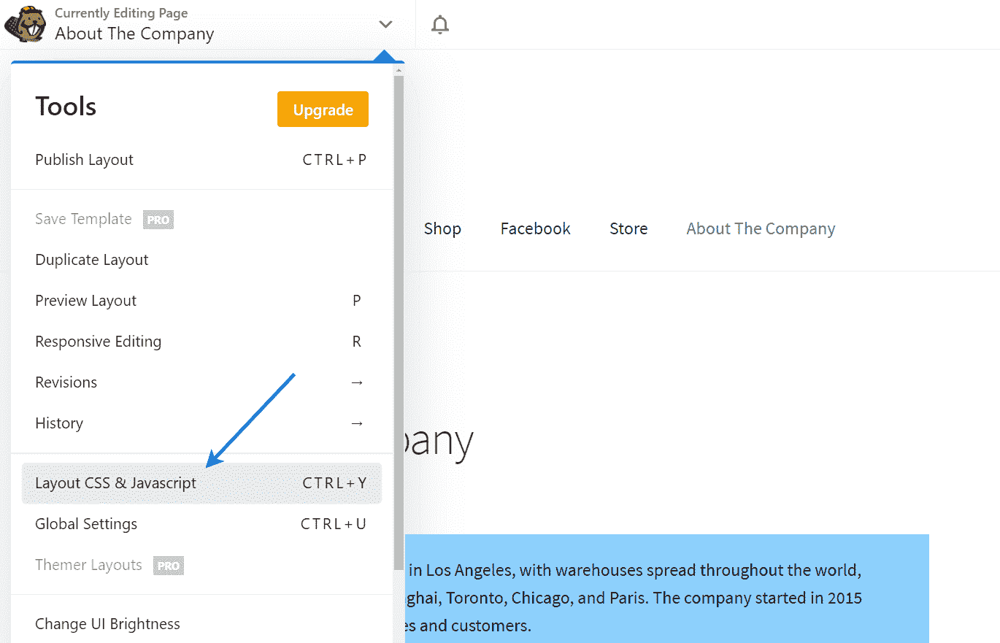

Layout CSS & JavaScript button


将相同的代码粘贴到 CSS 标签中，将 **URL 改为图像**文本改为实际的 URL，并根据需要调整任何设置:

```
body {
background-image: url("URL to Image");
background-repeat: no-repeat;
background-position: center top;
background-attachment: fixed;
background-size: 100%;
background-color: #0f1066;
}
```

As you can see, the entire background changes to the URL image you have in the CSS coding. Keep in mind that the **Layout CSS / Javascript** panel controls only the current page. You won’t see the background on any page besides this one.

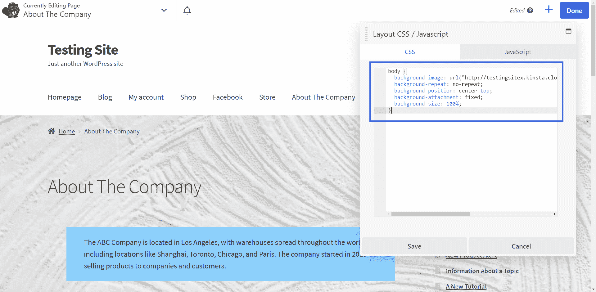

Adding custom CSS


#### 使用页面生成器通过 SiteOrigin 添加简单的行或小部件背景

SiteOrigin 的[页面生成器是另一个拖放式可视化网站制作工具。它为整个网站插入背景的能力有限(你会求助于标准的 WordPress 自定义背景工具)。不过，它提供了为 SiteOrigin 使用的行和小部件添加背景图像和颜色的设置。](https://kinsta.com/blog/wordpress-page-builders/#siteorigin)

首先，通过 SiteOrigin 插件下载并激活页面生成器。

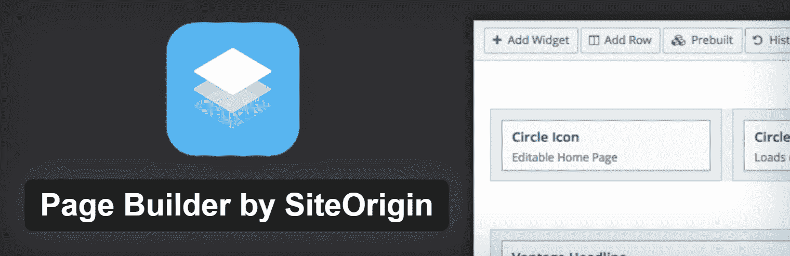

Page Builder by SiteOrigin plugin


导航到新页面或考虑在网站的当前页面中添加 SiteOrigin 行。

每个 SiteOrigin 部分都要求你**添加小部件**或**添加行**。如果你不想从头开始设计，你也有机会浏览**预建布局**。

好消息是 SiteOrigin 中的小部件和行都有包含背景图像的设置。

因此，点击**添加小部件**或**添加行**按钮继续。

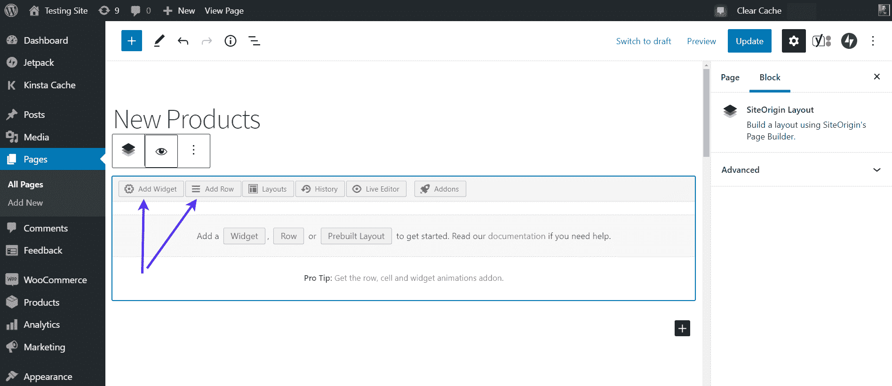

Add a new widget or row


在这个例子中，我们将查看**小部件**库。

在这里，你可以从 SiteOrigin 提供的众多部件中选择一个，从导航菜单和页面到发布内容和产品列表。

在这个例子中，我们将选择**产品**小部件，但是您可以根据您的[设计需求](https://kinsta.com/blog/web-design-best-practices/)选择许多其他小部件中的一个。此外，您可以用一行将这些小部件分组，然后向该行添加一个背景图像，以便背景出现在多个小部件的后面。

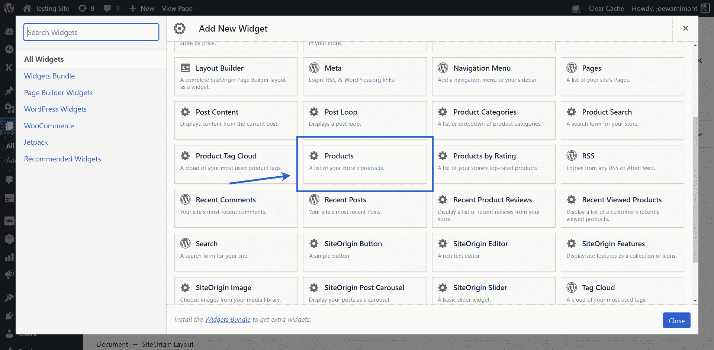

Choose the ‘Products’ widget


新的[小部件](https://kinsta.com/blog/wordpress-widgets/)或行在 SiteOrigin 页面编辑器中结束。SiteOrigin 的大部分内容仍然保留在 WordPress 仪表盘中，所以不像其他页面生成器那样有很多前端编辑器。

要为任何 SiteOrigin 项目添加背景，滚动该元素并点击**编辑**链接。

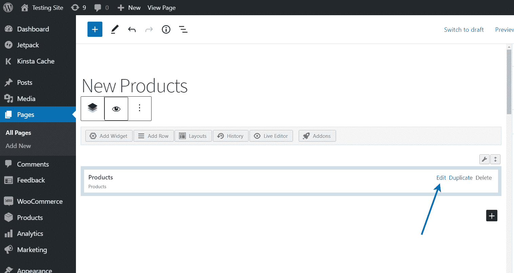

Click the ‘edit’ link


在这个例子中，我选择了 **Products** 小部件，但是每个小部件都有自己的设置来配置它在您的网站上的外观。

后台工具位于**设计**下拉菜单下。点击该按钮前进。

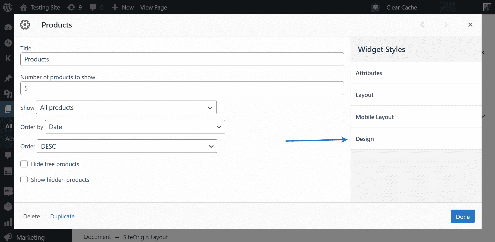

The ‘Design’ tab for WordPress background image


找到**背景图像**字段，点击**选择图像**按钮。

你也可以选择粘贴一个**外部 URL** 作为背景图片。

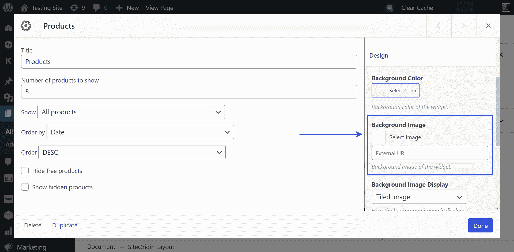

Choosing the background image and color


[媒体库](https://kinsta.com/blog/wordpress-media-library/)向你展示你已经上传到 WordPress 的当前图片。点击最适合这个背景的图片，并选择**完成**按钮，将其放入 SiteOrigin 模块。

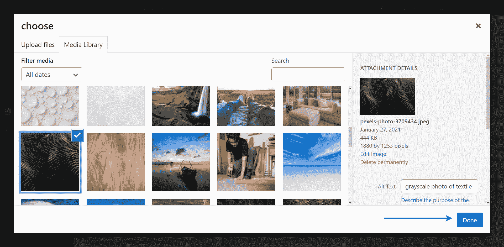

Click the ‘Done’ button


现在，背景图像字段显示了该照片的缩略图。

向下滚动设置，为叠加文本配置从**背景图像显示**到**字体颜色**的所有内容。

一般来说，你应该可以通过选择封面显示得到想要的结果。似乎 SiteOrigin 插件默认为平铺显示，所以你可能需要改变它。

完成背景的自定义设置后，请务必点击 **Done** 按钮。

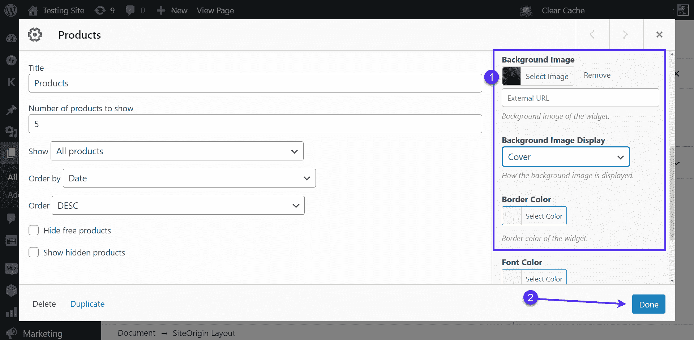

The WordPress ‘Background Image’ settings


小部件(在本例中是产品小部件)进入该页面的 SiteOrigin WordPress [编辑器](https://kinsta.com/blog/best-text-editors/)。您可以将该元素拖到页面上的任意位置，并在它的上方和下方添加新的小部件和行。

你必须点击**预览**或者**更新**按钮，然后浏览页面前端来查看结果。

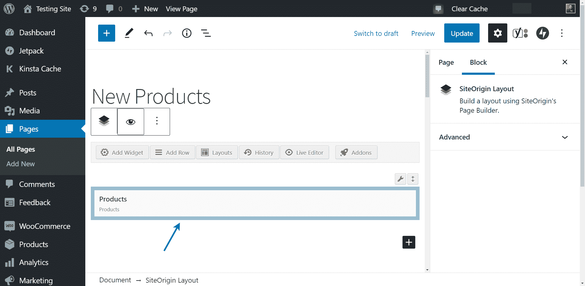

Go to the ‘Products’ section


我添加的当前背景出现在之前的**产品**小部件的约束范围内。这个背景显然需要一些编辑，使它看起来更漂亮，但这是一个高质量的开始，用一个更有创意的背景图像来填充空间。

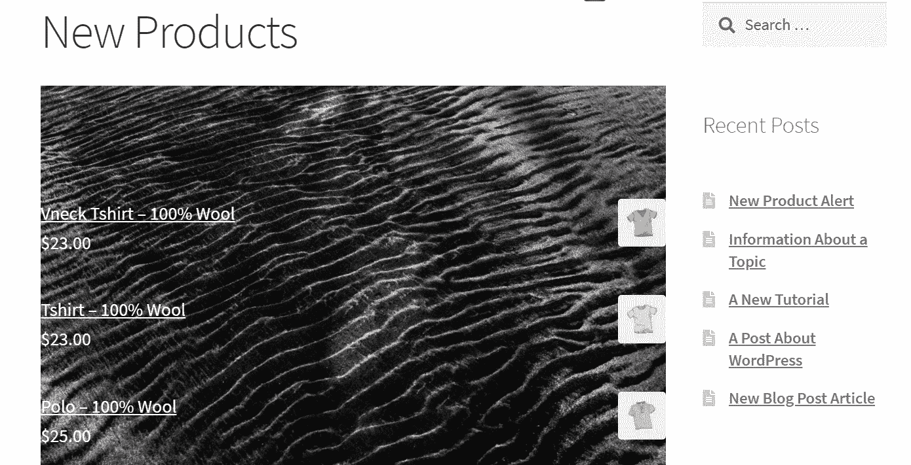

The section background


#### 使用 Brizy 添加独特的背景图像

本次演示的最后一个页面生成器 Brizy 提供了时尚的模板和高级前端界面，用于添加不寻常的设计和快速定制。

Brizy 页面生成器包括一组丰富的[拖放](https://kinsta.com/blog/wordpress-page-builders/)模块，可以整合到你当前的网站中。它还允许你从一个空白模板开始，用 Brizy 构建你的整个网站。

因此，你会很高兴地听到 Brizy 也有一个后台工具，用于你通过页面生成器包含的几乎每个元素。更不用说，Brizy 有几个独特的背景风格，比如在背景中添加循环视频或完整的地图。

为了利用这些后台设置，[安装并激活 Brizy 插件](https://wordpress.org/plugins/brizy/)开始使用。


The Brizy page builder plugin


Brizy 设计过程的大部分需要你从一个空白的[模板](https://kinsta.com/blog/wordpress-template-hierarchy/)开始。Brizy 会尝试将您的旧设计转换成 Brizy 模块，但我们发现最好从头开始。

在你的 WordPress 仪表盘中，转到一个**页面**或**帖子**，开始创建带有标题的页面，也许还有一些内容。

你应该会看到一个用 Brizy 编辑**的按钮。点击该链接，进入完整的 Brizy 页面生成器。**

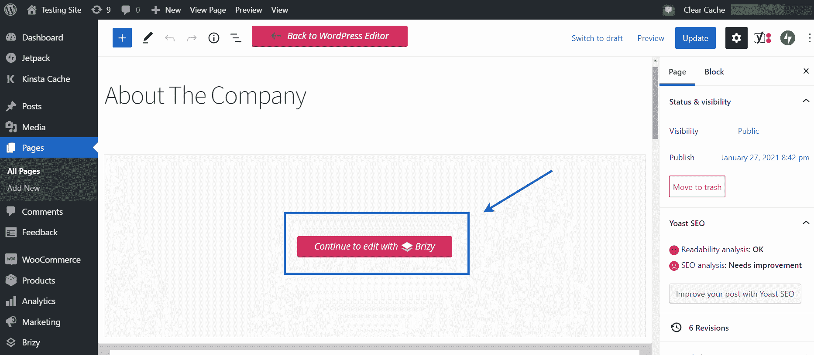

Click on the ‘Continue to edit with Brizy’ button


Brizy 页面生成器通过按钮、文本和图像显示网站的完整预览。如果页面是空白的，单击**开始构建您的页面**按钮。

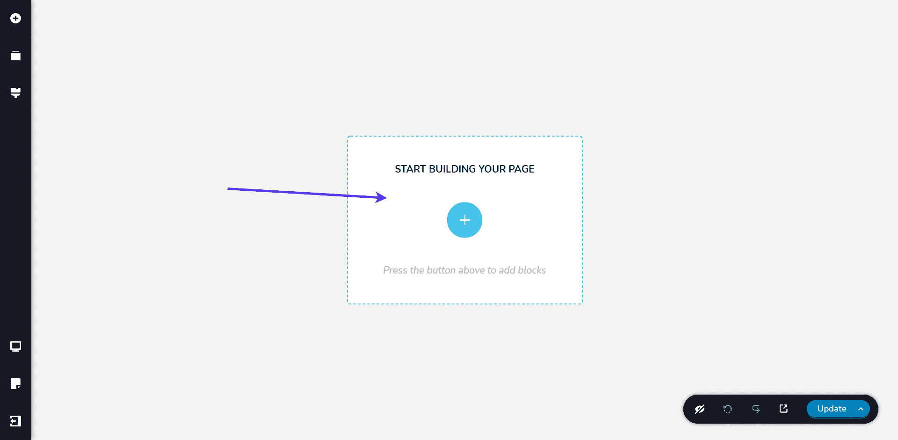

Click the plus icon to start building your page


在上部菜单栏中寻找**布局和模块**选项卡。

这些布局提供了预先构建的网页，其中充满了[演示](https://kinsta.com/schedule-demo/)内容，只要您定制自己公司的内容，就可以随时使用。这些块是较小的网页块，但它们仍然是预先构建的，并且通常比你自己创建块更容易使用和操作。

你走哪个方向都没关系。浏览布局和块，并根据需要添加到页面中。这些只是你用来组成一个完整网页的元素。

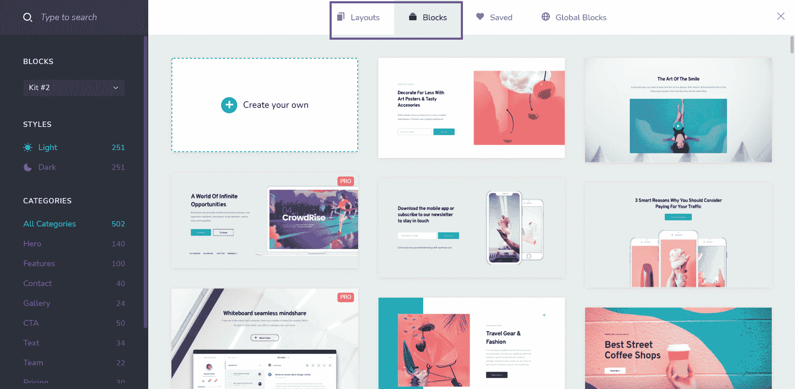

Layouts and Blocks sections


当你在网页上有了一些区块或布局后，回到编辑器屏幕看看你的作品。

您会看到每个块的右上方都有一个设置图标，通常在您滚动该部分时会显示出来。

点击此处查看您选择的模块。我们将为该块添加一个背景。

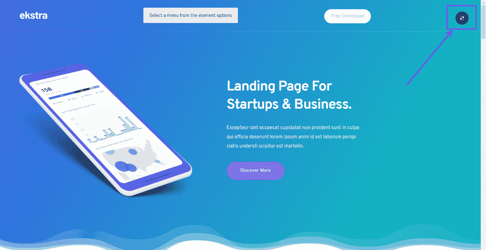

Click the ‘Settings’ icon


**块设置**面板保持在右上角。滚动菜单[图标](https://kinsta.com/blog/wordpress-icon-fonts/)查看它们都做了什么。

其中一个是代表**颜色**，也就是说，它们代表一种彩色背景。如果你更喜欢纯色或渐变颜色的背景视图，你可以把它改一下，添加一个渐变。

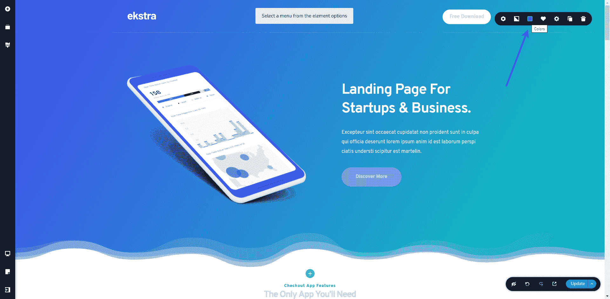

The ‘Color’ button for the background


左侧的图标按钮包含**背景**设置。

点击该按钮，打开快捷工具，将背景图像上传到该区块。

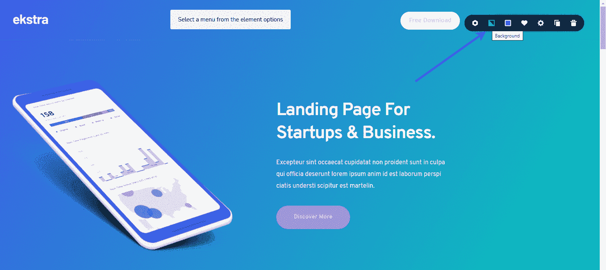

WordPress background image button


Brizy 提供三种媒体背景项目:

*   形象
*   录像
*   地图

首先，尝试图像类型，以了解它如何与您当前的布局一起工作。

点击**图片上传**区，在媒体库中找到一张照片，添加到背景中。

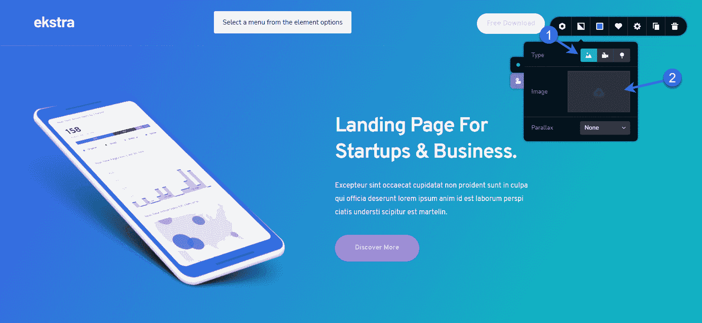

WordPress background image type


我们为这个教程找到了一张木板照片，并表示我们不希望有[视差效果](https://kinsta.com/blog/twenty-twenty-theme/#customizing-the-twenty-twenty-theme)。

这增加了一个愉快的效果，因为彩色背景作为一个覆盖，但我们仍然可以看到木材的纹理背后。

请记住，您可以随时调整视差场，使背景图像成为固定的、动画的或滚动的背景。

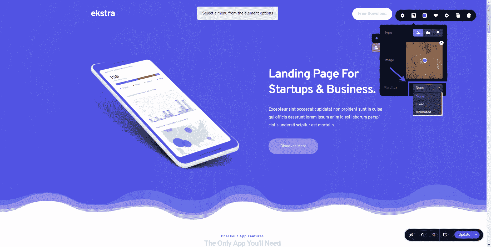

Background image with no parallax


这就是用 Brizy 插入背景图片的方法！

Brizy 最棒的部分是你可以在设计中移动，点击每个部分的**设置**按钮。

一节下来，我们可以插入另一个背景图像，而不用花太多时间。

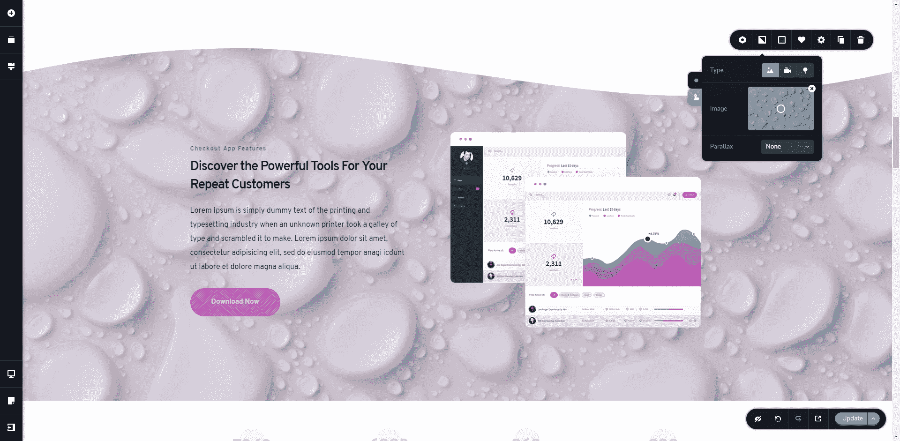

Adding another background image


为了展示其他背景类型的强大功能，我们可以点击**地图**背景类型，输入一个地址，然后观看该位置的地图出现在前景内容的正后方。

[地图](https://kinsta.com/blog/wordpress-map-plugin/)作为一个完整的背景，如果它与默认设置不太一致，还有缩放功能。

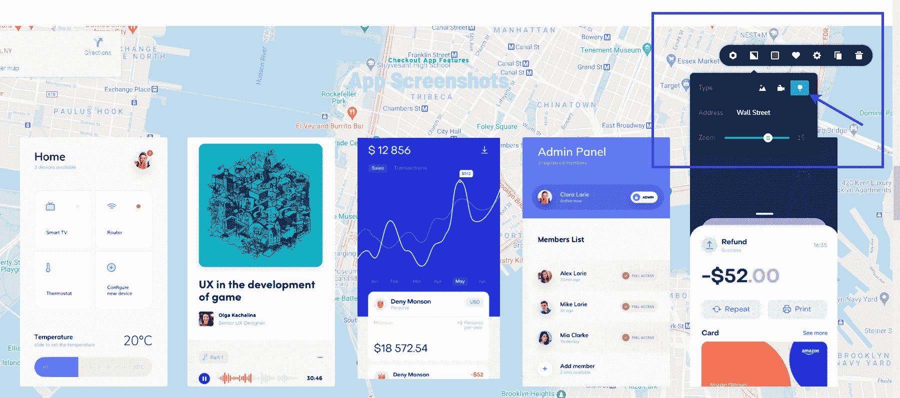

Add a map as a WordPress background image


最后，我们推荐使用 Brizy 背景视频工具，它和图像背景工具位于同一个区域。它的工作原理是插入一个视频 URL ( [YouTube](https://kinsta.com/blog/youtube-stats/) 或 Vimeo)，在前景内容后面呈现一个完整的视频。它甚至提供了一个设置来循环播放视频，并在用户滚动该部分时选择开始播放的时间。

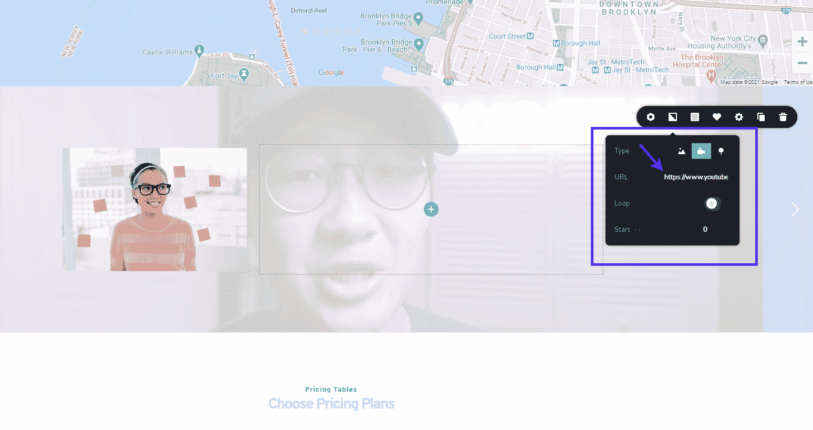

URL for WordPress background image


下面的动画 gif 给出了一个视频的简单例子，尽管它可能需要一些编辑。

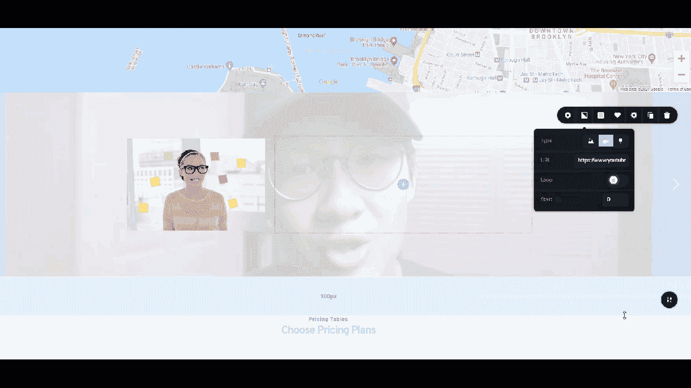

Background with video


## 背景图像尺寸、来源和基本编辑

我们在文章的前面提到过，尽管背景图片没有完美的尺寸，我们建议从不小于 **1024 x 768** 像素开始，并坚持一个普通的纵横比，如 **16:9** 。长宽比与图像的实际大小和分辨率没有多大关系，因为你可以裁剪图像，或者让 WordPress 为你裁剪。

如果你不打算自己拍照，找到合适的地方购买或借用 WordPress 背景图片也很重要。

### 哪里可以找到合适的背景图片

对于你的背景图片搜索，看看我们的指南，在不离开 WordPress 的情况下找到并添加[库存照片。我们也有一个](https://kinsta.com/blog/wordpress-stock-photos/)[有用的市场资源列表](https://kinsta.com/blog/free-images-for-wordpress/)来寻找高分辨率的库存照片，其中许多是免费的。

总的来说，我们建议尝试自己拍摄背景图像。如果这是不可能的，或者你没有摄影或平面设计的经验，考虑使用免费的库存摄影资源。你也可以选择从许多高级股票图片网站中的一个购买背景图片，其中一些网站收取月租费来下载一堆照片。

这些链接中的一些亮点包括:

*   [un splash](https://unsplash.com/)–免费，无需署名。
*   [视觉搜索](https://visualhunt.com/)–免费照片。大部分图像不需要归属。
*   [Pexels](https://www.pexels.com/)–免费，无需归属。
*   [pix abay](https://pixabay.com/)–大部分图片免费，无需注明出处。
*   istock photo–一种相当低成本的免版税图像高级订阅服务。
*   [Shutterstock](https://www.shutterstock.com/)–收取合理订阅费的免版税图片。

### 如何用自定义 CSS 改变 WordPress 背景图片

正如我们所了解的，你可以用标准的内置 WordPress 工具或插件来添加背景图片。你选择哪条路线并不重要，只要你能得到想要的结果。还可以选择利用自定义 CSS 来风格化背景图像或将其添加到您的网站中。

我们不会讨论自定义 CSS 的复杂性，看看每个背景图片和主题是如何有不同的处理过程的。然而，我们建议阅读我们关于在 WordPress 中编辑、添加和定制 CSS 的指南。这篇文章涵盖了为任何网站部分添加背景图片的有用技巧，从菜单项到特定的页面块。

## 修复 WordPress 背景图片的常见问题

所有的 WordPress 网站都有添加背景的功能。然而，这并不意味着核心功能适用于所有网站。例如，您可能会发现您使用的主题不支持自定义背景。或者可能你一直在上传一个背景，但是看起来不太对(太大或者太模糊)。

在 WordPress a 背景下遇到一个问题是令人沮丧的，不幸的是，这是很常见的。我们收集了一些最常见的问题和下面的背景图片，并绘制了每个行动方案。

### 如何解决 WordPress 中背景图片最常见的 5 个问题


### 我的主题不支持 WordPress 背景图片

主题开发者控制着 WordPress 中的自定义背景功能。他们可以打开或关闭它，这取决于他们是否愿意启用自定义后台支持。当不需要或者可能与主题的整体设计冲突时，背景会被关闭。

如果您发现您的主题不支持自定义背景，或者在添加背景时限制了您的能力，请考虑以下解决方案:

*   将主题换成支持自定义背景的主题。购买或下载主题时，在功能列表中寻找自定义背景。
*   使用背景插件来覆盖被阻止的自定义背景默认功能。

尽管可以包含你自己的自定义编码或者进入主题文件来反应自定义背景，我们通常不推荐这两种选择。你最好的做法是找到一个支持背景的主题，或者添加一个允许背景的插件，但不要过多地干扰主题的功能。

### 我的 WordPress 背景图片太暗或者颜色不对

变暗的背景图像可能源于背景图像本身旁边运行的许多设置。大多数情况下，它与叠加的滤镜或糟糕的背景颜色有关。

对于大多数背景变色的情况，你必须检查你的主题或者控制背景本身的插件。

在要求滤镜或覆盖的背景字段附近寻找设置。您可能还会发现应该清除不透明度功能，以便正确显示您的背景。

如果所有其他的都失败了，主题可能有一个背景过滤器硬编码到主题文件中。在这种情况下，请联系主题开发人员，了解如何纠正背景颜色。

### 我的 WordPress 背景图片位置不对

背景图片出现在错误的位置会影响网站的整体设计。您可能会发现背景太偏左或太偏右，或者可能背景的中心焦点根本没有出现在屏幕上。

幸运的是，在背景中移动只需要点击几下按钮。

前往 WordPress 仪表盘中的**外观>背景**。找到您当前上传的图像作为背景，并查找**位置**字段。此字段可让您移动背景的位置，并提供将其移动到左侧、右侧、顶部、底部或角落的选项。

我们建议点击所有的定位按钮来查看它们产生的结果。找到合适的位置后，保存页面。

### 我的 WordPress 背景图片反复出现

纹理和纯色背景在重复时看起来更好，因为它们会忽略图像中断。然而，许多图像作为背景重复出现时看起来很糟糕，尤其是那些有很多细节和不同颜色的图像。

如果您的源图像不够大，无法覆盖整个背景而看起来又不够宽，那么重复的背景图像布局就很方便了。因此，WordPress 有时会默认为重复布局，以保持图像的分辨率。

这个问题的主要解决方法是在 WordPress 中通过**外观>背景**定位在背景部分。将上传的照片作为背景，尝试类似于**填充屏幕**、**适合屏幕**或**自定义**的预设，而不是**重复**预设选项。

然而，你可能会发现，试图让一个较小的图像覆盖整个背景屏幕会导致令人不愉快的结果。在这种情况下，最好的解决方案是完全替换背景源图像，并寻找一个大的，高分辨率的，并准备发布到网络上。

### 我的 WordPress 背景图片被拉伸了

拉伸的背景图像意味着您的自定背景设置试图拍摄较小的图像并用该图像覆盖整个屏幕。

如果[更大的高分辨率图像](https://kinsta.com/blog/facebook-marketing/#add-highquality-images)不符合所需的纵横比，您也可以看到这种情况。对于拉伸的背景图像，考虑源文件。选择合适的不同图像是最好的选择。

另一个问题是，你可能有背景设置配置错误。在**填充屏幕**模式下，检查背景图像位置和在画布上的拉伸情况。你可能只需要坚持原来的尺寸或者增加一个**重复**功能就可以了。

### 其他后台故障排除提示

*   主题开发者拥有 WordPress 自定义背景功能的全部权力。如果你安装了一个主题，但不能让背景工作，你最好的办法是联系主题开发者或安装一个新的主题，看看是否能解决问题。
*   自定义背景颜色和图像通常会覆盖您为控制背景图像的大小、位置或来源而实现的任何自定义 CSS 代码。你可能不得不坚持主题的背景设置，而不是使用自定义的 CSS。
*   主题可能在已经激活自定义背景的情况下出售。通常，你所要做的就是用一张新的背景图片来替换它。有时，需要[进入主题文件](https://kinsta.com/knowledgebase/wordpress-files/)或者使用[自定义 CSS](https://kinsta.com/blog/wordpress-css/) 来覆盖主题设置。

## 最佳 WordPress 背景图片插件

如果你想进一步编辑背景图片，对视频背景感兴趣，或者对允许页面特定背景的工具感兴趣，你可以考虑下面的 WordPress 背景图片插件:

### 简单的全屏背景图像


Simple Full Screen Background Image plugin


简单的全屏背景图片插件与 WordPress 中默认的背景图片工具没有太大的不同，除了它为浏览器增加了自动调整大小和缩放的功能。

总的来说，这个插件最适合那些发现他们的主题阻碍了添加背景的能力，或者可能他们在使用内置的 WordPress 背景工具时遇到了麻烦的人。它覆盖了你在 WordPress 上的设置，并在你的 [WordPress 仪表盘](https://kinsta.com/knowledgebase/wordpress-admin/)上增加了一个特殊的背景按钮，可以立即从你的电脑上传一张图片。

这就是全部了！

该插件还有一个高级版本，提供改进的缩放，支持无限数量的背景，独特的效果，等等。

### 高级 WordPress 背景

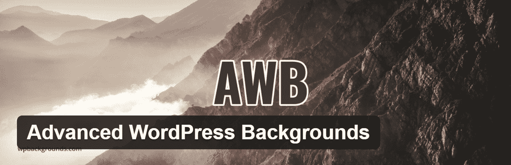

AWB – Advanced WordPress Backgrounds plugin


高级 WordPress 背景插件对 WordPress 背景采取了不同的方式，使你能够利用独特的效果来增加背景的趣味。视差背景就是一个例子，当用户浏览你的网站时，它会随着用户慢慢移动。

该插件还提供对视频的支持。视频背景来自 YouTube 和 Vimeo 等网站，或者你甚至可以[自己制作](https://kinsta.com/blog/video-hosting/)它们。

也可能有纯色或纹理背景。所有这些背景类型都包括一些你在基本的 WordPress 背景工具中找不到的高级功能。其中包括滚动和缩放效果、不透明效果和自定义速度选项。

它支持 Gutenberg，可以与标准的 WordPress 编辑器和许多其他可视化页面生成器一起使用。最后，你可以使用它的自定义 CSS 选项来给你的背景添加更多的风格。

### 完美的图像+视网膜

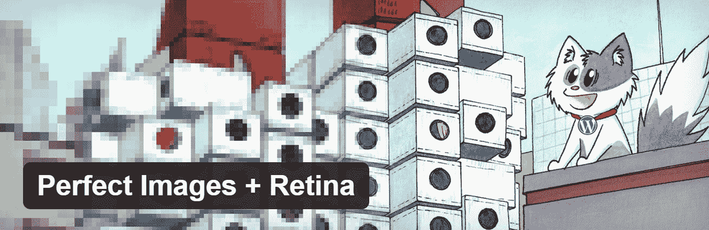

Perfect Images + Retina plugin


作为二合一解决方案，[完美图像+视网膜](https://wordpress.org/plugins/wp-retina-2x/)插件派上了用场。它允许你管理背景图片的大小和外观，同时[重新生成缩略图](https://kinsta.com/blog/regenerate-thumbnails/)和替换图片。图像管理令人印象深刻，对于高分辨率背景尤为重要。

如果你想买它的高级版本，这个插件还提供了一个背景功能。它为背景图像生成一个等效的视网膜，使图像看起来像它们应该的样子，即使在高分辨率显示器上。

### 维护

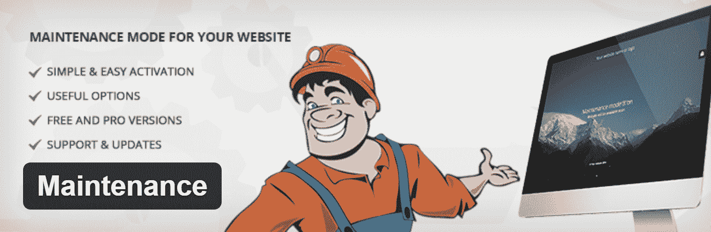

Maintenance plugin with WordPress background image


维护是一个简单易用的插件，用于设计维护和即将到来的页面。[维护](https://wordpress.org/plugins/maintenance/)插件有免费和高级版本，但免费版本足以激活一个维护页面，并添加一个覆盖文本和字段的背景图像。

你甚至可以上传自己的 logo，自定义[字体](https://kinsta.com/blog/wordpress-fonts/)和图标之类的东西，选择各种有自己漂亮背景图片的模板。你也可以安装它的许多预建模板，但大多数都需要插件的高级许可。

[Your all-in-one guide to adding, editing and customizing your site's background images for a unique look & feel 🎨Click to Tweet](https://twitter.com/intent/tweet?url=https%3A%2F%2Fkinsta.com%2Fblog%2Fwordpress-background-image%2F&via=kinsta&text=Your+all-in-one+guide+to+adding%2C+editing+and+customizing+your+site%27s+background+images+for+a+unique+look+%26amp%3B+feel+%F0%9F%8E%A8&hashtags=WPTips%2CWordPress)

## 摘要

一个基本的 WordPress 背景图片可以毫不费力地添加到你的整个网站上。这是一个内置于 [WordPress 核心](https://kinsta.com/knowledgebase/wordpress-core/#what-is-wordpress-core)的功能，所以很容易为某些事件或节日更换背景。也可以一辈子坚持一个背景。

除了标准的 WordPress 背景，你可以使用定制的 CSS 代码、插件和页面生成器在你的 WordPress 站点上实现各种背景。从特定页面上的图像背景到菜单按钮的背景，可能性是无穷无尽的。

现在是时候给你的 WordPress 站点添加你一直想要的背景了。

我们错过了什么吗？如果你在添加或管理 WordPress 背景图片时遇到问题，请留下评论。

* * *

让你所有的[应用程序](https://kinsta.com/application-hosting/)、[数据库](https://kinsta.com/database-hosting/)和 [WordPress 网站](https://kinsta.com/wordpress-hosting/)在线并在一个屋檐下。我们功能丰富的高性能云平台包括:

*   在 MyKinsta 仪表盘中轻松设置和管理
*   24/7 专家支持
*   最好的谷歌云平台硬件和网络，由 Kubernetes 提供最大的可扩展性
*   面向速度和安全性的企业级 Cloudflare 集成
*   全球受众覆盖全球多达 35 个数据中心和 275 多个 pop

在第一个月使用托管的[应用程序或托管](https://kinsta.com/application-hosting/)的[数据库，您可以享受 20 美元的优惠，亲自测试一下。探索我们的](https://kinsta.com/database-hosting/)[计划](https://kinsta.com/plans/)或[与销售人员交谈](https://kinsta.com/contact-us/)以找到最适合您的方式。