# WordPress 特色图片显示不正确(或者根本不显示)

> 原文：<https://kinsta.com/blog/wordpress-featured-image-not-showing/>

WordPress 特色图片的功能就像一张可视的欢迎卡，提示访问者进来享受链接背后的东西。它通常以照片或图形图像的形式呈现有用的信息，让用户可以一窥链接背后的信息。

此外，没有介绍，一个引人入胜的故事是不完整的，这正是特色图片的目的。它通过把一个很可能很枯燥的网站变成美丽的东西，给网站带来了很大的好处。它还有助于打破文本的单调，并且[为你的内容增添了活力](https://kinsta.com/blog/visual-content-strategy/)。

这篇文章向你展示了如何解决 WordPress 特色图片不能在你的网站上正常显示的问题。有许多方法可以实现它，我们将一一介绍。

我们开始吧！

### 查看我们的[视频指南](https://www.youtube.com/watch?v=08hnzKKM8Mg)来修复丢失的 WordPress 特色图片


## 什么是 WordPress 精选图片？

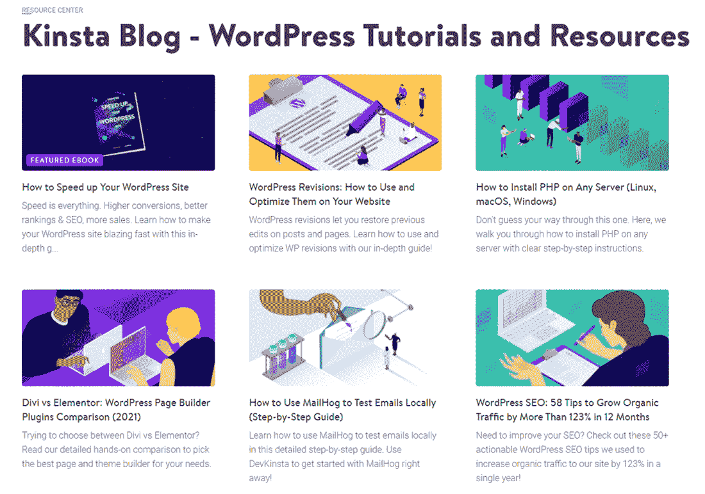

Posts with Featured Images on the Kinsta blog


默认情况下，WordPress 为所有的文章和页面提供一个特色图片。


> 需要在这里大声喊出来。Kinsta 太神奇了，我用它做我的个人网站。支持是迅速和杰出的，他们的服务器是 WordPress 最快的。
> 
> <footer class="wp-block-kinsta-client-quote__footer">
> 
> 
> 
> <cite class="wp-block-kinsta-client-quote__cite">Phillip Stemann</cite></footer>

[View plans](https://kinsta.com/plans/)

这意味着你可以上传一张图片作为文章或页面的封面，类似于书籍或杂志的封面。你可以上传一张特色图片到每个帖子和页面。然后，每当文章在社交媒体和其他网站上被[分享时，它就会作为该网站项目的主要图像呈现。](https://kinsta.com/blog/wordpress-social-media-plugins/)

最后，当你为你的博客文章或其他网页创建订阅源或[图库](https://kinsta.com/blog/wordpress-photo-gallery-plugins/)时，特色图片会自动显示。这样，你就可以为你的帖子展示某种媒体[组合](https://kinsta.com/blog/wordpress-portfolio-plugins/)，而不是一堆只有文本的链接。

你不必每次分享时都上传同一张图片的第二个版本——它已经从原始内容中提取出来了。

[WordPress 特色图片不能在你的网站上正常显示？🤷‍♂️学会了如何一劳永逸地解决这个问题👇 点击推文](https://twitter.com/intent/tweet?url=https%3A%2F%2Fbit.ly%2F3qaYaMK&via=kinsta&text=WordPress+featured+images+not+showing+properly+on+your+site%3F+%F0%9F%A4%B7%E2%80%8D%E2%99%82%EF%B8%8F+Learn+how+to+fix+it+once+and+for+all+%F0%9F%91%87&hashtags=WordPress%2Cwebdev)


## 特色图片不行怎么办？

特色图片很棒，但是你可能会发现由于这样或那样的原因，你看不到一个帖子或页面的特色图片。有时候你的[主题](https://kinsta.com/best-wordpress-themes/)有问题，其他时候你会发现是一个[插件](https://kinsta.com/knowledgebase/wordpress-plugin/)导致了这个问题。

不同程度的特色图片问题也很常见。例如，你可能会注意到特色图片在你自己的网站上看起来很好，但是当一个帖子被分享到像[脸书](https://kinsta.com/blog/facebook-statistics/)这样的社交网站时，它就很难呈现了。

不管怎样，WordPress 特色图片没有出现既令人沮丧又令人担忧。

特色图片通常承载着网站视觉吸引力的重量。如果没有自动化的特色图片，你只能看到文本块和网页链接。考虑到在脸书上分享一篇没有特色图片的博客文章并不那么吸引人，这也会阻止人们分享你的作品。

您可以采取几个步骤来缓解这些问题:

1.  记下确切的问题，比如图像没有上传。或者，如果特色图片没有出现在社交媒体上，但它在你的网站上运行良好。
2.  考虑任何可能导致你的特色图片问题的 WordPress 问题，比如插件之间的冲突或者一个[编码错误](https://kinsta.com/knowledgebase/wordpress-error-log/)。
3.  考虑安装一个插件来解决特色图片的问题，而不需要你做太多的工作。

这是一个简单的三步过程，但在修复您的特色图像背后有更多的细节。特色图像由于各种原因而损坏，并且通常是逐案处理的。

下面我们将讨论我们所知道的每一个关于特色图片的问题，并概述修复这些问题的步骤。

## 为什么我的 WordPress 特色图片没有显示？

您发现您的一张或所有特色图片有问题。你从这里去哪里？

我们已经概述了特色图片常见和不常见的问题。让我们从最简单的解决方案开始，确保你正确上传你的特色图片。然后我们将深入研究其他错误。

### 确保你知道如何在 WordPress 上传特色图片

对一些人来说，这可能听起来很傻，但是许多 WordPress 初学者不知道如何在第一时间上传特色图片。但这没关系，因为我们都从某个地方开始学习。

我们建议您遵循这些步骤，以确保您的做法是正确的。

**注意:**你可以上传 WordPress 特色图片到帖子和页面，但是一旦你开始添加像 [WooCommerce 产品页面](https://kinsta.com/blog/woocommerce-tutorial/#new-products)和[自定义帖子类型](https://kinsta.com/blog/wordpress-custom-post-types/)这样的东西，这个基本规则就会扩展。为了简单起见，我们将坚持把特色图片上传到常规的 WordPress 帖子和页面上——但是如果你有兴趣了解更多，这里有一个完整的 [WooCommerce SEO 指南](https://rankmath.com/blog/woocommerce-seo/)涵盖了这个&的所有内容，包括你的产品的模式标记等等。

首先，转到你的 WordPress 仪表盘。转到**帖子>添加新的**来创建新的博客帖子。你也可以在页面上这样做，或者点击**所有帖子**选项，如果你有兴趣在之前生成的帖子上添加特色图片。


‘Posts > Add New’ link in WordPress dashboard


为博客文章插入您想要的任何内容。填写标题，写段落，上传图片到文章中。

但是，请记住，上传到您的博客文章内容区域的图像与特色图像没有任何关系，即使它是您上传到该文章的第一张照片。

有一个[完全不同的部分](https://kinsta.com/blog/gutenberg-wordpress-editor/#exploring-gutenberg)处理特色图像。

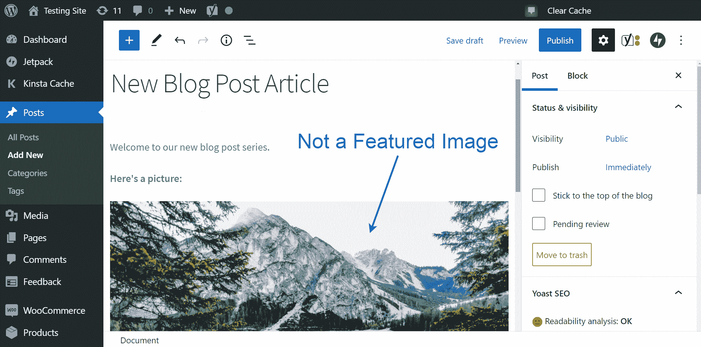

This is not a featured image


要查找并上传特色图片，请将注意力转移到右侧的帖子**设置**面板。这列出了整篇文章的各种设置，如果你当前选择了一个 WordPress Gutenberg 块，还可以显示特定块的设置。

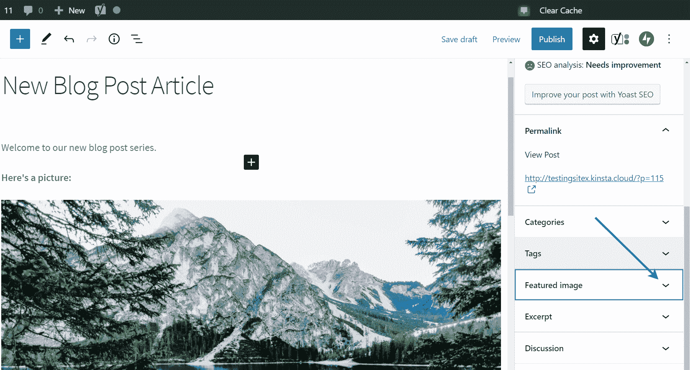

The ‘Featured Image’ tab


确保选择了 **Post** 选项卡。

然后向下滚动设置。**特色图像设置**朝向底部。

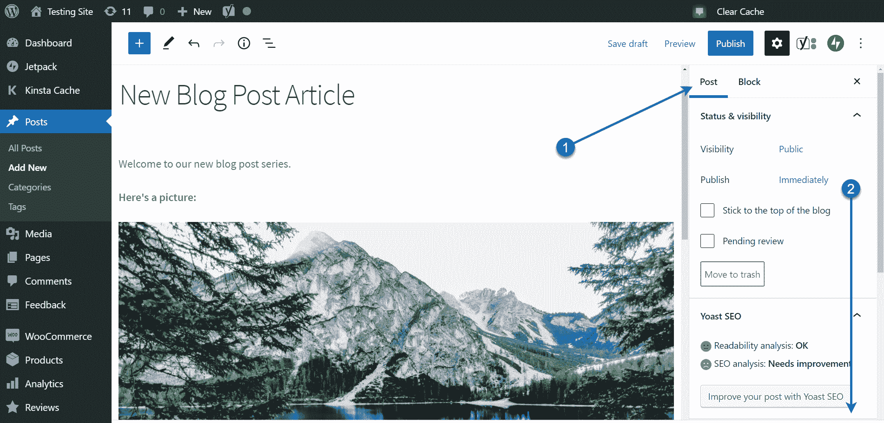

Accessing the post settings


点击**专题图像**面板打开其设置。

在这里，你会看到一个按钮**设置特色图像**。点击它会直接把你带到 **WordPress 媒体库**。

然而，我们通常建议点击**选择图像**按钮，因为这为决定特色图像的来源提供了一些额外的选择。

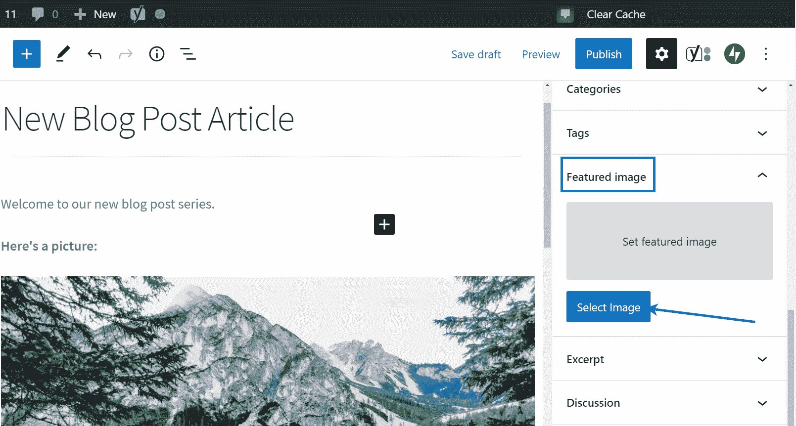

Click on ‘Select Image’ in the Featured Image tab


正如承诺的那样，当通过 Kinsta 托管的网站上传图片时，会出现三种选择:

*   **媒体库**:你的 [WordPress 媒体收藏库](https://kinsta.com/blog/wordpress-media-library/)，允许你上传图片到你的服务器，编辑这些照片，保存它们以备后用，或者现在就把它们放在你的帖子和页面中。
*   **Google Photos** :一个你自己的个人照片的云库。您必须登录并链接到 Google 相册，才能从那里上传到 WordPress。
*   **Pexels 免费照片**:一个[专业照片的免费收藏](https://kinsta.com/blog/free-images-for-wordpress/)你可以在你的网站上搜索和收录。有时候，你需要提供图片的属性(当你在 WordPress 上上传一张 Pexels 照片时会提供)。

根据您是否有自己的照片以及照片存放的位置来选择。

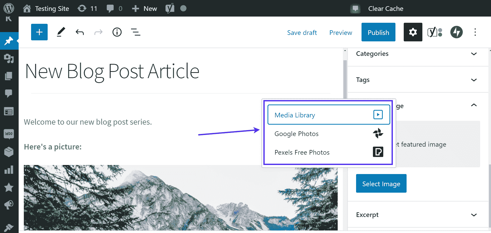

Uploading an image from Media Library


使用媒体库会显示你已经上传到 WordPress 的图片。您可以选择一个并点击**设置特色图像**按钮。

作为替代，媒体库也有一个**上传文件**的标签，你可以从你电脑上的文件中选择并上传到你的 WordPress 媒体库。

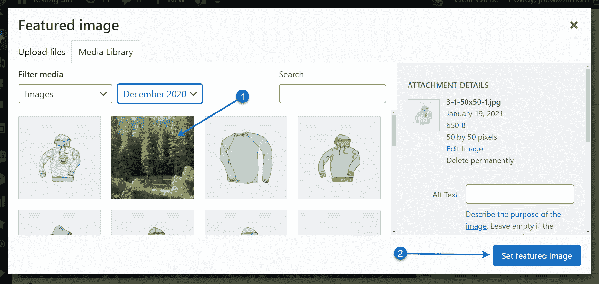

Choose an image to ‘Set featured image’


Pexels 收藏和你的媒体库没什么不同，除了你可以不用自己拍照就能找到漂亮的照片。您可以搜索特定的关键词，并将它们设置为您的特色图片。同样，来自 Pexels 的图片是免费的，但你必须给摄影师一个链接，这是通过 WordPress 使用 Pexels 时自动插入的。

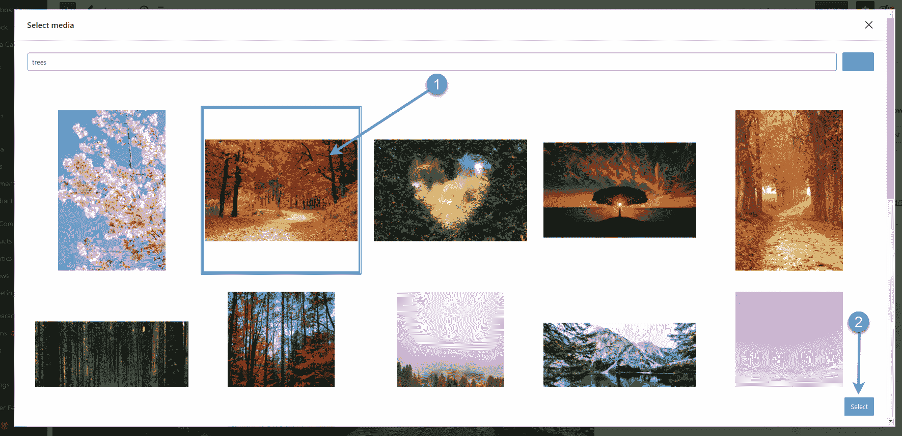

Choose the media and click the ‘Select’ button


在你的**帖子设置**中的**特色图片**面板下，会出现你所用图片的[缩略图](https://kinsta.com/blog/regenerate-thumbnails/)。

这意味着，只要你点击**保存草稿**或**发布**，图片就会在帖子上保持活动状态，直到你删除它。

出现的其他按钮包括**选择图像**、**替换图像**和**移除特色图像**。所有这些都可以让你调整或摆脱当前的特色形象。

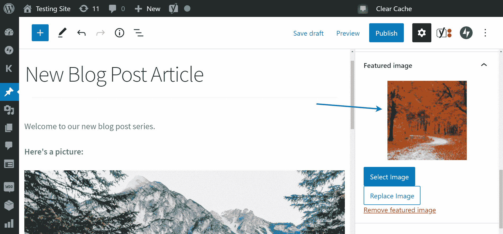

WordPress featured image showing as a thumbnail


要向前移动并查看运行中的特色图像，请单击**发布**按钮。

**预览**按钮也可以测试特色图片，但公众只有点击**发布**才能看到。

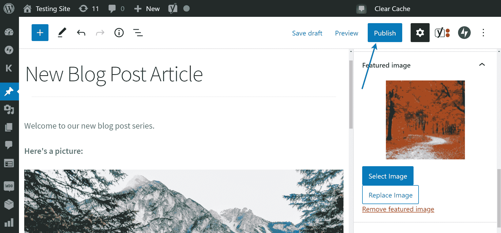

Hit the ‘Publish’ button


根据你的[主题设置](https://kinsta.com/knowledgebase/what-is-a-wordpress-theme/)和各种其他因素，比如某些改变图片设置的插件，特色图片应该首先出现在你发布的博客文章中。

如您所见，我们插入文章内容中的图像显示在第二位，因为特色图像优先。

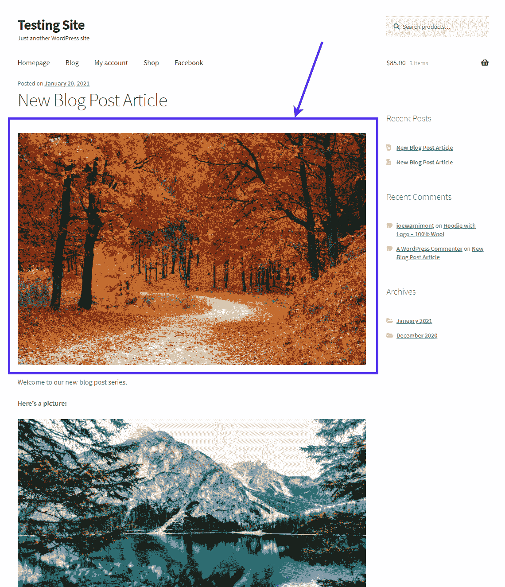

An example of a featured image


查看你的特色图片的另一种方式是在你的博客上创建**最近帖子**图库或订阅源，通常在你网站的其他地方。

例如，我们在测试站点的主页上添加了一个**最近的帖子**提要。该订阅源中所有博客文章的特色图像显示为较小的缩略图，为那些寻找内容的人提供了更直观的体验。

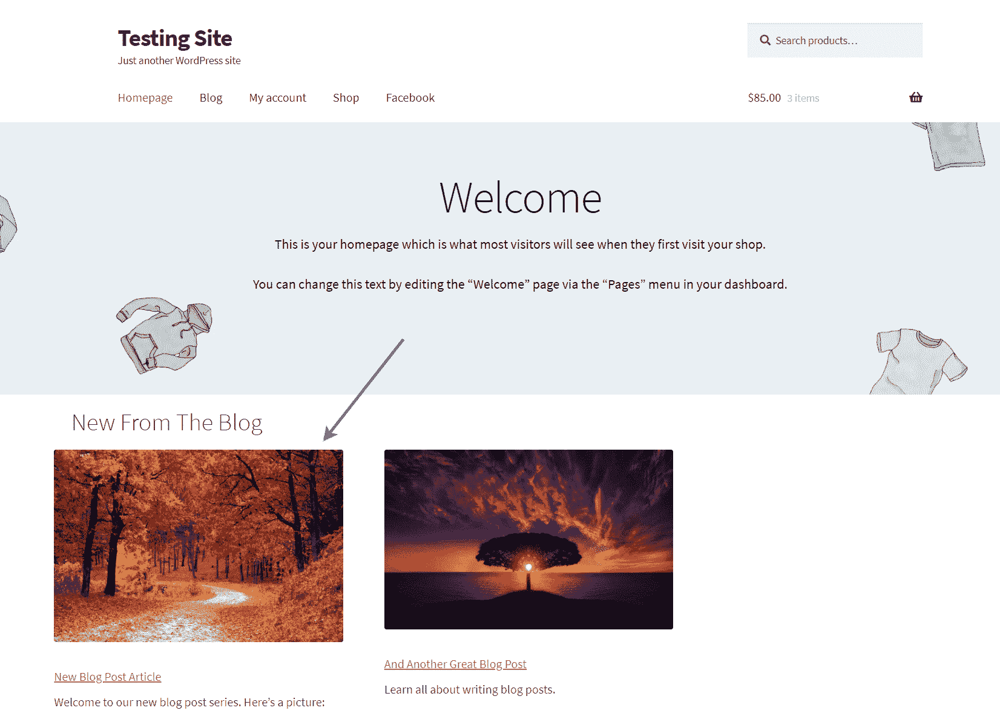

Gallery of posts showing the featured images


如果你的特色图片问题不是源于对上传过程的误解，请继续阅读。


### 在 WordPress 中偶然选择了封面图片和特色图片

WordPress 用户犯的另一个简单但常见的错误是为一篇文章或一个页面实现一个封面图片，并假设它像一个特色图片一样工作。

封面和专题图片的功能相似，在文章和页面的顶部提供大照片，但它们也有一些不同。WordPress 最近才在其[古腾堡编辑器](https://kinsta.com/blog/gutenberg-wordpress-editor/)中添加了**封面**区块。因此，这个问题是那些使用它的人独有的。

#### 封面图片和特色图片的区别

封面图像提供了一个宽或全幅图像部分，可以添加到网站的任何地方。它用于显示新章节或文章的开始。您可以在文章或页面的任何位置插入封面块，而不仅仅是在开头。因此，封面图片是文章或页面本身的一部分，而不是像专题图片那样独立出来。

当一篇文章在你的网站或网上被分享或分发时，一个特色图片作为代表该文章整体的主要文章或页面图片。特色图片有自己的上传部分，远离内容编辑器。它通常位于文章或页面的顶部。

您的主题编码通常会构建特色图像的位置和格式。因此，您可能需要[使用自定义代码](https://kinsta.com/blog/how-to-customize-wordpress-theme/)来自定义特色图像的外观。

最后，封面图像允许它自己的[独特的定制选项](https://kinsta.com/blog/wordpress-5-6/#background-patterns-in-cover-block)，比如在图像顶部放置覆盖文本或包含过滤器的能力。一般来说，封面图片比专题图片更容易直接从 WordPress 仪表盘定制。

#### 观看封面图片(以及它与特色图片的不同之处)

让我们来看看封面图片和特色图片的基本区别。两者都可以通过进入**帖子**或**页面**菜单，并创建一个新项目或访问旧页面或帖子来访问和实现。

您可以在所有帖子和页面的右侧**设置**面板中找到**专题图片**。它与主要内容是分开的。

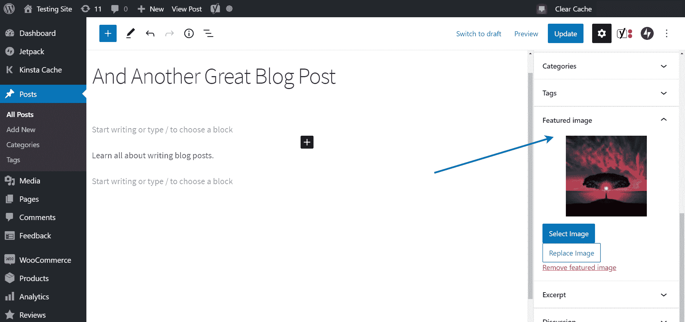

Featured image in action


相比之下，**封面**模块位于古腾堡模块库中，点击编辑器中的**添加模块**按钮即可访问。**添加块**按钮看起来像一个“ **+** ”符号。

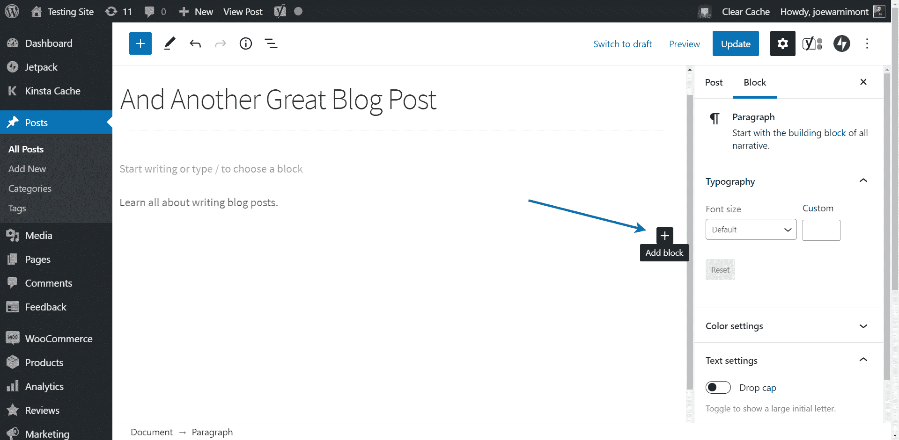

Click the ‘Add Block’ button


您可以搜索**封面**区块，或者在库中滚动查找。

点击**封面**块，将其插入你的文章或页面。

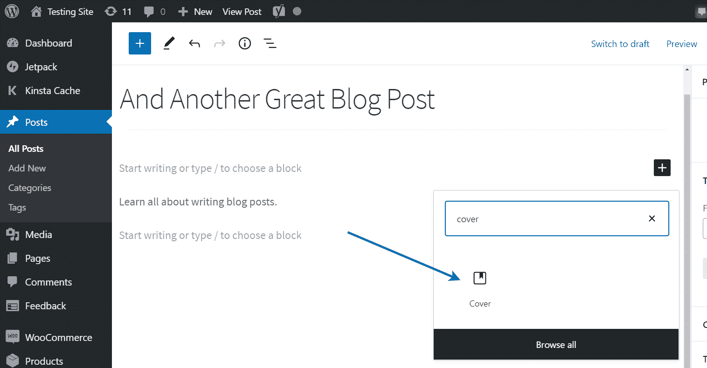

Pick the ‘Cover’ block


封面块被放置在内容编辑器中，远离我们看到特色图像的区域。

您可以通过点击**选择媒体**或**上传**按钮上传一张图片作为您的封面。

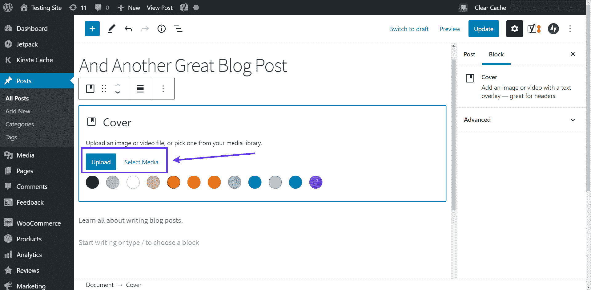

Select media for your cover image


新的封面显示在编辑器预览中，您还可以在右侧面板中编辑块的设置。

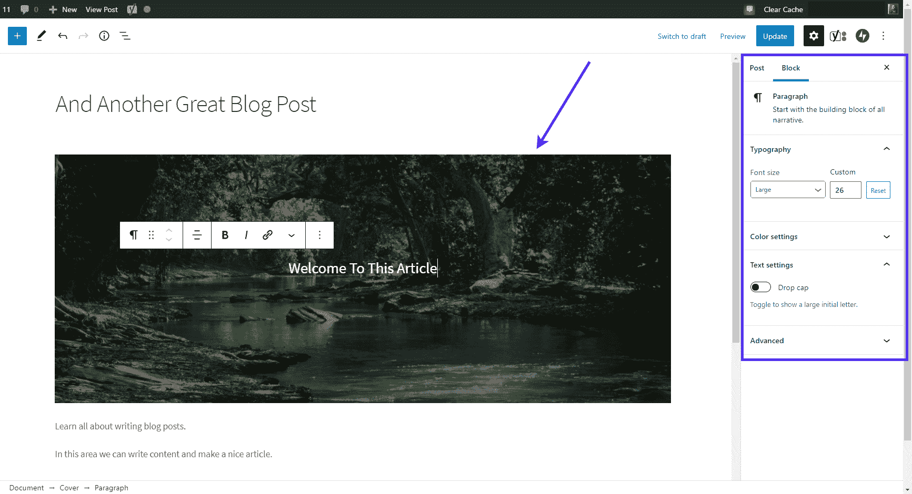

That’s a cover image


调整封面以填充页面的整个宽度也很常见，这使得在各节之间引入文章或分隔符更加有效。

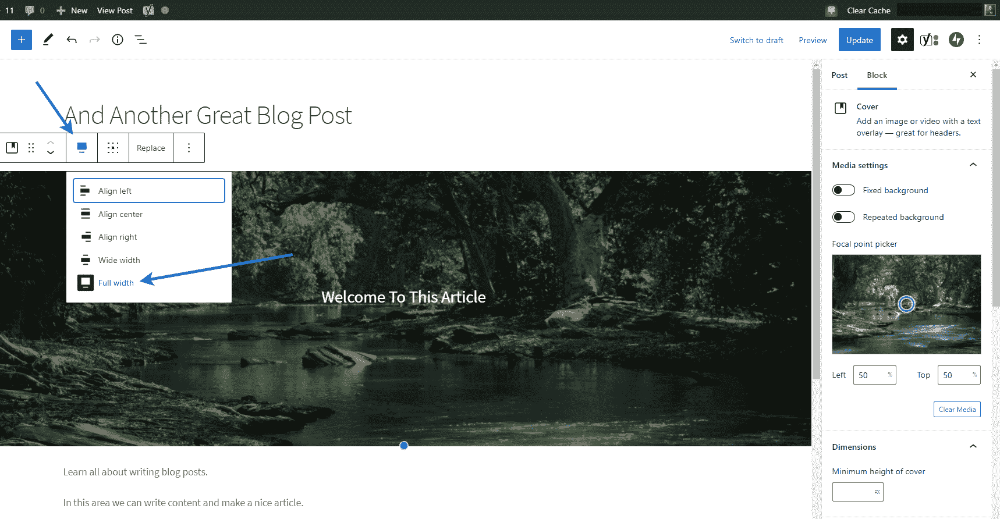

Choose the alignment for your cover image


总的来说，如果你正在[编辑一个图片](https://kinsta.com/knowledgebase/wordpress-image-caption/#how-to-edit-the-caption-for-an-existing-image)，比如一个封面或者一个标准的媒体项目，你就不会在 WordPress 帖子或者页面编辑器中使用一个特色图片。

这可能是你特色形象问题的根源。封面图片，或者放在文章内容区域的任何图片，不会作为特色图片出现在其他地方(比如在**最近文章**列表中)。
T3】

## 如果有重复的特色图片怎么办？

一些 WordPress 用户完成了所有正确的步骤来[上传](https://kinsta.com/knowledgebase/bulk-upload-files-wordpress-media-library-ftp/)一张特色图片，但是意识到一张特色图片的复制品出现了。你通常会在帖子列表或页面或帖子的顶部看到这种情况，导致两张相同的照片叠放在一起。

这很可能是因为您上传了一张特色图片，同时还在内容中包含了相同的图片作为封面或常规图片。它会导致像这样的图像重复问题:

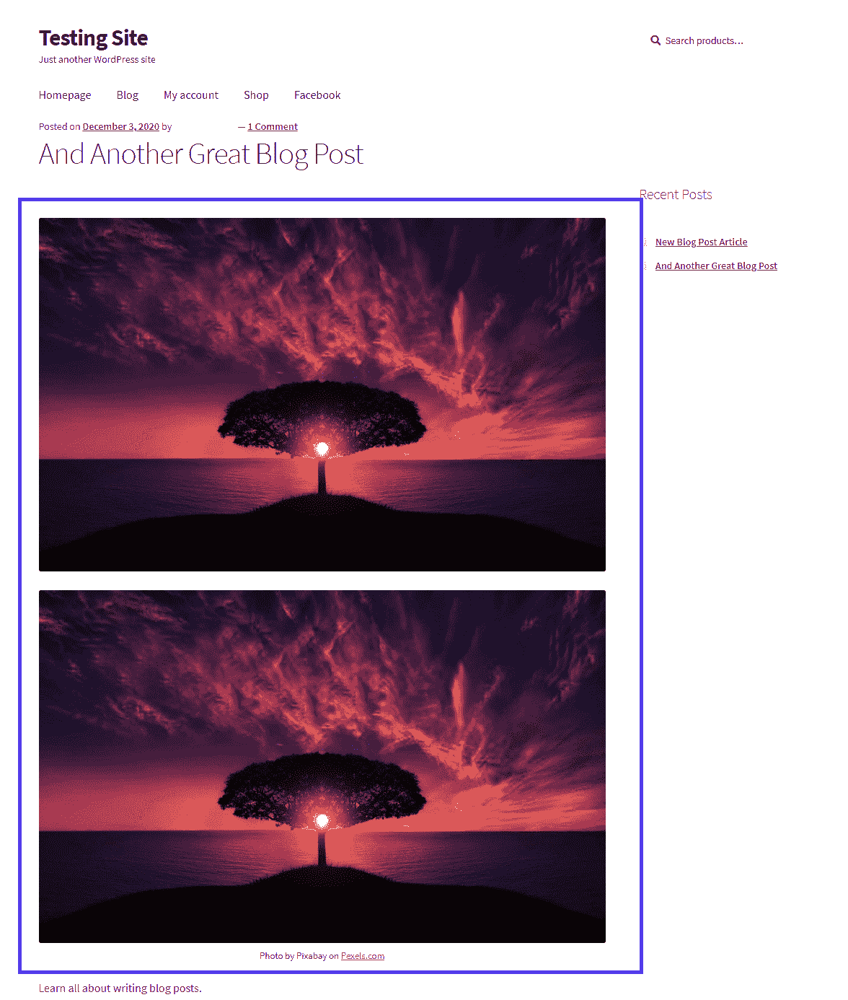

Duplicated featured images


很明显，你不想这样。通常，重复的特色图片不是两张特色图片，而是一张特色图片和一张单独的照片放在文章的内容区域。

要检查，去有问题的 WordPress 文章或页面编辑器。找到页面右侧的**设置**面板。然后，选择**帖子**(如果编辑页面，则选择**页面**)选项卡，显示帖子的设置。

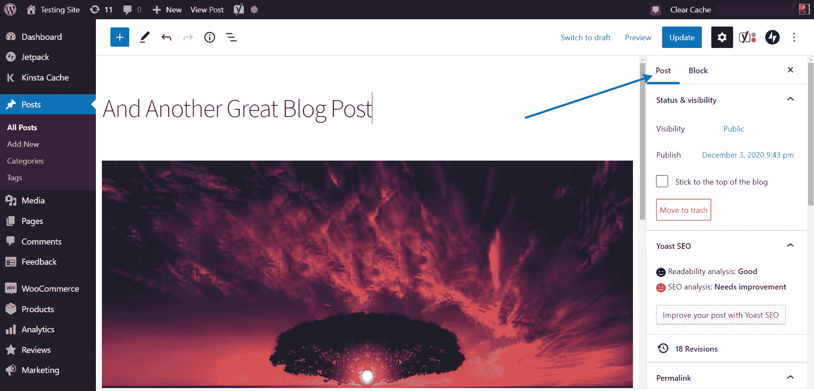

Go to the post settings


在面板上向下滚动并打开**特色图像**下拉项目。

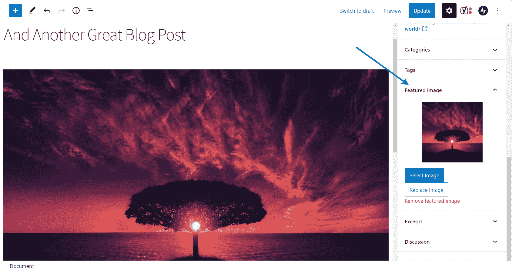

Check the ‘Featured Image’ tab


如果您在**特色图片**标签下和您的内容中看到相同的照片，这就是问题所在！

对此有两种解决方案。首先，你必须决定你想要达到的目标。如果目标是没有特色图片，你可以完全删除它。

我们经常遇到一些人想要那个特色图片，并且简单地认为内容编辑器是放置它的地方。在这种情况下，您应该将照片保留在特色图片区域下，并删除文章内容编辑器中的照片。

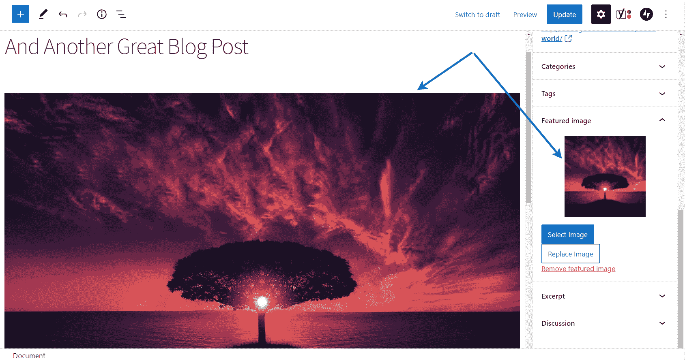

Showing the featured image


要删除该图像块，请在选择图像块后单击三点图标。

点击列表最末端的**移除块**选项。

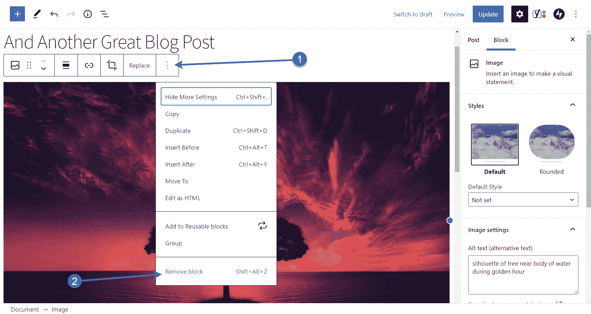

Show more settings by clicking the three-dot icon


现在帖子的开头应该没有图像——只有在**特色图像**模块中的图像缩略图预览。

如果你想要一个没有重复的特色图片的功能，它就应该是这样的！

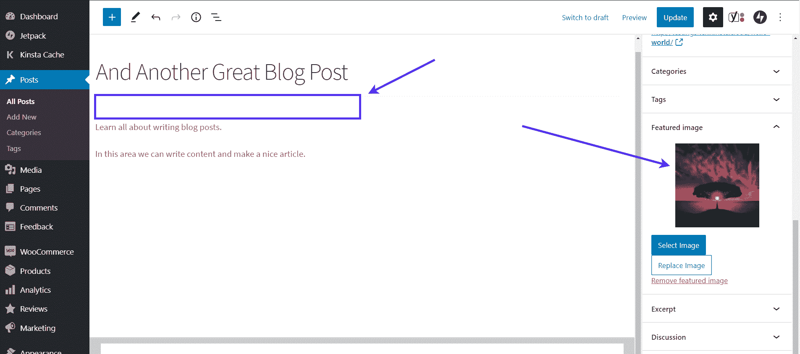

Fixing WordPress featured image not showing properly


## 特色图片看起来不对怎么办？

你已经知道如何上传特色图片，并完成了你的文章内容。接下来唯一要做的就是审核发布帖子。

不幸的是，您发现特色图片并不像您希望的那样好看。

也许您会遇到以下情况之一:

*   特色图像太小或太大。
*   拉长了或者模糊了。
*   缩略图显示的大小不正确。

幸运的是，WordPress 已经为你提供了广泛的图片编辑工具，以确保特色图片看起来专业。了解哪些类型的照片适合作为特色图片也是明智的，看看原始照片是如何引起问题的。

### 了解哪些照片适合作为特色图片

知道哪些照片在 WordPress 上好看是一个很好的练习。不仅如此，重要的是要认识到，与上传到帖子或页面的普通照片相比，特色图片的显示是不同的。

[从尺寸](https://kinsta.com/blog/social-media-image-sizes/)开始，所有网站，或者更具体地说，网站主题，对于帖子中的特色图片都有不同的尺寸。在上传图片之前计算出最佳尺寸可以让你最大限度地减少图片被拉长或被奇怪地裁剪的情况。

尽管 WordPress 特色图片没有推荐的尺寸，我们建议从 1200 x 628 像素开始。

这意味着你不能简单地拍摄任何照片，并期望它作为特色图片看起来很棒。在上传到 WordPress 之前，你最好编辑一张照片以符合那些建议的尺寸。

然而，1200 x 628 像素的建议只是一个起点。你可能会发现，你的主题与稍微宽一点或短一点的特色图片配合得很好。

以下是上传特色图片前需要遵循的一些一般规则:

*   坚持横向尺寸超过纵向照片。当宽度大于高度时，特色图片看起来更好，通常比例约为 2:1。
*   在测试贴上上传多种尺寸的照片，并记下每张照片的尺寸。这应该让你更接近你的主题的最佳特色图像尺寸。
*   避免太大或太小的图片。较大的图像被压缩，质量下降，而较小的图像被拉伸，最终看起来非常模糊。
*   考虑使用 WordPress 内置的图片编辑工具来编辑那些已经上传的特色图片，但是可以做一些修改。

另一个寻找和设置完美特色图片尺寸的策略是访问你的 WordPress 仪表盘的媒体部分。

转到**设置>媒体**。

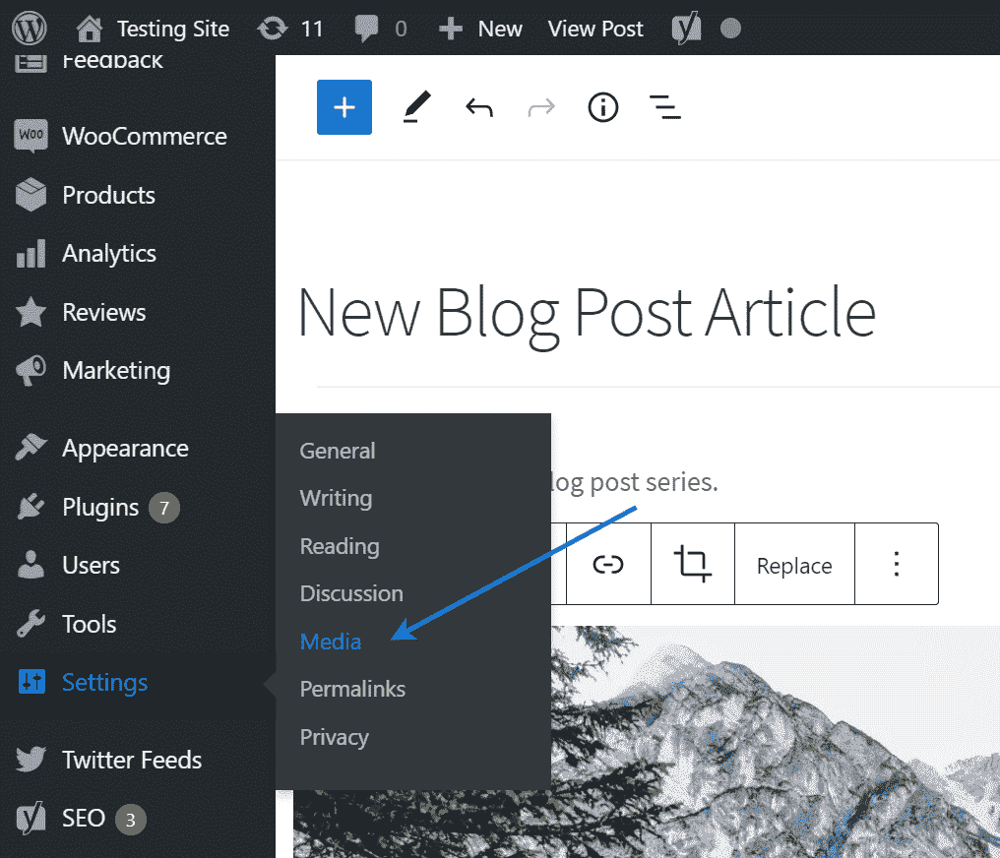

Go to the ‘Media’ library settings


这些是你整个 WordPress 网站的一般媒体设置。设定尺寸决定了给定图像尺寸下您在网站上看到的最大尺寸。

在 WordPress 上经常配置三种图像尺寸:**缩略图**、**中号**和**大号**。

缩略图大小是显示在网站其他部分的特色图片，不在文章本身。例如，你可能会看到特色图片出现在你主页上的最近文章列表或[博客订阅源](https://kinsta.com/blog/wordpress-rss-feed/)中。

您可以选择将特色图像缩略图裁剪到精确的尺寸。或者，最好不要选中**裁剪缩略图**框，因此缩略图尺寸更多地用作指导。这样，缩略图保持成比例，您不会看到任何意外的裁剪效果。

当显示在帖子或页面的顶部时，**大尺寸**通常决定了特色图片的尺寸。有时其他设置会覆盖这一点，但记下尺寸以确保您至少知道特色图像的最佳宽度并不是一个坏主意。

最大高度并不重要，因为你的特色图片不应该那么高。

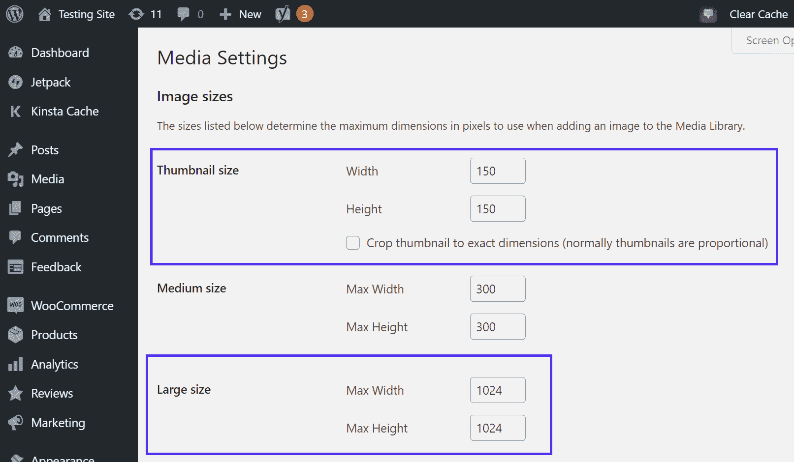

Setting the various media sizes


### 如何在 WordPress 内编辑特色图片

在 WordPress 中编辑特色图片通常是解决特色图片过大或需要裁剪的最简单快捷的方法。

我们通常建议在将图片上传为特色图片之前对其进行编辑(第三方编辑工具具有更高级的功能)。尽管如此，WordPress 还是提供了简单的编辑功能,这对于一些用户或者那些想要编辑已经上传到 WordPress 的特色图片的人来说可能更容易。

要在 WordPress 中编辑特色图片，打开一个帖子并滚动到**帖子设置**面板中的**特色图片**部分。

单击专题图像缩略图以访问其各种设置。也可以通过进入**媒体库**来定位你的 WordPress 网站上的所有图片。

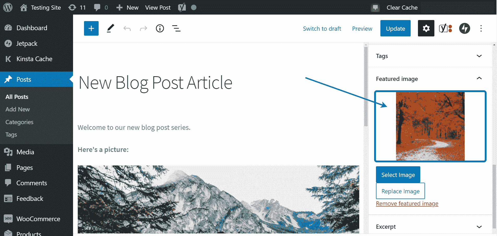

You can see the featured image on the side


确保在媒体库中选择了正确的特色图像。

点击**编辑图像**链接继续编辑。

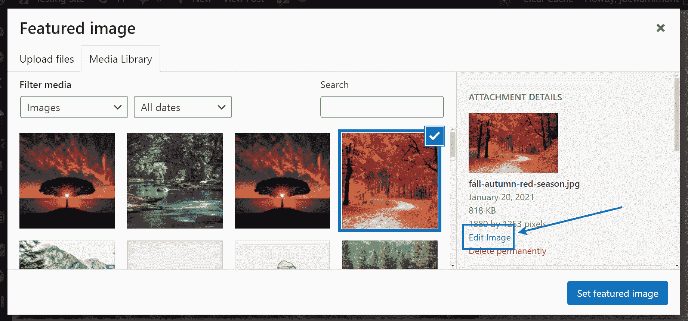

Click the ‘Edit Image’ link


在**编辑图像**弹出窗口中有几个工具可用，但其中最可靠的列在右边，它的标题是**新尺寸**。

这允许你输入新的尺寸，包括宽度和高度，这样已经上传的特色图片就会缩小。我们不建议试图放大图像，因为这只会使它变得模糊。

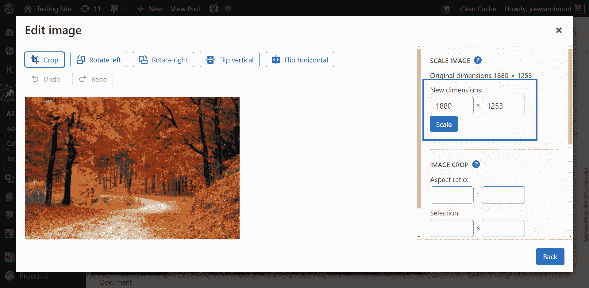

Set the image dimensions


输入新尺寸并点击**比例**按钮。

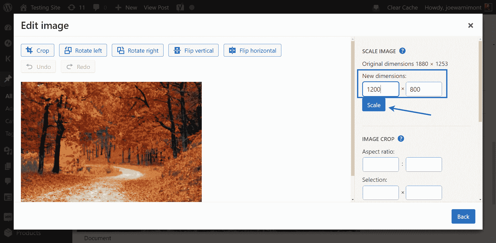

Choose the ‘Scale’


预览图像应该看起来比以前小一点，除非变化非常小，以至于您没有注意到。

您将看到一条消息，告诉您保存了的**图像。新尺寸也列在弹出窗口的右侧。**

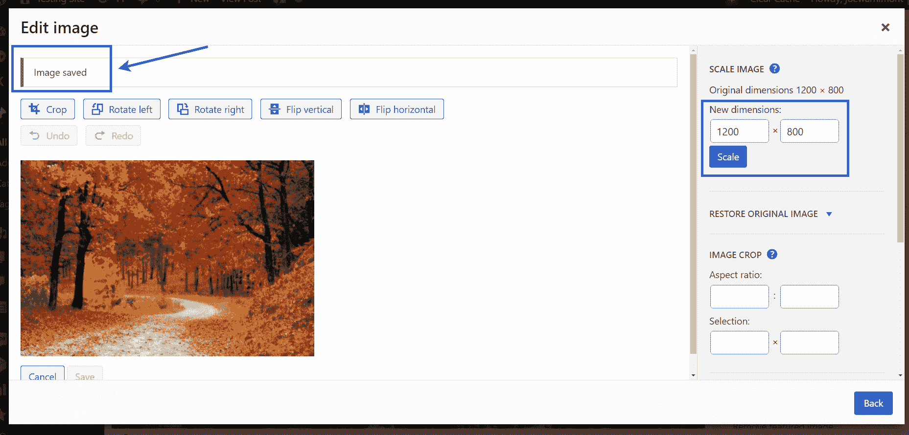

Saving the edited image


所有其他图像编辑工具都位于特色图像预览上方。

WordPress 的一些内置图像编辑功能包括:

*   农作物
*   左旋 90 度
*   右旋 90 度
*   垂直翻转
*   水平翻转

**裁剪**工具通常是最重要的，所以点击它来激活编辑模块。

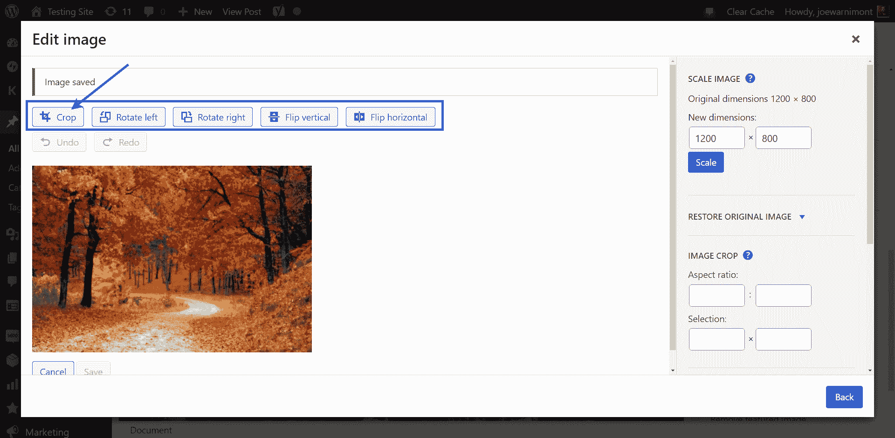

Click the ‘Crop’ button


**裁剪**工具在预览缩略图中显示一个正方形，要求您单击并拖动裁剪框，使其达到您想要的精确尺寸。

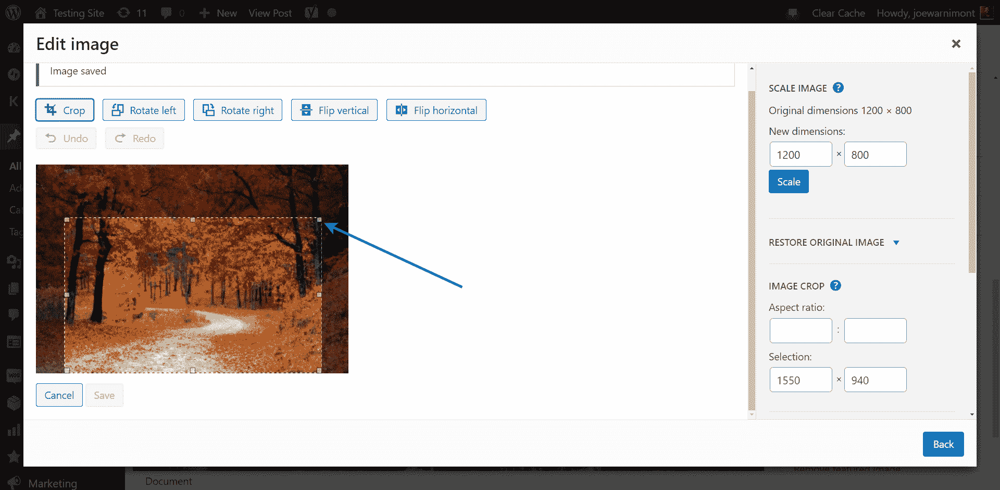

The image crop box


点击 **Enter** 键激活裁剪并在预览中查看结果。你也可以选择**保存**作物，即使它已经为你完成了。

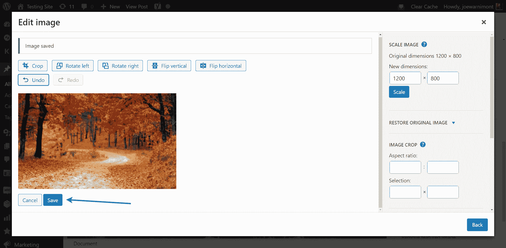

Click the ‘Save’ button


在 WordPress 中编辑特色图片的最后一种方法是裁剪图片，但保持一定的长宽比。这意味着当您移动裁剪框时，它会保持纵横比。

例如，你可以输入一个 **2 x 1** 的纵横比。此后，每次拖动裁剪框时，它将始终保持 **2 x 1** 的比例，给你更少的裁剪自由，并确保你的比例在创建特色图像时保持一致。

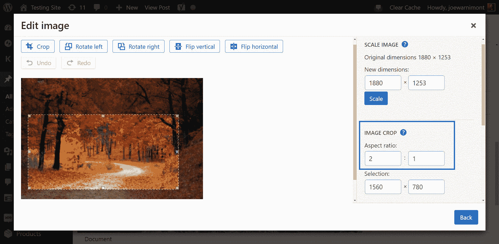

Cropping the image


每当你编辑完一幅图像，你可以点击**回车**激活编辑，然后**保存**图像。之后，你就可以把新版本的图片插入到文章、页面、特色图片或者任何你想让它出现在你网站上的地方。

此外，在**编辑图像**面板中有一个选项，可以让你[随时将](https://kinsta.com/blog/wordpress-multisite-to-single-site/)恢复到原始尺寸。

## 修复页面和帖子上没有显示的 WordPress 特色图片

如果你已经正确上传了帖子或页面的特色图片，但它仍然没有出现，那么可能有几个原因。不过，这取决于你的 WordPress 站点的配置、主题和插件。以下是首先导致特色图片出现问题的一些常见原因:

*   尝试上传图像时出现 [HTTP 错误](https://kinsta.com/blog/http-status-codes/)，这可能意味着上传限制或图像格式有问题。
*   [搜索引擎](https://kinsta.com/blog/alternative-search-engines/)可能会屏蔽包含可疑代码或恶意软件的特色图片。
*   您的[用户类型](https://kinsta.com/blog/wordpress-user-roles/)被禁止访问上传或查看特色图片所需的页面。
*   您的主题或插件有错误，或导致与您的特色图像的工作冲突。
*   主题不允许特色图片，或者你必须通过主题设置打开它们。
*   您可能无法以正确的方式上传特色图片。
*   您可能会发现主题编码不支持特色图片。
*   一个延迟加载插件可能会阻止特色图片显示或快速加载。
*   特色图片可能不在页面或帖子模板中的正确位置。
*   您的仪表板设置可能会完全关闭特色图像字段。

### 如何修复特色图片的 HTTP 错误

在 WordPress 中将图片上传到媒体库时，一些错误比其他错误更常见。

幸运的是，随着 WordPress 的发展，错误已经变得不那么模糊了，这使得确定它们的原因变得更加容易。

但是，您仍然可能会看到一个模糊的错误，如下面的“HTTP 错误”消息。这通常意味着图片本身有问题，或者你需要[允许更大的上传](https://kinsta.com/blog/wordpress-maximum-upload-file-size/)到你的 WordPress 站点。

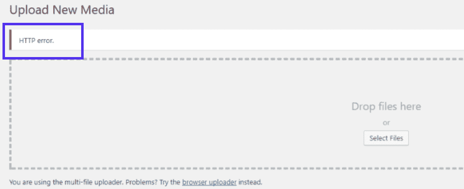

HTTP error while uploading new media


更常见的是看到一些具体的内容，如一条消息告诉您某个图像或视频“超过了该网站的最大上传大小”

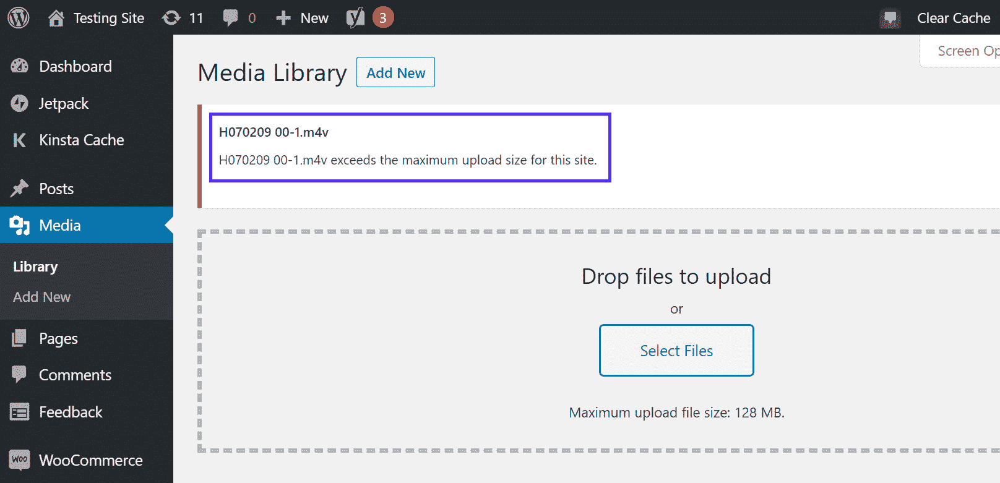

The file exceeds the maximum upload size


不管怎样，所有这些错误都让用户感到沮丧和困惑。即使他们告诉你图像太大，你如何从那里继续前进？

一般来说，以下解决方案有助于解决告诉您图像过大或当前不支持上传的错误代码:

*   [增加你的 WordPress 内存限制](https://kinsta.com/knowledgebase/wordpress-memory-limit/)。
*   [减小图像文件大小](https://kinsta.com/blog/optimize-images-for-web/)。

#### 增加你的 WordPress 内存限制

你的主机提供商经常设置 WordPress 内存限制。你可以[联系你当前的主机提供商](https://kinsta.com/contact-us/)，要求他们扩大 PHP 的限制。

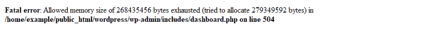

Memory limit exhausted error as it appears in WordPress


如果允许，你也可以通过编辑你站点的**wp-config.php**文件来改变 PHP 内存限制。在某些情况下，你将不得不[升级到一个更大的主机计划](https://kinsta.com/plans/)，为你的网站提供更多的资源。

我们建议[看一看他的指南](https://kinsta.com/knowledgebase/wordpress-memory-limit/)来详细地引导你完成这些步骤。

#### 减小图像文件的大小

上传大量文件到你的 WordPress 站点会导致性能问题，并且会给你的主机服务器带来太多的负担。因此，许多主机和 WordPress 本身都定义了一个最大上传文件大小。

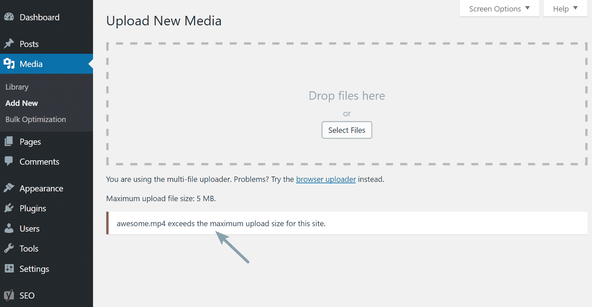

Another example of the maximum upload size error in WordPress


此外，你在网站上使用的任何图片，包括特色图片，都不应该那么大。在压缩、裁剪或调整大小后，您仍然可以保持图像的质量。只要你不把图片做得太小，你仍然可以提供一个漂亮的特色图片。

因此，我们建议在选择增加 PHP 内存限制之前，使用工具进行裁剪、压缩和调整大小。

你可以使用的一些非 WordPress 图片编辑工具有 GIMP、Photoshop Express 和 Paint.NET。

在 WordPress 内部编辑也是一个选择，但是这通常不能解决 WordPress 图片的问题。如果你走这条路，我们推荐一个图像压缩插件，它可以自动缩小和优化上传到 WordPress 的所有图像，比如 [Optimole](https://kinsta.com/blog/optimize-images-for-web/#optimole) 或 [Imagify](https://kinsta.com/blog/optimize-images-for-web/#imagify) 。这样，你就不会因为太多的大照片而限制网站的资源。

### 如何修复带有可疑编码的图像

不幸的是，带有[恶意软件](https://kinsta.com/knowledgebase/the-site-ahead-contains-malware/)或病毒的图像已经受损。好消息是 WordPress 因为这个原因屏蔽了一个图片，这意味着 WordPress 已经完成了它的工作！

虽然有有限的简单解决方案来删除可疑的代码，但你最好的选择是坚持使用你合法购买的照片或自己拍摄的照片，而不是直接从谷歌上下载(这在技术上是非法的)或从粗略的网站上找到图像。

我们还建议您与一家认真对待恶意软件并提供[恶意软件安全保证](https://kinsta.com/knowledgebase/malware-security/)的公司托管您的网站。

### 如何更改权限以允许查看特色图像

WordPress 权限决定了谁可以读、写或编辑网站文件。另一方面，[用户角色](https://kinsta.com/blog/wordpress-user-roles/#how-to-manage-wordpress-user-roles-effectively)决定了某些人可以访问 WordPress 仪表盘和前端网站的哪些区域。

您当前的用户角色可能不允许您上传或查看特色图片。另一个问题是你的 WordPress 文件中的某个页面或文章由于用户权限而无法访问。

解决此问题的关键是确保您的用户角色和权限都设置正确。

我们建议[阅读我们的 WordPress 用户角色指南](https://kinsta.com/blog/wordpress-user-roles/)，以确保你团队中的每个人都能随时访问和查看特色图片。

### 如何解决主题或插件的冲突或问题

主题和插件是特色图片失败或被屏蔽的常见原因。

并非所有主题都有相同的特色图像设置。有时，页面的特色图片会被完全屏蔽。其他时候，您可能会注意到主题在与预期不同的位置呈现了一个特色图像。

此外，您可能需要配置特定的主题设置，以便为所有帖子填充特色图片。

不幸的是，我们不能向你介绍这些问题的解决方案，因为这需要你查看主题设置或者联系主题开发者。

然而，插件冲突是另一回事。插件，虽然对建立一个 WordPress 网站很有用，但偶尔会有有问题的编码。或者他们只是不更新，导致各种各样的冲突。

这不是一个规则，但当一些插件可以访问您的媒体库或改变所有图像的功能时，也会经常看到特色图像的问题。

无论如何，最好的做法是遵循以下步骤:

1.  [更新您网站上安装的所有插件](https://kinsta.com/blog/uninstall-wordpress-plugin/)。
2.  查看您现在是否可以上传并查看您的特色图片。
3.  如果问题解决了，那么这是一个源于过时插件的错误。
4.  如果问题没有解决，继续停用所有插件。
5.  同样，检查所有插件被停用后特色图片是否出现。如果没有，重新激活插件，并转移到问题的不同原因。
6.  如果特色图片现在工作，你的一个插件是问题。
7.  逐个重新激活每个插件。每次重新安装后，您都应该检查功能图像是否仍能正常工作和显示。
8.  如果特色图像失败，您就知道是哪个插件导致了问题。
9.  卸载插件并寻找替代插件。

### 解决主题对特色图像的支持

关于特色图片的一个有趣的事情是一些 WordPress 主题可能不支持它们。这是由多种原因造成的。主题没有很好地编码，或者开发者故意删除了默认的特色图像功能——主要是因为他们有其他设置来控制特色图像。

不管是什么原因，你可能会发现你的 WordPress 主题不支持标准的特色图片。解决方案通常涉及到主题设置和定位特色图片的自定义区域。

但是，您可能会发现主题在编码中删除了特色图片，并且它没有任何额外的工具来覆盖特色图片的缺乏。

因此，我们建议检查你的主题的[支持](https://kinsta.com/blog/wordpress-support/)的特色图片。你可以通过简单地询问主题开发者，阅读文档，或者去 functions.php 的**文件来完成。**

以下代码块是您可以插入(或寻找)到**functions.php**文件中的内容:

```
add_theme_support( 'post-thumbnails');
```

### 修正了一个由于延迟加载造成的图片问题

[惰性加载](https://kinsta.com/blog/wordpress-lazy-load/)是用于优化图像的众多方法之一，以[提高网站性能](https://kinsta.com/learn/page-speed/)。它通过暂停页面上图像的加载，直到它们出现在屏幕上。例如，一篇长文章中的最后一张图片不一定要加载，直到用户向下滚动到页面底部并找到那张图片。

然而，由于一些[惰性加载插件](https://kinsta.com/blog/wordpress-lazy-load/#lazy-loading-plugins)将特色图像视为常规图像，惰性加载经常导致特色图像出现问题。如果这些插件阻止特色图片显示在**最新帖子**列表中，或者如果它们使特色图片加载缓慢，那么它们可能不是最佳解决方案——为了获得最佳用户体验，特色图片应该立即加载。

许多图像优化插件提供了附加的延迟加载功能。因此，你必须检查每个插件，看看他们是否在你的网站上启用了这个功能。

在你找到潜在的罪魁祸首后，关闭延迟加载，清空你的站点缓存，检查这是否能解决你的特色图片的任何问题。

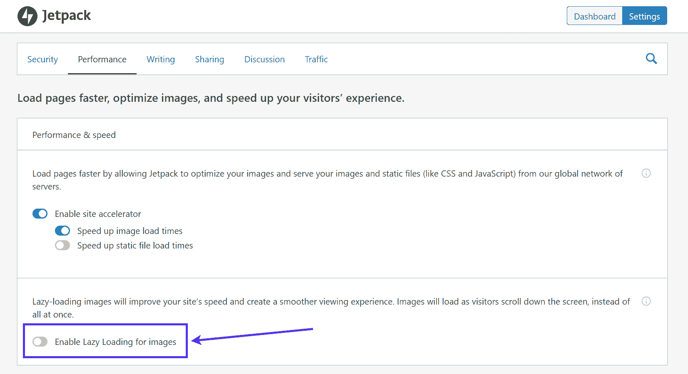

‘Enable Lazy Loading for Images’ with Jetpack


以下是一些倾向于包含延迟加载特性的插件:

*   像 [ShortPixel](https://kinsta.com/blog/wordpress-support/) 和 [Optimole](https://kinsta.com/blog/wordpress-support/) 这样的图像优化工具。
*   直接懒人加载插件比如 [WP 火箭](https://kinsta.com/partners/wp-rocket/)的懒人加载。
*   数据库和网站优化工具，如[自动优化](https://kinsta.com/blog/autoptimize-settings/)。
*   包罗万象的套件插件，如 [Jetpack](https://kinsta.com/knowledgebase/wordpress-jetpack/) 。
*   像 [W3 总缓存](https://kinsta.com/blog/w3-total-cache/)这样的缓存插件。

### WordPress 特色图片没有显示在正确的位置

每个 WordPress 页面和帖子[模板](https://kinsta.com/blog/wordpress-template-hierarchy/)指定了一个特色图片的位置。主题或插件通常会定义它。

你通常会在标题的正下方和第一行的上方找到特色图片。有可能是某个主题改变了这一切。你可能想把特色图片移到另一个位置，比如第一点内容的下面或者作者署名的上面。

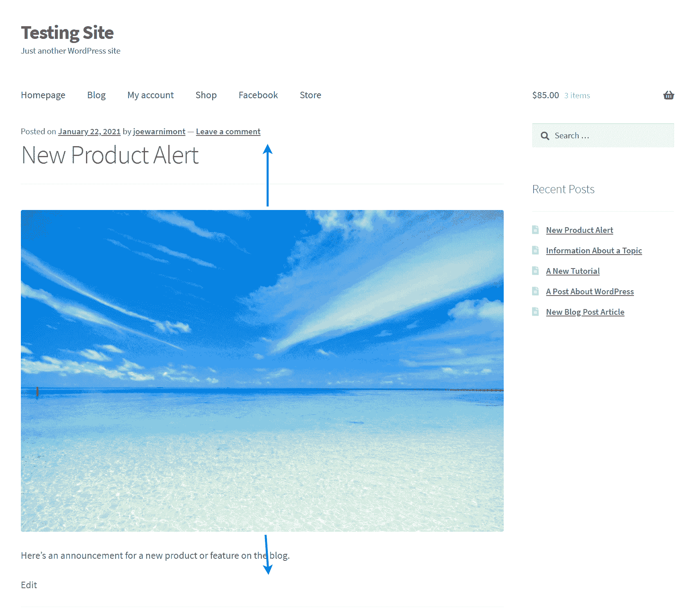

You need to move the image slightly


要调整特色图像的位置，请转到正在使用的页面或帖子模板。

在文件中搜索这段代码:

```
the_post_thumbnail();
```

这段代码是对您的特色图片的引用。帖子缩略图是 WordPress 早期对特色图片的称呼。它告诉 WordPress 在模板的确切位置显示特色图片。`the_post_thumbnail();`功能可能位于页面标题之前或内容之后——这取决于您的页面和主题配置。

要更改特色图片的位置，[剪切这段代码，并将其粘贴到页面/帖子模板中的其他地方](https://kinsta.com/knowledgebase/edit-wordpress-code/)。在模板中给它一个新的位置也会告诉 WordPress 它应该在前端的其他地方呈现。

一如既往，我们建议[在编辑代码之前备份你的 WordPress 站点](https://kinsta.com/help/wordpress-backups/)。调整子主题而不是核心 WordPress 文件也是一个好主意。

### 由于仪表板设置，WordPress 特色图片没有显示

WordPress 特色图片不显示的一个更令人沮丧的问题涉及到[仪表板](https://kinsta.com/knowledgebase/wordpress-admin/)的设置。

这是一个令人沮丧的问题，因为它是仪表板中的一个简单设置，告诉 WordPress 要么显示特色图片部分，要么不显示。

这种情况有两种形式:

*   特色图像不会在仪表板上的帖子和页面列表中显示为缩略图。
*   当您尝试编辑或创建页面或帖子时，特色图像字段丢失。

以下是解决这两个问题的方法。

第一个问题是当你在页面或文章列表中看不到特色图片缩略图时。你可以去**贴子>所有贴子**查看你的文章列表。一个名为**特色图片**的专栏应该出现在**发帖日期**之后。这个专栏展示了那篇特色文章的缩略图版本，让你快速了解什么会出现在你网站的[前端](https://kinsta.com/blog/web-design-courses/)。

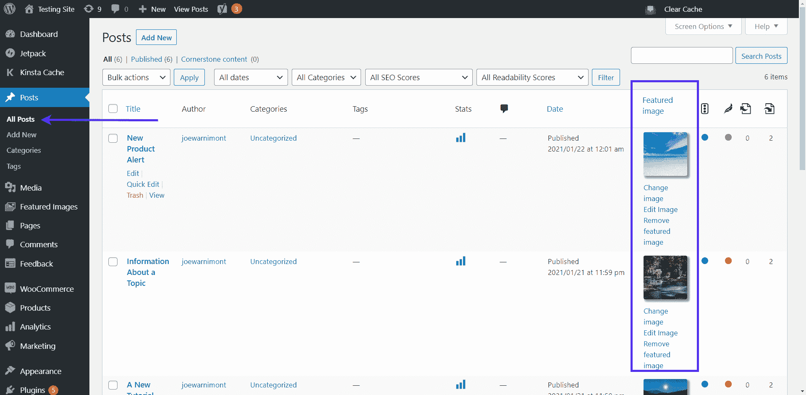

The ‘Featured Image’ list


但是如果那些缩略图无处可寻呢？

这意味着您已经关闭了仪表板上的设置，以显示**特色图片**栏。

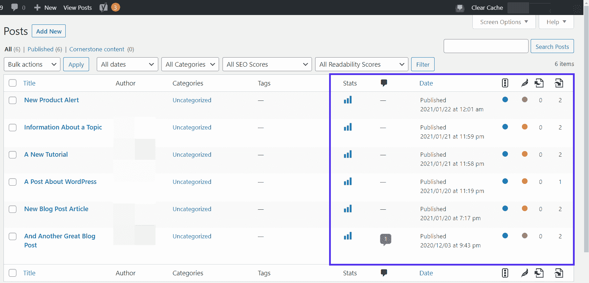

There’s no list of images now


要修复这种情况，找到并点击仪表板右上角的**屏幕选项**选项卡。

你必须在**帖子**或**页面**面板上，右边的**屏幕选项**面板才会出现。

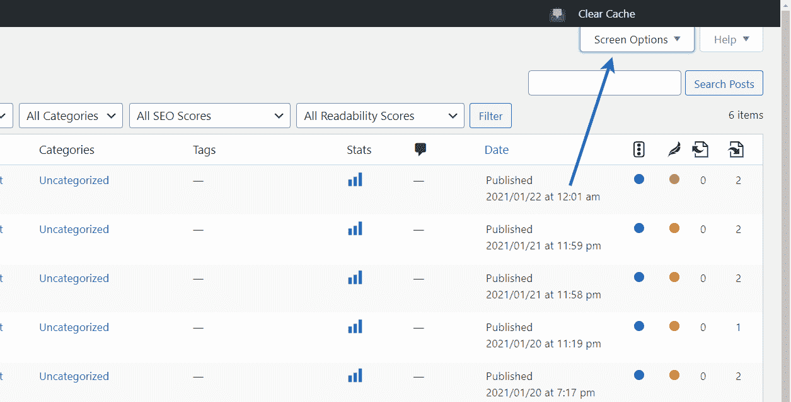

Click the ‘Screen Options’ tab at the top


**屏幕选项**部分有一长串要检查的字段，并设置你想在你的 WordPress 仪表盘中显示的内容。

例如，您可以添加或删除标签、类别和作者等项目。

这里，我们要确保选中了**特色图片**的复选框。

**特色图片**栏现在应该出现在你的帖子或页面列表中。

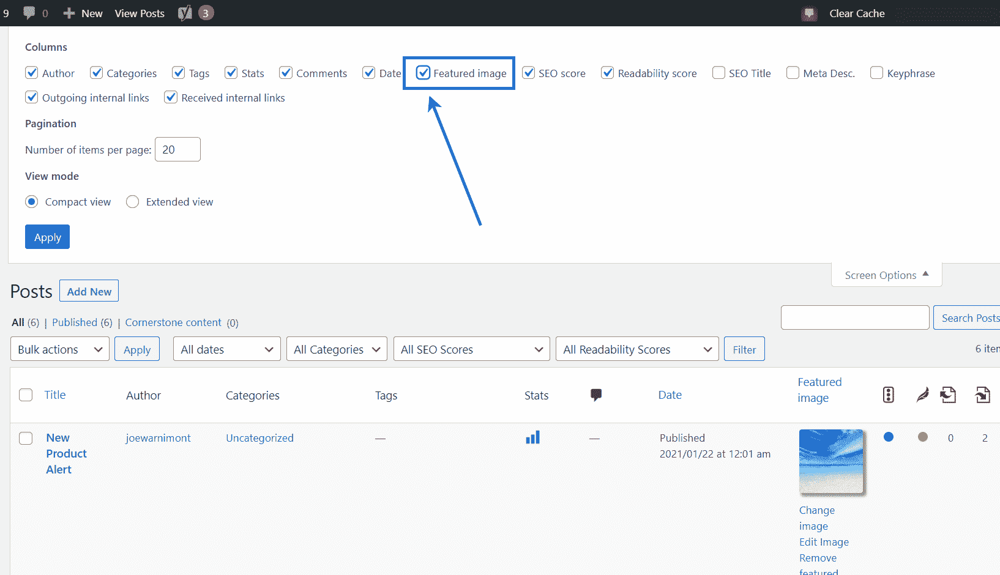

Make sure to tick the ‘Featured Image’ checkbox


另一个**屏幕选项**的困境是当你看不到上传和插入**特色图片**的实际字段时。通过进入文章或页面右侧的**帖子设置**面板，这个字段在所有的 WordPress 帖子和页面上都是可用的。

如果您发现它丢失了，请按照下面的几个步骤激活它。

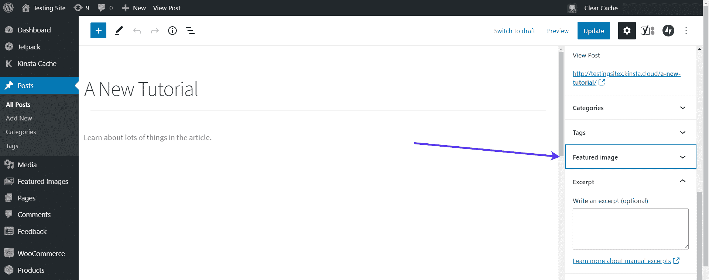

WordPress featured image not showing properly


找到并选择仪表盘右上角的三点图标( **⋮** )。向下滚动设置列表，找到**首选项**选项。

点击**首选项**显示一个新的弹出窗口。

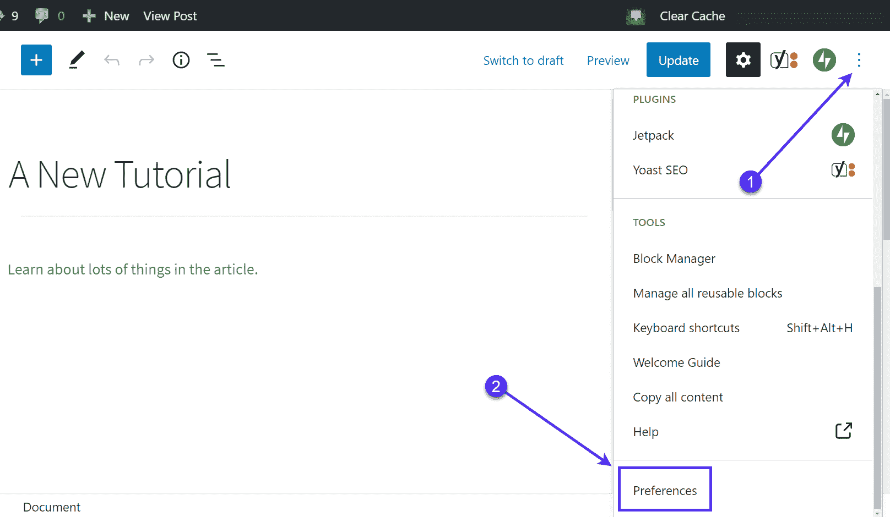

The post ‘Preferences’ tab


**首选项**模块包括一系列用于文档的选项。向下滚动到名为**文档设置**的部分。

在那里，你会发现一个名为**特色图片**的字段。确保在你的帖子和页面中勾选显示**特色图片**选项。

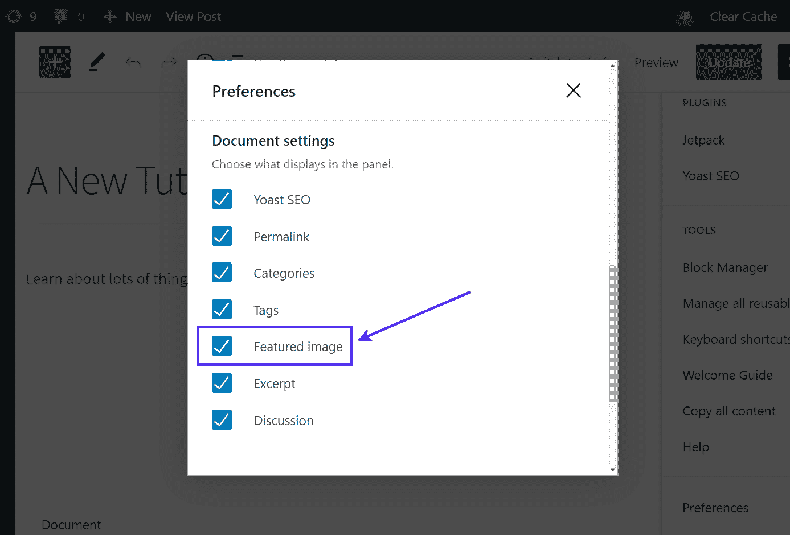

Tick the “Featured Image” checkbox under Preferences


或者，你可能会发现自己在旧版本的 WordPress 编辑器中。这在许多页面中仍然很常见，或者您可能已经回滚了 Gutenberg 编辑器以使用旧的编辑器。

如果是这种情况，打开有问题的页面或帖子，在页面右侧寻找**特色图片**块。

如果它不存在，点击**屏幕选项**选项卡，并选中**特色图像**复选框，在编辑器中显示它。

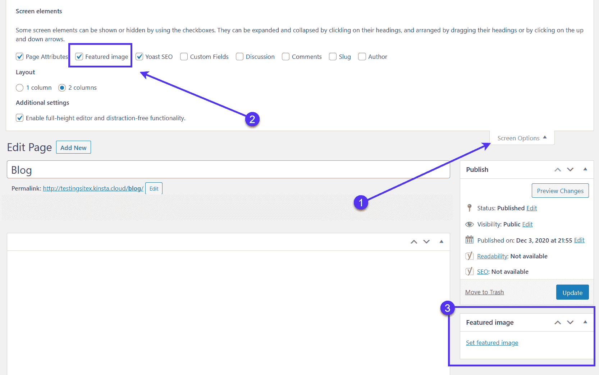

WordPress featured image not showing


### 博客文章库页面上没有显示 WordPress 特色图片

使用特色图片的另一种方式是在你网站的[主页](https://kinsta.com/blog/wordpress-change-homepage/)(或任何其他页面)上列出你的博客文章。

但是如果特色图片没有显示在博客页面上呢？

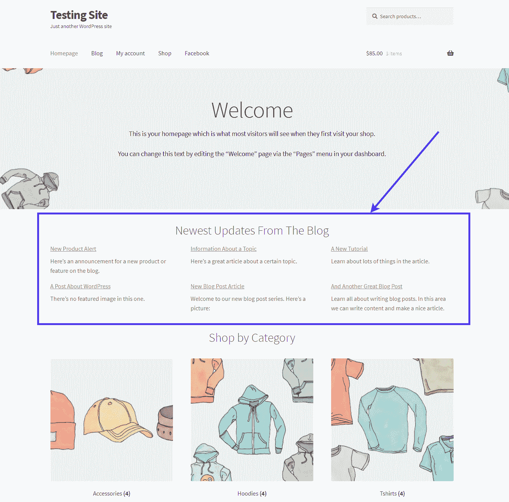

Recent posts listed on the test site


品牌分享最新帖子的列表并不罕见，但是只有链接的图库或 feed 可能不会吸引太多的注意力。

WordPress 提供了几种方法来在网站的其他地方列出你的博客文章，但有时你必须配置正确的设置来确保它们正确显示。

**注意:**许多网站所有者使用第三方[画廊](https://kinsta.com/blog/wordpress-photo-gallery-plugins/)或帖子列表插件来实现这一点。如果你是这种情况，你必须咨询插件的开发者。在本教程中，我们将只讲述如何用内置的 WordPress 工具来修复你的特色图片。

通过在 WordPress 主页页面上添加一个 Gutenberg block 元素，可以显示你最近发表的博客文章的图库或列表。

这意味着你必须制作一个页面，并在 WordPress **Reading** 设置中将它指定为主页。

作为一个快速提醒，你可以通过进入仪表盘中的**设置>阅读**将任何 WordPress 页面转到主页。

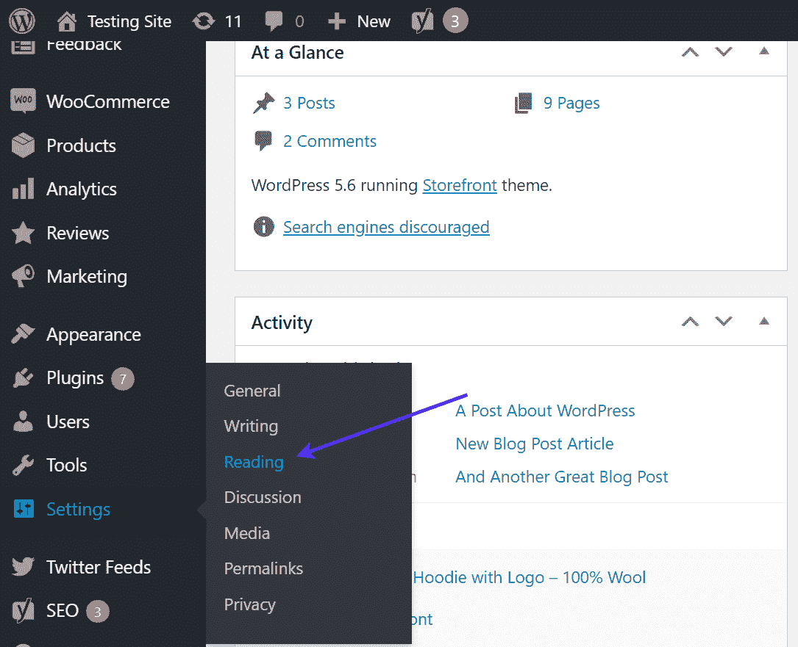

Go to the Reading settings page


确保显示**你的主页的区域**被设置为**一个静态页面**。这表明你希望有一个可定制的主页，能够通过像 Gutenberg 这样的页面生成器添加和删除块元素。这与只显示你的**最新帖子列表**正好相反。

点击**主页**下拉字段，显示您网站上当前活跃的页面列表。在本教程中，我们有一个名为“主页”的页面你的名字可能会有所不同，这取决于你给它起的名字。

**注意:**你随时可以进入这里，改变[静态](https://kinsta.com/blog/wordpress-vs-static-html/)主页。例如，你可能想彻底修改你的主页，制作一个全新的页面比编辑当前页面更容易。

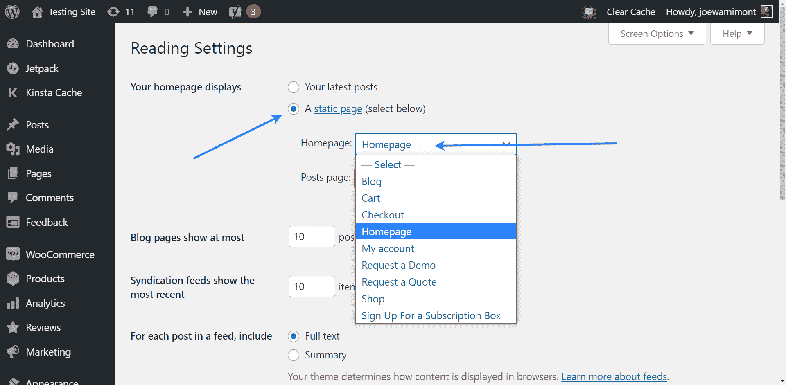

Choose the static homepage


现在是时候查看页面中的内容了，以确保特色图片以应有的方式显示出来。

## 注册订阅时事通讯


### 想知道我们是怎么让流量增长超过 1000%的吗？

加入 20，000 多名获得我们每周时事通讯和内部消息的人的行列吧！

[Subscribe Now](#newsletter)

要向您的主页添加内容，并调整该页面上博客订阅源的设置，请在仪表板中进入**页面>所有页面**。

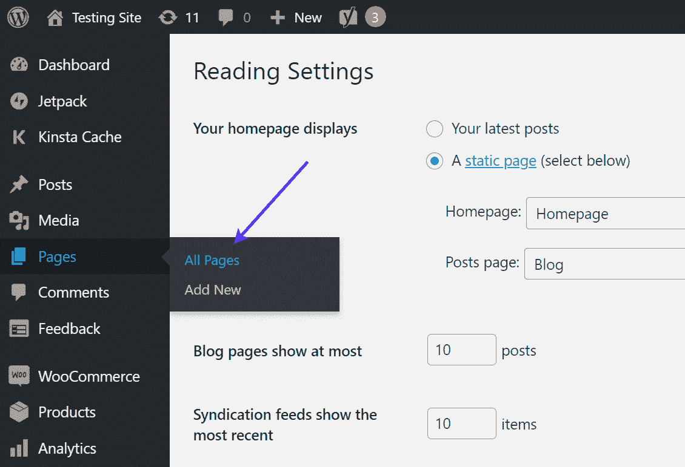

Go to ‘Pages > All Pages’ in WordPress admin


滚动浏览页面列表，找到您指定为主页的页面。它旁边应该有一个**首页**标签。同样，在本教程中，我们将页面命名为“主页”，但是您可能会有不同的名称。

点击指定为**首页**的页面。

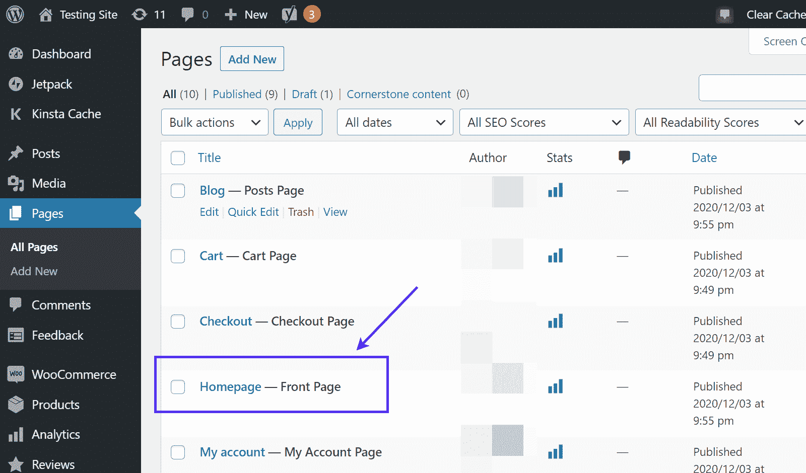

Edit the ‘Homepage’ now


#### 添加最新帖子

你的主页上可能已经激活了**最新帖子**区块，但如果没有，你可以在古腾堡区块库中搜索找到它。这个版块叫做**最新帖子**。你所要做的就是点击图标，把它插入到主页的某个地方。

之后，你可以在主页上随意上下拖动它，这样它就位于合适的位置了。

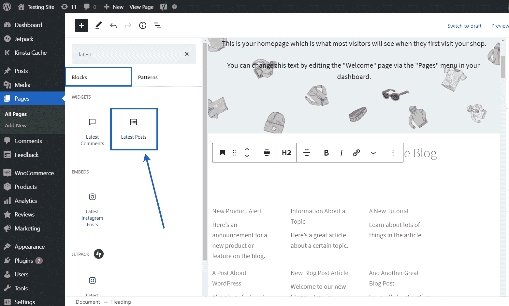

Adding the ‘Latest Posts’ block to the “Homepage”


回到特色图片，当你把**最新文章**块放到页面中时，默认情况下不会显示博客文章的特色图片。你可能会看到一个简单的链接列表，以及这些帖子的[描述](https://kinsta.com/blog/meta-description-wordpress/)。

要添加特色图片，请点击**最新帖子**板块。这将选择整个块，并在右侧面板中显示该块的设置。

确保它在**块**设置选项卡上。您可能需要将其从**页面**切换到**区块**。

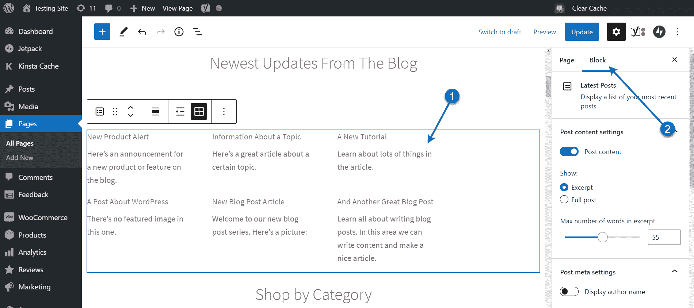

Access the ‘Block’ settings tab


在**块**设置选项卡中向下滚动，查看可用选项。前几个设置与特色图片没有任何关系，但它们会影响帖子在区块中的显示方式，并使您的特色图片看起来很奇怪。

我们建议尝试一下内容设置，比如显示**文章内容**，**显示作者姓名**，或者**显示文章日期**。当突出显示你最近的帖子时，所有这些都会发挥作用，并确保它们看起来像样，同时也显示你的特色图片。

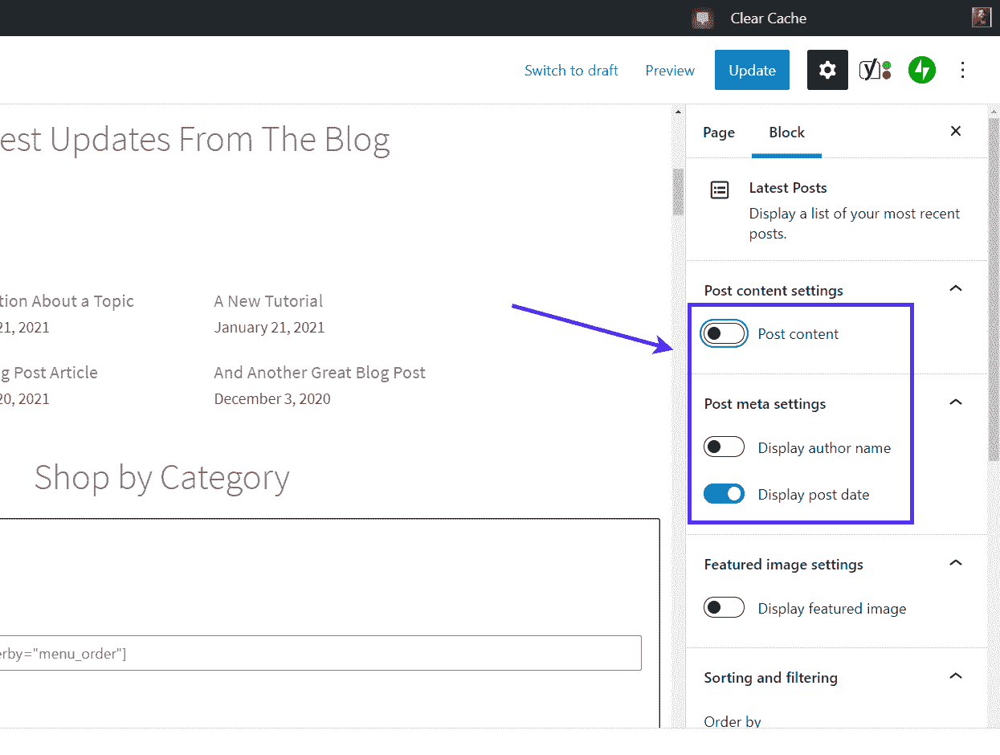

The ‘Post content settings’ tab


下一部分是最重要的元素，因为它激活了**最新帖子**块中的特色图片。

找到名为**特色图像设置**的部分。

在这里，启用**显示特色图像**选项。这将打开所有最新帖子的特色图片。如果一个特色图片没有被分配给一个帖子，它将在它的区块中显示一个空白。

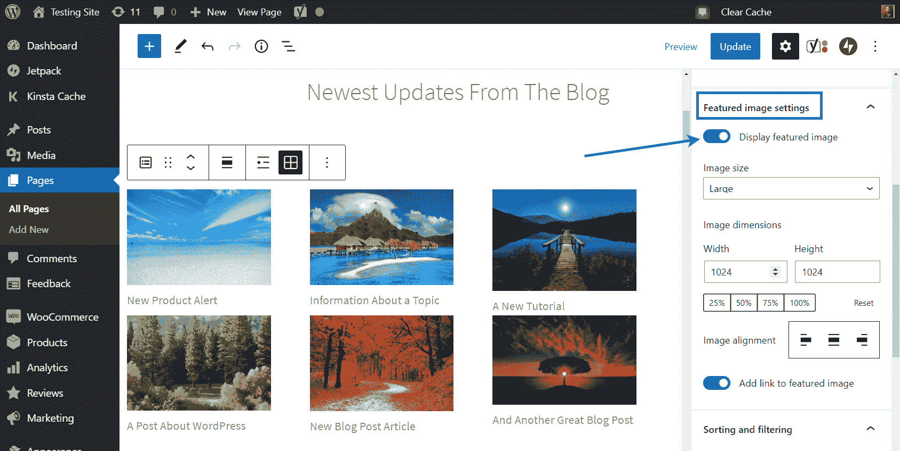

The ‘Display featured image’ option


此外，现在有几个设置可以使特色图像看起来更专业。如果你想在主页上突出你最近的帖子，这一点尤为重要。

例如，**图像大小**字段告诉你的网站列表或图库中的特色图像应该有多大。如果你切换到**缩略图**选项，这些图像会稍微缩小，通常会变成完美的正方形。

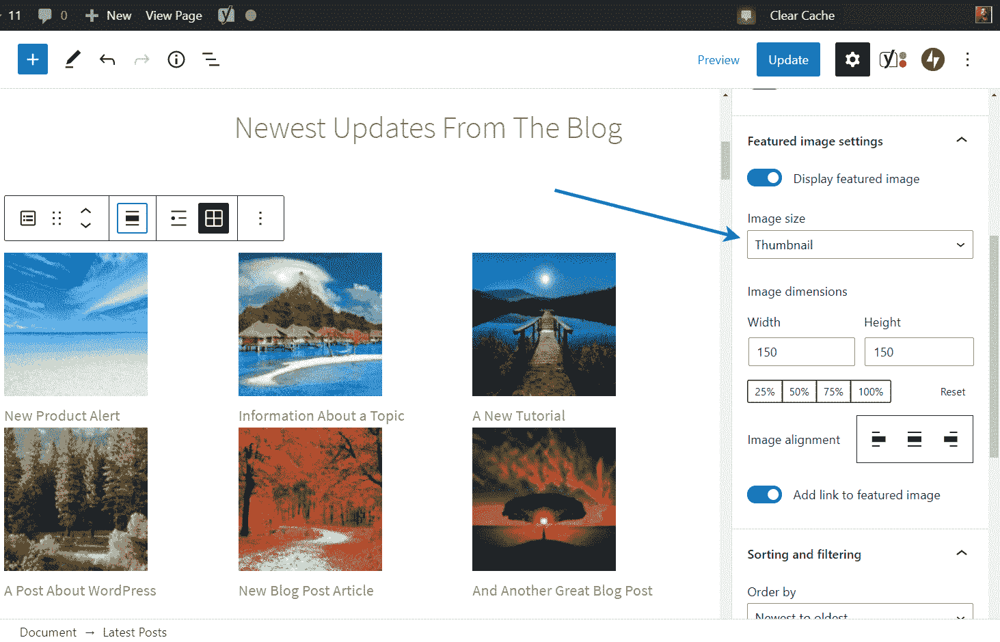

Set the featured image size


将它切换到**大**或**中**调整块中所有特色图像的大小，并根据您的特色图像的尺寸添加更多的风景视图。

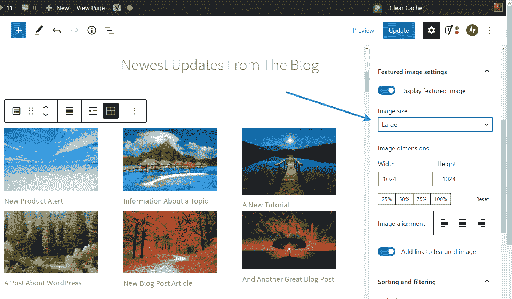

Choose the ‘Large’ image size


我们还建议查看**图像尺寸**。该设置控制显示在**最新帖子**区块中的所有特色图片的大小。您可以键入自定义的宽度和高度，或者确定一个百分比，这样该工具会根据给定的百分比自动更改所有特色图像的大小。例如，你可以将每张特色图片缩小到原始尺寸的 **25%** 。

还有一个**图像对齐**设置来指示图像应该向右、居中还是向左滑动。

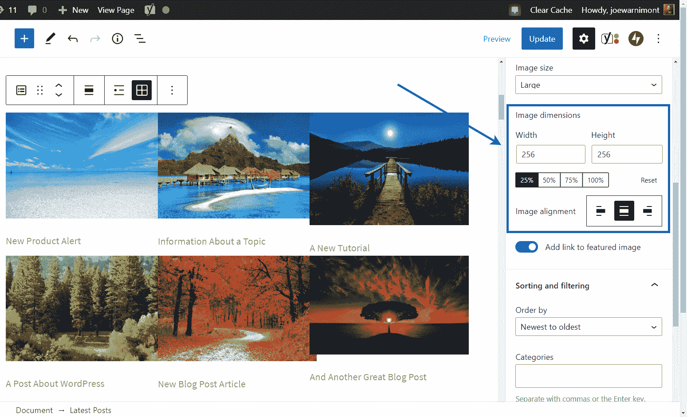

Settings the featured image dimensions


对于**特色图片**部分(在最新帖子块中),最后要考虑的一个方面是你在块中显示的项目数量以及块中有多少列。

和大多数 WordPress 设置一样，这些也会改变你的特色图片的显示方式。这是因为拥有四列比拥有两列或三列的块需要更多的空间(和更小的图像)。

测试**项目数量**和**列**的字段，以确保您的特色图片在主页上发布时既美观又有吸引力。

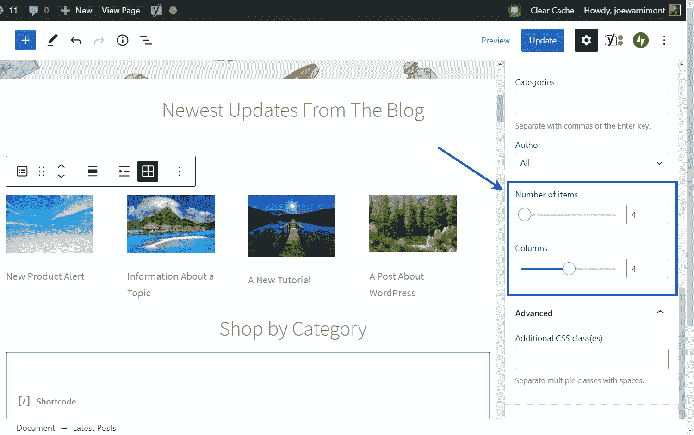

Setting the ‘Number of items’ and ‘Columns’


一旦一切都配置好了，点击**发布**按钮。你最新的帖子应该出现在你主页上放置区块的任何地方。此外，每个帖子的特色图片应该显示在[帖子标题](https://kinsta.com/knowledgebase/hide-page-title-wordpress/)和链接的上方。

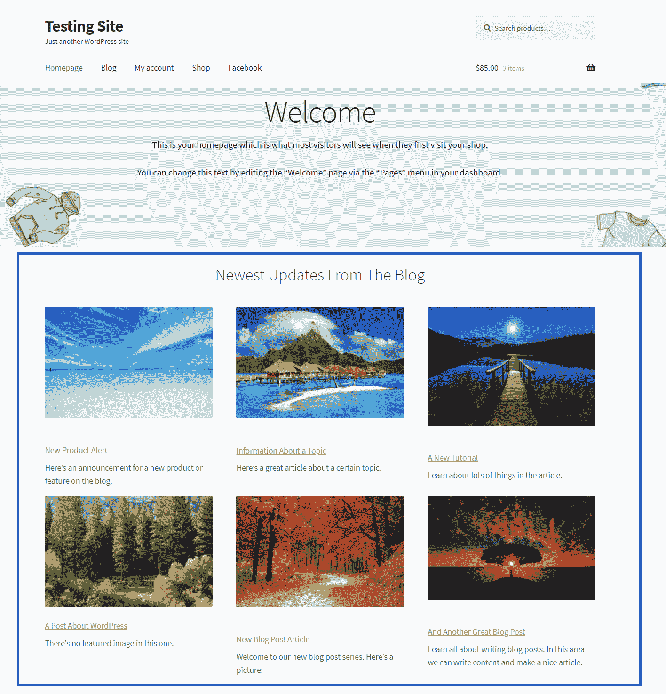

Recent posts with featured images showing


## 脸书上没有显示 WordPress 特色图片

当帖子或页面在社交媒体网站上共享时，特色图像也会出现在[嵌入的](https://kinsta.com/knowledgebase/disable-embeds-wordpress/)中。

每个社交网络都有自己的共享内容展示，但脸书是一个坚实的起点，因为它是最受欢迎的一个。如果特色图片出现在脸书上，那么它也很有可能出现在其他社交网站上。

最大的问题是，当你在脸书上分享一个链接时，一个帖子的特色图片是否能被正确呈现。如果没有，你如何着手解决这个问题？毕竟，在脸书上分享一个没有图片的帖子不会获得太多关注。

就脸书的特色图片而言，我们经常会看到以下问题:

*   脸书上出现了错误的特色图片。
*   在脸书上分享时，没有特色图片补充帖子。
*   文章中有几幅图片，但是你必须选择你想用的那一幅。

上面列出的所有问题都源于类似的问题。他们都告诉你，脸书要么很难从你的网站访问开放图表数据，要么根本就没有开放图表数据。

### 如何测试你的特色图片是否能在脸书上正确显示

如果当帖子被分享时，你的特色图片和帖子内容在脸书上看起来都很好，那就没有理由进入故障排除模式。

我们建议运行一个测试，看看特色图片是否真的出现在脸书上。

完成这项任务的一个方法是打开你的脸书帐户，假装你要分享一个状态更新。

你所要做的就是将帖子链接粘贴到脸书状态字段(你也可以在[个人或商业页面](https://kinsta.com/blog/how-to-create-a-facebook-page/)上这样做),然后等着看帖子内容和特色图片是否被呈现出来。

下面的截图显示了一个在脸书上运行良好的帖子，因为它包括了帖子内容的摘要、链接、标题和特色图片。

**注意:**特色图片从 WordPress 中获取，并使用一种叫做 Open Graph 的东西在社交媒体网站上传播。Kinsta Hosting 已经提供了开放图形支持，以及使用 Yoast SEO 控制这种支持的可能性。因此， [Kinsta 禁止了大多数开放图形插件](https://kinsta.com/knowledgebase/banned-plugins/#social-media-plugins)，因为它们会引起冲突。然而，如果你的网站运行在另一个主机上，我们会推荐一些开放图形插件来解决问题。

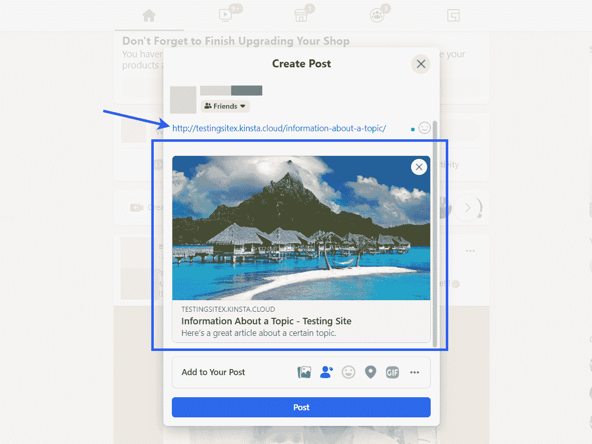

WordPress featured image showing on Facebook


另一种检验这种方法是否有效的方法是看你的网站上是否有社交分享按钮。转到有问题的帖子，点击**分享到脸书**链接，查看专题图片是否出现在弹出窗口中。

最后，您还可以选择访问脸书上的[开发者调试工具。这个工具抓取你想要的任何网址，并告诉你脸书访问信息时是否出现错误。它还提供了一个清晰的预览，如果你在脸书上粘贴或分享这个网址，你会看到什么。](http://developers.facebook.com/tools/debug)

一旦进入**开发者调试工具**页面，找到**共享调试器**标签，粘贴有问题的 URL。

点击**调试**按钮继续。

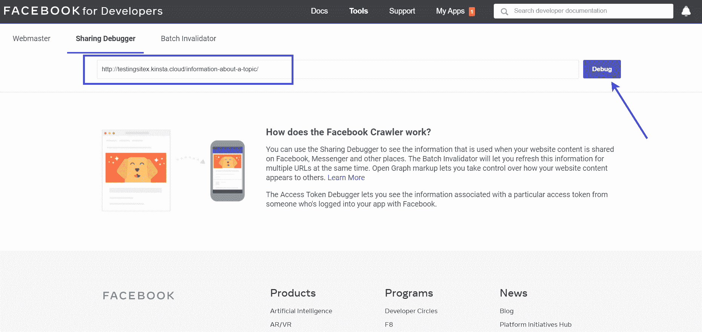

The ‘Sharing Debugger’ tab in Facebook for Developers portal


[点击这里查看我们的指南](https://kinsta.com/knowledgebase/facebook-debugger/)了解更多关于脸书调试工具的信息。

关于你的网址如何与脸书互动，有相当多的信息，但你需要看的只是预览。链接预览区向你展示如果你或其他人在脸书上分享，你的帖子会是什么样子。

下面的截图告诉我们，我们的特色图像显示得很好。但如果事实并非如此呢？如果特色图片不是正确的图片，或者您根本看不到图片，该怎么办？

这是一个问题，所以请遵循以下步骤，以确保您的特色图片随时准备好进行社交分享。

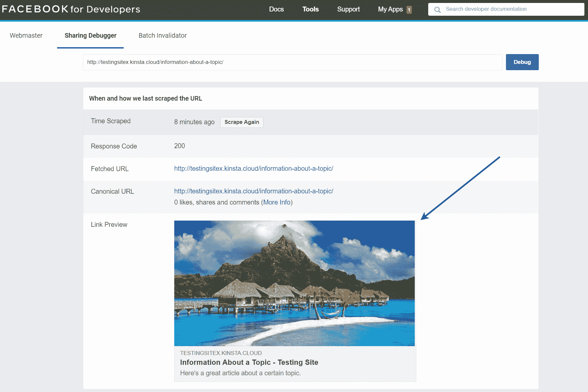

Checking the ‘Link Preview’ of a URL on Facebook


注意:有时新网站在脸书和其他社交网站上遇到麻烦，因为脸书还没有抓取该网站。因此，在脸书的共享调试工具中粘贴并调试 URL 实际上可以完全解决您的问题。

查看 Open Graph 代码是否在您的站点上被激活的一个简单方法是使用 SEO 插件。其中许多都提供了预览脸书和其他社交网络内容的工具。

此外，您通常可以直接从 SEO 插件的设置中启用 Open Graph 标记。

在这一节中，我们将向您展示如何用两个最流行的 SEO 插件激活 Open Graph markup:AIO(All In One)SEO 和 Yoast SEO。

对于 AIOSEO 插件，导航到 **All in One SEO** 菜单，点击**社交网络**标签。

选择**脸书**选项，向下滚动找到字段**启用打开图形标记**。默认情况下，这项功能应该是启用的，但您可能在某个时候关闭了它。

你也可以配置设置来拥有一个默认的**帖子图片来源**，比如从帖子中提取第一张图片或者使用**特色图片**。

之后，点击**保存更改**按钮，测试脸书共享是否允许特色图片出现。

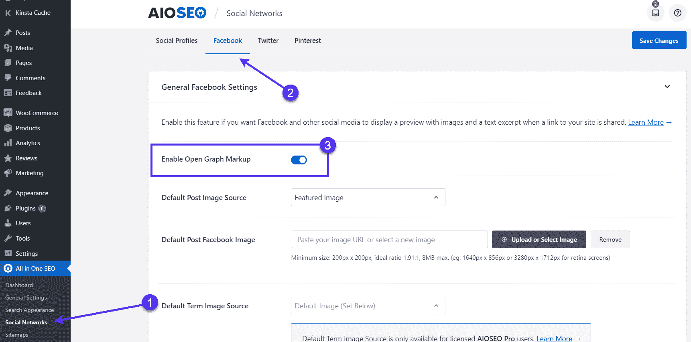

AISEO Facebook settings tab


Yoast SEO 是另一个 SEO 插件，包括社交分享功能和启用/禁用**打开图形**功能的选项。

Yoast SEO 的伟大之处在于，只需安装插件就可以激活开放图协议进行社交分享。

如果你还有问题，去 WordPress 仪表盘的 **SEO > Social** 。

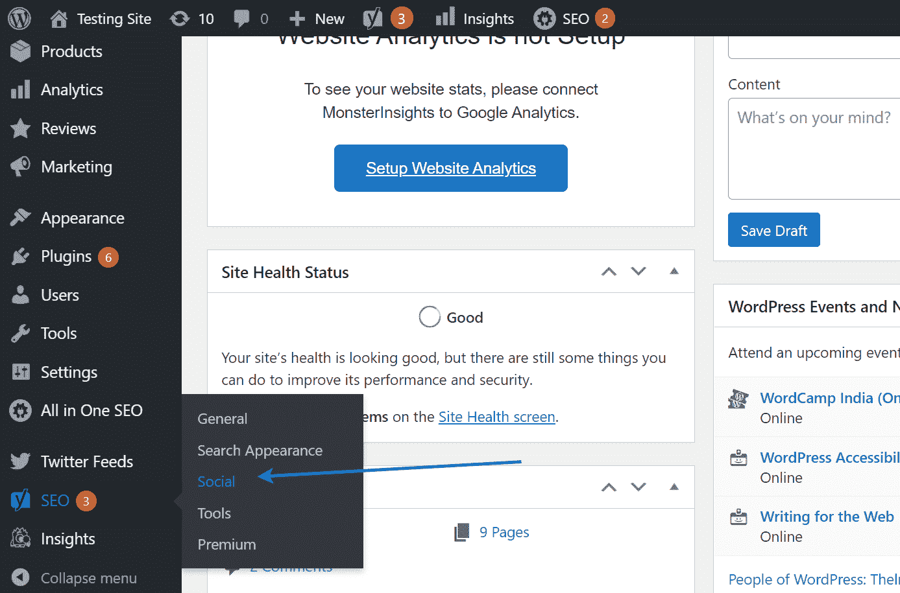

Yoast SEO’s ‘Social’ settings link


在这里，选择**脸书**选项卡。你也可以在 Twitter 和 Pinterest 等其他社交网络上测试一下。

找到**添加开放图形元数据**开关，并确保它设置为**启用**。

你可能还想设置一个默认的图片 URL ,如果一篇文章没有指定特色图片的话。

请务必**保存更改**并尝试分享另一篇帖子，看看它现在是否允许在分享的帖子中添加特色图片。

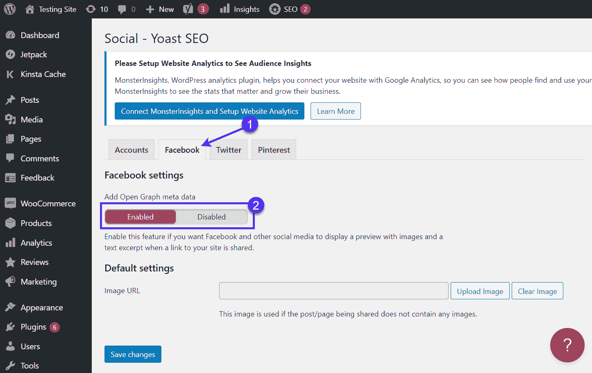

每当你做出改变时，最好回到**脸书共享调试工具**来促进脸书搜索更多的帖子数据。

您可以点击**再次抓取**按钮，或者简单地刷新页面并再次将您的帖子 URL 粘贴到字段中。

### 在脸书上一次调试多个 URL

你可能有很多旧帖子在脸书上分享时没有生成特色图片。这是一个巨大的问题。

如果你发现自己处于这种情况，我们建议返回脸书共享调试器工具，点击**批处理无效器**选项。

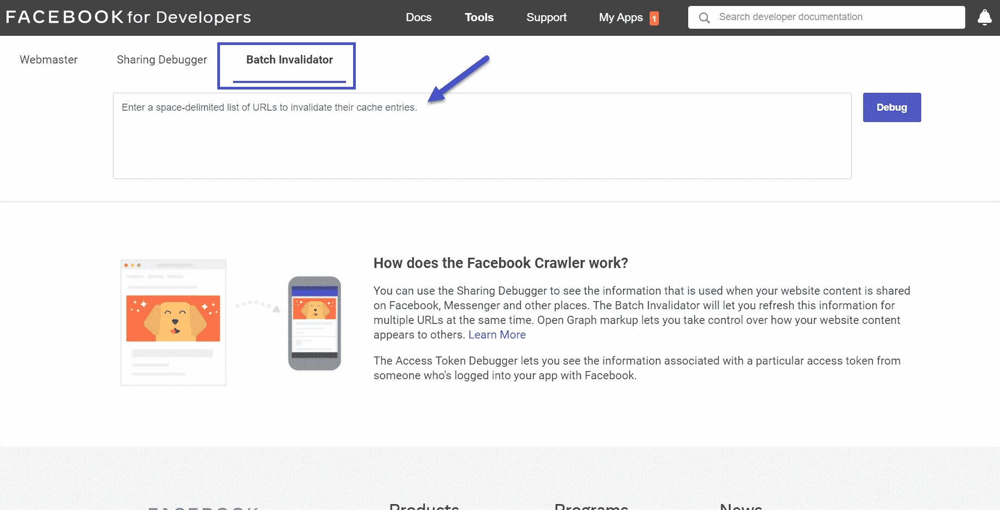

这允许你粘贴多达 50 个网址，并运行该工具，使脸书废料他们的元数据再次正确。

你有两个选择从你的网站抓取网址。第一种是手动操作，点击你网站上的每个帖子和页面，将 URL 收集到一个文档中。

另一种方法是安装并激活一个插件，比如[导出所有 URL](https://wordpress.org/plugins/export-all-urls/)。它获取你网站上的每个网址，[将它们导出到一个简单的文件中。这样，您就可以轻松地将它们复制并粘贴到脸书共享调试器工具中。](https://kinsta.com/knowledgebase/export-wordpress-site/)

一旦这些都完成了，点击调试按钮来处理列表中所有的[URL](https://kinsta.com/knowledgebase/what-is-a-url/),使特色图片和所有其他相关的帖子数据在脸书上共享时出现。

### 在社交媒体上显示 WordPress 特色图片的附加选项

在你的 WordPress 网站上激活 Open Graph 是在像脸书这样的平台上展示你的特色图片的关键。

如果你对上面讨论的 SEO 插件有问题，或者你只是不打算使用 SEO 插件(因此，没有快速打开图形激活按钮)，有一些其他的选项来激活打开图形。

#### OG 插件

第一个是 OG，它可以方便地添加 Open Graph 协议，将任何网页转化为社交媒体的丰富对象。该插件是轻量级的，不提供任何其他功能，对于那些除了修复开放图形问题以外对任何事情都不感兴趣的人来说，这是一个理想的选择。

与宕机和 WordPress 问题做斗争？金斯塔是托管解决方案，旨在节省您的时间！[查看我们的功能](https://kinsta.com/features/)

首先，在你的 WordPress 网站上安装并激活 OG 插件。

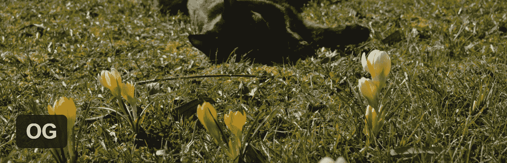

The OG plugin


像 OG 这样的插件的真正优势是安装后不需要任何配置。这意味着在它发挥魔力之前，不需要查看或更改任何设置。

对于所有的 WordPress 文章和页面，Open Graph 协议是自动激活的。

现在，转到你的脸书页面(个人或企业)，将带有特色图片的链接粘贴到**状态**字段。

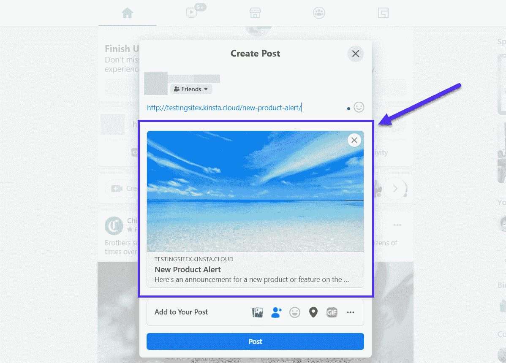

Featured image showing up on Facebook


激活 OG 插件后，你应该可以在预览中看到文章信息和特色图片。

如果你仍然没有成功，考虑使用脸书共享调试器来确保脸书知道如何抓取你的网站，因为如果你已经激活了开放图表协议，这通常是个问题。

#### Open Graph 和 Twitter 卡片标签插件

我们打开 Open Graph 协议来展示特色图片的最后一个选项叫做 Open Graph 和 Twitter Card Tags 插件。除了为所有社交网站激活 Open Graph 之外，这个插件还有一个额外的好处，那就是包含 Twitter 标签来改善你的 Twitter 分享结果。

还是那句话， [Kinsta 禁止了很多开放图插件](https://kinsta.com/knowledgebase/banned-plugins/#banned-plugins)，包括这个。那是因为不需要用 Kinsta 激活一个 Open Graph 插件。然而，如果你使用任何其他主机提供商，它可能会被证明是有用的。

首先，在你的 WordPress 网站上安装并激活 [Open Graph 和 Twitter Card Tags 插件](https://wordpress.org/plugins/wonderm00ns-simple-facebook-open-graph-tags/)。


Open Graph and Twitter Card Tags plugin


现在，进入**设置>打开图形和 Twitter 卡片标签**。这将带您进入激活 Open Graph 协议所需的设置，并校准当您的帖子和页面被共享到社交媒体网站时您希望看到的内容元素。

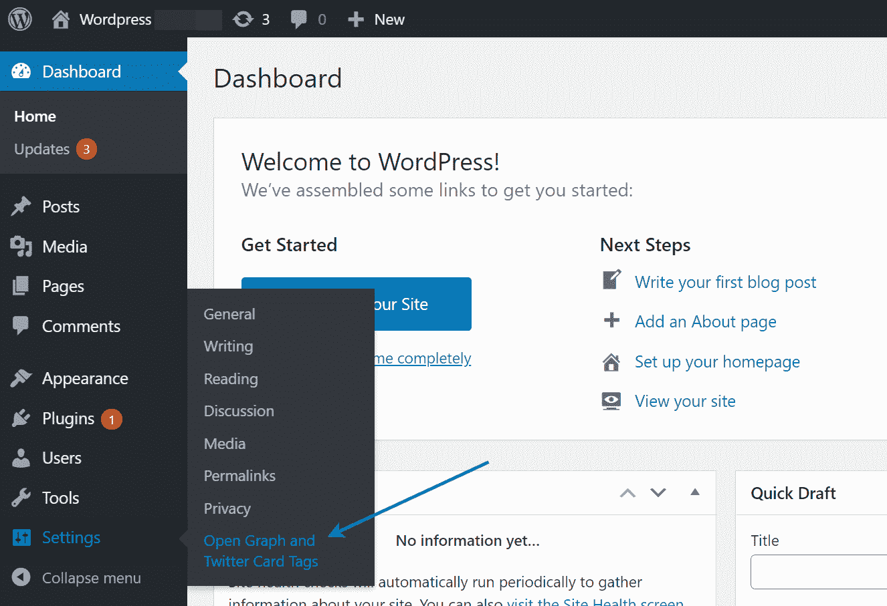

Open Graph and Twitter Card Tags settings


选择**通用**选项卡并定位**描述设置**部分。这里需要填写**描述长度**、**首页描述**、**默认描述**等字段。这些并不控制你的特色图片，但是它们显示在特色图片的正下方，所以对于显示内容来说很重要。

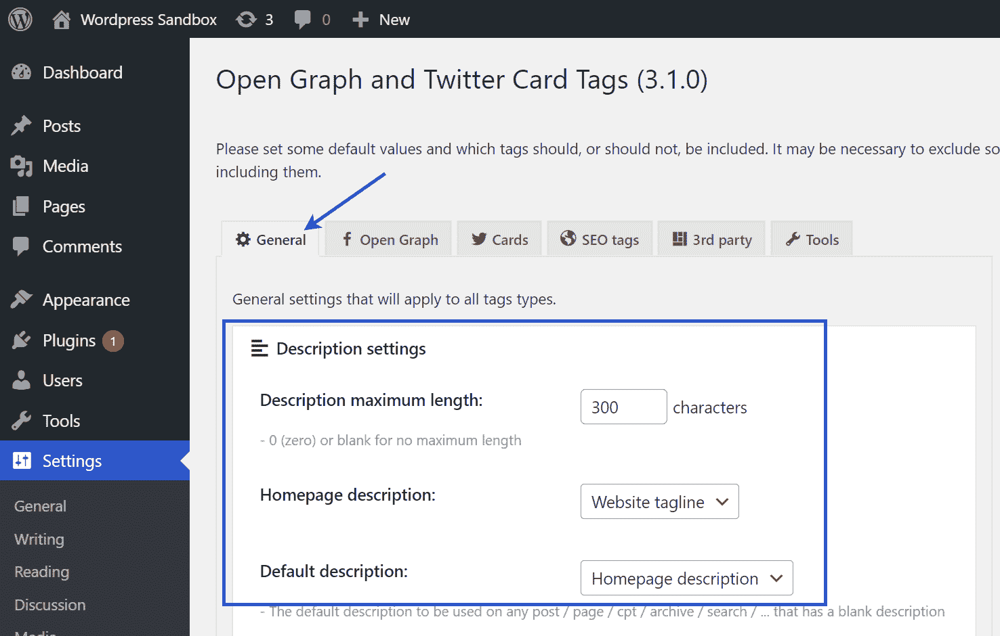

The ‘General’ tab under Open Graph and Twitter Card Tags


向下滚动到名为**图像设置**的区域。在社交媒体上分享帖子或页面时，有一个选择图片来源的字段。

选择前两个复选框以抓取打开的图形图像，而另一个复选框用于使用页面或 [post](https://kinsta.com/blog/wordpress-get-post-id/) 特色图像。

这些是所有社交媒体共享的一般设置，确保脸书和 Twitter 不会从你的文章或网站上的其他地方随机选择照片。

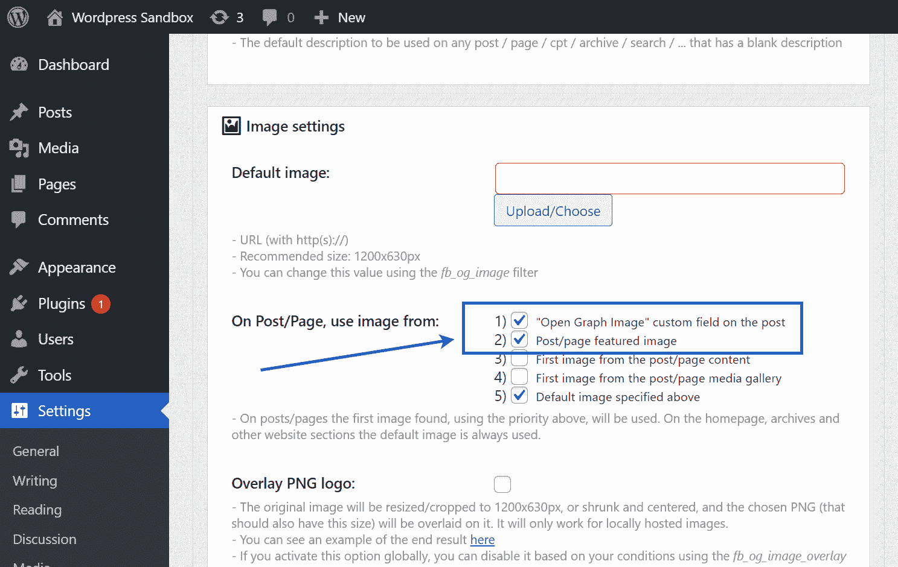

Set where to use the featured image from


接下来，点击**脸书打开图**标签。在这里，您可以为开放图形共享协议设置一切，但只有脸书才有特定的独特特征。

例如，你可能会考虑包含像**网站名称**和**文章标题**这样的内容，但是不包含 URL。有一个长长的设置列表，所以这完全取决于你。

现在最重要的选项是**包含图像**字段。选中此框，WordPress 帖子或页面的特色图片会在共享到脸书时被填充。

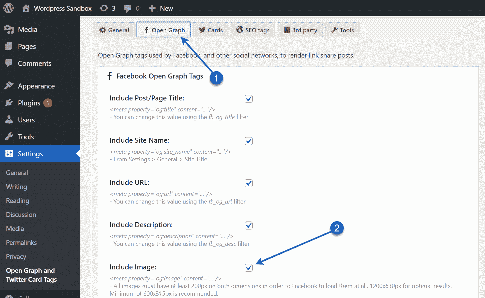

The ‘Open Graph’ settings tab


这个插件的另一个特定的**打开图形**模块是用于 Twitter 的。选择 **Twitter 卡**选项卡，显示配置您的 **Twitter 卡标签**的设置。

Twitter 卡与脸书共享模块略有不同，所以你可以仔细检查这些设置，以确保一切正常。我们建议勾选**标题**、 **URL** 和**描述**。

最后，你应该勾选**包含图片**的复选框，因为这是 Twitter 从帖子或页面获取你的特色图片的唯一方式。

完成后，请务必**保存**设置。


The ‘Cards’ settings tab


总的来说，激活 Open Graph 协议在社交媒体上正确分享内容和特色图片的最佳方式是安装一个插件，如 Yoast SEO 或 OG。下一个最好的方法是[使用像 Kinsta](https://kinsta.com/why-us/) 这样的托管主机，它已经为您配置了 Open Graph。

## 确保特色图片始终显示在帖子和页面中

特色图像容易出现人为错误，因为无论何时创建新网页，页面或帖子作者都必须手动上传特色图像。

虽然自动化过程并不适合每个人，但是有一些技巧可以确保 WordPress 特色图片总是显示在帖子和页面上，最大限度地减少作者忘记上传图片的机会。

### 如何为所有 WordPress 配置默认的特色图片

确保你的特色图片字段不为空的一个方法是为所有帖子设置一个默认的特色图片。

这个插件的伟大之处在于，它不会取代你帖子上已经有的特色图片。相反，它会检测缺少特色图片的帖子，并为它们设置一个默认的特色图片。

首先安装并激活[默认特色图片插件](https://wordpress.org/plugins/default-featured-image/)。

现在，在你的 WordPress 仪表盘中进入**设置>媒体**。

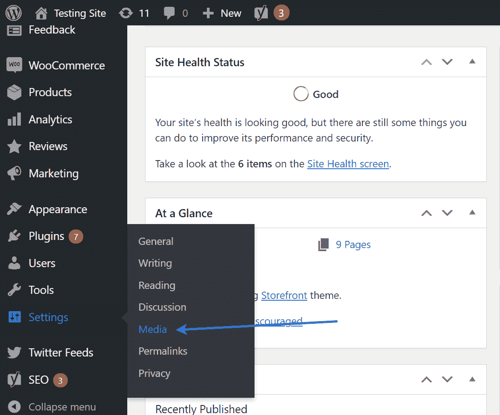

Go to ‘Settings > Media’ in the WordPress dashboard


这是默认特色图片插件唯一改变的仪表板部分。

向下滚动找到一个名为**默认特色图片**的新字段。

点击**选择默认特色图像**按钮。

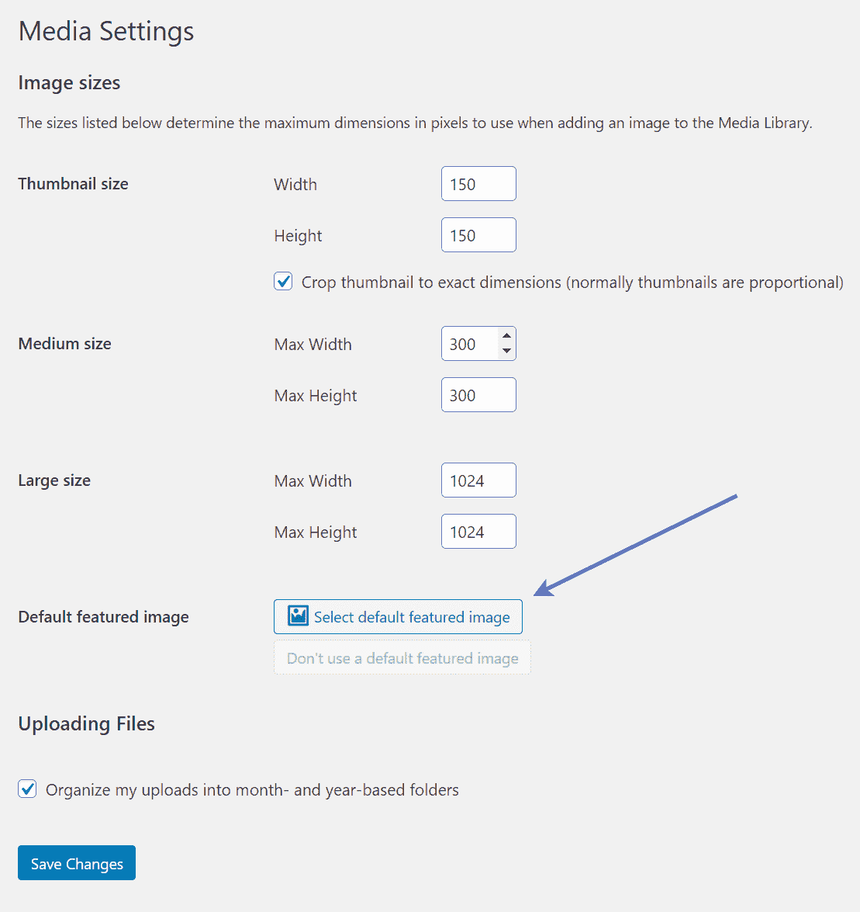

Select the default featured image


这将打开媒体库，您可以从中选择一个图像作为您的默认特色图像。

选择图像后，点击**设置默认特色图像**按钮。

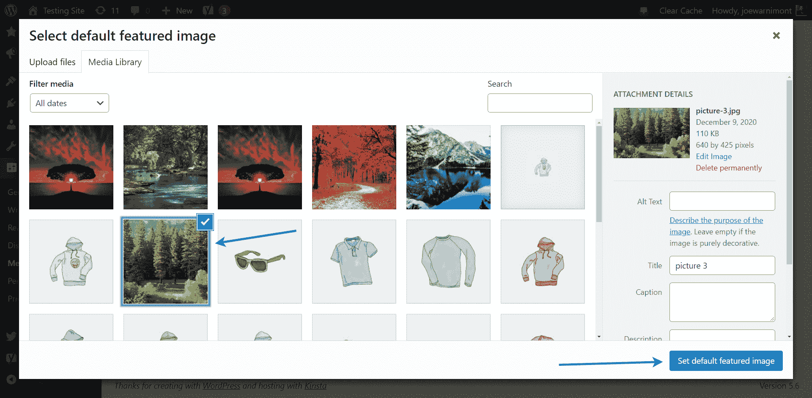

Select the default featured image


现在，对于所有没有上传特色图片的帖子，您应该可以看到该图片的缩略图。

请务必点击**保存更改**按钮，激活您网站上的默认特色图片。

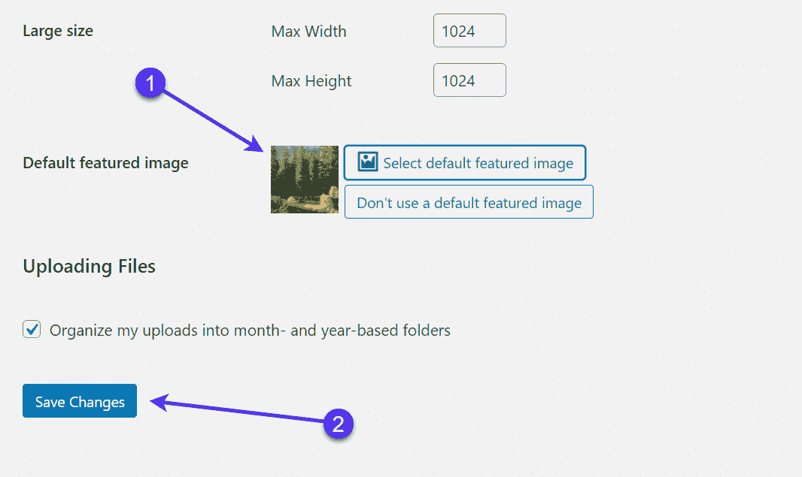

Set a default featured image


测试默认的特色图片在你的网站上如何工作是很重要的。

为此，请转到**帖子>所有帖子**。

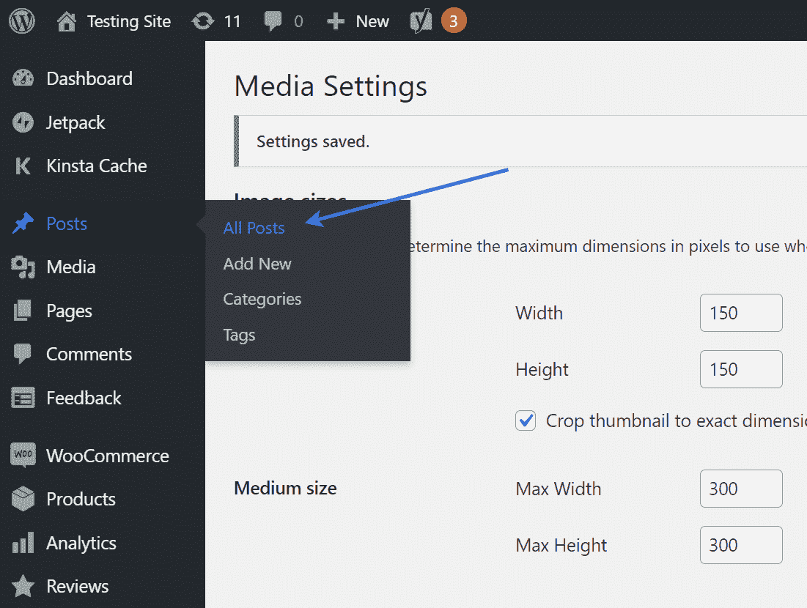

Go to the ‘All Posts’ screen


选择一篇还没有特色图片的博文。

进入其**帖子设置**面板，打开**专题图片**部分。

这应该是空的，要求您上传精选图片。

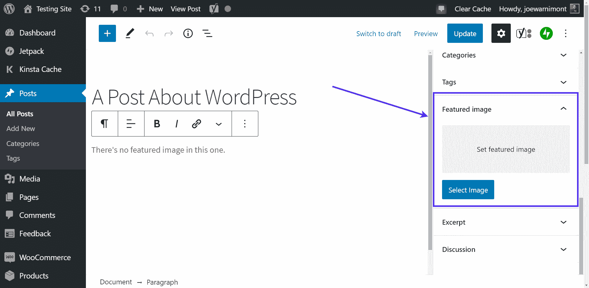

Select the featured image


然而，随着默认的特色图片插件的激活，你所要做的就是点击帖子的更新按钮。

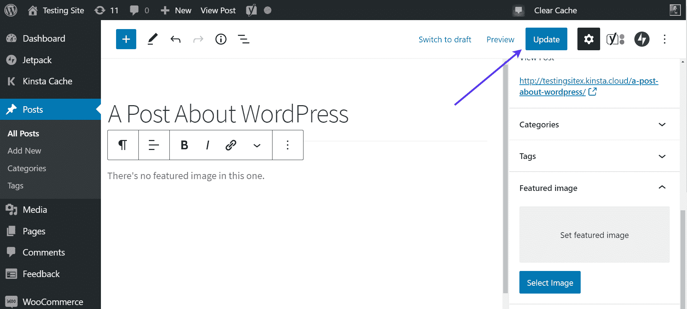

Click the ‘Update’ button


然后，默认的特色图片会填充到帖子的特色图片模块中。

好消息是，以后所有没有特色图片的帖子都会自动添加默认照片。但是，您可能需要更新以前发布的帖子，以便默认的特色图片显示在这些帖子上。

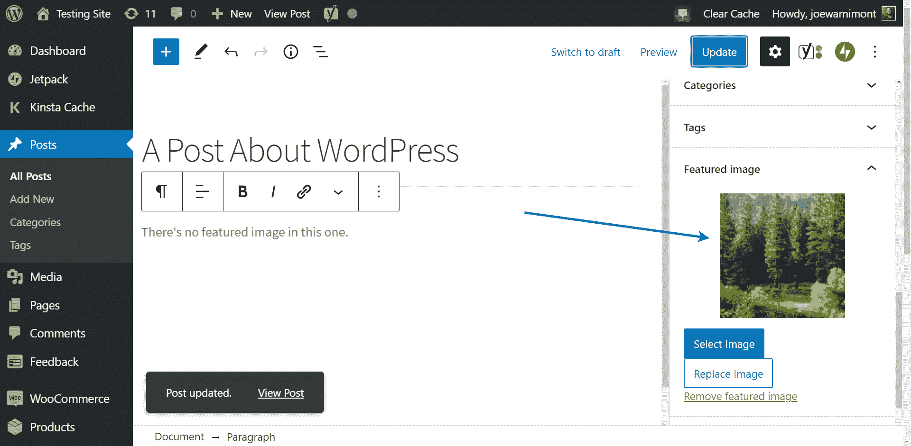

The default featured image is showing here


作为一个测试，让我们访问一个已经包含了文章特色图片的帖子。

如您所见，特色图片部分出现了一个不同的图片。这告诉我们插件正在做它的工作，将默认的特色图片添加到正确的帖子中，并删除那些已经有特色图片的帖子。

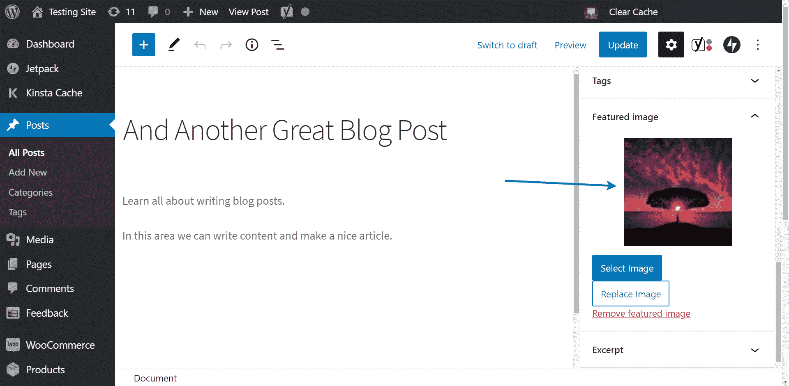

The default featured image is not showing here


## 如何批量上传和编辑网站上的所有特色图片

在某个时候，你可能会意识到几个旧帖子可以使用新的特色图片。也有可能你想替换某个类别的文章或页面，让它们都有相同的特色图片，无论这是专业设计的图片，表明文章是为了一个教程，还是为了把你的徽标放在所有网页的相关图片上。

无论如何，你必须批量编辑这些特色图片，这样你就不用花时间去编辑每一张图片了。一些网站已经有数百甚至数千张特色图片，所以需要一个批量编辑工具。

[快速特色图片插件](https://wordpress.org/plugins/quick-featured-images/)处理特色图片的批量编辑以及许多其他功能，如为所有帖子添加默认特色图片或为默认特色图片设置预设。


Quick Featured Images plugin


我们对本教程的批量编辑工具最感兴趣。它允许你交换出几个先前列出的上传的特色图片，使它们都是同一个图片。

安装并激活插件后，进入**特色图片>批量编辑**。

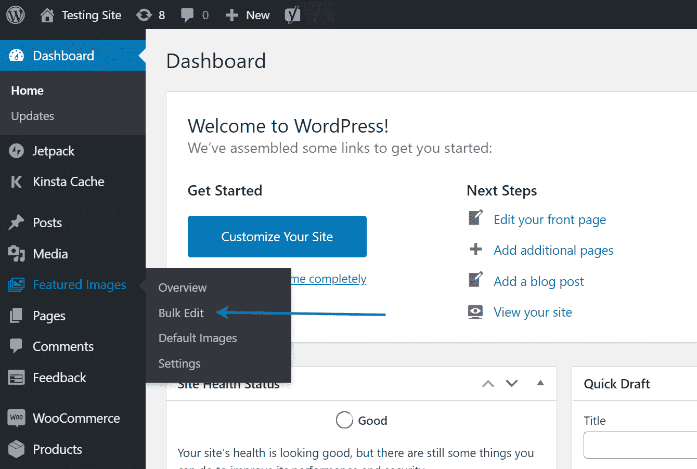

Go to ‘Featured Images > Bulk Edit’


在这里，你会在页面顶部看到一个**进度条**。进度条会准确指示您在批量编辑特色图像的过程中所处的位置。

这一点很重要，因为批量编辑是永久性的，所以您需要确保每一步的操作。

要开始批量编辑特色图片，请向下滚动页面。

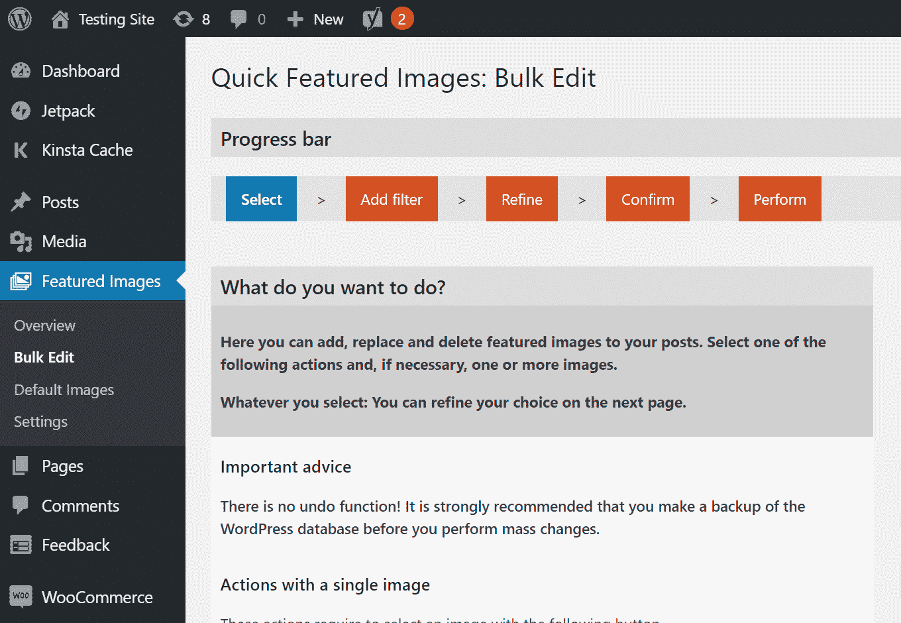

Bulk editing the featured images


使用单个图像找到标题为**动作的部分。有三个选项可供您批量编辑特色图像:**

*   将所选图像设置为新的特色图像。
*   用所选图像替换特色图像。
*   将所选图像作为特色图像移除。

根据你想要达到的目标选择正确的选项。例如，您可能只想删除所有旧的特色图像，或者确保所有新的特色图像都被设置为一个特定的图像。在这种情况下，你可以选择第一或第三个选项。

然而，你通常会选择标题为“用所选图像替换特色图像”的那个这允许您上传一个图像，该图像将替换任意数量的当前特色图像。您可以稍后选择这些图像，并将它们中的每一个替换为新的图像。

点击**选择图像**按钮继续。

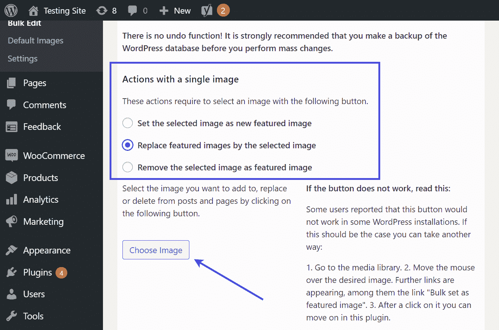

‘Actions with a single image’ settings


这一步包括选择你希望在你当前的一些文章或页面中显示的新的特色图片。

选择您喜欢的图像，然后点击**选择图像**按钮。

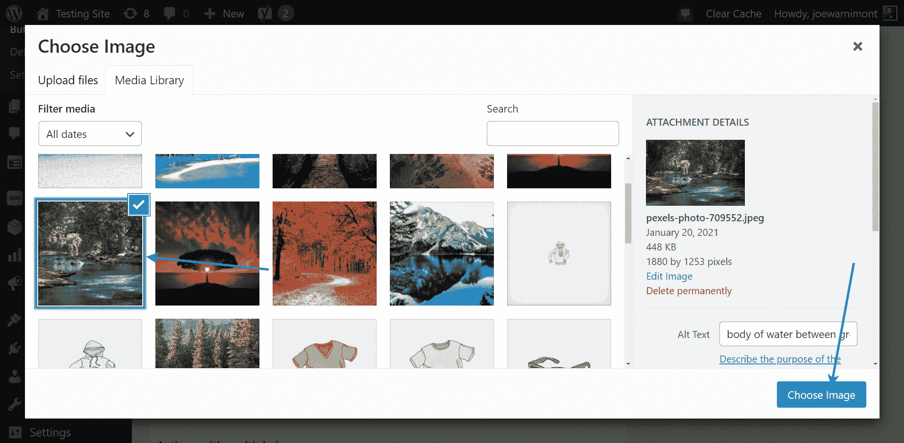

Click the ‘Choose Image’ button


您将看到该图像被填充到仪表板中。只要确保它是正确的图像，并且插件能够识别它。

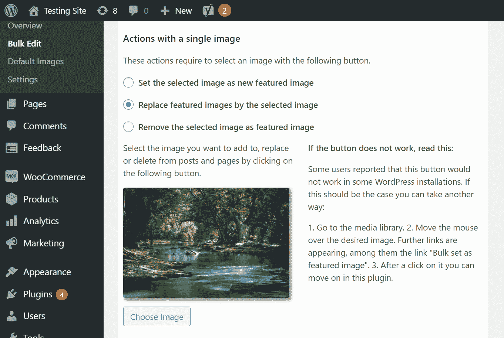

Set the ‘Replace featured images by the selected image’ option


滚动到页面底部，点击下一个按钮**。**

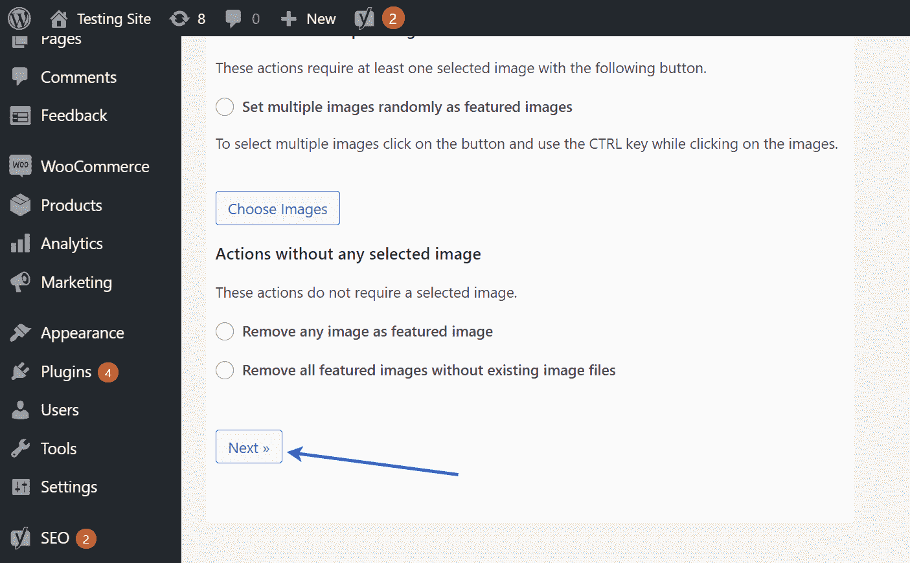

Hit the ‘Next’ button


下一步是**添加一个滤镜**，本质上是让你选择你想要替换的图像。因此，点击标题为“选择您想要用所选图像替换的特色图像”部分下的**选择图像**按钮

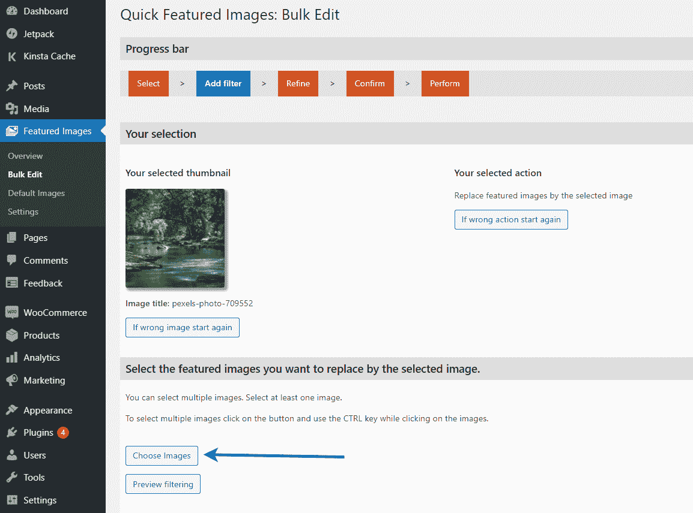

Click the ‘Choose Images’ button


在此模块中，您可以从媒体库中选择多个图像。唯一的问题是，它没有告诉你哪些媒体库图像已经作为特色图像上传过。

无论如何，在选择图像时按住 Shift 键选择一个或多个图像，然后单击**选择图像**按钮继续。

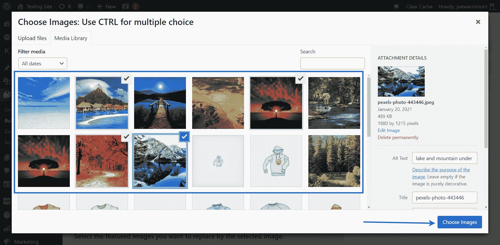

Choose the images to bulk edit


所有选定的图像在插件的仪表板中显示为缩略图预览。如果您错过了任何图像，请随时返回并选择更多图像。

点击**预览过滤**按钮，查看将发生哪些批量替换。

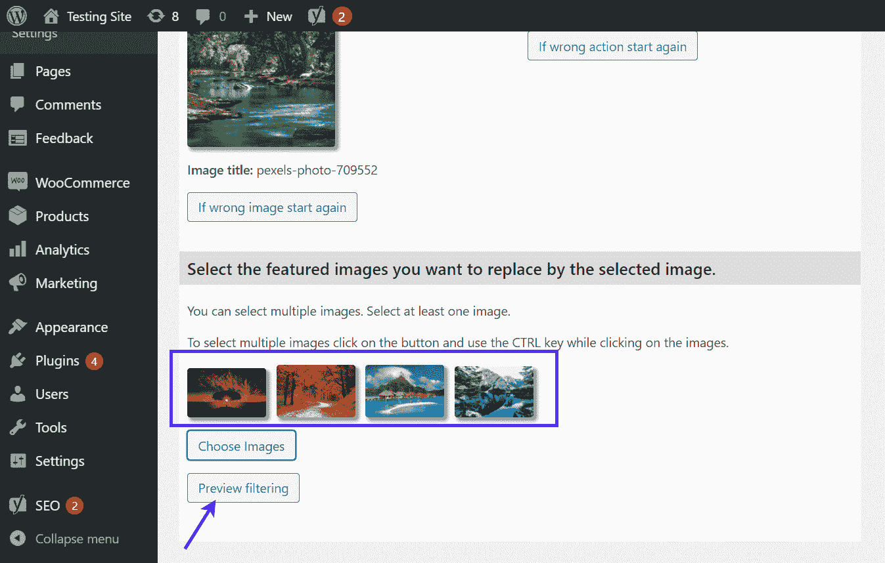

Select the ‘Preview filtering’ option


下一页解释了哪些当前特色图像将被您之前指定的未来特色图像替换。看起来只有两张被选中的图片在我们的帖子中被存储为特色图片。这意味着只有那些图像会被新图像替换。

一旦一切看起来都很好，并且你已经决定那些旧的特色图像准备好被替换，点击**应用**按钮完成批量编辑。

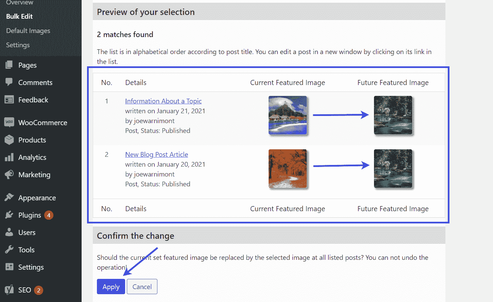

Click the ‘Apply’ button


最后一页显示了批量编辑的结果，以及现在有新的特色图片的帖子的详细信息。你可以看到我的两篇文章现在有了新的特色图片，它们是相同的图片。这就是我们想要完成的。

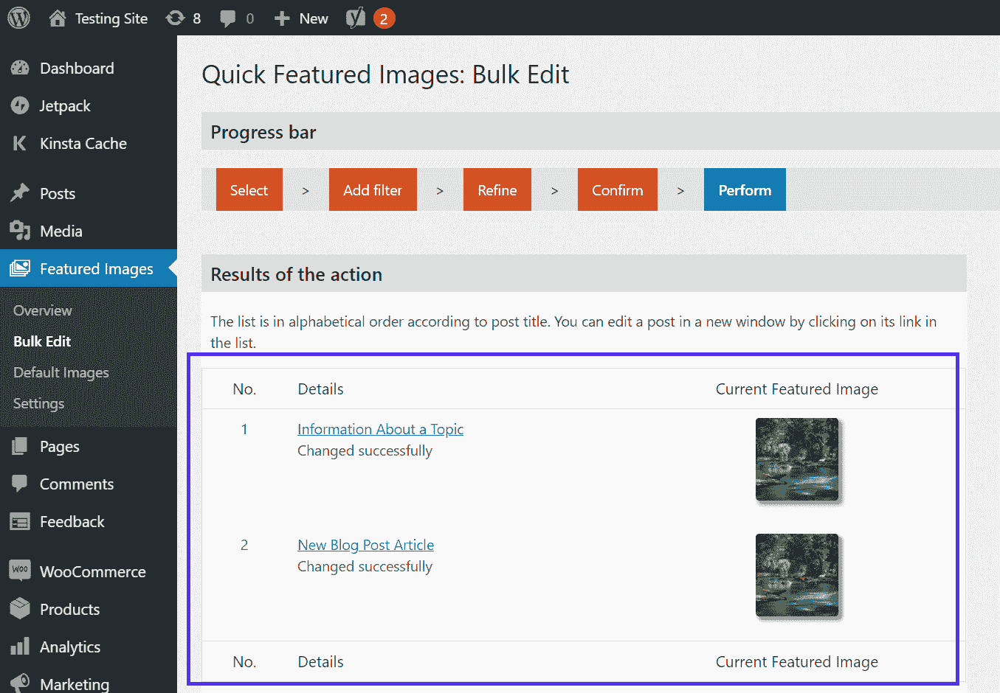

Check the ‘Bulk Edit’ results


您现在可以在仪表板中进入**帖子>所有帖子**查看列表中的帖子，并确保帖子中的特色图片确实被替换了。

正如你所看到的，之前的两个帖子的特色图片被我想要的替换了。

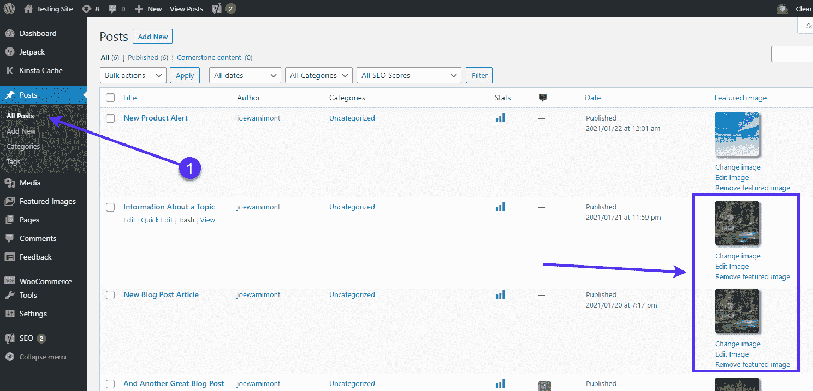

See the new featured images


请记住，快速特色图片插件中的初始**选择**页面提供了对您的特色图片采取的各种操作。这些都是很好的工具，可以用来替换设计糟糕的特色图片，或者在某些特色图片没有出现的时候解决问题。

例如，您可能用多个页面完成一个动作。在这种情况下，您可以根据从媒体库中选择的照片，为您的帖子随机设置多个特色图像。

另一个选项是在没有选定图像的情况下采取[操作](https://kinsta.com/blog/wordpress-hooks/#hooks-vs-actions-vs-filters)，比如删除在多个帖子上重复多次的特色图像，或者如果您需要删除所有特色图像而不删除现有图像文件。

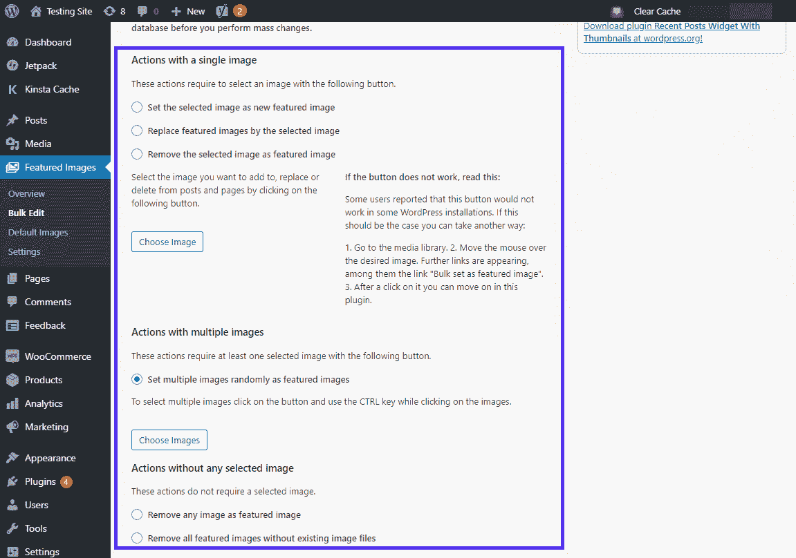

Actions with a single image and multiple images


Quick Featured Images 插件有很多机会，所以我们建议测试一下这个工具，看看如何批量编辑一些旧的或不起作用的特色图像，以清理网站的整体视觉吸引力。

## 修复 WordPress 特色图片问题的插件

特色图片的问题源于各种各样的问题。有时候，最好的解决方案是安装一个插件，并希望它能提供修复所有问题所需的功能。

毕竟，一个主题或插件可能会导致这个问题。你最好使用一个插件来解决这个冲突，而不是换掉你的整个主题，重新设计你的网站来修复特色图片。

虽然不是所有的特色图像校正插件都完成相同的任务，但我们建议在尝试对您的网站进行任何重大改变之前，先研究一些插件。

### 来自 URL 的特色图片(FIFU)

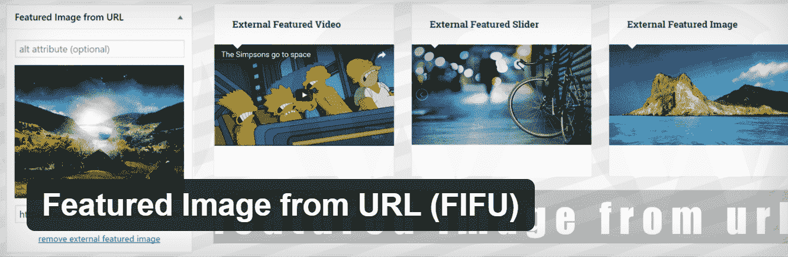

FIFU plugin


来自 URL 或 FIFU 的[特色图片插件允许您获取外部图片，并将其用作帖子或页面的特色图片。这就解决了上传一张图片到你的 WordPress 媒体库并激活该图片作为特色图片的想法。](https://wordpress.org/plugins/featured-image-from-url/)

因此，它可能有助于解决您可能遇到的上传大小限制问题，甚至是您的权限设置不正确的问题。总的来说，该插件有一个字段可以粘贴一个图像的 URL，并将该图像插入到特色图像槽中。

您必须[在第三方位置](https://kinsta.com/knowledgebase/wordpress-google-cloud-storage/)托管映像，并确保将来会托管在那里。我们建议只使用一个媒体托管平台，或者你自己的另一个网站主机。简单地在网上搜索一张图片，获取它的 URL，然后将该图片用于你的特色图片，这将是麻烦的，并且可能是非法的，因为你不知道该图片的 URL 在哪里。

FIFU 插件还包括通过使用 iframe 标签和其他元素从图像和视频中自动设置特色图像的功能。您还可以从更独特的来源设置特色图像，如图书 API 或 ISBN，甚至从文章标题或搜索引擎。

### 快速精选图像


Quick Featured Images plugin


我们在这篇文章中提到了[快速特色图片插件](https://wordpress.org/plugins/quick-featured-images/)。它主要用于批量替换特色图片。这是你利用这个插件的主要原因。它消除了大量等待您的手动上传工作。

我们尤其喜欢它为你过去和未来的特色图片设定规则的能力。例如，您可能希望在内容中提取第一张图片，并将其作为帖子的特色图片。还可以根据文章作者、[标签](https://kinsta.com/knowledgebase/wordpress-tags/)和文章类型生成特色图片。

无论你是覆盖现有的特色图片还是试图修复那些原本就不存在的图片，快速特色图片插件都可以做到。

### 默认特色图像

[默认特色图片插件](https://wordpress.org/plugins/default-featured-image/)提供了一种简单的方法来覆盖所有没有为页面或帖子设置特色图片的实例。它有助于清除那些你忘记添加特色图片的帖子，或者在某些时候，由于原始特色图片不符合你的标准而删除了它。总的来说，默认特色图片插件有一些简单的工具，可以通过点击按钮来添加默认特色图片。

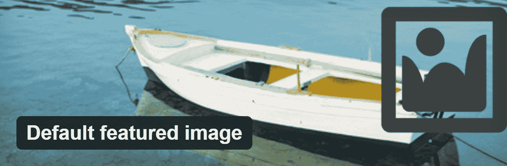

Default Featured Image plugin


这个插件找出所有空的特色图像字段，并用默认选项填充它们。虽然这可能是一个临时的解决方案，但它也可以被证明对在页面和一般博客文章上设置永久的特色图像是有用的。你可能只需要[一张与你网站相关的基本照片](https://kinsta.com/blog/jpg-vs-jpeg/)。

它的设置位于 WordPress 媒体设置中，但是你只有一个字段需要填写。在此上传图像，点击**保存**按钮。

### 自动特色图像

[自动特色图像插件](https://wordpress.org/plugins/auto-post-thumbnail/)提供了修复特色图像问题的独特选项。它承诺让网站所有者上传特色图片的过程变得更加容易。

该插件从帖子中的第一张图片生成特色图片，但前提是特色图片尚未配置。因此，它可以作为真正的特色图像字段的备份，以防您忘记上传特色图像，但仍然希望显示一些内容。

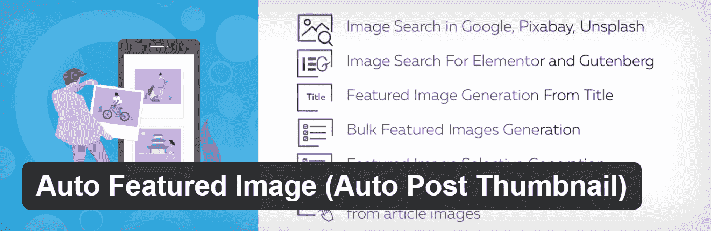

Auto Featured Image plugin


使用这种方法的好处是不需要依赖可能不适用于帖子的默认特色图片。我们会假设帖子中的第一张图片与主题相关，所以不必担心默认的特色图片[会从文件](https://kinsta.com/knowledgebase/wordpress-files/)中取出，并在几篇帖子中复制相同的图片。

该插件还有一个很棒的本地搜索引擎,可以从 Google、Pixabay 和 Unsplash 等地方下载。它也能很好地与页面构建器如古腾堡和 [Elementor](https://kinsta.com/blog/elementor-not-loading/#what-are-the-elementor-requirements) 一起工作。自动精选图像甚至有一个批量精选图像生成工具。

### 多个特色图像

[多特色图像插件](https://wordpress.org/plugins/multiple-featured-images/)拥有几个在故障诊断和解决特色图像问题时派上用场的功能。首先，这个插件打开了 WordPress 设置的每个帖子只能有一张特色图片的默认限制。这意味着你可以上传几个特色图片，并选择其中一个显示在你网站的不同部分。

它使用了一个小部件和[短代码](https://kinsta.com/blog/wordpress-shortcodes/)，两者都会询问在实现其中一个工具时，您希望显示哪些特色图片。例如，你可能希望一个特色图片出现在侧边栏中，但是当文章出现在你主页的列表中时，另一个特色图片就会出现。

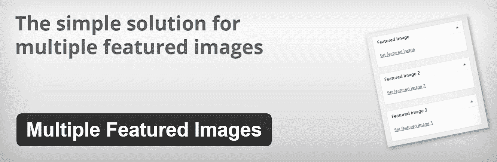

Multiple Featured Images plugin


该插件支持帖子和页面，包括自定义帖子和 WooCommerce 产品。你可以上传任意多的图片，同时还可以选择在特定区域显示哪些特色图片，以及这些图片应该有多大。

本质上，这个插件适合那些努力决定使用哪个特色图片的人，或者当一个特色图片在文章的开始有意义，但是另一个在侧边栏看起来更好的时候。

## 特色图像的最佳实践

确保特色图片看起来正确的很大一部分是在将它们上传到你的 WordPress 站点之前理解最佳实践。您可以对未显示的特色图像进行故障排除，或者手动编辑每个特色图像。

尽管如此，首先了解特色图片的核心方法以最小化问题要容易得多。这些最佳实践涵盖了从设计建议到上传策略的所有内容，使您对所有特色图片充满信心，同时也减少了您在特色图片上花费的时间。

### 使特色图片具有相关性

设置默认特色图片的不利之处在于，你有可能最终得到几个与文章无关的特色图片。特色图片的全部意义是作为文章的视觉介绍，就像标题一样，文章的第一段为读者提供了他们希望阅读的内容的预览。

例如，如果你的文章有使用 Instagram 的技巧，那么特色图片最好有引用 Instagram 的元素(当然是合法的)，以及使文章看起来有吸引力的创意项目。

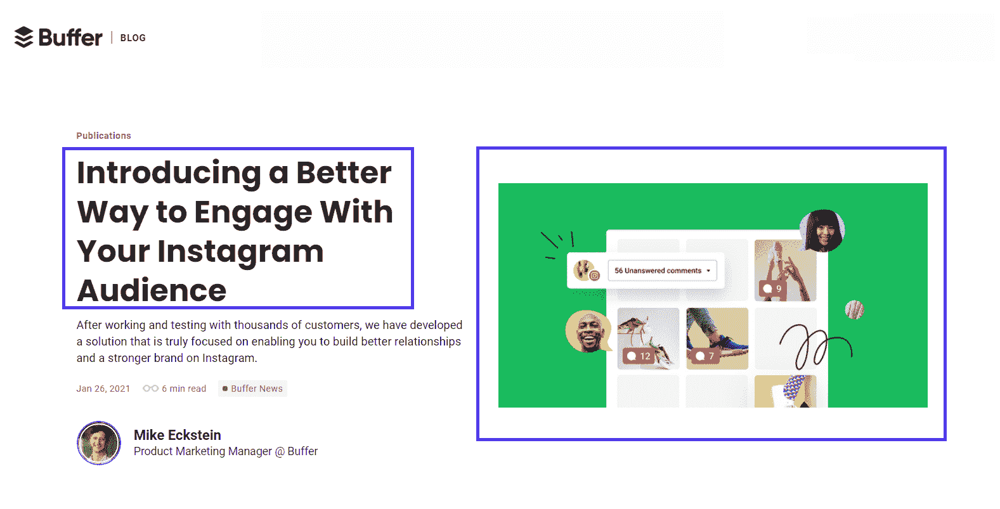

Buffer website


当您为文章中的每个特色图片手动插入图片时，相关性也会发挥作用。为了节省时间，很容易抓取与文章相关的快速图片。然而，当我们决定一个特色图片时，我们都应该慢慢来，因为它是帖子的“书的封面”，会让人们拿起它来阅读。

### 发布特色图片前获得合法权利

使用你在网上随机找到的照片和图片会给你的图片带来严重的麻烦。这可能会导致照片所有者伸出手来，要求你删除你的许多特色图片，或者更糟的是，威胁采取法律行动。

一个很好的经验法则是:如果你没有自己拍摄照片或支付版权费用，你可能无法使用它。

这条规则也有例外！

唯一一次你会发现可以在你的网站上免费分享图片的时候是当你从像 [Pexels](https://kinsta.com/blog/free-images-for-wordpress/#4-pexels) 或 [Unsplash](https://kinsta.com/blog/free-images-for-wordpress/#2-unsplash) 这样的网站上下载图片的时候。

然而，即使在这些网站上，你也通常被要求提供所有照片的归属(这很难，因为特色图片通常不允许标题)。

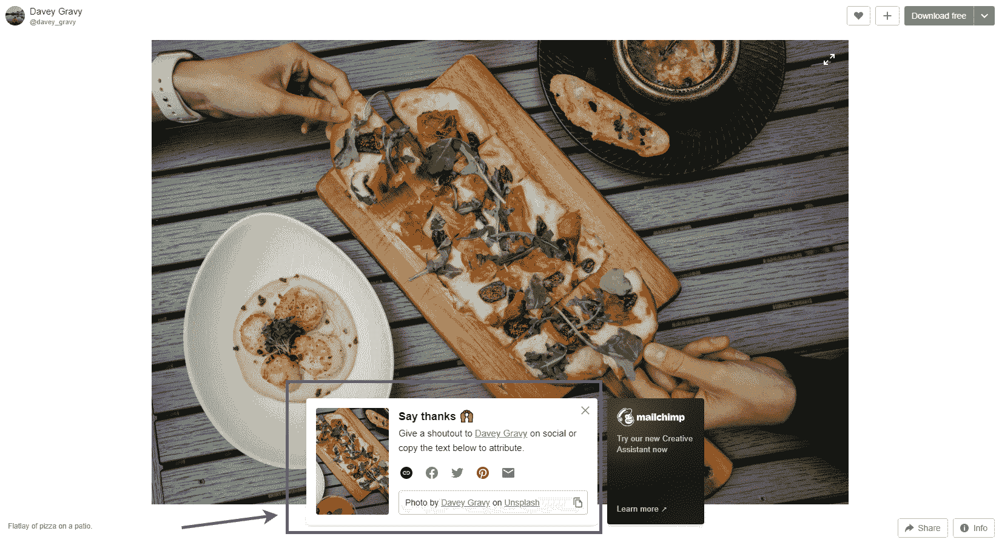

Image attribution is crucial to avoid copyright issues


遵循以下规则，以确保您的特色图片是合法的:

1.  用你自己的相机拍一张照片。这是消除法律问题的可靠方法。
2.  看看有[知识共享](https://kinsta.com/blog/wordpress-stock-photos/)许可的图片网站。这些选项包括 Unsplash 和 Pexels。
3.  因为 WordPress 精选的[图片通常会屏蔽标题](https://kinsta.com/knowledgebase/wordpress-image-caption/)，所以在你的文章中的某个地方说明该精选图片的属性。
4.  在 Shutterstock 和 iStockPhoto 等网站上为照片付费。
5.  [使用 Canva 或 Adobe Spark 等免费设计工具制作自己的图形](https://kinsta.com/blog/wordpress-charts/)。
6.  如果你找到一张你非常喜欢的照片，联系摄影师或艺术家，询问你是否可以在你的网站上使用他们的作品。免费、收费或附带署名。确保书面形式的协议(电子邮件也可以)。

### 保持特色图像主题的一致性

确保所有特色图片与它们所附的帖子相关是一回事。

不过，你也要[坚持一个一致的主题](https://kinsta.com/blog/new-kinsta/#a-fresh-new-look)。这有助于加快你的特色形象创建过程，同时也有助于你的品牌。

例如，你所有的特色图片可以有一个黑白滤镜。或者，他们可能包括丰富多彩的动画，同时仍然代表着帖子中的内容。

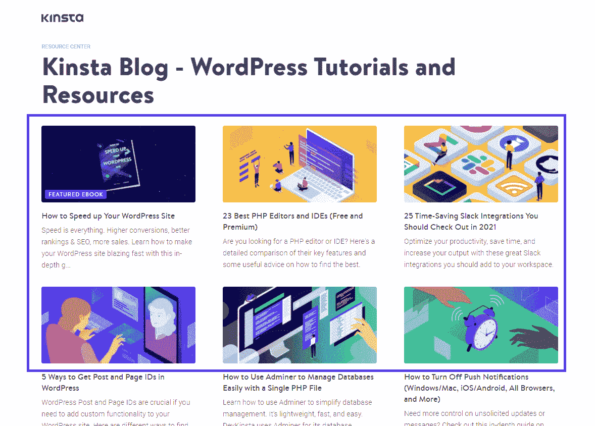

Keep the branding consistent on your featured images


### 使用缩小的高分辨率图像

特色图片与网站上的其他照片没有区别。它被放在数字媒体上，照片的分辨率不一定要适合印刷才好看。

总的来说，网站上的照片会占用大量的服务器空间，可能会降低网站的加载速度。但是，你也想使用实际上看起来很好的照片，所以你仍然应该尽可能地拍摄高分辨率照片。

寻找特色图片时，总是考虑从更大的高分辨率照片开始。这样，您就可以缩小它的尺寸，用于数字接口，同时仍然保持其分辨率。

放大照片是一个大禁忌。然而，让你的更大、更高分辨率的照片保持原始格式肯定会导致加载问题。

### 使用快速调整图像大小和优化工具

考虑到您应该上传高分辨率图像作为特色图像，自动优化是有意义的。毕竟，很难手动缩小、调整和裁剪你计划上传的每张图片。

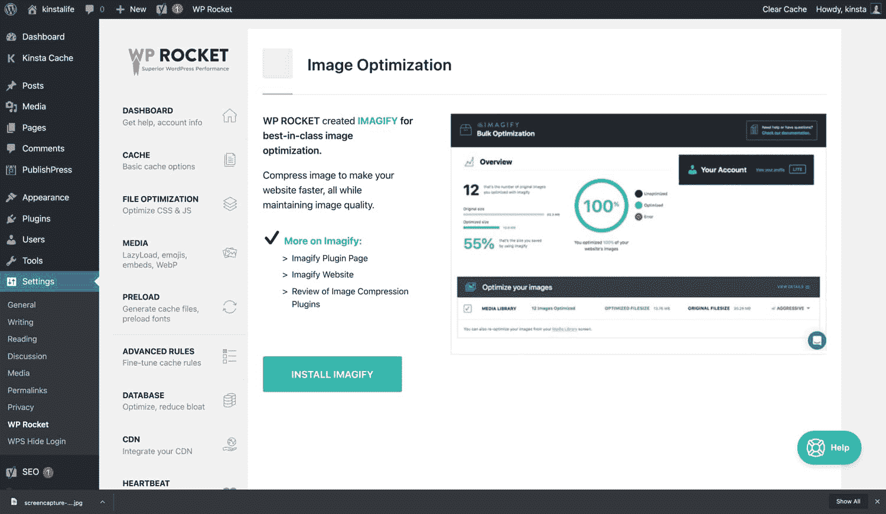

Image optimization by Imagify


一个图像优化插件为你做了大量的工作，确保你的特色图像真正显示出来，并且不会减慢你的网站。

我们有一个关于优化你的 WordPress 图片的极好的指南。总的来说，最好选择在第三方服务器上优化图片的插件。这将避免您自己的服务器出现问题。我们推荐像 [Optimole](https://kinsta.com/blog/optimize-images-for-web/#optimole) 和 [Imagify](https://kinsta.com/blog/optimize-images-for-web/#imagify) 这样的解决方案。

### 为搜索引擎优化优化特色图片

图像优化的另一个要素涉及这些图像如何在搜索引擎中显示。它们对帮助你的文章或页面提升排名至关重要。每个托管的图片，包括特色图片，都有元数据被搜索引擎抓取，以判断你的帖子或页面是关于什么的。

如果你的目标是一个关键词，这个元数据是一个很好的机会向搜索引擎显示图像是相关的。你应该[避免仅仅因为你想填充关键字](https://kinsta.com/blog/decline-seo-rankings/#penalties)。相反，快速解释图片中的内容，并潜在地添加关键词来提升你的排名。

最重要的图像元数据是它的**替代文本**，可以在**媒体库**中打开你的特色图像找到。

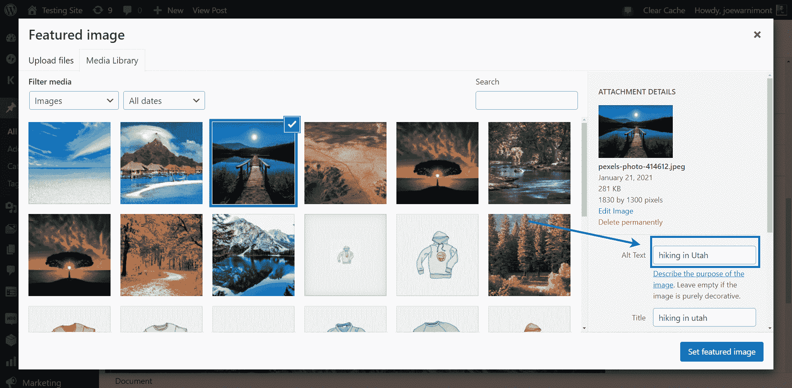

Set the ‘Alt Text’ for images


不管为图片设置一个合适的替代文本是否有助于 SEO，出于[可访问性](https://kinsta.com/blog/web-design-best-practices/#accessibility-standards)的原因，你还是应该这样做。


Accessibility is crucial for every website


许多盲人通过屏幕阅读器使用互联网。让他们可以访问你的网站。

### 确保打开的图表对于共享是活动的

我们在上一节中介绍了开放图形的基本要素。但这是一个提醒，以确保您的主机提供商要么提供渲染特色图像所需的工具，要么找到一个激活 Open Graph 协议的插件。

每当有人想在社交网络上分享你的帖子或页面时，特色图片就会迅速出现。否则，你会冒有人决定不分享帖子的风险，或者当用户分享你网站的链接时，你的品牌看起来不专业。

### 考虑一个替换空的特色图像字段的插件

我们已经在前一节中介绍了这个解决方案，但是它也非常适合最佳实践。你永远不知道什么时候人为错误会导致特色图片无法上传到你的网站。

当你忘记的时候，考虑使用一个默认的特色图片插件来填补空白，并列出临时或永久的特色图片。当你的旧帖子没有合适的特色图片时，它也会有所帮助。

[Featured images matter. A lot! 🌟 Here's the definitive guide to fix WordPress featured image not showing properly on your site 👋🏻Click to Tweet](https://twitter.com/intent/tweet?url=https%3A%2F%2Fbit.ly%2F3qaYaMK&via=kinsta&text=Featured+images+matter.+A+lot%21+%F0%9F%8C%9F+Here%27s+the+definitive+guide+to+fix+WordPress+featured+image+not+showing+properly+on+your+site+%F0%9F%91%8B%F0%9F%8F%BB&hashtags=WordPress%2Cwebdev)

## 摘要

创建一个内容惊人的网站，却发现特色图片没有显示出来，这不仅令人沮丧，而且对你的品牌有潜在的危害。我们希望这个指南能帮助你解决特色图片不能在 WordPress 上显示的常见问题。在着手更高级的解决方案之前，请确保测试您的特色图像已上传并设置正确。

在此过程中，您还学习了一些技巧来提高您的图像编辑技能和工作流程。如需更多此类图像优化技巧和诀窍，请阅读我们的[深入图像优化指南](https://kinsta.com/blog/optimize-images-for-web/#optimole)。这是《T2》加速你的 WordPress 网站的必读书目。

现在您已经准备好了特色图片，开始分享吧！

我们错过了什么重要的事情吗？如果你有任何关于特色图片的问题或者关于 WordPress 特色图片的问题，请在下面留下评论。

* * *

让你所有的[应用程序](https://kinsta.com/application-hosting/)、[数据库](https://kinsta.com/database-hosting/)和 [WordPress 网站](https://kinsta.com/wordpress-hosting/)在线并在一个屋檐下。我们功能丰富的高性能云平台包括:

*   在 MyKinsta 仪表盘中轻松设置和管理
*   24/7 专家支持
*   最好的谷歌云平台硬件和网络，由 Kubernetes 提供最大的可扩展性
*   面向速度和安全性的企业级 Cloudflare 集成
*   全球受众覆盖全球多达 35 个数据中心和 275 多个 pop

在第一个月使用托管的[应用程序或托管](https://kinsta.com/application-hosting/)的[数据库，您可以享受 20 美元的优惠，亲自测试一下。探索我们的](https://kinsta.com/database-hosting/)[计划](https://kinsta.com/plans/)或[与销售人员交谈](https://kinsta.com/contact-us/)以找到最适合您的方式。