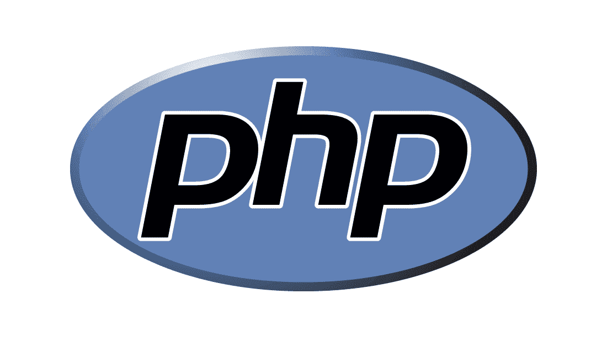
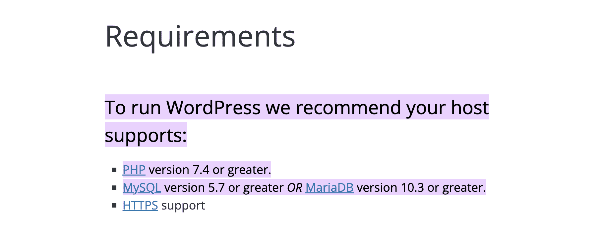
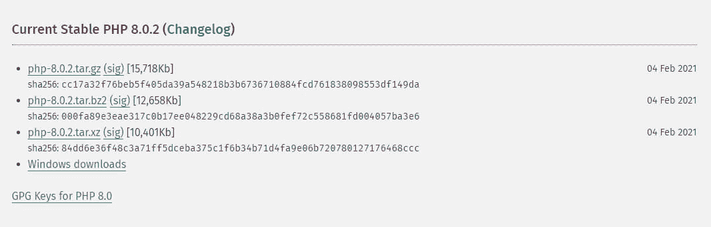
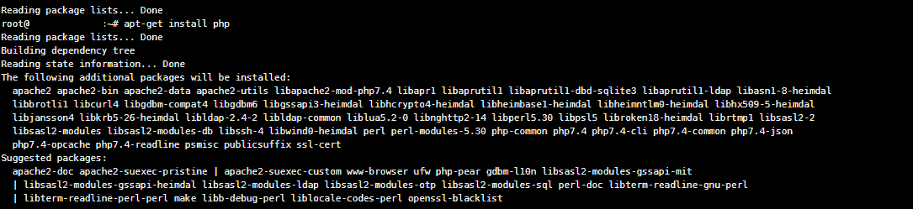
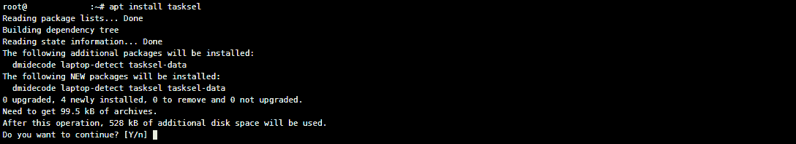
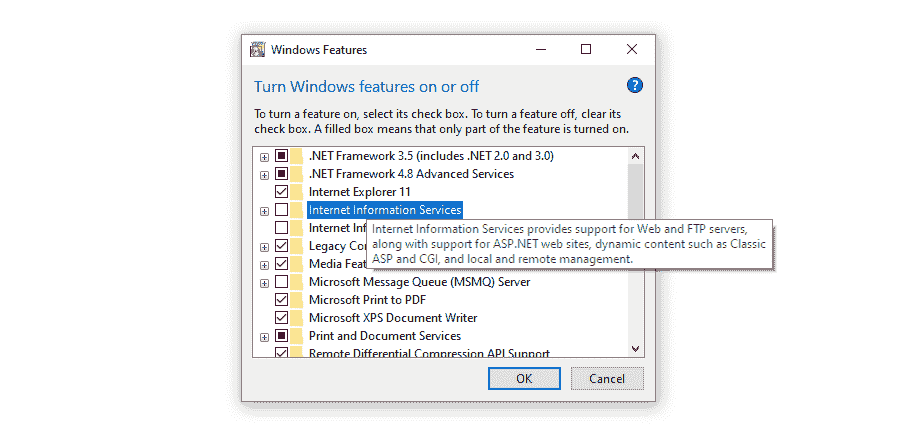

# 如何在任何服务器上安装 PHP(Linux，macOS，Windows)

> 原文：<https://kinsta.com/blog/install-php/>

设置服务器可能是一项艰巨的任务，尤其是在安装 PHP 之类的语言时。如果你想安装并运行一个 WordPress 测试服务器，这是一个必须学习的技能。

不知道从哪里开始在你的服务器上安装 PHP？根据您独特的设置，有许多方法可以做到这一点。你在哪里下载 PHP，哪个版本，你需要什么来使它工作，你如何在各种操作系统上安装 PHP？

我们将在这个一站式 PHP 安装指南中回答所有这些问题。

我们开始吧！

### 看看我们安装 PHP 的视频指南


## PHP 是什么？



PHP logo


PHP 是一种开源的[脚本语言](https://kinsta.com/blog/scripting-languages/)，主要用于 web 开发和服务器端(后端)脚本。简单来说:


> Kinsta 把我宠坏了，所以我现在要求每个供应商都提供这样的服务。我们还试图通过我们的 SaaS 工具支持达到这一水平。
> 
> <footer class="wp-block-kinsta-client-quote__footer">
> 
> 
> 
> <cite class="wp-block-kinsta-client-quote__cite">Suganthan Mohanadasan from @Suganthanmn</cite></footer>

[View plans](https://kinsta.com/plans/)

*   PHP 可以安装在服务器上运行脚本(例如，向您的站点添加表单的代码片段)。
*   它运行在服务器端而不是客户端，所以它在后端而不是在浏览器中工作。
*   它与 [HTML](https://kinsta.com/knowledgebase/edit-wordpress-code/) 集成得很好，非常适合 web 开发。

它也是最容易学习的 web 脚本语言之一，是初学者的热门选择。但也相当强大，适合高级网站功能。

许多网站和工具使用 PHP 及其许多扩展(。NET、Apache 和 MySQL 听起来可能很熟悉)。WordPress 主要建立在 PHP 之上，它的大部分插件和主题也在上面运行。
T3】

### 你的服务器需要 PHP 吗？

所以你知道 PHP 是什么，但是你为什么要在你的服务器上安装它呢？

最值得注意的原因是，这是启动和运行 WordPress 的一个要求，因为它几乎完全是基于 PHP 构建的。PHP 也支持大多数 WordPress 函数、钩子、主题和插件。

你可以在这里看到所有其他的 [WordPress 系统需求](https://wordpress.org/about/requirements/):



WordPress requirements


所以，如果你想运行一个 WordPress 测试服务器，或者设置一个临时站点，你需要安装 PHP。

除此之外，对于初学者来说，PHP 是一个很好的起点。与其他 web 脚本语言相比，使用[很简单，但这并不会以牺牲功能为代价。如果你足够熟练，你可以用它做各种事情。](https://kinsta.com/blog/php-vs-javascript/)

[PHP 也是相当流行的](https://kinsta.com/blog/is-php-dead/)。所以，你可以在网上找到大量的扩展和资源。

除此之外，如果你想学习编写 WordPress 主题和插件，你需要学习 PHP。设置测试服务器是一种很好的实验方式。

请注意，许多虚拟主机服务器(如 [Kinsta](https://kinsta.com/plans/) )预装了 PHP 和 WordPress。Kinsta 甚至包括创建一个 [WordPress 暂存站点](https://kinsta.com/help/staging-environment/)的能力，所以也很容易获得。

您需要手动执行此操作的唯一原因是，如果您正在从零开始设置服务器，无论是在本地计算机上还是在非托管的托管环境中。

也就是说，让我们进入服务器设置说明。


## PHP 先决条件

在安装 PHP 之前，你需要确保你的服务器能够处理它。幸运的是，这些要求相当基本，而且很多软件可能已经安装在您的计算机上了。

如果你以前从未创建过服务器，你应该看看这个[指南，在多个操作系统上设置一个本地服务器](https://www.maketecheasier.com/setup-local-web-server-all-platforms/)。具体细节因操作系统而异，但您应该知道如何使用命令行，并准备好安装新软件。

无论你在什么操作系统上安装 PHP，你都需要一个网络服务器来运行它。你可能还需要安装一个类似于 [MySQL](https://kinsta.com/knowledgebase/what-is-mysql/) 的数据库，所以记住这一点。

以下是每个操作系统的 PHP 先决条件，从 [Linux](https://www.php.net/manual/en/install.unix.php) 开始:

*   一个 ANSI C 编译器。
*   特定于模块的组件，如 GD 图形库或 PDF 库。
*   可选:Autoconf 2.59+(针对 PHP 版本< 7.0), Autoconf 2.64+ (for PHP versions > 7.2)，Automake 1.4+，Libtool 1.4+，re2c 0.13.4+，Bison。

您还应该熟悉导航类 Unix 操作系统。

现在，PHP 对[窗口](https://www.php.net/manual/en/install.windows.requirements.php)的要求是:

*   PHP 5.5+支持多个 Windows 操作系统，但 7.2.0+用户无法使用 Windows 2008 或 Windows Vista。
*   Visual C 运行时(CRT)。
*   Visual Studio 2012、2015、2017 或 Microsoft Visual c++ re distributable for Visual Studio 2019，具体取决于您的 PHP 版本。

最后，macOS 没有先决条件，因为 PHP 与系统捆绑在一起。我们将在下面解释如何启用它。

### 在哪里下载 PHP

如果需要手动下载 PHP 文件，应该从官方网站的 [PHP 下载页面](https://www.php.net/downloads)获取。

避免从[第三方](https://kinsta.com/blog/third-party-performance/)网站安装它，除非你知道它们是安全的，因为从第三方网站下载文件会导致意外安装[恶意软件](https://kinsta.com/knowledgebase/the-site-ahead-contains-malware/)。



PHP downloads page


如果你是为 Windows 机器下载，在每个版本的 PHP 中寻找“Windows 下载”链接，并确保你安装了正确的文件。

你也可以安装 PHP 的旧版本[，但是除非你知道你在做什么，否则不推荐这样做，因为它们会把你的服务器暴露给错误和主要的安全缺陷。](https://www.php.net/releases/index.php)

如果你运行的是 Linux 发行版，你通常不需要通过网站获取文件，你应该使用[命令行](https://kinsta.com/blog/ssh-commands/)。我们将在下面详细讨论这个问题。

### 我应该使用哪个 PHP 版本？

如果你点击了上面的下载链接，你可能会看到所有这些文件，感到不知所措。哪个 [PHP 版本](https://kinsta.com/blog/php-versions/)才是正确的？

一般来说，如果你开始一个全新的项目，兼容性问题不是问题，你应该获得 PHP 的最新稳定版本。

有时可以下载甚至更新的 PHP 测试版，但是这些测试版经常有问题，发布它们只是为了帮助开发者收集反馈。大多数时候，您应该坚持使用稳定的版本。

老版本呢？每个 PHP 版本都有新的特性，但这意味着与旧特性的新的不兼容性。如果你需要做一些最新版本的 PHP 不支持的事情，你可以使用旧的版本，但是你应该坚持使用当前支持的版本。

如果你不确定，那么使用最新版本的 PHP。

注意 WordPress 只与 PHP 的某些版本[兼容。它在技术上支持从 5.6.20+开始的 PHP 版本，但是这些版本太旧了，因此不推荐。版本 7.4 和 8.0 是目前 WordPress 支持最好的版本。](https://make.wordpress.org/hosting/handbook/handbook/server-environment/#php)

PHP 版本 8 也是兼容的，但目前，这是非常新的，并不是所有的插件都能正常工作。如果你担心兼容性问题，坚持使用 PHP 7.4 版本。你可以阅读我们的 [PHP 基准](https://kinsta.com/blog/php-benchmarks/)帖子，看看各种 PHP CMSes 和框架在不同 PHP 版本上的表现。

 ****更新:** [PHP 8.1(正式发布)](https://kinsta.com/feature-updates/php-8-1/)现已对所有 Kinsta 客户端开放。Kinsta 不再支持 PHP 7.4。请注意，我们支持 PHP 版本 8.0，8.1。这仅适用于 Kinsta 托管的网站。

## 如何在 Linux 上安装 PHP

在开始之前，你应该熟悉[终端](https://kinsta.com/blog/how-to-use-ssh/#connecting-via-the-terminal-on-macos-or-linux)以及一般如何操作类似 Unix 的操作系统。一般来说，这些命令行代码应该可以在终端中使用正常语法的任何 Linux 发行版上工作，但是我们在下面为特定的操作系统留下了一些注释。

首先，您应该确保您的包是最新的，所以在终端中运行这个 [Linux 命令](https://kinsta.com/blog/linux-commands/)。

```
sudo apt-get update && sudo apt-get upgrade
```

现在您已经准备好安装 PHP 了。这样做的命令简单明了。

## 注册订阅时事通讯


### 想知道我们是怎么让流量增长超过 1000%的吗？

加入 20，000 多名获得我们每周时事通讯和内部消息的人的行列吧！

[Subscribe Now](#newsletter)

```
sudo apt-get install php
```



Installing PHP via terminal


这将安装 PHP 的最新版本以及几个扩展。您可以使用此代码来查看您拥有的版本。

```
php –v
```

想安装特定版本的 PHP，比如 [PHP 7.4](https://kinsta.com/blog/php-7-4/) 怎么办？你需要使用一个 PPA，或者个人包存档，由[ondřej sur](https://launchpad.net/~ondrej/+archive/ubuntu/php/)提供。这是安装受支持的旧版本 PHP 的安全方式。一次运行一个命令:

```
sudo apt install software-properties-common
sudo add-apt-repository ppa:ondrej/php
sudo apt-get update
```

现在您的系统识别了这个档案，您可以安装 PHP 7.4 了。键入以下命令:

```
sudo apt install php7.4
```

当然，您可以用您想要的任何 PHP 版本替换这个数字。

这涵盖了基础知识，但是如果您需要额外的配置帮助，Unix 的 PHP 安装文档可以提供帮助。

### 在 Ubuntu 上安装 PHP

对于 Ubuntu 用户来说，只要你遵循上面的指南，就没有太多具体的顾虑。Ubuntu 是最受欢迎的发行版之一，所以大多数 Linux 指南实际上都是为该系统设计的。

您可以选择[下载灯组](https://kinsta.com/knowledgebase/what-is-localhost/#how-to-install-wordpress-locally-your-localhost)。LAMP 代表 Linux、Apache、MySQL 和 PHP。它本质上是一个让服务器正常运行所需的所有软件的捆绑包。

虽然您可以分别手动下载这些工具，但您也可以获得 Taskel，它是一个可以一次性安装所有这些工具的软件包。只需在终端中连续运行这两个命令:

```
sudo apt install tasksel
sudo tasksel install lamp-server
```



Installing LAMP stack with Taskel via terminal


### 在 CentOS 7 上安装 PHP

这个操作系统与其他 Linux 发行版略有不同。在 CentOS 上，apt 和 apt-get 命令不是安装软件的理想方式。取而代之的是，它使用了 Yellowdog Updater Modified 的 [yum](https://access.redhat.com/solutions/9934) ，这是一个针对 RHEL 操作系统的更好的软件包管理器。

否则，您需要使用的命令非常相似。要更新您的软件包，请改为运行以下命令:

```
sudo yum install epel-release && sudo yum update
```

至于其他命令，一般可以用 yum 代替`apt-get`。要安装 PHP，请使用以下命令。

需要一个超快的、安全的、开发者友好的主机？Kinsta 是为 PHP 开发人员设计的，它提供了大量强大的工具和直观的仪表板。查看我们的计划！

```
sudo yum install php
```

PHP 命令如`php –v`在 CentOS 7 上应该是一样的，所以你不需要担心。

### 在 Debian 上安装 PHP

类 Unix 操作系统的最后一个是 Debian。这一次只有一些小问题，但是上面列出的大多数命令都应该工作正常。

对于 Debian，您可以在终端命令中使用`apt-get`或`aptitude`。`aptitude`命令更加全面，提供了一个[菜单](https://kinsta.com/blog/wordpress-menu-plugins/)界面。使用哪一种取决于个人喜好，哪一种都可以完成工作。

因此，您可以运行下面这个命令，而不是使用通常的`apt-get`命令:

```
sudo aptitude install php
```

Debian 可能很挑剔。如果您发现 PHP 无法解析或扩展无法工作，请确保您已经更新了服务器的 web 配置文件，并且它正在加载扩展 **ini** 文件。

除了一些小事情，Debian 的指令实际上和其他 Linux 发行版的指令是一样的。


## 如何在 Windows 上安装 PHP

如果你使用的是 Windows 系统，不像 macOS 和 Linux，你不需要通过[命令行](https://www.php.net/manual/en/install.windows.manual.php)来安装 PHP(尽管如果你愿意，这也是一个选项)。

从这里安装 PHP 的一个简单方法是[启用 IIS](https://www.howtogeek.com/112455/how-to-install-iis-8-on-windows-8/) ，然后使用 [WebPI](https://www.microsoft.com/web/downloads/platform.aspx) 来安装 PHP。启动 WebPI 后，可以在**产品**标签下找到。在您想要的版本上点击**添加**，然后点击**安装**。



Enabling IIS on Windows


你也可以[下载 PHP for Windows](https://windows.php.net/download) 和[手动配置](https://docs.microsoft.com/en-us/iis/application-frameworks/install-and-configure-php-on-iis/install-and-configure-php)它与 IIS 一起工作。如果使用 IIS，请确保获得非线程安全的版本。

如果这一切都太复杂，你可以安装 [WampServer](https://kinsta.com/blog/install-wordpress-locally/#how-to-install-wordpress-locally-on-windows-using-wamp) 或 [XAMPP](https://kinsta.com/blog/install-wordpress-locally/#how-to-install-wordpress-locally-using-xampp) ，因为这些软件提供了你开始使用 web 服务器所需的一切:Apache、数据库，当然还有 PHP。

这些说明将适用于大多数现代 Windows 操作系统，如 Windows 10、7 和 Vista。如果你使用的是旧版本的 Windows，你应该查看一下[传统 Windows 安装](https://www.php.net/manual/en/install.windows.legacy.index.php)文档。

Windows 可能需要一点额外的配置来让 PHP 正常工作，所以请确保查看[推荐的 Windows 配置](https://www.php.net/manual/en/install.windows.recommended.php)文档。你只需要做一些小的 **ini** 调整。

## 如何在 macOS 上安装 PHP

PHP 预装在大多数 macOS 系统中，所以你通常不需要任何手动安装。

你所需要做的就是[取消注释](https://kinsta.com/blog/wordpress-disable-comments/)Apache 配置文件 **httpd.conf** 中的几行代码，你通常可以在`/private/etc/apache2/httpd.conf`找到。通过删除 hashtag 符号取消对这两行的注释:

```
# LoadModule php5_module libexec/httpd/libphp5.so
# AddModule mod_php5.c
```

如果你不喜欢某些文件设置的默认值，你可能需要做额外的配置。否则，找到 DocumentRoot，然后用以下代码创建并加载一个 PHP 文件:

```
<?php phpinfo(); ?>
```

您可以随时使用`php –v`命令检查 PHP 版本，以确保 PHP 安装正确。

如果你确实需要手动下载 PHP，那么你应该[安装 Homebrew](https://brew.sh/) 并使用这个简单的命令:

```
brew install php
```

## 关于 PHP 扩展的所有内容

一旦 PHP 启动并运行，考虑扩展是个好主意。这些编译后的库增加了各种额外的有用的功能。可以把它们看作是 PHP 已经提供的插件。其中一些是需要运行 [PHP 框架](https://kinsta.com/blog/php-frameworks/)的，比如 [Laravel](https://kinsta.com/blog/php-frameworks/#laravel) 和 [Symfony](https://kinsta.com/blog/php-frameworks/#symfony) 。

虽然完全有可能自己编写所有的代码而不用接触扩展，但是当存在广泛使用的快捷方式来使您的生活更容易时，没有理由自己做所有的事情。

PHP 已经自带了几十个内置的扩展，其中一些你必须手动启用，其他的你可以马上开始使用。你也可以通过像 PECL 这样的网站安装 PHP 扩展，那里有数百个第三方软件包。

PHP 手册也为其中的许多内容提供了[扩展文档](https://www.php.net/manual/en/extensions.php)，因此您可以掌握使用它们的窍门。

不确定从哪里开始？以下是一些流行的 PHP 扩展中的一小部分:

*   Apache : Apache 是 WordPress 推荐的一款广泛使用的网络服务器软件，因为它与 it 和 PHP 有很好的兼容性。Apache 与 PHP 捆绑在一起，所以不需要手动安装。
*   [。网](https://dotnet.microsoft.com/):。NET 是一个流行的软件框架，可以用来构建 web 应用程序等等。它支持多种语言，包括 PHP。您可能也会对 [PeachPie](https://www.peachpie.io/) 感兴趣，它允许您在. NET 中运行 PHP 代码
*   MySQL 是旧 MySQL 扩展的一个更好的版本，它使你能够使用 MySQL 数据库软件。这是帮助你建立数据库的必备工具。

无论何时安装扩展，都需要取消注释。打开 **php.ini** ，去掉分号(**；**)前面的`extension=extensionname`。

如果你想标准化你的代码并且用预制的库来构建，你也应该看看这些 [PHP 框架](https://kinsta.com/blog/php-frameworks/)。它们是开始用 PHP 开发 web 应用程序的好方法。

## 摘要

不管你用的是什么操作系统，安装 PHP 都不是一件难事。如果你想做一个 WordPress 测试服务器，你会需要它。有抱负的 PHP 程序员会发现建立一个 web 服务器并在上面安装 PHP 是一个很好的练习。

确保你通过命令行或者从官方网站下载 PHP。你可以获得 PHP 的最新稳定版本或者任何其他与 WordPress 兼容的[版本。](https://make.wordpress.org/hosting/handbook/handbook/server-environment/#php)

如果你想马上开始开发 WordPress 网站，你可以试试 [DevKinsta](https://kinsta.com/devkinsta/) ！它预装了 PHP。它还允许您在不同的 PHP 版本之间进行热交换，以便您可以在不同的服务器环境中测试您的站点。

* * *

让你所有的[应用程序](https://kinsta.com/application-hosting/)、[数据库](https://kinsta.com/database-hosting/)和 [WordPress 网站](https://kinsta.com/wordpress-hosting/)在线并在一个屋檐下。我们功能丰富的高性能云平台包括:

*   在 MyKinsta 仪表盘中轻松设置和管理
*   24/7 专家支持
*   最好的谷歌云平台硬件和网络，由 Kubernetes 提供最大的可扩展性
*   面向速度和安全性的企业级 Cloudflare 集成
*   全球受众覆盖全球多达 35 个数据中心和 275 多个 pop

在第一个月使用托管的[应用程序或托管](https://kinsta.com/application-hosting/)的[数据库，您可以享受 20 美元的优惠，亲自测试一下。探索我们的](https://kinsta.com/database-hosting/)[计划](https://kinsta.com/plans/)或[与销售人员交谈](https://kinsta.com/contact-us/)以找到最适合您的方式。**