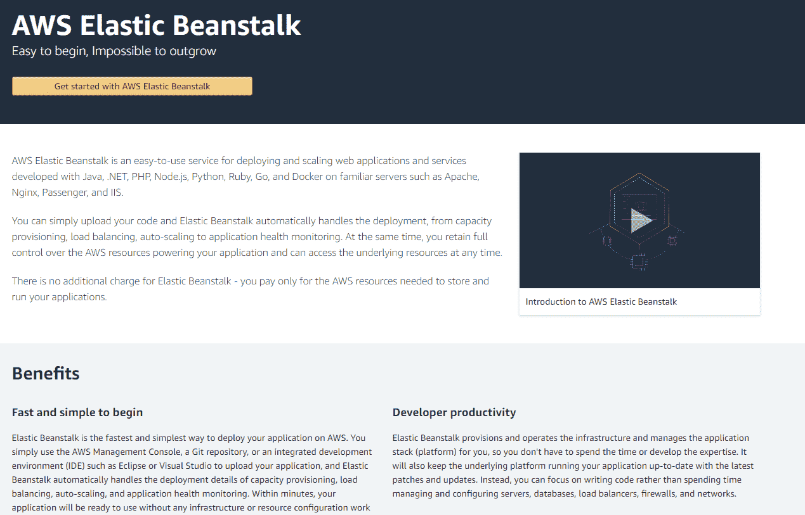
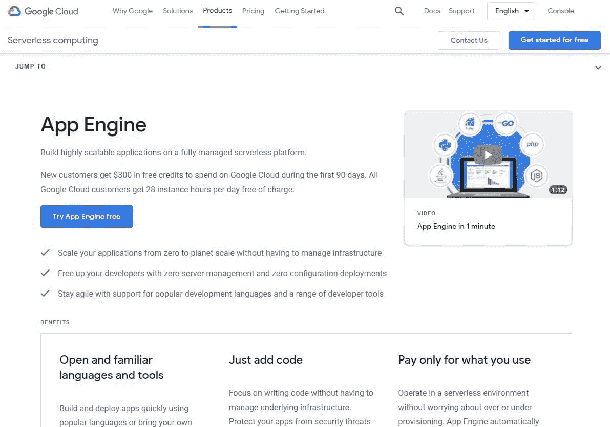
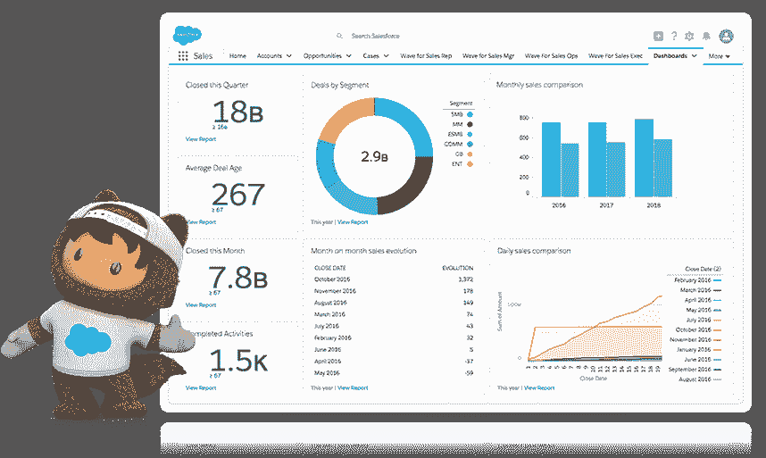
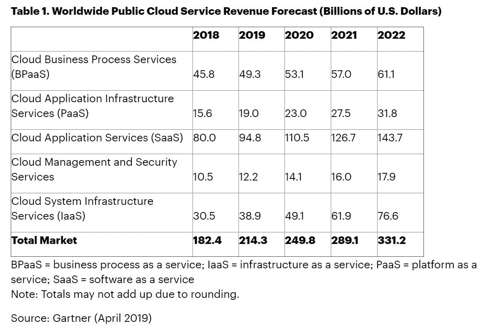
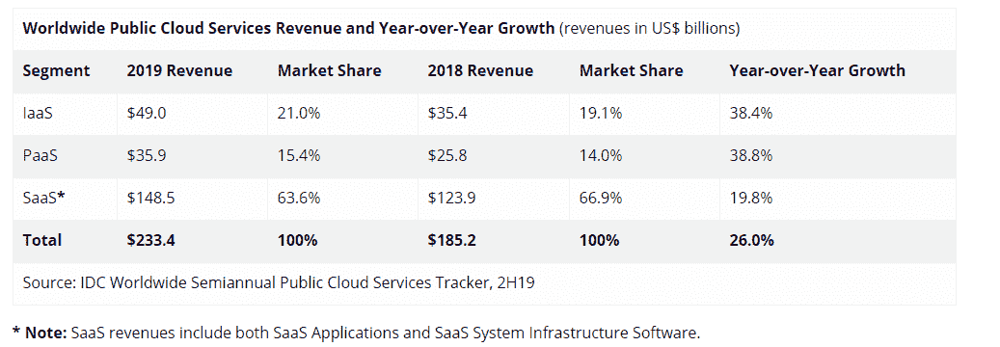
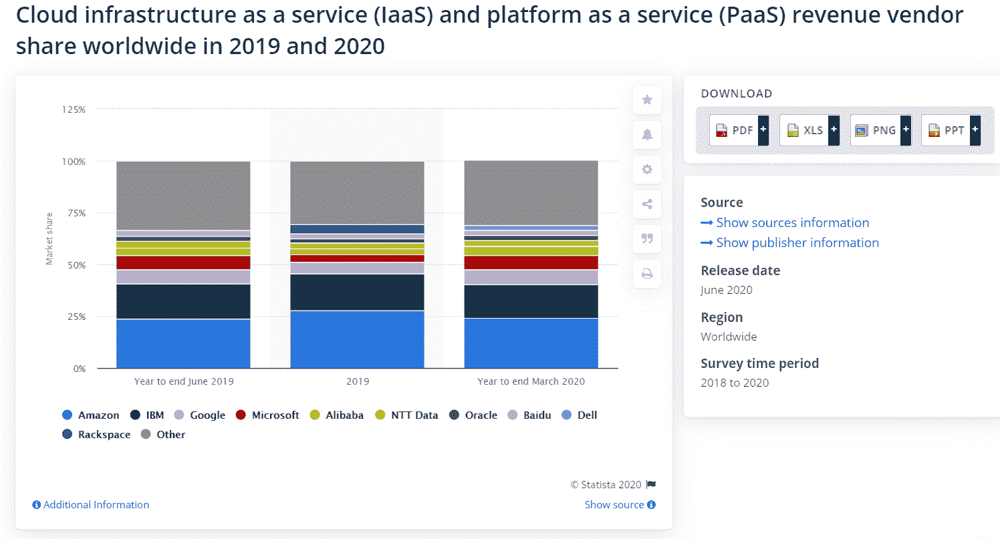
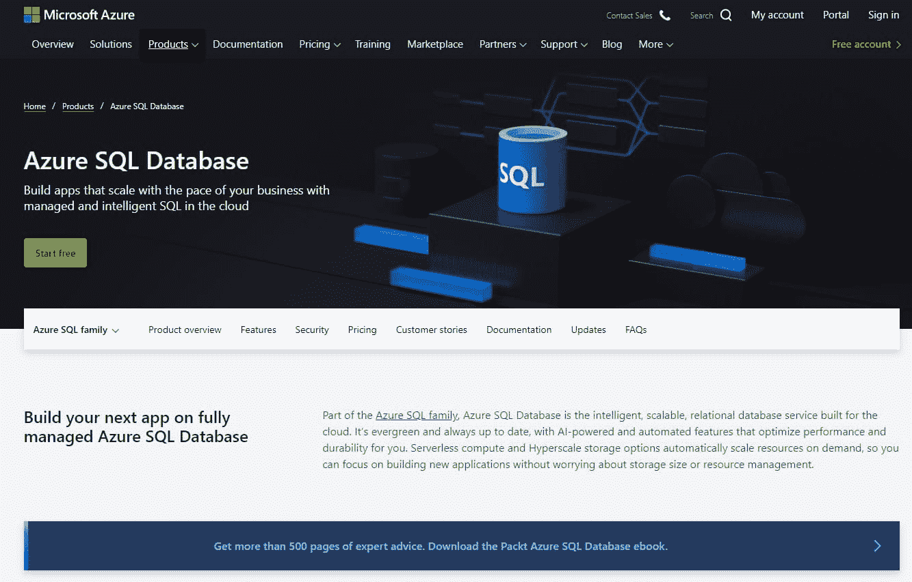
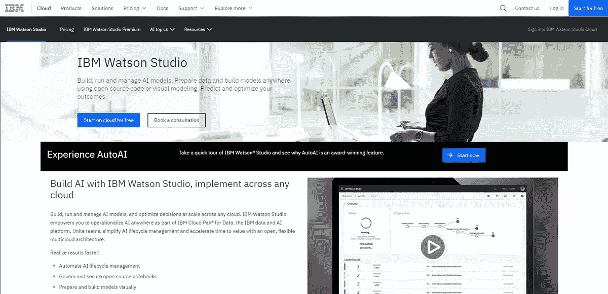
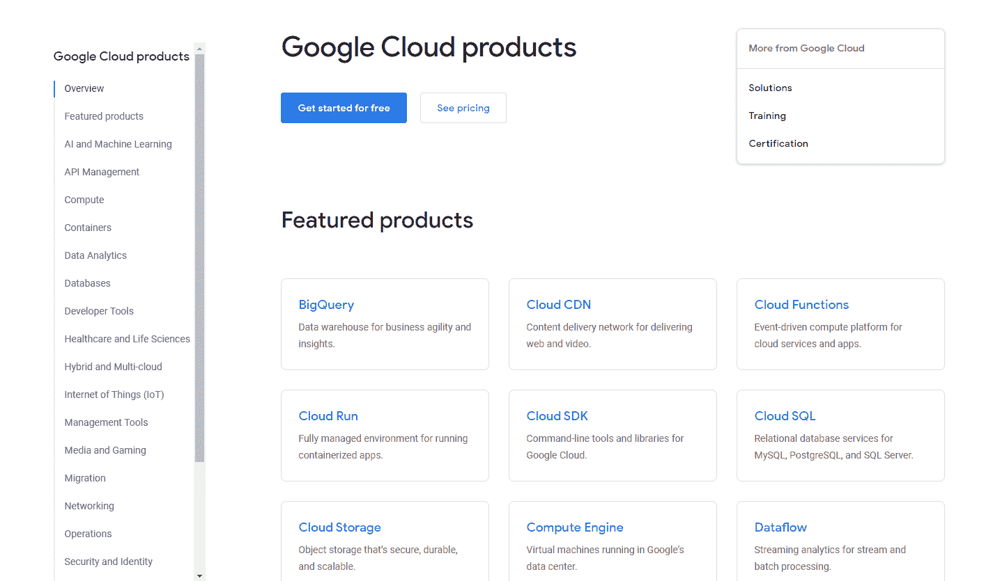
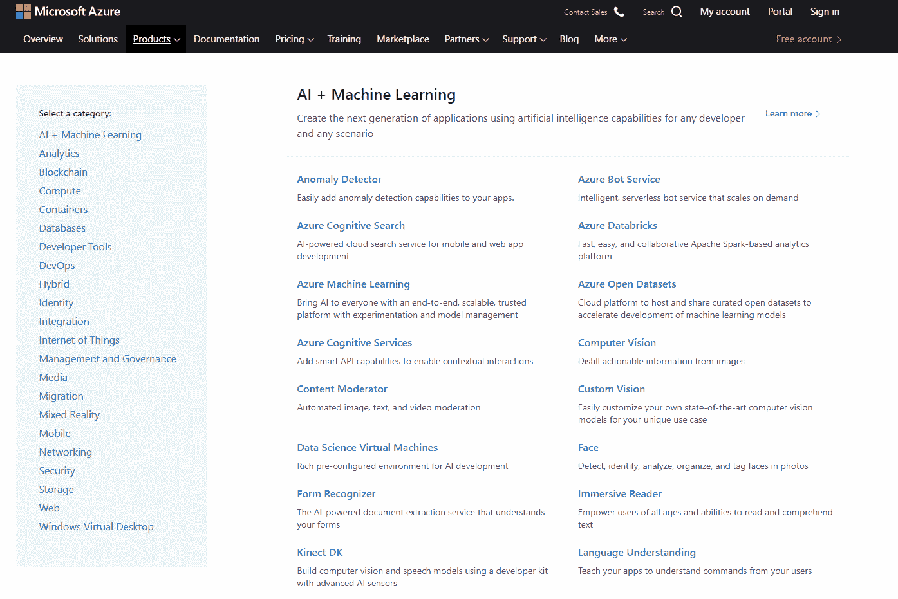

# 什么是 PaaS？平台即服务与 IaaS 和 SaaS 有何不同

> 原文：<https://kinsta.com/blog/what-is-paas/>

PaaS(平台即服务)将服务器、存储和网络基础设施与部署应用所需的软件相结合。借助 PaaS，您无需投资本地硬件，也无需担心设置虚拟环境来处理您的应用。

预计到 2020 年底，将近 85%的组织会将其大部分工作负载放在“云”中。然后，这些公司可以使用基于云的数据进行个性化营销，并在部门之间共享战略数据(避免孤岛)——这是数字化转型的两个主要目标。

PaaS 为您提供了实现这些目标所需的所有工具，甚至更多。

让我们探讨一下什么是 PaaS，一些真实的 PaaS 示例，领先的 PaaS 提供商的市场份额等等。

## 什么是 PaaS？(有例子)

[平台即服务(PaaS)](https://kinsta.com/blog/types-of-cloud-computing/#pass) 是指云计算硬件和软件工具的预打包组合，可让您轻松开发和部署应用。

例如，AWS Elastic Beanstalk 是一个即插即用的平台，支持多种编程语言和环境。它使得跨多个平台为不同设备部署和快速测试、启动和[扩展](https://kinsta.com/webinars/scale-wordpress-management/)应用变得容易。

AWS Elastic Beanstalk

它自动部署上传的代码，并包括[负载平衡](https://kinsta.com/knowledgebase/high-availability-hosting/)和自动扩展工具，以保持您的应用程序始终平稳运行。

[Google App Engine](https://kinsta.com/blog/google-cloud-hosting/) 是软件部署的 PaaS 的另一个例子。

Google App Engine

除了以任何语言部署应用程序，您还可以获得[应用程序诊断](https://kinsta.com/blog/application-performance-monitoring/)、版本控制、 [A/B 测试](https://kinsta.com/blog/google-optimize/)以及其他功能。

这些服务从根本上不同于仅仅租用存储空间或虚拟机。PaaS 解决方案是一个现成的平台，可以让您的应用程序运行起来。

单独租赁硬件属于 IaaS，而不是 PaaS。

让我们仔细看看这两个类别之间的区别。

[85% of organizations expected to have most of their workloads in the cloud by the end of 2020\. Are you ready to move to the cloud? Read on to find more! 🌩📊.Click to Tweet](https://twitter.com/intent/tweet?url=https%3A%2F%2Fbit.ly%2F2MWVV2i&via=kinsta&text=85%25+of+organizations+expected+to+have+most+of+their+workloads+in+the+cloud+by+the+end+of+2020.+Are+you+ready+to+move+to+the+cloud%3F+Read+on+to+find+more%21+%F0%9F%8C%A9%F0%9F%93%8A.&hashtags=cloudcomputing%2CPaaS)

### IaaS 和 PaaS 有什么区别？

[基础设施即服务(IaaS)](https://kinsta.com/blog/what-is-iaas/) 指云服务的硬件组件，如虚拟机和可扩展存储。PaaS 还包括一个用于部署应用程序的生态系统。

当然，它们都是云计算服务的例子，但是有不同的使用案例和目标市场。

让事情更加混乱的是，许多 PaaS 提供商也提供 IaaS 解决方案，反之亦然。

让我们通过比较具体的产品来澄清困惑。

| **平台即服务示例** | **IaaS 示例** |
| AWS 弹性豆茎 | AWS EC2 |
| 谷歌应用引擎 | 谷歌计算引擎(GCE) |
| 微软 Azure 应用服务 | 微软 Azure 存储 |
| IBM 云代工厂 | IBM 云虚拟服务器 |
| 数字海洋应用平台 | 数字海洋水滴 |
| Heroku | [Rackspace](https://kinsta.com/rackspace-alternative/) ，Linode |

例如，使用 AWS EC2 实例为您的 web 应用程序存储数据意味着您只利用了基本的云[基础设施](https://kinsta.com/knowledgebase/what-you-should-know/)。因此，在这种情况下，您只使用 IaaS 服务。

如果您使用 AWS Elastic Beanstalk 来部署 web 应用程序，您将使用 PaaS 服务。Elastic Beanstalk 实现使用 AWS 基础设施，如 S3、 [EC2](https://kinsta.com/blog/google-cloud-vs-aws/#compute-features) 和 DynamoDB，但是将它们组合成一个即时可用的开发平台。

这就是区别。

PaaS 是一个打包的解决方案，可以帮助您开发和部署应用程序，而 IaaS 只是一个基本的云基础架构。

这类似于一个[非托管的虚拟主机服务](https://kinsta.com/blog/managed-wordpress-hosting/)(你必须安装服务器环境，比如 PHP & MySQL)和一个[应用](https://kinsta.com/application-hosting/)、[数据库](https://kinsta.com/database-hosting/)和[托管的 WordPress 托管](https://kinsta.com/wordpress-hosting/)平台[比如 Kinsta](https://kinsta.com/why-us/) 。

在某些情况下，像 AWS、Google 和微软这样的供应商只会向你收取资源使用费，而不会向你收取软件平台使用费。

### SaaS 和 PaaS 有什么区别？

[软件即服务(SaaS)](https://kinsta.com/blog/types-of-cloud-computing/#saas) 另一方面，它提供完整的软件，而不是一个可以用来部署定制应用的平台。

例如，像 [Salesforce](https://kinsta.com/blog/woocommerce-crm/#salesforce-connector-woocommerce) 这样的基于云的 [CRM](https://kinsta.com/blog/wordpress-crm/) 让你无需任何编程就能管理客户数据和工作流程。

Salesforce dashboard

你只需要注册，它就可以使用了。这是 SaaS 服务的原则。

相比之下，要用 PaaS 做同样的事情，你需要开发一个定制的应用，或者部署和定制一个具有类似功能的[开源软件](https://kinsta.com/learn/wordpress-gpl/)。

为了理解其中的区别，让我们再看一些例子。

| **云服务类型** | **例题** |
| **SaaS** | Google Workspace、Microsoft Dynamics CRM、IBM Watson 助手、Salesforce、Workday、Slack |
| **PaaS** | AWS Elastic Beanstalk、Google App Engine、微软 Azure App Service、Heroku、IBM Cloud Foundry |

任何人一注册，SaaS 的产品就可以使用。例如，一旦你加入谷歌文档，你就可以开始创建、保存和分享文档。

但谷歌应用引擎或 IBM Cloud Foundry 并不是解决业务问题的成品应用。相反，它们是你可以部署定制应用的云平台。

大多数公司结合使用 SaaS(我们使用 40+ [SaaS 产品](https://kinsta.com/blog/saas-products/))和 PaaS 来运营他们的业务。最佳解决方案取决于每个用例以及您公司的经验和基础架构。

## PaaS 市场规模、份额和领先供应商

PaaS 市场的报告规模及其与其他云服务的比较取决于来源。

例如，根据 [Gartner](https://www.gartner.com/en/newsroom/press-releases/2019-04-02-gartner-forecasts-worldwide-public-cloud-revenue-to-g) 的预测，到 2021 年，PaaS 将被 IaaS 超越，分别为**275 亿美元**和**619 亿美元**。

Public cloud market share (Source: Gartner)

这将使 IaaS 市场的规模超过 PaaS 的两倍。IaaS 是整个云服务市场的重要组成部分，而 PaaS 相比之下几乎是小众的。

但是其他研究显示了一个不同的画面。

根据[国际数据公司(IDC)的数据](https://www.idc.com/getdoc.jsp?containerId=prUS46780320)，2019 年的收入要接近得多，PaaS 要大得多，为 359 亿美元对 490 亿美元。

Worldwide public cloud services market growth (Source: Gartner)

这两个类别的增长率几乎相同，IaaS 的**同比增长率为 38.4%** 而 PaaS 的**同比增长率为 38.8%** 。

虽然 PaaS 可能不会缩小差距，但它也不会落后。

不同云服务类别之间的[云市场份额](https://kinsta.com/blog/cloud-market-share/)取决于定义它们之间的边界。请注意，IDC 在其分类中没有单独列出管理和安全服务或业务流程服务。

这可能是 SaaS 和 PaaS 在列表中明显较大的原因。

### 领先供应商及其市场份额

自 2016 年以来，云行业专家、研究公司和专家已经从单独报告过渡到涵盖 IaaS 和 PaaS 相结合的公共云行业。

Public Cloud Services Market Share – 2019 (Source: IDC)

其中一个主要原因是，这两个类别中的主要参与者大多是相同的。

无论你是在分析 IaaS 还是 PaaS 市场，你都会看到一些熟悉的名字，比如亚马逊、谷歌、微软和 IBM。

第二个原因是，这些市场领导者倾向于将 IaaS 和 PaaS 服务捆绑在一起，因此很难将收入分开。

例如，AWS 获得了大量 IaaS 收入，因为它免费提供了一些 PaaS 环境(如 Elastic Beanstalk)。由于人们只为[资源使用](https://kinsta.com/help/billing-questions/#overage-email-notifications)付费，因此很难区分平台和基础设施各带来多少收入。

PaaS and IaaS revenue share (Source: Statista)

据 Statista 统计， [AWS 的市场份额](https://kinsta.com/aws-market-share/)目前在**为 24.3%** ，超过 **8%** ，领先 IBM Cloud 的 **16%** 。

[谷歌云的市场份额](https://kinsta.com/google-cloud-market-share/)为**的 7.4%** ，仅仅比[微软 Azure 的](https://kinsta.com/azure-market-share/) **7%** 多一点点。但在全球范围内，这四家总部位于美国的巨头显然是市场领导者。

它们合起来占全球所有 IaaS 和 PaaS 收入的 54 %。

在领先的美国供应商之后，中国的阿里巴巴占全球总收入的份额为 **4.4%** ，日本的 NTT 数据为 **2.8%** 。

就实际使用和持续创新而言，这在很大程度上仍是美国主导的全球产业。

AWS 是领先的 IaaS 和 PaaS 提供商，并在 2021 年继续快速增长。

## PaaS 包括哪些服务？

虽然 PaaS 最常见的用例是 web 应用程序部署，但许多其他云服务也属于这种情况。

让我们仔细看看。

### 数据库即服务(DBaaS)

手动安装在虚拟机上的云托管数据库只是 IaaS 的一种实现。

要被视为 PaaS 产品，它需要是一个集成的解决方案，提供[存储](https://kinsta.com/help/disk-space-add-on/)、计算能力和[关系数据库](https://kinsta.com/knowledgebase/what-is-mysql/)功能。

这方面的一个例子是 Azure SQL 数据库服务，它提供了一个完全托管的数据库，具有自动更新、可伸缩性、智能威胁保护和人工智能搜索。

Azure SQL Database

这一类别的云服务产品也称为 DBaaS，是 PaaS 的一个子类别。

### 物联网(IoT)平台

比以往任何时候都有更多的物品由电脑驱动并连接到互联网上。新的 HTTP/3 标准只会进一步加速这一进程。现在，联网设备包括灯、恒温器、烤箱、洗衣机、锁，甚至卡车引擎。

互联网连接的基本框架可以被认为是 IaaS，但是用于跨设备和应用程序控制和共享数据的复杂的[API](https://kinsta.com/blog/wordpress-rest-api/)属于 PaaS。

### 移动服务(API)

公司不再满足于用电子邮件向客户发送通知和营销活动。

## 注册订阅时事通讯

### 想知道我们是怎么让流量增长超过 1000%的吗？

加入 20，000 多名获得我们每周时事通讯和内部消息的人的行列吧！

[Subscribe Now](#newsletter)

他们还大规模使用自动短信。

有了 SMS APIs，公司可以在其应用程序中构建自动消息。

例如，他们可以发短信给客户:

*   提醒他们预定的电话或会议。
*   推广新的相关产品或服务。
*   就最近遇到的[客户服务](https://kinsta.com/blog/customer-retention/)寻求反馈。
*   招募客户加入[案例研究](https://kinsta.com/clients/)或调查。

这些服务有时被单独归类为通信平台即服务(CPaaS)，这是 PaaS 的一个子类别。

### 推送通知 API

与 SMS 文本消息一样，除了浏览器和移动推送通知之外，这些 API 支持推送通知。

您可以使用它们来:

*   提醒客户为你的应用安装新的更新。
*   [赢回已有数周未访问你的应用的非活跃用户](https://kinsta.com/blog/customer-retention/#automate-crm)。
*   做一个相关的限时促销广告。

### 机器学习

如果你真的想利用你的数据，仅仅把它存储在云中是不够的。数据仍然闲置着，只是在一个新的位置。

你需要建立算法来筛选你的数据，找到有意义的见解和可行的步骤。

借助基于云的机器学习平台，您可以轻松地(从模板)创建模型，将它们应用到您的[数据库](https://kinsta.com/knowledgebase/wordpress-database/)，并根据需要扩展您的计算能力。

IBM Watson Studio

例如，IBM Watson Studio 让您可以自动化人工智能生命周期管理，只需单击一下就可以部署和运行模型，等等。

这是利用大数据的一个很好的 PaaS 环境。

人工智能支持的搜索和建议也是四大提供的 PaaS 开发工具的一部分。

### Hadoop、Spark 和其他数据处理框架

Apache Hadoop 是一个开源软件框架，它使得跨分布式虚拟机集群处理大数据集成为可能。

您可以使用任何领先的 PaaS 供应商的 Hadoop 作为服务，而不是从零开始设置环境。

这些领先的公司还提供 Hadoop 之外的定制数据湖和数据处理服务。

### 最受欢迎的 PaaS 服务

许多最流行的云解决方案都是 PaaS 服务。看看 2020 年关于公共云服务的调查结果就知道了。

The most popular cloud service (Source: Flexera)

基于云的关系数据库是最受欢迎的，67%的公司已经在使用它们， **17%** 正在试验，还有 **10%** 计划使用它们。

第三，你有数据仓库。 **53%** 的公司目前将此作为处理和分析大数据的解决方案。

Google Cloud BigQuery 就是这类 PaaS 产品的一个例子。

借助我们灵活的 Google Cloud powered 基础设施，将你的 WordPress 站点速度提升 200%。[免费试用 kin sta](https://demo.kinsta.com/register)

## 4 家领先的 PaaS 提供商:他们提供什么服务？

正如我们已经提到的，在公共云服务中，有四个明显的市场领导者。

但是，它们在 PaaS 服务产品中如何相互竞争呢？

下面，我们将仔细看看每一个著名的云服务提供商，以及他们带来了什么。

### 自动警报系统

AWS 是最早的云计算提供商，在 2006 年推出了主要的 EC2 产品。

这种领先地位巩固了他们作为明显的市场领导者的地位，并且它仍然是世界上最大的云服务公司。

但是具体到 PaaS，它带来了什么？

快速浏览一下亚马逊的服务概述，你就会知道你需要知道的一切。

AWS services overview

大多数突出显示的用例实际上代表了一个 PaaS 产品。让我们具体分析一下 AWS 在 PaaS 产品方面提供了什么。

| **平台即服务** | **AWS** |
| 应用部署 | 亚马逊弹性豆茎 |
| 大数据处理 | 亚马逊电子病历 |
| 数据库 | 亚马逊红移 |
| 巴波斯 | 亚马逊极光、亚马逊 RDS |
| 通知(短信、电子邮件、推送) | 亚马逊社交网站 |
| 机器学习 | 亚马逊 SageMaker |

AWS 只提供计算能力和虚拟机出租的日子早已一去不复返。

现在，从应用部署和大数据到 DBaaS 和机器学习，它为每个主要的 PaaS 服务和用例提供定制产品。

亚马逊一直是先行者，在 2010 年推出了原生通知服务，简单通知服务(SNS)。同年，Twilio 成立。

如果您正在寻找一个多功能的 PaaS 提供商，那么这个行业最有经验的老手绝对不会错。

### IBM 云

IBM 云呢？作为计算领域的早期创新者，IBM 在开发云服务套件上投入了大量资金和精力。

IBM 在 2014 年首次推出其 PaaS 服务，名为 IBM Bluemix。

2017 年，IBM 放弃了 Bluemix 品牌，并将其 PaaS、IaaS 和私有云产品归入 IBM Cloud 保护伞下。

IBM Cloud 拥有广泛的企业客户端，自 2011 年推出以来，已经迅速发展成为领先的 PaaS 提供商之一。

这体现在它的一系列服务中:

IBM Cloud products overview

但是 IBM 在 PaaS 部门的排名如何呢？

| **平台即服务** | **IBM 云** |
| 应用部署 | IBM 云铸造厂 |
| 大数据处理 | IBM BigInsights |
| 数据库 | IBM DB2 |
| 巴波斯 | IBM Cloud 数据库(Redis、PostgreSQL 等)。） |
| 通知(短信、电子邮件、推送) | IBM 推送通知、短信(通过第三方提供商) |
| 机器学习 | IBM 沃森工作室，IBM 沃森 |

IBM Cloud 涵盖了基本的 PaaS 用例，如应用部署、大数据处理和数据仓库。

但是对于通知，IBM 还没有提供完整的解决方案。你必须依靠像 Twilio 这样的第三方提供商来将 SMS 引入到你的应用程序工作流程中。

而 IBM 早就走在了机器学习和 AI 的前沿。IBM 深蓝在 1997 年成为第一个打败国际象棋世界冠军的人工智能。

IBM Watson Studio 使 Watson AI 的工作变得简单，帮助您理解数据。

### 谷歌云

谷歌不仅仅是一个搜索引擎。它也是领先的 SaaS 公司之一，拥有 Google Docs、Drive、Gmail 和整个 Google Workspace。

谷歌还允许你租用基础设施和平台，这使得每月处理数十亿的访问者成为可能。

谷歌云于 2008 年推出，是第二家进入该市场的主要公司。其广泛的产品清单显示了它仍然是市场领导者之一的原因。

Google Cloud products overview

对于特定于 PasS 的产品，情况也是如此。

| **平台即服务** | **谷歌云** |
| 应用部署 | 谷歌应用引擎、谷歌 Kubernetes 引擎 |
| 大数据处理 | ✓ Google Dataproc |
| 数据库 | 谷歌大查询 |
| 巴波斯 | Google BigTable、Google Cloud SQL 等。 |
| 通知(短信、电子邮件、推送) | Firebase 云消息(推送和应用内消息) |
| 机器学习 | 谷歌人工智能平台 |

对于应用部署和开发，谷歌提供了广泛的工具，包括谷歌应用引擎和 Kubernetes 引擎。

Google 还通过其 Dataproc 服务提供了许多大数据处理选项。您可以使用 Hadoop、Spark 或其他[框架](https://kinsta.com/blog/php-frameworks/)来建立集群并开始快速处理万亿字节的数据。

对于常规数据库和仓库，Google 也提供了几个选项，比如 BigTable、Google Cloud SQL 等等。

通过 Firebase 云消息，你可以安排和发送推送通知和应用内消息，但不能发送文本。

谷歌人工智能平台提供了一个用户友好的界面，以尽快创建、管理和部署新的机器学习模型。

这是一个适合您所有 PaaS 需求的完整平台。

### 微软 Azure

微软不仅负责全球大多数台式电脑和笔记本电脑的操作系统。

它还拥有最大的公共云服务集合之一，包括 Office 365、[微软团队](https://kinsta.com/blog/microsoft-teams-vs-slack/) (SaaS)和 Azure (IaaS & PaaS)。

Azure 云平台包括从人工智能和机器学习到分析、开发工具、数据处理等一系列服务。

Azure products overview

在平台层面，微软也为你提供了保障。

| **平台即服务** | **微软 Azure** |
| 应用部署 | Azure 应用服务 |
| 大数据处理 | Azure 数据砖 |
| 数据库 | Azure SQL 数据仓库 |
| 巴波斯 | Azure SQL 数据库 |
| 通知(短信、电子邮件、推送) | Azure 通知中心(推送)、Azure 通信服务(短信、语音) |
| 机器学习 | Azure 机器学习 |

Azure 应用服务通过内置补丁、[安全](https://kinsta.com/secure-wordpress-hosting/)、扩展和大量集成，使应用部署变得简单。

您可以使用一系列基于 SQL 的解决方案来存储和处理数据，如数据仓库或较小规模的数据库。然后，您可以使用 Azure 机器学习来创建和部署模型，以理解您的数据。

Azure 还支持在你的应用体验中构建自动推送和短信通知。

[PaaS has grown into a huge cloud computing market. Know who's leading this industry through our in-depth cloud market share analysis 🌩📊.Click to Tweet](https://twitter.com/intent/tweet?url=https%3A%2F%2Fbit.ly%2F2MWVV2i&via=kinsta&text=PaaS+has+grown+into+a+huge+cloud+computing+market.+Know+who%27s+leading+this+industry+through+our+in-depth+cloud+market+share+analysis+%F0%9F%8C%A9%F0%9F%93%8A.&hashtags=cloudcomputing%2CPaaS)

## 摘要

PaaS 不仅为您提供所需的计算能力和基础设施，让您能够在整个组织中更好地收集、共享和实施数据。它还包括实时利用数据和实施内部或外部应用程序所需的环境。

如果您希望利用 PaaS 为您的网站提供的强大功能，而无需费力寻找最佳的服务组合来创建您的环境，您可以使用我们的[免费迁移服务](https://kinsta.com/knowledgebase/wordpress-migrations/)。我们的无障碍托管计划依赖于来自[谷歌云](https://kinsta.com/blog/google-cloud-hosting/)的尖端云基础设施，无需设置这一切。

如果您对 PaaS 产品和服务有任何疑问或体验，请在评论区留言！

* * *

让你所有的[应用程序](https://kinsta.com/application-hosting/)、[数据库](https://kinsta.com/database-hosting/)和 [WordPress 网站](https://kinsta.com/wordpress-hosting/)在线并在一个屋檐下。我们功能丰富的高性能云平台包括:

*   在 MyKinsta 仪表盘中轻松设置和管理
*   24/7 专家支持
*   最好的谷歌云平台硬件和网络，由 Kubernetes 提供最大的可扩展性
*   面向速度和安全性的企业级 Cloudflare 集成
*   全球受众覆盖全球多达 35 个数据中心和 275 多个 pop

在第一个月使用托管的[应用程序或托管](https://kinsta.com/application-hosting/)的[数据库，您可以享受 20 美元的优惠，亲自测试一下。探索我们的](https://kinsta.com/database-hosting/)[计划](https://kinsta.com/plans/)或[与销售人员交谈](https://kinsta.com/contact-us/)以找到最适合您的方式。