# 如何在一个收件箱中管理多个 Gmail 帐户和地址

> 原文：<https://kinsta.com/blog/multiple-gmail-accounts/>

您是否在不同的项目中使用多个 Gmail 帐户，但又不想错过收到的任何邮件？

使用 Gmail，您可以通过其固有功能轻松连接多个帐户和电子邮件地址。没有附加组件或付费插件是必要的。

如果你有化名(比如一个已发表的作者)，或者你想要一个助手处理紧急邮件，而[专注于重要的工作](https://kinsta.com/blog/email-marketing-best-practices/)，这是一个完美的解决方案。

仅 Gmail 一项就占了互联网上发送的所有电子邮件的 26 %( T1 ),所以很有可能你的合作伙伴已经有了一个账户。另外，对于公司来说，Google Workspace 有一个更简单的解决方案。

在本文中，我们将向您展示如何从一个收件箱管理多个 Gmail 帐户。

[想从一个收件箱管理多个 Gmail 帐户和地址？💪了解更多关于这款省时工具的信息，请点击⚡️ 点击推文](https://twitter.com/intent/tweet?url=https%3A%2F%2Fkinsta.com%2Fblog%2Fmultiple-gmail-accounts%2F&via=kinsta&text=Want+to+manage+multiple+Gmail+accounts+and+addresses+from+one+inbox%3F+%F0%9F%92%AA+Learn+more+about+this+time-saving+tool+right+here+%E2%9A%A1%EF%B8%8F&hashtags=Gmail%2CEmailTips)

### 更喜欢看[视频](https://www.youtube.com/watch?v=2Z6NYuvxn_w)？

## 如何在一个收件箱中拥有多个 Gmail 帐户？

如果您想知道如何在一个收件箱中拥有多个 Gmail 帐户，这很容易，您可以使用 Gmail 的内置功能，通过几个步骤进行设置。

只是跟着走。

### 1.在 Gmail 设置中向您的第二个帐户发送请求

首先导航到设置中的帐户菜单(您需要转到**所有设置**部分来完成此操作)。

**注意:**请确保在遵循任何其他说明之前，从您的主要 Gmail 帐户开始。

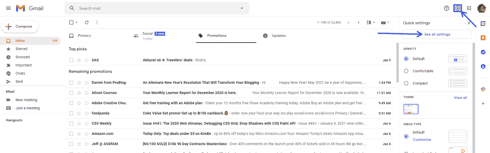

Gmail inbox

然后切换到**账户，导入**选项卡。

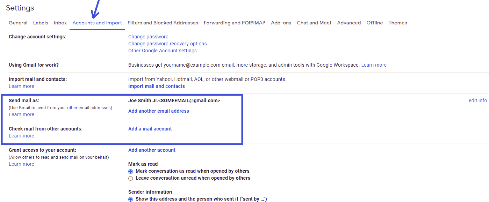

Gmail ‘Accounts and Import’ settings

填写您的另一个帐户的名称和电子邮件地址。

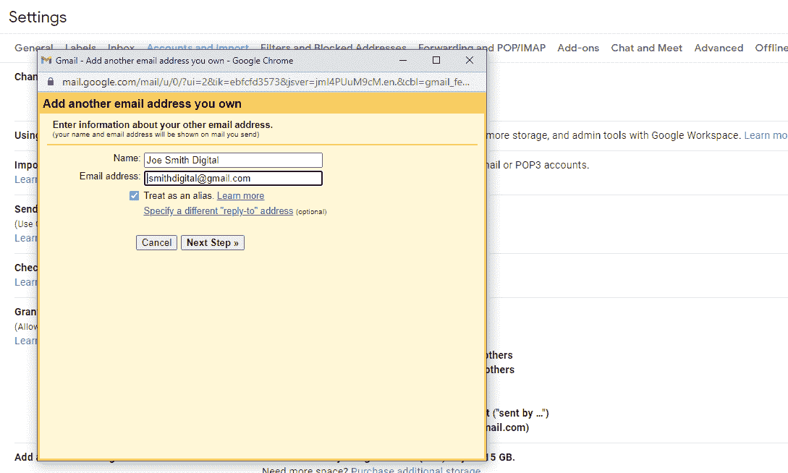

Gmail ‘Add another email address you own’ setting

在进入下一步之前，请确认这些信息。接下来，发送验证。

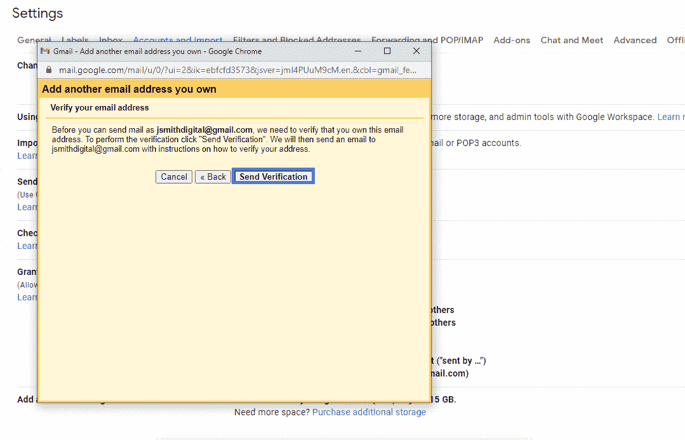

Verify your other email address

现在你需要导航到你的另一个谷歌账户，并确认你从主账户发出的请求。

### 2.接受来自您其他帐户的请求

要接受请求，请首先切换到您的第二个 Gmail 帐户。点按右上角的您的脸(或您姓名的第一个字母)以打开菜单。

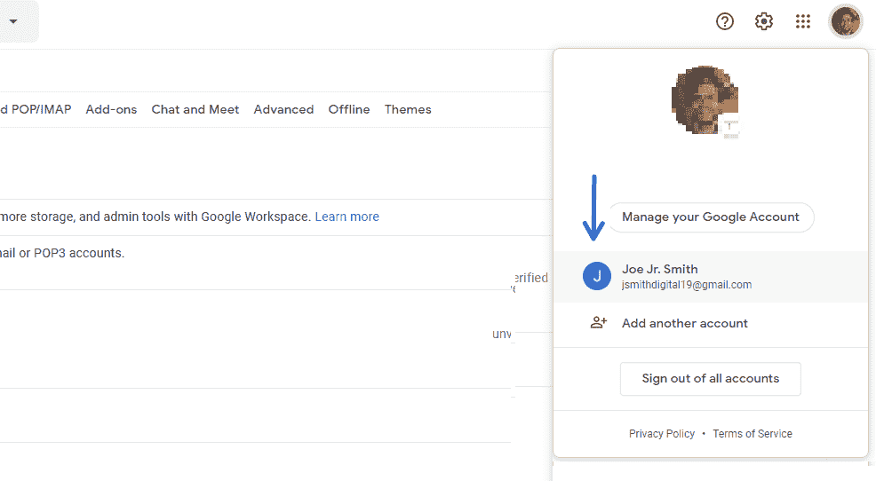

Switch between different Google accounts

在您的收件箱中找到确认电子邮件。它应该在最上面，除非你改变了你对邮件的分类方式。

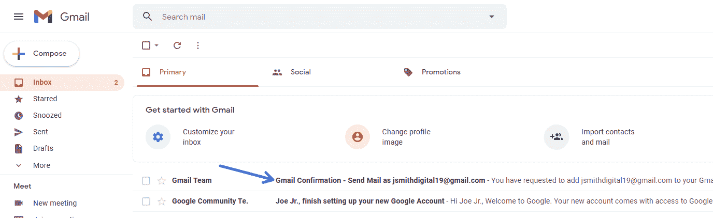

Go to your other Gmail account’s inbox

打开邮件，点击`mail.google.com`开头的确认链接。一如既往，警惕任何[钓鱼链接](https://kinsta.com/blog/ecommerce-fraud-prevention/#1-email-account-phishing)。

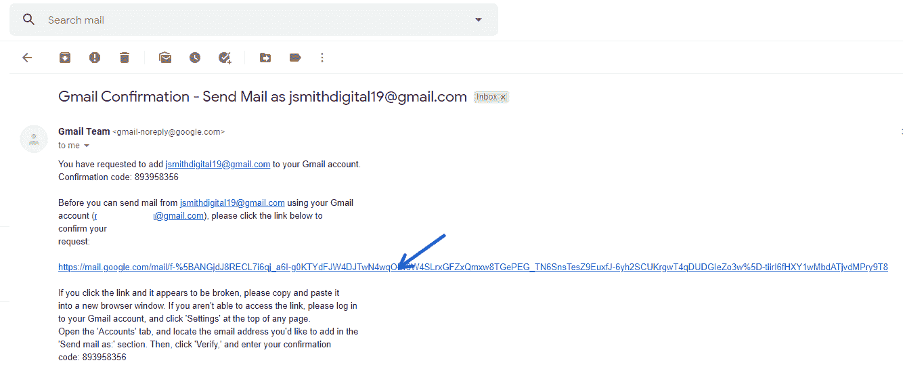

Click the verification email link

最后，**点击按钮确认**请求。

Confirm additional account

就是这样。您现在应该会看到“确认成功！”消息。

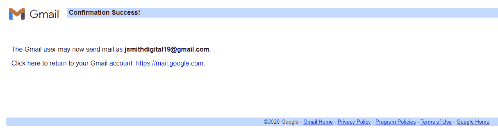

Gmail account connection success

你们都是有联系的。

**注意:**变化不仅仅影响浏览器版本。它会自动在您登录的所有设备上运行，包括 Android 或 iOS 上的 Gmail 应用程序。

现在，剩下的就是测试它是否有效了。

### 3.测试它的工作情况

首先，单击**撰写**按钮创建一个新的电子邮件。点击“发件人”区域，看看除了主邮件之外，您是否还可以选择其他邮件。

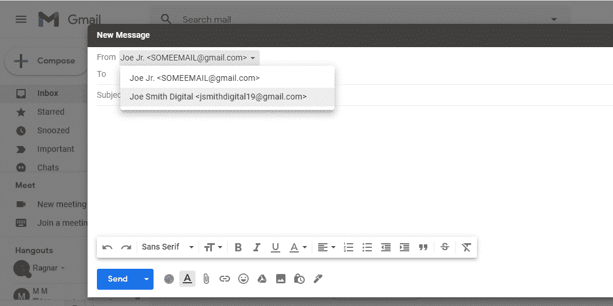

Gmail multiple ‘from’ addresses

如果你能看到一个包含多个电子邮件地址的下拉菜单，那就成功了。这是第一部分。现在你知道你可以发送电子邮件作为你的别名。

但是接收他们呢？为了测试这一点，您需要向新地址发送一封电子邮件，并检查它是否出现。

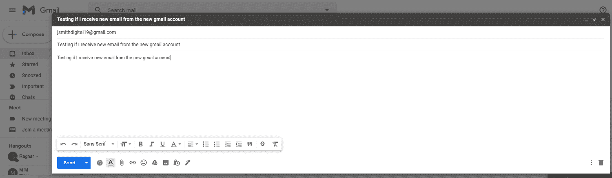

Sending a test email

如果你能看到，那就证明了毫无疑问的联系。

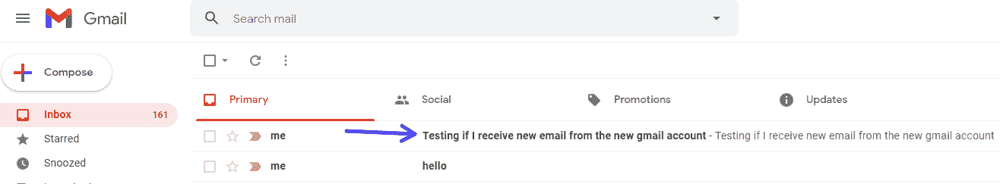

Verify email deliverability

成功！电子邮件会显示出来，即使收件人是不同的帐户。

您已经正式确认您在一个收件箱中拥有多个 Gmail 帐户。而且无需多次登录或任何额外的努力。

### 4.冲洗并重复

冲洗并重复上述过程，尽可能多的帐户。您不再需要那一长串密码。

一个谷歌账户就能统治所有人！

### 非 Gmail 电子邮件地址的选项:POP3/SMTP

你想从一个 Gmail 收件箱中获得更多功能吗？您也可以使用 POP3 和 SMTP 将其与您的商务电子邮件连接。

导航回 Gmail 中的帐户设置(主要帐户)。然后单击“检查来自其他帐户的邮件”部分中的添加电子邮件，并键入您的电子邮件地址以继续。

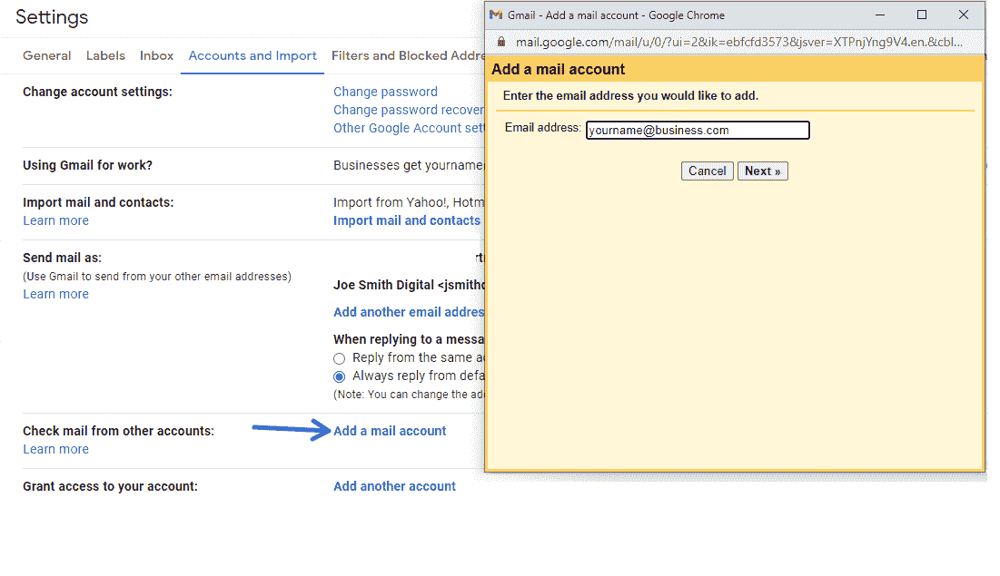

Adding a third-party address

如果这是你的托管服务提供商提供的商务电子邮件地址，你需要用 POP3 连接它。

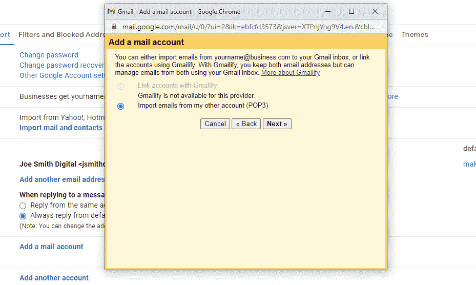

Connecting email address via POP3

点击**下一步**继续到您需要填写 POP3 信息的阶段。

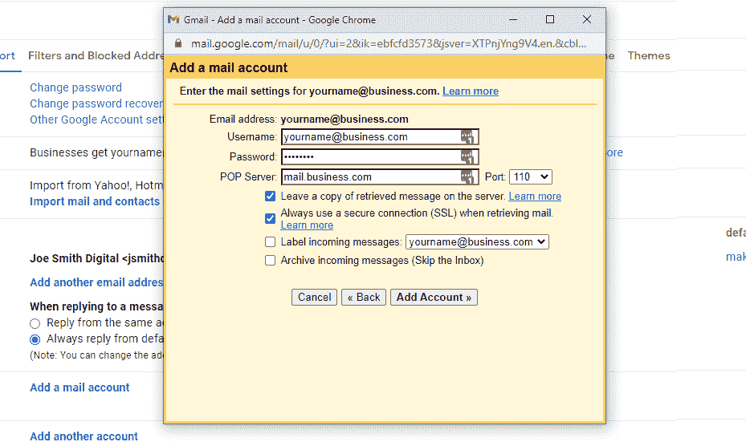

POP3 settings

你可以[搜索](https://kinsta.com/blog/gmail-search-operators/)“我的主机 POP3 服务器”，马上就能找到相关信息的页面。您也可以登录到您的托管仪表板并在那里找到信息。

在 cPanel 中，信息是这样的。

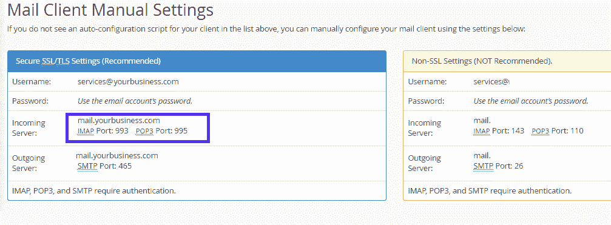

cPanel POP3 information

确保您勾选了“始终使用安全连接”框，并选择了适当的设置。

如果您正确输入了所有信息，您应该会看到此确认消息。

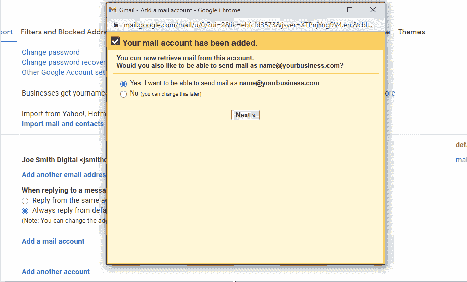

Gmail POP3 confirmation

如果你想发送电子邮件，而不只是接收，你需要重复这些步骤，但这一次是 SMTP 和外发电子邮件。如果是，保持选中“是”，点击下一个按钮**。**

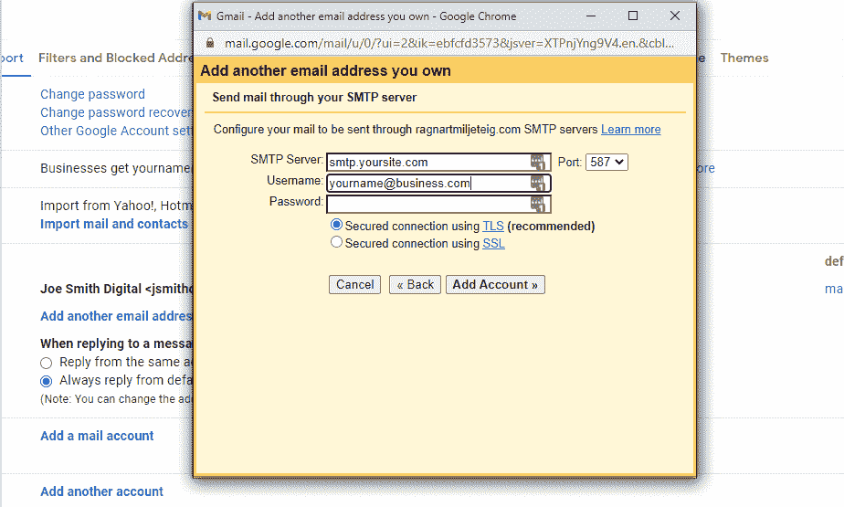

[Gmail SMTP Server](https://kinsta.com/blog/gmail-smtp-server/) settings

填写相关字段，选择合适的端口，点击**添加账号**。

## 注册订阅时事通讯

### 想知道我们是怎么让流量增长超过 1000%的吗？

加入 20，000 多名获得我们每周时事通讯和内部消息的人的行列吧！

[Subscribe Now](#newsletter)

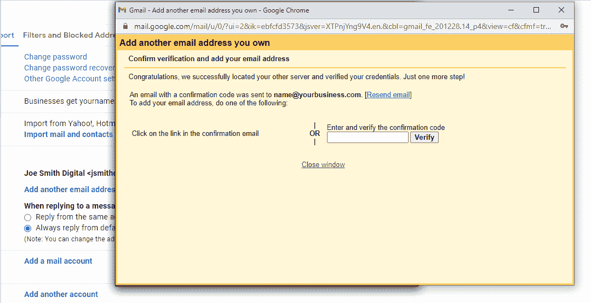

Successfully adding an SMTP server

要完成它，请访问您的业务电子邮件收件箱，并单击确认电子邮件中的链接。

## 如何组织来自多个 Gmail 帐户的电子邮件

既然你已经收到了来自多个谷歌账户的邮件，甚至可能是你的工作邮件，收件箱可能会有很多要处理。

因此，现在我们将向您展示如何将它们组织到不同的文件夹中，以使您的电子邮件收件箱更容易浏览。

### 切换到多收件箱视图

通过打开快速设置并单击“多个收件箱”下的自定义链接，切换到多收件箱视图

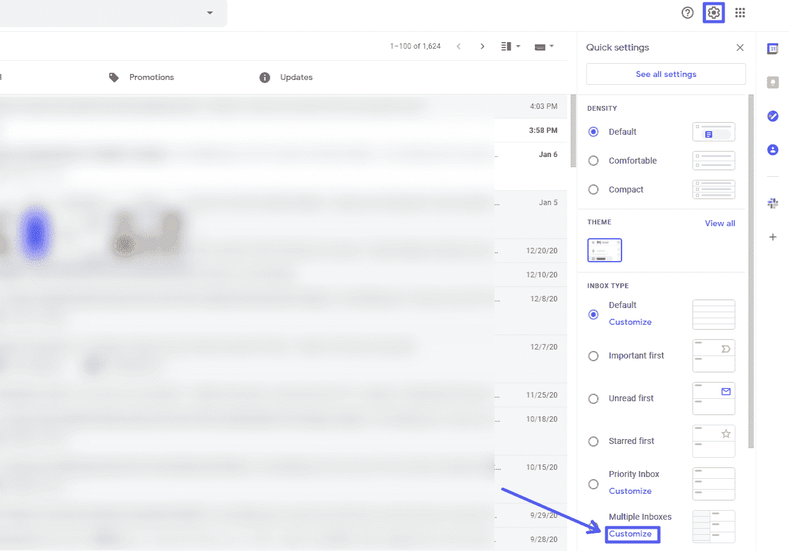

Gmail’s quick settings

然后，您需要使用“收件人:[【受保护的电子邮件】](/cdn-cgi/l/email-protection)”过滤器来挑选电子邮件地址。这将按照收件人对邮件进行分类，你可以给每个新的部分取一个名字(可选)。

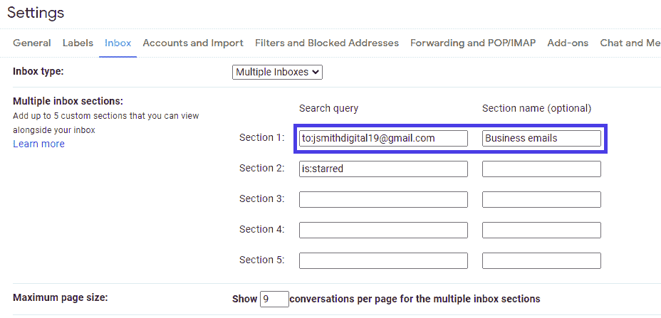

Gmail’s multiple inbox filters

向下滚动以保存对新设置的更改。

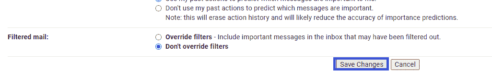

‘Save Changes’ in your Gmail settings

您应该会立即看到新的布局。

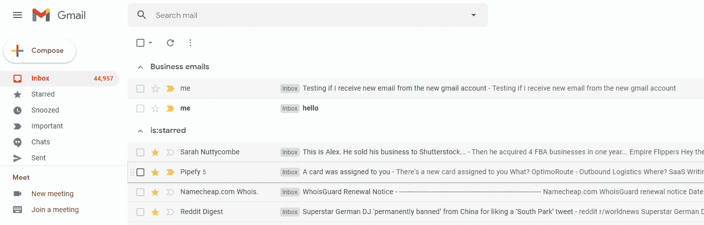

Gmail’s multiple inbox layout

如果成功，您为电子邮件地址创建的部分将显示您的[测试电子邮件](https://kinsta.com/knowledgebase/send-test-email/)。一旦您收到更多电子邮件，它就会自动填充。

如果您不是(由于打字错误或其他错误)，您将不会在该部分看到任何电子邮件。

你也可以使用这些 [22 个 Gmail 插件和扩展](https://kinsta.com/blog/gmail-add-ons/)来使它变得更容易。

### 好处:通过两个简单的步骤管理多个电子邮件的签名

在 Gmail 中，[添加电子邮件签名](https://kinsta.com/blog/email-signature/)轻而易举。一个收件箱里有多个 Gmail 账户并不能改变这一点。您可以轻松地将每个签名分配到一个唯一的电子邮件地址。

你可以这样做:

转到常规设置页面，向下滚动到签名部分。

如果没有，请创建一个新名称，并选择一个易于识别的名称。例如，如果您只将一个地址用于业务目的，请将其设置为“业务签名”

Kinsta 和 Google Workspace 有什么共同点？让事情在幕后平稳运行的能力。[免费试用 kin sta](https://demo.kinsta.com/register)。

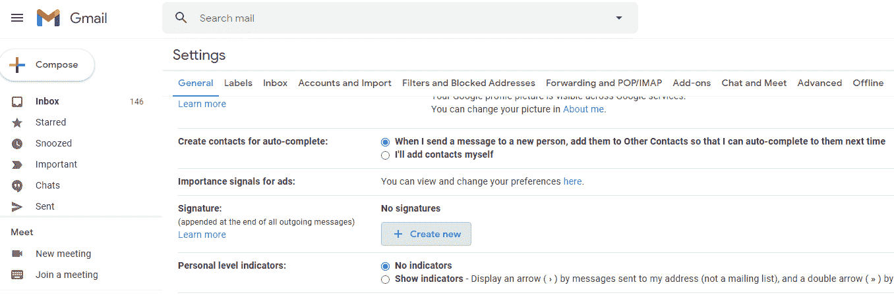

Create a new signature in Gmail

然后，您可以为每个签名分配一个默认的电子邮件地址。

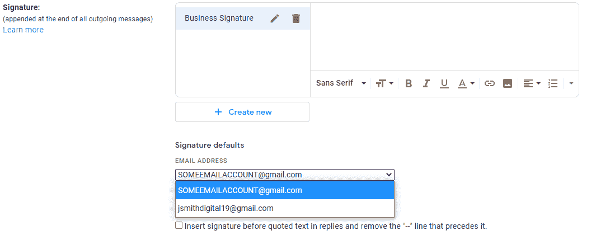

Set the email signature’s default email address

对所有的电子邮件地址重复这个过程。就这么简单。

**注意:**确保您为默认账户设置了主要签名。一个不准确的电子邮件签名并不能准确地传达专业精神。
T3】

## 为什么你需要多个电子邮件帐户

集成多个帐户有许多不同的用例，这个解决方案并不适合所有的用例。

假设你想为你的邮件设置一个私人助理，没问题。这种方法可以让他们扫描和回复邮件，而不用直接把你的个人邮箱账户交给他们。

但是，如果你想使用多个电子邮件用于商业目的，有一个更好的方法。

有了 [Google Workspace(以前的 G Suite)](https://kinsta.com/blog/g-suite/) ，你可以轻松地为你的商业账户中的每个用户或电子邮件地址创建别名。

你的电子邮件地址都不需要打上“gmail.com”的烙印，相反，你可以使用你的域名。

这会给潜在顾客留下更好的第一印象。

此外，这不像你只是为商务邮件功能付费。您还可以访问云存储、文件管理、电子表格等。你的公司可能已经在使用 Google Workspace 了。

## 对于企业:使用谷歌工作空间别名

有了 Google Workplace，这个过程甚至更快。你可以很容易地为你的员工设置，而不是指导他们自己如何做。

让我们直接开始吧。

### 如何设置 Google Workspace(以前的 G Suite)别名

设置 Google Workspace 别名的最快方法是在创建新用户时分配别名。

注册一个新的 [Google Workspace](https://kinsta.com/blog/g-suite/) 账户，按照教程进行操作。

Adding new users in Google Workspace

Google Workspace 让你只需输入电子邮件别名就可以添加。

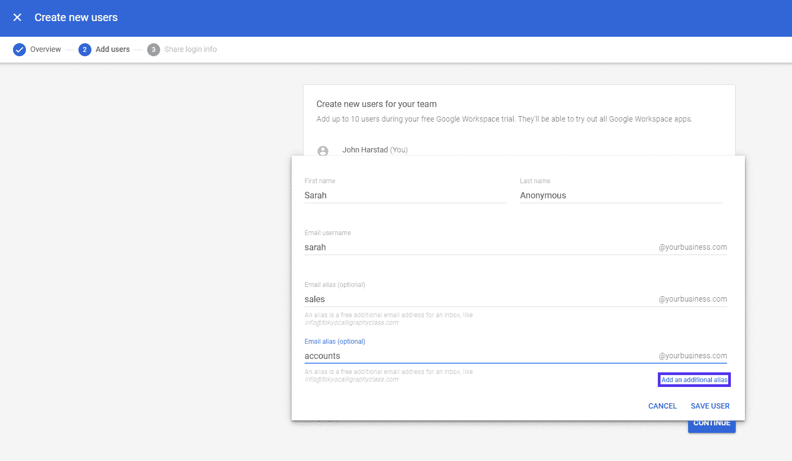

Add a new user alias in Google Workspace

如果您有现有的公司电子邮件地址，这是转移它们的最快方法。有关将他们转移到 Google Workplace 的更多信息，请参见我们指南中关于[设置专业电子邮件地址](https://kinsta.com/blog/professional-email-address/)的部分。

**如果你已经在使用 Google Workspace，请遵循以下步骤:**

导航到**用户**部分。

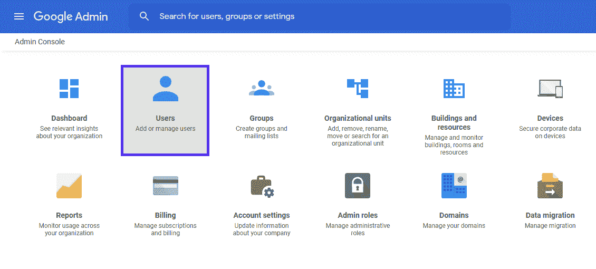

The Google Workspace dashboard

然后单击要为其添加备用电子邮件地址或别名的用户。

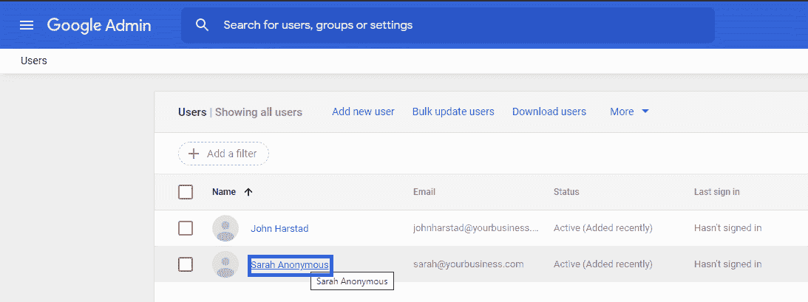

The Users panel in Google Workspace

点击**用户信息**框将其展开。

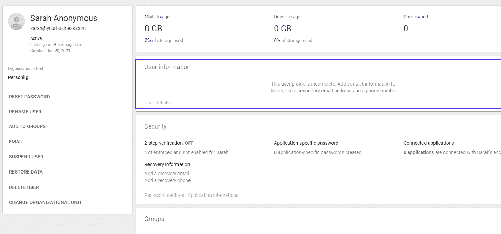

The Profile section in Google Workspace

接下来，展开**备选电子邮件地址**框。

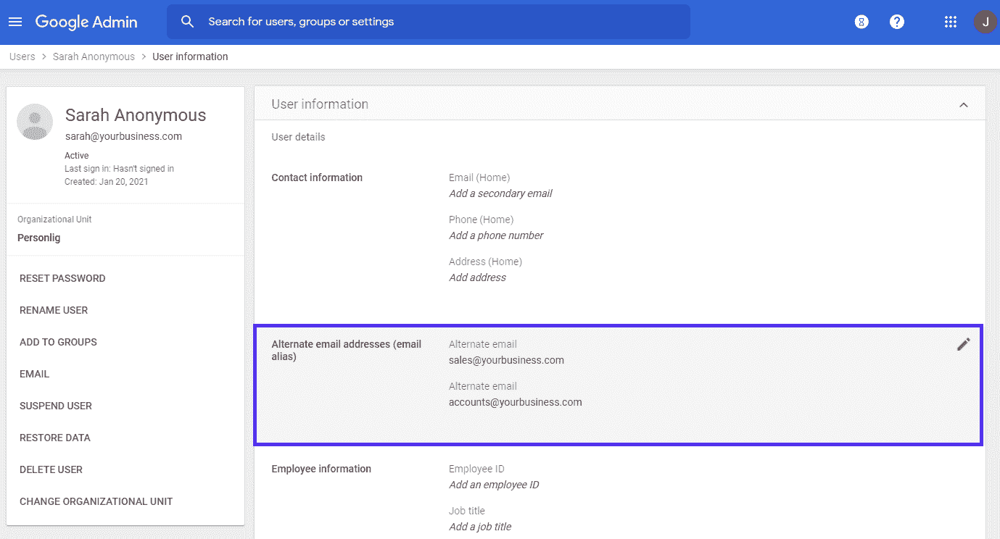

‘User information’ screen in Google Workspace

最后，添加尽可能多的电子邮件别名。

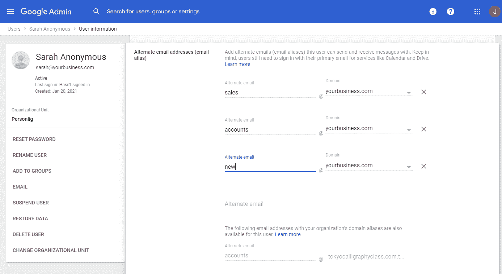

Setting email aliases in Google Workspace

设置完成后，您可以在 Gmail 收件箱中准确使用这些别名，如前一部分所述。

### 用谷歌工作空间(G 套件)我能收到多少封邮件？

每个 Google Workspace(以前的 G Suite)用户最多可以有 30 个别名。这使得将管理工作的所有电子邮件地址发送给特定的人变得很容易。

即使你的创业公司只有一个助理，你仍然可以传达一个大组织的形象。只需设置不同的电子邮件来匹配不同的部门和要求。

例如，您可以自定义电子邮件，如:

*   [【电子邮件保护】](/cdn-cgi/l/email-protection)
*   [【电子邮件保护】](/cdn-cgi/l/email-protection)
*   [【电子邮件保护】](/cdn-cgi/l/email-protection)
*   [【电子邮件保护】](/cdn-cgi/l/email-protection)

充分利用这一点。

[今天就提升你的邮件管理技能。📩通过一个收件箱管理多个 Gmail 地址💥](https://twitter.com/intent/tweet?url=https%3A%2F%2Fkinsta.com%2Fblog%2Fmultiple-gmail-accounts%2F&via=kinsta&text=Step+up+your+email+management+skills+today.+%F0%9F%93%A9+Manage+multiple+Gmail+addresses+through+one+inbox+%F0%9F%92%A5&hashtags=Productivity%2CGmailHacks)

## 摘要

无论您是出于商业目的，还是为了个人项目需要额外的电子邮件地址，Gmail 都能让您轻松管理多个账户。

你所需要做的就是发送一封电子邮件确认并接受它。你能在几分钟内完成它。有了 Google Workplace，甚至比这更容易。

难的是要控制来自所有这些来源的所有电子邮件。为了帮助你有效地管理新的多账户收件箱，请确保你更好地使用 [Gmail 搜索运营商](https://kinsta.com/blog/gmail-search-operators/) …他们可以为你节省很多时间！

* * *

让你所有的[应用程序](https://kinsta.com/application-hosting/)、[数据库](https://kinsta.com/database-hosting/)和 [WordPress 网站](https://kinsta.com/wordpress-hosting/)在线并在一个屋檐下。我们功能丰富的高性能云平台包括:

*   在 MyKinsta 仪表盘中轻松设置和管理
*   24/7 专家支持
*   最好的谷歌云平台硬件和网络，由 Kubernetes 提供最大的可扩展性
*   面向速度和安全性的企业级 Cloudflare 集成
*   全球受众覆盖全球多达 35 个数据中心和 275 多个 pop

在第一个月使用托管的[应用程序或托管](https://kinsta.com/application-hosting/)的[数据库，您可以享受 20 美元的优惠，亲自测试一下。探索我们的](https://kinsta.com/database-hosting/)[计划](https://kinsta.com/plans/)或[与销售人员交谈](https://kinsta.com/contact-us/)以找到最适合您的方式。