# HTML 到 WordPress:上传和转换 HTML 的详细指南

> 原文：<https://kinsta.com/blog/html-to-wordpress/>

上传和转换 HTML 到 WordPress 有很多原因。你可能想要转换一个旧的静态 HTML 站点，并在 WordPress 内容管理系统上运行它。也有可能你只是需要一个[的地方来存储](https://kinsta.com/help/disk-space-add-on/)或者共享一个 HTML 文件，WordPress 为这两者提供了一个可行的解决方案。

从 HTML 切换到 WordPress 经常会让人感到害怕或者没有效率。我们将指导您完成整个过程，以确保您学会转换 HTML 文件所需的工具，并自己完成转换。

HTML 是一种简单的标记语言，而 WordPress 虽然功能强大并且充满了特性的 T2，却相当简单和直观。因此，HTML 和 WordPress 之间的转换也不应该感觉像是一件苦差事。

请继续阅读，了解更多关于从 HTML 到 WordPress 转换的基础知识，以及您可能会考虑这样做的真实情况。

## 上传或转换 HTML 到 WordPress 的主要原因

如果你想知道为什么你会首先将 HTML 转换或上传到 WordPress，看看下面的例子来理解完成这样一个任务的原因。

*   转换一个旧的 HTML 网站以在 WordPress 系统上运行。也许旧的设计是你最喜欢的设计之一，或者你只是不想重新设计。这对保持你的品牌形象也很重要。
*   转换单个 HTML 网页或博客文章，并将其发布到您当前的 WordPress 站点上。如果您当前的主题没有您想要的自定义页面布局，这将非常有用。
*   将 HTML 网站模板更改为可以安装在 WordPress 上的主题格式。
*   上传一个 HTML 验证文件，向搜索引擎或其他服务证明你的网站的所有权。
*   在你的网站上存储一个 HTML 文件以备后用。
*   生成指向该文件的链接，以便您可以共享该文件或让用户将该文件下载到他们自己的计算机上。
*   在 WordPress 页面或帖子上生成一个 HTML 设计组件，比如定制的作者框或[电子邮件订阅表单](https://kinsta.com/blog/wordpress-registration-form/)。
*   将你的 WordPress 主题与你在网上找到但无法访问的 HTML 网站设计相匹配。

如你所见，向 WordPress 添加 HTML 文件的原因因你的目标而异。有时这个过程相当简单，就像上传一个 HTML 文件到 WordPress 博客文章或页面。其他时候有一个漫长的过程来转换整个 HTML 网站，其中有几十个文件和必须完成的附带工作，如随 HTML 一起传输网站内容。


> Kinsta 把我宠坏了，所以我现在要求每个供应商都提供这样的服务。我们还试图通过我们的 SaaS 工具支持达到这一水平。
> 
> <footer class="wp-block-kinsta-client-quote__footer">
> 
> 
> 
> <cite class="wp-block-kinsta-client-quote__cite">Suganthan Mohanadasan from @Suganthanmn</cite></footer>

[View plans](https://kinsta.com/plans/)

关于转换和上传 HTML 到 WordPress 的指南，我们将从基础开始(如何上传 HTML 文件到 WordPress)，然后我们将进入复制或转换完整的 HTML 网站以在 WordPress 系统上运行的更深入的需求。

最后，我们将讨论自动化 HTML 转换器的利与弊，以及市场上有哪些工具。

继续阅读，开始你的第一个 HTML 到 WordPress 的上传或转换！

[准备好了吗？有了这个指南，转换过程不必感觉像个苦差事🧹 点击推特](https://twitter.com/intent/tweet?url=https%3A%2F%2Fkinsta.com%2Fblog%2Fhtml-to-wordpress%2F&via=kinsta&text=Ready+to+go+from+HTML+%E2%9E%A1%EF%B8%8F+WordPress%3F+The+conversion+process+doesn%27t+have+to+feel+like+a+chore+with+this+guide+%F0%9F%A7%B9&hashtags=HTML%2CWordPress)

## 如何上传一个 HTML 文件到 WordPress

学习如何将 HTML 文件转换成 WordPress 页面或完整网站的第一步是查看 HTML 文件上传过程是如何工作的。

阅读本指南，深入了解如何上传 HTML 文件到 WordPress 。

我们将在下面给你一个这个过程的快速总结，以确保你在这篇文章的下一个步骤中是正确的。

上传 HTML 文件到 WordPress 有三种方法:

1.  通过 WordPress 仪表盘。
2.  用 FTP 客户端。
3.  使用 cPanel。

上传一个 HTML 文件到 [WordPress 仪表盘](https://kinsta.com/blog/wordpress-custom-dashboard/)是在[媒体库](https://kinsta.com/blog/wordpress-media-library/)中完成的。我们将在下面的教程中介绍一些途径，但是请记住，通过 WordPress dashboard 上传文件可以在页面上、帖子上或者直接通过媒体库来完成。

一个 [FTP 客户端](https://kinsta.com/blog/best-ftp-clients/)(像 [FileZilla](https://kinsta.com/knowledgebase/filezilla-show-hidden-files/) )链接到你的 WordPress 站点的实时文件，以及你电脑上的文件。这允许你将本地文件转移到托管的网站文件，只要你用你的 [SFTP 托管凭证](https://kinsta.com/knowledgebase/how-to-use-sftp/)登录 FTP 客户端。

最后，托管 cPanel 的[提供了对](https://kinsta.com/knowledgebase/what-is-cpanel/)[在线文件管理器](https://kinsta.com/blog/wordpress-download-manager/)的访问。它的功能很像 FTP 客户端，让你控制所有相同的文件。主要区别在于 cPanel 是一个在线的 web 应用程序，要求你将文件上传到 cPanel，而不是立即将它们从本地环境传输到 FTP 客户端的实时网站。

每种方法都有其优点和缺点。Kinsta Hosting 不提供 cPanel 体验，所以最好上传你想通过 WordPress dashboard 存储或共享的较小的 HTML 文件。

FTP/SFTP 客户端是从静态 HTML 网站创建全新网站的首选方法。这是因为 FTP/SFTP 客户端对你的网站文件提供了难以置信的控制，可以直接从你的电脑上把任何东西从媒体文件传输到 HTML 文件夹。

## 如何给 WordPress 页面或文章添加 HTML 代码

有几种方法可以将 HTML 文件直接上传到 WordPress 文章或页面。第一个是实际上传 HTML zip 或 TXT 文件作为媒体元素的过程。这种方法的工作原理类似于上传一张图片到媒体管理器，除了你是通过一个页面或帖子，而且它是一个 HTML 文件而不是一张照片。

您可能希望完成这个方法，以便为人们提供一个链接来下载 HTML 文件或在您站点的后端自己访问该文件。

另一种选择是将 HTML 块粘贴到页面或帖子中，以添加一些设计元素。例如，您可能有一个专门为该页面制作的自定义注册表单，您希望在其中插入一点 HTML。

两种方法达到最终结果的目的和过程都不一样。

要将 HTML 文件上传到帖子或页面，请按照以下步骤操作。

在 WordPress 仪表盘中进入**页面>所有页面**。如果您想从空白页开始，请转到**页面>添加新页面**。

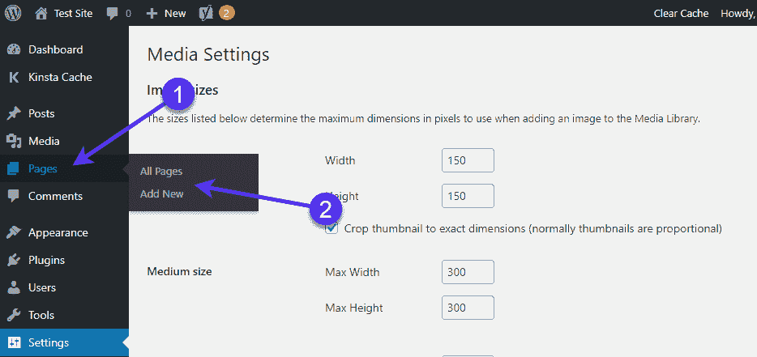

Adding new pages in WordPress


选择您要上传 HTML 文件的页面。如果你正在制作一个全新的页面，你也可以点击**添加新的**按钮。

这些步骤实际上和添加 HTML 文件到 WordPress 文章是一样的。我们只是简单地介绍如何用 WordPress 页面做到这一点。如果您想使用帖子，请转到**帖子>所有帖子或帖子>添加新的**。

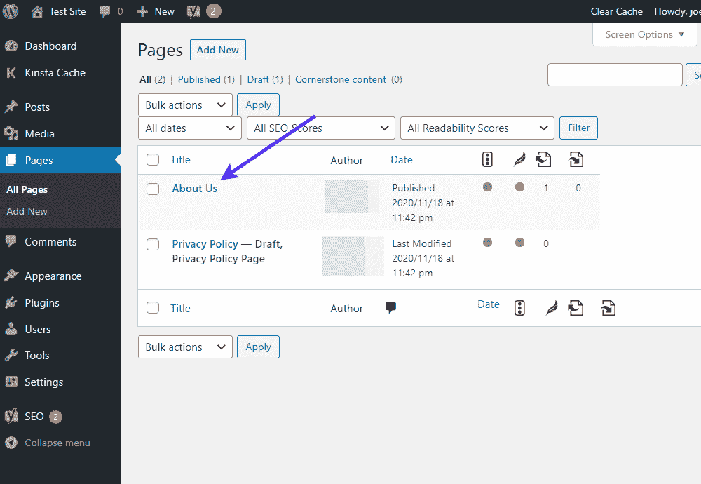

About Us page in WordPress


这部分取决于你使用的是 Gutenberg 块编辑器还是经典的 WordPress 编辑器。

在古腾堡，你可以找到 **+** 符号按钮，点击它来搜索一个新的视觉积木。搜索**文件**块，您可以在搜索字段中键入或滚动块列表进行定位。

选择文件块，将其放在您的页面或帖子上。

**注意:**如果你使用的是经典的 WordPress 编辑器，只需点击**添加媒体**按钮，用它上传你的 HTML 文件。它创建了一个到你的文件的链接，供人们在你的网站前端下载。

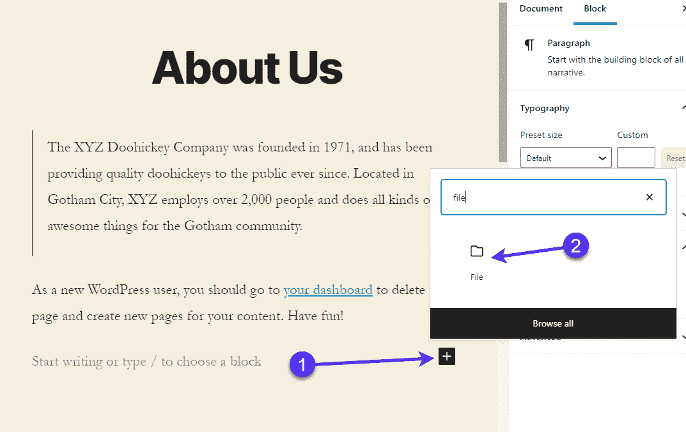

Adding a ‘File’ module in WordPress


对于古腾堡块，**文件**模块应该显示一个**上传**按钮。点击**上传**按钮，在电脑上找到所需的 HTML 文件。这些文件通常存储为 TXT 文件、文件夹中的 TXT 文件集合或 ZIP 文件。

一旦上传到你的网站，文件就会显示为一个链接。现在，任何用户都可以访问你的网站，点击该页面或帖子的链接，查看 HTML 文件，甚至下载到自己的电脑上。

此外，该文件存储在您的媒体库中，因此您可以随时去媒体库获取该文件的 URL，并将其放在您想要的任何其他位置。你也可以直接用 WordPress 来存储文件。

如果你只想把文件保存在 WordPress 中，而没有可供所有用户点击的可下载链接，只需删除页面或帖子上创建的链接。

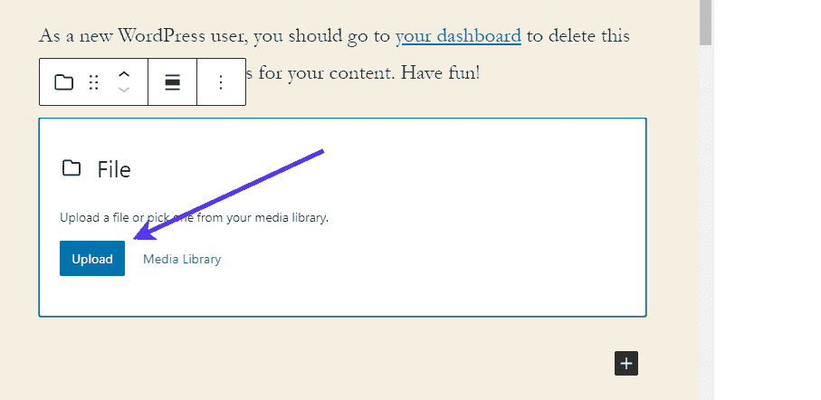

‘Upload’ button under the ‘Files’ block in WordPress


您可能会看到一个错误，告诉您出于安全原因不允许使用该文件类型。这很常见，所以[看一下这个指南来移除那个错误](https://kinsta.com/knowledgebase/sorry-this-file-type-is-not-permitted-for-security-reasons/)并允许大多数文件类型进入你的 WordPress 媒体库。总的来说，这个过程包括编辑你的 wp-config.php 文件或者使用插件来消除错误。

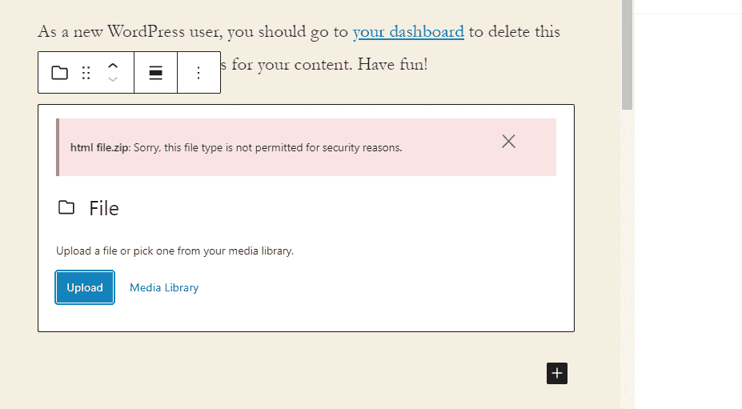

Invalid filetype error in WordPress


### 将 HTML 代码添加到页面或帖子的设计中

如前所述，您可能考虑向页面或帖子添加 HTML 文件的原因之一是为了在该页面或帖子上呈现简单的设计。

前面的方法更多的是在 WordPress 上存储 HTML 文件，并添加一个链接供人们下载。

这是一个更实用的解决方案，因为您有机会复制粘贴或为表单、作者框、横幅等创建自己的 HTML 代码。

转到您选择的页面或帖子，并选择您想要放置 HTML 代码的部分。

点击 **+** 符号查看区块选择。通过在搜索栏中键入或滚动块列表来查找自定义 HTML 块。

选择自定义 HTML 块，将其插入页面或帖子中。

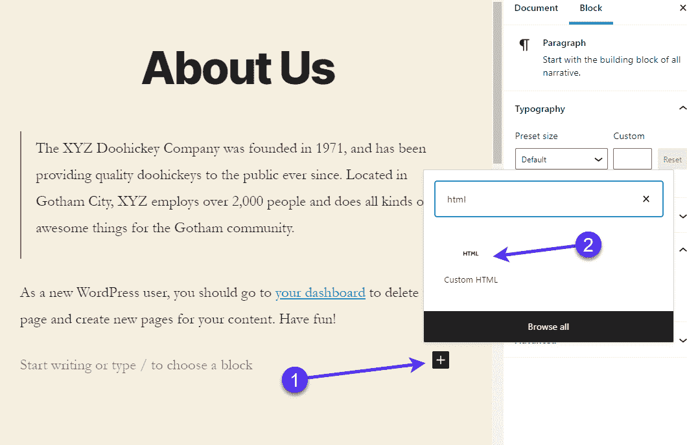

Adding a ‘Custom HTML’ block in Gutenberg


该块提供了一个简单的空白代码字段，供您粘贴或键入任何可用的 HTML 代码。

对于本教程，我将粘贴一个带有电子邮件字段和提交按钮的直接联系表单。

一旦在块中有了 HTML 代码，单击 Update 或 Publish 按钮，它就会呈现在页面或帖子的前端。


HTML to WordPress module


如果你进入页面或帖子的前端，HTML 应该会完成它的工作，并显示你试图添加到布局中的任何设计或功能。

在这种情况下，您可以看到我要求发送电子邮件的表单，还有一个提交按钮。

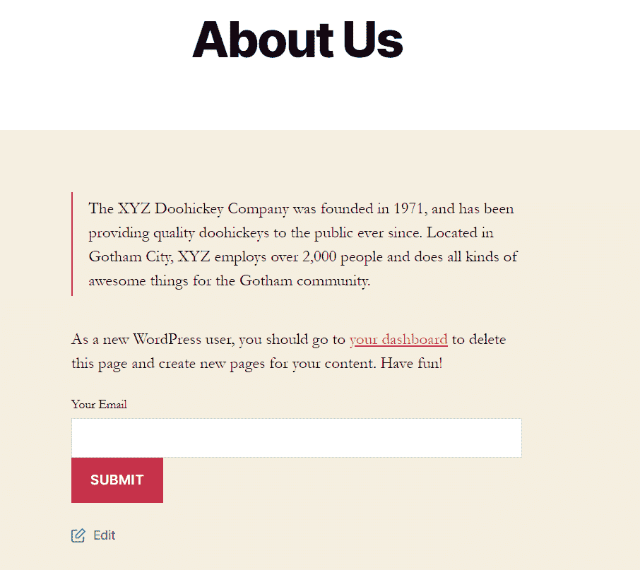

The form’s frontend view


在传统的 WordPress 编辑器中，过程和结果没有太大的不同，除了你不会使用拖放 Gutenberg 块。相反，导航到编辑器中的 Text 选项卡(而不是 Visual 选项卡),然后将 HTML 代码粘贴到您希望它出现在页面上的任何位置。

## 如何上传一个 HTML 验证文件到 WordPress

你想上传 HTML 到 WordPress 的另一个原因是搜索优化的需求。谷歌和其他一些搜索引擎提供控制台和网站管理员工具，以查看您的网站性能，并在分析和报告的帮助下优化您的内容，这些分析和报告可以检查问题并修复这些问题。

然而，谷歌不能仅仅因为你声称你是一个随机网站的所有者就假定你是它的所有者。这就是 HTML 验证文件发挥作用的地方。

简单来说，谷歌提供了一个 HTML 文件，你必须上传到你的网站。只有网站所有者才能访问网站文件，所以谷歌用这种方式来确保你不会试图控制别人的网站管理员工具。

上传的 HTML 验证文件随后会向 Google 发送一条消息，表明该文件已被添加到该域名，并且您实际上是该域名的所有者。

学习上传 HTML 验证文件是谨慎的，因为谷歌和搜索引擎并不是唯一要求你用这些文件验证身份或所有权的服务。一些第三方插件、目录和插件也想确保你不是入侵者。

### 上传 HTML 验证文件的原因

*   验证你拥有一个搜索引擎优化工具的网站。
*   当证明某些在线目录的所有权时。
*   如果你需要链接到第三方集成或插件，你需要弄清楚你是否真正拥有你的网站。

如您所见，这个 HTML 文件可能来自不同的来源。您通常不需要了解 HTML 文件的任何内容，只需要知道它被用来向服务发送 ping，以表明您已经控制了站点文件。

话虽如此，我们将 HTML 验证文件上传到 WordPress 的演示将涉及到 Google 搜索控制台，因为这是使用验证文件的最常见原因之一。

首先，在谷歌注册你的网站。这是通过进入[谷歌搜索控制台工具](https://kinsta.com/blog/google-search-console/)来完成的。点击“立即开始”按钮，登录您的 Google 帐户或注册一个 Google 帐户。

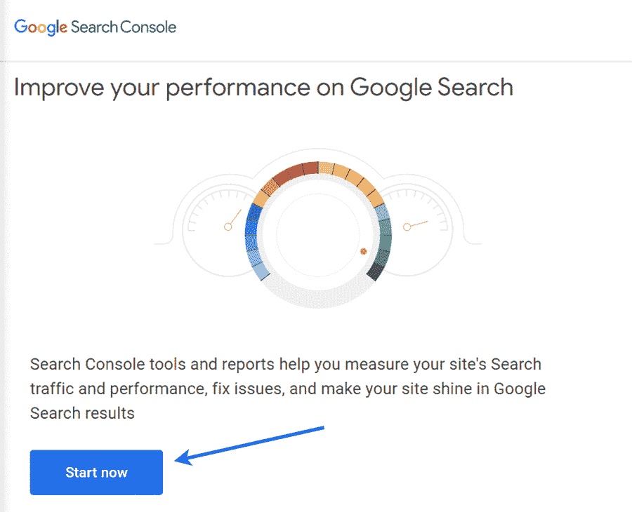

Hit ‘Start Now’ in Google Search Console


一旦登录到 Google 搜索控制台，您可能会看到您过去管理或测试过的属性列表。另一方面，您可能会看到一个空列表。

无论如何，请转到仪表板左上角的搜索属性选项卡。

在下拉菜单中，选择[添加属性](https://kinsta.com/blog/google-search-console/#step-4--add-your-domain)选项前进。这允许您将您的网站添加为 Google 搜索控制台中的托管属性。

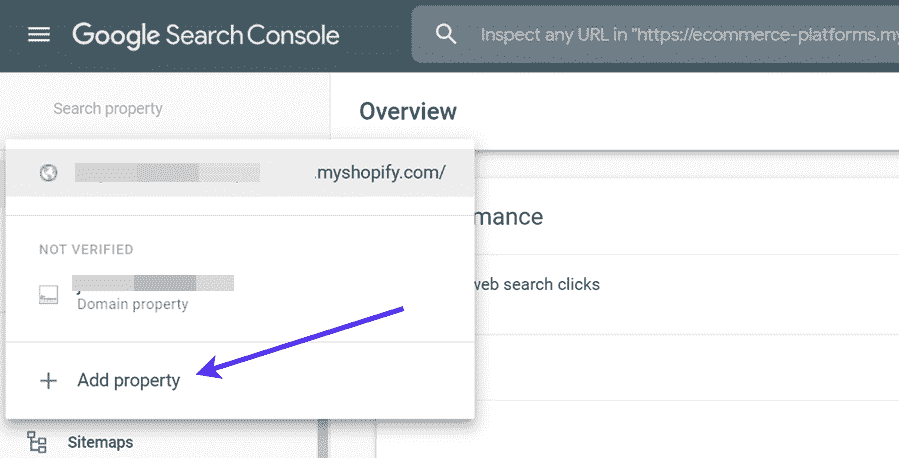

Adding a property in Google Search Console


下一个弹出窗口要求您选择一个属性类型。域选项允许您验证所有子域中的所有 URL。这通常是验证页面最简单的方法，但是它需要 DNS 验证——可以在你的主机账户中找到。

然而，我们目前正在谈论 HTML 文件上传，所以我们将通过网址前缀选项，这是一个古老的，但仍然可靠的方法来验证你拥有一个网站。更重要的是，这种方法有助于识别您输入的地址下的特定 URL。

因此，从您的网站获取 URL，并将其粘贴到 **URL 前缀**字段中。

点击**继续**按钮。

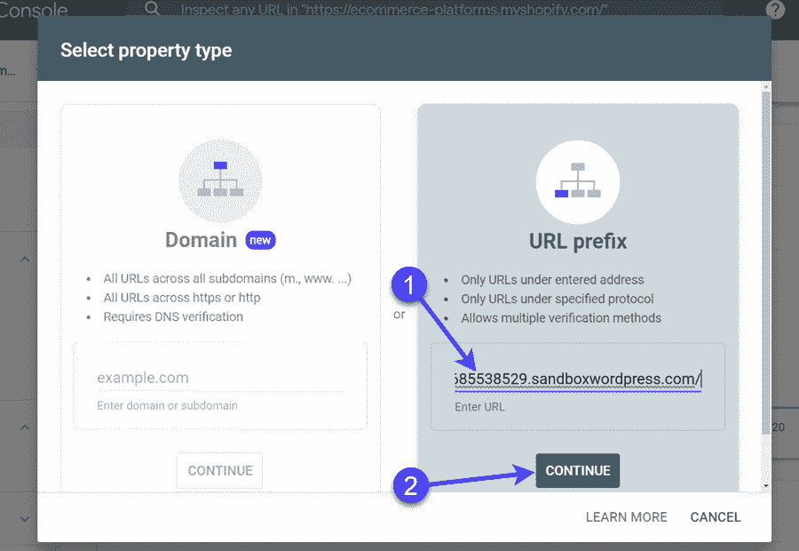

Entering the site URL in GSC


现在，谷歌搜索控制台要求您验证网站的所有权。

还有其他几种验证方法，但这是一种使用 HTML 文件上传的方法。

单击要求您下载文件的按钮。

将该 HTML 文件保存在您计算机上一个便于记忆的文件夹中。

下一步是将文件上传到你之前粘贴到 Google 搜索控制台的 WordPress 网站。

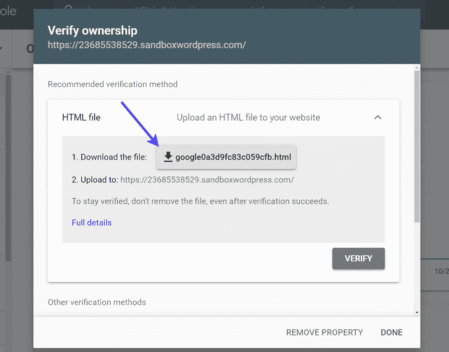

Verifying site ownership in GSC


如前所述，[上传一个 HTML 文件到 WordPress](https://kinsta.com/knowledgebase/how-to-upload-html-file-to-wordpress/) 有三个选项。

第一种方法，通过仪表板上传，绝对是一个可行的选择。当上传 HTML 文件到媒体库时出现一个常见的错误时，许多人仍然会被忽略。因此，用 FTP 客户端上传通常会更快。然而，如果你计划上传到 WordPress 仪表板，并且你看到“对不起，这种文件类型是不允许的”错误，使用[这个指南来解决问题](https://kinsta.com/knowledgebase/sorry-this-file-type-is-not-permitted-for-security-reasons/)。

现在你有了另外两个解决方案:使用 FTP/SFTP 客户端或者从你的托管账户上传到 cPanel。

cPanel 对于一些主机来说是不错的选择，但是，Kinsta 没有提供 cPanel。因此，我们将主要关注通过 FTP/SFTP 客户端上传 HTML 文件。详细的步骤在上面的链接文章中有概述，但是这里有一个快速的回顾来指导你前进。

首先，[将 FileZilla](https://filezilla-project.org/) 下载到您的电脑上。还可以试试其他 [FTP/SFTP 客户端](https://kinsta.com/blog/best-ftp-clients/)。

**注意:**我们建议您在此过程之前备份您的网站。通过 FTP/SFTP 传输文件时，很少会导致站点出现问题，但这是完全可能的。你不想让你的站点崩溃或者丢失数据，所以创建一个[备份站点文件](https://kinsta.com/help/external-backups/)。

打开 FTP/SFTP 客户端，键入您的 FTP/SFTP 凭据以连接到 web 主机。

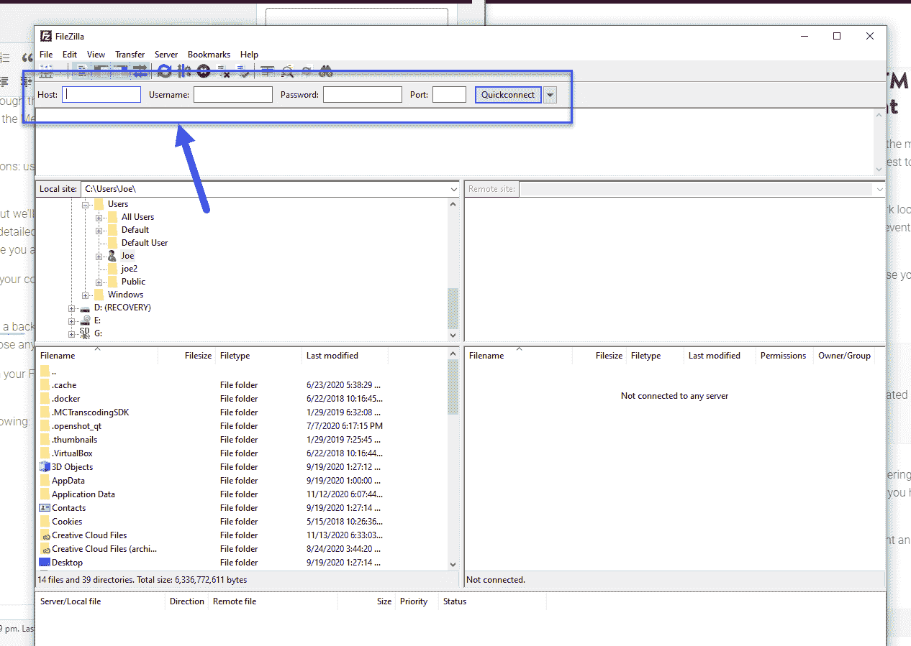

Enter your SFTP credentials in Filezilla


所需的凭据包括以下内容:

*   主持
*   用户名
*   密码
*   港口

你在哪里可以找到你的 WordPress 站点的证书？

它们通常位于您的主机仪表板中，因此您可以联系您的主机或自己寻找它们。

Kinsta 有一个简单的方法来定位 FTP/SFTP 证书，只需在 Kinsta 主机面板的站点选项卡中选择您想要的网站。

在信息选项卡下，查找 SFTP/SSH 区域。将相应的凭据复制到 FTP/SFTP 客户端。

例如，您可以看到主机、用户名、密码和端口项目在 Kinsta 中都组织得很好。

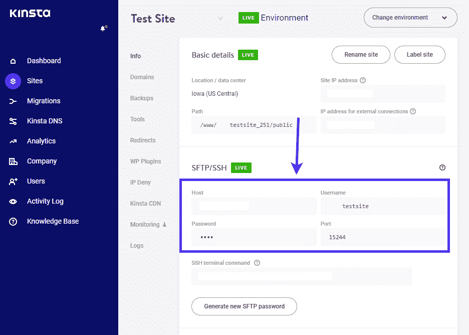

SFTP credentials under MyKinsta dashboard


将这些元素粘贴到 FTP/SFTP 客户端，然后单击 Quickconnect 按钮。

如果您看到一个错误，很可能是因为 FileZilla 默认使用 FTP 协议，而不是 SFTP 协议。要解决这个问题，请访问**文件>网站管理员**。在 FileZilla 中添加一个新站点，然后选择 SFTP。将托管凭据粘贴到该区域，然后再次尝试连接。

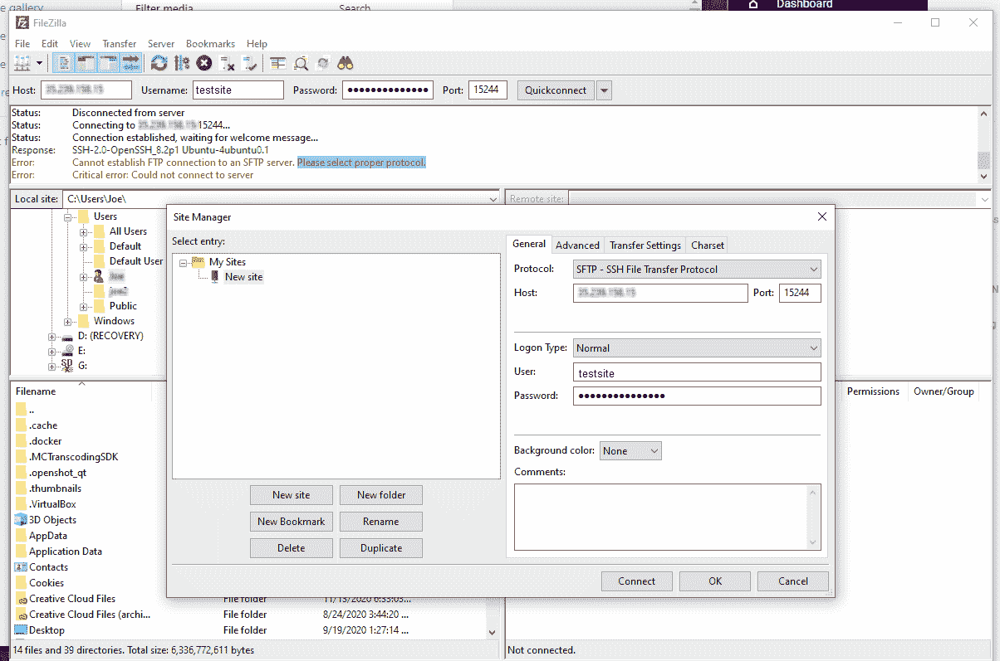

The site manager for HTML to WordPress


在连接到你的主机后，所有的 WordPress 站点文件都会出现以供修改。

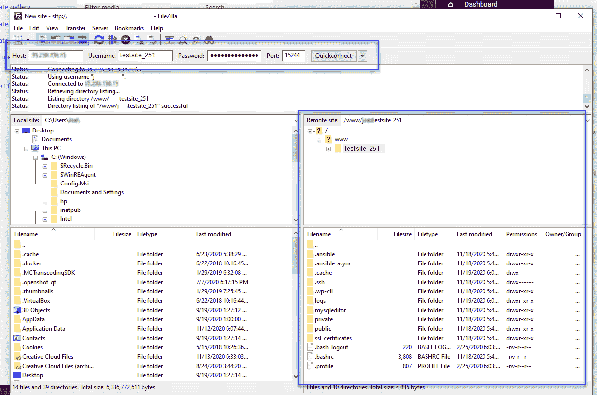

Type in credentials to see the new site’s files


找到你站点的根文件，它包含像 **wp-content** 和 **wp-admin** 这样的文件夹。

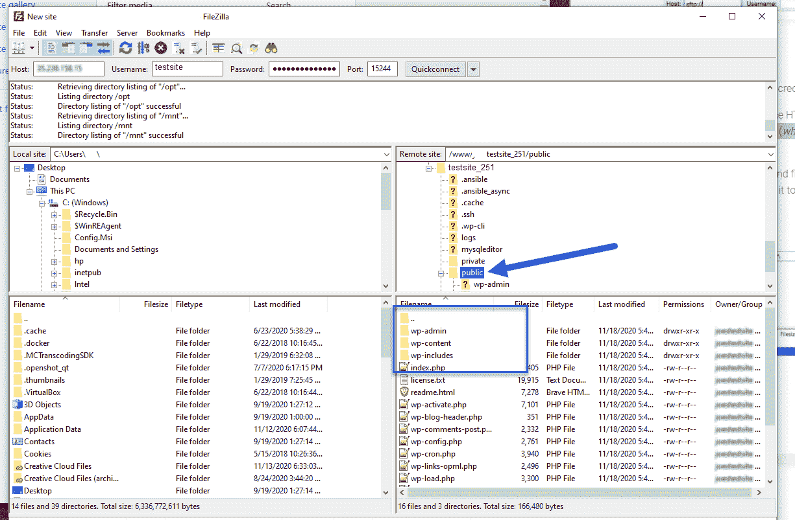

Find the root folder of your site.


在显示您的计算机文件的区域下找到 HTML 验证文件(在这种情况下，我将其重命名以便于查找)。例如，你可能会在**下载**下看到它，如果那是你的互联网下载的目的地的话。

将该文件拖到您网站的根文件中。这些都是在 FTP/SFTP 客户端完成的。


Drag the file over to upload it to your server


上传应该只需要几秒钟。

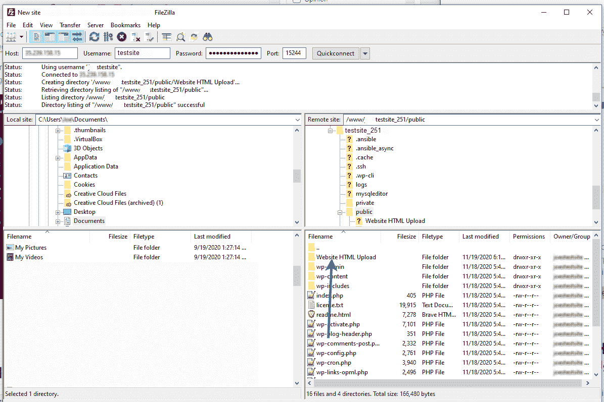

The file is now uploaded


一旦它出现在你的站点文件中，你可以返回到谷歌验证页面，查看它是否注册了你拥有这个站点。谷歌搜索控制台上应该会出现一条成功消息，并且会为您打开几个功能来优化和分析您网站的健康状况。

## 手动将整个 HTML 站点转换为 WordPress

要将 HTML 站点转换成 WordPress，你可以使用插件/应用程序，手动转换你的文件，或者使用子主题，将 HTML 文件转换成子主题。

第一种是手工转换 HTML 来制作 WordPress 主题。

有人说这是最令人生畏的方法，但其他人更喜欢它，因为你可以完全控制这个过程，不必依赖有时不可靠的应用程序或插件。按照下面的步骤手动完成一个完整的 HTML 到 WordPress 站点的转换。

### 为你的主题创建一个文件夹，并添加标准的主题文件

在你的电脑上，创建一个文件夹来保存你的主题的所有基本文件。您可以随意命名该文件夹，最好给它取一个您能记住的名称。

创建以下基本主题文件:

*   **style.css**
*   **index.php**
*   **header.php**
*   **sidebar.php**
*   **footer.php**

请随意在您的[代码或文本编辑器](https://kinsta.com/blog/free-html-editor/)中打开它们，因为您将来会编辑它们。目前，不需要向文件中添加任何代码。简单地把它们放在文件夹里。

**注意:**您可以先将它们创建为 TXT 文件。如果你改变文件扩展名，比如从**开始。txt** 到**。php** 或者**。txt** 至**。css** *—* 您的电脑会自动将其调整为正确的文件格式。例如，添加一个**。css** 扩展将文件转换成[级联样式表](https://kinsta.com/blog/wordpress-css/)。

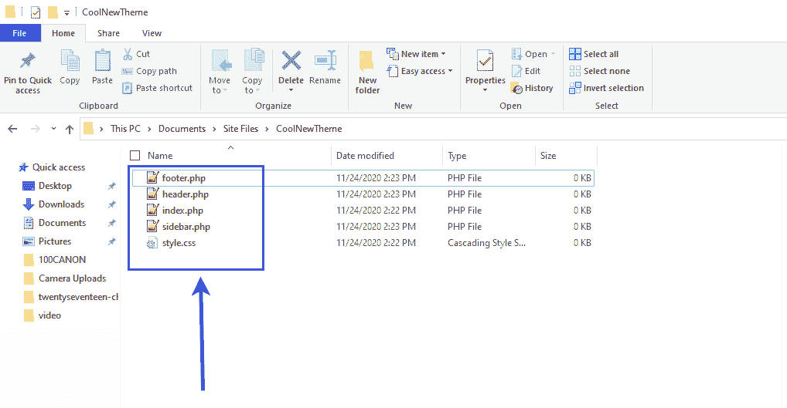

The site files for HTML to WordPress


### 将你的 WordPress 站点的当前 CSS 转移到新的文件夹中

你应该已经在你当前的 WordPress 站点上安装了一个主题。如果没有，那么[安装一个主题](https://kinsta.com/blog/how-to-install-a-wordpress-theme/)来帮助这个部分。

您将使用当前主题的 CSS 作为基础，在 HTML 站点文件的 **style.css** 文件的基础上构建。

因此，将你的 WordPress 站点的样式表头复制到新的 **style.css** 文件中。

它应该是这样的:

```
/*
Theme Name: Twenty Seventeen
Theme URI: https://wordpress.org/themes/twentyseventeen/
Author: the WordPress team
Author URI: https://wordpress.org/
Description: Twenty Seventeen brings your site to life with header video and immersive featured images. With a focus on business sites, it features multiple sections on the front page as well as widgets, navigation and social menus, a logo, and more. Personalize its asymmetrical grid with a custom color scheme and showcase your multimedia content with post formats. Our default theme for 2017 works great in many languages, for any abilities, and on any device.
Version: 2.4
Requires at least: 4.7
Requires PHP: 5.2.4
License: GNU General Public License v2 or later
License URI: http://www.gnu.org/licenses/gpl-2.0.html
Text Domain: twentyseventeen
Tags: one-column, two-columns, right-sidebar, flexible-header, accessibility-ready, custom-colors, custom-header, custom-menu, custom-logo, editor-style, featured-images, footer-widgets, post-formats, rtl-language-support, sticky-post, theme-options, threaded-comments, translation-ready

This theme, like WordPress, is licensed under the GPL.
Use it to make something cool, have fun, and share what you've learned with others.
*/
```

在这种情况下，正在使用的站点具有 2017 主题。如果您使用不同的主题，您会在样式表标题中看到一些变化。

现在是时候用新主题的信息替换旧主题的元素了。

为此，请交换以下内容:

*   主题名:你可以随意给你的主题起任何名字，但是用和你的主题文件夹一样的名字来命名也不是一个坏主意。
*   主题 URL 你可以使用你的网站的主要网址。
*   作者——在这里输入你的名字，或者任何你想使用的名字。
*   作者 URI——把这个链接到你的主页。
*   描述——你可以对你的主题做一个描述，显示在你的 WordPress 网站的后端。

其他一切保持原样。大多数其他元素，比如许可证和标签，只有在你计划发布新主题到 WordPress 主题目录时才会用到。

记住，你刚刚粘贴和编辑的是你的主题头。

从你的 HTML 网站中找到现有的 CSS。将这个 CSS 复制并粘贴到新的 **style.css** 文件的标题之后。

保存并关闭 **style.css** 文件。

### 把你当前的 HTML 分成几部分

WordPress 通常使用 PHP 从其数据库中提取文件、代码和媒体等项目。因此，一个 HTML 网站需要被分割成单独的 PHP 文件，以便与 WordPress 基础设施融合。

这听起来可能有点吓人，但是所需要的就是把你的 HTML 文档分成几个部分，把每一部分都变成 PHP 文件。

每个 HTML 文件看起来都不一样，但是它有助于获得一个可视化的例子。因此，我们将展示一些 HTML 网站模板来演示。

下面的代码是与您自己的 HTML 文件交叉引用的一个很好的选择。这是一个简单的 HTML 网页，有页眉、菜单项、副标题、侧边栏和页脚。你可以在你自己的**index.html**文件中找到类似的代码。

```
<!doctype html>
<html>
<head>
<meta charset="utf-8">
<title>Test Site</title>
<meta name="description" content="Website description">
<meta name="viewport" content="width=device-width, initial-scale=1">


</head>

<body>
<div class="header-container">
<header class="wrapper clearfix">
<h1 class="title">Website Title</h1>
<nav>
<ul>
<li><a href="#">menu item #1</a></li>
<li><a href="#">menu item #2</a></li>
<li><a href="#">menu item #3</a></li>
</ul>
</nav>
</header>
</div>

<div class="main-container">
<main class="main wrapper clearfix">
<article>
<header class="entry-header">
<h2 class="entry-title">Article</h2>
</header>
<p>Test text right here..</p>
<h2>Subheading</h2>
<p>Lorem ipsum dolor sit amet, consectetur adipiscing elit. </p>
<h2>A Sub</h2>
<p>Lorem ipsum dolor sit amet, consectetur adipiscing elit. </p>
</article>

<h3>Sidebar here</h3>
<p>Etiam ullamcorper lorem dapibus velit suscipit ultrices. </p>

</main> <!-- #main -->
</div> <!-- #main-container -->

<div class="footer-container">
<footer class="wrapper">
<p class="footer-credits">© 2019 My Test Site</p>
</footer>
</div>
</body>
</html>
```

下面的模板是另一个基于你自己的策略的例子。


An HTML site example


正如你所看到的，这一个的**index.html**文件有点复杂，但它的结构方式仍然是熟悉的。

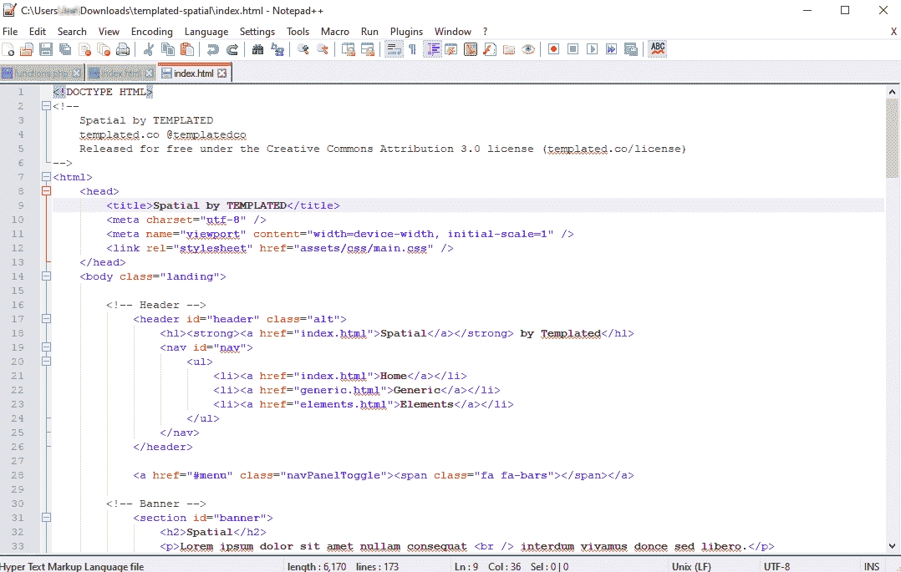

Example of an HTML index file


这两个例子都包括页眉、内容区域、侧栏和页脚。

你很可能会有不同的设计。因此，您必须调整下面的步骤。

前进的每一步都包括编辑和添加你之前创建的新 WordPress 文件。话虽如此，让 HTML 站点上的**index.html**文件保持打开状态。你会用这个继续前进。

#### header.php 档案

在打开的 HTML 文件中，查找从文件开始到主要内容区域结束的所有内容。主要内容区域通常用一个`**<div class="main">**`或`**<main>**`标签来表示。

将 HTML 文件的这一部分复制并粘贴到新的**header.php**文件中。

之后，找到写着`**</head>**`的地方。

在此之前，粘贴以下内容:

```
<?php wp_head();?>
```

这段代码对于大多数 WordPress 插件的运行非常重要。

#### sidebar.php 档案

在你的**index.html**文件中寻找`****`部分。

在`****`和`****`标签中的所有内容，包括那些旁置标签本身，都应该被复制到新的【sidebar.php】文件中。

从我们的示例文件来看，它看起来像这样:

```

<h3>Sidebar here</h3>
<p>Etiam ullam corper lorem dapibus velit suscipit ultrices. </p>

```

#### footer.php 档案

如果你有一个简单的 HTML 网站，你可能只有你的页脚信息留下来传输。其他网站稍微复杂一点。不管怎样，以页脚的修改作为结束并不是一个坏主意，因为它是构成 WordPress 站点文件的核心构件之一。

在**index.html**文件中，找到并复制`****`(侧边栏)标签之后的所有代码。

同样，你可以在侧边栏之后有更多的内容，但是对于简单的 HTML 站点来说，只需要处理页脚就可以了。

在我们的例子中，页脚看起来像这样:

```
</main> <!-- #main -->
</div> <!-- #main-container -->

<div class="footer-container">
<footer class="wrapper">
<p class="footer-credits">© 2020 My Test Site</p>
</footer>
</div>
</body>
</html>
```

但没那么快。将页脚代码粘贴到新的 footer.php 文件**中后，将`**<?php wp_footer();?>**`代码段添加到`**</body>**`括号之前。这有助于页脚在 WordPress 中正常工作。**

您可以在下面的页脚文件中看到一个粘贴了`**<?php wp_footer();?>**`代码的例子。

```
</main> <!-- #main -->
</div> <!-- #main-container -->
<div class="footer-container">
<footer class="wrapper">
<p class="footer-credits">© 2020 My Test Site</p>
</footer>
</div>
<?php wp_footer();?>
</body>
</html>
```

请务必将所有这些新文件保存到您的主题文件夹中。例如，在将这个页脚代码粘贴到**footer.php**文件中之后，您应该在编辑器中单击 Save 按钮并关闭它。

现在基本文件已经完成，从你的 HTML 网站关闭原来的**index.html**文件。

### 将你的 header.php 和 index.php 文件链接到 WordPress

您已经将它添加到了**header.php**文件中，但是您仍然需要采取额外的动作。本质上，您希望将样式表中的调用从现在的 HTML 修改为标准的 WordPress PHP 格式。

回到**header.php**文件，找到`**<head>**`部分。

我们正在寻找对样式表的调用。它看起来像这样:

```

```

删除此呼叫，并替换为以下内容:

```
/style.css" type="text/css" media="all" />
```

这就是你要对 header.php 文件所做的一切。对样式表的调用现在使用 WordPress 格式，而不是 HTML。

继续保存并关闭**header.php**文件。

接下来，打开**index.php**文件(不是你之前用的**index.html**文件，而是新的**index.php**文件)。

这时，**index.php 的**文件是空的。

将下面的代码复制并粘贴到新的**index.php**文件中。保留前两行之间的空间。这是有原因的，你很快就会明白。

这些行充当对你的其他站点文件的调用，包括**header.php**、**sidebar.php**和**footer.php**。

```
<?php get_header(); ?>

<?php get_sidebar(); ?>
<?php get_footer(); ?>
```

第二行的开放空间是为我们称之为循环的东西保留的，或者是在后台运行的 WordPress 中的一个动态过程，用于向你的站点添加新的帖子。本质上，它让 WordPress 知道更多的内容即将到来，它应该使用循环来添加这些内容。点击了解更多关于[循环的信息。](https://codex.wordpress.org/The_Loop)

要添加循环，将下面的代码粘贴到您之前在**index.php**文件中留下的空间(就在<下面)？PHP get _ header()；？>)。

```
<?php while ( have_posts() ) : the_post(); ?>
<article class="<?php post_class(); ?>" id="post-<?php the_ID(); ?>">
<h2 class="entry-title"><?php the_title(); ?></h2>
<?php if ( !is_page() ):?>
<section class="entry-meta">
<p>Posted on <?php the_date();?> by <?php the_author();?></p>
</section>
<?php endif; ?>
<section class="entry-content">
<?php the_content(); ?>
</section>
<section class="entry-meta"><?php if ( count( get_the_category() ) ) : ?>
<span class="category-links">
Posted under: <?php echo get_the_category_list( ', ' ); ?>
</span>
<?php endif; ?></section>
</article>
<?php endwhile; ?>
```

结果应该是这样的:

```
<?php get_header(); ?>
<?php while ( have_posts() ) : the_post(); ?>
<article class="<?php post_class(); ?>" id="post-<?php the_ID(); ?>">
<h2 class="entry-title"><?php the_title(); ?></h2>
<?php if ( !is_page() ):?>
<section class="entry-meta">
<p>Posted on <?php the_date();?> by <?php the_author();?></p>
</section>
<?php endif; ?>
<section class="entry-content">
<?php the_content(); ?>
</section>
<section class="entry-meta"><?php if ( count( get_the_category() ) ) : ?>
<span class="category-links">
Posted under: <?php echo get_the_category_list( ', ' ); ?>
</span>
<?php endif; ?></section>
</article>
<?php endwhile; ?>
<?php get_sidebar(); ?>
<?php get_footer(); ?>
```

继续保存 index.php 的文件。您现在也可以关闭该文件。

完成后，一个基于你原来的 HTML 网站的 WordPress 主题就可以上传到 WordPress 了。

### 上传新主题到 WordPress

最后一步是将主题上传到你的 WordPress 站点。一个选择是简单地压缩站点文件夹，然后上传到 WordPress 主题部分，而不需要添加你站点的截图作为参考。

虽然没有参考截图，你的主题仍然是一样的，但是我们建议你创建一个截图，这样你可以更容易地组织你的主题，并了解哪个主题在你的网站上是活动的。

所谓截图，我们指的是安装在你的 WordPress 仪表盘上的所有主题的小预览。即使是不活跃的也有截图。如果你打算把你的主题上传到 WordPress 主题库，需要有一个截图。

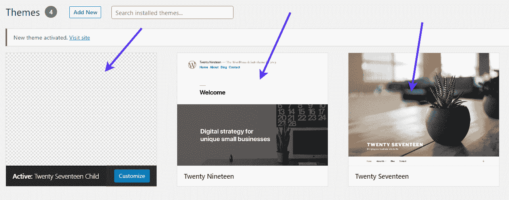

The Themes panel in WordPress


你可能没有公开上传你的主题，但是截图有助于你自己的主题管理。正如你所看到的，如果没有可用的截图预览，很难判断主题是什么样子的。Twenty Tencent 儿童主题没有截图，所以只是一张空白图片。这可能会在未来让许多人感到困惑。

要添加屏幕截图，在浏览器中打开旧的 HTML 网站，用任何可用的剪辑工具或截图软件抓取主页的屏幕截图。

打开自己喜欢的图片编辑软件，将截图裁剪为 880×660 像素。这将确保截图在添加到 WordPress 时不会被拉长或不成比例。

将编辑后的截图保存到新的主题文件夹中。它不需要放在任何特殊的文件夹中——只要把它放在主题文件夹中，紧挨着其他文件，如**header.php**和**footer.php**。

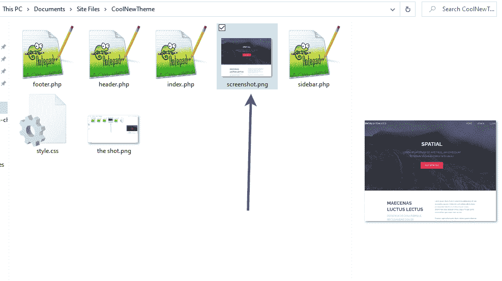

Screenshot in the theme folder


现在，你有两个选择来上传新的 WordPress 主题到 WordPress。

## 注册订阅时事通讯


### 想知道我们是怎么让流量增长超过 1000%的吗？

加入 20，000 多名获得我们每周时事通讯和内部消息的人的行列吧！

[Subscribe Now](#newsletter)

第一种是通过 FTP 将这些文件拖到 wp-content/themes 文件夹中。如果您遵循这条路线，就没有必要压缩文件。只需使用类似 FileZilla 的 FTP 客户端，将常规文件夹拖到 wp-content/themes 文件夹中。

另一个选择是上传一个压缩版本到 WordPress 仪表盘。

首先，将整个主题文件夹压缩成一个 zip 文件。

接下来，在 WordPress 仪表盘中，进入**外观>主题**。

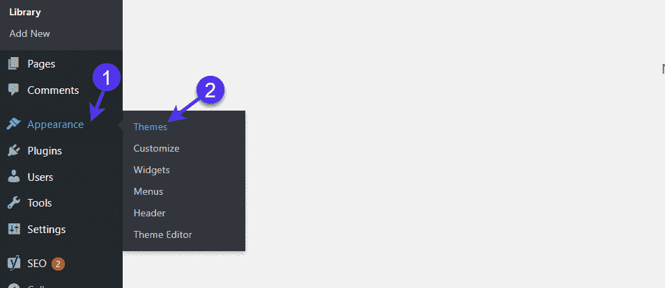

Going to the Themes panel in WordPress


点击添加新按钮。

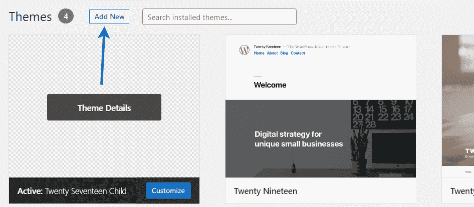

Adding a new theme in WordPress


选择上传主题按钮。

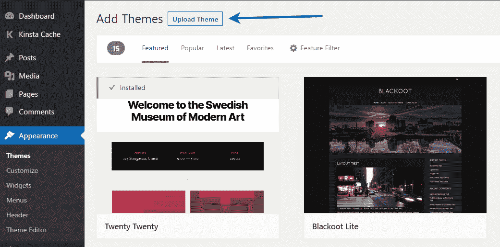

Uploading a theme in WordPress


点击**选择文件**并在您的电脑上搜索压缩文件。选择文件，以便它显示在 WordPress 仪表盘上。

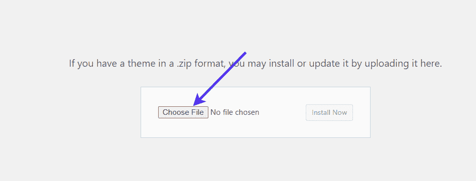

Choose the theme file to upload


点击“立即安装”将文件处理到 WordPress 中。

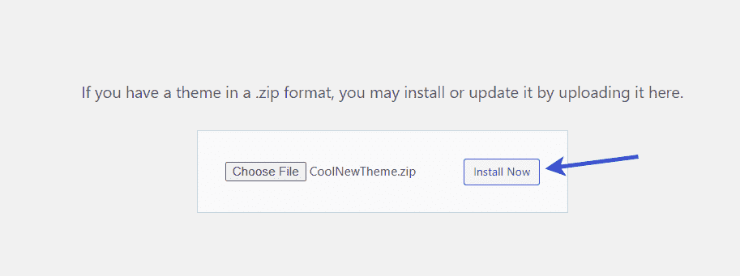

Install the theme after it’s uploaded


WordPress 会告诉你这个包正在被安装，并且安装成功。

单击激活按钮完成作业。

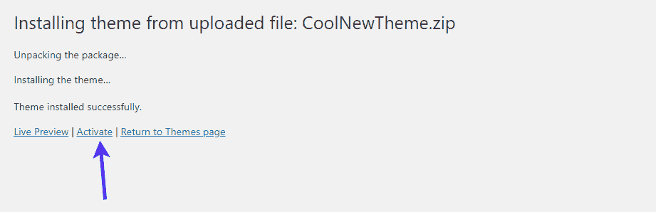

Activate the theme after its installation


现在，主题及其截图作为活动主题出现在主题列表中。你可以到你的 WordPress 网站的前端，现在查看你的原始 HTML 网站的 WordPress 版本。


The new theme appears in the dashboard


请记住，没有 HTML 到 WordPress 的转换是相同的。您可能会发现，您的问题比我们刚刚走过的要复杂一些。一般来说，需要采取一些其他的措施来获得 HTML 网站的精确副本。

例如，你必须添加窗口小部件区域和评论，甚至调整你的博客标题和描述，以便它们可以在 WordPress 中修改。

将一个 HTML 站点改变成 WordPress 站点需要大量的手工工作，你可能会发现一些改变只需要少量的 CSS 标记。

此外，本教程与添加帖子和图片等内容无关。这可以通过将图像上传到媒体库并调整 URL 结构等元素来手动完成。

有些插件是用来自动导入内容的，但是大部分都没有更新到新的 WordPress 版本。因此，我们建议你尝试一下，看看它们是否适合你，但是你不要期望太高。

## 通过子主题将 HTML 转换成 WordPress

这无疑是将整个 HTML 网站转换成 WordPress 网站的最简单的方法之一。它通过使用任何已经在线存在的免费主题来工作，所以你可以选择你最喜欢的，并将其与你的 HTML 网站设计相结合。

总的来说，你使用已经创建的 WordPress 主题作为父主题。然后，HTML 网站被转换为使用 WordPress，并作为子主题链接到父主题。如果您对亲子主题有任何疑问，请[点击此处](https://kinsta.com/blog/wordpress-child-theme/)阅读我们的主题指南。

简单解释一下，父主题管理站点的功能，而子主题建立在父主题之上。父主题在技术上可以独立存在，但是子主题不能。因此，我们使用子主题来修改父主题的设计，同时保留父主题中已经提供的强大功能。

以下是如何通过子主题从 HTML 转换到 WordPress 的方法。

### 选择父主题

第一步是选择一个你喜欢的主题。你决定的主题将作为你的父主题，你将把它作为网站设计的基础。

理想情况下，你会找到一个在设计上已经接近你的旧 HTML 站点的外观和感觉的主题。另一个选择是利用一个 [WordPress 框架](https://kinsta.com/blog/php-frameworks/)或者 starter 主题，看看这两种[类型的主题](https://kinsta.com/best-wordpress-themes/)是如何被用于设计基础的。

例如，一个高质量的 starter 主题是 220 主题或任何默认的 WordPress starter 主题，以它们的制造年份命名。我们建议回到 2019 年，2017 年，等等。)来看看它们中是否有更适合你的 HTML 站点设计的。

在本教程中，我们将使用[Twenty thinge 主题](https://kinsta.com/blog/twenty-seventeen-theme/),因为它干净利落，能够匹配许多简单的 HTML 网页设计。

不管怎样，所有这些主题都是很好的起点。

首先，[在你的 WordPress 网站上安装主题](https://kinsta.com/blog/how-to-install-a-wordpress-theme/)。

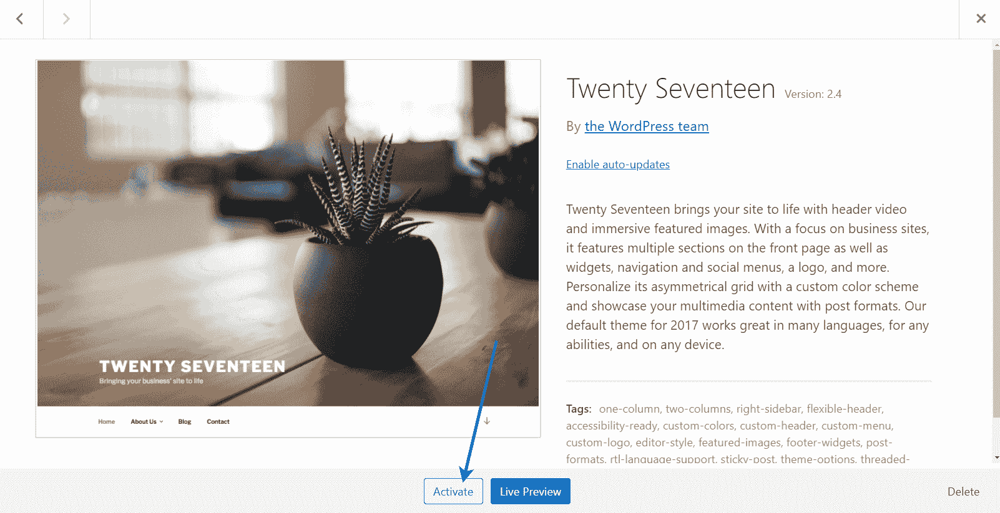

Activating a WordPress theme


如果您愿意，您可以激活主题，但是您将在以后激活一个新的子主题，并且只使用 starter 主题作为设计的基础。

### 创建新文件夹

所有的主题都需要文件夹来存储你的站点文件。因此，您必须为从 HTML 站点创建的子主题创建一个新文件夹。

我们建议以您的父主题命名文件夹，并在文件夹名称的末尾添加“-child”。

例如，在这种情况下，我们称文件夹为“twenty 17-child”。

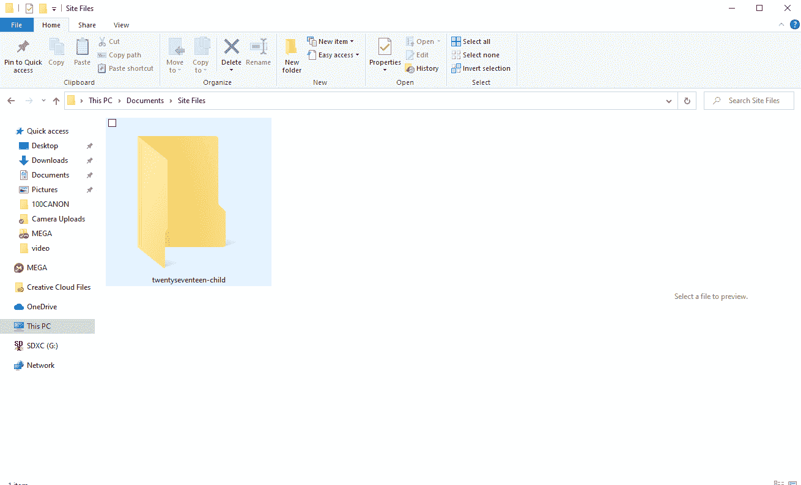

Child theme folder for HTML to WordPress


总的来说，任何名称都可以，只要你能记住文件夹的名称，并且没有添加任何空格。

### 配置您的样式表

所有子主题都需要进入主题文件夹的样式表。

所以，做一个文本文档，命名为 **style.css** 。将它保存在主题文件夹中，并将以下代码包含到该文本文件中:

```
/*
 Theme Name:   Twenty Seventeen Child
 Theme URI:    http://examplesite.com/twenty-seventeen-child/
 Description:  Twenty Seventeen Child Theme
 Author:       Jane Doe
 Author URI:   http://examplesite.com
 Template:     twentyseventeen
 Version:      1.0.0
 License:      GNU General Public License v2 or later
 License URI:  http://www.gnu.org/licenses/gpl-2.0.html
 Tags:         light, dark, two-columns, right-sidebar, responsive-layout, accessibility-ready
 Text Domain:  twenty-seventeen-child
*/
```

请确保替换您的站点自定义的元素。您可能需要修改主题名称、主题 URI、作者、模板和其他一些元素，以确保它与您自己的文件名相匹配。它类似于上面“手动将整个 HTML 站点转换成 WordPress”一节中的一些步骤，解释每一行的意思。

最重要的是模板标签。这应该以父主题命名，这样子主题才能正常工作。

### 制作一个 functions.php 文件

如果您只是为站点使用样式表，并激活子主题，那么没有任何样式的 HTML 站点将是可用的。然而，我们还想给子主题添加样式，使它看起来像我们想要的样子。

所有的样式都将从父主题中提取。

因此，需要一个**functions.php**文件将父主题的样式继承到子主题中。

在你的主题文件夹中创建一个名为**functions.php**的文件。

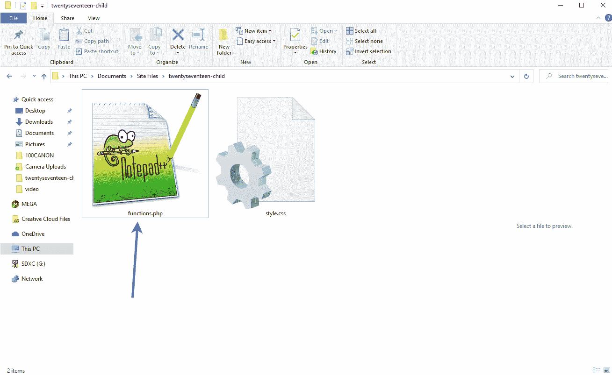

The functions.php file for HTML to WordPress


要激活文件，添加一个开始 PHP 标签，以及要求 WordPress 使用父主题样式的代码:

```
<?php
function child_theme_enqueue_styles() {

    $parent_style = 'parent-style';

    wp_enqueue_style( $parent_style, get_template_directory_uri() . '/style.css' );
    wp_enqueue_style( 'child-style',
        get_stylesheet_directory_uri() . '/style.css',
        array( $parent_style ),
        wp_get_theme()->get('Version')
    );
}
add_action( 'wp_enqueue_scripts', 'child_theme_enqueue_styles' );
```

这段代码的另一个好处是它允许你用你的孩子主题来调整网站设计。

### 打开新的儿童主题

现在是激活儿童主题的时候了。

激活子主题的一个方法是将文件夹添加到 WordPress 文件中的 wp/content/themes 文件。这将通过使用一个 [FTP/SFTP 客户端](https://kinsta.com/blog/best-ftp-clients/)来完成。

你也可以压缩文件夹，上传**外观>主题>新增**下的主题。

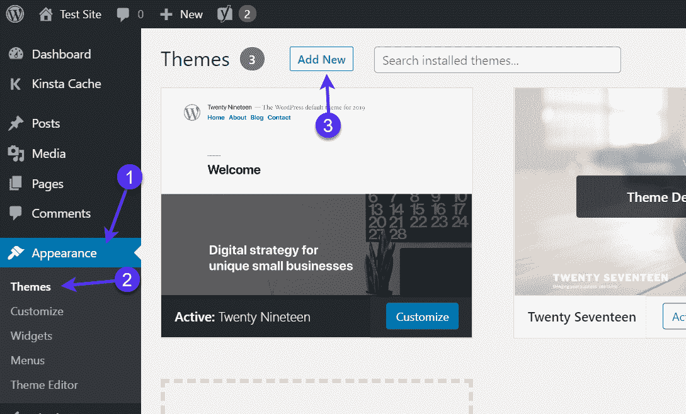

Adding a child theme in WordPress


选择**上传主题**按钮。

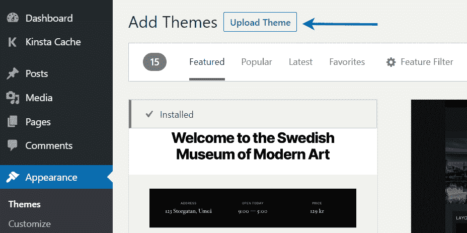

Uploading a child theme in WordPress


点击**选择文件**并在你的电脑上找到子主题的 zip 文件。

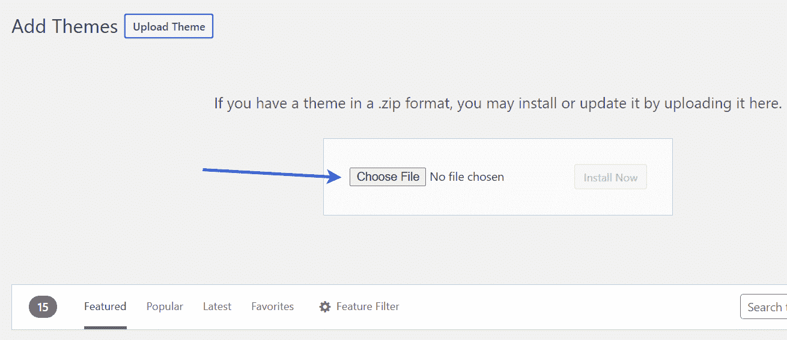

Choosing the child theme to upload


上传后，点击**立即安装**按钮。

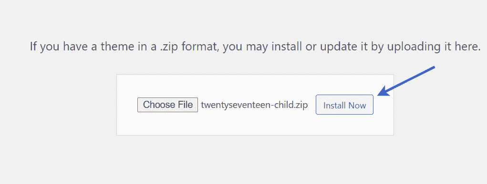

Installing the child theme


点击**激活**按钮。

与宕机和 WordPress 问题做斗争？Kinsta 是一个托管的 WordPress 托管解决方案，旨在节省您的时间！[查看我们的功能](https://kinsta.com/features/)

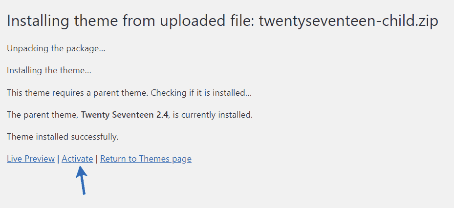

Activating the child theme


现在，您应该看到 217 儿童主题(或您使用的任何主题)被激活为您的主要主题。

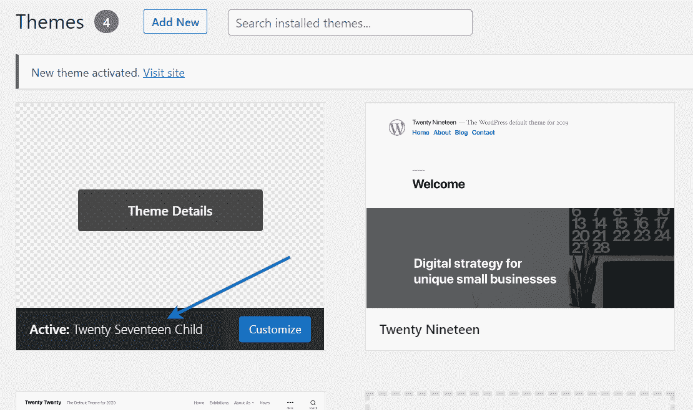

Theme details in the WordPress dashboard


不管你用什么方法激活子主题，你的 WordPress 网站应该反映你的父主题。换句话说，它是父主题的精确副本。

注意:可以给你的新主题添加截图，而不是完全没有预览。我们将在前面的“手动将整个 HTML 站点转换为 WordPress”一节中介绍如何给主题添加截图

### 添加 HTML 文件

目标是创建一个类似于你的原始 HTML 网站的网站，而不是父主题。

因此，最后一步是将你的 HTML 网站内容复制到你的新 WordPress 网站。大多数情况下，您必须手动完成这些步骤。我们以前提到过这一点，但是有一些插件可以自动传输内容。然而，这些插件并没有更新到 WordPress 的新版本，所以使用它们要自担风险。

## 什么是 HTML 到 WordPress 转换器？(还有哪些选项？)

一个 HTML 到 WordPress 的转换器采取了上面提到的步骤，或者简化它们，或者完全为你完成任务。如果你没有时间或经验手动转换，你可以考虑 HTML 到 WordPress 的转换工具。

转换器有许多不同的风格，但重要的是要记住，不是所有的都是手工完成 HTML 到 WordPress 转换过程的合理替代。

转换器有以下几种形式:

*   在线和本地的第三方软件转换器。
*   WordPress 插件。
*   真正的人类开发者。

当查看转换选项时，第三方软件/应用程序对于简单的工作似乎是合理的。你可以把你网站的 HTML 文件压缩成 zip 文件，然后上传到转换器。大多数可用的第三方工具都可以作为在线应用，所以你只需在浏览器中打开它们，然后点击上传按钮。

我们喜欢这些应用程序不太复杂的转换。如果你有一个基本的 HTML 网站，并想在 WordPress 上运行，这可能会成功，但不能保证平稳过渡。

至于为 WordPress 转换 HTML 的插件，你将很难找到占据整个 HTML 网站并为 WordPress 转换文件的插件。有几个可用的插件，但是没有一个更新到可以和 WordPress 的新版本一起工作，你也不想使用一个过时的插件。

然而，一些插件提供了基本文件上传所需的功能，这可能比 FTP 传输或扰乱你的托管帐户的后端更容易。总的来说，许多插件只允许个人文件上传，所以这不是大规模网站转换的最佳途径。

我们认为最后一种方法(实际的人类开发人员)是 HTML 到 WordPress 转换器的一种形式，因为它通过寻求专家的帮助并让一个人完成工作，为你明确地自动化了这个过程。总的来说，雇佣一个人类开发人员来转换你的 HTML 网站提供了你遇到问题的最低机会，而且如果出了问题，你还有人可以交谈。

## 最好的 HTML 到 WordPress 转换器插件选项和其他工具

如前所述，HTML 到 WordPress 转换器有许多不同的配置。你不会发现很多指定的 WordPress 插件不是过时了就是不再工作了。然而，我们确实有一些最受欢迎的转换器插件，可以完成较小的转换任务，还有 web 应用程序和[手动开发](https://kinsta.com/blog/hire-wordpress-developer/)选项，可以方便地用于更高级的 HTML 到 WordPress 转换工作。

### 使用自动化 HTML 到 WordPress 转换器插件或应用程序的利与弊

一个自动化的 HTML 到 WordPress 转换器听起来像是对一些人的祝福，但它并不总是最好的解决方案。在使用复制或转换 HTML 的应用程序或插件之前，先看看下面的利弊。

#### 赞成的意见

*   它消除了制作自己的新网站文件的需要，通常会为你生成这些文件。
*   许多转换器给你选项来分解 HTML 元素，并选择哪些将进入 WordPress 的正确文件。
*   你可以用旧的 HTML 制作一个主题，并在多个网站上使用。
*   有些工具只需要一个 [URL](https://kinsta.com/knowledgebase/what-is-a-url/) 就可以制作一个新的网站或主题。
*   其他工具提供选项[复制一个你不拥有的网站](https://kinsta.com/knowledgebase/clone-wordpress-site/)，为你喜欢的设计提供一个起点。

#### 骗局

*   您仍然经常需要手动传输博客帖子和照片等内容。
*   你很可能不得不找出从旧网站手动转移链接的[。](https://kinsta.com/blog/wordpress-change-domain/)
*   这些转换器并不总是保持最新的。最好的转换器之一是 WordPress 插件，但是我们在这篇文章中没有推荐它，因为开发者不再维护它。
*   您可能会发现一些 web 应用程序转换器无法处理较大文件的作业。

现在你已经掌握了自动化 HTML 转换器的优点和缺点，让我们看看下面我们最喜欢的自动化转换器应用和插件。

### WP 网站导入程序

虽然 [WP 网站导入器](https://www.wpsiteimporter.com/)工具从老网站或第三方网站提取和导入各种内容和文件，但你可以打赌其中一个元素涉及 HTML。简而言之，WP 网站导入器可以让你把任何网站变成 WordPress 网站，从 HTML 网站和网站文件中提取图像、菜单和页面等内容。WP 网站导入器修复了[断开的链接](https://kinsta.com/blog/broken-links/)，这样你就不必手动调整或添加新链接。它甚至保留了前一个网站的搜索引擎优化信息，包括元描述和关键词。

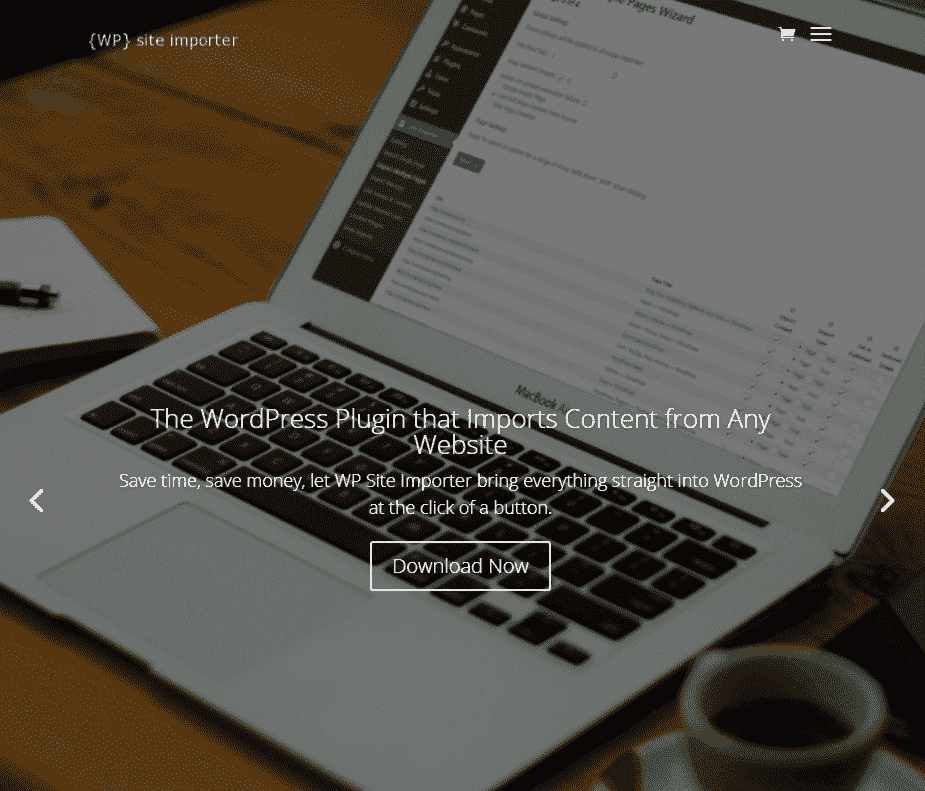

WP Site Importer


importer 节省了开发人员的成本，使 HTML 和内容转换更像是一次点击的过程，从而为您节省了时间和金钱。更重要的是，它清理你的 HTML，清理和重新格式化源 HTML。这使得你的 HTML 文件与 WordPress 更加兼容，并向谷歌展示你正在使用干净的代码，从而提高你的搜索引擎优化。

WP 网站导入工具的功能就像一个直接的 WordPress 插件，所以你可以直接从仪表盘下载插件并激活它的功能。

### WP 所有导入

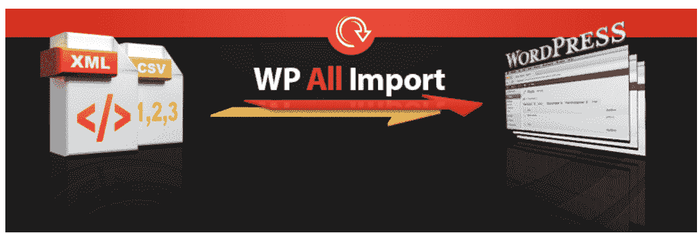

WP All Import


WP All Import 插件是上传包含 HTML 数据的 XML 文件的最快和最简单的工具之一。总的来说，这个插件允许你从一个以前的网站或者一个潜在的演示网站上迁移内容，这个演示网站是用简单的 HTML 或者一些你想复制并带到新网站 WordPress 上的 HTML 文件构建的。

转换在大约四个步骤内发生，您可以访问一个漂亮的拖放界面来管理您的转换和导入。WP All Import 插件的另一个有趣之处是它可以处理从外部网站导入的 URL。因此，你甚至不需要一个密码或者对一个站点的控制就可以从那个站点传输那些文件和潜在的渲染元素。

使用这个插件进行完整的网站转换可能会令人望而生畏，但值得一试，尤其是如果它是一个简单的 HTML 文件。更重要的是，该插件支持 HTML 转换元素，如 [WooCommerce 产品](https://kinsta.com/blog/woocommerce-tutorial/#new-products)和 WordPress 页面。高级版本可用于更高级的功能，最显著的是高级客户支持，允许您在进行这些转换时寻求帮助。

### HTMLtoWordPress.io


HTMLtoWordPress.io


HTMLtoWordPress.io 在线应用程序是将 HTML 文件转换成 WordPress 的最流行的解决方案之一。关于 HTMLtoWordPress.io 工具令人兴奋的是，它主要为完整的网站提供转换，这些网站是用 HTML 构建的。

你所要做的就是拉起主页，上传你的 HTML zip 文件进行快速转换。这个 web 应用程序完全自动地将 HTML 转换成 WordPress，所以不需要任何编码技能，也没有任何理由去干扰 FTP 客户端。

在完成这个过程并在互联网上发布之前，你还可以看到你的新 WordPress 站点的完整预览。新的 WordPress 网站也会保留你网站的内容和图片。它们可以通过简单的 Live Editor 应用程序进行编辑，它应该可以毫无问题地引用这些图像，以及 JavaScript 和 CSS。总的来说，如果你有一个或几个 HTML 网站需要转换，这看起来是一个可靠的解决方案。作为奖励，你可以在你的 HTML 中添加类来利用[先进的 WordPress 特性](https://kinsta.com/features/)。

### 用于 WordPress 的 Pinegrow 主题转换器

Pinegrow 主题转换器是一个独特的网页设计工具，可以将一个 HTML 网站文件夹立即转换成一个完整的 WordPress 主题。主题转换器上传你的文件，并在一个可视的界面中呈现 WordPress 站点的预览。上传后，您可以单击页面上的不同元素，并为每个项目分配智能操作。这些与 WordPress 集成在一起，所以当你分配动作时，它会将正确的 WordPress 特性添加到你的[定制 HTML 结构和样式](https://kinsta.com/knowledgebase/edit-wordpress-code/)中。

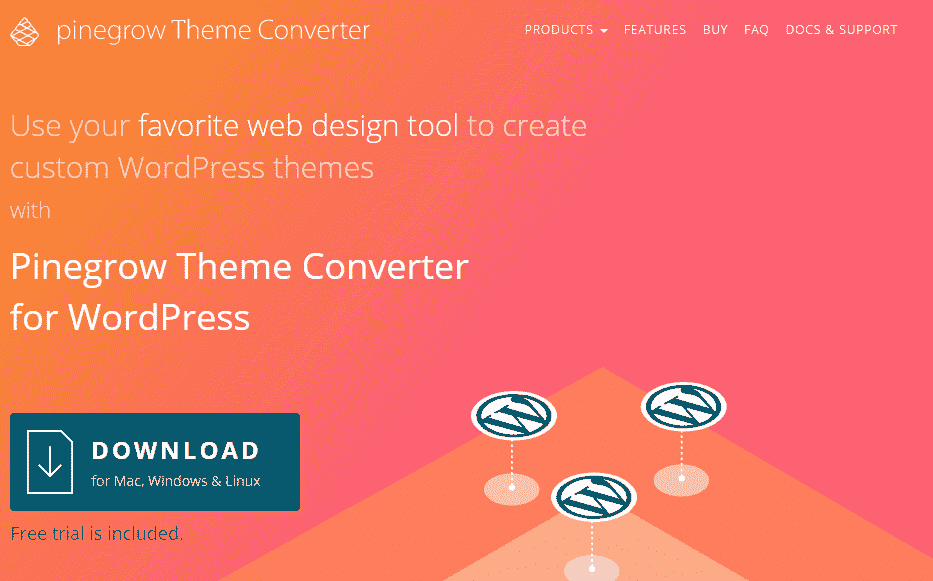

Pinegrow Theme Converter


一旦你决定了想要的操作并保存了文件，Pinegrow 有一个选项可以将项目导出到标准的 WordPress [PHP](https://kinsta.com/knowledgebase/what-is-php/) 文件中，这些文件可以上传到一个常规的 WordPress 安装中，在现实生活中进行测试。此外，内容导入系统确保您成功传输图像和视频等媒体元素。

我们尤其喜欢让你回到 Pinegrow 进行编辑的功能。你所要做的就是点击更新按钮，将新的版本发送到你的 WordPress 主题中，而不需要任何高级的编码更改或调整 WordPress 中的网站。

这不是一个插件。事实上，没有任何 WordPress 插件被用于将 HTML 文件转换成 WordPress 主题。Pinegrow 有 Mac、Windows 和 Linux 版本可供下载。从漂亮的可视化编辑器到即时更新功能，Pinegro 软件看起来是将一个完整的 HTML 网站转换成 WordPress 主题的最佳选择之一。

### 吉基尔博士

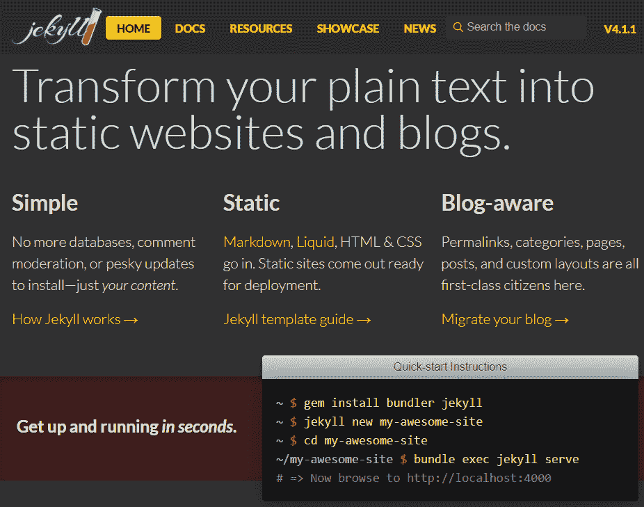

Jekyll


Jekyll 是一个免费的 HTML 到 WordPress 的转换器，它的功能是将纯文本文件转换成真正的网站。该项目托管在 [GitHub](https://kinsta.com/knowledgebase/what-is-github/) 上，可以免费下载。它提供了减少对数据库和评论审核的需求的机会，而不是专注于传输内容和用 HTML、CSS 和 markdown 传输/转换文件。

Jekyll 的一个有趣之处在于，它迎合了面向博客的 HTML 设计，为页面、帖子和[永久链接](https://kinsta.com/blog/wordpress-permalinks/)编译内容设置，以迁移您的博客，并保留或创建自定义布局和类别以及大量其他项目。

您可以在 macOS、Ubuntu、Windows 甚至其他 Linux 操作系统上安装 Jekyll 转换器。总而言之，Jekyll 是一个志愿者项目，提供各种资源，如主题、插件和指南，以测试您的知识并帮助您将 HTML 设计变成特别的东西。

我们特别喜欢与 MemberSpace 等电子商务工具和 Getform 等表单应用程序的集成。整合的清单很长，但这是一个真实的证明，在将 HTML 转换成 WordPress 后，你的网站有多大的潜力。

### 主题匹配器

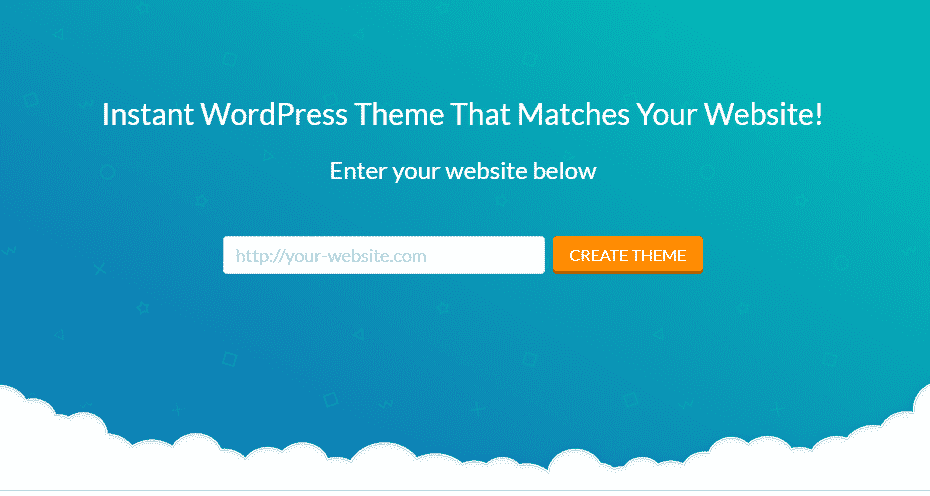

Theme Matcher converter for HTML to WordPress


[主题匹配器](https://www.themematcher.com/)与其说是 HTML 文件转换器，不如说是第三方网站 HTML 文件的提取器。在你粘贴来自你的[个人网站](https://kinsta.com/blog/portfolio-website/)或你不拥有的 HTML 网站的 URL 后，它会生成成熟的 WordPress 主题。

这种类型的转换器和主题生成器背后的想法是要么把你自己的 HTML 网站变成一个完整的 WordPress 网站，要么基于你在网上其他地方注意到的设计制作一个主题。

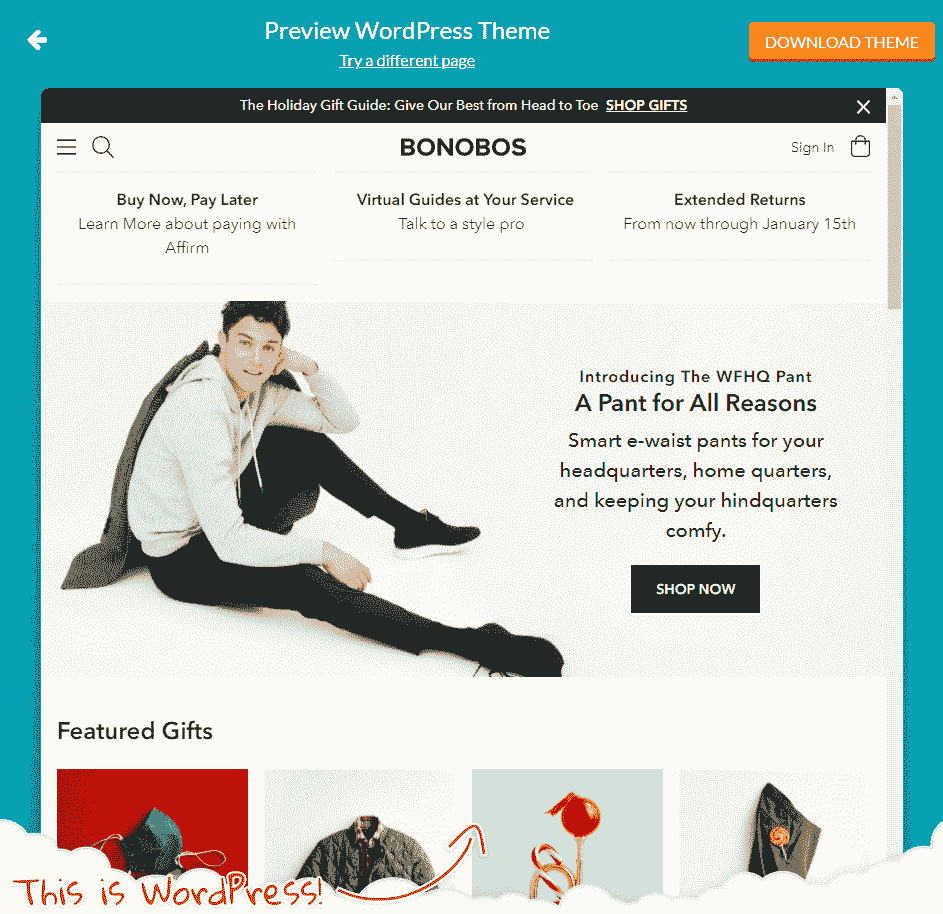

Preview of Theme Matcher


例如，您可以导航到您最喜欢的在线商店，并决定以该格式和结构开始您的设计。主题匹配器为你的站点生成了一个全新的主题，由于版权问题，它显然需要改变，但是它是一个很好的开始。

这个过程的工作原理是将一个站点 URL 复制并粘贴到主题匹配器字段中。请它为你创建一个主题，并选择网站的布局转换成 WordPress 的内容。大部分 HTML 到 WordPress 的转换在后台进行，识别这些 WordPress 内容区域以使其尽可能接近真实的 WordPress 主题是很重要的。最后，你可以下载主题并上传到你的 WordPress [CMS](https://kinsta.com/knowledgebase/content-management-system/) 。

如果你的 HTML 站点不是实时的，并且你不能粘贴一个 URL，主题匹配器提供了一种方法来上传你的 HTML 页面的 zip 文件，然后完成同样的过程。

### 导入博客

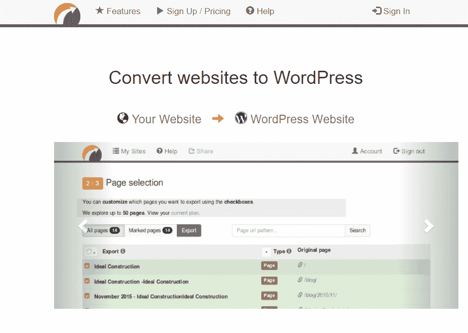

ImportIntoBlog.com HTML to WordPress Converter


[Import Into Blog](https://importintoblog.com/) 网站是一个在线应用程序，它从你的实时网站获取 HTML 和其他文件，将其转换为 WordPress 网站。有几个选项是可用的，比如创建一个可下载的 [XML 文件来导入](https://kinsta.com/knowledgebase/wordpress-import-issues/)到你的 WordPress 站点。你也可以考虑下载最终的结果作为 WordPress 主题，上传到 WordPress，看看完成的网站。

使用 ImportIntoBlog 工具可以实现自动站点恢复。更不用说，所有的[内部链接](https://kinsta.com/blog/wordpress-seo/#16-create-an-internal-linking-strategy)都被重写，这样它们就能进入你新网站的正确页面。绝大多数网站内容是自动发现的，您可以在导出之前自定义主题的外观和样式。一般来说，该工具最适合静态 HTML 文件或 URL。它管理 CSS 文件和 Javascript，并允许你找出网站背后的完整故事，并使其正常运行。

### HTML 到 WordPress 转换器

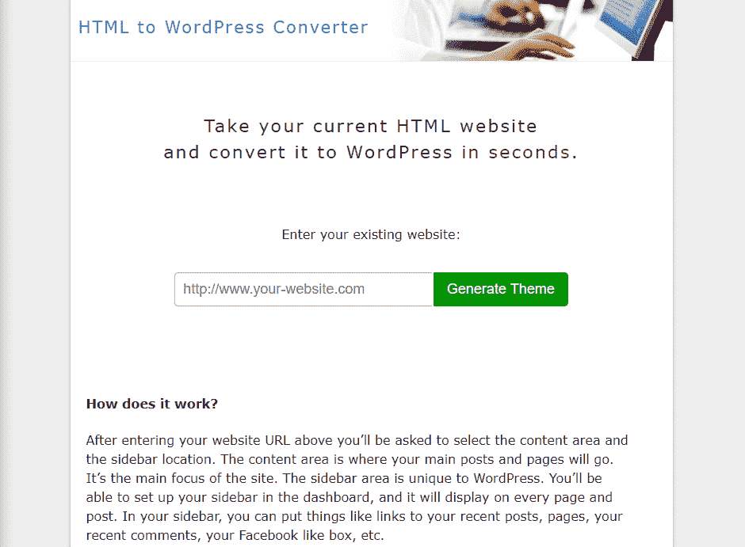

HTML to WordPress converter app


HTML 到 WordPress 转换器是另一个解决方案，它将 HTML 网站转换成 WordPress 主题。

有一个字段可以粘贴到一个网站的网址，然后点击一个生成主题按钮。你为 WordPress 选择内容和侧边栏区域，这样你的页面和文章就会出现在正确的位置，而且你会从之前的 HTML 网站中提取准确的必要数据。似乎您的所有内容都应该完成传输。然而，你可能必须仔细检查你的照片和其他媒体元素，并通过 WordPress 完成偶尔的上传。

这产生了一个主题，而不是一个完整的网站。你需要激活你自己的 WordPress 网站，并在其他地方托管它。你从这个工具下载主题，这个主题看起来和以前的 HTML 网站一模一样。请记住，有些元素不会像最初那样工作，但是从我们的测试来看，它很好地维护了网站的结构和格式。

显然，HTML 到 WordPress 转换工具的开发者也提供免费的 [CSS 调整](https://kinsta.com/blog/wordpress-css/),如果事情没有按照你想要的方式发展。

### PHP 简单 HTML DOM 解析器


PHP Simple HTML DOM Parser tool


PHP 简单 HTML DOM 解析器在上传 HTML 文件到 WordPress 时完成一个必要的过程。解析器作为定位、提取和更改网站或 HTML 文件中任何 HTML 元素的一种方式介入。这样，你可以识别[错误](https://kinsta.com/blog/wordpress-errors/)，在将它们转换到 WordPress 网站之前修复它们，或者甚至使用该工具修改当前 WordPress 网站上存在的 HTML 项目。

这是从 SourceForge 网站上免费下载的，所以你可以查看评论，并在必要时寻求支持。

### 雇用开发人员

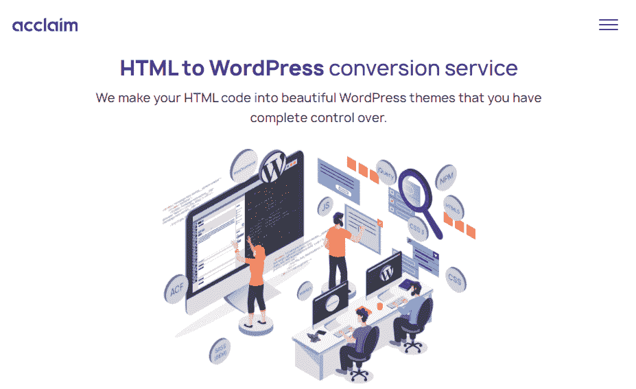

Acclaim HTML to WordPress conversion service


[WP 极客](https://www.hirewpgeeks.com/)、 [WP 在线支持](https://www.wponlinesupport.com/migrate-html-to-wordpress/)和[喝彩](https://acclaim.agency/html-to-wordpress-conversion-service)为那些不想自己完成转换或者上面的自动化工具不能产生可靠结果的人提供价格合理的 HTML 到 WordPress 转换服务。雇用一名开发人员有时非常有意义的原因是，你可以在这个过程中节省时间和金钱，特别是如果这是一项简单的工作，你根本没有知识去完成。

与一个真正的开发者合作意味着你不需要利用任何你自己的技术技能——或者缺乏技术技能——来从 HTML 文件渲染一个新的网站。这项工作被委派给知道自己在做什么的人，与可能有一些开发人员可以帮助你的 web 应用程序相比，你更有可能找到正确的帮助，提出问题和请求。

更不用说，这允许你请求在新网站上保留哪个功能。这几乎可以保证网站的动作会像它们应该的那样传递和运行。

我们知道雇佣一个 HTML 到 WordPress 开发者并不总是在预算之内，但是如果你遇到了麻烦并且你有一点现金可以花的话，这是值得考虑的。

## 如何用自动化应用或插件将 HTML 转换成 WordPress

如果你对使用前面列出的自动 HTML 到 WordPress 转换器有疑问，这里有一个关于 [WP 网站导入器](https://www.wpsiteimporter.com/)的例子。这是一个比较著名的解决方案，它是一个第三方 WordPress 插件，汇集了其他自动 HTML 到 WordPress 转换器的许多功能。

首先，下载、安装并激活 WP 网站导入插件到你的 WordPress 仪表盘。您必须从开发人员的网站下载 zip 文件，并注册免费试用。还有保费计划可以考虑。如果你有任何关于安装 WordPress 插件的问题，点击这里。

WP 网站导入器插件提供了一系列用于单个页面和帖子的导入工具，以及完整的网站和完成工作所需的附加元素，如图像本地化和内部链接修改。

在这个例子中，我们将从一个 HTML 页面开始，浏览大部分特性。在 WordPress 仪表盘中，进入**网站导入器>导入单页**。

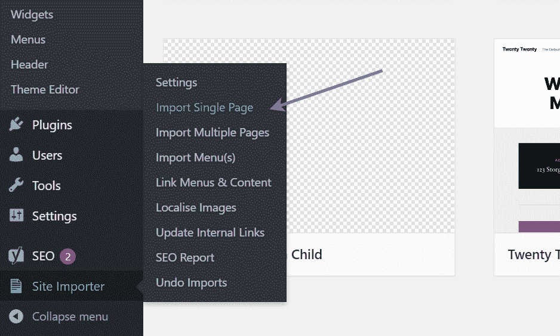

Importing single HTML to a WordPress page


插件中绝大多数的默认设置都是现成的，这意味着你通常不需要做任何改变。当然，除非你想做一些调整，比如导入一个页面作为帖子，或者删除一些特色图片。随意滚动所有插件设置，以确保它们符合您的需求。

对于单页导入，你所要做的就是粘贴插件要扫描的 URL。

**注意:**文件上传仅适用于多页转换。


The import page wizard


点击**导入页面**按钮继续。

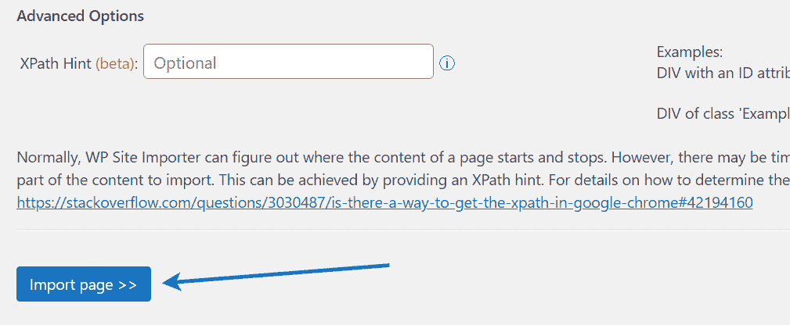

Click the “Import page” button


这个插件告诉你什么是成功的，并提供几个链接来预览新的 WordPress 页面，如果需要的话可以编辑它们。

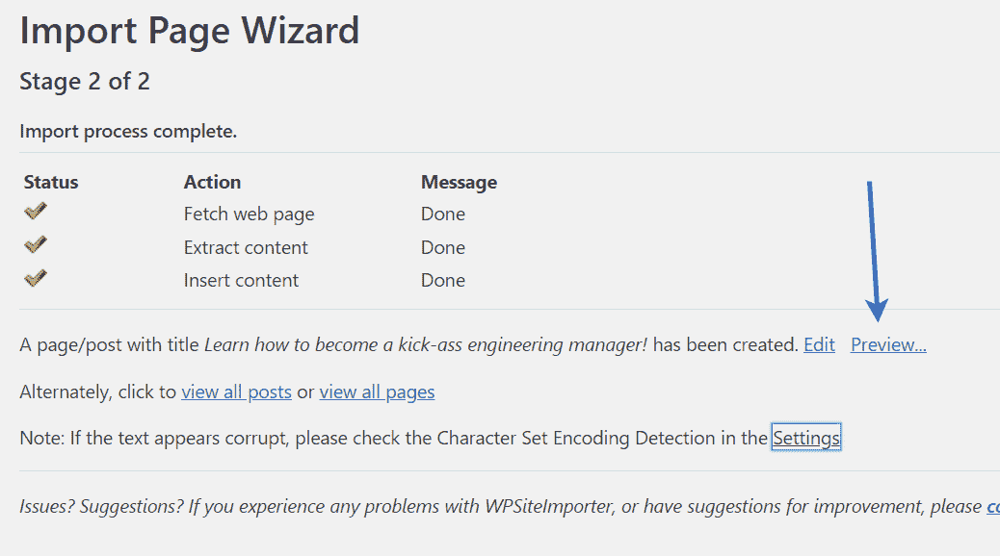

Click the ‘Preview’ link


您还会想转移静态 HTML 网站上的任何菜单。

前往**站点导入器>导入菜单**进行导入。

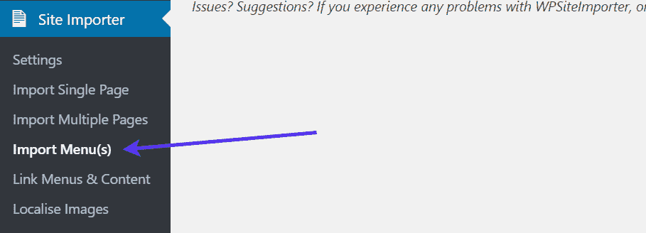

Importing Menus into WordPress


导入菜单类似于文件转换，因为它需要 URL。您还可以设置菜单密度和最小菜单大小等元素。

点击**识别菜单**继续。

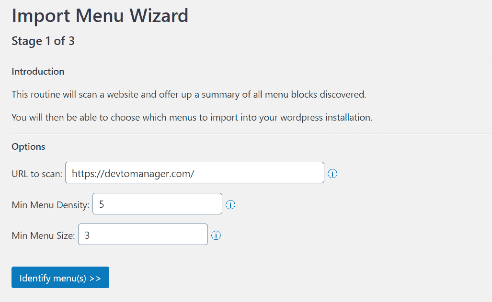

The ‘Import Menu Wizard’ panel


每个菜单项现在都出现在列表中。如果你的 HTML 站点上有不止一个菜单，你也应该看到多个菜单。

检查您想要导入的菜单，并为每个菜单命名。点击**导入菜单**按钮。

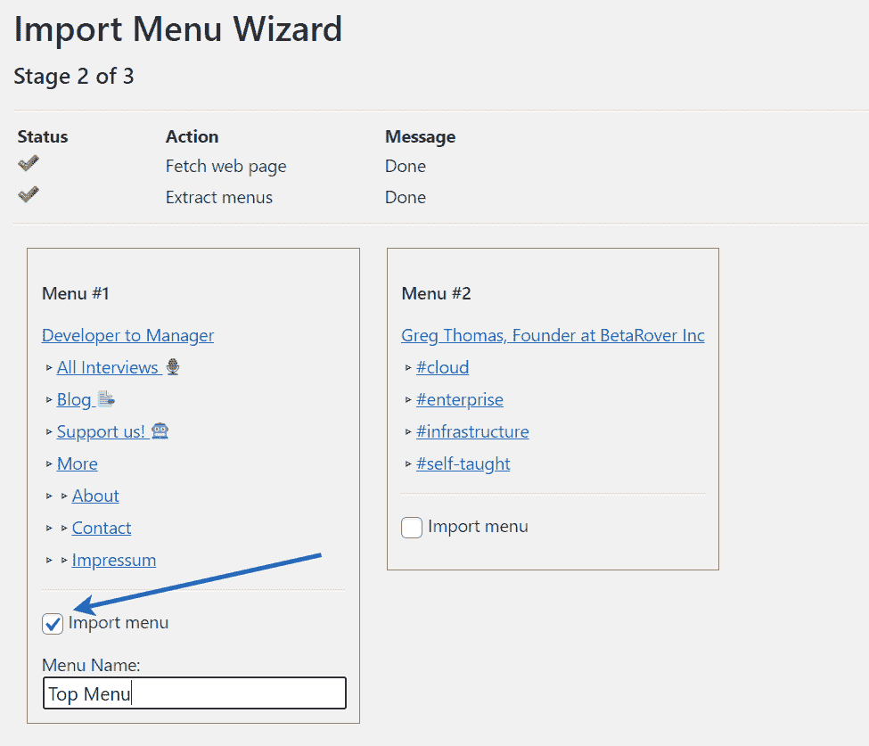

Importing a menu


有了 WordPress 菜单导入，你仍然需要配置菜单位置。

在仪表板中，导航至**外观>菜单**。

命名并创建一个菜单，然后保存到 WordPress。如果一切按计划进行，您应该已经看到导入的菜单了。

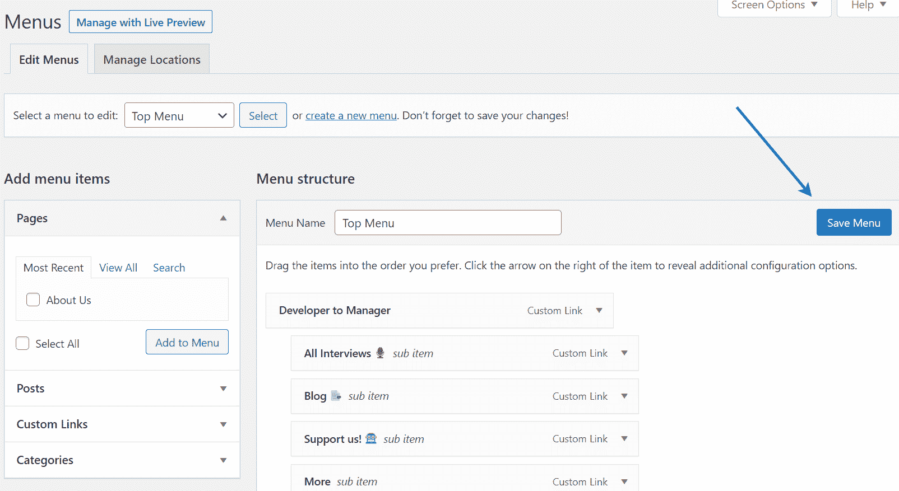

Save the imported menu


点击**管理位置**选项卡，在下拉菜单中找到导入的菜单。您应该将新菜单放在您选择的菜单位置。

完成后，请务必**保存更改**。

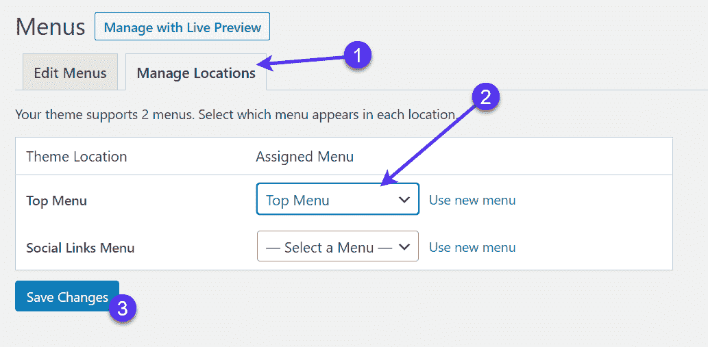

Change the menu location if needed


将 HTML 站点导入 WordPress 的另一部分是本地化图像。要完成这个过程，请转到**网站导入器>本地化图像**。

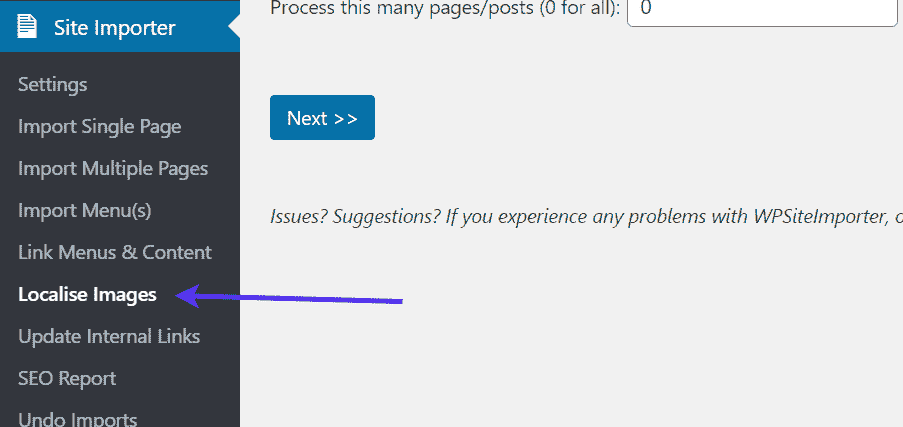

Localize images for HTML to WordPress conversion


图像定位的所有默认设置通常都可以使用。

点击**下一个**按钮。

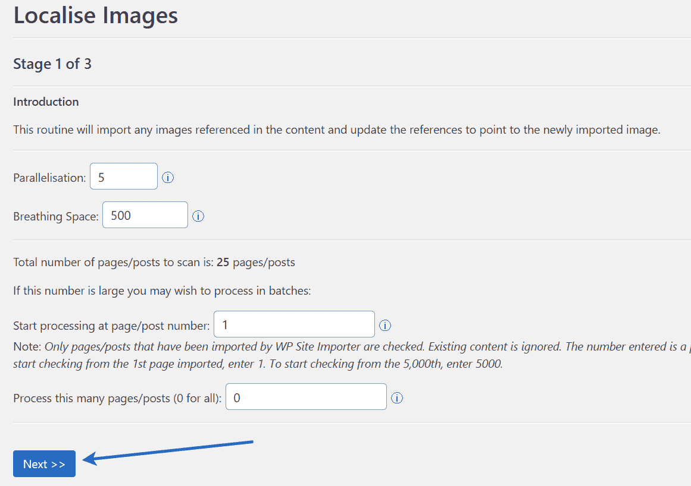

Hit the ‘Next’ button to get started


您将看到一个从以前的网站传输过来的图像列表。

选择您想要本地化的并点击**下一个**按钮。

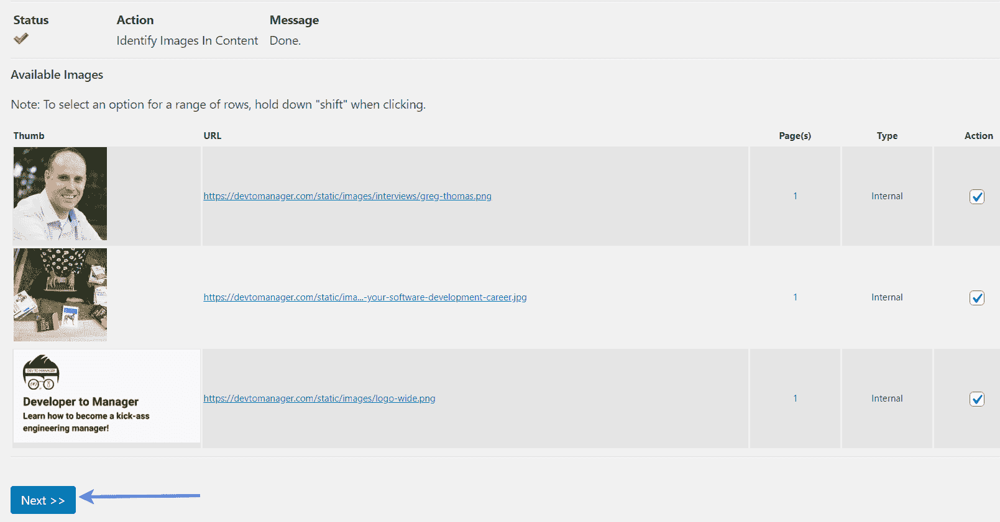

See all the imported images


几秒钟之内，插件将每张图片添加到你的 WordPress 媒体库，给它们新网站上的所有 URL。您可以转到媒体库来确保发生了这种转换。

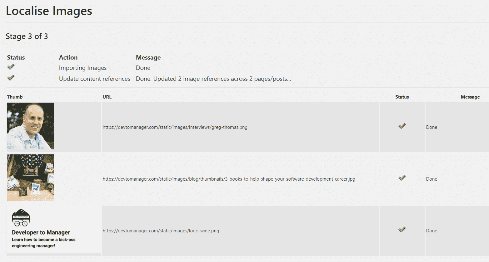

The final product of localized images


HTML 转换的另一部分包括更新你的内部链接。所有网站转移通常会导致链接中断和 URL 结构问题。

我们需要解决这些问题，所以请到**网站进口商>更新内部链接**开始。

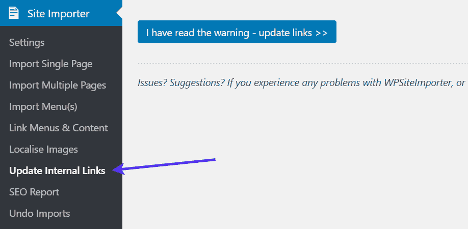

Update internal links thoroughly


下一页解释了旧的链接将如何被新的网站域名所取代，在 WordPress 网站的 URL 上添加子目录以获得流畅的用户体验。

你所要做的就是点击按钮来更新链接。插件为你做所有的转换。

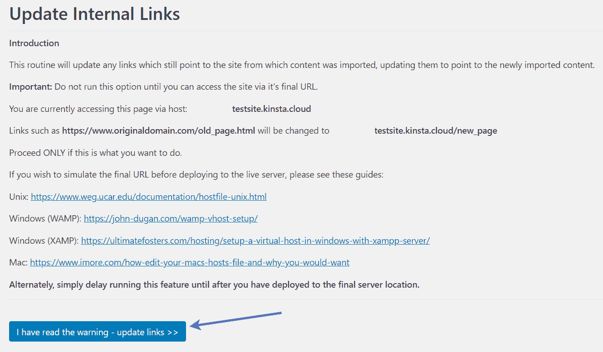

Click the ‘Update Links’ button


如果您计划转换整个 HTML 网站(而不是一个页面)，请导航到**站点导入器**菜单下的**导入多个页面**选项卡。

对于那些对上传本地网站文件感兴趣的人来说，这也是一个很好的选择，而不是复制一个活动的 URL。

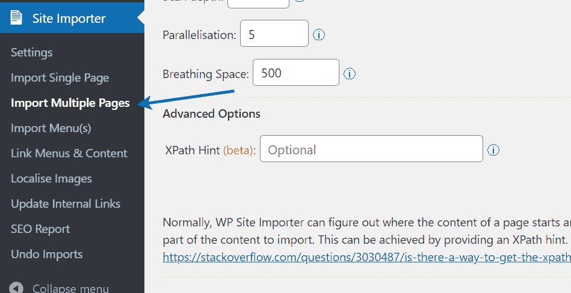

Import multiple pages at once


**多页面向导**具有粘贴 URL 和上传网站 HTML 文件的字段。

选择最适合你工作的。


Enter the URL to scan for import


当 HTML 站点被转换和导入时，你会看到一个 URL 列表被拉进你的 WordPress 网站。如果您不需要某些页面，可以将其从导入中移除。您还可以选择导入帖子，将帖子设置为未发布，以及包含特色图片。

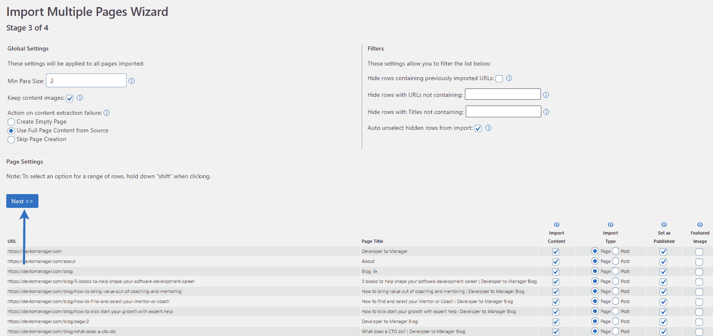

The ‘Import Multiple Pages Wizard’


最后一步显示了从 HTML 站点转换到 WordPress 系统的网页的完整列表。你现在可以点击每个页面的**编辑**或**预览**按钮继续定制你的网站。

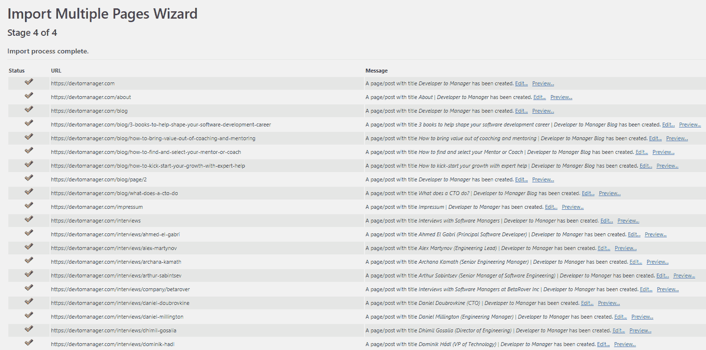

All the pages imported and ready


请记住，像这样的转换并不意味着您会立即从您的 HTML 网站上看到确切的设计。您可能需要导入一个样式表，甚至自己对网站或页面进行自定义编码。

无论你有一个旧的 HTML 网站并在 WordPress CMS ✅上运行，还是需要一个存储或共享 HTML 文件的地方，WordPress 都是✅的完美解决方案，本指南将教你如何轻松地从 HTML 过渡到👉 点击推文

## 摘要

从 HTML 迁移到 WordPress 需要做一些工作。但挑战是值得的。HTML 到 WordPress 的上传也可以帮助不太复杂的任务，比如[验证你的网站所有权](https://kinsta.com/blog/google-site-verification/)或者实现一个[简单的 HTML 模块](https://kinsta.com/knowledgebase/edit-wordpress-code/)。

当涉及到 HTML 文件上传和转换的时候，有很多可能性。请记住，您通常可以使用自动化的 HTML 转换器来完成大部分工作。在那之后，很有可能会涉及到手工工作，但是结合正确的工具和[知识](https://kinsta.com/learn/)，你可以复制几乎任何你想要的 HTML 网站！

如果你有任何关于上传 HTML 文件到 WordPress 或者转换 HTML 到 WordPress 网站的问题，请在下面的评论区告诉我们。

* * *

让你所有的[应用程序](https://kinsta.com/application-hosting/)、[数据库](https://kinsta.com/database-hosting/)和 [WordPress 网站](https://kinsta.com/wordpress-hosting/)在线并在一个屋檐下。我们功能丰富的高性能云平台包括:

*   在 MyKinsta 仪表盘中轻松设置和管理
*   24/7 专家支持
*   最好的谷歌云平台硬件和网络，由 Kubernetes 提供最大的可扩展性
*   面向速度和安全性的企业级 Cloudflare 集成
*   全球受众覆盖全球多达 35 个数据中心和 275 多个 pop

在第一个月使用托管的[应用程序或托管](https://kinsta.com/application-hosting/)的[数据库，您可以享受 20 美元的优惠，亲自测试一下。探索我们的](https://kinsta.com/database-hosting/)[计划](https://kinsta.com/plans/)或[与销售人员交谈](https://kinsta.com/contact-us/)以找到最适合您的方式。